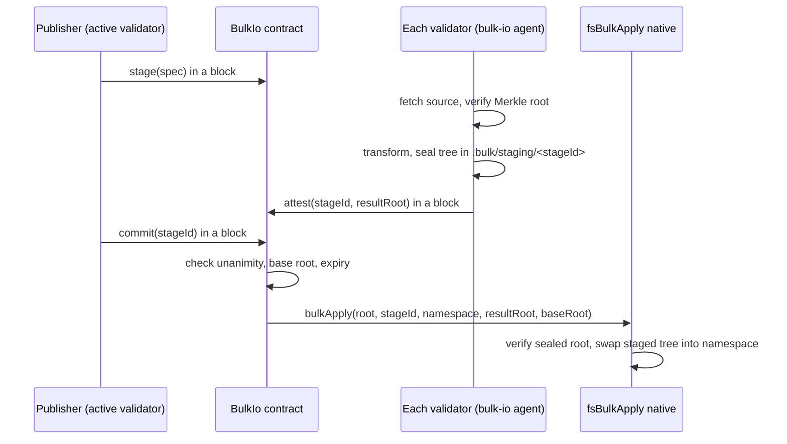

# Bulk import and export

This document specifies the bulk import and export feature of the F1R3Node shard.
The feature moves a large external dataset into the consensus filesystem as one committed tree.
The feature also exports a committed tree with a proof that a consumer can verify.

The design document "Bulk import and export for the F1R3Node shard" (October 10, 2026) gives the motivation.
This document describes the implementation in this repository.

## Components

| Component | Location | Function |
|-----------|----------|----------|
| Result tree | `rholang/src/rust/interpreter/io/bulk.rs` | Defines the tree manifest, the result root, and the atomic swap. The node and the agent use the same code. |
| Commit native | `rholang/src/rust/interpreter/io/handlers/mutation/fs_bulk_apply.rs` | Swaps a staged tree into its namespace. Records one `WalOp::BulkApply` entry. |
| WAL operation | `rholang/src/rust/interpreter/io/wal.rs`, `snapshot.rs`, `wal_applier.rs` | Adds `WalOp::BulkApply` (discriminant 16, wire tag 17) and the joiner-side apply step. |
| Coordinator | `casper/src/main/resources/BulkIo.rho` | Records stages, collects attestations, and calls the commit native. |
| Genesis wiring | `casper/src/rust/genesis/contracts/fs_genesis.rs` | Composes `BulkIo` into FsGenesis and publishes it in the versioned registry. |
| Agent | `bulk-io/` | Fetches and verifies sources, transforms, stages, exports, verifies, and generates deploys. |

## Protocol



The slow work runs outside consensus. Only the stage, attest, and commit calls are deploys.

## Conservative decisions

The design document listed open questions. This implementation uses these answers.

1. **Commit quorum.** Every active bonded validator must attest the same result root. Any recorded attestation that names a different root blocks the commit.
2. **Reason for unanimity.** The commit native is a verifying handler. A follower that cannot reproduce the swap produces a divergence reply, so its post-state differs and it rejects the block. Unanimity prevents this case for the current validator set.
3. **Transform trust.** Each validator runs the transform. Validators exchange only source bytes, which they verify by hash.
4. **Transformer language.** Transformers are built in. The only transformer is `tabular/1`. Its identity hash includes the crate version, so validators that run different versions produce different roots and cannot commit.
5. **Adapters.** The adapters are `csv/1` and `jsonl/1`.
6. **Who can call.** Only an active validator can stage, attest, commit, or abort. Any deployer can call `status`, `root`, and `expire`.
7. **Expiry.** A stage lapses after at most 1,000 blocks (`BULK_MAX_STAGE_BLOCKS`). There is no deposit.
8. **Concurrency.** A namespace can have one pending stage. The commit requires that the namespace root is equal to the root recorded at staging.
9. **Write access.** The import root must be a consensus directory bundle entry named `bulk-import` with mode `r`. Ordinary deploys can read it but cannot write it. If the entry is missing or not read-only, the contract refuses all stages.
10. **Shards.** One stage targets one shard.
11. **History.** The tree holds the current state of the dataset. A delta applies upserts and deletes by key and produces a complete new tree.
12. **Joining validators.** A joining validator runs `bulk-io prepare --expect-root` to build the staged tree before it applies the WAL. The WAL entry carries only the result root.
13. **Upgrade.** The new WAL operation changes `WAL_OP_VARIANTS` to 17 and `SNAPSHOT_FORMAT_VERSION` to 7. The consensus fingerprint changes. All validators must upgrade together.

## Result tree format

A result tree is a directory with these files.

| Path | Content |
|------|---------|
| `data/<aa>/<bb>/part-NNNNN.rec` | Record files. `aa` and `bb` are the first hex characters of the Blake2b-256 hash of the record key. |
| `data/<aa>/<bb>/INDEX` | One line for each record file: file name, record count, first key, last key. |
| `SCHEMA` | The import manifest without source details. |
| `REJECTS` | One line for each rejected source row: line number and reason. |
| `PROVENANCE` | Stage identifier, source root, manifest hash, adapter, transformer, base root, and counts. |
| `BULK.manifest` | One line for each file: Blake2b-256 hash, length, relative path, sorted by path. |
| `BULK.root` | The result root in hex. |

The result root is a binary Merkle root over entry hashes, built with the same construction as WAL snapshots. Each entry hash covers the path, the length, and the file hash.

A record file starts with the bytes `F1BK` and version byte `1`. Each record is a length-prefixed key and a length-prefixed record. Records in a file are in key order. Values have canonical encodings. The agent rejects non-canonical integers and decimals and does not repair them.

## Import manifest

```jsonc
{
  "version": 1,
  "namespace": "demo/people",
  "source": {
    "format": "csv",                     // csv or jsonl
    "locations": ["https://example.com/people.csv", "file:///data/people.csv"],
    "root": "<64 hex characters>",       // bulk-io source-root <file>
    "delimiter": ","
  },
  "transform": "tabular/1",
  "key": ["id"],
  "fields": [
    {"name": "id", "type": "int", "required": true},
    {"name": "name", "type": "string"},
    {"name": "email", "type": "string", "route": "oracular"},
    {"name": "notes", "type": "string", "route": "drop"}
  ],
  "layout": {"fanout": 2, "maxFileBytes": 16777216},
  "delta": false
}
```

Field types are `string`, `int`, `decimal`, `bool`, and `bytes` (lowercase hex). Routes are `consensus` (default), `oracular`, and `drop`. Key fields must be required and routed to consensus. A delta source has an extra `_op` column with the value `upsert` or `delete`.

Oracular fields never enter the consensus tree. The agent writes them under `--oracular-dir`, outside consensus.

## Operator procedure

Each procedure assumes that the `bulk-import` bundle entry is provisioned.

### Import a dataset

1. Compute the source root: `bulk-io source-root people.csv`.
2. Write the manifest with that root.
3. Run a dry run: `bulk-io prepare --manifest m.json --import-root <root> --source people.csv --dry-run`.
4. Generate the stage deploy: `bulk-io deploy stage --manifest m.json`.
5. Sign and submit the stage deploy with a validator key.
6. On each validator, run `bulk-io prepare --manifest m.json --import-root <root>`.
7. On each validator, generate the attest deploy: `bulk-io deploy attest --stage-id <id> --result-root <root>`.
8. Sign and submit each attest deploy with that validator key.
9. Generate and submit the commit deploy: `bulk-io deploy commit --stage-id <id>`.
10. Reconcile: `bulk-io reconcile --tree <root>/<namespace> --manifest m.json --source people.csv`.

### Apply a delta

1. Write a manifest with `"delta": true` and the new source root.
2. Generate the stage deploy with the current root: `bulk-io deploy stage --manifest d.json --base-root <current root>`.
3. Continue from step 5 of the import procedure.

### Export a namespace

1. Export: `bulk-io export --tree <root>/<namespace> --out <dir> --format csv --block-hash <hash>`.
2. Give the output directory to the consumer.
3. The consumer runs `bulk-io verify-export <dir> --expect-root <committed root>`.

The export directory holds a copy of the tree, the rendered data, and `EXPORT.json`. The verifier checks the tree against the root and renders the data again to check the data file.

## Limitations

These limitations apply to this version.

- **Bundle provisioning.** On the `dev` branch, production genesis passes an empty filesystem bundle (`approve_block_protocol.rs`, `TODO(fs-bundle-threading)`). Until that work lands, a production node cannot provision `bulk-import`, and `BulkIo` refuses all stages. The genesis tests provision the bundle directly.
- **Memory.** The `tabular/1` transformer holds the complete dataset in memory. A planet-scale import needs an external sort. That is the next work item for OpenStreetMap.
- **Source shape.** A source is one file.
- **Indices.** The only index is the primary key index (`INDEX` files). Declared secondary indices are not implemented.
- **Cost.** A stage has no deposit and no size-based price. The commit pays the ordinary path-mutation cost.
- **Joining validators.** The joiner must run `bulk-io prepare --expect-root` before WAL apply. The payload sync does not fetch bulk trees.
- **Speculative execution.** The commit native moves directories on disk, like `fs_rename`. A block that executes and is later orphaned leaves the swap in place. This is the same behavior as the other consensus file mutations. It needs a joint review.
- **Retired trees.** A delta commit moves the previous tree to `.bulk/retired/<stageId>`. The operator removes retired trees.
- **Spatial transforms.** Spatial transforms, such as geohash partitions for OpenStreetMap, are not in `tabular/1`.

## Tests

| Command | Scope |
|---------|-------|
| `cargo test -p rholang --lib -- interpreter::io::bulk interpreter::io::handlers::mutation::fs_bulk_apply` | Result tree, swap, and handler argument checks. |
| `cargo test -p rholang --lib -- interpreter::io` | All file I/O unit tests, including the changed consensus pins. |
| `cargo test -p casper --lib -- genesis::contracts::fs_genesis` | Genesis composition and golden hashes. |
| `cargo test -p casper --test mod -- genesis::contracts::bulk_io_spec` | Contract lifecycle in a real genesis: stage, attest, commit, conflict, and disabled root. |
| `cargo test -p bulk-io` | Manifest, adapters, values, transform, staging, export, reconciliation, and deploy generation. |
