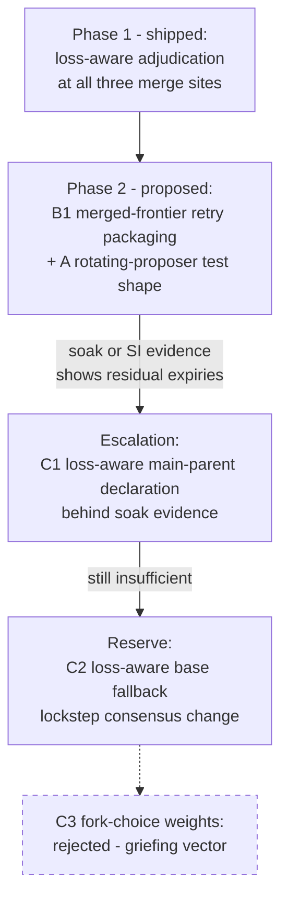

# Casper Consensus Philosophy

**Status:** Draft — pending maintainer ratification
**Started:** 2026-08-20, from the issue [#294](https://github.com/F1R3FLY-io/f1r3node-rust/issues/294) remediation analysis
**Related:** [Consensus Protocol](./CONSENSUS_PROTOCOL.md), [Fork-Choice dossier](../theory/fork-choice/fork-choice-specification.md), [Glossary](../Glossary.md)

## 1. Purpose and scope

This document records the design philosophy of the Casper consensus implementation. It captures the principles behind consensus decisions, not the mechanics. The protocol documents in this directory describe the mechanics.

The f1r3node-rust platform is designed to be consensus and state-machine-replication neutral. The Casper consensus code will later move to an independent repository. This document belongs to the Casper consensus and moves with it.

Each section below grows from a concrete engineering decision. The first entry comes from the deploy-starvation remediation (issue #294).

## 2. Case study: same-key contention starvation (issue #294)

Three concurrent deploys performed delete-and-set on one contract key. One deploy never landed. Every merge rejected it, recovery re-proposed it faithfully, and its validity window closed. The deploy terminated `Expired` with no error surfaced, while consensus stayed healthy.

The investigation found two distinct starvation facets:

1. **Content-deterministic adjudication.** Conflict adjudication ordered contenders by content alone: total cost, then maximum single-deploy cost, then lexicographic signature. A deploy's content never changes. The same matchup therefore produced the same loser in every merge, forever.
2. **Main-parent base bias.** The merge bases on the proposing validator's main parent. When the base already commits a contender's effect, the starved deploy's chain is stale against that base. Rejecting a stale chain is correct for each merge. A proposer that always bases on the contender's side therefore starves the retry structurally, with every individual rejection being sound.

The first facet was fixed by loss-aware adjudication (Section 4, Principle P1). The second facet is the subject of the remedy ladder in Section 5.

## 3. The core principle: local safety can compose into global starvation

Every individual merge decision in the starvation case was safety-correct. Re-applying a stale diff would corrupt state, so the rejection was mandatory. The liveness failure emerged only from the composition of individually-correct decisions.

This is the classical safety-versus-liveness tension from distributed-computing theory, not a CAP-style impossibility. No theorem forbids deterministic deploy-level fairness together with safe consensus. The constraints are engineering risk gradients, not hard walls. Remedies can therefore be layered incrementally, with stronger fairness bought at each step for bounded and observable risk.

One near-impossibility does appear at the extreme. The fork-choice rule cannot be made responsive to user-controllable deploy data without creating an influence channel over consensus (Principle P4).

## 4. Ground truths of the implementation

Four facts about the implementation shape every remedy. Function names are the stable anchors, since line numbers drift.

1. **Validators replay declared parents, not fork choice.** `Validate::parents` checks the parent count, the parent-depth spread, and validator progress. It never recomputes the estimator. Main-parent order is bound only indirectly, through the recomputed merge base (`state_facts` equality) and the bonds read from `parents[0]`. Parent selection, including the main-parent choice, is proposer policy.
2. **Deploy packaging is discretionary.** No validation rule constrains which deploys a proposer packages. `PrematureDeployRetry` is a lower bound on retry timing. Deferring a deploy further is always peer-safe.
3. **The merge base has a deterministic fallback rule.** The base is the main parent. When the main parent's state does not hold the floor's settled content, the base falls back to the floor (`compute_parents_post_state`). Validators recompute the choice from the block's own justifications.
4. **Per-scope inclusion leadership exists.** `deploy_inclusion_progress` elects a deterministic leader with a lease-based liveness escape. It is proposer-side only. The recovery path deliberately dropped leader election in favor of owner-scoped buffers plus the floor-paced retry gate.

## 5. The remedy ladder for base-bias starvation

The options are ordered by guarantee strength and by risk. The axes are: fairness strength, consensus-layer stability, and coordination cost (node-local policy versus lockstep upgrade).

### Option A — proposer rotation as the liveness mechanism

Accept that fork choice's tie-break (stake score, then ascending block hash) makes the base side effectively a coin flip per round. Over rounds, the starved deploy's carrier becomes the base and the deploy lands.

- **Pros:** no code change. No new risk surface.
- **Cons:** liveness becomes probabilistic. The retry gate paces re-proposals on floor settlement, so a deploy gets roughly two to three attempts inside its 50-block window. The observed failure had exactly two rejections. A coin flip per attempt leaves an expiry probability far too high for a liveness claim.
- **Verdict:** necessary as the test-evidence component. Insufficient alone.

### Option B1 — merged-frontier retry packaging (recommended next step)

The owner packages a gated retry only when its own tip already merges every same-key contender it can see. The retry then executes fresh and sequentially on top of the settled contention, instead of racing as a sibling. When an unseen contender still races in, loss-aware adjudication covers the adjudicable subset.

- **Pros:** node-local. No consensus change, no wire change, no upgrade coordination. Small diff in `prepare_user_deploys_with_policy`. Peer-safe by Ground Truth 2.
- **Cons:** heuristic, not a guarantee. Under saturated contention the quiet frontier never arrives. Deferral spends validity window to buy success probability. It does not influence merges that other validators build.

### Option B2 — per-key contender serialization

Extend the inclusion-leadership machinery to serialize same-key contenders through a deterministic leader per contended key.

- **Pros:** deterministic ordering of contenders. Proposer-side only, so peer-safe.
- **Cons:** the touched keys are known only after execution, which complicates admission-time gating. It re-introduces the leader election that the recovery path deliberately removed. The burden of proof sits with this option: it must show that owner-scoping plus the retry gate does not already cover the case.

### Option C1 — loss-aware main-parent declaration (escalation candidate)

When a proposer's parent set contains a sibling that carries a strictly higher-priority retry chain, the proposer declares that sibling as `parents[0]`. The retry is then in the base and lands structurally.

- **Pros:** the strongest liveness effect available without a validation change. Ground Truth 1 makes it proposer policy: validators replay the declared parents and recompute the same merge. Deterministic, because the priority derives from on-chain records.
- **Cons:** the spine follows main parents. Fork-choice scores credit only the main-parent chain, and `prefer_certified_main_parent` exists to keep the spine on certified ground. Systematic deviation for fairness reasons risks finalization-health regressions. It also opens a mild griefing vector: cheap manufactured losses could steer other proposers' main-parent choice. This option must enter behind soak evidence.

### Option C2 — loss-aware base fallback (reserve)

Extend the existing base fallback rule: when a strictly higher-priority retry chain is in scope but stale against the main-parent base, base on the floor instead. The matchup then becomes adjudicable and loss-aware selection decides.

- **Pros:** a deterministic guarantee independent of who proposes. No fork-choice perturbation. The rule shape already exists (Ground Truth 3) and validators recompute it identically.
- **Cons:** a true consensus change: every node must upgrade in lockstep. Floor-based merges carry the scope size and cost that the base-on-main-parent migration removed. It re-opens the expensive path exactly in contended windows.

### Option C3 — loss-aware fork-choice weights (rejected)

Bias fork-choice scoring by starved-retry priority.

- **Verdict: rejected.** It couples safety-critical fork choice to user-controllable deploy content. An attacker could accumulate rejection records to buy fork-choice influence. It also invalidates the estimator's formal-verification analysis. The other options achieve the goal without this.

### Comparison

| Option | Fairness guarantee | Peer-rejection risk | Upgrade coordination | Finalization-health risk | Adversarial surface | Cost |
|---|---|---|---|---|---|---|
| A rotation + test | probabilistic, weak | none | none | none | none | trivial |
| B1 merged-frontier packaging | strong in practice | none | none | none | none | small |
| B2 per-key serialization | deterministic ordering | none | none | none | low | medium |
| C1 main-parent declaration | strong | none directly | none | medium | mild griefing | small–medium |
| C2 base fallback | deterministic | none if all upgrade | lockstep | low | low | large |
| C3 fork-choice weights | deterministic | — | lockstep | high | high | rejected |

### Decision ladder

## 6. Ratified principles

The following principles generalize from this case. Later consensus decisions should cite them or amend them.

- **P1 — Adjudication consults history, not only content.** A conflict tie-break that is a pure function of deploy content produces the same loser forever. Recorded prior losses outrank content order, so every loss raises the loser's priority and starvation is bounded.
- **P2 — Escapes derive from on-chain data only.** Any fairness or priority term must be a deterministic function of consensus data that every validator sees. A node-local escape forks the network (`PrematureDeployRetry`, `InvalidRejectedDeploy`).
- **P3 — Packaging discretion is the safe extension surface.** Proposers own deploy selection. Deferring inclusion is always peer-safe. Prefer node-local packaging policy before any validation-rule change.
- **P4 — Fork choice stays deploy-content-blind.** Coupling fork-choice weights to user-controllable data creates an influence channel over consensus. This boundary is treated as hard.
- **P5 — Climb the ladder on evidence.** Prefer the weakest remedy that the observed failure requires. Escalate to spine-affecting or lockstep changes only when soak or integration evidence shows the residual failure class.
- **P6 — Per-merge safety is non-negotiable.** A liveness remedy never licenses applying a stale diff. Fairness mechanisms reshape which matchups occur, never the correctness rules inside one.

## 7. Decision record

| Date | Decision | Status |
|---|---|---|
| 2026-08-20 | Phase 1: loss-aware adjudication at keep-one, rejection-option selection, and the unavailable-split claim order (commit `f6a00549d`) | Shipped, unit-proven |
| 2026-08-20 | Phase 2 direction (A/B/C ladder above) | Pending maintainer decision |

The phase-2 working record lives in the TDD plan
[`docs/tdd-plans/key-contention-starvation-2026-08-20T04-52-46Z.md`](../tdd-plans/key-contention-starvation-2026-08-20T04-52-46Z.md)
(blocked behavior B4). The end-to-end racing-shape test
`casper/tests/batch2/loss_priority_spec.rs` stays `#[ignore]`d until the
phase-2 decision lands.
