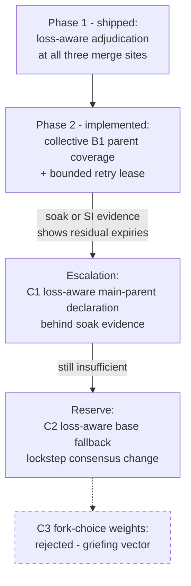

# Casper Consensus Philosophy

**Status:** Phase-1 policy ratified. The later remedy ladder remains evidence-gated.
**Started:** 2026-08-20, from the issue [#294](https://github.com/F1R3FLY-io/f1r3node-rust/issues/294) remediation analysis
**Related:** [Consensus Protocol](./CONSENSUS_PROTOCOL.md), [Fork-Choice dossier](./theory/fork-choice/fork-choice-specification.md), [Glossary](../Glossary.md)

## 1. Purpose and scope

This document records the design philosophy of the Casper consensus implementation. It records the principles behind consensus decisions. The protocol documents in this directory describe the mechanics.

The f1r3node-rust platform is designed to be neutral about consensus and state-machine replication. The Casper consensus code will later move to an independent repository. This document belongs to the Casper consensus and moves with it.

Each entry below comes from one concrete engineering decision. The first entry comes from the deploy-starvation remediation (issue #294).

## 2. Case study: same-key contention starvation (issue #294)

Three concurrent deploys performed delete-and-set on one contract key. One deploy never landed. Every merge rejected the deploy, and recovery re-proposed the deploy faithfully. The validity window closed, and the deploy terminated `Expired` with no error surfaced. Consensus stayed healthy through the full sequence.

The investigation found two distinct starvation facets:

1. **Content-deterministic adjudication.** Conflict adjudication ordered contenders by content alone: total cost, then maximum single-deploy cost, then lexicographic signature. The content of a deploy never changes. The same matchup therefore produced the same loser in every merge.
2. **Main-parent base bias.** The merge bases on the main parent of the proposing validator. When the base already commits the effect of a contender, the chain of the starved deploy is stale against that base. Each merge rejects a stale chain correctly. A proposer that always bases on the contender side therefore starves the retry structurally. Each individual rejection stays sound.

Loss-aware adjudication removed the first facet (Section 4, Principle P1). The remedy ladder in Section 5 addresses the second facet.

## 3. The core principle: local safety can compose into global starvation

Every individual merge decision in the starvation case was safety-correct. To re-apply a stale diff would corrupt state, so each rejection was mandatory. The liveness failure emerged only from the composition of individually-correct decisions.

This is the classical safety-versus-liveness tension from distributed-computing theory. It is not a CAP-style impossibility. No theorem forbids deterministic deploy-level fairness together with safe consensus. The constraints are risk gradients, not impossibility results. Remedies can therefore apply in layers. Each layer adds fairness at a bounded and observable risk.

One near-impossibility remains at the extreme. The fork-choice rule cannot respond to user-controllable deploy data without an influence channel over consensus (Principle P4).

## 4. Ground truths of the implementation

Four facts about the implementation shape every remedy. Function names are the stable anchors, because line numbers drift.

1. **Validators replay declared parents, not fork choice.** `Validate::parents` checks the parent count, the parent-depth spread, and validator progress. It never recomputes the estimator. Only indirect checks bind the main-parent order: the recomputed merge base (`state_facts` equality) and the bonds read from `parents[0]`. Parent selection, which includes the main-parent choice, is proposer policy.
2. **Deploy packaging is discretionary.** No validation rule constrains which deploys a proposer packages. `PrematureDeployRetry` is only a lower bound on retry timing. A proposer can always defer a deploy without risk of peer rejection.
3. **The merge base has a deterministic fallback rule.** The base is the main parent. When the state of the main parent does not hold the settled content of the floor, the base falls back to the floor (`compute_parents_post_state`). Validators recompute the choice from the recorded justifications of the block.
4. **Per-scope inclusion leadership exists.** `deploy_inclusion_progress` elects a deterministic leader with a lease-based liveness escape. The mechanism runs only on the proposer side. The recovery path deliberately dropped leader election in favor of owner-scoped buffers plus the floor-paced retry gate.

Protocol 6 adds one candidate-specific boundary to fact 1.
A declared parent must carry the block's signed finalized floor.
The receiver still does not require equality with its local preferred frontier.
Frozen justifications remain independent vote and authority inputs.

### 4.1 Adversarial surface of the phase-1 mechanism

Phase 1 ranks a chain by its prior on-DAG losses. Users can influence the history that produces those losses. Principle P4 is unchanged because fork choice does not read the count. The count reaches only the three merge adjudication sites.

**Cost of a manufactured loss.** A rejection record needs a conflicting winner on the same key. The rejected deploy does not pay execution cost. An attacker can also acquire rejection history against honest hot-key traffic. PR #216 does not yet define a price for this strategy.

**Delay evidence.** The test `three_validator_neutral_base_applies_prior_loss_priority` shows that one recorded loss wins a later equal conflict. The test does not bound continued lead farming or all valid schedules.

**Window bound.** A merge counts only kept records from the scope and base-lineage window. Records older than `deploy_lifespan` do not count.

**Conflict scope.** Each deploy signature owns its prior-rejection count. A dependency chain uses the maximum count among its members. This rule prevents chain length from multiplying priority.

**Determinism requirement.** The count is consensus input because it shapes the rejection set. Every validator must derive the count from the identical block set. The production scan returns `BlockNotHeld` when required DAG metadata or a block body is absent.

**Ratified ordering.** Prior-rejection count strictly outranks cost. Cost and the deterministic content order decide equal-count cases. A fixed cap is not part of phase 1 because saturation can restore deterministic starvation.

**Residual exposure and escalation.** Continued loss farming remains a known risk. Phase 1 does not guarantee termination for all valid schedules. Soak evidence controls later escalation.

### 4.2 User Contract Concurrency gate

User Contract Concurrency runs in dedicated amd64 jobs for the Docker and subprocess providers. The integration aggregators require both jobs.

The suite checks strict finalization and node agreement for concurrent contracts. A missing terminal result or inconsistent finalized state fails the job.

### 4.3 Rejection-history scan budget

The scan must stay `O(B + R)`. `B` is the unique block count, and `R` is the rejection-record count. The implementation must load each unique block body no more than once.

A future benchmark must use a 256-block floor distance and a 512-block visible scope. Its p95 latency and peak memory must stay within 10 percent of `dev`.

No executable benchmark currently enforces this budget. Treat it as an open release criterion. Node-local timing must never control block validity or consensus admission.

## 5. The remedy ladder for base-bias starvation

The options are ordered by guarantee strength and by risk. The axes are fairness strength, consensus-layer stability, and coordination cost. Coordination cost separates node-local policy from a lockstep upgrade.

### Option A — proposer rotation as the liveness mechanism

The fork-choice tie-break is the stake score, then the ascending block hash. The tie-break gives each side of a contention an even chance to become the base in each round. Over many rounds, the carrier of the starved deploy becomes the base, and the deploy lands.

- **Pros:** This option needs no code change. It adds no new risk surface.
- **Cons:** Liveness becomes probabilistic. The retry gate paces re-proposals on floor settlement, so a deploy gets two or three attempts inside its 50-block window. The observed failure had exactly two rejections. An even chance per attempt leaves an expiry probability that is too high for a liveness claim.
- **Verdict:** This option is necessary as the test-evidence component. It is not sufficient alone.

### Option B1 — merged-frontier retry packaging (implemented)

The carrier owner packages a floor-authorized retry when the complete selected parent set covers every valid latest message. Each latest message can have a different covering parent. The candidate therefore uses the existing multi-parent merge without waiting for a serial coalescing block. An unseen contender can still race with the candidate. Loss-aware adjudication handles the adjudicable subset in that case.

- **Pros:** The policy is proposer-local. It needs no validation change, wire change, global lock, or validator serialization. Collective coverage preserves multi-parent concurrency. Parent order and latest-message order do not change the decision.
- **Cons:** An incomplete selected frontier defers retry before the bounded lease expires. The lease bypasses only frontier readiness. It does not bypass floor authorization, owner custody, lifespan checks, or replay validation.

### Option B2 — per-key contender serialization

This option extends the inclusion-leadership mechanism to serialize same-key contenders through a deterministic leader per contended key.

- **Pros:** The option orders contenders deterministically. It runs only on the proposer side, so peers cannot reject a block for it.
- **Cons:** The touched keys are known only after execution, which complicates admission-time gating. The option re-introduces the leader election that the recovery path deliberately removed. The burden of proof sits with this option. It must show that owner-scoping plus the retry gate does not already cover the case.

### Option C1 — loss-aware main-parent declaration (escalation candidate)

A proposer applies this rule when its parent set contains a sibling that carries a chain with strictly more prior rejections. The proposer declares that sibling as `parents[0]`. The retry is then in the base and lands structurally.

- **Pros:** This option gives the strongest liveness effect that needs no validation change. Ground Truth 1 makes it proposer policy: validators replay the declared parents and recompute the same merge. The priority derives from on-chain records, so the rule is deterministic.
- **Cons:** The spine follows main parents. Fork-choice scores credit only the main-parent chain, and the heaviest-subtree descent keeps the spine on certified ground (a certified branch holds a strict weight majority). Systematic deviation for fairness reasons risks finalization-health regressions. The option also opens a mild griefing vector: cheap manufactured losses could steer the main-parent choice of other proposers. This option must enter only after soak evidence supports it.

### Option C2 — loss-aware base fallback (reserve)

This option extends the existing base fallback rule. When a retry chain with strictly more prior rejections is in scope but stale against the main-parent base, the merge bases on the floor instead. The matchup then becomes adjudicable, and loss-aware selection decides.

- **Pros:** The guarantee is deterministic and independent of the proposer. The option does not perturb fork choice. The rule shape already exists (Ground Truth 3), and validators recompute it identically.
- **Cons:** The option is a true consensus change: every node must upgrade in lockstep. Floor-based merges carry the scope size and cost that the base-on-main-parent migration removed. The option re-opens the expensive path exactly in contended windows.

### Option C3 — loss-aware fork-choice weights (rejected)

This option biases fork-choice scoring by starved-retry priority.

- **Verdict: rejected.** The option couples safety-critical fork choice to user-controllable deploy content. An attacker could accumulate rejection records to gain fork-choice influence. The option also invalidates the formal-verification analysis of the estimator. The other options achieve the goal without this cost.

### Comparison

| Option | Fairness guarantee | Peer-rejection risk | Upgrade coordination | Finalization-health risk | Adversarial surface | Cost |
|---|---|---|---|---|---|---|
| A rotation + test | probabilistic, weak | none | none | none | none | trivial |
| B1 merged-frontier packaging | strong in practice | none | none | none | none | small |
| B2 per-key serialization | deterministic ordering | none | none | none | low | medium |
| C1 main-parent declaration | strong | none directly | none | medium | mild griefing | small–medium |
| C2 base fallback | deterministic | none if all upgrade | lockstep | low | low | large |
| C3 fork-choice weights | deterministic | — | lockstep | high | high | rejected |

### Decision ladder

## 6. Ratified principles

The principles below generalize from this case. Later consensus decisions must cite them or amend them.

- **P1 — Adjudication consults history, not only content.** A conflict tie-break that is a pure function of deploy content produces the same loser in every merge. Recorded prior losses outrank content order. Every loss then raises the priority of the loser, and starvation stays bounded.
- **P2 — Escapes derive from on-chain data only.** A fairness or priority term must be a deterministic function of consensus data that every validator sees. A node-local escape forks the network (`PrematureDeployRetry`, `InvalidRejectedDeploy`).
- **P3 — Packaging discretion is the safe extension surface.** Proposers own deploy selection. A proposer can always defer inclusion without risk of peer rejection. Prefer node-local packaging policy before a validation-rule change.
- **P4 — Fork choice stays deploy-content-blind.** A fork-choice weight that depends on user-controllable data creates an influence channel over consensus. This boundary is absolute.
- **P5 — Escalate the remedy ladder on evidence.** Prefer the weakest remedy that the observed failure requires. Move to spine-affecting or lockstep changes only when soak or integration evidence shows the residual failure class.
- **P6 — Per-merge safety is non-negotiable.** A liveness remedy never licenses the application of a stale diff. Fairness mechanisms reshape which matchups occur. They never change the correctness rules inside one merge.

## 7. Relation to CBC Casper

The principles in Section 6 are not new inventions. They extend the correct-by-construction (CBC) Casper tradition that this implementation inherits. The table below maps each aspect of that tradition to this philosophy. The divergences are extensions for deploy-level fairness, not contradictions of the CBC core.

### 7.1 Correct by Construction scope for phase 1

The ratified mandatory Correct by Construction scope contains these production artifacts:

- `casper/src/rust/merging/conflict_set_merger.rs`
- `casper/src/rust/merging/dag_merger.rs`
- `casper/src/rust/merging/deploy_chain_index.rs`
- `casper/src/rust/util/rholang/interpreter_util.rs`

The required claims cover deterministic count derivation, unavailable-history refusal, total ordering, non-identity priority, and equal chain stamping.

`interpreter_util.rs` already has the mandatory attribute. PR #299 defers the remaining attributes and formal discharge to PR #311. This deferral does not claim that tests prove Rust conformance.

### Historical position: the F1R3FLY specialization

CBC Casper is abstract. The same safety theorem applies to binary consensus, to a linear chain, and to a high-dimensional DAG. The Ethereum-oriented instantiation — Casper the Friendly GHOST (CTFG) — chose a chain of blocks with LMD-GHOST as the estimator. A block names one parent. Extra references thicken the message DAG for fork-choice scoring, in the manner of uncles or attestations. They are not concurrent state merges.

That original design already carries the classical CBC tension: safety holds under asynchrony, liveness needs synchrony, and a sticky fork choice needs a justified switch. The original design does **not** have:

- concurrent deploys that race on the same key,
- content-ordered or cost-ordered merge of conflicting state diffs,
- a main-parent merge base that can structurally starve a retry,
- per-merge adjudication of a stale chain against an already-committed effect.

These four properties belong to the F1R3FLY Casper specialization: concurrent Rholang execution over the tuple space, plus multi-parent block and state merge. The starvation case in Section 2 is therefore a property of this specialization: the composition of locally safe merges. It is not a defect of the original CBC papers or the CTFG specification. The CBC research line did explore richer structures, such as sharded consensus values and the concurrent protocol examples in the cbc-casper simulations. The costing-and-merging contention this document analyzes is the later F1R3FLY addition.

This position also organizes the table below. The rows align where this implementation inherits the CBC core. The divergences live exactly in the added merge layer, which is where the new principles (P1, P6) operate.

| Aspect | CBC Casper position | This philosophy | Relation |
|---|---|---|---|
| Safety guarantee | Asynchronous BFT safety holds while equivocating weight stays below a threshold | P6: per-merge safety is non-negotiable | Strong alignment. "Local safety composes into global starvation" is a concrete instance of the safety-versus-liveness tension that CBC deliberately accepts. |
| Liveness | Not guaranteed under pure asynchrony. Progress relies on practical mechanisms under partial synchrony | The remedy ladder treats liveness as a risk gradient, escalated on evidence (P5) | Compatible. The ladder is an engineering elaboration of the same priority order. |
| Estimator purity | The estimator is a pure function of validator messages and protocol state | P4: fork choice stays deploy-content-blind | Direct operationalization. Application data never enters the estimator. |
| Conflict adjudication | Score-based selection. A justified switch needs strictly more support | P1: recorded prior losses raise adjudication priority | Extension by analogy (see the caution below). |
| Proposer discretion | The protocol defines valid messages. Policy stays open so the core stays correct by construction | P3: packaging discretion is the safe extension surface | Strong alignment. Both keep the consensus core minimal and put fairness policy outside it. |
| Escapes and priority terms | A priority must be reconstructible from the shared protocol state | P2: escapes derive from on-chain data only | Direct restatement of the CBC invariant. |
| Finality | Subjective estimate safety plus economic finality through deposits and slashing | Remedies must not pull the spine off certified ground (the C1 risk) | Compatible. Finalization health is a higher-order constraint on fairness remedies. |
| Griefing resistance | Cartel resistance was an explicit design goal of early CBC research | P4 is an absolute boundary. Section 5 notes griefing risk even for C1 | Aligned defensive posture against the same influence-attack class. |

One caution applies to the P1 row. The CBC "justified switch" rule weighs validator support, which is consensus-native data. Prior-rejection counts weigh deploy history, which users can influence through the deploys they submit. The analogy holds because both rules demand new on-chain evidence before an outcome may change. The analogy does not make the two objects equivalent. P4 marks where the difference becomes unsafe: history may inform adjudication, but it must never inform the estimator.

The method of this document also follows the CBC spirit. CBC derives protocols so that the safety theorems hold by construction. This document extracts principles bottom-up from one concrete failure, generalizes them, and requires every remedy to preserve the existing safety invariants.

## 8. Decision record

| Date | Decision | Status |
|---|---|---|
| 2026-08-20 | Phase 1: loss-aware adjudication at keep-one, rejection-option selection, and the unavailable-split claim order | Implemented in PR #299 with unit-test and integration evidence. |
| 2026-08-20 | Phase 2: B1 merged-frontier packaging with rotating-proposer evidence | Implemented in PR #312. Liveness guarantee pending ratification. |
| 2026-08-22 | Prior rejection strictly outranks cost, and cost decides equal-count cases | Ratified for phase 1. |
| 2026-08-22 | Each signature owns its count, and dependency-chain priority uses the maximum member count | Ratified for phase 1. |
| 2026-08-22 | Rejection-option selection ranks options by their highest member count first, then by the count total, then by cost. A coalition of low-count chains cannot outweigh one chain with a higher count. | Implemented in PR #299 after multi-agent review. Pending ratification. |
| 2026-08-22 | User Contract Concurrency is waived as a PR #299 merge gate | Ratified with a separate enablement and assertion follow-up. |
| 2026-08-22 | Four production artifacts form the mandatory Correct by Construction scope | Ratified. Formal discharge remains in PR #311. |
| 2026-08-22 | The scan benchmark uses the 256-block floor limit, 512 visible blocks, and a 10-percent regression limit | Ratified. Measurement remains a merge gate. |

The phase-2 working record lives in the TDD plan
[`docs/tdd-plans/key-contention-starvation-2026-08-20T04-52-46Z.md`](../tdd-plans/key-contention-starvation-2026-08-20T04-52-46Z.md).
The fixed-proposer test in `casper/tests/batch2/loss_priority_spec.rs` remains an ignored expected-RED sentinel.
