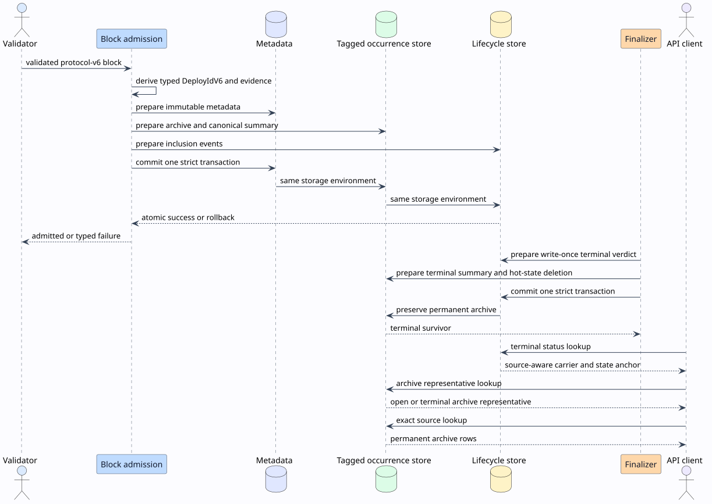

# Deploy occurrence storage

## Purpose

This document specifies protocol-v6 deploy occurrence storage. The storage keeps exact source history while it bounds the consensus hot index.

The storage supports independent validators. Arrival order cannot change the canonical occurrence after validators hold the same validated blocks.

The [deploy occurrence specification](deploy-occurrence-specification.md) defines consensus semantics. This document defines persistence, concurrency, recovery, and operator behavior.

## Terms

A **deploy identifier** is an authenticated `DeployIdV6` value. The value has 32 bytes.

A **source block** contains one processed copy of a deploy. Its block hash has 32 bytes.

A **deploy occurrence** binds one deploy identifier to one source block. The row also records admission evidence and source metadata.

An **archive row** is the permanent exact record for one deploy occurrence. Archive rows are immutable.

An **active row** is the current hot-index representative for one deploy. Active rows can change as newer validated blocks arrive.

An **open summary** describes a deploy that has no terminal lifecycle verdict. It contains the canonical occurrence and the archive count.

A **terminal summary** freezes the lifecycle verdict and the canonical source at finalization. It also records the compaction horizon.

A **compaction horizon** is the certified block height below which ordinary late occurrence insertion is not valid.

A **settled-history insertion** restores validated historical data below the compaction horizon. It does not reopen a terminal lifecycle.

## System boundary

[](diagrams/02-occurrence-storage-flow.svg)

Block admission prepares block metadata, occurrence rows, and lifecycle events before one durable transaction. A partial commit is not a valid state.

Finalization writes one terminal lifecycle verdict and compacts the hot occurrence state in one durable transaction. The exact archive remains available.

The query path reads the active summary first. The exact-history path reads the archive by deploy identifier and source block hash.

## Identity boundary

Protocol v6 uses `DeployIdV6` at all occurrence and lifecycle boundaries. A legacy signature and a v6 identifier are different Rust types.

The node does not infer identity type from byte length. A 32-byte legacy signature cannot alias a 32-byte v6 identifier.

The v6 identifier commits to canonical deploy intent, typed policy, and the exact selected signer bitmap. Different valid signer subsets have different identifiers.

Protocol-v6 occurrence storage does not use a primary signature fallback. Legacy lookup exists only for explicitly decoded pre-v6 data.

## Physical layout

One physical key-value database contains all occurrence row classes. The first key byte selects the row class.

| Tag | Key bytes | Value | Retention |
| --- | --- | --- | --- |
| `0x01` | `tag || DeployIdV6 || source block hash` | `DeployOccurrence` | Permanent |
| `0x02` | `tag || DeployIdV6 || source block hash` | Current active occurrence | Bounded hot state |
| `0x03` | `tag || DeployIdV6` | `OpenOccurrenceSummary` | Until terminalization |
| `0x04` | `tag || DeployIdV6` | `TerminalOccurrenceSummary` | Permanent summary |
| `0x05` | `tag || "fresh-v6"` | `OccurrenceActivation` | Permanent marker |

Archive and active composite keys have 65 bytes. Summary keys have 33 bytes.

The shared store scans exact encoded key prefixes. The LMDB implementation does not scan unrelated rows.

## Occurrence row

Each `DeployOccurrence` contains these fields:

- schema version;
- `DeployIdV6`;
- protocol version;
- source block hash and height;
- source validator and deploy ordinal;
- admission mode;
- admission ruleset digest;
- admission context digest;
- sender authority digest;
- execution failure flag.

The source validator has the canonical validator-key length. Each admission digest has 32 bytes.

The row is execution-bound admission evidence. A peer cannot publish an unvalidated row directly into this store.

## Canonical reducer

The reducer orders occurrences by descending source height. It uses the lexicographically smallest source block hash when heights are equal.

For occurrence set $`O_d`$ for deploy $`d`$, the canonical occurrence is:

```math
C_d(O_d) = \max_{\prec}\, O_d.
```

The order $`\prec`$ is total because each source block hash is unique. The reducer is associative, commutative, and idempotent.

These properties make the result independent of block arrival order and transaction retry order.

## Atomic admission

The admission algorithm uses one strict transaction across stores in one storage environment.

```text
function admit_v6_block(block, certificate, outcome):
    require block.protocol_version >= 6
    require certificate and outcome are valid for block

    metadata_mutation := immutable block metadata insertion
    occurrence_mutations := []
    lifecycle_mutations := []

    for each processed deploy in block order:
        deploy_id := processed deploy's authenticated DeployIdV6
        occurrence := bind deploy_id to block and admission evidence
        occurrence_mutations += prepare immutable archive insertion
        occurrence_mutations += prepare canonical summary compare-and-swap
        lifecycle_mutations += prepare idempotent inclusion event

    commit metadata_mutation,
           occurrence_mutations,
           and lifecycle_mutations in one strict transaction
```

The transaction accepts an absent archive key. It also accepts a byte-identical existing archive row.

The transaction rejects an existing composite key with different bytes. The node fails closed on this identity conflict.

A duplicate block retries the complete idempotent transaction. The duplicate path repairs missing derived rows after an interrupted earlier version.

## Concurrent insertion

Each open summary has a revision. An insertion reads the current summary and prepares a compare-and-swap mutation.

If another validator thread wins the compare-and-swap, the losing thread reads the new summary and computes the reducer again.

The implementation permits 64 compare-and-swap retries. Exhaustion returns `TransactionConflict` and does not publish a partial row.

The transaction coordinator rejects mutations from different LMDB environments. It does not simulate atomicity with sequential cross-environment writes.

The in-memory store uses one shared transaction coordinator. Its commit and rollback behavior matches the LMDB transaction contract.

## Terminalization and compaction

Finalization supplies these certified facts:

- terminal lifecycle state;
- rejection count;
- finalization revision;
- finalized floor hash and height;
- compaction horizon.

The finalization algorithm is:

```text
function terminalize_v6(deploy_id, terminal_facts):
    require deploy_id is DeployIdV6
    require finalized floor hash has 32 bytes
    require one open occurrence summary exists

    survivor := existing write-once verdict or terminal_facts.verdict
    require existing terminal summary agrees with survivor

    prepare terminal summary from open summary and archive digest
    prepare write-once lifecycle verdict compare-and-swap
    prepare lifecycle event deletion
    prepare open summary and active row deletion

    commit all prepared mutations in one strict transaction
    return survivor
```

Terminalization never deletes archive rows. Exact source lookup remains available for the complete stored chain history.

The terminal summary freezes the source used for the terminal display. A later settled-history row can update the current representative without changing that frozen source.

The archive digest is an order-independent integrity summary:

```math
D_d = \sum_{o \in O_d} H(\operatorname{domain} \mathbin{\|} K_o \mathbin{\|} V_o) \pmod {2^{256}}.
```

The digest supports restart validation and order-independent updates. It is not a membership proof or an authorization credential.

## Late validated history

An ordinary occurrence at or below a terminal compaction horizon is invalid. This rule prevents stale network input from reopening bounded hot state.

A settled-history insertion is valid below the horizon. The caller must obtain it from validated local chain reconstruction.

A late occurrence above the horizon can become the current representative. The terminal lifecycle verdict remains unchanged.

## Crash and restart behavior

The activation marker identifies one complete fresh-v6 store. Startup rejects an incompatible marker.

Startup also rejects nonempty occurrence storage without the marker. This rule detects legacy data and partial activation.

Archive rows are the immutable recovery authority. Startup can rebuild missing open summaries and active rows from the archive.

Startup rejects these corrupt states:

- an unknown row tag;
- a row whose key disagrees with its value;
- an invalid schema or protocol version;
- both an open and terminal summary for one identifier;
- a summary that disagrees with its archive;
- a terminal digest or archive count mismatch;
- an active row that disagrees with its summary.

The node validates all stored row identities before it serves consensus operations.

## Fresh-genesis activation

Protocol v6 is a fresh-genesis boundary. This branch does not support an in-place pre-v6 database upgrade.

Use this operator sequence:

1. Stop every node in the target shard.
2. Preserve the old shard data as a separate recovery artifact.
3. Create new empty protocol-v6 storage.
4. Start the approved protocol-v6 genesis ceremony.
5. Verify the exact activation marker and schema on every node.
6. Reject startup if a node reports legacy or partial occurrence state.

Do not copy the old singular deploy index into the v6 occurrence database. Old signatures do not authenticate v6 envelope commitments.

## Query behavior

`lookup_by_deploy_id` requires an explicit `DeployLookupId`. It dispatches to the protocol-specific store without byte-length inference.

For v6, canonical lookup reads the open or terminal summary in constant key operations. It does not scan all occurrences.

The public `find_deploy` path follows that canonical index and reads only its
named block. A missing or mismatched indexed block is a storage-consistency
error; the endpoint does not substitute a different archived occurrence.
Pre-v6 lookup retains its bounded recent-block compatibility scan only when no
legacy index entry exists.

Exact v6 history lookup scans only the 65-byte composite-key prefix for one identifier. The cost is linear in that deploy's source count.

Invalid blocks remain available through the invalid-block diagnostic index. Invalid blocks do not populate canonical deploy, occurrence, or lifecycle indices.

## Complexity

Let $`n_d`$ be the number of stored source occurrences for deploy $`d`$.

| Operation | Time | New persistent rows |
| --- | --- | --- |
| New open occurrence | Amortized constant key operations | One archive row, at most one active row, one summary update |
| Duplicate occurrence | Constant key operations | Zero |
| Canonical lookup | Constant key operations | Zero |
| Exact historical lookup | $`O(n_d)`$ | Zero |
| Terminalization | $`O(n_d)`$ for the first archive digest | One terminal summary, with open rows removed |
| Late terminal occurrence | Constant key operations | One archive row and one summary update |
| Startup consistency check | Linear in stored occurrence history | Zero or repaired derived rows |

Persistent archive growth is linear in distinct source occurrences. The hot active index has at most one row for each deploy identifier.

## Security properties

Typed identity prevents legacy and v6 key aliasing. Composite keys prevent two source blocks from overwriting each other.

Immutable archive insertion prevents one byte representation from replacing another representation for the same identity and source.

Admission evidence binds each row to full local block validation. The store does not accept peer-provided occurrence bytes as authority.

Strict transactions prevent metadata, occurrence, and lifecycle state from disagreeing after a crash. Compare-and-swap prevents lost concurrent updates.

Fresh activation prevents unauthenticated legacy signatures from entering the v6 identifier domain.

The archive digest detects accidental divergence during validation. Consensus trust comes from authenticated blocks, admission evidence, and exact row validation.

## Verification map

| Property | Formal evidence | Rust evidence |
| --- | --- | --- |
| Concurrent atomic insertion | `DeployOccurrenceStorage.tla`, `Inv_SummaryMatchesArchive`, `Inv_LifecycleAtomic` | strict transaction rollback tests and occurrence insertion tests |
| Strict fresh activation | `Inv_FreshActivation` | `fresh_activation_rejects_legacy_or_partial_rows` |
| Arrival-order convergence | `Inv_ReplicaConvergence`; Rocq `canonical_rank_is_permutation_invariant` | property and concurrent insertion tests |
| Typed identity separation | Rocq `legacy_and_v6_identities_are_disjoint`, `equal_payload_cross_domain_ids_are_distinct`; TLA⁺ `DeployIdentitySeparation` and its raw-key control | typed lookup, invalid decode, recovery-projection property, and Loom concurrent-domain tests |
| Immutable exact archive | Rocq `archive_insert_is_idempotent` | duplicate insertion and LMDB reopen tests |
| Atomic terminal compaction | Rocq `terminalization_is_atomic_across_occurrence_and_lifecycle_state` | `v6_terminal_write_prunes_lifecycle_and_active_occurrence_state_atomically` |
| Archive retention | Rocq `terminalization_preserves_exact_archive` | compaction and late-history tests |
| Concurrent read, insert, and compaction | TLA+ validator transitions | two Loom occurrence-store tests |
| Unsafe non-atomic admission | TLA+ negative configuration | required counterexample |
| Unsafe permissive activation | TLA+ negative configuration | required counterexample |

The TLA+ safe model explores two validators with independent staging, insertion, crash, compaction, and read transitions.

The negative models must fail with their named invariant. A negative model that exits for another reason does not provide evidence.

## Related material

- [Deploy occurrence consensus specification](deploy-occurrence-specification.md)
- [Deploy occurrence verification and operations](deploy-occurrence-verification.md)
- [Formal verification catalog](../../../formal-verification.md)
- [Cost-Accounted Rho Calculus](https://github.com/F1R3FLY-io/publications/blob/main/cost-accounting/cost-accounted-rho.tex)
- [A Reflective Higher-Order Calculus](https://doi.org/10.1016/j.entcs.2005.05.016)
