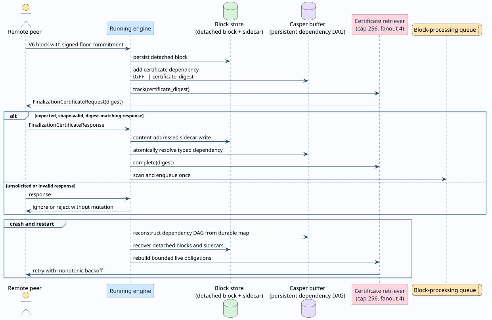

# Finalization-certificate retrieval

## Purpose

Casper protocol 6 lets a block bind an already certified finalized floor without
embedding the complete certificate in every repeated block transfer. The block
contains a signed `FinalizedFloorCommitment`; the corresponding
`FinalizationCertificate` is a content-addressed sidecar. A receiving node must
obtain and verify that sidecar before the block can enter consensus validation.

This separation reduces repeated wire and storage payloads while preserving the
security boundary: certificate absence is an availability dependency, never
permission to infer finality from receiver-local state.



## Terms and identities

| Term | Definition |
|---|---|
| **floor commitment** | The signed block-header value containing the certified floor hash, its post-state hash, the certificate digest, and the candidate-specific authority-context digest. |
| **certificate digest** | The Blake2b-256 digest of the canonical protocol-6 certificate encoding. It is the sidecar's content address. |
| **detached block** | A persisted block whose signed floor commitment is present but whose certificate sidecar is not locally available. Strict block reads do not expose it as validation-ready. |
| **typed certificate dependency** | A Casper-buffer dependency encoded as one prefix byte `0xFF` followed by the 32-byte certificate digest. Ordinary block dependencies remain exactly 32 bytes, so the namespaces are disjoint by length and prefix. |
| **live request** | One volatile, bounded retriever entry for a certificate digest that still has at least one persistent waiting block. |
| **wakeup** | The transition that moves a now dependency-free detached block into the block-processing queue at most once. |

For a 32-byte block hash `$`h`$` and certificate digest `$`d`$`, the durable
dependency keys are:

```math
K_{\mathrm{block}}(h) = h,
\qquad
K_{\mathrm{certificate}}(d) = \mathtt{0xFF} \mathbin{\|} d.
```

Therefore `$`|K_{\mathrm{block}}| = 32`$` and
`$`|K_{\mathrm{certificate}}| = 33`$`; no byte string can inhabit both
namespaces.

## End-to-end protocol

### 1. Detached admission

When a protocol-6 block carries a floor commitment but no inline certificate,
`BlockProcessorDependencies` persists it through
`put_block_message_awaiting_certificate`. The block store preserves the exact
signed block bytes while a strict `get` remains unavailable. The Casper buffer
then records an edge from `$`K_{\mathrm{certificate}}(d)`$` to the waiting block.

The block remains buffered. Parent availability, objective evidence, and the
certificate are independent typed dependencies; satisfying one cannot satisfy
another.

### 2. Bounded request creation

`FinalizationCertificateRetriever` admits at most 256 distinct live digests.
Each request fans out to at most four connected peers. Repeated requests for the
same digest share one tracker entry and observe exponential monotonic backoff:

```math
t(a) = \min\!\left(500 \cdot 2^{\min(a-1,6)}, 30000\right)\ \mathrm{ms},
```

where `$`a \ge 1`$` is the attempt count. A transport failure increments the
attempt but retains the live obligation. Maintenance freezes the currently
visible block and certificate obligations, attempts every member of that
snapshot, and returns the first dispatch error only after the round is
exhausted. One unreachable peer set therefore cannot starve later certificates
or ordinary block work.

The in-memory tracker is not consensus state. Its source of truth is the
persistent buffer relation. Capacity defers new requests; it never evicts an
existing live obligation.

### 3. Request serving

A peer receiving `FinalizationCertificateRequest(d)` reads only the
content-addressed certificate store. It responds when the exact digest exists
and sends no synthetic or receiver-local certificate. The response contains
both `$`d`$` and the canonical certificate.

### 4. Response validation

A receiver mutates no durable state unless all of the following hold:

1. `$`d`$` is currently tracked because a persistent block needs it.
2. The response envelope is at most 2 MiB plus 128 bytes and the contained
   certificate is at most 2 MiB.
3. The protocol-6 certificate satisfies certificate-schema-V4 shape bounds.
4. The canonical certificate digest equals `$`d`$`.
5. Content-addressed storage is either empty or already contains the
   byte-identical certificate.

An unsolicited response is ignored. A malformed, oversized, or digest-mismatched
response is rejected. A duplicate valid response after completion is unsolicited
and therefore cannot repeat persistence or queue mutation. The identity of the
responding peer is not authority: any peer may supply the exact digest-bound
bytes, while the signed commitment and certificate verification establish
authority.

### 5. Resolution and wakeup

After sidecar persistence, the buffer atomically removes
`$`K_{\mathrm{certificate}}(d)`$` from every waiting child. The retriever then
completes the volatile request. A serialized dependency-free scan uses the
processing-set guard to enqueue each block once. The periodic Casper maintenance
loop repeats this scan, so temporary queue backpressure does not lose the wakeup.

Strict block loading reattaches the verified sidecar to the exact detached block.
Only then can ordinary block validation verify the signed commitment, certificate
chain, parent-floor compatibility, candidate authority context, replay state, and
admission outcome.

### 6. Crash and restart

The detached block, certificate sidecar, and dependency edge are durable. The
request tracker, cooldown clock, and processing set are volatile. On restart:

```text
rebuild_certificate_work():
    dependencies := persistent_buffer.missing_certificate_dependencies()
    active := every digest in dependencies
    discard volatile requests not in active

    for digest in active:
        if certificate_store contains digest:
            resolve dependency digest
        else:
            request digest subject to capacity and backoff

    scan dependency-free blocks and enqueue each absent processing identity
```

This reconstruction is idempotent. Restart cannot turn certificate absence into
acceptance, and a sidecar persisted immediately before a crash resolves without a
second network transfer.

## Wire and work bounds

| Bound | Value | Enforced at |
|---|---:|---|
| Request digest | 32 bytes | protobuf conversion and retriever admission |
| Request envelope | 64 bytes | packet parser |
| Response envelope | 2 MiB + 128 bytes | packet parser |
| Certificate encoding | 2 MiB | certificate decoder and shape validation |
| Shard identifier | 256 bytes | certificate shape validation |
| Exact latest-message entries | 10,000 | pre-canonicalization decoder bound |
| Supporting block identities | 262,144 | certificate shape and verification |
| Finalized block identities | 262,144 | certificate shape and verification |
| DAG visits per verification | 1,048,576 | certificate verifier |
| Concurrent tracked digests | 256 | certificate retriever |
| Request fanout | 4 peers | certificate retriever |
| Retry delay | 500 ms–30 s | monotonic exponential backoff |

The bounds are deterministic admission limits. They bound memory, decoding, and
DAG work without changing the clique calculation, committee weights, or
finalization threshold.

## Concurrency and failure semantics

| Interleaving | Required result |
|---|---|
| Two valid responses for one digest | One content-addressed value, one dependency resolution, and one queue insertion. |
| Valid and invalid responses race | Only the valid digest-bound certificate may persist; invalid input cannot complete the tracker. |
| Send failure races with maintenance | The request remains live and becomes eligible after monotonic backoff. |
| Ordinary block send fails before certificate work | The caller records the error, still attempts every certificate in the frozen maintenance snapshot, then returns the first error. |
| Response races with restart | Durable sidecar or durable dependency determines recovery; volatile tracker state is irrelevant to safety. |
| Capacity is full | Existing obligations remain tracked; deferred persistent obligations become eligible as completed entries leave. |
| Queue is temporarily full | The processing identity is released and the periodic dependency-free scan retries. |

No transition changes Casper voting or serializes validators. Certificate
fetches, certificate verification, block replay, and validator activity remain
independent per digest or block. A maintenance invocation uses bounded sequential
local dispatch so one failure cannot cancel later work; this neither creates a
global lock nor orders independent validators. The LFS block requester preserves
its parallel request set and awaits all members before reporting the first error.
The only serialized storage operation is the local dependency-free queue scan
needed to make one enqueue decision for one local processing identity.

## Cost-accounting relationship

Certificate transport is ordinary bounded P2P traffic and remains subject to the
transport ingress, decoded-residency, fanout, and handler-work bounds. It is not a
RSpace introduction or COMM and therefore does not enter the protocol-4
quantitative-byte tariff. It does not debit a Rholang process purse or alter a
deploy's compute/storage settlement: a finality certificate is consensus evidence,
not user execution. By preventing replay until the exact sidecar exists, the
protocol also prevents a node from spending replay resources on a block whose
declared finalized state cannot yet be authenticated.

## Verification and executable conformance

| Obligation | Formal evidence | Executable evidence |
|---|---|---|
| Typed namespaces are disjoint | Rocq `typed_dependency_namespace_disjoint`; TLA+ `TypedDependencyNamespaceIsDisjoint` | property test `certificate_dependency_namespace_is_disjoint_and_round_trips` |
| Only expected, valid, digest-bound responses persist | Rocq `persisted_response_is_expected_and_content_addressed`; TLA+ response invariants | protobuf, block-store mismatch, oversized-value, and unsolicited-response tests |
| Failed sends retain work and do not starve other digests | Rocq `failed_send_retains_live_request`; TLA+ `FailedSendsRetainObligations` and temporal progress | retriever transport-failure and all-digest maintenance regressions |
| A caller-level failure cannot discard later mixed dependencies | Rocq `DependencyMaintenanceRound.dependency_maintenance_round_contract`; TLA+ `DependencyMaintenanceRound` full-snapshot and cross-type invariants | direct `MultiParentCasper::fetch_dependencies`, block-processor ordinary/stale, block-retriever mixed-maintenance, and LFS await-all regressions |
| Restart reconstructs bounded work | Rocq `rebuilt_tracker_is_bounded` and `bounded_persistent_obligations_are_rebuilt_exactly`; TLA+ crash/restart transition | `detached_block_and_certificate_obligation_survive_store_recreation` |
| Duplicate responses wake once | Rocq `duplicate_response_cannot_persist_twice` and `enqueue_once_is_idempotent`; TLA+ queue-count invariant | Loom duplicate-response interleavings and async Running-engine integration |
| Every fetchable persistent obligation progresses | TLA+ weak-fair temporal property `AllDetachedBlocksEventuallyQueue` | periodic maintenance wakeup and response integration tests |

TLC exhausts 58,184 generated states and 11,879 distinct states to depth 18 for
the two-block, capacity-one crash/restart model. Apalache checks every safety
invariant through symbolic length 12. Six independent controls remove namespace
typing, response validation, unsolicited-response rejection, failed-send
retention, restart reconstruction, or queue deduplication; both checkers reproduce
the corresponding counterexample. Rocq's
`finalization_certificate_retrieval_contract` is closed under the global context.

The maintenance-controller model closes a gap found during production
conformance review. The first retrieval model proved that a live certificate
tracker retains and retries every digest, but it did not include the caller loops
that invoked block and certificate maintenance with fail-fast `?` propagation.
TLC exhausts the repaired four-obligation controller in 348 generated / 158
distinct states to depth 7, and Apalache checks it through symbolic length 8.
The fail-fast control violates
`FailureNeverDiscardsUnattemptedObligations` in both tools by depth 3. Rocq's
`dependency_maintenance_round_contract` proves for arbitrary finite snapshots
that every obligation is attempted and any returned error names a failed
attempt.

## Source map

| Responsibility | Source |
|---|---|
| Wire request, response, bounds, and digest | `models/src/main/protobuf/CasperMessage.proto`; `models/src/rust/casper/protocol/casper_message.rs` |
| Packet length checks and routing | `casper/src/rust/protocol/mod.rs` |
| Bounded retry tracker | `casper/src/rust/engine/finalization_certificate_retriever.rs` |
| Mixed maintenance callers | `casper/src/rust/engine/multi_parent_casper/dispatch.rs`; `casper/src/rust/blocks/block_processor.rs`; `casper/src/rust/engine/block_retriever.rs`; `casper/src/rust/engine/lfs_block_requester.rs` |
| Request/response engine handlers | `casper/src/rust/engine/running.rs` |
| Typed persistent dependency | `block-storage/src/rust/casperbuffer/casper_buffer_key_value_storage.rs` |
| Detached block and sidecar persistence | `block-storage/src/rust/key_value_block_store.rs` |
| Dependency classification and wakeup | `casper/src/rust/blocks/block_processor.rs`; `node/src/rust/runtime/setup.rs` |
| TLA+ refinement | `formal/tlaplus/finalized_floor/FinalizationCertificateRetrieval.tla` |
| Rocq contract | `formal/rocq/finalized_floor/theories/FinalizationCertificateRetrieval.v` |
| Maintenance-controller refinement | `formal/tlaplus/finalized_floor/DependencyMaintenanceRound.tla` |
| Maintenance-controller contract | `formal/rocq/finalized_floor/theories/DependencyMaintenanceRound.v` |
