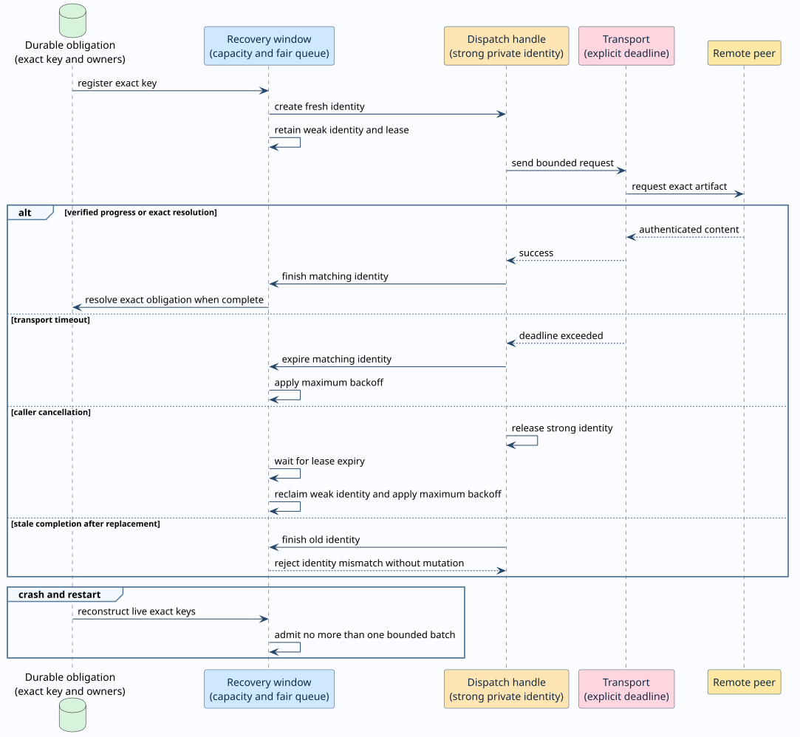

# Recovery budgets and dispatch identities

## Purpose

Recovery must restore missing consensus artifacts without creating unbounded work.
Recovery must also remain live for the complete node lifetime.

A process-lifetime counter cannot meet both requirements.
The counter eventually blocks legitimate recovery, while a restart restores the attack budget.

F1R3node uses two related controls instead:

- A durable episode budget limits certified settled-history admission.
- A volatile keyed window limits state-root and certificate network requests.

These controls change local recovery ownership and pacing only.
They do not change block bytes, replay results, votes, fork choice, or finality.



## Terms

| Term | Definition |
|---|---|
| **recovery episode** | One durable finalized-floor revision that owns a settled-history admission budget. |
| **recovery key** | The exact missing artifact identity, such as a state root or certificate digest. |
| **dispatch identity** | A private allocation identity that authorizes completion of one request attempt. |
| **dispatch handle** | The strong owner of one dispatch identity while its request can complete. |
| **dispatch lease** | The maximum interval in which an abandoned handle can keep one key in flight. |
| **recovery owner** | A durable block or dependency that still needs the recovery key. |
| **maximum backoff** | The longest configured delay before another request can start. |

## Durable settled-history episodes

`RecoveryEpisodeId` binds one budget to these values:

- Recovery schema version.
- Finalization-ledger revision.
- Shard identifier.
- Protocol version.
- Finalized-floor block hash.
- Finalized-floor post-state hash.
- Certificate digest.

Genesis uses revision zero and the canonical zero certificate digest.
A later episode comes from one durable finalization record and its validated witness.

Each `SettledRecoveryCharge` binds the episode to one target block, citer, and bond generation.
The ledger stores the charge and its episode usage in one atomic mutation.

The episode capacity is 512 unique committed targets.
A duplicate charge consumes no additional capacity.
A failed reservation creates no durable usage.

Restart reconstructs usage from the durable charge records.
Restart cannot restore consumed capacity or erase a committed charge.
A later certified episode receives its own capacity.

### Empty legacy migration

An episode with no durable charge has zero logical usage.
The storage adapter represents that state with an absent usage row.
An empty migration returns zero for that state and does not create a row.
Repeated empty migration leaves the raw store unchanged.

The formal model defines usage as the number of unique durable charges.
That definition does not require a physical row for zero usage.
The migration property checks logical usage and separately checks the empty storage representation.
An example-based regression checks repeated empty migration without storage mutation.

## Volatile keyed recovery window

`RecoveryWindow` stores at most one entry for each exact recovery key.
Each consumer supplies a finite entry capacity and a finite dispatch batch.

The window rotates its queue after each selection.
Independent ready keys can therefore progress without one global recovery lock.

The following pseudocode defines the dispatch transition:

```text
dispatch_ready_key(key, now):
    reclaim abandoned ownership when its lease expired
    reject the attempt when another identity remains active
    reject the attempt before the key's ready time
    create a fresh private allocation identity
    saturate the key's attempt count
    store a weak identity with an expiration time
    return a strong dispatch handle
```

The fresh identity has no numeric counter.
The process can create new identities for its complete lifetime without integer exhaustion.

The entry stores only a weak identity.
The caller owns the strong identity through the dispatch handle.
Pointer identity defines equality and prevents accidental value reuse.

`RecoveryDispatch` has no `Clone`, `Eq`, or `PartialEq` implementation.
Code cannot duplicate authority or substitute value equality for allocation identity.

## Completion, timeout, and cancellation

A matching completion clears only its own in-flight claim.
The next retry uses saturating exponential backoff.

An explicit transport timeout consumes the matching handle.
The timeout applies maximum backoff immediately.

Caller cancellation drops the strong handle.
The weak entry remains until its dispatch lease expires.
The next scan then applies maximum backoff before another dispatch.

A stale handle can survive exact-key removal and replacement.
Its pointer identity differs from the replacement identity.
The stale completion therefore makes no state change.

Exact progress can reset one key's attempts.
Exact resolution removes one key and preserves every unrelated key.
During one process lifetime, time alone never resets the attempt count.

## Consumer bounds

| Consumer | Tracked keys | Batch | Base delay | Maximum delay | Transport deadline |
|---|---:|---:|---:|---:|---:|
| Finalization certificates | 256 | 16 | 500 ms | 30 s | `RPConf::default_timeout` |
| Runtime state roots | 256 | 16 | 10 s | 30 s | `RPConf::default_timeout` |

Certificate requests use a fanout of four peers.
Periodic maintenance first registers all durable certificate obligations without transport work.
It then sends one bounded batch concurrently.

State-root recovery tracks at most 1,024 waiting block owners for each root.
It imports at most 65,536 content-addressed chunks for each root.

The state requester sends one bounded batch concurrently during each maintenance tick.
It defers a stalled root after 120 seconds without verified progress.

Neither consumer holds its recovery mutex during network or storage input and output.
Different keys and different validators remain concurrent.

## Crash and restart

The keyed window is volatile because it is not consensus authority.
Durable block and dependency stores remain the source of recovery obligations.

Restart discards every old dispatch handle.
Reconstruction restores each unresolved exact key from durable ownership evidence.
Reconstruction registers at most the configured key capacity.
Each actor turn sends at most one configured batch.
A missing volatile retry history cannot authorize an unbounded restart burst.

Restart initializes each reconstructed volatile entry as ready with zero attempts.
This reset does not affect durable recovery charges or episode usage.
Remote peers cannot trigger process restart.

The settled-history budget is different.
Its episode identity, charges, and usage remain durable in the finalization ledger.

## Security properties

| Threat | Required result |
|---|---|
| Repeated discovery of one key | One tracked entry and one active dispatch identity. |
| Many distinct missing keys | Finite capacity with no eviction of existing obligations. |
| Slow or silent peer | A finite transport deadline followed by maximum backoff. |
| Cancelled caller | Lease-based reclamation without permanent in-flight ownership. |
| Late completion | Pointer mismatch with no mutation of replacement state. |
| Restart storm | Finite key capacity and per-turn batch bounds. |
| Counter exhaustion | Generative allocation identity with no numeric lifetime counter. |
| Wrong-key response | Exact-key resolution preserves all unrelated obligations. |

## Formal verification

`RecoveryBudgetEpisodes.tla` composes durable episode accounting with volatile keyed recovery.
The model includes two validators, independent keys, concurrent handles, restart, timeout, cancellation, and exact resolution.

TLC exhausts separate ledger, window, composition, and liveness configurations.
Apalache symbolically checks the bounded safety composition.

The model checks these principal invariants:

- Current recovery episodes have durable certification.
- Durable usage equals the unique charge set.
- Restart preserves committed charges and usage.
- Tracked keys and batches remain within their bounds.
- Each tracked key retains an owner.
- Concurrent in-flight identities remain unique.
- A live identity cannot be reused.
- A stale completion has no effect.
- Attempts reset only after exact progress.
- Resolution affects only the requested key.

Weak fairness proves two liveness properties.
Ready obligations eventually dispatch or resolve.
In-flight obligations eventually leave the in-flight state.

Unsafe controls reproduce each prohibited transition.
Two temporal controls reproduce abandoned ownership and numeric identity exhaustion.
Safety controls cover eviction, resets, durability loss, aliasing, overcapacity, stale completion, and wrong-key resolution.

`RecoveryBudgetEpisodes.v` proves the unbounded transition rules in Rocq.
The proof uses an abstract identity with decidable equality.
It also proves that each finite natural-number history admits a fresh identity.

The Rocq capstone proves stale-completion safety, exact expiration, backoff preservation, and identity-independent dispatch progress.
`Print Assumptions` reports no unexpected axioms.

## Executable verification

| Formal property | Executable evidence |
|---|---|
| Finite keyed capacity | Registration and generated state-machine tests. |
| Unique live identity | Generated handle ownership checks and Loom interleavings. |
| Stale completion safety | Reused-key unit test, retained-handle test, and Loom replacement schedules. |
| Cancellation recovery | Dropped-handle lease test and cancelled certificate-request test. |
| Timeout recovery | Certificate and bootstrap transport-deadline tests. |
| Fair bounded dispatch | Certificate and state-root rotating-batch tests. |
| Long-horizon identity freshness | 100,000 dispatch cycles without exhaustion. |
| Durable episode accounting | Finalization-ledger, block-storage, restart, migration, and settled-admission tests. |

Generated operations include registration, dispatch, completion, expiration, cancellation, resolution, progress, deferral, retention, and time advancement.
The test compares each transition, result, state, order, attempt count, deadline, and owner with an independent reference model.

Loom explores stale completion, replacement, resolution, exact progress, maximum deferral, cancellation, and deadline races.

## Source map

| Responsibility | Source |
|---|---|
| Generic keyed retry state | `casper/src/rust/recovery_budget.rs` |
| Certificate request consumer | `casper/src/rust/engine/finalization_certificate_retriever.rs` |
| State-root request consumer | `casper/src/rust/engine/runtime_state_requester.rs` |
| Durable episode and charge schema | `block-storage/src/rust/finality/finalization_ledger.rs` |
| Atomic settled admission | `block-storage/src/rust/dag/block_dag_key_value_storage.rs` |
| TLA+ model and controls | `formal/tlaplus/deploy_recovery/RecoveryBudgetEpisodes.tla` |
| Rocq proof | `formal/rocq/finalized_floor/theories/RecoveryBudgetEpisodes.v` |
| Loom schedules | `casper/tests/loom_recovery_budget_episodes.rs` |
| Unified local gate | `scripts/check-deploy-lifecycle-ALL.sh` |
