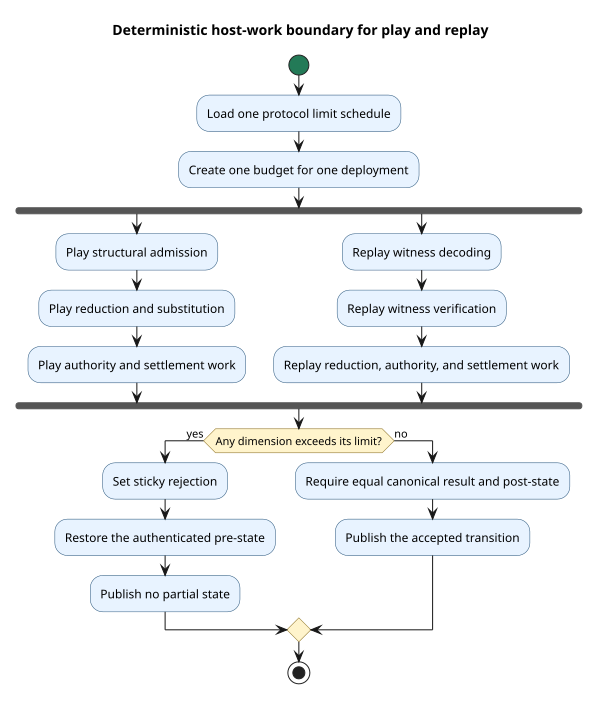

# Deterministic host-work budget

## Purpose

The host-work budget limits deterministic node work before one deployment can exhaust a validator.
It protects admission, execution, authority analysis, settlement search, witness decoding, and witness verification.

The budget does not assign an economic cost.
It does not debit a purse, consume phlogiston, or change a Rholang transition charge.

The budget uses integer units that all validators can reproduce.
Consensus must use one versioned limit schedule for all validators that validate the same protocol version.

## Terms

A **host-work unit** measures one deterministic part of node work.
A **dimension** defines one type of host work and has one independent counter.

A **phase** groups two related dimensions for documentation and analysis.
The grouping does not permit capacity transfer between dimensions.

A **limit schedule** maps each dimension to one unsigned integer limit.
A **budget** contains one schedule, sixteen atomic counters, and one sticky rejection state.

A **reservation** checks and adds work before the related operation allocates or changes state.
A **deployment boundary** contains all attempts, settlement work, and replay work for one deployment.

## Dimensions and units

The implementation uses eight phases and sixteen dimensions.
Each dimension counts a canonical logical quantity instead of allocator-dependent memory.

| Phase | Dimension | Unit definition |
| --- | --- | --- |
| Structural admission | Structural items | One visited normalized syntax item. |
| Structural admission | Structural bytes | Canonical encoded bytes visited during structural admission. |
| Pure reduction | Reduction steps | One attempted deterministic reduction step. |
| Pure reduction | Reduction term bytes | Canonical bytes in the term for that attempted step. |
| Primitive evaluation | Primitive calls | One primitive operation invocation. |
| Primitive evaluation | Primitive input bytes | Canonical bytes supplied to a primitive operation. |
| Substitution | Substitution bindings | One binding processed during substitution. |
| Substitution | Substitution bytes | Canonical bytes processed during substitution. |
| Authority discovery | Authority nodes | One visited authority-tree node. |
| Authority discovery | Authority depth | Each newly reached maximum depth in one discovery call. |
| Physical search | Search candidates | One examined physical settlement candidate. |
| Physical search | Search state bytes | Canonical logical bytes retained for one search state. |
| Witness decoding | Witness fields | One logical schema-field occurrence in the witness. |
| Witness decoding | Witness bytes | Canonical encoded witness bytes. |
| Witness verification | Verification operations | One logical witness verification operation. |
| Witness verification | Verification bytes | Canonical encoded bytes covered by verification. |

`SearchStateBytes` does not use `size_of` or allocator metadata.
This rule prevents platform layout from changing a consensus result.

`WitnessFields` counts schema occurrences instead of protobuf wire tags.
This rule prevents alternate valid wire encodings from changing a consensus result.

Authority-depth use accumulates for repeated discovery calls.
The counter records each call's incremental maximum-depth observations.

## Checked reservation

Let $`u_d`$ be current use for dimension $`d`$.
Let $`w_d`$ be the requested work and $`L_d`$ be the limit.

The reservation succeeds exactly when both checked conditions hold:

```math
u_d + w_d \leq L_d
\quad\land\quad
u_d + w_d \leq 2^{64}-1
```

The implementation rejects checked-addition overflow.
It does not wrap or saturate the counter.

Each counter uses an atomic compare-and-exchange operation.
Concurrent reservations for one dimension therefore record the exact accepted sum.

Dimensions remain independent.
Unused byte capacity cannot subsidize exhausted item capacity.

The first failed nonzero reservation makes rejection sticky.
Later nonzero reservations fail without adding fabricated use.

Zero-unit reservations remain no-ops.
They do not clear or hide a prior rejection.

## Deployment lifecycle

The node creates one budget for each bounded deployment boundary.
The same budget moves through every capacity-expansion attempt for that deployment.

The budget then moves through authority reconstruction, witness work, physical allocation, and settlement.
This ownership rule prevents retry-based budget reset.

The play path uses the following order:

1. Reserve structural work before syntax admission.
2. Reserve execution work before each related operation.
3. Reserve witness work before witness allocation and verification.
4. Reserve authority work during complete authority-tree discovery.
5. Reserve physical-search work before each candidate expansion.
6. Reject the deployment if any reservation fails.
7. Restore the soft checkpoint after a rejected deployment.

The replay path creates one budget for each recorded deployment.
It applies the same schedule to the recorded witness and the repeated execution.

Bounded replay bypasses the replay-result cache.
A cache hit cannot skip a required host-work check.

Replay resets the active history root to the authenticated block pre-state after any deployment failure.
The node does not publish partial replay state.



## Play and replay agreement

Let $`E`$ be the complete canonical event sequence for one deployment.
Let $`S`$ be the protocol limit schedule.

Play and replay apply the same cumulative reservation function:

```math
\operatorname{verdict}(S,E)
=
\begin{cases}
\operatorname{Accept}, & \forall d.\; \operatorname{use}_d(E) \leq L_d \\
\operatorname{Reject}, & \text{otherwise.}
\end{cases}
```

Validator arrival order can change local scheduling.
It cannot change $`E`$, the cumulative use, or the final verdict.

Two disjoint dimensions can reserve concurrently.
Two shards also own independent deployment budgets.

The design does not add a global host-work lock.
It therefore preserves independent validator, shard, and dimension concurrency.

## Economic separation

Host work protects the validator process.
Semantic cost accounts for Rholang resource consumption.

The two mechanisms use separate counters and separate state.
Host-work rejection cannot debit SystemVault custody.

Structural congruence and equations remain economically free.
Only base rewrite motion contributes semantic resource cost under the cost-accounting papers.

Physical-search optimization can change local execution time.
It cannot change location-channel behavior, the selected settlement, or the semantic charge.

`phloLimit` will supply the signed execution boundary when the restored deployment schema activates this interface.
`phloPrice` will convert semantic phlogiston use into the monetary reservation and settlement amount.

The signed protocol schedule must also bind the non-economic dimension limits.
Validators must reject a schedule mismatch before execution.

The bounded APIs exist before that protocol activation.
Existing unbounded entry points preserve the current protocol while the signed fields remain absent.

This distinction is not an A/B test.
It is a protocol-version boundary that prevents silent consensus changes.

## Failure behavior

Production reports a host-work rejection as `InterpreterError::HostWorkRejected`.
The consensus result does not expose validator-local timing or memory data.

The web API maps this error to HTTP 422 with error kind `host_work_rejected`.
This deterministic rejection differs from temporary node capacity failure and insufficient economic funding.
The same canonical execution exceeds the same schedule on every validator.

The following data must never control the verdict:

- Wall-clock duration.
- Resident set size.
- Allocator capacity or object layout.
- Thread arrival order.
- Cache residency.
- Validator-local schedule values.

Operators can still use those local measurements for capacity planning.
Operators must not use them as consensus inputs.

## Public integration surfaces

The implementation exposes bounded surfaces at each required layer:

| Layer | Bounded surface | Responsibility |
| --- | --- | --- |
| Interpreter | `RhoRuntime::evaluate_with_authority_and_host_work_budget` | Share one caller-owned budget across evaluation attempts. |
| Casper play | `Runtime::state_bound_cost_evidence_for_state_cosigned_with_host_work` | Apply one budget across retries, witness work, authority work, search, and settlement. |
| Casper replay | `ReplayRuntimeOps::replay_compute_state_with_host_work` | Apply one budget to each replayed deployment. |
| Runtime manager | `RuntimeManager::state_bound_cost_evidence_with_host_work` | Select the bounded play path. |
| Runtime manager | `RuntimeManager::replay_compute_state_with_host_work` | Select bounded replay and bypass the replay cache. |

The unbounded methods delegate to the same implementation with no schedule.
This structure keeps one semantic path and prevents duplicate execution logic.

## Security properties

The budget limits amplification from syntactically small but computationally large deployments.
Independent dimensions prevent an attacker from exchanging cheap work for expensive work.

Pre-allocation reservations limit witness and search-state allocation.
Checked arithmetic prevents counter wrap and saturation attacks.

Sticky rejection prevents retry loops from receiving a fresh budget.
Transactional rollback prevents a rejected deployment from retaining linear resources or state changes.

Replay enforcement prevents a proposer from supplying a witness that validators accept without equivalent bounded work.
Schedule binding prevents validators from applying different admission rules.

## Verification and tests

The focused formal package is in [`formal/tlaplus/host_work_budget/`](../../../formal/tlaplus/host_work_budget/README.md).
The TLA+ model schedules two validators, two shards, and two concurrent branches.

TLC checks the safe model and ten required unsafe controls.
The controls cover order dependence, arithmetic faults, early mutation, replay faults, shard coupling, economic debit, and early allocation.

The Rocq package proves the checked arithmetic and execution refinements over arbitrary natural numbers.
Its proofs contain no admitted obligations or added axioms.

Rust example and property tests cover these implementation rules:

- Exact concurrent accumulation.
- Dimension independence.
- Sticky rejection.
- Overflow rejection.
- Failure non-mutation.
- Caller-owned accumulation across evaluation attempts.
- Exact witness-size and field accounting.
- Authority-tree node and depth accounting.
- Physical-search candidate and state accounting.
- Play rejection and checkpoint rollback.
- Play and replay root equality.
- Bounded replay cache bypass.

Loom checks relevant atomic reservation and lifecycle interleavings.
Run the focused formal gate with this command:

```bash
scripts/check-host-work-budget-formal.sh
```

Run the complete cost-accounting gate before release.
The executable conformance matrix records that aggregate release evidence.

## References

- Leslie Lamport, *Specifying Systems*, Addison-Wesley, 2002. [TLA+ resources](https://lamport.azurewebsites.net/tla/tla.html).
- The Rocq Development Team, [Rocq documentation](https://rocq-prover.org/docs/).
- [`cost-accounted-rho.tex`](https://github.com/F1R3FLY-io/publications/blob/main/cost-accounting/cost-accounted-rho.tex), the semantic cost-accounting source.
- [`continued-gslt-cost-v2.tex`](https://github.com/F1R3FLY-io/publications/blob/main/cost-accounting-as-monad/continued-gslt-cost-v2.tex), the cost-monad source.
- [`knotted-topoi.tex`](https://github.com/F1R3FLY-io/publications/blob/main/knotted-topoi/knotted-topoi.tex), the location and structural-congruence source.
