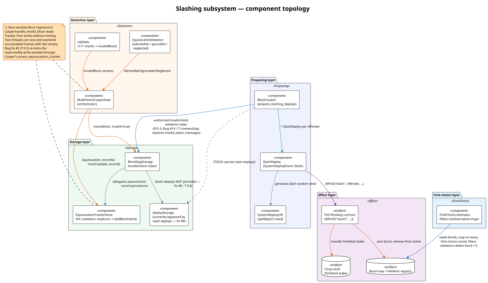
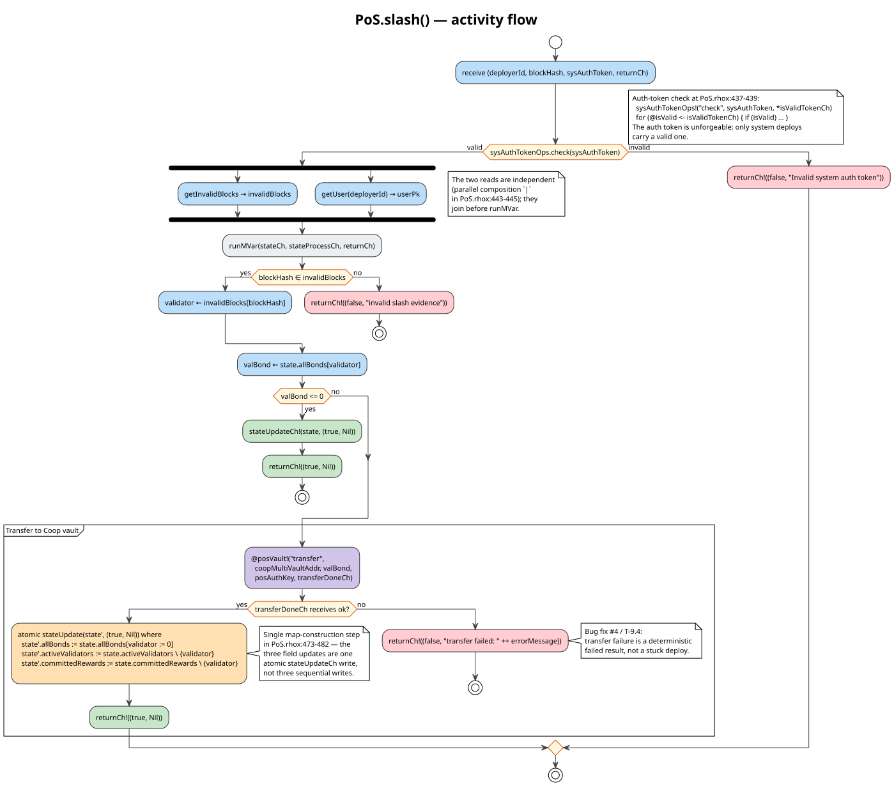

# 03 · Architecture

## 3.1 Five layers, eleven active components plus two data artifacts

The slashing subsystem is structured as **five layers**, each with
**two to four entities**, totalling **eleven active components plus
two data artifacts** (`BondsMap`, `CoopVault`) — **thirteen
sub-components in all**. The layering reflects the *direction of data
flow* through a slashing event: a misbehavior arrives → the
**Detection layer** classifies it → the **Storage layer** records
evidence → the **Proposing layer** emits a `SlashDeploy` → the
**Effect layer** executes the slash on-chain → the **Fork-choice
layer** stops counting the slashed validator's votes.

**Counting convention.** *Components* are code-bearing modules
(Validate, EquivocationDetector, MultiParentCasperImpl, …);
*data artifacts* are on-chain or in-memory data structures
(Bond map, Coop vault) cited as first-class entities in Diagram 01.
Where the spec abstract and Diagram 01 say "eleven components", they
mean the code-bearing modules; where this chapter and the spec's
§1.7 dependency DAG say "thirteen sub-components", they include the
two data artifacts.

[](../diagrams/01-component-overview.svg)

> **Reading the diagram.** Boxes group sub-components by layer.
> Solid arrows show **data flow** (block messages, records, bonds);
> the dashed arrow from `BlockCreator` to `DeployStorage` highlights
> a **deferred behavior** (slash deploys are not currently persisted
> — bug fix #8 / §09).

## 3.2 Layer-by-layer

### 3.2.1 Detection layer — *"is this block valid?"*

| Sub-component           | Role                                                                                                  | Rust source                                   | Scala upstream                                   |
|-------------------------|-------------------------------------------------------------------------------------------------------|-----------------------------------------------|--------------------------------------------------|
| `Validate`              | Runs ~17 protocol-level validity checks against an arriving block.                                    | `casper/src/rust/validate.rs`                 | `coop.rchain.casper.Validate.scala`              |
| `EquivocationDetector`  | Classifies a candidate's equivocation status: Valid / Admissible / Ignorable / NeglectedEquivocation. | `casper/src/rust/equivocation_detector.rs`    | `coop.rchain.casper.EquivocationDetector.scala`  |
| `MultiParentCasperImpl` | Orchestrator: dispatches `InvalidBlock` verdicts to the appropriate handler.                          | `casper/src/rust/engine/multi_parent_casper/mod.rs` | `coop.rchain.casper.MultiParentCasperImpl.scala` |

**Intuition.** When a block message arrives over the network, the
node must answer two questions: (1) *Is this block syntactically
and semantically well-formed?* (`Validate`); and (2) *Does this
block contradict something I already know about its sender?*
(`EquivocationDetector`). The `MultiParentCasperImpl` orchestrator
ties the two together and routes the verdict.

### 3.2.2 Storage layer — *"what evidence have we accumulated?"*

| Sub-component              | Role                                                              | Rust source                                                 | Scala upstream                                                |
|----------------------------|-------------------------------------------------------------------|-------------------------------------------------------------|---------------------------------------------------------------|
| `BlockDagStorage`          | Persistent block-DAG; `insert(block, invalid)`; `latest_message`. | `block-storage/src/rust/dag/block_dag_key_value_storage.rs` | `coop.rchain.blockstorage.dag.BlockDagKeyValueStorage.scala`  |
| `EquivocationTrackerStore` | KV store: `(Validator, SeqNum) → Set[BlockHash]`.                 | `block-storage/src/rust/dag/equivocation_tracker_store.rs`  | `coop.rchain.blockstorage.dag.EquivocationTrackerStore.scala` |
| `DeployStorage`            | Persists user-submitted deploys for replay determinism.           | `block-storage/src/rust/deploy/key_value_deploy_storage.rs` | `coop.rchain.blockstorage.deploy.DeployStorage.scala`         |

**Intuition.** Two persistent indices answer two different questions:
(1) *Is this block hash known to be invalid?* — answered by
`BlockDagStorage` via the per-block `invalid` flag; (2) *Has this
validator equivocated at this seq number?* — answered by the
`EquivocationTrackerStore` via the `(V, baseSeq) → Set[Hash]`
map. The map is the *evidence* the proposer consumes when assembling
the next block's `SlashDeploy`s.

> **The race story.** The `EquivocationTrackerStore` itself has no
> concurrency primitives. Atomicity of the read-modify-write window
> is the responsibility of the caller — specifically
> `BlockDagKeyValueStorage.accessEquivocationsTracker` at line 262,
> which holds a global semaphore via `lock.withPermit`. The Rust
> port's *additional* lock-free entry points (`equivocation_records`,
> `insert_equivocation_record`, `update_equivocation_record`) are the
> source of bug #2: two threads reading the same empty record and
> both inserting their own witness hash in parallel can lose one of
> the hashes (§09 / Diagram 09).

### 3.2.3 Proposing layer — *"how do we punish what we know?"*

| Sub-component      | Role                                                                                | Rust source                                            | Scala upstream                                              |
|--------------------|-------------------------------------------------------------------------------------|--------------------------------------------------------|-------------------------------------------------------------|
| `BlockCreator`     | Reads authorized current-epoch invalid-block evidence → emits `SlashDeploy`s.       | `casper/src/rust/blocks/proposer/block_creator.rs`     | `coop.rchain.casper.blocks.proposer.BlockCreator.scala`     |
| `SlashDeploy`      | A *system deploy* (no user-fee) that invokes `@PoS!("slash", …)` on-chain.          | `casper/src/rust/util/rholang/costacc/slash_deploy.rs` | `coop.rchain.casper.util.rholang.costacc.SlashDeploy.scala` |
| `SystemDeployUtil` | Generates deterministic random seeds for system deploys; slash seeds include `(proposer, seq_num, invalid_block_hash)`. | `casper/src/rust/util/rholang/system_deploy_util.rs`   | `coop.rchain.casper.util.rholang.SystemDeployUtil.scala`    |

**Intuition.** When the next proposer's turn arrives, that proposer
asks: *"Is there anyone bonded I should slash?"* `BlockCreator`
answers after parent merge by computing the PoS bond map from the exact
canonical merged pre-state and intersecting it with the DAG's invalid-block
evidence whose evidence epoch equals the block's target activation
epoch. For each still-bonded offender, it constructs a `SlashDeploy`
and attaches it to the block. The proposer's signature on the block
also signs the deploy (it's a *system deploy* — no user authentication
required; the system auth-token and the received-deploy authorization
gate guard it instead, see §06).

When a multi-parent merge rejects a branch that carried a valid slash,
the proposer does not grant authority to the rejected deploy. Instead,
the normal slashing pass scans the complete persisted invalid-evidence
index against the canonical merged `pre_state_hash`. It emits exactly one
canonical candidate per `(offender, activation epoch)` when that target's
bond remains positive. A surviving slash makes the canonical bond zero and
therefore suppresses another candidate. Received-block authorization derives
the same predicate from the block's committed parent pre-state; it never uses
a maximum-over-parents or ambient snapshot approximation.

### 3.2.4 Effect layer — *"what changes when a slash fires?"*

| Sub-component                     | Role                                                           | Source                                                    |
|-----------------------------------|----------------------------------------------------------------|-----------------------------------------------------------|
| **PoS Rholang contract**          | The on-chain `slash` method; mutates bonds and active set.     | `casper/src/main/resources/PoS.rhox` (the `slash` method)  |
| **Bond map / Validator registry** | On-chain state inside the PoS contract: `state.allBonds`, etc. | `PoS.rhox` (state record)                                 |
| **Coop vault**                    | Recipient of forfeited stake.                                  | A separate Rholang contract (`@posVault!("transfer", …)`) |

**Intuition.** The *only* place the bond map is mutated as a
consequence of slashing is inside the `slash` Rholang contract.
A successful slash transition (Diagram 07) atomically:

1. Verifies the system auth token (rejects the deploy at the first
   guard if invalid — `T-AuthCheck`).
2. Looks up the offender via `invalidBlocks[blockHash]`.
3. Reads the offender's bond.
4. If the bond is already zero, returns success without mutation.
5. Otherwise transfers the bond to the Coop vault.
6. **Atomically** updates `state.allBonds`, `state.activeValidators`,
   and `state.committedRewards` — a single map-construction step,
   not three field writes.
7. Returns `(true, Nil)` on `returnCh`.

[](../diagrams/07-activity-pos-slash-contract.svg)

### 3.2.5 Fork-choice layer — *"who do we still listen to?"*

| Sub-component          | Role                                                                              | Rust source                    | Scala upstream                       |
|------------------------|-----------------------------------------------------------------------------------|--------------------------------|--------------------------------------|
| `ForkChoice` estimator | Reads `bonds_map` on every fork-choice round; filters validators with `bond = 0`. | `casper/src/rust/estimator.rs` | `coop.rchain.casper.Estimator.scala` |

**Intuition.** Once a slash has fired, the *next* fork-choice
computation reads the on-chain `bonds_map`, finds the offender's bond
to be 0, and *filters out* their latest message from the GHOST
estimator. This is the final step that converts the bond
zeroing into actual loss-of-influence. Theorem **T-10**
(`fork_choice_exclusion`, `ForkChoice.v:60`) formalizes this filter.

> **Pull, not push.** The fork-choice layer is *not* notified by
> the PoS contract. Instead, every fork-choice round re-reads the
> bond map fresh. This is the simpler design — there is no "slash
> notification queue" to worry about; if the bond is zero, the
> validator's vote does not count.

## 3.3 Component-interaction overview

The high-level data flow is:

```
                  arriving block b
                         │
                  ┌──────▼───────┐
                  │   Validate   │ ← 17 protocol checks
                  └──────┬───────┘
                         │ verdict ∈ InvalidBlock ∪ {Valid}
              ┌──────────▼───────────┐
              │  EquivocationDetector│ ← latest-message lookup
              └──────────┬───────────┘
                         │ refined verdict
                ┌────────▼─────────┐
                │MultiParentCasper │ ← dispatch to handler
                └────┬────────┬────┘
               valid │        │ slashable
             ┌───────▼──┐   ┌─▼───────────────┐
             │ BlockDag │   │ insert evidence │
             │  store(  │   │ in equivocation │
             │  valid)  │   │  tracker store  │
             └──────────┘   └────────┬────────┘
                                     │ (next proposer's turn)
                          ┌──────────▼──────────┐
                          │   BlockCreator      │ ← read tracker + bonds
                          │ prepare_slashing_*  │
                          └──────────┬──────────┘
                                     │ SlashDeploy(s)
                          ┌──────────▼──────────┐
                          │ PoS Rholang slash   │ ← mutate bonds atomically
                          │  (auth-token, etc.) │
                          └──────────┬──────────┘
                                     │ bond := 0
                          ┌──────────▼──────────┐
                          │  ForkChoice filter  │ ← exclude latest-msg
                          └─────────────────────┘
```

## 3.4 Why this layering?

| Design decision                                                       | Rationale                                                                                                                          |
|-----------------------------------------------------------------------|------------------------------------------------------------------------------------------------------------------------------------|
| Separate **detection** from **storage**                               | Allows replay determinism: detection re-runs identically across nodes; storage is the *result*, not the algorithm.                 |
| Separate **storage** from **proposing**                               | The tracker store is small and read-only after detection; proposing reads it as part of normal block construction.                 |
| **Proposing** is per-validator, **effect** is in the Rholang contract | The *who decides to slash* (proposer) and *what slashing does* (PoS contract) are independent: any proposer can fire any slash.    |
| **Fork-choice** *pulls* from on-chain state                           | No notification queue or callback registration; on-chain bond is the source of truth for the GHOST estimator.                      |
| **Two-level closure** (neglect detection)                             | Closes the collusion loophole: B cannot ignore A's equivocation, because B's own block becomes invalid (§08).                      |
| **System deploys are unauthenticated by user keys**                   | A `SlashDeploy` is *system-level*: signed by no user, executed under the system auth token. The auth-token guard is the only gate. |

## 3.5 Where each layer lives in code

```
casper/src/rust/                 (orchestrator + detection + proposer)
├── engine/multi_parent_casper/mod.rs  (MultiParentCasperImpl)
├── validate.rs                  (Validate)
├── equivocation_detector.rs     (EquivocationDetector)
├── block_status.rs              (InvalidBlock enum, is_slashable())
├── blocks/
│   └── proposer/
│       └── block_creator.rs     (BlockCreator)
├── util/
│   └── rholang/
│       ├── costacc/
│       │   └── slash_deploy.rs  (SlashDeploy)
│       └── system_deploy_util.rs (SystemDeployUtil)
└── estimator.rs                 (ForkChoice)

block-storage/src/rust/
├── dag/
│   ├── block_dag_key_value_storage.rs  (BlockDagStorage; semaphore lives here)
│   └── equivocation_tracker_store.rs   (EquivocationTrackerStore)
└── deploy/
    └── key_value_deploy_storage.rs     (DeployStorage)

casper/src/main/resources/
└── PoS.rhox                     (PoS contract; defines the slash method)
```

## 3.6 Component dependency DAG

```
                ┌────────────────────────────────────────┐
                │  Detection layer                       │
                │  ┌──────────┐  ┌─────────────────────┐ │
                │  │ Validate │  │ EquivocationDetector│ │
                │  └────┬─────┘  └──────────┬──────────┘ │
                │       └─────────┬─────────┘            │
                │                 ▼                      │
                │     ┌──────────────────────────┐       │
                │     │  MultiParentCasperImpl   │       │
                │     └──────────────┬───────────┘       │
                └────────────────────┼───────────────────┘
                                     │
        ┌────────────────────────────┼────────────────────────────┐
        ▼                            ▼                            ▼
┌─────────────────┐         ┌─────────────────┐         ┌──────────────────┐
│ Storage layer   │         │ Proposing layer │         │ Effect layer     │
│ BlockDagStorage │         │  BlockCreator   │         │ PoS Rholang      │
│ EquivTracker    │ ◄─────  │  SlashDeploy    │ ──────► │ Bond map         │
│ DeployStorage   │         │  SystemDeploy   │         │ Coop vault       │
└────────┬────────┘         └─────────────────┘         └────────┬─────────┘
         │                                                       │
         └───────────────────────┬───────────────────────────────┘
                                 ▼
                     ┌────────────────────────┐
                     │   Fork-choice layer    │
                     │      ForkChoice        │
                     └────────────────────────┘
```

The DAG has no cycles: each layer reads from the layers above (via
`CasperSnapshot`) and writes to its own state. The only cross-layer
write is the **PoS Rholang slash** writing to `Bond map` (which the
Fork-choice layer subsequently reads).

---

**Next:** [§04 — Detection & pipeline](04-detection-and-pipeline.md)
