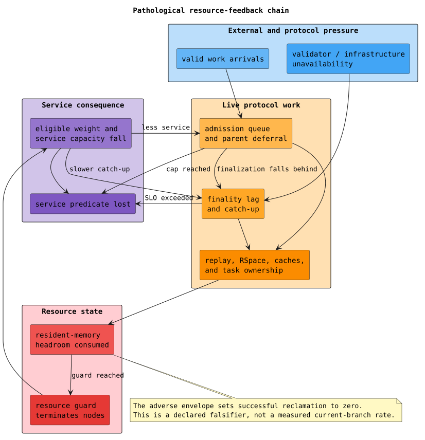

# Shard uptime failure modes and projection models

## Purpose and scope

This document identifies the mechanisms that can make a F1r3node shard stop
providing usable blockchain service, explains how those mechanisms interact,
and records which mathematical or statistical models are permitted to support
an uptime projection. It complements the [thirty-day verification
guide](verification.md); it does not replace the Casper safety, finalized-floor,
fork-choice, replay, or cost-accounting proofs.

The immediate deployment scope is the repository's canonical Docker topology:
three equal-stake validators, a non-validating bootstrap node, a read-only node,
and fault-tolerance threshold `0.1`. A different validator count, stake
distribution, failure-domain layout, storage system, resource guard, or
workload requires a different profile.

Three notions must remain separate:

- **Process alive** means an operating-system process still exists.
- **Shard service-live** means the shard has an eligible quorum, can admit and
  finalize valid work within its declared lag bound, can replay the resulting
  state, and has not exhausted a bounded resource.
- **Protocol safe** means honest nodes cannot certify conflicting finalized
  states and all accepted state transitions satisfy replay and accounting
  invariants.

An alive process is not evidence of a live shard. A probabilistic uptime model
also cannot compensate for a protocol-safety counterexample.

## Service boundary

For shard `s` at time `t`, the operational service predicate is:

```math
\operatorname{Live}_s(t) \equiv
\operatorname{QuorumEligible}_s(t)
\land \operatorname{InfrastructureReady}_s(t)
\land \operatorname{FinalityLag}_s(t) \le L
\land \operatorname{AdmissionResponsive}_s(t)
\land \operatorname{ReplayResponsive}_s(t)
\land \neg \operatorname{ResourceWedged}_s(t).
```

The checked Storm abstraction instantiates this predicate as:

```math
\operatorname{ServiceUp} \equiv
(E \ge Q)
\land \neg C
\land W
\land (G \le L)
\land (B < B_{\max})
\land (M < M_{\max}),
```

where:

- `E` is the number of eligible validators;
- `Q` is the exact quorum count for the equal-stake profile;
- `C` records a common failure-domain outage;
- `W` records writable storage;
- `G` is finality lag in blocks;
- `B` is the admitted-work pressure bucket; and
- `M` is aggregate node-RSS headroom in normalized buckets.

The production observer must exercise a funded, well-formed canary through
admission, finalization, and replay. Missing or stale telemetry is an unknown
service state, not proof of availability.

## Failure-mode register

| Mechanism | Immediate loss of service | Current evidence | Projection treatment |
| --- | --- | --- | --- |
| validator process, host, or network-path failure | eligible weight falls below the exact quorum | Casper quorum proofs, concurrent protocol models, recovery tests | independent residual validator clocks conditioned on explicit common cause |
| common software, host-domain, operator, or network failure | the shard-wide readiness predicate becomes false | fault injection and historical soak evidence | explicit common-cause state; unmodeled correlation invalidates the projection |
| durable storage unavailable | blocks, tuplespace roots, or metadata cannot be committed or retrieved | storage error handling and integration tests | failure and repair clocks with deployment-specific intervals |
| conflicting or regressive finalized state | later transitions no longer have a unique certified state floor | Rocq, TLA+, Apalache, algebraic witnesses, and Rust regressions | forbidden invariant violation; never assigned a tolerable probability |
| replay root or parent state unavailable | a block cannot be deterministically validated or materialized | replay determinism models and integration log guards | hard correctness gate; observed incidents inform validator/common-cause rates only after classification |
| admission pressure reaches its cap | new blocks are deferred and service cannot drain work within the bound | byte-bounded queue implementation, properties, and Loom tests | finite pressure-bucket birth-death process |
| finality lag exceeds the service objective | valid work remains pending beyond the declared bound | finality, heartbeat, and recovery models and tests | independent lag-growth clock with drain available only while protocol-ready |
| parent frontier exceeds the executable cap | a candidate cannot be safely proposed without omitting required parents | fork-choice capacity proofs and proposer regressions | fail-closed deferral; sustained events contribute to pressure and lag calibration |
| resident memory reaches the resource guard | the guardian terminates node processes to protect the host | bounded caches, RSS metrics, Loom/properties, historical guard backtest | normalized memory-growth and reclamation process |
| disk capacity exhausted | storage becomes unavailable even when the storage service is healthy | operational telemetry requirement | excluded until initial headroom and bytes-per-finalized-block are calibrated |
| cost-accounting or purse-settlement invariant fails | a deploy or block must be rejected rather than charged inconsistently | Rocq, TLA+, Apalache, Kani, properties, Loom, and replay tests | forbidden invariant violation; rejection load may still affect pressure |
| malformed, Byzantine, or unauthorized work | validation consumes bounded resources and rejects the work | protocol validation and accounting gates | adversarial workload envelope, not a convenient Poisson safety assumption |
| telemetry loss | service state cannot be established | canary and completeness requirements | projection becomes uncertified until observability is restored |

The occurrence probabilities in the generated engineering report overlap. For
example, one execution can experience both a common outage and memory
exhaustion within 720 hours. Those columns must not be added or interpreted as
exclusive root-cause shares. The report therefore also runs bounded-until
queries that require service to remain up until one named cause occurs. Because
one CTMC transition changes one component, the quorum, common-cause, storage,
queue, lag, and memory results are mutually exclusive first-loss causes. The
gate requires their sum plus uninterrupted survival to equal one within
numerical tolerance. Production incident attribution still requires evidence
because the finite-state cause is only as specific as the abstraction.

## Pathological resource-feedback run

The adverse endpoint intentionally includes zero successful memory
reclamation. It is a falsifier for designs that assume garbage collection,
cache eviction, or allocator return without evidence. Its dominant failure
chain is shown below.



In the checked adverse profile:

- the memory guard is eight normalized headroom buckets above a measured
  healthy baseline;
- background memory growth crosses one bucket per 24 idle hours on average;
- admitted work crosses one pressure bucket every two hours on average;
- service drains one pressure bucket per service hour on average;
- work or lag adds one memory-bucket crossing every two pressure hours on
  average; and
- the reclamation rate is zero.

These are declared adverse assumptions, not measured current-branch rates. They
create positive drift: resident state consumes headroom, pressure or lag adds
more live replay and runtime ownership, and the absence of verified reclamation
prevents recovery. When the configured guard is reached, node termination can
then reduce eligible weight, slow catch-up, and amplify pressure on survivors.

The path is realistic as a hazard class because historical runs crossed their
revision-specific RSS guards and triggered protection. Its *rate* remains an
assumption hole because those runs created fresh shards and retained only peak
RSS, not the time series needed to distinguish a leak from live state,
allocator retention, transient replay allocation, or process replacement.

Finality-lag growth is not restricted to a failed quorum or infrastructure
outage. A validator can remain protocol-ready while peers advance faster than
its local finalizer. The CTMC therefore enables the declared lag-growth clock
in every state below the lag cap and enables lag drain only while the local
protocol is ready. This makes lag an independently reachable first-loss cause
without serializing validators or changing Casper behavior.

## Projection and regression model inventory

The word “regression” has two meanings in this work. A **regression test**
prevents a corrected implementation behavior from returning. A **statistical
regression model** estimates how event rates or outcomes vary with exposure and
covariates. The current engineering envelope uses the former extensively but
does not claim a fitted statistical regression where the required data do not
exist.

| Model | Type | Status | Role and limitation |
| --- | --- | --- | --- |
| shard reliability CTMC | continuous-time finite-state Markov model with exponential holding times | active projection | computes 720-hour uninterrupted survival, down-hours, first-loss mean, and component occurrence probabilities for each declared parameter profile |
| CTMC first-loss partition | bounded-until competing-mechanism queries | active projection | assigns the first abstract service loss to quorum, common cause, storage, queue, lag, or memory and proves numerical partition closure with uninterrupted survival |
| adverse/central/favorable envelope | simultaneous parameter-corner evaluation plus a coupled TLA+ stochastic-dominance refinement | active projection | bounds expected behavior only over the declared stationary rate box; the central point is an engineering assumption, not a fitted mean |
| component formulas | exact rational Storm-pars model | active analytic control | derives `MTTF = 1 / lambda` and availability `mu / (lambda + mu)` for the one-component control; it validates interpretation, not the full shard fit |
| held-out soak model | Laplace-smoothed Bernoulli point estimate with an exact binomial tail | validation-only backtest | trains on nine preceding harness iterations and checks the held-out 19-iteration result; it does not integrate parameter uncertainty as a beta-binomial posterior predictive, and fresh shards plus unclassified failures make continuous lifetime non-identifiable |
| RSS guard reconstruction | deterministic threshold classifier by target revision | validation-only backtest | checks whether a reported peak crossed the guard configured by that revision; it is not a memory-growth regression |
| endpoint sensitivity | exact Storm one-at-a-time endpoint perturbation and monotonicity checks | active engineering analysis | ranks each declared assumption by its expected first-loss effect around the central profile without pretending that a coefficient was estimated from telemetry; repair rates affect recovery observables rather than first loss, and joint interactions remain represented by the complete adverse and favorable corners |
| right-censored lifetime model | piecewise-exponential survival regression with exposure offsets | required for release calibration | estimates event rates from continuous-shard exposure while retaining runs that end without failure; intervals must follow configuration or workload regimes rather than arbitrary binning |
| calibrated competing-risk first loss | cause-specific hazard regression and cumulative-incidence analysis | required for release calibration | estimates how topology, workload, and environment affect the mutually exclusive initiating causes; ambiguous incidents remain unclassified rather than forced into a cause |
| correlated validator failure | shared-frailty or explicit failure-domain multistate model | required when validators share hosts, networks, operators, or software rollout domains | replaces unjustified independent-validator assumptions and must preserve validator stake rather than validator count |
| workload transition model | exposure-aware Poisson regression, or negative-binomial regression when dispersion rejects Poisson | required for calibrated queue and lag rates | estimates upward and downward bucket crossings from valid-work pressure, block size, replay latency, finality state, and topology |
| memory trajectory model | workload-conditioned multistate or mixed-effects growth/reclamation model | required for calibrated memory rates | distinguishes background growth, pressure growth, logical eviction, allocator return, and process restart; aggregate peak RSS alone is insufficient |
| latency-tail model | empirical or quantile regression, with a phase-type or regime-switching model when exponential timing is rejected | required for workload applicability | protects the projection from an unrealistic memoryless approximation under heavy-tailed replay, storage, or network latency |
| joint calibration model | Bayesian hierarchical joint longitudinal, multistate, cause-specific competing-risks model | required for release calibration | connects time-varying queue, deploy-age, finality, memory, storage, and network trajectories to first-loss hazards while partially pooling compatible hosts and revision families; its joint posterior supplies correlated Storm parameters rather than independent marginal corners |

The current numeric report is therefore an **engineering envelope**, not a
release-calibrated lifetime regression. It becomes release evidence only after
the prospective models above are identified from a current-tree, continuous-
shard data set and the resulting rates pass goodness-of-fit, residual,
coverage, and held-out validation.

### Why ordinary least squares is not the default

Shard lifetimes are non-negative, frequently right-censored, and affected by
time-varying workload and shared failure domains. Ordinary least squares on
observed failure times would discard censored exposure, predict impossible
negative lifetimes, and hide cause-specific hazards. The calibration pipeline
therefore models event counts, transition hazards, or lifetime distributions
directly.

### Joint calibration and Storm refinement

An uninterrupted shard instance is one statistical episode. Validators are
nested within the shard; episodes are nested within workflow runs, host
shapes, harness revisions, and semantically compatible code-revision families.
The longitudinal component models the measured service state through time,
including resident memory, admitted-work bytes, oldest pending-deploy age,
submit-to-finalization age, finality lag, cross-validator finalized-floor
spread, replay backlog, storage latency, and network behavior. The multistate
component records transitions among healthy, pressured, degraded, unknown,
recovering, and first-loss states. Cause-specific hazards retain quorum,
common-infrastructure, storage, deploy-age, finality-lag, admission, memory,
telemetry, and unknown failures as distinct competing causes.

For shard episode $`i`$ and first-loss cause $`k`$, the calibration target is:

```math
h_{i,k}(t) = h_{0,k,f(i)}(t)
\exp\!\left(
x_i^{\mathsf T}\beta_k
+ z_i(t)^{\mathsf T}\gamma_k
+ \alpha_k^{\mathsf T}m_i(t)
+ b_{\operatorname{host}(i),k}
+ b_{\operatorname{revision}(i),k}
\right).
```

Here $`h_{i,k}(t)`$ is the cause-specific hazard, $`h_{0,k,f(i)}(t)`$ is the
baseline hazard for compatibility family $`f(i)`$, $`x_i`$ contains fixed
episode attributes, $`z_i(t)`$ contains time-varying observed covariates,
$`m_i(t)`$ is the latent longitudinal service state, and the $`b`$ terms are
shared host and revision-family effects. Piecewise-exponential or spline
baselines avoid assuming one stationary clock across warm-up, steady load,
pressure, and recovery. Student-$`t`$ longitudinal innovations limit the
influence of telemetry spikes. Queue transitions use a negative-binomial form
when dispersion rejects Poisson. Fine–Gray subdistribution hazards may
describe cumulative incidence, but cause-specific generative hazards are the
only competing-risk quantities exported as CTMC transition candidates.

Each posterior draw is transformed into parameters for the matching weighted
validator topology and evaluated by Storm. Posterior medians and intervals are
statistical results. A separately declared joint parameter region, retaining
correlations, is evaluated through Storm or an interval model for robust
bounds. The formal guarantee remains conditional: the Rust implementation must
refine the finite-state model, the observed trace abstraction must be exact,
and the true environment parameters must lie inside that declared region.
Neither posterior probability nor an optimizer can weaken a Casper, replay, or
accounting invariant.

### Validation requirements

A statistical calibration is admissible only if it records:

1. the exact binary, Git revision, configuration, topology, stake distribution,
   failure domains, and resource guards;
2. continuous exposure and censoring for every shard and validator;
3. time-aligned workload, queue, lag, replay, storage, cache, RSS, restart, and
   service-canary observations;
4. incident classification with an explicit unknown category;
5. training, validation, and temporally held-out intervals that do not split a
   single incident across sets;
6. coefficient or rate uncertainty and sensitivity to classification choices;
7. residual and goodness-of-fit checks for stationarity, dispersion,
   heavy tails, and failure-domain correlation; and
8. out-of-sample coverage of survival, first-loss cause, and recovery-time
   predictions.

If an exponential assumption is rejected, the CTMC must be refined with
phase-type stages or a regime-switching model. A better empirical fit may not
remove a protocol state or weaken a hard invariant merely to improve the
reported lifetime.

## Observability and diagnosis

The implementation exposes the signals needed to distinguish the major
resource and progress mechanisms.

| Question | Required signals |
| --- | --- |
| Is aggregate resident memory approaching the guard? | `process.rss-kb`, deployment RSS baseline, configured aggregate guard, host-free memory |
| Are bounded caches retaining their permitted state? | `block-index-cache.size`, `block-index-cache.retained-bytes`, `parents-post-state-cache.size`, `replay-cache.entries`, `replay-cache.retained-bytes` |
| Is admitted work outrunning service? | `block-processing.active`, `block-processing.parallel-limit`, `block-processing.queue.pending`, `block-processing.admission.bytes`, `block-processing.admission.bytes-limit`, `block-processing.admission.deferred.total` |
| Is proposer work accumulating or being refused? | `proposer.queue.pending`, `proposer.queue.rejected.total`, `parent-frontier.capacity-deferred.total` |
| Is finality falling behind? | `block-creator.deploy-admission.lfb-lag`, `finalizer.run.time`, finalized height, latest-message height, cross-validator LFB spread |
| Is replay or parent-state computation the bottleneck? | replay duration and failure class, parent-post-state fetch/LCA/buffer timing, tuplespace root availability, storage latency |
| Did the service actually remain usable? | funded canary admission, inclusion, finalization, replay, and query latency with telemetry-completeness status |

Current runtime bounds include 128 block-index entries and 64 MiB of retained
block-index bytes, 64 parent-post-state entries, and 192 replay entries with 32
MiB of retained replay bytes and at most 1,536 retained event-log entries.
Those bounds constrain known caches; they do not prove that every runtime,
tuplespace, allocator, network, or task-owned allocation is reclaimed.

The following diagnosis procedure preserves evidence before assigning a cause:

```text
observe service_canary, quorum, lag, queues, replay, storage, rss, and telemetry
if telemetry is incomplete:
    classify service as unknown and preserve host and node artifacts
else if a protocol invariant or deterministic replay check failed:
    classify a correctness failure and stop probabilistic interpretation
else:
    identify the first service predicate conjunct that became false
    correlate its transition with process, storage, network, queue, lag, and rss events
    retain ambiguous events as unknown competing risks
    update a calibration data set only when revision and configuration identity match
```

## Prevention and invalidation rules

- Keep correctness failures fail-closed: do not trade safety for a better uptime
  statistic.
- Bound residency by bytes as well as item count, and measure the bound actually
  occupied.
- Preserve validator and shard parallelism; use admission control and ownership
  discipline rather than a global protocol mutex.
- Treat sustained parent-frontier deferral, queue growth, lag growth, or failed
  reclamation as leading indicators rather than waiting for a guardian kill.
- Record common failure domains explicitly. Conditional independence without
  that record is not a defensible assumption.
- Recompute model and implementation hashes after every relevant Casper,
  accounting, storage, queue, cache, heartbeat, or replay change.
- Invalidate a projection when the workload, topology, stake distribution,
  resource guard, storage system, or telemetry coverage leaves its declared
  envelope.

## What is and is not guaranteed

The formal protocol and ownership models can prove safety, conservation,
determinism, bounded interleaving properties, and progress under their stated
fairness and resource premises. The Storm model can calculate exact numerical
results for a declared finite-state stochastic abstraction. Neither result
proves that an unmeasured production rate is correct.

The engineering envelope is useful for exposing pathological mechanisms,
ranking assumptions, and deciding which telemetry or mitigation has the
largest possible effect. It is not a promise that a shard will survive for a
particular duration. Release certification requires current implementation
evidence, continuous-shard exposure, a validated statistical calibration, and
a clean evidence identity.

## References

- Kwiatkowska, Norman, and Parker, “PRISM 4.0: Verification of Probabilistic
  Real-Time Systems,” CAV 2011, DOI
  [`10.1007/978-3-642-22110-1_47`](https://doi.org/10.1007/978-3-642-22110-1_47).
- Dehnert, Junges, Katoen, and Volk, “A Storm is Coming: A Modern Probabilistic
  Model Checker,” CAV 2017, DOI
  [`10.1007/978-3-319-63390-9_31`](https://doi.org/10.1007/978-3-319-63390-9_31).
- Cox, “Regression Models and Life-Tables,” *Journal of the Royal Statistical
  Society: Series B*, 1972, DOI
  [`10.1111/j.2517-6161.1972.tb00899.x`](https://doi.org/10.1111/j.2517-6161.1972.tb00899.x).
- Andersen and Gill, “Cox's Regression Model for Counting Processes: A Large
  Sample Study,” *Annals of Statistics*, 1982, DOI
  [`10.1214/aos/1176345976`](https://doi.org/10.1214/aos/1176345976).
- Fine and Gray, “A Proportional Hazards Model for the Subdistribution of a
  Competing Risk,” *Journal of the American Statistical Association*, 1999,
  DOI
  [`10.1080/01621459.1999.10474144`](https://doi.org/10.1080/01621459.1999.10474144).
