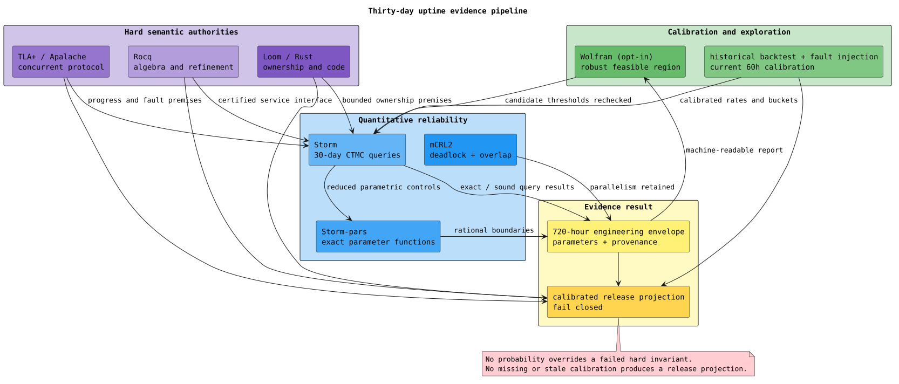

# Thirty-day shard uptime verification

## Objective

For every supported production topology, a continuously operating F1r3node
shard should remain service-live for at least 30 consecutive days while
preserving Casper safety, deterministic replay, exact cost ownership and
conservation, and validator/shard parallelism.

“Live” means usable blockchain service, not merely a process that has not
exited. For shard `s` at time `t`, define:

```math
\operatorname{Live}_s(t) \equiv
\operatorname{QuorumEligible}_s(t)
\land \operatorname{FinalityLag}_s(t) \le L
\land \operatorname{AdmissionResponsive}_s(t)
\land \operatorname{ReplayResponsive}_s(t)
\land \neg \operatorname{ResourceWedged}_s(t).
```

The operational observer must exercise a funded, well-formed canary through
admission, finalization, and replay. A telemetry gap is therefore unknown
service, not evidence of availability.



The permanent [failure-mode and projection-model register](shard-failure-modes.md)
explains the causal paths behind service loss, the implementation signals used
to distinguish them, and every statistical or non-statistical model used or
required by the projection pipeline.

## Evidence classes

The pipeline deliberately separates deterministic guarantees from stochastic
projections.

| Evidence | Tool | Guarantee or result |
| --- | --- | --- |
| consensus safety and exact quorum | Rocq; TLA+/TLC/Apalache | no conflicting certified floors and exact floor-promotion obligations under the modeled fault/fairness envelope |
| replay and accounting correctness | Rocq; TLA+/TLC/Apalache; Kani; Rust properties | deterministic roots/effects and conserved, purse-isolated cost settlement |
| concurrent ownership | Loom | atomic publication, reservation, retry, cancellation, and release for bounded Rust interleavings |
| process progress and parallelism | mCRL2 | deadlock-free finite service interface; replay and validation can overlap across independent shards; the global-mutex control cannot |
| environmental reliability | Storm | time-bounded failure, recovery, resource, lifetime, and reward queries under declared rates |
| parameter sensitivity | Storm-pars | exact rational component formulas and, when calibrated, parameter-region analysis |
| operating-region exploration | Wolfram | optional minimization over exported Storm results; never a proof or release dependency |
| implementation endurance | fault injection and soaks | calibration and falsification evidence rather than a theorem |

No probability can excuse a hard-invariant failure. Byzantine strategy remains
adversarial in the protocol models; it is not assigned a convenient Poisson
rate.

## Stochastic abstraction

The Storm continuous-time Markov chain is an auditable reliability shell. Its
checked-in engineering envelope is scoped to the repository's canonical
three-validator Docker shard at FTT `0.1`; it is not silently generalized to a
different stake distribution, failure-domain layout, or workload. It tracks:

- eligible validator count;
- common failure-domain availability;
- storage writability;
- admitted-work pressure buckets;
- finality-lag buckets; and
- normalized aggregate resident-memory headroom.

All rates are per hour. Queue transitions represent pressure-bucket movement,
not individual deployments. This aggregation keeps month-scale uniformization
tractable and prevents an arbitrary deploy rate from dominating the numerical
solver. The model is valid only while measured bucket transitions refine that
abstraction.

The checked equal-stake service predicate is:

```math
\operatorname{ServiceUp} \equiv
(E \ge Q)
\land \neg C
\land W
\land (G \le L)
\land (B < B_{\max})
\land (M < M_{\max}),
```

where `E` is eligible validators, `Q` is the exact quorum count for the profile,
`C` is a common outage, `W` is storage writability, `G` is the lag bucket, and
`B` is the pressure bucket. `M` is aggregate node RSS measured as crossings of
the headroom between a healthy baseline and the configured resource guard;
bucket zero therefore does not mean zero resident bytes. Unequal stake must
use a stake-preserving model; substituting validator count for weight is
prohibited.

For a 30-day horizon `H = 720` hours, the principal queries are:

```math
S_{30} = \Pr[\forall t \in [0,H],\ \operatorname{ServiceUp}(t)],
```

```math
A_{30} = 1 - \frac{\mathbb{E}[\operatorname{DownHours}(0,H)]}{H},
```

and the mean time to first service loss:

```math
\operatorname{MTTF} =
\mathbb{E}[\inf\{t \ge 0 \mid \neg\operatorname{ServiceUp}(t)\}].
```

## Engineering envelope

A continuous-time Markov chain has a literal minimum failure time of zero and
an unbounded maximum failure time. The useful “minimum/average/maximum” report
therefore means worst, central, and best *expected lifetime over the declared
parameter envelope*, not extrema of individual random executions.

The gate evaluates adverse, central, and favorable endpoints from
`formal/storm/uptime/profiles/current-compose-envelope.json`. Every parameter
is classified as implementation-exact, exactly derived, a scope precondition,
or an assumption hole. The central case is a declared engineering assumption,
not a fitted population mean. Simultaneous endpoints are intentionally
conservative; no hidden optimizer selects a more favorable combination.

The endpoint order is formally checked rather than inferred from three solver
runs. `formal/tlaplus/uptime/UptimeEnvelopeDominance.tla` couples adverse and
favorable shards through shared events, represents the residual rate as
adverse-only failure/load clocks or favorable-only repair/service clocks, and
explores their arbitrary interleavings. It proves componentwise state
dominance and `adverse service up => favorable service up`. The unsafe control
adds a favorable-only validator failure and must violate dominance. This
coupling supplies the stochastic ordering used to interpret the simultaneous
corners as worst and best within the declared stationary, exponential-rate
box.

The generated
`target/verification/uptime/engineering-envelope.md` is the only human-facing
numeric report. It includes every parameter, unit, source or assumption, the
Git commit, the dirty-tree flag, and implementation/model/profile hashes.
Static numeric projections are excluded from this document because they would
become stale as Casper changes. A copied result is invalid without the complete
parameter table and evidence identity.

The aggregate gate hashes its complete uptime formal/checker input set before
and after execution and rejects a torn run if they differ. Each TLC invocation
also binds its configuration, local TLA⁺ sources, checker binary, fingerprint
polynomial, seed, and worker count, and recomputes that identity at exit.
Checkpoint recovery is unavailable without the exact originating identity.
Consequently, a model edit cannot be paired with solver output produced by the
preceding revision.

Expected downtime can be small while uninterrupted survival is much lower:
even a short repairable outage breaks the uninterrupted-month event. The
engineering envelope is reportable with its assumptions, but it is not a
release-certified production forecast.

## Exact controls and falsifiers

The gate requires all of the following:

1. A one-component, no-repair control agrees with
   `1 - exp(-lambda * t)` at `lambda * t = 1`.
2. Storm-pars derives exact `MTTF = 1 / lambda` and steady-state availability
   `mu / (lambda + mu)`.
3. A recoverable 3-of-4 boundary returns to service with probability one and
   expected recovery below 0.1 hours in its constructed profile.
4. Removing all repair makes recovery probability zero.
5. Sustained pressure above relief reaches the finite queue cap with
   probability greater than 0.99 in the negative-control horizon.
6. The historical configuration reconstructed from control revision
   `fe97ccb18610d12637abc9cd51ae637c4a01c1e3` and node revision
   `71c4d11a0fec8fcac559eaab4dcd3e97a30d2460` matches its checked manifest.
7. A held-out 19-iteration soak is consistent with the aggregate failure
   probability estimated only from its nine published predecessors.
8. Every published aggregate RSS peak at or above its revision-specific guard
   coincides with an observed protection breach; breaches below that guard are
   retained because host-free-memory and other protections are distinct.
9. Adverse, central, and favorable expected lifetimes and survival
   probabilities remain ordered. There is no artificial pass threshold on an
   uncalibrated expected lifetime.
10. The mCRL2 safe service interface is deadlock-free and admits replay and
    validation overlap in both orders; the global-mutex model must refute the
    overlap property.
11. TLA+ proves the adverse/favorable endpoint coupling under every bounded
    event interleaving; the favorable-only-failure control violates it.
12. A no-reclamation resident-growth control reaches the memory guard with
    probability greater than `0.99`, preventing a model that silently treats
    garbage collection or allocator return as guaranteed.

## Historical backtest and implementation delta

The longest published daily run with reconstructable aggregate data is Actions
run `31563121791`. It used:

- workflow/control revision `fe97ccb18610d12637abc9cd51ae637c4a01c1e3`;
- node revision `71c4d11a0fec8fcac559eaab4dcd3e97a30d2460`;
- system-integration revision `755301662e4f86ffb55f51077b88f32212a1f3ed`;
- three equal-stake validators at FTT `0.1`;
- alternating fresh Docker and subprocess shards running `test_load.py`;
- a 64 GiB host, 45,056 MiB node-RSS ceiling, and 8,192 MiB host-free floor.

The preceding published records contained nine failures in nine iterations.
The backtest uses their Laplace-smoothed Bernoulli probability and holds out the
19-iteration run, which observed 18 failures. Storm evaluates the probability
of that outcome or worse and the expected held-out failure count. This is a
backtest of aggregate harness failure detection, not a lifetime fit: the 650 MiB
detailed artifact expired, failure classes are unavailable, and every
iteration created a new shard.

The separate RSS-guard backtest reconstructs the configured ceiling directly
from each published run's target revision. Every run whose reported aggregate
RSS peak reached that ceiling also reported a protection breach. Some runs
breached protection below the RSS ceiling, which is expected because the
historical guardian independently enforced host-free-memory and other limits.
This checks classification and configuration drift without treating the RSS
guard as the only outage mechanism.

The published records do retain aggregate RSS peaks. They are used to verify
that memory is an observed failure dimension and to reconstruct the historical
guard, but not to estimate a continuous memory-growth rate: a peak from a
fresh-shard iteration cannot distinguish retained live state, allocator
behavior, transient replay allocation, or a leak. The current model therefore
uses declared background-growth, pressure-growth, and reclamation intervals,
including a no-reclamation adverse endpoint, until a current-tree time series
can identify those rates.

Current changes are not converted into invented reliability improvements.
They alter the model boundary explicitly: byte-bounded block admission replaces
count-only residency; finalized-state and exact-quorum proofs become hard
gates; hash-observed bounded recovery rounds replace the older heartbeat
recovery condition; frozen-frontier admission refuses oversize parent sets
instead of truncating them; and cooperative finalizer scheduling removes fixed
work truncation without serializing validators. Rates affected by these changes
remain intervals until a matching current-tree soak measures them.

### Historical-evidence mapping to the current model

The historical records constrain only the current-model fields named below.
No other Storm rate is inferred from them.

| Historical observation | Current-model destination | Admissible use | Prohibited inference |
| --- | --- | --- | --- |
| three equal-stake validators and FTT `0.1` | `VALIDATORS = 3`, `QUORUM = 2`, and equal-stake scope in `current-compose-envelope.json` | reconstruct the historical service predicate and retain the same topology as the engineering-envelope scope | generalize validator count into weighted quorum for unequal stake |
| 64 GiB host, 45,056 MiB aggregate node-RSS guard, and 8,192 MiB host-free floor | historical context plus the revision-specific RSS classifier | reproduce whether an observed peak crossed the guard active for that revision | estimate background growth, pressure growth, reclamation, or MiB per normalized memory bucket |
| nine failed predecessor iterations | training count in `soak_backtest.prism` | obtain the Laplace-smoothed Bernoulli point probability `10 / 11` used only by the held-out aggregate-failure check | interpret an iteration as continuous-shard exposure or a cause-specific event rate |
| 18 failures among 19 held-out iterations | held-out count in `soak_backtest.prism` | check the expected aggregate failure count and the exact binomial probability of an outcome at least this severe | fit or validate a shard-lifetime distribution |
| each iteration creates a fresh Docker or subprocess shard | backtest identifiability limit | prevent cross-iteration time from being summed into one lifetime | treat the 19 iterations as a right-censored continuous soak |
| aggregate RSS peak and protection-breach outcome | `public-rss-guard.json` classifier observations | test threshold reconstruction and retain below-RSS breaches as distinct host-protection outcomes | assign every breach to memory or estimate a memory hazard from peak-only data |
| expired detailed artifact and absent cause labels | calibration status `not certified` | force current cause-specific and transition rates to remain assumption holes | distribute failures among common cause, validator, storage, queue, lag, or memory rates |

The resulting relationship is deliberately asymmetric: the historical data
can falsify a configuration reconstruction or aggregate-outcome classifier,
but it cannot certify the current reliability CTMC. A release-calibrated
profile must replace each applicable assumption hole with exposure-aware,
current-tree telemetry satisfying the schema below.

### Current preflight observation: run 33099406770

Actions run `33099406770` is preserved in
`formal/storm/uptime/backtests/preflight-33099406770.json`, including the
non-expired artifact's SHA-256 digest. It used control and node revision
`af1e5209d0924c49e96bca912fda35b2c7c0c82b`, system-integration revision
`8b4da0f9395fc951b68af1be8ae023fb1aeb9d09`, and an Oracle Cloud
`VM.Standard.E6.Flex` host with 16 OCPUs and 64 GiB of memory. The configured
aggregate node-RSS ceiling was 45,056 MiB and the host-free floor was 8,192
MiB.

The run did not execute a soak. Its Docker integration preflight collected 124
tests and ran for 8,954 seconds. One test failed:
`test_deploy_throughput_and_finalization` reported 604 deploys not finalized
within 45 seconds and a six-node drain spread from finalized height 75 to 82.
The failed test had four equal-stake validators plus boot and read-only nodes.
The preflight failure skipped all six scheduled soak segments and the
aggregate soak report, leaving continuous-shard soak exposure at zero.

The 604 observations are admissible as right-censored deploy-age and
short-load finality-response evidence. They are not 604 shard failures, and the
8,954-second preflight is not a right-censored shard-lifetime sample because it
contains many independently created test shards. The four-validator topology
also cannot calibrate the current three-validator CTMC. Consequently, this run
does not tighten or replace the adverse, central, or favorable 30-day
engineering envelope.

| Run-330 observation | Current-model destination | Admissible use | Prohibited inference |
| --- | --- | --- | --- |
| exact revisions, runner identity, OCI shape, OCPUs, memory, and resource guards | evidence identity and hardware/configuration strata | compare only episodes with recorded compatible identities and estimate hardware effects after overlapping revisions exist | attribute a code effect to hardware or a hardware effect to code from this single confounded run |
| 604 deploys beyond a 45-second finalization deadline | deploy-age and finality-response longitudinal state | preserve each deployment as right-censored at its last complete observation and expose oldest-age or phase buckets to calibration | convert the count into shard-lifetime events or an exponential finality clock |
| four equal-stake validators and six network nodes | topology-specific model selector | require a four-validator weighted model before parameter fitting | inject observations into the canonical three-validator count abstraction |
| 7-block finalized-height spread at drain | cross-validator finalized-floor spread and lag trajectory | classify a preflight finality-pressure event and correlate it with workload and resources | infer permanent consensus disagreement without hashes, certificate state, and subsequent convergence evidence |
| 7,118 MiB archived peak aggregate node RSS | transient resource trajectory | validate telemetry extraction and retain the measured host headroom | estimate month-scale growth, reclamation, or a memory-failure hazard from one aggregate peak |
| zero completed soak segments | exposure and censoring register | fail lifetime calibration closed | report a current-branch 30-day survival probability |

## Calibration and release certification

Release projection is fail-closed. A calibration profile must be versioned,
current, complete, and tied to a topology, workload envelope, binary, and
configuration. It must contain exposure time, common-cause identity,
right-censored failure/repair observations, validator catch-up stages, LFB
spread, queue and resident bytes, replay latency, retries, RSS, storage growth,
and telemetry completeness.

Memory calibration records the healthy aggregate RSS baseline, configured RSS
guard, MiB represented by each normalized bucket, time-stamped upward and
downward bucket crossings, queue/lag state at each crossing, process restarts,
and whether apparent reclamation came from logical eviction, allocator return,
or process replacement. Omitting any of those fields makes the memory-derived
projection non-identifiable.

The release estimator is a Bayesian hierarchical joint longitudinal,
multistate, cause-specific competing-risks model. It retains right-censoring,
time-varying service state, common host effects, and compatible revision-family
effects. It exports correlated posterior draws and a conservative joint
parameter region to topology-specific Storm models. Ordinary least squares on
observed run duration is prohibited, as is fitting independent marginal rates
and combining their most convenient endpoints. The complete model equation,
state variables, distribution choices, and validation criteria are specified
in the [failure-mode and projection-model register](shard-failure-modes.md#joint-calibration-and-storm-refinement).

For zero observed events over exposure `X`, the failure rate is not zero. A
one-sided 95% Poisson upper bound is approximately:

```math
\lambda_{0,95}^{\mathrm{upper}} = \frac{-\ln(0.05)}{X}
\approx \frac{2.996}{X}.
```

The schema is
`formal/storm/uptime/profiles/calibrated-profile.schema.json`. The gate also
requires the calibration's commit, implementation hash, and model hash to
match the current clean tree. Any relevant Casper or model change invalidates
the evidence instead of silently carrying an old forecast forward.

The gate emits “not certified” when calibration is absent, stale, outside its
declared envelope, or numerically ambiguous. A literal 30-day soak is valuable
post-merge release evidence, but this epic does not wait 30 days: accelerated
fault injection and the 60-hour soak calibrate and falsify the model, while
Storm projects the 720-hour horizon. Accelerated testing never converts wall
time by a simple scale factor.

## Execution

Run the unlicensed formal pipeline:

```bash
scripts/check-uptime-ALL.sh
```

Opt into licensed Wolfram operating-region exploration only after Storm has
produced its machine-readable engineering envelope:

```bash
RUN_WOLFRAM=1 scripts/check-uptime-ALL.sh
```

Request release certification only with a current calibrated profile:

```bash
UPTIME_RELEASE_CERTIFY=1 \
UPTIME_CALIBRATION_PROFILE=/path/to/calibrated-profile.json \
UPTIME_MONTH_SURVIVAL_MIN=0.999 \
scripts/check-uptime-ALL.sh
```

Generated evidence belongs under `target/verification/uptime/`; no gate writes
model-checker data to `/tmp`.

## References

- C. Hensel, S. Junges, J.-P. Katoen, T. Quatmann, and M. Volk, “The probabilistic model checker Storm,” *International Journal on Software Tools for Technology Transfer* 24, 589–610 (2022), [doi:10.1007/s10009-021-00633-z](https://doi.org/10.1007/s10009-021-00633-z).
- J. F. Groote, J. J. A. Keiren, F. P. M. Stappers, J. W. Wesselink, and T. A. C. Willemse, “Experiences in developing the mCRL2 toolset,” *Software: Practice and Experience* 41(2), 143–153 (2011), [doi:10.1002/spe.1021](https://doi.org/10.1002/spe.1021).
