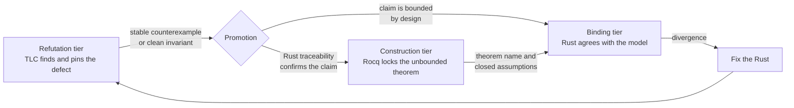

# Correctness by Construction: Refutation and Construction Tiers

This document states how TLA+ and Rocq divide the work of correctness by
construction (CbC) in this repository. It refines the philosophy in
[Formal Verification](./formal-verification.md). That document keeps the tool
stack, the tier ladder, and the conventions for a verified area. This document
keeps the division of labor between the tools and the rule that moves a result
from one tier to the next.

## Summary

TLC gives design CbC. Each refinement is a finite model that TLC can break.
Rocq gives construction CbC. The unbounded theorem is a term that the kernel
checks, and invariants are inductive types that compose across subsystems.
Rust is the only executable. Traceability and bisimilarity bind the Rust to
both tiers.

The loop is: find the defect with TLC, promote the stable result, lock the
unbounded theorem in Rocq, and bind the Rust implementation. No tier pretends
to be another. TLAPS is not the kernel. Rocq is not a model checker. Rocq does
not extract the executable.

## Scope

This division of labor applies to the Rust-facing subsystems that
[`.gitattributes`](../.gitattributes) marks `cbc=mandatory`. Those subsystems
are consensus, finality, merging, replay, block storage, the interpreter, and
cryptography. Their correctness claims are unbounded, and a bounded model
cannot close them.

The soak driver models under
[`formal/tlaplus/soak_disk/`](../formal/tlaplus/soak_disk) stay in the
refutation tier only. They describe a Bash driver and its fixtures. A kernel
theorem about a shell script adds cost without a matching reduction in risk.
The tier record for those cycles states that the construction tier does not
apply.

## The three tiers

| Tier | Tool | Claim form | Result form | Gate |
| --- | --- | --- | --- | --- |
| Refutation | TLA+ with TLC | Invariant or liveness property over a finite instance | Clean run, or a counterexample trace | Pull request tier in two minutes, full list nightly |
| Construction | Rocq | Theorem over unbounded state with a closed assumption set | Kernel-checked proof term, `coqchk` clean | Nightly and manual |
| Binding | Rust tests | Agreement between the Rust and the reference model | Bisimilarity test, pre-fix regression, Kani harness | Pull request tier |

### Refutation tier

The refutation tier finds and pins defects. Each verified area retains one
expected-violation configuration per defect class beside its clean
configuration. The clean configuration must pass. The expected-violation
configuration must fail on its named invariant with TLC exit 12.

A refutation result is bounded. It states that no trace inside the finite
instance violates the invariant. It does not state that the invariant holds
for every instance. The area README records the instance bounds.

### Construction tier

The construction tier locks the unbounded claim. Each Rocq project exports one
`MainTheorem` module. The gate builds the project, runs `coqchk` on that
module, and counts the assumptions of each named theorem. Any `Axiom`,
`Admitted`, or `Parameter` in the trust base is a verification failure.

A construction result is a term, not a run. It composes. A higher theorem
imports a lower theorem and uses it without re-proving it. That is how the
subsystems stack, in the same way that Bythos composes Byzantine fault
tolerance layers from proven components.

### Binding tier

The binding tier connects the Rust to the models. This repository rejects
proof extraction on purpose. The reasons are in the
[tier architecture](./casper/theory/slashing/design/14a-tier-architecture.md),
section 4. The Rust stays idiomatic, the build stays cargo only, and drift is
detected rather than prevented.

Binding evidence takes three forms. A bisimilarity test runs the production
code and a hand-translated oracle on the same inputs and requires the same
outputs. A pre-fix regression test fails on the code before the fix and passes
after it. A Kani harness proves a bit-precise property over the whole input
domain of one function.

## The promotion loop

Promotion is a rule, not a reflex. A TLC witness becomes Rocq work only after
Rust traceability confirms that the claim is stable. The
[slashing Rocq README](../formal/rocq/slashing/README.md) states this rule for
that area. This document makes the rule repository-wide for the subsystems in
scope.

The loop runs in this order:

1. Write the TLA+ model with one knob constant per defect class.
2. Register the clean configuration and the expected-violation configuration
   in [`check-tla-invariants.sh`](../scripts/ci/check-tla-invariants.sh).
3. Trace the counterexample to the Rust. Fix the Rust, and add the pre-fix
   regression test.
4. Promote the stable invariant to a Rocq theorem when the claim is
   unbounded. Record the theorem name in the area correspondence table.
5. Bind the Rust to the theorem with a bisimilarity test or a Kani harness.
6. Record which tiers the cycle reached in its evidence package.

Step 4 is optional only when the claim is bounded by design. A claim about a
fixed-size table or a finite enum can close in the refutation tier. A claim
about every block, every deploy, or every validator set cannot.

## What each tier does not do

- TLC does not prove the unbounded claim. A clean run at three validators says
  nothing about four.
- TLAPS is not the kernel of record. This repository does not accept TLAPS
  proofs as construction-tier evidence.
- Rocq does not search for counterexamples. A failed proof attempt is not a
  refutation. The refutation tier owns counterexamples.
- Rocq does not produce the executable. The Rust is the executable, and the
  binding tier holds it to the model.
- The binding tier does not prove the model. A passing bisimilarity test shows
  agreement with the oracle, not correctness of the oracle.

## Composition across subsystems

Each Rocq project under [`formal/rocq/`](../formal/rocq) owns one
`MainTheorem` module. The gate in
[`check-formal-invariants.sh`](../scripts/ci/check-formal-invariants.sh)
names the theorems it counts and the expected assumption count for each.

Composition follows two rules. A project may import another project's
`MainTheorem` only through its `_CoqProject` dependency list, so the gate sees
the edge. A composed theorem inherits the union of the assumption sets, and
the gate count must reflect that union. A composed theorem with more
assumptions than its parts has introduced a new assumption, and the gate must
name it.

## Recording the tiers in evidence

Each verified cycle records the tiers it reached in its cycle log under
[`docs/tdd-plans/`](./tdd-plans) and in its evidence package under
[`docs/cbc-evidence/`](./cbc-evidence). The existing cycle log fields
`red_exit`, `formal_red_exit`, `green_exit`, and `formal_green_exit` record the
refutation tier and the binding tier.

Two fields extend the record for the construction tier:

| Field | Value | Meaning |
| --- | --- | --- |
| `construction` | `pending`, `not-applicable`, or a theorem name | Whether the unbounded claim is locked, and where |
| `construction_assumptions` | An integer | The assumption count the gate verified for that theorem |

A cycle in a soak driver model records `construction: not-applicable`. A cycle
in a mandatory Rust-facing subsystem records `pending` until the theorem lands.
The claim inventory under [`docs/claims/`](./claims) binds the theorem file by
digest in the same way it binds every other input.

## Applicability today

| Subsystem | Refutation | Construction | Binding | Gap |
| --- | --- | --- | --- | --- |
| Slashing | TLC, gated | Rocq, gated with `coqchk` and assumption counts | Triple bisimilarity, pre-fix regressions, Kani | None. This is the template. |
| Fork choice | TLC, gated | Rocq, gated | Property tests | Binding lacks a bisimilarity oracle. |
| Finalized floor | TLC, gated | Rocq project exists | Property tests | The Rocq project is not in the nightly gate. |
| Merge algebra | None | Rocq project exists | Backstop alignment test | No TLC model. The Rocq project is not in the nightly gate. |
| Replay guards | TLC for replay liveness | Rocq, gated | Property tests | The TLC model and the Rocq project cover different claims. |
| Runtime isolation | TLC | Rocq project without a `MainTheorem` | None | The Rocq project cannot enter the gate until it exports a main theorem. |
| Block admission, deploy lifecycle, carrier index, recovery leader, deploy recovery, deploy occurrence | TLC, gated | None | Property tests | Each needs a promotion decision per claim. |
| Soak driver | TLC, gated | Not applicable | Container fixtures | None by design. |

The gaps are the work queue for this philosophy. The first three rows close
by gate registration and one oracle. The last mandatory row closes by a
promotion decision per invariant, recorded in each area README.

## Terms

These terms are proposed for [`Glossary.md`](./Glossary.md). Until they land
there, this document defines them.

- **Refutation tier.** The bounded model-checking tier. It finds and pins
  defects with TLC.
- **Construction tier.** The kernel-checked proof tier. It locks unbounded
  claims with Rocq.
- **Binding tier.** The test tier that holds the Rust to the models by
  bisimilarity, regression, or exhaustive harness.
- **Promotion.** The decision to carry a stable refutation-tier result into
  the construction tier after Rust traceability confirms it.

## References

- [Formal Verification](./formal-verification.md), the umbrella for stack,
  ladder, and conventions.
- [Tier architecture for slashing tests](./casper/theory/slashing/design/14a-tier-architecture.md),
  the rejection of extraction and the triple-bisimilarity pattern.
- [Slashing Rocq README](../formal/rocq/slashing/README.md), the trust base
  rule and the promotion rule for that area.
- [Slashing TLA+ README](../formal/tlaplus/slashing/README.md), the
  invariant-to-theorem correspondence table.
- The workspace CbC Chain standard, `docs/standards/cbc-chain.md` in the
  gitlab-profile repository, for the six-link evidence record this document
  feeds at link 4.
