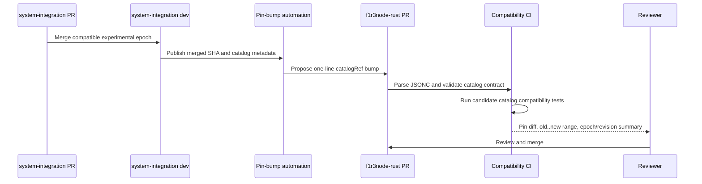

# Trusted CI Pin Registry

## Canonical status

This document is canonical for dependency-pin ownership, trust selection, and consumption in `F1R3FLY-io/f1r3node-rust`. The system-integration executor/catalog contract is canonical in [system-integration's randomized exercise soak contract](https://github.com/F1R3FLY-io/system-integration/blob/dev/docs/specs/randomized-exercise-soak-contract.md). Each document links to the other; neither duplicates the other's executable contract.

## Problem

`SYSTEM_INTEGRATION_REF` is currently duplicated in `.github/oci-validation.env`, `.github/workflows/_integration-pipeline.yml`, and `.github/workflows/merge-recovery-soak.yml`. OCI CLI installer URL, version, and checksums are also repeated across integration, validation, soak, signal, and reaper workflows. Drift checks detect some divergence but retain a multi-file bump process and do not cover every consumer.

The existing system-integration pin also binds two different trust domains:

- privileged runner launcher and cloud-init code executed by secret-bearing jobs;
- integration harness and exercise catalog executed against the node under test.

A routine catalog addition should not implicitly replace privileged launcher code.

## Decision

Create `.github/ci-pins.jsonc` as the only in-repository source for:

- immutable system-integration runner SHA;
- immutable system-integration catalog/harness SHA;
- accepted catalog schema version;
- OCI CLI version;
- OCI installer URL;
- installer script SHA-256; and
- downloaded `install.py` SHA-256.

The runner and catalog refs are intentionally split. Most new exercise epochs require only a one-line `catalogRef` change after their system-integration branch merges.

## Proposed registry

```jsonc
{
  "$schema": "./schemas/ci-pins.schema.json",
  "schemaVersion": 1,
  "systemIntegration": {
    "runnerRef": "369d49df2f97e65b3d0ad869aa668a7383b11179",
    "catalogRef": "369d49df2f97e65b3d0ad869aa668a7383b11179",
    "catalogSchemaVersion": 1
  },
  "ociCli": {
    "version": "3.89.1",
    "installerUrl": "https://raw.githubusercontent.com/oracle/oci-cli/v3.89.1/scripts/install/install.sh",
    "installerSha256": "079dcc9a3e2a61ec692400e30169c9996b2998ac8c4e205198ed5863283fcb76",
    "installerPySha256": "f66dc9e2b69cbbd269374db638ffa9c0b08a5a4ea0b836b81336d6581aab9eed"
  }
}
```

Only immutable 40-character lowercase Git SHAs are accepted. Branches and tags are not emergency fallbacks. The OCI URL must be HTTPS, version-bound, and consistent with `ociCli.version`; both installer layers must be checksum-verified by every consumer.

Required and release-gating epoch IDs are not inherited from system-integration catalog metadata. They remain explicit soak policy in this repository. A compatible new experimental epoch can become eligible after a catalog pin bump, but promotion to required or gating status is a separate reviewed policy change.

## JSONC resolution

GitHub Actions cannot import an arbitrary JSONC document into workflow-level `env`. A committed resolver must therefore run on `ubuntu-latest` before dependent jobs and expose validated job outputs.

The resolver must:

1. parse JSONC without downloading a parser at runtime;
2. support comments and trailing commas while rejecting duplicate keys;
3. validate against a committed schema;
4. require exact keys and reject unknown security-sensitive fields;
5. require lowercase 40-character SHAs;
6. verify OCI URL/version consistency and 64-character lowercase checksums;
7. emit runner, catalog, schema, URL, version, and checksum outputs;
8. write a non-secret resolution summary; and
9. fail before any OCI runner, instance, or shard is launched.

The parser executes only on GitHub-hosted resolver jobs. Self-hosted and ephemeral jobs consume `needs.<resolver>.outputs.*`; they do not parse the file independently. This avoids depending on host-specific JSONC tooling and gives all workflows one implementation.

No network-fetched JSONC package may run in the trusted resolution path. The implementation may use a committed parser or a pinned, checksum-verified tool already represented in this registry.

## Trust-source matrix

| Trigger | Configuration used by privileged jobs | Candidate catalog behavior |
| --- | --- | --- |
| Protected branch push | Pin file from the pushed protected commit | Use committed catalog pin |
| Schedule | Pin file from the workflow/control commit | Use committed catalog pin |
| Manual workflow dispatch | Pin file from the selected trusted workflow ref | Use committed catalog pin |
| Same-repository PR | Candidate pin after normal environment and branch controls | Validate candidate catalog pin before merge |
| Fork PR via `pull_request_target` | Base branch runner and OCI pins only | Candidate file may be syntax-checked but cannot influence privileged execution |
| Full OCI validation | Exact approved PR head after maintainer permission and comment checks | Candidate runner/catalog pins may execute only after existing approval gates |

The fixed repository `F1R3FLY-io/system-integration` remains part of the trust boundary. A SHA cannot redirect checkout to another repository.

## Consumer migration

The one-time refactor must migrate every current consumer:

- reusable integration pipeline;
- ordinary CI build-base and heavy pipeline;
- fork PR pipeline;
- full OCI validation;
- merge-recovery soak;
- soak signal workflow;
- OCI runner reaper; and
- any deployment or restart script that installs OCI CLI or checks out system-integration.

`.github/oci-validation.env` is removed after its remaining values move to the JSONC registry. Workflow-level pin literals are removed rather than retained as fallbacks.

Every checkout chooses the correct output:

- secret-bearing launcher checkout uses `runnerRef`;
- integration harness, compatibility probe, and exercise catalog checkout use `catalogRef`.

If one job needs both, it performs separate checkouts or verifies that an intentionally shared SHA was resolved for both roles. No consumer silently substitutes one role for the other.

## Invariants and tests

Workflow invariants must prove that:

- `.github/ci-pins.jsonc` is the only allowed literal source for these values;
- all required workflows depend on a resolver output before privileged or resource-consuming steps;
- no mutable system-integration ref is accepted;
- no OCI installer runs without both applicable checksum checks;
- fork-controlled content cannot select privileged pins;
- candidate pin validation remains bound to the exact reviewed PR head;
- malformed JSONC, duplicate keys, missing keys, unknown keys, bad SHAs, URL/version mismatch, and bad checksums fail;
- resolver outputs are identical across all consumers; and
- failures occur before OCI resource launch.

Tests must mutate each protected property and prove the guard fails with a diagnostic naming the violated contract.

## Catalog bump flow



Automation is planned but initially disabled. Early pin bumps remain manual while the catalog and resolver accumulate real soak evidence. Future automation may open a PR changing only `catalogRef` and generated review evidence; it may never merge or promote gating policy automatically.

## Cross-repository change rules

| Change in system-integration | Required change here |
| --- | --- |
| Add backward-compatible experimental epoch | One-line `catalogRef` bump |
| Revise epoch behavior compatibly | One-line `catalogRef` bump; review revision/digest evidence |
| Promote epoch to required or gating | Catalog pin bump plus separate explicit local policy review |
| Change catalog schema incompatibly | Coordinated branches, schema/parser/tests, and accepted version update |
| Change executor capability needed by scheduler | Coordinated branches and compatibility fixtures |
| Change runner launcher or cloud-init only | `runnerRef` bump after privileged old..new review |
| Change both launcher and catalog | Review and update both refs explicitly, even if they resolve to one SHA |

## Rollout

1. Add JSONC registry, schema, parser, and resolver tests without changing consumers.
2. Migrate system-integration checkouts to split runner/catalog outputs.
3. Migrate OCI CLI consumers and strengthen all of them to verify both installer layers.
4. Apply the trigger-specific trust matrix.
5. Remove `.github/oci-validation.env` and inline pin copies.
6. Add negative workflow invariants preventing reintroduction.
7. Validate ordinary CI, fork CI, full OCI validation, soak dispatch, signal, and reaper dry runs.
8. Enable manual one-file catalog pin bumps.
9. Add PR-opening automation only after real-run evidence.
