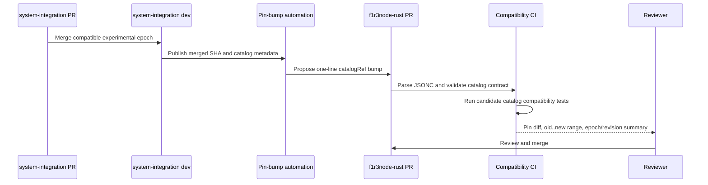

# Trusted CI Pin Registry

## Canonical status

This document is canonical for dependency-pin ownership, trust selection, and consumption in `F1R3FLY-io/f1r3node-rust`. The system-integration executor/catalog contract is canonical in [system-integration's randomized exercise soak contract](https://github.com/F1R3FLY-io/system-integration/blob/392368870dd686587cabc03e1b965ef45bc0fa62/docs/specs/randomized-exercise-soak-contract.md). Each document links to the other; neither duplicates the other's executable contract.

The counterpart documentation link identifies the reviewed contract text. It may differ from the runtime `catalogRef`: only `catalogRef` selects executable system-integration code, and compatibility tests must pass before that runtime pin advances.

## Problem

Before migration, `SYSTEM_INTEGRATION_REF` was duplicated in `.github/oci-validation.env`, `.github/workflows/_integration-pipeline.yml`, and `.github/workflows/merge-recovery-soak.yml`. The reusable pipeline now resolves the registry, while the environment file and merge-recovery soak remain transitional. OCI CLI installer URL, version, and checksums also remain repeated across validation, soak, signal, and reaper workflows. Transitional drift checks keep those values aligned until their consumers migrate.

The existing system-integration pin also binds two different trust domains:

- privileged runner launcher and cloud-init code executed by secret-bearing jobs;
- integration harness and exercise catalog executed against the node under test.

A routine catalog addition should not implicitly replace privileged launcher code.

## Decision

Create `.github/ci-pins.jsonc` as the only in-repository source for:

- immutable system-integration runner SHA;
- immutable system-integration catalog/harness SHA;
- accepted catalog schema version;
- OCI CLI version;
- OCI installer URL;
- installer script SHA-256; and
- downloaded `install.py` SHA-256.

The runner and catalog refs are intentionally split. Most new exercise epochs require only a one-line `catalogRef` change after their system-integration branch merges.

## Implementation status

The first migration slice is active:

- `.github/ci-pins.jsonc` has a committed schema and offline resolver;
- CI tests malformed, duplicated, mutable, and inconsistent values;
- the reusable integration pipeline resolves trusted pins before resource-consuming jobs;
- its privileged launcher checkout consumes `runnerRef`;
- its integration harness checkout consumes `catalogRef`; and
- fork runs resolve the registry from the base commit rather than fork-controlled content.

Other OCI and system-integration consumers remain transitional. Their legacy literals are checked against the registry and must remain coincident until they migrate. Consequently, a catalog-only pin bump is **not operationally permitted yet**; the one-line bump procedure becomes active only after TASK-016-4 removes the remaining single-ref consumers.

## Registry

```jsonc
{
  "$schema": "./schemas/ci-pins.schema.jsonc",
  "schemaVersion": 1,
  "systemIntegration": {
    "runnerRef": "369d49df2f97e65b3d0ad869aa668a7383b11179",
    "catalogRef": "369d49df2f97e65b3d0ad869aa668a7383b11179",
    "catalogSchemaVersion": 1
  },
  "ociCli": {
    "version": "3.89.1",
    "installerUrl": "https://raw.githubusercontent.com/oracle/oci-cli/v3.89.1/scripts/install/install.sh",
    "installerSha256": "079dcc9a3e2a61ec692400e30169c9996b2998ac8c4e205198ed5863283fcb76",
    "installerPySha256": "f66dc9e2b69cbbd269374db638ffa9c0b08a5a4ea0b836b81336d6581aab9eed"
  }
}
```

Only immutable 40-character lowercase Git SHAs are accepted. Branches and tags are not emergency fallbacks. The OCI URL must be HTTPS, version-bound, and consistent with `ociCli.version`; both installer layers must be checksum-verified by every consumer.

Required and release-gating epoch IDs are not inherited from system-integration catalog metadata. They remain explicit soak policy in this repository. A compatible new experimental epoch can become eligible after a catalog pin bump, but promotion to required or gating status is a separate reviewed policy change.

## JSONC resolution

GitHub Actions cannot import an arbitrary JSONC document into workflow-level `env`. A committed resolver must therefore run on `ubuntu-latest` before dependent jobs and expose validated job outputs.

The resolver must:

1. parse JSONC without downloading a parser at runtime;
2. support comments and trailing commas while rejecting duplicate keys;
3. validate against a committed schema;
4. require exact keys and reject unknown security-sensitive fields;
5. require lowercase 40-character SHAs;
6. verify OCI URL/version consistency and 64-character lowercase checksums;
7. emit runner, catalog, schema, URL, version, and checksum outputs;
8. write a non-secret resolution summary; and
9. fail before any OCI runner, instance, or shard is launched.

The parser executes only on GitHub-hosted resolver jobs. Self-hosted and ephemeral jobs consume `needs.<resolver>.outputs.*`; they do not parse the file independently. This avoids depending on host-specific JSONC tooling and gives all workflows one implementation.

No network-fetched JSONC package may run in the trusted resolution path. The implementation may use a committed parser or a pinned, checksum-verified tool already represented in this registry.

## Trust-source matrix

| Trigger | Configuration used by privileged jobs | Candidate catalog behavior |
| --- | --- | --- |
| Protected branch push | Pin file from the pushed protected commit | Use committed catalog pin |
| Schedule | Pin file from the workflow/control commit | Use committed catalog pin |
| Manual workflow dispatch | Pin file from the selected trusted workflow ref | Use committed catalog pin |
| Same-repository PR | Candidate pin after normal environment and branch controls | Validate candidate catalog pin before merge |
| Fork PR via `pull_request_target` | Base branch runner and OCI pins only | Candidate file may be syntax-checked but cannot influence privileged execution |
| Full OCI validation | Exact approved PR head after maintainer permission and comment checks | Candidate runner/catalog pins may execute only after existing approval gates |

The fixed repository `F1R3FLY-io/system-integration` remains part of the trust boundary. A SHA cannot redirect checkout to another repository.

## Consumer migration

The one-time refactor must migrate every current consumer:

- reusable integration pipeline;
- ordinary CI build-base and heavy pipeline;
- fork PR pipeline;
- full OCI validation;
- merge-recovery soak;
- soak signal workflow;
- OCI runner reaper; and
- any deployment or restart script that installs OCI CLI or checks out system-integration.

`.github/oci-validation.env` is removed after its remaining values move to the JSONC registry. Workflow-level pin literals are removed rather than retained as fallbacks.

Every checkout chooses the correct output:

- secret-bearing launcher checkout uses `runnerRef`;
- integration harness, compatibility probe, and exercise catalog checkout use `catalogRef`.

If one job needs both, it performs separate checkouts or verifies that an intentionally shared SHA was resolved for both roles. No consumer silently substitutes one role for the other.

## Invariants and tests

Workflow invariants must prove that:

- `.github/ci-pins.jsonc` is the only allowed literal source for these values;
- all required workflows depend on a resolver output before privileged or resource-consuming steps;
- no mutable system-integration ref is accepted;
- no OCI installer runs without both applicable checksum checks;
- fork-controlled content cannot select privileged pins;
- candidate pin validation remains bound to the exact reviewed PR head;
- malformed JSONC, duplicate keys, missing keys, unknown keys, bad SHAs, URL/version mismatch, and bad checksums fail;
- resolver outputs are identical across all consumers; and
- failures occur before OCI resource launch.

Tests must mutate each protected property and prove the guard fails with a diagnostic naming the violated contract.

## Catalog bump flow



Automation is planned but initially disabled. Early pin bumps remain manual while the catalog and resolver accumulate real soak evidence. Future automation may open a PR changing only `catalogRef` and generated review evidence; it may never merge or promote gating policy automatically.

## Cross-repository change rules

| Change in system-integration | Required change here |
| --- | --- |
| Add backward-compatible experimental epoch | One-line `catalogRef` bump |
| Revise epoch behavior compatibly | One-line `catalogRef` bump; review revision/digest evidence |
| Promote epoch to required or gating | Catalog pin bump plus separate explicit local policy review |
| Change catalog schema incompatibly | Coordinated branches, schema/parser/tests, and accepted version update |
| Change executor capability needed by scheduler | Coordinated branches and compatibility fixtures |
| Change runner launcher or cloud-init only | `runnerRef` bump after privileged old..new review |
| Change both launcher and catalog | Review and update both refs explicitly, even if they resolve to one SHA |

## Operator procedures

### Validate and resolve the registry locally

1. Check out the exact commit to be validated.
2. Run `node .github/scripts/resolve-ci-pins.mjs`.
3. Run `node --test .github/scripts/test-resolve-ci-pins.mjs`.
4. Run `bash .github/scripts/check-workflow-invariants.sh`.
5. Confirm the resolver prints distinct `runner_ref` and `catalog_ref` fields plus the OCI values and registry digest.

Any validation error is blocking. Do not bypass it by copying a registry value into workflow YAML.

### Update the catalog pin

This procedure becomes active after all single-ref consumers migrate:

1. Merge the compatible system-integration catalog change.
2. Record its full 40-character commit SHA.
3. Review the system-integration evidence for schema version, changed epoch IDs/revisions, definition digests, and compatibility results.
4. Change only `systemIntegration.catalogRef` in `.github/ci-pins.jsonc`.
5. Run the local validation commands above.
6. Verify the PR diff does not change `runnerRef`, OCI pins, or local gating policy.
7. Let candidate-catalog compatibility CI complete before merge.

During the transitional phase, stop after step 3 and coordinate the remaining legacy pin updates; CI intentionally rejects a divergent catalog pin.

### Update the privileged runner pin

1. Record the old and proposed runner SHAs.
2. Review `old..new` in system-integration, with particular attention to `ci/oci-runners/`, cloud-init, downloaded artifacts, and secret handling.
3. Change only `systemIntegration.runnerRef` unless the same commit is independently required by the catalog.
4. Run local resolver tests and workflow invariants.
5. Exercise the approved full OCI validation path bound to the exact reviewed head.
6. Confirm launcher logs report the resolved registry digest and runner SHA without exposing credentials.

A catalog change is not sufficient justification for a runner-pin bump.

### Update the OCI CLI pins

1. Select an immutable OCI CLI release version.
2. Set `ociCli.version` and its version-bound HTTPS `installerUrl`.
3. Download `install.sh` to a temporary file and calculate its SHA-256.
4. Determine the exact `install.py` fetched by that installer version and calculate its SHA-256.
5. Update both checksum fields together.
6. Run resolver tests, including the URL/version consistency check.
7. Verify installation in an unprivileged validation job before allowing a secret-bearing consumer to use it.
8. Review the PR to ensure no workflow-level fallback URL or checksum was introduced.

### Review checklist

- The diff changes only the intended trust domain.
- Every Git ref is a lowercase 40-character SHA.
- The fixed system-integration repository identity has not changed.
- OCI URL, version, and both checksums move together.
- Fork-triggered privileged jobs still resolve base configuration.
- Resolver and mutation tests pass before resource launch.
- Required/gating epoch policy changes, if any, are separate and explicit.
- Logs, manifests, and replay inputs contain no private keys, tokens, credentials, or unsanitized user data.

## Rollout

1. **Complete:** Add the JSONC registry, schema, offline parser, resolver, and resolver tests.
2. **In progress:** Migrate system-integration checkouts; the reusable pipeline now uses split runner/catalog outputs.
3. **In progress:** Migrate OCI CLI consumers; the reusable launcher now resolves both checksum layers from the registry.
4. **In progress:** Apply the trigger trust matrix; the fork reusable-pipeline path resolves base pins.
5. Remove `.github/oci-validation.env` and remaining inline pin copies.
6. Extend negative workflow invariants to every migrated consumer.
7. Validate ordinary CI, fork CI, full OCI validation, soak dispatch, signal, and reaper dry runs.
8. Enable manual one-file catalog pin bumps.
9. Add PR-opening automation only after real-run evidence.
