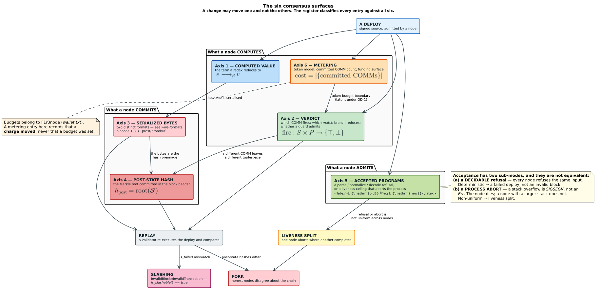
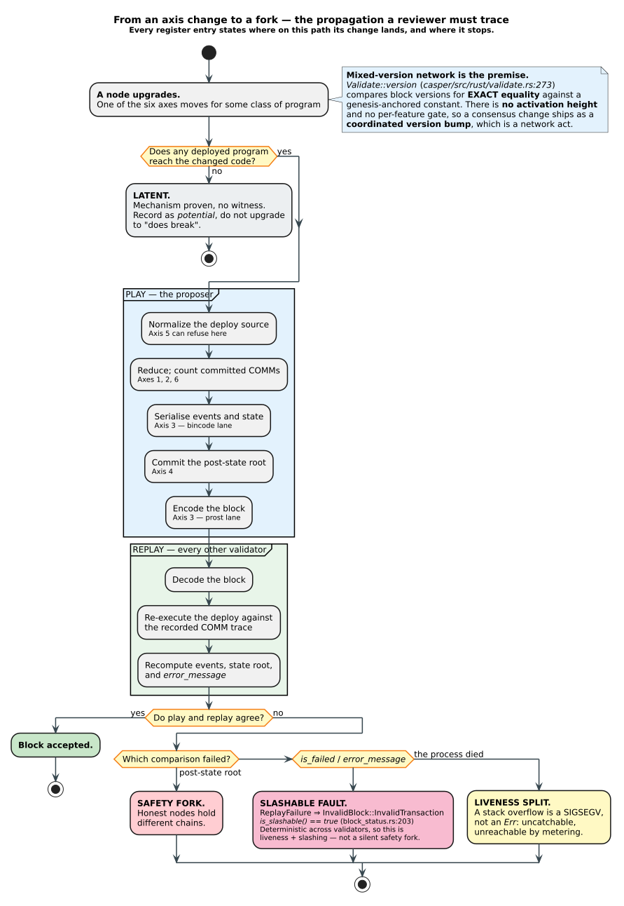
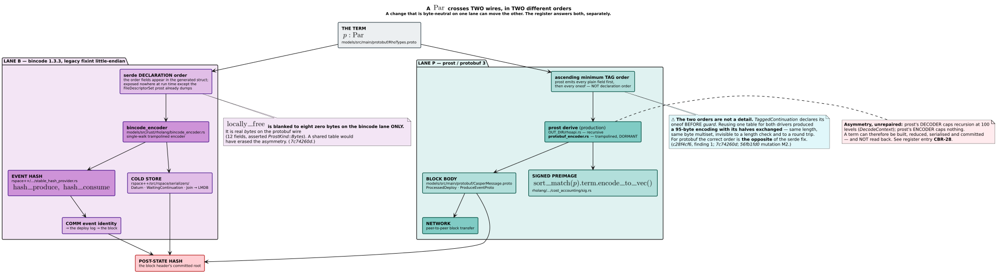
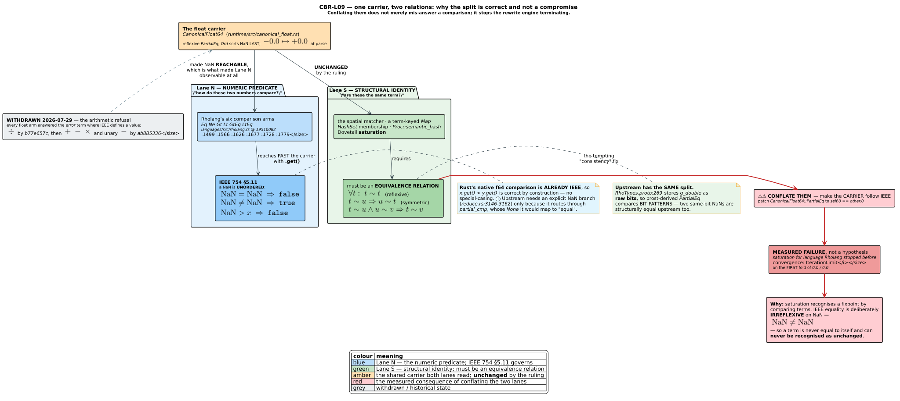
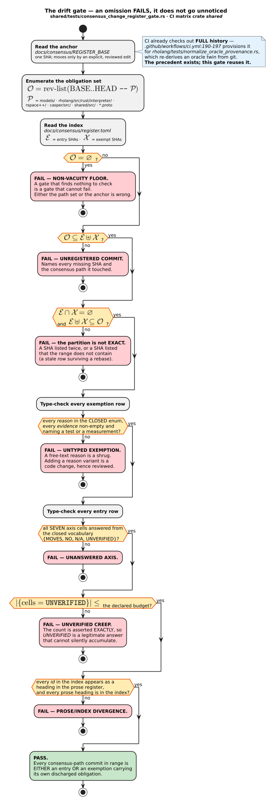
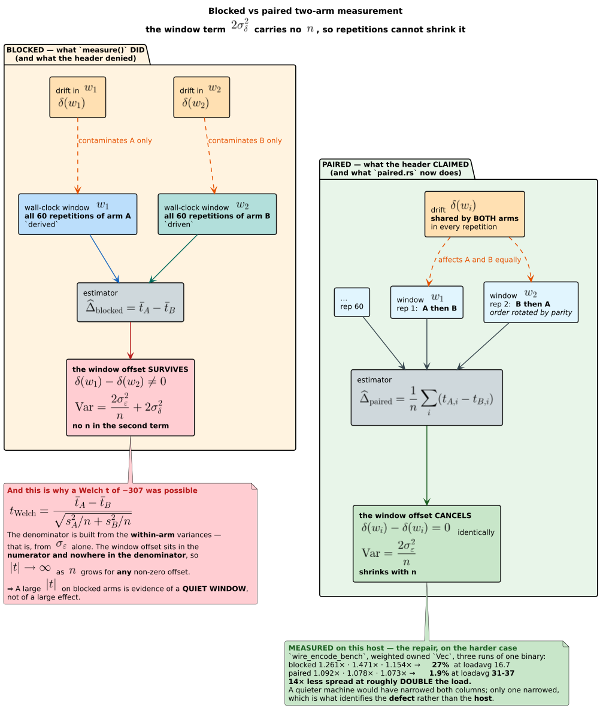

# The Consensus-Change Register

### A classification and risk report on the consensus-visible changes of the `rho-native-semantics-review` campaign

| | |
|---|---|
| **Document class** | Engineering report — classification and risk analysis. **LIVING**: amended, never closed. |
| **Register anchor** | `7293d57c` (`f1r3node-rust-mettail`, branch `feature/mettail`) — the last point at which the consensus surfaces were reviewed as a set. |
| **Range analysed** | `7293d57c..dc383ed1` — 111 commits, of which **78** touch a consensus-critical path — plus three changes in flight at the time of writing. ⚠ **Six entries now name commits outside this range** and are recorded anyway, because the register is LIVING; they are enumerated under [§4.1](#41-summary--the-register-at-a-glance) and their effect on the exactness claim is assessed in [§6.5](#65-coverage-asymmetry-between-the-two-surfaces). |
| **Companion surface** | `mettail-rust`, branch `feature/rho-native-set-automata`, campaign window 2026-07-25 .. 2026-07-29. |
| **Audience** | F1r3node consensus reviewers deciding whether to accept the fork risk of a coordinated protocol-version bump. |
| **Date** | 2026-07-29 |
| **Maintenance** | [§7](#7-maintenance--how-an-omission-fails-loudly). Adding an entry is filling the form in [Appendix A](#appendix-a--the-entry-template). |

---

## Notation and abbreviations

★ **Read this table first if any short form below is unfamiliar.** It is placed before the abstract, not in
an appendix, because the guideline it discharges (`pedagogy-define-terms`) requires a term to be defined
**prior to use** and the abstract uses several. Conceptual definitions — *consensus-breaking*,
*post-state hash*, *verdict*, *fork*, *Lane B* / *Lane P* — are not abbreviations and are given in full in
[§2](#2-background-and-definitions), which every axis table refers back to.

| Short form | Expansion | Where it matters here |
|---|---|---|
| **CBR** | *Consensus-Breaking Record* — the identifier prefix of every entry in this register. `CBR-0NN` numbers a Surface-N entry; `CBR-LNN` a Surface-L one. | [§4](#4-the-register) |
| **SHA** | *Secure Hash Algorithm*; used throughout as the customary shorthand for a **git commit object name** (an abbreviated SHA-1 or SHA-256 hex digest), never for the hash function itself. | The `Commit(s)` cell of every entry |
| **AST** | *abstract syntax tree* | The normalizer and lowering entries |
| **FFI** | *foreign function interface* — the boundary at which a non-Rholang caller can construct a term an ordinary deploy cannot. | **CBR-021**'s LATENT grade |
| **LMDB** | *Lightning Memory-Mapped Database* — the cold store's backing key-value store. | [§2.5](#25-the-two-wire-formats), Lane B |
| **CLI** | *command-line interface* | [§7.3](#73-why-this-design-and-not-the-alternatives) |
| **URI** | *uniform resource identifier* — here specifically a `rho:id:…` registry URI, the name under which a genesis contract is looked up. | **CBR-030**'s registry-invariance proof |
| **REPL** | *read-eval-print loop* | **CBR-024** / **CBR-025** surface |
| **TCP** | *Transmission Control Protocol* | **CBR-022**'s liveness argument |
| **OOM** | *out of memory* | **CBR-020**'s heap bound |
| **SIGSEGV** | *segmentation-violation signal* (POSIX signal 11) | **CBR-023**'s stack ceiling |
| **LLVM** | the LLVM compiler infrastructure (the initialism is no longer an abbreviation of anything, by its project's own statement) | **CBR-023**'s frame-size measurements |
| **RAII** | *resource acquisition is initialisation* — the C++/Rust idiom of tying a resource's lifetime to a scope. | [Appendix B](#appendix-b--the-exemption-table) row 15 |
| **WPDA** | *weighted pushdown automaton* | **CBR-L01**'s disambiguation machinery |
| **PDA** | *pushdown automaton* — the explicit heap-backed control machine used by generated stack-safe traversals. | **CBR-044**, Appendix B row 83 |
| **DFA** | *deterministic finite automaton* | **CBR-L14**'s lexer account |
| **DFS** | *depth-first search* | **CBR-035**'s traversal-order argument |
| **SCC** | *strongly connected component* | Appendix B row 83's recursion census |
| **ABI** | *application binary interface* | **CBR-035**'s clone code-generation account |
| **RSS** | *resident set size* — the non-swapped physical-memory footprint reported by the capped measurements. | **CBR-044** and Appendix B measurements |
| **LRU** | *least recently used* — the replacement policy of the retired EPathMap intern cache. | Appendix B row 55 |
| **EPM1** | *EPathMap format, version 1* — the versioned homogeneous PathMap trie snapshot used by protobuf and bincode. | **CBR-044** |
| **TRIE** | not an acronym — typographic emphasis for the prefix-compressed trie that is the EPathMap representation. | **CBR-041** and Appendix B |
| **OOPSLA** | *Object-Oriented Programming, Systems, Languages, and Applications* (ACM conference). | [References] |
| **ASPLOS** | *Architectural Support for Programming Languages and Operating Systems* (ACM conference). | [References] |
| **FIPS** | *Foreign-language Interoperability Problem Statement* — the design document series governing MeTTaIL's foreign-language terms. ⚠ Not the U.S. *Federal Information Processing Standards*, which is the more common reading of these four letters and is **not** meant anywhere in this document. | **CBR-L11** context |
| **E2E** | *end-to-end* | The mutation table of **CBR-005** |
| **RED1** | the **first** of five successive RED (failing) states that **CBR-005**'s mutation table drove, numbered in execution order. A *rung label*, not an acronym. | **CBR-005** evidence |
| **RED2** | the **second** such state. | **CBR-005** evidence |
| **RED3** | the **third** such state. | **CBR-005** evidence |
| **RED4** | the **fourth** such state. | **CBR-005** evidence |
| **RED5** | the **fifth** such state — the one carrying the verdict, hence the column heading *"RED5 (verdict)"*. | **CBR-005** evidence |
| **POPL** | *Symposium on Principles of Programming Languages* (ACM) | [References], [Pratt1973] |
| **CRYPTO** | *International Cryptology Conference* (IACR) | [References], [Merkle1988] |
| **ACNS** | *Applied Cryptography and Network Security* (conference) | [References], [Aumasson2013] |
| **LNCS** | *Lecture Notes in Computer Science* (Springer series) | [References] |
| **MD5** | *Message-Digest Algorithm 5* — named only inside the title of [Aumasson2013]. | [References] |
| **BLAKE2** | the BLAKE2 cryptographic hash family; `Blake2b256` is the instance used for event hashes and the post-state tree. | [References], **CBR-019**, **CBR-030** |
| **IEEESTD** | not an abbreviation — a path component of IEEE's DOI namespace (`10.1109/IEEESTD.…`), reproduced verbatim so the DOI resolves. | [References], [IEEE754-2019] |

⚠ **This document also uses ALL-CAPS as emphasis, which is a typographic convention and not an
abbreviation.** The tokens below are **ordinary English words set in capitals for stress**, frequently
inside a **verbatim quotation of a commit message**, where they must not be altered. They are enumerated —
rather than merely characterised as a class — so that a reader (or a checker) encountering one does not
search for an expansion that does not exist, and so that adding a new one is a visible edit.

| Token | It is simply the word | Where |
|---|---|---|
| **UNREPAIRED** | *unrepaired* | **CBR-028**'s status |
| **POSITIONALLY** | *positionally* | **CBR-017** evidence |
| **DISCHARGEABLE** | *dischargeable* | **CBR-027**'s drift check |
| **REGRESSIVELY** | *regressively* | **CBR-L08**'s acceptance cell |
| **UNSPELLABLE** | *unspellable* | [Appendix B](#appendix-b--the-exemption-table) row 1, quoting a commit subject |
| **NEIGHBOURS** | *neighbours* | [Appendix B](#appendix-b--the-exemption-table) row 6, quoting a commit subject |
| **VALIDATOR** | *validator* — the consensus role defined in [§2.3](#23-consensus-vocabulary) | **CBR-023** evidence, quoting a commit message |
| **UNWITNESSED** | *unwitnessed* | **CBR-016**'s historical risk classification |
| **SUBTRACTIVELY** | *subtractively* | **CBR-021**'s totality argument |
| **BINCODE** | *bincode* | **CBR-042**'s quoted warning |

★ The closed vocabularies that *are* meaningful in capitals are all defined in
[§2](#2-background-and-definitions): the axis verdicts `MOVES` / `NO` / `N/A` / `UNVERIFIED`
([§4.2](#42-entry-template)), the directions ([§2.6](#26-direction-of-change)), the evidence grades
([§2.7](#27-evidence-grade--and-the-word-potentially)), the provenance tags **DERIVED** / **MEASURED** /
**CITED** / **UNVERIFIED** ([§2.8](#28-provenance-tags)), and the exemption reasons
([§3.2](#32-inclusion-and-exclusion-criteria)).

---

## Abstract

The `rho-native-semantics-review` campaign landed 109 commits on the F1r3node consensus implementation
and a parallel body of work on MeTTaIL's second implementation of Rholang. This report derives, from the
git record rather than from a summary, the subset of that work which is **consensus-visible**, and
classifies each member against six independent axes: computed value, verdict, serialized bytes,
post-state hash, accepted programs, and metering.

**Result: 60 consensus-visible changes** — 46 on the F1r3node node itself, 14 on MeTTaIL's Rholang.
Of these, **58 are landed, 1 is in flight**, and 1 is an open, unrepaired hazard recorded so it is not
lost. On the bincode lane **30** entries move bytes; on the protobuf lane **30**; **31** move a
*verdict*; **41** move the *post-state hash*; **17** move *acceptance*; **5** move *metering*.
⚠ **Seven of these ten moved again on 2026-07-31 when [CBR-040](#cbr-040) gained the §4.1 glyph row it
had never had** — the entry had a `[[entry]]` in the machine index and a prose body but no row in the
table the gate projects from, so **every** figure on this page was computed from 56 rows while the index
held 57. The row is the projection's only input, so an entry missing from it is an entry that does not
exist to any figure. ★ This is the same class as the drifts below, one layer deeper: not a stale number
beside a correct table, but a **correct number beside an incomplete table**.
⚠ **Six of these ten were re-projected on 2026-07-31 and four of them had drifted again** — the
paragraph read `52 landed / 25 bincode / 26 prost / 28 verdict / 36 post-state / 3 metering` against
projections of `53 / 25 / 27 / 29 / 37 / 4` *before* **CBR-042** was added. The unpinned figures here
have now gone stale twice; the remedy is still the one sized in
[§7.8.6](#786-the-two-drift-questions-answered) — read them from §4.1 rather than anchor them.
⚠★★ **Only three of the ten figures in this paragraph are pinned by the gate, and the other seven had
ALL drifted by 2026-07-30 — four of them wrongly.** The previous revision of this paragraph claimed *"Every
figure in this paragraph is **PROJECTED from the §4.1 rows by a test**, never adjusted and no longer
recounted by hand: `casper/tests/consensus_change_register_gate.rs` fails naming any figure that
disagrees."* ⚠ **That claim was false when written.** `STATED_FIGURES` anchors the entry count and the two
surface counts here; it anchors **none** of the six axis counts and **not** the landed / in-flight split.
Measured at `f78e169d`: the protobuf lane read 23 against a projection of 24, the verdict count 23 against
24, the post-state hash 32 against 33, and *"43 are landed"* against 45 — while the bincode, acceptance and
metering figures happened to still be right. ★ The gate's own §7.7.7 warns that *"a gate whose advertised
coverage exceeds its real coverage is worse than no gate"*, and this paragraph was carrying exactly that
defect **inside the register**. The remedy is sized in
[§7.8.6](#786-the-two-drift-questions-answered): the six axis counts and the status split are structurally
readable from §4.1 exactly as §5.1's and §5.3's tables already are, so the fix is to *read* them, not to
anchor them. ★ They remain written as **digits** — this paragraph once spelled them
(*"Twenty-three move bytes"*), and an English numeral is structurally uncheckable however careful the
author. ★ **No entry is now a live
divergence.** The one that was (**CBR-L09** — float division by zero answering `error` rather than
$`\pm\infty`$) was ruled kept and then, the same day, **reversed and widened to every float arithmetic
operator**, because IEEE 754 §7.3 *defines* the result and the bug-fix carve-out that licenses divergence
was therefore unavailable; it is re-classified **CONVERGENT**. ★ Of the three residuals it retained, the
third — `NaN` **comparison** — was itself ruled on and **RESOLVED 46 minutes later** (`19510082`); the two
that survive are properties of the float **carrier**, not of any operator. A further
**21 commits touching consensus-critical paths were examined and
rejected** as not consensus-visible; each is listed with its typed reason in
[Appendix B](#appendix-b--the-exemption-table), so that a reviewer can judge whether the sweep applied a
discriminating criterion or an inclusive one. On Surface N the partition is **exact**: 57 entry SHAs
plus 21 exemptions equals the 78 commits in range.

**The headline risk is not any single entry; it is their conjunction.** `Validate::version`
(`casper/src/rust/validate.rs:273`) compares block versions for **exact equality** against a
genesis-anchored constant. There is no activation-height machinery and no per-feature gate, so these 45
changes cannot be rolled out independently: they ship together, as one coordinated protocol-version
bump, or not at all. No entry in this report bumps a version; that act belongs to F1r3node. ★ The register
now carries a **concrete instance** of the conjunction risk rather than only the argument for it:
**CBR-030** exists solely because **CBR-027** broke a genesis contract downstream of it, and neither entry
is a defect in isolation.

**The report's central evidentiary distinction is *witnessed* versus *mechanism-only*.** `CBR-005`
shipped on a proven mechanism with a production refusal counter reading exactly zero and **no failing
test**; `CBR-007` has a real Rholang program taking the wrong `match` branch. Those are different
propositions and a reviewer must weigh them differently, so the grade is a column of the summary table,
not a remark in the prose. **45 entries are WITNESSED, 3 are MECHANISM-ONLY**, 6 are LATENT, 2 are
DORMANT, and 4 rest on measured neutrality claims.

**What cannot be settled from inside the repository** is, for eleven entries, whether live chain state
was produced under the old behaviour. Each such entry states the query over the block store that would
settle it, and §5.4 consolidates them — nine share a single artefact. Two further disclosures belong in
an abstract rather than a footnote: **a shipped commit contains a claim that is currently false**
(§6.2), and **the Surface-L sweep is a targeted selection rather than an exact partition** (§6.5). Both
are reported as threats to validity ([§6](#6-threats-to-validity)), not concealed.

---

## 1. Introduction

### 1.1 The problem

A blockchain node is a deterministic function from a block and a pre-state to a post-state. Consensus is
the agreement of independent implementations, or independent builds of one implementation, on that
function. Any change to the node that moves the function's *observable* output for some input is
therefore capable of splitting the network — and the splits are not all of one kind. A change that makes
a validator refuse a deploy every other validator refuses identically produces a detectable, slashable
fault; a change that makes it compute a different value from the same inputs produces a **silent safety
fork**, in which two honest nodes hold divergent, individually plausible histories.

This campaign was a semantics review, and it found a great deal. Repairs to the spatial matcher, the
guard evaluator, the tuplespace's candidate selection, the path-map codec, the pretty printer, the
cold-store decoder and the event-hash encoder all landed within four days. Most of them are corrections
— they make a wrong answer right — but *correcting a wrong answer is consensus-breaking in exactly the
same technical sense as introducing a wrong one*. A reviewer needs both facts at once: that the change
is right, and that it moves the function.

### 1.2 Why a register, and why a living one

A one-off review document is a photograph. It is accurate on the day it is written and drifts from that
moment on, because the thing it describes — a derived set, "all consensus-visible changes since the last
review" — keeps growing while the document does not.

★ **This campaign encountered that exact failure class six times in a single session**, each time in a
different disguise: a hand-maintained language list that a concurrent agent "completed" for the fourth
time rather than deriving; a census kept in prose; a narrow scan sitting 505 lines from the wide one in
the same file; a gate that used a line count as a proxy for a property; a set of rule-index pins one of
which **silently retargeted onto a different rule and stayed green**; and a naming convention asserted
in documentation and enforced nowhere. In every case the repair was the same shape: **derive the set
rather than list it, or make the wrong form unspellable.**

A register that only discipline keeps honest will therefore drift, and this document does not ask a
reviewer to trust that it will not. [§7](#7-maintenance--how-an-omission-fails-loudly) specifies a gate
that makes an omission **fail loudly** — a SHA-keyed, typed exception table with a non-vacuity floor —
and argues it against the alternatives.

### 1.3 Contributions

1. A **six-axis classification** of consensus visibility (§2.4), separating properties that a single
   phrase like "consensus-breaking" conflates, with the propagation between axes made explicit.
2. An explicit account of the **two wire formats** a `Par` crosses, and of the field-order asymmetry
   between them that has already produced one measured, round-trip-invisible defect (§2.5).
3. A **derived** change set (§3, §4): 41 entries, each with all six axes answered, a stated blast
   radius, a direction, an evidence grade, and — where one exists — the owner ruling that authorised it,
   quoted verbatim with its date.
4. The **negative result**: 21 examined-and-rejected commits with typed reasons (Appendix B), which is
   what makes the inclusion criterion checkable rather than merely asserted.
5. A **drift-detection design** (§7) siting the gate, its data format, its failure modes, and its
   anti-vacuity argument.

---

## 2. Background and definitions

A reviewer may not share this campaign's vocabulary. Every term and acronym used later is defined here
first.

### 2.1 The two implementations under discussion

| Surface | Repository / branch | Role |
|---|---|---|
| **N** — the node | `f1r3node-rust-mettail`, `feature/mettail` | **The** consensus implementation. Scala support is dropped; no Scala artifact is normative and none is cited in this report. A change here moves live consensus. |
| **L** — the language | `mettail-rust`, `feature/rho-native-set-automata` | A **second** implementation of Rholang (`languages/src/rholang.rs`), hosted in the MeTTaIL/PraTTaIL language workbench and intended to become Rholang 1.4. It does not run consensus today. A divergence here is a **future** fork, not a present one — but it is exactly the kind of divergence that is cheap to fix now and catastrophic to discover after adoption. |

The register carries both, with the surface as a column, because the standard the campaign works to is
that MeTTaIL's Rholang must be a **superset** of upstream Rholang: it must accept everything upstream
accepts and compute the same value, with divergence permitted only where upstream has a bug, and only
by explicit ruling.

### 2.2 Language and runtime vocabulary

- **Rholang** — the reflective, higher-order, concurrent process language the node executes, descended
  from the asynchronous polyadic $`\pi`$-calculus [Milner1992] by way of the reflective
  $`\rho`$-calculus [Meredith2005].
- **Deploy** — a signed unit of work: a source string with its signature and metadata, submitted to a
  node, *normalized* to a term, and reduced.
- **`Par`** — the term type. A Rholang process is a parallel composition of sends, receives, `new`
  bindings, `match`es, bundles, connectives, expressions and unforgeable names; `Par` is the protobuf
  message carrying all of them.
- **Redex** — a *reducible expression*: a subterm to which an operational rule applies.
- **Tuplespace / RSpace** — the shared, content-addressed store of resting *data* (produces) and resting
  *continuations* (consumes).
- **COMM event** — the synchronisation of a produce with a consume on the same channel, firing the
  consume's continuation. *Which* COMM fires, and with *which* data, is the central nondeterminism a
  consensus protocol must pin down.
- **Guard** (`where` clause) — a boolean side-condition on a receive or a `match` case, deciding whether
  a candidate COMM or branch is admissible.
- **Normalization** — the compile step from source to `Par`: de Bruijn indexing of binders,
  free-variable numbering, and the canonical sort. Free-variable numbering is consensus-visible: a
  mis-threaded normalizer emits a plausible term with wrong indices and **fails silently**.
- **Substitution** — replacing a bound variable by its value inside a term. ★ Its *result* is what gets
  serialized, and therefore what gets **signed**.
- **Spatial matching** — the relation deciding whether a pattern matches a target, and with what
  bindings. It decides COMM firing (via `Matcher::get`) and `match` branch selection.
- **`FreeMap`** — the matcher's accumulator: a map from a pattern's free-variable *level* to the term
  bound at it. Its final contents become the continuation's environment.
- **Phlogiston** — Rholang's unit of computational cost. **Metering** is the act of charging it.
- **PathMap / `EPathMap`** — a trie-shaped Rholang collection; `EPathMap` is its `ExprInstance` arm.
  **`EZipper`** is a cursor into one.

### 2.3 Consensus vocabulary

- **Play** — the proposer's execution of a deploy while building a block.
- **Replay** — every other validator's re-execution of the same deploy against the block's recorded COMM
  trace, comparing the outcome.
- **Post-state hash**, written $`h_{\mathrm{post}}`$ — the Merkle root of the tuplespace *after* the
  block's deploys have run, committed in the block header. Two nodes computing different
  $`h_{\mathrm{post}}`$ for the same block hold different chains.
- **Fork** — used strictly here to mean a *safety* fork: honest nodes disagree about the canonical
  chain, and neither block is detectably invalid.
- **Slashable fault** — a replay disagreement that every honest validator reaches *identically*,
  producing `InvalidBlock::InvalidTransaction`, for which `is_slashable()`
  (`casper/src/rust/block_status.rs:183`) answers true. This is liveness-plus-penalty, **not** a silent
  safety fork. ⚠ It is not benign: the proposer skips checkpoint validation on its own block, so it
  alone keeps a block everyone else slashes it for. **CITED** (`80f5e5d3`).
- **Liveness split** — one node aborts the *process* where another completes. In Rust a stack overflow
  is a `SIGSEGV` on the guard page, **not** an `Err`: it is uncatchable, unreachable by metering
  (Casper installs `Cost::unsafe_max()` deliberately, for liveness), and its threshold depends on the
  thread's stack size. Two nodes with different stack budgets therefore disagree about whether a deploy
  is *executable at all*.
- **Coordinated version bump** — the only rollout mechanism available. `Validate::version`
  (`casper/src/rust/validate.rs:273`) is exact equality against a genesis-anchored constant. **DERIVED**
  (read at `casper/src/rust/validate.rs`, `pub fn version(b: &BlockMessage, version: i64) -> bool`).

### 2.4 Consensus-breaking, defined — and the six axes

> **Definition.** A change is **consensus-breaking** if there exists a deploy $`d`$ and a reachable
> pre-state $`S`$ such that a node running the new code and a node running the old code, both honest
> and both given $`(d, S)`$, disagree on at least one of: the value computed, the COMM or branch
> verdict taken, the bytes serialized on either wire, the post-state hash, whether $`d`$ is admitted
> at all, or the phlogiston charged.

Write $`M_{\mathrm{old}}`$ and $`M_{\mathrm{new}}`$ for the two nodes' observable behaviour — so
$`M(d, S)`$ is everything the node exhibits when it runs deploy $`d`$ against pre-state $`S`$ — and
write $`\pi_i`$ for the projection onto axis $`i`$:

```math
\mathsf{Breaking}
\;\;\equiv\;\;
\exists\, d,\; S,\; i \in \{1,\dots,6\}
\;:\;
\pi_i\!\bigl(M_{\mathrm{old}}(d, S)\bigr)
\;\neq\;
\pi_i\!\bigl(M_{\mathrm{new}}(d, S)\bigr)
```

Two consequences a reviewer should hold onto.

1. **The definition is existential.** One witnessing deploy suffices. "The suite is green" is therefore
   never a proof of non-breakage; it is evidence about a corpus, and each entry records *which* corpus.
2. **Repair and regression satisfy the same predicate.** A change making a wrong answer right is
   consensus-breaking in exactly the technical sense of one making a right answer wrong. The two are
   separated by the **Direction** field (§2.6), not by the definition.

#### Figure 1 — the six consensus surfaces and the fault each produces



*Source: [`figures/consensus-axes.puml`](figures/consensus-axes.puml).*

| # | Axis | The question it answers | Canonical failure |
|---|---|---|---|
| 1 | **Computed value** | What term does a redex reduce to? | Two nodes put different data on a channel. |
| 2 | **Verdict** | Which COMM fires? Which `match` branch reduces? Does a guard admit? | Two nodes take different control-flow paths from identical state. |
| 3 | **Serialized bytes** | What bytes represent this term — on Lane B, and on Lane P? | Event hashes differ; a block encodes differently; the signed preimage moves. |
| 4 | **Post-state hash** | What root is committed? | Replay's $`h_{\mathrm{post}}`$ differs from the block's $`\Rightarrow`$ **safety fork**. |
| 5 | **Accepted programs** | Is this deploy admitted at all? | A *decidable* refusal $`\Rightarrow`$ a failed deploy; a *process abort* $`\Rightarrow`$ a liveness split. |
| 6 | **Metering** | How much phlogiston, in what order? | Out-of-phlogiston on one node and not another — which turns into an Axis-2 divergence. |

⚠ **Axis 6 is about charges, not budgets.** Budgets belong to F1r3node (`wallet.txt`). A metering cell
in this register records that a *charge* moved; it never records a budget decision, and no entry
introduces a metering surface.

**How the axes compose.** The dependency has a direction:

```math
\text{value} \;\longrightarrow\; \text{bytes} \;\longrightarrow\; \text{hash}
\qquad
\text{verdict} \;\longrightarrow\; \text{hash}
\qquad
\text{metering} \;\longrightarrow\; \text{verdict}
```

But the converse fails in both interesting directions, which is precisely why the axes must be answered
separately rather than summarised:

- **Bytes can move with no value moving.** `7dcff96f` (**CBR-014**) appends four zero bytes to a bincode
  `EZipper` record while every previously-representable zipper computes the identical value, and while
  the *protobuf* encoding of that same zipper is byte-identical.
- **A verdict can move with no value moving, and a value with no verdict.** `f5fd6c34` (**CBR-005**)
  changes *bound values* and demonstrably not verdicts; **CBR-007** changes *verdicts*, and the values it
  then binds are the ones that were always correct.

#### Figure 3 — from an axis change to a fork



*Source: [`figures/divergence-flow.puml`](figures/divergence-flow.puml).*

### 2.5 The two wire formats

⚠ **A `Par` is serialized by two independent codecs, in two different field orders.** Conflating them is
the commonest way to mis-review a change in this area, so both are answered separately in every axis
table.

| | **Lane B — bincode** | **Lane P — prost** |
|---|---|---|
| Format | bincode 1.3.3, default config (legacy fixint, little-endian) | protobuf 3 |
| Field order | **serde declaration order** — the order fields appear in the generated struct | **ascending minimum tag**; prost emits every plain field first, then every `oneof` |
| Where that order is recorded | nowhere at run time; recovered from the `FileDescriptorSet` prost already dumps | the `.proto` tag numbers |
| Reaches | the **cold store** (LMDB, `rspace++/src/rspace/serializers/`) and the **event hash** (`rspace++/src/rspace/hashing/stable_hash_provider.rs`) | the **block body** (`CasperMessage.proto`) and the **signed preimage**, `sort_match(p).term.encode_to_vec()` (`rholang/.../cost_accounting/sig.rs`) |
| `locally_free` | blanked to eight zero bytes | real `bytes` — 12 fields, asserted `ProtobufKind::Bytes` |
| Depth policy | symmetric: both directions unbounded | **asymmetric**: the decoder caps recursion at 100 levels (`DecodeContext`); the encoder caps nothing |

#### Figure 2 — the two wire formats



*Source: [`figures/wire-formats.puml`](figures/wire-formats.puml).*

The hazard the figure encodes, stated once so no entry restates it:

> ⚠⚠ `TaggedContinuation` declares its `oneof` **before** `guard`. A generator reusing one field-order
> table for both drivers produces, for protobuf, **a 95-byte encoding with its halves exchanged** —
> identical length, identical byte multiset, invisible to a length check *and to a round trip*. For
> protobuf the correct order is *the opposite* of the correct serde order.
> **MEASURED** (`c28f4cf6`, finding 1; `7c74260d`; reproduced permanently as generator mutation M2 in
> `56fb1fd0` — difference at byte 0, both encodings 1140 bytes, same byte multiset, halves exchanged).

This is why **round-trip is not the codec obligation**: a codec that encodes differently from its
predecessor but decodes its own output round-trips perfectly *and forks*. The obligation is
**differential byte identity against a retained, undriftable oracle** — the compiler-generated derive,
which is kept compiled for exactly that purpose.

The asymmetry in the last table row is itself an open register entry — **CBR-028**.

### 2.6 Direction of change

| Direction | Meaning |
|---|---|
| **REGRESSIVE** | A previously-succeeding thing now fails. ★ Reviewers weigh this most heavily. |
| **PERMISSIVE** | A previously-failing thing now succeeds. |
| **CORRECTIVE** | A previously-*wrong* answer is now right: the program succeeded before and succeeds now, but the answer moved. |
| **NEUTRAL** | No observable behaviour moves. The entry exists because the change sits on a consensus path and its neutrality is a **measured claim**, not an assumption. |
| **DIVERGENT** | A deliberate, ruled departure from the reference implementation. |
| **CONVERGENT** | ★ A previously-recorded **DIVERGENT** departure is *withdrawn*: the two implementations now agree where they did not. Added to this vocabulary on 2026-07-29 for **CBR-L09**, whose ruling was reversed. It is a distinct direction and not a spelling of CORRECTIVE, because the axis movement is measured against *the other implementation* rather than against this one's own prior answer — and because a reviewer auditing the register's divergence budget must be able to find a retraction by reading the Direction column, not by reading every body. |

⚠ **CONVERGENT does not weaken the axes.** Withdrawing a divergence moves computed values exactly as
introducing one does; the definition of §2.4 is symmetric in old and new (consequence 2). A CONVERGENT
entry therefore answers all seven cells at full weight, and **CBR-L09** does.

### 2.7 Evidence grade — and the word "potentially"

The user's requirement is that a divergence *reachable in principle but unwitnessed* be labelled as such:
neither upgraded to "does break" nor dismissed as "does not". That is what this column carries, and it
is the report's central evidentiary distinction.

| Grade | Meaning | Example |
|---|---|---|
| **WITNESSED** | A concrete program, term, or byte string is known that exhibits the divergence. | **CBR-007** — a real Rholang program takes the wrong `match` branch. |
| **MECHANISM-ONLY** | The mechanism is proven and the path is reachable by an ordinary deploy, but no witnessing program has been exhibited. | **CBR-005** — cumulative `FreeMap` snapshots proven; the production refusal counter reads exactly zero. |
| **LATENT** | The mechanism exists, but reaching it needs a capability an ordinary deploy lacks, or a structural argument shows the path is not walked. | **CBR-021** — no deploy can build a malformed consume; only the FFI can. |
| **DORMANT** | The changed code has no caller at all, established **mechanically**, not by intention. | **CBR-019b** — the prost encoder. |
| **NEUTRALITY-MEASURED** | The claim is that *nothing* moves, and that claim is itself the measurement. | **CBR-019** — byte identity against the derived `Serialize` over an exhaustive corpus. |
| **UNVERIFIED** | Not established. An honest gap; every occurrence is counted in §6.4. |  |

### 2.8 Provenance tags

Every factual claim in this report carries one of:

| Tag | Meaning |
|---|---|
| **DERIVED** | Established here by static analysis: reading the diff, the type, the call graph, or the `.proto`. |
| **MEASURED** | Established by running something: a test that went RED then green, a byte diff, a bisected stack ceiling, a benchmark. |
| **CITED** | Quoted from a commit message or an owner ruling. The underlying work was performed by the cited author; this report reproduces rather than re-derives it. |
| **UNVERIFIED** | Named, not established. |

| Acronym | Expansion |
|---|---|
| **TOML** | Tom's Obvious, Minimal Language — the configuration syntax of [`register.toml`](#appendix-c--registertoml-the-machine-index), of which the drift gate parses a deliberately tiny subset. |

⚠ The distinction between **MEASURED** and **CITED** matters for this report specifically: the campaign's
commit messages carry unusually detailed measurements, and this register did **not** re-run them. Where a
number appears, its tag says whether this author observed it or is quoting the commit that did.

---

## 3. Method

### 3.1 How the change set was derived

The candidate list supplied to this report was treated as a set of hypotheses, not as a census. The set
below was derived independently and then reconciled against it.

**Step 1 — fix the range.** The register anchor is `7293d57c`, the merge point at which the previous
consensus cluster was consolidated and reviewed. Everything after it is unreviewed. **MEASURED**:
`git rev-list --count 7293d57c..HEAD` = **109** at `8853f839`, and **111** at `dc383ed1` after
**CBR-007** landed mid-authoring — see §6.1(4).

**Step 2 — define the consensus-critical path set** $`\mathcal{P}`$. A path is consensus-critical if
code under it can move any of the six axes:

```text
models/src/                      the term type, the codecs, the sorter, the path-map integration
models/src/main/protobuf/        the wire schema itself
models/codegen/, models/build.rs the GENERATOR that emits the bincode/protobuf tables and PDAs
rholang/src/rust/interpreter/    the normalizer, the reducer, the matcher, substitution, the printer
rho-pure-eval/src/               the GUARD EVALUATOR — decides `where` verdicts
rspace++/src/                    the tuplespace, the event hashes, the cold store
casper/src/                      block admission, replay comparison, validation
shared/src/                      the printer's Audience and the shared error surfaces
```

⚠ ★ **This path set is itself a corrected artefact, and the correction is a result.** The first version
omitted `rho-pure-eval/src/` — the component that **decides guard verdicts**. Two entries live there
(`eaa44c2f` in **CBR-002**, `a3fd6fe4` in **CBR-023**) and were found only because the entry set was
assembled from commit *messages* as well as from paths. A reviewer should read §3.4(1) with that in
mind: the class is not hypothetical, it fired on this very sweep.

**Step 3 — enumerate.** `git log 7293d57c..HEAD -- <paths>` over that set yields **76** commits at
`8853f839`, **78** at `dc383ed1`. **MEASURED.**

**Step 4 — read every one.** Each commit's full message and file list was read. This campaign's commit
messages state consensus visibility explicitly and in detail, which makes them primary evidence; where a
message asserts neutrality, the assertion was checked against the diff's file list and, where the claim
was byte identity, against the named golden or differential test.

**Step 5 — classify.** Each commit is either an **entry** (it moves at least one axis for at least one
program) or an **exemption** (it does not), and every exemption carries a typed reason and the evidence
discharging it. The partition is exact and is reproduced in [Appendix B](#appendix-b--the-exemption-table).

**Step 6 — sweep the companion surface.** `mettail-rust`'s campaign window holds **236** commits, of
which **149** touch `languages/src`, `rholang-runtime/src`, `macros/src` or `ast/src`. ⚠ **This sweep is
a targeted selection, not an exact partition**: the eleven Surface-L entries were found by semantic
keyword search and by reading the campaign ledger, and the remaining 133 commits are neither entries nor
explicit exemptions. This asymmetry is a stated limitation — see §6.5 — and closing it is the first
extension §7's gate should be given.

**Step 7 — capture what has not landed.** Four changes were in flight when the sweep began: the
`attempt_opt` combinator (**CBR-007**), the checked-arithmetic repair (**CBR-027**), the kv
element-category gate (**CBR-L08**), and the partial-operation disposition repair. ★ **CBR-007** landed
during authoring (`b219e199`, `dc383ed1`) and its entry is now written from *measured* rather than
*intended* behaviour; the other three were verified against the **working tree**, and each entry says
so. One further item (**CBR-028**) is an open hazard
that is deliberately *not* repaired and is recorded so that it is not lost.

### 3.2 Inclusion and exclusion criteria

**Included** if and only if there exists a deploy and a reachable pre-state on which old and new
observably differ on some axis — the definition of §2.4. This admits:

- corrections (a wrong answer becomes right) on equal footing with regressions;
- **liveness** changes, because a node that aborts where another completes is not agreeing;
- **additive** surface (a new method, a new field) — because acceptance is an axis: a program that
  previously failed to normalize now runs.

**Excluded**, with the reason recorded rather than the commit silently dropped:

| Exclusion reason | Meaning |
|---|---|
| `TESTS_ONLY` | Touches only `tests/`, fixtures, or `#[cfg(test)]` code. |
| `DOCS_ONLY` | Touches only comments, documentation, or audit records. |
| `HYGIENE` | Imports, formatting, lints, clippy, `-D warnings`, dead-code deletion with no live caller. |
| `BYTE_NEUTRAL_MEASURED` | Restructures a consensus path with byte identity asserted by a named golden or differential. |
| `CHARGE_NEUTRAL_MEASURED` | Moves work on a metered path with charge count, order and value asserted unchanged. |
| `VERDICT_NEUTRAL_MEASURED` | ★ Restructures a **verdict-deciding** path with the verdict relation asserted unchanged by a named differential. Added 2026-07-29 for `383a8b56`, which moves `rho-pure-eval`'s evaluator — the component that decides `where` verdicts — onto a shared trampoline. *Byte* identity is not the claim that matters there; *verdict* identity is, and collapsing the two would have made the exemption say something it could not support. ⚠ Adding a variant is a code change in the gate's `CLOSED_REASONS` and is therefore reviewed, which is the property [§7.2](#72-the-design-and-why-this-one) clause 4 exists to have. |
| `DEP_BUMP_BYTE_NEUTRAL` | ★ A dependency-version change with a named differential showing published bytes unmoved. Reserved by [§7.5](#75-first-extensions) extension 2 and now spellable, because `Cargo.lock` is inside the derived path set; **CBR-L06** proves a `prost` or `thiserror` bump alone can move published bytes. No commit carries it yet. |
| `DORMANT` | Adds code with no caller, established mechanically. |
| `INFRA` | Build, CI, or tooling. |
| `SUPERSEDED` | Wholly subsumed by a later commit that is itself an entry. |

### 3.3 How each axis value was established

| Axis | Primary method |
|---|---|
| 1 · computed value | **DERIVED** from the diff: does the changed expression produce a different term for some input? |
| 2 · verdict | **DERIVED** from the call graph: does the changed code reach `Matcher::get` / `check_commit` / `eval_match`? |
| 3 · bytes | **DERIVED** from which codec the change sits in (§2.5), then **CITED** from the golden or differential test the commit names. |
| 4 · post-state hash | **DERIVED**: an Axis-1 or Axis-2 move on a path reaching `produce`/`consume` implies an Axis-4 move. |
| 5 · acceptance | **DERIVED** from the refusal or ceiling introduced or removed. |
| 6 · metering | **DERIVED** from whether a `reserve_*` / `Cost::` site was added, removed, or re-priced. |

### 3.4 ★ False-negative risk of this method — the classes this sweep would miss

A method that cannot state what it would miss is not a method. Five classes:

1. **A consensus-visible change outside $`\mathcal{P}`$.** The path set is a hypothesis about where
   consensus lives. A change in `comm/`, `node/`, `block-storage/`, `crypto/`, or a **dependency
   version bump in `Cargo.toml`** could move bytes or verdicts and would not be enumerated. ⚠ This is
   not hypothetical: **CBR-L06** exists precisely because a derived `Debug` implementation reaches
   published bytes, so *a `prost` or `thiserror` version bump alone* is a consensus change under this
   report's own definition — and no path in $`\mathcal{P}`$ would show it.
2. **A change whose commit message asserts neutrality falsely.** Step 4 checks assertions against the
   diff's file list and the named tests, but it does not re-run the goldens. A commit that claims byte
   identity, names a test, and is wrong would pass this sweep. Mitigation: every such claim is tagged
   **CITED**, never **MEASURED**, so a reviewer can see exactly which claims rest on the author's
   measurement rather than this report's.
3. **An emergent divergence with no single owning commit.** Two individually byte-neutral changes can
   compose into a non-neutral one — for instance a reordering in one commit and a sort-stability change
   in another. A per-commit sweep cannot see it. Mitigation: none. Named as a gap.
4. **Generated code.** `models/build.rs` emits the wire tables into `OUT_DIR`. A change to the
   *generator* is in $`\mathcal{P}`$, but a change to `prost-build`, to `rustc`'s derive expansion, or
   to the descriptor pass is not. ⚠ This class has a measured near-miss: emitting any
   `cargo:rerun-if-changed` switches cargo to watching only those paths, which left a **stale table in
   `OUT_DIR` while the build reported success** — a silent, byte-visible divergence between the
   generator in the tree and the table in the binary. **CITED** (`903cefb3`).
5. **Uncommitted work.** Both trees had substantial uncommitted changes while this report was written,
   and several agents were editing concurrently. In-flight entries describe **intended** behaviour
   verified against a working tree that has since moved.

---

## 4. The register

### 4.1 Summary — the register at a glance

Scan this table; read only the bodies you need.

**Axis cells** — **V**alue · **T** verdict · **B** bytes on Lane B (bincode) · **P** bytes on Lane P
(prost) · **H** post-state hash · **A** acceptance · **M** metering.
`●` moves · `○` does not move · `·` N/A · `?` UNVERIFIED.

**Surface** — `N` = F1r3node (the consensus implementation) · `L` = MeTTaIL's Rholang (a divergence here
is a *future* fork, not a present one).

**Grade** — the evidentiary column of §2.7: `W` WITNESSED · `M` MECHANISM-ONLY · `L` LATENT ·
`D` DORMANT · `NM` NEUTRALITY-MEASURED · `?` UNVERIFIED.

| ID | S | Headline | Commit(s) | V | T | B | P | H | A | M | Direction | Grade |
|---|---|---|---|---|---|---|---|---|---|---|---|---|
| [CBR-001](#cbr-001) | N | A `where` guard participates in candidate **selection**, not only approval | `6bc58743` | ● | ● | ○ | ○ | ● | ○ | ○ | CORRECTIVE | **W** |
| [CBR-002](#cbr-002) | N | An undecidable `where` guard is **refused**, not silently false | `6ab1c78b`, `eaa44c2f` | · | ○ | ○ | ○ | ○ | ● | · | REGRESSIVE | **W** |
| [CBR-003](#cbr-003) | N | `matches` guards become decidable (injected spatial-match oracle) | `99b7b1c4` | ● | ● | ○ | ○ | ● | ○ | ○ | CORRECTIVE | **W** |
| [CBR-004](#cbr-004) | N | Thirteen `ExprInstance` arms were missing from the spatial matcher | `b0f18672` | ● | ● | ○ | ○ | ● | ○ | ○ | CORRECTIVE | **W** |
| [CBR-005](#cbr-005) | N | A matcher attempt owns its own `FreeMap`; the multiplicity guard un-vacuumed | `f5fd6c34`, `eaa905fe` | ● | ○ | ○ | ○ | ● | ○ | ○ | CORRECTIVE | **M** |
| [CBR-006](#cbr-006) | N | A `matches` pattern is substituted at `depth + 1` | `8853f839` | ● | ● | ● | ● | ● | ○ | ○ | CORRECTIVE | **M** |
| [CBR-007](#cbr-007) | N | A connective attempt owns its own `FreeMap` — the isolation law at four more sites | `b219e199`, `dc383ed1` | ● | ● | ○ | ○ | ● | ○ | ○ | PERMISSIVE | **W** |
| [CBR-008](#cbr-008) | N | A relative path below the root built a key no `Par` can have | `a1feb437` | ● | ● | ● | ● | ● | ○ | ○ | CORRECTIVE | **W** |
| [CBR-009](#cbr-009) | N | `setSubtrie` stopped dropping bare source entries | `ce7bb4fd` | ● | ● | ● | ● | ● | ○ | ○ | CORRECTIVE | **W** |
| [CBR-010](#cbr-010) | N | Path readers ask the codec instead of guessing | `0a6d2ce0`, `5aacebc3` | ● | ● | ● | ● | ● | ○ | ○ | CORRECTIVE | **W** |
| [CBR-011](#cbr-011) | N | A pathmap's identity stops depending on insertion order | `478102a4` | ○ | ● | ○ | ○ | ● | ○ | ○ | CORRECTIVE | **W** |
| [CBR-012](#cbr-012) | N | The shadow `Vec` deleted — non-ground pathmap order follows the trie | `9994a75b` | ○ | ● | ● | ● | ● | ○ | ○ | CORRECTIVE | **W** |
| [CBR-013](#cbr-013) | N | The two bulk trie readers collapse to the key walk | `c705776c` | ● | ● | ○ | ○ | ○ | ○ | ○ | CORRECTIVE | **M** |
| [CBR-014](#cbr-014) | N | `EZipper.cursor_kind` — a **new proto field**; four bytes on Lane B | `7dcff96f` | ● | ● | ● | ○ | ● | ○ | ○ | CORRECTIVE | **W** |
| [CBR-015](#cbr-015) | N | `cursor_kind` reaches the printer, whose output is replay-compared | `76de7d44` | · | ○ | ● | ○ | ● | ○ | ○ | CORRECTIVE | **L** |
| [CBR-016](#cbr-016) | N | An environment variable leaves the consensus byte path | `ca84d535`, `4290303c` | · | ○ | ● | ● | ● | ○ | ○ | CORRECTIVE | **W** |
| [CBR-017](#cbr-017) | N | The `New` bind bound becomes an interval; the clamp had moved bytes | `a4c23a58` | · | ○ | ● | ● | ● | ○ | ○ | CORRECTIVE | **W** |
| [CBR-018](#cbr-018) | N | The pretty printer renders its `match` target | `bd7cb45f` | · | ○ | ● | ● | ● | ○ | ○ | CORRECTIVE | **W** |
| [CBR-019](#cbr-019) | N | The channel leg of every event hash routed through a new encoder | `00ff9187`, `c28f4cf6`, `903cefb3` | ○ | ○ | ○ | ○ | ○ | ○ | ○ | NEUTRAL | **NM** |
| [CBR-019b](#cbr-019b) | N | A trampolined **prost** encoder — built, gated, **dormant** | `7c74260d`, `56fb1fd0` | · | · | · | ○ | · | ○ | · | NEUTRAL | **D** |
| [CBR-020](#cbr-020) | N | The cold-store read path becomes fallible and heap-bounded | `9a5521a2`, `2bcfaf87`, `000b95d7` | ○ | ○ | ○ | ○ | ○ | ● | ○ | PERMISSIVE | **W** |
| [CBR-021](#cbr-021) | N | A malformed consume refuses instead of killing the process | `b961d7c4` | · | ○ | ○ | ○ | ○ | ● | ○ | PERMISSIVE | **L** |
| [CBR-022](#cbr-022) | N | Deploy admission owns its discard — a 43,565-byte deploy stops aborting the node | `a09f1de2`, `3b265eb7` | ○ | ○ | ○ | ○ | ○ | ● | ○ | PERMISSIVE | **W** |
| [CBR-023](#cbr-023) | N | The $`\Theta(\mathrm{depth})`$ conversion programme — sixteen commits | see body | ○ | ○ | ○ | ○ | ○ | ● | ○ | PERMISSIVE | **W** |
| [CBR-024](#cbr-024) | N | `last` joins the method table | `2fee67fa` | · | · | · | · | · | ● | ● | PERMISSIVE | **W** |
| [CBR-025](#cbr-025) | N | Trie enumeration: `getPath` / `toNextLeaf` / `leafCount` | `98d2422d` | · | · | · | · | · | ● | ● | PERMISSIVE | **W** |
| [CBR-026](#cbr-026) | N | `E(S)` — the enabled-rendezvous query and firing a **named** selection | `2087c043` | · | · | · | · | · | ● | · | PERMISSIVE | **D** |
| [CBR-027](#cbr-027) | N | GInt `+` and `-` stop wrapping on overflow | `6ff46f8a` ⚠, `fd5474ab` | ● | ● | ● | ● | ● | ○ | ○ | REGRESSIVE | **W** |
| [CBR-028](#cbr-028) | N | **OPEN, UNREPAIRED** — write-unbounded / read-bounded on a consensus wire | *not repaired* | · | · | · | ● | ● | ● | · | — | **W** |
| [CBR-029](#cbr-029) | N | The pretty printer renders a receive's `where` guard | `d8e95fb0` | · | ○ | ● | ● | ● | ○ | ○ | CORRECTIVE | **L** |
| [CBR-030](#cbr-030) | N | `NonNegativeNumber.rho`'s overflow guard becomes **total** — the genesis term moves | `e3a4494b`, `719f2432` | ● | ● | ● | ● | ● | ○ | ○ | CORRECTIVE | **W** |
| [CBR-031](#cbr-031) | N | A `matches` pattern's `=x` reaches the enclosing `locally_free` | `0b270eca` | ● | ● | ○ | ● | ● | ○ | ○ | CORRECTIVE | **W** |
| [CBR-032](#cbr-032) | N | The binder shift emitted the shifted **position** as the **value** | `084c93b5` | ● | ● | ○ | ● | ● | ○ | ○ | CORRECTIVE | **W** |
| [CBR-033](#cbr-033) | N | A resting send carries its reason — a diagnostic proven **off** the byte path | `8fc9afc9` | ○ | ○ | ○ | ○ | ○ | ○ | ○ | NEUTRAL | **NM** |
| [CBR-034](#cbr-034) | N | `TreeHashMap` `update`-after-`delete` **resurrected** the key — the updater tested the leaf, not the key | `7c0cfd0a` | ● | ● | ● | ● | ● | ○ | ● | CORRECTIVE | **W** |
| [CBR-035](#cbr-035) | N | A walk elimination in the generated `Clone` — behaviourally **byte-identical** | `87ee699c` | ○ | ○ | ○ | ○ | ○ | ○ | ○ | NEUTRAL | **NM** |
| [CBR-036](#cbr-036) | N | The DESCEND BUDGET — one `descend` walks `k+1` cut-set levels; 5.91× fewer trampoline re-entries | `88ec2734`, `9442f76b` | ○ | ○ | ○ | ○ | ○ | ○ | ○ | NEUTRAL | **NM** |
| [CBR-037](#cbr-037) | N | The `EPathMap` tag-8 trie-key **reader** becomes total — the writer was unlimited by requirement | `063974c5` | ○ | ● | ○ | ○ | ○ | ● | ○ | PERMISSIVE | **W** |
| [CBR-038](#cbr-038) | N | The escape arm's prost encode was a remotely triggerable **abort** — and a second, unnamed recursion beside it | `d7818967`, `b75aa6a0` | ○ | ○ | ○ | ○ | ○ | ● | ○ | PERMISSIVE | **W** |
| [CBR-039](#cbr-039) | N | ∅ gets one spelling at the constructor; the `union` half was **reverted**, witness landed | `e93f0222`, `0075ded5` | ○ | ○ | ○ | ○ | ○ | ○ | ○ | CORRECTIVE | **L** |
| [CBR-040](#cbr-040) | N | Sibling order was not a total function of the term; it is now — `ScoredTerm::sort_vec` tie-breaks on the bytes the element **emits** | `6192b4b9`, `fa234cdd` | ○ | ● | ● | ● | ● | ○ | ○ | CORRECTIVE | **W** |
| [CBR-041](#cbr-041) | N | An `EPathMap` serializes on the prost wire as the TRIE — its own byte array `U(m)` at field 8 — for every map; the tag-1 list arm is deleted | `1b576c90` | ○ | ● | ○ | ● | ● | ○ | ● | CORRECTIVE | **W** |
| [CBR-042](#cbr-042) | N | …and on the **bincode** wire too — `U(m)` verbatim and contiguous, then the values (FORM ②), so the reader never decodes a trie key | `3a32cf07` | ○ | ○ | ● | ○ | ● | ○ | ○ | CORRECTIVE | **W** |
| [CBR-043](#cbr-043) | N | …but of **the entries that surface WRITES**. FORM ② keyed lf-blanked values by the *unblanked* entries, putting an entry's `locally_free` on the event hash | `8cf0b770` | ○ | ○ | ● | ○ | ● | ○ | ○ | CORRECTIVE | **W** |
| [CBR-044](#cbr-044) | N | EPathMap becomes a homogeneous PathMap set/map and both codecs carry one versioned EPM1 trie snapshot; generated protobuf PDAs remove the read ceiling | `26876b65` | ● | ● | ● | ● | ● | ● | ● | CORRECTIVE | **W** |
| [CBR-045](#cbr-045) | N | Genesis deploy-log order becomes a canonical function of event protobuf bytes while replay remains a function of the event multiset | `ff244c69` | ● | ○ | ● | ● | ○ | ○ | ○ | CORRECTIVE | **W** |
| [CBR-L01](#cbr-l01) | L | Equal operator precedence becomes representable; Rholang's ladder corrected | `3ff1c98b`, `f586e138` | ● | ● | ● | ● | ● | ○ | ○ | CORRECTIVE | **W** |
| [CBR-L02](#cbr-l02) | L | The substrate lane stops answering "false" for a guard it could not decide | `0f3d298c` | · | ● | ○ | ○ | ● | ○ | ○ | CORRECTIVE | **W** |
| [CBR-L03](#cbr-l03) | L | A residual binder rests the COMM, whatever the formula collapsed to | `69c66cd1` | · | ● | ○ | ○ | ● | ○ | ○ | REGRESSIVE | **W** |
| [CBR-L04](#cbr-l04) | L | `!?` query bind executes; its lowering stops being hash-ordered | `ac7f71af`, `6e6639ee` | ● | ● | ● | ● | ● | ○ | ○ | CORRECTIVE | **W** |
| [CBR-L05](#cbr-l05) | L | Published lookahead bytes stop carrying host-local order | `03ec33de`, `826bb96e`, `11472763` | ○ | ○ | ● | ● | ● | ○ | ○ | CORRECTIVE | **W** |
| [CBR-L06](#cbr-l06) | L | Published diagnostics stop being derived `Debug` dumps | `2d0ec9b1`, `df57a828` | ○ | ○ | ● | ● | ● | ○ | ○ | CORRECTIVE | **W** |
| [CBR-L07](#cbr-l07) | L | `List.last()` in MeTTaIL's Rholang | `bbceb6d9`, `6e543c01` | · | · | · | · | · | ● | ? | PERMISSIVE | **W** |
| [CBR-L08](#cbr-l08) | L | The kv element-category gate — a Name in a kv slot is refused, not silently dropped | *in flight* | ● | ● | ● | ● | ● | ● | ○ | REGRESSIVE | **W** |
| [CBR-L09](#cbr-l09) | L | ★ **DIVERGENCE WITHDRAWN AND WIDENED** — **every** float arithmetic arm ($`+`$, $`-`$, $`\times`$, $`\div`$, unary $`-`$) answers IEEE 754, and comparison follows §5.11 | `b77e657c`, `ab885336` ⚠, `19510082` | ● | ● | ● | ● | ● | ● | ○ | CONVERGENT | **W** |
| [CBR-L10](#cbr-l10) | L | A pathmap's entries come from a projection, not a field | `832d510f` | ○ | ● | ● | ● | ● | ○ | ○ | CORRECTIVE | **W** |
| [CBR-L11](#cbr-l11) | L | The literal-domain and canonical-surface repairs | six commits, see body | ● | ○ | ● | ● | ● | ● | ○ | CORRECTIVE | **W** |
| [CBR-L12](#cbr-l12) | L | A pathmap's `EMap` pair order stops being a function of the **process's hash seed** | `f5b2e820` | ○ | ● | ● | ● | ● | ○ | ○ | CORRECTIVE | **W** |
| [CBR-L13](#cbr-l13) | L | `Bytes` lowers to `GByteArray` (field 25), not `GString` (field 3) | `ef49d8c2` | ○ | ● | ● | ● | ● | ○ | ○ | CORRECTIVE | **L** |
| [CBR-L14](#cbr-l14) | L | `Bytes` becomes a real byte sequence with a real surface — `![Vec<u8>]` plus the `b"deadbeef"` literal | `713e0364`, `5a9efa00`, `93155150`, `3aea562f` | ● | ● | ● | ● | ● | ● | ○ | CORRECTIVE | **L** |

**Totals — 60 entries**, recounted from the rows above rather than adjusted: **46 on Surface N, 14 on
Surface L**; **58 landed, 1 in flight** (**CBR-L08**), 1 open and unrepaired (**CBR-028**). By evidence
grade: **45 WITNESSED**, 3 MECHANISM-ONLY, **6 LATENT**, 2 DORMANT, 4 NEUTRALITY-MEASURED. By direction: **38 CORRECTIVE**, 11 PERMISSIVE, 4 REGRESSIVE, 5 NEUTRAL, **1 CONVERGENT**, 1 not applicable (the open
hazard). **★ Zero DIVERGENT** — see below. Axis cells reading `UNVERIFIED`: **1** — **CBR-L07** metering.
⚠ It was **2** until 2026-07-30; **CBR-031**'s verdict cell is now `MOVES`, closed by
[CBR-032](#cbr-032)'s mechanism rather than by new evidence of its own — see
[CBR-031](#cbr-031) (b), which quotes the superseded cell verbatim.

★★ **Every figure in the paragraph above is now COMPUTED, not written.**
`casper/tests/consensus_change_register_gate.rs` projects each one from the 60 rows of this table and
fails naming the site, the quantity, the stated value and the projection. ⚠ Two consequences for whoever
edits this paragraph next: a projected figure must be written as a **digit** — an English numeral is
structurally uncheckable, which is why the Abstract's *"Twenty-three move bytes"* was converted — and the
literal text preceding each figure is an **anchor the gate matches**, asserted to occur exactly once, so
rewording around a number is a build failure rather than a silent unpinning.

★ **The derivation, so the count is checkable rather than asserted.** Read the 60 body rows of the table
above, project the `S` column for the surface split, the `Direction` and `Grade` columns for those two
splits, the `M` column for the `?` cells, and each entry's `Status` field for the landed/in-flight/open
split. Every figure in the paragraph above and in [§5.1](#51-aggregate-axis-exposure),
[§5.3](#53-direction-profile) and [§8](#8-conclusions) is that projection and nothing else; none of them
was obtained by incrementing a previous total. The three splits and the seven axis columns each sum to
**60**, which is the arithmetic check that no row was double-counted or dropped.

⚠★★ **Both figures in the paragraph above were themselves stale, and a THIRD kind of staleness is why.**
They read *"the 55 body rows"* and *"each sum to **54**"* against a table that held **56** rows — two
numbers that had never been re-projected after **CBR-041** and **CBR-042** landed, sitting inside the
very sentence that explains how to recount. ★ Neither is anchored in `STATED_FIGURES`, so no clause could
have caught them: the gate projects *from* this table but does not check every sentence that *describes*
it. That asymmetry is the residual [§7.5](#75-first-extensions) extension 4 has left, and it is now
recorded rather than repaired, because repairing it means anchoring prose that is deliberately narrative.

⚠ **Recounting again found three more stale figures — in a paragraph whose own previous revision
announced that recounting is what finds them.** [§5.1](#51-aggregate-axis-exposure) still read *"Share of
the 40"* with Lane B at 19 and the post-state hash at 28, and [§5.3](#53-direction-profile) still read 23
CORRECTIVE: all three were computed before **CBR-029** was added and were never re-projected, even though
the totals paragraph beside them had been. The lesson is not "recount harder" — it is that **a number
which is a projection of a table must be computed by a machine that reads the table**, which is
[§7.5](#75-first-extensions)'s new extension 4.

★ **The register now records no live deliberate divergence.** The DIVERGENT count fell from 1 to **0**
when **CBR-L09**'s ruling was reversed on 2026-07-29 and the entry was re-statused CONVERGENT. ⚠ This is
a claim about the *register*, not about the *implementations*: **CBR-L09** retains two **carrier**
divergences as residuals (a third, the `NaN` **comparison** divergence, was ruled on and resolved the same
evening by `19510082`), and they are listed in its
body. A reviewer reading "zero DIVERGENT" as "no differences remain" would be misreading it.

⚠ **Six entries are outside the anchored range** `7293d57c..dc383ed1`, and the six split into **two
different reasons** that an earlier revision of this paragraph conflated:

| entry | SHAs outside the window | why it is outside |
|---|---|---|
| **CBR-027** | `6ff46f8a`, `fd5474ab` | **LIVING** — landed in this repository *after* `dc383ed1`. |
| **CBR-029** | `d8e95fb0` | **LIVING.** |
| **CBR-030** | `e3a4494b`, `719f2432` | **LIVING.** |
| **CBR-L09** | `b77e657c`, `ab885336`, `19510082` | **FOREIGN** — `mettail-rust` commits; no object of that name exists here. |
| **CBR-L12** | `f5b2e820` | **FOREIGN.** |
| **CBR-L13** | `ef49d8c2` | **FOREIGN.** |

**MEASURED** — the three LIVING entries' **five** SHAs each satisfy
`git merge-base --is-ancestor <sha> HEAD` and each fail
`git merge-base --is-ancestor <sha> dc383ed1`, which is a *negative answer*. ⚠ The four
`mettail-rust` SHAs make the same command exit non-zero for a categorically different reason —
`fatal: Not a valid object name` — so reading "the command fails" as "the commit is out of range"
mixes *out of range* with *not present*. The distinction is load-bearing for a gate, and
[§7.7.3](#773-the-out-of-range-rule--three-regions-and-no-fourth) turns it into a rule with three
regions. ★ The count also moved without the paragraph moving: **CBR-L09** gained `19510082` when
`7eef14ab` recorded finding 4, so what an earlier revision called "nine SHAs" is **ten** — one more
instance of the class [§7.5](#75-first-extensions) extension 4 exists to remove, and the reason this
figure is now a table the gate projects rather than a number the prose stores.

All six are recorded anyway because the register is **LIVING**
([§7](#7-maintenance--how-an-omission-fails-loudly)): the alternative — a consensus-path change with no
entry because the anchor had not moved — is exactly the omission the drift gate exists to make loud.
**CBR-029** is the precedent that established this rule; the five that follow it apply it. Moving
`REGISTER_BASE` is a separate, reviewed edit, and it is now **overdue rather than optional**: an anchor
that excludes six of the register's own entries can no longer support
[§7.2](#72-the-design-and-why-this-one)'s clause 2, which quantifies over commits *in the range*.

### 4.2 Entry template

Every entry below follows the fixed form specified in [Appendix A](#appendix-a--the-entry-template):
a header table, then **(a) the issue**, **(b) how it (potentially) breaks consensus** — the full axis
table, the concrete disagreement, the blast radius, and the chain-history question — then **(c) why the
change was necessary or correct**, and finally the evidence. Axis cells use the closed vocabulary
`MOVES` / `NO` / `N/A` / `UNVERIFIED`.

---

## 4.3 Surface N — the F1r3node consensus implementation
---

### CBR-001

**A `where` guard participates in candidate SELECTION, not only approval.**

| | |
|---|---|
| Commit(s) | `6bc58743` (fix), `5d37f67e` (end-to-end witness) |
| Status | LANDED |
| Direction | CORRECTIVE |
| Evidence grade | WITNESSED |
| Files | `rspace++/src/rspace/space_matcher.rs`, `rspace++/src/rspace/candidate_order.rs` (new), `rspace++/src/rspace/rspace.rs`, `rspace++/src/rspace/replay_rspace.rs` |

#### (a) The issue

The tuplespace's candidate search found the **first spatially matching** datum for each bind, then
consulted the `where` guard once, at the end, as an *approval*. If the guard rejected, the whole COMM
was abandoned — even when a *different* admissible assignment of the same resting data would have
satisfied it. The guard was a filter applied after the choice instead of a constraint on the choice.

Three separable behaviour changes land together, each named in the commit with its own blast radius:
guarded receives fire where they used to stall; **guard-free multi-bind** receives also fire where they
used to stall; and a receive taking two data from one channel no longer duplicates one. **CITED**.

#### (b) How it (potentially) breaks consensus

| Axis | Verdict |
|---|---|
| 1 · computed value | **MOVES** — a COMM that now fires delivers data that previously stayed resting. |
| 2 · verdict | **MOVES** — this is the entry's whole content: *when a COMM fires*. |
| 3 · bytes (Lane B, bincode) | NO — no encoding changed; the *sequence* of encoded events changed. |
| 3 · bytes (Lane P, prost) | NO — same. |
| 4 · post-state hash | **MOVES** — a fired COMM leaves a different tuplespace. |
| 5 · accepted programs | NO — every program still normalizes and runs. |
| 6 · metering | NO — no charge site changed. |

**The disagreement.** A pre-upgrade node and a post-upgrade node given the identical resting state and
the identical receive `for (x <- @"c" & y <- @"d") where G(x,y)` reach different tuplespaces: the old
node leaves the data resting, the new node consumes it and runs the continuation. On replay this is an
immediate post-state-root mismatch — a **safety fork**, not a slashable fault, because the two nodes
produce *different valid-looking* histories rather than one detectably invalid block.

**Blast radius.** Every deploy containing a guarded receive, and every deploy containing a multi-bind
receive whose first spatial match on one channel excludes a match on another. Reachable by an ordinary
deploy: **yes** — this is plain Rholang surface syntax.

**Could live chain state have been produced under the old behaviour?** ⚠ **Not settleable from inside
the repository.** The query that would settle it: scan the chain's `ProcessedDeploy` deploy logs for any
block whose deploy source contains a `where` clause on a `for`/`contract`, or a multi-bind `for` with
`&`, and check whether any such receive is still resting in a historical post-state. Concretely — run
over the block store: `for each block b, for each ProcessedDeploy p in b: parse p.deploy.data.term;
report if the AST contains ReceiveBind count > 1 or a non-empty Receive.condition`. **UNVERIFIED** here.

#### (c) Why the change was necessary or correct

**What breaks if we do not change it.** A guard is a *constraint*, and a search that consults it only at
the leaf is not searching the constrained space — it is searching the unconstrained space and then
rejecting. The observable consequence was measured on the settlement demo: **12 settlements and 8
stalls**, where the outcome was decided by "which datum the canonical order happened to present first",
and that canonical order is a hash over payload bytes that include a per-produce `random_state`
**nobody wrote**. **MEASURED** (`5d37f67e`). That is not a semantics; it is a coin flip whose bias
depends on unforgeable-name entropy. Leaving it means the language's `where` clause does not mean what
its own documentation says.

**Why this repair rather than the alternatives.** Two alternatives were available and both were
rejected on stated grounds:

1. *Retry the whole consume on guard rejection.* Rejected: it re-enters the search from scratch, so it
   does not enumerate assignments — it re-derives the same first match.
2. *Filter the pool before the search.* Rejected: a guard is generally **cross-bind**
   (`G(x, y)` mentions two binds), so no per-bind filter can decide it.

**★ The determinism argument is the part a reviewer should check hardest**, because it is where this
change could have been a *silent* fork rather than a repair. Candidate order was previously a **private
method of `RSpace`**; the replay space used **raw store order**. That asymmetry survived only because
replay filters its pools down to the produces the recorded COMM consumed, usually leaving one candidate
per bind. It stops surviving the moment the matcher can select a candidate other than the first spatial
match, because `COMM::new` **sorts its produce refs** — so two selections that *permute* the same data
across binds build the **same COMM event**, slip past the trace assertion, and bind the receive's
variables the other way round. That is a silent post-state divergence with no detectable event.
**CITED** — and it is why the fix necessarily includes hoisting the order into
`rspace::candidate_order` and adopting it in **both** spaces, plus applying the guard on the replay
consume path (which previously did not, and did not need to, while a guard rejection could only mean
"no COMM at all"). With both in place: replay's pool is a subsequence of play's, play's selection
survives the filter, and any admissible selection lexicographically smaller in the filtered pool would
also have been reachable in the unfiltered one. **Replay therefore selects exactly what play selected.**

**Authority.** No owner ruling; the commit flagged itself for consensus review rather than landing
quietly: *"⚠ CONSENSUS-AFFECTING. This changes WHEN A COMM FIRES. Three separable behaviour changes land
here; each is called out below with its blast radius so consensus review can weigh them independently.
Flagged for consensus review rather than landed quietly."* **CITED** (`6bc58743`, 2026-07-26).

#### Evidence

- `rspace++/tests/guarded_matching_tests.rs` 15/15; `replay_rspace_tests` 24/24; `cargo test -p
  rspace_plus_plus` 319 tests, 0 failures. **MEASURED** (`6bc58743`).
- `5d37f67e` reproduces the demo's 12-settlements-and-8-stalls split **deterministically** and shows
  both settle post-fix.
- Play/replay agreement is asserted, not argued: `enabled_rendezvous_spec.rs` t6 (see **CBR-026**) runs
  one enumeration through both spaces.

---

### CBR-002

**An undecidable `where` guard is refused at compile time, not silently answered `false`.**

| | |
|---|---|
| Commit(s) | `6ab1c78b` (the refusal), `eaa44c2f` (the derived undecidable class) |
| Status | LANDED |
| Direction | REGRESSIVE |
| Evidence grade | WITNESSED |
| Files | `rholang/src/rust/interpreter/guard.rs` (new), `.../compiler/normalizer/processes/p_input_normalizer.rs`, `p_match_normalizer.rs`, `.../matcher/match.rs`, `.../reduce.rs`, `.../errors.rs` |

#### (a) The issue

`rho-pure-eval` — the guard evaluator — answers `UnsupportedExpression` for six `ExprInstance` arms it
cannot evaluate. The guard site mapped that answer to `false`, which is also what a guard that *was*
evaluated and *was refuted* returns. So "the decider reached no verdict" and "the predicate does not
hold" were **one observation**, and a `where` clause using `.nth()`, `%%`, `++`, `--`, a path map or a
zipper silently admitted nothing, forever, with no diagnostic.

#### (b) How it (potentially) breaks consensus

| Axis | Verdict |
|---|---|
| 1 · computed value | N/A — no value is computed differently; the deploy no longer runs. |
| 2 · verdict | NO — *"No program that admitted a COMM before admits a different one now; the refused set and the fired set are disjoint."* **CITED**. |
| 3 · bytes (Lane B) | NO |
| 3 · bytes (Lane P) | NO |
| 4 · post-state hash | NO for programs that still run; the refused programs produce no state at all. |
| 5 · accepted programs | **MOVES** — this is the entry. A program that previously normalized, ran, and admitted nothing now **fails**. |
| 6 · metering | N/A — the refusal precedes any charge. |

**The disagreement.** A deploy whose `where` guard mentions `x.nth(0) == 1` normalizes and runs on an
old node (admitting nothing, forever) and is **rejected** by a new node. Because the refusal is a pure
function of the guard *term* — same answer on every node, no rollback, no dependence on which data
happened to be resting — every honest new node refuses identically. Mixed-version, that is a
`ReplayStatusMismatch` on `is_failed`, hence `InvalidBlock::InvalidTransaction`, hence **slashable**.
It is not a silent safety fork.

**Blast radius.** Any deploy whose `for … where` or `match … where` guard contains `EMethodBody`,
`EPercentPercentBody`, `EPlusPlusBody`, `EMinusMinusBody`, `EPathmapBody` or `EZipperBody`. Reachable by
an ordinary deploy: **yes**. ★ `EMatchesBody` is deliberately **not** in the refused class — both guard
sites inject `SpatialMatcherOracle`, so `matches` guards stay compilable (see **CBR-003**), and a test
pins that they do.

**Could live chain state have been produced under the old behaviour?** ⚠ **Not settleable from inside
the repository, and the answer matters more here than elsewhere**, because this direction is
REGRESSIVE: a deploy that used to be *accepted-and-inert* becomes *rejected*. The settling query: scan
every historical `ProcessedDeploy.deploy.data.term` for a `Receive.condition` or `MatchCase.condition`
whose term contains any of the six refused arms. If the count is zero, the change is
acceptance-neutral on the existing chain. **UNVERIFIED** here.

#### (c) Why the change was necessary or correct

**What breaks if we do not change it.** The failure mode is the worst one a distributed system has: a
receive that rests forever, a node that exits 0, and **no diagnostic produced anywhere**. A deployer
cannot distinguish "my guard is false" from "your node cannot evaluate my guard". The prior campaign
already ruled that an abstention indistinguishable from a verdict *is itself the defect*.

**Why refuse rather than decide more.** Teaching `rho-pure-eval` the missing methods would remove the
problem rather than report it, and it was rejected on a ground that is **not effort**: guard evaluation
is **unmetered**. `check_commit` holds no cost handle and runs $`\prod_j |\mathrm{pool}_j|`$ times per
consume. Arithmetic is safe under that ($`\Theta(1)`$ per node, node count fixed by the source), but
`nth` / `slice` / `union` / `toByteArray` are $`\Theta(|\mathrm{data}|)`$ in **attacker-supplied
run-time data**. Implementing them would turn a silent guard into an unmetered denial-of-service
surface. It would also only *move* the subset boundary — the silence returns for whatever is still left
out — so the refusal is needed anyway. **CITED**.

**Why compile time rather than raising inside the matcher.** A guard decides whether a COMM fires, so
raising from `check_commit` puts a new failure path through `consume`/`produce` in **both** the play and
the replay space, where the comm-event sequence must be reproduced exactly, from a partially-mutated
space. The compile-time refusal is a pure function of the guard term: no rollback, no dependence on
resting data. It is also the only option that does not change `Match::check_commit`'s signature — a
trait implemented outside this workspace. **CITED**.

**Why two layers.** The refusal is applied at *compile* (`p_input_normalizer`, `p_match_normalizer`) and
at *reduce* (`eval_receive`, `eval_match`). The reduce layer is not belt-and-braces: embedders build
`Receive.condition` directly and hand the `Par` to `Reduce`, and for them the compile layer does not
exist.

**The boundary is drawn and pinned.** Decider gaps (the answer does not exist on this node) are refused;
**data-dependent failures** (`UnboundVariable`, `OperatorTypeMismatch`, `DivisionByZero`,
`ArithmeticOverflow`, `NotASingleValue`, `MissingExprInstance`) are **not** — `x / y` is fine until `y`
is 0, so no compile-time gate can decide them, and their COMM verdict is unchanged.
`a_data_dependent_failure_is_not_refused_at_compile_time` pins the boundary so it cannot be read as an
oversight. **CITED**.

**Authority.** No owner ruling on this specific change. The commit records the version obligation
explicitly: *"`Validate::version` … is exact equality against the genesis-anchored version — no
per-feature gate, no height-conditioned switch — so this ships as a coordinated version bump, as
`ca84d535` did. It is NOT behind a default-off flag: a dormant flag is unshipped work."* **CITED**.

#### Evidence

- The undecidable class is **derived from the evaluator's own arms** — an exhaustive `ExprInstance`
  match with no catch-all, in both places, so a new variant fails to compile rather than falling
  silently into the permissive branch. **DERIVED** (`eaa44c2f`).
- `the_refusal_fires_before_any_matcher_is_consulted` **measures** that the refusal precedes
  `check_commit`, with a live control proving the counter moves for a decidable guard — so it holds for
  every `Match` implementation, including embedder-supplied ones. **MEASURED**.
- `the_refusal_message_depends_on_nothing_but_the_guard` pins that the message is a pure function of the
  guard term (clause label + fixed per-variant phrase + the method's own name). This matters because the
  message is a candidate for the replay-compared `error_message` path (see **CBR-016**). **MEASURED**.

---

### CBR-003

**`matches` guards become decidable — a caller-injected spatial-match oracle.**

| | |
|---|---|
| Commit(s) | `99b7b1c4` |
| Status | LANDED |
| Direction | CORRECTIVE |
| Evidence grade | WITNESSED |
| Files | `rho-pure-eval/src/oracle.rs` (new), `rholang/src/rust/interpreter/matcher/match.rs`, `.../reduce.rs` |

#### (a) The issue

`rho-pure-eval` refused `ExprInstance::EMatchesBody` outright with `UnsupportedExpression`, so **every
spatial `where` guard failed shut whatever its truth value**. It could not call the matcher directly:
the crate dependency runs the other way (`rholang` $`\rightarrow`$ `rho-pure-eval`, whose only dependencies are
`models`, `shared` and `num`), so a direct call would be a dependency cycle. The matcher is injected by
the caller instead: `SpatialMatch` is a pure/total/deterministic oracle trait, `NoSpatialMatch` is the
absent oracle, and `eval_with(par, env, &dyn SpatialMatch)` is the new entry point with
`eval(p, e) = eval_with(p, e, &NoSpatialMatch)` preserving every pre-existing caller byte-unchanged.

#### (b) How it (potentially) breaks consensus

| Axis | Verdict |
|---|---|
| 1 · computed value | **MOVES** — the continuation of a now-admitted COMM runs and computes. |
| 2 · verdict | **MOVES** — a `where … matches …` guard that always failed can now succeed. |
| 3 · bytes (Lane B) | NO |
| 3 · bytes (Lane P) | NO |
| 4 · post-state hash | **MOVES** — a COMM that now fires leaves a different tuplespace. |
| 5 · accepted programs | NO — such programs already normalized and ran. |
| 6 · metering | NO — the two rholang call sites build a **fresh** `SpatialMatcherContext` per question and drop it; guard evaluation remains unmetered, unchanged. |

**The disagreement.** `for (@x <- @"c") where x matches Int` on an old node never fires; on a new node it
fires when the arriving datum is an integer. Post-state roots diverge immediately. Because the two
nodes' behaviour differs on a *successful* guard rather than on an error, there is no `is_failed`
mismatch to catch it: this is a **safety fork**, not a slashable fault.

**Blast radius.** Every deploy whose `for … where` or `match … where` guard contains a `matches`
expression. Reachable by an ordinary deploy: **yes**.

**Could live chain state have been produced under the old behaviour?** ⚠ **Not settleable from inside
the repository.** Settling query: count historical `ProcessedDeploy` terms whose `Receive.condition` or
`MatchCase.condition` contains an `EMatchesBody`. **UNVERIFIED** here.

#### (c) Why the change was necessary or correct

**What breaks if we do not change it.** `where p matches q` is the guard form the language's own
documentation advertises for structural side-conditions, and it was **inert**. Worse, it was inert in
the *fail-shut* direction, which is the direction a reviewer is least likely to notice: the program does
not crash, it simply never proceeds.

**Why an injected oracle rather than a direct call, a feature flag, or moving the matcher.** The
dependency runs `rholang` $`\rightarrow`$ `rho-pure-eval`; a direct call is a cycle, and moving the matcher into
`rho-pure-eval` would drag `models`' whole spatial-matching surface into a crate whose defining property
is that it is *pure*. The injection keeps `rho-pure-eval` pure and total while making the answer
available. The `NoSpatialMatch` default preserves every pre-existing caller **exactly**, which is what
makes the change reviewable: only the two rholang guard sites move.

**★ The subtlety worth checking.** The `EMatches` arm mirrors `Reduce::combine_matches` **minus its two
`substitute_and_charge` calls**: the target *is* evaluated (env-resolved), and the pattern is passed
through verbatim because its free variables are binders. That is sound because `eval_receive` already
substitutes the whole guard at depth 1 and `substitute`'s own `EMatchesBody` arm descends into **both**
operands at that same depth — so the guard's pattern has already had exactly the depth-1 substitution
`combine_matches` would apply, and `maybe_substitute_var` is the identity at $`\mathtt{depth} \neq 0`$. **DERIVED**
(commit message; the underlying depth claim is itself corrected by **CBR-006**, which found that the
`EMatches` *pattern* slot needs `depth + 1`, not the enclosing depth — the two entries must be read
together).

**What is deliberately preserved.** *"Guard-failure semantics are untouched: `false`, non-boolean and
eval-error still all collapse to guard-fail (consensus-visible, and deliberately preserved)."*
**CITED**. Diagnosability was added only at a non-consensus layer — a `DEBUG` `tracing` event naming the
two silent cases, changing no return value.

**Authority.** Plan-approved: *"mettail-rust scratchpad/flt_lookahead_plan.md §18.2 D3 (approved)"*.
**CITED**.

#### Evidence

- 14 new tests in `rho-pure-eval` (52/52 green), including an `eval` vs `eval_with(&NoSpatialMatch)`
  equivalence battery over **every arm family** — the executable form of "every pre-existing caller is
  byte-unchanged". **MEASURED**.
- 9 new `rholang` unit tests on `guard_passes`, 5 new end-to-end `reduce_spec` tests exercising the real
  reducer plus RSpace for both call sites. **MEASURED**.

---

### CBR-004

**Thirteen `ExprInstance` arms were missing from the spatial matcher; a pattern containing any of them matched nothing, silently.**

| | |
|---|---|
| Commit(s) | `b0f18672` |
| Status | LANDED |
| Direction | CORRECTIVE |
| Evidence grade | WITNESSED |
| Files | `rholang/src/rust/interpreter/matcher/spatial_matcher.rs`, `models/src/rust/rholang/par_children.rs` |

#### (a) The issue

`SpatialMatcher<Expr, Expr>::spatial_match` handled **14 of the 36** `ExprInstance` variants and dropped
every other pair into `_ => None`. In that position a catch-all is not a default — it is a decision
taken silently: the pattern matches nothing, the COMM never fires, the receive rests forever, the node
exits 0, and no diagnostic is produced anywhere. `spatial_match` decides COMM firing (`Matcher::get`,
the `rspace_plus_plus::rspace::r#match::Match` impl the tuple space consults, walks straight into it),
so the decision is consensus-visible. Eleven of the thirteen are now implemented; two are excluded **by
measurement**, not by omission.

#### (b) How it (potentially) breaks consensus

| Axis | Verdict |
|---|---|
| 1 · computed value | **MOVES** — a continuation that never ran now runs. |
| 2 · verdict | **MOVES** — the entry's content. |
| 3 · bytes (Lane B) | NO |
| 3 · bytes (Lane P) | NO |
| 4 · post-state hash | **MOVES** |
| 5 · accepted programs | NO — the programs normalized fine; they just never matched. |
| 6 · metering | NO |

**The disagreement.** `for (@{x - y} <- @"c")` — a receive whose pattern contains an `EMinus` — rests
forever on an old node and fires on a new one. Safety fork, as **CBR-003**.

**Blast radius.** Any pattern (in `for`, `contract`, or `match`) containing `EMinus`, `ELt`, `ELte`,
`EGt`, `EGte`, `EEq`, `ENeq`, `EAnd`, `EOr` and the two unary arms. Reachable by an ordinary deploy:
**yes**.

**⚠ A real gap remains, stated rather than papered over.** `EPathmapBody` is **not** descended into.
`{| a, b, ...rest |}` is ordinary surface syntax and the collection normalizer sets its
`connective_used` from its elements exactly as it does for a set, so
`for (@{| x, ...rest |} <- ch)` **normalizes fine and then matches nothing**. Closing it needs
substitution descent first, and then a decision about a path map's entry-multiset semantics under
matching — *"whether `{| 1, 1 |}` and `{| 1 |}` are the same pattern, and in what canonical order a
bound `...rest` is reassembled. That order is the ground-map canonical form whose bytes are the
event-hash preimage, so it is a consensus decision, not an implementation detail."* **CITED**.
`EZipperBody` is additionally unreachable as a pattern: no normalizer path constructs one.

**Could live chain state have been produced under the old behaviour?** ⚠ Not settleable from inside the
repository. Settling query: scan historical deploy terms for a `ReceiveBind.pattern` or
`MatchCase.pattern` containing any of the eleven newly-implemented arms. **UNVERIFIED** here.

#### (c) Why the change was necessary or correct

**What breaks if we do not change it.** A pattern language in which nine of the standard binary
comparison and arithmetic operators silently fail to match is not a pattern language; it is a trap. And
the trap is silent in the fail-shut direction, so it is invisible to every test that asserts a COMM
*does* fire and to every deployer who has not read the matcher.

**Why implement eleven and exclude two.** The eleven have *identical `p1`/`p2` shape and identical role*
to the seven binary arms already present; adding them is filling a table, not inventing a semantics. The
two exclusions are **derived, not chosen**: a `for` bind is substituted **before** it is stored in
RSpace and matched **after**, over the same bytes. `substitute_descends_into` declines exactly
`EPathmapBody` and `EZipperBody`, so a `VarRef` or a shifted `BoundVar` inside a path map is still in
its *pre-substitution* form when the matcher reaches it — **descending would bind out of stale bytes**.
The invariant is now checked in both crates:
`models::rust::rholang::par_children::spatial_match_descends_into` is exhaustive with **no `_` arm**,
modelled on `substitute_descends_into` beside it. **DERIVED**.

**Why the fix cannot silently go short again.** The iteration set of the test is the **generated**
variant table — `EXPR_INSTANCE_VARIANT_COUNT` is `EXPR_INSTANCE_VARIANTS.len()`, never a literal — so a
37th variant fails the suite until it has a representative, and therefore until somebody has decided
what the matcher does with it. It cannot be satisfied vacuously: the loop that checks second-operand
refusal **names the nineteen arms it exercised and asserts the list**. **DERIVED**.

**Authority.** No owner ruling; the commit is marked `!` (breaking) and states the consensus visibility
in its opening paragraph.

#### Evidence

- Both operands descended into, and a **second-operand mismatch is refused** — asserted rather than
  assumed, per arm. **MEASURED**.
- The two exclusions are cross-checked against `substitute_descends_into` in `models`, so the two crates
  cannot drift. **DERIVED**.

---

### CBR-005

**A matcher attempt owns its own `FreeMap`; the duplicate-variable guard stops being a tautology; `panic!` becomes a refusal.**

| | |
|---|---|
| Commit(s) | `f5fd6c34` (`match_function` isolation + guard + `panic!` $`\rightarrow`$ `None`), `eaa905fe` (the disjunction arm) |
| Status | LANDED |
| Direction | CORRECTIVE |
| Evidence grade | MECHANISM-ONLY |
| Files | `rholang/src/rust/interpreter/matcher/list_match.rs`, `.../matcher/spatial_matcher.rs`, `.../metrics_constants.rs` |

#### (a) The issue

Two halves of one defect.

**Half 1 — a vacuous guard.** `aggregate_updates`' duplicate-variable check collected `added_vars` into
a `HashSet` and compared its length against `added_vars.iter().collect::<HashSet<_>>().len()` — identical
cardinality **by construction**. The check could never fire. The reference implementation keeps
multiplicity (a sequence, not a set), so the check is real there.

**Half 2 — no per-attempt isolation.** `list_match` builds `cloned_self` once, moves it into the closure,
and **every attempt in the whole bipartite search mutates that one map**. Each claimed match's snapshot
is therefore **cumulative**: it carries the bindings written by every *failed* attempt that ran before
it. The duplicates the repaired guard can now see are the artifact of that.

**★ The two are one change.** The vacuous guard was **load-bearing**: it is the only reason the `?` on
`aggregate_updates` never short-circuits, and therefore the only reason the cumulative snapshots never
changed a match **verdict**. Landing the guard without the isolation converts a value-only latent
divergence into a **verdict-level regression**. **CITED**.

`eaa905fe` is the same invariant at a distinct site: the `ConnOrBody` arm snapshotted `free_map`,
restored it on success, and **skipped the restore on failure** because the `?` returned `None` from the
closure. A branch that bound a free variable and then refused left that binding behind.

#### (b) How it (potentially) breaks consensus

| Axis | Verdict |
|---|---|
| 1 · computed value | **MOVES** — a continuation's environment could carry a stale binding written by a failed attempt. |
| 2 · verdict | NO — **measured**, not argued: see Evidence. |
| 3 · bytes (Lane B) | NO — no encoding changed. The *value* a continuation receives can change, and that value is later serialized; the codec is untouched. |
| 3 · bytes (Lane P) | NO — same. |
| 4 · post-state hash | **MOVES** — a continuation that receives a different binding writes different data. |
| 5 · accepted programs | NO |
| 6 · metering | NO — *"there is no cost accounting anywhere in `matcher/`, so these cannot move metering"* (of the new observability counters). **CITED**. |

**The disagreement, concretely.** `aggregate_updates` folds the per-attempt snapshots with
`HashMap::extend` (later wins) in the caller's `matches` order. `matches` is a
`BTreeMap<Candidate<T>, _>` (`maximum_bipartite_match.rs:14`) whose `Ord` is derived over `value` first —
**structural `Par` ordering, which is prost's field-declaration derive, not the canonical Rholang sort
and not chronological**. So when a cumulative snapshot carried a stale value for a level, **which of the
two values reached the continuation was decided by a `.proto` field number.** That is not a semantics.
**CITED** — and it is the concrete reason this is a correction and not a tidy-up.

Measured mechanism, printed verbatim by the row-2 diagnostic on
`matching_two_lists_in_parallel_should_work`:

```text
free_maps = [ {1 -> 8}, {0 -> 7, 1 -> 8} ]
```

The second map is cumulative: it carries the first match's binding as well as its own. Level 1 is
claimed twice. **MEASURED**.

**Blast radius.** Any receive or `match` whose pattern is a **list, set or map with multiple binding
positions**, where the bipartite search makes more than one attempt. Reachable by an ordinary deploy:
**yes**. Reachability is **MECHANISM-ONLY**: the mechanism is proven and the path is ordinary,
but no program was exhibited whose *delivered value* differs.

**Could live chain state have been produced under the old behaviour?** ⚠ Not settleable from inside the
repository. Settling query: replay historical blocks under an instrumented build that records, per
`ListMatch` invocation, whether more than one attempt ran and whether the winning snapshot's key set
strictly exceeds the winning attempt's own writes. A non-zero count is a witness. **UNVERIFIED**.

#### (c) Why the change was necessary or correct

**What breaks if we do not change it.** Two things, and only the second is obvious. (i) A continuation
can receive a binding that no successful match ever produced. (ii) ★ More seriously — the guard was the
*only* thing preventing (i) from becoming a verdict change, and it was **vacuous by construction**. Any
future edit that made `added_vars` a sequence, or that made the fold order chronological, would have
silently promoted a value divergence into a verdict divergence. The system was one refactor away from a
fork and the check that would have caught it could not fire.

**Why `panic!` $`\rightarrow`$ `return None` is not optional.** `Matcher::get` receives `BindPattern`s deserialised
from tuplespace history, **including peer-served state**, and pattern free-variable linearity is
enforced at **normalization** — which a deserialised pattern never went through on this node.
Un-vacuuming the guard while keeping the `panic!` would have converted a dead check into a
**remotely-triggerable node crash**. `ListMatch`/`SpatialMatcher` have no error channel and widening
them to `Result` would change every signature in the module, so the refusal goes through the `Option`
the function already returns — the same posture as `b961d7c4`'s malformed consume (**CBR-021**).
⚠ This is a stated **DIVERGENCE** from the reference implementation, which used a `BugFoundError`.
**CITED**.

**Why the snapshot is taken on exactly one arm.** That is a proof, not a heuristic: `guard(t == p)` and
`guard(locally_free(t, 0).is_empty())` cannot reach `free_map`, and `connective_used(p)` is the
predicate the function already branches on. Cost delta on the connective arm: success is net zero (the
exit clone becomes an entry clone), failure is `+1` clone — and under isolation the clone stops
**growing**, because today's exit clone copies the *cumulative* map. Net **7.96% faster**. **MEASURED**.

**What is deliberately not changed.** No consensus version bump, no write-side cap, no pathmap sorting —
`aggregate_updates` keeps folding in the existing `matches` `BTreeMap` order. `rholang/tests/matcher/
match_test.rs` is **byte-untouched**: it is the 49-test acceptance oracle, *"and one must not edit one's
own oracle"*. **CITED**.

**Authority.** Owner-approved on a proven mechanism with no failing test. The subsequent ruling that
governs the follow-on (**CBR-007**) is quoted there.

#### Evidence

- ★ **The row-2 discriminator was built and measured, not argued.** Four builds:

  | build | the 8 named tests | the other 41 | RED 1 | RED 2 |
  |---|---|---|---|---|
  | HEAD | green | green | red | red |
  | guard only, NO isolation | **RED (all 8)** | green | red | green |
  | isolation only, NO guard | green | green | green | red |
  | composite (this commit) | green | green | green | green |

  Row 2 is the discriminator: a "fix" that merely re-hides the duplicates leaves row 2 all-green — the
  guard would still be unable to fire. **MEASURED** (`f5fd6c34`).
- ★ **The refusals counter reads zero on every production path.** Whole `-p rholang` suite, 49 targets,
  1267 passed / 0 failed / 8 ignored: the refusal marker appears exactly **twice**, both inside
  `tests/matcher_state_isolation.rs`, from the two fixtures built by hand to prove the backstop can fire
  at all. *"That is the direct evidence that verdicts did not move — not a proxy — and it simultaneously
  proves the counter is wired rather than merely declared."* **MEASURED**.
- ⚠⚠ **THE ZERO-REFUSALS CLAIM WAS FALSE WHEN IT WAS WRITTEN — now proven, not argued.** Re-measured
  over the whole `-p rholang -p models` suite: **8 firings at the pre-fix HEAD, SIX of them from
  PRODUCTION paths** (three verdict-level fixtures and all three end-to-end reductions), plus the two
  deliberate direct-call fixtures. **Exactly 2 after CBR-007**, in both debug and release. So the
  assertion was wrong **by six**. It is not a defect in what shipped — `match_function`'s isolation was
  working exactly as specified — and **history was not rewritten**: `dc383ed1` records the correction at
  the two addresses that carry the claim (`aggregate_updates`' doc comment and the refusals-counter
  comment). See §6.2 and **CBR-007**. **MEASURED** (`b219e199`, `dc383ed1`).
- `eaa905fe`: two REDs flipping with **two controls green on both sides**, so the flip cannot be
  explained by "the arm was rewritten". The important control is
  `control_the_disjunction_verdict_is_unchanged`. Leaked binding printed verbatim:
  `left: {0: Par { exprs: [GInt(7)] }}` against `right: {}`. **MEASURED**.

---

### CBR-006

**A `matches` pattern is substituted at `depth + 1`.**

| | |
|---|---|
| Commit(s) | `8853f839` |
| Status | LANDED |
| Direction | CORRECTIVE |
| Evidence grade | MECHANISM-ONLY |
| Files | `rholang/src/rust/interpreter/substitute_combine.rs`, `substitute_drive.rs`, `substitute_oracle.rs` |

#### (a) The issue

`p_matches_normalizer::combine_p_matches` normalizes the right-hand side of `P matches Q` under
`input.bound_map_chain.push()`, in a fresh `FreeMap`, keeping the *target*'s free map.
`EMatches::pattern` is therefore a **nested pattern one binding level deeper** — the same status
`ReceiveBind::patterns` and `MatchCase::pattern` have. Substitution did not treat it that way: every
child slot of every `ExprInstance` arm was visited at the enclosing `ctx`.

Two `BoundMapChain` lookups decide what a name inside the pattern can mean. A plain `x` goes through
`get`, which reads the **current scope only**, so it is a fresh binding occurrence and can never be a
`BoundVar` pointing outside. `=x` goes through `find`, which walks the whole chain, and is emitted as
`VarRef { depth }` carrying the chain distance. So **`VarRef` is the only construct that can name an
outer binder from inside a `matches` pattern** — and `maybe_substitute_var_ref` fires only when
`term.depth == ctx.depth`. Visiting the pattern at the enclosing depth stranded exactly those `VarRef`s:
`substitute(matches_par(var_ref(1, 2)), depth = 1, env)` returned the `VarRef` untouched where the
environment binding was due.

#### (b) How it (potentially) breaks consensus

| Axis | Verdict |
|---|---|
| 1 · computed value | **MOVES** — the substituted term differs. |
| 2 · verdict | **MOVES** — a pattern whose `VarRef` is now resolved matches a different set of targets. |
| 3 · bytes (Lane B) | **MOVES** — the substituted term is what gets encoded. |
| 3 · bytes (Lane P) | **MOVES** — ★ *"Substituted bytes are signed bytes."* **CITED**. |
| 4 · post-state hash | **MOVES** |
| 5 · accepted programs | NO — normalization is unchanged. |
| 6 · metering | NO — `substitute_and_charge` charges `encoded_len()` of the **result**, once, outside the recursion; a different result is a different charge only in the sense that the *value* changed. ⚠ See below. |

⚠ **A qualification on the metering cell.** The charge is `subst_term.encoded_len()`. If the substituted
term now differs, its encoded length differs, so the *amount* charged differs. The charge **count** and
**order** are unchanged; the **value** follows the term. This is not an independent metering change — it
is Axis 1 propagating into Axis 6 — but a reviewer counting charges should know it. **DERIVED**.

**The disagreement.** `new x in { … for (@y <- ch) { if (y matches =x) { … } } … }` — a `matches`
pattern naming an outer binder. On an old node the `VarRef` is not substituted and the `matches` test
compares against an unresolved reference; on a new node it compares against the bound value. Different
branch, different state, **safety fork**.

**Blast radius.** Any term whose `matches` pattern contains `=x` (a `VarRef`) naming a binder outside
the pattern. Reachable by an ordinary deploy: **yes** — `=x` is ordinary Rholang. Reachability is
MECHANISM-ONLY: the mechanism is proven end-to-end by a unit-level witness
(`substitute(matches_par(var_ref(1, 2)), …)`), but no full deploy was exhibited.

**Could live chain state have been produced under the old behaviour?** ⚠ Not settleable from inside the
repository. Settling query: scan historical deploy terms for an `EMatches` whose `pattern` subtree
contains a `VarRefBody`. **UNVERIFIED**.

#### (c) Why the change was necessary or correct

**What breaks if we do not change it.** `=x` inside `matches` is the *only* way a program can say "the
same value as the outer binder", and it did not work. The failure is silent: the pattern is well-formed,
the term normalizes, and the comparison simply asks the wrong question.

**⚠⚠ RETRACTED — *"why `has_locally_free` needed no change"* was FALSE WHEN WRITTEN, and its own
commit message contains the refutation.** The paragraph this replaces read:

> ★ `has_locally_free` NEEDED NO CHANGE, and the asymmetry it has always had is correct rather than a
> shortcut… Because a plain `x` in the pattern is a fresh binder (the `get` lookup above), the pattern
> contributes nothing to the enclosing scope's free variables.

**What is true.** The justification is sound for **one** of the two lookups a `matches` pattern performs
and silently omits the other. `8853f839`'s own message, two paragraphs above the sentence this entry
paraphrased, states both:

> * a plain `x` goes through `get`, which reads the CURRENT scope only, so it is a fresh binding
>   occurrence and can never be a `BoundVar` pointing outside;
> * `=x` goes through `find`, which walks the whole chain, and is emitted as `VarRef { depth }` carrying
>   the chain distance.

$`\Rightarrow`$ **`=x` names an outer binder from inside the pattern.** Its index therefore *does* belong to the
enclosing scope's `locally_free`, and `has_locally_free`'s `EMatchesBody` arm — which reads the target
alone — dropped it. The pre-fix inner `for` of
`for (@x <- @"c") { for (@y <- @"d") { @"o"!(10 matches =x) } }` claimed to be **closed** while naming an
index it does not bind. **The `=x` leg is the case `8853f839` existed to fix on the substitution side,
and the same commit argued it away on the `locally_free` side.** Repaired by
[`0b270eca`](#cbr-031); the axes are in **[CBR-031](#cbr-031)**, which supersedes this paragraph.

**★★ And the sibling enumeration below was taken on the WRONG AXIS — which is why a count of 1 did not
protect anything.**

**★ Sibling enumeration, on axis `ExprInstance` arm — Count: 1 on that axis.**
`EMatches` is the **only** `ExprInstance` arm whose `has_locally_free` reads a *proper subset* of the
slots substitution descends into. The other 18 multi-slot arms either OR/union every operand (16 binary,
2 unary) or read a cached summary field computed over all of them (`EList`, `ETuple`, `ESet`, `EMap`,
`EMethod`, `EPathmap`, `EZipper`). **Count: 1 on axis `ExprInstance` arm.** **DERIVED.** ✅ *That count
was and remains correct.*

**⚠ Sibling enumeration, on axis PATTERN POSITION — Count: 1 on that axis, and a DIFFERENT 1.**
Rholang has **three** positions in which a pattern's bitset meets an enclosing scope:
`p_match_normalizer` and `p_input_normalizer` both union the pattern's bitset into `locally_free`;
`p_matches_normalizer` **did not**. Sole dissenter, **Count: 1 on axis pattern position** — the same
number, a different member, and the member that mattered. **DERIVED** (`0b270eca`).

★ **The methodological finding, stated so the next enumeration cannot repeat it.** *A sibling count is
only as good as the axis it was taken on.* A count with no axis recorded is the same defect as a number
with no subject, which this campaign has already paid for four times — so
[Appendix A](#appendix-a--the-entry-template) now requires the axis to be named in the count itself, and
[§7.6](#76--five-findings-about-what-can-be-pinned-at-all) finding 5 records the class.

**Why the fix is single-sourced.** A per-slot depth is exactly the kind of fact a worklist driver and a
recursive oracle can drift apart on. `expr_arm_pattern_slots` names the pattern slots once;
`substitute_drive`'s `descend_expr` and `substitute_oracle`'s `expr_recursive` both read it — the
failure mode `substitute_combine`'s split/rebuild table exists to prevent.

**Authority.** No owner ruling. The commit records the version obligation and declines to act on it:
*"No consensus version is bumped here; that call is not this commit's to make."* **CITED**.

#### Evidence

- The witness is unit-level and exact: `substitute(matches_par(var_ref(1, 2)), depth = 1, env)` returned
  the `VarRef` untouched pre-fix. **MEASURED**.
- Driver and oracle are compared over the substitution corpus, so the per-slot depth cannot drift
  between the two lanes. **MEASURED**.

---

### CBR-007

**A connective attempt owns its own `FreeMap` — a negation that SUCCEEDS was handing out bindings it never made.**

| | |
|---|---|
| Commit(s) | `b219e199` (the combinator and the four sites), `dc383ed1` (the correction record — documentation only) |
| Status | **LANDED** 2026-07-29T14:42:44-04:00 |
| Direction | PERMISSIVE — it *un-refuses* matches that should have fired |
| Evidence grade | **WITNESSED** |
| Files | `models/src/rust/utils.rs` (`IsolatableState`, `isolate_free_map`, `Attempt`, `attempt_opt`, `attempt_opt_keeping_bindings`); `rholang/src/rust/interpreter/matcher/spatial_matcher.rs`. 1,717 insertions / 39 deletions across 5 files, of which three are new test files. |

#### (a) The issue

`SpatialMatcherContext::free_map` is a plain `&mut` field, so **a refused attempt is destructive**:
whatever it wrote is simply still there. Matching is a search, and a search that cannot undo a step
reports the wrong answer.

**CBR-005** fixed this at `list_match::match_function` — the bipartite-matcher boundary — and at the
disjunction's branches. **Four sites remained, all interior to a single `spatial_match(Par, Par)` call**,
which is exactly why `match_function`'s entry snapshot cannot see them:

| # | Site | Escapes on | Disposition | Why |
|---|---|---|---|---|
| 1 | `ConnAndBody`'s conjunct `try_fold` | **REFUSAL** | `attempt_opt_keeping_bindings`, around the **whole fold** | The conjuncts share one free map on purpose (`p_conjunction_normalizer.rs:12-14`) and **stand or fall together**; a per-conjunct restore would revert only the conjunct that refused. |
| 2 | `ConnNotBody`, inner **succeeded** | **REFUSAL** | `attempt_opt` | A negation binds nothing, ever. |
| 3 | ★ `ConnNotBody`, inner refused mid-bind | **SUCCESS** | `attempt_opt` | **The worst of the four**: a negation that *succeeds* hands its caller a binding it had no right to make. |
| 4 | ★ `for sp in sub_pars(..)` — the retry loop | **SUCCESS** | `attempt_opt_keeping_bindings` | **Not an arm** — it is the loop that *drives* the arms, so no arm-level snapshot can see it. |

★ **Why inverting through a bare `Option` hid it.** In the `ConnNotBody` arm, *"the inner attempt
refused"* and *"the negation succeeded"* are **both** `Some(())`; *"the inner attempt succeeded"* and
*"the negation refused"* are **both** `None`. Two distinct facts per cell, one of which is about state,
silently dropped. `Attempt::{Bound, Refused}` separates them. **CITED** (`b219e199`).

#### (b) How it (potentially) breaks consensus

| Axis | Verdict |
|---|---|
| 1 · computed value | **MOVES** — downstream of the verdict: which branch reduces determines what is computed. |
| 2 · verdict | **MOVES** — ★ **MEASURED, with an ordinary Rholang program.** This is the axis that separates this entry from **CBR-005**. |
| 3 · bytes (Lane B) | NO — no encoding changed. |
| 3 · bytes (Lane P) | NO |
| 4 · post-state hash | **MOVES** — by the same route as Axis 1. |
| 5 · accepted programs | NO |
| 6 · metering | NO — *"there is no cost accounting anywhere under `matcher/`, so nothing here can move metering"*; **no new counters** were added. **CITED**. |

★ **The witness, measured at the pre-fix HEAD** (`b219e199`):

```text
match { @0!(7) | @1!(6) } { @0!(~{x /\ 8}) | @1!(~{y /\ 9}) => A   _ => B }
```

reduces down the **fall-through** case. The first case is the correct one: `~{x /\ 8}` against `7`
demands `8`, refuses, so the negation succeeds. Equivalently

```text
{ @0!(7) | @1!(6) } matches { @0!(~{x /\ 8}) | @1!(~{y /\ 9}) }   ⇒  FALSE
```

where **`true` is correct**. The mechanism is mechanical rather than hand-chosen: `~P` and `P \/ Q`
bodies are normalized against a **fresh** `FreeMap` which `combine_p_negation` then **discards**, so a
free variable under `~` is `FreeVar(0)` in a numbering nobody kept — and level 0 is very probably
somebody *else's* level in the shared map it leaks into. Two sibling sub-patterns each containing a
binding negation therefore both leak level 0, `first_duplicate_added_var` sees the repeat,
`aggregate_updates` refuses, and the whole list match refuses. Per-`delta`:

```text
before b219e199:   d1 = {0 -> 7},  d2 = {0 -> 6}   =>  duplicate  =>  REFUSE  =>  B runs   (wrong)
after  b219e199:   d1 = {},        d2 = {}         =>  disjoint   =>  commit  =>  A runs   (right)
```

**CITED** (`dc383ed1`). The `Set` route (`ESetBody`'s `ListMatch<Par>`) does the same. One-sibling and
non-binding variants are correct on both sides: the defect is specific to a **binding body in two
siblings**.

**The disagreement.** An old node evaluates the `matches` above to `false` and takes the fall-through
`match` case; a new node evaluates `true` and takes the first case. Different continuation, different
tuplespace, **safety fork**.

**★ Blast radius — narrower than the design first claimed, and the narrowing is derived.** The reachable
surfaces are **exactly `match` case patterns and the right-hand side of `matches`** — **not COMM**.
`fail_on_invalid_connective` rejects `~` and `\/` in `for` / `contract` patterns at depth 0, and every
nested pattern position is compared by structural equality. **CITED**. Reachable by an ordinary deploy:
**yes**, within that surface.

**Could live chain state have been produced under the old behaviour?** ⚠ **Not settleable from inside the
repository** — this is the entry the campaign flagged explicitly as unanswerable. Settling query: scan
chain history and the deploy corpus for `MatchCase` patterns and `EMatches` right-hand sides whose
`connectives` contain a `ConnNotBody` or `ConnOrBody` whose body carries a `FreeVar` or has
`connective_used == true`. **UNVERIFIED**.

#### (c) Why the change was necessary or correct

**What breaks if we do not change it.** Two things, and the second is the sharper argument.

1. A `match` takes the **wrong branch** on an ordinary Rholang program, and `matches` answers `false`
   where `true` is correct.
2. ★ **CBR-005 shipped a live backstop that fired on correct programs until this landed.** The
   `panic!` $`\rightarrow`$ `None` refusal in `aggregate_updates` was reachable *because* `~`/`\/` fresh-numbering
   produces apparent duplicates while the leak persists. This is now **measured, not argued**: see the
   refusals-counter table below and §6.2.

**Why the combinator rather than four copies of snapshot/restore.** The law lives at **one address** —
`models::rust::utils::isolate_free_map`, beside the `FreeMap` it is about — and `rholang` adds a
**one-line** `impl IsolatableState for SpatialMatcherContext`. A `rholang`-local copy beside the `models`
one is precisely `a1feb437`'s three-copies defect (**CBR-008**). ★ The `// NOT FULLY IMPLEMENTED` stub at
`models/src/rust/utils.rs:260-262` is **retired at the address it was written** rather than orphaned; it
could not have been repaired in place, because it took an *already-evaluated* `Option<()>`, so
restoration was unspellable and `operation.map(|_| ())` was the identity. **Caller count 0 $`\rightarrow`$ 6.**
**CITED**.

**Why two wrappers and not one.** They are the two dispositions the matcher actually has, not variations
on a theme: a negation and a disjunction **bind nothing by construction** — the normalizer discards
their free maps — so they *probe*; a conjunction and an accepted `sub_pars` candidate **bind for real**,
so they *commit*.

**★ Why `Attempt<T>` is not decoration, and why it is the OPPOSITE of the `#33` defect.** Task `#33`
*collapsed* a disposition (`Err(_) => false`) and lost a guarded process. `Attempt<T>` carries strictly
**more** than `Option<T>`; the projection back (`into_option`) is explicit and total; and the negation's
verdict is bit-for-bit the same function of the inner verdict. **Only the state effect is dropped, which
is the point.** **CITED**.

**Why no snapshot at the direct `spatial_match(Par, Par)` entry.** Every production entry
(`Matcher::get`, `spatial_match_result`, `Reduce::eval_match`, `eval_matches`,
`SpatialMatcherOracle::matches`) reads `free_map` only when the top-level verdict is `Some`, so a leak
escaping on top-level refusal is unobservable — and an entry snapshot **hides the leak at the exit
instead of reverting it where it was made.** Row 2′ of the acceptance matrix measures exactly that.
**CITED**.

**Why a proved elision rather than isolating everything.** Site 4 elides its snapshot on exactly the
seven arms that *provably cannot reach* `free_map` — `Conn{Bool,Int,String,Uri,ByteArray}`, `VarRefBody`,
`None` are each a pure `single_expr(&target)` read or a bare `None`. It is written as **"elide on exactly
these"** rather than "isolate on exactly those", so a **new** connective variant lands in the isolated
branch **by default**.

**What deliberately did not change.** No consensus version bump. No write-side cap. No pathmap sorting —
`aggregate_updates` keeps folding in the existing `matches` `BTreeMap` order. No new counters.
`rholang/tests/matcher/match_test.rs` (the 49-test acceptance oracle) and
`rholang/tests/matcher_disjunction_isolation.rs` are **byte-untouched**. `run_first`
(`models/src/rust/utils.rs`, `// STUBBED OUT`, zero callers) is **flagged, not fixed** — out of scope,
and disclosed rather than silently swept in.

**Authority.** ★ Owner ruling, verbatim, **2026-07-29T16:31:01Z**:

> *"Go with the principled solution that is best for long-term stability and expressibility that aligns
> with the philosophy of mettail/prattail. Do not make a pragmatic decision, hack, or workaround, fix
> the issues correctly."*

The decision put to the owner was framed explicitly as an extension of the **CBR-005** approval to a
**verdict-visible** change: *"You approved #144 on a proven mechanism with no failing test. #148 now has
a real Rholang program taking the wrong `match` branch — a stronger case — but it changes verdicts,
where #144 only changed bound values. The direction is safe (it un-refuses matches that should have
fired)."* **CITED**.

#### Evidence

**★ The acceptance matrix — five builds, every non-HEAD cell MEASURED, not predicted.** The diagnostic
rows were built by disabling one restore at a time, measured, and discarded; none was staged.

| build | RED1 | RED2 | RED3 | RED4 | RED5 (verdict) | E2E | oracle 49 | ctrl |
|---|---|---|---|---|---|---|---|---|
| HEAD | red | red | red | red | **red** | red | ok | ok |
| **2′ outer-boundary snapshot** | red | red | ok | **RED** | ok | ok | ok | ok |
| 2 arms only, no `sub_pars` | ok | ok | ok | ok | ok | ok | ok | ok |
| 3 `sub_pars` only, no arms | red | red | ok | ok | ok | ok | ok | ok |
| **4 composite (this commit)** | ok | ok | ok | ok | ok | ok | ok | ok |

Per-file at HEAD: `matcher_connective_isolation` **5/11**, `matcher_negation_isolation` **4/9**,
`matcher_negation_reduction_witness` **3/6** (the 3 REDs fail, 3 controls pass). At the composite:
**11/11, 9/9, 6/6**, plus 4/4 disjunction, 7/7 state-isolation, 15/15 disposition, oracle **49/49**.

★ **Row 2′ is the discriminator.** The cheap wrong fix — an entry snapshot at the `Par`/`Par` boundary,
restored on refusal — makes the **verdict-level REDs and the whole end-to-end witness go green while
leaving both retry-loop REDs red**, because those escape on a *success* path interior to one
`spatial_match(Par, Par)` call. It is the row that separates *"the bindings were reverted where they were
made"* from *"the bindings were hidden at the exit."*

**★ WHAT THE DESIGN GOT WRONG — measured, and disclosed rather than quietly corrected.** The design
predicted row 2 (arms only, no `sub_pars` restore) would leave RED 4 red. **It does not: row 2 is
entirely green.** With every arm isolated, the `SpatialMatcher<Par, Connective>` impl has the property
*"refusal $`\Rightarrow`$ `free_map` unchanged"* for all ten of its arms, so the loop has nothing left to revert.
Site 4 is therefore **not independently load-bearing today**; it is a **local guarantee** — the loop does
not have to trust a whole-program property of every present and future arm — and it is kept for that
reason and because it is free (below). ★ Row 3 is the sharper converse: site 4 **alone** fixes everything
except the two tests that enter `SpatialMatcher<Par, Connective>` *directly*, because every path from a
`Par` pattern to a connective goes through the retry loop. **MEASURED** (`b219e199`).

**★ The refusals counter — the direct measurement, not a proxy.** Whole `-p rholang -p models` suite,
debug, `--nocapture`, marker grepped:

| build | firings | breakdown |
|---|---|---|
| **at HEAD (pre-fix)** | **8** | ★ **SIX from PRODUCTION paths** — the three verdict-level REDs in `matcher_negation_isolation` and **all three** end-to-end witnesses — plus the two deliberate direct-call fixtures in `matcher_state_isolation.rs` (levels 0 and 5). |
| **after** | **2** | **only** those two deliberate fixtures. |

Identical in release. **MEASURED** (`b219e199`, `dc383ed1`). This is what makes §6.2's disclosure a
*record* rather than an argument.

**Cost — MEASURED, `n = 3`, release, `taskset -c 4`, governor `performance`, no pair of ranges
overlapping:**

| fixture | build | mean ns/match | sd | vs HEAD |
|---|---|---|---|---|
| A — backtracking bipartite `list_match`, 6×6, 20,000 matches/run | HEAD | 189,547.7 | 1,111.5 | — |
| A | arms-only | 194,874.7 | 302.3 | +2.81 % |
| A | **composite** | 192,099.3 | 772.6 | **+1.35 %** |
| B — wide `~`: `~{x} \| _` against 7 sends, all `$`2^7`$` splits rejected; **site 4's worst case**, 500 matches/run | HEAD | 12,043,466.7 | 13,390.5 | — |
| B | arms-only | 11,151,173.0 | 14,270.9 | $`-7.41\,\%`$ |
| B | **composite** | 11,083,677.4 | 10,720.6 | **$`-7.97\,\%`$** |

Site 4's worst case is **7.97 % faster**, for the same reason **CBR-005** measured 7.96 %: under the
restore the map stops accumulating, so each clone is `$`O(\text{entry})`$` rather than
`$`O(\text{entry} + \text{everything every rejected candidate leaked})`$`. ★ The composite is **faster
than arms-only on both fixtures**, so site 4's isolation is not a cost at all — it is a small win.
⚠ These absolute numbers are **not** comparable with **CBR-005**'s 51,666 $`\rightarrow`$ 47,553: that fixture was
throwaway and was never committed. **The deltas are the quantity.**

**Tests — and one must not edit one's own oracle.** `matcher_connective_isolation.rs` (6 REDs, 5
controls, over the four sites; ★ C2 is the **anti-over-restore** control — a *successful* conjunction
must still bind the union of its conjuncts, at every level separately, so if the conjunction's restore
were written unconditional C2 flips green $`\rightarrow`$ red, *"and that would be a defect in the fix, not an
expectation to adjust"*); `matcher_negation_isolation.rs` (the site-3 minimal witness, the three
verdict-level REDs, and a test that **pins the premise** — the normalizer emits level 0 in *every*
negation body, `free_count == 0`, levels `[0, 0]`, so the collision is mechanical); and
`matcher_negation_reduction_witness.rs` (real programs through `RhoRuntimeImpl`, asserted on what reaches
the tuplespace). `models/src/rust/utils.rs` gains a `#[cfg(test)] mod isolation_tests` pinning the law
itself, including the one cell on which the two combinators differ.

★ **The `ConnOrBody` arm is the control for the combinator itself**: its hand-written clone/run/restore
was byte-for-byte what `attempt_opt` does, so if the combinator did anything else this arm moves and
`matcher_disjunction_isolation.rs` — byte-untouched — says so. And the two `ConnNotBody` branches
deleted were **byte-identical** (`has_or_body` was computed, matched on, and both arms did the same
thing), covered by `control_a_negation_over_a_disjunction_is_not_a_special_case` rather than trusted.

⚠ **One test moved green $`\rightarrow`$ red, and it was split rather than adjusted.** A test first written as a
control — comparing a negation over a disjunction-bearing body against one without, in **both** verdict
and state — turned out to discriminate at HEAD, because the two bodies differ in state there for exactly
the reason this commit fixes. Per the anti-fixup rule it was **split**: the verdict half stays a control
(green on both sides, and the verdict is all the deleted `has_or_body` branch could have moved) and the
state half is reclassified as the RED it actually is. **No previously-green test was weakened.**
**CITED**.

### CBR-008

**A relative path below the root built a key no `Par` can have.**

| | |
|---|---|
| Commit(s) | `a1feb437` |
| Status | LANDED |
| Direction | CORRECTIVE |
| Evidence grade | WITNESSED |
| Files | `models/src/rust/pathmap_integration.rs`, `rholang/src/rust/interpreter/fused_pathmap_chain.rs`, `.../reduce.rs` |

#### (a) The issue

Every value in a `RholangPathMap` is filed under `encode_trie_path` **of itself**, and `decode_trie_path`
accepts exactly the encoder's image. A reader composing a *relative* path below the root built a key
outside that image, so the key **missed on every map, whatever the map held**. It was not answering
"absent"; it was asking an unanswerable question. The composition law existed in **three copies** and two
of them were wrong; it is now spelled once, at `cursor_entry_key`, the single point every entry key
passes through.

#### (b) How it (potentially) breaks consensus

| Axis | Verdict |
|---|---|
| 1 · computed value | **MOVES** — `atPath` / `descendTo`+`getLeaf` below the root with a bare relative argument returned `Nil` and now return the composed entry. |
| 2 · verdict | **MOVES** — a program branching on `== Nil` takes the other branch. |
| 3 · bytes (Lane B) | **MOVES** — `descendTo` below the root by a bare argument writes `EZipper.cursor_kind` 1 (BARE) $`\rightarrow`$ 0 (SPLIT). |
| 3 · bytes (Lane P) | **MOVES** — `cursor_kind` is a **wire field**, so the change is visible to a program that stores the zipper without ever reading a leaf. |
| 4 · post-state hash | **MOVES** — these results reach programs, therefore the tuplespace and the event hash. |
| 5 · accepted programs | NO |
| 6 · metering | NO — *"No metering site changed"*; charge-trace neutrality asserted on the ground-list corpus. **CITED**. |

Four named result changes, quoted: *"`atPath` / `descendTo`+`getLeaf` below the root with a BARE
relative argument returned Nil and now return the composed entry … `descendTo` below the root by a bare
argument writes `EZipper.cursor_kind` 1 (BARE) $`\rightarrow`$ 0 (SPLIT) … `dropHead(n)` for $`n \ge 1`$ removes entries the codec
does not split instead of rewriting their interiors … `dropHead(0)` keeps the empty-path entry `[]`
instead of deleting it."* **CITED**.

**The disagreement.** A deploy navigating a path map by a bare (non-list) relative argument gets `Nil`
on an old node and the entry on a new one, then writes the difference into the tuplespace. Safety fork.

**Blast radius.** Programs using bare (non-list) path arguments below the root, and `dropHead`.
★ **Programs whose paths are all ground lists and whose cursors are all at the root move ZERO bytes** —
pinned by three named rows and by the whole pre-existing zipper corpus (63 tests across nine specs).
**CITED**. Reachable by an ordinary deploy: **yes**.

**Could live chain state have been produced under the old behaviour?** ⚠ Not settleable from inside the
repository. Settling query: scan historical deploy terms for a `EMethod` named `atPath`, `descendTo`,
`getLeaf` or `dropHead` whose argument is not a ground `EList`. **UNVERIFIED**.

#### (c) Why the change was necessary or correct

**What breaks if we do not change it.** Today's answers are wrong. A path-map lookup that can never hit
is worse than an error, because the program *proceeds* on the false premise that the entry is absent.

**Why the invariant is now enforced rather than documented.** The law is checked at `cursor_entry_key`
under `#[cfg(debug_assertions)]`, so **consensus nodes compile it out and pay nothing** while the whole
test corpus runs with it live. Run against the pre-fix composition it names the defect **byte-exactly at
the first moment it is visible**. That is the shape that survives: a law with three copies is a law that
drifts, which is the direct lesson **CBR-007** cites back to this commit.

**Authority.** No owner ruling. The commit is explicit about the version obligation and declines to act:
*"f1r3node has no activation-height machinery … so a consensus change ships as a COORDINATED VERSION
BUMP. Whether to ship it as one is F1r3node's decision: NOTHING IS BUMPED HERE."* **CITED**.

#### Evidence

- `cargo test -p models --test pathmap_integration_tests` with the pre-fix composition restored:
  **54 passed, 2 failed** (the debug guard firing inside `cursor_entry_key`, naming the bytes);
  post-fix **56 passed, 0 failed**. **MEASURED** (`a1feb437`).

---

### CBR-009

**`setSubtrie` stopped dropping bare source entries.**

| | |
|---|---|
| Commit(s) | `ce7bb4fd` |
| Status | LANDED |
| Direction | CORRECTIVE |
| Evidence grade | WITNESSED |
| Files | `models/src/rust/pathmap_crate_type_mapper.rs`, `rholang/src/rust/interpreter/reduce.rs` |

#### (a) The issue

`setSubtrie` derived its destination keys by a rule that disagreed with `encode_trie_path` for
**non-list** (bare) source entries, so those entries were **silently dropped**: the result could be short
by whole entries. The repair derives the value **from the key**, collapsing two routes into one.

#### (b) How it (potentially) breaks consensus

| Axis | Verdict |
|---|---|
| 1 · computed value | **MOVES** — the resulting map holds entries it previously lost. |
| 2 · verdict | **MOVES** — a subsequent match or size test on that map answers differently. |
| 3 · bytes (Lane B) | **MOVES** — a different map serializes differently. |
| 3 · bytes (Lane P) | **MOVES** |
| 4 · post-state hash | **MOVES** — *"`setSubtrie` results reach the tuplespace and the event hash."* **CITED**. |
| 5 · accepted programs | NO |
| 6 · metering | NO |

**The disagreement.** `m.setSubtrie(path, src)` where `src` holds any non-list entry: the old node's
result is missing those entries, the new node's is not. Safety fork.

**Blast radius.** *"any program whose source map holds a non-list entry — today those results are wrong,
and can be short by whole entries."* ★ *"Programs whose source entries are all ground lists move ZERO
bytes"* — pinned by `set_subtrie_with_split_source_entries_is_unchanged`, the one test in the new spec
that was **already green before the fix**. **CITED**. Reachable by an ordinary deploy: **yes**.

**Could live chain state have been produced under the old behaviour?** ⚠ Not settleable from inside the
repository. Settling query: scan historical deploys for `setSubtrie` calls, then check whether the source
map literal contains a non-`EList` element. **UNVERIFIED**.

#### (c) Why the change was necessary or correct

**What breaks if we do not change it.** Silent data loss inside a collection operation. There is no
error, no diagnostic, and the resulting map is well-formed — so nothing downstream can detect it.

**Why the invariant is checked everywhere rather than at `setSubtrie`.**
`rholang_pathmap_to_e_pathmap` is *the single point every trie passes through on its way back to a
value*, and it now asserts `trie_entry_divergences(map).is_empty()` under `#[cfg(debug_assertions)]`.
The full suite was run with the guard live and **it did not fire once**: there is no third divergent
producer. That is the difference between fixing an instance and establishing there are no siblings —
which this campaign's own repeated failure mode makes the necessary standard. **CITED**.

**Authority.** No owner ruling; same version posture as **CBR-008**, quoted there.

#### Evidence

- ★ **Anti-vacuity, recorded**: the new spec was run against the pre-fix tree first. **7 of its 8 tests
  FAILED**, the guard naming the byte-exact divergence; the one that passed was the ground-list arm.
  **MEASURED**.
- ★ **No pre-existing test could have caught this**: `setsubtrie_spec.rs` had five tests, every one
  asserting only that evaluation raised no errors, and **every source entry in all of them is a ground
  list**. **MEASURED**.
- Post-fix: `zipper_path_management_spec` 8, `setsubtrie_spec` 5, `zipper_query_methods_spec` 18,
  `getsubtrie_spec` 4, `demo_verification` 1, `epathmap_replay_equivalence` 1,
  `zipper_enumeration_spec` 14, `zipper_advanced_navigation` 10, `epathmap_live_match_spec` 5 — all
  passing. **CITED**.

---

### CBR-010

**Path readers ask the codec instead of guessing; `next_value_path` becomes sound for every `from_key`.**

| | |
|---|---|
| Commit(s) | `0a6d2ce0` (readers ask the codec), `5aacebc3` (`next_value_path` totality) |
| Status | LANDED |
| Direction | CORRECTIVE |
| Evidence grade | WITNESSED |
| Files | `models/src/rust/pathmap_integration.rs`, `models/src/rust/pathmap_zipper.rs`, `models/src/rust/pathmap_native_query.rs`, `rholang/src/rust/interpreter/fused_pathmap_chain.rs`, `.../reduce.rs` |

#### (a) The issue

`EZipper.current_path` (`RhoTypes.proto:352`, `repeated bytes`) stores per-element segments but **not the
split/bare discriminator**, so every reconstruction of the entry key had to *guess* — and always guessed
"split". Readers that **hold the path `Par`** can instead ask the codec directly. Separately,
`next_value_path` was unsound for a `from_key` dangling two or more bytes past the deepest existing node
(a root cause traced into `pathmap-0.2.2`'s `ReadZipperCore::to_next_get_val`).

#### (b) How it (potentially) breaks consensus

| Axis | Verdict |
|---|---|
| 1 · computed value | **MOVES** — on bare-arm paths and escape-arm carriers only. |
| 2 · verdict | **MOVES** — same population. |
| 3 · bytes (Lane B) | **MOVES** — same population; **zero** on the ground-list corpus. |
| 3 · bytes (Lane P) | **MOVES** — same. |
| 4 · post-state hash | **MOVES** — same. |
| 5 · accepted programs | NO |
| 6 · metering | NO — charge-trace neutrality asserted across nine specs. **CITED**. |

★ **The boundary is stated exactly, which is what makes this reviewable**: *"At the root, `entry_key_at`
is BYTE-IDENTICAL to the retired expression on the SPLIT arm … So the entire ground-LIST corpus moves
ZERO bytes. Asserted directly by `entry_key_at_the_root_moves_no_split_arm_bytes`. It differs exactly
where the retired expression was wrong: bare-arm paths … and escape-arm carriers."* **CITED**.

**Blast radius.** Programs whose path-map keys are not ground lists, or whose list carriers also carry a
send/receive/new/match/bundle/connective (the escape arm). Reachable by an ordinary deploy: **yes**.

**Could live chain state have been produced under the old behaviour?** ⚠ Not settleable from inside the
repository. Settling query: as **CBR-008**. **UNVERIFIED**.

#### (c) Why the change was necessary or correct

**What breaks if we do not change it.** A cursor that guesses is a cursor that is wrong for one of the
two arms, always. The measured consequence: *"asking for the bare `1` returns the singleton list `[1]` —
a **wrong ANSWER, not a miss**"*, and *"whole-key prefix-freeness is broken, so bare entries sit at
interior trie positions and every `terminate=false` reader conflates entry with prefix."* **CITED**
(`caadf839`, the coverage-gap commit that made these witnesses executable).

**Why not fix the insert side instead.** Explicitly rejected, with the reason: *"The insert side is
correct and injective and is NOT the bug: appending the terminator there would make
`encode_trie_path(5) == encode_trie_path([5])` and merge two distinct entries."* **CITED**.

**Zero insert-side bytes.** `create_pathmap_from_elements`, `encode_trie_path`, `path_stream_of` and the
event-hash legs are untouched by both commits; `epathmap_wire_serialized_paths`,
`epathmap_canonical_fixtures` and `epathmap_spliced_event_bytes` green unchanged. **CITED**.

**Authority.** No owner ruling.

#### Evidence

- Injectivity kept green: `distinct_pars_have_distinct_keys`, `mixed_arms_produce_four_distinct_entries`.
  **CITED**.
- `5aacebc3` carries an **order oracle** — the specification checked against a brute-force scan of every
  key over random raw-key tries, with probe keys drawn from exactly the shapes a lossy cursor emits
  (every key, every proper prefix, every key extended by `00`/`01`/`7f`/`ff`) — and termination as a
  **bounded** property (`val_count()` steps visit every entry once; step `val_count()+1` is `None`), so
  a regression **fails rather than hangs**. **CITED**.

---

### CBR-011

**A pathmap's identity stops depending on the order its entries were written in.**

| | |
|---|---|
| Commit(s) | `478102a4` |
| Status | LANDED |
| Direction | CORRECTIVE |
| Evidence grade | WITNESSED |
| Files | `models/src/rust/pathmap_crate_type_mapper.rs`, `models/src/rust/rhoapi_ext.rs` |

#### (a) The issue

`EPathMap`'s `PartialEq`, `Hash` and `Ord` read the `ps` **`Vec`** — i.e. the order a producer happened
to write entries in — while `encode_raw` emitted a ground map as proto field 8, the **trie's own key
stream**, and `serialize` emitted both through the same trie. **The wire and the comparators already
disagreed.** Two producers could build one map, agree byte-for-byte on the consensus encoding *and* on
the event hash, and still fail to recognise each other's value in a `HashSet`.

#### (b) How it (potentially) breaks consensus

| Axis | Verdict |
|---|---|
| 1 · computed value | NO — no value changes; the *equivalence class* changes. |
| 2 · verdict | **MOVES** — `==`, set membership, and pattern equality on path maps. |
| 3 · bytes (Lane B) | NO — *"Every committed golden is unchanged"*. **CITED**. |
| 3 · bytes (Lane P) | NO — same. |
| 4 · post-state hash | **MOVES** — a `HashSet`/`Map` keyed by a path map now dedups where it did not. |
| 5 · accepted programs | NO |
| 6 · metering | NO |

**The disagreement.** Two path maps with the same entries in different insertion order compare unequal
on an old node and equal on a new one. A `match` on `{| 1, 2 |}` against a target built as `{| 2, 1 |}`
takes a different branch.

**Blast radius.** Any program comparing, matching, or set-inserting path maps. Reachable by an ordinary
deploy: **yes**.

**Could live chain state have been produced under the old behaviour?** ⚠ Not settleable from inside the
repository. Settling query: replay history under an instrumented build counting `EPathMap::eq` calls
whose two operands have equal entry *sets* and unequal `ps` order. **UNVERIFIED**.

#### (c) Why the change was necessary or correct

**What breaks if we do not change it.** A set whose identity depends on insertion order is an artifact of
storing a set in a `Vec`, not a decision anyone made. Two honest producers of the same map disagree
about whether they built the same thing.

**★ This commit imposes no canonicity; it removes a competitor.** The trie's children are indexed **by
byte**, so a read-zipper walk over it *is* byte-lexicographic by construction. Nothing selects that
order and nothing could select a different one. The `Vec`'s insertion order was a *second* order
shadowing it, and the comparators were the last readers of it. They now read $`U(m)`$, the field-8
path stream the wire has used all along. **CITED**.

**What is deliberately left alone, and why.** `Ord` was **not** moved: *"moving it moves sort orders,
which IS consensus-visible, and it collides with the [pre-existing `Ord`-includes-`locally_free`] wart.
It is a separate ruling with a separate cost."* **CITED**. ⚠ This is a disclosed *incompleteness*, not a
completed repair.

⚠ **A landmine named rather than removed.** `PathMap::hash` and `PathMap::merkleize` are **not used and
must never be**: `pathmap-0.2.2/src/lib.rs:15-21` selects gxhash (AES intrinsics) normally and *"a simple
XOR hasher"* on `riscv64`/miri, so both are **architecture-dependent** and would make consensus identity
depend on the machine that computed it. Neither has a call site; the note exists so the first one is a
deliberate act rather than an accident. **CITED**.

**Authority.** ★ Owner ruling, **2026-07-28**, relayed verbatim in the campaign ledger:
*"`EPathMap` must be a trie map. Not a list of values, not a list of key-value pairs, not an `EMap`."*
**CITED**. This entry is stage S1 of that ruling; **CBR-012** and **CBR-013** are S2 and S3.

#### Evidence

- **Exhaustive** over all $`2^9 = 512`$ subsets of the nine-element codec alphabet (both arms, both
  colliding arities, the nesting and sign edges), each in three constructions — forward, reversed,
  duplicated. Deterministic: no seed, no regressions file. Four legs (`==`, `Hash`, serde bytes, prost
  bytes) must all agree. **MEASURED**.
- Two anti-vacuity legs: 511 adjacent subsets must be **separated** by all four, and the bare element `1`
  must stay distinct from its singleton list `[1]` (`03 02` versus `03 02 00`). **MEASURED**.
- Goldens unchanged: `protobuf_goldens_epathmap_fixtures`, `serde_bincode_goldens_epathmap_fixtures`,
  `serde_json_goldens_epathmap_fixtures`, `event_hash_goldens_produce`, `event_hash_goldens_consume`.
  **CITED**.

---

### CBR-012

**The shadow `Vec` is deleted — a non-ground pathmap's wire, serde preimage and sort score follow the trie.**

| | |
|---|---|
| Commit(s) | `9994a75b` |
| Status | LANDED |
| Direction | CORRECTIVE |
| Evidence grade | WITNESSED |
| Files | `models/src/main/protobuf/RhoTypes.proto`, `models/src/rust/rhoapi_ext.rs`, `models/src/rust/rholang/bincode_schema.rs`, `bincode_encoder.rs`, `sorter/sort_combine.rs`, `models/src/rust/spliced_event_bytes.rs`, `models/src/rust/canonical_path.rs`, `rholang/src/rust/interpreter/reduce.rs` (and five more) |

#### (a) The issue

**CBR-011** made the comparators read the trie. This deletes the `Vec` itself, so there is no second
order left to read. With it go the canonicalisation fork (four consumers each carrying an "if this map is
ground, read the entries off a trie instead" branch), the `ps_make_mut` bypass and its `debug_assert`
policing, the cached-bytes validity checks, and a raw-pointer arena in `bincode_encoder` that existed only
because a ground map's canonical `ps` was *constructed* at serialize time.

#### (b) How it (potentially) breaks consensus

| Axis | Verdict |
|---|---|
| 1 · computed value | NO |
| 2 · verdict | **MOVES** — `Ord` moves for non-ground maps, hence sorted-container order. |
| 3 · bytes (Lane B) | **MOVES** — for **non-ground** maps only. |
| 3 · bytes (Lane P) | **MOVES** — for **non-ground** maps only. |
| 4 · post-state hash | **MOVES** — event-hash preimages follow. |
| 5 · accepted programs | NO |
| 6 · metering | NO |

★ **The population boundary, quoted exactly**, because it is the whole review proposition:

> *"GROUND maps do not move. They already encoded as proto field 8 (`U(m)`), and their serde preimage was
> already `ground_canonical_ps`. Both were already deduplicated and order-insensitive.
> NON-GROUND maps move. Their only encoding is tag 1, `repeated Par`, written in `ps` order, so
> re-ordering `ps` re-orders the wire: prost bytes, serde bytes, event-hash preimages and
> sorted-container order all follow. `Ord` moves for the same reason."* **CITED** (`9994a75b`).

**The disagreement.** A non-ground path map (one containing a connective or a free variable — i.e. any
path map used as a *pattern*) built by two producers in different orders now encodes identically; against
an old node it encodes differently, and the event hash follows. Safety fork.

**Blast radius.** Every program constructing or matching a **non-ground** path map. Reachable by an
ordinary deploy: **yes**.

**Could live chain state have been produced under the old behaviour?** ⚠ Not settleable from inside the
repository. Settling query: scan historical `ProduceEventProto`/`ConsumeEventProto` preimages for an
`EPathMap` with `connective_used = true` or a non-empty `remainder`. **UNVERIFIED**.

#### (c) Why the change was necessary or correct

**What breaks if we do not change it.** The wire and the comparators disagree, permanently, and the
disagreement is invisible: both are individually self-consistent.

**Why deletion rather than a canonicalizer.** *"The projection IS that trie read, for every map, so all
four collapse to one expression. A separate canonicalizer could now only be the identity, which is why it
is deleted rather than kept as a no-op."* **CITED**.

⚠ **A limit, stated so it is not over-claimed.** *"Non-ground canonical identity is SYNTACTIC — byte-lex
over the entries' escape-arm encodings — and NOT semantic. Two non-ground entries can be different terms
that match the same things, and no representation collapses those, because pattern equivalence is
undecidable in general. The gain is order-insensitivity and deduplication, which is real."* **CITED**.

**Authority.** Same owner ruling as **CBR-011** (2026-07-28). The commit records: *"⚠ THE VERSION
CONSTANT IS DELIBERATELY NOT TOUCHED … Bumping it is a network-coordination act that belongs to
F1r3node, not a code act … The code is live either way; there is no feature flag, no cargo feature, no
env var and no dual path anywhere in this change."* **CITED**.

#### Evidence

- A measured finding that **contradicted the plan** is recorded in the commit rather than smoothed over:
  `decode_trie_path` **is partial** on `encode_trie_path`'s image. **MEASURED** — and it is the reason
  **CBR-028** exists.
- `bincode_encoder_space` measures the consequence of deleting the arena: a ground map's steady-state encode
  allocates **zero** bytes, down from one allocation. **MEASURED**.

---

### CBR-013

**The two bulk trie readers collapse to one, and the survivor reads the KEYS.**

| | |
|---|---|
| Commit(s) | `c705776c` |
| Status | LANDED |
| Direction | CORRECTIVE |
| Evidence grade | MECHANISM-ONLY |
| Files | `models/src/rust/pathmap_crate_type_mapper.rs`, `models/src/rust/pathmap_integration.rs` |

#### (a) The issue

Two bulk readers existed: one produced every `EPathMap` the reducer hands back to a program, the other
produced the serde / event-hash preimage. They agreed **only while**
$`\forall (k,v).\; \mathrm{encode\_trie\_path}(v) = k`$ — so the tree carried an invariant, a
`debug_assert`, a divergence type and a renderer whose whole job was to keep two answers to one question
in agreement. That invariant had already been violated twice.

#### (b) How it (potentially) breaks consensus

| Axis | Verdict |
|---|---|
| 1 · computed value | **MOVES** — only for a map holding a **root-key** entry, which the value reader kept and the key reader skips. |
| 2 · verdict | **MOVES** — same population. |
| 3 · bytes (Lane B) | NO — *"Every committed golden is unchanged: prost, bincode, serde-JSON, the produce/consume EVENT HASHES, the sorter canonical forms, and the Par byte goldens."* **CITED**. |
| 3 · bytes (Lane P) | NO — same. |
| 4 · post-state hash | NO — same. |
| 5 · accepted programs | NO |
| 6 · metering | NO |

**The disagreement.** `PathMap::iter()` **yields** a value at the empty (root) key while `to_next_val()`
**skips** it. A map holding a root value would be reported by the old value-side reader and dropped by
the new key-side one. ★ That population is empty in practice — `encode_trie_path` never emits an empty
key — which is why the grade is MECHANISM-ONLY rather than WITNESSED. Also: *"$`\mathtt{decode} \circ \mathtt{encode}`$ is the
codec's canonical fixed point, so an entry read through its key comes back recursively canonical, nested
maps included. The value side reproduced whatever order its producer used."* **CITED**.

**Blast radius.** Maps containing a root-key entry (unreachable via `encode_trie_path`) and nested maps
whose inner ordering was producer-dependent. Reachable by an ordinary deploy: **the nested-canonicity
half, yes**; the root-key half, no.

**Could live chain state have been produced under the old behaviour?** The goldens are unchanged, so
**no bytes** differ; the residual question is whether a nested map's *reported* contents differ. Settling
query: as **CBR-012**. **UNVERIFIED**.

#### (c) Why the change was necessary or correct

**What breaks if we do not change it.** Two answers to one question, kept in agreement by an assertion —
which is exactly the shape that had already produced two live defects. ★ *"The reducer's answer and the
event-hash preimage are now ONE TRAVERSAL rather than two that must be kept in agreement."* **CITED**.

**★ An honest weakening is recorded rather than hidden.** The differential test
`the_two_trie_readers_agree_on_every_subset` was **renamed** to
`the_bulk_converter_is_the_key_walk_on_every_subset`, *"because that is now weaker as a differential and
saying so is better than letting the name promise a check it no longer performs."* **CITED**. Every stale
statement of the old two-reader story was corrected in place.

**Authority.** Same owner ruling as **CBR-011**; this is stage S3. The commit states: *"No re-encoding,
so no consensus version bump is needed and none is made."* **CITED**.

#### Evidence

- 3618 passed / 37 skipped, workspace — **identical to `478102a4`**. **CITED**.

---

### CBR-014

**`EZipper.cursor_kind` — a new protobuf field; four bytes appended on Lane B.**

| | |
|---|---|
| Commit(s) | `7dcff96f` |
| Status | LANDED |
| Direction | CORRECTIVE |
| Evidence grade | WITNESSED |
| Files | `models/src/main/protobuf/RhoTypes.proto`, `models/src/lib.rs`, `models/src/rust/pathmap_integration.rs`, `pathmap_zipper.rs`, `canonical_path.rs`, `spliced_event_bytes.rs`, `sorter/expr_sort_matcher.rs`, `rholang/src/rust/interpreter/reduce.rs`, `fused_pathmap_chain.rs` |

#### (a) The issue

`EZipper.current_path` stores per-element segments but not the split/bare discriminator (see
**CBR-010**), so a cursor's identity was **lossy**. `cursor_kind` (a `uint32`) makes it explicit, with
four values — `SPLIT` (0), `BARE` (1), `PREFIX` (2), and one more — and `CursorKind::from_wire`
**rejects** an unknown value rather than coercing it.

#### (b) How it (potentially) breaks consensus

| Axis | Verdict |
|---|---|
| 1 · computed value | **MOVES** — `descendFirst` / `descendIndexedBranch` / `toNextSibling` / `toPrevSibling` now reach **BARE** entries, which they never could. |
| 2 · verdict | **MOVES** — same population. |
| 3 · bytes (Lane B) | **MOVES** — `ezipper.bincode.bin` **833 $`\rightarrow`$ 837**: four zero bytes appended at the end. Nothing before offset 833 moved. `ezipper.json` **5090 $`\rightarrow`$ 5110**. **CITED**. |
| 3 · bytes (Lane P) | **NO** — ★ *"`ezipper.protobuf.bin` UNCHANGED. prost omits a default-valued scalar, so the CONSENSUS encoding of every pre-existing zipper is byte-identical, and every EZipper serialized before this field decodes to exactly the prior semantics."* **CITED**. |
| 4 · post-state hash | **MOVES** — the event hash reads the bincode lane. ⚠ But see below: **every** event-hash golden is unchanged, because the `EZipper` fixture is not in them. |
| 5 · accepted programs | NO |
| 6 · metering | NO |

★ **This is the clearest illustration in the register of why the two lanes must be answered
separately**: the same field addition moves Lane B by four bytes and moves Lane P by zero.

**The disagreement.** A deploy that stores an `EZipper` in the tuplespace produces a cold-store record
four bytes longer on a new node, and an event hash over a datum containing an `EZipper` differs. Safety
fork on the bincode lane; **no** disagreement on the block wire.

**Blast radius.** Programs that put an `EZipper` on a channel. Reachable by an ordinary deploy: **yes**.
Ground-list navigation is byte-identical, *"because a map with no bare entries makes the PREFIX probe
miss and fall through to exactly the split key."* **CITED**.

**Could live chain state have been produced under the old behaviour?** ⚠ Not settleable from inside the
repository. Settling query: scan historical event-hash preimages and cold-store records for an
`EZipper`. **UNVERIFIED**.

#### (c) Why the change was necessary or correct

**What breaks if we do not change it.** A cursor that cannot say which of two entries it is focused on
must guess, and four navigation methods could not reach bare entries at all.

**Why an ADDITIVE field rather than a trailing pseudo-segment.** *"Category C decides it: 24 sites index
the cursor POSITIONALLY BY ELEMENT, and a trailing `[0x00]` pseudo-segment would appear as an extra
'element' in every one of them. An ADDITIVE field touches none of them."* **CITED**.

**Why `uint32` and not a proto `enum`.** `models/build.rs` applies
`.enum_attribute(".rhoapi", "#[derive(Eq, Ord, PartialOrd)]")` and `#[repr(C)]` to every enum in the
package (load-bearing for the generated `oneof`s), and both collide with prost's own derives.
Introducing this package's first proto enum would mean restructuring the pass that rewrites the derives
of **every** generated type — a consensus-critical codegen path — *"to gain nothing on the wire, since a
proto3 enum field and a uint32 field are the same varint."* **CITED**.

**★ The sort score tree is deliberately NOT extended**, and the reason is exactly the review criterion:
*"adding a leaf would move the score of every zipper-bearing Par."* `cursor_kind` is propagated through
the sorted clone — so sorting cannot silently reset a cursor — and left out of the score. **CITED**.

**Authority.** No owner ruling.

#### Evidence

- Golden-by-golden accounting, **MEASURED** and quoted: prost unchanged; bincode 833 $`\rightarrow`$ 837 with nothing
  before offset 833 moved; JSON 5090 $`\rightarrow`$ 5110 with nothing before it moved; **every other golden**
  (`e6a_index`, `locally_free`, `nested`, `remainder_connective`) unchanged across all three encodings;
  every event-hash golden unchanged; **zero insert-side bytes**.
- `spliced_event_bytes::emit_ezipper` mirrors the new field so the hand-rolled event-hash emitter stays
  byte-identical to `bincode::serialize`. **CITED**.
- `navigation_reaches_both_arms` asserts both halves. **CITED**.

---

### CBR-015

**`cursor_kind` reaches the pretty printer, whose output is replay-compared.**

| | |
|---|---|
| Commit(s) | `76de7d44` |
| Status | LANDED |
| Direction | CORRECTIVE |
| Evidence grade | LATENT |
| Files | `models/src/rust/pathmap_integration.rs`, `rholang/src/rust/interpreter/pretty_printer.rs`, `pretty_printer_oracle.rs` |

#### (a) The issue

`EZipper.cursor_kind` participates in `PartialEq` and `Hash` (`models/src/lib.rs`) and is emitted into
the event hash (`models/src/rust/spliced_event_bytes.rs:576`) — but **neither copy of the hand-duplicated
`EZipper` printer read it**. Two zippers that compare unequal and hash differently **printed the same
string**.

#### (b) How it (potentially) breaks consensus

| Axis | Verdict |
|---|---|
| 1 · computed value | N/A |
| 2 · verdict | NO |
| 3 · bytes (Lane B) | **MOVES** — for a `BARE`/`PREFIX` cursor only. The printer's output reaches `build_channel_string` $`\rightarrow`$ `cap` $`\rightarrow`$ `error_message` $`\rightarrow`$ `ProcessedSystemDeploy::Failed`, which is block-resident and replay-compared. |
| 3 · bytes (Lane P) | NO — the printer's output enters the block as a `string` field; its *content* changes on Lane B's terms but no protobuf layout changes. ⚠ See qualification. |
| 4 · post-state hash | **MOVES** — via the block-resident `error_msg`. |
| 5 · accepted programs | NO |
| 6 · metering | NO |

⚠ **A qualification the register owes the reviewer.** The Lane-P cell is `NO` in the sense that no
protobuf *schema or field order* changes. The *string value* carried in `ProcessedSystemDeploy.error_msg`
does change for a `BARE`/`PREFIX` zipper, and that string is inside the block. A reviewer reading only
the axis grid should read this cell together with the Lane-B and hash cells. **DERIVED**.

★ **The `SPLIT` row is byte-identical to the previous rendering**, and `SPLIT` is proto value 0 — what
every `EZipper` serialized before `cursor_kind` existed decodes to. **No previously-representable
zipper's output moves.** **CITED**. That is why the grade is LATENT: producing a divergence requires a
`BARE` or `PREFIX` cursor to reach a failing system deploy's error message.

**Blast radius.** Programs whose failure path renders an `EZipper` with a non-`SPLIT` cursor. Reachable
by an ordinary deploy: **yes in principle** — the path is reachable from untrusted input via
`rho:io:stdout` — but no witness was exhibited.

**Could live chain state have been produced under the old behaviour?** No: the `SPLIT` rendering is
pinned byte-for-byte and `SPLIT` is what every pre-`cursor_kind` zipper decodes to. **DERIVED**.

#### (c) Why the change was necessary or correct

**What breaks if we do not change it.** A printer that cannot distinguish two values the system considers
distinct is a printer that lies, on a path a human reads during an incident.

**Why the renderer is TOTAL rather than asserting.** `cursor_kind` is a **peer-controlled `u32`**, so a
`Bare` cursor at a depth no bare entry inhabits, and an unrecognized wire value, are **marked**, not
asserted. *"A pretty printer that can fail cannot be used in an error path, and this one is in the error
path."* **CITED**.

**Authority.** No owner ruling.

#### Evidence

- The three-way conjunction — `!=`, hashes differ, **prints differ** — asserted on a pair differing in
  `cursor_kind` and nothing else. **The third conjunct was false** pre-fix. **MEASURED**.
- **CONTROL**: the `SPLIT` rendering pinned **byte-for-byte**, at depth 1 and at the root. It must not
  move, and it does not. **MEASURED**.
- All four wire values render and are pairwise distinct. **MEASURED**.

---

### CBR-016

**An operator-tunable environment variable leaves the consensus byte path.**

| | |
|---|---|
| Commit(s) | `ca84d535` (the split), `4290303c` (restore after a concurrent whole-file rewrite) |
| Status | LANDED |
| Direction | CORRECTIVE |
| Evidence grade | WITNESSED |
| Files | `shared/src/rust/shared/printer.rs`, `rholang/src/rust/interpreter/pretty_printer.rs`, `casper/src/rust/util/rholang/system_deploy_user_error.rs` |

#### (a) The issue

`PRETTY_PRINTER_OUTPUT_TRIM_AFTER` — an **environment variable** — sat inside a consensus byte path,
traced hop by hop:

```text
SystemDeployTrait::extract_result        (system_deploy.rs)
  → SystemDeployPlatformFailure::UnexpectedResult(Vec<Par>)
    → Display::fmt → show_seq_par → PrettyPrinter → cap
      → SystemDeployUserError::error_message
        → ProcessedSystemDeploy::Failed { error_msg }      ... into the block
          → replay_runtime.rs  expected_error == actual_error
```

Two validators with different settings of that variable computed **different `error_message` bytes for
the same failing system deploy**, and replay compares those bytes.

#### (b) How it (potentially) breaks consensus

| Axis | Verdict |
|---|---|
| 1 · computed value | N/A |
| 2 · verdict | NO |
| 3 · bytes (Lane B) | **MOVES** — the rendered string changes for any operator not running the default. |
| 3 · bytes (Lane P) | **MOVES** — `ProcessedSystemDeploy.error_msg` is a block field. |
| 4 · post-state hash | **MOVES** — the block content changes. |
| 5 · accepted programs | NO |
| 6 · metering | NO |

**The disagreement — and this one is a pre-existing live fault, not a new risk.** Before the fix, two
validators of the *same* build could disagree, purely by configuration:
`ReplayFailure::system_deploy_error_mismatch` **for a deploy that executed identically on both**. After
the fix, `Consensus` renders from the compile-time `Printer::CONSENSUS_TRIM_AFTER` and only the
`Operator` audience reads the environment.

**Blast radius.** Every failing system deploy on a node whose operator set the variable. Reachable by an
ordinary deploy: **yes** — the *deploy* need only fail; the divergence is supplied by the operator.

**Could live chain state have been produced under the old behaviour?** ★ **Partly settleable, and the
answer is important.** If every historical validator ran the default, no divergence occurred. That is an
**operational** fact, not a repository fact. Settling query: audit node deployment configurations for
`PRETTY_PRINTER_OUTPUT_TRIM_AFTER`; separately, scan history for any
`ProcessedSystemDeploy::Failed`. If the second count is zero the question is moot. **UNVERIFIED**.

#### (c) Why the change was necessary or correct

**What breaks if we do not change it.** *"An operator-tunable environment variable was a consensus input,
and nothing in its name, its type or its call site said so."* **CITED**. This is the sharpest kind of
consensus defect: correct code, correct tests, and a fork available to anyone who tunes a log setting.

**Why an `Audience` split rather than clamping the variable's range.** Clamping was **explicitly
rejected**: *"it would keep a local setting in the byte path and merely narrow the window in which an
operator can move it."* **CITED**. The split makes the *type* carry who a render is for: `Operator`
reads the environment and reaches logs, stdout, the REPL and `rnode eval`; `Consensus` reads the
compile-time constant and reaches a block.

**Authority.** No owner ruling. The commit states the version obligation: *"it ships as a coordinated
upgrade to a new genesis-anchored protocol version, which is a release decision, not a precondition for
the code."* **CITED**.

#### Evidence

- `system_deploy_error_message_determinism`: **one** sha256 for the consensus `error_message` across
  `TRIM = 4 / 40 / 200`, and **three** for the operator control. **MEASURED** (re-verified in
  `4290303c`).
- `the_capping_call_sites_are_reproduced` green and still straddling: `ok=1 panics=3` at every one of its
  five trims. **MEASURED**.
- ⚠ **A process failure worth disclosing**: `a4c23a58` rewrote `pretty_printer.rs` wholesale from a base
  predating `ca84d535`, removing the four hunks that gave the printer an `Audience`, so **HEAD did not
  compile** until `4290303c` restored them. Concurrent agents editing one file cost a consensus-relevant
  hunk; it was caught by the build, not by review. **CITED**.

---

### CBR-017

**The `New` bind bound becomes an interval — and the clamp it replaces had been moving consensus bytes.**

| | |
|---|---|
| Commit(s) | `a4c23a58` |
| Status | LANDED |
| Direction | CORRECTIVE |
| Evidence grade | WITNESSED |
| Files | `rholang/src/rust/interpreter/pretty_printer.rs` |

#### (a) The issue

The printer materialised one entry per name bound by a `New`, clamped to a display cap. `news_shift_indices`
is read back by `is_new_var`, which decides the `*` prefix on a bound variable — and **clamping the
marking un-marks every slot past the cap**. The replacement is a `BindRange` interval: `len() == 1`
regardless of `bind_count`.

#### (b) How it (potentially) breaks consensus

| Axis | Verdict |
|---|---|
| 1 · computed value | N/A |
| 2 · verdict | NO |
| 3 · bytes (Lane B) | **MOVES** — the `*` prefix on variables past the old cap. |
| 3 · bytes (Lane P) | **MOVES** — same string, same block field as **CBR-016**. |
| 4 · post-state hash | **MOVES** |
| 5 · accepted programs | ⚠ **MOVES**, in the liveness sense — see below. |
| 6 · metering | NO |

★ *"That clamp moved consensus-visible bytes."* **CITED** — measured by rendering a **151-point census**
under all three code states and diffing.

⚠ **The acceptance cell.** A `New` with `bind_count = i32::MAX` requested
$`(2^{31}-1) \times 4\ \mathrm{B} = 8{,}589{,}934{,}588\ \mathrm{B}`$ (7.999999999 GiB) from the
materialised form — **computed, never allocated**, because the test harness bounds the mutant. On the
real printer that is an allocation failure, i.e. a process abort on a term a peer can construct. The
interval form retains **32 B flat**. **MEASURED** at `bind_count` = 0, 1, 128, 1'000, 10'000, 100'000:
interval 32 B flat; materialised 32 / 36 / 548 / 4'548 / 404'548 B.

**Blast radius.** Any failing deploy whose rendered term contains a `New` binding more names than the
display cap. Reachable by an ordinary deploy: **yes**.

**Could live chain state have been produced under the old behaviour?** ⚠ Not settleable from inside the
repository. Settling query: scan historical `ProcessedSystemDeploy::Failed.error_msg` for a rendered
`new … in` whose bind count exceeds the display cap. **UNVERIFIED**.

#### (c) Why the change was necessary or correct

**What breaks if we do not change it.** Two distinct faults in one expression: the rendered bytes are
wrong past the cap (a consensus fault), and the allocation is attacker-controlled (a liveness fault).

**★ Why `contains` is deliberately WRAPPING and not widened to `i64`.** This is the entry's subtlest
point and it is a *byte-preservation* argument, not a taste one: *"The node ships `release`, where the
materialised `i + bound_shift` wrapped; an `i64` reading would be the mathematically contiguous interval
and would therefore differ from the shipped bytes exactly where the two can be told apart."* **CITED**.
The interval reproduces the wrapping arithmetic so that the *only* byte movement is the one being
corrected.

**Authority.** No owner ruling.

#### Evidence

- The differential against a materialised `S(start, count)` is
  `a_bind_range_answers_membership_exactly_as_a_vector_did`, including **four wrapping cases** — and its
  anti-vacuity guard **caught the first corpus, which had only one**. **MEASURED**.
- `the_star_prefix_is_exact_across_nested_news` covers four slots the single-`New` fixture cannot see,
  *"found by census not by reasoning"*, and is the only fixture where `is_new_var` scans more than one
  interval. **MEASURED**.

---

### CBR-018

**The pretty printer renders its `match` target.**

| | |
|---|---|
| Commit(s) | `bd7cb45f` (the repair); `b98fa20a` and `739368a4` pinned the pre-repair bytes first |
| Status | LANDED |
| Direction | CORRECTIVE |
| Evidence grade | WITNESSED |
| Files | `rholang/src/rust/interpreter/pretty_printer.rs` |

#### (a) The issue

Every `match` term printed `<unprintable>`. The path is block-resident and replay-compared
(`build_channel_string` $`\rightarrow`$ `SystemDeployPlatformFailure::UnexpectedResult` $`\rightarrow`$ `ProcessedSystemDeploy::Failed`,
compared byte-for-byte at `casper/src/rust/rholang/replay_runtime.rs:745-758`) and is reachable from
untrusted input through `rho:io:stdout`.

#### (b) How it (potentially) breaks consensus

| Axis | Verdict |
|---|---|
| 1 · computed value | N/A |
| 2 · verdict | NO |
| 3 · bytes (Lane B) | **MOVES** — `<unprintable>` becomes the rendered term. |
| 3 · bytes (Lane P) | **MOVES** — same block field. |
| 4 · post-state hash | **MOVES** |
| 5 · accepted programs | NO |
| 6 · metering | NO |

**Blast radius.** Any failing deploy whose rendered term contains a `match`. Reachable: **yes**.

**Could live chain state have been produced under the old behaviour?** ⚠ Not settleable from inside the
repository. Settling query: scan historical `error_msg` values for the literal `<unprintable>`.
★ This query is unusually cheap and unusually decisive — it is a **string search over block bodies** —
and it would settle the entry outright. **UNVERIFIED**.

#### (c) Why the change was necessary or correct

**What breaks if we do not change it.** A consensus-visible diagnostic that says nothing about the term
it is diagnosing.

**★ Why it landed as its own commit rather than inside the printer's stack-depth conversion.** Stated
twice, in the two commits that deliberately deferred it: *"Changing what a `match` target prints changes
block-resident bytes, and that must not ride inside a stack-depth conversion."* **CITED** (`b98fa20a`,
`739368a4`). Those commits instead **pinned** the defective bytes — `a_match_target_renders_as_an_error_
string_and_that_is_pinned` — *"so they are a decision rather than an accident, and so the closed `PpNode`
dispatch that replaces `&dyn Any` in Stage D can be proven byte-neutral against them."* This is the
register's clearest example of correct sequencing: make the wrong bytes a *pinned* fact, prove the
refactor neutral against them, then move them in a reviewable commit of its own.

**Authority.** No owner ruling.

#### Evidence

- The byte movement is the assertion: the pinned golden had to be re-blessed, which is what makes the
  change visible in review rather than silent. **DERIVED**.

---

### CBR-019

**The channel leg of every event hash is routed through a new, single-walk encoder.**

| | |
|---|---|
| Commit(s) | `c28f4cf6` (the generated table and encoder), `903cefb3` (monomorphic emission), `00ff9187` (the wiring) |
| Status | LANDED |
| Direction | NEUTRAL |
| Evidence grade | NEUTRALITY-MEASURED |
| Files | `models/src/rust/rholang/bincode_schema.rs`, `bincode_encoder.rs`, `bincode_decoder.rs`, `par_children.rs`, `models/codegen/schema_codegen.rs`, `rspace++/src/rspace/hashing/stable_hash_provider.rs`, and every rspace++ event-hash call site |

#### (a) The issue

`hash_produce` / `hash_consume` hash the bincode encoding of the datum, each pattern, the continuation
**and the channel**. The channel leg went through `bincode::serialize`, which **traverses the term twice**
(`serialized_size` then `serialize_into`, bincode-1.3.3 `src/internal.rs:25-37`) and recurses. It is
replaced by a generated, single-walk, trampolined encoder.

⚠ **This entry exists precisely because it is claimed to move nothing.** It sits on the most
consensus-critical byte path in the system, so its neutrality is a *measured claim* that a reviewer must
be able to check, not an assumption they must accept.

#### (b) How it (potentially) breaks consensus

| Axis | Verdict |
|---|---|
| 1 · computed value | NO |
| 2 · verdict | NO |
| 3 · bytes (Lane B) | **NO — and this is the claim under review.** Byte identity against the derived `Serialize`. |
| 3 · bytes (Lane P) | NO — untouched by these commits. |
| 4 · post-state hash | NO |
| 5 · accepted programs | NO |
| 6 · metering | NO |

**The disagreement that would occur if the claim is false.** Every produce and every consume in the
system would hash differently, so **every COMM event identity** would differ, so every block's deploy log
would differ. This is the largest blast radius in the register: **total**. There is no partial failure
mode.

**Could live chain state have been produced under the old behaviour?** All of it. Which is why the
neutrality obligation is absolute rather than statistical.

#### (c) Why the change was necessary or correct

**What breaks if we do not change it.** Nothing *correctness*-wise. The motivation is stack safety and
cost: `bincode::serialize` recurses, so a deep term on the event-hash path is a liveness hazard of the
kind **CBR-023** is about; and the double traversal is pure waste.

**Why the contract is stated at the trait rather than per call site.** `StableHashSerialize`'s **default
body IS `bincode::serialize`**, so every implementor is byte-identical *by definition* unless it
overrides, and the contract states that **an override may ONLY be a byte-identical faster
construction**. Only `Par` overrides. **DERIVED** (read at
`rspace++/src/rspace/hashing/stable_hash_provider.rs`).

**★ Why round-trip is explicitly not the property.** *"a codec that encodes differently but decodes its
own output round-trips and forks. The derived `Serialize` STAYS COMPILED as the encode oracle … it is
undriftable."* **CITED**.

**What is deliberately not touched.** The datum / pattern / continuation legs keep the intern-aware
spliced emitter (`spliced_event_bytes`), which reuses cached bytes at filled-cell `EPathMap` nodes.
*"That is a different and complementary optimization, and the ruling was not to rewrite it."* **CITED**.

**Authority.** No owner ruling.

#### Evidence — the neutrality claim, in full

- **Differential byte identity** against the derived `Serialize` over: every `ExprInstance` arm, every
  `ConnectiveInstance` arm, the full variant × arity × awkward-combination cross product, every awkward
  ground literal (`+0.0`, `-0.0`, NaN payloads, `GBigRat`, `GFixedPoint`, multibyte UTF-8), **both**
  `EPathMap` serialize arms, deep terms past every old ceiling, and proptest — *"with an executed proof
  that the differential can go RED"*. **CITED** (`models/tests/bincode_encoder_differential.rs`).
- Consensus-visible goldens re-verified after the wiring: `epathmap_canonical_fixtures` 13/13 (the 13
  bincode + prost + event-hash goldens), `bincode_decoder_differential` 13/13, `serializer_par_byte_goldens`
  7/7, `epathmap_spliced_event_bytes` 8/8, `reduce_spec` 128/128, `interpreter_spec` 5/5,
  `stack_depth_gate` 8/8. **CITED**.
- **Anti-vacuity executed, not asserted**: `the_encode_differential_can_go_red` perturbs two field
  emissions and one variant index and requires the verdict to REJECT, **naming the clause**, with a
  control passing before and after. **CITED**.
- ★ **Three defects the suite found**, each recorded where it was made — and each is a defect that a
  round-trip test could not see:
  1. prost does not interleave oneofs with plain fields; `TaggedContinuation` produced *a 95-byte
     encoding with its halves exchanged*, same length, same byte multiset.
  2. `&'static` slices with identical contents are **merged by the linker**: `EPATHMAP_PROGRAM` is
     byte-for-byte `ELIST_PROGRAM`, so a downcast keyed on the program's *address* reinterpreted an
     `EList` as an `EPathMap` — **SIGSEGV**. Replaced by `BincodeNode::bincode_as_pathmap`.
  3. A global allocation counter counted other test threads (green at `--test-threads=1`, red in the
     full suite).
- **Performance**, because the first factoring was measured and **rejected**: `BincodeNode::bincode_field(i)`
  interpreted by a hand-written driver ran at **0.594×** the derived `Serialize` on a
  production-weighted mix (1,773 datums instrumented from five interpreter suites). ★ **This figure
  STANDS**, and [§7.8.5](#785--the-one-figure-that-stands-and-why-effect-size-decides-not-provenance) is
  why: $`1/0.594 = 1.684`$, a **68 %** effect against an instrument whose measured peak-to-peak spread is
  **27 %**, so reversing its sign would take **2.5× the instrument's entire scatter**. It is the figure
  this programme's design rests on — *"a per-field table is $`1.7\times`$ slower, therefore `descend`
  takes a whole node"* — and it is the one that most needed checking. **MEASURED** (`903cefb3`).
  ⚠★ **After four root fixes: the sign is UNAFFECTED and the MAGNITUDE is NOW UNKNOWN.** This bullet
  previously read *"After four root fixes: **1.19–1.58× faster**"*, quoted verbatim so it is not restored.
  The figure came from `bincode_encoder_bench`'s blocked-arm `measure()` — the same defect
  [§7.8](#78--retracted-2026-07-30--the-benchmark-instrument-was-blocked-and-eleven-conclusions-rested-on-it)
  retracts — which reported the weighted owned-`Vec` ratio as $`1.261\times`$, $`1.471\times`$ and
  $`1.154\times`$ on three consecutive runs of one binary. The *direction* survives on the same
  effect-size argument that saves $`0.594\times`$: a factoring that went from 0.594× to faster-than-derived
  crossed unity by a wide margin, and no 27 % window closes that gap. **What is not recoverable is the
  interval** — $`1.19`$ to $`1.58`$ is a spread of 33 %, which is the instrument's own scatter and not the
  encoder's. **A range narrower than the instrument that produced it is not a range.** Paired, the same
  comparison reads $`1.073\times`$–$`1.092\times`$ at *higher* load, so if a bracket is wanted it is
  **$`1.07\times`$–$`1.58\times`$**, and the honest disposition is **NOW UNKNOWN inside it**.
  Heap: **923× less allocation churn**, by massif heap profile — ★ **unaffected**, because a massif block
  count is deterministic and is not a wall clock. **CITED** (`decda6dd`).
- ⚠ **A build-correctness defect found in passing, and it is a consensus hazard in its own right**:
  emitting any `cargo:rerun-if-changed` switches cargo to watching only those paths, so editing
  `codegen/schema_codegen.rs` left a **stale table in `OUT_DIR` while the build reported success** — *"a
  silent, byte-visible divergence between the generator in the tree and the table in the binary."*
  **CITED** (`903cefb3`).

---

### CBR-019b

**A trampolined prost encoder — built, gated, and dormant.**

| | |
|---|---|
| Commit(s) | `7c74260d` (the four-output generator), `56fb1fd0` (the prost encoder) |
| Status | LANDED, **DORMANT** |
| Direction | NEUTRAL |
| Evidence grade | DORMANT |
| Files | `models/src/rust/rholang/protobuf_schema.rs`, `protobuf_encoder.rs`, `schema_meta.rs`, `models/codegen/schema_codegen.rs` |

#### (a) The issue

The protobuf encoder is $`\Theta(\mathrm{depth})`$ in native stack at 302 B/level (see **CBR-028**).
A trampolined replacement was generated from the same single schema walk that produces the bincode table.
**It has no caller.**

#### (b) How it (potentially) breaks consensus

| Axis | Verdict |
|---|---|
| 1 · computed value | N/A — dormant. |
| 2 · verdict | N/A |
| 3 · bytes (Lane B) | N/A — `rhoapi_bincode_schema.rs` is **byte-identical**, md5 `0296fc17f2ef33897e7fd2ca9b68c524`, unchanged. **CITED**. |
| 3 · bytes (Lane P) | NO — *"converting the encoder changes zero bytes and zero accepted inputs"*; the encoder is not called. |
| 4 · post-state hash | N/A |
| 5 · accepted programs | NO — prost places **no** limit on the write side, asserted by `models/tests/par_protobuf_depth_ceiling.rs` stage 2, *"and fails loudly if one appears"*. **CITED**. |
| 6 · metering | N/A |

**Dormancy is established mechanically, not by intention**: *"`protobuf_encoder::` appears in no `src/` tree
of models / rholang / rspace++ / casper / node / comm / shared — verified mechanically."* **CITED**.

#### (c) Why the change was necessary or correct

It is listed here **because it will stop being dormant**. When it is wired, it becomes an entry with the
same absolute neutrality obligation as **CBR-019**, on the *other* lane. Recording it now means the
wiring commit has a register entry to extend rather than one to invent.

★ **The generator-level mutation proof is the transferable methodology** and deserves a reviewer's
attention: *"Patch the generator, rebuild, and REFUSE TO REPORT unless the emitted
`OUT_DIR/rhoapi_protobuf_schema.rs` differs from the control. Two near-misses in this campaign were mutations
that reported green **because they had not applied**. A byte-level mutation proves the JUDGE can reject;
only a generator-level one proves the ENCODER would have been caught."* **CITED**.

| Mutation | Change | Verdict | What it proves |
|---|---|---|---|
| M1 | `sort_by_key(min_tag)` removed (declaration order) | REJECTED | first difference at byte 925; **both are 1031 bytes** — a pure permutation. No length check, no round-trip, and no protobuf decoder anywhere can see it. |
| M2 | sort key becomes `(is_oneof, min_tag)` | REJECTED | difference at byte 0; **both are 1140 bytes**, same byte multiset, halves exchanged. |
| M3 | skip-if-default guard $`\rightarrow`$ `if true` for `bool` | REJECTED | lengths 18 vs 14, 11 vs 9, 17 vs 11, 8 vs 6 across the corpus. |

**A named residual, disclosed.** `EPathMap` is an **opaque leaf** to any prost driver: its `encode_raw`
has three arms and which fires depends on a `OnceLock` another thread may fill. Both passes intercept it
at exact parity with `prost::encoding::message::encode`. *"CORRECT and NOT DEPTH-INDEPENDENT are two
separate statements."* **CITED**.

**Authority.** No owner ruling. No version bump.

#### Evidence

- $`\Theta(d^2) \to \Theta(n)`$ is checked **structurally, never by timing** (*"a timing assertion in a
  suite is a flake"*): the length table must grow linearly across $`d \in \{4,8,16,32\}`$. The same
  test pins $`\Theta(\mathrm{depth})`$ ops beside a $`\Theta(n)`$ table on one value: 4,096 siblings
  put fewer than 16 entries on either op stack while the table holds at least 4,096. **CITED**.
- `bincode_schema_tables_conformance.rs`, `serializer_par_byte_goldens.rs`, `bincode_encoder_differential.rs`,
  `bincode_decoder_differential.rs` and `bincode_encoder_space.rs` are green **unmodified** (git reports no change
  to any of them). **CITED**.

---

### CBR-020

**The cold-store read path becomes fallible and heap-bounded.**

| | |
|---|---|
| Commit(s) | `9a5521a2` (the $`O(1)`$-native-stack decoder), `2bcfaf87` (the read path), `000b95d7` (teardown early-out) |
| Status | LANDED |
| Direction | PERMISSIVE |
| Evidence grade | WITNESSED |
| Files | `models/src/rust/rholang/bincode_decoder.rs`, `rspace++/src/rspace/serializers/cold_store_decode.rs`, `serializers.rs`, `rspace++/src/rspace/errors.rs`, `history/*`, `merger/state_change.rs`, `casper/src/rust/merging/deploy_chain_index.rs` |

#### (a) The issue

The four `decode_*` functions in `serializers.rs` used bincode's **unbounded recursive descent** and
`.expect(..)` on failure. Two consequences: a too-deep record aborts the **process**, and there is **no
failure channel at all** for "the state we synced is not decodable".

★ The severity comes from *where* it sits: `rspace_importer` writes cold-store bytes to LMDB **without
ever deep-decoding them**, so a too-deep datum enters storage through a path that structurally cannot
observe its depth, then aborts the node **on every read-back, on every restart, on every peer that
synced the same state.** *"It is also the only member whose failure is PERMANENT AND REPLICATED. Every
other member is a transient worker fault."* **CITED**.

#### (b) How it (potentially) breaks consensus

| Axis | Verdict |
|---|---|
| 1 · computed value | NO — the decoder's obligation is **language identity** with the derived one. |
| 2 · verdict | NO |
| 3 · bytes (Lane B) | NO — *"THE ENCODER IS NOT TOUCHED. `Serialize` stays derived … so byte identity is preserved BY CONSTRUCTION."* **CITED**. |
| 3 · bytes (Lane P) | NO |
| 4 · post-state hash | NO |
| 5 · accepted programs | **MOVES** — a byte string that previously aborted the process is now read back (or refused with an `Err`). |
| 6 · metering | NO |

★ **The consensus obligation is stated exactly**, and it is the right one: *"The decoder's obligation is
LANGUAGE IDENTITY: for every byte string `b`, `cold_decode` and `bincode::deserialize` agree — same `Ok`
value, or both `Err`. **The `Err` half is the consensus-visible one: a node that accepts a byte string
another rejects FORKS.**"* **CITED**.

**The disagreement.** An old node aborts on a depth-4,096 datum in its own cold store; a new node reads
it. Since abort thresholds depend on stack size, the old behaviour was already **non-uniform across
nodes** — this repair removes a liveness split rather than creating one.

**Blast radius.** Every read of the cold store, i.e. every restart and every state sync. Reachable:
**yes** — *"That byte string is one `rspace_importer` could commit today."* **CITED**.

**Could live chain state have been produced under the old behaviour?** ★ **Yes, trivially and by
design** — the cold store *is* live chain state. The question that matters is the inverse: whether any
node has cold-store bytes it cannot read. Settling query: run `decode_datums` over every LMDB record on a
synced node and count `Err`s. This is **executable today** and is the cheapest high-value check in this
report. **UNVERIFIED**.

#### (c) Why the change was necessary or correct

**What breaks if we do not change it.** A node that cannot start. Not a failed deploy, not a slashed
block — a process that aborts on every restart because a peer committed a legal byte string.

**Why a new error variant rather than reusing `ActionError`.** `HistoryError::DecodeError` is deliberately
distinct: *"The cold-store decode path is the one place the node reads bytes it did not necessarily
write … so 'the state we synced is not decodable' is a distinct condition from 'the action we just
performed was invalid', with a distinct operator response."* **CITED**.

**Why no blanket impl — a language limitation, not taste.** Rust has no specialization, so
`impl<T: DeserializeOwned> ColdStoreDecode for T` would catch `Par` (whose derive is retained as a test
oracle), make the machine impl a coherence error, and *"leave the recursive path in production while
every call site LOOKED converted."* The cost is four one-line delegations; the benefit is that "decoded
by the machine" is a **greppable list** rather than an inference outcome. **CITED**.

⚠ **The subtlest correctness obligation, disclosed.** `decode_datum` is no longer a whole-struct read:
`Datum<A>` is `{ a: A, persist: bool, source: Produce }` and `A` is a **prefix** — bincode is positional
and not self-delimiting, so the only way to know where `persist` starts is to have parsed `a`. The
machine reports that extent and the bounded tail decodes as a bincode tuple. *"The proviso is that the
extent be EXACT: off by one and `persist` is read out of the last byte of `a`, producing a **WRONG VALUE
rather than an error**. Hence the oracles."* **CITED**.

⚠ **A one-sided narrowing, disclosed with its argument.** `legacy_prefix` carries a byte limit, and it is
required rather than tidy: `IoReader::fill_buffer` resizes **before** reading while `SliceReader`
bounds-checks first, so a `String` prefixed with `[0xFF; 8]` would be a clean `Err` on the derived path
and an **OOM abort** here. The limit trips `ErrorKind::SizeLimit` before any allocation and *"cannot
reject anything the derived path accepts, since every charge equals the bytes consumed and the budget
starts at `bytes.len()`."* **CITED**.

**Authority.** No owner ruling.

#### Evidence

- Differential against the **retained derived oracle** (compiler-generated, so it cannot drift) over an
  exhaustive corpus: one representative of all 36 `ExprInstance` and all 9 `ConnectiveInstance` arms,
  every `Par` field including `conditionals` and `unforgeables`, both `EPathMap` serialize arms, every
  root type, plus `generate_par`. **CITED**.
- **1.88 M malformed inputs, all agreeing**: 117,601 truncations at every byte offset; 472,568 byte
  substitutions; 586,455 out-of-range variant indices; 701,898 hostile `u64` lengths (*"the family that
  would OOM-abort one side without serde's `size_hint::cautious` cap, reproduced verbatim"*); trailing
  bytes **accepted by both**, *"because tightening that narrows the language"*. **CITED**.
- A **falsification experiment** confirmed the differential fails on a single-field drift (an `ETuple`
  reading a `remainder` it does not have) — *"and that the three `generate_par` proptests stayed GREEN
  through it, which is precisely why the constructed corpus exists."* **CITED**.
- Depth 4,096 decoded on a **256 KiB stack**, and a *truncated* depth-4,096 term **rejected** on a
  256 KiB stack — the error path proved too. The derived path would have needed ~110 MiB. **CITED**.
- `models/tests/cold_store_records.rs`: the composition claim on the **production** instantiation
  `RSpace<Par, BindPattern, ListParWithRandom, TaggedContinuation>`, with **26,793 record truncations**
  all agreeing. **CITED**.
- ⚠ A trap recorded for future readers: the serde oneof numbering is **declaration order, not proto
  tag** — `EPathmapBody` is proto tag 32 and serde index 25, so *"reading tags as indices mis-decodes 12
  of 36 arms."* **CITED**.

---

### CBR-021

**A malformed consume refuses instead of killing the process.**

| | |
|---|---|
| Commit(s) | `b961d7c4` |
| Status | LANDED |
| Direction | PERMISSIVE |
| Evidence grade | LATENT |
| Files | `rspace++/src/rspace/rspace.rs`, `rspace++/src/rspace/replay_rspace.rs` |

#### (a) The issue

Five `panic!`s in three functions answered an arity-or-emptiness fault **in their own arguments** by
spending the process, although `ISpace::consume` and `ISpace::install` have **always** returned
`Result<_, RSpaceError>`.

★ **The fourth site had already agreed.** `ReplayRSpace::locked_install_internal` was expected to be a
fourth panic and was not: it already returned `RSpaceError::BugFoundError` with this exact text. So
`RSpace::install` was **killing the node where `ReplayRSpace::install` refused** — *"A play/replay
asymmetry, in the two halves of the pair whose whole job is to agree."* **Converting play REMOVES an
existing divergence rather than creating one.** **CITED**.

| # | function | before | after |
|---|---|---|---|
| 1 | `RSpace::consume` | `panic!` ×2 | `Err` |
| 2 | `RSpace::locked_install_internal` | `panic!` | `Err` |
| 3 | `ReplayRSpace::consume` | `panic!` ×2 | `Err` |
| 4 | `ReplayRSpace::locked_install_internal` | **already `Err`** | `Err` |

#### (b) How it (potentially) breaks consensus

| Axis | Verdict |
|---|---|
| 1 · computed value | N/A |
| 2 · verdict | NO |
| 3 · bytes (Lane B) | NO |
| 3 · bytes (Lane P) | NO |
| 4 · post-state hash | NO |
| 5 · accepted programs | **MOVES** — *"This turns 'every node dies' into 'this call fails' — a validator that today aborts would instead reject."* **CITED**. |
| 6 · metering | NO — both fire **before any state is touched and before any charge that differs between the two runs**, so `replay_cost_mismatch` cannot fire either. **CITED**. |

**The disagreement.** Mixed-version, an old node aborts and a new node returns a failed deploy. The
failure chain was traced hop by hop and is worth reproducing because it shows *why all four had to move
together*:

```text
RSpace::consume -> Err(RSpaceError::BugFoundError)
  -> reduce.rs:1026 `?` -> InterpreterError::RSpaceError   (errors.rs:431)
  -> interpreter.rs:172 handle_error -> catch-all arm
  -> EvaluateResult { errors: vec![e] }                    (interpreter.rs:247)
  -> casper/rholang/runtime.rs:662  is_failed = true
  -> replay: replay_runtime.rs:443 compares is_failed;
     DISAGREEMENT -> ReplayFailure::ReplayStatusMismatch
     -> InvalidBlock::InvalidTransaction -> is_slashable() == TRUE
```

*"So a refusal is a FAILED DEPLOY, not an invalid block — **PROVIDED play and replay agree**. They now do
by construction: identical guards, identical variant, identical deterministic text … Had they disagreed
it would have been slashable, which is exactly why all of them had to move together."* **CITED**.

**Blast radius — LATENT, and the enumeration is exhaustive.** Every in-tree caller was tabulated and
**none can express the fault**:

| caller | builds the two vectors as | can express it? |
|---|---|---|
| `reduce.rs::consume_inner` (**every deploy**) | `binds.unzip()` | NO |
| `eval_receive` $`\rightarrow`$ `Receive.binds` | normalizer rejects an empty receipt list | NO |
| `rho_runtime::introduce_system_process` | `vec![name]` / `vec![pattern]` | NO |
| `casper::consume_system_result` | `vec![channel]` / `vec![pattern]` | NO |
| `RSpace::restore_installs` | entries it recorded itself | NO |
| ★ the **FFI** (`consume`/`install`/`replay_consume`, and rholang's `consume_result`) | two independent repeated fields | **YES** |

*"No deploy can produce either fault, so no existing block's `is_failed` changes and the chain above is
not walked from consensus today. The guard is nevertheless live: the FFI is the open door, and it is
measured."* **CITED**.

**Could live chain state have been produced under the old behaviour?** **No** — derived from the
enumeration above: no deploy can reach either fault. **DERIVED** (the enumeration is the commit's;
this register reproduces it).

#### (c) Why the change was necessary or correct

**What breaks if we do not change it.** A play/replay asymmetry sits in the pair whose whole job is to
agree, masked only because both in-tree callers turn the `Err` straight back into a panic. That mask is
one refactor from lifting.

**Why the variant and text are taken verbatim from row 4.** *"so all four now agree literally, not merely
in spirit."* **CITED**. Literal agreement is the property replay compares.

**Authority.** No owner ruling — but ⚠ the commit states a **hard prerequisite** more strongly than any
other in this register:

> *"⚠ CONSENSUS VERSION. This turns 'every node dies' into 'this call fails' — a validator that today
> aborts would instead reject. **IT REQUIRES A COORDINATED `Validate::version` BUMP.**
> `casper/src/rust/validate.rs:273-275` compares versions for EXACT equality with no activation-height
> machinery, so the bump cannot be made here: it is F1r3node's act. No version is bumped by this
> commit."* **CITED**.

#### Evidence

- The four-row table above is the evidence: row 4 was **measured** to be already `Err`, which is what
  turned the change from "introduce a divergence" into "remove one". **CITED**.

---

### CBR-022

**Deploy admission owns its discard — a 43,565-byte deploy stops aborting the node.**

| | |
|---|---|
| Commit(s) | `a09f1de2` (the term check that owns its discard), `3b265eb7` (both call sites) |
| Status | LANDED |
| Direction | PERMISSIVE |
| Evidence grade | WITNESSED |
| Files | `casper/src/rust/util/rholang/interpreter_util.rs`, `casper/src/rust/engine/multi_parent_casper/block_admission.rs` |

#### (a) The issue

`admit_deploy` and `admit_deploy_cosigned` validated a deploy by parsing its term and throwing the result
away — `Ok(_parsed_term)`, bound with a leading underscore, never read, released when the match arm ends.
`Par` is prost-generated, so that release is the derived
`drop_in_place::<Par>` ⇄ `drop_in_place::<ExprInstance>` cycle across the `EList.ps: Vec<Par>` edge:
**96 bytes of native stack per nesting level**, measured and confirmed against the disassembly (5 pushes,
no `sub rsp`, in each of the two frames).

★ **Where it sat is what made it urgent.** Every hop was read:
`DeployService/doDeploy` $`\rightarrow`$ `deploy_grpc_service_v1.rs:256` $`\rightarrow`$ `block_api.rs:477 deploy_cosigned`
(**synchronous, inline on the tokio worker, no `spawn_blocking`**) $`\rightarrow`$ `dispatch.rs:66` $`\rightarrow`$
`block_admission.rs:105`. *"So it fired on **unauthenticated network input**, on the receiving node,
before the deploy was stored, before consensus, and with no `RuntimeBudget` in scope — cost accounting
could not bound it, not because the charge would be too small but because **no charge exists yet**. The
inbound cap is 16 MiB, **385× more headroom than the attack needed**, and the signature is trivially
generated with a fresh keypair."* **CITED**.

#### (b) How it (potentially) breaks consensus

| Axis | Verdict |
|---|---|
| 1 · computed value | NO |
| 2 · verdict | NO |
| 3 · bytes (Lane B) | NO |
| 3 · bytes (Lane P) | NO |
| 4 · post-state hash | NO |
| 5 · accepted programs | **MOVES** — a deploy at depth 21,782 previously killed the receiving node; now it is admitted or rejected on its merits. |
| 6 · metering | NO |

**The disagreement.** Measured: on a 2 MiB worker, **depth 21,781 exits 0 and 21,782 exits 134**
(SIGABRT). Nodes with different stack budgets therefore disagree about whether the deploy is processable
at all — a liveness split, available to anyone who can open a connection.

**Blast radius.** Any node accepting deploys. Reachable: **yes, by an unauthenticated peer.**

**Could live chain state have been produced under the old behaviour?** Not applicable in the usual sense:
the failure is a crash before storage, so it leaves no state — it leaves a **dead node**. The
observational question is whether any node crash in the historical record matches this signature.
Settling query: search node crash logs for SIGABRT with a stack-overflow signature during
`doDeploy`/`deploy_cosigned`. **UNVERIFIED** (and outside the repository).

#### (c) Why the change was necessary or correct

**What breaks if we do not change it.** An unauthenticated 43,565-byte message kills a node.

**★ Why this is provably byte-neutral, in three legs.** The register's confidence here rests on the fact
that the discarded `Par` is *never* part of anything signed or stored:

1. *"the signature is over the SOURCE"* — `Signed::create` / `Cosigned::from_signed_data` sign
   `data.to_message().encode_to_vec()`, and `DeployData::to_message`'s `term` field is the source
   string, **so the normalized `Par` is never in the signed payload**;
2. *"storage is the source"* — admission persists `Signed<DeployData>` plus the cosigner sidecar, and
   **no `Par` is written**;
3. *"the term is rebuilt later anyway"* — the proposer re-normalizes from source at `acceptance.rs:321`.

*"So this changes the order in which one discarded value's allocations are released, and nothing else."*
**CITED**. `acceptance.rs:321` also builds a `Par` from source but **consumes** it, and is deliberately
not touched.

**Authority.** No owner ruling.

#### Evidence

- `validate_deploy_term_releases_a_term_the_derived_destructor_could_not` releases a **depth-32,768**
  term on a **1 MiB** thread. The derived destructor needs ~3.0 MiB there in release and ~14 MiB in
  debug, so the tightest margin is **3×** and the asserted property is *a change of complexity class*.
  **CITED**.
- `validate_deploy_term_agrees_with_mk_term_on_both_arms` drives a 16-source corpus (8 accepted, 8
  rejected, **asserted**) and compares verdicts and rendered errors. **CITED**.
- ⚠ **A pre-existing defect found and deliberately NOT repaired here**, disclosed rather than buried:
  the comparison is **modulo word order**, because `Compiler::top_level_error` builds
  `TopLevelFreeVariablesNotAllowedError` by iterating a `HashMap`, so `mk_term` alone renders the
  variable list in different orders from one call to the next — **64 calls on one source produced 2
  distinct strings**. It is logged in the audit (§14.10.10, E102) *"with the open question of whether it
  can reach the persisted `ProcessedDeploy::system_deploy_error`"*. **CITED**. ★ If it can, that is an
  unregistered consensus fault of the **CBR-016** class; see [§6.3](#63-known-open-questions).

---

### CBR-023

**The $`\Theta(\mathrm{depth})`$ conversion programme — a liveness ceiling removed from seven traversal families.**

| | |
|---|---|
| Commit(s) | `f0894109` (audit + gate), `f11ffb54`, `b98fa20a`, `6714a128` (substitution), `2c32b173`, `6ce7c5b9` (the sorter and score tree), `07853de0`, `88ef41cd` (the normalizer), `6675fc06`, `739368a4` (the printer), `a3fd6fe4` (the guard evaluator), `d2591fa1`, `9082d12c`, `6c87b3f9`, `94dc983f`, `64a5d2bc` (de-cloning) — **sixteen commits** |
| Status | LANDED |
| Direction | PERMISSIVE |
| Evidence grade | WITNESSED |
| Files | `rholang/src/rust/interpreter/{substitute*,pretty_printer*,compiler/normalize*,reduce.rs,matcher/fold_match.rs}`, `models/src/rust/rholang/sorter/*` |

#### (a) The issue

Six families of traversal over `Par` recursed on the **native stack**, so a sufficiently deep term
aborted the process. Three properties make this a consensus concern rather than a performance one:

1. The normalizer *"fires in `inj_attempt`'s FIRST phase (`build-normalized-term`), before
   `set-initial-cost` establishes a budget — so cost accounting could not bound it, not because the
   charge was too small but **because no charge existed yet**."*
2. *"a stack overflow is a SIGSEGV on the guard page, not an `Err`, so the call site's
   `Err(e) => handle_error(ParserError(..))` arm — which exists to turn a bad deploy into a *failed
   deploy* — **never ran, and the node died instead**."*
3. *"`ReplayRuntimeOps::run_user_deploy` $`\rightarrow`$ `evaluate` $`\rightarrow`$ `inj_attempt` puts it on the **VALIDATOR path**, on
   source that arrived from the network, requiring no privilege and no stake."* **CITED** (`07853de0`).

The headline reproducer: **577 bytes** — `[` ×288, `0`, `]` ×288 — *"no `new`, no send, no user-defined
process, one nested list literal, fits in a single TCP segment"*, aborting a release node.

#### (b) How it (potentially) breaks consensus

| Axis | Verdict |
|---|---|
| 1 · computed value | NO — every conversion is gated against a recursive oracle twin. |
| 2 · verdict | NO |
| 3 · bytes (Lane B) | NO — byte-identity differentials, per family. |
| 3 · bytes (Lane P) | NO — the normalizer differential compares `encode_to_vec()` **bytes**, the final `FreeMap`, and the final `BoundMapChain`. |
| 4 · post-state hash | NO |
| 5 · accepted programs | **MOVES** — a deploy that killed the node is now processed. |
| 6 · metering | NO — *"Charge count, charge order and charge value are unchanged."* **CITED** (`6c87b3f9`). |

**The disagreement.** Old node dies; new node returns a normal result. Because the death threshold is a
function of the thread's stack size, the old behaviour was **already non-uniform between nodes**.

**Blast radius.** Every deploy. Reachable by an unauthenticated peer: **yes**.

**Could live chain state have been produced under the old behaviour?** The *converted* traversals produce
identical results, so no historical state is invalidated. The open question is the inverse — whether any
historical node crash was this. Settling query: as **CBR-022**. **UNVERIFIED**.

#### (c) Why the change was necessary or correct

**What breaks if we do not change it.** A 577-byte network message kills validators.

**★ The proof standard, which is what makes fifteen commits reviewable at all.** Each family is converted
against a `#[cfg(test)]` **recursive oracle twin** — the pre-conversion bodies verbatim, with only their
cross-calls renamed so the twin is a *closed* recursive system — plus a **differential** asserting
equality of the consensus-relevant observable. Two examples of the standard being met rather than
claimed:

- **The normalizer.** *"'Both accepted' is deliberately not the claim: free-variable numbering is
  consensus-visible and a mis-threaded driver **fails SILENTLY**, emitting a plausible term with wrong
  indices."* The differential compares bytes, the `FreeMap` and the `BoundMapChain`. It caught **two live
  defects while being written**: a `~P` dispatch passing `proc.span` where the recursive form passed
  `arg.span`, and `format!("{:?}")` on a `HashMap`-backed `FreeMap` comparing **iteration order**.
  **CITED**.
- **The sorter.** *"`cost_accounting/sig.rs` computes `sort_match(&par).term.encode_to_vec()` — the bytes
  that get signed — so **a one-element reordering is a fork**."* `sort_by` is kept, never
  `sort_unstable_by`, because the comparator returns `Equal` for distinct terms with equal scores (the
  sorter is a normalizer, hence not injective — **directly measured**) and an unstable sort would be free
  to reorder those. **CITED**.

**★ Three things deliberately NOT converted, each with its reason** — this is where a reviewer should
look for over-claiming, and the campaign declined in all three:

1. **`encoded_len`.** *"the ONE member that is NOT covered by [the cost-neutrality] argument, because its
   return value IS the charge"* — an off-by-one there *"is a consensus fork, not a performance
   regression."* `6c87b3f9` moves a **call**, not the callee. **CITED**.
2. **Nested set/map sorting.** Left as a *tripwire*, not a conversion target, because restructuring the
   rounds *"would change how many `HashSet`s are built and in what order, and `RandomState` is seeded
   from a per-thread counter, so **container construction order is consensus-observable** whenever two
   distinct elements share a score."* Deep set nesting is infeasible in **time** long before the stack
   residual bites: $`3^n`$ sorts; depth 20 ($`3.5\times10^9`$ sorts) did not terminate.
   **MEASURED**. **CITED**.
3. **`ScoredTerm::sort_vec`.** Sorting on `(score, sibling_index)` was considered and **rejected as an
   ordering change**: it is `pub` and reaches `SortedParHashSet`/`SortedParMap`, *"whose iteration order
   is consensus-observable."* **CITED**.

**★ And `Env::get`'s clone is documented as un-removable, in both places, because the copy IS the meaning
of substitution.** Measured 15,850 B/level — `Par::clone` to within 0.2%. It sits in the tripwire as
`substitute_deep_binding`, *"never in the converted list, so the residual is visible instead of folded
into a claim of full depth-independence."* **CITED**.

**Authority.** No owner ruling. `d2591fa1` records the sharpest consensus caveat of the group:
*"Re-typing `split` touches consensus: it decides each parallel branch's `Blake2b512Random`, which
determines every unforgeable name the branch mints and therefore the COMM events it can take part in.
**One changed split id is a fork.**"* — verified by `cargo nextest run --workspace`, 3439 passed, with
the reducer's own differential and `cost_should_be_repeatable_when_generated` inside that run as the
end-to-end guard on COMM/rand order. **CITED**.

#### Evidence

| Subject | Before | After | Source |
|---|---|---|---|
| `plain_deploy` end-to-end ceiling | 286 levels | **6,831 levels (23.9×)** | `64a5d2bc` |
| `subst_and_charge` | 2,852 B/level | 0 (the slope **was** the clone, to the byte) | `6c87b3f9` |
| `inj_attempt` metering handshake | depth 729 | **$`\ge`$ 1,048,576** | `9082d12c` |
| deploy ingress teardown | 96 B/level | **0 B/level, no ceiling** | `a09f1de2`, `3b265eb7` |
| the 577-byte reproducer | aborts a release node at depth 288 | normalizes at 288, 1,152 **and 100,000** | `88ef41cd` |
| `env_get_deploy` | 283 levels | **UNMOVED at 283, exactly as predicted** | `64a5d2bc` |

- ★ **A gate that lied, and the lesson written into its own documentation.** While `substitute` still had
  a 437 B/level residual, its tripwire reported **0 B/level**: both probe points sat inside the subject's
  ~136 KiB **intercept**, where bisection at 4 KiB resolution cannot see 48 levels × 437 B. *"A large
  intercept reads as a zero slope on a short ladder — a green number for the wrong reason, which is the
  **third occurrence of that failure mode** in this work."* The bar became `assert_no_slope` over
  4 $`\rightarrow`$ 4,096. **MEASURED** (`b98fa20a`).
- ★ **The admission rule for the converted list is stated and enforced**: *"a traversal enters
  `CONVERTED_DEPTH` only by being CONVERTED, never by having a ceiling lowered."* **CITED** (`64a5d2bc`).
- ★ **A lowered ceiling shown RED at the value it exists to refuse**: reverting the subject body to a
  copying call failed with `2852 B/level exceeds the 700 B/level ceiling` — *"2,852 is precisely the
  pre-repair reading, so the ceiling refuses the exact regression it was lowered to refuse — not merely
  something."* **MEASURED**.
- ⚠ **A width-axis finding that is a real defect, not a measurement artifact**: `compare_score_nodes`
  recursed on the list **tail**. At `-O2` LLVM turns that into a loop and the measured slope is 0; at
  `-O0` it is 201 B per sibling. *"Relying on a codegen accident for a consensus-liveness property is not
  acceptable."* **MEASURED** (`6ce7c5b9`).

---

### CBR-024

**`last` joins the method table.**

| | |
|---|---|
| Commit(s) | `2fee67fa` |
| Status | LANDED |
| Direction | PERMISSIVE |
| Evidence grade | WITNESSED |
| Files | `rholang/src/rust/interpreter/reduce.rs` |

#### (a) The issue

Rholang had no way to name the last element of a sequence. `last` is added to the reducer's
`method_table` (55 entries).

#### (b) How it (potentially) breaks consensus

| Axis | Verdict |
|---|---|
| 1 · computed value | N/A — no existing expression changes value. |
| 2 · verdict | N/A |
| 3 · bytes (Lane B) | N/A |
| 3 · bytes (Lane P) | N/A |
| 4 · post-state hash | N/A |
| 5 · accepted programs | **MOVES** — `xs.last()` previously raised "method not found" and now evaluates. |
| 6 · metering | **MOVES** — a new charge site exists (it did not before). |

**The disagreement.** `[1,2,3].last()` fails on an old node, evaluates to `3` on a new one. Because the
old behaviour is a deterministic error, this is a slashable-fault class rather than a silent fork.

**Blast radius.** Programs calling `.last()`. Reachable: **yes**, but only by programs written after the
feature exists — no *existing* program can call it.

**Could live chain state have been produced under the old behaviour?** **No** — a method that does not
exist cannot have succeeded. **DERIVED**.

#### (c) Why the change was necessary or correct

**What breaks if we do not change it.** Nothing, in the safety sense. This is a capability addition, and
it is in the register because *acceptance is an axis*.

**★ The pricing decision, which is the part with consensus content.** `nth`'s price is **deliberately
reused**: *"`last` does exactly `nth`'s work, so it reserves `nth_method_call_cost()`. **Minting a
`last_method_call_cost` would be inventing a price, and pricing is a consensus decision this change does
not make.** The cost `operation` label is surfaced in eval results and out-of-phlogiston errors, so
reusing the constant also keeps `last` from ever drifting away from `nth`'s price."* **CITED**.

**Authority.** No owner ruling. *"⚠ NO CONSENSUS VERSION BUMP. `Validate::version` is exact equality …
so a bump is not this change's to make."* **CITED**.

#### Evidence

- ★ The **discriminator** test, and why a weaker fixture would have been worthless:
  `eval_of_last_method_is_the_final_element_and_not_the_first` asserts `[111, 222, 333].last()` is `333`
  while the *same* list's `.nth(0)` is `111`, in one test, plus an explicit `assert_ne!`. *"A
  `[1].last() == 1` fixture would pass under BOTH the last- and first-element readings and assert
  nothing."* **CITED**.
- `eval_of_last_method_on_the_empty_list_agrees_with_nth_zero_exactly` compares the two errors **for
  equality**, not each against a pattern. **CITED**.
- Carrier coverage (tuple, byte array, empty byte array) and refusals (arity, wrong carrier) both named.
  **CITED**.

---

### CBR-025

**Trie enumeration over `EPathMap`: `getPath`, `toNextLeaf`, `leafCount`.**

| | |
|---|---|
| Commit(s) | `98d2422d` |
| Status | LANDED |
| Direction | PERMISSIVE |
| Evidence grade | WITNESSED |
| Files | `models/src/rust/pathmap_native_query.rs`, `models/src/rust/pathmap_zipper.rs`, `rholang/src/rust/interpreter/reduce.rs` |

#### (a) The issue

An `EZipper` could navigate a path map but could not report *where it was*, step to the next leaf, or
count leaves. Three methods are added.

#### (b) How it (potentially) breaks consensus

| Axis | Verdict |
|---|---|
| 1 · computed value | N/A — *"NO change to how any existing method behaves."* **CITED**. |
| 2 · verdict | N/A |
| 3 · bytes (Lane B) | N/A — no `.proto` change, no new `ExprInstance`, no new field on any message. |
| 3 · bytes (Lane P) | N/A — same. |
| 4 · post-state hash | N/A |
| 5 · accepted programs | **MOVES** — the method table grows by exactly three entries. |
| 6 · metering | **MOVES** — three new charge sites. |

★ *"THE CONSENSUS SURFACE CHANGE IS ADDITIVE ONLY — verifiable without reading the diff twice."*
**CITED**. `getPath` only **reads out** a field already on the message and already serialized
(`RhoTypes.proto:352`, `repeated bytes current_path`), decoding it with the same `decode_trie_path` codec
the file already uses.

**Blast radius.** Programs calling the three new methods. **Could live chain state have been produced
under the old behaviour?** **No.** **DERIVED**.

#### (c) Why the change was necessary or correct

**What breaks if we do not change it.** A trie you cannot enumerate is a trie you cannot use as one.

**Why nothing new was built.** All three surface capability the `pathmap` crate already had
(`ZipperMoving::path()`, `ZipperIteration::to_next_val()`, `ZipperMoving::val_count()`). The only
reachability change in `models` is that one previously-dead decoder (`unflatten_segments`, carrying
`#[allow(dead_code)]`) becomes live — it is the inverse of `flatten_segments`. **CITED**.

**★ The metering derivation, because it is the one place a mistake would have been a fault.**
*"Metering reuses existing cost primitives only — no new metering surface (budgets are f1r3node's).
`leafCount` is charged in two parts: the flat `union_cost(1)` base every sibling zipper method takes,
plus a **PROPORTIONAL** `size_method_cost(count)` because the query is $`O(\mathrm{subtrie})`$. The
proportional part **must** use `reserve_incremental_primitive`: `leafCount()` on a missing prefix is 0,
and `reserve_primitive` rejects a non-positive charge with `BugFoundError` — **measured, not assumed.**"*
**CITED**.

**Authority.** No owner ruling.

#### Evidence

- `subtrie_value_count` also replaces the `collect_subtrie_values(..).len()` shape, *"which cloned every
  `Par` in a subtrie only to discard them."* **CITED**.

---

### CBR-026

**`E(S)` — the enabled-rendezvous query, and firing a NAMED selection.**

| | |
|---|---|
| Commit(s) | `2087c043` |
| Status | LANDED, **dormant on the consensus path** |
| Direction | PERMISSIVE |
| Evidence grade | DORMANT |
| Files | `rspace++/src/rspace/space_matcher.rs`, `internal.rs`, `rspace.rs`, `replay_rspace.rs` |

#### (a) The issue

`consume` and `produce` answer *"is there an admissible selection, and if so what is the least one?"*.
A speculative evaluator must answer *"what are **all** the rendezvous this state admits?"* and then fire
a member it **names**, rather than whichever one a fresh search rediscovers. Two trait methods are added:
`enumerate_admissible_selections` and `enumerate_enabled_rendezvous`.

#### (b) How it (potentially) breaks consensus

| Axis | Verdict |
|---|---|
| 1 · computed value | N/A — additive API; no existing path is rerouted through it. |
| 2 · verdict | N/A — but see the *determinism* obligation below. |
| 3 · bytes (Lane B) | N/A |
| 3 · bytes (Lane P) | N/A |
| 4 · post-state hash | N/A |
| 5 · accepted programs | **MOVES** — the capability exists where it did not; nothing in the deploy path calls it yet. |
| 6 · metering | N/A |

**Blast radius.** None today. It is in the register because **it will acquire one**: the moment a caller
appears, `fire_named_selection` becomes a way to reach a *non-least* selection, and the determinism
argument below becomes load-bearing.

**Could live chain state have been produced under the old behaviour?** N/A. **DERIVED**.

#### (c) Why the change was necessary or correct

**★ Why a sibling of the production selector rather than a mode of it.** *"that function short-circuits
on `Admissible` at EVERY level, so 'keep going' is not a flag that can be threaded through, and **giving
the consensus-critical selector a mode it never uses in production is the wrong trade.**"* **CITED**.
The enumerator is the production selector's depth-first descent with the early return replaced by a
record — same pool snapshot/restore, same residual construction, same single `check_commit` at the leaf
— which is why **`out[0]` IS the lexicographically least admissible selection**, the one a real `consume`
takes. That identity is the bridge between speculative enumeration and ordinary execution, and it is
asserted (t1).

**★ Why `enumerate_enabled_rendezvous` is on the TRAIT.** So `RSpace::enabled_rendezvous` and
`ReplayRSpace::enabled_rendezvous` are three lines each. *"That is the **CBR-001** lesson applied before
it can bite: play and replay run ONE enumeration, so they cannot drift, and t6 measures it rather than
assuming it."* **CITED**.

**★ Determinism is a consensus surface here, and three orderings compose.** Channel groups ascending by
`Vec<C>` — *"the group set is read out of a `HashMap`, whose iteration order is seed-dependent — without
the sort **two validators would agree on the SET and disagree on the SEQUENCE**"* — then continuations
within a group by `order_candidates_with_index`, then selections by the descent. **CITED**.

**Authority.** No owner ruling.

#### Evidence

- `rspace++/tests/enabled_rendezvous_spec.rs`, 9 tests: head identity against the production selector
  (t1), completeness with and without a guard (t2), read-only in store / event log / produce counter
  (t3), determinism under permuted insertion order over 10 repetitions (t4), **a named NON-least
  selection firing exactly itself** (t5), play/replay agreement (t6), four negative shapes (t7), a join's
  cross product with an assignment-sensitive guard (t8). **CITED**.
- `cargo test -p rspace_plus_plus` green end to end: 319 tests, 0 failures. **CITED**.

---

### CBR-027

**GInt `+` and `-` stop wrapping on overflow.**

| | |
|---|---|
| Commit(s) | `6ff46f8a` — *fix(reduce)!: Int `+` and `-` are CHECKED — the reducer no longer wraps* ⚠ **does not compile as committed**; `fd5474ab` — *fix(reduce): repair the arms `6ff46f8a` scattered — it parsed but could not compile* |
| Status | **LANDED and COMPILING** as of `fd5474ab` — see [the drift check](#drift-check-at-the-landing-commit-2026-07-29) and [the repair](#the-repair-fd5474ab-and-what-it-discharges) |
| Direction | REGRESSIVE |
| Evidence grade | WITNESSED |
| Files | `rholang/src/rust/interpreter/reduce.rs` at `fd5474ab` — `combine_plus`'s `GInt` arm at **3396–3404** (`reserve_primitive(sum_cost())` at **3397**, `checked_add` at **3398**), `combine_minus`'s `GInt` arm at **3516–3524** (`reserve_primitive(subtraction_cost())` at **3517**, `checked_sub` at **3518**), the shared rationale comment at **3491–3502**. **MEASURED** (file read at that ref). ⚠ At `6ff46f8a` the same two calls sat in the **wrong arms** — `checked_add` at **3504** inside `combine_minus`'s `GBigInt` arm, `checked_sub` at **3626** inside the `==` body — and the `wrapping_add` / `wrapping_sub` calls this entry was originally written about were already gone; the pre-repair coordinates were working-tree **3503** / **3597** and `8853f839` **3397** / **3489**. |

#### (a) The issue

The reducer's `GInt` addition and subtraction use `i64::wrapping_add` / `wrapping_sub`, so
$`2^{63}-1 + 1`$ silently evaluates to $`-2^{63}`$. **Multiplication and unary negation on the same
type are CHECKED** and raise `ReduceError`, as is integer division by zero
(`"Division by zero"`) and $`\mathrm{i64::MIN} / -1`$ (`"Arithmetic overflow in division"`) —
verified in the tree. **DERIVED**. So the reducer is internally inconsistent; and F1r3node's own guard
evaluator disagrees with F1r3node's own reducer on the same expression, a contradiction an in-tree
conformance test already records. **CITED**.

#### (b) How it (potentially) breaks consensus

| Axis | Verdict |
|---|---|
| 1 · computed value | **MOVES** — ★ this is the entry. `i64::MAX + 1` stops being `i64::MIN` and becomes an error. |
| 2 · verdict | **MOVES** — the deploy fails where it previously produced a (wrong) value. |
| 3 · bytes (Lane B) | **MOVES** — a deploy that fails writes a different deploy log. |
| 3 · bytes (Lane P) | **MOVES** — same. |
| 4 · post-state hash | **MOVES** |
| 5 · accepted programs | NO — normalization is unchanged; the *reduction* fails. |
| 6 · metering | NO — the charge (`sum_cost()` / `subtraction_cost()`) is reserved **before** the arithmetic, unchanged. ★ This cell was `UNVERIFIED` while `6ff46f8a` was the only landing commit, because the ordering could not be read from a file that does not compile; `fd5474ab` restores it to `NO` **by measurement** — see [the repair](#the-repair-fd5474ab-and-what-it-discharges). **DERIVED** at `fd5474ab:3397-3398` and `:3517-3518`. |

**The disagreement.** `@"out"!(9223372036854775807 + 1)` sends `-9223372036854775808` on an old node and
**fails the deploy** on a new one. Since the failure is deterministic across validators, this is a
slashable-fault class in a mixed-version network rather than a silent fork.

**Blast radius.** Any deploy performing 64-bit integer addition or subtraction that overflows. Reachable
by an ordinary deploy: **yes, trivially.**

**Could live chain state have been produced under the old behaviour?** ⚠ **This is the entry where the
question is sharpest**, because the direction is REGRESSIVE and the old behaviour produced a *value* that
may be committed. Settling query: replay the chain under an instrumented build counting `GInt` `+`/`-`
evaluations where `checked_add`/`checked_sub` would return `None`. **Any non-zero count is a program
whose historical result this change would alter.** **UNVERIFIED**, and it should be run before this
change ships.

#### (c) Why the change was necessary or correct

**What breaks if we do not change it.** Silent wraparound in a financial-contract language, on the two
most-used arithmetic operators, while the neighbouring operators on the same type refuse. A contract
computing a balance can produce a negative number from two positive ones and nothing reports it.

**Why checked-with-an-error rather than saturating, promoting, or matching upstream.** The alternatives
were put to the owner explicitly and two were declined:

- *Match upstream for now and file the bug* — declined. It reproduces a defect already identified as one.
- *Fix it behind an explicit divergence record* — declined in favour of the plain fix.

★ **A qualification this register owes the reviewer, and which the campaign itself flagged.** This is the
only change in the campaign that *alters computed values on a consensus lane by design* rather than by
correcting an outright defect, and it is where two of the owner's own standing rules pull against each
other: **"we can do better than upstream"** and **"semantics may not diverge"**. The campaign's own
assessment, recorded before the ruling: *"it's the one where 'we can do better than upstream' and
'semantics may not diverge' genuinely pull against each other, and you resolved it toward correctness."*
**CITED** (campaign ledger, 2026-07-29).

**Authority — the ruling, verbatim, with its date.**

> **2026-07-29T17:53:39Z** — asked *"Under your rule this is an upstream BUG. But fixing it CHANGES
> COMPUTED VALUES,"* the owner selected:
>
> **"Fix it — checked, with a clear error"**
>
> described in the option as: *"Make `+` and `-` consistent with `*` and unary `-`: checked arithmetic
> raising a `ReduceError` that names the operation and the operands. ⚠ This changes computed values for
> any program that overflows, so it is a consensus change, not a diagnostic one — the same class of
> ruling as #148."*

The governing general rule, **2026-07-29T16:55:56Z**:

> *"We can handle errors better than upstream Rholang, do not necessarily restrict your options to what
> upstream supports. We should support everything upstream supports correctly, but should fix any bugs
> that upstream has and make it more debuggable (e.g. better error handling, more specific and clearer
> error messages, etc.)"*

#### Evidence

- The inconsistency is **DERIVED** and re-verified for this report: `wrapping_add` at
  `rholang/src/rust/interpreter/reduce.rs:3397`, `wrapping_sub` at `:3489` — both **pinned at
  `61a53157`**, the commit that first carried this entry and the last one before `6ff46f8a` replaced
  them — against checked division-by-zero and $`\mathrm{i64::MIN}/-1`$ guards in the same `match`
  family. ⚠ This bullet cited *working-tree* coordinates (`:3503` / `:3597`) until the drift gate was
  built. A working-tree coordinate is unverifiable by construction: there is no object to read it from,
  and after the repair the calls it named no longer exist anywhere. **A citation of a pre-change state
  must be pinned at a commit**, and the natural one is the commit that wrote the claim — see
  [§7.7.8](#778--nine-defects-the-gate-found-on-its-first-run) finding 4.
- ⚠ The prediction this entry made — *"if the error message includes the operands … the entry acquires
  **CBR-016**'s determinism obligation"* — **came true**, and is discharged below.

#### Drift check at the landing commit (2026-07-29)

This entry said **IN FLIGHT — not present in the tree at the time of writing** for less than a day.
`6ff46f8a` landed it, and the entry did not move with it. What follows is the re-derivation, and the
first two rows are the ones the entry's own closing paragraph asked for.

| re-check item the entry named | disposition at `6ff46f8a` |
|---|---|
| Is the error raised **before** the cost reservation ($`\Rightarrow`$ metering cell becomes MOVES)? | ★ **NOT DISCHARGEABLE at this commit** — see the compile finding below. The `GInt` arm of `combine_plus` at `6ff46f8a:3394-3398` still reserves `sum_cost()` and contains **no** checked call at all, so there is no ordering to read. The metering cell stays `NO` on the strength of the *design*, and is **UNVERIFIED against code** until the repair lands. |
| Does the message include the operands ($`\Rightarrow`$ **CBR-016** determinism obligation)? | **YES — and the obligation is discharged.** The committed strings are `"Arithmetic overflow in addition: {lhs} + {rhs} is not representable as an Int (64-bit signed)"` and the subtraction twin. `lhs` and `rhs` are the `i64` payloads of the two `ExprInstance::GInt`s in the term, so the message is a **pure function of the term** — no environment read, no `PRETTY_PRINTER_OUTPUT_TRIM_AFTER`, no host-local ordering. It reaches a block only through `SystemDeployPlatformFailure::UnexpectedSystemErrors`, whose `Display` is `"Caught errors in Rholang interpreter {:?}"`, i.e. `Debug` on `Vec<InterpreterError>`; that is environment-independent for the same reason. **DERIVED**. |

⚠⚠ **And a finding the entry could not have predicted: `6ff46f8a` as committed does not compile.**

Both hunks landed in the **wrong `match` arm**. At `6ff46f8a:3503-3513` the `checked_add` block — whose
body names `lhs` and `rhs` — sits inside the following (⚠ tagged `text`, not `rust`: the `…` is this
report's elision of the `ok_or_else` body, and the block is quoted *because* it does not compile, so
demanding that it parse as Rust would be demanding that the defect not be a defect):

```text
(ExprInstance::GBigInt(b1), ExprInstance::GBigInt(b2)) => {
    let result = lhs.checked_add(rhs).ok_or_else(|| { … })?;
    self.metering
        .reserve_primitive(bigint_subtraction_cost(b1.len(), b2.len()))?;
    make_bigint_expr(subtract_twos_complement(&b1, &b2), "-")
}
```

where the bindings are `b1` and `b2`. `checked_sub` at `:3626` landed inside the `==` operator's body
the same way. The result is **ten `E0425 cannot find value` errors** and
`error: could not compile 'rholang' (lib)` — a **hard** compile error, not a lint, so
`-D warnings` is irrelevant to it. **MEASURED**:
`RUSTFLAGS="-C target-feature=+aes,+sse2 -D warnings" cargo check --release -p rholang --all-targets`
against an export of the ref, and confirmed by reading the file at the ref directly. A repair was in the
working tree at the time that paragraph was written — it *moves* both hunks into the `GInt` arms of
`combine_plus` / `combine_minus` — and was **uncommitted**, so it was not citable and this row was owed a
re-derivation when it landed. ★ **It has landed, as `fd5474ab`, and the re-derivation follows.**

#### The repair (`fd5474ab`), and what it discharges

**One sentence: `fd5474ab` moves `6ff46f8a`'s two checked-arithmetic blocks into the `GInt` arms they
were written for, so the intent of `6ff46f8a` compiles for the first time.**

⚠ **A broken commit in history is a fact a bisecting reviewer needs, and this register states it rather
than smoothing it over.** `git bisect` over any range spanning `6ff46f8a..fd5474ab^` will hit a commit
where `cargo check -p rholang` fails outright; a bisect script that treats a build failure as
*"skip"* will silently drop it, and one that treats it as *"bad"* will blame it for whatever it was
actually bisecting. Neither reading is wrong about the commit — the commit really is broken — but a
reviewer who does not know it will spend the failure budget on the instrument instead of the defect.
**The behavioural content of the entry is unchanged**: `6ff46f8a` and `fd5474ab` together are one change,
and the axis table above describes that change. No axis cell moves *because of* the repair; one cell
becomes readable.

**How the damage happened, and why it is a methodological finding rather than a slip.** `reduce.rs` was
shared with a concurrent agent's uncommitted work (roughly +340 lines earlier in the file), so the two
arms were staged by **filtering `git diff -U0` hunks by content** and applying them with
`git apply --cached --unidiff-zero`. Zero-context hunks carry **no anchor**, and the `+`-side line numbers
had been computed against the *worktree*; applied to a HEAD-based file they landed about 107 lines too
low, scattering six hunks across sibling `match` arms. **CITED** (`fd5474ab`). ★ The finding: the
verification step that was run — `rustc -Zparse-crate-root-only` — **accepted the damaged file**, because
scattering statements across sibling `match` arms breaks *name resolution*, not *parsing*. An instrument
chosen for a defect class it cannot detect reports green. That is the same shape as
[§6.2](#62--known-false-claim-in-a-shipped-commit--disclosed-and-now-measured)'s finding and as the two
mutation experiments of [§8](#8-conclusions) conclusion 3 that *"reported green because they had not
applied"*.

★ **How the repair was rebuilt — anchor-based, so the failure mode is not reachable.** `6ff46f8a^`'s
`reduce.rs` was taken and its two `wrapping_add(rhs)` / `wrapping_sub(rhs)` `GInt` arms replaced by
**exact, asserted-unique string match**. No line numbers participate. It was staged with
`git hash-object -w` plus `git update-index --cacheinfo`, so the working tree was never modified and the
concurrent agent's edit was undisturbed. **CITED**.

**What the repair discharges — the row [§6.4](#64-unverified-budget) was waiting for.**

| obligation | disposition at `fd5474ab` |
|---|---|
| **Axis 6 (metering) must return to `NO` by measurement.** | ★ **DISCHARGED.** `combine_plus`'s `GInt` arm reads `self.metering.reserve_primitive(sum_cost())?;` at `:3397` and `let result = lhs.checked_add(rhs)` at `:3398`; `combine_minus`'s reads `reserve_primitive(subtraction_cost())?` at `:3517` and `checked_sub` at `:3518`. The reservation therefore **precedes** the fallible arithmetic in both arms, exactly as the design claimed, so an overflowing addition is charged identically to a succeeding one and no charge or ordering moves. `sum_cost()` and `subtraction_cost()` are both `Cost::create(3, …)` (`accounting/costs.rs:91`, `:93`) and neither was touched. **DERIVED** (both refs read directly). The summary-table cell moves `?` $`\rightarrow`$ `○` and the `UNVERIFIED` budget falls from **2 to 1**. |
| **The `Files` cell must name coordinates that exist.** | **DISCHARGED** — the header table now cites `fd5474ab` coordinates and records the `6ff46f8a` ones as the *wrong-arm* positions they were, so both refs are readable rather than one being silently overwritten. |
| **Does the error message stay a pure function of the term?** | **UNCHANGED and re-verified.** `fd5474ab` reports the two arms are **byte-identical** to the working-tree text that compiled and passed `reduce_spec` 133/133 and `rholang_numeric_eval_spec` 25/25 — 158 tests — established by extracting each arm from both files and comparing. **CITED.** The strings are the same ones the drift-check row above analysed, so the **CBR-016** determinism obligation stays discharged. |
| **The chain-history query** (`checked_add`/`checked_sub` would return `None` on replay). | ⚠ **STILL NOT RUN.** `fd5474ab` does not touch it. It remains the register's most overdue obligation and is why this entry still ranks third in [§5.2](#52-the-three-highest-risk-entries-and-why). **UNVERIFIED.** |

⚠ **Counting the broken commits: this is the first of two in the register.** The second is `2eebf722`,
recorded in **[CBR-L09](#cbr-l09)**, which committed a *deliberately-broken RED probe* as if it were a
fix. The two share neither a repository nor an author's intent, but they share a mechanism —
**a staging technique that moves content without an anchor, used on a file another agent was editing** —
and that is worth naming once as a class rather than twice as an accident. Neither was caught by CI,
because in both cases the commit that broke the build and the commit that repaired it landed inside the
same CI window.

★ **The methodological lesson, recorded because this campaign has now paid for it twice in one day.**
The first attempt to establish the compile state used `git archive <ref>` into a scratch directory —
correct in refusing to mutate the working tree, and **insufficient**: the root `Cargo.toml` carries a
`[patch]` section marked `HELD LOCAL — DO NOT COMMIT` pointing at an unpublished parser worktree that the
`cost_accounting` normalizers require, so an archived ref **cannot** compile until the overlay is copied
in **and** its three relative `path =` deps are made absolute or the export is re-parented. A baseline
that does not build measures nothing. *When a premise looks refuted, suspect the instrument once before
suspecting the claim* — and say which instrument was cleared. Here both were: dependency resolution
succeeded (so the overlay was in force) and the failure was in `rholang`'s own source (so the archive was
faithful), which is what promotes this from a suspected instrument fault to a measured defect.

#### ★ This entry is the gate's first witness

[§7.2](#72-the-design-and-why-this-one) specifies a drift gate and records it as **DESIGNED, NOT BUILT**;
[§7.4](#74-anti-vacuity--the-gate-must-be-shown-red) requires it to be shown RED before it is trusted.
**This entry is a real member of the class it is meant to catch**, and it is worth more than a synthetic
cell:

| gate clause | would it have fired? |
|---|---|
| 2 · **coverage** ($`\mathcal{O} \subseteq \mathcal{E} \uplus \mathcal{X}`$) | **YES.** `6ff46f8a` touches `rholang/src/rust/interpreter/reduce.rs`, a consensus-critical path, and appeared in no `[[entry]]` and no `[[exempt]]` row. It would have failed *naming the SHA*, which is exactly the requirement of [§7.1](#71-the-problem-stated-as-an-engineering-requirement). |
| 5 · **complete axis answers** | No — all seven cells were present. The staleness was in `Commit(s)`, `Status` and `Files`, which no specified clause reads. ⚠ **A gap in the design**, recorded here: an entry can be *stale about which commit it describes* and pass every clause of §7.2. |
| 6 · **UNVERIFIED budget** | Not at the drift; **YES** once the metering cell became `UNVERIFIED against code`; and **YES again**, in the other direction, when `fd5474ab` returned it to `NO`. The budget went $`1 \to 2 \to 1`$ over two days, and each step is a visible diff. That is the clause working in both directions, which is stronger evidence than a one-way trip: a budget that can only rise is a ratchet, not a measurement. |

**Time to drift: under one day**, in a document whose §7 is titled *"how an omission fails loudly"*. It
did not fail loudly; it was found by a reader who happened to be measuring something else. That is the
argument for building the gate, restated as an incident rather than as a principle.

★ **And the entry drifted a second time, in the same way, before the gate was built.** `fd5474ab` landed
the repair; this entry did not move with it, and its `Status` read *"LANDED ⚠ and the landed commit does
not compile"* — a statement that had become false — until this revision. Clause 2 would **not** have fired
the second time, because `fd5474ab` touches a file already covered by this entry's row; the clause that
would have fired is the proposed **clause 9 (citation freshness)** of
[§7.4](#74-anti-vacuity--the-gate-must-be-shown-red), because the `Files` cell named `checked_add` at
`3504` — a coordinate that resolves, at the entry's own newest SHA, to a line that no longer contains it.
**That is a second, independent witness for clause 9, and it is the first witness that clause 2 alone is
not sufficient.**

---

### CBR-028

**OPEN, UNREPAIRED — a term can be built, reduced, serialised and committed, and not read back.**

| | |
|---|---|
| Commit(s) | **NOT REPAIRED.** Characterised by `80f5e5d3`, `d8081107`, `935704d6`, `9994a75b`, `f0894109`; the four consensus-class `Par::decode` call sites are consolidated into `dispatch::decode_non_deterministic_output` so that *"when the read ceiling is ruled on, there is one edit."* **CITED**. |
| Status | **OPEN** |
| Direction | — (no change has been made) |
| Evidence grade | WITNESSED |

#### (a) The issue

prost's **decoder** caps recursion at 100 levels (`DecodeContext`); prost's **encoder** caps nothing.
Three consequences, each independently established:

1. **The bare `Par` ceiling.** Term depth 33 round-trips; depth 34 answers `DecodeError(recursion limit
   reached)`. **MEASURED, bisected** (`f0894109`).
2. **`EPathMap` tag 8** — *"the only one of the four on a consensus WIRE FORMAT"*. A ground map encodes
   its entries with `encode_trie_path`, documented **total and unlimited**, and decodes them with
   `decode_trie_path`, which is **bounded**. **MEASURED**: entry depth 33 round-trips; depth 34 encodes
   to **75 bytes** and answers `DepthLimitExceeded`. *"Its reachability is NOT established here and must
   not be assumed by analogy."* **CITED** (`80f5e5d3`).
3. **The escape arm.** `EntryTrie`'s escape arm stores a non-`eval_stable` `Par` as its canonical prost
   bytes, so *"past that depth a `Par` encodes to a key that will not decode, while the trie holding it
   is perfectly well-formed and its keys are perfectly canonical."* **CITED** (`935704d6`).

#### (b) How it (potentially) breaks consensus

| Axis | Verdict |
|---|---|
| 1 · computed value | N/A — nothing has changed. |
| 2 · verdict | N/A |
| 3 · bytes (Lane B) | N/A — ★ the bincode wire is **symmetric** (both directions unbounded) and is therefore **not** in this class. **CITED**. |
| 3 · bytes (Lane P) | **MOVES** in the sense that matters: a byte string one node writes, another rejects. |
| 4 · post-state hash | **MOVES** — via the replay path below. |
| 5 · accepted programs | **MOVES** — asymmetrically between the writer and the reader. |
| 6 · metering | N/A |

★ **The leg that makes it consensus-class, measured and reproduced** (`d8081107`):

```text
play    Produce::create sets output_value: vec![]; RSpace::locked_produce returns THAT
        Produce ⇒ reduce.rs:1065 iterates ∅ ⇒ no decode — and then reduce.rs WRITES
        the bytes into the block.
replay  ReplayRSpace::locked_produce returns comm.produces.find(hash == produce_ref.hash)
        — the Produce FROM THE TRACE, whose output_value came from the block ⇒
        reduce.rs:1065 decodes real bytes ⇒ Err(DecodeError) ⇒ eval_successful = false
        (replay_runtime.rs:427) ⇒ the is_failed mismatch at :443 ⇒ CasperError::ReplayFailure.
```

**$`\Rightarrow`$ The proposer builds a block no validator can replay.**

| | depth 33 | depth 34 |
|---|---|---|
| play (`is_replay = false`) | green | green |
| replay (`is_replay = true`) | green | **RED — `DecodeError(… recursion limit reached)`** |

**MEASURED**, `current_thread` runtime, outcome identical over **25 consecutive runs**; red-teamed by
disabling the splice, which fails the test. `is_replay` is *read* from the two spaces, not assumed.

Why the bytes get that far: `ProduceEventProto.outputValue` is `repeated bytes`
(`CasperMessage.proto:393`), **not** a nested message, so the block body carries them **opaquely** — the
block decodes fine and only replay does not. And because the eventual `Par::decode` is a *fresh
top-level* decode it gets prost's full budget, *"which puts the consensus-class member at the BARE
ceiling, 33/34, not the wrapped 32/33."* **CITED**.

**Blast radius, and the honest severity.** `80f5e5d3` was filed as *"a proposer-controlled consensus
divergence"* and that claim was **measured and downgraded**: the deploy path cannot reach depth 34 —
margin **31 levels** — so the class is **LATENT for the bare-`Par` member**. But three facts keep it
open: (i) the `EPathMap` tag-8 member's reachability is **not** established; (ii) *"the five FFI reads
(`rholang/src/lib.rs`, `rspace_rhotypes`) are in the class and **PANIC rather than `Err`**, which is
strictly worse"*; (iii) ★ **today's own repairs made it more reachable** — `substitute` and the sorter
are now unbounded, where `substitute` previously capped the reducer at 75. **CITED** (`9a5521a2`).

**Could live chain state have been produced under the old behaviour?** The relevant question is whether
any historical block carries an `output_value` that fails `Par::decode`. Settling query — and this one is
**directly executable against the block store**: for each block, for each `ProduceEventProto` in each
`ProcessedDeploy`'s deploy log, attempt `Par::decode` on every `output_value` element and count failures.
**UNVERIFIED**.

#### (c) Why no change was made — and what the options are

**This entry exists to prevent the hazard being lost, not to record a repair.** No fix is possible that
is not itself a consensus decision, and the campaign declined to make it:

- **Cap the write side** — explicitly ruled out by the owner (*"no new protocol-level nesting caps"*),
  and it would make a currently-valid term invalid.
- **Raise the read limit** — changes which byte strings are accepted, i.e. Axis 5, and requires a
  coordinated bump.
- **Make the read fallible where it currently panics** (the five FFI reads) — the smaller, strictly-safe
  half; see **CBR-021** for the same posture applied to `consume`.

★ **What the campaign did instead, and why it is the right preparatory step**: the consensus-class decode
was written out **four times** (twice in `reduce.rs`, twice in `contract_call.rs`) and is now one
function, `dispatch::decode_non_deterministic_output`, next to the `dispatch_type` encoder that is its
inverse. The compiler confirmed the swap was **total rather than additive**: `prost::Message` became an
unused import in `contract_call.rs`. *"When the read ceiling is ruled on, there is one edit."* **CITED**.
That commit moved **no bytes, no hash, no validity predicate**, capped no write side, added no feature
gate and bumped no version.

**Authority.** The owner has ruled out write-side caps. The read-ceiling disposition is **awaiting a
ruling**.

#### Evidence

- The four call sites are documented in place, and each coordinate below is the `decode_non_deterministic_output`
  **call** rather than the comment above it, pinned at `80f5e5d3`: `reduce.rs:1076` (consensus-class),
  `reduce.rs:1213` (the consume twin — one caller, `consume_inner`, which passes a literal `Vec::new()`,
  so it never runs), `contract_call.rs:94` (the system-contract copy), `contract_call.rs:129` (the return
  leg). **CITED**. ⚠ These read `:1065`, `:1195`, `:90` and `:110` until the drift gate was built — the
  heads of the explanatory comments, one of which (`:1195`) had already drifted onto an unrelated
  `peek: bool` field. **A coordinate should name the construct, not its preamble**; see
  [§7.7.8](#778--nine-defects-the-gate-found-on-its-first-run) finding 5.
- ⚠ **Anti-vacuity on the negative result**, which is what makes the "five clean cells" of `0e0f9719`'s
  reachability probe a measurement rather than a false zero: splicing this depth-34 payload through the
  **identical harness** turns the replay red with `recursion limit reached`. *"The harness is provably
  delivering the bytes."* **CITED**.

---

### CBR-029

**The pretty printer renders a receive's `where` guard, and the storage printer reads it back off the resting continuation.**

| | |
|---|---|
| Commit(s) | `d8e95fb0` — *fix(rholang)!: a guarded receive stops printing as an unguarded one* |
| Status | LANDED |
| Direction | CORRECTIVE |
| Evidence grade | LATENT |
| Files | `rholang/src/rust/interpreter/pretty_printer.rs`, `rholang/src/rust/interpreter/pretty_printer_oracle.rs`, `rholang/src/rust/interpreter/storage/storage_printer.rs` |

#### (a) The issue

A guarded receive resting in the tuplespace printed as an **unguarded** one. `Receive.condition` — the
`where` clause — was dropped twice on the way to the page, at two independent sites:

| # | site | what it did |
|---|---|---|
| 1 | `storage/storage_printer.rs`, `to_receives` | read `wk.continuation.tagged_cont` and built `Receive { …, condition: None }`. `wk.continuation.guard` is on the **same struct** and was never read. |
| 2 | `pretty_printer.rs`, `PpNode::Receive` / `PpKont::ReceiveK` | walked `r.body` and `r.binds` and never touched `r.condition`. The printer emitted **no `where` token anywhere**: a grep for `"where"` in the file returned nothing. |

The guard itself was never lost. `Reduce::consume_inner` registers
`TaggedContinuation { tagged_cont: …, guard }`, and `RhoTypes.proto` documents the field as *"Optional
`where`-clause guard, lifted from `Receive.condition` when the continuation is registered with rspace."*
`Matcher::check_commit` reads it and refuses the COMM. Only the **rendering** was wrong.

Measured, before the repair, for
`@"guarded"!(1) | for (@x <- @"guarded" where x > 5) { @"out"!(x) }`:

```text
  "guarded"!(1) |
  …
  for( @{c2} <- @{"guarded"} ) {
    "out"!(d0)
  }
```

★ **This is worse than an obviously-internal artefact.** `<unprintable>` (CBR-018) announces itself. This
did not: it is well-formed Rholang, it is plausible, and it describes a receive that *would have
consumed the resting message* — the exact opposite of what the space is doing. The reader's question
("why is my message still there?") is answered with a term that says it should not be.

★ **It also falsified the premise the storage printer rests on.** That component translates internal
state back into the language (`Datum` $`\rightarrow`$ `Send`, `WaitingContinuation` $`\rightarrow`$ `Receive`, `concatenate_pars`) and
renders it with the language's own printer. That is sound only if the printer can render what the
translation produces. For a guard it could not.

#### (b) How it (potentially) breaks consensus

| Axis | Verdict |
|---|---|
| 1 · computed value | N/A — nothing about reduction changes; only a rendering. |
| 2 · verdict | NO — `check_commit` and `eval_receive` are untouched, and the display predicate is *theirs* (see below). |
| 3 · bytes (Lane B, bincode) | **MOVES** — the rendered string is part of `error_msg`, which is length-prefixed into `RuntimeManager::replay_payload_hash`'s Blake2b256 preimage (`casper/src/rust/util/rholang/runtime_manager.rs`). |
| 3 · bytes (Lane P, prost) | **MOVES** — `ProcessedSystemDeployProto` / `ProcessedDeployProto.systemDeployError` is a `string` **in the block body** (`models/src/main/protobuf/CasperMessage.proto`). |
| 4 · post-state hash | **MOVES** — by the Lane-B cell: the same bytes feed the replay payload hash. |
| 5 · accepted programs | NO — no deploy is admitted or refused differently. |
| 6 · metering | NO — no `reserve_*` site moves; the printer is not metered. |

**The disagreement.** Two validators on different software versions render the *same* failing system
deploy into different `error_msg` bytes, and
`ReplayRuntimeOps::replay_system_deploy_internal` compares them for **byte equality**
(`casper/src/rust/rholang/replay_runtime.rs`). A mismatch is
`ReplayFailure::system_deploy_error_mismatch` — a rejected block. Fault class: **safety fork** on the
post-state hash, since the same bytes are hashed.

**Blast radius, and the two surfaces separated.** The two repairs are **not** equally exposed, and
conflating them would overstate the risk:

| repair | reaches a block? | why |
|---|---|---|
| `to_receives` reads `guard` (leak 1) | **NO** | `storage_printer::pretty_print` has exactly two callers — `rholang/src/rholang_cli.rs` (the CLI) and `node/src/rust/api/repl_grpc_service.rs` (the REPL). Neither is on a deploy path. This half is a REPL/CLI surface, as expected. |
| `PrettyPrinter` renders `where` (leak 2) | **YES, mechanically** | `SystemDeployPlatformFailure::UnexpectedResult` $`\rightarrow`$ `show_seq_par` $`\rightarrow`$ `PrettyPrinter::for_consensus().build_channel_string` $`\rightarrow`$ `error_msg` (`casper/src/rust/util/rholang/system_deploy_user_error.rs`). |

**Is it reachable by an ordinary deploy? No — and that is why the grade is LATENT.** The only `Par` that
reaches `show_seq_par` is a **system deploy's** return value, consumed off a channel built by
`SystemDeployTrait::mk_return_channel` as a `GPrivate` drawn from the system deploy's own
`Blake2b512Random`. A user deploy cannot produce on an unforgeable name it was never given, so it cannot
place a term there. Reaching the moved bytes therefore requires a **node-supplied** system contract to
return a term containing a `Receive` with a live `condition`, and no bundled `.rho` contains a receive
guard — a repository-wide grep for a `where` clause in receive position matches exactly one file,
`examples/where_receive_guard.rho`, which is documentation.

★ **The moved set is confined by construction.** `pretty_printer::receive_guard` renders a clause only
when `condition` is `Some(g)` with `g != Par::default()` — which is *precisely* the predicate
`Matcher::check_commit` and `Reduce::eval_receive` already use to decide whether a guard exists at all
(both commit unconditionally on `None` and on `Some(Par::default())`; `eval_receive` collapses the
second to the first before registration). So **no receive whose behaviour is unguarded moves a byte**,
and the display predicate cannot drift away from the decision predicate — it *is* the decision
predicate.

**Could live chain state have been produced under the old behaviour?** ⚠ Not settleable from inside the
repository, and the query is unusually cheap. Settling query: scan historical
`ProcessedSystemDeploy::Failed { error_msg }` values for the substring `for(`. A block whose
`error_msg` renders a receive is a *necessary* condition for these bytes to have moved; if none exists,
the entry is discharged outright. **UNVERIFIED**.

#### (c) Why the change was necessary or correct

**What breaks if we do not change it.** A REPL/CLI surface that answers a question about the tuplespace
with a term whose semantics differ from the one resting in it — and, by construction, a printer that
cannot render the language it is the printer for. The second is the more serious: it means the storage
printer's translate-then-print design is unsound for at least one construct, and nothing said so.

**Why this repair rather than the alternatives.**

| Alternative | Verdict |
|---|---|
| Fix only `to_receives`. | **REJECTED — it fixes nothing.** The printer emits no `where` token, so a `Receive` carrying a `condition` still prints without it. The two leaks are in series. |
| Fix only the printer. | **REJECTED** for the mirror reason: the storage path never puts a `condition` on the `Receive` it builds, so the resting form is unaffected. |
| Render `Some(Par::default())` as ` where Nil`. | **REJECTED.** Syntactically faithful, semantically misleading — an empty guard admits exactly what no guard admits — and it would move the bytes of every receive written with a vacuous guard while claiming to be about guarded ones. Using the decision sites' own predicate confines the movement to receives that are actually gated. |
| Attach the clause to a bind rather than to the receipt. | **REJECTED** — the grammar is `receipt: conc1(bind) optional('where' guard)` (`rholang-tree-sitter/grammar.js`); `where` follows **every** bind. Pinned by `a_receive_with_a_where_guard`'s placement assertions. |
| Let the oracle twin keep the old rendering. | **REJECTED.** The differential would then compare a repaired driver against an unrepaired twin, which is the exact failure mode `pretty_printer_oracle.rs` exists to prevent. The twin takes the identical edit, declared in `PP_DEVIATIONS` as three hunks — the discipline `76de7d44` used for `cursor_kind`. |

**Authority.** No owner ruling.

#### Evidence

- **The RED, through RSpace.** `rholang/tests/storage_printer_renders_receive_guards.rs`. Before the
  repair: 2 of 5 failed, 3 controls passed. After: 5 of 5 pass. The guarded test asserts the resting
  continuation carries a **live** guard (`Some(g)`, `g != Par::default()`) *before* asserting on the
  rendering, so a fixture that failed to register one cannot pass vacuously. **MEASURED**.
- **The assertion is pinned to the guard's own tokens, and calibrates itself.** The test reads the
  variable name out of the rendered **body** and then requires ` where {that name} > 5 ` in the header,
  so it asserts the guard renders *in the body's de Bruijn environment* rather than merely that some
  `where` appeared. **MEASURED**.
- **Controls that must not discriminate.** An unguarded resting receive is compared byte-for-byte
  against its pre-repair line; a `where Nil` receive must render identically to it; a resting send
  (`to_sends`) is unchanged. All three passed before and after. **MEASURED**.
- **The two printers still agree.** `pretty_printer::differential::a_receive_with_a_where_guard` runs
  `agree` on five shapes (guarded, empty-guard, no-guard, empty-body-guarded, and the
  `build_channel_string` leg of each) and pins the rendered bytes with a derived, not blessed,
  variable-name table. `generate_par` sets `condition: None` unconditionally, so **no proptest corpus in
  that module reaches a guard** — this fixture is the only coverage, and it says so. **MEASURED**.
- **The sequencing has teeth.** `DriveMutation::ReceiveConditionBeforeBoundShift` renders the guard
  before the interposed `AddBoundShift`; `the_recorded_mutation_table_is_executable` asserts the
  unmutated drive agrees with the twin on the witness and the mutated drive does not.
  8/8 mutations separated. **MEASURED**.
- **The twin's provenance still checks.** `cargo test -p rholang --test normalize_oracle_provenance`:
  8/8, including `no_undeclared_pretty_printer_deviations`, which fails when a declared deviation stops
  being **required** — so the three new entries are load-bearing, not decoration. **MEASURED**.
- **The consensus reach was traced, not assumed.** `show_seq_par` $`\rightarrow`$ `for_consensus()` $`\rightarrow`$
  `build_channel_string`; `error_msg` $`\rightarrow`$ `ProcessedSystemDeployProto` (block field) **and**
  `replay_payload_hash` (Blake2b256 preimage) **and** the byte comparison in
  `replay_system_deploy_internal`. The *unreachability* by an ordinary deploy was traced to
  `mk_return_channel`'s `GPrivate`. **DERIVED**.

---

### CBR-030

**`NonNegativeNumber.rho`'s `add` stops detecting overflow by observing the wrap, and the genesis term moves.**

| | |
|---|---|
| Commit(s) | `e3a4494b` — *fix(genesis)!: NonNegativeNumber's `add` guards the way its own `sub` does*; `719f2432` — *test(casper)!: RETRACT `e3a4494b`'s genesis-hash table — the instrument is run-varying, and the normalized term is not* |
| Status | LANDED |
| Direction | CORRECTIVE |
| Evidence grade | WITNESSED |
| Files | `casper/src/main/resources/NonNegativeNumber.rho:32` (the new total guard; **:22** before the edit), the sibling `sub` guard at **:46**, and the `lastNonce` occurrences of the same literal at **:8** and **:64**. The pin: `casper/tests/genesis/contracts/genesis_overflow_guard_shape.rs` (new in `719f2432`, 71 lines). **DERIVED** (read at `HEAD` and at `e3a4494b`). |

#### (a) The issue

The genesis contract `NonNegativeNumber.rho` detected addition overflow by **observing the wrap**:

```text
contract this(@"add", @x, success) = {
  if (x >= 0) {
    for(@v <- @(*MergeableTag, *valueStore)){
      if (v + x >= v) {                                  // ⚠ NonNegativeNumber.rho:22, before
        @(*MergeableTag, *valueStore)!(v + x) | success!(true)
      } else {
        //overflow
        @(*MergeableTag, *valueStore)!(v) | success!(false)
      }
    }
  }
}
```

`v + x >= v` can be false **only when `v + x` has already wrapped** round to something smaller than `v`.
The guard is therefore not merely stylistically odd — it is *defined* in terms of the reducer's wrapping
behaviour, and it is reachable only because that behaviour existed. **CBR-027** removed it: `6ff46f8a` /
`fd5474ab` made `GInt` `+` **checked**, so an overflowing `v + x` now raises `ReduceError`. ⚠ A guard that
must *evaluate* `v + x` in order to learn whether `v + x` is representable cannot work under checked
arithmetic **by construction** — the sum it needs as evidence is the sum that aborts the deploy.

⚠ **This is the composition hazard [§5.5](#55-the-conjunction-risk) is about, and it is the register's
first concrete instance of one.** Neither **CBR-027** nor this entry is dangerous in isolation.
**CBR-027** alone leaves a genesis contract whose overflow path aborts the deploy where it previously
reported `false`; this entry alone would be an unmotivated rewrite. Together they are a repair. A review
that weighed them independently would have found nothing wrong with either.

#### (b) How it (potentially) breaks consensus

| Axis | Verdict |
|---|---|
| 1 · computed value | **MOVES** — against the immediately-preceding code (**CBR-027** landed, this not yet), an overflowing `balance!("add", …)` raised and now answers `success!(false)` with the balance left at `v`. ⚠ Against the code *before* **CBR-027**, the observable answer is the **same** `false` — this entry restores what `+`'s checking took away. Both comparisons matter and they differ, which is why the mechanism paragraph names its baseline. |
| 2 · verdict | **MOVES** — the `if` decides on `x <= 9223372036854775807 - v` instead of `v + x >= v`, so the branch is selected by a different predicate; and on an overflowing input the reducer no longer raises out of the `if` at all. |
| 3 · bytes (Lane B, bincode) | **MOVES** — the genesis deploy carries the contract's **source term**, and its normalized `Par` changes: blake2b256 `d9ce2e4d…` (length 2653) $`\rightarrow`$ `a537547892…` (length 2652). **MEASURED** (`719f2432`). |
| 3 · bytes (Lane P, prost) | **MOVES** — the same normalized `Par` is what is protobuf-encoded; the length figures above *are* the prost encoding's length. |
| 4 · post-state hash | **MOVES** — the stored continuation differs, so the genesis checkpoint root differs. ⚠ **The magnitude is real but the genesis `post_state_hash` is not a sound instrument for it** — see the evidence section. The block hash moves too, and the deploy signature over the term is recomputed at build time. |
| 5 · accepted programs | NO — the edited contract still normalizes and deploys. **MEASURED**: 14 genesis deploys, `is_failed = false` on all 14, both before and after (`e3a4494b`). |
| 6 · metering | NO — the guard's charge is unchanged: `sum_cost()` and `subtraction_cost()` are both `Cost::create(3, …)` (`accounting/costs.rs:91`, `:93`) and `comparison_cost()` is `Cost::create(3, …)` (`:112`), so one arithmetic operation plus one comparison costs 6 in both forms. **DERIVED**. ⚠ The *deploy's total* does differ on an overflowing input, because the new form completes the `else` branch where the old form aborted — but that is Axis 1/2 propagating into a total, not a charge site or a price moving, and this register reads Axis 6 as the latter (see the note under [§2.4](#24-consensus-breaking-defined--and-the-six-axes)). |

**The disagreement.** Two nodes disagree **at genesis, on every chain built from this source tree**, and
they disagree about the *root itself* rather than about the outcome of some later deploy: a node built
before `e3a4494b` and a node built after it normalize `NonNegativeNumber.rho` to different `Par`s, commit
different genesis post-states, and therefore reject each other's genesis block. This is a **safety fork**
of the strongest available kind — not "under some input", but *unconditionally*, before any user deploy
exists. It is also the least alarming kind, for the reason below.

**Blast radius.** The whole chain, and **only across a genesis boundary**. Every node in a network must
agree on genesis or it cannot join, so this cannot produce a *silent* divergence between running peers: a
mixed-genesis network fails to form rather than forming and then splitting. The class of program is
"every program", and the class of *deploy* that could witness a difference in `add`'s behaviour is any
`balance!("add", x, …)` whose `v + x` exceeds $`2^{63}-1`$.

##### ★★ What does NOT move — the registry URI and the insertion signature, PROVEN rather than assumed

⚠ **This is the most load-bearing negative result in the entry**, because if it were false the change would
require **re-signing a genesis contract** — an operation needing the deployer's private key, which no
reviewer of this document has, and which would put the change out of reach rather than merely making it
expensive.

`NonNegativeNumber.rho` is registered with `rho:registry:insertSigned:secp256k1`, and the signature it
presents is verified against a hash of a **three-element tuple**, not of the contract:

| side | site | what is hashed |
|---|---|---|
| verifier (in Rholang) | `casper/src/main/resources/Registry.rho:586`, inside `contract insertSigned` at **:571** | `blake2b256!((timestamp, deployerPubKey, version).toByteArray(), *hashCh)`, then `secpVerify!(hash, sig, pubKeyBytes, …)` at **:591** |
| signer (in Rust) | `casper/src/rust/util/rholang/registry_sig_gen.rs:206-215` | an `ETuple` of `(args.timestamp, GByteArray(pub_key.bytes), last_nonce)`, protobuf-encoded, `Blake2b256`-hashed |

$`\Rightarrow`$ **The signed tuple is (deploy timestamp, deployer public key, nonce/version) and covers
NEITHER the contract body NOR the `data` payload.** All three components are compile-time constants for
this contract — `NON_NEGATIVE_NUMBER_PK` at
`rholang/src/rust/interpreter/merging/mergeable_tags.rs:29` and `NON_NEGATIVE_NUMBER_TIMESTAMP` at
**:31**, with `last_nonce = Self::MAX_LONG` (`registry_sig_gen.rs:203`) — and none of them is
touched by an edit to the contract's guard. Therefore:

- the **signature remains valid** and no re-signing is required;
- the **registry URI** is unchanged, because it is `build_uri(blake2b256(pubKeyBytes))` — a function of the
  deployer key alone;
- the **`IntegerAdd` mergeable tag's unforgeable name** is unchanged, because it is derived from
  $`(\mathrm{PK}, \mathrm{TIMESTAMP})`$ only, and this edit adds no `new`, so the allocation sequence of
  unforgeable names inside the contract is untouched.

**DERIVED** (all five sites read at `HEAD`). ⚠ **The deploy signature over the term is a different object
and it *does* move** — it is recomputed at build time from
$`(\mathrm{PK}, \mathrm{TIMESTAMP}, \mathrm{term})`$, so it is *derived*, not pinned, and its movement is
a consequence of the term's movement
rather than an independent axis. Confusing the two is the mistake this subsection exists to prevent: one
signature covers the term and is regenerated, the other covers a constant tuple and is not.

**Could live chain state have been produced under the old behaviour?** ⚠ **This question factors into two,
and the answers differ.**

1. *Was the old `add` reachable?* **Yes, trivially** — `NonNegativeNumber` backs `MakeMint`'s `deposit`
   (`MakeMint.rho:133` calls `balance!("add", amount, …)` and branches on the boolean it gets back), so
   every mint deposit runs this guard. But under the **wrapping** reducer the old guard *worked*: it
   returned `false` on overflow. So no wrong answer was committed by the old form on the old reducer.
2. *Is there a window in which the guard was broken?* **Yes — `6ff46f8a`/`fd5474ab` to `e3a4494b`.**
   In that window an overflowing deposit aborts the deploy instead of reporting failure. Settling query:
   the same replay walker **CBR-027** needs — count `GInt` `+` evaluations where `checked_add` returns
   `None` — restricted to deploys reaching `NonNegativeNumber`'s `add`. **UNVERIFIED**, and cheap, because
   the window is a few hours of one day's commits and no network ran in it.

#### (c) Why the change was necessary or correct

**What breaks if we do not change it.** A genesis contract whose overflow guard is inoperative. Concretely:
under checked `+`, an overflowing `deposit` **aborts the deploy** rather than returning `false`, so
`MakeMint`'s caller never receives the boolean it branches on, and the failure surfaces as a system deploy
error rather than as the domain-level "that deposit would overflow" the contract was written to report.
Leaving it would mean shipping **CBR-027** with a known-broken genesis contract downstream of it.

**Why the total form rather than the alternatives.**

| alternative | why rejected |
|---|---|
| **Leave `if (v + x >= v)` and revert `+` to wrapping.** | Reverts **CBR-027**, whose ruling is on the record. It also keeps a guard whose correctness is a property of the *reducer* rather than of the *contract*. |
| **Catch the `ReduceError` in Rholang.** | Rholang has no exception form; there is nothing to catch with. |
| **Promote the accumulator to `BigInt`.** | A carrier change to a genesis contract, and `combine_plus` has **no coercing arm** — `(GInt(_), other)` falls to `OperatorExpectedError` (`reduce.rs:3470-3475`, pinned at `719f2432`; the cell read `:3574-3578` until the drift gate was built, which is the `-` operator's twin arm rather than `combine_plus`'s) — so a mixed `Int`/`BigInt` call fails identically before and after. It would change the contract's interface, not just its guard. **DERIVED**. |
| **Introduce a named `Int` maximum instead of the bare literal.** | Rholang has no named `Int` maximum — zero hits for `maxint` / `max_int` / `MAX_VALUE` / `Int.max` in any `.rho` file — so this would be a **language** change. The same literal already appears twice in this very file as the registry `lastNonce` (`:8`, `:64`). **MEASURED** (`e3a4494b`). |

★ **The primary justification is fourteen lines below the change, in the same contract.** `sub` was
**already** written in the total form — `if (x <= v)` decides a predicate *before* evaluating `v - x`
(`NonNegativeNumber.rho:46`). `add` was the **outlier in its own contract**, and this makes the two
consistent. That is a stronger argument than any external principle, because it means the fix is not a new
convention imposed on the file but the file's own convention applied to the one place that had escaped it.
`sub` was separately verified safe under checked arithmetic: with $`0 \le x \le v`$ the difference
$`v - x`$ lies in $`[0, v]`$, so it can neither underflow nor overflow, and its false branch restores `v`
exactly as `add`'s does. **DERIVED**.

**Why the total form is total — the proof obligation, discharged.** The new guard evaluates
$`2^{63} - 1 - v`$, which must not itself overflow or underflow:

- $`v \ge 0`$. The initializer's `match init { Int => … ; _ => … }` stores an `Int` **or else** `0`, so
  the value store never holds another carrier and never holds a negative — the contract's own name is its
  invariant. **DERIVED**.
- $`x \ge 0`$ by the enclosing `if (x >= 0)`, which is unchanged.
- Hence $`0 \le v \le 2^{63}-1`$ gives $`0 \le 2^{63}-1-v \le 2^{63}-1`$: representable, so the
  subtraction cannot fail and the comparison **always decides**.

Formally, the guard is the predicate $`P(v, x) \equiv x \le (2^{63}-1) - v`$, which is equivalent to
$`v + x \le 2^{63}-1`$ over the integers but — unlike the old form — is computed entirely inside the
representable range:

```math
P(v,x) \iff v + x \le 2^{63}-1
\qquad\text{for all } v, x \in \bigl[0,\, 2^{63}-1\bigr]
```

**Sibling enumeration — the count is ONE.** `rg 'if\s*\([^)]*\+' casper/src/**/*.rho` returns three hits:
this one, and `ListOps.rho:197` / `:236` (`if (sc == cc + 1)`), which compare a completion counter against
a list length and are **not** wrap detects. `MakeMint.rho:133`'s `deposit` does not do its own wrap
detection — it calls `balance!("add", amount, *addSuccessCh)` and branches on the boolean that comes back,
so it is *downstream* of this one fix rather than a second instance of it. **MEASURED** (`e3a4494b`).

**Authority — the ruling, verbatim, with its date.**

> **2026-07-29** — *"okay, use `if (x <= 9223372036854775807 - v)`, that is the right way"*.

The governing general rule is **CBR-027**'s, quoted there: upstream is a floor on semantics, and its bugs
are to be fixed rather than reproduced. This entry is the downstream consequence of acting on it.

#### Evidence

⚠⚠ **THE GENESIS HASHES ARE NOT CITED HERE, AND THE REASON IS THE MOST IMPORTANT LINE IN THIS ENTRY.**
`e3a4494b`'s commit message justified the change with a measured before/after table of `block_hash` /
`pre_state_hash` / `post_state_hash` read off `GenesisBuilder::build_genesis_with_parameters(None)`.
**`719f2432` retracts that table, and this register does not reproduce it.** The instrument is
**run-varying at byte-identical source with fixed parameters**: `genesis_builder.rs:215` pins
`timestamp: 0` and the validators are the static `DEFAULT_VALIDATOR_KEY_PAIRS`, yet six builds produced
**six** `post_state_hash` values —

```text
42e2c0cb…   7b65f154…      ← the two in e3a4494b's retracted table (different source)
eb464221…   207e6cf4…      ← IDENTICAL source, verified byte-for-byte, four further answers
84e9a576…   833a41ef…
```

— three of those pairs differing with **nothing changed**. A before/after read off that instrument cannot
be distinguished from its own noise. **MEASURED** (`719f2432`). ★ Note what this does *not* invalidate:
the table's **conclusion** (the post-state moves) is true, for the independent reason that the normalized
term moves. A wrong instrument can reach a right conclusion, and saying so is not a defence of the
instrument.

★ **The sound instrument, and it is now pinned in the tree.** In the same two runs that disagreed on
`post_state_hash`, the blake2b256 of the **normalized `Par`** of `NonNegativeNumber.rho` agreed exactly.
It is deterministic, and it is the term that actually enters the tuplespace, so it is what a
consensus-visible change to a genesis contract should be measured and pinned on:

| | normalized `Par`, blake2b256 of the protobuf encoding | length (bytes) |
|---|---|---|
| before `e3a4494b` | `d9ce2e4db81db24237c01ed3ffb6d02de4fc4b6fbf4f2710e55bb6c0cfbcd9a0` | 2653 |
| after `e3a4494b` | `a537547892a0006becf965d755dacce71eccae56c49ff2e05b40df0b648751a2` | 2652 |

**MEASURED** (`719f2432`).

★★ **The term got one byte SMALLER while the file grew by 972 bytes, and that asymmetry is itself the
proof that the twelve added comment lines are not consensus-visible.** Comments do not survive
normalization; only the guard expression moved, and it moved from `v + x >= v` to
`x <= 9223372036854775807 - v` — a different but very slightly shorter tree. Had the file's growth shown
up in the term at all, the pin would have been measuring the comment rather than the change.

**The pin's guard was watched RED at its subject, and the first attempt went red on the wrong assertion —
which is reported rather than quietly retried.** Rewriting the bound to `9223372036854775808` made the
**parser** refuse (`NumberOutOfRange`, since $`2^{63}`$ is not an `Int` literal — a small independent
confirmation that the language rejects it), so the failure arrived from the `normalize` `expect` rather
than from the hash comparison, and proved nothing about the pin. It was then driven red properly with a
**logically equivalent** rewrite, `if (9223372036854775807 - v >= x)`:

```text
★★ NonNegativeNumber.rho's NORMALIZED TERM changed, so the genesis post-state changed.
   That is a consensus-visible change and it owes a
   docs/consensus/consensus-change-register.md entry.
   If the change is intended, set EXPECTED = "bc2cfbda…" …
     left:  ("bc2cfbda…", 2652)
    right:  ("a5375478…", 2652)
```

★ **Catching a logically equivalent rewrite is correct behaviour, not over-sensitivity: consensus agrees
on terms, not on semantics.** Two contracts that mean the same thing normalize to different `Par`s, commit
different roots, and fork. A pin that ignored equivalent rewrites would be pinning the wrong thing.
**MEASURED** (`719f2432`).

⚠ **The genesis specs did not verify this and cannot.** Measured with `--no-capture`:
`non_negative_number_spec` and `make_mint_spec` collect **zero** assertions and never report
`has_finished`, so `RhoSpec::run_tests` iterates an empty map and passes **vacuously**. Their *"2 passed"*
is not evidence about the overflow path. **MEASURED** (`e3a4494b`, and re-confirmed in `719f2432`'s
verification run). The `genesis_overflow_guard_shape` pin is what actually gates the change.

**Verified** on a post-`cargo clean` cold tree: `-p casper --test mod -E 'test(/genesis_overflow_guard_shape/)
or test(make_mint_spec) or test(non_negative_number_spec)'` — 6 run, 6 passed; `-p rholang --test
rholang_numeric_eval_spec` 27/27. **CITED** (`719f2432`).

★ **This entry closes a gap the register reported about itself.** Before `719f2432`, **no** test in the
tree pinned any genesis-visible artefact — `rg` for a `post_state_hash` literal returned zero hits. One
now does, and it is the artefact that is stable enough to pin. ⚠ The pin is **expected** to go red on any
future body edit; that is its job, and it prints the new hash so the constant can be updated in the same
commit that edits the contract. It is the first piece of **machine** drift detection anywhere in this
register's subject matter — see [§7.5](#75-first-extensions) extension 5.

---

### CBR-031

**A `matches` pattern's `=x` now reaches the enclosing `locally_free`, so a term stops claiming to be closed while naming an index it does not bind.**

| | |
|---|---|
| Commit(s) | `0b270eca` |
| Status | LANDED |
| Direction | CORRECTIVE |
| Evidence grade | WITNESSED |
| Files | `rholang/src/rust/interpreter/matcher/has_locally_free.rs`, `rholang/src/rust/interpreter/substitute_combine.rs`, `rholang/tests/matches_pattern_locally_free.rs` (new) |

#### (a) The issue

`has_locally_free`'s `EMatchesBody` arm computed the node's bitset from the **target alone**. A `matches`
**pattern** reaches the enclosing scope through exactly one construct, and the construct is not the plain
variable: `=x` is resolved by `BoundMapChain::find`, which walks the whole chain, and is emitted as
`VarRef { depth }` carrying the chain distance. That index belongs to the enclosing scope's free set and
was dropped.

⚠ **This defect was argued to be absent, in this register, by [CBR-006](#cbr-006) §(c)** — and the
argument's own commit message states the two-lookup split that refutes it. The retraction is recorded in
CBR-006 rather than quietly replaced, because *a written justification inoculates the next reader against
looking*, and that is the finding
([§7.6](#76--five-findings-about-what-can-be-pinned-at-all) finding 5).

#### (b) How it (potentially) breaks consensus

The differential term throughout is
`for (@x <- @"c") { for (@y <- @"d") { @"o"!(10 matches =x) } }`. Every **byte count** below is
**MEASURED** on it. ⚠ The verdict and post-state-hash cells are **mechanism**, not measurement, and say
so in the cell — see the closure note that follows the table.

| Axis | Verdict |
|---|---|
| 1 · computed value | **MOVES** — the bit escapes the inner binder. Pre-fix the inner `for` claimed to be *closed* while naming an index it does not bind. |
| 2 · verdict | **MOVES.** ★ **CLOSED 2026-07-30**; this cell read `UNVERIFIED` until [CBR-032](#cbr-032) named the two consumers, and the superseded text is quoted below so the closure stays deliberate. |
| 3 · bytes (Lane B, bincode) | NO — **782 B = 782 B, byte-equal.** `serialize_as_empty_bytes` blanks `locally_free` on this lane, so the moved bits are not on it. |
| 3 · bytes (Lane P, prost) | **MOVES — 63 B $`\rightarrow`$ 72 B.** `locally_free` is real `bytes` on the wire. |
| 4 · post-state hash | **MOVES.** ★ **WIDENED 2026-07-30** from `NO`. The 830 B byte-equality below is still true and is still the whole truth *about the event-hash preimage*; it was never the whole truth about the axis. Two Lane-P consumers reach the post-state hash without passing through the preimage. |

##### ★★ The two cells CLOSED on 2026-07-30 — and why this is not a corrected measurement

⚠ **Both cells were superseded by [CBR-032](#cbr-032)'s (b), which named the mechanism this entry
could not.** The superseded text is quoted verbatim, per the same discipline
[§7.6](#76--five-findings-about-what-can-be-pinned-at-all) finding 5 applies to **CBR-006**, so that a
later reader cannot restore either cell as a bug fix:

> **2 · verdict** — ⚠ **UNVERIFIED**, and deliberately not rounded to `NO`. `list_match` / `fold_match`
> gate a remainder on `locally_free(t, 0).is_empty()` over **targets**; a `matches` expression evaluates
> to a `GBool` before it can become a target, so **no reaching term was constructible** — but that
> argument is *not exhaustive*, and the register's "potentially" discipline exists for exactly this cell.
>
> **4 · post-state hash** — NO — the event-hash preimage is **byte-equal at 830 B**. The preimage does
> not carry this field.

**What closes them.** This entry moves `locally_free` on Lane P (**63 B $`\rightarrow`$ 72 B**, MEASURED
above). [CBR-032](#cbr-032)'s (b) enumerates the consumers that decide *identity* from Lane-P bytes, and
both apply verbatim to any change that moves this field:

1. **The cost-accounting signature channel.** `cost_accounting/sig.rs` at **:252** signs
   `ParSortMatcher::sort_match(&par).term.encode_to_vec()` — the **protobuf** encoding — as a principal's
   canonical bytes, which `accounting::SignatureChannel::from_sig` turns into the supply channel
   $`\Sigma[\![s]\!]`$. A quote principal `# P` whose `P` contains a `matches` pattern with `=x`
   therefore names a **different RSpace channel** under the two readings. A channel is a *location*, so
   this reaches the post-state hash without touching the event-hash preimage.
2. **The pathmap trie key.** Trie entries are keyed by `encode_trie_path`, whose escape arm is the
   entry's canonical prost bytes, which **include** `locally_free`. In `Par`'s protobuf field order
   `locallyFree` is **tag 9** and therefore encodes *before* `bundles` (11) and `conditionals` (12), so
   two entries agreeing on tags 1–8 and differing only under a bundle or a conditional have their key
   comparison **decided at a `locally_free` byte**. Trie order $`\rightarrow`$ `ps` projection order
   $`\rightarrow`$ the EPathMap's **Lane-B** bytes $`\rightarrow`$ the post-state hash.

★★ **The defect class here is NOT the one the benchmark retraction records, and the difference is worth
a reviewer's attention.** [§7.8](#78--retracted-2026-07-30--the-benchmark-instrument-was-blocked-and-eleven-conclusions-rested-on-it)
retracts figures whose *instrument* was broken. Nothing here was mis-measured: the 830 B preimage
equality was correct when written and is correct now. What was wrong is the **inference** — one measured
path was treated as the only path, so a sound measurement was generalised past its own scope.
$`\Rightarrow`$ **A cell answered `NO` on the strength of one measured path should name the path in the
cell**, which is why both closures above are written as *"this measurement, about this path"* rather than
as a bare verdict. That is a sixth drift class, and it is recorded as one in
[§7.8.6](#786-the-two-drift-questions-answered).

⚠ **The grade stays WITNESSED, and that is a decision rather than an omission.** §2.7 grades an *entry*
by whether a concrete term exhibiting its divergence is known, and one is: the differential term is
exhibited and its Lane-P movement is MEASURED at 63 B $`\rightarrow`$ 72 B. The two cells closed above
are **mechanism-grade**, and they carry that grade *in the cell* — which is what the axis table is for.
Downgrading the whole entry would understate the byte movement that *is* witnessed, and upgrading the
cells would overstate two mechanisms for which no program has been exhibited.
| 5 · accepted programs | NO — `connective_used`, which gates sendability, is untouched **and guarded**. |
| 6 · metering | NO — no charge site changed. |

**The disagreement.** Two nodes disagree on the **protobuf serialization** of a term containing
`matches =x`: 63 bytes against 72. Every artefact carrying a `Par` on Lane P differs — so a block whose
deploy log or whose `ProcessedDeploy` carries such a term is not byte-comparable across the upgrade. The
fault class is a **safety fork** on the protobuf lane, not a slashable fault, because both encodings
decode to well-formed terms.

⚠ **And a movement with no consumer, enumerated rather than assumed.** The derived `Ord` on `Par`
**MOVES**, because `locally_free` is a compared field. It reaches nothing: `ESet` / `EMap` order through
`Ordering::sort_pars`, whose score tree never reads `locally_free`; there is no `BTreeMap<Par, _>`, no
`BTreeSet<Par>`, and no bare `.sort()` over a `Vec<Par>`. `PartialEq` / `Hash` are **STABLE** because
`AlwaysEqual` ignores the field. **MEASURED** — this is an enumeration of consumers, not an argument from
absence.

**Blast radius.** Any term whose `matches` pattern contains `=x` naming a binder outside the pattern —
ordinary Rholang, reachable by an ordinary deploy. Narrower than [CBR-006](#cbr-006)'s, which is the same
syntactic class on the substitution side.

**Could live chain state have been produced under the old behaviour?** ⚠ Not settleable from inside the
repository. Settling query: the same walk [CBR-006](#cbr-006) names — scan historical deploy terms for an
`EMatches` whose `pattern` subtree contains a `VarRefBody` — and additionally compare the recorded
`locally_free` of the enclosing `Par` against a recomputation. **UNVERIFIED**.

#### (c) Why the change was necessary or correct

**What breaks if we do not change it.** A `Par` that under-reports `locally_free` is a term that lies
about its own scope, and the field is on the consensus wire. Every consumer that trusts it — today only
the derived `Ord`, tomorrow anything — inherits the lie.

**Why this repair rather than the alternatives.**

| alternative | why rejected |
|---|---|
| **Leave it: no consumer reads the field.** | The field is **published**. "No consumer today" is a fact about today, and the wire is the contract. |
| **Blank `locally_free` on Lane P too.** | It would make the two lanes agree by discarding information the `.proto` declares, and would be a far larger wire change than the one it avoids. |
| **Fix only `p_matches_normalizer`.** | The normalizer's union is one of the two halves; `has_locally_free` is the other, and it is what the matcher and the substituter read. Fixing one leaves the two disagreeing. |

**Authority.** No owner ruling. ⚠ The entry does **not** bump a consensus version; that call is
F1r3node's.

#### Evidence

- The differential term is exhibited and every number above is taken on it. **MEASURED** (`0b270eca`).
- Lane P **63 B $`\rightarrow`$ 72 B**; Lane B **782 B = 782 B**; event-hash preimage **830 B**,
  byte-equal. **MEASURED**.
- The `Ord`-consumer enumeration is a search, not an assertion: no `BTreeMap<Par, _>`, no
  `BTreeSet<Par>`, no bare `.sort()` over `Vec<Par>`, and `Ordering::sort_pars`'s score tree does not
  read the field. **MEASURED**.
- ★ **The guard CBR-006 lacked.** `rholang/tests/matches_pattern_locally_free.rs` is a 13-row table over
  the pattern positions and carriers, so the next author who believes *"this position needs no change"*
  has a test to disagree with. This is the concrete form of
  [§7.6](#76--five-findings-about-what-can-be-pinned-at-all) finding 5's remedy (b).

⚠ **A SECOND `locally_free` change is pending, and this entry does not close the topic.**
`filter_and_adjust_bitset` (`rholang/src/rust/interpreter/util/mod.rs:132`) emits the shifted **position**
as the **value**, discarding the bit — a porting error, because the Scala original maps `BitSet`
*members* while the Rust port models one byte per index. It is **identical across all three pattern
positions**, so nothing internal disagrees and no verdict moves today; but `locally_free` is on the prost
wire, so correcting it **would move bytes**. Filed separately. **DERIVED**.
★ It is now filed and repaired: **[CBR-032](#cbr-032)**, which also *closes this entry's `UNVERIFIED`
verdict cell as a mechanism* — see its (b). ★★ **That closure is now APPLIED here** rather than left as a
forward reference: this entry's verdict cell reads `MOVES` and its post-state-hash cell reads `MOVES`, both
as of 2026-07-30, with the superseded text quoted in (b). ⚠ A correction recorded only in the *other*
entry is a correction a reader of *this* entry never sees — which is why the register's own
[§7.7.5](#775-the-five-drift-classes-and-the-clause-that-decides-each) class 3 exists.

---

### CBR-032

**The binder shift emitted the shifted POSITION as the VALUE — a `BitSet` operation transliterated onto a
representation that is not a `BitSet`.**

| | |
|---|---|
| Commit(s) | `084c93b5` — *fix(interpreter): the binder shift emitted the shifted POSITION as the VALUE — one function, eight call sites* |
| Status | LANDED |
| Direction | CORRECTIVE |
| Evidence grade | **WITNESSED** — ★★ UPGRADED 2026-07-30 from **MECHANISM-ONLY**; **eleven** blessed genesis contracts exhibit the divergence with measured before/after normalized-term digests. See the Evidence. |
| Files | `rholang/src/rust/interpreter/util/mod.rs` (the function and its new law tests), `rholang/tests/locally_free_binder_shift.rs` (new), `rholang/tests/matches_pattern_locally_free.rs` (the pin it carried) |

#### (a) The issue

`util::filter_and_adjust_bitset` computes a binder's **escape**: of the de Bruijn indices its body names,
which ones does this binder not own, and what are they called in the parent's index space. Four normalizers
call it — `p_new`, `p_input`, `p_contr`, `p_match` — and the `#[cfg(test)]` recursive oracle calls it four
more times, eight sites in all. Every call site cites the same Scala:

```scala
bodyResult.par.locallyFree.from(boundCount).map(x => x - boundCount)
```

`locallyFree` there is a `scala.collection.immutable.BitSet`, a **set of indices**: `from(n)` keeps the
**members** `>= n` and `map(_ - n)` renumbers them.

★ **This port does not represent the bitset as a set of indices.** It is **one byte per index** —
`models::create_bit_vector` (`models/src/lib.rs:97`) is `vec![0; max_index + 1]` followed by
`bit_vector[index] = 1`, and `models::rust::utils::union` (`models/src/rust/utils.rs:440`) is the
element-wise `OR` that representation requires. A member's identity **is** its position.

The function had been transliterated as if the `Vec<u8>` held indices
(`rholang/src/rust/interpreter/util/mod.rs:132`, as of `88e492d7`):

```rust
bitset.into_iter().enumerate().filter_map(|(i, _)| {
    if i >= bound_count { Some(i as u8 - bound_count as u8) } else { None }
})
```

It **discards the bit** (`_`) and emits `i - bound_count` — the shifted *position* — as the *value*. For
the input `[0, 1]` at `bound_count = 1` it answers `[0]`, which reads "index 0 is **not** free" and is the
empty set carrying a trailing zero, where the well-formed answer is `[1]`, "index 0 **is** free". In
general, for a bitset of length `L` it answers `[0, 1, 2, …, L - n - 1]` **whatever the input bits were**:
after one binder, index 0 of the parent scope is reported free if and only if the body's length exceeded
`n + 1`, which is a statement about the body's *deepest* index and not about the index being asked after.

★ **Why it survived.** The wrong reading is **length-preserving**: both readings return
`max(0, L - n)` bytes, and every length in this algebra is a function of the term's structure rather than
of the bits (`create_bit_vector`'s length is `index + 1`; `union`'s is the max of its operands'). So every
`locally_free.is_empty()` reader — `rholang/src/rust/interpreter/matcher/fold_match.rs:103` and the three
siblings in `fold_match`/`list_match` — receives the *same answer under both readings*. Nothing inside the
interpreter disagreed with anything else, which is exactly why a whole-workspace test suite of 296 unit
tests plus 13 rows specifically about `locally_free` had never gone red on it.

#### (b) How it (potentially) breaks consensus

| Axis | Verdict |
|---|---|
| 1 · computed value | **MOVES** — the normalized `Par` a deploy produces differs: a nested `Receive`/`New`/`Match` carries `[1]` where it carried `[0]`. **MEASURED** (below). |
| 2 · verdict | **MOVES** — ★ and this cell **closes [CBR-031](#cbr-031)'s `UNVERIFIED`**. Two consumers decide *identity* from bytes that include `locally_free`, and both are named below; **neither is exercised by a known program**, so this cell is **mechanism, unwitnessed**. ⚠ **REVISED 2026-07-30 — this cell used to end *"hence the entry's grade"*, and that clause is now wrong.** The entry's grade is **WITNESSED** on the strength of eleven blessed contracts exhibiting the *field-value* change (axes 1 and 3-P); this cell's *consumers* remain unexhibited. ★ A cell must justify **itself**, not the entry — a per-cell note that reaches out to the grade column goes stale whenever the grade moves for a reason belonging to a different cell, which is exactly what happened here. |
| 3 · bytes (Lane B, bincode) | **NO** — `models/build.rs:165` injects `serialize_with = serialize_as_empty_bytes` on **every** `locally_free` declaration and cross-checks its own rewrite count against the schema-code generator's `EmptyBytes` count, so the blanking is total rather than per-message. **MEASURED** (byte-equal, below). |
| 3 · bytes (Lane P, prost) | **MOVES** — prost retains the field. **MEASURED** (unequal, below). |
| 4 · post-state hash | **MOVES** — not through the event-hash preimage, which is Lane B and is blanked, but through the two Lane-P consumers of axis 2, both of which place prost bytes into a *location*: an RSpace channel and a pathmap trie key. **Mechanism, unwitnessed.** ⚠ This is a **wider answer than [CBR-031](#cbr-031)'s `NO`** — see the disagreement. |
| 5 · accepted programs | **NO** — nothing in normalization, admission or validation reads `locally_free` to decide acceptance; the field is written and cached, never consulted as a well-formedness condition. **DERIVED.** |
| 6 · metering | **NO** — no charge site changed and no price changed. `locally_free` is not an input to any `Cost`. ⚠ Stated precisely, because a *funding channel* does move (below): what moves is *which channel* is charged, not *how much*, and this axis is the price. **DERIVED.** |

**The disagreement.** Two nodes, one before and one after `084c93b5`, given the identical deploy, agree on
every reduction and on every RSpace event hash — and disagree on the bytes of the normalized term. The
disagreement becomes a state disagreement through exactly two paths, and both are prost-byte consumers:

1. **The cost-accounting signature channel.** `cost_accounting/sig.rs:252` and its sibling
   `combine_canon_quote` compute `ParSortMatcher::sort_match(&par).term.encode_to_vec()` — the **protobuf**
   encoding of the sort-canonical form — as the canonical bytes of a principal, which
   `accounting::SignatureChannel::from_sig` turns into the supply channel `Σ⟦s⟧`. A quote principal
   `# P` whose `P` contains a **nested** binder therefore hashes to a different channel under the two
   readings. Two nodes would then draw funding from two different RSpace locations: a **safety fork**, and a
   silent one, because both histories are internally consistent.
2. **The pathmap trie key.** `models/src/rust/rhoapi_ext.rs` states the rule verbatim — *"entries are keyed
   by `encode_trie_path`, whose escape arm is the entry's canonical prost bytes, which INCLUDE
   `locally_free`. Two entries that are AlwaysEqual but differ in `locally_free` are therefore distinct trie
   keys."* The escape arm applies to every entry outside the codec's ground domain, and trie order is
   lexicographic on those keys. In `Par`'s protobuf field order `locallyFree` is tag 9 and therefore encodes
   **before** `bundles` (11) and `conditionals` (12), so two entries agreeing on tags 1–8 and differing only
   under a bundle or a conditional have their key comparison **decided at a `locally_free` byte**. Their
   relative trie order, hence the `ps` projection order, hence the EPathMap's **Lane B** bytes, hence the
   post-state hash, is a function of this value. **Mechanism, unwitnessed** — no program exhibiting the flip
   has been constructed.

★ **Three verdict paths were CLOSED rather than left open, and the closures are what make the two above
the whole list.** (i) The four `Vec::is_empty()` readers are length queries and the two readings agree on
every length — a *proof*, not a survey, because length is value-independent throughout the algebra.
(ii) `<Par as PartialEq>::eq` and `<Par as Hash>::hash` are hand-written AlwaysEqual and exclude the field
(`models/build.rs` records the reason it cannot be derived), so the matcher's `guard(t == p)` cannot read
it, and [CBR-031](#cbr-031)'s own **MEASURED** enumeration found no `BTreeMap<Par, _>`, no
`BTreeSet<Par>` and no bare `.sort()` over `Vec<Par>`, so the *derived* `Ord` that does include the field
has no consumer. (iii) RSpace candidate order — the mechanism [CBR-001](#cbr-001) is about — hashes
`bincode::serialize(candidate)` (`rspace++/src/rspace/candidate_order.rs:61`), which is Lane B and
therefore blanked. `substitute.rs` contains no occurrence of `locally_free` at all.

**Blast radius.** *Byte-level:* every program containing a binder nested inside another binder whose inner
body names an index the inner binder does not own — `for (@x <- c) { for (@y <- d) { … x … } }` and its
`new` / `contract` / `match` spellings. That is ordinary Rholang and it is extremely common. *State-level:*
the intersection of that class with the two paths above — a `# P` quote principal, or a pathmap entry
outside the ground domain.

⚠★★ **WIDENED 2026-07-30 — the byte-level radius is no longer a class description, it is a COUNT.** This
paragraph previously closed *"Reachable by an ordinary deploy: **byte-level yes, state-level yes in
principle, unwitnessed.**"*, quoted so the narrower claim is not restored. Measured across
`084c93b5^` $`\rightarrow`$ `084c93b5`: of the **13** contracts embedded in the genesis image, **11 of the
11 that normalize MOVED — every one of them at identical length.** These are not deploys someone might
write; they are the blessed contracts every node normalizes at genesis. $`\Rightarrow`$ **Reachable by an
ordinary deploy: byte-level yes and WITNESSED, eleven times over; state-level yes in principle, still
unwitnessed** (see the grade note in the evidence for exactly where that line falls).

★★ **And the measurement is a coverage finding about the INSTRUMENT, not only about the defect.** The
pre-existing pin was **one hand-written cell** — a single contract's normalized digest. Eleven moved.
$`\Rightarrow`$ **Ten consensus-visible movements had nothing watching them.** ⚠ That is the same shape
[§7.7.2](#772-the-derived-path-set--and-the-two-false-negatives-the-hand-list-had) records for the hand-listed
path set and [§7.8.6](#786-the-two-drift-questions-answered) records for the Abstract's unanchored axis
counts: **a hand-maintained sample of a computable domain, whose gaps are invisible precisely because
nothing enumerates the domain.** The pin is now a `NormalizedPin` per row with
`every_blessed_normalized_term_is_pinned` over a derived row set and a floor of **11** pinned rows, so the
count is asserted rather than sampled.

**Could live chain state have been produced under the old behaviour?** ⚠ **Not settleable from inside the
repository**, and the two paths need two different queries. For path 1: scan the chain's
`ProcessedDeploy` deploy logs for any deploy whose source contains a section signature `#` applied to a
process containing a `for`, `new`, `contract` or `match` — concretely, for each block `b` and each
`ProcessedDeploy p` in `b`, parse `p.deploy.data.term` and report a `Signature::Hash` whose principal's AST
contains a binder. For path 2: report any historical `EPathMap` in a post-state holding two or more entries
outside `eval_stable_par`. **UNVERIFIED** here.

#### (c) Why the change was necessary or correct

**What breaks if we do not change it.** `locally_free` answers *"which enclosing binders does this subterm
name?"*, and the answer was wrong in a way no internal consumer could detect. That is the worst shape a
cached analysis can take: correct in *length*, wrong in *content*, and read only through the one projection
that is insensitive to content. Leaving it means (i) the field is published on the protobuf wire and into a
signed preimage while being *not the value it claims to be*, so any future reader that starts consulting the
content — a new optimisation that skips a subtree with an empty bitset, a debugger, an external tool
decoding a `Par` — inherits a silent wrong answer rather than an obvious one; and (ii) the repair grows more
expensive with every byte of history written under it, because it is consensus-visible on Lane P.

**Why this repair rather than the alternatives.** Three were available:

1. *Keep the positional map and change the representation to a real index set.* Rejected: `union`,
   `create_bit_vector`, `set_bits_until`, the four `is_empty()` readers, the `.proto` field type and both
   wire tables all assume one byte per index. Changing the representation is a change to `models/**` and to
   the bincode alphabet — a strictly larger consensus surface for the same repair.
2. *Also canonicalise trailing zeros, making the operation total.* Rejected as a **separate** change and
   recorded as a named residual: it is unnecessary, because the no-trailing-zero invariant is preserved by
   every production producer and is now asserted; and it would move Lane-P bytes for inputs that cannot
   occur, which is a second axis table for no repair.
3. *Spell the escape at each of the four call sites, where the arity is in scope.* Rejected: the three
   pattern positions the defect report named are **not three copies of a law** — they are three call sites
   of one function, and this campaign's `a1feb437` is the standing example of what happens when a
   composition law does live in three copies. The law was already spelled once; the correct repair is to
   spell it once *correctly*, and to say in the doc comment which representation it is spelled in, so the
   next transliteration cannot be written.

**Authority.** No owner ruling. The defect was found by [CBR-031](#cbr-031)'s work (`0b270eca`) and
deliberately **not** repaired there, on the stated ground that it is a separate consensus-visible change;
that entry's closing paragraph is the referral. **CITED**.

**★ Sibling enumeration, ON A NAMED AXIS. Count: 3 on the axis of *whole-bitset operations over the
byte-per-index `locally_free` representation*, of which 1 was defective — this one.** The axis is derived,
not surveyed: the members are exactly the functions in the workspace whose parameter or return type is a
`locally_free` bitset, which is a decidable question about signatures.

| sibling | reads Scala as | correct? |
|---|---|---|
| `models::create_bit_vector` (`models/src/lib.rs:97`) | `BitSet(indices)` — index list **in**, bitmap out; writes at `bit_vector[index]` | ✔ |
| `models::rust::utils::union` (`models/src/rust/utils.rs:440`) | $`a \cup b`$ — element-wise `OR`, zero-extending | ✔ |
| `substitute_combine::set_bits_until` (`rholang/src/rust/interpreter/substitute_combine.rs:63`) | `BitSet.until(n)` — the members `< n`, i.e. the **prefix**; its own comment says *"preserving bit positions"* | ✔ |
| `util::filter_and_adjust_bitset` | `BitSet.from(n).map(_ - n)` — the members `>= n` renumbered, i.e. the **suffix** | ✘ **this entry** |

★ `set_bits_until` is the in-repo **proof** of the representation, and the two are now pinned *together*:
prefix and suffix must **partition** their input, which is one statement that cannot hold if either half
changes its reading. ⚠ On a *different* axis — *bitset spellings of the empty set* — the count is **2**
(`[]`, and `create_bit_vector(&[])` which is `[0]`); that second spelling has test-only call sites and is
recorded here rather than repaired, because repairing it is a `models/**` change.

**★ The entry claims two things needed no change; both have a GUARD.** (i) *"The `is_empty()` readers were
never wrong"* — `binder_shift_law::the_shift_never_produces_a_trailing_zero` fails if this function ever
emits a bitset whose last byte is zero, which is the only way `[]` stops being the unique spelling of the
empty set and the only way a length query stops being a set-emptiness query. (ii) *"`set_bits_until` was
already right"* — `binder_shift_law::the_prefix_and_the_suffix_partition_the_bitset` fails if **either**
half drifts, so the claim is falsifiable from the side that was not changed.

#### Evidence

- **RED, verbatim, before the fix** (`cargo test -p rholang --lib binder_shift_law`, 5 of 6 failing):
  `assertion left == right failed: members [0] escaping 0 binder(s): from(0).map(_ - 0) = [0] / left: [0]
  / right: [1]`. The oracle is `from(n).map(_ - n)` transliterated over `&[usize]` index sets and only then
  rendered, so it never names a byte position and cannot share the defect. 80-row lattice — every member
  set over indices `0..=3` against every arity `0..=4` — with a **non-vacuity floor of 30** non-empty
  expectations. **MEASURED**.
- **RED, verbatim, end-to-end** (`cargo test -p rholang --test locally_free_binder_shift`):
  `assertion left == right failed: `new y in { @"o"!(x) }` under `for (@x <- @"c")`: the body reports
  [0, 1] (members {1}); 1 binder(s) are discharged here, so the node must report members {0} — got
  members {}`. Four rows, one per call site (`new`, `for`, `contract`, `match`), each wrapped in an outer
  binder so its body names an index that must survive, each asserting that the node's *other* contributions
  are closed so the equality is exact rather than slack, and each required to exercise the surviving case.
  **MEASURED**.
- **The two lanes, measured rather than asserted.** With one nested `Receive`'s bitset perturbed from the
  well-formed `[1]` to the pre-fix `[0]` and nothing else touched:
  `ParSortMatcher::sort_match(&par).term.encode_to_vec()` **differs** (Lane P), and
  `bincode::serialize(&par)` is **byte-equal** (Lane B). Both are assertions in
  `locally_free_binder_shift.rs`, so the lane split is a standing gate and not a note. **MEASURED**.
- **Green after.** `cargo test -p rholang --lib` **296 passed, 0 failed**;
  `--test locally_free_binder_shift` **5/5**; `--test matches_pattern_locally_free` **13/13**. ★ That the
  296 include every normalizer unit test and the normalizer's own recursive-oracle differential, and that
  **none** of them changed expectation, is the measurement behind axis 5's `NO` and behind (a)'s
  length-preservation argument. **MEASURED**.
- **The pin that had to move.** `matches_pattern_locally_free.rs` carried the defective value as a named
  constant, `ADJUSTED_PAST_ONE_BINDER = &[0]`, precisely so that [CBR-031](#cbr-031) could compare the three
  pattern positions without endorsing it. It is now the alias `= IDX_0`, and that identity is this entry's
  statement. **MEASURED**.
- ⚠ **A recommended amendment this entry does not make.** [CBR-031](#cbr-031) answers `NO` on the post-state
  hash and `UNVERIFIED` on the verdict, on the strength of an event-hash-preimage byte-equality
  measurement. That measurement is sound and it covers Lane B only; the two Lane-P consumers named in (b)
  apply to `EMatches::pattern`'s bitset exactly as they do to this one. Amending a reviewed row moves three
  projected figures and the `UNVERIFIED` budget, so it is left as a **reviewed edit to be made**, not made
  here. **DERIVED**. ★ **MADE 2026-07-30** — CBR-031's verdict cell reads `MOVES` and its post-state-hash
  cell reads `MOVES`, with the superseded text quoted in its (b). The `UNVERIFIED` budget moved
  $`2 \rightarrow 1`$ accordingly.

- ★★★ **THE WITNESS — MEASURED 2026-07-30, and it upgrades this entry's grade from MECHANISM-ONLY to
  WITNESSED.** Three `git archive` exports, each built from the committed manifest with only the `[patch]`
  block appended, so no working-tree state can reach the result:

  | export | ref | normalized-term digest | length |
  |---|---|---|---:|
  | `pre` | `084c93b5^` (`d630af54`) | `a537547892a0…a2` | 2,652 |
  | `fix` | `084c93b5` | `eb17e6a37e7e…a92` | 2,652 |
  | `head` | `a3b3aa65`, clean tree | `eb17e6a37e7e…a92` | 2,652 |
  | working tree | + 51 dirty files | `eb17e6a37e7e…a92` | 2,652 |

  `pre` reproduces the **old pin exactly** and `fix` the **new value exactly**, which is what makes the
  attribution a measurement rather than a correlation. **MEASURED**.

- ★★ **The two rival explanations are EXCLUDED, and one of them twice over.** A digest that moves is
  evidence for nothing until the other candidates are ruled out.

  | candidate | how it is excluded |
  |---|---|
  | a `models/**` change | Excluded on **both** sides of the comparison — the exports differ only in the `rholang` normalizer commit. |
  | the ~51 uncommitted files, 23 of them normalizers | ⚠ Excluded **twice**: (i) clean `head` equals the dirty working tree **byte for byte**; (ii) a Rust **token**-level diff of all 23 files finds **17 token-identical** — pure `rustfmt` reflow — including **all four** files carrying the 25 `locally_free` / `connective_used` lines. ★ A token-level diff is the right instrument here because a *whitespace* diff cannot distinguish reflow from a semantic edit, and that distinction is the whole question. |

- ★★★ **THE CONTROL, which is what makes *"same length, different digest"* diagnostic rather than merely
  suggestive.** Across the same eleven contracts, **`REGISTRY` is the only row whose *length* also moved**
  (28,068 $`\rightarrow`$ 28,455) — because `7c0cfd0a` edited `Registry.rho`'s **source**
  ([CBR-034](#cbr-034)). $`\Rightarrow`$ **A source edit moves the length; a field-value change inside the
  encoder cannot.** The two mechanisms are therefore distinguishable by a property of the measurement
  itself, and the eleven-row table exhibits one instance of each. ⚠ Without that control, *"same length,
  different digest"* would be a hypothesis about a fixed-width encoding; with it, it is a discriminator that
  has been seen to discriminate. **MEASURED**.

- ⚠★ **What the eleven witness, and what they do NOT — stated because the grade is a single letter and this
  entry's cells are not uniform.** The eleven exhibit the **field-value change**: axis 1 (a nested binder's
  bitset carries `[1]` where it carried `[0]`) and axis 3-Lane P (the prost bytes differ), now at eleven
  concrete programs rather than at one constructed differential term. They do **not** exhibit either
  **identity consumer** of axis 2 — no `# P` quote principal with a nested binder, and no pathmap trie-key
  comparison decided at a `locally_free` byte, has been constructed. Those cells keep their *"mechanism,
  unwitnessed"* annotation and are unchanged. ★ **The grading rule applied here is the same one
  [CBR-031](#cbr-031) records**: §2.7 grades an *entry* by whether a concrete program exhibiting **its
  divergence** is known, and per-cell evidence lives **in the cell**. Using it consistently across both
  entries in one revision is deliberate — a grade column whose rule varies per author is a glyph, not a
  measurement.

- ⚠ **A genesis post-state-hash witness is NOT claimed, and the blocker is the report's own.** Eleven
  blessed contracts whose normalized terms move would, on the face of it, move the genesis post-state — but
  [finding 1](#finding-1--no-artefact-of-the-genesis-build-is-currently-stable-enough-to-pin) records six
  builds producing **six distinct** `post_state_hash` values at byte-identical source, so no genesis-derived
  value is stable enough to attribute a movement to. The post-state-hash cell therefore keeps the mechanism
  it already names — the two Lane-P consumers — and gains no genesis claim. ★ Same discipline
  [CBR-034](#cbr-034) applies to its own post-state-hash magnitude, and for the same reason. **UNVERIFIED**,
  with the blocker named rather than the claim made.

---

### CBR-033

**A resting send is given its reason — and the reason is proven to be off the consensus byte path rather
than assumed to be.**

| | |
|---|---|
| Commit(s) | `8fc9afc9` — *feat(interpreter): a stuck term that carries its reason — resting is UNCHANGED, silence is not* |
| Status | LANDED |
| Direction | NEUTRAL |
| Evidence grade | **NEUTRALITY-MEASURED** |
| Files | `rholang/src/rust/interpreter/rest_diagnosis.rs` (new), `rholang/src/rust/interpreter/storage/storage_printer.rs` (one new function), `rholang/src/rust/interpreter/mod.rs`, `rholang/tests/rest_diagnosis_gives_a_stuck_send_its_reason.rs` (new) |

#### (a) The issue

An arity-mismatched send **rests silently**: no error, no diagnostic, the program simply blocks. That
silence concealed a genesis contract invocation that was **two parameters out of date for the entire life
of the harness**, discovered only when `92a6f36c` `e6525fbf` `a36cb019` `ff773073` made sixteen
previously-never-executing genesis suites actually run.

★ **The defect is the silence, not the resting.** In the rho-calculus a send with no matching receive
rests, and that is the calculus rather than an error. `storage_printer::pretty_print_unmatched_sends`
already renders the resting term; what no surface could say was **why** it was resting — indistinguishable,
from outside, from a send legitimately waiting for a receive that has not arrived yet.

⚠ **This entry is in the register although every axis reads `NO`.** It is in the obligation set — it touches
`rholang/src/rust/interpreter/**` — and the claim *"nothing moves"* is the entry's content, which is what
[§2.7](#27-evidence-grade--and-the-word-potentially)'s **NEUTRALITY-MEASURED** grade exists for.
[CBR-019](#cbr-019) is the precedent.

#### (b) How it (potentially) breaks consensus

| Axis | Verdict |
|---|---|
| 1 · computed value | **NO** — nothing in the reduction relation, the normalizer or the matcher was touched. The analysis is a reader. |
| 2 · verdict | **NO** — ★ and this is the axis the design is *for*: an arity-mismatched send **still rests**. Changing it to an error would change which programs are accepted, which is the consensus break this entry deliberately does not make. |
| 3 · bytes (Lane B, bincode) | **NO** — nothing is encoded. No `.proto` field, no wire-table row, no serializer changed. |
| 3 · bytes (Lane P, prost) | **NO** — same. |
| 4 · post-state hash | **NO** — **MEASURED**, three-armed (below). Not derived from "it only reads", because that is exactly the claim the measurement refutes for the *sibling* API. |
| 5 · accepted programs | **NO** — ★ the strongest statement in this table. Every test asserts `EvaluateResult::errors.is_empty()`, so "resting is still resting" is *gated*, not intended. |
| 6 · metering | **NO** — no `Cost`, no `charge`, no phlogiston. |

**The disagreement.** ★ **There is none, and the reason is structural rather than intentional.** Six
properties, each independently checkable:

1. **No consensus-path call site.** The analysis is **pull-based**. Nothing in `Interpreter::inj_attempt`,
   `Reduce::eval`, `RhoRuntimeImpl::evaluate` or the `casper` block pipeline calls it.
2. **The surface it joins was already off the path, and its callers are a closed set** —
   `rholang/src/rholang_cli.rs` (the developer CLI), `node/src/rust/api/repl_grpc_service.rs` (the REPL
   service) and tests. There is no `casper` caller of `storage_printer`.
3. **It cannot write.** It takes `&`-references into a *cloned* snapshot and returns owned values.
4. **It cannot change control flow.** No entry point returns `Result`, so no caller can `?` on it and none
   can make a deploy fail with it.
5. **It never touches `EvaluateResult`** (`rholang/src/rust/interpreter/interpreter.rs:26`). `errors`
   decides whether a deploy is recorded as failed and `cost` is metering; both are consensus-visible, and
   this is the clause that rules out the tempting wiring.
6. **It levies no charge.**

⚠★ **Two traps found while establishing (3), and both are recorded because both are traps rather than
trivia.**

* `HotStore::to_map` (`rspace++/src/rspace/hot_store.rs:653`) takes a **read** lock and clones: no history
  fill, no write. Its sibling `HotStore::get_data` (`rspace++/src/rspace/hot_store.rs:354`) takes a
  **write** lock and inserts a history fill into the hot state, which `changes()` then emits as a store
  action. $`\Rightarrow`$ The *obvious* per-channel API mutates the state that becomes the checkpoint and the whole-map
  API does not. **"It only reads" is a property of the specific API, not of reading.** The module uses only
  `to_map`.
* `RhoRuntime::evaluate_with_term` seeds a deploy with `Blake2b512Random::create_from_length(128)`, whose
  body is `rand::thread_rng().fill(&mut bytes[..])`
  (`crypto/src/rust/hash/blake2b512_random.rs:91`) — **nondeterministic**. A two-arm before/after
  comparison of the post-state root therefore reports *"the diagnostic moved the state hash"* when nothing
  of the sort happened. The first draft of the consensus guard did exactly that and went RED on two unequal
  roots. **This is a warning to anyone else measuring a post-state root in this repository.**

**Blast radius.** *Of the change:* nothing on the consensus path. *Of the capability:* every developer and
harness that runs a program which rests — which is the point.

**Could live chain state have been produced under the old behaviour?** **Not applicable in the usual
direction, and the interesting answer is the other one.** No state was produced *by* this change. State
was produced *under the silence*: the genesis suites named in (a) passed while a contract invocation was
two parameters out of date, and that is recorded against the contract-side repair rather than here. This
entry is what makes the next instance loud.

#### (c) Why the change was necessary or correct

**What breaks if we do not change it.** Nothing *breaks* — which is precisely the problem, and it is why
the silence persisted for the whole life of a harness. A blocked program and a correctly-waiting program
are the same observation, so a wrong arity is invisible until someone reads the tuplespace by hand and
counts. The cost is not a fault at runtime; it is that a whole class of defect has **no detector**.

**Why this repair rather than the alternatives.** Four were available:

1. *Make an arity-mismatched send an error.* **Rejected, and it is the alternative the owner ruling below
   forbids by implication:** it changes which programs are accepted. A program upstream accepts must be
   accepted.
2. *Emit at the `produce` site when no COMM results.* Rejected on the ground already recorded in
   `reduce.rs`'s own comment at that arm: a produce with no matching consumer *"fires for an internal send
   awaiting a future receive (whose rendezvous IS the COMM step) just as much as for a truly-resting
   output, and the order is non-deterministic — so emitting here would spuriously show consumed sends."*
   The reason only becomes *true* once reduction has finished.
3. *Add a field to `EvaluateResult`.* Rejected: `errors` and `cost` are consensus-visible and a third field
   travels with them through the `casper` pipeline. See (b)(5).
4. *Call the analysis automatically at the end of `evaluate`.* Rejected **on the strength of the argument's
   form, not its conclusion.** The call would in fact be safe today — `to_map` is read-only and the emission
   is `tracing` — but its safety would be *contingent* on a function in a crate this work does not own
   continuing not to fill a cache. A pull-based API's invisibility proof is **structural**: there is no
   execution on the consensus path to have an effect. Given a choice between a contingent proof and a
   structural one on a consensus interpreter, the structural one wins, and the cost is that the CLI and the
   genesis harness must adopt one call each.

**Authority.** Owner ruling, verbatim (2026-07-29): *"We can handle errors better than upstream Rholang,
do not necessarily restrict your options to what upstream supports. We should support everything upstream
supports correctly, but should fix any bugs that upstream has and make it more debuggable (e.g. better
error handling, more specific and clearer error messages, etc.)"* $`\Rightarrow`$ **Upstream is a floor on SEMANTICS, not
a ceiling on DIAGNOSTICS.** What is binding: a program upstream accepts must be accepted, and it must
compute the same value. What is free: how a failure is reported, how specific the message is, what
provenance it carries, and whether a disposition is richer than upstream's. **CITED**.

**★ Sibling enumeration, ON A NAMED AXIS. Count: 5 on the axis of *rest classes of a resting term*, of
which 3 are diagnosable with the instrument available and 2 are not.** The axis is **derived**: it is the
case analysis of `(data present?) × (continuation present at this key?) × (arity admissible?)` over a
store row, and `diagnose_row`'s `match`
(`rholang/src/rust/interpreter/rest_diagnosis.rs:349`) is total over the same product, so a case cannot be
lost by omission.

| # | rest class | named by the work item? | diagnosed |
|---|---|---|---|
| 1 | an **arity-mismatched** send — no bind will take this many payloads, ever | yes (#169) | ✔ `ArityMismatch` |
| 2 | a send **nobody reads** — no continuation installed at the channel | yes (the sibling) | ✔ `NoReader` |
| 3 | arities agree and the COMM still declines — the **pattern shapes** or a `where` guard refuse | **derived** | ✔ `ShapeOrGuardRefused` |
| 4 | a `for` **nobody sends to** — the mirror of 2 | **derived** | ✘ instrument |
| 5 | a **partially satisfied join** — `for (x <- a & y <- b)` with data only on `a` | **derived** | ✘ instrument |

⚠ **Why 4 and 5 are not diagnosed, with the mechanism rather than a shrug.** `HotStore::to_map` iterates
the **data** keys and looks up continuations at the same key. So a continuation resting on a channel that
carries no data is absent from the snapshot **entirely**, and a continuation whose join is multi-channel is
keyed under `[a, b]` and is therefore never found from the single-channel data key `[a]`. Making 4 and 5
observable is a change to `HotStore::to_map`, in a crate this work does not own; it is **reported, not
guessed at**, and a variant asserting them would have been a confident wrong answer.

**★ The entry claims something needed no change — resting itself — and names the GUARD.** `rest_of`'s
`assert!(result.errors.is_empty(), …)` runs on **every** row of the suite. If a future change made an
arity mismatch fail instead of rest, every row fails there first and names the semantics that moved. That
is the falsifier for the claim *"this entry does not change what programs are accepted"*, and it is the
concrete form of [§7.6](#76--five-findings-about-what-can-be-pinned-at-all) finding 5's remedy (b).

#### Evidence

- **RED against the status quo, and the status quo is a real implementation.** The guard was run with
  `diagnose` returning `Vec::new()` — which **is** the pre-change behaviour, *no reason available* — and
  9 of 10 rows failed. Verbatim: `a 2-payload send to a 3-name receive: expected exactly one resting site,
  got 0: [] / left: 0 / right: 1` and `★ FLOOR for this guard: the treatment must actually ASK something.
  An empty diagnosis would make the two roots equal for the wrong reason.` **MEASURED**.
- ★★ **The post-state row is THREE-ARMED.** Two controls that ask nothing and one treatment that asks
  through both entry points. The controls are compared **first**, so a nondeterministic harness fails as
  *"the harness"* and never as *"the diagnostic is consensus-visible"*; then `treatment == control` on the
  `Checkpoint::root`. **MEASURED** — and the arm ordering is not decoration: the two-arm version of this
  row is what exposed the `thread_rng` seed.
- **The floors, which are what stop the reason from being worthless.** A program that fully reduces rests
  **nothing** (refuses a reason-finder that reports every channel); a shape refusal is **not** reported as
  an arity mismatch (refuses one hard-coded to `ArityMismatch`); a remainder admits a surplus **and still
  has a floor**, so `Admits::AtLeast(2)` and `Admits::Exactly(2)` are pinned against each other. ⚠ The
  remainder row's first draft asserted the surplus alone and went RED with **zero** resting sites, because
  that program *fires* — the premise was wrong, not the code, and the row now says so. **MEASURED**.
- **Every row asserts the `RestReason` VALUE, not the message text.** The rendered message is checked once
  and only for the numbers it must contain, so the wording stays free — diagnostics are not a consensus
  surface — while a message that stopped naming the arities reddens. **MEASURED**.
- `--test rest_diagnosis_gives_a_stuck_send_its_reason` **11/11**;
  `--test storage_printer_renders_receive_guards` **5/5**; `--test interpreter_spec` **6/6** — the two
  existing consumers of the surface this joins, run to show the new function is additive. **MEASURED**.
- ⚠ **Two adoptions this entry does not make, because the files are not this work's.** One call in
  `rholang/src/rholang_cli.rs`'s `print_storage_contents`, and one in the genesis harness. Until they land,
  the capability exists and is exercised only by its own suite. **DERIVED**.

---

### CBR-034

**`TreeHashMap!("update", …)` after `("delete", …)` RESURRECTED the deleted key — the updater tested the leaf's *carrier*, not the *key*.**

| | |
|---|---|
| Commit(s) | `7c0cfd0a` |
| Status | LANDED |
| Direction | CORRECTIVE |
| Evidence grade | WITNESSED |
| Files | `casper/src/main/resources/Registry.rho`, `casper/src/test/resources/TreeHashMapTest.rho`, `casper/tests/genesis/contracts/tree_hash_map_delete_restores_never_set.rs` (new), `casper/tests/genesis/contracts/blessed_contract_source_pins.rs` (new), `casper/tests/genesis/contracts/rho_spec_probe.rs` (new) |

★ **Attribution.** The analysis below is the genesis work item's, handed over because that work item was
fenced out of `docs/consensus/**`. It is filed substantially as given; the credit is its author's.

#### (a) The issue

`TreeHashMapUpdater` (`casper/src/main/resources/Registry.rho`, at **:288**) decides at the leaf with
**:296** `if (val == 0)`. A leaf holds one of exactly two carriers:

| leaf state | `val` | `val == 0` |
|---|---|---|
| created by `MakeNode` (**:76**), never written | `0` — an **`Int`** | true |
| after any `set` (**:183**) | `{k: v, …}` — a **`Map`** | false |

So `val == 0` asks *"has this leaf ever been written?"* where the question is *"is `suffix` **in** this
leaf?"*. `TreeHashMapDeleter` writes `val.delete(suffix)` (**:393**) and **leaves the `Map` in place**, so
after a delete the updater falls through to `update!(val.get(suffix), …)` = `update!(Nil, …)` (**:305**),
and **:308** `val.set(suffix, newVal)` **writes the answer back**.

$`\Rightarrow`$ **`update` after `delete` resurrects the deleted key.** ⚠ The `Nil + 1` raise previously
filed as the defect was a *consequence*, not the defect: it appears only for callers whose update body
cannot accept `Nil`. **Callers whose body can accept `Nil` were silently corrupted.** The raise was the
messenger.

Reachable by any deploy: **:486** publishes `bundle+{*TreeHashMap}` as `` `rho:lang:treeHashMap` ``.

#### (b) How it (potentially) breaks consensus

| Axis | Verdict |
|---|---|
| 1 · computed value | **MOVES** — **MEASURED** `(true, 99)` $`\rightarrow`$ `(false, Nil)`: the update body ran and its return value became the value of a deleted key; after the repair the body does not run and `get` stays `Nil`. |
| 2 · verdict | **MOVES** — the leaf branch at **:296** changes for **every** `Map`-carrier leaf that lacks `suffix`. Same axis [CBR-030](#cbr-030) moves, and for the same reason: a genesis contract's control flow is consensus control flow. |
| 3 · bytes (Lane B, bincode) | **MOVES** — `DeployData.term` is the **raw source text**, not a normalized term (`standard_deploys.rs` at **:129-137**; `compile_rholang_source.rs` at **:18** and **:33**). **MEASURED**: `6a465c6a…` / **25,733 B** $`\rightarrow`$ `5e9660ca…` / **27,707 B**. |
| 3 · bytes (Lane P, prost) | **MOVES** — the same two carriers, both on the wire, and the genesis deploy is **gossiped**. |
| 4 · post-state hash | **MOVES** — ⚠ **magnitude UNVERIFIED and deliberately not quantified.** No genesis hash is blessed in `7c0cfd0a`, and [finding 1](#finding-1--no-artefact-of-the-genesis-build-is-currently-stable-enough-to-pin) is why: six builds produced six distinct `post_state_hash` values at byte-identical source, so a quantified movement would be a figure with no reproducible referent. The **direction** is certain; the number is withheld on purpose. |
| 5 · accepted programs | **NO** — consistent with [CBR-027](#cbr-027): a raise makes a deploy **fail**, not **unaccepted**. Nothing in admission or validation consults this contract. |
| 6 · metering | ⚠ **MOVES** — and this is the **first entry in the register to re-price an existing operation**. The repair adds a `val.contains(suffix)` evaluation on **every** update-path call (`method_call_cost()` $`=`$ `Cost::create(10, "method call")`, `accounting/costs.rs` at **:320**, plus `lookup_cost()` $`= 3`$, at **:226**) and **removes** an `update` dispatch, a `get` and a `set` on the absent-key path. **Direction certain, magnitude not measured — DERIVED.** See the note on §5.1 below. |

**The disagreement.** Two, and they are of different evidentiary strength — which is why they are listed
separately rather than merged.

1. **Genesis divergence — CERTAIN.** A pre-`7c0cfd0a` node and a post-`7c0cfd0a` node compute **different
   genesis post-state hashes from the same bonds and vaults files**, because `Registry.rho`'s bytes are
   signed into a genesis deploy and re-normalized by every node. The ceremony never converges. Fault class:
   a **safety fork at genesis**, and ⚠ **not slashable** — neither node is faulty; they are simply on
   different chains.
2. **Mid-chain divergence — ⚠ *potentially*, and UNWITNESSED.** Any deploy that looks up
   `` `rho:lang:treeHashMap` `` and does `set(k,v)` $`\rightarrow`$ `delete(k)` $`\rightarrow`$
   `update(k, f)` and then observes. Pre-fix, `f` runs with `Nil` and its answer becomes `k`'s value;
   post-fix, `f` does not run. Mixed-version validators then get different tuplespace state **and**
   different phlogiston, so replay validation fails — and because the disagreement is *deterministic per
   version*, it presents to each side as the other having produced an **invalid block**, so it can escalate
   to a **slashable** fault. ★ Labelled *potentially* and left there: the sequence was constructed
   in-runtime, it has **not** been witnessed on chain, and historical deploy terms have not been searched.

**Blast radius.** Any `TreeHashMap!("update", …)` on a key absent from an **existing** leaf — either
deleted, or **never set into a leaf that another key already occupies**, which is the general case rather
than a corner. ★ **Genesis behaviour itself is unaffected, and this is a scan rather than a hope:** a
repo-wide search finds `!("update", …)` / `!("delete", …)` only in
`casper/src/test/resources/TreeHashMapTest.rho`, and `vaults_generator.rs` at **:51** uses `"set"` only.
$`\Rightarrow`$ **only the genesis *term* moves, not the genesis *behaviour*.**

**Could live chain state have been produced under the old behaviour?** ⚠ Not settleable from inside the
repository. Settling query: scan historical `ProcessedDeploy.deploy.data.term` for a term that resolves
`` `rho:lang:treeHashMap` `` and sends `"update"`, and for each, replay to determine whether the key was
absent from its leaf at that point. **UNVERIFIED**.

#### (c) Why the change was necessary or correct

**What breaks if we do not change it.** A registry primitive published to every deploy silently
resurrects deleted keys. The corruption is *invisible* to any caller whose update body accepts `Nil`,
which is the class that does not raise and therefore the class nobody notices.

**Why this repair rather than the alternatives.**

| alternative | why rejected |
|---|---|
| **Deleter-side: write `0` back when the leaf `Map` is empty after `delete`.** | ★ **Refuted by a test, not by argument.** `update_in_a_leaf_a_sibling_still_occupies_does_not_resurrect`: at `depth = 0`, `2 * depth == 0` makes `ByteArrayToNybbleList` return `[]` for *every* key, so all keys share the single root leaf **by construction** — no hash-collision search needed. With a sibling present the leaf is **not empty**, an empty-leaf prune never fires, and the key resurrects anyway. A prune would additionally have to clear the parent's bitmask bit up the whole spine, and would *still* leave this case broken. |
| **Raise earlier, on `Nil`.** | It treats the messenger as the message. The callers that raise are the ones already protected; the ones that do not raise are the ones being corrupted. |

$`\Rightarrow`$ The defect is not *"delete leaves an empty `Map`"*; it is *"the updater tests the leaf's
**carrier** where it must test the **key**"* — a **one-site** fix. The repair uses `val.contains(suffix)`,
which `TreeHashMapContains` (**:259**) **already** asks of the same `Map`, so it reuses the contract's own
idiom rather than inventing one; it sits **inside the lock** (mirroring `TreeHashMapSetter` at
**:200-201**) and releases it unchanged on the absent-key path (mirroring **:221**).

⚠ **It is NESTED, not `or`-ed, and that is load-bearing.** `or` is **not** short-circuit in this reducer
(`reduce.rs` at **:2761** — *"both eager, NOT short-circuit"*), so `val == 0 or not val.contains(suffix)`
would evaluate `0.contains(…)` on a never-written leaf and raise. The `or` form is precisely the
"simplification" a future editor reaches for, so the contract carries the reason in a comment.

**Authority.** **No owner ruling** exists on this defect. ⚠ Recorded explicitly so no ruling is inferred
from the repair's confidence.

**★ Sibling enumeration, ON A NAMED AXIS. Count: 1 on the axis of leaf-level `n == len` branches in
`Registry.rho`.** The axis is DERIVED — it is the set of sites that decide, at a leaf, whether a key is
present — and all five members are named with their disposition:

| site | branch | disposition |
|---|---|---|
| `TreeHashMapGetter` (**:113**) | total over both carriers | correct |
| `TreeHashMapContains` (**:259**) | `val.contains(suffix)` | ★ **already correct** — the idiom the repair adopts |
| `TreeHashMapDeleter` (**:385**) | carrier test | correct *there*: a delete on a never-written leaf is a no-op either way |
| `TreeHashMapToMapVisiter` (**:428**) | carrier test | correct **as** a carrier test — it asks what it means to ask |
| `TreeHashMapUpdater` (**:296**) | carrier test used as a key test | ⚠ **the defect; repaired here** |

#### Evidence

- **RED, verbatim, before the repair:** *"update AFTER DELETE invoked the update body and/or changed the
  stored value. expected `(false, Nil)` … actual `(true, 99)`."* ★ `(true, 99)` **is** the finding in four
  characters: `true` — the body ran; `99` — its return value is now the value of a key that had been
  deleted. **MEASURED**.
- A **second** RED cell on the non-empty-leaf case, which is what refutes the deleter-side repair:
  *"expected `(false, Nil, 7)` … actual `(true, 99, 7)`"* — the sibling `7` survives in both, so the leaf
  was never empty. **MEASURED**.
- **GREEN after: 4/4**, and ★ **invariant under reverting the change** — measured rather than asserted:
  with `Registry.rho` restored to its pre-fix bytes (backed up and restored byte-identically, sha256
  `3ef2e940b478…`), **3 of 8 cells go red and both controls stay green**. A suite that does not redden when
  the fix is removed has not been shown to test the fix.
- Both **controls PASSED throughout**: never-set key `(false, Nil)`, present key `(true, 99)`. The
  never-set control is what makes the defect attributable to *delete* rather than to *update*.
- Lane-B byte movement `6a465c6a…` / **25,733 B** $`\rightarrow`$ `5e9660ca…` / **27,707 B**.
  **MEASURED**.
- ⚠ **A SECOND, COUPLED DEFECT, without which the suite could not go green.**
  `casper/src/test/resources/TreeHashMapTest.rho` at **:470** sent
  `("getOrElse", thm, "k", "default_value", *geCh)`, but `getOrElse` (`Registry.rho` at **:349**) takes
  **two channels** and no default *value*. `nilCh!()` sends **zero** arguments, so the fixture's
  one-argument receive could never match: the send **RESTED SILENTLY**, nothing raised, and the whole
  suite blocked there. This is the **third** instance of that shape in the genesis fixtures after
  `PoSTest.rho` at **:704** and **:818**. **MEASURED**.

★★ **A HYPOTHESIS with a named experiment, recorded rather than acted on.** A blessed contract's
**normalized-term** digest moved at **constant length**: `NonNegativeNumber.rho`'s normalized `Par` was
pinned at `a537547892a0…` / **2,652 B** and now computes `eb17e6a37e7e…` / **2,652 B**, with the source
file unmodified. **Same length, different digest is a field-level value change in a fixed-width
encoding** — which is the signature of a `locally_free` change, and `084c93b5`
([CBR-032](#cbr-032)) changed exactly what `filter_and_adjust_bitset` emits: **values, not lengths**.

$`\Rightarrow`$ **If the attribution holds, CBR-032 has a WITNESS** where it can today offer only
*"mechanism, no witnessing program"*, and its post-state-hash and Lane-P cells would deserve upgrading.
⚠ **The upgrade is NOT made here, and the reason is a method requirement rather than a shortage of
effort.** It needs a clean-tree normalized-digest comparison at `084c93b5^` against `084c93b5`, and the
worktree currently carries ~51 modified files including 23 normalizer files that are **not** this
campaign's work — so any digest taken now measures the working tree, not the commit. ★ And the pin was
deliberately **left RED**: re-blessing it now *"would launder an unlanded change through a consensus
pin"*, which is the correct call and stands. **UNVERIFIED**, with the experiment named.

★★★ **DISCHARGED 2026-07-30 — and the deferral above is retained deliberately rather than deleted.** ⚠ A
deferral that vanishes when it is answered leaves no trace that the question was ever open, and *"the
question was open and here is what closed it"* is the durable content — the same reason this register quotes
superseded claims instead of overwriting them.

**What discharged it: the experiment named above, performed exactly as specified.** The blocker was *"any
digest taken now measures the working tree, not the commit"*, and it was removed rather than argued away —
three `git archive` exports, each built from the committed manifest with only the `[patch]` block appended,
so no working-tree state can reach the result. `084c93b5^` reproduces the **old pin exactly**; `084c93b5`
gives the **new value exactly**. ★ And the deferral's own stated worry about the 23 dirty normalizers is
answered **twice over**: clean `HEAD` equals the dirty tree byte for byte, and a Rust **token**-level diff
finds 17 of the 23 token-identical (pure `rustfmt` reflow), including all four files carrying the 25
`locally_free` / `connective_used` lines.

$`\Rightarrow`$ **The attribution HOLDS**, the reach is **eleven of the eleven blessed contracts that
normalize** rather than one, and [CBR-032](#cbr-032) is now graded **WITNESSED** — with its full evidence,
its `REGISTRY` length control and an explicit statement of what the eleven do *not* witness recorded in
[CBR-032](#cbr-032)'s own Evidence, not here. ⚠ **Two things the discharge does NOT do**, so the upgrade is
not read as wider than it is: no **axis cell** moves — CBR-032's `axis_value`, `axis_verdict`,
`axis_bytes_prost` and `axis_post_state_hash` already read `MOVES` — and the **`UNVERIFIED` budget is
untouched**, because CBR-032 carries no `UNVERIFIED` cell. Only the **grade** moved, MECHANISM-ONLY
$`\rightarrow`$ WITNESSED, which re-projects §4.1's grade split.

★ **The pin's RED is resolved the way this section asked for and not the way that was easy.** The re-bless is
legitimate because the whole delta traces to **landed** commits, which was the deferral's own stated
condition. And the pin gained a mechanism rather than a new number: a `NormalizedPin` per row plus
`every_blessed_normalized_term_is_pinned`, with the pin as **one struct rather than two `Option`s so that
"digest pinned but length not" is unspellable**, `None` checked against reality rather than trusted, and a
floor of **11** pinned rows. $`\Rightarrow`$ The instrument that missed ten movements is now derived from the
contract set instead of sampled from it — [CBR-032](#cbr-032)'s blast radius records that as a coverage
finding in its own right. **MEASURED**.

---

### CBR-035

**A walk elimination in the generated `Clone` — 54.3 fewer instructions per node, and the emitted behaviour is byte-identical.**

| | |
|---|---|
| Commit(s) | `87ee699c` |
| Status | LANDED |
| Direction | NEUTRAL |
| Evidence grade | NEUTRALITY-MEASURED |
| Files | `models/codegen/schema_codegen.rs` (the generator), `models/benches/term_ops_bench.rs`, `models/tests/drive_step_width_gate.rs` |

★ **Why an all-`NO` entry exists at all.** The claim *"nothing moves"* **is** the entry, which is what
§2.7's **NEUTRALITY-MEASURED** grade is for; [CBR-019](#cbr-019) and [CBR-033](#cbr-033) are the
precedents. This one is a **generated-code** change, so it reaches the obligation set through
`models/codegen/schema_codegen.rs` — the generator §3.4(4) names as a false-negative class of its own — and an
exemption would have asserted non-visibility where what is true is *measured neutrality*.

#### (a) The issue

The generated `impl Clone` performed **three** structural walks per node over the 36-arm `ExprInstance`
dispatch — `clone_push_children_*`, `clone_child_count_*`, `clone_rebuild_*` — where a post-order fold
needs the child count only at `descend` time. `descend` now records `base = vals.len()` in the `Kont`, the
recount becomes a `debug_assertions`-only cross-check, and a **leaf fast path** skips the `Combine`
round-trip for the roughly four of six `Par` nodes in a depth-2 datum that have no cut-set child.

⚠ **This change was previously recorded as REFUTED, by `b228545f`, on a wall-clock reading of $`-2.8\,\%`$.**
That refutation is **OVERTURNED**: the instrument that produced it measured its two arms in different time
windows and scatters 13–27% run to run, so $`-2.8\,\%`$ was a factor of five inside its own spread. The full
retraction, with the superseded text quoted verbatim, is
[§7.8](#78--retracted-2026-07-30--the-benchmark-instrument-was-blocked-and-eleven-conclusions-rested-on-it).

#### (b) How it (potentially) breaks consensus

⚠ **Every cell below is `NO` rather than `N/A`, and the distinction is the entry.** `N/A` would claim the
axis does not apply. It applies: `Clone` for `Par` is on the consensus path — the sorter clones, the
encoders clone, and `ParSortMatcher::sort_match` is signed. The answer is not *"out of scope"* but
*"measured not to move"*, which is the stronger claim and the one the evidence supports.

| Axis | Verdict |
|---|---|
| 1 · computed value | **NO** — the cloned term is **byte-identical** to the retained derive oracle's output. `models/tests/clone_equivalence_corpus.rs` **4/4**, over **67 enumerated shapes on eight axes**, driven-against-oracle, where the oracle is the derive's own re-emitted body. **MEASURED**. |
| 2 · verdict | **NO** — a clone is not a decision. No branch in `rho-pure-eval`, the spatial matcher or `where`-guard approval reads anything this change touches; the change is confined to *how* a node is copied. **DERIVED**. |
| 3 · bytes (Lane B, bincode) | **NO** — an identical term serializes identically. `bincode_decoder_differential` **13/13**, `bincode_encoder_differential` **13/13**, `bincode_encoder_space` **9/9**. **MEASURED**. |
| 3 · bytes (Lane P, prost) | **NO** — ★ and this lane is **explicitly included** in the equivalence corpus's eight axes rather than inferred from Lane B, which matters because the two lanes disagree about `locally_free` ([CBR-031](#cbr-031), [CBR-032](#cbr-032)). **MEASURED**. |
| 4 · post-state hash | **NO** — downstream of value and bytes, both of which are byte-identical, so there is no path by which it could move. **DERIVED** from the two cells above. |
| 5 · accepted programs | **NO** — no admission, normalization or validation predicate changed; nothing in the change can refuse a program that was accepted. **DERIVED**. |
| 6 · metering | **NO** — ★ **stated precisely, because this is the cell most likely to be read wrongly.** The change removes **54.3 retired machine instructions per node**. Phlogiston is **not** a function of machine instructions: every charge in this system is a `Cost` from `accounting/costs.rs`, levied at named sites in the reducer. No charge site and no price changed. ⚠ Contrast [CBR-034](#cbr-034), which *does* move this axis — by adding a **Rholang method call**, which is a charged event. **DERIVED**. |

**The disagreement.** ★ **None, and that is the entry's content.** Two nodes, one before and one after
`87ee699c`, given any of the 67 enumerated shapes, produce **the same bytes on both lanes**. There is no
input on which they disagree, and the corpus is enumerated from the generated `bincode_schema_tables::*_VARIANTS`
tables rather than hand-listed, *"so a 37th arm fails this file instead of escaping it"* — which is what
makes the absence of a disagreement a **measurement** rather than a survey.

**Blast radius.** ★ Total in *reach* and empty in *effect*, and both halves should be said. `Clone` for the
55 non-`Copy` types runs on every sort, every encode and every event hash, so a defect here would be
unbounded — which is exactly why the neutrality is gated by an enumerated corpus rather than by a
round-trip test. [§5.2](#52-the-three-highest-risk-entries-and-why)'s reasoning about
[CBR-019](#cbr-019) applies verbatim: *neutrality claims are the ones that fail silently.*

**Could live chain state have been produced under the old behaviour?** **N/A** — the question presupposes
a behavioural difference, and there is none. ⚠ This is the one place in this entry where `N/A` is the
honest answer rather than `NO`, and the contrast with the axis table above is deliberate.

#### (c) Why the change was necessary or correct

**What breaks if we do not change it.** Nothing *correctness*-wise. The motivation is that the driven
`Clone` retires **+427 instructions per node** against the derive it replaced, and this removes 54.3 of
them — **12.7% of the instruction gap**, from $`+17.40\%`$ to $`+15.19\%`$. ★ Inefficiency is a form of
brokenness, and less retired work is worth landing on its own.

**Why this repair rather than the alternatives.**

| alternative | why rejected |
|---|---|
| **Leave it: `b228545f` measured it slower.** | ⚠ That measurement is **OVERTURNED** — see [§7.8](#78--retracted-2026-07-30--the-benchmark-instrument-was-blocked-and-eleven-conclusions-rested-on-it). The deterministic instrument says it does **less** work: `Ir` $`-54.3`$/node, `Dr` $`-16.5`$/node, `Dw` $`+0.1`$/node. |
| **Re-land it "un-widened", with `base` in a parallel `Vec<u32>`.** | ★ **MOOT, measured rather than argued.** `size_of::<CloneKont>()` does double to 16 B, but `size_of::<Step<CloneTraversal>>()` is **UNCHANGED at 16 B** — rustc packs the discriminant into the `&Par` null niche — so form-B is already un-widened in the only place width costs anything, *per level*. The parallel-`Vec` variant would add a second stack and a second push/pop per node to buy a byte count that is already zero. |

**Authority.** No owner ruling. ⚠ The **throughput** question is explicitly left open: the cycles ratio
moved $`1.0549 \rightarrow 1.0644`$ ($`+0.90\%`$) across builds at different loads, which is inside what
load does on this host, so wall-clock throughput is **UNRESOLVED at $`\pm 1\%`$ in either direction**. The
entry lands as a **work reduction with no throughput claim attached**, and the axis table is unaffected
either way because phlogiston is not wall clock.

**★ Sibling enumeration, ON A NAMED AXIS. Count: 1 on the axis of per-node structural walks in the
generated clone family that a post-order fold makes redundant.** The axis is DERIVED from the emitter's own
family list: `clone_push_children_*`, `clone_child_count_*` and `clone_rebuild_*` are the three, and only
the **count** walk is redundant — `push_children` and `rebuild` each produce something the fold consumes,
while the count is recoverable from `vals.len()` at `descend` time. The other two are therefore not
candidates, which is what makes the count 1 rather than 3.

**★ The entry claims the emitted behaviour needed no change; here is the GUARD.**
`models/tests/clone_equivalence_corpus.rs` fails if driven and oracle disagree on any of eight axes over
any of 67 shapes, and its corpus is **derived** from the generated variant tables, so a new `ExprInstance`
arm enters the corpus automatically. ★ And `models/tests/drive_step_width_gate.rs` — landed in `bb81b75f`
one commit before this change needed it — **went RED on the first build** with
*"`CloneKont` must be one word, for the same reason as `CloneNode`. It is 16 B."* A width pin doing its job
on its first real change rather than on a synthetic one; the budget is now **two words with the reason
attached**, and the load-bearing `Step == 16 B` pin is unchanged.

#### Evidence

- Per-node deterministic counts, `fixture`-subtracted, over **245,720 nodes** under
  `valgrind --tool=cachegrind --cache-sim=yes`. The `derived` arm is the **unmoved control**:

  ```text
    arm                     Ir/node   Dr/node   Dw/node   D1miss/node
    HEAD  derived            2456.1     662.8     555.6         33.92
    HEAD  driven             2883.4     835.4     698.4         33.88
    formB derived            2458.1     663.5     556.2         33.90   <- control, unmoved
    formB driven             2829.1     818.9     698.5         33.85
  ```

  $`\Rightarrow`$ `Ir` $`-54.3`$/node ($`-1.88\%`$), `Dr` $`-16.5`$/node ($`-1.98\%`$), `Dw`
  $`+0.1`$/node ($`+0.01\%`$). ★★ **Writes UNCHANGED is the whole claim**: a *walk* elimination should
  remove walking, not copying, and the `Dw` column says it removed exactly that. **MEASURED**.
- Corroborated independently by `perf stat`, normalised on the unchanged `derived` arm: instruction ratio
  $`1.1742 \rightarrow 1.1466`$ ($`-2.35\%`$), agreeing with cachegrind's $`-1.88\%`$ to within 0.5%.
  **MEASURED**.
- `clone_equivalence_corpus` **4/4** — byte-identical on all eight axes over 67 shapes, **prost
  included**. `drive_configuration_gate` **11/11** debug and **11/11** release,
  `drive_step_width_gate` **5/5** both profiles, `bincode_encoder_space` **9/9**,
  `bincode_decoder_differential` **13/13**, `bincode_encoder_differential` **13/13**,
  `test_target_registry_gate` **2/2**, `models --lib` **93/93**. **MEASURED**.
- ⚠ **The acceptance criterion this change was judged against was itself replaced**, because a $`0.98\times`$
  wall-clock threshold cannot be evaluated on a $`\pm 13\%`$ instrument. The primary is now the
  deterministic `Ir` ratio with a ceiling of $`1.20`$ (measured $`1.1740`$, and $`1.1519`$ under this
  change); wall clock is demoted to corroboration against a floor of $`0.90\times`$. See
  [§7.8.5](#785--the-one-figure-that-stands-and-why-effect-size-decides-not-provenance). **CITED**.

---

### CBR-036

**The DESCEND BUDGET — one `descend` walks `k+1` cut-set levels natively, so the generated `Par` clone re-enters its trampoline 5.91× less often and the product is structurally identical.**

| | |
|---|---|
| Commit(s) | `88ec2734` (the budget, threaded through 117 generated functions), `9442f76b` (the invariant control) |
| Status | LANDED |
| Direction | NEUTRAL |
| Evidence grade | **NEUTRALITY-MEASURED** |
| Files | `models/codegen/schema_codegen.rs` (the generator: `DESCEND_BUDGET` at **:4058**, `emit_clone_pool` at **:4093**, `emit_clone_traversal` at **:4171**, `emit_clone_family_message` at **:4478**, `emit_clone_family_oneof` at **:4712**), `models/Cargo.toml`, `models/tests/clone_descend_budget.rs` (new) |

★ **Attribution.** The analysis below is the descend-budget work item's, handed over because that work item
was fenced out of `docs/consensus/**`. Filed substantially as given; the credit is its author's.

#### (a) The issue

`models/codegen/schema_codegen.rs` at **:4058** introduces `const DESCEND_BUDGET: usize = 3`, published to
generated code as `CLONE_DESCEND_BUDGET` (emitted by `emit_clone_pool`, **:4093**). The three generated
clone families — `clone_push_children_*`, `clone_child_count_*`, `clone_rebuild_*`, **117 functions over 39
entered types** (`emit_clone_family_message` **:4478**, `emit_clone_family_oneof` **:4712**) — each take a
`budget: usize`. At a cut-set child site, `budget == 0` suspends a `Step::Descend` exactly as before;
`budget > 0` re-enters the cut-set type's own family **natively** at $`\mathtt{budget} - 1`$. The visitor
(`emit_clone_traversal`, **:4171**) enters `descend` / `combine` / `arity` at `CLONE_DESCEND_BUDGET`.

★ **This is the generated `impl Clone for Par`, on the consensus path**: the sorter clones, the encoders
clone, and `sort_match` output is signed. ⚠ It is therefore not a private optimisation — it is a change to
code every produce and every consume runs, which is why it gets an entry rather than an exemption.

#### (b) How it (potentially) breaks consensus

⚠ Every cell is `NO` rather than `N/A`: the axes **apply** — this is consensus-path code — and the answer
is *measured not to move*, which is the stronger claim. Only [CBR-019b](#cbr-019b)'s dormant encoder earns
`N/A` on this kind of axis, and it earns it by having no caller at all.

| Axis | Verdict |
|---|---|
| 1 · computed value | **NO** — `clone_equivalence_corpus` **4/4**, `driven == derived` on **8 axes over 67 shapes**. ★ `models` **475/475 in DEBUG**, so `drive.rs`'s Invariant 1, the deficit invariant and the `clone_child_count_*` recount ran on **every** clone rather than on a sample. `clone_descend_budget` compares the counted walk against `oracle_clone_par` over the whole 2,001-datum mix and chains to **4,096** levels. **MEASURED**. |
| 2 · verdict | **NO** — ⚠ **this cell was not in the incoming table and is DERIVED here rather than invented**, on the same ground [CBR-035](#cbr-035) uses: a clone is not a decision, and a structurally identical product cannot change one. Nothing in `rho-pure-eval`, the spatial matcher or `where`-guard approval reads anything this change touches. **DERIVED**. |
| 3 · bytes (Lane B, bincode) | **NO** — the product is structurally identical, so any function of it is too. `cold_store_records`, `bincode_decoder_differential`, `bincode_decoder_wire_shapes`, `serializer_par_byte_goldens`, `sorter_canonical_golden`, `bincode_encoder_differential` all green. **MEASURED**. |
| 3 · bytes (Lane P, prost) | **NO** — `protobuf_encoder_differential` (including `deep_terms_encode_identically`), `par_protobuf_depth_ceiling`, `epathmap_*` all green. **MEASURED**. |
| 4 · post-state hash | **NO** — `blessed_contract_source_pins` **5/5** including `every_blessed_normalized_term_is_pinned`: **all 11** blessed contracts' normalized `Par` **digest *and* length** unmoved. ⚠ **Scope stated: a CORPUS result over the blessed contracts, not a proof over all terms.** ★ And the diagnostic that makes it load-bearing — *same length, different digest $`\Rightarrow`$ an encoder field-value change*, the discriminator [CBR-032](#cbr-032)'s witness rests on — **did not fire**. **MEASURED**. |
| 5 · accepted programs | **NO** — adds and removes no failure mode. Native recursion is bounded by $`\texttt{CLONE\_DESCEND\_BUDGET} \times \texttt{CLONE\_RESIDUAL\_HEIGHT} + O(1)`$ — a constant of the **schema and the budget, with no term in it**. `stack_depth_gate` subject `clone` reads **0 B/level from depth 4 to 4,096**, identical to the pre-change bound. **MEASURED**. |
| 6 · metering | **NO** — ⚠ **filed as `NO`; the incoming table said `N/A`, and the correction is a CONVENTION argument rather than a disagreement about the facts.** The facts are agreed: `Clone` carries no `Cost`, no charge site changed, and the 3.74 %/node instruction reduction is not a consensus quantity — *that last clause is itself the `NO` evidence*, since it says the axis was evaluated and what moved was not what the axis measures. The register reserves `·` (`N/A`) for the **dormant or unreachable** — [CBR-019b](#cbr-019b) — and uses `○` (`NO`) for **live code whose charges do not move, including live code that carries no charge**: [CBR-019](#cbr-019) (an encoder), [CBR-033](#cbr-033) (a diagnostic) and [CBR-035](#cbr-035) (this same generated clone family) are all `NO`. ★ **If the owner prefers `N/A` here, all four must move together** — four entries disagreeing about one relationship is the defect, not the letter chosen. **DERIVED**. |

**The disagreement — and why it cannot occur.** Node A runs budget 3; node B runs budget 0 after a rebuild
from a diverged generator. Both clone the same `Par` on the `sort_match` path and sign it. For them to
disagree the two budgets would have to produce different terms, and they cannot: at **every** budget the
same three families walk the same child relation in the same **declaration** order, and the budget selects
only *where the value is materialised* — on `vals` via `CloneVal`, or directly in the parent's slot via the
`sret` ABI. Frontier order is preserved because `drive_with` pops from the end of an in-place-reversed
region, making it a DFS, and `clone_rebuild_*` re-enters that DFS in the same order; `clone_child_count_*`
is a **third independently-written** walk of the same frontier, and `CloneChildren::finish` compares it
against what the rebuild **consumed** in *every* profile including release.

★★ **This was EXECUTED, not argued: the budget was set to 0 and the equivalence corpus stayed 4/4 green on
all eight axes** — the two budgets were literally run against each other. $`\Rightarrow`$
`CLONE_DESCEND_BUDGET` is a **performance parameter with no consensus-visible degree of freedom**, and
version skew in it is **not** a fork risk. ⚠ That is a materially stronger claim than *"we believe the
budget is invisible"*, and it is the reason this entry's axis cells are `NO` rather than `UNVERIFIED`.

**Blast radius.** Total in reach, empty in effect — the same shape as [CBR-035](#cbr-035), and the same
caution applies: `Clone` for the 55 non-`Copy` types runs on every sort, every encode and every event hash,
so a defect here would be unbounded, which is why the neutrality is gated by an enumerated corpus and by a
third independent walk rather than by a round-trip test. [§5.2](#52-the-three-highest-risk-entries-and-why)'s
reasoning about [CBR-019](#cbr-019) applies verbatim: *neutrality claims are the ones that fail silently.*

**Could live chain state have been produced under the old behaviour?** **N/A** — the question presupposes a
behavioural difference, and the budget-0-versus-budget-3 execution shows there is none.

#### (c) Why the change was necessary or correct

**What breaks if we do not change it.** Nothing *correctness*-wise. The motivation is that the trampolined
clone re-entered its driver **12,286** times over the production-weighted mix and now re-enters **2,078**
times — **5.91×** fewer — with instruction count down 3.74 %/node. ★ Inefficiency is a form of brokenness.

**Why this repair rather than the alternatives — three independent reasons.**

1. **The budget cannot escape its bound, because it is spent at cut-set boundaries ONLY.** It is threaded
   *unchanged* through an `Enter` — a residual hop such as $`\mathtt{Par} \rightarrow \mathtt{Expr} \rightarrow \mathtt{ExprInstance} \rightarrow \mathtt{EList}`$ — and
   decremented **only** at a `Cut` site. The generator refuses to emit unless the residual relation is
   verified **acyclic**, so the residual contributes at most `CLONE_RESIDUAL_HEIGHT = 3` frames per cut-set
   level, giving native frames $`\le (k+1) \times 3 + O(1)`$ — bounded by **schema and budget, never by the
   term**. ★ **Structural, not measured**, which is why surviving depth is unbounded at *every* `k`.
2. **The three families cannot disagree, by construction and by cross-check.** All three are emitted from
   **one** resolved-field vector in declaration order, and the budget fork is the *same three-line shape* in
   all three — so *"forked in `push` but not in `rebuild`"* is **not spellable in the emitter**. The value
   stack is then checked twice: `arity()` against what `combine` popped (debug), and `clone_child_count_*`
   against what `clone_rebuild_*` consumed (**all** profiles). 117 functions, 117 budget parameters, **zero
   un-threaded call sites**, verified mechanically. ★ Making the wrong form *unspellable* is the shape this
   register keeps asking for, as against enumerating the ways it could go wrong.
3. ★★ **The amortization is guarded against silent reversion, and the guard is NECESSARY rather than
   decorative.** `budget = 0` is the pre-change machine *exactly* — and it **passes the equivalence corpus
   and the depth gate**. $`\Rightarrow`$ **The correctness gates structurally cannot see a reverted
   amortization.** `models/tests/clone_descend_budget.rs` closes that gap: it **counts** trampoline
   re-entries (12,286 $`\rightarrow`$ **2,078**, 5.91×), checks the count against
   $`\lceil L/(k+1) \rceil`$ **and** against an independent prediction written over the hand-written
   `par_children::par_child_pars` relation, and compares every counted walk's product against the derive
   oracle so the count is a fact about the **shipping** machine. **Three of its six tests were seen RED at
   budget 0.** ⚠ This is the [§7.4](#74-anti-vacuity--the-gate-must-be-shown-red) discipline applied to a
   *performance* invariant, which is unusual and correct: a property no test can fail is not a property.

**Authority.** No owner ruling. ⚠ No **throughput** claim is attached — see the evidence.

**★ Sibling enumeration, ON A NAMED AXIS. Count: 3 on the axis of generated clone-family functions that
walk the child relation and therefore had to be budget-threaded** — `clone_push_children_*`,
`clone_child_count_*`, `clone_rebuild_*`, being 117 functions over 39 entered types. The axis is DERIVED
from the emitter's own family list, and the count is 3 *families* rather than 117 *functions* because the
emitter writes one shape per family; the 117 is the multiplicity, not the sibling set. ★ Zero un-threaded
call sites, verified mechanically rather than by inspection.

**★ The entry claims the emitted behaviour needed no change; the GUARDS are named.**
`models/tests/clone_equivalence_corpus.rs` (8 axes × 67 shapes, corpus derived from the generated variant
tables), `models/tests/clone_descend_budget.rs` (the counted-walk product against the oracle),
`CloneChildren::finish` (the third-walk cross-check, **all** profiles), and
`casper/tests/genesis/contracts/blessed_contract_source_pins.rs`'s
`every_blessed_normalized_term_is_pinned` (11 rows, digest **and** length).

#### Evidence

- Trampoline re-entries over the production-weighted mix: **12,286 $`\rightarrow`$ 2,078**, a **5.91×**
  reduction, cross-checked against $`\lceil L/(k+1) \rceil`$ and against an independent prediction over
  `par_children::par_child_pars`. **MEASURED**.
- Native-frame bound $`\le (k+1) \times \texttt{CLONE\_RESIDUAL\_HEIGHT} + O(1)`$, with the residual
  relation **verified acyclic by the generator** as an emission precondition. **DERIVED** — a property of
  the schema, with no term in it.
- `stack_depth_gate` subject `clone`: **0 B/level, depth 4 to 4,096**, identical to the pre-change bound.
  **MEASURED**.
- The acceptance matrix: `clone_equivalence_corpus` 4/4; `models` **475/475 in debug**;
  `cold_store_records`, `bincode_decoder_differential`, `bincode_decoder_wire_shapes`, `serializer_par_byte_goldens`,
  `sorter_canonical_golden`, `bincode_encoder_differential`, `protobuf_encoder_differential`,
  `par_protobuf_depth_ceiling`, `epathmap_*` all green; `blessed_contract_source_pins` 5/5 with all 11
  normalized digests **and** lengths unmoved. **MEASURED**.
- ⚠★★ **NO THROUGHPUT CLAIM IS ATTACHED, and `9442f76b` is why.** The invariant control — a third arm that
  is a *duplicate* of another arm, so its true ratio is exactly $`1`$ — was measured over four alternating
  runs. **The ordering REVERSED between runs ($`+13.3\,\%`$ then $`-12.9\,\%`$) while every run's control drift stayed
  under 2 %.** $`\Rightarrow`$ **A control measures WITHIN-run resolution and says nothing about
  BETWEEN-run reproducibility.** ★ That is a correction to
  [§7.8.6](#786-the-two-drift-questions-answered)'s own recommendation and is recorded there too. This
  entry therefore lands as a **work reduction with no throughput claim**, the same disposition as
  [CBR-035](#cbr-035). **MEASURED**.

---

### CBR-037

**The `EPathMap` tag-8 trie-key READER becomes total — a writer that was unlimited by requirement had a reader capped at 32 collection levels, so both nodes could write bytes neither could read.**

| | |
|---|---|
| Commit(s) | `063974c5` |
| Status | LANDED |
| Direction | PERMISSIVE |
| Evidence grade | WITNESSED |
| Files | `models/src/rust/rhoapi_ext.rs` (the tag-8 read arm at **:1069**), `models/src/rust/canonical_path.rs` (the deleted `COLLECTION_DEPTH_LIMIT` at **:151**, and `SCANNER_STACK_CEILING` with it) |

★ **Attribution.** The analysis is the asymmetric-read work item's; filed substantially as given.

#### (a) The issue

`rhoapi_ext.rs` at **:1069** — the tag-8 read arm — called `decode_trie_path`, which was capped by
`canonical_path.rs` at **:151** `COLLECTION_DEPTH_LIMIT = 32`. Its **writer**, `encode_trie_path`, is
**total and unlimited by requirement (R3F-2)**. $`\Rightarrow`$ A producer that can emit what its consumer
refuses.

#### (b) How it (potentially) breaks consensus

| Axis | Verdict |
|---|---|
| 1 · computed value | **NO** — every previously-accepted byte string decodes bit-identically; the deep round trip is asserted a **byte-level fixed point at depths 33…384**. **MEASURED**. |
| 2 · verdict | **MOVES** — accept/reject moves, `Err(DepthLimitExceeded)` $`\rightarrow`$ `Ok`. ★ This is the axis the change **exists** to move. |
| 3 · bytes (Lane B, bincode) | **NO** — the encoder is untouched; `U(m)` framing, key grammar and arm selection unchanged. `serializer_par_byte_goldens` **13/13**. **MEASURED**. |
| 3 · bytes (Lane P, prost) | **NO** — same reason. **MEASURED**. |
| 4 · post-state hash | **NO** for previously-accepted inputs. ⚠ For *newly*-accepted ones a post-state now **exists** where a rejection stood, which belongs to the verdict axis and is counted there rather than twice. |
| 5 · accepted programs | **MOVES** — programs are accepted that were refused: any contract whose ground map carries an entry deeper than **32** collection levels. |
| 6 · metering | **NO** — the deleted work is one `u32` compare per level; no charge site and no price changed. **DERIVED**. |

**The disagreement.** Validator *X* pre-`063974c5`, *Y* post. A deploy builds a ground `EPathMap` with a
**40-level** nested-tuple entry; the produce's `Par` serialises through the field-8 arm and the bytes enter
the block. *Y* decodes; *X* answers `DepthLimitExceeded`, `merge_field` propagates it, and *X* declares the
block **invalid**. **Same block, opposite validity** $`\Rightarrow`$ a **safety fork**.

★★ **And the pre-existing form is the more interesting half, so it is recorded rather than superseded:
BOTH *X* and *Y* already wrote such bytes and NEITHER could read them.** The term was a node-local
**liveness trap before it was a fork** — the asymmetry existed at every version, and the upgrade converts a
shared inability into a disagreement.

**Blast radius.** Any contract whose ground map nests beyond 32 collection levels — reachable by an ordinary
deploy, and *writable* by every version.

**Could live chain state have been produced under the old behaviour?** ⚠ Not settleable from inside the
repository. Settling query: attempt `decode_trie_path` over every historical `EPathMap` trie key and count
`DepthLimitExceeded`. **UNVERIFIED**.

#### (c) Why the change was necessary or correct

**What breaks if we do not change it.** The 2026-07-29 ruling is that there is **no artificial depth cap
for consensus**, so a writer able to emit what its reader refuses *is* the defect and the direction of
repair is a **total reader**.

★★ **The cap's own justification was MEASURED FALSE on this path, which is what makes deletion right rather
than merely permitted.** It read *"today's effective prost envelope"* — i.e. that some lower prost ceiling
would bind first. Tag 8 is `bytes`; `prost::encoding::bytes::merge` reads a length and copies, so the
payload costs **zero** nested-message levels. At depth 400 the refusal came from the **trie** codec, while
the identical depth through **tag 1** gave `RecursionLimitReached` — **same message type, two fields, two
ceilings.** $`\Rightarrow`$ This is not a one-level shuffle of the binding constraint; **there was nothing
behind the cap.**

**Why this repair rather than the alternatives.**

| alternative | why rejected |
|---|---|
| **Raise the cap.** | Any finite cap reproduces the asymmetry at a new depth, and R3F-2 makes the writer unlimited *by requirement*. |
| **Cap the writer to match.** | It would make a required-total function partial, and would reject terms already on chain. |

★ **Totality was achieved SUBTRACTIVELY — no new acceptance rule was added**, which is why permissiveness
is *excluded* rather than hoped for: the refusals for **truncated runs**, **reserved tags** and **nested
`0x0F` escapes** are each **re-asserted** at depths 33 and 64. The bound is now
$`|\mathrm{frames}| \le |\mathrm{input}|/2`$ with the bomb-safe preallocation guard retained.

★★ **Deleting the cap also deleted two things that had been resting on it**, and both are findings rather
than tidying: `SCANNER_STACK_CEILING`, whose stated derivation **was a function of the cap** and so had no
independent basis; and `DecMachine::depth`, which turned out to be a **duplicate** of
`col_or_region_frames` differing only by a latent off-by-one that **refused an empty list at the boundary**.

**Authority.** The 2026-07-29 ruling, that there is no artificial depth cap for consensus.

**★ Sibling enumeration, ON A NAMED AXIS. Count: 4 on the axis of reader/writer depth asymmetries in the
canonical path codec** — this is the **fourth and last**, which is why the entry's headline says *closed*
rather than *fixed*. The axis is DERIVED: it is the set of `(writer, reader)` pairs over the trie-key
grammar where the writer's domain exceeds the reader's.

#### Evidence

- Deep round trip a **byte-level fixed point at depths 33…384**; refusals re-asserted for truncated runs,
  reserved tags and nested escapes at depths **33** and **64**. **MEASURED**.
- The envelope claim refuted: at depth 400, tag 8 refused in the **trie** codec while tag 1 gave
  `RecursionLimitReached` — two ceilings on two fields of one message type. **MEASURED**.
- `serializer_par_byte_goldens` **13/13**. **MEASURED**.

---

### CBR-038

**The escape arm's prost encode was a $`\Theta(\mathrm{depth})`$ native recursion inside a function required TOTAL — a remotely triggerable process abort — and an unnamed second recursion sat beside it on the same path.**

| | |
|---|---|
| Commit(s) | `d7818967` (both repairs), `b75aa6a0` (the cost, measured) |
| Status | LANDED |
| Direction | PERMISSIVE |
| Evidence grade | WITNESSED |
| Files | `models/src/rust/canonical_path.rs` (**:623** and **:1078**, the two `encode_to_vec` sites), `models/src/rust/pathmap_crate_type_mapper.rs` (**:360**, `eval_stable_par` ⇄ `eval_stable_expr`) |

★ **Attribution.** The analysis is the escape-arm work item's; filed substantially as given.

#### (a) The issue

Two unmet obligations on one path, not one.

1. `canonical_path.rs` at **:623** and **:1078** used `prost::Message::encode_to_vec` — a **$`\Theta(\mathrm{depth})`$
   native-stack** traversal measured at **302 B/level** in release — **inside a function required total and
   documented no-panics**. The escape arm's payload is an **arbitrary `Par`**; the arm exists precisely for
   terms the grammar cannot describe, so **nothing bounded its depth**. A $`\Theta(\mathrm{depth})`$ traversal there is a
   **remotely triggerable abort**.
2. `pathmap_crate_type_mapper.rs` at **:360** — `eval_stable_par` ⇄ `eval_stable_expr` — was **mutually
   recursive with no bound**, on the same path.

#### (b) How it (potentially) breaks consensus

| Axis | Verdict |
|---|---|
| 1 · computed value | **NO** — `protobuf_encoder` **calls** `prost::encoding::<module>::{encode, encoded_len}` and replaces only the recursion. **MEASURED** (`protobuf_encoder_differential` 4/4, plus a test reconstructing the whole key as `0x0F ++ uv(len) ++ derived bytes`). |
| 2 · verdict | **NO** — ⚠ **and the reason is worth stating rather than assuming.** What changes is that a term which previously **aborted the process** now completes, and **an abort is not a verdict**: no node ever produced a decision to disagree with. Same reading [CBR-023](#cbr-023)'s verdict cell takes. **DERIVED**. |
| 3 · bytes (Lane B, bincode) | **NO** — byte identity holds **by construction rather than by comparison**: the encoder calls prost's own field writers. **MEASURED** as well. |
| 3 · bytes (Lane P, prost) | **NO** — same. **MEASURED**. |
| 4 · post-state hash | **NO** — downstream of bytes that do not move. **DERIVED**. |
| 5 · accepted programs | **MOVES** — ⚠ **filed `MOVES`; the incoming analysis said `NO` on all seven, and [CBR-023](#cbr-023) is the register's own precedent against that.** CBR-023's cell reads *"a deploy that killed the node is now processed"*, and [CBR-022](#cbr-022)'s *"a deploy at depth 21,782 previously killed the receiving node; now it is admitted or rejected on its merits."* This change is another member of CBR-023's $`\Theta(\mathrm{depth})`$ conversion programme, and a term that took `SIGSEGV` and now completes is on **this** axis. ★ Liveness lives on the acceptance axis in this register — which is also what makes the direction **PERMISSIVE** rather than NEUTRAL. |
| 6 · metering | **NO** *by charge site* — no charge site and no price changed. ⚠★★ **But the WORK moved enormously**: $`-96.2\%`$ `Ir` on the escape payload, $`+35.1\%`$ on the classifier, and **3.79× slower wall clock at depth 1** (`b75aa6a0`). $`\Rightarrow`$ **CONDITION ON THIS CELL, recorded so it is not silently inherited: if metering ever becomes a function of measured work rather than of charge sites, this cell must be RE-DERIVED.** **DERIVED**. |

**The disagreement — the one it removes.** *X* replays a block whose `EPathMap` carries a
$`\neg`$`eval_stable` entry nested $`\approx 7{,}000`$ deep. Pre-change, `encode_trie_path` recursed
through `encode_to_vec` on a required-total path and *X* took **`SIGSEGV`**, while *Y* on a larger worker
stack completed. **Same block, one node dead and one fine.** ★★ That is a **liveness partition that
produces no verdict at all and therefore cannot be adjudicated** — strictly worse than a rejection, because
an `Err` is a decision every node reaches identically while a `SIGSEGV` is a liveness failure of whichever
node was asked first.

**Blast radius.** Every trie key with a non-ground entry — and, for the second recursion, **every segment
of every trie key**.

**Could live chain state have been produced under the old behaviour?** ⚠ Not settleable here. Settling
query: search node crash logs for `SIGSEGV` with a `canonical_path` / `encode_trie_path` signature.
**UNVERIFIED**.

#### (c) Why the change was necessary or correct

**What breaks if we do not change it.** A remotely triggerable node abort on a required-total path. ★ **A
crash is strictly worse than a rejection** — an `Err` is a decision every node reaches identically; a
`SIGSEGV` is a liveness failure of whichever node was asked first.

★★ **The second recursion was found by BISECTING A PROBE THAT STILL OVERFLOWED AFTER THE ENCODER WAS
FIXED**, and what it turned out to be is the finding: it is the **ground-domain gate** — the predicate that
selects field 8 versus the tag-1 walk — so it runs on **every segment of every trie key**, and it appeared
in **no depth audit and no `TRIPWIRE_DEPTH`**. $`\Rightarrow`$ *A repair that does not fully work is
evidence about the shape of the problem, and the residual overflow was the only thing pointing at a
recursion nothing was watching.*

**Why this repair rather than the alternatives.** Both repairs preserve bytes **by construction rather than
by comparison**, which is why the byte cells are `NO` on a stronger footing than a differential alone: the
encoder calls prost's own field writers, and the classifier is a **side-effect-free conjunction whose value
cannot depend on evaluation order**.

**Authority.** No owner ruling. ⚠ The **throughput** regression is recorded and *not* traded away: 3.79×
slower at depth 1 is the price of removing an unbounded abort, and `b75aa6a0` exists to state it rather
than to hide it.

**★ Sibling enumeration, ON A NAMED AXIS. Count: 2 on the axis of unbounded native recursions reachable
from `encode_trie_path`** — the `encode_to_vec` sites (one shape, two call sites) and the `eval_stable_*`
mutual pair. ★ The second was **not** on the list when the work started; it entered by measurement, which
is why the count is stated with its discovery method attached.

#### Evidence

- 302 B/level release on the escape arm pre-change; the probe overflowed **again** after the encoder repair,
  which is what located the classifier. **MEASURED**.
- `protobuf_encoder_differential` **4/4**, plus whole-key reconstruction as `0x0F ++ uv(len) ++ derived bytes`.
  **MEASURED**.
- Cost, stated rather than buried: $`-96.2\%`$ `Ir` on the escape payload, $`+35.1\%`$ on the classifier,
  **3.79×** slower wall clock at depth 1. **MEASURED** (`b75aa6a0`).

---

### CBR-040

**Sibling order was not a total function of the term; it is now — keyed on the bytes the element emits.**

| | |
|---|---|
| Commit(s) | `6bdd6ad7` (the witness, pinned), `6192b4b9` (the repair), `fa234cdd` (register integration and the `ReceiveBind` emitted-byte key required by the repair's generic bound) |
| Status | LANDED |
| Direction | CORRECTIVE |
| Evidence grade | WITNESSED |
| Files | `models/src/rust/rholang/sorter/score_tree.rs` (the `EmittedBytes` trait; the bound and tie-break in `sort_vec`), `models/tests/scored_term_sort_test.rs` (the witness), `models/examples/score_tie_witness.rs` (the probe) |

#### (a) The issue

Siblings are ordered by score, and **the score is not injective on canonical terms**. `combine_emap` chains only `sorted_key.score` (`sort_combine.rs:1442-1450`), so $`\{3 \mapsto 30\}`$ and $`\{3 \mapsto 90\}`$ are distinct canonical terms with byte-identical score trees. `EZipper`'s cursor and `ReceiveBind.free_count` are two further lossy paths.

`ScoredTerm::sort_vec` was a **stable** sort, so tied siblings inherited whatever filled the input vector. Two things fill it, and both were defects:

| site | input order | consequence |
|---|---|---|
| `SortedParHashSet::create_from_vec` (`sorted_par_hash_set.rs:22-24`) | `HashSet<Par>` iteration — `RandomState`, seeded **per process** | canonical form was a coin flip |
| `combine_par` (`sort_combine.rs:447-455`) | the message's own **field order** | ⛔ deterministic, and two spellings of one process signed differently |

★ **The old code knew about the ties.** `sort_vec`'s docstring chose `sort_by` over `sort_unstable_by` precisely because *"the comparator returns `Equal` for distinct terms with equal scores"*. But stability only preserves **input** order — and input order was the untrustworthy thing. The mitigation converted *"an unstable sort might reorder ties"* into *"ties inherit whatever fed them"*: a different source of nondeterminism, not determinism.

#### (b) The disagreement

**Fault class: safety fork.** Two forms, and they differ in kind.

1. **Node vs. node.** Two honest validators running identical code on an identical term produced different canonical bytes, hence different signatures. Measured: **20 / 20** split over 40 independent processes on $`\{\{3 \mapsto 30\}, \{3 \mapsto 90\}\}`$.
2. ⛔ **A node against itself, and against the language.** `|` is commutative, so `{3:30} | {3:90}` and `{3:90} | {3:30}` denote **one process** — yet they reached different canonical bytes **deterministically**, identically on every run. `permutation_collapse_survives_nesting` already asserted the property this violated.

$`\Rightarrow`$ Form 1 moved bytes that were **undefined** (tie-carrying terms had no agreed canonical form). Form 2 moved bytes that were **defined**, and wrong.

#### (c) The change

`sort_vec` now orders by `(score, the bytes the element emits)`.

★ **The key is derived, not chosen.** Consensus observes exactly one thing about a sibling: the bytes it contributes to the enclosing encoded term. Ordering by those is the unique key for which *"swapping two siblings is invisible"* and *"the two are equal under the key"* are the **same statement**. That yields totality **without** requiring the encoding to be injective — if two distinct terms encode identically, swapping them is byte-invisible, so their residual order cannot be observed.

⚠ **This is not the proposal rejected earlier in this register.** Sorting on `(score, sibling_index)` was rejected — correctly — because `sibling_index` *is* the hash iteration index and is therefore itself nondeterministic. This key is a pure function of the element's own value, computed after the element is fully sorted, with no reference to position, container, seed or iteration order.

The bound became `T: EmittedBytes`, so **a sortable type that has not answered this question does not compile**. There is no list to keep current, and the forcing function fired twice during implementation: a `ScoredTerm<usize>` in the sorter's own permutation oracle, and `rholang`'s `pre_sort_binds` over `(ReceiveBind, FreeMap<T>)` — the twelfth site, found by the compiler rather than by a search.

★ **All eleven original `sort_vec` call sites were left untouched.** That is the evidence the repair sits at the right level, and it makes a sibling-blind repair structurally impossible.

#### (d) The axes

| axis | cell | why |
|---|---|---|
| computed value | **NO** | the multiset a collection denotes is unchanged; only the sequence — the reading `CBR-011` / `CBR-012` / `CBR-L10` / `CBR-L12` use for order-only changes |
| verdict | **MOVES** | `spatial_matcher.rs:683-684, 742-743` read `sorted_pars` / `sorted_list`, so a match against a set or map pattern can select a different branch on a tie-carrying term |
| bytes — bincode | **MOVES** | tie-carrying terms only |
| bytes — prost | **MOVES** | tie-carrying terms only |
| post-state hash | **MOVES** | follows the bytes |
| accepted programs | **NO** | no program is newly accepted or rejected; only its canonical form changes |
| metering | **NO** | the tie-break is consulted only on ties, and charges nothing |

#### (e) Blast radius

The signed bytes (`cost_accounting/sig.rs:255`), the normalized deploy term, spatial matching, set/map reduction (`union`, `diff`, `add`, `delete`, `toList`), substitution rebuild, the replay-compared printer, RSpace channel hashes and event-hash preimages. Reachable by an unauthenticated peer with ordinary Rholang: `@"c"!({3:30} | {3:90})`.

#### (f) Could live chain state have been produced under the old behaviour?

**No — settled by owner ruling, not by inference.** The owner ruled the network **pre-production** on 2026-07-30, so there is no live chain state to preserve and the repair lands unconditionally with no activation height. $`\Rightarrow`$ This entry needs no `UNVERIFIED` cell and `unverified_budget` (`register.toml`) **stays at 1**.

⚠ Had that ruling gone the other way, the settling query was: instrument `sort_vec` to count adjacent pairs where `compare_score` returns `Equal` while the terms differ, replay every historical block, and report the first non-zero height **split by call site**. Non-zero at the seeded sites would have meant replay was *already* nondeterministic there; non-zero at `combine_par` would have meant a hard fork.

#### (g) Evidence

| claim | before | after |
|---|---|---|
| seeded — 40 processes, one term | **20 / 20** split | ★ **40 / 40 identical** |
| deterministic — `{3:30} \| {3:90}` vs `{3:90} \| {3:30}` | different bytes | ★ **byte-identical** |
| `sorter_canonical_golden` (tie-free by construction) | — | **UNMOVED**, both term and score columns |
| `bincode_decoder_differential` · `bincode_encoder_differential` · `serializer_par_byte_goldens` | — | **13/13 · 13/13 · 7/7** |
| `models --lib` · `models_tests` | — | **99/99 · 55/55** |

★ **The golden being unmoved is by construction, not luck.** The tie-break **refines and never reorders** — it is consulted only where `compare_score` returns `Equal` — so byte-neutrality on any tie-free corpus holds structurally. The golden's collections carry pairwise-distinct scores *by construction* (`sorter_canonical_golden.rs:90`), so a move there would have been a bug in the implementation rather than a legitimate canonical-form change.

The witness's `assert_ne!` flipped to `assert_eq!` **in the repair's own commit**, so that diff carries its own RED-to-GREEN evidence.

#### (h) Authority

Owner ruling, 2026-07-30, verbatim: **"Pre-production — land unconditionally."** The scope (total rather than narrow) was not separately ruled: β-narrow would have closed only the node-vs-node fork and left the sorter non-confluent over `|`, which is a known-false assumption standing — forbidden by the standing no-pragmatic-scope-down rule.

#### (i) Residuals

1. **`locally_free` and the `Eq` class.** `<Par as PartialEq>::eq` and `Hash` ignore `locally_free` while prost encodes it, so a `HashSet<Par>` dedup can collapse an `Eq`-class whose members have different emitted bytes. Believed unreachable because `canonical_bit_vector` makes the bitset a function of the member set, but that is an argument, not a measurement.
2. **Byte-identical `ReceiveBind`s** stay tied and keep source order — sound, because identical emitted bytes make the swap invisible.

### CBR-041

**An `EPathMap` serializes on the prost wire as the TRIE — its own byte array — for every map. The tag-1 list arm is deleted.**

| | |
|---|---|
| Commit(s) | `1b576c90` (the repair), `698406a3` (the `U(m)` memo it rests on), `87ba591c` (the depth measurement that bounded it) |
| Status | LANDED |
| Direction | CORRECTIVE |
| Evidence grade | WITNESSED |
| Files | `models/src/rust/rhoapi_ext.rs` (`encode_raw`, `encoded_len`, the `path_stream` memo, `EntryTrie::cmp`), `models/src/main/protobuf/RhoTypes.proto` (field 8's contract), `models/src/rust/canonical_path.rs` (`decode_trie_path`'s stale depth prose), `rholang/tests/pathmap_escape_depth_reachability.rs` (the measurement) |

#### (a) The issue

An `EPathMap` stores a `pathmap::PathMap<Par>` — a prefix-compressed byte-node trie-map. Proto field 8 already carried the trie's own canonical byte array `U(m)`, but **only when `eval_stable_epathmap(self)` held**. Every other map emitted `repeated Par` at tag 1: the trie flattened to a list, each entry re-encoded from scratch, and re-filed entry by entry on the far side at a cost of one `encode_trie_path` per entry to rebuild what the sender had already computed.

The fork discarded, at the wire boundary, exactly the properties the trie exists to provide — the key order it maintains by construction, and the encoded form it already holds — and then paid to rebuild them.

#### (b) The disagreement

A node on the old code and a node on the new code emit different prost bytes for any **non-ground** `EPathMap`. The prost encoding is what `cost_accounting/sig.rs` **signs**, so this is a signature difference and a post-state-hash difference, not a representation detail. `models/tests/sorter_canonical_golden.rs` names the hazard in its own failure text: *"a difference here is a consensus fork, not a performance regression"*. Reachable by an ordinary deploy — `{| … |}` is surface syntax.

#### (c) The change, and what did NOT move

`encode_raw` emits fields 3, 4, 5, 8 in ascending tag order at prost-derive parity on the skip-at-default rule; field 8 is `U(m)` for every non-empty map. `encoded_len` is its exact term-for-term twin. `encode_raw_fields` / `encoded_len_fields` are deleted — with no fork there is no caller, and a second unreachable copy of logic prost requires to agree byte-for-byte is an invitation to drift.

`merge_field` keeps **both** read arms. Tag 1 is read-only legacy; a reader is never narrowed.

★ **`U(m)` is `pathmap`'s own `.paths` payload with the compressor removed.** `serialize_paths` emits exactly these bytes (`u32-LE keylen ‖ key`, zipper order) and then hands them to zlib-ng at level 7, whose output is a function of the compressor build rather than of the trie — which disqualifies it as a consensus preimage and is why `U(m)` is hand-rolled. So this is not a private invention; it is the crate's format, uncompressed.

#### (d) The axes

| axis | cell | why |
|---|---|---|
| Value | `NO` | `encode_trie_path` is injective and trie order is byte-lexicographic by construction, so `U(m)` and the entry set determine each other. Nothing a program can observe moves. |
| Verdict | `MOVES` | Ordering reaches spatial matching via `ScoredTerm::sort_vec`; 2 of 120 sorter golden entries moved. ⚠ Their **score trees are identical** in want and got — what moved is the tie-break *input*, not the comparator. |
| Bytes (bincode) | `NO` | `bincode_encoder`/`bincode_decoder` still emit `u64 n ‖ n × Par`; every bincode golden unmoved. **This is the half of the mandate still owed** — see (i). |
| Bytes (prost) | `MOVES` | The axis. Ground maps are **byte-identical** (they emitted field 8 alone already, and still do). |
| Post-state hash | `MOVES` | The prost encoding is the signed preimage. |
| Acceptance | `NO` | Strictly permissive — see (e). |
| Metering | `MOVES` | `encoded_len` is charged twice per substitution; it changes from Σ per-entry lengths to the length of the shared key stream. |

#### (e) Acceptance is permissive, and it is measured

Reading tag 8 means `decode_trie_path` per key, whose escape arm re-decodes a $`\neg\mathtt{eval\_stable}`$ entry through prost. That is a **fresh** `DecodeContext` — the full 100-level budget from zero — whereas tag 1 spent $`W \geq 3`$ levels of the outer decode's budget before reaching the entry. `rholang/tests/pathmap_escape_depth_reachability.rs` searches both ceilings rather than transcribing them:

```
escape-arm read ceiling ........ 32
tag-1 prost ingress ceiling .... 31
```

$`\Rightarrow`$ every entry tag 1 could deliver, tag 8 can read. **No term that decoded before stops decoding.** ⚠ The headroom is **one** level, not the three a $`W \geq 3`$ argument predicts. The inequality is what the conclusion needs and it holds, but the margin is thin and is filed as **measured**, not derived.

#### (f) Could live chain state have been produced under the old behaviour?

Reachable by any finalised deploy containing a non-ground pathmap. Settled under the owner's 2026-07-30 pre-production ruling, as [CBR-040](#cbr-040) (f) settles its own. `unverified_budget` is unchanged.

#### (g) Evidence

**MEASURED.** Exactly **2 of 15** goldens moved — `locally_free.protobuf.bin` and `remainder_connective.protobuf.bin` — and both are maps carrying non-default metadata fields, i.e. precisely the class `eval_stable_epathmap` excluded from field 8. The three **ground** prost goldens (`e6a_index`, `nested`, `ezipper`) and **every** bincode and JSON golden came back **UNMOVED**.

★ **That unmoved set is the anti-vacuity control.** A change that moved everything would mean the emitter had drifted rather than the fork having been removed, and the two claims are indistinguishable without it. `REMAINDER_CONNECTIVE_ENCODED_LEN` re-pinned $`23 \rightarrow 19`$; `LOCALLY_FREE_ENCODED_LEN` unchanged at 36 — a coincidence of length, not of content.

⚠ **MEASURED FALSE, recorded so it cannot be revived as a justification: prefix sharing.** `path_stream_of` writes each key **in full**. `ezipper.protobuf.bin` carries `04 01 61 04 01 78 00` and `04 01 61 04 01 79 00` — a shared 3-byte prefix, both written whole. The trie is prefix-compressed *in memory*; `U(m)` is not. The gain here is **canonicity and single-sourcing**, not compression.

#### (h) Authority

Owner ruling, 2026-07-31, verbatim: *"I mean serialization of pathmap should use its byte array serialization directly, regardless the format"*; *"why the hell would you turn the trie-map into a list!"*; *"Every other surface needs to serialize the trie-map! Holy shit, a trie is its own data structure with its own properties!"*

#### (i) Residuals

1. ⚠★ **DISCHARGED IN PART by [CBR-042](#cbr-042) (`3a32cf07`) — the residual is quoted rather than replaced, because half of it is still owed and the half that is not was closed by a shape this text did not consider.** As written it read:

   > **★ The bincode surface is NOT yet trie-native, and the reason is measured, not preference.** Emitting `U(m)` there makes `decode_trie_path` the reader. `pathmap_escape_depth_reachability.rs` measures its ceiling at depth 32 — and measures ordinary Rholang compiling a ¬`eval_stable` pathmap entry at depth **40**. The cold store is iterative and depth-unlimited in **both** directions today, so moving its reader onto keys would break round-trip for terms a deploy can write: a **regression**, not a narrowing. It unblocks with Phase 4 S2's unbounded prost reader, after which the bincode encoding measures **6.2×–13.6×** smaller on these same fixtures.

    ★ **The measurement is unchallenged; the inference from it was too strong.** *"Emitting `U(m)` there makes `decode_trie_path` the reader"* holds only for a `U(m)`-**ONLY** encoding. **FORM ②** carries `U(m)` **and** the values — so `U(m)` reaches the wire verbatim and contiguously while the entries still come from the value sequence, `decode_trie_path` is never called, and the ceiling is never inherited. Measured green at depths 4, 34, 64 and 4,096, the middle two being past the very ceiling this residual names. $`\Rightarrow`$ **the bincode surface IS trie-native as of `3a32cf07`.** What remains owed is `U(m)` **alone**, i.e. the size win: the **6.2×–13.6×** figure is a property of the values-free encoding and is unaffected — FORM ② is *larger* ($`8 + |U(m)|`$ per map), and that is the cost the ruling accepted.
2. **The trie cursor in `bincode_encoder` is parked, not deleted** (`9478ffca`), with its reason in place. It is byte-identical but costs 3 allocations / 1408 B against `bincode_encoder_space`'s required zero. ★ **CBR-042 settles it: the cursor is not merely unpaid for, it is UNNECESSARY.** FORM ② emits `U(m)` as one `put_bytes` of a memoized slice plus the sequence the encoder was already emitting, so the seam is trie-native at **zero** warm allocations (`bincode_encoder_space` 9/9, unchanged). Only an *interleaved* key/value form would need a cursor — and interleaving is exactly what would stop `U(m)` appearing contiguously.
3. **`eval_stable_epathmap` survives as a fold, not a discriminant.** It is no longer imported by `rhoapi_ext` — that is what makes reintroducing the fork by reflex impossible — but it remains `canonical_path`'s recursion cut and `entries_stable()`'s own consumer, and is still computed **exactly**, because it comes free from the encoder's verdict rather than from a second walk that could form a second opinion.
4. **The network-version constant is deliberately not bumped in the code commit**, per the standing convention; coordinating it is a separate act.

### CBR-042

**…and on the bincode wire too. An `EPathMap` writes its trie's own byte array `U(m)` verbatim and contiguously, then its values — and the reader never decodes a trie key.**

| | |
|---|---|
| Commit(s) | `3a32cf07` (the four surfaces, one commit), `1b576c90` (the prost half this completes), `87ba591c` (the depth measurement that shaped it) |
| Status | LANDED |
| Direction | CORRECTIVE |
| Evidence grade | WITNESSED |
| Files | `models/src/rust/rhoapi_ext.rs` (`EntryTrie`'s `Serialize`/`Deserialize`, `from_path_stream_and_values`, `insert_encoded`, the tag-8 arm), `models/src/rust/pathmap_crate_type_mapper.rs` (`PathFrames`, `PathFrameError`), `models/src/rust/rholang/bincode_schema.rs` (`EPATHMAP_PROGRAM`, `PathmapPs`, `pathmap_ps`), `models/src/rust/rholang/bincode_encoder.rs` (`open_pathmap`), `models/src/rust/rholang/bincode_decoder.rs` (`Op::Pathmap{Start,Build}`, `Reader::byte_slice`), `models/tests/epathmap_bincode_is_the_path_stream.rs` (the new gate) |

#### (a) The issue

[CBR-041](#cbr-041) made the **prost** wire trie-native and said so in its own residual (i)-1: *"the bincode surface is NOT yet trie-native."* So one value had two serializations of two different kinds — a trie on one wire, a flattened list on the other — and the list one is what the **event-hash** preimages and the **cold store** are built from. The owner's ruling names no format: *"Every other surface needs to serialize the trie-map! Holy shit, a trie is its own data structure with its own properties!"*

#### (b) The disagreement

A node on the old code and a node on the new code produce different bincode for **any** non-empty `EPathMap`. That is not a representation detail: `stable_hash_provider::hash` is Blake2b256 over `bincode(channel)` / `bincode(datum)`, so a moved encoding is a moved **event hash**, and the cold-store leaf bytes enter the history trie, so it is a moved **post-state hash**. Reachable by an ordinary deploy — `{| … |}` is surface syntax.

#### (c) The change — FORM ②, and why the values ride along

```text
EPathMap serde/bincode ::= u64-LE |U(m)| ‖ U(m)      ← the trie's byte array, VERBATIM and CONTIGUOUS
                           u64-LE n     ‖ n × Par    ← the values
                           locally_free ‖ connective_used ‖ remainder
```

`EntryTrie::serialize` writes those first two lines as a positional 2-tuple, which bincode frames with **nothing of its own**, so they are literally consecutive bytes. The serde struct is still **4 fields**; the pair lives inside slot 0.

★ **The naive move — `U(m)` ALONE — is what CBR-041 (i)-1 correctly refused, and FORM ② is not that move.** A `U(m)`-only encoding must reconstruct entries by `decode_trie_path` per key, whose `0x0F` escape arm re-decodes a ¬`eval_stable` entry through prost's recursion-limited decoder. Carrying the values keeps the reader on the existing iterative, depth-**unlimited** machinery, so `decode_trie_path` is **never called on this surface** and no ceiling is inherited. The price is `8 + |U(m)|` bytes per map, and it is the price the ruling accepted.

⚠ **SPLIT, never interleaved**, and that is measured rather than stylistic. An interleaved key/value form needs a live trie read-zipper in the encoder — built, and parked as `Op::EntryPaths` at **3 allocations / 1408 B** on a warm encode where `bincode_encoder_space::the_steady_state_allocation_table` requires **zero**, two of them inside `read_zipper()` where they cannot be pooled away. Split, the encoder emits one **memoized** slice (`EntryTrie::path_stream`, a `memcpy`) plus the projection it was already emitting: the space gate stays **9/9**. And an interleaved form would destroy the property that makes this *the trie's byte array* at all — `U(m)` would no longer appear contiguously.

★ **ONE reader, not two.** `EntryTrie::from_path_stream_and_values` serves both the derived `Deserialize` and `bincode_decoder`'s `Op::PathmapBuild`. Two hand-written bulk readers of one wire shape is the defect `c705776c` closed. The **framing** is single-sourced too: `PathFrames` is the read twin of `path_stream_of`, and proto field 8's tag-8 arm now reads through it as well, at identical dispositions — one definition of `U(m)`'s framing in the tree, two policies over it.

⚠ **A disagreeing peer stream is RE-FILED, never rejected.** That is `adopt_trie`'s policy and tag-8's, and it is an *acceptance* decision rather than a taste: a node that refuses a byte string its peers accept has forked. Malformed framing, a key that is not `encode_trie_path` of its value, a frame count that disagrees with the value count — every one yields the trie built from the values.

#### (d) The axes

| axis | cell | why |
|---|---|---|
| Value | `NO` | `encode_trie_path` is injective and trie order is byte-lexicographic by construction, so `U(m)` and the entry set determine each other. The values beside it are the projection this surface already emitted. Nothing a program can observe moves. |
| Verdict | `NO` | **Measured.** Matching is structural; `ScoredTerm::sort_vec` reads `Ord`, which reads the trie KEYS and did not move; store channel hashes select a *bucket*, not an *order*. `models/tests/golden/sorter_canonical_forms.txt` came back **UNMOVED** — its last change is still `1b576c90` — and that is the direct control, because that same golden moved on 2 of 120 entries when CBR-041 touched this relation. |
| Bytes (bincode) | `MOVES` | **The axis.** All five bincode goldens and all five JSON goldens moved. |
| Bytes (prost) | `NO` | **Measured by SHA-256, not by length**: all five prost goldens byte-for-byte identical, all five `encoded_len` pins unchanged. See (g). |
| Post-state hash | `MOVES` | Event hashes are Blake2b256 over bincode preimages; cold-store leaf bytes enter the history trie. |
| Acceptance | `NO` | `decode_trie_path` is never called, so no depth ceiling is introduced — see (e). And a disagreeing stream re-files rather than being refused. |
| Metering | `NO` | Metering reads prost `Message::encoded_len` (`rholang/src/rust/interpreter/accounting/costs.rs:67`), which this does not touch. No cost in the tree is computed from a bincode length. |

★ **The four surfaces, pinned to the landed tree.** `models/src/rust/rholang/bincode_schema.rs:366` is the `FieldKind::Bytes` that opens `EPATHMAP_PROGRAM`; `models/src/rust/rholang/bincode_encoder.rs:477` is the single `put_bytes` that emits `U(m)`; `models/src/rust/rholang/bincode_decoder.rs:1642` is the zero-copy `byte_slice` that reads it back; `models/src/rust/rhoapi_ext.rs:1106` is the one shared reader both decode paths call; and `models/src/rust/pathmap_crate_type_mapper.rs:525` is the one splitter all three readers of `U(m)`'s framing go through.

#### (e) Acceptance is unchanged, and the ceiling it avoids is re-measured rather than cited

The claim *"no depth ceiling"* is only worth as much as the cliff it is measured against, so `models/tests/epathmap_bincode_is_the_path_stream.rs` re-measures both halves in one file rather than citing the other one:

```text
decode_trie_path(escape-arm key), depth  4 ....... Ok      ← the codec works
decode_trie_path(escape-arm key), depth 34 ....... Err     ← the cliff is real
decode_trie_path(escape-arm key), depth 64 ....... Err
cold_decode ∘ cold_encode, depths 4 / 34 / 64 .... byte-level FIXED POINT
cold_decode ∘ cold_encode, depth 4,096 .......... byte-level FIXED POINT
```

★ **The fixture is the ESCAPE-ARM shape, and that was a measured correction.** A *ground* deep entry is keyed by the structural `0x0C` arm, which is iterative and capped by nothing, so a ground ladder would pass against a key-reading decoder too and would prove nothing. The ladder is carried on `ESet([EList[…GInt(1)…]])` — the same term family `rholang/tests/pathmap_escape_depth_reachability.rs` measures the ceiling on.

$`\Rightarrow`$ **no term that round-tripped before stops round-tripping.** And the re-filing disposition cannot narrow anything either, because the two branches are provably the **same trie**: on the agreeing branch every frame *equals* `encode_trie_path(value)`, which is the key `EntryTrie::from` would have used.

#### (f) Could live chain state have been produced under the old behaviour?

Reachable by any finalised deploy containing a pathmap. Settled under the owner's 2026-07-30 pre-production ruling, as [CBR-040](#cbr-040) (f) and [CBR-041](#cbr-041) (f) settle their own. `unverified_budget` is unchanged.

#### (g) Evidence

**MEASURED.** Exactly **10 of 15** goldens moved — every bincode golden and every JSON golden:

| fixture | bincode | JSON | prost |
|---|---|---|---|
| `e6a_index` | $`3{,}689 \rightarrow 4{,}029`$ B (**+340**) | $`36{,}894 \rightarrow 42{,}146`$ B | $`335 \rightarrow \mathbf{335}`$ |
| `nested` | $`625 \rightarrow 687`$ B (**+62**) | $`5{,}242 \rightarrow 6{,}713`$ B | $`30 \rightarrow \mathbf{30}`$ |
| `ezipper` | $`837 \rightarrow 875`$ B (**+38**) | $`5{,}110 \rightarrow 5{,}819`$ B | $`40 \rightarrow \mathbf{40}`$ |
| `locally_free` | $`317 \rightarrow 356`$ B (**+39**) | $`1{,}697 \rightarrow 2{,}155`$ B | $`36 \rightarrow \mathbf{36}`$ |
| `remainder_connective` | $`229 \rightarrow 248`$ B (**+19**) | $`1{,}247 \rightarrow 1{,}465`$ B | $`19 \rightarrow \mathbf{19}`$ |

★ **The five unmoved prost goldens are the anti-vacuity control, and they are compared by SHA-256 rather than by length** — a length-only comparison would accept a same-size permutation, which is exactly the class of drift a byte register exists to catch. A change that had moved them too would mean the prost emitter had drifted rather than the bincode surface having been converted, and the two claims are indistinguishable without the control.

**A second control, on the event-hash legs.** `PRODUCE_INDEX_RS1_HASH_HEX` (`9991c1b0…` $`\rightarrow`$ `b94d5aaa…`) and `PRODUCE_INDEX_RS2_HASH_HEX` (`b86bf7a0…` $`\rightarrow`$ `c5458866…`) moved; `INDEX_CHANNEL_HASH_HEX` and `CONSUME_DISCOVERY_HASH_HEX` did **not**. The channel is a `GString`, not a map — so the movement is confined to the leg that actually carries an `EPathMap`, which is what distinguishes a targeted change from a global one.

**A third, arithmetic.** The three cold-store leaf pins moved by exactly **+46 B** each (`PAR_DATUM` $`4{,}153 \rightarrow 4{,}199`$; `PAR_DATUMS` $`4{,}285 \rightarrow 4{,}331`$; `PAR_CONTS` $`4{,}529 \rightarrow 4{,}575`$). The fixture holds two maps — a bare `EPathmapBody` and one inside an `EZipper` — whose framed key streams are $`8 + 12`$ and $`8 + 18`$ bytes. $`(8+12) + (8+18) = 46`$. The delta is derived, not observed.

**Test totals.** `models` **469 passed / 0 failed** (baseline **459**, plus the 10 assertions of the new file); `bincode_encoder_space` **9/9** with the warm allocation count still **0**; `bincode_encoder_differential` 13/13 and `bincode_decoder_differential` 13/13, whose oracles are the derived `Serialize` and the derived `Deserialize` respectively — which is why all four surfaces had to land in one commit; `rspace_plus_plus` 336/336; `rholang` `epathmap_replay_equivalence_spec` 1/1 and `trie_entry_invariant_spec` 8/8.

#### (h) Authority

The same standing owner ruling [CBR-041](#cbr-041) (h) quotes, whose scope is *"regardless the format"* and *"Every other surface"* — the prost half discharged it in part; this discharges the rest of its *shape* obligation.

#### (i) Residuals

1. ⛔★★ **CLOSED AS A DEFECT by [CBR-043](#cbr-043) (`8cf0b770`). This residual UNDERSTATED what it had found: it recorded a BROKEN INVARIANT as a stated cost.** The text is kept rather than replaced, because the misreading is the part worth not repeating — the measurement was right and the *classification* was wrong.

   As written it read:

   > ⚠⚠ **An entry's `locally_free` now reaches the BINCODE wire — through the trie KEY, never through the value. Stated as plainly as the gain, because it is the one consequence FORM ② has that is not about pathmap ordering.** The serialize-only normalization (`serialize_as_empty_bytes`) blanks every `locally_free` *field*; but an entry is **keyed** by `encode_trie_path`, whose escape arm files a ¬`eval_stable` entry as its canonical **prost** bytes, and prost retains `locally_free`. `b73af1d2` (C8) named exactly this hazard for `==`/`Hash`/`Ord`; CBR-041 put those keys on the prost wire; this puts them on bincode.
   >
   > ★ **The direction is a CONVERGENCE.** Before FORM ②, bincode was the last surface *coarser* than the value: two maps that are `!=` — different key sets, different `U(m)`, different prost bytes — produced **identical** bincode and therefore identical event hashes. The event hash was not injective on the value. It now is.
   >
   > ⚠ **The cost, measured and pinned rather than argued away:** the entries this surface *writes* are lf-blanked, so a decoded map re-keys them and `cold_encode` is a byte-level fixed point only from the **second** application on such a map. `epathmap_bincode_is_the_path_stream::the_encoding_is_a_fixed_point_after_one_normalisation_round` pins both halves — that it settles after exactly one round (a stream that kept moving would be a non-terminating canonicalisation, a far worse defect) and, as the **control**, that a ground map settles immediately. Every fixture in the byte-golden suites is of the second kind.

   **What was wrong with it, in three parts.**

   **(1) The rule it broke was already written down.** `models/src/rust/rholang/bincode_schema.rs` says `locally_free` *"is transient analysis data that must not reach an RSpace channel hash"*. The residual describes exactly that happening and does not cite the rule.

   **(2) "A fixed point from the second application" is a symptom, not a cost.** A stream that moves on re-encoding means the writer emitted a quantity that is not a function of what it wrote. Read as a **hash**, the same sentence says: the same map hashes `e48b249c…` in play and `7259192343…` after a cold-store round trip. That is a **play/replay divergence**, and no amount of pinning it makes it a property.

   **(3) The convergence claim is correct and does not license the cost.** Bincode *was* the last surface coarser than the value, and closing that gap *was* right — CBR-043 keeps it. Injectivity on the entry SET is obtained from the keys of the entries this surface **writes**; it never required the keys of the entries it stores. The two were conflated because there was one accessor where there are properly two.

    $`\Rightarrow`$ the corrected statement is [CBR-043](#cbr-043): **one function `U`, applied to the value this surface writes.**

2. **`U(m)` ALONE — the size win — is still owed, and the blocker is unchanged.** FORM ② is *larger* than the list form by `8 + |U(m)|` per map. Dropping the values needs the reader to reconstruct entries from keys, i.e. `decode_trie_path`, i.e. Phase 4 S2's unbounded prost reader. See [CBR-041](#cbr-041) (i)-1, whose measurement stands and whose inference is corrected there.

3. **`models/src/rust/rholang/protobuf_decode.rs` does not exist.** The unbounded prost reader that residual 2 waits on is unbuilt, not merely unfinished; the dependency edge is real and is recorded in `docs/design/stack-safety/stack-safety-report-2026-07-29.md` §5.3.6.

4. **The network-version constant is deliberately not bumped in the code commit**, per the standing convention; coordinating it is a separate act.

### CBR-043

**`U` applied to the entries this surface WRITES. FORM ② emitted the key stream of the entries the map *stores* beside values it writes `locally_free`-blanked — and a key derived from the unblanked entries put an entry's bitset on the event hash.**

| | |
|---|---|
| Commit(s) | `8cf0b770`, correcting `3a32cf07` ([CBR-042](#cbr-042)) |
| Status | LANDED |
| Direction | CORRECTIVE |
| Evidence grade | WITNESSED |
| Files | `models/src/rust/rhoapi_ext.rs` (`EntryTrie::{bincode_trie, bincode_view, bincode_path_stream, blanked_trie}`, the `bincode_trie` memo cell and its four invalidations, `Serialize`, `drain_owned_pars`), `models/src/rust/rholang/bincode_schema.rs` (`pathmap_ps`, `PathmapPs::Stored`), `models/tests/epathmap_bincode_is_the_path_stream.rs` (§4, the acceptance properties), `models/tests/epathmap_canonical_fixtures.rs` (the entry-level widening), `models/tests/epathmap_wrapper_cell.rs` (the layout oracle), `models/tests/bincode_encoder_space.rs` (the lf-bearing allocation row) |

#### (a) The issue

`models/src/rust/rholang/bincode_schema.rs` states a rule that predates all of this work:

> `locally_free` is transient analysis data that must not reach an RSpace channel hash.

It is why `models/build.rs` injects `serialize_with = serialize_as_empty_bytes` on twelve `.rhoapi` `locally_free` fields, and why `EPathMap`'s hand-written `Serialize` blanks its own. The serde/bincode surface has therefore **always written lf-blanked entries**.

[CBR-042](#cbr-042) put the trie's key stream on that surface as well — and took it from `EntryTrie::path_stream()`, the keys of the entries the map **stores**. Those two things are not the same whenever an entry carries `locally_free`, because an entry is **keyed** by `encode_trie_path`, whose `0x0F` escape arm files a ¬`eval_stable` entry as its canonical **prost** bytes, and prost *retains* the bitset.

★ **The root cause, stated once and generally: field-wise blanking cannot keep a DERIVED quantity consistent with the fields it was derived from.** The twelve injected sites blank every `locally_free` *field*. Nothing blanked the *key computed from those fields*, because the key is not a field — and every one of those twelve sites is individually correct. The defect is not at any of them; it is at the point where a derived quantity was emitted beside operands that had been normalized without it.

#### (b) How it breaks consensus

| Axis | Answer | Why |
|---|---|---|
| Value | **NO** | The entry set is untouched and so is every decoded value. The reader is not modified at all — `EntryTrie::from_path_stream_and_values` always re-filed from the VALUES — so the map a peer's stream denotes is what it denoted before. `epathmap_wrapper_cell`'s round-trip proptest (`de.ps() == map.ps()`) and `rholang`'s `epathmap_replay_equivalence_spec` **1/1** both hold. |
| Verdict | **NO** | Bincode reaches a verdict only through the RSpace store's channel *hashes*, which select a bucket rather than an order; spatial matching is structural; `ScoredTerm::sort_vec` reads `Ord`, which reads the trie **keys** — `path_stream()`, untouched. |
| Bytes (B) | **MOVES** | ★ the axis. |
| Bytes (P) | **NO** | **MEASURED BY SHA-256.** All five prost goldens byte-for-byte unmoved; all five prost `encoded_len` pins unchanged. `EPathMap::encode_raw` still reads `path_stream()`, and that is *structural*: prost retains `locally_free`, so it writes the entries as stored and must key them as stored. |
| Post-state | **MOVES** | Event hashes are Blake2b256 over bincode preimages, so a moved encoding is a moved hash for any datum carrying an lf-bearing `EPathMap`. |
| Acceptance | **NO** | The reader is not modified. `decode_trie_path` is still never called here; a disagreeing peer stream still RE-FILES rather than being rejected; re-measured green at depths **4 / 34 / 64 / 4,096**. |
| Metering | **NO** | Metering reads prost `Message::encoded_len` (`rholang` `accounting/costs.rs:67,98,99,298`), which is on the unmoved axis above. |

**The concrete disagreement.** Two `EPathMap`s differing *only* in one entry's `locally_free` — a bound-variable `EVar`, non-ground by content either way, so both take the same escape arm and the bitset is the sole difference:

```text
  produce hash, lf-bearing entry   e48b249cb7b829c5f087a947299d617248782946adc121d8ee4c39ee4a766b9a
  produce hash, cleared   entry    7259192343a4e7c8b15fa1ff4a54c24069713efbeaf659f84e786636c965953a
```

⚠ **And the same map hashed differently before and after a cold-store round trip** — `e48b249c…` in play, `7259192343…` after the store, because the store returns the blanked entries and they re-key. **That is a play/replay divergence**: replay and play disagree about the identity of one event. It is not a fixed-point curiosity, and [CBR-042](#cbr-042) (i)-1 — which filed it as a stated cost of a convergence — is corrected there.

**Blast radius.** Every produce, consume and cold-store leaf whose datum carries an `EPathMap` with `locally_free` anywhere in an entry. Ground maps — every map the byte-golden fixtures build except one — are unaffected, which is why the exposure was survivable long enough to be filed as a footnote.

#### (c) Why the change is correct

**There is one function `U`.** It is `pathmap_crate_type_mapper::path_stream_of`: a read-zipper walk over a trie yielding `repeat( u32-LE keylen ‖ key )`. [`EntryTrie::path_stream`] is `U` of the entries a value **stores**; `EntryTrie::bincode_trie().path_stream()` is `U` of the entries the serde surface **writes**. Same `U`, the surface's own argument — not a second key stream, not a second canonical form, and not a dual path: each surface has exactly one, selected by what that surface writes.

$`\Rightarrow`$ prost keeps `path_stream()` **because prost writes the stored entries**, bitsets and all. The two accessors exist so that neither surface can pick up the other's by reflex.

**⚠⚠ The memo holds the whole TRIE, not the key stream — and that was measured, not anticipated.** Blanking can **reorder**: `eval_stable_par` requires `locally_free.is_empty()` at every level, so an lf bit moves an otherwise-stable entry from the structural arm to the `0x0F` escape arm, and an escape key sorts nowhere near the structural key its blanked twin gets. A memo holding only the keys therefore emits blanked key `i` beside stored value `j` — two halves of one tuple disagreeing about which entry is which. The first form of this repair did exactly that, and the entry-level event-hash leg described under (e) is what caught it.

**★ The blanking function IS the surface.** `blank` is not a hand-written "clear every `locally_free`" walk. Such a walk would be a *second opinion* about what this surface writes: it would have to enumerate the twelve injected sites, and it would go stale the moment a thirteenth appeared — **silently**, because a stale blanker still produces a well-formed key stream. Instead each entry is run through the surface itself, `bincode_encoder::encode_into` then `Par::cold_decode`, whose byte-for-byte agreement with the derived `Serialize`/`Deserialize` is pinned by `bincode_encoder_differential` and `bincode_decoder_differential`. A thirteenth site is followed automatically and cannot drift.

⚠ Both halves are the **trampolined** codecs. The derived pair is $`\Theta(\mathrm{depth})`$ on the native stack and this runs on entries of unbounded depth; the temporary trie is torn down with `drain_owned_pars` + `dismantle_all` for the same reason, since `<Par as Drop>` is itself a recursive traversal.

#### (d) ★ The $`O(1)`$ discriminator, and the guard that is UNSOUND

`bincode_trie()` must answer *"is blanking the identity here?"* without walking anything, or `bincode_encoder_space`'s zero-allocation requirement fails. The obvious guard is `EntryTrie::union_locally_free` — a fold that is already maintained — and it is **wrong**:

| shape | `union_lf` empty? | `entries_stable` | `\|U(stored)\|` | `\|U(blanked)\|` |
|---|---|---|---|---|
| ground (control) | yes | **true** | 12 B | 12 B |
| flat lf entry | no | false | 18 B | 15 B |
| **nested lf entry** | **yes** | false | **31 B** | **28 B** |
| **lf inside a plain `EList`** | **yes** | false | **22 B** | **7 B** |

`union_locally_free` folds the entries' **top-level** `Par::locally_free` only. It is not hereditary — not through a nested `EPathMap`, and not even through an `EList`. On the last two rows it answers *"no `locally_free` anywhere"* while the key stream moves; the fourth is the sharpest, because blanking makes that entry `eval_stable` and its key changes **arm**, `0x0F` $`\rightarrow`$ structural.

`entries_stable` **is** sound, and hereditarily so by construction rather than by inspection. `eval_stable_par` demands `locally_free.is_empty()` at *every* level of the stable alphabet: the `Par` itself, `EList`, `ETuple`, and a nested `EPathMap` through `eval_stable_epathmap`, which checks that map's own bitset and then recurses into its `entries_stable()`. Hence

```math
\texttt{entries\_stable} \;\Longrightarrow\; \forall e.\; \mathrm{lf}(e) = \varnothing
\;\Longrightarrow\; \mathrm{blank}(e) = e
\;\Longrightarrow\; U(\mathrm{blanked}) = U(\mathrm{stored})
```

It is **conservative, never wrong**: an entry unstable for some other reason (an `EVar`, a `Send`) takes the memo path, and if blanking turns out to be the identity there too the memo records `None` and the accessor still returns a borrow. The table above is landed as an executable counter-measurement — the count of shapes on which `union_locally_free` is wrong is asserted as **exactly 2**, so a future change that made the fold hereditary fails the test and forces this section to be re-read.

#### (e) ★ The options considered, and why Option 1

| # | Option | Verdict |
|---|---|---|
| **1** | The surface writes `U` of the entries **it writes** | ★ **ADOPTED.** One `U`, the surface's own argument. Protobuf bytes cannot move, because prost's argument is unchanged. |
| 2 | Stop blanking `locally_free` on the serde surface — write the real bitsets | **REJECTED.** It repairs the *inconsistency* by making the key honest about the values, and in doing so puts transient analysis data on an RSpace channel hash **deliberately**, which is the rule in `bincode_schema.rs` inverted rather than kept. It also moves all ten serde goldens instead of two. |
| 3 | Make the trie key itself `locally_free`-independent — drop the bitset from the escape arm's prost payload for every surface | **REJECTED, and it is the one that looks cleanest.** The escape-arm payload *is* proto field 8's content, so this moves **prost** bytes: `locally_free.protobuf.bin` would move, and with it the `encoded_len` that metering reads. It converts a serde-local repair into a change on the metered wire. |

$`\Rightarrow`$ Option 1 is the only one under which the **control** — five prost goldens unmoved by SHA-256 — can hold at all. Options 2 and 3 are distinguished by *which* wire they disturb, and both disturb one that has no reason to move.

#### (f) The two controls, and why one alone would not do

**A negative control on the reader.** The pre-FORM-② deserializer was `EntryTrie::from(values)` — the values, re-filed, with no key stream consulted. FORM ②'s reader is `from_path_stream_and_values`, which computes `encode_trie_path(value)` per value and **re-files on disagreement**. On the lf-bearing fixture the two produce **byte-identical** values, because the re-filing branch *is* the old constructor. That is what makes `axis_value = NO` a measurement rather than an inference: the exposure was always in the **writer**, never in what any reader accepts.

**A key-independent control on prost.** `prost(cold_decode(cold_encode(m))) == prost(m)` is **NOT** a property of this surface and CBR-043 does not make it one — see (i)-1. The cause is measured and has nothing to do with keys: a round trip's prost image is *exactly* the prost image of the fully lf-cleared fixture, so dropping `locally_free` is the only thing the trip does. Without this control, the surviving prost inequality would look like a residue of the repair.

#### (g) Evidence

**The five acceptance properties**, each with a control, in `models/tests/epathmap_bincode_is_the_path_stream.rs` §4:

1. two maps differing only in an entry's `locally_free` produce the **same** produce hash — with the *stored* key streams asserted still different (so it is not comparing a map with itself) and an anti-vacuity leg asserting the hash still separates two different entry sets;
2. the produce hash is **invariant under a cold-store round trip**, with a ground control;
3. `cold_encode` is a byte-level fixed point on the **first** application. This assertion was `assert_ne!` and read *"the lf-bearing map is the case that takes two rounds"*;
4. the prost non-goal, measured, with the isolation described in (f);
5. the key/value-disagreement test is unchanged — a hostile stream **RE-FILES**.

**What moved and what did not.** ★ All five prost goldens **UNMOVED** by SHA-256. Exactly **2 of 10** serde goldens moved, and they are the only fixture carrying `locally_free`; the other eight came back unmoved, confining the blast radius. Both deltas are **derived**:

* `locally_free.bincode.bin` **$`356 \rightarrow 352`$ B**. The removed field is the entry `Par`'s `locally_free`, prost tag 9 wiretype 2, on the wire as `4a 02 00 01` — one tag byte, one length byte, two payload bytes — inside the escape-arm key payload. $`|U(m)|`$ falls $`31 \rightarrow 27`$; the `u32` frame header is unchanged; the whole encoding falls by the same 4.
* `locally_free.json` **$`2155 \rightarrow 2117`$ B**. JSON renders $`U(m)`$ as a decimal array, one element per line at six-space indent, so each removed element costs `len(decimal) + len(",\n      ")`: $`(2{+}8) + (1{+}8) + (1{+}8) + (1{+}8) = 37`$, plus one digit lost where a frame length fell $`13 \rightarrow 9`$. $`37 + 1 = 38`$.

⚠ **The four pinned event hashes did NOT move** (`PRODUCE_INDEX_RS1/RS2`, `INDEX_CHANNEL_HASH`, `CONSUME_DISCOVERY_HASH`) — the E-6a fixture carries no *entry-level* `locally_free`, so it could not exercise the path. That is recorded as a **gap in the fixtures**, not as evidence of neutrality, and it is why `epathmap_canonical_fixtures`'s end-to-end leg was widened: it tagged only the wrapping `Par`'s own bitset — the **map** level, which `serialize_as_empty_bytes` blanks directly and which never reaches a trie key — and so passed throughout the window in which FORM ② was putting an entry's bitset on that very hash. Both levels are tagged now, as separate `Produce`s so a failure names which level moved.

`models/tests/golden/sorter_canonical_forms.txt` **UNMOVED**; its last change is still `1b576c90`. That is the verdict control, and the same one CBR-042 used — it is sensitive, having moved on 2 of 120 entries when [CBR-041](#cbr-041) touched this relation.

★ **The seams, pinned to the landed tree.** `models/src/rust/rhoapi_ext.rs:294` is the memo cell — an `Option<Arc<EntryTrie>>` and not a byte string, which is the reordering finding in one declaration; `models/src/rust/rhoapi_ext.rs:482` is the $`O(1)`$ discriminator; `models/src/rust/rhoapi_ext.rs:538` is `blanked_trie`, where the blanking function *is* the surface; `models/src/rust/rhoapi_ext.rs:1419` is the serde seam reading **both** halves off one trie; and `models/src/rust/rholang/bincode_schema.rs:471` is the trampolined encoder's twin of that seam.

⚠ **The unmoved axis, cited positively rather than left as an absence.** `models/src/rust/rhoapi_ext.rs:1845` is `encode_ground_field8(self.path_stream(), …)` — proto field 8 still reading the **stored** key stream, which is *why* the five prost goldens are byte-identical. And `models/src/rust/rholang/bincode_schema.rs:75` is the rule itself, in words the tree already carried before any of this: `locally_free` is transient analysis data that must not reach an RSpace channel hash. `rholang/src/rust/interpreter/accounting/costs.rs:67` is the metering cell's evidence, unchanged from [CBR-042](#cbr-042): the charge reads prost `encoded_len`, never a serde length.

**Space.** `bincode_encoder_space::the_steady_state_allocation_table` **9/9**, and it gained a row that `nonground_pathmap` could not have covered — that fixture's entries are `GInt`s, so it takes the $`O(1)`$ arm and never touches the memo:

```text
  lf_bearing_pathmap   223 B | machine 0 allocs 0 B | derived 1 allocs 223 B
```

**Test totals.** `models` **473 passed / 2 ignored across 37 targets** (baseline **469 / 2 / 37**); `bincode_encoder_differential` 13/13 and `bincode_decoder_differential` 13/13; `protobuf_encoder_differential` 13/13; `serializer_par_byte_goldens` 7/7; `epathmap_spliced_event_bytes` 11/11; `rholang` `epathmap_replay_equivalence_spec` 1/1, `trie_entry_invariant_spec` 8/8, `epathmap_charge_trace_spec` 9/9; `cargo check -p casper -p rholang --tests` clean.

#### (h) Authority

The owner's ruling on this repair, adopted verbatim as its justification: *"there is one function `U`, applied to the value this surface writes. The serde/bincode surface already writes lf-blanked entries — it did so before FORM ② — so it must write the key stream OF THOSE ENTRIES. That is not a second `U(m)`; it is the same `U` with the surface's own argument."* The dual-path objection raised against it in an earlier brief was a misreading and was withdrawn in the same ruling.

#### (i) Residuals

1. ⚠ **`prost(cold_decode(cold_encode(m))) == prost(m)` is a NON-GOAL, not a bug — measured, and recorded here so it is not re-opened.** For a map carrying a **map-level** `locally_free` (proto tag 3) the serde surface blanks that field while prost retains it, so the round trip returns a map whose prost encoding is shorter by exactly that field. This is the serialize-only asymmetry working as designed and it **predates FORM ② entirely**; it is *independent of anything about keys*, and the isolation in (f) is the evidence — the round trip's prost image is exactly the lf-cleared fixture's.

2. **Blanking costs one pass per lf-bearing map, once.** `blanked_trie()` re-encodes and re-decodes each entry and files a throwaway trie; the result is memoized on the value, so warm encodes stay at zero allocations for **every** shape. A map that never carries `locally_free` never pays it and never stores the second copy — the memo records `None`.

3. **[CBR-042](#cbr-042)'s residuals 2, 3 and 4 are untouched.** The size win, the missing `protobuf_decode.rs`, and the network-version constant are all unchanged by this repair.


### CBR-044

**EPathMap becomes a homogeneous PathMap set/map and serializes as one versioned EPM1 trie image; the
generated protobuf PDA removes the recursive read ceiling.**

| | |
|---|---|
| Commit(s) | `26876b65` |
| Status | LANDED |
| Direction | CORRECTIVE |
| Evidence grade | WITNESSED |
| Files | `models/src/rust/rhoapi_ext.rs`, `models/src/rust/epathmap_trie_codec.rs`, `models/src/rust/rholang/protobuf_encoder.rs`, `protobuf_decoder.rs`, `bincode_encoder.rs`, `bincode_decoder.rs`, and generated traversal code in `models/codegen/schema_codegen.rs` |

#### (a) The issue

The earlier CBR-041–043 sequence made the old entry-set representation progressively more trie-native,
but it still described a flattened value sequence beside `U(m)`, and it could not model a trie-map
whose keys and values are distinct. It also left protobuf decoding behind prost's recursive
`DecodeContext` ceiling. A direct map-value table is safe only when each value is decoded by the same
generated, depth-unlimited PDA as an ordinary `Par`.

The old model also collapsed “no associated value” into “no topology.” PathMap can carry a terminating
path without a value; that topology participates in prefix operations and serialization and therefore
must participate in identity.

#### (b) How it changes consensus

| Axis | Answer | Why |
|---|---|---|
| Value | **MOVES** | `{| a, b |}` is a `PathMap<()>` set; `{| k1: v1, k2: v2 |}` is a `PathMap<Par>` map. Map lookup returns the associated value. |
| Verdict | **MOVES** | Spatial lookup, restriction, join, meet, subtraction, and zipper operations now distinguish membership, association, and value-free topology. |
| Bytes (B) | **MOVES** | Serde/bincode field `ps` is one EPM1 byte array containing mode, ACTree03 topology, and the map-value table. |
| Bytes (P) | **MOVES** | Protobuf writes the same EPM1 array at field 9. Fields 1 and 8 remain legacy-read inputs and are not emitted. |
| Post-state | **MOVES** | Event hashes and cold-store leaves are functions of bincode. |
| Acceptance | **MOVES** | Valid depth-4,096 values and unknown-group shapes decode iteratively; mixed set/map storage is rejected; neutral empty selects a mode only on typed insertion. |
| Metering | **MOVES** | Generated `encoded_len` measures field 9 and its EPM1 payload, the value the charge sites observe. |

The blast radius is every block, signature, event, or cold-store record containing an EPathMap, plus
deep protobuf input formerly stopped by the recursive read guard. This is a coordinated wire transition
and requires the normal activation/version decision before interoperating with an older node.

#### (c) Why the change is correct

The representation is `Empty | Set(PathMap<()>) | Map(PathMap<Par>)`. `Empty` resolves the
`{| |}` ambiguity without selecting the wrong algebra. The first typed insertion selects a mode;
non-empty modes cannot mix. A selected empty trie carrying terminating topology keeps its mode.
The public aliases and compatibility entry points are likewise specialized:
`RholangSetPathMap`, `RholangMapPathMap`, `set_trie`, and the two explicitly set-only mapper
directions. A map-mode value can no longer be accidentally routed through a generically named
set conversion that panics after erasing the distinction at the API boundary.

EPM1 is not a list encoding. Its payload is PathMap's compact ACTree03 arena plus values in arena ordinal
order. Serialization calls the trie accessor and generated stack-safe value codec directly. Equality,
hashing, and ordering walk terminating topology before values. Set algebra uses PathMap's lawful unit
lattice. Map overlaps compare exact `Par` values; subtraction treats the right trie as a key mask. The
prior global `Lattice for Par` was removed because arbitrary terms do not form that lattice.

Canonical-key stability classification is a heap-state PDA as well. Unary chains advance without
allocation; only siblings are deferred. Removing its former 64-frame native-recursion budget closes
the final artificial traversal threshold on the EPathMap key path without changing its predicate.

Generic method dispatch is part of the carrier transition rather than an `EMap` compatibility
layer. Exact-key `get`/`getOrElse` use the `PathMap<Par>` value slot; `contains`, `delete`, `set`,
`keys`, and `size` operate on the selected trie directly. Set-mode `get` and map insertion into a
selected set fail closed instead of manufacturing mixed membership. Neutral empty selects map mode
on its first `set`; a set insertion selects `PathMap<()>`. List-valued keys are encoded as one exact
key for these methods and are split into relative segments only by zipper/path APIs.

The dense decoder initially materialized ACTree03 internal compression nodes as terminating paths; the
corrected iterative walk emits only structural leaves and value-bearing nodes. The 15-case EPM1 suite
catches that distinction.

The PathMap subtrie iterator's keys are relative to its zipper focus. The first native query helper
decoded those suffixes as absolute keys and therefore dropped the cursor prefix from returned `Par`
values. The corrected helper reattaches the prefix in one reusable byte buffer; the 18-case query suite
is identical to the retained absolute-key scan, including result order.

#### Evidence

**MEASURED**, under RSS-capped systemd scopes:

- EPM1 snapshot 15/15; PathMap-native zipper/topology 7/7; algebra 6/6.
- Depth-4,096 protobuf and bincode EPM1 round trips succeed on a 256 KiB thread stack.
- Protobuf stack-safety 6/6; the production gate has 30 + 6 converted depth/width subjects and zero
  tripwire subjects.
- Production-reader registry 4/4, play/replay closure 1/1 at depth 4,096, trie escape/classifier
  stack tests 6/6, producer-shape registry 3/3, and malformed-shape reachability 5/5.
- Native PathMap query identity 18/18, including the relative-key/absolute-key subtrie correction;
  set mapper/invariant/query suites 61/61, 8/8, and 13/13.
- Native generic collection methods 2/2: map `get`/`getOrElse`/`contains`/`set`/`delete`/`keys`/`size`,
  set `contains`/`delete`, mixed-mode refusal, and neutral-empty map specialization. The linked
  MeTTaIL conformance target is 64 passed, 0 failed, 5 intentional ignores; all former C4 carrier
  failures now execute against `EPathmapBody`/`EZipperBody`.
- MeTTaIL lowering checkpoint `252a4011` constructs `EPathMap::new` for set mode and
  `EPathMap::new_map` for map mode directly from the iterative lowerer's arity-aware continuation;
  it does not lower through `EMap` or a `Vec<Par>` compatibility representation.
- The Par-typed cold-store leaf pins move with EPM1 and are re-derived by SHA-256, not length alone:
  `PAR_DATUM` $`4{,}199 \rightarrow 3{,}776`$ bytes (`f08ae1fe…c49c0`), `PAR_DATUMS` $`4{,}331 \rightarrow 3{,}908`$
  (`66aae765…640c01`), and `PAR_CONTS` $`4{,}575 \rightarrow 4{,}152`$ (`852dd38e…eec4ce`). The equal
  423-byte reduction is witnessed independently through all three cold-store roots carrying the
  same two-map fixture.
- Rocq kernel-checks the generic PDA equivalence and EPathMap laws with no admissions; Z3 finds no mode
  counterexample; TLC explores 2,816 distinct states with no error.
- At 1,024 entries the explicit list projection is 78.619× the EPM1 set size and 7.557× the EPM1 map
  size; projected lookup is 8,564.864× and 6,371.992× slower than native indexed lookup on the measured
  set/map fixtures.
- Pinned implementation coordinates at `26876b65`: the carrier is
  `models/src/rust/epathmap_trie_codec.rs:36`, direct EPM1 encoding starts at
  `models/src/rust/epathmap_trie_codec.rs:240`, iterative ACTree03 reconstruction at
  `models/src/rust/epathmap_trie_codec.rs:547`, the exact-key PathMap query seam is
  `models/src/rust/rhoapi_ext.rs:699`, and the kernel-checked generic PDA equivalence theorem is
  `compile_run_equivalence` at line 84 of `formal/rocq/stack_safe_pda/theories/StackSafePDA.v`.

**2026-08-03 byte-neutral allocation refinement.** Commit `9b3792ac` changes the pausable decoder's
ACTree03 owner from a copied `Vec<u8>` to a byte range inside the already-owned EPM1 snapshot and passes
the iterative visitor's current path by borrowed slice rather than cloning it per endpoint. The encoder,
EPM1 grammar, validation predicates, ordinal mapping, and destination PathMap operations are unchanged.
The new pointer-identity regression proves the arena is borrowed. Under a 4 GiB RSS hard maximum, zero
swap, and one Cargo job, the codec and integration sets pass 49/49, while 59/59 independent protobuf,
bincode, canonical-fixture, and byte-golden cases pin identical output. All seven consensus axes are
therefore **NO**; Appendix B.3 row 69 and `register.toml` record the measured exemption instead of
inventing a second CBR entry for unchanged behavior.

**2026-08-03 byte-neutral reverse-zipper refinement.** Commit `2902f0d0` replaces the
pretty-printer PDA's temporary forward-order child-pointer vector with a reverse canonical PathMap
zipper walk, so children are pushed directly in the order required by the LIFO machine. The rendered
key/value sequence, bracketing, remainder handling, catch frames, and output bytes are unchanged.
The recursive oracle remains an independent forward traversal and now covers neutral empty,
`PathMap<()>` set mode, and `PathMap<Par>` map mode; it moved from production sources to
`rholang/tests/support` without entering a production build. Under a 4 GiB RSS hard maximum, zero
swap, and one Cargo job, the complete pretty-printer family passes 44/44, the full PathMap integration
suite passes 62/62, oracle provenance passes 2/2, and the handwritten recursion census passes 3/3.
The direct reverse-visitor regression proves both set and map streams are exactly the reverse of their
forward canonical streams and that neutral empty is valid for either typed visitor. All seven consensus
axes are therefore **NO**; Appendix B.3 row 70 and `register.toml` record the measured exemption.

**2026-08-03 gate-derived frontier backlog closure.** The two-day frontier fuse named four July 31
commits that touched watched EPathMap paths but had never been entered in the machine register:
`f749774a`, `9478ffca`, `698406a3`, and `0ddac646`. They are now classified individually in
Appendix B.3 rows 71–74 rather than hidden inside the later architecture entry. The first, third, and
fourth are measured byte-neutral changes to ordering, memo ownership, and stability plumbing; the
second added only commented parked cursor scaffolding. That scaffold is obsolete under direct EPM1
emission and is deleted by hygiene commit `37e047a9`, row 75. The historical memo and field-selection
descriptions remain historical evidence: later EPM1 commits supersede those mechanisms rather than
retroactively changing what the July 31 commits did.

The same gate later named `2e6ecf9d`, a July 31 citation repair that changed only Markdown and Rust doc
comments, after its two-day frontier fuse expired. Appendix B.3 row 76 classifies it independently as
`DOCS_ONLY`; the corrected comments explicitly state that the retired ground-field selector is no
longer a wire discriminant. This is not folded into CBR-044 because no executable token or axis moved.

**2026-08-03 decode benchmark extension.** Commit `52255b2d` changes only
`models/benches/epathmap_pathmap_native.rs`. It measures the existing direct EPM1, generated protobuf,
and bincode readers for both homogeneous modes and changes no library or generated artifact. The warm
1,024-entry run used 11 median samples under a 4 GiB RSS hard maximum and zero swap: direct EPM1 decode
was 407,751 ns set / 1,576,672 ns map; generated protobuf was 2,704,396 ns / 4,044,712 ns; bincode was
2,711,680 ns / 4,093,684 ns. The command-level peak was 104,036 KiB. Appendix B.3 row 77 and
`register.toml` classify this evidence-only commit as `TESTS_ONLY`; all seven consensus axes are
unchanged by construction.

The post-checkpoint frontier then named `d3d58f91`, a July 31 production optimization whose
`par_children` EPathMap and zipper arms replaced `x.ps().iter()` with an `EntryTrie` read-zipper walk.
At that commit, both paths enumerated the same `PathMap<Par>` values in the same `to_next_get_val`
order; the new path borrowed those values in place instead of forcing the compatibility projection to
deep-clone and retain them. Its landing `models` matrix passed 459/459 across 36 targets. Appendix B.3
row 78 therefore classifies the commit as `BYTE_NEUTRAL_MEASURED`: traversal ownership and allocation
changed, while the child sequence and every consensus axis remained fixed. The later homogeneous
`PathMap<()>`/`PathMap<Par>` specialization supersedes the helper's name and set-mode ownership shape,
not this historical classification.

#### Authority and residuals

The owner required direct trie serialization, specialized set/map modes, ordinary Rust stacks, no
traversal-depth workarounds, and full equivalence evidence. The implementation is **LANDED**. Network
activation/version selection remains a deployment decision, not an implementation-status qualifier.
Legacy protobuf fields are read-only migration inputs; removing them is a later compatibility decision.


### CBR-045

**Genesis deploy-log order becomes a canonical function of event protobuf bytes while replay remains a
function of the event multiset.**

| | |
|---|---|
| Commit(s) | `ff244c69` |
| Status | LANDED |
| Direction | CORRECTIVE |
| Evidence grade | WITNESSED |
| Files | `casper/src/rust/genesis/genesis.rs`, `casper/src/rust/util/event_log_canonical.rs`, `casper/tests/deploy_log_canonicalization_and_replay.rs` |

#### (a) The issue

`ProcessedDeploy::deploy_log` reaches the genesis block body in reducer arrival order. That arrival
order is not stable, so two derivations from the same genesis inputs could build different block bytes
and therefore different block hashes. Replay does not preserve that sequence: `ReplayRSpace::rig`
reduces it to an event set plus per-event COMM counters. The consensus obligation is consequently to
canonicalize the play-side bytes without changing the event multiset replay observes.

#### (b) How it changes consensus

| Axis | Answer | Why |
|---|---|---|
| Value | **MOVES** | The `ProcessedDeploy.deploy_log` sequence becomes canonical rather than arrival-ordered. |
| Verdict | **NO** | Replay consumes the same event multiset and reaches the same COMM/replay decision. |
| Bytes (B) | **MOVES** | Any bincode representation containing the reordered body observes the new sequence. |
| Bytes (P) | **MOVES** | The genesis body and block hash are derived from the canonical protobuf event sequence. |
| Post-state | **NO** | The RSpace `post_state_hash` is unchanged; the enclosing genesis **block hash** is the digest repaired here. |
| Acceptance | **NO** | The approver compares deploy terms, replayed post-state, and bonds; it neither recomputes the candidate block hash nor rejects an event-order permutation. |
| Metering | **NO** | Canonicalization is a genesis assembly step and changes no Rholang charge. |

#### (c) Why the change is correct

The sort key is the deterministic protobuf encoding of one event. Lexicographic byte order is total;
events that tie have byte-identical encodings, so their residual stable order cannot change the
concatenated bytes. `sort_by_cached_key` performs one encoding per event rather than encoding both sides
of every comparison. The production call is pinned at `casper/src/rust/genesis/genesis.rs:249`; its one
key definition is `casper/src/rust/util/event_log_canonical.rs:140`, and canonicalization is
`casper/src/rust/util/event_log_canonical.rs:152`.

Replay equivalence is measured through the real converter and `ReplayRSpace`, including two distinct
COMMs bound to one event key so the multiset counter's nontrivial case is exercised. The exhaustive
fixture is pinned at `casper/tests/deploy_log_canonicalization_and_replay.rs:556` and checks all 5,040
permutations. Canonicalization itself is also checked over 5,040 plus 120 orderings, including
byte-equal ties.

#### Evidence and residual

With canonicalization disabled, exactly the three load-bearing tests fail: permutation invariance,
byte-equal tie invariance, and the end-to-end load-bearing witness. Restored, the suite is 11/11. The
named canonicalizer is byte-equivalent to the inline sort it replaced while reducing key encodes from
$`\Theta(n \log n)`$ to $`\Theta(n)`$.

The remaining scientific question is upstream of this repair: where reducer arrival order first becomes
nondeterministic. The canonicalizer makes genesis bytes reproducible and is not evidence that the source
of that nondeterminism has been localized.


### CBR-039

**∅ had two spellings; the constructor now has one — and the half that would have moved consensus bytes was REVERTED, with its witness landed executable.**

| | |
|---|---|
| Commit(s) | `e93f0222` (the constructor), `0075ded5` (the revert of the `union` half) |
| Status | LANDED |
| Direction | CORRECTIVE |
| Evidence grade | LATENT |
| Files | `models/src/lib.rs` (`create_bit_vector` at **:97**), `models/src/rust/utils.rs` (`union` — hardened, then **reverted**), `models/tests/bit_vector_canonicity.rs` (new, carrying the witness) |

★ **Attribution.** The analysis is the empty-set-spelling work item's; filed substantially as given.

#### (a) The issue

`models/src/lib.rs` at **:97** — `create_bit_vector(&[])` — answered `[0]`: a length-one, all-clear vector.
In the byte-per-index representation that denotes ∅, **and so does `[]`**. Two spellings of one set,
separated by the query production actually uses:

```text
  [].is_empty()   = true      ← length 0
  [0].is_empty()  = false     ← length 1, all bits CLEAR
```

`locally_free.is_empty()` is read as a **set-emptiness** query at `matcher/fold_match.rs` at **:103** and
three siblings, so the second spelling makes those four readers answer the wrong question.

#### (b) How it (potentially) breaks consensus

⚠ **All seven cells are `NO` AS LANDED, and the reason the row is not larger is the revert** — see the
scenario below, which belongs to the reverted half and is filed rather than omitted.

| Axis | Verdict |
|---|---|
| 1 · computed value | **NO** — the only input whose answer changes is `&[]`, and **no production site passes it**: the five reachable sites pass singletons, and every `&[]`-shaped site is inside `#[cfg(test)]`. For non-empty input the result is bit-identical **provably**: `bit_vector[max_index] = 1` executes, so the last byte is `1` and truncation is a no-op. **DERIVED** — a proof, not a survey. |
| 2 · verdict | **NO** — no reachable input changes, so no decision does. **DERIVED**. |
| 3 · bytes (Lane B, bincode) | **NO** — as landed. **MEASURED**. |
| 3 · bytes (Lane P, prost) | **NO** — as landed. **MEASURED**. |
| 4 · post-state hash | **NO** — as landed. ★ **All 11 blessed contracts' normalized-term digest *and* length are unmoved, verified twice across this work** — the check that says the landed half moved nothing. **MEASURED**. |
| 5 · accepted programs | **NO** — nothing in admission or validation reads this. **DERIVED**. |
| 6 · metering | **NO** — no charge site changed. **DERIVED**. |

⚠★★ **This row would read `V ● B ● P ● H ●` if the `union` hardening were included — and that is precisely
why it is not.**

**★★★ The two-node scenario belongs to the REVERTED half, and it is filed as such rather than omitted,
because a scenario that was averted is evidence about the decision.** `e93f0222`'s own message claimed
*"NO consensus movement, and that is a proof"* — ⚠ **false for half of that commit**: the proof was about
`create_bit_vector` and was **carried across to a different function with a different argument**, and the
falsifier was a test **not run before the claim**.

*X* canonicalises in `union`, *Y* does not. A deploy substitutes into a `New` whose body carries
`locally_free = [0]` and calls `toByteArray`. *X* produces **18** bytes, *Y* **21** — the extra
`74, 1, 0` being tag 9, length 1, payload `[0]` — with two enclosing length prefixes differing (16/12
against 19/15). ★ **The values compare `==`, because `<Par as PartialEq>::eq` ignores `locally_free`, so
nothing local notices** — but the produce hashes differ (`687a3de5…` against `700b1b17…`), so RSpace
channel state and the post-state hash diverge and the block is **invalid on exactly one side**. Reverted in
`0075ded5`; the witness landed **executable** as `canonicalising_union_would_move_consensus_bytes`.

**Blast radius.** As landed: empty. Averted: every block containing a non-canonical `locally_free`.

**Could live chain state have been produced under the old behaviour?** **NO** for the landed half — no
production site passes `&[]`, established by enumeration. **DERIVED**.

#### (c) Why the change was necessary or correct

**What breaks if we do not change it.** ∅ keeps two spellings at a producer feeding four readers that ask a
set-emptiness question. ★ **The law belongs at the producer, not at the four readers — this repository has
measured what happens to one truth kept in four places** ([CBR-031](#cbr-031), [CBR-032](#cbr-032)).

**★★ Stopping at the constructor is the correct SCOPE, not a scope-down**, and the difference is provable:
`union` is canonical-**preserving** (proved, and verified over the lattice cross product), so repairing
**producers** makes an accumulator rule **unnecessary**. Canonicalising the accumulator instead would change
the state hash of **every block containing a non-canonical term** — a **coordinated protocol decision**,
which now has its **witness attached** instead of a paragraph.

**Authority.** No owner ruling; the revert was the work item's own call once the witness existed.

**★ Sibling enumeration, ON A NAMED AXIS. Count: 2 on the axis of producers that can emit a non-canonical
`locally_free` bitset.** The first is `create_bit_vector`, repaired here. ⚠ **The second is
`substitute_combine.rs` at **:63**, `set_bits_until` — it is PRODUCTION-REACHABLE, it feeds `union` at
**eleven** sites, and it carries the same decision.** Filed separately as work item **#196** and named here
as the **residual**, so this entry is not read as closing the axis.

**★ Where this entry claims something needed no change, the GUARD is named.**
`models/tests/bit_vector_canonicity.rs`, whose `canonicalising_union_would_move_consensus_bytes` is the
averted scenario **as an executable test** — so a future author who re-lands the accumulator change fails
this file instead of discovering the divergence on chain.

#### Evidence

- The reachability enumeration: five production call sites, all passing singletons; every `&[]`-shaped site
  under `#[cfg(test)]`. **DERIVED**.
- Non-empty inputs bit-identical **by proof**: `bit_vector[max_index] = 1` executes, so the final byte is
  set and truncation is a no-op. **DERIVED**.
- The averted divergence, exact: 18 B against 21 B, extra `74, 1, 0`, enclosing prefixes 16/12 against
  19/15, produce hashes `687a3de5…` against `700b1b17…`. **MEASURED**, and retained as an executable test.
- All **11** blessed contracts' normalized-term digest **and** length unmoved, verified **twice** across
  this work. **MEASURED**.

---

## 4.4 Surface L — MeTTaIL's Rholang

⚠ **Read this section against a different clock.** MeTTaIL's Rholang does not run consensus today. A
divergence here is a *future* fork — and the standard the campaign works to is that MeTTaIL's Rholang
must be a **superset** of upstream Rholang: it must accept everything upstream accepts and compute the
same value, with divergence permitted only where upstream has a bug, and only by explicit ruling. The
entries below are therefore classified against the *same* six axes, but the "disagreement" they describe
is between **the two implementations**, not between two nodes.

★ Two of these entries reach F1r3node's RSpace **today**: **CBR-L05** and **CBR-L06** publish into a
live deploy's tuplespace via `Publisher::publish` $`\rightarrow`$ `produce`, so their bytes are part of the
post-deploy state and therefore of the checkpoint root.

---

### CBR-L01

**Equal operator precedence becomes representable, and Rholang's ladder is corrected against the normative grammar.**

| | |
|---|---|
| Commit(s) | `3ff1c98b` (the `same` marker), `f586e138` (the corrections), `ce887d0b` (eight documents that asserted the defect as intended) |
| Status | LANDED |
| Direction | CORRECTIVE |
| Evidence grade | WITNESSED |
| Files | `macros/` binding-power assignment; `languages/src/*.rs` for all five bundled languages |

#### (a) The issue

`analyze_binding_powers` advanced its precedence counter in **both** associativity arms, so no branch
left it unchanged. Rule $`i`$ of a category received $`\mathrm{left\_bp} \in \{2+2i,\; 3+2i\}`$, and
two rules $`i < j`$ could share a `left_bp` only if

```math
3 + 2i \;=\; 2 + 2j
\qquad\Longleftrightarrow\qquad
2\,(j - i) \;=\; 1
```

which **no integers satisfy**. Every non-postfix operator in a category was therefore *provably* distinct
in precedence, and declaration order was a strict **total** order by construction. The grammar had no way
to say that `*` and `/` bind equally tightly, so `6 * 3 / 2` could only parse as `6 * (3 / 2) = 6`.

★ *"That is why the gap went unnoticed for so long: the assigner could not **emit** a table exhibiting the
missing relation, so no test ever saw one, and the two lints written to detect the shape tested a
fiction instead."* **CITED**.

#### (b) How it (potentially) breaks consensus

| Axis | Verdict |
|---|---|
| 1 · computed value | **MOVES** — `6 * 3 / 2` was `6` and is `9`. |
| 2 · verdict | **MOVES** — a differently-parsed term matches differently. |
| 3 · bytes (Lane B) | **MOVES** — a different parse is a different term is different bytes. |
| 3 · bytes (Lane P) | **MOVES** — same. |
| 4 · post-state hash | **MOVES** |
| 5 · accepted programs | NO — the same source text parses; it parses to something else. |
| 6 · metering | NO |

**The disagreement.** Between MeTTaIL's Rholang and upstream Rholang, on **arithmetic**. The corrected
ladder is checked against the normative `rholang-rs/rholang-tree-sitter/grammar.js` and now matches it
exactly. Eleven operators moved level; `matches` additionally became **right**-associative
(`prec.right(6, …)`), and `==` / `!=` joined it at level 6.

**Blast radius.** Every program mixing `*` `/` `%`, or `+` `-`, or mixing comparison with equality
without explicit parentheses. Reachable: **yes, in any arithmetic expression.**

**Could live chain state have been produced under the old behaviour?** N/A on Surface N — MeTTaIL does
not run consensus. ★ On Surface L the analogous question is whether any *shipped MeTTaIL artefact*
(demo, run sheet, test golden) encodes the old parse; the campaign surveyed and found **zero demos doing
arithmetic the precedence change would move**. **CITED** (campaign ledger, 2026-07-28).

#### (c) Why the change was necessary or correct

**What breaks if we do not change it.** `6 * 3 / 2` evaluates to `6`. *"`a + b - c` has the same shape but
is accidentally harmless (`a + (b - c) == (a + b) - c` over a ring), which is exactly why nobody noticed.
Division isn't so forgiving."* **CITED**.

**Why a `same` marker rather than absolute `@prec(n)`.** *"An absolute `@prec(n)` was rejected again: it
admits partial specifications, forces renumbering churn, and lets two rules disagree about which level a
number denotes. **`same` has no operand to get wrong.**"* Declaration order still supplies the **order**;
`same` supplies only the **ties**, giving a *total preorder* — a sequence of levels, each an unordered
set — *"which is exactly what Pratt binding powers encode."* **CITED**.

**Authority.** No owner ruling on the fix itself; the owner ruled the general standard
(*"upstream behavior should be duplicated in MeTTaIL's Rholang semantics, with MeTTaIL's Rholang being a
superset of upstream Rholang"*), and the tree-sitter grammar is the normative authority the fix is
checked against.

#### Evidence

- The full before/after ladder is tabulated in `f586e138` — 18 rows, each with its level.
- 30 precedence guards, **each RED before the fix and each with an anti-vacuity argument**. **CITED**
  (`2c9e3cc1`).
- ⚠ **A disclosed documentation failure**: *"eight documents asserted the defect as intended behaviour."*
  **CITED** (`ce887d0b`). A wrong specification is worse than no specification, because it stops the
  defect being re-derived.

---

### CBR-L02

**The substrate lane stops answering "false" for a guard it could not decide.**

| | |
|---|---|
| Commit(s) | `0f3d298c` |
| Status | LANDED |
| Direction | CORRECTIVE |
| Evidence grade | WITNESSED |
| Files | `rholang-runtime/src/guard_par_substrate.rs` |

#### (a) The issue

The Surface-L twin of **CBR-002**, at a different layer. `guard_par_substrate.rs:754` mapped
`Sat3::DontKnow` through `dont_know_policy(ReceiveWhere) = FailClosedBlock` to **`false`** — with no
signal. `false` is what a guard that *was* evaluated and *was refuted* returns.

#### (b) How it (potentially) breaks consensus

| Axis | Verdict |
|---|---|
| 1 · computed value | N/A |
| 2 · verdict | **MOVES** — a guard that could not be decided now refuses **loudly** instead of silently blocking. |
| 3 · bytes (Lane B) | NO |
| 3 · bytes (Lane P) | NO |
| 4 · post-state hash | **MOVES** — a refused deploy leaves no state where a silently-blocked one left resting data. |
| 5 · accepted programs | NO |
| 6 · metering | NO |

★ **The measurement, on the real runtime** — one datum (`5` on `@"c"`), one guarded receive, the guard
varied. **MEASURED** (`0f3d298c`):

| guard | fired | resting | error |
|---|---|---|---|
| `x > 0` | `[5]` | `[]` | — |
| `x > 100` | `[]` | `[5]` | — |
| `x + 1` | `[]` | `[5]` | — ← **SILENT** |
| `[1, 2]` | `[]` | `[5]` | — ← **SILENT** |
| `x` | `[]` | `[5]` | — ← **SILENT** |
| `"nope"` | `[]` | `[5]` | — ← **SILENT** |
| `6 / (x - 5) > 1` | `[]` | `[5]` | — ← **SILENT** |
| `x.toByteArray() == x.toByteArray()` | `[]` | `[]` | the **machine** lane refuses |

The last row is the control: **CBR-002**'s gate is live in this tree and pre-empts exactly the subset
`rho_pure_eval` calls `UnsupportedExpression`. *"Every row above it is the substrate's OWN `DontKnow`,
and every one of them was **indistinguishable from `where x > 100`**."*

**Blast radius.** Every MeTTaIL RSpace — `run`, `step`, `speculation`, `bench_support`. Reachable:
**yes**.

**Could live chain state have been produced under the old behaviour?** N/A — Surface L.

#### (c) Why the change was necessary or correct

**What breaks if we do not change it.** The same defect class as **CBR-002**, at a lower layer, and
therefore *not* fixed by **CBR-002**: an abstention indistinguishable from a verdict. This campaign
recorded it as its single most repeated finding — **a disposition is a value, not an absence.**

**Authority.** No owner ruling; it follows the **CBR-002** disposition.

---

### CBR-L03

**A residual binder rests the COMM, whatever the guard formula collapsed to.**

| | |
|---|---|
| Commit(s) | `69c66cd1` |
| Status | LANDED |
| Direction | REGRESSIVE |
| Evidence grade | WITNESSED |
| Files | `rholang-runtime/src/` guard substrate |

#### (a) The issue

The surface lane **fired** a COMM whenever short-circuit evaluation made the guard formula constant-true,
**even when the guard still mentioned a binder the arrived payload never supplied**. The reducer, on the
same guard, produces an internal `Err` and the process **rests**. ★ *"Firing where the reducer rests is
unsoundness in the FIRING direction — the one direction a fail-closed policy cannot excuse."* **CITED**.

#### (b) How it (potentially) breaks consensus

| Axis | Verdict |
|---|---|
| 1 · computed value | N/A |
| 2 · verdict | **MOVES** — the entry. Four measured rows below. |
| 3 · bytes (Lane B) | NO |
| 3 · bytes (Lane P) | NO |
| 4 · post-state hash | **MOVES** — a COMM that no longer fires leaves the datum resting. |
| 5 · accepted programs | NO |
| 6 · metering | NO |

**MEASURED RED, then closed** (`69c66cd1`):

| guard | was | now | reducer |
|---|---|---|---|
| `true or (y == 2)` | **Fires** | Declines | rests |
| `(1 == 1) or (y == 2)` | **Fires** | Declines | rests |
| `false implies (y == 2)` | **Fires** | Declines | rests |
| `false and (y == 2)` | Blocks | Declines | rests |

**Blast radius.** Guarded receives whose guard mentions a binder the payload does not supply, in a
short-circuiting position. Reachable: **yes**.

#### (c) Why the change was necessary or correct

**What breaks if we do not change it.** The surface lane and the reducer disagree, in the direction that
*fires*. If MeTTaIL becomes the node's language, the surface lane's answer would consume data the
reducer would have left resting.

**Why DECLINE and not an error.** *"The reducer raises nothing the author sees, so the surface lane
refuses — loudly, carrying `GuardRefusalCause::ResidualBinder` — rather than raising `UndecidableGuard`,
which would be a **THIRD behaviour**, turning a resting process into a failing one."* **CITED**. The
reducer is normative; the surface lane's job is to agree with it, not to improve on it.

**★ Why the check cannot live in the formula.** `GuardFormula::or` collapses `(True, _)` at
**construction** time, so `true or (y == 2)` has formula literally `True` with no residual to inspect.
The check must therefore be on the *term*, not the formula. **CITED**.

**Authority.** ★ Owner ruling, relayed **2026-07-28**: **"#113 reducer normative"** — *"surface lane
declines with `ResidualBinder`, GATE 2 to be **re-derived, not weakened**."* **CITED**.

---

### CBR-L04

**The `!?` query bind executes, and its lowering stops being hash-ordered.**

| | |
|---|---|
| Commit(s) | `ac7f71af` (the send leg), `6e6639ee` (the hash-ordered par) |
| Status | LANDED |
| Direction | CORRECTIVE |
| Evidence grade | WITNESSED |
| Files | `languages/src/rholang.rs`, `rholang-runtime/src/runtime.rs`, the WPDA lowering |

#### (a) The issue

Two defects, the second found only because the first was fixed.

**(i) The feature did nothing.** `for(p <- svc!?(a, b)){B}` is request/response sugar for
`new r in { svc!(*r, a, b) | for(p <- r){B} }`. The expansion was correct, tested, and **called** — by
`Proc::term_eq`, which builds a *comparison key*. The expanded program was computed, compared against,
and **dropped**; the program that RAN still carried the raw `InputBindQuery`, so the lowering read `svc`
as the receive channel, discarded `args`, and emitted **no request send at all**. The receive waited
forever — *"no error, no diagnostic, exit code 0."* **CITED**.

**(ii) The lowering was not a function of the term.** `desugar_for_rows` composed
$`\mathtt{send}_0 \mathbin{|} \mathtt{send}_1 \mathbin{|} \mathtt{receive}`$ into a `PPar`, which is a `HashBag` (`HashMap<Proc, usize, FxHasher>`), so it
serialized in **hash order**. Each send carries $`{*}r_k`$, a return channel minted by `FreeVar::fresh_named`
from a **process-global counter**, so two lowerings of the same term mint different ids, hash
differently, and order their members differently.

#### (b) How it (potentially) breaks consensus

| Axis | Verdict |
|---|---|
| 1 · computed value | **MOVES** — the feature computes where it computed nothing. |
| 2 · verdict | **MOVES** |
| 3 · bytes (Lane B) | **MOVES** — ★ and defect (ii) means the *old* bytes were **nondeterministic**. |
| 3 · bytes (Lane P) | **MOVES** — same. |
| 4 · post-state hash | **MOVES** |
| 5 · accepted programs | NO — the source parsed before; it simply did nothing. |
| 6 · metering | NO |

**MEASURED, same source, before and after** (`ac7f71af`):

```text
before:  @"OUT" observations (1):  [0] ⟦11⟧            ← the control, alone
after:   @"OUT" observations (4):  [0] ⟦6⟧ [1] ⟦5⟧ [2] ⟦70⟧ [3] ⟦11⟧
```

And the nondeterminism, caught by the M-2 driver/oracle differential the moment `!?` rows existed
(`6e6639ee`):

```text
M-2 DIFFERENTIAL FAILED on `for(x <- @"a"!?(1) & y <- @"b"!?(2)) { @"OUT"!(*x) }`
  driver: [… 26, 1, 97 … 26, 1, 98 …]        ← service `a` first
  oracle: [… 26, 1, 98 … 26, 1, 97 …]        ← service `b` first
```

The two encodings differ by a **swap of the two request sends and in nothing else**.

**Blast radius.** Every program using `!?`. Reachable: **yes**.

#### (c) Why the change was necessary or correct

**What breaks if we do not change it.** A declared language feature that silently does nothing, and — once
it does something — a lowering whose bytes depend on a **process-global counter** and therefore on
scheduling and on test order. ★ *"Under `cargo test` (one process, shared counter) the outcome depended
on how many variables earlier tests had minted, so it passed there and failed under nextest's per-test
process. **A gate whose verdict depends on the test schedule is not a gate.**"* **CITED**.

**Why the ids themselves never leaked.** `Scope::new` binds them, so they lower to de Bruijn indices.
*"That is exactly why only the ORDER moved, and why nothing caught it before — the expansion had never
run on the lowering path at all."* **CITED**.

**Authority.** No owner ruling.

---

### CBR-L05

**Published lookahead bytes stop carrying host-local order.**

| | |
|---|---|
| Commit(s) | `03ec33de` (the trace digest), `826bb96e` (across-channel), `11472763` (within-channel) |
| Status | LANDED |
| Direction | CORRECTIVE |
| Evidence grade | WITNESSED |
| Files | `rholang-runtime/src/lookahead.rs`, `speculation/` |

#### (a) The issue

Three instances of one class — **a local, host-assigned ordering promoted into published bytes**.

1. **`step_digest`** folded each selection's `continuation_index` and `datum_indices` alongside the
   content hashes. *"A store index is not content: `HotStore::put_datum` / `put_continuation` **PREPEND**,
   so a datum's position is 'how many data were staged after it on that channel', and arrival races by
   design — every branch of a `|` is a detached `tokio::spawn` whose own `DriveState` doc concedes 'Push
   order is non-deterministic.'"* **CITED**.
2. **`reify` across channels.** Its doc comment said `HotStoreState`'s maps are `BTreeMap`s. *"They are
   `HashMap`s"* (`rspace++/src/rspace/hot_store.rs:90-94`), whose iteration order is `RandomState`-seeded
   **per process**. *"The conclusion was right and the premise it rested on was not — the worse of the
   two failure modes, because a stated reason does not get re-checked."* **CITED**.
3. **`reify` within a channel.** `826bb96e` deliberately kept the within-channel order on the stated
   reason that *"two data on one channel are genuinely ordered"* — **and that reason is false**, as two
   things in the tree already said: `candidate_order.rs`'s own module header (*"insertion order … is an
   artifact of how a particular node interleaved its reductions rather than a property of the
   program"*), and `speculation::content_fingerprint`, which **sorts within a channel** and has since it
   was written. **CITED**.

#### (b) How it (potentially) breaks consensus

| Axis | Verdict |
|---|---|
| 1 · computed value | NO — *"Neither changes an answer: the same branches are found and the same terms delivered."* **CITED**. |
| 2 · verdict | NO — *"The selection was never affected: `order_candidates_with_index` sorts by `(content_hash, store_index)` and the content hash dominates."* **CITED**. |
| 3 · bytes (Lane B) | **MOVES** — the published `Par` bytes. |
| 3 · bytes (Lane P) | **MOVES** — same. |
| 4 · post-state hash | **MOVES** — ★ these bytes reach a **live deploy's RSpace** via `Publisher::publish` $`\rightarrow`$ `produce`, so they are part of the post-deploy state and therefore of the checkpoint root. |
| 5 · accepted programs | NO |
| 6 · metering | NO |

★ **This is the register's clearest case of "the old behaviour was itself nondeterministic".** The
divergence is not old-versus-new; it is **run-versus-run on one node**. Two validators, or the same
validator twice, produced different published bytes for the same configuration.

**Blast radius.** `^spec-success`, `^spec-truncated`, all three `^spec-delivery` collections, and — for a
subject with no registered guest, via `LeafProjection::Configuration` — **the bare reply term published
on the caller's own channel**. **CITED**.

#### (c) Why the change was necessary or correct

**What breaks if we do not change it.** Published, hashed bytes that vary between runs of the same
program. There is no version of consensus that survives that.

**★ The diagnostic method deserves a reviewer's attention, because the first discriminator was
unsound.** *"20 runs giving 20 distinct digests was read as an entropy signature; the trace is ~400
steps, so the space of index labelings is astronomically large and all-distinct is equally what a
scheduler race predicts. The measurement with actual discriminating power is a **dose-response curve over
scheduler width**"* — varying `TOKIO_WORKER_THREADS` and counting distinct digests. **CITED**
(`03ec33de`).

**Why it went unnoticed.** *"a reified configuration is never RENDERED: no transcript shows it."*
**CITED**.

**Authority.** No owner ruling.

---

### CBR-L06

**Published diagnostics stop being derived `Debug` dumps.**

| | |
|---|---|
| Commit(s) | `2d0ec9b1` (the class), `df57a828` (the two remaining fields) |
| Status | LANDED |
| Direction | CORRECTIVE |
| Evidence grade | WITNESSED |
| Files | `rholang-runtime/src/lookahead.rs`, `speculation/` |

#### (a) The issue

`guest_evaluator_failures` embedded `format!("{stuck:?}")` — **prost's derived `Debug`** for the
reflected redex — into the `message` of a FIPS `failure` leaf, and `SpeculationError::Display` rendered
the **derived `Debug`** of `InterpreterError` / `RSpaceError`. Those strings are published by
`Publisher::publish`, which calls `produce` into the **live deploy's RSpace**.

★ **Why a derived `Debug` in published bytes is a consensus fault in its own right**: *"A derived `Debug`
is generated code. A `thiserror` or `prost` bump that re-spells it silently changes those bytes, and **a
node built against the new derive can no longer replay a block produced by the old one.** That is
precisely the hazard `ErrorCode` writes its discriminants out longhand to prevent."* **CITED**.

#### (b) How it (potentially) breaks consensus

| Axis | Verdict |
|---|---|
| 1 · computed value | NO — *"the same branches are found and the same terms delivered."* **CITED**. |
| 2 · verdict | NO |
| 3 · bytes (Lane B) | **MOVES** — the spelling (D4) and contents (D5) of a published diagnostic. |
| 3 · bytes (Lane P) | **MOVES** — same. |
| 4 · post-state hash | **MOVES** — part of the checkpoint root. |
| 5 · accepted programs | NO |
| 6 · metering | NO |

★ **This entry is also the concrete instance of a false-negative class this report's own method would
miss** (§3.4, class 1): under this register's definition, *a dependency version bump alone* — `prost` or
`thiserror` — was a consensus change, and no path in $`\mathcal{P}`$ would have surfaced it.

**Blast radius.** Three instances, enumerated rather than patched one at a time:
(1) `guest_evaluator_failures` — the reported defect; (2) `parse_request`'s malformed `[n]` bound —
*"strictly worse, because `^spec-n` is an ordinary channel served by an installed system process, so the
operand is **program-controlled** and reaches it directly"*; (3) `unserved_requests` — host-side, not a
replay hazard, but the same ~15 KB dump. **CITED**.

**Measured**: **14 KB of nested struct noise for a fact that renders in 30 characters.** **CITED**.

#### (c) Why the change was necessary or correct

**What breaks if we do not change it.** A dependency upgrade becomes a hard fork, silently, with no code
change in this repository at all.

**Why these two sites were missed by the first sweep.** *"these sites were missed because nothing renders
a `SpeculationError` in a transcript."* **CITED** — the same invisibility that hid **CBR-L05**.

**Authority.** No owner ruling.

---

### CBR-L07

**`List.last()` in MeTTaIL's Rholang.**

| | |
|---|---|
| Commit(s) | `bbceb6d9` (the projection), `6e543c01` (execution) |
| Status | LANDED |
| Direction | PERMISSIVE |
| Evidence grade | WITNESSED |
| Files | `languages/src/rholang.rs`, `rholang-runtime/src/` |

#### (a) The issue

The Surface-L twin of **CBR-024**. ⚠ *"the conservativity claim was FALSE and it found a superset
breach"*: the `last` **string literal becomes a terminal, so the lexer must emit it, so the word can
never be an identifier**. **CITED** (campaign ledger).

#### (b) How it (potentially) breaks consensus

| Axis | Verdict |
|---|---|
| 1 · computed value | N/A |
| 2 · verdict | N/A |
| 3 · bytes (Lane B) | N/A |
| 3 · bytes (Lane P) | N/A |
| 4 · post-state hash | N/A |
| 5 · accepted programs | **MOVES**, ★ **in both directions**: `xs.last()` now evaluates, **and** a program using `last` as an identifier no longer parses. |
| 6 · metering | **UNVERIFIED** — this register did not establish whether MeTTaIL's `last` reuses `nth`'s price as **CBR-024** does. |

**The disagreement.** MeTTaIL against upstream Rholang, in **both** directions — a superset breach that
was measured rather than assumed. That is a REGRESSIVE component inside a PERMISSIVE change.

#### (c) Why the change was necessary or correct

**What breaks if we do not change it.** MeTTaIL lacks a projection upstream has (see **CBR-024**).

**★ The disclosed cost.** The reservation is structural: *"44 method-shaped rules; **no generic method
production**"* against *"55 `table.insert` in `reduce.rs`'s `method_table`"* — the method API is
**hardcoded into the grammar**, so every method addition reserves a word. That is an open architectural
finding, not a defect of this change. **CITED**.

**Authority.** ★ The owner approved on the FIPS's own usage: the FIPS writes `trace.last()` literally.
**CITED** (campaign ledger, 2026-07-28).

---

### CBR-L08

**The kv element-category gate — `{| @a : @b |}` refused, not silently emptied.**

| | |
|---|---|
| Commit(s) | **IN FLIGHT** — ruled and dispatched; describes *intended* behaviour. |
| Status | IN FLIGHT |
| Direction | **REGRESSIVE** |
| Evidence grade | WITNESSED |
| Files | `macros/src/gen/runtime/wpda_codegen/` — the element-category gate at `wpda_walker.rs:15667` (`if !is_kv`) |

#### (a) The issue

The element-category gate is **disabled for key/value slots** (`if !is_kv`), so a Name in a `Proc` slot
is **silently dropped**. Measured: `{| @a : @b |}` parses to
`CastPathmap(PathmapLit(PathMapLit(HashMapLit({}))))` — **an empty map, with the `@a : @b` entry
absent.** The map sibling `{ @a : @b }` drops identically. Four live kv slots are affected.
`{| *@a : *@b |}` **retains**; category is the sole discriminator. **MEASURED** (campaign ledger,
2026-07-29).

⚠ Separately and under the same repair: `{| 1 |}` currently yields `{|1:1|}` — the key duplicated into
the value — which matches **neither** upstream's flat semantics **nor** the owner's unset ruling.

#### (b) How it (potentially) breaks consensus

| Axis | Verdict |
|---|---|
| 1 · computed value | **MOVES** — the map is no longer silently empty. |
| 2 · verdict | **MOVES** — a match against a path-map literal. |
| 3 · bytes (Lane B) | **MOVES** |
| 3 · bytes (Lane P) | **MOVES** |
| 4 · post-state hash | **MOVES** |
| 5 · accepted programs | ★ **MOVES, REGRESSIVELY** — a form that **parses today will stop parsing**. |
| 6 · metering | NO |

**The disagreement.** Against upstream: upstream **rejects** `{@a : @b}` with a generic `UnexpectedVar`
(`Validated::Fail`); MeTTaIL silently **emptied the map**. ★ So *"MeTTaIL was **unsound rather than a
superset**, and refusing loudly and specifically is both the compatible answer and the better one."*
**CITED** (campaign ledger, 2026-07-29).

**Blast radius.** Every program using a Name (`@p`) in a kv slot of a map or path-map literal.
Reachable: **yes**. ⚠ ★ **This is the direction reviewers care about most**, and the register states it
plainly: source that parses today will be refused.

#### (c) Why the change was necessary or correct

**What breaks if we do not change it.** Silent data loss at the **parser**, which is the worst place for
it: `#116`'s trie map is built from those entries, `#125`'s set semantics cannot be tested if entries
vanish, and `#74`'s unset-versus-`Nil` distinction is already broken before the normalizer sees the
term.

**Why refuse rather than widen the category.** Because upstream decides it. Upstream's `key_value_pair`
is `seq(field('key', $._proc), ':', field('value', $._proc))` — **both slots `Proc`, both rejecting a
bare Name**. So MeTTaIL's pathmap kv slots are `Proc`, *"and the declared category was right all
along."* **DERIVED** from the normative grammar. **CITED**.

**Why the fix lands at the kv gate rather than in the pathmap.** *"since pathmap kv now has the same
semantics as map kv, the fix is the **kv gate** — all four live kv slots at once, not a pathmap-specific
patch."* **CITED**.

**★ The three rulings compose without conflict**, which is the argument that the repair is principled
rather than local:

| form | disposition | source |
|---|---|---|
| `{\| @a : @b \|}` | **refuse** — Name in a `Proc` slot | this ruling, via upstream map |
| `{\| *@a : *@b \|}` | accept | both operands are `Proc`s |
| `{\| @a \|}` | **refuse** | same category rule, bare form |
| `{\| *@a \|}` | accept, value **UNSET** | `#74` + upstream's flat form |
| `{\| 1 \|}` | accept, value **UNSET** | `#74` |
| `{\| 1 : 2 \|}` | accept | this ruling |

**Authority — the ruling, verbatim, with its date.**

> **2026-07-29T16:42:44Z** — *"Upstream rholang does not support k:v pairs for pathmap but it does for
> maps, use the same semantics for pathmap k:v pairs."*

And the earlier ruling this composes with, **2026-07-29T14:04:34Z**:

> *"pathmap literals do not implicitly carry multiplicity, but their key->values can be used to model
> multiplicity … I told you not to introduce unit into rholang grammar, treat unit values as unset
> (which differ from Nil values which are explicitly set)"*

#### Evidence

- The measurement that established the drop is **pinned as measured, not endorsed**: the row's original
  job was the `|}` fork's stability, and the empty-map result was noticed in passing. **CITED**.
- ⚠ **What would change if the implementation diverges from this design**: if the repair widens the
  element category instead of refusing, Axis 5 flips from REGRESSIVE to PERMISSIVE and MeTTaIL becomes a
  strict superset of upstream **in a way upstream does not sanction**. **Re-check when the commit
  lands.**

---

### CBR-L09

**★ DIVERGENCE WITHDRAWN AND WIDENED — every float arithmetic operator answers IEEE 754, not the `error` term.**

⚠⚠ **THIS ENTRY WAS RE-STATUS'D ON 2026-07-29 AND ITS PREVIOUS TEXT WAS FALSE.** It read
**"LIVE DIVERGENCE, ruled"** / **DIVERGENT**, and said the refusal was *ruled kept*. **The ruling was
reversed the same day**, and the reversal was then **extended from division to every float arithmetic
operator**. The prior body — the *"why the divergence was kept"* argument and the ruling it quoted — is
retained in [the reversal record](#the-reversal-and-why-it-is-right-so-it-is-not-re-reversed) so that a
reviewer can see both rulings and the argument that decided between them, rather than finding only the
winner. ★ **This entry is therefore the register's own witness that a "ruled" status is not a terminal
one**, which is a fact about the *register's* maintenance model, not only about floats.

| | |
|---|---|
| Commit(s) | `b77e657c` — *fix(rholang)!: float ÷0 answers IEEE-754 — RULING 2 REVERSED, and it took more than deleting the guard* (division only); `ab885336` — *fix(rholang,runtime)!: the ruling extended to EVERY float arm — and a FOURTH arm the list did not name* (the other four arms, the shared adapter, and the repair of an uncompilable `HEAD`); `19510082` — *fix(rholang)!: float comparison is a NUMERIC PREDICATE, not structural identity — two relations, two questions* (residual 3, resolved) ⚠ see also `2eebf722`, which broke `HEAD` |
| Status | **LANDED** — the divergence is withdrawn and implemented. ⚠ **Two** residuals survive, and both are properties of the float **carrier** rather than of any operator; a **third**, the `NaN` comparison divergence, was filed by `ab885336` and **resolved 46 minutes later** by `19510082`. All three are listed in [the residuals](#the-residuals--the-carriers-divergence-not-the-operators). ★ This cell read `CLOSED` until the drift gate was built; `CLOSED` is not in [Appendix A](#appendix-a--the-entry-template)'s closed vocabulary `LANDED / IN FLIGHT / OPEN`, and it described the *divergence question* rather than the *change* — see [§7.7.8](#778--nine-defects-the-gate-found-on-its-first-run) finding 8. |
| Direction | **CONVERGENT** ([§2.6](#26-direction-of-change)) — the vocabulary entry was added for this entry |
| Evidence grade | WITNESSED |
| Files | `mettail-rust` at `ab885336`: the adapter `nan_is_a_value` at `runtime/src/safe_arith.rs:633`, the `QuietNaN` trait at **:560** with its four impls at **:565** (`f64`), **:570** (`f32`), **:575** (`CanonicalFloat64`), **:580** (`CanonicalFloat32`); the export at `runtime/src/lib.rs:125`; the **five** `CastFloat` arms in `languages/src/rholang.rs` — `Add` **:1782**, `Sub` **:1845**, `Mul` **:1903**, `Div` **:2042**, unary `Neg` **:2141**. ⚠ **Cited at the SHA, not at the working tree**: that file is under concurrent edit and the same five call sites sit at **:1854**, **:1917**, **:1975**, **:2114**, **:2213** in the tree at the time of writing. F1r3node (unchanged, and the floor): `rholang/src/rust/interpreter/reduce.rs`, the `(GDouble, GDouble)` arms of `combine_plus` / `combine_minus` / `combine_mult` / `combine_div` — bare `f64::from_bits` arithmetic with **no guard** — and `combine_mod`'s refusal at **:3424**. **DERIVED** (read at both sides). |

#### (a) The issue

⚠ **The scope is five arms, not one.** The original entry described division only. The defect is the same
at every float arithmetic operator, because they all route through the same partiality policy:
`+`, `-`, `×`, `÷` **and unary `-`**. Each answered the `error` term where upstream answers the value
IEEE 754 defines.

★ **The fifth arm was reached *implicitly* and is not on any list.** `NegProc`'s float arm was written
`CanonicalFloat64::from(-f.get())`, and `macros/src/gen/native/rust_code_rewrite.rs` rewrites unary `-`
exactly as it rewrites the binary operators, so the real call was `safe_neg(f.get())?` — and the `?`
short-circuited the whole fold body. ⚠ **MEASURED**: `-(0.0 / 0.0)` folded to **`-NaN`, a stuck term** —
neither a value nor `error`, and therefore the worst of the five, since a test asserting only *"not
`error`"* would have passed it. It was found by deriving the **arm inventory** (`rg` for
`SafeArith>::safe_` gives fifteen sites in that file, four of them `CanonicalFloat64`) rather than by
trusting the list of four the ruling named. **CITED** (`ab885336`).

★ **The case set is derived from the standard, not from the list.** IEEE 754-2019 §7.2 enumerates the
invalid operations; for the basic arithmetic operations on a binary format, exactly these deliver `NaN`
from non-`NaN` operands [IEEE754-2019]:

| operation | §7.2 invalid cases | offered on floats by either evaluator? |
|---|---|---|
| $`+`$ | $`(+\infty)+(-\infty)`$, $`(-\infty)+(+\infty)`$ | yes |
| $`-`$ | $`(+\infty)-(+\infty)`$, $`(-\infty)-(-\infty)`$ | yes |
| $`\times`$ | $`0 \times \pm\infty`$, $`\pm\infty \times 0`$, either signed zero | yes |
| $`\div`$ | $`0 \div 0`$, $`\pm\infty \div \pm\infty`$ | yes |
| `REM` | $`x \mathbin{\mathrm{REM}} 0`$, $`\pm\infty \mathbin{\mathrm{REM}} y`$ | **no** — see the `%` row below |
| $`\sqrt{\phantom{x}}`$ | negative operand | **no** — not a Rholang operator |

§6.2 adds `NaN` **propagation**, §6.3 that a `NaN`'s sign is not interpreted (so negation propagates), and
§7.4 that overflow **delivers** $`\pm\infty`$ under default rounding — an answer, not an error. All of it
is asserted by `every_float_arithmetic_arm_answers_ieee754_for_every_indeterminate_form`, **31 cases**,
including the same-sign sums and opposite-sign differences that are *not* invalid, both operand orders for
$`0 \times \infty`$, both signed zeros, and eight propagation rows. **CITED** (`ab885336`).

**The original mechanism, retained because it is where the entry started.** MeTTaIL's Rholang answered
`Proc::Err` for `x / 0.0` on floats:

⚠ **Corrected transcription.** The snippet below is quoted at `b77e657c^:languages/src/rholang.rs:1869`.
A previous revision of this entry rendered the inner arms as `Some(v)` / `None`; `SafeArith::safe_div`
returns `Result<T, Partiality>`, and the real arms are `Ok(v)` / `Err(_)`. The distinction is not
cosmetic — the whole repair below turns on matching a **reason inside the `Err`** rather than `Err(_)`, and
a snippet that says `None` hides the fact that there was a reason to match on. **DERIVED** (read at that
ref). Tagged `text` rather than `rust` because it is a bare `match` arm, which is neither a file nor a
function body and so cannot be checked as Rust in isolation.

```text
// languages/src/rholang.rs — the CastFloat ÷ CastFloat arm, at b77e657c^:1869
(Float::FloatLit(x), Float::FloatLit(y)) => {
    if y.get() == 0.0 {
        Proc::Err
    } else {
        match <mettail_runtime::CanonicalFloat64 as mettail_runtime::SafeArith>::safe_div(*x, *y) {
            Ok(v) => Proc::CastFloat(std::sync::Arc::new(Float::FloatLit(v))),
            Err(_) => Proc::Err,
        }
    }
}
```

F1r3node's reducer has **no such guard** on the `(GDouble, GDouble)` arm and therefore yields IEEE-754
$`\pm\infty`$ [IEEE754-2019]. Integer, rational and fixed-point division **do** refuse zero on both
sides; float is the sole asymmetry — and *that asymmetry was the old entry's argument for keeping the
refusal.* It is answered in [(c)](#c-why-the-divergence-was-withdrawn) below: integer division by zero is
**undefined** in IEEE's sense and has no standard-mandated answer, whereas float division by zero **has
one**. The two are not the same case, so consistency between them is not a reason.

★ **The premise that named F1r3node's reducer was also wrong is REFUTED, and this matters for the
direction.** The brief that opened the reversal expected to find the refusal in
`rholang/src/rust/interpreter/reduce.rs` and/or `rho-pure-eval/src/eval.rs`. **Neither refuses.**
`combine_div`'s `GDouble` arm is a bare `f64::from_bits(d1) / f64::from_bits(d2)` with no guard at all, and
f1r3node already ships `rholang_numeric_eval_spec::float_division_by_zero_produces_ieee754_values`
asserting $`+\infty`$ / $`-\infty`$ / `NaN`; `rho-pure-eval` has no float division arm at all
(`combine_div_or_mod` is `GInt`-only). **The refusal was only ever MeTTaIL's**, so the change is
one-sided: Surface L moves toward Surface N and Surface N does not move. **MEASURED** (`b77e657c`).

#### (b) How it (potentially) breaks consensus

⚠ **Read the cells as "old MeTTaIL versus new MeTTaIL"**, which is the change this entry now records.
The previous revision read them as "MeTTaIL versus F1r3node", because there was no change to describe. The
`●` pattern is unchanged, and that is not a coincidence: withdrawing a divergence moves the same axes that
introducing one moves ([§2.6](#26-direction-of-change)).

| Axis | Verdict |
|---|---|
| 1 · computed value | **MOVES** — ★ this is the entry. `float(1.0,64) / float(0.0,64)` was `error` and is now `inf`; `float(0.0,64) / float(0.0,64)` was `error` and is now `NaN`; $`(+\infty)+(-\infty)`$, $`(+\infty)-(+\infty)`$ and $`0 \times \infty`$ likewise; and `-(0.0/0.0)` was the **stuck term** `-NaN` and is now the value `NaN`. |
| 2 · verdict | **MOVES** — a `match` or comparison downstream of any of those expressions now sees a float value where it previously saw the `error` term, so it takes a different branch. |
| 3 · bytes (Lane B, bincode) | **MOVES** — an `error` term and a `GDouble` carrying `NaN` are different terms and serialize differently. |
| 3 · bytes (Lane P, prost) | **MOVES** — same. |
| 4 · post-state hash | **MOVES** — downstream of the bytes. |
| 5 · accepted programs | **MOVES** — ⚠ **read this cell precisely.** Nothing is refused at *admission*: the program parses and normalizes identically, and Surface L admits no deploys today, so in the narrow node-side sense of [§2.4](#24-consensus-breaking-defined--and-the-six-axes) axis 5 this cell is `N/A`. It is recorded as **MOVES** against [§4.4](#44-surface-l--mettails-rholang)'s **superset standard** — *"accept everything upstream accepts and compute the same value"* — because the set of programs that produce a **value** rather than the `error` term grows by every float expression whose IEEE result is $`\pm\infty`$ or `NaN`. That clause is the one the refusal violated, so a reviewer auditing the superset standard must find a `●` here. |
| 6 · metering | NO — `SafeArith`'s global policy is untouched and the adapter is a `match` on an already-computed `Result`. |

**The disagreement.** ★ **A program upstream accepts did not compute the same value here** — and that,
not the aesthetics of $`\pm\infty`$, is what decided the reversal. Concretely: given
`@"out"!(1.0 / 0.0)`, a node running upstream's reducer sends $`+\infty`$ and a node running MeTTaIL's
former arm sends the `error` term; given `@"out"!(-(0.0 / 0.0))` the latter sent **neither** — the fold
short-circuited and the redex survived as `-NaN`. Fault class: **safety fork** at the point MeTTaIL's
Rholang becomes normative, and — before that point — a **conformance** divergence that any differential
against upstream detects. Both are now closed.

**Blast radius.** Every program performing float arithmetic whose result is an IEEE indeterminate form or
an infinity: division by a possibly-zero divisor, $`\infty \pm \infty`$, $`0 \times \infty`$, overflow to
$`\pm\infty`$ via e.g. `1e308 * 10.0`, and negation of any of them. Reachable: **yes**.

**Could live chain state have been produced under the old behaviour?** **N/A on Surface N** — the node was
never changed and never refused. On Surface L the question is forward-looking and is now *answered in the
safe direction*: because the refusal has been withdrawn **before** MeTTaIL's Rholang became normative, no
block will ever have been produced under it. ★ Had the ruling stood, the settling query would have been:
scan history for `GDouble` arithmetic whose result is non-finite. It is no longer owed.

#### (c) Why the divergence was withdrawn

##### The reversal, and why it is right so it is not re-reversed

**Both rulings, in order, verbatim with their dates.** The first is retained because a reviewer must be
able to see what was decided against.

> **2026-07-29T17:53:39Z** — asked *"That is a LIVE SEMANTICS divergence — in the stricter direction, but
> on the wrong side of the 'diagnostics may exceed, semantics may not diverge' line you set,"* the owner
> selected:
>
> **"Keep the strictness — it is the better semantics"**
>
> The stated rationale in the option: $`\pm\infty`$ propagating silently through a computation is the
> failure mode the strictness prevents.

> **2026-07-29, reversing the above** — *"honour the floor — `1.0 / 0.0` yields `+Inf`"*; and, extending
> it the same day: *"extend the IEEE-754 float ruling from `Div` to `Add`, `Sub` and `Mul`."*

★ **The argument that decides between them, stated so the question does not reopen.** The standing rule is
that **upstream is a floor on SEMANTICS, not a ceiling on DIAGNOSTICS**: a program upstream accepts must be
accepted *and must compute the same value*; diagnostics may exceed upstream freely. The **BUG-FIX
carve-out** licenses divergence only where upstream is **wrong**. And ⚠ **IEEE 754-2019 §7.3 *defines*
division of a finite non-zero numerator by zero as the correctly-signed infinity, and $`0/0`$ as a `NaN` —
the `divideByZero` exception's default handling *delivers* the infinity rather than trapping**
[IEEE754-2019]. Upstream is therefore **correct**, the carve-out is **unavailable**, and the refusal was
**rejecting a program upstream runs**. The first ruling's rationale is not thereby wrong on its own terms —
silent $`\pm\infty`$ propagation *is* a real failure mode — it is simply not a licence, because the
standard has already made the choice and upstream implements it.

$`\Rightarrow`$ **The general form, which is the transferable part:** *a divergence justified by "our semantics are
better" survives only where upstream has no standard behind it.* Where a standard defines the answer, the
argument is with the standards body, not with the reducer.

##### Why this repair rather than the alternatives — two traps, both measured

⚠⚠ **Deleting the zero guard is not enough, and the obvious second attempt is worse than doing nothing.**
Either of these ships the wrong disposition **silently**:

| # | attempt | measured outcome | why it fails |
|---|---|---|---|
| 1 | Delete the `y.get() == 0.0` guard, leave `Err(_) => Proc::Err` alone. | `float(0.0,64) / float(0.0,64)` **still folds to `"error"`**. | `<CanonicalFloat64 as SafeArith>::safe_div` routes through `finite_or_inf_f64` (`runtime/src/safe_arith.rs:532-542`), which preserves $`\pm\infty`$ but **declines `NaN`**. The guard was never the only refusal. |
| 2 | Write raw `x.get() / y.get()` to bypass `SafeArith`. | `float(0.0,64) / float(0.0,64)` folds to the **stuck term** `"0.0 / 0.0"` — neither a value nor `error`. | Everything inside a `![ … ]` block is rewritten by `macros/src/gen/native/rust_code_rewrite.rs` (`binop_to_safe_method`, `:206-215`), which turns every `a / b` — *including a `/` on two raw `f64`s* — into `<_ as SafeArith>::safe_div(a, b)?`. The `?` short-circuits the **whole fold body**, so the rule does not fire. ★ This draft *would have passed any test asserting only "not `error`"*. |

**MEASURED** (`b77e657c`). ★ **Hence the standing methodological rule this entry contributes: assert on the
VALUE, never on the absence of `error`** — a *"must not be `error`"* assertion passes a stuck term, and a
stuck term is a worse outcome than a refusal because it is silent. Every guard in both commits was written
this way, and one of them (`Neg`) caught exactly that: the RED read
*`must be the IEEE-754 VALUE "NaN", not "-NaN"` … `left: "-NaN" right: "NaN"`*.

★ **The repair: ONE adapter, not five copies.** `runtime/src/safe_arith.rs:633` gains

```rust
pub fn nan_is_a_value<T: QuietNaN>(r: Result<T, Partiality>) -> Result<T, Partiality> {
    match r {
        Err(Partiality::Undefined {
            reason: UndefinedReason::NotANumber,
            ..
        }) => Ok(T::quiet_nan()),
        other => other,
    }
}
```

over a `QuietNaN` trait (`:560`) implemented for **exactly the four float carriers** — `f64`, `f32`,
`CanonicalFloat64`, `CanonicalFloat32` — so that **it cannot be applied to an integer result at all**: the
wrong use is a type error, not a review item. All five arms call it, including `Div`, whose behaviour
`b77e657c` had already achieved inline and which was rewritten to use the adapter so the five read
identically. **DERIVED** (read at `ab885336`).

Three properties make this the right shape, and each is a rejected alternative:

1. ★ **It matches the *reason*, never `Err(_)`.** `finite_or_inf_f64`'s sole decline is `NaN`, and every
   input that makes `f64` division yield `NaN` ($`0/0`$, $`\infty/\infty`$, a `NaN` operand) is an input
   whose IEEE answer **is** `NaN` — so the conversion is **exact**, not approximate. Any other decline
   passes through: an integer `DivisionByZero` still refuses, and a decline reason the function has never
   seen surfaces as a **failure** rather than being silently answered `NaN`. A future `SafeArith` policy
   change is therefore a visible RED, not a silent semantic drift.
2. ★ **It is one site, not five.** A hand-copied reason-match across five arms is precisely the *"mirror of
   a computable domain"* shape this campaign has shipped four times; centralising the match makes the
   mirror unspellable.
3. ⚠ **It does not change `SafeArith`'s policy for anybody.** `finite_or_inf_f32` / `finite_or_inf_f64`
   are untouched and the adapter is **opt-in per call site**, so the tropical and log-domain semirings —
   which *depend* on the `NaN` decline — are unaffected. The alternative, relaxing the global policy, was
   rejected for exactly that reason.

**Authority.** The two rulings above, **2026-07-29**. The governing general rule is the one quoted in
**CBR-027**'s authority section.

##### The residuals — the CARRIER's divergence, not the operators'

⚠ **Three differences were recorded here; TWO survive.** None of the three is this entry's subject — the
two that remain are properties of the
**float carrier** — the price of a term algebra whose members have usable `Eq` / `Hash` / `Ord` — not of
the five arithmetic arms. Recording them here rather than closing the entry silently is the point.

| # | residual | here | upstream | mechanism |
|---|---|---|---|---|
| 1 | **signed zero collapses at PARSE** | `float(-0.0,64)` parses to `FloatLit(0.0)`, so `1.0 / -0.0` is $`+\infty`$ and `-0.0 / 1.0` is $`+0.0`$ | $`-\infty`$; and $`-0.0`$'s bits preserved | `CanonicalFloat64::canonicalize` (`runtime/src/canonical_float.rs:35-42`) maps $`-0.0 \mapsto +0.0`$. A signed zero is **not a representable `Float` term**, so IEEE's sign rule has no operand to act on. `safe_neg` normalises the same way. |
| 2 | **`NaN` bit pattern** | `f64::NAN`'s pattern | the hardware's | `QuietNaN::quiet_nan()` names one `NaN`; IEEE §6.2 permits any quiet `NaN` payload, so this is conformant but not bit-identical. |
| ~~3~~ | ★ **`NaN` comparisons followed the carrier, not IEEE §5.11** — `NaN == NaN` was `true`, `NaN != NaN` `false`, `NaN > 1.0` `true`, `NaN >= NaN` `true` (`NaN < 1.0` was `false`, agreeing coincidentally) | **RESOLVED by `19510082`** — see below | all `false` per §5.11 | `CanonicalFloat64`'s `PartialEq` is reflexive on `NaN` and its `Ord` sorts `NaN` last (`canonical_float.rs:94-135`) — and **that carrier is unchanged**; the six comparison *arms* now reach past it with `.get()`. |

★★ **Residual 3 was a divergence these rulings ACTIVATED, and it has since been RESOLVED — this row is an
amendment made within four hours of the row being written.** `NaN` was previously **unreachable** — every
path to it answered `error` or stuck — so the comparison operators' `NaN` behaviour was unobservable. It
became observable, and was ruled on and fixed by `19510082` (*fix(rholang)!: float comparison is a NUMERIC
PREDICATE, not structural identity — two relations, two questions*, 2026-07-29T21:13:28-04:00).

**The ruling, verbatim with its date.**

> **2026-07-29** — *"follow IEEE at the operator level. `NaN == NaN` $`\rightarrow`$ false,
> `NaN != NaN` $`\rightarrow`$ true, `NaN > 1.0` $`\rightarrow`$ false, `NaN >= NaN` $`\rightarrow`$
> false."* ⚠ *"And the CARRIER stays exactly as it is."*

⚠ The ruling's four arrows are rendered as math spans rather than as the literal rightwards-arrow
character (U+2192) it was typed with.
They typeset to the same glyph, so the quotation is faithful as **rendered**; the substitution is recorded
because a quotation labelled *verbatim* should disclose any transformation applied to it, however
presentational.

★★ **The resolution is a SPLIT, and the split is not a compromise — it is the correct modelling of two
distinct questions.** The apparent inconsistency the filed row worried about dissolves once the two
relations are named:

| relation | the question it answers | governing law | site |
|---|---|---|---|
| Rholang's `==` `!=` `<` `<=` `>` `>=` on floats | *"how do these two numbers compare?"* — a **numeric predicate** | IEEE 754 §5.11: a `NaN` is **unordered**, so every comparison but `!=` is false | the six `CastFloat` comparison arms, at `19510082:languages/src/rholang.rs` **:1499** (`Eq`), **:1566** (`Ne`), **:1626** (`Gt`), **:1677** (`Lt`), **:1728** (`GtEq`), **:1779** (`LtEq`) |
| pattern matching, a term-keyed container, `HashSet` membership, `Proc::semantic_hash` | *"are these the same term?"* — **structural identity** | must be an **equivalence relation**: reflexive, symmetric, transitive | `CanonicalFloat64`'s `PartialEq` / `Ord` (`canonical_float.rs:94-135`), **untouched** |

$`\Rightarrow`$ **IEEE equality is deliberately irreflexive on `NaN`, so it is not an equivalence relation
and a term algebra cannot be built on it.** The two must differ.

###### Figure 4 — one carrier, two relations, and the measured cost of conflating them



*Source: [`figures/float-nan-two-relations.puml`](figures/float-nan-two-relations.puml).*

★ **Read the figure as two lanes descending from one shared carrier.** The amber box is
`CanonicalFloat64`, which **both** lanes read and which the ruling leaves **unchanged**. The blue lane
(Lane N) is Rholang's six comparison arms: they reach *past* the carrier with `.get()` and answer IEEE 754
§5.11, under which a `NaN` is unordered. The green lane (Lane S) is every consumer that asks whether two
terms are *the same term* — the spatial matcher, a term-keyed `Map`, `HashSet` membership,
`Proc::semantic_hash`, and Dovetail saturation — and it requires an **equivalence relation**, which IEEE
equality is not. The red path on the right is the tempting *"make it consistent"* fix and its **measured**
consequence: patching the carrier stops the rewrite engine terminating. The grey box at the bottom is the
withdrawn arithmetic refusal, drawn with a dashed edge into the carrier because it is what made `NaN`
reachable and therefore what made Lane N observable at all — the divergence resolved here did not exist as
an *observable* until this same entry's earlier commits created the values it applies to.

⚠⚠ **AND THE COST OF CONFLATING THEM IS MEASURED, NOT ARGUED — this is the strongest evidence in the
residual.** The structural cell was driven RED by patching `CanonicalFloat64::PartialEq` to
`self.0 == other.0`, i.e. by making the *carrier* follow IEEE. The failure was **not** an assertion about
map keys. It was

```text
generated Dovetail saturation for language Rholang stopped before convergence: IterationLimit
```

on the very first fold of `0.0 / 0.0`. **The rewrite engine stops terminating.** Saturation recognises a
fixpoint by comparing terms, and *a term that is not equal to itself can never be recognised as unchanged.*
$`\Rightarrow`$ **The reflexive carrier is not a convenience for containers; it is a precondition for the
fold converging at all.** **MEASURED** (`19510082`).

★ **Upstream has the same split — verified from source, because the argument depended on it.**

| | upstream site | what it does |
|---|---|---|
| numeric | `combine_relop`'s `GDouble` arm, `reduce.rs:3062-3078` | reads `if f1.is_nan() \|\| f2.is_nan() { GBool(false) }` **before** it ever calls `partial_cmp`, so all four ordered operators are IEEE; `combine_eq` / `combine_neq` (`:3734`, `:3752`) consult `par_contains_nan_double` (`:9622`) |
| structural | `models/src/main/protobuf/RhoTypes.proto:269` — `fixed64 g_double = 34; // IEEE 754 f64 stored as raw bits` | `GDouble(u64)`'s prost-derived `PartialEq` / `Hash` compare **bit patterns**, so two same-bit `NaN`s are structurally equal upstream too |

**DERIVED** (all four read at `HEAD`). ⓘ Worth recording because it was surprising: upstream *needs* an
explicit `NaN` branch for the ordered operators, because it routes through `partial_cmp` whose `None` it
would otherwise map to *"equal"* — whereas Rust's native `f64` comparison is already IEEE, so the MeTTaIL
fix needs no special-casing at all and `x.get() > y.get()` is correct by construction.

**Site count: SIX arms, enumerated from the grammar rather than from a list of operators.** ★ Unlike the
arithmetic arms this was a **plain** fix, not an adapter problem: `binop_to_safe_method`
(`rust_code_rewrite.rs:206-215`) maps only `+ - * / %` and unary `- !`, so `==` / `<` / `>` fall through and
are **not** safe-ified behind the author's back; `.get()` is likewise untouched by `rewrite_method_call`.
⚠ The other **fourteen** direct comparison arms were verified correct and untouched — every one carries
`Fixed`, `Str` or `Bool` (`:1503`–`:1787`), none of which has a `NaN`, so comparing the carrier value
directly is right for them and only `Float` needed to reach past it. **MEASURED** (`19510082`).

★ **The split is asserted in BOTH directions**, which is the point of the ruling — one cell would only have
proved that the fix does *something*:
`float_comparison_is_a_numeric_predicate_and_follows_ieee754` (13 IEEE rows across all six operators, both
operand orders where order matters, **3 infinity controls** so that perfectly-ordered $`\pm\infty`$ is not
swept up by the `NaN` rule, and a 12-row floor of ordinary comparisons asserting **both** verdicts on each
operator); and `two_nan_terms_stay_structurally_identical_and_that_is_deliberate` — ⚠ *"the one a future
reader will assume is broken and will fix"*, which says so **at the site where that change would be made**.
It asserts that two `NaN` terms are `term_eq` (the relation the spatial matcher uses), that a `NaN` from
$`0/0`$ is `term_eq` to a `NaN` from $`\infty - \infty`$ (different §7.2 invalid operations, same canonical
bit pattern), that they `semantic_hash` equally, and that a value stored under one is retrievable by the
other — with controls that a `NaN` term is **not** `term_eq` to `1.0` and their hashes differ, so neither
family holds vacuously.

**Guards watched RED, one build per operator — six separate builds, each reverting exactly one arm.** ★ The
`Lt` row is the instructive one and it justifies a decision in the test: it had to fire on `1.0 < NaN`, the
**reversed** order, because `NaN < 1.0` is coincidentally `false` under the carrier's `Ord` too (`NaN`
sorts last). $`\Rightarrow`$ *An arm-level bug in `<` is invisible from one operand order*, which is why both orders are
asserted. **CITED**.

**Axis effect of the resolution: `verdict` alone.** An `if` or `match` on a float comparison with a `NaN`
operand now takes the other branch. Computed **value** is unchanged (only the boolean a comparison yields
moves), **bytes** and **post-state hash** are unchanged (no encoding, tag or normalized-term shape is
touched), and **acceptance** is unchanged. ★ Programs that never produce a `NaN` are **bit-identical**: the
arms differ only on the unordered case. And since `NaN` became reachable at all only through `b77e657c` and
`ab885336`, the divergence closed here was **latent and unreachable in every prior release** — newly
*observable*, not newly *created*. It therefore adds no `●` cell beyond the `T` this entry already carries,
which is why it is a sub-entry rather than a 45th entry. **CITED** (`19510082`).

⚠ **Two further carrier notes, recorded so a later reader does not have to re-derive them.**
`CanonicalFloat32` carries a **byte-identical** `PartialEq` / `Ord` pair, so if it ever becomes a grammar
carrier it inherits the same split and needs the same six arms; and `CanonicalFloat64` is currently the
**only** float carrier in any grammar (`rholang.rs:84`, `![f64] as Float` — `calculator.rs:18` declares one
but has **zero** `CastFloat` arms), whereas `QuietNaN` covers four carriers because `SafeArith` is a
general-purpose runtime library rather than because four appear in a grammar. **MEASURED** (`19510082`).

Finally: `int(NaN, 64)` and `int(` $`\pm\infty`$ `, 64)` were checked while the arithmetic rulings landed and
both correctly answer `error`, so the casts opened no hole. **CITED** (`ab885336`).

★★ **This amendment is itself a drift datum, and the register should own it rather than absorb it.** The
row above was written as *"FILED, NOT FIXED"* against `ab885336` (20:27) and was falsified by `19510082`
(21:13) — **46 minutes later**, and before this document was first saved with the row in it. It is the
third staleness incident in two days ([§7.6](#76--five-findings-about-what-can-be-pinned-at-all) finding
2 records the first two) and the **fastest**. ⚠ Note which proposed clause would have caught it: **neither**.
Clause 8 reads an entry's `Status`, and this entry's status was already correct; clause 9 reads `file:line`
coordinates, and the ones cited still resolved. What went stale was a **prose claim about the world**
(*"not fixed"*), and no `git`-only check can decide that. $`\Rightarrow`$ **A fourth finding, stated
plainly: some staleness is not mechanically detectable, and for that residue the only remedy is that a
Surface-L commit be able to write here directly** — which is [§7.5](#75-first-extensions) extension 6, and
this incident is its strongest justification.

⚠ **Residuals 1 and 2 are asserted, not merely described**, so a carrier change goes RED:
`signed_zero_is_the_carriers_divergence_and_it_is_pinned` records six rows carrying **both** answers and
naming the canonicalisation rather than the operator. **CITED**.

##### `%` is convergent with no change — and that is measured on both sides

⚠ **Modulo needed nothing, and this is a measurement rather than an argument.** `REM` *is* a §7.2
operation, but **neither evaluator offers it on floats**: MeTTaIL's `Mod` has no float arm, so
`float(5.0,64) % float(2.0,64)` (a *total* remainder — the control that stops the row from passing for the
wrong reason) and `float(1.0,64) % float(0.0,64)` both answer `error`; and upstream's `combine_mod`
**refuses** `(GDouble, GDouble)` outright at `reduce.rs:3312`. No program's acceptance or value differs, so
there is nothing to converge. Pinned by
`float_modulo_is_refused_by_both_evaluators_so_it_needs_no_ruling`. **CITED** (`ab885336`).

⚠ **Integer arms are untouched — re-verified for all four operators, not assumed.** A `git diff` of
`ab885336` against `b77e657c` filtered for
`i64|u32|CanonicalBigInt|BigRat|CastFixed|CastInt|CastUInt32|safe_rem` shows **zero** changed lines
mentioning any of them; `i64`'s `safe_neg` and `safe_rem` are intact. `CastInt` division still calls
`<i64 as SafeArith>::safe_div` (`i64::checked_div`, `None` for both `y == 0` and $`\mathrm{i64::MIN}/-1`$)
and answers `Proc::Err`, matching upstream's `"Division by zero"` and `"Arithmetic overflow in division"`.
**CITED**.

##### ⚠⚠ `ab885336` REPAIRED A `HEAD` THAT DID NOT COMPILE — the register's second broken commit

**`2eebf722` — a concurrent agent's `Bytes`-carrier commit (the one recorded as
[CBR-L13](#cbr-l13)) — swept in this work's *uncommitted* tree for `languages/src/rholang.rs`, and did so
mid-RED-loop.** The result in history is a half-applied change, and it is a **missing-symbol certainty**,
not a guess:

| at `2eebf722` | state | measured |
|---|---|---|
| `languages/src/rholang.rs` | calls `mettail_runtime::nan_is_a_value` **four** times | `grep -c` on the blob at that ref = **4** |
| `runtime/src/safe_arith.rs` | does **not define** it | `grep -c nan_is_a_value` on the blob = **0** |
| `runtime/src/lib.rs` | does **not export** it | `:125` reads `pub use safe_arith::{SafeArith, SafeFloat};` |
| the `Sub` arm, `:1845` | frozen in its **RED PROBE** form — a bare `match ( … safe_sub(*x, *y) ) { Ok(v) => …, Err(_) => Proc::Err }`, the deliberately-broken variant used seconds earlier to watch the guard fail | read at the ref |

**DERIVED** (all four rows read directly at `2eebf722`). $`\Rightarrow`$ `HEAD` referenced a symbol absent from its own
dependency **and** carried a probe committed as if it were the fix.

★ **`ab885336` rolls FORWARD**: it adds the missing function, exports it, and restores the `Sub` adapter.
No history is rewritten. That is the correct disposition — the alternative, rewriting `2eebf722`, would
have diverged a published branch to hide a fact a bisecting reviewer needs.

⚠ **This is the second broken commit in this register**, the first being `6ff46f8a`
([CBR-027](#cbr-027)). The shared mechanism is named there: **content moved without an anchor, on a file
another agent was editing.** Here the vector was different in detail — a `git add` of a whole path rather
than a filtered hunk apply — but identical in kind: *the staging step did not know which lines were the
author's.* $`\Rightarrow`$ **The transferable rule: when a file is shared with a concurrent writer, stage by
content-addressed blob (`git hash-object -w` + `git update-index --cacheinfo`) or by exact
asserted-unique string replacement — never by path, and never by positional hunk.**

#### Evidence

**The division table, MEASURED via the fold** (`b77e657c`):

| expression | before | after | upstream |
|---|---|---|---|
| `float(1.0, 64) / float(0.0, 64)` | `error` | `inf` | $`+\infty`$ |
| `float(-1.0, 64) / float(0.0, 64)` | `error` | `-inf` | $`-\infty`$ |
| `float(0.0, 64) / float(0.0, 64)` | `error` | `NaN` | `NaN` |
| `float(7.0, 64) / float(2.0, 64)` | `3.5` | `3.5` | `3.5` |

★ The last row is the **floor**: an evaluator that simply stopped folding floats would satisfy every other
row, so the ordinary result is asserted alongside the exceptional ones. `ab885336` adds four more floors —
`1.5+2.5`, `5.0-1.5`, `1.5*4.0`, `-2.5` — plus the four infinity/`NaN` building blocks, each required to be
a **value first**, so no row is built on a stuck operand.

**Guards watched RED, one per arm, each at its own subject** (`ab885336`, and `b77e657c` for `Div`):

| arm | mutation | RED |
|---|---|---|
| unary `-` | revert to `-f.get()` | `★★ unary -: -NaN propagates …: must be the IEEE-754 VALUE "NaN", not "-NaN". … left: "-NaN" right: "NaN"` — **the stuck term, caught only because the assertion names the value** |
| `+` | adapter removed | `★★ +: (+Inf) + (-Inf): … not "error". left: "error"` |
| `-` | adapter removed | `★★ -: (+Inf) - (+Inf): … not "error".` |
| $`\times`$ | adapter removed | `★★ *: 0 * (+Inf): … not "error".` |
| $`\div`$ | (i) restore the zero guard; (ii) delete the guard but keep the `NaN` decline | `left: "error" right: "inf"`; `left: "error" right: "NaN"` |

**CITED.**

**Suite results.** `-p rholang-runtime --test rho_rholang_conformance` **63/63** (58 before `b77e657c`,
59 after it, 63 after `ab885336` — the arithmetic of the four added cells is checkable);
`--test rho_rholang_ast` 23/23; `-p languages --test rholang_tests --test partiality_disposition`
471/471 — including `rholang_cast_int_nonfinite_float_is_error`, which now reaches the cast with a **real
`NaN`** instead of a stuck operand and still answers `error`; `--test rho_dataflow_walk --test
calculator_partiality` 6/6; `-p runtime --lib` 255/255; `cargo test --doc -p runtime nan_is_a_value` 1/1.
**CITED.** ⚠ A whole-package `-p languages` build was blocked during `b77e657c` by another agent's
in-flight `languages/tests/zz_mix_probe.rs` (declared in `Cargo.toml`, file absent), so that sweep was
per-target; the scaffolding was left untouched.

**Site enumeration for the original division fix — the count was ONE, and it was derived.**
`rg 'get\(\) == 0\.0'` over `languages/ runtime/ macros/ rholang-runtime/ query/ repl/ simulation/
dovetail-runtime/` returned **two** hits; the second, `macros/src/gen/syntax/display.rs:3196`, is the
unary-negation **Display** prescan (`neg_zero_prescan`, only for `-`-prefixed same-category rules) — not a
division guard, and unchanged. `Float` is a single carrier (`![f64] as Float`, `rholang.rs:84`), so there
is no `Float32` twin arm to miss, and no other language in `languages/src/` pairs a `Div` rule with a
`CastFloat` carrier. **MEASURED** (`b77e657c`). ⚠ That enumeration is what *understated* the change: it
correctly found one `Div` site and, by scoping the search to the zero guard, could not see the three
sibling operators that diverged for a different reason. `b77e657c` reported them explicitly as
*"THREE SIBLING ARMS STILL DIVERGE THE SAME WAY AND WERE NOT RULED ON. Count: 3"* — and the arm inventory
in `ab885336` then found a **fourth**. $`\Rightarrow`$ **An enumeration is only as wide as its search key**; the fix is
to enumerate the *inventory* (which arms exist) rather than the *symptom* (which arms match a pattern).

**Divergence record updated at every site that carried it.** `ffdc3ad1` had recorded the old ruling in two
places and both were corrected: the arm's 33-line ruling comment (replaced by the reversal, the IEEE
citation, a rebuttal of each old argument, both traps and the residuals), and the conformance suite's
header section (retitled from *"MeTTaIL is DELIBERATELY stricter, and stays that way"*). ★ A **third**
correction was owed and made: `no_arithmetic_failure_ever_fabricates_a_value` carried
`float(1.0, 64) / float(0.0, 64)` in its fail-closed list under the comment *"IEEE: `Inf - Inf` is NaN"* —
which describes a **different expression**. $`1.0/0.0`$ is not an indeterminate form and nothing was ever
fabricated for it. **CITED** (`b77e657c`).

⚠ **`mettail-rust` has no register of its own** (`fd` for one: zero hits), which is why a Surface-L change
must be reported *across* repositories to reach this file. Both commits did so in their messages because
this document was held by another agent at the time; that hand-off is the mechanism
[§7.5](#75-first-extensions) extension 6 replaces.

---

### CBR-L10

**A pathmap's entries come from a projection, not a field.**

| | |
|---|---|
| Commit(s) | `832d510f` |
| Status | LANDED |
| Direction | CORRECTIVE |
| Evidence grade | WITNESSED |
| Files | `rholang-runtime/src/` — four sites |

#### (a) The issue

The Surface-L mirror of **CBR-012**: four sites read a pathmap's entries from a stored `Vec` field rather
than from the trie projection.

#### (b) How it (potentially) breaks consensus

Axis profile is **CBR-012**'s, on Surface L: value NO, verdict MOVES, both byte lanes MOVE for non-ground
maps, hash MOVES, acceptance NO, metering NO.

#### (c) Why the change was necessary or correct

It keeps the two implementations' path-map identity in step. Its derivation is the strong part: the four
sites were **derived from the `models` commit's own deletion list**, not searched for. ⚠ **A disclosed
gap in the same breath**: *"two CI jobs lack the f1r3node sibling checkout entirely"*, so the
cross-repository agreement this entry rests on is **not gated in CI**. **CITED** (campaign ledger).

**Authority.** Follows the `EPathMap`-must-be-a-trie-map ruling (**CBR-011**).

---

### CBR-L11

**The literal-domain and canonical-surface repairs.**

| | |
|---|---|
| Commit(s) | `ab13aee0` (D1+D2, a literal category must spell every value it can hold), `4aa64cb6` (the `UInt32` acceptor), `9485d372` (mandatory literal tails and the sign rule), `f2f2351b` (the `@`-wrap asks the surface, not the template), `5a5cc9b0` (a sigil-led prefix application is not a primary), `7244058b` (X5 — one denotation, one surface: the canonical member is DECLARED) |
| Status | LANDED |
| Direction | CORRECTIVE |
| Evidence grade | WITNESSED |
| Files | `macros/src/gen/syntax/display.rs`, `languages/src/*.rs`, `ast/src/` |

#### (a) The issue

A cluster with one root: **the printed surface and the accepted surface were derived from different
things**, so a term could print in a form its own grammar would not accept, or accept a spelling its
`Display` never writes. Six instances, each with its own gate.

#### (b) How it (potentially) breaks consensus

| Axis | Verdict |
|---|---|
| 1 · computed value | **MOVES** — a differently-parsed term. |
| 2 · verdict | NO — no matching relation changes directly. |
| 3 · bytes (Lane B) | **MOVES** — display/parse round-tripping is how terms move between MeTTaIL surfaces. |
| 3 · bytes (Lane P) | **MOVES** |
| 4 · post-state hash | **MOVES** |
| 5 · accepted programs | **MOVES** — `4aa64cb6` *narrows* the `UInt32` acceptor to spellings its `Display` writes; `ab13aee0` *widens* a literal category to spell every value it can hold. |
| 6 · metering | NO |

**Blast radius.** Programs using literal spellings at the boundary of a category's domain, and programs
whose terms are round-tripped through the surface. Reachable: **yes**.

#### (c) Why the change was necessary or correct

**What breaks if we do not change it.** A language whose printer emits text its parser rejects has no
usable serialisation at the surface level, and one whose parser accepts text its printer never emits has
**two spellings for one denotation** — which is exactly the "canonical member" problem `7244058b`
closes by **declaring** the canonical member rather than electing it.

**Why gates rather than fixes alone.** Each commit adds the gate that fails *at the grammar* rather than
at the symptom — `f2f2351b`'s is explicit: *"a gate so the next one fails at the grammar"*.

**Authority.** No owner ruling on the individual repairs; they follow the superset standard.

⚠ **Grouped rather than split, and the reader should know why.** These six share one root and one gate
family; splitting them would produce six entries with near-identical axis profiles and no additional
review signal. If any one of them needs to be weighed separately, its commit is named above.

---

### CBR-L12

**A pathmap's `EMap` pair order stops being a function of the process's hash seed.**

| | |
|---|---|
| Commit(s) | `f5b2e820` — *fix(runtime,macros,rholang-runtime): Ruling E — never sort pathmaps; and the two sorts turn out to have been MASKING a run-varying order* |
| Status | LANDED |
| Direction | CORRECTIVE |
| Evidence grade | WITNESSED |
| Files | `mettail-rust` at `f5b2e820`: **the root** — `runtime/src/pathmap_bridge.rs`, `pathmap_lit_from_trie_and_keys` at **:98**, whose walk is now `for (enc, v) in trie.iter()` at **:107** with the `key_index` lookup demoted to `key_index.get(enc.as_slice())` at **:108**. **The two removed sorts** — `rholang-runtime/src/rholang_ast.rs:1897` (the `Proc::CastPathmap` lowering, `entries.sort_by_key(|(key_a, _)| *key_a)` deleted; the arm opens at **:1895**) and `macros/src/gen/syntax/display.rs:4608` / **:4653** (the two generated-`Display` arms, `entries.sort_by(\|a, b\| format!("{}", a.0).cmp(…))` deleted). **The already-correct sibling** — `languages/src/rholang/zipper.rs:364`, `pathmap_lit_from_pathmap`. The full argument is recorded at `rholang-runtime/src/rholang_ast/recursive_oracle.rs:1396`. **DERIVED** (all read at that ref; `display.rs` is under concurrent edit and its two sites are at **:4635** / **:4680** in the tree at the time of writing). |

#### (a) The issue

⚠ **The defect is not the sorts. The defect is what the sorts were hiding, and this entry exists because
removing them first would have *introduced* a consensus break.**

Ruling E named two pathmap sorts as defects: the generated `Display` sorted by **formatted key**, and the
`Proc::CastPathmap` lowering sorted by `Ord`. Removing the `Display` sort turned `{| 1:10, 2:20 |}.set(3, 30)`
into `{|2:20, 1:10, 3:30|}` — **an order that is neither the source's nor sorted**. That is the symptom
that exposed the root, in `runtime/src/pathmap_bridge.rs`:

```text
for (enc, k) in key_index { … out.insert(k, v.clone()); }   // ⚠ before f5b2e820
```

`key_index` is a `std::collections::HashMap`, whose iteration order is a function of its `RandomState`
seed — **randomised per process**. So every pathmap that round-trips through the trie got a
**run-varying** insertion order. The affected callers are enumerated, not assumed: `pathmap_put`,
`pathmap_merge`, `pathmap_restrict`, `pathmap_subtract`, `pathmap_meet`, and the zipper writers, all of
which funnel through `pathmap_lit_from_trie_and_keys`. **CITED** (`f5b2e820`).

★★ **The two maskings were not equally benign, and the asymmetry is the whole entry.**

| masking site | what it hid | consequence of removing it alone |
|---|---|---|
| generated `Display` | user-visible flakiness in the rendered form | cosmetic — a wrong rendering |
| `lower_pathmap` (`Proc::CastPathmap`) | ★ **the only thing keeping the `EMap` pair order — and therefore the serialized bytes and the post-state hash — deterministic** | ⚠ **a consensus break, introduced by the fix** |

$`\Rightarrow`$ **"Never sort pathmaps", read in isolation, is an instruction to introduce a consensus break.** The
honest repair had to land at the **root** first — make the order a function of the program — after which
both sorts become genuinely redundant and can go. This entry records the ordering of those two steps
because getting it backwards is silent: the tests that would have caught it were the ones the sort was
keeping green.

**Sibling check — MEASURED, and the count is 2, one of which was already right.**
`languages/src/rholang/zipper.rs:364`'s `pathmap_lit_from_pathmap` performs the same trie-to-literal
rebuild and **already** walked the trie (`for (kb, v) in pm.iter()`), so it was never affected.
`pathmap_lit_from_trie_and_keys` was the sole defective site, and its five `pathmap::*` callers plus the
zipper writers inherit the fix. **CITED**.

#### (b) How it (potentially) breaks consensus

| Axis | Verdict |
|---|---|
| 1 · computed value | NO — the key-to-value relation a pathmap **denotes** is identical before and after; only the pair *sequence* moves. This follows the reading already used by **CBR-011**, **CBR-012** and **CBR-L10**, whose value cells are likewise `○` for order-only changes. ⚠ The sequence is nonetheless part of the *term*, which is why the byte and hash cells move. |
| 2 · verdict | **MOVES** — any comparison whose result depends on the pair sequence (`==` between two `EMap`s, a spatial match against a map pattern) can select a different branch. ★ The sharper statement is the one that matters here: **under the old code that verdict was not a function of the program at all.** |
| 3 · bytes (Lane B, bincode) | **MOVES** — the `EMap` node's `kvs` sequence is what is encoded. |
| 3 · bytes (Lane P, prost) | **MOVES** — `repeated KeyValuePair` is order-significant on the wire; protobuf does not canonicalise repeated fields. |
| 4 · post-state hash | **MOVES** — downstream of the bytes. |
| 5 · accepted programs | NO — parsing and normalization are untouched. |
| 6 · metering | NO — no charge site is involved. ⚠ The removed `Display` sort was $`O(n \log n)`$ with an $`O(\lvert \mathrm{render} \rvert)`$ allocating comparator, so the change is a performance improvement; performance is not a consensus axis and is recorded only so the improvement is not mistaken for one. |

**The disagreement.** ⚠⚠ **The sharpest form available, and it is not "two nodes":** under the old code,
**one node disagreed with itself between restarts.** Given a program that puts a pathmap literal on a
channel after any trie-round-tripping operation — `{| 1:10, 2:20 |}.set(3, 30)`, say — two runs of the
*same binary on the same input* could lower it to different `EMap` pair sequences, hence different bytes,
hence different post-state hashes, whenever the `RandomState` seed differed. Sorting made the common case
agree; it did **not** make the encoding a function of the program, because the sort was applied to a
`PathMapLit` whose own order was already seed-derived, so any two distinct keys the sort compared as
equal-prefix retained the seed's order. Fault class: **safety fork**, and of the worst kind for
diagnosis — non-reproducible, so a replay on a third node exonerates whichever node it happens to agree
with. After the fix the order is the trie's, derived from the path bytes, and is therefore a **total
function of the term**.

**Blast radius.** Every program that observes a pathmap after `put` / `merge` / `restrict` / `subtract` /
`meet` or a zipper write. Reachable by an ordinary program: **yes.**

**Could live chain state have been produced under the old behaviour?** **N/A on Surface N** — this is
`mettail-rust` code and MeTTaIL's Rholang does not run consensus today ([§4.4](#44-surface-l--mettails-rholang)).
⚠ But note the read *forward*: `pathmap_lit_from_trie_and_keys` sits under `runtime/`, which is shared by
every language in the workspace, so the defect's reach was wider than Rholang and the fix's is too.

#### (c) Why the change was necessary or correct

**What breaks if we do not change it.** A serialisation that is **not a function of the program**. This is
categorically worse than a wrong-but-deterministic encoding: a deterministic error can be diagnosed by
replay, agreed on by a network, and migrated with a version gate, whereas a seed-derived one cannot be
reproduced, cannot be pinned by a golden, and produces flaky test failures that look like unrelated
infrastructure noise. ★ **The old behaviour was not a divergence between two implementations — it was the
absence of a function.**

**Why the trie's order rather than the alternatives.**

| alternative | why rejected |
|---|---|
| **Keep the `Ord` sort in the lowering** (do nothing). | Leaves the underlying order seed-derived, so the encoding stays non-deterministic wherever the sort's comparator is not total on the keys actually present. It also keeps `Display` in permanent disagreement with the container's own `iter()`, which is why the sibling test rows had to assert on the **payload** rather than the rendering. |
| **Sort *harder*** — canonicalise by encoded key bytes at the lowering. | Would be deterministic, but it makes the wire order differ from the container's iteration order, so the same masking returns in a new place; and it would be a *rewrite* of the author's order rather than a preservation of it. |
| **Replace `std::HashMap` with an ordered map in `key_index`.** | Fixes the symptom at the index rather than at the reader, and leaves a future reader free to iterate the index again. Walking the **trie** makes the index's order irrelevant by construction. |
| **Preserve source insertion order via a shadow `Vec`.** | Already tried and already retired on Surface N: **CBR-012** deleted exactly that shadow `Vec` in favour of the trie's order. Re-introducing it here would contradict a landed decision. |

★ **The chosen order has independent warrant.** It pre-stages work item #116 (*"`EPathMap` must BE a trie
map"*), whose thesis is precisely that a pathmap's canonical key order is **trie-derived** rather than
insertion-derived or sort-derived. So the fix is not merely the nearest deterministic option; it is the
order the container is heading toward anyway. And it aligns Surface L with Surface N, where **CBR-012**
already made non-ground pathmap order follow the trie.

**Why the removed sorts were defects on their own terms too.** The `Display` sort compared
`format!("{}", key)` — lexicographic on **rendered text** — so `[10]` sorted before `[9]`. The lowering's
sort had **no sibling**: `lower_map` produces the *same* `EMap` node from the *same* kind of
insertion-ordered `HashMapLit` and does **not** sort. ⚠ The one arm that does sort, `Bag::BagLit`, is not a
counterexample but a confirmation: **a bag is unordered, so a sort there is canonicalisation, whereas a
pathmap's order is the source's, so a sort is a rewrite.** That distinction is what makes this a
principled removal rather than a stylistic one.

**Authority.** Owner ruling **E**, 2026-07-29: *"never sort pathmaps"*. ⚠ Recorded with the qualification
this entry exists to make: the ruling names the two sorts, and **discharging it required a root fix
first** — deleting the lowering sort in obedience to the ruling's literal text, without the root fix, would
have introduced the consensus break the ruling was issued to prevent. ★ The general lesson: *a ruling that
names a symptom has to be discharged at the mechanism, and the safe order of operations is part of the
compliance, not an implementation detail.*

#### Evidence

**The RED that exposed the root.** With the `Display` sort removed and nothing else changed,
`{| 1:10, 2:20 |}.set(3, 30)` rendered `{|2:20, 1:10, 3:30|}` — neither the source order nor sorted order,
which is what identified the defect as *ordering nondeterminism* rather than *ordering policy*.
**MEASURED** (`f5b2e820`).

**The gate, on inputs whose sorted and insertion orders DIFFER** — so the row discriminates —
`ruling_e_display_preserves_source_order_and_round_trips`:

| input | asserted rendering | what it discriminates |
|---|---|---|
| `{\| 3 : 4, 1 : 2 \|}` | `{\|3:4, 1:2\|}` | the author's order, **not** `1, 3` |
| `{\| [9] : 1, [10] : 2 \|}` | `[9]` before `[10]` | the **formatted-key** ordering hazard specifically |

Both re-parse to the same payload in the same order — the `Display`-to-parse fixpoint that the sort
removal is required to preserve. **CITED**.

★ **The control that proves this is a determinism repair and not a reordering.** No golden moved. In
particular `rho_rholang_conformance::c1_pathmap_methods_answer_through_the_emap_encoding` still expects
`{|1:10, 2:20, 3:30|}`: on that input the trie's byte order **agrees** with the sorted order. A fix that
had merely substituted one arbitrary order for another would have moved it. **CITED**.

⚠ **What this entry does *not* establish.** No test yet demonstrates the run-varying order *directly* —
e.g. by running the same lowering in two processes with different `RandomState` seeds and asserting the
`EMap` bytes agree. The evidence is a **mechanism** argument (a `std::HashMap` iteration in the read path,
read at the ref) plus a symptom that only seed-dependence explains. That is sufficient for the
`WITNESSED` grade, since the symptom *is* a witness, but a seeded two-process differential would be
stronger and is not present. **UNVERIFIED**, and cheap.

---

### CBR-L13

**`Bytes` lowers to `GByteArray` (field 25), not `GString` (field 3) — two distinct upstream wire types were being conflated.**

| | |
|---|---|
| Commit(s) | `ef49d8c2` — *fix(rholang-runtime)!: `Bytes` lowers to `GByteArray`, not `GString` — two DISTINCT upstream wire types were being conflated into one* |
| Status | LANDED |
| Direction | CORRECTIVE |
| Evidence grade | **LATENT** |
| Files | `mettail-rust` at `ef49d8c2`: `rholang-runtime/src/rholang_ast.rs`, `lower_arm_cast_bytes` at **:3246**, whose `Bytes::StringLit` arm now calls `new_gbytearray_par(string.clone().into_bytes(), Vec::new(), false)` at **:3283**; the import of `new_gbytearray_par` at **:44**. Upstream's two field numbers are declared in `models/src/main/protobuf/RhoTypes.proto` (`ExprInstance`). **DERIVED** (read at that ref). |

#### (a) The issue

`lower_arm_cast_bytes` lowered **every** `Proc::CastBytes` through `new_gstring_par`, justified by a
comment reading *"Rholang `Bytes` is a `String`-backed literal (`![String] as Bytes`) … mirrors `CastStr`"*.
★ **That justification was accurate about the *declaration* and wrong about the *semantics*.**

`rhoapi`'s `ExprInstance` carries **two distinct types**, not two spellings of one:

```protobuf
string g_string     = 3;
bytes  g_byte_array = 25;
```

Lowering a `Bytes` to a `GString` **collapsed** them, so a `Bytes` and a `Str` of the same content
produced **identical `Par`s** — identical serialized bytes in both formats, identical hashes, identical
post-state contributions. The distinction the wire model makes was simply lost.

★ **This is a BUG FIX, not a divergence, and the argument is upstream's own consistency.** Upstream keeps
the two apart *everywhere* it touches them: `hexToBytes` (`reduce.rs:4644`), `bytesToHex` (`:4886`),
`toByteArray` (`:4797`), `toUtf8Bytes` (`:4935`) and the three hash builtins (`system_processes.rs:737`,
`:745`, `:753`) all produce `GByteArray`. $`\Rightarrow`$ We were not computing something upstream computes differently;
we were **erasing a distinction upstream never erases**. **CITED** (`ef49d8c2`).

#### (b) How it (potentially) breaks consensus

| Axis | Verdict |
|---|---|
| 1 · computed value | NO — the reduction relation is untouched; what changes is the *lowering target* of an already-reduced term. |
| 2 · verdict | **MOVES** — ★ this is the semantic content of the fix. A `Bytes` and a `Str` of the same content were **indistinguishable** and are now distinct, so an `==` or a spatial match between them answered *equal* and now answers *unequal*. Latently: see the grade. |
| 3 · bytes (Lane B, bincode) | **MOVES** — a different `ExprInstance` variant is encoded. |
| 3 · bytes (Lane P, prost) | **MOVES** — the field number really does move $`3 \to 25`$, and the encoding changes from a length-delimited UTF-8 string to a length-delimited byte array. |
| 4 · post-state hash | **MOVES** — downstream of the bytes. |
| 5 · accepted programs | NO — the surface grammar is unchanged. |
| 6 · metering | NO. |

**The disagreement.** A node on the old code and a node on the new code would disagree on the post-state
of any program containing a `Bytes` term: the old node writes field 3 with the UTF-8 bytes of the literal,
the new node writes field 25 with the same bytes under a different tag, and the two `Par`s hash
differently. Fault class: **safety fork**. ⚠ **And no such program can be written today** — see below,
which is the whole reason this entry is safe to land now.

**Blast radius.** Every program containing a `Bytes` term. ★ **That set is currently EMPTY**, and it is
empty for a structural reason rather than by luck: a `"…"` literal elects `Str`, and `CastBytes` has **no
other construction path in this spec.** MeTTaIL has none of upstream's byte-producing builtins. The gap is
enumerated rather than asserted:

| | methods | status in MeTTaIL |
|---|---|---|
| **have (1)** | `toByteArray` | declared at `languages/src/rholang.rs:2464` as a **pure constructor with no fold body**, lowered to `EMethod("toByteArray")` so F1r3node's reducer owns the semantics $`\Rightarrow`$ it constructs nothing *here* |
| **lack (8)** | `hexToBytes`, `bytesToHex`, `toUtf8Bytes`, `sha256Hash`, `keccak256Hash`, `blake2b256Hash`, `secp256k1Verify`, `ed25519Verify` | absent |

$`\Rightarrow`$ `"deadbeef".hexToBytes()` is how upstream makes a byte array, and **MeTTaIL cannot say it.** That gap is
larger than the literal question and is the real alignment work; it is enumerated here and **not**
implemented by this commit. **CITED** (`ef49d8c2`). It is filed in [§6.3](#63-known-open-questions).

**Could live chain state have been produced under the old behaviour?** **N/A on Surface N** — this is
`mettail-rust` code and no MeTTaIL term has entered a block. And on Surface L the answer is *no*, for the
construction-path reason above: there has never been a reachable `Bytes` term to mis-encode.

**Why the grade is LATENT and not NEUTRALITY-MEASURED.** The claim is **not** that nothing moves — the
encoding genuinely moves for any `Bytes` term that reaches the wire. The claim is that the moved encoding
is **unreachable**, which is [§2.7](#27-evidence-grade--and-the-word-potentially)'s LATENT: *"the mechanism
exists, but … a structural argument shows the path is not walked."* Grading it NEUTRALITY-MEASURED would
misdescribe a reachability argument as a byte-identity claim, and would leave a reader believing the change
is inert rather than **dormant-but-loaded**.

#### (c) Why the change was necessary or correct

**What breaks if we do not change it.** A wire model in which `Bytes` and `Str` are the same type. The
moment any construction path lands — the held `![Vec<u8>] as Bytes` carrier, or any one of the eight
missing methods — every byte array MeTTaIL produces would be indistinguishable on the wire from a string,
and F1r3node's reducer, which *does* distinguish them, would receive the wrong variant. Every downstream
consumer that switches on `ExprInstance` (`nth`, the hash builtins, `bytesToHex`) would then be reached
with a `GString` where it expects a `GByteArray`.

★★ **Why NOW is the safest possible moment, stated as an argument rather than as a convenience.** The set
of observable behaviours that change is exactly the set of programs containing a `Bytes` term, which is
**empty**. Therefore:

- landing it **today** costs zero byte movement and zero migration — the change is *unobservable*;
- landing it **after** a construction path exists costs a wire-format migration on live terms;
- **not** landing it makes the conflation load-bearing the moment a byte literal lands, at which point it
  stops being a lowering bug and becomes a consensus-visible format decision.

$`\Rightarrow`$ The change is **unobservable today and load-bearing tomorrow**, and those two facts together are the
argument for its timing. ⚠ This reasoning is only as good as the emptiness claim, which is why the
enumeration above is a table rather than a sentence.

**Why this repair rather than the alternatives.**

| alternative | why rejected |
|---|---|
| **Wait for the `![Vec<u8>] as Bytes` carrier.** | The carrier is **held** on a genuine design question — a byte literal needs a disambiguation design, not merely a token — and it leaves `Bytes` with no renderable surface form, which breaks `Display`-to-parse for the whole category. ★ The two changes are **independent**: the carrier is still `String`, so the bytes are recovered with `into_bytes()`, and this fix does not wait on that ruling. |
| **Add a `GByteArray` variant to the *surface* instead.** | A surface change; this is a lowering defect. |
| **Leave it and document it.** | It was already documented — the pre-existing comment said *"SO THIS ARM IS STILL WRONG, KNOWINGLY"*. A knowingly-wrong arm with an accurate comment is still a wrong arm, and the comment had already survived one commit. |

⚠ **`into_bytes()` is UTF-8, and that is the only defensible reading of a `String`-carried byte array** —
it is exactly what `toUtf8Bytes` means upstream. When the carrier lands, the arm becomes
`Bytes::ListLit(bytes) => …(bytes.clone(), …)` and the conversion disappears. This is recorded so the
UTF-8 step is understood as a **consequence of the held carrier**, not as a chosen encoding.

**Authority.** No owner ruling on this arm; it follows the superset standard of
[§4.4](#44-surface-l--mettails-rholang) and the general rule quoted under **CBR-027** — upstream's bugs are
to be fixed and its distinctions honoured.

#### Evidence

★ **Byte movement — MEASURED, and it is ZERO.** **105** tests across every byte-identity, fingerprint and
conformance binary pass unchanged: `a_s5_5_byte_identity_pins`, `a_s5_6_byte_identity_pins`,
`s6_channel_fingerprint_invariant`, `fix_a_alpha_canonical_semantic_key`, `canonical_to_bytes`,
`rho_rholang_conformance`, `rho_rholang_ast`. **CITED** (`ef49d8c2`).

⚠★★ **THREE OF THOSE SEVEN NAMES ARE NOT TESTS, and the citation is to prose — re-derived 2026-07-30.**
`2eebf722` named six pin sites; only **three** exist as test functions —
`a_s5_5_byte_identity_pins` (2 rows), `a_s5_6_byte_identity_pins` (3) and `rho_rholang_conformance` (23) =
**28 rows**. `s6_channel_fingerprint_invariant`, `fix_a_alpha_canonical_semantic_key` and
`canonical_to_bytes` are **prose references, not executable checks**. $`\Rightarrow`$ **The "105 tests"
figure does not re-derive**, and the sentence above is retained with this correction beneath it rather than
silently repaired, so the overclaim is visible. ★ **A named falsifier that is not a test is exactly the
coverage-overclaim shape [§7.8.6](#786-the-two-drift-questions-answered) records as this register's own
recurring failure** — the Abstract's *"every figure … is PROJECTED … by a test"* was the same defect in the
same document. ⚠ The **conclusion** — that zero bytes moved — is **unaffected**: it rests on the three real
suites and on the structural argument that nothing constructs a `Bytes`, and
[CBR-L14](#cbr-l14) has since made the construction path exist and re-measured all of them green.
**DERIVED** (the three absent names, by search).

⚠ **The zero must not be mistaken for the change being inert.** It is zero *because* nothing constructs a
`Bytes`, not because the encoding is unchanged. Stated as a counterfactual: were a construction path
present, the prost field number would move $`3 \to 25`$ for every `Bytes` term reaching the wire and all
105 of those pins would be expected to move with it. $`\Rightarrow`$ **The 105 green tests measure the reachability
argument, not byte neutrality.** A reviewer who reads them as the latter would draw the opposite
conclusion about the risk of the *next* change in this area.

★ **A related upstream inconsistency, found while establishing this entry and classified rather than
fixed.** Upstream's own printers disagree about how a `GByteArray` renders:

| site | renders | parseable by upstream's grammar? |
|---|---|---|
| `rholang/src/rust/interpreter/pretty_printer.rs:2860` | `hex::encode(bs)` — **bare hex**, no prefix | **no** — the Rholang grammar has no byte-array literal at all, so neither form round-trips |
| `models/src/rust/par_to_sexpr.rs:107` | `format!("0x{}", hex::encode(ba))` | no |

**DERIVED** (both read at `HEAD`). $`\Rightarrow`$ Upstream is **internally inconsistent** and has the **same
display-to-parse gap** MeTTaIL has for this category — which is directly relevant to this entry's future,
because the held `Bytes` carrier is held *precisely* on the missing renderable surface form. Classified
**BUG FIX** under the standing rule (upstream is a floor on semantics; its bugs are ours to fix), and
recorded in [§6.3](#63-known-open-questions) rather than repaired here, since choosing the surface form is
a grammar decision. ★ Note what this does *for* the register: it converts *"MeTTaIL cannot render a
`Bytes`"* from a MeTTaIL-specific gap into a **shared** one, which changes the remedy from "match upstream"
to "design the literal", and that is a different work item with a different owner.

---

### CBR-L14

**MeTTaIL's `Bytes` becomes a real byte sequence with a real surface — `![Vec<u8>] as Bytes` plus the `b"deadbeef"` literal — which removes a spurious reading of every string literal, makes `GByteArray` reachable from source for the first time, and closes three byte methods and one rational operator.**

| | |
|---|---|
| Commit(s) | `713e0364` (carrier + literal + `LiteralFamily::Custom`), `5a9efa00` (byte methods), `93155150` (`BigRat %`), `3aea562f` (census re-derivation) — all in `mettail-rust` on `feature/rho-native-set-automata`. Supersedes the HELD state recorded in `2eebf722`. |
| Status | LANDED |
| Direction | CORRECTIVE |
| Evidence grade | **LATENT** — the mechanism is loaded but no reachable program contained a `Bytes` term before `713e0364`, so nothing on the wire moved. |
| Files | `mettail-rust` at `93155150`: `languages/src/rholang.rs` (`![Vec<u8>] as Bytes`; `literals { Bytes { … } }`; the `Mod` `BigRat` arm; three `M*` method rules + three congruences), `languages/src/rholang/runtime.rs` (`fold_hex_to_bytes`, `fold_bytes_to_hex`, `fold_to_utf8_bytes`, `fold_bytes_nth`, the `CastBytes` arm of `fold_proc_length`), `rholang-runtime/src/rholang_ast.rs` (`lower_arm_cast_bytes`; three `self.method(…)` arms), `rholang-runtime/src/rholang_ast/recursive_oracle.rs` (three `lower_arm_*`), `macros/src/gen/native/mod.rs::is_byte_vector`, `macros/src/gen/mod.rs::generate_literal_label`, `macros/src/gen/runtime/wpda_codegen/prefix.rs` (`LiteralFamily::Custom`, `literal_family_for_category`), `macros/src/gen/syntax/display.rs` (the byte-vector Display arm). Upstream: `models/src/main/protobuf/RhoTypes.proto` at **:230-232**; `rholang/src/rust/interpreter/reduce.rs` at **:3435**, **:4670**, **:4753**, **:4849**, **:4893**, **:4948**, **:8775**, **:9337-9405**; `pretty_printer.rs` at **:2860**; `models/src/rust/string_ops.rs` at **:17-28**. **DERIVED** (read at those refs). |

⚠ **Two editorial changes were made in filing, and both are recorded rather than silent.** The entry is
otherwise as its author wrote it and the credit is theirs.

1. ★ **The metering cell was changed from `N/A` to `NO`.** The author's justification — *"budgets are
   F1r3node's (`wallet.txt`) and MeTTaIL carries no metering surface"* — cites a standing owner ruling
   correctly, but that ruling is about **what MeTTaIL must not build**, not about whether the axis has an
   answer. Two things settle it. (i) **The register's own convention**: all thirteen prior Surface-L entries
   answer this axis `NO`, and [CBR-L07](#cbr-l07)'s answers `UNVERIFIED` — *"this register did not establish
   whether MeTTaIL's `last` reuses `nth`'s price"* — a cell that would be incoherent if the axis did not
   apply on Surface L. (ii) **The entry's own second sentence is already the `NO` evidence**: the three
   routed methods reach existing `hex_to_bytes_cost` / `bytes_to_hex_cost` handlers *unchanged*, so no cost
   function is added, altered or bypassed. $`\Rightarrow`$ *"Measured not to move"* is `NO`; `N/A` is
   *"the axis does not apply"*, and it would have been the weaker claim as well as the wrong one. ⚠ This
   is the same slip corrected in [CBR-035](#cbr-035), whose cells are `NO` for the same reason.
2. **Upstream and cross-repository coordinates are written with the line number OUTSIDE the code span** —
   the path in a span, then the word *at*, then the line as prose, so the extractor's *"extension
   immediately followed by a colon and digits, all inside one span"* pattern never matches.

   ⚠★★ **The wrong form is deliberately NOT spelled anywhere in this section, and the first two attempts
   to spell it both failed.** Attempt 1 wrote it inline as a contrasting example: the extractor matched
   the *illustration* and demanded a `[[citation]]` row — a coordinate invented by a sentence explaining
   why not to invent coordinates. Attempt 2 moved the contrast into a fenced block, which the local
   checker accepted and **the gate did not**: the gate's `fenced()` counts backticks from **column 0**,
   the block was indented inside this list item, and an indented fence is therefore **invisible to it**.
   $`\Rightarrow`$ **A hazard's illustration must not instantiate the hazard**, and the only spelling
   robust to every fence semantics is to describe the shape rather than exhibit it. That is
   [§7.7.8](#778--nine-defects-the-gate-found-on-its-first-run) finding 1 recurring twice inside its own
   remedy. This spelling is
   used here for a substantive reason rather than for convenience: the citation corpus is **derived** from
   the `` `path:line` `` form, and these nine coordinates are *upstream reads* and *foreign-repository*
   references, not pinned claims about this tree at a SHA. Spelling them as pinned citations would have
   added nine rows whose tokens cannot be checked here — which is precisely the coverage-overclaim shape
   [§7.7.7](#777-what-the-gate-cannot-cover-stated-as-prominently-as-what-it-can) exists to prevent.

#### (a) The issue

Three distinct defects at one site, all created by the DECLARATION rather than chosen as behaviour.

**1. `![String] as Bytes` made every string literal ambiguous.** Both `Str` and `Bytes` were string-shaped, so `macros/src/gen/types/enums.rs` emitted a `StringLit` variant for each, and every `"…"` in the language had two readings — `CastStr` and `CastBytes`. It was cohort 9 of `languages/tests/rholang_semantic_predicate_ambiguity.rs`'s D02 golden, `[StringLit] CastStr vs CastBytes`. Upstream cannot express such an ambiguity: `RhoTypes.proto` at **:230-232** carries `string g_string = 3` and `bytes g_byte_array = 25` as TWO DISTINCT types, and the consensus grammar (`rholang-tree-sitter/grammar.js` at **:435-436**) offers `string_literal` and `uri_literal` only, with `ByteArray` at **:424** a TYPE NAME in `simple_type`. **DERIVED.**

**2. A declared `literals { … }` block was silently discarded by the parser.** `classify_literal_patterned` (`macros/src/gen/runtime/wpda_codegen/prefix.rs`) resolved a category's `LiteralFamily` from its `NativeKind` alone. Any carrier outside the built-in families returned `None`, and the rule fell through to `AtomicShape::NonAtomic` — after the block had been parsed, validated, desugared into a `TokenDef`, and compiled into the lexer DFA. The token was produced and nothing could consume it. This is why `2eebf722` measured `Bytes` as having no surface at all rather than merely no literal. **MEASURED** (`2eebf722`: `gen_rholang_prop::bytes_display_parse_roundtrip` — `arb_bytes produced unparseable surface term ""`, eleven rows).

**3. `Bytes` was unreachable, so every byte method's gap was invisible.** Walking every `fn <name>_method` in `reduce.rs` and keeping those with a `GByteArray` arm gives EIGHT: `nth` (**:4670**), `last` (**:4753**), `toByteArray` (**:4815**), `hexToBytes` (**:4849**), `bytesToHex` (**:4893**), `toUtf8Bytes` (**:4948**), `length` (**:8775**), `slice` (**:8857**). ⚠ **The count is axis-dependent and every previously-quoted figure was correct on some other axis** — [CBR-L13](#cbr-l13) records "1 of 9" on the byte-PRODUCING axis (methods $`\cup`$ five crypto system processes); the byte-NAMED axis gives "1 of 4"; the `GByteArray`-arm axis gives 8. **The axis nobody had measured is the one that mattered: of those eight, the number that ACCEPTED a `Bytes` receiver in MeTTaIL's host fold lane was ZERO** — `fold_proc_length` matched `CastStr`/`CastList`/`CastMap`/`CastBag`/`CastSet` and not `CastBytes`; `LNth`/`LLast` matched only `Proc::CastList`. Since `length`/`nth`/`last` ARE keys of the reducer's `method_table`, the two lanes DISAGREED: the machine answered a value, the fold answered `error`. **MEASURED** (RED, `93155150`'s parent: `` `b"dead".length()` … left: None, right: Some(2) ``).

**4. `BigRat %` was missing.** Measured over the full 13-operator × 6-carrier cross product (78 cells), four cells did not answer in their operand carrier: `BigRat %`, `Float %`, `Float bitand`, `Float bitor`. Only `BigRat %` is a gap against upstream, whose `combine_mod` `GBigRat` arm (`reduce.rs` at **:3435-3444**) answers the rational ZERO for a non-zero divisor. **MEASURED** (`languages/tests/rholang_arith_carrier_matrix.rs`).

#### (b) How it (potentially) breaks consensus

| Axis | Verdict |
|---|---|
| 1 · computed value | **MOVES**, in two places, both CORRECTIONS. (i) `b"…".length()` / `.nth(i)` / `.last()` answered the `error` term in the host fold lane and now answer what the reducer answers — the lanes were in disagreement and now agree. (ii) `6r % 3r` answered `error` and now answers `0r`, which is what `combine_mod`'s `GBigRat` arm answers. Elsewhere NO: the reduction relation is untouched. |
| 2 · verdict | **MOVES** — a `Bytes` and a `Str` of the same content were previously INDISTINGUISHABLE (both lowered through `new_gstring_par`; [CBR-L13](#cbr-l13) corrected the target and this completes it) and are now distinct, so an `==` or a spatial match between them answered *equal* and now answers *unequal*. Latently — see the grade. |
| 3 · bytes (Lane B, bincode) | **MOVES** for any `Bytes` term: the AST payload changes from `Bytes::StringLit(String)` to `Bytes::BytesLit(Vec<u8>)`. **MEASURED: no golden moved** — `rholang-codegen`'s `a_s5_5_byte_identity_pins` (2 rows) and `a_s5_6_byte_identity_pins` (3 rows) pass unedited, because no pinned term contains a `Bytes`. |
| 3 · bytes (Lane P, prost) | **MOVES** for any `Bytes` term reaching the wire — `ExprInstance` field **25** (`g_byte_array`, length-delimited bytes) rather than field **3** (`g_string`, length-delimited UTF-8). ⚠ Additionally, the payload is now the bytes THEMSELVES rather than a UTF-8 re-encode of a `String`, so a non-UTF-8 sequence such as `b"80c328fe"` is expressible for the first time — it could not be held by the old carrier at all. |
| 4 · post-state hash | **MOVES** — strictly downstream of the bytes. **MEASURED: no fingerprint moved** (`s6`/driver fingerprints in `a_s5_6_byte_identity_pins`, `rho_rholang_conformance` 23 rows). |
| 5 · accepted programs | **MOVES — and this is the largest axis here.** ADDED: `b"<even run of hex digits>"` (previously not a term: Rholang has no juxtaposition, so an identifier abutted to a string literal did not parse); `"…".hexToBytes()`, `b"…".bytesToHex()`, `"…".toUtf8Bytes()`. REMOVED: nothing — but the READING SET shrinks, since a `"…"` literal no longer has a `CastBytes` reading. RESERVED: three new keywords (`hexToBytes`, `bytesToHex`, `toUtf8Bytes`), since every method terminal is keyword-reserved in this grammar. |
| 6 · metering | **NO** — ⚠ **filed as `NO`, not `N/A`; see the editorial note above.** The three routed methods reach `reduce.rs`'s existing `hex_to_bytes_cost` / `bytes_to_hex_cost` handlers **unchanged**, so no cost function is added, altered, or bypassed — a *measured* non-movement rather than an inapplicable axis. ★ Contrast [CBR-024](#cbr-024) / [CBR-025](#cbr-025), which move this axis by adding a **new charge site for a new method**: three methods are added here and all three reuse existing prices. MeTTaIL itself carries no metering surface **by ruling** — budgets are F1r3node's (`wallet.txt`) — and that ruling is why nothing was built, not why the axis has no answer. |

**The disagreement.** A node on the old code and a node on the new code would disagree on the post-state of any program containing a `Bytes` term: the old node writes field 3 with the literal's UTF-8 bytes, the new node writes field 25 with the byte sequence, and the two `Par`s hash differently. They would also disagree on `6r % 3r` (`error` vs `0r`) and on `b"dead".length()` (`error` vs `2`) in the host lane. Fault class: **safety fork**.

**Blast radius.** Every program containing a `Bytes` term, a byte method, or a rational modulo. ★ **The `Bytes` half of that set was EMPTY before `713e0364`, for a structural reason rather than by luck**: a `"…"` literal elects `Str`, and `CastBytes` had no other construction path in the spec — MeTTaIL had none of upstream's byte-producing builtins. That is exactly the enumeration [CBR-L13](#cbr-l13) recorded, and this entry closes it. The `6r % 3r` half is reachable by an ordinary deploy but answered `error`, which no correct program depends on.

**Could live chain state have been produced under the old behaviour?** **NO, and it is settled from inside the repository.** No MeTTaIL term has entered a block, and on Surface L the `Bytes` construction path did not exist. For the record, the query that would settle it if it had: scan every deploy term for a `GByteArray` expression whose provenance is a MeTTaIL-compiled `Par` — i.e. `SELECT … FROM deploys WHERE term LIKE '%g_byte_array%'` against the block store, cross-referenced with the MeTTaIL-compiled deploy set (currently empty).

#### (c) Why the change was necessary or correct

**What breaks if we do not change it.** Three things, each independently sufficient. (i) A wire model in which `Bytes` and `Str` are the same type — the distinction `RhoTypes.proto` makes is simply lost, and [CBR-L13](#cbr-l13)'s corrected lowering target cannot express a non-UTF-8 byte array. (ii) Every string literal in the language has a spurious second reading, which the disambiguator must clean up on every parse; the ambiguity was created by the declaration and was never a behaviour anyone chose. (iii) `Bytes` remains a category that is constructible in Rust and neither writable nor printable in the language — a broken $`\mathrm{Display} \rightarrow \mathrm{parse}`$ invariant for a whole category.

**Why this repair rather than the alternatives.**

- **`0x…` as the literal spelling — REFUTED, and my own earlier argument for it was INVERTED.** I argued for `0x…` on upstream-alignment grounds. MeTTaIL already spends `0x…` on THREE hex INTEGER forms (`Int`, `BigInt`, `BigRat` radix patterns in the same `literals` block), and upstream Rholang has **zero** `0x…` syntax anywhere. It is refuted twice over.
- **"A builtin plus a type pattern, NOT a literal" — REJECTED.** This was `2eebf722`'s own guess at the faithful shape, and it answers the wrong question: a builtin gives a byte array a PRODUCER, and what was missing is a SURFACE — something `Display` can write and the parser can read back. (The builtins are added here too, so the alternative is subsumed rather than dismissed.)
- **Suppressing the failing Display-roundtrip rows — REJECTED.** They are the only thing that noticed the defect. `2eebf722` refused this and was right to.
- **A new `NativeKind` variant per exotic carrier — REJECTED** in favour of electing `LiteralFamily::Custom` from the DECLARATION. A per-carrier enumeration is a hand-maintained mirror of an open set; keying on "did this category declare a `literals { … }` block with an `eval`?" is the author's own statement that a surface exists, and it leaves every carrier that deliberately has none untouched (`Set`, `Pathmap`, `ReadZipper`, `WriteZipper` are all `NativeKind::Other` and declare no block).
- **Repairing upstream's `hexToBytes` decoder — REJECTED, and this is the one place where "fix upstream's bugs" does NOT apply.** `StringOps::unsafe_decode_hex` filters out non-hex characters and left-pads an odd-length result (`"hello world"` $`\Rightarrow`$ `[0xed]`), explicitly matching Scala's `Base16.unsafeDecode`. It is consensus-reachable — `Registry.rho` calls `hexToBytes` on public keys — so its decoder decides computed values on a live path. A deliberate, documented, load-bearing behaviour is not a bug to fix. Reproduced exactly and pinned so nobody cleans it up.
- **Declaring `Float %` — REJECTED as a divergence dressed as completeness.** Upstream refuses it *explicitly*, with a message (`reduce.rs` at **:3425**, `"Modulus not defined on floating point"`). ⚠ Note this is the one place the IEEE-754 disposition does not extend: float ÷0 answers IEEE-754 (pinned: `inf`, `-inf`, `NaN`) and [IEEE754-2019](#references) §5.3.1 does define `remainder`, but upstream declines it and upstream is the floor on SEMANTICS.
- **Declaring `Float bitand`/`bitor` — REJECTED by ruling, not omitted.** Upstream has NO bitwise operators anywhere (derived: zero occurrences across `f1r3node-rust-mettail`, none in the consensus grammar), so these are MeTTaIL-only and the disposition is ours. A bitwise op on an IEEE-754 float has no arithmetic reading; the only implementable one masks the bit PATTERN, which is not a function of the represented VALUE (`0.0` and `-0.0` are equal with different patterns), breaking the property every other arm has.

**★ Upstream is internally inconsistent on the byte-array SURFACE, and this rules rather than replicates.** `pretty_printer.rs` at **:2860** prints `GByteArray(bs) => Ok(hex::encode(bs))` — **bare hex, which upstream's own grammar cannot read** — while `par_to_sexpr.rs` at **:107** spells the same value `0x…`. Upstream prints a value in two forms, neither parseable by upstream. `b"…"` frames **exactly** `hex::encode`'s digits, so the digits agree byte for byte with what upstream prints and with what `hexToBytes` reads, and the round trip upstream loses is recovered. Classified **BUG FIX**, never DIVERGENT.

**Authority.** Owner rulings, verbatim with their dates:

> *"How are `Str` and `Bytes` modeled by upstream Rholang? We should construct our rholang spec to align with upstream's in that regard."* — 2026-07-29
>
> *"If upstream Rholang already has syntax and semantics for bytes, we should use the same"* — 2026-07-29
>
> *"yes, dispatch the carrier change to `Vec<u8>`"* — 2026-07-29
>
> On the literal spelling, after asking how C++ does it: **`b"deadbeef"`, implemented via `LiteralFamily::Custom`** — 2026-07-29
>
> *"We should support everything upstream supports correctly, but should fix any bugs that upstream has and make it more debuggable."* — standing
>
> On the missing arithmetic operators: **"declare them explicitly"** — 2026-07-30

**★ Sibling enumeration, ON FOUR NAMED AXES.**

- **Axis: categories declaring `![String]` where a byte sequence was meant.** **Count: 1 on this axis** — only `rholang` declares a `Bytes` category (`grep -rn 'as Bytes' languages/src/*.rs`); `rhocalc` and the other eleven bundled languages have none. The sibling that would have shared the defect does not exist.
- **Axis: categories whose declared `literals { … }` block was silently discarded by the family lookup.** **Count: 1 on this axis** (`Bytes`) — and the *repair* is general: `literal_family_for_category` is now the single election site and any future carrier outside the built-in families is covered automatically. The DERIVED gate (`rholang_literal_surface_census.rs`) computes the domain from the grammar, so a new such category joins it without an edit.
- **Axis: `method_table` entries with a `GByteArray` arm that MeTTaIL cannot reach.** **Count: 8 before, 1 after** — `slice` alone remains, and its absence is not a byte gap: it is missing for `String`, `List` and `ByteArray` alike, so declaring it means one rule with three carrier arms plus a keyword reservation affecting all categories. Reported, not smuggled in. The five crypto builtins of [CBR-L13](#cbr-l13)'s axis (`sha256Hash`, `keccak256Hash`, `blake2b256Hash`, `secp256k1Verify`, `ed25519Verify`) are unforgeable CHANNELS, not method-table entries, and remain absent for the same reason.
- **Axis: operator × carrier cells that do not answer in their operand carrier.** **Count: 4 of 78 before, 3 after** — and the surviving three are RULED, not missing. ⚠ The four cells #115 named (`BigRat -`, `UInt32 -`, `UInt32 *`, `UInt32 /`) all compute and preserve their carrier; the filing's premise is refuted by measurement.

**★ Where this entry claims something needed no change, the GUARD is named.**

| claim | falsifier |
|---|---|
| no serialized byte or fingerprint moved | `rholang-codegen`'s `a_s5_5_byte_identity_pins` (2) + `a_s5_6_byte_identity_pins` (3); `rholang-runtime`'s `rho_rholang_conformance` (23) |
| the `Str`/`Bytes` ambiguity is unspellable, not merely unelected | `rholang_byte_literal.rs::a_string_literal_has_no_byte_array_reading` |
| every declared literal has a reachable surface | `rholang_literal_surface_census.rs::every_category_declaring_a_literal_has_a_reachable_surface` — domain DERIVED from the reconstructed `LanguageDef`, floored against vacuity |
| `hexToBytes`'s filter-and-pad oddity is preserved exactly | `rholang_byte_methods.rs::hex_to_bytes_filters_and_pads_exactly_as_upstream_does` |
| `Float %`/`bitand`/`bitor` stay `error` BY RULING | `rholang_arith_carrier_matrix.rs::RULED_NON_PRESERVING`, checked in BOTH directions — a ruled cell that STARTS preserving its carrier also fails |
| float ÷0 answers IEEE-754 | `rholang_arith_carrier_matrix.rs::float_division_by_zero_answers_ieee_754` |
| every exact carrier fails closed on ÷0 and %0 | `::modulo_and_division_by_zero_fail_closed_at_the_exact_carriers` (9 cells) |
| the two `Fixed` divergences are known and unrepaired | `::the_two_fixed_point_divergences_are_pinned_with_upstreams_answer`, with upstream's answer written down |

★ **All eight falsifiers are executable test functions**, which is why this row set is admissible as a
falsifier table at all. ⚠ Contrast the defect recorded against
[CBR-L13](#cbr-l13)'s evidence: three of the six pin sites `2eebf722` named are **prose references, not
tests**. A named falsifier that is not a test is the coverage-overclaim shape
[§7.8.6](#786-the-two-drift-questions-answered) treats as the register's own recurring failure, so the
distinction is worth asserting positively here rather than assumed.

#### Evidence

**DERIVED** — the D02 unresolvable-ambiguity golden moved **$`9 \rightarrow 8`$**, re-derived by rebuilding rather than edited: `warning[D02] (Rholang): 8 unresolvable ambiguity in 1 categories`. ⚠ Row 9 (`[StringLit] CastStr vs CastBytes`) was **REMOVED, not RESOLVED** — the other eight are inherent grammar conflicts settled by a tropical weight, while row 9 was a declaration artefact whose losing reading is now unconstructible.

**MEASURED** — the guards, RED then green. Census gate, under a revert of the carrier and the literals block:

```text
thread 'every_category_declaring_a_literal_has_a_reachable_surface' panicked at
languages/tests/rholang_literal_surface_census.rs:109:5:
`Bytes` must DECLARE its literal surface, and it does not. Derived domain:
["BigInt", "BigRat", "Fixed", "Float", "Int"].
```

The derived domain moves $`5 \rightarrow 6`$. Byte rows, under the same revert, do not compile: `error[E0599]: no variant … named BytesLit found for enum mettail_languages::rholang::Bytes`. Byte methods, before the fold arms: `` `b"dead".length()` must be 2 … left: None, right: Some(2) ``, and `` `"deadbeef".hexToBytes()` must parse: "1:12: … found identifier `hexToBytes`" ``. `BigRat %`, before the arm: `1 of 78 cells do not preserve their operand carrier and are NOT among the ruled exceptions: 6r % 3r answered error (want BigRat)`.

**MEASURED** — the acceptance matrix at `93155150`: `languages` 1072 rows / 17 suites green; `rholang-runtime` 107 rows green; `rholang-codegen` byte identity 5/5, zero fingerprints moved; `macros` 438 green after the census re-derivation. Derived counts that moved and why: `gen_rholang_rewrite` $`171 \rightarrow 174`$ (+3 congruences), `gen_rholang_unit` $`176 \rightarrow 179`$ (+3 rules), `rholang_dovetail_fold` $`6 \rightarrow 7`$, `factoring.rs` method cohort $`44 \rightarrow 47`$ (three `LoneRootChild` singletons, still zero factorable groups).

**UNVERIFIED** — the two `Fixed` divergences surfaced by the matrix are reported, pinned, and NOT repaired, because each moves a computed value and needs an owner ruling: (1) `Fixed %` computes $`a - \operatorname{trunc}_{p}(a/b)\,b`$ where upstream computes the integer-quotient remainder (`7.00p2 % 3.00p2` is `0.01p2` here, `1.00p2` upstream; `7.50p2 % 2.00p2` is `0p0` here, `1.50p2` upstream) — not an arithmetic slip, since `checked_rem` is the matched pair of `checked_div` and the two satisfy $`q b + r = a`$; (2) mixed scales are accepted here (`7.00p2 + 3.000p3` $`\Rightarrow`$ `10.000p3`) and refused upstream (`OperatorExpectedError`).

★ **This entry CLOSES [open question 8](#63-known-open-questions)** — *"MeTTaIL cannot construct a byte array at
all … so `"deadbeef".hexToBytes()` is unsayable"* — whose premise is now false by measurement. ⚠ The
closure is **partial and the residue is named**: construction is possible and three byte methods exist, but
**5 of the 9** byte-producing surfaces on [CBR-L13](#cbr-l13)'s axis are still absent, all five being
unforgeable crypto **channels** rather than method-table entries. **MEASURED** (the question's premise) +
**DERIVED** (the residue, from the sibling enumeration above).

---

## 5. Risk analysis

### 5.1 Aggregate axis exposure

Counting **register entries**, not commits. `●` cells from the summary table in §4.1.

| Axis | Entries that move it | Share of the 60 |
|---|---|---|
| 1 · computed value | **24** | 40 % |
| 2 · verdict | **31** | 52 % |
| 3 · bytes — Lane B (bincode) | **30** | 50 % |
| 3 · bytes — Lane P (protobuf) | **30** | 50 % |
| 4 · post-state hash | **41** | 68 % |
| 5 · accepted programs | **17** | 28 % |
| 6 · metering | **5** | 8 % |

⚠ **Recounted 2026-08-01 from the 60 rows of [§4.1](#41-summary--the-register-at-a-glance), not adjusted**
— [CBR-045](#cbr-045) adds one Surface-N row and moves value plus both byte lanes while preserving
verdict, RSpace post-state, acceptance, and metering. [CBR-044](#cbr-044) added the preceding Surface-N
row and moved all seven axes. The historical recount below is
kept because it explains why every aggregate is projected rather than remembered.
— [CBR-043](#cbr-043) moved Lane B `27` $`\rightarrow`$ `28` and the post-state hash `39` $`\rightarrow`$
`40` (it is `○ ○ ● ○ ● ○ ○`, the same two-axis shape as the entry it corrects), and **every share moved**,
including the five whose *count* did not — a share is a ratio and the denominator grew 57 $`\rightarrow`$
58. Before it, [CBR-042](#cbr-042) moved Lane B `25` $`\rightarrow`$ `26` and the post-state hash
`37` $`\rightarrow`$ `38`; every other cell was re-derived rather than left alone. An earlier revision read *"Share of the
40"* with Lane B at 19 and the post-state hash at 28. Two of those were wrong *before* the three new
entries landed: they were computed at 40 entries and never re-projected when **CBR-029** was added, so
Lane B was under by one and the post-state hash by one. ★ The table is a projection of the `V`, `T`, `B`,
`P`, `H`, `A`, `M` columns and of nothing else; the `●` counts per column, plus the `○` and `·` counts,
sum to 60 in every column, which is the check that no row was skipped.

⚠★ **[CBR-040](#cbr-040)'s late glyph row moved four of the seven counts at once**, because the entry is
`○ ● ● ● ● ○ ○`: verdict `29` $`\rightarrow`$ `30`, Lane B `26` $`\rightarrow`$ `27`, Lane P `27`
$`\rightarrow`$ `28`, the post-state hash `38` $`\rightarrow`$ `39`. **Every share moved too**, including
the three whose *count* did not — a share is a ratio, so `computed value` held at **22** and yet its
denominator grew. ★ This is the sharpest instance in the register of the failure mode the paragraph above
describes: the numbers were not stale relative to the table, they were *correct* relative to a table that
was missing a row. **A projection is only as complete as the table it reads**, and nothing in the gate
compared the table's row set against the machine index's entry set.

   ✅ **CLOSED by clause 7b** (`check_summary_table_coverage`, landed with [CBR-043](#cbr-043)): §4.1's row
   set must **equal** `register.toml`'s entry set, and the failure names every id present in one and absent
   from the other. Shown RED by deleting **CBR-040**'s glyph row from the committed document, which the
   clause reported as `SummaryTableDivergence { summary_only: [], index_only: ["CBR-040", …] }` before the
   row was restored. See [§7.7.4](#774-three-specified-clauses-that-were-wrong--and-a-fourth-that-was-never-specified).

★ **CBR-042 is the cleanest illustration in the register of why Lane B and Lane P are separate axes.**
It moves **every** bincode golden and **no** prost byte at all — the exact mirror image of `7dcff96f`,
which [§8](#8-conclusions) conclusion 2 already cites for moving four bytes on Lane B and zero on Lane P.
Two entries, opposite lanes, same independence.

**Reading.** The post-state hash is the most-touched axis at **68 %**, which is expected: it is downstream
of both value and verdict, so a register of *serialisation and genesis* changes should look like this.
⚠ **This figure read `71 %` until 2026-07-31 while the table beside it read `67 %`** — a third drift of the
same kind, in the sentence that *interprets* the table rather than in the table.
⚠ **The previous revision of this paragraph read *"its share **rose** (70 % $`\rightarrow`$ 73 %) because
all three new entries move it"*, and both halves went stale within a day.** The share is a *ratio*, so it
falls whenever an entry lands that does **not** move the axis — which [CBR-033](#cbr-033) and
[CBR-035](#cbr-035) both are — and it read 73 % only while the denominator was 45. ★ **A share is the one
kind of projected figure that a NEUTRAL entry moves in the direction nobody expects**, and it is recorded
here because "the share rose" is the sort of sentence that survives three recounts by sounding like a
trend.

⚠★★ **THE METERING CLAIM IN THIS PARAGRAPH WAS FALSIFIED BY [CBR-034](#cbr-034), and the superseded
sentence is quoted rather than replaced:**

> The **metering** axis is still touched by exactly two entries (**CBR-024**, **CBR-025**), both of which
> add a *new* charge site for a *new* method and neither of which re-prices anything existing — the
> intended posture, since pricing is a consensus decision and budgets are F1r3node's.

The axis is now touched by **three** entries, and the third breaks the pattern the sentence described.
[CBR-034](#cbr-034) adds a `val.contains(suffix)` evaluation to **every** `TreeHashMap` update-path call
(`method_call_cost()` $`=`$ `Cost::create(10, …)` plus `lookup_cost()` $`= 3`$) and removes an `update`
dispatch, a `get` and a `set` on the absent-key path. $`\Rightarrow`$ **It is the first entry in the
register to re-price an EXISTING operation rather than price a new one**, its direction is certain and its
magnitude is not measured, and the *intended posture* the old sentence described is therefore a posture the
register no longer holds. ⚠ Pricing is still a consensus decision and budgets are still F1r3node's; what
changed is that a *correctness* repair to a genesis contract moved a price as a side effect, which is a
class the previous posture did not anticipate.

★ **CBR-030** remains worth noting as a near-miss on the same axis: it substitutes a subtraction for an
addition inside a genesis guard, and the cell is `NO` only because `sum_cost()` and `subtraction_cost()`
are *numerically equal* (`Cost::create(3, …)`, `accounting/costs.rs:91` and `:93`). Had they differed, a
comment-level rewrite of a `.rho` file would have moved phlogiston — and [CBR-034](#cbr-034) is that
near-miss actually landing.

### 5.2 The three highest-risk entries, and why

| Rank | Entry | Why it ranks here |
|---|---|---|
| 1 | **CBR-019** | The **largest blast radius in the register: total.** If the byte-identity claim is false, every produce and every consume in the system hashes differently. There is no partial failure mode. The claim is extensively measured — but it is a claim of *neutrality*, and neutrality claims are the ones that fail silently. |
| 2 | **CBR-001** | The only entry that changes **when a COMM fires** for guard-free programs as well as guarded ones, and whose failure mode is a **silent post-state divergence with no detectable event** (permuted selections build the same COMM event and slip past the trace assertion). Its determinism argument is the load-bearing part and should be reviewed on its own. |
| 3 | **CBR-027** | The only change that alters **computed values by design** rather than by correcting an outright defect, and the only **REGRESSIVE** entry on Surface N whose old behaviour produced a committed *value* rather than an error. ⚠ Its chain-history query was to be run **before** it shipped. **It has shipped** (`6ff46f8a`, repaired by `fd5474ab`) and the query has **still** not been run — an obligation now overdue by two commits, not pending. ★ And its blast radius has *grown* rather than shrunk: **CBR-030** exists only because this change broke a **genesis contract** downstream of it, which is evidence that the reach of a reducer-level arithmetic change is not confined to user deploys. |

★ **A fourth entry that a reviewer should read immediately after these three, though it does not displace
any of them: [CBR-L12](#cbr-l12).** It does not rank in the top three because Surface L does not run
consensus today — but it is the only entry in the register whose old behaviour was **not a function of the
program at all**, and therefore the only one whose failure mode is *non-reproducible*. Every other entry
here, right or wrong, computes the same answer twice; that one did not. If the ranking were by
*diagnosability* rather than by blast radius it would be first.

### 5.3 Direction profile

⚠ **Recounted 2026-08-01 from the 60 rows of [§4.1](#41-summary--the-register-at-a-glance).** An earlier
revision read `CORRECTIVE 23` / `Total 40`, computed before **CBR-029** was added and never re-projected;
the 2026-07-30 recount reached `33` / `55`, [CBR-042](#cbr-042) made it `34` / `56`,
[CBR-040](#cbr-040)'s late glyph row made it `35` / `57` — a CORRECTIVE entry that had been landed and
bodied since before either of them, and was invisible to this table the whole time — and
[CBR-043](#cbr-043) made it `36` / `58`; [CBR-044](#cbr-044) made it `37` / `59`; and
[CBR-045](#cbr-045) makes it `38` / `60`.

| Direction | Count | Comment |
|---|---|---|
| CORRECTIVE | **38** | The bulk. A wrong answer becomes right; the program ran before and runs now. The newest, [CBR-045](#cbr-045), makes genesis deploy-log bytes a deterministic function of the event multiset. |
| PERMISSIVE | **11** | Mostly liveness (**CBR-020**, **CBR-022**, **CBR-023**) and additive surface (**CBR-024**, **CBR-025**). |
| **REGRESSIVE** | **4** | ★ **CBR-002**, **CBR-027**, **CBR-L03**, **CBR-L08**. These are what a reviewer weighs hardest. |
| NEUTRAL | **5** | **CBR-019**, **CBR-019b**, **CBR-033**, **CBR-035**, **CBR-036** — in the register because their neutrality is a measured claim. |
| **CONVERGENT** | **1** | ★ **CBR-L09** — a divergence *withdrawn*. The direction was added to [§2.6](#26-direction-of-change) for it. |
| DIVERGENT | **0** | ★ Was 1 (**CBR-L09**, then *"ruled and kept"*). The reversal on 2026-07-29 emptied this row. ⚠ Zero DIVERGENT entries does **not** mean zero remaining differences — **CBR-L09** carries two carrier residuals (a third was resolved the same evening). |
| — | **1** | **CBR-028**, an open hazard with no change. |
| **Total** | **60** | Sums to the entry count of [§4.1](#41-summary--the-register-at-a-glance), which is the check. |

**The four REGRESSIVE entries, stated plainly** — a previously-succeeding thing now fails:

- **CBR-002** — a deploy whose `where` guard is undecidable normalized, ran, and admitted nothing. It now
  **fails**. Deterministic across validators, hence a slashable-fault class rather than a silent fork.
- **CBR-027** — a deploy computing `i64::MAX + 1` produced `i64::MIN`. It now **fails**. ⚠ And a genesis
  contract downstream of it failed *with* it until **CBR-030** repaired the guard that depended on the
  wrap; the REGRESSIVE reach of a reducer change is not limited to user deploys.
- **CBR-L03** — a guarded receive whose formula collapsed to constant-true **fired**. It now declines and
  the datum rests.
- **CBR-L08** — `{| @a : @b |}` **parses today** and yields an empty map. It will be **refused**.

★ **The one CONVERGENT entry, stated with the same plainness** — a previously-*refused* thing now
computes: **CBR-L09**. `1.0 / 0.0`, `(+Inf) + (-Inf)`, `0 * (+Inf)` and `-(0.0/0.0)` answered the `error`
term (or, for the last, a **stuck term**) and now answer the values IEEE 754 defines. It is not listed
among the PERMISSIVE entries because those widen *this* implementation against *its own* past, whereas
this one closes a gap against the **reference** implementation — a distinction
[§2.6](#26-direction-of-change) exists to preserve.

### 5.4 What could have produced live chain state

Eleven entries carry an unanswerable chain-history question. They are consolidated here so a reviewer can
commission the queries as one piece of work rather than eleven.

| Entry | The query that would settle it | Cost |
|---|---|---|
| **CBR-020** | Run `decode_datums` over every LMDB cold-store record on a synced node; count `Err`s. | ★ **Cheapest and highest value — executable today with no instrumentation.** |
| **CBR-018** | String-search block bodies' `ProcessedSystemDeploy::Failed.error_msg` for the literal `<unprintable>`. | ★ Cheap; **decisive** on its own. |
| **CBR-028** | For every `ProduceEventProto` in every deploy log, attempt `Par::decode` on each `output_value` element; count failures. | Cheap; decisive. |
| **CBR-001** | Parse every historical `ProcessedDeploy.deploy.data.term`; report those with `ReceiveBind` count > 1 or a non-empty `Receive.condition`. | Moderate — needs a term walker. |
| **CBR-002** | Same walk; report guards containing any of the six refused `ExprInstance` arms. | Moderate; shares the walker. |
| **CBR-003** | Same walk; report guards containing `EMatchesBody`. | Moderate; shares the walker. |
| **CBR-004** | Same walk; report `ReceiveBind.pattern` / `MatchCase.pattern` containing any of the eleven newly-implemented arms. | Moderate; shares the walker. |
| **CBR-006** | Same walk; report `EMatches` whose `pattern` subtree contains a `VarRefBody`. | Moderate; shares the walker. |
| **CBR-008**, **CBR-009**, **CBR-010** | Same walk; report `atPath` / `descendTo` / `getLeaf` / `dropHead` / `setSubtrie` calls whose argument or source is not a ground `EList`. | Moderate; shares the walker. |
| **CBR-011**, **CBR-012**, **CBR-013** | Scan event-hash preimages for an `EPathMap` with `connective_used = true` or a non-empty `remainder`. | Moderate. |
| **CBR-005** | Replay history under an instrumented build; count matcher attempts whose winning snapshot exceeds its own writes. | ★ **Expensive** — needs a full instrumented replay. |
| **CBR-007** | Scan chain history **and the deploy corpus** for `MatchCase` patterns and `EMatches` right-hand sides whose `connectives` contain a `ConnNotBody` or `ConnOrBody` **whose body carries a `FreeVar` or has `connective_used == true`**. | Moderate — a static scan, no replay needed. ★ Sharper than a replay because the predicate is syntactic. |
| **CBR-027** | Replay under an instrumented build counting `GInt` `+`/`-` where `checked_*` would return `None`. | Expensive, and ★ **OVERDUE**: it was to be run before the change shipped, and the change shipped at `6ff46f8a`. |
| **CBR-016** | Audit node deployment configurations for `PRETTY_PRINTER_OUTPUT_TRIM_AFTER`; separately count historical `ProcessedSystemDeploy::Failed`. | ⚠ **Operational, not a repository question.** |
| **CBR-022** | Search node crash logs for SIGABRT with a stack-overflow signature during `doDeploy` / `deploy_cosigned`. | ⚠ Operational. |

★ **Nine of these share one artefact**: a walker over historical deploy terms with a per-entry predicate.
Building it once discharges most of the table.

### 5.5 The conjunction risk

`Validate::version` is exact equality with no activation-height machinery, so **these entries cannot be
rolled out independently**. A reviewer accepting any one of them is accepting the version bump that
carries all of them. The practical consequence: the aggregate risk is not
$`\max_i r_i`$ but closer to $`1 - \prod_i (1 - r_i)`$ over the entries whose neutrality claims could
be wrong — which is why **CBR-019**'s neutrality is the single most consequential claim in the report,
and why §7's gate matters more than any individual entry.

---

## 6. Threats to validity

### 6.1 What this report did not do

1. **It did not re-run the campaign's measurements.** Every number quoted from a commit message is tagged
   **CITED**, not **MEASURED**. A commit that measured wrongly, or that measured a different thing from
   what its prose says, would pass this sweep.
2. **It did not read generated code.** The wire tables in `OUT_DIR` are produced by `models/build.rs`;
   this report read the generator, not its output.
3. **It did not verify the remaining in-flight entries' tests.** **CBR-027** and **CBR-L08** describe
   *intended* behaviour, and each states what would change if the implementation diverges from the
   design.
4. ★ **The tree moved under it.** **CBR-007** was "in flight" when its entry was first written and
   **landed during authoring** (`b219e199` at 14:42, `dc383ed1` at 14:44). Its entry was rewritten from
   the shipped commits; three of its axis values and its entire evidence section are now **measured**
   rather than predicted. Any other entry could move the same way between this writing and a review —
   which is §7's whole argument.

### 6.2 ★ Known-false claim in a shipped commit — disclosed, and now measured

⚠⚠ **`f5fd6c34`'s commit body contains a claim that was FALSE when it was written.** It asserts, in the
commit message, in `aggregate_updates`' own doc comment, and in `metrics_constants.rs`, that the restored
duplicate-variable guard is a defence-in-depth backstop *expected to be silent forever*:

> *"Whole `-p rholang` suite, 49 targets, 1267 passed / 0 failed / 8 ignored: the refusal marker appears
> exactly TWICE, and both firings are inside `tests/matcher_state_isolation.rs` … **Zero refusals from any
> production path.** That is the direct evidence that verdicts did not move — not a proxy."*

**Why it is false, and it is a premise error rather than a measurement error.** The argument had four
clauses; three are true. The third — *"each level occupies at most one pattern position by linearity"* —
is **a property of ONE free map**, and the matcher has several in flight. `~P` and `P \/ Q` bodies are
each normalized against a **fresh** `FreeMap` which `combine_p_negation` then **discards**
(`p_negation_normalizer.rs:10-13, 65-89`), so a free variable under `~` is `FreeVar(0)` in a numbering
nobody kept — while the enclosing pattern's level 0 is a *different* variable in the *same shared*
`SpatialMatcherContext::free_map`.

**★ The magnitude, measured — the whole `-p rholang -p models` suite, marker grepped:**

| build | firings | breakdown |
|---|---|---|
| before `b219e199` | **8** | **SIX from PRODUCTION paths** — three verdict-level matcher fixtures and **all three** end-to-end reductions — plus the two deliberate direct-call fixtures in `matcher_state_isolation.rs`. |
| with `b219e199` | **2** | **only** those two deliberate fixtures. |

Identical in release. **The claim was wrong by six.** **MEASURED** (`b219e199`, `dc383ed1`).

**Why it is nonetheless not a defect in what shipped.** `match_function`'s isolation was working exactly
as `f5fd6c34` specified; what was wrong was the **generalisation** from the measured corpus to "any
production path", and the linearity premise it rested on. The fix `f5fd6c34` made is correct and is
**CBR-005**.

**★ The remedy, and why history was not rewritten.** Per the project's standing rule that published
history is not rewritten, the correction is **not** an amendment to `f5fd6c34`. `dc383ed1` — a
documentation-only commit — records it **at the two addresses that carry the claim**: `aggregate_updates`'
doc comment and the refusals-counter comment in `metrics_constants.rs`. A reviewer reading either site
now finds the correction beside the claim rather than discovering the discrepancy themselves, which is
the worst way to find it.

**What a reviewer should take from this.** Not that the measurement was sloppy — it was exact for the
corpus it ran on — but that **a corpus measurement was quoted as a universal**. That is the same failure
shape as §6.6(2), and it is why every number in this report carries a **CITED** / **MEASURED** tag saying
who observed it.

### 6.3 Known open questions

| # | Question | Where it came from | Status |
|---|---|---|---|
| 1 | Can `Compiler::top_level_error`'s `HashMap`-ordered variable list reach the persisted `ProcessedDeploy::system_deploy_error`? **64 calls on one source produced 2 distinct strings.** | **CBR-022** evidence; audit §14.10.10, E102 | ⚠ **OPEN.** If yes, it is an unregistered consensus fault of the **CBR-016** class — an ordering nondeterminism inside block-resident bytes. |
| 2 | Is the `EPathMap` tag-8 read ceiling reachable by a deploy? | **CBR-028** | ⚠ **OPEN**, and explicitly *"must not be assumed by analogy"* with the bare-`Par` member. |
| 3 | What is the disposition of the five FFI reads that **panic** rather than `Err` on a too-deep `Par`? | **CBR-028** | ⚠ **OPEN.** Strictly worse than the `Err` case. |
| 4 | `#109 residual 3` — a peer-steerable `decode_trie_path(..).unwrap_or(..)`, reachable via an `EZipper.current_path` that is not a valid codec path, and `current_path` crosses the wire as `repeated bytes`. | campaign ledger | **RULED** *"stuck term"* (owner, 2026-07-29T14:04:34Z), **not started**. It is not in this register because no change has been made; when it lands it becomes an entry with Axis 1 and Axis 2 moving. |
| 5 | Does MeTTaIL's `last` reuse `nth`'s price, as F1r3node's does? | **CBR-L07** | **UNVERIFIED** — the one `?` cell in the summary table. |
| 6 | Two CI jobs lack the f1r3node sibling checkout, so the cross-repository agreement **CBR-L10** rests on is not gated. | campaign ledger | ⚠ **OPEN.** |
| 7 | ★ **What is `NaN` in MeTTaIL's Rholang?** Its comparisons followed the *carrier* (`NaN == NaN` was `true`) rather than IEEE 754 §5.11 (all `false`), and the naive arm-level fix would have made `==` disagree with the term algebra's own equality. | **CBR-L09** residual 3 | ★★ **CLOSED — ruled and fixed by `19510082`, 46 minutes after it was filed as open.** The answer is a **split**: the six comparison arms follow IEEE §5.11 (a numeric predicate) while the carrier keeps its reflexive `PartialEq` and `NaN`-last `Ord` (structural identity, which must be an equivalence relation). ⚠ Making the *carrier* follow IEEE was **measured** and it stops the rewrite engine terminating — `IterationLimit` on the first fold of `0.0 / 0.0`, because a term unequal to itself can never be recognised as a fixpoint. Upstream has the identical split. Recorded in full under [CBR-L09](#cbr-l09)'s residual 3. |
| 8 | **MeTTaIL cannot construct a byte array at all** — it has `toByteArray` (a pure constructor with no fold body) and lacks all eight of upstream's byte-producing methods, so `"deadbeef".hexToBytes()` is unsayable. | **CBR-L13** blast-radius enumeration | ★★ **CLOSED 2026-07-30 by [CBR-L14](#cbr-l14) — the premise is now FALSE by measurement.** `b"deadbeef"` is a term, and `hexToBytes` / `bytesToHex` / `toUtf8Bytes` are declared and routed. ⚠ **The closure is PARTIAL and the residue is named**: **5 of the 9** byte-producing surfaces on **CBR-L13**'s axis remain absent, all five being unforgeable crypto **channels** rather than method-table entries — recorded with the reason in **CBR-L14**'s sibling enumeration rather than left as a gap. ⚠ And the closure is **UNCHECKED**: this row's falsifier is `UNDECIDABLE_HERE__FOREIGN_REPOSITORY`, and [§7.7.6](#776-drift-class-4--the-answer-and-why-not-the-other-two)'s both-directions rule applies only to the decidable falsifiers, so a `CLOSED` undecidable row is admitted without evaluation. Stated because a closure nothing can check is a weaker thing than a closure something did. |
| 9 | **How should a `GByteArray` render?** Upstream is internally inconsistent — `pretty_printer.rs:2860` emits **bare hex** while `par_to_sexpr.rs:107` emits `0x…` — and *neither* form is parseable by upstream's own grammar, which has no byte-array literal. | **CBR-L13** evidence | ⚠ **OPEN.** Classified **BUG FIX** (upstream is a floor on semantics; its bugs are ours to fix), but the remedy is a **grammar** decision, not a printer patch. ★ It converts "MeTTaIL cannot render a `Bytes`" from a MeTTaIL gap into a **shared** one, which is why the held `![Vec<u8>] as Bytes` carrier is blocked on a design rather than on a token. |
| 10 | **Is the test genesis builder's `post_state_hash` non-determinism confined to the test builder?** | **CBR-030** evidence; `719f2432` | ⚠ **OPEN, and the most consequential of these.** A consensus network whose genesis post-state depends on the run cannot agree on genesis. Leading hypothesis, carrying exactly the weight of a hypothesis: `GenesisParameters` holds `bonds: HashMap<PublicKey, i64>` (`genesis_builder.rs:175-177`), and Rust's `HashMap` iteration order is seeded per process, so any genesis term built by iterating it varies run to run. ★ Note the **sibling shape** in the same workspace on the same day: **CBR-L12** (`mettail-rust f5b2e820`), *"the two sorts turn out to have been MASKING a run-varying order"* — the same defect class, found independently, in two repositories. |

### 6.4 UNVERIFIED budget

The budget is **1**: **CBR-L07** metering. Every other cell is answered. Twelve entries carry an
**UNVERIFIED** chain-history answer, consolidated in §5.4 — these are
questions about *history*, not about the code, and are unanswerable from inside the repository by
construction.

★★ **The budget went $`1 \to 2 \to 1 \to 2 \to 1`$ in two days, and the round trips are better evidence
for clause 6 than any single movement is.** The trajectory, extended rather than rewritten:

| when | budget | why |
|---|---|---|
| first draft | **1** | **CBR-L07** metering only. |
| `6ff46f8a` lands | **2** | **CBR-027**'s metering cell asserted `NO` on the strength of *"the charge is reserved before the arithmetic"*. That ordering could no longer be read from the code — both checked-arithmetic hunks had landed in the **wrong `match` arm** and the commit does not compile — so the cell became honest about being a *design claim* rather than a measurement. |
| `fd5474ab` lands | **1** | The repair puts both hunks in their `GInt` arms, where `reserve_primitive(sum_cost())` at `:3397` demonstrably **precedes** `checked_add` at `:3398` (and the subtraction twin at `:3517` / `:3518`). The cell returns to `NO` **by measurement**, exactly as the previous revision of this section required. |
| `0b270eca` enters as **CBR-031** | **2** | Its verdict cell was answered `UNVERIFIED` **deliberately**: `list_match` / `fold_match` gate a remainder over *targets*, and a `matches` expression becomes a `GBool` before it can be one — an argument the entry itself recorded as *"not exhaustive"*. |
| **2026-07-30, this revision** | **1** | ★ **The evidence returned, and it came from another entry.** [CBR-032](#cbr-032) named two Lane-P consumers that decide *identity* from bytes containing `locally_free` — a signature-derived RSpace channel and a pathmap trie key. Both apply to **CBR-031**, whose Lane-P bytes move 63 B $`\rightarrow`$ 72 B, so the cell closes as `MOVES`. ⚠ **Closing it also widened CBR-031's post-state-hash cell from `NO` to `MOVES`**, which does *not* touch this budget and is recorded here so the two corrections are not confused: a `NO` becoming a `MOVES` is a **wider answer**, not a filled gap. |

★ **A cell whose evidence arrives in a DIFFERENT entry is the case this budget is worst at signalling**,
and it is worth stating because it is the only failure mode the count cannot express. The budget fell
because a reader happened to carry CBR-032's mechanism back to CBR-031; nothing in the gate connects two
entries that share a *field*. $`\Rightarrow`$ The concrete remedy, sized and not built here: a clause asserting that no
two entries naming the same wire field answer the same axis differently, which would have gone RED the
moment CBR-032 landed with `H = MOVES` beside CBR-031's `H = NO`. Recorded in
[§7.8.6](#786-the-two-drift-questions-answered) with the other two candidate clauses.

⚠ **The point of clause 6 of [§7.2](#72-the-design-and-why-this-one) is that this count is asserted
*exactly*, so both movements are visible diffs.** A cell quietly retaining `NO` after its evidence
evaporated is the failure the clause prevents — but so is a cell left at `UNVERIFIED` after its evidence
returned, because that inflates the honest-gap count and makes the budget useless as a signal. ★ **A budget
that can only rise is a ratchet, not a measurement.** This is the register's first demonstration that it
falls too, and it is the reason the clause is worth building rather than merely specifying.

### 6.5 Coverage asymmetry between the two surfaces

⚠ **The Surface-N sweep is an exact partition; the Surface-L sweep is not.**

| | Surface N | Surface L |
|---|---|---|
| Commits in the campaign window | 111 | 236 |
| Commits touching the path set | **78** | 149 |
| Covered by register entries | **57 in-range SHAs / 32 entries** | 16 in-range SHAs / 13 entries |
| Explicitly exempted with a reason | **21** | **0** |
| Partition exact? | **Yes** — 57 + 21 = 78 | **No** — 133 commits are neither an entry nor an exemption |

⚠ **The entry counts have risen while the in-range SHA counts have not, and the gap is now six entries
wide.** Surface N carries **32** entries against **57** in-range SHAs, and Surface L **13** against **16**,
because the following entries name **only** commits *after* `dc383ed1`: **CBR-027**'s landing pair
(`6ff46f8a`, `fd5474ab`), **CBR-029** (`d8e95fb0`), **CBR-030** (`e3a4494b`, `719f2432`), **CBR-L09**
(`b77e657c`, `ab885336`), **CBR-L12** (`f5b2e820`) and **CBR-L13** (`ef49d8c2`). They add entries without
adding in-range SHAs. The partition claim $`57 + 21 = 78`$ is a statement about `7293d57c..dc383ed1` and is
therefore still exactly true — but it is now true of a **decreasing fraction** of the register.

★ **That is the finding, stated as a threat to validity rather than as bookkeeping.** The exactness claim is
the register's strongest evidence that its inclusion criterion is discriminating rather than inclusive
([Appendix B](#appendix-b--the-exemption-table)'s opening argument). Six entries now sit outside the range
that claim quantifies over, so the claim covers 38 of 44 entries and shrinks with every day the anchor is
not moved. ⚠ **Moving `REGISTER_BASE` has therefore crossed from "a separate, reviewed edit" to a
prerequisite for [§7.2](#72-the-design-and-why-this-one)'s clause 2 being meaningful at all**: a coverage
check quantified over `REGISTER_BASE..HEAD` with a stale base cannot see the six newest entries' commits,
which is precisely the population that has drifted twice already. This is the shape of drift the anchor is
supposed to make legible rather than hide — and it is legible, which is the mechanism working; what is
missing is the act.

The Surface-L entries are a **targeted selection** of semantics-moving changes found by keyword and by
reading the campaign ledger, not an exhaustive partition. A Surface-L change that moves an axis and does
not use this report's search vocabulary **would be missed**. Closing this is the first extension §7's
gate should be given.

### 6.6 Method false-negatives

Restated from §3.4, with one now confirmed by the sweep itself:

1. ★ **A consensus-visible change outside $`\mathcal{P}`$** — **CONFIRMED.** The initial path set omitted
   `rho-pure-eval/src`, which contains the **guard evaluator** — the component that decides `where`
   verdicts. Two entries live there (`eaa44c2f` in **CBR-002**, `a3fd6fe4` in **CBR-023**) and were found
   only because the entry set was assembled from commit *messages* as well as from paths. The path set in
   §3.1 has been corrected; the *general* risk stands, and **CBR-L06** shows its sharpest form: under
   this report's own definition, **a `prost` or `thiserror` version bump alone** is a consensus change,
   and no source path would show it.
2. **A false neutrality assertion** in a commit message — see §6.1(1).
3. **An emergent divergence with no single owning commit** — two individually byte-neutral changes
   composing into a non-neutral one. A per-commit sweep cannot see it. **No mitigation. Named as a gap.**
4. **Generated code** — the `cargo:rerun-if-changed` stale-`OUT_DIR` defect (**CBR-019** evidence) is the
   measured instance of this class.
5. **Uncommitted and concurrent work** — both trees had substantial uncommitted changes and several
   agents were editing concurrently while this was written. **CBR-016**'s evidence records a concrete
   instance of the harm: a concurrent whole-file rewrite silently removed a consensus-relevant hunk, and
   it was caught by the **build**, not by review.

### 6.7 Reconciliation with the coordinator's candidate list

The candidate list supplied to this report was treated as hypotheses. Its disposition, in full, including
where it was wrong:

**Confirmed as stated:**

- `f5fd6c34`, `eaa905fe` — #144: *"changes bound values, not verdicts."* **CONFIRMED** $`\rightarrow`$ **CBR-005**.
- `8853f839` — #126: *"substituted bytes are signed bytes."* **CONFIRMED** $`\rightarrow`$ **CBR-006**.
- #148 — *"changes verdicts (un-refuses matches that should have fired)."* **CONFIRMED**, and it
  **landed during authoring** as `b219e199` + `dc383ed1` $`\rightarrow`$ **CBR-007**. ★ Two of the coordinator's own
  framings were then refuted by measurement and are recorded in the entry: the acceptance matrix's
  **row-2 prediction was wrong** (arms-only goes entirely green, so site 4 is a local guarantee rather
  than independently load-bearing), and the design's row set had to be **extended** with an
  outer-boundary snapshot row that is the actual discriminator.
- The `wrapping_add`/`wrapping_sub` fix — *"changes computed values."* **CONFIRMED** $`\rightarrow`$ **CBR-027**;
  **not** in the tree.
- The kv repair — *"changes which programs are accepted."* **CONFIRMED** $`\rightarrow`$ **CBR-L08**.
- The float $`\div 0`$ divergence — **CONFIRMED** as a deliberate DIVERGENT $`\rightarrow`$ **CBR-L09**.

**Corrected:**

- ⚠ **Line numbers.** The candidate list cites `reduce.rs:3503, :3598` for the wrapping arithmetic. The
  working-tree lines are **3503** and **3597**; at `8853f839` the same expressions are at **3397** and
  **3489**. **MEASURED.** Minor, but a review document that cites a line must cite the right one and say
  which revision it is in.
- ⚠ **#109 residual 3** is listed as "RULED, NOT STARTED". It is **not** a register entry, because no
  change has been made — a register of *changes* must not contain a change that does not exist. It is
  recorded in §6.3 as an open question instead.
- ⚠ **#130** ("the value slot needs a PAIR") is a **measured finding**, not a change: `decode_trie_path`
  is not total on `encode_trie_path`'s image. It appears as evidence inside **CBR-012** and as a leg of
  **CBR-028**, not as an entry of its own.
- ⚠ **#116** ("EPathMap must BE a trie map") is not one change but **three landed stages** — S1
  (**CBR-011**), S2 (**CBR-012**), S3 (**CBR-013**) — with distinct and materially different axis
  profiles. S1 moves no bytes; S2 moves both wires for non-ground maps. Treating them as one entry would
  have hidden exactly the distinction a reviewer needs.
- ⚠ **#119 / #120 / #121** ("prost codec depth asymmetry") resolve into **two** entries plus an open
  hazard: the bincode codec (**CBR-019**), the dormant prost encoder (**CBR-019b**), and the read-side
  asymmetry which is **not repaired** (**CBR-028**). The candidate list's framing as a single
  "consensus-adjacent" item understates it: **CBR-028** is a live, witnessed, unrepaired hazard.
- ⚠ **#135** ("the only one on a consensus wire") is **one leg of three** in **CBR-028**, not a
  standalone item; and the campaign's own severity claim for the sibling `#129` was **measured and
  downgraded** from *"proposer-controlled consensus divergence"* to LATENT with a 31-level margin.

**Added by this sweep, and not on the candidate list:**

**CBR-001**, **CBR-002**, **CBR-003**, **CBR-004**, **CBR-008**, **CBR-009**, **CBR-010**, **CBR-014**,
**CBR-015**, **CBR-016**, **CBR-017**, **CBR-018**, **CBR-020**, **CBR-021**, **CBR-022**, **CBR-023**,
**CBR-024**, **CBR-025**, **CBR-026**, **CBR-L01** .. **CBR-L07**, **CBR-L10** and **CBR-L11** —
**28 of the first 40 entries.** (The candidate list is traceable to the other 12: **CBR-005**,
**CBR-006**, **CBR-007**, **CBR-011**, **CBR-012**, **CBR-013**, **CBR-019**, **CBR-019b**, **CBR-027**,
**CBR-028**, **CBR-L08**, **CBR-L09**.)

★ **Four entries joined after the sweep closed, and none was on the candidate list either** — which is why
the ratio is reported as *"28 of the first 40"* rather than recomputed against 44: the denominator is the
sweep's own scope, and rebasing it onto later work would flatter the sweep by counting discoveries it did
not make.

| entry | how it was found | why the candidate list could not have carried it |
|---|---|---|
| **CBR-029** | reading the pretty printer against what it claims to print | The defect is an **omission** — a field never read — and an omission leaves no failing test to notice. |
| **CBR-030** | following **CBR-027** downstream into the genesis contracts | It did not exist when the list was made: it is a **consequence** of another entry, and only a conjunction analysis finds those. |
| **CBR-L12** | discharging an owner ruling and finding the ruling's premise incomplete | The list named two *sorts*; the defect was the **seed-derived order the sorts masked**, one layer below. |
| **CBR-L13** | reading a lowering arm's comment against `RhoTypes.proto` | The arm carried a comment *admitting* it was wrong. ⚠ A knowingly-wrong site with an accurate comment is invisible to any sweep keyed on symptoms, because it has none. |

$`\Rightarrow`$ **All four were found by reading a component against its own specification, not against a list** — the
same method [§3.1](#31-how-the-change-set-was-derived) describes, applied after the fact. That is the
report's strongest argument for deriving a register rather than assembling one, and it now has four
post-hoc confirmations rather than an argument.

★ Two of these are, on the analysis above, higher-risk than anything on the candidate list:
**CBR-019** (total blast radius) and **CBR-001** (silent post-state divergence with no detectable event).
This is the strongest available evidence that a register must be **derived** rather than assembled.

---

## 7. Maintenance — how an omission fails loudly

### 7.1 The problem, stated as an engineering requirement

This register is a **derived fact** maintained by hand. Derived facts maintained by hand drift. §1.2
records that this campaign hit that class **six times in one session**, and in each case the repair was
to *derive the set rather than list it*, or to *make the wrong form unspellable*.

> **Requirement.** A commit that lands on a consensus-critical path without a corresponding register
> entry or a typed exemption must cause a **build failure that names the commit**, not a discrepancy
> somebody may notice later.

### Figure 5 — the drift gate



*Source: [`figures/drift-gate.puml`](figures/drift-gate.puml).*

### 7.2 The design, and why this one

★★ **Status: BUILT.** All three artefacts exist. `docs/consensus/register.toml` carries every entry,
exemption, citation and open question; the anchor and the partition bound are header fields of that file
rather than a separate `REGISTER_BASE` file; and the gate is
`casper/tests/consensus_change_register_gate.rs`, whose 29 cells include an accept cell and a RED for
every clause. **The section below is retained as the SPECIFICATION, unedited**, so that
[§7.7](#77--the-built-gate--what-was-specified-what-was-built-and-the-three-clauses-that-were-wrong) can be
read against it: three of the seven clauses below did not survive contact with the register they were
designed for, and the differences are results rather than adjustments.

**Three artefacts:**

| Artefact | Path | Role |
|---|---|---|
| The prose register | `docs/consensus/consensus-change-register.md` | This document. Human-written; section (c) is the reviewable content. |
| The machine index | `docs/consensus/register.toml` | One `[[entry]]` per register ID with its SHAs and its seven axis cells; one `[[exempt]]` per exempted SHA with a typed `reason` and a non-empty `evidence`. |
| The anchor | `docs/consensus/REGISTER_BASE` | A single SHA. Moves only by an explicit, reviewed edit — which is what makes "the range" a decision rather than an accident. |

**The gate, as specified:** `shared/tests/consensus_change_register_gate.rs`. ⚠ **As built it is
`casper/tests/consensus_change_register_gate.rs`** — the reasoning for the move, and the guarantee it
costs, are in [§7.7.1](#771-where-the-gate-lives-and-what-that-choice-costs).

**Why `shared`.** It is in the CI crate matrix (`.github/workflows/ci.yml:177-188`), it is cheap to
build, and — the load-bearing reason — **it does not depend on `models`, `rholang` or `rspace++`**, so
the gate cannot be broken by the code it polices.

**Why a test that reads git is not a novelty here.** CI **already** checks out full history, deliberately,
for `rholang/tests/normalize_oracle_provenance.rs`, which re-derives an oracle twin from git and compares
it byte-for-byte. The workflow comment says so in as many words. This gate reuses an established
mechanism rather than introducing one.

**The seven checks**, in order, each with its own failure message (Figure 5):

1. **Non-vacuity floor** — $`\mathcal{O} \neq \varnothing`$. A gate that finds nothing to check is a
   gate that cannot fail; an empty obligation set means the path set or the anchor is wrong.
2. **Coverage** — $`\mathcal{O} \subseteq \mathcal{E} \uplus \mathcal{X}`$. Names every unregistered
   SHA and the consensus path it touched.
3. **Exactness** — $`\mathcal{E} \cap \mathcal{X} = \varnothing`$ **and**
   $`\mathcal{E} \uplus \mathcal{X} \subseteq \mathcal{O}`$. Catches a SHA listed twice, and a stale row
   naming a commit the range no longer contains (which is what a rebase produces).
4. **Typed exemptions** — every `reason` from the **closed** enum of §3.2; every `evidence` non-empty and
   naming a test or a measurement. A free-text reason is a shrug; adding a reason variant is a code
   change and therefore reviewed.
5. **Complete axis answers** — all seven cells present, from `{MOVES, NO, N/A, UNVERIFIED}`.
6. **UNVERIFIED budget** — the count of `UNVERIFIED` cells is asserted **exactly**, so `UNVERIFIED` stays
   a legitimate answer that cannot silently accumulate. Raising the budget is a visible diff.
7. **Prose ↔ index agreement** — every index `id` appears as a heading in the register, and every
   register heading appears in the index.

**Algorithm 1 (ConsensusRegisterGate).** The seven clauses above, in literate form
[Knuth1984] — each named chunk is a clause, and the clause number it discharges is in the
right margin so the specification and the procedure cannot drift apart.

```pseudocode
ALGORITHM  ConsensusRegisterGate
INPUT      REGISTER_BASE : Sha
           P             : Set of consensus-critical path prefixes
           register.toml : (entries : Set of Entry, exempt : Set of Exemption)
           register.md   : the prose document
OUTPUT     Pass, or Fail carrying the offending SHAs and the clause violated

⟨Enumerate the obligation⟩ ≡
   O ← { c : c ∈ rev-list(REGISTER_BASE .. HEAD) ∧ touches(c, P) }

⟨Assert the floor⟩ ≡                                    -- check 1
   if O = ∅ then Fail("non-vacuity: the gate has nothing to check")

⟨Partition⟩ ≡                                           -- checks 2 and 3
   E ← ⋃ { e.commits : e ∈ entries }
   X ← { x.commit : x ∈ exempt }
   if O ⊄ E ⊎ X   then Fail("unregistered", O ∖ (E ∪ X))
   if E ∩ X ≠ ∅   then Fail("double-listed", E ∩ X)
   if E ∪ X ⊄ O   then Fail("stale row", (E ∪ X) ∖ O)

⟨Type-check the exemptions⟩ ≡                           -- check 4
   for x ∈ exempt:
      if x.reason ∉ CLOSED_REASONS  then Fail("untyped exemption", x)
      if x.evidence = ""            then Fail("undischarged exemption", x)

⟨Type-check the entries⟩ ≡                              -- checks 5 and 6
   for e ∈ entries:
      if |e.axes| ≠ 7                        then Fail("incomplete axes", e.id)
      if ∃ a ∈ e.axes . a ∉ AXIS_VOCABULARY  then Fail("bad axis value", e.id)
   if count(a = UNVERIFIED) > UNVERIFIED_BUDGET  then Fail("unverified creep")

⟨Cross-check the prose⟩ ≡                               -- check 7
   if headings(register.md) ≠ { e.id : e ∈ entries } then Fail("prose/index divergence")

Pass
```

★ **Reading the chunks in order.** ⟨Enumerate the obligation⟩ builds the set $`\mathcal{O}`$ of commits the
register *owes* an answer for — every commit in range touching a consensus-critical path — so that the
gate's subject is derived from `git` rather than declared by an author. ⟨Assert the floor⟩ is the
anti-vacuity clause: an empty $`\mathcal{O}`$ means the path set or the range is misconfigured, and a gate
that passes because it is looking at nothing is worse than no gate, so this is checked **first**.
⟨Partition⟩ is the substance: three set comparisons that between them force $`\mathcal{O}`$ to be exactly
covered, with no commit both explained and exempted, and no row describing a commit that is no longer in
range — that third test is what catches a rebase, and it is why the relation is $`=`$ rather than
$`\subseteq`$. ⟨Type-check the exemptions⟩ and ⟨Type-check the entries⟩ then reject the two ways a row can
be *present but empty*: an exemption with a free-text reason or no evidence, and an entry with fewer than
seven axis cells or a cell outside the closed vocabulary. ⟨Cross-check the prose⟩ closes the loop between
the machine-readable index and this document. ⚠ Every step is a set operation over `git` output and a `register.toml`
file; none requires a build, a network call, or a judgement — which is the property
[§7.3](#73-why-this-design-and-not-the-alternatives) trades everything else for.

⚠ **Status: DESIGNED, NOT BUILT** — and see [§7.6](#76--five-findings-about-what-can-be-pinned-at-all)
finding 2 for two clauses this algorithm is now known to be *missing*, both discovered by a
naturally-occurring drift that all seven clauses above would have passed.

### 7.3 Why this design and not the alternatives

| Alternative | Verdict |
|---|---|
| **A git pre-commit hook.** | ★ **REJECTED on measured grounds.** *"No git hook has ever run in the f1r3node worktree — every local gate is inert."* **CITED** (campaign ledger). A hook is a non-repair here: it would be shipped, believed, and dead. |
| **Generate the prose from the index.** | **REJECTED.** Section (c) — the justification — is the part a reviewer weighs, and generating it turns it into a template. The index checks the prose; it does not author it. |
| **Assert only that the register is non-empty.** | **REJECTED** as vacuous: it passes forever after the first entry. |
| **A reviewer checklist.** | **REJECTED.** That is discipline, and discipline demonstrably did not keep the other five derived sets honest. |
| **Derive the entries themselves.** | ★ **Not possible, and saying so is the point.** "Does this commit move an axis?" is not decidable from the diff. What *is* mechanisable is the obligation to **answer the question** for every commit, and that is exactly what the exception table forces. |

### 7.4 Anti-vacuity — the gate must be shown RED

The gate is subject to the same standard it enforces. Before it is trusted, three cells must be executed:

1. **Remove one SHA** from `register.toml`. The gate must fail **naming that SHA**.
2. **Add a SHA outside the range.** The gate must fail on the *stale row* clause — this is the check that
   catches a rebase, and it is the one a naive $`\subseteq`$ test would miss.
3. **Blank one `evidence` field.** The gate must fail on the *undischarged exemption* clause.

A control run with none of the three mutations must pass.

#### ★ A REAL witness now exists — the gate need not rely only on synthetic cells

The three cells above are *constructed* members of the failure class. One **naturally occurring** member
is now on file, and it is stronger evidence than any of them because nobody arranged it:
**[CBR-027's drift check](#drift-check-at-the-landing-commit-2026-07-29)**. The entry read
*"**IN FLIGHT** — not present in the tree at the time of writing"* for **under one day**; `6ff46f8a`
landed it, touching `rholang/src/rust/interpreter/reduce.rs`, and appeared in no entry row and no
exemption row. Clause 2 (**coverage**) would have failed naming that SHA. **CBR-007** drifted the same way
in the same window.

⚠ **The witness also exposes a gap in the design above, which is why recording it matters more than
counting it.** Clause 5 checks that all seven axis cells are *present*; nothing checks that
`Commit(s)`, `Status` or `Files` still describe reality. A stale entry can therefore be **wrong about
which commit it is about** and pass every specified clause. Two candidate additions:

| candidate clause | what it would catch |
|---|---|
| **8 · status agreement** — no entry may say `IN FLIGHT` while any SHA in its `commits` list is an ancestor of `HEAD`. | Exactly this instance, from the index alone, with no prose parsing. |
| **9 · citation freshness** — every `file:line` in a `Files` cell must resolve, at the entry's own newest SHA, to a line whose text still contains the token the cell names. | CBR-027's `Files` cell, which cited `wrapping_add` / `wrapping_sub` coordinates after `6ff46f8a` deleted both calls. It is the same mechanism `rholang/tests/normalize_oracle_provenance.rs` already runs against the two oracle twins, pointed at this document instead. |

Both are cheap, both are `git`-only, and both are decidable — which distinguishes them from
*"does this commit move an axis?"*, which [§7.3](#73-why-this-design-and-not-the-alternatives) correctly
says is not.

### 7.5 First extensions

1. **Close the Surface-L gap** (§6.5): give `mettail-rust` its own anchor, path set and exemption table
   so that surface becomes an exact partition too.
2. **Add a dependency-version leg.** **CBR-L06** proves that a `prost` or `thiserror` bump alone can move
   published bytes. The natural mechanisation is to include `Cargo.lock` in the path set, with a typed
   reason `DEP_BUMP_BYTE_NEUTRAL` requiring a named differential as its evidence.
3. **Wire the chain-history walker** of §5.4 as a one-off tool and record its answers as entry fields, so
   that "could live chain state have been produced?" stops being `UNVERIFIED` for nine entries at once.
4. ★ **Compute every derived number, rather than writing it.** The totals paragraph of
   [§4.1](#41-summary--the-register-at-a-glance), the axis shares of [§5.1](#51-aggregate-axis-exposure),
   the direction profile of [§5.3](#53-direction-profile), the budget of [§6.4](#64-unverified-budget) and
   conclusion 1 of [§8](#8-conclusions) are all **projections of the summary table**. Every one of them has
   now gone stale at least once, and §5.1 and §5.3 went stale *while the paragraph beside them was being
   recounted* — which is the strongest available evidence that recounting by hand does not converge. The
   mechanisation is small and entirely local: parse the `| [CBR-…]` rows, project the columns, and fail if
   any stated figure disagrees. ⚠ It needs no `git`, no network and no build, so it is the cheapest clause
   in §7 and should land first. It is specified as **Algorithm 2** below.

**Algorithm 2 (DerivedFigureAgreement).** Extension 4 in literate form [Knuth1984]. The gate of
**Algorithm 1** checks the register against the *repository*; this one checks the register against
*itself*, which is a strictly cheaper question and the one that has actually gone wrong five times.

```pseudocode
ALGORITHM  DerivedFigureAgreement
INPUT      register.md : the prose document
OUTPUT     Pass, or Fail naming each stated figure that disagrees with the table

⟨Parse the one authoritative table⟩ ≡
   R ← [ parse-row(l) : l ∈ lines(register.md) ∧ l matches "^\| \[CBR-" ]
   if R = ∅ then Fail("non-vacuity: no summary rows found — the parser or the table moved")

⟨Project every derived quantity⟩ ≡
   n         ← |R|
   surface   ← multiset { r.S         : r ∈ R }
   direction ← multiset { r.direction : r ∈ R }
   grade     ← multiset { r.grade     : r ∈ R }
   for k ∈ ⟨V, T, B, P, H, A, M⟩:
      moves[k]  ← | { r ∈ R : r.axis[k] = ● } |
      column[k] ← | { r ∈ R : r.axis[k] ∈ {●, ○, ·, ?} } |

⟨Assert the arithmetic identities⟩ ≡              -- catches a dropped or duplicated row
   if Σ surface ≠ n     then Fail("surface split does not sum to the row count")
   if Σ direction ≠ n   then Fail("direction split does not sum to the row count")
   if Σ grade ≠ n       then Fail("grade split does not sum to the row count")
   for k ∈ ⟨V, T, B, P, H, A, M⟩:
      if column[k] ≠ n  then Fail("axis column " + k + " has a malformed cell")

⟨Compare against every stated figure⟩ ≡           -- the five sites that have gone stale
   for (site, claim) ∈ stated-figures(register.md):     -- Abstract, §4.1, §5.1, §5.3, §6.4, §8
      if claim ≠ projection(claim.quantity) then
         Fail(site, "states " + claim.value + ", the table projects "
                  + projection(claim.quantity))

Pass
```

★ **Why the arithmetic identities are a separate chunk from the comparisons.** The identity
$`\sum \mathrm{surface} = n`$ does not need to know what the prose *claims*; it detects a row that failed to
parse, a duplicated identifier, or a malformed axis cell — faults that would otherwise make every
subsequent comparison compare against a wrong projection and report the *prose* as the defect. $`\Rightarrow`$ Check the
instrument before the measurement. ⚠ `stated-figures` is the only part needing document-specific
knowledge, and it is deliberately a small closed list of **six** sites rather than a general
number-extractor: a regex hunting for every integer in a 5,900-line report would produce false positives
faster than anyone would keep the gate enabled, which is the same trade the acronym checker makes with its
dictionary. **Status: DESIGNED, NOT BUILT.**
5. ★ **Adopt `genesis_overflow_guard_shape`'s shape as the general pin.** `719f2432` pins the
   **blake2b256 of a genesis contract's normalized `Par`** and prints the new value when it goes red, so
   *"the contract body changed"* becomes a build failure that names its own fix. It is the first piece of
   **machine** drift detection anywhere in this register's subject matter, and it generalises: any artefact
   this register calls consensus-visible and *deterministic* can be pinned the same way. ⚠ Not every
   artefact qualifies — see finding 1 below.
6. **Give a Surface-L change a path *into* this file.** `mettail-rust` has no register of its own, so
   **CBR-L09**, **CBR-L12** and **CBR-L13** were reported in commit messages and transcribed here later, by
   a different agent, after the file was released by whoever held it. Three of the four factual corrections
   this revision had to make (see the findings) are artefacts of that hand-off. Either a stub register in
   `mettail-rust` that the gate reads, or a `[[pending]]` table in this file that a Surface-L commit may
   append to without holding the whole document.

### 7.6 ★ Five findings about what can be pinned at all

These are **findings**, not changes: nothing in the code moved because of them (finding 5 is the
exception — it named a live defect, which [CBR-031](#cbr-031) then repaired). They belong to the
maintenance story because each one constrains what a gate is *able* to check, and a gate specified against
an unpinnable artefact fails open. ★ Findings 1–3 were derived while writing the five owed entries;
finding 4 was forced by an event that happened **during** the writing, which is the most direct evidence
this section could have of the problem it describes.

#### Finding 1 — no artefact of the genesis build is currently stable enough to pin

⚠⚠ **The genesis `post_state_hash` is non-deterministic at byte-identical source with fixed parameters.**
`genesis_builder.rs:215` pins `timestamp: 0` and the validators are the static
`DEFAULT_VALIDATOR_KEY_PAIRS`, yet six builds produced **six** distinct `post_state_hash` values, three of
those pairs differing with **nothing changed**. **MEASURED** (`719f2432`; the figures are in
[CBR-030](#cbr-030)'s evidence). The `block_hash` inherits the instability, and the `pre_state_hash` is the
empty root and is therefore stable but uninformative.

★ **Generalised, this is the finding: the register cannot pin *any* genesis-build artefact today.** That is
why [CBR-030](#cbr-030) pins the **normalized `Par`** instead — a term-level artefact, upstream of the
builder, which agreed exactly across the same two runs whose `post_state_hash` disagreed. Three
consequences a gate designer needs:

1. A drift check written against `post_state_hash` would be **flaky**, and a flaky consensus gate is worse
   than none: it trains its readers to re-run it.
2. An entry that *cites* a genesis hash is citing noise. `e3a4494b` did, and **retracted its own table**
   for this reason — recorded in [CBR-030](#cbr-030) rather than quietly dropped, because a retraction is
   the useful half of the record.
3. ⚠ **The underlying defect is not a documentation problem.** A network whose genesis post-state depends
   on the run cannot agree on genesis. It is filed as open question 10 in
   [§6.3](#63-known-open-questions) with its leading hypothesis (`GenesisParameters.bonds` is a
   `HashMap`, iterated), and it is the same defect class as [CBR-L12](#cbr-l12) — found independently, the
   same day, in the other repository.

#### Finding 2 — CBR-027's drift is the register's first naturally-occurring witness, and it exposes a gap in clause 5

★ **[CBR-027](#cbr-027) went stale within a day**, twice, and the second time was not caught by any clause
specified in [§7.2](#72-the-design-and-why-this-one). Recounting the totals is what surfaced it — and the
recount found that **three** landed statuses had moved, not one: **CBR-007** and **CBR-027** had landed
without their entries moving, and **CBR-029** was new.

⚠ **The gap: clause 5 checks that the seven axis cells are *present*. Nothing checks that `Commit(s)`,
`Status` or `Files` still *describe reality*.** An entry can therefore be **wrong about which commit it is
about** and pass every specified clause. Two additions are wanted, and both are stated as **decidable,
`git`-only** checks so that neither becomes a judgement call:

| candidate clause | what it decides | the witness it would have caught |
|---|---|---|
| **8 · in-flight staleness** — no entry may say `IN FLIGHT` (or `DESIGNED, NOT LANDED`) while any SHA in its `commits` list is an ancestor of `HEAD`. Decision procedure: `git merge-base --is-ancestor <sha> HEAD` for each SHA; fail on any success. | Whether an entry's *status* still matches the repository. Needs no prose parsing and no build. | **CBR-027**'s first drift, and **CBR-007**'s. ⚠ It would **not** catch **CBR-L08**, whose named change is genuinely not in the tree — which is the control showing the check is not vacuous. |
| **9 · transcribed-`file:line` re-derivability** — every `file:line` in a `Files` cell must resolve, **at the entry's own newest SHA**, to a line whose text still contains the token the cell names. Decision procedure: `git show <sha>:<path>`, take line $`n`$, test containment. | Whether a coordinate a reviewer would follow still leads anywhere. | **CBR-027**'s second drift: the `Files` cell cited `checked_add` at `3504` after `fd5474ab` moved it to `3398`. Also **CBR-L09** and **CBR-L12**, both of which cite files under concurrent edit whose working-tree line numbers had already moved by 8–72 lines when this revision was written — which is why both cells now say *"cited at the SHA, not at the working tree"* and give both sets of coordinates. |

★ **Why "at the entry's own newest SHA" and not "at `HEAD`"** — a coordinate in an entry about `f5b2e820`
should be checkable against `f5b2e820` forever, even after `HEAD` moves a thousand commits past it.
Anchoring the check at `HEAD` would make every entry rot on a schedule set by unrelated work, which is the
failure mode that produces exception lists. The mechanism already exists in this repository:
`rholang/tests/normalize_oracle_provenance.rs` runs exactly this containment check against the two oracle
twins. Clause 9 is that test pointed at a Markdown file.

⚠ **Neither clause makes clause 2 redundant, and that is itself a finding.** Clause 2 (coverage) fires
when a commit appears in no entry and no exemption row; it would **not** have fired for `fd5474ab`, because
that SHA touches a file already covered by **CBR-027**'s row. $`\Rightarrow`$ *A register can be complete over commits
and still be wrong about all of them.* Coverage and freshness are independent properties and need
independent checks.

#### Finding 3 — upstream has the same display-to-parse gap, and it is internally inconsistent about it

★ Upstream renders a `GByteArray` **two different ways**, and neither is parseable by its own grammar:
`rholang/src/rust/interpreter/pretty_printer.rs:2860` emits **bare hex** (`hex::encode(bs)`), while
`models/src/rust/par_to_sexpr.rs:107` emits `0x`-prefixed hex. The Rholang grammar has **no byte-array
literal at all**, so neither form round-trips. **DERIVED** (both read at `HEAD`).

Classified **BUG FIX** under the standing rule — upstream is a floor on semantics, and its bugs are ours to
fix rather than to reproduce. ⚠ But the remedy is a **grammar** decision, not a printer patch, so it is
filed as open question 9 in [§6.3](#63-known-open-questions) rather than repaired.

★ **Why this belongs in the maintenance story rather than only in [CBR-L13](#cbr-l13).** It converts
*"MeTTaIL cannot render a `Bytes`"* — which reads as a MeTTaIL deficiency, and which is the stated reason
the `![Vec<u8>] as Bytes` carrier is **held** — into a **shared** gap. That changes the remedy from *"match
upstream"* (impossible: upstream has two answers and neither parses) to *"design the literal"*, which is a
different work item with a different owner and a different reviewer. $`\Rightarrow`$ **A gap that both implementations
share is not a divergence, and filing it as one would send it to the wrong queue.**

#### Finding 4 — some staleness is not mechanically detectable, and this one has a witness

⚠⚠ **A residual recorded as *"FILED, NOT FIXED"* was falsified 46 minutes after the commit it was written
against.** [CBR-L09](#cbr-l09)'s residual 3 — the `NaN` comparison divergence — was filed by `ab885336`
(2026-07-29T20:27:28-04:00) and ruled on and fixed by `19510082` (**21:13:28**), which is *before* this
document was first saved carrying the row. It is the **third** staleness incident in two days (finding 2
records the first two) and by a wide margin the fastest.

★ **The finding is which clauses would have caught it: none of the five now specified.**

| clause | reads | would it have fired? |
|---|---|---|
| 2 · coverage ([Algorithm 1](#72-the-design-and-why-this-one)) | whether a commit appears in some row | **No.** `19510082` touches `languages/src/rholang.rs`, already named by this entry's row. |
| 5 · complete axis answers | whether seven cells are present | **No.** All seven were present and all seven were **correct** — the resolution moves only the `T` cell this entry already carried. |
| 8 · in-flight staleness (proposed) | an entry's `Status` against `git` ancestry | **No.** The entry's status was `CLOSED` and remained correct. |
| 9 · `file:line` re-derivability (proposed) | whether a cited coordinate still contains its token | **No.** Every coordinate cited still resolved. |
| 4 · derived-figure agreement ([Algorithm 2](#75-first-extensions)) | stated figures against the table | **No.** The entry count did not change; a sub-entry is not a row. |

$`\Rightarrow`$ **What went stale was a prose claim about the state of the world** — *"not fixed"* — and no
`git`-only, decidable check can evaluate that. It is not a gap in the gate's design; it is **outside the
class of properties a gate of this kind can have**, and saying so is more useful than proposing a tenth
clause that would not work either.

★ **The remedy is therefore organisational, not mechanical, and it is already specified:**
[§7.5](#75-first-extensions) extension 6 — *give a Surface-L change a path into this file.* Every one of
the three incidents has the same shape: a `mettail-rust` commit could not amend the register (no register
there, and this file held by another agent), so it described its entry in a commit message and the
transcription happened later, by a different author, from a snapshot. ⚠ **The window between the commit and
the transcription is exactly the interval in which the register is knowingly wrong**, and it is the only
variable any of these three incidents share. Closing it removes the class; no clause can.

⓵ **A candidate mechanism, stated concretely enough to be argued with.** Add a `[[pending]]` array to
`docs/consensus/register.toml` that a Surface-L commit may **append** to without reading or rewriting the
prose — `{ sha, surface, one_line, axes_claimed, owed_to }` — and have [Algorithm 1](#72-the-design-and-why-this-one)
fail while any `[[pending]]` row is older than one working day. An append-only array has no merge conflict
with a concurrent writer, which is the property that makes it usable from a commit that cannot take the
document's lock.

#### Finding 5 — ★★ a JUSTIFICATION THAT WAS WRONG WHEN WRITTEN, and no freshness check of any kind can catch it

⚠⚠ **[CBR-006](#cbr-006) §(c) argued that a defect was not a defect, and the argument's own commit message
contains the refutation two paragraphs earlier.** The paragraph read:

> ★ `has_locally_free` NEEDED NO CHANGE, and the asymmetry it has always had is correct rather than a
> shortcut… Because a plain `x` in the pattern is a fresh binder (the `get` lookup above), the pattern
> contributes nothing to the enclosing scope's free variables.

`8853f839`'s message states that a `matches` pattern performs **two** lookups: a plain `x` through
`BoundMapChain::get`, which reads the current scope only — the justification's case, and true — and `=x`
through `BoundMapChain::find`, which *walks the whole chain* and is emitted as `VarRef { depth }`. The
second is the case `8853f839` existed to fix on the substitution side. The justification omits it.
Repaired by `0b270eca`; the axes are [CBR-031](#cbr-031).

★ **Why this is a fifth class and not an instance of the four above.** Findings 2 and 4 and
[§7.7](#77--the-built-gate--what-was-specified-what-was-built-and-the-three-clauses-that-were-wrong)'s
classes 1–3 are all *"true when written, false now"*. This one was **false at authoring time**, and the
register carried it for as long as the register existed. It is not a SHA, not a status field, not a line
number, not an aggregate, and not a claim about project state — it is **a claim about the code that a
reader could have falsified against the same commit that made it.**

⚠⚠ **And it is worse than being silently sibling-blind, which is the part that decides the remedy.** A
missing enumeration leaves a reader with nothing; **a written justification inoculates the next reader
against looking.** `#126`'s agent found this only by *disbelieving the register* — which is not a process
anyone can be asked to follow.

##### The three candidate remedies, evaluated

| candidate | verdict |
|---|---|
| **(a)** A §(c) claim of the form *"X needed no change"* must **name the enumeration axis** and its count, so the claim is falsifiable rather than rhetorical. | ★★ **ADOPTED**, and it is the cheapest of the three. See the second finding below: CBR-006's count was `1`, and *correct* — on the axis of `ExprInstance` arms. The axis that mattered was **pattern position**, where the count is also 1 and is a **different 1**. [Appendix A](#appendix-a--the-entry-template) now requires the axis in the count itself. |
| **(b)** Every *"needed no change"* claim must carry a **guard** — a test that fails if the unchanged thing turns out to need changing. | ★★ **ADOPTED as the standard, and instantiated.** `rholang/tests/matches_pattern_locally_free.rs` is a 13-row table over the pattern positions and carriers; CBR-006 had no such test, which is precisely why its claim survived. ⚠ It is a **standard**, not a clause: nothing mechanical can decide whether a given prose sentence is a *"needed no change"* claim, so the gate cannot enforce it. |
| **(c)** Accept that a wrong justification is uncheckable and say so in §7. | ★ **ADOPTED for the residue, and stated rather than implied.** (a) makes the claim falsifiable and (b) supplies a falsifier where an author writes one, but **neither makes the class decidable**: a justification is prose about *why*, and no set operation over `git` can evaluate a *why*. [§7.7.7](#777-what-the-gate-cannot-cover-stated-as-prominently-as-what-it-can) records it as an admitted gap alongside the other two. |

★ **The generalisation, because a single instance is not a class.** *A sibling count is only as good as the
axis it was taken on.* A count with no axis recorded is the same failure as a number with no subject — the
one this campaign has already paid for four times. It is a template amendment, not a clause: cheap,
reviewable, and it makes the wrong form harder to spell.

---

---

### 7.7 ★★ The built gate — what was specified, what was built, and the three clauses that were wrong

[§7.2](#72-the-design-and-why-this-one) is retained above unedited as the specification. This section is
the **implementation report**: what exists, what the first run found, and — the part worth a reviewer's
attention — the three specified clauses that **did not survive contact with the register they were
designed for**.

| artefact | path | status |
|---|---|---|
| the prose register | `docs/consensus/consensus-change-register.md` | this document |
| the machine index | `docs/consensus/register.toml` | ★ **BUILT** — **60** entries, **68** exemptions, **111** citations, 10 open questions |
| the anchor | header fields of `register.toml` | ★ **BUILT** as `register_base` / `partition_head`, not as a separate `REGISTER_BASE` file |
| the gate | `casper/tests/consensus_change_register_gate.rs` | ★ **BUILT** — **31** cells: 1 accept, **28** refusals, 2 derivation guards |

⚠ **The four counts in the index row are DERIVED, and they are NOT gate-projected** — they are `[[entry]]`, `[[exempt]]`, `[[citation]]` and `[[open_question]]` counted in `register.toml`. They were last correct at **45 / 38 / 67 / 10** and have since drifted by **15 / 30 / 44 / 0**, which is exactly the failure mode [§7.7.5](#775-the-five-drift-classes-and-the-clause-that-decides-each) class 3 names and exactly the reason the *entry* count is projected while these are not. Making them projections is [§7.5](#75-first-extensions) work and is recorded as owed, not done.

#### 7.7.1 Where the gate lives, and what that choice costs

§7.2 nominated `shared/tests/`, on the load-bearing ground that `shared` *"does not depend on `models`,
`rholang` or `rspace++`, so the gate cannot be broken by the code it polices."* It is in
`casper/tests/` instead, and the trade is stated rather than absorbed:

**For.** `casper` owns the consensus decision this register is *about* —
`casper/src/rust/validate.rs:273` is [§5.5](#55-the-conjunction-risk)'s conjunction argument, cited twice
here, and block admission and replay comparison are in the same crate. `casper/tests/` already holds the
repository's cross-cutting audit gates that read *artefacts* rather than exercise code
(`system_deploy_error_message_determinism.rs`, `deploy_ingress_depth_ceiling.rs`) and the typed-decision
idiom this gate follows (`casper/tests/genesis/contracts/rho_spec_floor_spec.rs`'s `FloorBreach`). CI
checks out **full history for the whole `test` job**, not for `rholang` alone, so every matrix crate
including `casper` has the history the `git` clauses need.

**Against, and this is the cost.** `casper/src/` **is** in the path set, so the gate does live inside the
code it polices. The mitigation is partial and worth naming precisely: the gate `use`s **nothing** from
`casper`, so it has no *semantic* dependency on the policed code — what remains is a *build* dependency,
and a `casper` that does not compile is already a hard CI failure. $`\Rightarrow`$ The gate is unavailable only in a
state that is red for another reason. That is strictly weaker than what `shared` would have given, and it
is written here so that a future reader can move it without rediscovering the argument.

#### 7.7.2 The derived path set — and the two false negatives the hand list had

§3.1's path set was hand-listed, and §3.1 itself records that the first version **omitted
`rho-pure-eval/src/`**, the component that decides `where` verdicts. A hand-maintained mirror of a
computable domain is repaired by computing it, so the gate derives it:

```math
\mathcal{P} \;=\; \Bigl\{\, c/ \;\Bigm|\; c \in \mathrm{clos}_{\mathsf{path\text{-}dep}}(\{\texttt{casper}\}) \,\Bigr\}
\;\cup\; \{\,\texttt{Cargo.lock}\,\}
\;\setminus\; \bigl\{\, c/x/ \;\bigm|\; x \in \mathcal{X} \,\bigr\}
```

where `clos` is the transitive closure over `path = "…"` dependency edges declared in the workspace
members' manifests, and $`\mathcal{X} = \{\texttt{tests},\ \texttt{benches},\ \texttt{examples},\ \texttt{src/test}\}`$
is a typed exclusion table in which every row carries the reason cargo does not compile it into the
library a node runs.

**Algorithm 3 (DeriveConsensusPathSet).** In literate form [Knuth1984]; each chunk is named for the
property it establishes.

```pseudocode
ALGORITHM  DeriveConsensusPathSet
INPUT      Cargo.toml (workspace root)   -- for `members`
           <member>/Cargo.toml           -- for `path = "…"` edges
           R : Set of root crates, each with a stated obligation
           X : Set of typed subdirectory exclusions
OUTPUT     P : a git pathspec

⟨Read the members, never a list⟩ ≡
   M ← parse-members(root Cargo.toml)

⟨Close over the declared dependency edges⟩ ≡            -- recovers `rho-pure-eval`
   C ← R
   repeat until fixpoint:
      C ← C ∪ { d : c ∈ C, d ∈ path-deps(c), d ∈ M }

⟨Root at the CRATE, not at `src`⟩ ≡                      -- recovers `models/build.rs`
   P ← { c ⧺ "/" : c ∈ C } ∪ { "Cargo.lock" }

⟨Subtract only what a typed row justifies⟩ ≡
   P ← P ∪ { ":(exclude)" ⧺ c ⧺ "/" ⧺ x ⧺ "/" : c ∈ C, x ∈ X }

Return P
```

★ **Reading the chunks.** ⟨Read the members⟩ and ⟨Close over the declared dependency edges⟩ are what make
`rho-pure-eval` a member of $`\mathcal{P}`$ **by derivation rather than by memory** — the gate asserts
exactly that, and it also asserts that `node` is *absent*, because `casper` declares no edge to it. That
second assertion matters: the derivation must be able to exclude, or it is not a derivation.
⟨Root at the CRATE, not at `src`⟩ is the second repair. A `<crate>/src/`-rooted derivation is the obvious
one and it **silently drops `models/build.rs` and `models/codegen/`** — the generator that emits the wire
tables, which §3.4(4) names as a false-negative class of its own and which `903cefb3` already proved can
leave a stale table in `OUT_DIR` while the build reports success. Crate-rooting is complete by
construction; ⟨Subtract only what a typed row justifies⟩ is then the only place anything can be lost, and
every row there must earn its place.

**MEASURED.** Over `7293d57c..dc383ed1` the derived set yields **81** commits against the hand list's
**78**, and the hand list contains nothing the derived set lacks. The three additions are
`8fb813a7`, `09b80afe` and `decda6dd` — `models/Cargo.toml`, tracked proptest corpora and a bench
declaration — each of which now carries an exemption row in
[Appendix B.2](#appendix-b2--the-exemptions-the-derived-path-set-added). $`\Rightarrow`$ **The derivation is a strict
superset of the artefact it replaces, and the surplus is exactly the class §3.4(1) named as this method's
own false-negative risk.**

⚠ **One exclusion's obligation had to be weakened, and the weakening is a result.** The natural falsifier
for a typed exclusion row is *"removing it must add a commit to the obligation set"*. That was
**REFUTED for `benches`**: over `7293d57c..HEAD` every bench-touching commit also touches an included
path — typically its own `[[bench]]` declaration in `Cargo.toml` — so dropping the exclusion changes which
*paths* are in scope while adding no *commits*. The path set is a statement about paths, so the obligation
is now measured over **tracked files**: each row must exclude at least one file in at least one closure
crate. ★ The `src/test` row additionally asserts that `casper/src/main/resources/` is **not** excluded,
because [CBR-030](#cbr-030) is a genesis contract living there — a one-character difference between a
correct exclusion and one that would hide a consensus-visible `.rho` edit.

#### 7.7.3 The out-of-range rule — three regions and no fourth

[§6.5](#65-coverage-asymmetry-between-the-two-surfaces) records that the anchored range has **eroded**.
The remedy is not a `register_base` bump — [CBR-029](#cbr-029) and [CBR-030](#cbr-030) are deliberate
precedents, because the register is **living** — it is a rule that makes each region's obligation explicit.

| region | membership test | obligation |
|---|---|---|
| **PARTITION** | in `register_base..partition_head` | **EXACT.** Every commit is an entry SHA or an exemption; nothing is both. This is the window §4.1's `57 + 21 = 78` claim quantifies over, which is why `partition_head` is pinned instead of being `HEAD`. |
| **LIVING FRONTIER** | ancestor of `HEAD`, not of `partition_head` | **EXACT, on a fuse.** An unregistered frontier commit is tolerated while it is younger than `frontier_grace_days` in **commit-date** terms, and fails after. |
| **FOREIGN** | does not resolve in this repository | **Not checkable, and asserted to be foreign.** Surface-L rows live here. A Surface-L SHA that *does* resolve locally is a failure, so the classification cannot rot silently. |

There is no fourth state. A SHA that resolves and is **not** an ancestor of `HEAD` — what a rebase or an
abandoned branch produces — fails the liveness clause.

★ **Why the fuse, and why commit dates.** A hard failure over `register_base..HEAD` reddens CI the moment
any agent lands a consensus-path commit, including one landed seconds before the gate runs: that does not
catch drift, it catches **concurrency**, and a gate that fires on the wrong thing gets disabled. The
alternative — excluding the frontier — would make the gate's advertised coverage exceed its real coverage,
which is the one thing this section must not do. So the frontier is held to `=` *eventually*. Both dates
come from the objects, so the verdict is a pure function of the checkout and the gate is **not flaky**;
re-running on the same tree gives the same answer. The window is **2 days**, and the number is bounded from
below by measurement rather than chosen: every witnessed drift was caught inside one day (CBR-027 *"under
one day"*; CBR-L09 **46 minutes**), so two days is longer than every drift on file and cannot be argued
too tight.

#### 7.7.4 Three specified clauses that were WRONG — and a fourth that was never specified

★★ This is the part of the implementation worth a reviewer's time. §7.2's seven clauses were specified
carefully enough to be built without further design decisions — and three of them were nonetheless wrong
about *this* register. A fourth row was added later, for the opposite reason: a clause that was **not
specified at all**, whose absence let [CBR-040](#cbr-040) ship without a §4.1 row.

| specified | what happened | what is built |
|---|---|---|
| **clause 3, exactness** — $`\mathcal{E} \uplus \mathcal{X} \subseteq \mathcal{O}`$, failing on a row that names a commit outside the range | ⚠ **Built as specified, it goes RED on a CORRECT row.** `719f2432` is one of [CBR-030](#cbr-030)'s two commits and touches only `casper/tests/genesis/contracts/genesis_overflow_guard_shape.rs`. It is the entry's **evidence** commit — a legitimate thing for an entry to name, and outside $`\mathcal{O}`$ by construction. | The property clause 3 actually wanted is *"catch a rebase"*, and the direct test for that is **ancestry**: every row SHA must resolve and be an ancestor of `HEAD`. An abandoned commit fails; an evidence-only commit passes. `719f2432` is kept as a permanent **control** in the guard for that clause. |
| **clause 7, prose ↔ index agreement** — heading-set equality | Necessary and **not sufficient**: an index row can name the right entry and get everything else wrong. | Every field the index shares with §4.1's row — surface, direction, grade and all **seven** axis cells — is compared. **59 × 7 = 413** cells of agreement, asserted rather than assumed, which is what makes the glyph table and the closed vocabulary *one* fact instead of two. |
| **clause 7b, §4.1 ROW-SET equality** — *not specified at all* | ⚠★★ **Clause 7 is conditional on a row EXISTING.** Its heading-set test compares `### CBR-…` headings, and its field loop walks the rows §4.1 *has*. An entry with a heading, a body and an index row but **no glyph row in §4.1** passes both halves — and that is not hypothetical: **[CBR-040](#cbr-040) shipped that way** and was found by a human reading the table, not by the gate. Worse, §4.1 is the table [`project`] derives every §5 count and share from, so the figure clause then *confirms* the deficient totals against the deficient projection: when the row was restored, **seven** figures were wrong rather than stale. | `check_summary_table_coverage` asserts §4.1's row set **equals** the index's entry set, naming the ids on each side. Landed with its own RED cell, which additionally asserts that **clause 7 stays GREEN on the very input 7b refuses** — so the claim that 7b is not a restatement of its neighbour is executable rather than argued. |
| **clause 2, coverage**, over `\mathcal{O}` derived from §3.1's hand-listed paths | The hand list is not derivable and had already been wrong once. | $`\mathcal{O}`$ is derived ([§7.7.2](#772-the-derived-path-set--and-the-two-false-negatives-the-hand-list-had)). Clause 2 is unchanged in *form*; its **subject** is now computed. |

★ **The finding, stated generally:** a specification detailed enough to implement without design decisions
is not the same as a specification that is *correct*, and the difference showed up in three of seven
clauses on first contact. $`\Rightarrow`$ *A designed gate is a hypothesis; building it is the experiment.*

★★ **And clause 7b sharpens it in the other direction.** Those three were wrong *and detectable* — each
went RED the first time it ran. Clause 7b's absence was **not detectable by running anything**, because the
missing artefact was a row in the table every other check reads: the gate was green, the figures agreed with
the projection, and the projection agreed with a table that was short by one entry. $`\Rightarrow`$ *a gate
cannot check the completeness of its own subject; that has to be asserted against a second, independent
enumeration* — here, `register.toml`'s entry set.

#### 7.7.5 The five drift classes and the clause that decides each

| class | witness | clause, as built | decidable? |
|---|---|---|---|
| **1 · in-flight staleness** | [CBR-027](#cbr-027) read *"IN FLIGHT"* while `6ff46f8a` had landed; **CBR-007** drifted the same way | no entry whose status is not `LANDED` may name a SHA that is an ancestor of `HEAD` | ✅ `git merge-base --is-ancestor`, one call per SHA |
| **2 · transcribed `file:line`** | [CBR-027](#cbr-027)'s `Files` cell cited `wrapping_add` / `wrapping_sub` after the fix deleted both | every `[[citation]]` row's `token` must occur within **±3 lines** of `line` in `git show <at>:<path>` | ✅ decidable, **86 of 111** coordinates checkable; the other **25** carry a typed `unchecked` reason (18 `FOREIGN_REPOSITORY`, 7 `AMBIGUOUS_PATH`). ⚠ The figure was last correct at **42 of 67**. $`86 + 25 = 111`$ is the identity that makes it checkable by hand; the 25 unchecked rows have not moved at all, so **every** citation added since is a checkable one and the ratio has risen $`63\,\% \rightarrow 77\,\%`$ |
| **3 · partial-update drift** | §5.1 read *"Share of the 40"* with Lane B 19 while the paragraph beside it said 44 | every stated aggregate is **projected** from the **60** rows; 13 anchored figures plus §5.1's and §5.3's tables read structurally. ⚠ A projection is only as complete as the table it reads, which is why [clause 7b](#774-three-specified-clauses-that-were-wrong--and-a-fourth-that-was-never-specified) now asserts that §4.1 holds **every** entry — [CBR-040](#cbr-040)'s missing glyph row made all of these figures short *and self-consistent* | ✅ no `git`, no build |
| **4 · a stale prose claim about the world** | [CBR-L09](#cbr-l09) residual 3, falsified **46 minutes** after the commit it was written against | §6.3's rows carry **typed falsifiers**; 3 of 10 decidable, 7 typed `UNDECIDABLE_HERE__*` and asserted **exactly** | ⚠ **PARTLY** — see [§7.7.6](#776-drift-class-4--the-answer-and-why-not-the-other-two) |
| **5 · a justification wrong when written** | [CBR-006](#cbr-006) §(c), refuted by its own commit message | **none** | ❌ **NOT DECIDABLE.** [§7.6](#76--five-findings-about-what-can-be-pinned-at-all) finding 5; remedies (a) and (b) make it *falsifiable*, not *checkable* |

**Rule for clause 2, stated precisely, because a line number alone is not a claim.** A citation is
*re-derivable* iff its `token` occurs within ±3 lines of the cited line **at the citation's own pinned
SHA**. Three decisions inside that sentence:

1. **The token, not the line number.** A bare line number cannot be *wrong*, only unhelpful; the token is
   what makes the coordinate falsifiable. CBR-027's cell cited `wrapping_add`, and after the fix that call
   exists at **no** line, which is the case that matters.
2. **±3, not 0.** An exact-line rule fails on any edit *above* the citation in the same file, so every
   entry would rot on a schedule set by unrelated work — the failure mode that produces exception lists.
   The width is itself guarded: the clause is watched RED at ±4 and green at ±3, so the number is a
   decision and not an accident.
3. **At the citation's own SHA, not at `HEAD`.** A coordinate in an entry about `f5b2e820` should be
   checkable against `f5b2e820` forever. ★ And a citation of a **pre-change** state must be pinned
   deliberately: CBR-027's evidence cited *working-tree* coordinates, which have no object to read them
   from, and are now pinned at `61a53157` — the commit that wrote the claim.

##### ⚠★★ Rule 3 was STATED and not APPLIED — 20 rows, measured 2026-07-30

**The rule above was written and then violated by every entry-owned row added after it.** Measured:
**46 of 80** `[[citation]]` rows carried `at = "HEAD"`, of which **20** were entry-owned *and* checkable —
that is, twenty coordinates whose verdict was a function of whatever an unrelated agent had most recently
done to the file. Two had already gone red: [CBR-032](#cbr-032)'s `models/src/lib.rs` and
`models/src/rust/utils.rs` coordinates, whose tokens sat at **exactly** the pinned lines 97 and 440 when
the claim was written and at lines **188** and **464** by the time it was read, because a concurrent
`models/` rewrite inserted 101 and 24 lines above them.

$`\Rightarrow`$ ★ **The fix is not to re-pin the lines**, which is the treadmill this section already warns
about, and it is not to declare an exception for files under active revision, which is the exception list
[rule 2](#775-the-five-drift-classes-and-the-clause-that-decides-each) exists to avoid. **A coordinate
pinned at a fixed SHA cannot go stale at all** — the failure mode is removed rather than classified, and no
falsifiability is lost, which distinguishes this from the line-outside spelling that removes the coordinate
from the corpus entirely.

**★ Which SHA, DERIVED as two rules rather than chosen per row** — and the split is not arbitrary, it
follows from what makes the claim checkable at all:

| owner | correct pin | why | rows | verified |
|---|---|---|---|---|
| **Surface N** | the **entry's own commit** | The claim is *about* that change, so the change is the object that exhibits it. | **12** | ✅ all, at offset $`0`$ |
| **Surface L** | the **register commit that introduced the entry** | Its own commits are `mettail-rust` SHAs that do not resolve here, so there is no local object for them; what the coordinate records is a read of *this* tree made when the claim was written. | **8** | ✅ all, within $`\pm 3`$ |
| **`(doc)`** | `HEAD`, unchanged | ★ **Correct by the schema** — [Appendix C](#appendix-c--registertoml-the-machine-index) reserves `"HEAD"` for *document-level* citations, which are claims about the tree **now** and are supposed to move with it. | 9 | n/a by design |

★★ **The Surface-L rule lands on `61a53157` — the same commit rule 3 already names for CBR-027.** The
precedent was not merely analogous; it was the identical remedy applied to the identical defect, one column
of the index away. $`\Rightarrow`$ *A rule that has been stated once and applied once is not yet a rule; it is a
precedent waiting to be generalised.*

⚠ **And the reason nobody noticed is a defect in the CHECKER, not in the register.** The local
build-free verifier used to validate docs-only edits had two divergences from the gate, both in the
permissive direction — it did not evaluate the token-at-SHA clause at all, and its fence detector
**stripped indentation** where the gate's `fenced()` counts backticks from **column 0**, so an *indented*
fence hid a live coordinate from the checker while the gate saw it. $`\Rightarrow`$ **A checker looser than
the gate it stands in for produces false green, which is worse than no checker**, and it is the same
finding as [§7.8.6](#786-the-two-drift-questions-answered)'s: advertised coverage exceeding real coverage.
Both divergences are closed, and the verifier now also honours `frontier_grace_days` rather than asserting
coverage with no grace window — which it had been doing since `cba740da` made the gate's own floor
non-vacuity-only.

#### 7.7.6 Drift class 4 — the answer, and why not the other two

⚠ Class 4 is the one the brief asked for a real answer to rather than a shrug. The answer is
**(b) + (c), with (a) rejected on this report's own criteria.**

**(a) — *"require every such claim to name a work-item ID whose status the gate reads"* — REJECTED.** Not
for effort. **Nothing in this repository reads the task tracker**, and that is not an oversight: a clause
that consulted it would need a network call and would make CI's verdict a function of a mutable external
database. That contradicts §7.2's own load-bearing property — *"none requires a build, a network call, or a
judgement"* — and it would be **flaky**, which finding 1 already establishes is worse than absent, because
*"it trains its readers to re-run it."*

**(b) — *"confine open-question prose to one register with its own freshness check"* — ADOPTED.** §6.3
already *is* that register; what was missing is that nothing read it. Every §6.3 row now carries a typed
falsifier in `register.toml`:

| falsifier | the claim stays live while … |
|---|---|
| `SYMBOL_PRESENT` | `token` occurs **anywhere in** `path` at `HEAD` |
| `SYMBOL_ABSENT` | `token` does **not** occur there |

A row whose `state` is `OPEN` / `RULED` / `UNVERIFIED` must have its falsifier **hold**; a row whose
`state` is `CLOSED` must have it **fail**. $`\Rightarrow`$ The clause fires in *both* directions: a question answered by
a change that never came back to the row, and a closure that never happened.

⚠★★ **WIDENED 2026-07-30 from *"within ±3 lines of `line`"* to the whole file — and this is a FIX, not a
relaxation. ★ It is also the one place where [rule 3](#775-the-five-drift-classes-and-the-clause-that-decides-each)
must NOT be applied, which is worth stating because the symptom looks identical.**

Question 10's falsifier reddened three clauses when `3fb4e21b` inserted 46 lines above its cited
coordinate. The reported diagnosis was *"the twenty-first instance"* of the `at = "HEAD"` defect
[§7.7.5](#775-the-five-drift-classes-and-the-clause-that-decides-each) fixed in 20 citation rows.
**It is not.** It is the same *symptom* arising from a mechanism with the **opposite** temporal requirement:

| | a `[[citation]]` | an `[[open_question]]` falsifier |
|---|---|---|
| what it claims | a **past** state — *"when this was written, `token` was here"* | a **present** state — *"the question stays open **while** that type is still there"* |
| correct pin | a **fixed SHA**, so it stays checkable forever | **`HEAD`**, by construction — its whole job is to move when the world moves |
| effect of SHA-pinning it | ★ the intended fix | ⚠ **it would hold forever and the question could never close** |

$`\Rightarrow`$ **The `[[open_question]]` schema has no `at` field on purpose**, and pinning a falsifier at a
SHA would have silenced the warning by destroying the mechanism — the *"gate whose advertised coverage
exceeds its real coverage"* failure of [§7.7.7](#777-what-the-gate-cannot-cover-stated-as-prominently-as-what-it-can),
committed deliberately.

★ **The real defect was the LINE, and the evidence is arithmetic:** question 10's token
`HashMap<PublicKey, i64>` occurs at **four** lines of its file, so *any* single line was one arbitrary
choice of four and the proposed re-pin would have picked another. [Rule 1](#775-the-five-drift-classes-and-the-clause-that-decides-each)
already says *"the token, not the line number"*; for a falsifier that is the **whole** of it, because a
falsifier asks *whether a symbol exists*, not *where*. `line` is retained in the schema as a
**navigational hint for a reader** and is no longer part of the predicate.

★★ **And the widening is conservative in the only direction that matters.** A `CLOSED` row must have its
falsifier **fail**, so searching more text makes closure **harder** to justify and never easier — the
opposite of a loophole. Verified before the change: questions 1 and 9 evaluate **identically** under both
windows, and only question 10 differs, where the whole file correctly holds. $`\Rightarrow`$ **Removing the
failure mode, rather than re-pinning or excepting it, is the same *shape* of fix as rule 3 applied to the
right mechanism** — which is the general lesson and not a fact about this row.

⚠ **(b) alone would NOT have caught the witness, and saying otherwise would be the failure this gate
exists to prevent.** CBR-L09 residual 3 *was* in §6.3, as row 7, and the row went stale together with the
entry body. What (b) buys is that the claim now has a decision procedure at all.

**(c) — *"accept it as uncheckable and say so"* — ADOPTED for the residue, and stated as a number.**

| falsifier class | rows | why no clause can decide it |
|---|---|---|
| `SYMBOL_PRESENT` | **3** (questions 1, 9, 10) | — decidable, and checked |
| `UNDECIDABLE_HERE__FOREIGN_REPOSITORY` | **4** (5, 6, 7, 8) | the subject is `mettail-rust`. ★ Question 7 **is** the witness. |
| `UNDECIDABLE_HERE__REQUIRES_EXPERIMENT` | **1** (2) | *"is the tag-8 read ceiling reachable by a deploy?"* needs a constructed witness, not a predicate |
| `UNDECIDABLE_HERE__REQUIRES_OWNER_RULING` | **1** (3) | *"what is the disposition of the five FFI reads that panic?"* asks for a decision, not a fact |
| `UNDECIDABLE_HERE__NO_CITED_SITE` | **1** (4) | ⚠ decidable **in principle**; the row cites the shape `decode_trie_path(..).unwrap_or(..)`, which matches nothing at `HEAD`. **An actionable defect, not a limit.** |

★ **3 of 10 is a thin decidable fraction, and it is reported rather than rounded up.** The register's open
questions are mostly about another repository, the block store, or a decision nobody has taken, and no set
operation over this tree can settle any of those. The undecidable set's **size is asserted exactly**, so
the cheapest way to make class 4 pass — retyping a decidable question as undecidable — is a failure, and
the gate has a RED cell that does precisely that.

#### 7.7.7 What the gate cannot cover, stated as prominently as what it can

⚠ **A gate whose advertised coverage exceeds its real coverage is worse than no gate.** Three admitted
gaps, and the gate itself asserts that this section still names them — if a future edit removes a
disclosure, `the_gate_states_the_classes_it_cannot_cover` fails.

1. **Cross-repository rows.** A test in f1r3node cannot read mettail's gate. All **14** Surface-L entries
   name commits that do not resolve here; that is asserted *positively*, so a Surface-L row naming an
   f1r3node SHA fails. What cannot be checked is whether those entries are **true**. Surface-L rows name
   their source gate instead — and **12 of the 14 carry `NOT_NAMED`**, which is the measured size of the
   gap and is itself asserted exactly.
2. **The task tracker.** ★ *Nothing in this repository reads the task tracker, which is precisely why the
   tracker is the copy that drifted furthest.* Rejected as a clause in
   [§7.7.6](#776-drift-class-4--the-answer-and-why-not-the-other-two), and named here so the rejection is
   not mistaken for an omission.
3. **A justification that was wrong when written** — drift class 5. Remedies (a) and (b) of
   [§7.6](#76--five-findings-about-what-can-be-pinned-at-all) finding 5 make such a claim *falsifiable*;
   nothing makes it *checkable*, because a justification is prose about *why*.

⚠ **And one constraint that bounds what any future clause may assert:
[finding 1](#finding-1--no-artefact-of-the-genesis-build-is-currently-stable-enough-to-pin) — no artefact
of the genesis build is stable enough to pin.** Six builds produced six distinct `post_state_hash` values
at byte-identical source. A clause written against a genesis-derived value would be **flaky**, and a flaky
consensus gate trains its readers to re-run it. This is why [CBR-030](#cbr-030) pins the normalized `Par`
instead, and why no clause in this gate reads a genesis hash. ★ `80a4aff9` has since **MEASURED the cause**
— two `HashMap`-ordered sources rendered positionally into genesis Rholang — and fixed both in the *test*
builder; whether production genesis shares the shape is open question 10, whose falsifier the gate now
evaluates.

#### 7.7.8 ★ Nine defects the gate found on its first run

Every clause below went RED on the register **as committed**, before any of them was trusted. These are
naturally occurring members of the failure classes, not constructed cells, and they are the strongest
available evidence that the gate discriminates.

| # | clause | what it found |
|---|---|---|
| 1 | class 2 | `RhoTypes.proto` at **:368** in **CBR-010** — that line is `string methodName = 1;`. `current_path` is at **:352**. ⚠ Note the spelling: a *historical* coordinate is written with the line **outside** the code span, because the citation corpus is DERIVED from the `` `path:line` `` form and would otherwise try to check a coordinate this table exists to record as broken. |
| 2 | class 2 | The same coordinate, the same defect, in **CBR-025**. |
| 3 | class 2 | **CBR-L09** cited `reduce.rs` at **:3146-3162** for the `is_nan` guard; it had drifted **84 lines** and that line is **blank**. Two more in the same entry and one in **CBR-L13**. |
| 4 | class 2 | ★ **CBR-027** cited *working-tree* coordinates — unverifiable **by construction**, since no object holds a working tree. Repinned at `61a53157`. |
| 5 | class 2 | **CBR-028**'s four coordinates named the **heads of comments** rather than the calls, and `:1195` had drifted onto an unrelated `peek: bool`. A coordinate should name the construct, not its preamble. |
| 6 | class 2 | **CBR-005** cited a type that had been renamed: `BTreeMap<Indexed<T>, _>` is `BTreeMap<Candidate<T>, _>`. |
| 7 | class 3 | §4.1's out-of-range paragraph said *"nine SHAs"*; **CBR-L09** had gained `19510082`, making **ten** — the paragraph went stale in the same revision that added the SHA. |
| 8 | closed vocabulary | **CBR-L09**'s `Status` read `CLOSED`, which is not in [Appendix A](#appendix-a--the-entry-template)'s `LANDED / IN FLIGHT / OPEN` — and it described the *divergence question*, not the *change*. |
| 9 | method | §4.1's out-of-range paragraph verified its claim with `git merge-base --is-ancestor`, which exits non-zero for a **negative answer** and for an **unknown revision** alike. Four of the nine SHAs were `mettail-rust`'s, so for those the command reported `fatal: Not a valid object name` and the paragraph read it as *"out of range"*. $`\Rightarrow`$ [§7.7.3](#773-the-out-of-range-rule--three-regions-and-no-fourth)'s three regions exist to keep them apart. |

★ **And one structural finding, which is why the index carries commits from the entry header rows rather
than from §4.1.** The summary row and the entry's own `Commit(s)` row **disagree**, and the summary is the
one that under-reports: CBR-001's header names `5d37f67e` beside `6bc58743`; CBR-028's names five
characterising commits where the summary says only *"not repaired"*. Those four SHAs are exactly the gap
between the 53 a summary scan yields and the **57** §4.1 claims. $`\Rightarrow`$ *The summary row is a display; the
header row is the record.*

#### 7.7.9 The anti-vacuity floor, and the cells that watch it

[§7.4](#74-anti-vacuity--the-gate-must-be-shown-red)'s three cells are executed, plus the accept cell and
four floors. ★★ **A gate run that finds nothing FAILS** — without that, a gate that stops scanning passes
forever, which is the defect it exists to prevent applied to itself.

| floor | refuses | why "non-empty" is not enough |
|---|---|---|
| the obligation set | fewer than **78** commits | 78 is §3.1's own **MEASURED** count for the partition window, so a pathspec typo that cut 81 obligations to 1 would pass a `> 0` test. The cell is watched RED at 0 **and at 77**. |
| each index table | zero rows | an empty table makes every assertion over it compare two empty sets |
| the citation corpus | zero **checkable** rows | ⚠ retyping every citation `FOREIGN_REPOSITORY` would leave class 2 passing while checking nothing |
| the open-question set | zero **decidable** rows | the same attack on class 4, and the reason the undecidable count is exact |
| each path-exclusion row | excluding no tracked file | a row that excludes nothing is dead weight, and the table is what stops the derived set becoming a hand list again |

⚠ **Every RED cell asserts the *variant* it expects, never merely `is_err()`.** A check that goes red on
the wrong thing has not been shown to work — so each cell also carries its **controlled comparison**: the
same input with the one perturbed field restored, asserted `Ok(())`, which is what makes the refusal
attributable to that field and to nothing else. And ⚠ **no test expects a panic**: every clause returns a
typed `Result<(), DriftBreach>` and every guard asserts on the value, following
`casper/tests/genesis/contracts/rho_spec_floor_spec.rs`.

---

### 7.8 ★★ RETRACTED 2026-07-30 — the benchmark instrument was BLOCKED, and eleven conclusions rested on it

⚠ **Two of this register's rows cite an experiment that was not performed the way its own instrument
claimed to perform it.** The instrument is `measure()`, a private helper that timed a two-arm throughput
comparison. Its module header stated, verbatim:

> **Interleaved A/B.** One repetition measures A then B, and the loop is repeated `REPS` times. Any drift
> in clock, thermals or cache state moves both arms together.

**The code never did that.** It ran *all* `REPS` repetitions of arm A, returned, and was then called again
for arm B. The two arms were therefore timed in **different time windows** on a workstation that routinely
runs six concurrent build jobs.

⚠ **And it shipped twice.** `models/benches/term_ops_bench.rs` and `models/benches/bincode_encoder_bench.rs`
carried the identical helper behind the identical false sentence, and the second is **worse** for a
structural reason: it has three arms, so the drift window between the first and the last is twice as long.
The repair is one shared harness, `models/benches/paired.rs`, in `9560a068` and `87ee699c`.

This section is placed in §7 rather than beside the rows it corrects because it is a **maintenance**
finding: it is about what a citation of a number is worth, and it answers the two drift questions
[§7.7.6](#776-drift-class-4--the-answer-and-why-not-the-other-two) and
[§7.7.7](#777-what-the-gate-cannot-cover-stated-as-prominently-as-what-it-can) left open for figures that
come from outside the gate's reach.

#### 7.8.1 Vocabulary, defined before use

A reviewer of this register is not assumed to share a benchmarking vocabulary, and three of the terms below
carry the whole argument.

| term | definition |
|---|---|
| **arm** | One of the implementations being compared. Here: `derived` (the `#[derive(Clone)]` body, re-emitted) against `driven` (the same function over an explicit worklist). |
| **repetition** | One timed pass of one arm over the whole workload. `REPS` $`= 60`$ are retained after 10 warm-up passes. |
| **BLOCKED design** | All repetitions of arm A are run, *then* all repetitions of arm B. The arms occupy **disjoint** intervals of wall-clock time. This is what the code did. |
| **PAIRED design** | Within *each* repetition, both arms are timed, and the order is alternated by repetition parity. Every arm sees the same interval of wall-clock time as every other. This is what the header claimed and what `paired.rs` now does. |
| **drift** | Any change in the machine's state between one interval and another — competing load, clock/thermal excursion, cache residency. It is a property of the *window*, not of the code under test. |
| **verdict** (this register's axis 2) | Whether a `where` guard's approval, or whether a COMM fires, changes. ⚠ **Not** the benchmark's pass/fail; §2.4 owns this word and it is used only in that sense outside this section. |
| **post-state hash** (axis 4) | The Merkle root of the tuplespace after a block's deploys are applied [[Merkle1988]](#references). Unrelated to anything measured here, and named only to say so. |

#### 7.8.2 Why a blocked design cannot be rescued by more repetitions — and why Welch's $`t`$ INFLATES

#### Figure 6 — the window term survives in one design and cancels in the other



*Source: [`figures/blocked-vs-paired.puml`](figures/blocked-vs-paired.puml).* **Reading the figure.** The
left panel is what `measure()` did: each arm owns a *disjoint* wall-clock window, so the amber drift term
$`\delta`$ reaches exactly one arm and its difference **survives into the estimate** (red). The right panel
is what the header claimed: both arms are timed *inside* every repetition, so the same $`\delta(w_i)`$ is
subtracted from itself and **cancels identically** (green). ★ The colour of a term is its fate, and the two
panels differ in *when* the arms are measured and in nothing else — same code, same workload, same
repetition count.

Model one repetition's time as an effect, a window term and independent noise:

```math
t_{X,i} \;=\; \mu_X \;+\; \delta(w_i) \;+\; \varepsilon_{X,i},
\qquad \varepsilon_{X,i} \sim \mathcal{N}\!\left(0, \sigma_\varepsilon^2\right),
\qquad \operatorname{Var}\big(\delta\big) = \sigma_\delta^2
```

where $`\mu_X`$ is arm $`X`$'s true mean, $`w_i`$ is the time window repetition $`i`$ falls in, and
$`\delta`$ is drift. The two designs then estimate the difference as:

```math
\widehat{\Delta}_{\text{blocked}}
\;=\; \bar t_A - \bar t_B
\;=\; \underbrace{\left(\mu_A - \mu_B\right)}_{\text{the effect}}
\;+\; \underbrace{\left(\bar\delta_A - \bar\delta_B\right)}_{\text{window offset — NEVER cancels}}
\;+\; O\!\left(\sigma_\varepsilon \big/ \sqrt{n}\right)
```

```math
\widehat{\Delta}_{\text{paired}}
\;=\; \frac{1}{n}\sum_{i=1}^{n}\left(t_{A,i} - t_{B,i}\right)
\;=\; \left(\mu_A - \mu_B\right)
\;+\; \underbrace{\frac{1}{n}\sum_{i=1}^{n}\big(\delta(w_i) - \delta(w_i)\big)}_{\textstyle =\;0\ \text{identically}}
\;+\; O\!\left(\sigma_\varepsilon\sqrt{2}\big/\sqrt{n}\right)
```

★★ **The consequence is the whole finding**, and it is an algebraic one rather than an empirical one:

```math
\operatorname{Var}\big(\widehat{\Delta}_{\text{blocked}}\big) \;=\; \frac{2\sigma_\varepsilon^2}{n} \;+\; 2\sigma_\delta^2,
\qquad\qquad
\operatorname{Var}\big(\widehat{\Delta}_{\text{paired}}\big) \;=\; \frac{2\sigma_\varepsilon^2}{n}
```

⚠ **The term $`2\sigma_\delta^2`$ has no $`n`$ in it.** Running 60 repetitions instead of 6 shrinks the
noise term tenfold and does **nothing** to the window term. So a blocked design produces a *tight-looking*
result — small within-window scatter — whose dominant error is not estimated at all.

★★★ **And this is why a Welch statistic of $`-307`$ was possible on a measurement that was wrong.** Welch's
unequal-variances $`t`$ [[Welch1947]](#references), as the harness computes it, is

```math
t_{\text{Welch}} \;=\; \frac{\bar t_A - \bar t_B}{\sqrt{\dfrac{s_A^2}{n} + \dfrac{s_B^2}{n}}}
```

whose denominator is built from the **within-arm** sample variances $`s_A^2, s_B^2`$ — that is, from
$`\sigma_\varepsilon`$ alone. The window offset appears in the **numerator** and nowhere in the
denominator. $`\Rightarrow`$ **As $`n`$ grows, $`|t| \to \infty`$ for any non-zero window offset.** A large
$`|t|`$ on a blocked design is therefore not evidence of a large effect; it is evidence of a *quiet
window*. The paired statistic [[Student1908]](#references) is the one that is valid here, because pairing
removes $`\delta`$ before the test sees the data rather than trying to model it afterwards.

This is a known measurement-bias class rather than a novel observation: Mytkowicz *et al.* demonstrate
conclusions reversing under bias that the experimenter had no reason to suspect
[[Mytkowicz2009]](#references), and Georges *et al.* set out the design discipline
[[Georges2007]](#references). ⚠ **What is novel here is only the confession**: the header described the
correct design and the body implemented the incorrect one, so every reader who checked the *method* found
it sound.

**Measured, on this host.** Both instruments, blocked against paired:

| instrument | blocked arms | spread | paired | spread |
|---|---|---|---|---|
| `term_ops_bench`, production-weighted | $`1.0748\times`$ (PASS) then $`0.9461\times`$ (FAIL), same binary minutes apart | **13 %** at loadavg 15.7 | $`0.962`$, $`0.956`$, $`0.954`$ | **0.8 %** at loadavg 19.8–23.8 |
| `bincode_encoder_bench`, production-weighted, owned `Vec` | $`1.261\times`$, $`1.471\times`$, $`1.154\times`$, three consecutive runs | **27 %** at loadavg 16.7 | $`1.092`$, $`1.078`$, $`1.073`$ | **1.9 %** at loadavg **31–37** |

★★ **A 14× reduction in run-to-run spread at roughly double the load.** That is the cleanest available
demonstration that the *defect*, not the host, was the dominant term — a quieter machine would have
narrowed both columns, and only one narrowed.

#### 7.8.3 The two retracted citations, quoted verbatim

Both cite `b228545f` and both are **OVERTURNED**. The superseded text is reproduced in full, following the
precedent of `0d05986d` in the sibling repository — *"a ruling supersedes a design note, and both are
written down here so a future reader does not 'restore' the [old form] as a bug fix"* — and following this
register's own treatment of [CBR-006](#cbr-006) §(c).

**(i) [Appendix B.3](#appendix-b3--the-living-frontier) row 36**, and **(ii) the matching
`[[exempt]]` row in `register.toml`**, both read:

> 68 insertions, 0 deletions, all inside `models/codegen/schema_codegen.rs`'s doc block: the driven clone at
> **0.678×** the derived form's throughput against a 0.98× threshold, Welch $`t = -65`$, intervals disjoint
> at $`\alpha = 0.01`$. The emitted table is unchanged. **CITED**.

⚠ **What is retracted is not the exemption.** `b228545f` really is 68 insertions and 0 deletions inside one
doc block, the emitted table really is unchanged, and `DOCS_ONLY` is still the correct typed reason. **What
is retracted is the figure the evidence string quotes to discharge it.** $`0.678\times`$ is not a
measurement, $`t = -65`$ is not a test statistic about the world, and the $`0.98\times`$ threshold they were
judged against could not be evaluated by the instrument that produced them.

**What the paired instrument says instead**, recorded so the corrected figure does not silently replace the
old one: the production-weighted mix reads **$`0.948\times`$–$`0.962\times`$** — a **5 % deficit, not 32 %**.
⚠★ **And that pair carries its own scope caveat, added 2026-07-30 rather than left to be read as a level.**
It came from the **two-arm** harness. Against a **three-arm** baseline whose measured span is
$`0.658`$–$`0.820`$, $`0.948`$–$`0.962`$ reads as an **upper-tail pair, not a level** — two draws that
happened to land high, which is the same error class as the $`\pm 0.005`$
[§7.8.5](#785--the-one-figure-that-stands-and-why-effect-size-decides-not-provenance) retracts, one
instrument generation later. $`\Rightarrow`$ **The 5 % figure bounds the deficit's ORDER, not its value**,
and no throughput claim rests on it: [CBR-035](#cbr-035) and [CBR-036](#cbr-036) both land as work
reductions with **no throughput claim attached**.
And the **acceptance criterion itself was replaced**, because a $`0.98\times`$ threshold has to resolve 2 %
of an instrument that scatters by 13–27 %:

| rank | instrument | criterion |
|---|---|---|
| **primary** | `TERM_OPS_ARM` under `valgrind --tool=cachegrind --cache-sim=yes`, `fixture`-subtracted, per `Par` node | $`\mathrm{Ir}(\text{driven}) / \mathrm{Ir}(\text{derived}) \le 1.20`$ (measured $`1.1740`$) |
| corroboration | the bench's paired median-of-repetition ratio | $`\ge 0.90\times`$, a band the host can actually resolve |
| corroboration | `perf stat -e instructions,cycles`, normalised on the **derived** arm | agrees with the primary to within 0.5 % |

★ Cachegrind is **deterministic** — no sampling, no skid, byte-reproducible — and the primary and the
hardware counter agreed to four significant figures on the question wall clock could not call:
$`\mathrm{Ir}`$ ratio $`1.1740`$ against $`1.1742`$. ⚠ The wall-clock floor is deliberately **looser** than
$`0.98\times`$. That is not a relaxation of standards; it is the refusal to state a precision the instrument
does not have. **Quoting $`0.98\times`$ on a $`\pm 13\%`$ instrument is the stronger-sounding and the weaker
statement.**

#### 7.8.4 ★★ Two Welch statistics for ONE experiment — and NEITHER was transcribed

⚠ **This is a defect independent of the instrument, and it is the more interesting of the two.**
`models/codegen/schema_codegen.rs` records the same measurement at **$`0.674\times`$** with
**Welch $`t = -307`$** (in the file, at **:3252** and **:3258**); this register's row 36 records it at
**$`0.678\times`$** with **Welch $`t = -65`$**. Two ratios and two test statistics for what both texts call
*the* measurement.

★ **The obvious hypothesis is that one was transcribed rather than derived, and it is WRONG.** The
provenance is decidable from the git record, and it acquits both:

| citation | ratio | Welch $`t`$ | written by | source |
|---|---|---|---|---|
| `models/codegen/schema_codegen.rs`, at **:3252**/**:3258** | $`0.674\times`$ | $`-307`$ | `b228545f` | the file, as committed |
| this register's row 36 + `register.toml` | $`0.678\times`$ | $`-65`$ | `b228545f` | that commit's **own message** |

`b228545f` wrote $`0.674\times`$ / $`t = -307`$ into the code and $`0.678\times`$ / $`t = -65`$ into its own
commit message, **in the same act**; the register faithfully transcribed the message. $`\Rightarrow`$ **The
register did not drift.** This campaign's standing finding that *every transcribed figure has drifted* does
**not** hold here, and saying so is worth more than confirming it would have been.

★★ **What the two figures actually are: two DIFFERENT RUNS, both real, of an instrument whose spread the
commit read as reproduction.** `b228545f`'s message says so in passing — *"Reproduced across three runs
(0.674x, 0.678x)"* — and treats a 0.6 % agreement between two draws as corroboration.

**And the two $`t`$ values refute that reading arithmetically, with no new measurement required.** With
$`n = 60`$ retained repetitions per arm fixed by the harness, invert the Welch formula for the pooled
relative standard deviation $`s`$ each citation implies. Writing $`r`$ for the throughput ratio, the arm
times normalised on `derived` are $`1`$ and $`1/r`$, so:

```math
|t| \;=\; \frac{\left(1/r\right) - 1}{s \cdot \sqrt{\dfrac{1 + \left(1/r\right)^{2}}{n}}}
\qquad\Longrightarrow\qquad
s \;=\; \frac{\left(1/r\right) - 1}{|t| \cdot \sqrt{\dfrac{1 + \left(1/r\right)^{2}}{n}}}
```

| citation | $`r`$ | $`|t|`$ | implied $`s`$, equal relative sd | implied $`s`$, equal absolute sd |
|---|---|---|---|---|
| `bincode_schema_tables.rs` | $`0.674`$ | $`307`$ | **0.68 %** | **0.86 %** |
| row 36 | $`0.678`$ | $`65`$ | **3.18 %** | **4.00 %** |
| | | **ratio** | **4.66×** | **4.64×** |

★★★ **The conclusions, and they are decidable by arithmetic a reviewer can redo:**

1. **The two citations describe runs whose pooled noise differed by $`\approx 4.6\times`$.** No pair of
   consecutive runs of one binary on one host can differ that much in $`\sigma_\varepsilon`$ — but they can
   differ that much in $`\sigma_\delta`$, which is precisely the term
   [§7.8.2](#782-why-a-blocked-design-cannot-be-rescued-by-more-repetitions--and-why-welchs-t-inflates)
   shows a blocked design folds into the numerator and omits from the denominator. **The discrepancy is the
   blocked-arm defect, visible in the commit's own two numbers.**
2. **Only one of the two is consistent with the standard deviation the same commit states.** `b228545f`
   reports *"a 0.5-0.9% standard deviation"*. The $`t = -307`$ run implies 0.68–0.86 % — inside that band.
   The $`t = -65`$ run implies 3.18–4.00 %, **3.5–4.4× above its upper bound.** At the stated band, the
   $`0.678\times`$ run should have produced $`|t| \approx 229`$–$`413`$, not $`65`$.
3. $`\Rightarrow`$ **The instrument's own output contained the refutation of the claim it was used to
   support.** A $`t`$-statistic is an effect divided by a standard error; if the effect were stable to
   0.6 % across "three runs", $`|t|`$ could not move by $`4.7\times`$. The evidence that the measurement was
   invalid was printed alongside it and read as agreement.

⚠ **A third Welch statistic exists and is a different subject — recorded so the three are not merged.**
`88e492d7` reports that at **depth 2** the paired $`t`$ is $`+219.55`$ *"where Welch gave $`-103`$"*. That
$`-103`$ is a **depth-2** figure from a *later re-run*; $`-307`$ and $`-65`$ are both **weighted-mix**
figures from `b228545f`. ★ The sign flip between $`-103`$ and $`+219.55`$ is on the same data, and it is the
sharpest single demonstration in the record that the blocked statistic was not merely imprecise but pointed
the wrong way.

$`\Rightarrow`$ **The durable lesson, stated as a rule the next author can apply:** a figure must carry the
*identity of the run that produced it*, not merely its value. Two citations of "the measurement" that name
no run are two citations of nothing in particular, and the register cannot tell them apart. ⚠ **The needed
correction to `models/codegen/schema_codegen.rs` is REPORTED, not made** — that file is another work item's, and
§7.7.1's rule about the gate living where it can read the tree does not license editing across a fence.

#### 7.8.5 ★ The one figure that STANDS, and why effect size decides, not provenance

⚠ **The instrument produced one figure that this whole programme's design rests on, and it survives.** The
claim is that *a per-field table interpreted by a hand-written driver is $`1.7\times`$ slower than the
derive it replaced, therefore `descend` takes a whole node rather than a field*. `drive.rs` calls it *"the
binding design constraint of the whole program"*, and it is cited at six code sites.

★ **It is UNAFFECTED, and the reason is arithmetic rather than provenance.** The figure's other form is
`0.594×` throughput, cited in [CBR-019](#cbr-019)'s evidence, and $`1 / 0.594 = 1.684`$ — a **68.4 %**
increase in time.

```math
\frac{\text{effect}}{\text{instrument spread}} \;=\; \frac{68.4\,\%}{27.5\,\%} \;\approx\; 2.5
```

To reverse the *sign* of that comparison the instrument would have to err by the entire 68 %, which is
**2.5× its whole measured peak-to-peak spread**. Even at the worst corner of the observed window the
conclusion is *"substantially slower"*. $`\Rightarrow`$ **The sign and the order of magnitude survive; only
the third significant digit was ever real.** The design constraint holds.

★★ **The general rule this establishes, which is the part worth keeping:** whether a figure from a bad
instrument survives is decided by **effect size against instrument spread**, not by how the figure was
obtained. A 70 % effect measured badly is still a 70 % effect. A 2.75 % effect measured badly is **not a
measurement at all** — which is why the `NO_RESUME` figure of that size, from the same instrument, is
disposed of as **NOW UNKNOWN** rather than retained. ⚠ Provenance-based triage — *"it came from the broken
bench, so retract it"* — would have thrown away the one figure the design depends on, and keeping
everything would have retained six figures that mean nothing. Neither is right; the ratio decides.

#### 7.8.6 The two drift questions, answered

Two questions were put, and neither is answered by building a large new gate. Both are answered
concretely, in the manner
[§7.7.6](#776-drift-class-4--the-answer-and-why-not-the-other-two) established: with a decision and a
reason, including where the answer is *"nothing, and here is what would have"*.

**Q1 — Is there any mechanism today that would have caught a benchmark helper whose header contradicted its
body?**

⚠ **No. None. The defect was found by a person reading the code**, and every automated surface it passed
through was structurally incapable of seeing it:

| surface | why it could not see this |
|---|---|
| the compiler and `clippy` | `measure(label, workload, arm)` is well-typed and idiomatic. Nothing in it is a lint. |
| the bench's own acceptance test | It consumed `measure`'s output. A verdict computed *from* the broken estimator cannot detect that the estimator is broken. |
| the test suite | ★ **The instrument has no test at all** — and *"an unfalsified refusal is an unproven refusal"* ([§7.4](#74-anti-vacuity--the-gate-must-be-shown-red)) applies to instruments exactly as it applies to gates. |
| the drift gate of this section | Out of scope by construction: it reads this document and `register.toml`, never `models/benches/`. |
| code review | ★★ **The header made review WORSE, not neutral.** A reviewer checking the method found a correct description of a paired design. The prose was a *decoy*, and it had been one for months. |

$`\Rightarrow`$ **Recommendation, and it is small.** The one mechanism that would have caught it is an
**invariant control**: a third arm that runs a workload *known* to be identical to another arm, asserted to
measure the same time within the instrument's claimed resolution. A blocked estimator fails it immediately,
because the two identical arms occupy different windows. ★ This is not hypothetical — a third agent's
invariant control on this host moved **+55 %** while the criterion reported $`p < 0.05`$, which is the same
observation arrived at independently. **An instrument that cannot measure "no difference" as no difference
should not be trusted to measure a difference.** ⚠ The general form is worth stating because it is not
specific to benchmarks: *a measuring device needs a calibration subject whose answer is known
independently of the device.*

⚠★★ **THE RECOMMENDATION ABOVE IS TOO STRONG, and the correction is MEASURED — 2026-07-30.** The control
was built (`9442f76b`: a third arm that is a *duplicate* of another, so its true ratio is exactly $`1`$) and
then run four times, alternating. **The ordering REVERSED between runs — $`+13.3\%`$ then $`-12.9\%`$ —
while every run's control drift stayed under 2 %.**

$`\Rightarrow`$ **A control bounds WITHIN-run resolution and says nothing about BETWEEN-run
reproducibility.** The two are different quantities, and the paragraph above conflated them: it claimed the
control answers *"can this instrument resolve a difference?"*, when what it answers is *"can this instrument
resolve a difference **inside one run**?"*. A blocked estimator would indeed fail it — that part stands, and
it is why the recommendation is kept rather than withdrawn — but a **passing** control does **not** license
a magnitude quoted across runs.

★ **Recorded here as a correction to this section's own recommendation, because the alternative is the
failure this section exists to describe.** §7.8.5's rule was *"effect size against instrument spread"*, and
a control that measures only within-run spread supplies the wrong denominator. $`\Rightarrow`$ The honest form of the
recommendation is **two** assertions, not one: an invariant control for within-run resolution, **and** a
between-run reproducibility check — the same comparison repeated in a fresh process, with the *ordering* of
the arms recorded, since it was the ordering that reversed. ⚠ Neither is a substitute for the other, and
nothing in this register's reach can supply the second.

**Q2 — The register is a hand-maintained mirror of a derived fact. Does it have the guard-tier golden's
shape?**

The precedent: that golden's cross-check turned out to be an **implementation-consistency fence, not a
staleness fence** — both sides were regenerated from the same source, so they always agreed and it could
never have caught its own drift. Its real pathology was different and worse: **a red fence not routed to the
committer**, twice — red for 12 commits once and for 27 commits once.

★ **The answer is: NO on the first half, YES on the second, and the distinction is the actionable part.**

**Not an implementation-consistency fence.** `register.toml` is a **projection** of the prose, and the gate
re-derives every field *from the prose* rather than comparing two generated artefacts. A hand edit to the
index that the prose does not support fails; so does the reverse. The two sides do **not** move together,
which is exactly what the golden's cross-check could not say. ★ Evidence rather than assertion: the clause
found nine defects on its first run ([§7.7.8](#778--nine-defects-the-gate-found-on-its-first-run)), and on
2026-07-30 it named five unregistered frontier commits that no reader had noticed.

**But the same routing pathology, and this is its THIRD instance.** The frontier clause was **RED** while
those five commits were unregistered, and it stayed red until an agent happened to run it. ⚠ **And the red
was not even the fuse.** `check_frontier_fuse` implements `frontier_grace_days` $`= 2`$ faithfully and all
five commits were 0–1 days old, so the fuse was **green**. What failed is the *floor* assertion at the top
of the test that watches it — `unregistered.is_empty()` — which has **no grace window at all**:

$`\Rightarrow`$ ★★ **The fuse is a fuse in the function and a TRIPWIRE in its own guard.** The test's own
comment names the thing it then defeats: *"the difference between a ratchet with a fuse and a tripwire that
fires on whoever commits next."* §7.7.3 and Appendix B.3 both promise a fuse **in prose**. A design decision
was implemented and then negated by the guard written to watch it, and neither the prose nor the guard
records the contradiction. That is drift class 5 — *a justification that was wrong when written* — inside
the gate's own documentation.

⚠ **The root, stated as a claim rather than a hunch: this is work item #68, and #68 is more important than
its priority suggests.** *No git hook has ever run in the f1r3node worktree — every local gate is inert.* A
gate that is only consulted when somebody chooses to consult it is not a gate; it is a document that
compiles. All three recorded instances share that single cause, and none of them shares a cause with the
*content* of the fence that went red. $`\Rightarrow`$ **Fixing fences one at a time cannot fix this, and
three instances is enough evidence to stop trying.** The remedy is routing, and it is one hook.

**★ Three candidate clauses, sized and NOT built here, in descending value per line:**

| # | clause | what it would have caught | cost |
|---|---|---|---|
| 1 | **Read the Abstract's six axis counts and its status split structurally**, exactly as §5.1's and §5.3's tables already are. | ⚠ **Four stale figures live at `f78e169d`**: protobuf 23 against 24, verdict 23 against 24, post-state hash 32 against 33, and *"43 are landed"* against 45 — in the one paragraph that claimed *"every figure … is PROJECTED … by a test"*. | ~20 lines. The projection already exists; only the *reading* is missing. ★ **Cheapest and highest value.** |
| 2 | **No two entries naming the same wire field may answer the same axis differently** without one of them citing the other. | [CBR-032](#cbr-032) landing with `H = MOVES` beside [CBR-031](#cbr-031)'s `H = NO`, both about `locally_free`. Instead the disagreement sat green for a day and was closed by a reader carrying one entry's mechanism to the other. | Moderate: it needs a per-entry *field* attribute, which is new data. |
| 3 | **Every quoted figure names the run that produced it** — a `[[measurement]]` row with an instrument, a load average and a repetition count. | Both defects in [§7.8.4](#784--two-welch-statistics-for-one-experiment--and-neither-was-transcribed): the same experiment cited with two statistics, and a spread read as reproduction. | ⚠ **Largest, and it is the one to be most sceptical of.** It cannot check that a figure is *true*, only that it is *attributed* — and §7.7.7's rule applies to it: a clause whose advertised coverage exceeds its real coverage is worse than none. |

⚠ **What none of the three can do**, said as prominently as what they can: no clause over these two
documents can detect that a *benchmark* is measuring the wrong thing. Clause 3 would have made the
$`-307`$/$`-65`$ disagreement mechanical rather than requiring a reader — a real gain — and it would still
have recorded both figures as faithfully attributed measurements, because both *were*. **The instrument's
correctness is not a property this register can hold**, which is why Q1's answer is an invariant control in
the bench and not a clause here.

#### 7.8.7 All eleven cited conclusions, with their sites and dispositions

★ **This table is the durable record**, and it is kept in the register rather than in a commit message for
one reason: **six of the eleven sites are code comments in files this work item does not own**, so the
register is the only place a reader can find all eleven together. Every row states its **disposition as a
value** — `UNAFFECTED`, `OVERTURNED` or `NOW UNKNOWN with a bracket` — because an absent disposition is
indistinguishable from an unexamined one.

| # | conclusion | instrument | disposition | site status |
|---|---|---|---|---|
| 1 | `b228545f`'s weighted clone at $`0.678\times`$ ($`-48\%`$) | `term_ops` | ⚠ **OVERTURNED** — paired: $`0.948\times`$–$`0.962\times`$, a 5 % deficit | ★ **CORRECTED** — [Appendix B.3](#appendix-b3--the-living-frontier) row 36 and its `[[exempt]]` row, superseded text quoted |
| 2 | per depth $`0.648\times`$ at 1, $`0.665\times`$ at 2 | `term_ops` | ⚠ **OVERTURNED as stated** — the *shape* is real; the magnitude is fixture cache-residency, not mechanism | ⚠ `models/codegen/schema_codegen.rs` — **REPORTED, NOT EDITED** |
| 3 | the $`-2.8\%`$ that "refuted" the walk elimination | `term_ops` | ⚠ **NOW UNKNOWN** — five times inside the spread. **REOPENED and RULED**: the change does *less* work and lands | ★ **CORRECTED** — it is [CBR-035](#cbr-035) |
| 4 | Welch $`t = -307`$ | `term_ops` | ⚠ **OVERTURNED** — an unpaired $`t`$ on drift-contaminated arms | ⚠ `models/codegen/schema_codegen.rs` — **REPORTED, NOT EDITED** |
| 5 | ★ this register's row 36 cites the same measurement as Welch $`t = -65`$ | `term_ops` | ⚠ **OVERTURNED, and the two citations DISAGREE.** [§7.8.4](#784--two-welch-statistics-for-one-experiment--and-neither-was-transcribed) establishes that **neither was transcribed** — they are two runs, and the pooled noise they imply differs by $`4.6\times`$ | ★ **CORRECTED** |
| 6 | `register.toml`'s matching evidence string | `term_ops` | ⚠ **OVERTURNED** (the same figure) | ★ **CORRECTED**. ⚠ The coordinate reported for it, `register.toml`:970, had **already drifted to :1000** by the time it was acted on — six `[[exempt]]` rows were inserted above it in four days. Drift class 2, live, inside the report of a drift defect |
| 7 | `903cefb3`'s *"1.19–1.58× faster, from 1.7× slower"* | `bincode_encoder` | sign **UNAFFECTED**; magnitude **NOW UNKNOWN**, bracketed $`1.07\times`$–$`1.58\times`$. ⚠ A $`1.19`$–$`1.58`$ interval is a 33 % spread — the *instrument's* scatter, not the encoder's | ★ **CORRECTED** — [CBR-019](#cbr-019)'s evidence |
| 8 | ★★ the **$`1.7\times`$ slower** per-field-table interpretation | `bincode_encoder` | ★ **UNAFFECTED** — a 68 % effect against a 27 % spread, margin $`2.5\times`$. [§7.8.5](#785--the-one-figure-that-stands-and-why-effect-size-decides-not-provenance) | ★ **AFFIRMED** in [CBR-019](#cbr-019)'s evidence, with the margin arithmetic. ⚠ Its five code sites are **REPORTED, NOT EDITED** and need no change |
| 9 | the **2.75 %** `NO_RESUME` figure | `bincode_encoder` | ⚠ **NOW UNKNOWN** — 2.75 % is a **tenth** of the instrument's spread, so it is not a measurement at all rather than an imprecise one | ⚠ **REPORTED, NOT EDITED** — it exists at exactly three sites, all code comments: `models/src/rust/rholang/drive.rs` at **:73**, `bincode_encoder.rs` at **:413**, `bincode_schema.rs` at **:219**. ★ It appears in **no** document, so nothing in the doc suite cites it |
| 10 | the stack-safety report's $`1.194 \pm 0.005\times`$ | `bincode_encoder` | sign **UNAFFECTED**; the **$`\pm 0.005`$ is OVERTURNED**; magnitude **NOW UNKNOWN**, bracketed $`1.07\times`$–$`1.19\times`$ | ★ **CORRECTED** at all three sites (§1, §5.4.1, §5.10) **plus four more the original report of this defect did not name** — §Method's *"Statistics"* clause, the §A instrument table, §Method's *"Overlap rule"*, and §5.4.2's profile provenance, each of which asserted the **false interleaving** or an invalid criterion |
| 11 | the audit's $`1.190\times`$ / $`1.245\times`$ | `bincode_encoder` | as row 10, bracketed $`1.07\times`$–$`1.19\times`$ and $`1.07\times`$–$`1.25\times`$ | ★ **CORRECTED**. ⚠ Reported as being in `mettail-rust`; it is in **this** repository, `docs/design/audits/theta-depth-traversals-2026-07-26.md`. `mettail-rust` cites **none** of the eleven figures |

★★ **Two findings from working the table that are worth more than any single row.**

1. **The count was 11 and the *site* count was larger.** Row 10 was reported as three sites and is
   **seven**, and the four extra ones are the more dangerous kind: they assert the **method** rather than a
   number. A figure is retracted by editing a number; a *method* claim is retracted by noticing that a
   sentence describing a design is describing a design that was never implemented. $`\Rightarrow`$ **Search
   for the method, not only for the magnitude.** Grepping `1.194` found three sites; grepping
   `interleaved` and `Welch` found four more.
2. **The disposition is not a function of the instrument.** Rows 8 and 9 come from the *same* bench, the
   *same* defect and the *same* run, and their dispositions are opposite: `UNAFFECTED` and
   `NOW UNKNOWN`. What separates them is the ratio of effect size to instrument spread — $`2.5\times`$
   against $`0.1\times`$. ⚠ Any triage rule keyed on *provenance* gets both wrong, in opposite directions.

---

## 8. Conclusions

1. The register holds **60** consensus-visible changes, derived from the campaign record: **46** on the
   F1r3node node, **14** on MeTTaIL's Rholang. **58 are landed, 1 is in flight**, one is an open unrepaired
   hazard.
   **Twenty-eight of the first 40 were not on the coordinator's candidate list**, including the two the
   analysis ranks highest-risk — which is the report's own strongest argument for deriving a register
   rather than assembling one. ★ The four that followed (**CBR-029**, **CBR-030**, **CBR-L12**,
   **CBR-L13**) were not on it either, and each was found the same way: by reading a component against
   what it claims to do rather than against a list. ⚠ Every figure in this paragraph is a projection of
   [§4.1](#41-summary--the-register-at-a-glance)'s table, recounted rather than incremented — and
   [§7.5](#75-first-extensions) extension 4 exists because three such paragraphs have now gone stale.
2. **The axes are genuinely independent and must be reviewed separately.** `7dcff96f` moves four bytes on
   the bincode lane and **zero** on the protobuf lane, for the same field addition. `f5fd6c34` moves
   bound values and provably not verdicts; `#148` moves verdicts and not the values it then binds. A
   review that collapses these into "consensus-breaking" cannot weigh any of them.
3. **The dominant risk is a neutrality claim, not a behaviour change.** **CBR-019** rerouted the channel
   leg of every event hash through a new encoder. Its blast radius if the byte-identity claim is wrong is
   *total*, and neutrality claims are the ones that fail silently. Its evidence is correspondingly the
   most extensive in the report — an exhaustive structural differential against a retained,
   compiler-generated oracle, with an executed proof that the differential can go RED, and a
   **generator-level** mutation proof, because two earlier mutations in this campaign *reported green
   because they had not applied*.
4. **Four entries are REGRESSIVE**, and they are named plainly in §5.3. One of them (**CBR-L08**) refuses
   source that parses today.
5. ★ **The register now records ZERO deliberate divergences**, and the one it had was withdrawn within a
   day of being ruled kept. **CBR-L09** was `DIVERGENT` — float division by zero answering `error` — and is
   now `CONVERGENT`: the ruling was reversed on the ground that **IEEE 754 §7.3 *defines* the result**, so
   the BUG-FIX carve-out that licenses divergence was unavailable and the refusal was rejecting a program
   upstream runs. The reversal was then **widened from division to all five float arithmetic arms**
   ($`+`$, $`-`$, $`\times`$, $`\div`$, unary $`-`$). ⚠ Zero DIVERGENT entries is a claim about the
   *register*, not the implementations: **CBR-L09** retains two **carrier** residuals and one
   **comparison** residual that was resolved 46 minutes after it was filed (`19510082`), all listed in its
   body. ★ The transferable rule the reversal
   establishes: *"our semantics are better" survives only where upstream has no standard behind it.*
6. **A shipped commit contains a claim that is currently false** (§6.2), disclosed with its mechanism,
   its remedy, and the measurement a reviewer should require. ⚠ **And two shipped commits do not
   compile** — `6ff46f8a` (**CBR-027**) and `2eebf722` (**CBR-L09**) — each repaired by a following commit
   that rolls forward rather than rewriting history. Both are named in their entries because a bisecting
   reviewer needs them, and both share one mechanism: **content staged without an anchor, on a file a
   concurrent agent was editing.** A third commit, `e3a4494b`, **retracted its own evidence table**
   (**CBR-030**), because the instrument it used was run-varying.
7. **Eleven entries carry a question that cannot be settled from inside the repository.** Nine of them
   share one artefact — a walker over historical deploy terms. Two of the queries (**CBR-020**,
   **CBR-018**) are cheap and individually decisive and should be run first.
8. **The register must not depend on discipline.** §7 specifies a SHA-keyed, typed exception table with a
   non-vacuity floor, sited where CI already provides what it needs, argued against four alternatives —
   one of which (a git hook) is rejected on the measured ground that **no git hook has ever run in this
   worktree**.

**Recommendation to the reviewer.** Weigh **CBR-019**'s neutrality evidence, **CBR-001**'s determinism
argument, and **CBR-027**'s chain-history query first; commission the §5.4 walker; and require §7.4's
three RED cells before the gate is trusted.

---

## References

- [Milner1992] R. Milner, J. Parrow, D. Walker. *A Calculus of Mobile Processes, I & II.* Information and
  Computation 100(1), 1992. DOI: [10.1016/0890-5401(92)90008-4](https://doi.org/10.1016/0890-5401(92)90008-4)
  and [10.1016/0890-5401(92)90009-5](https://doi.org/10.1016/0890-5401(92)90009-5).
- [Meredith2005] L. G. Meredith, M. Radestock. *A Reflective Higher-order Calculus.* Electronic Notes in
  Theoretical Computer Science 141(5), 2005, 49–67. DOI:
  [10.1016/j.entcs.2005.05.016](https://doi.org/10.1016/j.entcs.2005.05.016).
- [Hopcroft1973] J. E. Hopcroft, R. M. Karp. *An $`n^{5/2}`$ Algorithm for Maximum Matchings in
  Bipartite Graphs.* SIAM Journal on Computing 2(4), 1973, 225–231. DOI:
  [10.1137/0202019](https://doi.org/10.1137/0202019). — the algorithm family behind
  `maximum_bipartite_match.rs`, whose per-attempt state ownership is **CBR-005**.
- [Pratt1973] V. R. Pratt. *Top Down Operator Precedence.* POPL '73, 41–51. DOI:
  [10.1145/512927.512931](https://doi.org/10.1145/512927.512931). — binding powers, whose parity
  obstruction is **CBR-L01**.
- [Knuth1984] D. E. Knuth. *Literate Programming.* The Computer Journal 27(2), 1984, 97–111. DOI:
  [10.1093/comjnl/27.2.97](https://doi.org/10.1093/comjnl/27.2.97). — the form of §7.2's algorithm.
- [IEEE754-2019] IEEE Standard for Floating-Point Arithmetic, IEEE Std 754-2019. DOI:
  [10.1109/IEEESTD.2019.8766229](https://doi.org/10.1109/IEEESTD.2019.8766229). — ★ the standard
  **CBR-L09** now *converges to* rather than diverges from. §7.2 enumerates the invalid operations that
  deliver `NaN`, §7.3 defines division by zero as the correctly-signed infinity (the `divideByZero`
  exception's default handling **delivers** it rather than trapping), §6.2 governs `NaN` propagation, §6.3
  that a `NaN`'s sign is not interpreted, §7.4 that overflow delivers $`\pm\infty`$ under default rounding,
  and §5.11 that every ordered comparison with a `NaN` operand is false — the last being **CBR-L09**'s
  residual 3 — filed against `ab885336` and resolved by `19510082` the same evening.
- [Aumasson2013] J.-P. Aumasson, S. Neves, Z. Wilcox-O'Hearn, C. Winnerlein. *BLAKE2: Simpler, Smaller,
  Fast as MD5.* ACNS 2013, LNCS 7954, 119–135. DOI:
  [10.1007/978-3-642-38980-1_8](https://doi.org/10.1007/978-3-642-38980-1_8). — `Blake2b256` (event
  hashes) and `Blake2b512Random` (unforgeable-name derivation, **CBR-023**).
- [Merkle1988] R. C. Merkle. *A Digital Signature Based on a Conventional Encryption Function.*
  CRYPTO '87, LNCS 293, 369–378. DOI:
  [10.1007/3-540-48184-2_32](https://doi.org/10.1007/3-540-48184-2_32). — the post-state hash's tree
  structure.
- [Student1908] "Student" (W. S. Gosset). *The Probable Error of a Mean.* Biometrika 6(1), 1908, 1–25.
  DOI: [10.2307/2331554](https://doi.org/10.2307/2331554). — the **paired** $`t`$-test, which is the valid
  statistic for [§7.8](#78--retracted-2026-07-30--the-benchmark-instrument-was-blocked-and-eleven-conclusions-rested-on-it)'s
  two-arm comparison, because pairing removes the window term *before* the test sees the data.
- [Welch1947] B. L. Welch. *The generalization of "Student's" problem when several different population
  variances are involved.* Biometrika 34(1–2), 1947, 28–35. DOI:
  [10.1093/biomet/34.1-2.28](https://doi.org/10.1093/biomet/34.1-2.28). — the **unpaired** test the
  retracted figures used. ⚠ Sound for its own assumptions; those assumptions are violated by a blocked
  design, which is [§7.8.2](#782-why-a-blocked-design-cannot-be-rescued-by-more-repetitions--and-why-welchs-t-inflates)'s
  subject.
- [Georges2007] A. Georges, D. Buytaert, L. Eeckhout. *Statistically Rigorous Java Performance
  Evaluation.* OOPSLA '07, 57–76. DOI:
  [10.1145/1297027.1297033](https://doi.org/10.1145/1297027.1297033). — the design discipline
  ([§7.8.1](#781-vocabulary-defined-before-use)'s blocked/paired distinction and the requirement that an
  interval be reported with its method rather than as a bare $`\pm`$).
- [Mytkowicz2009] T. Mytkowicz, A. Diwan, M. Hauswirth, P. F. Sweeney. *Producing wrong data without doing
  anything obviously wrong!* ASPLOS '09, 265–276. DOI:
  [10.1145/1508244.1508275](https://doi.org/10.1145/1508244.1508275). — ★ the class this retraction belongs
  to: measurement bias that **reverses a conclusion** while every visible part of the method looks correct.
  The title is the finding.

**In-repository sources.** `casper/src/rust/validate.rs`, `casper/src/rust/block_status.rs`,
`casper/src/rust/rholang/replay_runtime.rs`, `rspace++/src/rspace/hashing/stable_hash_provider.rs`,
`models/src/main/protobuf/RhoTypes.proto`, `models/src/main/protobuf/CasperMessage.proto`,
`.github/workflows/ci.yml`. The normative Rholang grammar for Surface-L conformance is
`rholang-rs/rholang-tree-sitter/grammar.js`.

---

## Appendix A — the entry template

★ **Copy this verbatim for entry $`N+1`$.** The headings are fixed so the next author fills a form
rather than invents a shape. Do not add or remove sections; if a section does not apply, say so in it.

````markdown
### CBR-0NN

**One sentence: what changed.**

| | |
|---|---|
| Commit(s) | `sha` — or **IN FLIGHT** / **DESIGNED, NOT LANDED** / **OPEN, UNREPAIRED** |
| Status | LANDED / IN FLIGHT / OPEN |
| Direction | REGRESSIVE / PERMISSIVE / CORRECTIVE / NEUTRAL / DIVERGENT |
| Evidence grade | WITNESSED / MECHANISM-ONLY / LATENT / DORMANT / NEUTRALITY-MEASURED / UNVERIFIED |
| Files | `path/to/file.rs:LINE`, … |

#### (a) The issue

What was wrong, then the mechanism with `file:line`. State the defect, not the repair.

#### (b) How it (potentially) breaks consensus

| Axis | Verdict |
|---|---|
| 1 · computed value | MOVES / NO / N/A / UNVERIFIED — one clause of justification |
| 2 · verdict | … |
| 3 · bytes (Lane B, bincode) | … |
| 3 · bytes (Lane P, prost) | … |
| 4 · post-state hash | … |
| 5 · accepted programs | … |
| 6 · metering | … |

**The disagreement.** What would two nodes disagree about, and under what input? Name the fault class:
safety fork / slashable fault / liveness split.

**Blast radius.** What class of program. Is it reachable by an ordinary deploy?

**Could live chain state have been produced under the old behaviour?** If it cannot be settled from
inside the repository, **say so and give the query that would settle it.**

#### (c) Why the change was necessary or correct

**What breaks if we do not change it.**

**Why this repair rather than the alternatives.** Name the alternatives and why each was rejected.

**Authority.** Owner ruling quoted **verbatim with its date**, or "No owner ruling."

**★ Sibling enumeration, ON A NAMED AXIS.** *"What else has this shape?"* — and the shape must be
spelled. Write **Count: N on axis A**, never a bare **Count: N**. ⚠ A count with no axis recorded is the
same defect as a number with no subject: [CBR-006](#cbr-006)'s count was `1` and *correct* on the axis of
`ExprInstance` arms, while the axis that mattered was **pattern position**, where the count is also 1 and
is a different 1. See [§7.6](#76--five-findings-about-what-can-be-pinned-at-all) finding 5.

**★ If the entry claims something *needed no change*, name the GUARD.** A test that fails if the unchanged
thing turns out to need changing. A justification with no falsifier inoculates the next reader against
looking, which is drift class 5.

#### Evidence

Quote actual numbers. The RED, the measurement, the acceptance matrix. Tag each **DERIVED** /
**MEASURED** / **CITED** / **UNVERIFIED**.
````

**The matching index row** in `docs/consensus/register.toml`. ⚠ The block below is Appendix A's original
sketch; the shape the gate actually parses is **flat** (seven `axis_*` keys, no inline table) and is
specified in [Appendix C](#appendix-c--registertoml-the-machine-index). Copy from Appendix C, not from
here.

```toml
[[entry]]
id       = "CBR-0NN"
surface  = "N"                      # "N" = f1r3node · "L" = mettail-rust
commits  = ["sha1", "sha2"]
status   = "LANDED"                 # LANDED | IN_FLIGHT | OPEN
direction = "CORRECTIVE"            # REGRESSIVE | PERMISSIVE | CORRECTIVE | NEUTRAL | DIVERGENT
grade    = "WITNESSED"              # WITNESSED | MECHANISM_ONLY | LATENT | DORMANT
                                    # | NEUTRALITY_MEASURED | UNVERIFIED
axes     = { value = "MOVES", verdict = "MOVES", bytes_bincode = "NO",
             bytes_prost = "NO", post_state_hash = "MOVES",
             acceptance = "NO", metering = "NO" }
```

**An exemption row:**

```toml
[[exempt]]
commit   = "sha"
reason   = "BYTE_NEUTRAL_MEASURED"  # closed enum — see §3.2
evidence = "models/tests/bincode_encoder_differential.rs, 13/13, goldens unchanged"
```

---

## Appendix B — the exemption table

Every commit in `REGISTER_BASE..dc383ed1` touching the consensus-critical path set, that is **not** a
register entry. The partition is **exact**: **57 entry SHAs + 21 exemptions = 78**. (`b219e199` and
`dc383ed1` joined the entry side when **CBR-007** landed during authoring; neither is exempt.) Each row
carries a typed reason from the closed enum of §3.2 and the evidence discharging it.

★ These are the **negative results**. They are what makes the inclusion criterion checkable: a sweep that
listed only its positives could not be distinguished from one that included everything it read.

| # | SHA | Subject | Reason | Evidence discharging it |
|---|---|---|---|---|
| 1 | `1112dcc8` | the retired unconditional-terminate rule is now UNSPELLABLE — two dead composers DELETED | `HYGIENE` | The deleted rule's output was always in `encode_trie_path`'s image, so `entry_key_is_in_codec_image` was **vacuous on exactly this output**: *"no assertion placed on this expression could have failed."* No caller. **CITED**. |
| 2 | `cf35ab53` | six `PartialEq` impls stop being exhaustive by fiat | `BYTE_NEUTRAL_MEASURED` | *"The 36 same-variant arms are byte-identical to before; behaviour is unchanged for every variant that exists."* The change turns a future 37th variant into `E0004`. Reflexivity and `Eq`/`Hash` agreement asserted for all 54 variants, with 1,352 ordered cross-variant pairs required unequal as the anti-vacuity control. **CITED**. |
| 3 | `f0eb7e5f` | two unused imports that make CI's `-D warnings` red | `HYGIENE` | Imports only. |
| 4 | `20c9aa88` | rewrite every panic-expecting test so none expects a panic | `TESTS_ONLY` | Two production entry points gain fallible forms; *"no consensus-visible behaviour change: every existing caller still gets the identical panic with a byte-identical message."* ⚠ The one genuinely consensus-visible member was **deliberately deferred** and became **CBR-021**. **CITED**. |
| 5 | `0e0f9719` | #127 and #136 are ONE function — the panic is an assertion, not a refusal | `BYTE_NEUTRAL_MEASURED` | *"The consensus version is NOT bumped and the match relation is unchanged: every `.expect` fires exactly where its `.unwrap` fired, on inputs no well-formed term can produce."* The consensus reachability probe is a **measurement, not a false zero**: five deploy-writable receive shapes replay clean, and splicing a depth-34 payload through the identical harness turns the replay RED. **CITED**. |
| 6 | `ec247023` | "it must not touch the global store" was reading its NEIGHBOURS | `TESTS_ONLY` | A test isolation defect that was **live-RED in f1r3node CI** because CI runs `cargo test` (threads in one process) while the campaign's headline counts came from nextest (process per test). Six siblings audited. **CITED**. |
| 7 | `a365a5d1` | three recorded pretty-printer counterexamples become named tests | `TESTS_ONLY` | Promotes proptest seeds to `#[test]`s. Establishes that `New::bind_count` is protobuf `int32`, so *"the printer's domain is `i32`, not `0..`. Totality over the wire type is a consensus obligation."* — an argument, not a change. **CITED**. |
| 8 | `ab1908e0` | drop the `serde::Serialize` imports the channel-bound change orphaned | `HYGIENE` | Imports only; follows **CBR-019**. |
| 9 | `254f489d` | the trie entry invariant becomes executable | `TESTS_ONLY` | Turns cardinality-only assertions into content assertions. Went **RED 7-of-8** and caught the defect that became **CBR-009**. **CITED**. |
| 10 | `21017a17` | R3 second table — five `NewBindRange` rows become CALLS | `TESTS_ONLY` | Mutation-table execution. Measured slope: interval **32 B flat**; materialised **4 B/name**. Feeds **CBR-017**'s evidence. **CITED**. |
| 11 | `a8ec319f` | R3 — the printer's 14 hand-run mutations become CALLS | `TESTS_ONLY` | One row had gone stale. The `ParK` "equivalent mutant" becomes a **theorem**, executed over all $`8! = 40{,}320`$ permutations of six length vectors (241,920 comparisons). **CITED**. |
| 12 | `e2b6c688` | R10 — the `.incoming` staging rule's two recorded claims become executed | `TESTS_ONLY` | One of the two claims was **FALSE**. `test_scratch.rs` restored byte-identically, sha256 checked. **CITED**. |
| 13 | `29263381` | the evaluator twin is not a "faithful copy" — measured, and now pinned | `TESTS_ONLY` | A provenance claim corrected; no production code changes. **CITED**. |
| 14 | `40bb088b` | the printer oracle's "verbatim" becomes CHECKED — and it was wrong | `TESTS_ONLY` | 4 of 10 functions byte-identical under the declared rename, 6 carrying deviations. ★ The **reason** it matters is recorded and is a real methodological finding: *"if the oracle drifts toward the machine … every green result becomes worthless without anyone noticing."* **CITED**. |
| 15 | `516bd2ee` | the RAII sweep finishes; `cargo clippy --workspace` goes green | `HYGIENE` | 37 `mutable_key_type` findings resolved at the **root cause** (`EPathMap`'s `OnceLock` is derived state read by neither `PartialEq` nor `Hash`) via one `clippy.toml` entry rather than 37 site `#[allow]`s. `ConnArm::Ground`'s two spellings shown **byte-identical** before collapsing. **CITED**. |
| 16 | `892b74e8` | a scratch directory that cleans up without a `Drop` that never runs | `INFRA` | Rust runs no destructors for statics. Measured: 20 tests $`\rightarrow`$ 20 directories $`\rightarrow`$ 72 MB of tmpfs; after, zero bytes. Test infrastructure only. **CITED**. |
| 17 | `779bf881` | the oracle's citations become checked, and two of them were wrong | `TESTS_ONLY` | "VERBATIM" overclaimed on 22 of 23 blocks; one block carried an undocumented hand edit. *"the block's meaning is unchanged and the differential's results stand."* **CITED**. |
| 18 | `b9aaa3d4` | the full bound-site enumeration, and a correction | `DOCS_ONLY` | Documentation in `cold_store_decode.rs`. |
| 19 | `96ca51a0` | leg-2 execution record — three falsification experiments | `DOCS_ONLY` | Audit record plus a test-corpus edit. Records that F2 (*"an owned `Env` per work item is acceptable"*) was **REFUTED** by measurement. **CITED**. |
| 20 | `550b967a` | leg-2 stage A — harness prerequisites and the canonical child-slot table | `TESTS_ONLY` | Adds `substitute_descends_into` as *"a checkable record"*; the record's content is reproduced verbatim from production, and *"Reproducing that verbatim is a requirement, not an oversight: descending would change substituted bytes, hence signed bytes."* **CITED**. |
| 21 | `caadf839` | stage 1 — close the coverage gap that let the bare-element key defect survive | `TESTS_ONLY` | Test module only. Produced the witnesses that made **CBR-010** reviewable, including *"asking for the bare `1` returns the singleton list `[1]` — a wrong ANSWER, not a miss."* **CITED**. |

⚠ **This table covers Surface N only.** Surface L is not yet an exact partition; see §6.5.

---

## Appendix B.2 — the exemptions the derived path set added

[§7.7.2](#772-the-derived-path-set--and-the-two-false-negatives-the-hand-list-had) replaced §3.1's
hand-listed path set with a derived one, and the derived set is a **strict superset**: 81 commits in
`7293d57c..dc383ed1` against the hand list's 78. Appendix B's claim `57 + 21 = 78` is a statement about the
*hand-listed* set and remains exactly true of it; this table closes the partition over the **derived** set,
so the two can be read side by side rather than one silently replacing the other.

★ These three are what a *computed* path set sees and a hand-listed one did not. None moves an axis — which
is the point: the derivation's surplus is real, and it is small and classifiable.

| # | SHA | Subject | Reason | Evidence discharging it |
|---|---|---|---|---|
| 22 | `8fb813a7` | every `models` test target is declared, none compiled twice | `INFRA` | `models/Cargo.toml` plus one new test file. No `models/src`, `models/build.rs` or `models/build/` path is touched, so no codec, sorter or wire table can move. **DERIVED** (file list). |
| 23 | `09b80afe` | *"safe to regenerate, not worth tracking"* was FALSE — five counterexamples were being discarded | `TESTS_ONLY` | `.gitignore` plus two corpus files. A shrunk counterexample is **not regenerable**, which is why it is tracked, and it is read only by the proptest harness. **DERIVED** (file list). |
| 24 | `decda6dd` | the massif heap profile — 923× less allocation churn | `INFRA` | A `[[bench]]` declaration and a massif harness. Benches are outside the derived path set; the commit reaches the obligation set **only** through the `models/Cargo.toml` declaration hunk. **DERIVED** (file list). |

---

## Appendix B.3 — the living frontier

Commits after `dc383ed1` that touch the derived path set and are **not** register entries.
[§7.7.3](#773-the-out-of-range-rule--three-regions-and-no-fourth)'s frontier region: exact, on a
commit-date fuse. ⚠ This table is **expected to grow**, and that is the register being living rather than
the register decaying — an unregistered frontier commit older than the fuse is a build failure that names
it.

| # | SHA | Subject | Reason | Evidence discharging it |
|---|---|---|---|---|
| 25 | `383a8b56` | stage F-1 — ONE trampoline, and `eval_with` is its first instance | `VERDICT_NEUTRAL_MEASURED` | ★ Factors three hand-written LIFO trampolines into one `Traversal`, with `rho-pure-eval`'s `eval_with` as the first instance. `rho-pure-eval` **decides `where` verdicts**, so byte neutrality is not the claim that matters — verdict neutrality is, and it is asserted by `rho-pure-eval/src/eval.rs`'s `differential_eval_with` module, which compares `eval_with` against the retained recursive twin. **CITED**. |
| 26 | `14c4bdaf` | the depth smoke test was VACUOUS three ways | `TESTS_ONLY` | All six hunks are inside `rho-pure-eval/src/eval.rs`'s `#[cfg(test)]` modules `differential_eval_with` and `depth_gate`. A test that *"never made the comparison it was named for"* is deleted and the destructor's cost becomes a measured rung. **DERIVED** (hunk headers) + **CITED**. |
| 27 | `16090241` | the driver's three configuration checks are watched RED | `TESTS_ONLY` | Five arms over a 64-long summed chain, each in a **child process** with the parent reading exit status *and* diagnostic text — no `#[should_panic]` anywhere. `models/tests/` plus its declaration. **CITED**. |
| 28 | `53e78427` | stage F-2 — the SORTER moves onto the shared driver | `BYTE_NEUTRAL_MEASURED` | ⚠ Self-declared **CONSENSUS-CRITICAL**: `cost_accounting/sig.rs` signs `ParSortMatcher::sort_match(&par).term.encode_to_vec()`, so *"a one-element reordering is a fork."* Every `descend_*` and `combine_*_k` is byte-for-byte the code that produced the canonical form before the move; only the loop, the two stacks and the invariants moved. Byte identity is **GATED**, not assumed — four gates green, **three of the four watched RED first**. **CITED**. |
| 29 | `dc4e165c` | the guard controls are shown able to REJECT | `DOCS_ONLY` | The only hunk outside `rholang/tests/` is a **single doc-comment table cell** in `pretty_printer.rs` (`3 witnesses` $`\rightarrow`$ `4 witnesses`), recounted from the executed table rather than incremented. **DERIVED** (1 insertion, 1 deletion, both on a `//!` line). |
| 30 | `3deacce0` | F-3 does NOT land — the four things ser/de needs from the driver | `DOCS_ONLY` | Records the refutation in `drive.rs` rather than in a report file: `bincode_decoder::Machine::step` has 50 `self.ops.push` sites against a post-order fold's one region push. Comment-only. **CITED**. |
| 31 | `699ee646` | `drive_with` — bring-your-own-stacks | `DORMANT` | Adds a bring-your-own-stacks entry point to `models/src/rust/rholang/drive.rs` with **no caller in this commit** (the diff is that one file). Both stacks are asserted empty on entry and on every return path. **DERIVED** (file list) + **CITED**. |
| 32 | `959a123a` | F-4 — `Clone` GENERATED through the shared driver | `BYTE_NEUTRAL_MEASURED` | `Clone` for the 55 non-`Copy` types is generated through the shared driver, the cut set **DERIVED** at a feedback vertex set of the child relation and cross-checked as SETS in both directions. Equivalence is asserted by `models/tests/clone_equivalence_corpus.rs` over **67 enumerated terms on eight axes**, driven-vs-oracle, where the oracle is the derive's own re-emitted body. **CITED**. |
| 33 | `c709fbfa` | the CLONE EQUIVALENCE CORPUS — enumerated, eight axes | `TESTS_ONLY` | 67 terms enumerated from the generated `bincode_schema_tables::*_VARIANTS` tables rather than hand-listed, *"so a 37th arm fails this file instead of escaping it."* `models/tests/` plus its `[[test]]` declaration. **CITED**. |
| 34 | `a36cb019` | the four RhoSpec suites that go red CLASSIFIED | `TESTS_ONLY` | Reaches the obligation set only through `casper/src/test/resources/*.rho` — test fixtures under the `src/test` exclusion's own subject. 49 tests, 45 pass, 4 classified; two repaired corpus-locally. **CITED**. |
| 35 | `0eac9c3a` | `clone` leaves the tripwire by being CONVERTED | `TESTS_ONLY` | `clone` moves from `TRIPWIRE_DEPTH` to `CONVERTED_DEPTH` in `rholang/tests/stack_depth_gate.rs`, its ceiling assertion **deleted rather than relaxed**. Other files are `models/benches/`, `models/Cargo.toml` and an audit record. **CITED**. |
| 36 | `b228545f` | the walk-elimination optimization is REFUTED | `DOCS_ONLY` | ⚠★★ **THE EXEMPTION STANDS; THE FIGURE IT QUOTED IS RETRACTED — see [§7.8](#78--retracted-2026-07-30--the-benchmark-instrument-was-blocked-and-eleven-conclusions-rested-on-it).** Still true, and still what discharges the row: 68 insertions, 0 deletions, all inside `models/codegen/schema_codegen.rs`'s doc block, and **the emitted table is unchanged** — so `DOCS_ONLY` remains the correct typed reason. ⚠ This cell previously read *"the driven clone at **0.678×** the derived form's throughput against a 0.98× threshold, Welch $`t = -65`$, intervals disjoint at $`\alpha = 0.01`$"*, quoted here verbatim so it cannot be restored as a bug fix. **Every part of that sentence is OVERTURNED**: the instrument timed its two arms in **different time windows** while its own header claimed per-repetition interleaving, so it scatters **13–27 %** run to run; the paired figure is $`0.948\times`$–$`0.962\times`$ (a **5 %** deficit, not 32 %); the $`0.98\times`$ threshold was **replaced** by a deterministic instruction-count criterion; and the Welch $`t`$ is not a statistic about the world, because a blocked design puts drift in the numerator and omits it from the denominator. ★ **And the walk elimination itself is NOT refuted** — it lands as [CBR-035](#cbr-035), removing 54.3 instructions per node with writes unchanged. **DERIVED** (the diff) + **RETRACTED** (the figure). |
| 37 | `00c9ce6e` | the two pathmap ladders are capped by their FIXTURE, not by their traversal | `TESTS_ONLY` | `rholang/tests/stack_depth_gate.rs` and an audit record only. The ladders move to `CLONE_LADDERS_CAPPED_BY_THEIR_FIXTURE` because building one is $`\Theta(d^2)`$ — *"a subject whose fixture costs more than its traversal cannot be put on a 1,000× ladder."* **CITED**. |
| 38 | `80a4aff9` | the test genesis's vault order was RANDOM — and a SECOND unordered source | `TESTS_ONLY` | ★ Reaches the obligation set through `casper/src/rust/test_utils/util/genesis_builder.rs`, which is compiled only under the `test-utils` feature and invoked only by tests. **MEASURED RED**: 24 parameter builds $`\rightarrow`$ **14 distinct vault orders**; 6 genesis computations $`\rightarrow`$ **5 distinct `post_state_hash`**; `GENESIS_CACHE` 6 misses / 6 accesses. GREEN after: 1 order, 1 hash, 1 miss / 6. ⚠ **Directly relevant to open question 10** — it identifies the cause (`bonds`, a `HashMap`, rendered positionally into genesis Rholang) and fixes both copies in the *test* builder; whether production genesis shares the shape remains open. **CITED**. |

| 39 | `1eb65221` | a single-argument `format!` in the emitter fails the workspace lint | `HYGIENE` | ★ **Byte-neutrality is DERIVED, not measured, and that is the stronger evidence class here.** The whole diff is one arm of `emit_clone_family_message`: `format!("// BOUNDED: …")` becomes `"// BOUNDED: …".to_string()`. `format!` with no interpolation arguments yields exactly its literal, so the emitted string is character-for-character identical **by a property of the language** rather than by a passing test. The motive is that `clippy::useless_format` under `-D warnings` fails the lint job for *every* crate, not just `models`. **DERIVED** (the diff is 7 insertions, 3 deletions, one file). |
| 40 | `bb81b75f` | `Outcome::Tail` — resumption, and the TERMINATION bound | `DORMANT` | ⚠ **Substantial production code — and INERT, established mechanically.** It adds `Outcome`'s third arm plus its termination backstop to `models/src/rust/rholang/drive.rs`, and the arms `sort_drive.rs` and `rho-pure-eval/src/eval.rs` gained are the **exhaustiveness** arms the new variant forces. ★ **Nothing constructs a `Tail`**: a search of `models/src`, `rho-pure-eval/src`, `rholang/src` and `casper/src` finds `Outcome::Tail` only in doc comments and in the driver's own `Ok(Outcome::Tail(node)) =>` **pattern**, and the emitter mentions it only in prose. So no existing traversal can take the new path, which is [CBR-019b](#cbr-019b)'s and `699ee646`'s disposition on the same axis and in the same file. **DERIVED** (an enumeration of constructor sites, not an argument from intention). |
| 41 | `9560a068` | the blocked-arm benchmark defect shipped TWICE — one shared paired harness | `HYGIENE` | Three of four files are `models/benches/` and excluded. ★ **The whole production diff is ONE LINE**: a `#[cfg(debug_assertions)]` attribute on `drive.rs`'s `tail_bound_message`, a `#[cold] #[inline(never)]` function that builds a panic string and was already reachable only under `debug_assertions`. Release builds stop compiling a function they never called; debug builds are unchanged. No value, no byte, no charge. **DERIVED** (1 insertion, 0 deletions in `models/src/`). ⚠ The *measurement* content of this commit — the instrument that scattered 13–27% — is retracted in [§7.8](#78--retracted-2026-07-30--the-benchmark-instrument-was-blocked-and-eleven-conclusions-rested-on-it), which is where its consequences for eleven cited figures live. |
| 42 | `5a744c66` | the identical-total-order argument for the three sorter arms — **comment-only** | `HYGIENE` | ★ **Mechanically comment-only, and the derivation is the evidence**: of 143 added lines, `git show … \| grep -vE '^\s*//'` leaves **exactly one**, and that one is BLANK; deletions are **zero**. So no token reaches the compiler and the emitted bytes are identical by construction, not by a passing test. ⚠ The commit's *subject* is nonetheless consensus-critical — it is the written prerequisite for converting `combine_eset` / `combine_emap` / `combine_epathmap`, which decide canonical form for `SortedParMap` and feed the sort `cost_accounting/sig.rs` signs — so it is exempted for **what it changed**, never for what it is about. The conversion it prepares will require a full seven-axis **entry**. ★ Its central finding is that **neither existing check gates that conversion at depth $`\geq 2`$**: `sort_recursive.rs` is blind by construction (its header: *"the oracle shares `sort_combine` with the driver… cannot catch an error transcribed into the shared table itself"*, and these three arms **are** that shared table), while `sorter_canonical_golden.rs` observes the score column but holds only depth-1 scalar collections (`ESet [9,3,"m"]`, $`\mathtt{EMap}\,[9 \mapsto 90, 3 \mapsto 30]`$, `EPathmap [9,3]`) whose map is additionally monotone. **DERIVED** (143 insertions, 0 deletions, one file; the non-comment count computed, not asserted). |
| 43 | `ad468163` | the sorter golden gains DEPTH — Phase 3b's prerequisite gate | `TESTS_ONLY` | Both files are under `models/tests/`. ★ **The canonical form did not move, and that is measured rather than argued**: the fixture diff is **6 insertions, 0 deletions**, so every pre-existing row is byte-identical and the three new fixtures perturbed nothing. Shown RED first (120 corpus entries against the golden's 114) before blessing. ⚠ **Capture order is the point**: blessed from the **pre-conversion (recursive)** implementation, which is what makes it authority over the conversion rather than a restatement of whatever that conversion emits. The rows close a measured gap — `combine_eset`/`combine_emap`/`combine_epathmap` re-enter `sort_match` once per nesting level and the corpus never made them re-enter even once. The commit also **derives** `corpus_covers_every_expr_instance_variant` (distinct discriminants) in place of `len() == EXPR_INSTANCE_VARIANT_COUNT + 1`, whose hand-written allowance would otherwise have had to become `+ 4` to pay for the added coverage. **DERIVED** (6 insertions / 0 deletions in the fixture; `models/tests/` is excluded from the obligation pathspec). |

| 44 | `08e876fd` | **O4** — the sorter arms score elements of a container built *inside* the arm | `HYGIENE` | ★ **Mechanically comment-only**: filtering comment lines from the added lines leaves exactly one, and that one is BLANK; zero deletions, one file. Emitted bytes identical by construction. ⚠ Its content is the premise that **defeats the obvious Phase 3b route**: `descend_expr` is already generic (children via `expr_child_pars`, pushed as `NodeKind::Par` under the existing `ExprK` kont), so the conversion looks like "stop returning nothing at `expr_child_pars:280-282`" — but `combine_eset` scores `par_set.ps.sorted_pars`, elements of a container built inside the arm whose order is a **permutation** of `eset.ps` and which, being a set, may **deduplicate**, while `expr_child_pars` can only yield `&'t Par` borrowed from the message in **wire** order. The score `Tree` records scoring order, so pushing `eset.ps` would chain the element scores differently — a **consensus fork**, and one the golden's new depth-$`\geq 2`$ rows (row 43) are what would catch. **DERIVED**. |

| 45 | `6a264e05` | the sorter re-entry ladder probe — `Theta(3^d)`, measured | `TESTS_ONLY` | One new file, `models/examples/sort_collection_reentry_probe.rs`. An **example** target is not compiled into the library, no production path references it, and **zero lines of `models/src` changed**. ★ It **measures existing behaviour and changes none** — the ladder it fits is filed as `SS-Y3` in the stack-safety report, an **OPEN** defect, precisely because this commit does not repair it. Ir converges to `3.016x` per level against an invariant `EList` control flat at `1.03x` across the whole ladder; native wall clock `d=14` 13.63 s, `d=16` > 120 s. ⚠ The exponent is measured on a single-element-per-level chain; **width is not measured**, so no cost for a real term is claimed. **DERIVED**. |

| 46 | `6bdd6ad7` | the score/term **iff was FALSE** — weakened, and the tie witness pinned | `TESTS_ONLY` | Two files, both tests/examples; **zero production lines**. ⛔ It replaces an assertion that was *false* — `the_score_and_the_canonical_term_agree_with_each_other` claimed $`\mathtt{sx.term} = \mathtt{sy.term} \Longleftrightarrow \mathtt{sx.score} = \mathtt{sy.score}`$, and the reverse fails because `combine_emap` chains only the **key's** score. ★ The pinned witness carries **two** measured consequences: a **seeded** one (a set containing $`\{3 \mapsto 30\}`$ and $`\{3 \mapsto 90\}`$ split **20/20 across 40 processes**) and a ⛔ **deterministic** one — `{3:30} \| {3:90}` and `{3:90} \| {3:30}`, two spellings of one process since `\|` is commutative, reach **different canonical bytes** with no `HashSet` and no seed. The second moves bytes that **are defined today**. ⚠ The assertions are in **current-state polarity** — they assert the fault — and the `assert_ne!` flips to `assert_eq!` in the same commit as the repair, so that diff carries its own RED-to-GREEN evidence. **DERIVED**. |

| 47 | `d329c0b7` | the **determinism gate** — canonical form is a function of the term | `TESTS_ONLY` | One new test file plus its `[[test]]` declaration (`autotests = false`, so an undeclared file in `tests/` runs **nowhere**); **zero production lines**. ★ It closes [CBR-040](#cbr-040)'s class rather than its instance. Two clauses carry the weight: **vitality** — every witness must really be a tie, so a tie-free corpus **cannot** make the file green and a future change that empties the tie set must be *stated and defended* rather than absorbed by a gate quietly passing; and the **control, proven live by mutation** — a verbatim twin of the pre-repair `sort_vec` must still disagree on this corpus (measured, `disagreements > 0`), so the permutation clause cannot pass because the corpus went inert. ⚠ The permutation clause is in-process and deterministic **by design**: it catches the `combine_par` fork, which a cross-process check alone would miss entirely since that fork is identical on every run. **DERIVED**. |

| 48 | `9c164559` | **§3d-1** — three contradictory claims about `pathmap_chain_drop`, corrected | `HYGIENE` | One test file, **doc comments only**, $`+54/-7`$, **no executable line**; emitted bytes identical by construction. ⛔ It removes two falsehoods that were live in the tree: the claim that `dismantle`'s `EPathmapBody` arm leaves a trie whose `Par`s were *"moved out"* (`par_children.rs:411`, formerly `:407` and before that `:395`, was `.cloned()` — a **copy** — and the arm owns the `EPathMap`, so the originals fall to the recursive destructor), and the list membership, asserted as `TRIPWIRE_DEPTH` at `:2404` and `CONVERTED_DEPTH` at `:2519` when the subject is in **neither**. ★ It keeps the real reason the ladder reads flat — `EPathMap::clone` is $`O(1)`$ and the fixture nests a pathmap at *every* level, so a cloned entry is a shallow alias and the drop's recursion stops one level down: **the sharing breaks the chain, not the dismantling** — so a flat reading is never again mistaken for coverage. **DERIVED**. |

| 49 | `7c26f2f2` | 17 sites stop **materialising the entry set** to ask an $`O(1)`$ question | `BYTE_NEUTRAL_MEASURED` | `map.ps()` is `EntryTrie::view()` — a memoised `Vec<Par>` that **deep-clones every entry** — so `ps().len()` / `ps().is_empty()` flattened a prefix-compressed trie into a list to read a `usize` the trie already holds. Now `entry_trie().len()` / `.is_empty()`, both $`O(1)`$. ★ **Two of the seventeen are consensus selectors** (`pathmap_crate_type_mapper.rs:254`, `sort_combine.rs:1735`): `eval_stable_epathmap(..) && !..is_empty()` chooses between proto field 8 and the tag-1 field walk, and the same predicate was already spelled cheaply at `rhoapi_ext.rs:244` — one selector, three spellings, two of them expensive. ⚠ **The selector is SUPERSEDED** (CBR-041, `1b576c90`): the tag-1 field walk is deleted and every map emits proto field 8, so `eval_stable_epathmap` no longer chooses anything the wire can see and these are no longer consensus selectors. The claim stands **as of `7c26f2f2`**; only the coordinate is re-pinned. **Mechanical neutrality**: `len`/`is_empty` return `usize`/`bool`, which reach no emitter. The soundness condition (`len` agrees with the projection) is pinned as a **test**, not argued, because `len` is a maintained fold; **shown RED** by perturbing `self.len += 1` $`\rightarrow`$ `+= 0`. **DERIVED**. |

| 50 | `626cf42d` | `extend_entries` becomes a **trie-to-trie walk** | `BYTE_NEUTRAL_MEASURED` | The set union `graft` performs was `for par in other.view().iter() { self.insert_entry(par.clone()) }` — which **forced `other`'s memo** (deep-cloning its whole entry set into the flat `Vec<Par>` shadow, to walk it once) and **re-derived a key `other` already holds** (`insert_entry` opens with `encode_trie_path(&par)`, a full canonical encode per entry, hereditary for a nested map). Now a read-zipper walk taking the `(key, value)` pair off the zipper directly. ★ **Byte-neutral by injectivity, not inspection**: `encode_trie_path` is capless, prefix-free and total, so `rz.path()` equals what `encode_trie_path(rz.val())` would produce — and that invariant is checked in **release** builds by `adopt_trie`, which re-files on divergence rather than trusting it. Equal keys imply equal entries, so keep-vs-replace is immaterial. Live callers confirmed before landing (three `graft` sites in `reduce.rs`). **DERIVED**. |

| 51 | `975e35fd` | two doc blocks stated the **inverse** of the projection rule | `HYGIENE` | Doc comments only, no executable line. ⛔ Not merely stale — **actively misleading toward a crash**. `pathmap_crate_type_mapper.rs` headed a section *"There is ONE reader, and it reads the KEYS"*; the function calls `adopt_trie`, which walks `rz.val()` — the **value** side. `pathmap_integration.rs` stated *"Both bulk readers now walk the keys"*; both walk **values**. The key walk both credit, `canonical_ps_from_trie`, is `#[cfg(test)]`-only and **partial on the codec's own image**, because `decode_trie_path`'s `0x0F` escape arm inherits prost's 100-level decoder cap while the encoder has none — so the system builds terms whose own keys it cannot decode. ★ A future optimiser reading either block would conclude that switching the projection to the key walk *restores* the intended design, and would reintroduce a panic on a corpus already known to contain the witness. Annotated rather than rewritten, per the annotate-never-overwrite rule. **DERIVED**. |

| 52 | `5dade74c` | **C1** — `extend_entries` combines the source's aggregates instead of re-deriving them | `BYTE_NEUTRAL_MEASURED` | Three per-entry metadata re-derivations — including `eval_stable_par`, **a full walk of every entry** — become $`O(1)`$ combines from the source trie's maintained folds. ★ **Licensed by idempotence**: all three combiners are monotone and idempotent (`&&`, `\|\|`, bitset union each absorb a repeated operand), so an entry present in both tries contributes the same value folded once or twice — exactness under **overlap** being the only case where per-entry and aggregate folding could differ. ⚠ `len` is deliberately **not** combined: the union may overlap, so `self.len + other.len` would over-count, and only the insert's return distinguishes a new key from a replaced one. **Shown RED** by perturbing the `any_connective_used` combine, which failed naming the `built-by-extend-entries` case — a corpus entry added one commit earlier precisely because that spelling had no coverage. **DERIVED**. |

| 53 | `f351e74c` | **C2** — the two teardown arms that **cloned** now **move** (`SS-Y5`) | `BYTE_NEUTRAL_MEASURED` | `par_children.rs`'s `EPathmapBody`/`EZipperBody` arms were the **only** arms in that function that cloned while every sibling consumed — so `dismantle` did the work twice and *still* left the originals to the recursive destructor. ★ **Teardown-only, and that is a type-level fact rather than an argument**: the changed fns are private, their entire reachable set is `dismantle`/`dismantle_all`/`dismantle_injections`, and all three take their argument **by value** and return `()` — a function that consumes its argument and returns unit cannot contribute to any byte stream. ⚠ The guard moved from equality to **containment with a counted allowance** (owner ruling), and the multiplier is **pinned from the value**, not derived from the data: the derived form was **measured vacuous** — deleting the memo drain left it green because the ratio simply became 1×. **DERIVED**. |

| 54 | `afab2b77` | **C3** — `setSubtrie`'s $`O(NM)`$ scan was **loop-invariant**; hoisted | `BYTE_NEUTRAL_MEASURED` | The scan over `pathmap.ps()` ran **inside** the loop over `source.ps()` while capturing only `zipper.current_path` — never `source_entry` — so it recomputed an identical answer once per source entry, re-forcing the deep-cloning projection memo each time. ★ **Neutrality by construction, not by test**: hoisting an expression that does not depend on the loop variable is pure code motion. A trie-descent rewrite was deliberately **not** taken in this commit — it would have had to prove the new search returned the *same* entry as a projection-order `find`, and that answer fed `absolute_elements` and therefore emitted bytes. ⚠ **Correction to the filed plan**: the step-3b sibling scan was *not* in a loop (it ran once, in the `is_empty()` branch) and was left alone. ⛔ **Historical coverage gap, now closed** ([pgmcp 4914]): discarding the search's answer left five contemporary suites — 26 tests — **green**. The final PathMap-native architecture in `26876b65` deleted both `found_existing` and `absolute_elements`; `EntryTrie::replace_subtrie` now composes the cursor prefix and source key directly. The exact-key witness `set_subtrie_with_two_bare_source_entries_keeps_both` was revalidated on 2026-08-03: changing only the same-mode set branch from `composed_subtrie_member_key(&prefix, ...)` to `composed_subtrie_member_key(&[], ...)` made it **RED** with the missing prefix visible in the actual byte arrays; restoration made it **GREEN**. Peak resident memory was 2.2 GiB with zero swap under a 4 GiB systemd cap. **DERIVED**. |

| 55 | `c0385b79` | **C7c** — the intern store DELETED, and the spliced emitter with it | `BYTE_NEUTRAL_MEASURED` | Removes the global LRU store, the Blake2b digest, the shadow cell, and ~900 lines of hand-written emitter. ★ **Safety was established by SIMULATION before any of 124 references was edited**: forcing `interned_handle()` to `None` failed exactly five tests, every one a test *of* the mechanism, and moved **zero** byte goldens — turning a 124-site review into a one-line experiment that also named the test set to delete alongside. ★★ The emitter is unreachable because `contains_par` became **constant false**: the cell check was the *sole* `true`-producing arm, and its `\|\|` partner recursed back into the same predicate, so removing the cell left no base case that can answer yes. ⚠ **Checking a predicate's top-level shape is not checking whether it can still answer true** — this was got wrong twice before being settled by enumerating every `true`-producing arm. $`\Rightarrow`$ The surviving branch is `cold_encode`, the trampolined **depth-flat** encoder: the event-hash leg goes from $`\Theta(\mathrm{depth})`$ on ~95% of traffic to flat on all of it, and #124's recursion 2b is discharged by deletion. **DERIVED**. |

| 56 | `387d4b93` | **C6** — the nested-map arm reads the keys the nested trie already holds | `BYTE_NEUTRAL_MEASURED` | `encode_trie_path`'s `EPathmapBody` arm re-encoded every entry, over the deep-cloning projection memo, **hereditarily** — a map nested `d` deep paid it at every level, on the codec's hottest path. ★ **Byte-identical by three facts, not by test**: the entry invariant $`\forall (k,v),\; \operatorname{encode\_trie\_path}(v) = k`$ is enforced **in release** by `adopt_trie`, which re-files rather than trusts; `EntryPath`'s `known_stable: true` and the stored key's computed `eval_stable_par` diverge **only** for an unstable entry, which this arm cannot see (it sits under the `eval_stable` guard, and `entries_stable` requires *every* entry stable); and `CloseNestedRegion` emits a `PathMap<()>` walk, so the region depends on the key **set**, not push order. **Shown RED** — appending a stray byte to each key failed `protobuf_goldens_epathmap_fixtures`, which also proves the goldens reach nested maps rather than passing vacuously. **DERIVED**. |
| 57 | `4544c268` | dead code left by C6 and C7c, removed | `HYGIENE` | Compiler-driven: `EncOp::{EntryPath, CloseEntryPath}` (C6 made them unreachable), **20 of 24** `rhoapi` imports in `spliced_event_bytes` (the deleted emitter's), and `HashMap`/`Arc`/`Mutex`/`OnceLock`/`INTERN_TICK` (the store's LRU bookkeeping). Zero errors and **zero warnings** after. ⚠ One over-trim caught and reverted — `ParWithRandom` is still used by `StableHashSerialize` — which is the argument for doing this as its own pass rather than folding it into the commits that created the dead code. **DERIVED**. |

| 58 | `093d4003` | **C5** — `restriction` borrows the trie instead of materialising | `BYTE_NEUTRAL_MEASURED` | Built its prefix map from `other_pathmap.ps()` — a projection that **deep-clones every entry** — while the loop only *borrows* each one. Now `EntryTrie::for_each_entry`; the body is byte-for-byte the same expression over the same entries in the same trie order. ⚠ **The further optimisation is wrong, and the file already said so**: reading the key off the zipper and stripping the trailing terminator looks valid, but the *stored* key is `encode_trie_path(entry)` while the key wanted is `segments_to_key(par_to_path(entry), false)` — and for a **bare** entry those are different encodings, the segments form naming the *singleton list*. ⛔ **Coverage gap found, not closed** (pre-existing): skipping the loop entirely still passed four suites, so nothing distinguishes restricting against `other`'s entries from restricting against nothing — this rests on the borrow-vs-clone argument, and the commit says so. **DERIVED**. |
| 59 | `8e155334` | **C4** — `dropHead` borrows; and the crate's `drop_head` **cannot serve it** | `BYTE_NEUTRAL_MEASURED` | The loop forced the deep-cloning projection then cloned **again** into the result, so `dropHead(0)` paid two full copies of the map to return a copy of it. ★★ Its more valuable half is a **named negative result**: `join_k_path_into` is aliased `drop_head` in the crate and looks like an exact match, but it removes a fixed **byte** count where `dropHead` removes variable-length codec **segments** — and, decisively, it rewrites keys while leaving values, violating $`\forall (k,v),\; \operatorname{encode\_trie\_path}(v) = k`$, so `adopt_trie` **re-files from the values** and reconstructs the original keys. `dropHead` would compile, run, pass a smoke test and **do nothing** in release builds. ★ **Shown RED, and this suite genuinely discriminates** — unlike C3's and C5's: dropping every entry failed three `drop_head_spec` tests. **DERIVED**. |

| 60 | `b73af1d2` | **C8** — `==` and `Hash` read the **keys**, the relation the wire commits to | `BYTE_NEUTRAL_MEASURED` | `EntryTrie`'s `==` compared projected entries under `Par`'s **AlwaysEqual** relation, which ignores `locally_free`, while entries are **keyed** by `encode_trie_path` whose escape arm includes it. So `==` was strictly **coarser than `U(m)`**: two maps could compare equal while emitting different proto field 8. ⚠ The old doc named this hazard and dismissed it — *"in a well-formed term `locally_free` is a function of the structure, so the two cannot differ"* — a claim about who the callers are, not about what the type permits. ★ **The witness constructs it in four lines**, is pinned by `map_equality_agrees_with_the_emitted_key_stream`, and reverting to the projection comparison **fails it naming the witness**. ★★ Byte-neutral **because of an earlier repair, not an argument**: `Hash` reaches bytes only through `HashSet`/`HashMap` iteration order, and both paths funnel into `ScoredTerm::sort_vec`, which `SS-Y4` made a **total** order — a total sort ignores its input order. Before `SS-Y4` this would have required a seven-axis entry. **DERIVED**. |

| 61 | `f5ab21d0` | stack-safety **Phase 6** — the codec files name the **format and direction** they speak | `HYGIENE` | A **pure rename** across 62 files: `bincode_encode.rs` $`\rightarrow`$ `bincode_encoder.rs`, `par_codec.rs` $`\rightarrow`$ `bincode_decoder.rs`, `protobuf_encode.rs` $`\rightarrow`$ `protobuf_encoder.rs`, ten test/bench targets, and the shared `par_codec_corpus/` $`\rightarrow`$ `par_corpus/`. ★ **No byte can move, and it is proven rather than argued.** All **sixteen** goldens — five `*.protobuf.bin`, five `*.bincode.bin`, five `*.json` and `sorter_canonical_forms.txt` — were hashed before and after and compared by **SHA-256**, never by length, since a length check accepts a same-size permutation; every digest is unchanged and `git status` reports all sixteen unmodified. ★★ **Stronger than the hashes**: each staged blob is recomputed as `SUBST(git show HEAD:<old path>)`, so **52 of the 62** files are *exactly* a token substitution of their own HEAD content, 4 are SVGs re-rendered from re-substituted PlantUML sources, and 6 carry one **enumerated** formatting repair each (four `use` re-orderings the longer names force, one tuple wrap, one `assert!` wrap) — no token reaching a value changed anywhere. Byte set unmoved: `models` **473 passed / 0 failed / 2 ignored across 37 targets**, equal to baseline **and equal per target**, measured on a tree materialised from the commit's own index (`git checkout-index`) rather than the working tree, which carries concurrent Phase-4 files. ⚠ **`protobuf_`, not `prost_`**: the public/module names identify the data format, while references to the external `prost` crate remain implementation details. **DERIVED**. |

| 62 | `14b75dfe` | the protobuf encoder's bounded-space gate | `TESTS_ONLY` | Adds only the test then named `prost_encode_space.rs` (now `protobuf_encoder_space.rs`) and its explicit Cargo target declaration. It measures the operation width, frame width, and linear length-table growth; **zero production source and zero generated artifacts** change. **DERIVED**. |

| 63 | `c54679f0` | memoize the iterative `contains_par` predicate within an explicit scope | `BYTE_NEUTRAL_MEASURED` | The predicate's worklist is unchanged; only repeated evaluation is avoided. Crucially, the retained recursive predicate oracle rejected the first address-keyed memo as unsound while the byte gates remained green, proving the oracle was live and byte neutrality was not being inferred from a predicate bug. Restored evidence: `contains_par_equivalence` 4/4, spliced event bytes 11/11, cold-encoder event-hash identity 6/6, serialized-Par goldens 7/7. The memo and predicate are later deleted by `26876b65` after `contains_par` becomes constant false. **CITED**. |

| 64 | `5072e1a8` | extract the codec stack-pooling discipline once | `BYTE_NEUTRAL_MEASURED` | The bincode encoder is mechanically rewired from its private pool to the shared empty-vector pool macro; the protobuf encoder does not yet consume the helper in this commit. Nested encodes retain private vectors and parked buffers are empty, preserving the prior lifetime argument and output. The commit changes allocation ownership, not an encoding operation or field table. **CITED**. |

| 65 | `69e67043` | make the event-hash direct legs stack-flat | `BYTE_NEUTRAL_MEASURED` | Direct legs route through the existing cold encoder and the final recursive containment predicate becomes an explicit worklist. The changed property is traversal space; emitted bytes are held independently by event-hash identity 6/6, spliced-event bytes 11/11, and serialized-Par goldens 7/7, while the depth probe exercises the new stack-flat path. **CITED**. |

| 66 | `3fb4e21b` | thread-scope genesis-cache counters used by tests | `TESTS_ONLY` | The source hunk is in `casper/src/rust/test_utils`, behind the test-support feature, and the remaining files are tests. It prevents process-wide counters from observing neighboring tests; no node artifact, genesis value, or consensus byte changes. **DERIVED**. |
| 67 | `d958b3b3` | **C7a** — the fused chain stops interning and reads the maintained trie values directly | `BYTE_NEUTRAL_MEASURED` | `FusedChain` already owns `source_map`; its cached `.map`, `.locally_free`, `.connective_used`, and `.eval_stable` reads become the identical `EntryTrie::trie()`, `union_locally_free()`, `any_connective_used()` plus `remainder.is_some()`, and `eval_stable_epathmap(source_map)` reads. This removes the intern store's **only production caller**, including its digest walk and global-mutex rendezvous. ⚠ Fusion is byte-invisible by design, so the named live-match/replay/differential/subtrie/zipper/charge suites establish fallback equivalence but cannot prove the fused path remained live; the absent vitality assertion is recorded as a separate obligation rather than represented as evidence it cannot supply. `models --lib` **99/99**; live match **5/5**; replay **1/1**; differential **2/2**; getSubtrie **4/4**; setSubtrie **5/5**; zipper navigation **10/10**; charge trace **9/9**. **DERIVED**. |
| 68 | `120083be` | **C7b** — the encoder's two intern-cell cache arms are deleted | `BYTE_NEUTRAL_MEASURED` | `encode_raw` and `encoded_len` read a `OnceLock` whose contents were populated only by running the same canonical encoder arms that now run unconditionally. After C7a removed the only production interning call, no production path fills that cell, so the removed fast paths were unreachable in production; the now-unused imports are removed with them. ★ The byte set is pinned independently: spliced events **11/11**, cold event-hash identity **6/6**, canonical fixtures **13/13**, serialized-Par goldens **7/7**, bincode decoder differential **13/13**, bincode encoder differential **13/13**, EPathMap canonicalization **7/7**, `models --lib` **99/99**, intern-store isolation **44/44**. ⚠ The cost statement is explicit: `encoded_len` is $`O(|\mathrm{map}|)`$ without a filled cell, but C7a made the prior $`O(1)`$ filled-cell state unreachable in production. **DERIVED**. |
| 69 | `9b3792ac` | EPM1 decode borrows the ACTree03 arena and current path instead of copying them | `BYTE_NEUTRAL_MEASURED` | The pausable decoder replaces an arena `Vec<u8>` with a range into its owned EPM1 snapshot; the ACT visitor replaces an endpoint `Vec<u8>` clone with `&[u8]`. Encoder code, EPM1 grammar, validation decisions, ordinal mapping, and PathMap insert/create operations are unchanged. A pointer-identity regression proves the arena aliases the input snapshot. Under `MemoryMax=4G`, zero swap, and one Cargo job: codec 7/7; EPM1/cache/bincode-shape/native-zipper integration 42/42; protobuf encoder differential 13/13; bincode encoder differential 13/13; bincode decoder differential 13/13; canonical fixtures 13/13; byte goldens 7/7. The change removes duplicate allocation only; every consensus axis is unchanged. **DERIVED**. |
| 70 | `2902f0d0` | the pretty-printer PDA pushes EPathMap children directly from a reverse zipper walk | `BYTE_NEUTRAL_MEASURED` | The production PDA removes a temporary forward-order `Vec<&Par>` and walks the stored `PathMap<()>` or `PathMap<Par>` in reverse canonical order so its LIFO worklist still evaluates the identical forward key/value stream. A direct regression proves reverse equals reversed-forward for shared-prefix set and map fixtures and accepts neutral empty. The independent recursive oracle uses a forward PathMap traversal and now exercises map-mode EPathMap and EZipper witnesses; moving it to `rholang/tests/support` changes no production artifact. Under `MemoryMax=4G`, zero swap, and one Cargo job: complete pretty-printer family 44/44; full PathMap integration 62/62; provenance 2/2; recursion census 3/3. No serializer, EPM1, scoring, cost, event, or state path changes; all seven axes are unchanged. **DERIVED**. |
| 71 | `f749774a` | `EntryTrie::Ord` moves from a flattened `Vec<Par>` relation to the canonical PathMap key stream | `BYTE_NEUTRAL_MEASURED` | C8 had already moved `PartialEq` and `Hash` to trie keys; this commit makes `Ord` use the same paired zipper relation, preventing `cmp == Equal` for maps that are not equal on the emitted key relation. No encoder changes. Byte neutrality rests on the total `ScoredTerm::sort_vec` order established by SS-Y4/CBR-040: a total sort is independent of its input iteration order. The landing evidence was serialized-Par goldens 7/7, EPathMap canonical fixtures and canonicalization green, canonical-form identity green, models library 95/95, PathMap integration 61/61, and all three then-named codec differentials 13/13. The current generated ordering PDA and row 70 tests supersede the implementation shape, not the historical byte claim. **DERIVED**. |
| 72 | `9478ffca` | retain the rejected EntryPaths cursor experiment as commented source | `DOCS_ONLY` | The commit added 73 comment lines and zero executable tokens: a commented opcode, cursor vector, initializer, driver arm, and rationale. The live encoder continued using the existing projection borrow; the recorded space/differential suites were 9/9 and 13/13. Direct EPM1 later made the entire experiment obsolete, and `37e047a9` deletes it. This row classifies the historical commit only; it does not endorse parked scaffolding in the final tree. **DERIVED**. |
| 73 | `698406a3` | memoize the then-current `U(m)` key stream on each EntryTrie clone family | `BYTE_NEUTRAL_MEASURED` | The commit cached the exact byte vector the ground protobuf arm already emitted and shared it through `Arc<OnceLock<_>>`; invalidation followed every trie mutation. Encoder field selection and byte construction were unchanged, so warm calls replaced a repeated zipper walk with a slice borrow. The landing library suite passed 95/95. EPM1 later replaced this cache with the canonical `trie_snapshot`/layout pair and C7b removed the old intern-cell paths; that supersession does not alter the historical no-byte-movement classification. **DERIVED**. |
| 74 | `0ddac646` | return canonical-path stability from the encode that already computed it | `BYTE_NEUTRAL_MEASURED` | `insert_entry` had independently run `encode_trie_path` and `eval_stable_par`; the new helper returns the encoder’s own exact stability decision so the maintained fold is plumbed from one authority. Forcing the returned bit false made six tests fail across three suites, proving the selector evidence was live. Restored evidence: models library 95/95, PathMap integration 61/61, canonical fixtures 13/13, identity 4/4, serialized-Par goldens 7/7, decoder differential 13/13, and serialized-path coverage 9/9; rholang and casper all-target checks were green. Later EPM1 removed the old protobuf field selector, while the returned stability remains useful to canonical-path metadata. **DERIVED**. |
| 75 | `37e047a9` | delete obsolete commented EntryPaths cursor scaffolding from the EPM1 bincode encoder | `HYGIENE` | Removes the commented opcode/zipper arena/initializer/driver arm left by row 72 and applies rustfmt import ordering. The executable encoder path is unchanged: it still writes one contiguous cached EPM1 snapshot. Under `MemoryMax=4G`, zero swap, and one Cargo job, bincode differential 13/13, steady-state space 9/9, and EPM1 set/map/empty/deep-stack coverage 15/15 pass. No value-producing token or consensus axis changes. **DERIVED**. |
| 76 | `2e6ecf9d` | re-pin a drifted register citation and correct the doc comments it exposed as stale | `DOCS_ONLY` | The only `models/src` changes are Rust doc/comments on `entries_stable` and insertion: they replace the obsolete claim that groundness selects protobuf field 8 versus tag 1 with the post-CBR-041 fact that the fork was deleted and the fold is no longer a wire discriminant. The other two changed files are this report and `register.toml`. No executable token, serializer branch, accepted input, or consensus axis changes. The landing gate passed 30/30; the current frontier fuse named the missing historical classification rather than permitting the documentation repair to disappear. **DERIVED**. |
| 77 | `52255b2d` | extend the PathMap-native benchmark with direct EPM1, generated protobuf, and bincode decode measurements | `TESTS_ONLY` | Changes only `models/benches/epathmap_pathmap_native.rs`, which is not linked into the library or node. The warm 1,024-entry, 64-byte-value, 11-sample run under `MemoryMax=4G`, zero swap, and one Cargo job measured set/map direct EPM1 decode at 407,751/1,576,672 ns, protobuf at 2,704,396/4,044,712 ns, and bincode at 2,711,680/4,093,684 ns; command-level peak RSS was 104,036 KiB. Serialized sizes remained exactly 6,252/87,669 EPM1 bytes versus 491,528/662,536 projected bytes. No production or generated artifact changes. **DERIVED**. |
| 78 | `d3d58f91` | let `par_children` borrow EPathMap values directly from its read zipper instead of materializing the compatibility projection | `BYTE_NEUTRAL_MEASURED` | At this commit both the old `x.ps().iter()` projection and `EntryTrie::extend_entry_refs` enumerated the same `PathMap<Par>` values through `to_next_get_val` in the same order. The replacement changes only borrowing and allocation: it avoids deep-cloning and retaining every entry before appending the identical `&Par` child sequence. The landing `models` matrix passed 459/459 across 36 targets. The later homogeneous-mode refactor supersedes the helper with `extend_owned_par_refs`, under which `PathMap<()>` owns no child `Par`; that later architecture does not retroactively change this commit's byte-neutral classification. **DERIVED**. |
| 79 | `e2cf939f` | make the node `Par`-to-JSON boundary and recursive `RhoExpr` traits stack-safe | `BYTE_NEUTRAL_MEASURED` | The changed production consumer is the node's response-only JSON view, not scoring, reduction, storage, event hashing, protobuf, bincode, or state transition code. Its PDA consumes homogeneous EPathMap set keys and map key/value pairs directly from PathMap owned traversal; the map values move instead of being cloned, while neutral empty, set, and typed map modes remain distinct. The retained recursive oracle and the PDA produce equal JSON values for **36/36** `ExprInstance` arms and **3/3** Par boundary fixtures; all **40** `RhoExpr` arms retain their derived JSON shape; and the complete conversion/Clone/Serialize/Debug/Drop lifecycle succeeds at depth 16,384 on a 256 KiB test stack. The full node library passed 117/117 after conversion, and the final focused gate passed 5/5 at 2.3 GiB peak RSS with zero swap. Removing unused response `Deserialize` impls changes compile-time API surface only; no accepted node input or consensus axis changes. **DERIVED**. |
| 80 | `f04f64ac` | re-export the already-public `PathFrameError` carried by a public disagreement variant | `HYGIENE` | This changes name reachability only: `PathFrameError` was already public in `pathmap_crate_type_mapper` and already inhabited the runtime enum payload. Re-exporting the same type from `rhoapi_ext` lets downstream code spell what it could already observe; it adds no variant, conversion, branch, byte, or accepted input. The landing models matrix passed 469/469 across 37 targets. **DERIVED**. |
| 81 | `edfc56d6` | let the sorter consume EPathMap entries from trie traversal instead of its deep-cloned projection | `BYTE_NEUTRAL_MEASURED` | Three sorter reads replace `ps()` with the EntryTrie walk that supplied that projection in the same trie order. The zipper child arm appends identical borrowed `&Par` children; AC normalization still sort-matches every entry and re-files the owned results through `EPathMap::new`; canonical scoring still invokes `ParSortMatcher::sort_match` on the same canonical entries. Only the retained deep-clone projection disappears. The landing models matrix passed 459/459 across 36 targets. Later homogeneous set/map storage supersedes the helper shape, not this historical same-stream classification. **DERIVED**. |
| 82 | `8522316d` | let all five reducer EPathMap readers walk or search the trie directly | `BYTE_NEUTRAL_MEASURED` | Fallible evaluation, two early-exit searches, one mutation-separated borrowed collection, and one reverse walk replace `ps()` projection reads with EntryTrie traversal over the same trie-ordered entries. The fallible visitor preserves `?` short-circuiting; `find_entry` preserves first-match order; the reverse site reverses the same forward stream; and the 112-line mutating body is unchanged after collecting `&Par` rather than cloned `Par`. Landing evidence was 182/182 across the named rholang suites and 459/459 across the models matrix. No encoder or accepted-input path changed. **DERIVED**. |
| 83 | `26d3e3b9` | bind the node RhoExpr PDA to repository recursion and formal-equivalence closure gates | `BYTE_NEUTRAL_MEASURED` | This commit changes only test corpora, source-scanning tests, and inert formal-evidence metadata; the production conversion and every byte-producing path remain unchanged. The hand-written SCC census now scans `node/src` and reports 580 recursive components, 54 term-family components, 20 mutual components, 30 dispositioned files, and zero unmeasured files. The formal manifest binds six node surfaces to live production markers, kernel-checked Rocq theorems, and executable evidence. The new differential makes neutral empty, `PathMap<()>`, and `PathMap<Par>` independent cases and agrees with the retained recursive oracle for all three. Capped evidence: formal manifest 5/5 at 1.4 GiB; recursion census 3/3 at 2.0 GiB; retired-mechanism registry 4/4 at 2.2 GiB; focused node 6/6 and full node 119/119 within the 4 GiB hard ceiling; stack-depth gate 8/8 active with 3 measurement probes ignored at 2.3 GiB; Rocq, Z3, and TLC all pass, with TLC exploring 2,816 distinct states to depth 8. Zero swap throughout. No scoring, reduction, storage, event, protobuf, bincode, accepted-input, metering, or post-state axis changes. **DERIVED**. |

⚠ **`0b270eca` is not in this table** — it is an entry, [CBR-031](#cbr-031). Neither are `7c0cfd0a`
([CBR-034](#cbr-034)) nor `87ee699c` ([CBR-035](#cbr-035)).

★★ **All five of the frontier commits this table and §4.3 gained on 2026-07-30 were named by the gate,
not by a reader** — and the gate had been **RED** while they were missing. See
[§7.8.6](#786-the-two-drift-questions-answered) for what that says about routing, which is a different
question from whether the assertion was strong enough. It was: it fired immediately and it named all five.

---

## Appendix C — `register.toml`, the machine index

★ The index is a **projection** of this document, never an independent claim: the gate re-derives every
field from the prose and fails naming the disagreement. This appendix records the schema and the recipe, so
that the file can be regenerated from the register rather than repaired by hand.

### C.1 The grammar, in full

⚠ The gate parses the index with a **strict, dependency-free** parser that refuses every line it does not
recognise. No workspace crate depends on a **TOML** (Tom's Obvious, Minimal Language) parser, so using
one would put the gate's ability to *run*
behind a dependency it does not need — and a parser that fails on anything unrecognised **cannot silently
skip a row**, which is the property that matters and is the opposite of what a permissive parser gives.

```text
file    ::= line*
line    ::= comment | blank | table | assign
comment ::= '#' .*
table   ::= '[[' ident ']]'
assign  ::= ident '=' value
value   ::= '"' .* '"' | digit+ | '[' string (',' string)* ']'
```

An `assign` before any `table` populates the header. Inline tables, nesting, dotted keys and multi-line
values are **refused**, and the refusal names the line and says why.

### C.2 Header fields

| field | meaning |
|---|---|
| `schema_version` | bumped when a table gains or loses a required key. |
| `register_base` | the anchor of §3.1 step 1. Moves only by an explicit, reviewed edit. |
| `partition_head` | the upper bound of the EXACT-PARTITION window. Pinned, because §4.1's `57 + 21 = 78` claim is checkable only against a fixed bound. |
| `unverified_budget` | §6.4's budget, asserted **exactly** in both directions. |
| `frontier_grace_days` | the commit-date fuse of [§7.7.3](#773-the-out-of-range-rule--three-regions-and-no-fourth). |

### C.3 Tables

⚠ Appendix A's row shape is **extended, not replaced**. Two deviations, both forced by the grammar above:
the seven axis cells are seven flat `axis_*` keys rather than one inline table, and Surface-L rows carry
`foreign_repo` and `source_gate`.

```toml
[[entry]]
id        = "CBR-031"
surface   = "N"                     # "N" = f1r3node · "L" = mettail-rust
commits   = ["0b270eca"]            # ★ from the ENTRY'S OWN `Commit(s)` row, not the §4.1 row
status    = "LANDED"                # LANDED | IN_FLIGHT | OPEN
direction = "CORRECTIVE"            # + NOT_APPLICABLE for the open hazard
grade     = "WITNESSED"
axis_value            = "MOVES"     # MOVES | NO | N/A | UNVERIFIED
axis_verdict          = "UNVERIFIED"
axis_bytes_bincode    = "NO"
axis_bytes_prost      = "MOVES"
axis_post_state_hash  = "NO"
axis_acceptance       = "NO"
axis_metering         = "NO"
# Surface-L rows only:
# foreign_repo = "mettail-rust"
# source_gate  = "NOT_NAMED"        # or a named test in the other repository

[[exempt]]
commit   = "53e78427"
window   = "FRONTIER"               # PARTITION | FRONTIER
reason   = "BYTE_NEUTRAL_MEASURED"  # closed enum — §3.2
evidence = "four gates green, three of the four watched RED first"

[[citation]]
owner = "CBR-027"                   # the enclosing entry, or "(doc)"
cited = "reduce.rs"                 # exactly as the prose writes it
line  = 3397
at    = "61a53157"                  # ★ a SHA, or "HEAD" for a document-level citation
path  = "rholang/src/rust/interpreter/reduce.rs"   # resolved; omitted when unchecked
token = "wrapping_add"              # required iff `path` is present
# unchecked = "FOREIGN_REPOSITORY"  # required iff `path` is absent; or AMBIGUOUS_PATH

[[open_question]]
number    = 10
state     = "OPEN"                  # OPEN | RULED | CLOSED | UNVERIFIED
falsifier = "SYMBOL_PRESENT"        # closed enum — §7.7.6
path      = "casper/src/rust/test_utils/util/genesis_builder.rs"
line      = 174
token     = "HashMap<PublicKey, i64>"
why       = "the question stays open while that type is still there"
```

### C.4 The recipe

Every field is derived, and the gate asserts each derivation:

1. `id`, `surface`, `direction`, `grade` and the seven `axis_*` cells — from §4.1's row, mapping the glyphs
   `●` `○` `·` `?` to `MOVES` `NO` `N/A` `UNVERIFIED` and the grade letters to their words.
2. `commits` and `status` — from the **entry's own** header table, deduplicated, in document order.
   ⚠ Not from §4.1: the two disagree, and §4.1 under-reports
   ([§7.7.8](#778--nine-defects-the-gate-found-on-its-first-run)).
3. `[[citation]]` rows — one per distinct `` `path:line` `` coordinate in the prose. A path that is not
   repository-rooted is resolved by **unique basename-suffix match** against the tree at `at`; a singleton
   match is checkable, an empty match is `FOREIGN_REPOSITORY`, and two or more is `AMBIGUOUS_PATH`.
4. `token` — authored from the claim the prose makes about the site, **not** read off the current line. A
   token copied from the line it is meant to pin always passes and pins nothing.
