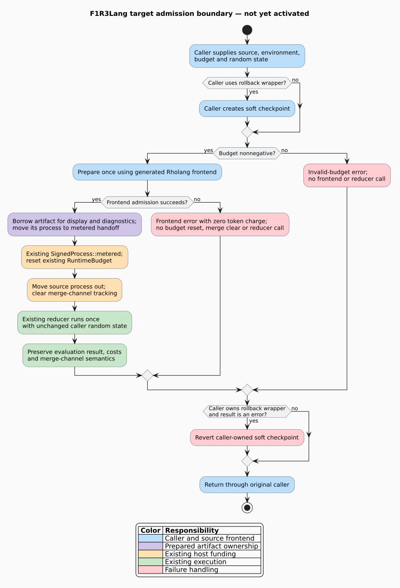

# F1R3Lang frontend admission contract

## Scope and activation boundary

F1R3Lang is the MeTTaIL-defined Rholang 1.4 frontend integrated with the existing
F1r3node evaluator. Module and Theory declarations extend the Rholang process
grammar; they do not introduce a separate application language or evaluator.
Foreign-language terms (FLTs) carry syntax belonging to an explicitly selected,
installed language.

This contract freezes the first integration boundary. It does **not** activate
MeTTaIL on public node routes. The
[baseline fixture](../../rholang/tests/fixtures/f1r3lang_frontend_baseline.json)
records `public_activation: false`; its feature gates describe the baseline,
not executable configuration. The
[baseline tests](../../rholang/tests/f1r3lang_frontend_baseline_spec.rs)
detect changes that require review. Passing them does not establish parser
equivalence, runtime correctness, or readiness to deploy a node.

Implementation uses the isolated `feature/f1r3lang-mettail-only` branch derived
from engine revision `6781d1d671cc0b98b9de946b3871bdbb8e7f1280`.
Other node worktrees undergoing refactoring are not integration targets until
their owners supply a completed revision and compatibility evidence.

## Artifact identity and reproducibility

The fixture separates three kinds of evidence:

| Evidence | What the checker establishes | What it does not establish |
|---|---|---|
| Approved node base | The current adapter descends from the approved Git revision; selected baseline source blobs match their SHA-256 digests | Every descendant is approved, or all runtime behavior is unchanged |
| Current engine boundary | The selected model, protobuf, PathMap codec and funding-engine files still match the baseline; current ABI declarations match | Whole-program canonical-byte equivalence |
| MeTTaIL development snapshot | Exact HEAD, tracked diff digest, modified-file inventory, untracked-file inventory and file digests match | A clean release pin or an independently reproducible published artifact |
| Specification sources | Selected files match the recorded revision and content digests | Those specifications have all been implemented |
| Source-route inventory | Files containing the two recorded legacy-parser reference strings are unchanged as a set | Semantic callgraph completeness or absence of indirect parser calls |

An application binary interface (ABI) here means an explicitly versioned
representation or interpretation contract. The fixture records PathMap
`0.2.2`, the EPM1 PathMap wire-format marker and version, and the MeTTaIL
grammar, language, theory, parser-image, semantic-image, compiler, Unicode and
checker declarations. The fixture is the exact machine-readable inventory;
version names alone are insufficient without their source witnesses.

The approved engine revision remains fixed as reviewed adapter commits are
added. Historical compiler and runtime files are checked through their Git
objects, because those are precisely the files the adapter will change.
The selected model and accounting files are additionally checked in the live
worktree. Intentional engine changes require an explicit compatibility review,
not an automatic baseline refresh.

The MeTTaIL snapshot contains unfinished work. Before the runnable node revision
is qualified, replace that development dependency with a reviewed clean commit
and regenerate its evidence. Do not label the development diff as a release
artifact. Local path dependencies and a regenerated Cargo lockfile are build
inputs, not substitutes for a source pin. The initial engine lockfile predates
its checked-in dependency declarations; offline reconciliation is required
before a locked build can succeed.

## Existing execution boundary

The current public evaluation route is
`node eval -> REPL gRPC service -> RhoRuntimeImpl::evaluate ->
InterpreterImpl::inj_attempt`. The gRPC service also invokes the legacy
compiler to print the normalized term before calling the runtime, so the
existing route compiles the source twice. See the
[REPL service](../../node/src/rust/api/repl_grpc_service.rs),
[interpreter](../../rholang/src/rust/interpreter/interpreter.rs) and
[runtime](../../rholang/src/rust/interpreter/rho_runtime.rs).

The target route prepares one artifact, lends its representation to display or
diagnostic consumers, and moves the admitted process into the existing metered
entry. Display must not consume the only artifact and trigger another parse.



The diagram is the target contract, not a claim of current activation. Its
[PlantUML source](figures/f1r3lang-admission.puml) is maintained alongside it.

The prepared handoff preserves this exact ordering:

1. Reject a negative initial phlo budget before invoking the source frontend.
   Phlo is the host execution-budget unit, not a parse-ranking weight.
2. Prepare the source using the supplied environment. A frontend error returns
   an error with zero charged token cost; it does not reset the budget, clear
   merge-channel tracking or invoke the reducer.
3. Wrap the admitted process using `SignedProcess::metered`, the runtime's
   signature and the nonnegative initial budget.
4. Call the existing `RuntimeBudget::reset_from_signed_process`. The wrapper
   contains both a signed process and a token; its iterative `token()` walk
   finds that token. This is a real budget reset, not a no-op.
5. Recover the process by move through `into_source_process`; do not clone or
   recursively dismantle a second copy.
6. Clear merge-channel tracking, then invoke the existing reducer exactly once
   with the caller's unchanged random state.
7. Preserve the existing success, error, charged-cost and merge-channel result
   conventions.

The source frontend does not choose the funding signature, supply a second
ledger, or bypass admission by invoking the low-level `inj` API. The existing
[accounting implementation](../../rholang/src/rust/interpreter/accounting/mod.rs)
and [resource-logic interface](../../rholang/src/rust/interpreter/accounting/resource_logic.rs)
remain authoritative.

Checkpoint ownership is explicit. The convenience wrapper
`evaluate_with_env_and_phlo` creates a soft checkpoint and reverts it on
evaluation errors. Raw `evaluate` does not itself promise this rollback.
The extracted prepared entry must preserve that distinction. Atomic language
installation and authorized effect publication require their own boundaries;
they cannot be inferred from the existence of a convenience wrapper.

Error accounting follows the current top-level error constructor. Direct
`ParserError`, `OperatorNotDefined` and `OperatorExpectedError` return zero cost;
`AggregateError` returns its member vector with finalized cost; other errors
return a singleton vector with finalized cost. Consequently, an empty aggregate
produces no returned errors, and `Located(OperatorNotDefined(...))` differs from
the bare error. Preserve these branches in the extraction; they are not new
frontend policies. `total_cost()` performs accounting reconciliation and must
remain the existing operation, not be replaced by a scalar-counter read.

Budget reset preserves the runtime's unmetered-mode setting. Ordinary public
admission must use a metered runtime; constructing a metered wrapper alone does
not change that setting. Checkpoint reversion restores RSpace, not the budget or
stored merge tracking. A zero-cost error result therefore does not by itself
establish absence of earlier reducer effects or a full state rollback.

## Host prepared-program API

The extracted boundary is implemented in
[frontend.rs](../../rholang/src/rust/interpreter/frontend.rs).
`ProgramFrontend` receives the exact source and an owned normalization
environment. `prepare_program` checks its ABI version before invoking
`prepare`; an unsupported version is a preparation failure. ABI version 1
identifies this host contract, not a language-image or canonical-wire version.
There is no global mutable frontend selection.

`PreparedProgram::from_normalized` packages a trusted adapter's normalized
`Par`. It does not validate untrusted input, establish frontend neutrality,
verify a language certificate or grant installation authority. This is an
in-process host transport, not the future neutral frontend artifact. A frontend
implementation is trusted Rust code and must not capture and mutate the live
budget or RSpace while preparing. The interface supplies neither of those
objects, but cannot sandbox arbitrary Rust implementations.

The artifact is not `Clone`. `as_par` borrows it for display or diagnostics;
`into_par` consumes it. Its lifecycle reuses the generated iterative `Par`
destructor and does not introduce another recursive teardown mechanism.
This contract prevents accidental reuse of the same owner; it does not claim
that trusted callers cannot explicitly copy a borrowed process.

| Host operation | Preparation | Execution and rollback |
|---|---|---|
| `prepare_program(frontend, source, environment)` | Check ABI, then invoke the explicit frontend once | None |
| `artifact.as_par()` | None; borrow the existing process | None |
| `runtime.evaluate_with_frontend(frontend, source, budget, environment, random)` | Reject negative budget before checking ABI and preparing | Shared metered entry; no implicit checkpoint |
| `runtime.evaluate_prepared(artifact, budget, random)` | None; consume the supplied artifact | Reject negative budget or use the same metered entry; no implicit checkpoint |

For display followed by execution, prepare once, borrow with `as_par`, then
move that artifact into `evaluate_prepared`. This explicit two-phase use
prepares before admission checks the budget. Use `evaluate_with_frontend` when
a negative budget must reject before any preparation. Neither operation
supplies rollback or a language capability. Callers requiring transactional
evaluation own the checkpoint policy.

Admission must be serialized between deployments, as required by the existing
budget reset. The proof and API do not authorize overlapping resets on a
shared runtime. The new operations do not activate public MeTTaIL parsing.
Existing source evaluation delegates to the crate-private legacy compiler
adapter until the separately gated cutover. Moving that call from
`interpreter.rs` to `frontend.rs` updates the baseline reference-file inventory
without changing historical source digests or weakening its check.

## Neutral frontend and language services

The existing MeTTaIL lowerer emits node-specific `Par` values using an explicit
worklist. That is reusable lowering logic, but it is not yet a node-independent
frontend. Factor its structural emission through a target interface and a
neutral Rholang intermediate representation (IR), then reuse it in the node
adapter. Neither serialized `Par` hidden in an opaque field nor a renamed
`Par` constitutes a neutral IR.

The adapter must preserve binders, collection shape and mode, connective flags,
source occurrences, structural FLT holes, canonical protobuf bytes and
diagnostics. Public admission must reject unresolved variables instead of
substituting the existing example runner's literal/output-channel conventions.
It must not convert unresolved parse alternatives into parallel processes.

One shared installed-language service must supply both system-process
definitions and the FLT-aware matcher. A grammar value, alias, URI or digest is
not an installed-language capability. Resolve explicit FLT prefixes to opaque
handles and check action-specific rights at use. Install parser and semantic
artifacts atomically, using the existing semantic kernel for reduce and observe
operations. Do not create a second regex evaluator.

Inline Module/Theory syntax is parsed structurally by the generated Rholang
parser. Guest FLT text is parsed for the first time only when its language handle
is available; holes remain structural inputs. Unqualified backticks retain
their Rholang URI meaning. Registry resolution uses exact commitments.
Filesystem module loading remains unavailable until the future injected File
I/O capability exists.

## Guarded system-contract publication

The [RSpace interface](../../rspace++/src/rspace/rspace_interface.rs) supplies
`produce_guarded` and `ProduceCommitGuard`. The guard is trusted host Rust code,
not a Rholang value or a new source of language authority. It must invoke its
one-shot callback exactly once on success and never on refusal, with authority
protection held throughout that callback. `commit_produce` distinguishes an
ordinary refusal from a malformed guard which accepts without invocation or
reports failure after invocation. The latter is a protocol violation and does
not promise that effects were absent.

Ordinary `produce` retains a direct, allocation-free guard bypass while sharing
the same mutation body. Guarded production follows this ordering:

1. Acquire channel locks asynchronously and prepare the existing matcher’s
   candidate outside the authority scope.
2. Enter the synchronous authority callback. Apply the produce counter,
   play event log, storage, COMM and replay-binding updates exactly once.
3. Release authority and channel locks, then notify step observers or replay
   reporting callbacks. Preserve the existing Produce-before-COMM reporting
   order; reporting is not a new replay event log.
4. Return the owned reply result and run the existing continuation
   dispatch without holding the authority guard.

Replay candidate selection reads a pending-count overlay: every datum with
the pending produce identity sees its prospective increment, except for a
persistent produce. The actual shared counter changes only inside the guard,
before COMM construction. This preserves exact repeat-count matching without
mutating counters on refusal. Replay result materialization consumes the
original candidate after notification instead of forcing additional deep
payload clones.

[ContractCall](../../rholang/src/rust/interpreter/contract_call.rs) exposes
`unapply_guarded` alongside its unchanged `unapply` interface. The returned
producer checks authority when its future reaches the actual RSpace mutation,
not when that future is created. Receiver callbacks can revoke the authority
after commit; such later revocation does not undo the reply. Both paths retain
the incoming random state and existing dispatch behavior.

The MeTTaIL `GuardedReplyPublication` Rocq module checks the finite publication
phase machine, concrete installed-authority decision, at-most-once mutation,
refusal preservation and pending-counter equivalence. Its mutation function
is universally quantified: it is a control-boundary proof, not a proof of every
COMM implementation or arbitrary Rust guard. The host tests cover matched and
unmatched refusal, counters and replay bindings, cold-cache committed roots,
repeated produce identities, observer revocation, and actual producer-future
and receiver dispatch. Lazy cache fills are not logical message mutations;
soft checkpoint observations must be restored because they drain logs and
counters.

This hook does not activate the public frontend, expose the reduce/observe
wire API, or establish rollback of subsequent receiver effects. The language
service must still connect its installed-table authorization to this guard.

## Public-route coverage

The baseline fixture identifies seven route families: node evaluation/gRPC,
LSP validation, Casper deploy admission, Casper interpreter utilities, Casper
runtime queries, the Rholang CLI and source-artifact construction. At activation,
each exposed route must use the prepared MeTTaIL frontend or explicitly reject
an unsupported route **before** legacy parsing. No successful production
fallback to the legacy parser is allowed.

The source scanner is iterative and rejects symlinks in its traversal roots.
It conservatively includes comments and test modules containing
`Compiler::source_to_adt` or `rholang_parser::RholangParser::new`.
A new spelling, alias or indirect call may escape that textual inventory.
Consequently, activation also requires dependency and route-specific execution
evidence; the inventory is a review tripwire, not a pruning or reachability
analysis.

The practical Regex gate runs ordinary Rholang containing its own Module/Theory
declaration and meaningful GSLT equations and rewrite rules through the actual
node public entrypoint. It checks qualified FLT operations, deterministic
outputs, failure isolation and parser provenance. A library-only test is useful
earlier evidence, not completion of that gate.

## Verification and proof obligations

The [prepared-admission proof](../theory/f1r3lang-prepared-admission.md) specifies
the operation-level extraction and its exact Rust correspondence obligations.
It keeps accounting reconciliation and reducer behavior in the existing host.

Before changing runtime behavior, prove the prepared-handoff transition model
and check its refinement against the existing implementation. The model must
cover rejection before funding, exactly one budget initialization and reducer
invocation on admission, unchanged random input, process ownership and the
actual checkpoint/error branches. A proof of this boundary is not a proof of
the frontend, semantic kernel, canonical-byte translation or complete node.

The baseline suite checks contract shape, source and ABI witnesses, ancestry,
current engine identity and reference-file coverage. Its negative controls
alter the approved base, activation claim, source digest, ABI value and
reference inventory. Missing external inputs fail rather than silently skipping
verification. They are supplied as explicit paths so the test never discovers
or modifies another worktree on the operator's behalf.

From the isolated node workspace root, with the exact fixture snapshots checked
out in the following sibling directories:

```sh
export F1R3LANG_METTAIL_ROOT="$PWD/../mettail-module-dev/mettail-rust"
export F1R3LANG_VENUS_ROOT="$PWD/../MeTTaIL"
export F1R3LANG_LEGACY_PARSER_ROOT="$PWD/../rholang-rs-cost-accounting-transpiler"
export F1R3LANG_PAPERS_ROOT="$PWD/../publications"
systemd-run --user --scope --quiet \
  -p MemoryMax=8G -p MemoryHigh=7680M -p MemorySwapMax=0 \
  env CARGO_BUILD_JOBS=1 CARGO_INCREMENTAL=0 \
  F1R3LANG_METTAIL_ROOT="$F1R3LANG_METTAIL_ROOT" \
  F1R3LANG_VENUS_ROOT="$F1R3LANG_VENUS_ROOT" \
  F1R3LANG_LEGACY_PARSER_ROOT="$F1R3LANG_LEGACY_PARSER_ROOT" \
  F1R3LANG_PAPERS_ROOT="$F1R3LANG_PAPERS_ROOT" \
  cargo test --locked -p rholang --test f1r3lang_frontend_baseline_spec \
  -- --test-threads=1
```

Keep verification logs and compiler artifacts under `target/`. Run one heavy
verification job at a time. Compile individual Rocq proof modules under a
1 GiB hard limit with swap disabled; do not run the complete proof collection
as part of this focused admission check.
