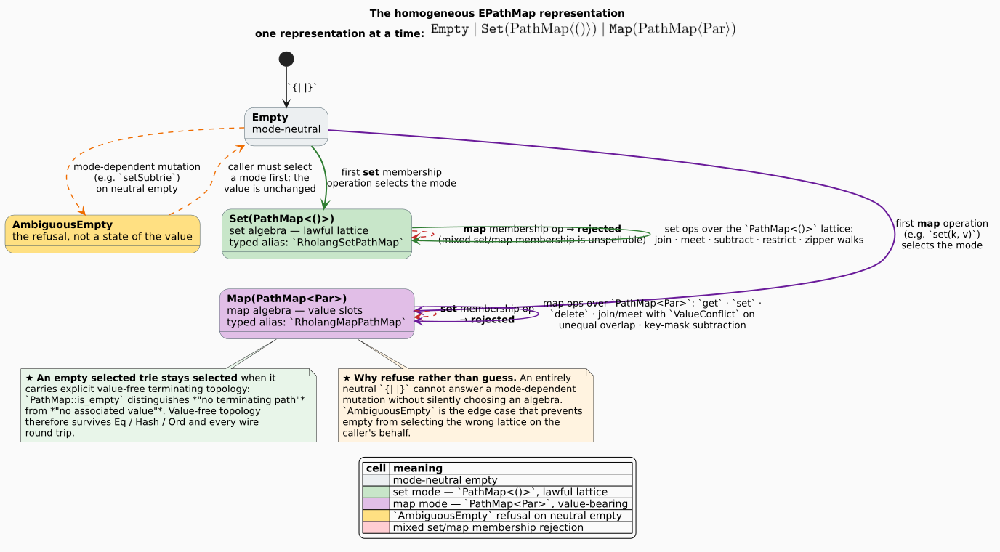
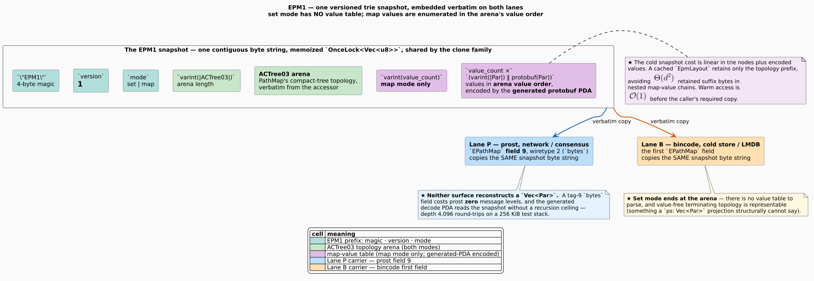
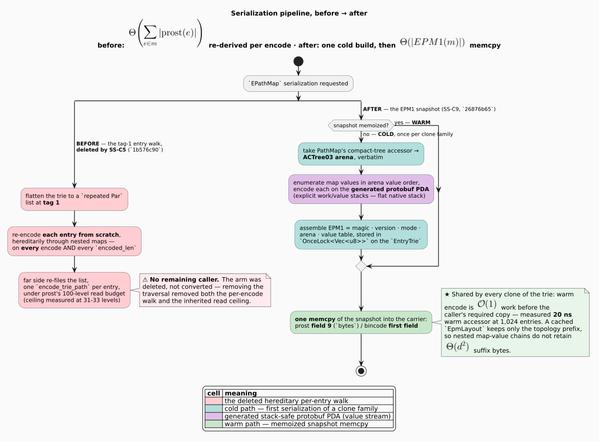
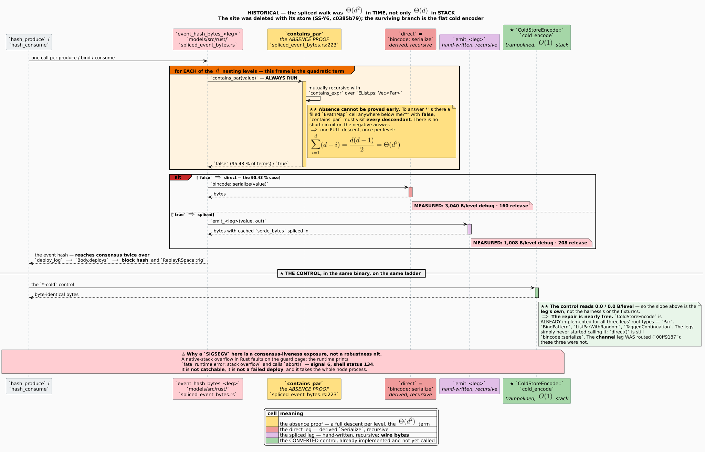

# PathMap-Native EPathMap: Representation, Wire Format, and Performance

### A design and results report on making the Rholang path map a first-class prefix-compressed trie — in memory, on both wire formats, and in every hashing and ordering preimage

**Repository** `f1r3node-rust-mettail`, branch `feature/mettail`
**Companion repository** `mettail-rust`, branch `feature/rho-native-set-automata`
**Report date** 2026-08-03, revised 2026-08-04 · **Measurement anchor** `f1r3node-rust-mettail@e67a6aaa` · `mettail-rust@98901e33`
**Companion reports** — the [stack-safety report](../stack-safety/stack-safety-report-2026-07-29.md)
(the depth-safety programme these fixes also belong to) and the
[consensus-change register](../../consensus/consensus-change-register.md)
(the consensus classification of the byte-moving transitions; the entry identifiers are linked
from §0, after the notation table below defines their prefix).

---

## Notation and abbreviations

★ **Read this table first if any short form below is unfamiliar.** Conceptual terms (mode, neutral
empty, `AmbiguousEmpty`, escape arm, …) are not abbreviations and are defined in the
[glossary, §2.4](#24-glossary).

| Short form | Expansion | Where it matters here |
|---|---|---|
| **CBR** | *consensus-breaking record* — the identifier prefix of consensus-register entries | §0, §5.2, §5.7, §8 |
| **EPM1** | *EPathMap format, version 1* — the versioned trie snapshot this report specifies | §5.2 |
| **SS** | the *stack-safety* fix-identifier prefix shared with the companion report | §0 |
| **PDA** | *pushdown automaton* — the explicit heap-backed traversal machine | §2.4, §5.2, §5.9 |
| **ACT / ACTree03** | PathMap's *arena compact tree*, revision 03 — the topology arena EPM1 embeds | §2.1, §5.2 |
| **LRU** | *least recently used* — the replacement policy of the deleted intern store | §5.8 |
| **LMDB** | *Lightning Memory-Mapped Database* — the cold store's backing key-value store | §2.2 |
| **SHA / SHA-256** | *Secure Hash Algorithm*, 256-bit variant — the byte-golden comparison digest | §4, §5.2 |
| **DHAT** | Valgrind's *dynamic heap analysis tool* | §4 |
| **RSS** | *resident set size* — the capped physical-memory footprint of every measured run | §4 |
| **TSV** | *tab-separated values* — the durable measurement files | §5.4, §5.6, Appendix B |
| **DFS** | *depth-first search* — the trie traversal order preserved by the zipper walks | §5.5 |
| **LIFO** | *last in, first out* — the worklist discipline of the printer PDA | §5.7 |
| **BLAKE2 / BLAKE2b-256** | the BLAKE2 cryptographic hash family and its 256-bit instance used for merkleization | §3, §5.4 |
| **Ir / Dr / Dw** | cachegrind's *instruction reads*, *data reads*, *data writes* counters | §5.6 |

---

## Evidentiary convention

Every factual claim in this report carries one of two tags, shared with the companion reports.

| tag | meaning |
|---|---|
| **DERIVED** | read from source, from a build artefact, or from a commit body. The provenance is named inline (`file:line`, commit hash, or `crate-version/path`). |
| **MEASURED** | observed by executing something, with the recording commit, suite, or teed log named. |

A claim with no tag is a definition or an argument, not a fact about the system.

---

## 0. THE FIX INDEX

The identifiers below are the same `SS-*` identifiers used by the
[stack-safety report's fix register](../stack-safety/stack-safety-report-2026-07-29.md#0-the-fix-register--the-scannable-index);
they are **stable and never reused**, so a fix cited as *"SS-C9"* from a commit message or another
document resolves in either report. This report holds the PathMap bodies; the stack-safety report's
register rows for these IDs point here.

| ID | commit | subject | final state | § |
|---|---|---|---|---|
| **SS-C5** | `1b576c90` | prost `EPathMap` arm: the tag-1 per-entry walk is **deleted**; every non-empty map emits the trie's own byte array $`U(m)`$ at field 8 | superseded by EPM1 (SS-C9); the walk never returned | [5.2](#52-the-wire-lineage-and-the-epm1-format) |
| **SS-C6** | `698406a3` | $`U(m)`$ becomes a memo on the trie (`OnceLock`); the warm encode is one `memcpy` | carried forward into the EPM1 snapshot cache | [5.2](#52-the-wire-lineage-and-the-epm1-format) |
| **SS-C7** | `3a32cf07` | bincode FORM ②: $`U(m)`$ verbatim and contiguous, then the values; the reader splits frames by pure byte slicing | superseded by EPM1 (SS-C9) | [5.2](#52-the-wire-lineage-and-the-epm1-format) |
| **SS-C8** | `8cf0b770` | FORM ② keyed by the entries **this surface writes** (`locally_free`-blanked); the blanked trie is memoized | folded into EPM1; the invariant it repaired is permanent | [5.2](#52-the-wire-lineage-and-the-epm1-format), [5.3](#53-negative-results) |
| **SS-C9** | `26876b65` | `EPathMap = Empty \| Set(PathMap<()>) \| Map(PathMap<Par>)`; one versioned **EPM1** trie snapshot on protobuf **and** bincode; generated decode PDAs remove the read ceiling | **the final state**; refined by `9b3792ac` (zero-copy decode) and `2902f0d0` (reverse-zipper printer) | [5.1](#51-the-homogeneous-representation)–[5.5](#55-pathmap-native-operations) |
| **SS-C10** | `7b25df5a` | the expression-evaluator PDA streams set keys and map key/value pairs from reverse PathMap order instead of retaining a forward `Vec<&Par>` projection | zero projected child pointers; canonical forward evaluation and map association preserved | [5.7](#57-reverse-zipper-totality) |
| **SS-Y6** | `c0385b79` | the `InternedEPathMap` LRU store and its spliced event-hash emitter are **deleted**; `contains_par` is constant-false | discharged by deletion; zero byte goldens moved | [5.8](#58-the-dissolved-intern-store) |
| **SS-E3** *(PathMap slice)* | `b2d84064` | independent `hash_pathmap_set` / `hash_pathmap_map` cachegrind ladders | both linear; exponents in [§5.6](#56-hash-and-clear-ladders) | [5.6](#56-hash-and-clear-ladders) |
| **SS-E4** *(PathMap slice)* | `0e487d4a` | production reverse-zipper totality repair found by measurement | total; allocation-free reverse walk preserved without a PathMap fork | [5.7](#57-reverse-zipper-totality) |

Consensus classification of the byte-moving transitions:
[CBR-041](../../consensus/consensus-change-register.md#cbr-041),
[CBR-042](../../consensus/consensus-change-register.md#cbr-042),
[CBR-043](../../consensus/consensus-change-register.md#cbr-043), and
[CBR-044](../../consensus/consensus-change-register.md#cbr-044) (the EPM1 activation itself).
The reverse-zipper repair's former entry (CBR-046) is retired as a bug fix under the register's
2026-08-03 inclusion criterion; its record is the register's
[exemption appendix](../../consensus/consensus-change-register.md#b1-retired-register-entries).

---

## Abstract

`EPathMap` — the Rholang path-map value — is stored by PathMap, a prefix-compressed byte trie with
native zipper, algebra, lattice, and merkle operations. Until this campaign, compatibility boundaries
repeatedly projected that trie to a flat list of `Par` entries: serialization re-encoded every entry
from scratch on every encode, the network reader re-filed the list under a 100-level recursion budget,
and value-free terminating topology was unrepresentable.

The final state eliminates the projection everywhere. **The representation is homogeneous** —
`Empty | Set(PathMap<()>) | Map(PathMap<Par>)` — with mode selection at the first membership operation
and an explicit `AmbiguousEmpty` refusal instead of a silent algebra choice (§5.1). **The wire format
is one versioned trie snapshot, EPM1**, carried verbatim on protobuf field 9 and as bincode's first
`EPathMap` field; no surface reconstructs a `Vec<Par>`, and generated decode pushdown automata read it
without a recursion ceiling — depth 4,096 round-trips on a 256 KiB test stack (§5.2). **Every
operation is trie-native** — lookup, subtrie navigation, join/meet/subtract/restrict, merkleization,
equality, hashing, ordering — over read/write zippers or PathMap algebra (§5.5).

Headline measurements at a fixed 1,024-entry scale (**MEASURED**, §5.4): EPM1 serializes the set
subject in **6,252 B** against **491,528 B** for the list projection (**78.619×**) and the map subject
in **87,669 B** against **662,536 B** (**7.557×**); native indexed lookup answers in **32.00 /
41.86 ns per key** against **$`\approx 258`$ µs** for a linear scan over the projection (**8,060.736× /
6,183.905×**); the warm snapshot accessor is **20 ns**. Independent cachegrind ladders fit the set and
map hashing subjects at Ir exponents **0.9918** and **1.0175** — linear (§5.6). The costs are reported
with the same candour: the stack-safe canonical-key classifier is **3.79× slower at depth 1** — the
production-common case — with crossover before depth 8 and **233.874×** at depth 1,024 (§5.5), and
EPM1's gain is canonicity and single-sourcing, **not** compression: the serialized key stream does not
exploit prefix sharing (measured false, §5.3).

Two production defects were found by measurement rather than review and repaired without forking
PathMap: an ACTree03 reader that turned internal compression nodes into observable terminating paths
on dense maps (§5.2), and a reverse-zipper sibling walk that panicked on a dense zero mask word
(§5.7). A third defect class — a play/replay event-hash divergence from serializing unblanked entry
keys beside blanked values — was measured, repaired, and is permanently excluded by EPM1's
single-sourcing rule (§5.3).

---

## Table of contents

- [0. THE FIX INDEX](#0-the-fix-index)
- [1. Introduction](#1-introduction)
- [2. Background](#2-background)
- [3. Related work](#3-related-work)
- [4. Methods](#4-methods)
- [5. Results](#5-results)
  - [5.1 The homogeneous representation](#51-the-homogeneous-representation)
  - [5.2 The wire lineage and the EPM1 format](#52-the-wire-lineage-and-the-epm1-format)
  - [5.3 Negative results](#53-negative-results)
  - [5.4 EPM1 performance at fixed scale](#54-epm1-performance-at-fixed-scale)
  - [5.5 PathMap-native operations](#55-pathmap-native-operations)
  - [5.6 Hash and clear ladders](#56-hash-and-clear-ladders)
  - [5.7 Reverse-zipper totality](#57-reverse-zipper-totality)
  - [5.8 The dissolved intern store](#58-the-dissolved-intern-store)
  - [5.9 Formal evidence](#59-formal-evidence)
- [6. Discussion](#6-discussion)
- [7. Threats to validity](#7-threats-to-validity)
- [8. Residuals](#8-residuals)
- [9. Conclusions](#9-conclusions)
- [References](#references)
- [Appendix A — reproduction commands](#appendix-a--reproduction-commands)
- [Appendix B — raw data locations](#appendix-b--raw-data-locations)

---

## 1. Introduction

### 1.1 The problem: a trie treated as a list

An `EPathMap` stores a PathMap trie, and the trie is the value: prefix-compressed shared structure,
value-free terminating topology, $`\mathcal{O}(1)`$ maintained size, native lattice algebra, and
merkleization. Yet at every compatibility boundary — the two serializers, the network reader, the
pretty printer, hashing, ordering — the implementation repeatedly flattened it to a list of `Par`
entries. The projection had four independent costs, each established in this report or its companions:

1. **Work before the requested operation begins.** A list projection is $`\Theta(n)`$ allocation
   whatever the caller wanted — a lookup that PathMap answers in nanoseconds paid a full
   materialization first (**MEASURED**, §5.4: 8,060× on the set subject).
2. **Representation loss.** A `ps: Vec<Par>` structurally cannot say *"this path terminates but
   carries no value"* — value-free topology, which the set mode's semantics require (**DERIVED**,
   the value-free-topology witnesses in `models/tests/epathmap_pathmap_native_zipper.rs`).
3. **A hereditary per-encode walk.** The prost serializer re-encoded every entry from scratch, through
   nested maps, on **every** `encode_raw` *and* every `encoded_len` (§5.2).
4. **An inherited read ceiling.** The projected list re-entered through per-entry decoding under
   prost's fixed 100-level recursion budget, measured as a 31–33-level ceiling on ordinary Rholang
   terms (§5.2) — while the writer was unbounded, a wire asymmetry a hostile peer could exploit.

The owner's standing ruling resolves all four the same way: **the trie serializes as a trie, in every
format** — its own byte array on every surface, with the list projection recognized as the defect
rather than as a compatibility convenience.

### 1.2 Contributions

1. A **homogeneous representation** for `EPathMap` with typed set/map specialization and an explicit
   refusal (`AmbiguousEmpty`) where inference would have to guess (§5.1).
2. **EPM1**, a versioned single-sourced trie snapshot carried verbatim by both wire formats, with a
   memoized $`\mathcal{O}(1)`$ warm encode and a zero-copy, ceiling-free iterative decode (§5.2).
3. **Trie-native operations** for the full collection and algebra surface, including mode-correct
   hashing/equality/ordering that observe value-free topology (§5.5).
4. **Measurements** of the size, latency, and complexity-class consequences, including the negative
   results — what the design does *not* buy (§5.3, §5.4, §5.6).
5. Three **defect discoveries by instrument** — the dense-map ACT reader, the reverse-zipper mask-word
   panic, and the blanked-key event-hash divergence — each with its repair and its regression (§5.2,
   §5.3, §5.7).

---

## 2. Background

Every term used later is defined here first.

### 2.1 PathMap and ACTree03

**PathMap** is the trie-map crate (workspace path `../PathMap`, unmodified by this campaign — see
§5.7 for the one repair that *stayed out* of it). Its value type `PathMap<V>` is a
**prefix-compressed byte trie**: keys are byte strings, shared prefixes are stored once, and a node
may **terminate a path** (be a key) independently of carrying a **value** `V`. Traversal state is a
**zipper** [[Huet 1997](#ref-huet1997)] — a cursor holding a path buffer and a focus, with
ascend/descend/sibling moves; read zippers (`ReadZipperUntracked`) never allocate per step.
**ACTree03** is PathMap's compact-tree arena: a contiguous byte encoding of the trie's topology
produced by its compact-tree accessor, containing structural leaves, value-bearing nodes, **and
internal line/branch compression nodes** that exist only to share structure. The distinction is
load-bearing in §5.2.

### 2.2 EPathMap and the two lanes

**`EPathMap`** is the Rholang expression carrying a path map. `{| |}` is the neutral empty literal;
`{| p |}` set membership; `{| k : v |}` map bindings. A `Par` — the Rholang process term — reaches
storage and the network on two independent wire formats, defined in the
[consensus register §2.5](../../consensus/consensus-change-register.md#25-the-two-wire-formats) and
used here by name:

| lane | codec | direction of travel |
|---|---|---|
| **Lane P** | protobuf via `prost` | between nodes, and into blocks (network/consensus) |
| **Lane B** | `bincode` over `serde` | node-local, into the LMDB cold store; also the event-hash preimage |

### 2.3 The canonical key stream U(m)

For a path map $`m`$, **$`U(m)`$** denotes the trie's own canonical byte array: the concatenated
canonical key stream produced by `path_stream_of` — each key complete, in trie order, with the
`0x0F` escape arm keying a non-ground entry by its canonical prost bytes. $`U`$ is **one function
applied to the value a surface writes**; §5.3 records the divergence that followed from breaking that
single-sourcing rule, and §5.2's EPM1 embeds the rule permanently.

### 2.4 Glossary

| term | definition |
|---|---|
| **mode** | which algebra a non-empty `EPathMap` carries: **set** (`PathMap<()>`) or **map** (`PathMap<Par>`). Selected by the first membership operation; mixed membership is rejected. |
| **neutral empty** | `{| |}` before mode selection. Distinct from an empty *selected* trie, which `PathMap::is_empty` distinguishes via value-free topology. |
| **`AmbiguousEmpty`** | the typed refusal returned when a mode-dependent mutation (e.g. `setSubtrie`) is asked of neutral empty — the alternative to silently guessing an algebra. |
| **EPM1** | *EPathMap format, version 1* — the versioned trie snapshot of §5.2, one byte string embedded verbatim by both lanes. |
| **snapshot cache** | the `OnceLock<Vec<u8>>` holding a clone family's completed EPM1 bytes; first serialization fills it, every later encode copies it. |
| **`EpmLayout`** | a cached topology prefix allowing the generated encoder to stream nested map values without retaining $`\Theta(d^2)`$ suffix bytes across a $`d`$-deep value chain. |
| **escape arm** | the `0x0F` key form embedding a non-ground entry's canonical prost bytes inside a trie key. |
| **ground / canonical-key classifier** | the predicate deciding whether a `Par` may key the trie directly or must take the escape arm; runs on **every segment of every trie key**. |
| **PDA** | *pushdown automaton* — the explicit heap-backed control machine (defunctionalised continuations [[Reynolds 1972](#ref-reynolds1972); [Danvy & Nielsen 2001](#ref-danvy2001)], trampolined [[Ganz et al. 1999](#ref-ganz1999)]) used by every generated traversal; the stack-safety report's central device. |
| **B/level** | bytes of native stack consumed per additional nesting level; defined and instrumented in the [stack-safety report §2.3 and §4](../stack-safety/stack-safety-report-2026-07-29.md#4-methods). |
| **byte golden** | a checked-in serialized fixture compared by **SHA-256 digest**, never by length alone (a length comparison accepts same-size permutations). |
| **`locally_free` blanking** | zeroing a term's cached free-name bitset before it enters an event-hash preimage; the standing rule is that `locally_free` *"must not reach an RSpace channel hash"* (**DERIVED**, `models/src/rust/rholang/bincode_schema.rs`). |

### 2.5 Companion documents

The depth-safety programme, its instruments (bisection ladders, DHAT, massif, cachegrind), and the
generated-PDA architecture are the
[stack-safety report](../stack-safety/stack-safety-report-2026-07-29.md)'s subject; this report
cites its methods rather than restating them. The consensus classification of every byte-moving
transition here is the [consensus register](../../consensus/consensus-change-register.md)'s subject.
Tutorial material on path maps and zippers in Rholang is
[`docs/rholang/07-pathmaps-and-zippers.md`](../../rholang/07-pathmaps-and-zippers.md); the earlier
value-handling review is
[`docs/epathmap-value-handling-review.md`](../../epathmap-value-handling-review.md).

---

## 3. Related work

**Tries.** The trie is Fredkin's [[Fredkin 1960](#ref-fredkin1960)]; path compression — storing a
run of single-child nodes once — is PATRICIA [[Morrison 1968](#ref-morrison1968)]. PathMap is a
byte-alphabet compressed trie-map in this lineage, with the addition that terminating topology is
representable independently of values — the property §5.1 makes wire-visible.

**Zippers.** The allocation-free cursor over a persistent structure is Huet's zipper
[[Huet 1997](#ref-huet1997)]. PathMap's read/write zippers are the traversal substrate for every
native operation in §5.5, and §5.7's totality repair is expressed purely in the zipper's public
primitives.

**Merkleization.** Hashing a tree by hashing its children's hashes is Merkle's construction
[[Merkle 1988](#ref-merkle1988)]; the `merkleize` operation of §5.4 applies it over the trie with
BLAKE2b-256 [[Aumasson et al. 2013](#ref-aumasson2013)] as the compression function, consistent with
the node's event-hash family.

**Iterative traversal.** The PDA machinery this report's codecs and comparators run on is the
defunctionalised-continuation line of Reynolds [[Reynolds 1972](#ref-reynolds1972)], Danvy and
Nielsen [[Danvy & Nielsen 2001](#ref-danvy2001)], and trampolined style
[[Ganz et al. 1999](#ref-ganz1999)]; the full treatment is the stack-safety report's §3.

**Instruments.** Heap measurements use Valgrind's DHAT and massif tools
[[Nethercote & Seward 2007](#ref-nethercote2007)]; deterministic instruction/data counts use
cachegrind from the same framework. Algorithms are presented in Knuth's literate style
[[Knuth 1984](#ref-knuth1984)].

---

## 4. Methods

**Byte goldens.** Serialized-form claims are checked against committed fixtures compared by SHA-256
digest (never length), with **unmoved** goldens serving as the anti-vacuity control: a change that
moved every fixture would indicate emitter drift rather than a converted surface (§5.2). The golden
suite is `models/tests/serializer_par_byte_goldens.rs` (15 fixtures across prost, bincode, and JSON).

**Fixed-scale benchmark.** §5.4's numbers come from one fixed workload: **1,024 entries, 3 shared
prefix segments, 64-byte map values**, 11 samples reported at the median, release profile, one Cargo
job, executed under `systemd-run` with `MemoryMax=4G`, `MemorySwapMax=0` (zero swap observed). The
subjects are a set-mode and a map-mode `EPathMap` of that shape; *cold* means first serialization of
a clone family (memo empty), *warm* means the memo is filled. These are **fixed-machine comparative
measurements, not universal latency claims**; the engineering conclusion is the ratio and the
complexity class. Hardware and machine-state controls are the
[stack-safety report §4.1–§4.2](../stack-safety/stack-safety-report-2026-07-29.md#4-methods).

**Deterministic complexity fits.** §5.6's exponents are cachegrind Ir/Dr/Dw counters fitted over
depth rungs 128/256/512/768 with a parameter-invariant child subtracted at every rung; the
instrument, its 0.1 % validity ceiling, and the predeclared 1.80 red bar are defined in the
[stack-safety report §5.14](../stack-safety/stack-safety-report-2026-07-29.md) and its
[cachegrind TSV](../stack-safety/measurements/phase7-cachegrind-fits-2026-08-03.tsv).

**Depth ladders.** Stack-safety claims (depth 4,096 on a 256 KiB stack; flat B/level) use the forked
bisection instrument of the stack-safety report §4; this report cites those results rather than
re-deriving the method.

**Resource caps.** Every MEASURED suite in §5 ran under a systemd scope with an RSS hard maximum
(1–6 GiB as named inline), zero swap, and one Cargo job.

---

## 5. Results

### 5.1 The homogeneous representation

**Before.** `EPathMap`'s compatibility surfaces treated the value as a list of entries; set-ness and
map-ness were implicit in the entries themselves; value-free terminating topology was unrepresentable
on any boundary; and a global `impl Lattice for Par` supplied join/meet for arbitrary `Par` values —
an unlawful instance, since arbitrary processes have no join.

**After** (**DERIVED**, `26876b65`). One homogeneous representation at a time:

```math
\mathtt{EPathMap} \;=\; \mathtt{Empty} \;\mid\; \mathtt{Set}\big(\mathrm{PathMap}\langle()\rangle\big) \;\mid\; \mathtt{Map}\big(\mathrm{PathMap}\langle\mathrm{Par}\rangle\big)
```



**Figure 1** — *[`figures/epathmap-representation-states.puml`](figures/epathmap-representation-states.puml)*.
**Diagram type: a state diagram**, because the representation's defining property is a one-way mode
selection with typed refusals; the diagram shows which operations are answerable in which mode.

- `Empty` is mode-neutral. The **first membership operation selects the mode**; mixed set/map
  membership is rejected.
- An empty *selected* trie remains selected when it carries explicit value-free topology, because
  `PathMap::is_empty` distinguishes *"no terminating path"* from *"no associated value"*.
- A mode-dependent mutation on neutral empty (e.g. `setSubtrie`) returns **`AmbiguousEmpty`** until a
  set or map operation selects the mode — the edge case that prevents empty from silently choosing
  the wrong algebra.
- The public compatibility API makes the specialization visible in its types and names:
  `RholangSetPathMap = PathMap<()>`, `RholangMapPathMap = PathMap<Par>`, `set_trie` / `map_trie`,
  `set_epathmap_to_rholang_set_pathmap`, `rholang_set_pathmap_to_set_epathmap`. The zipper
  compatibility mapper is explicitly set-only and cannot be mistaken for a generic set/map
  conversion; value-bearing callers use `map_trie` and the map-value operations.
- The global `Lattice for Par` is **deleted**. Map join/meet accept equal overlaps and report
  `ValueConflict` for unequal values; subtraction deliberately treats the right map as a **key
  mask**, independent of its values (§5.9 carries the machine-checked law).

| property | before (projection surfaces) | after (homogeneous) |
|---|---|---|
| mode safety | implicit in entries; mixing expressible | typed; mixing **rejected**; neutral-empty mutation **refused** (`AmbiguousEmpty`) |
| value-free terminating topology | unrepresentable in `ps: Vec<Par>` | representable; observed by Eq/Hash/Ord and every wire round trip |
| allocation before an operation | $`\Theta(n)`$ projection | none — operations run on the trie |
| `Par` lattice obligations | global unlawful `impl Lattice for Par` | none — set lattice on `PathMap<()>`; map overlap compared, conflicts typed |

### 5.2 The wire lineage and the EPM1 format

The serialization surface went through five stages; each repaired the defect the previous stage
exposed, and only the last is live. The table is the lineage; everything after it describes the final
state.

| stage | commit | Lane P (prost) form | Lane B (bincode) form | defect repaired | superseded by |
|---|---|---|---|---|---|
| baseline | — | `repeated Par` at tag 1, re-encoded per entry per encode; tag 8 $`U(m)`$ only for `eval_stable` maps | derived `serde` entry list | — | SS-C5 |
| **SS-C5** | `1b576c90` | tag-1 arm **deleted**; $`U(m)`$ at field 8 for **every** non-empty map (fields 3, 4, 5, 8 ascending) | unchanged | the hereditary per-entry encode walk; the tag-1 read ceiling | SS-C9 |
| **SS-C6** | `698406a3` | $`U(m)`$ memoized on the trie (`path_stream: OnceLock<Arc<Vec<u8>>>`); warm encode = one `memcpy` | unchanged | a fresh full-trie walk + allocation on **every** `encode_raw` and `encoded_len` | SS-C9 (memo carried forward) |
| **SS-C7** | `3a32cf07` | unchanged | **FORM ②**: $`U(m)`$ verbatim and contiguous, then the values; reader splits by pure byte slicing, no `decode_trie_path`, **no ceiling inherited** | the projected entry list on Lane B | SS-C9 |
| **SS-C8** | `8cf0b770` | unchanged | FORM ② keyed by the **`locally_free`-blanked** entries this surface writes; blanked trie memoized (`OnceLock<Option<Arc<EntryTrie>>>`, identity decided $`\mathcal{O}(1)`$) | a play/replay event-hash divergence (§5.3) | SS-C9 |
| **SS-C9** | `26876b65` | **EPM1 at field 9** (`bytes`) | **EPM1 as the first field** | one format per lane; the remaining per-key reader; the size cost of FORM ② carrying both $`U(m)`$ *and* values | — (**final**) |

**The final wire.** EPM1 is a direct trie image (**DERIVED**, `26876b65`):

```text
EPM1 ::= "EPM1" | version | mode | varint(|ACTree03|) | ACTree03
         | varint(value_count) | value_count × (varint(|Par|) | protobuf(Par))
```



**Figure 2** — *[`figures/epm1-wire-layout.puml`](figures/epm1-wire-layout.puml)*.
**Diagram type: a component/layout diagram**, because the fact illustrated is byte order and
containment — which segments appear, in which order, inside which carrier field on each lane.

The ACTree03 arena comes verbatim from PathMap's compact-tree accessor. **Set mode has no value
table.** Map values are enumerated in the arena's value order and encoded by the generated
stack-safe protobuf PDA. Protobuf field 9 and bincode's first `EPathMap` field copy this same byte
string; **neither surface reconstructs a `Vec<Par>`**. A tag-9 `bytes` field costs prost zero message
levels, and the generated decode PDA reads the snapshot without a recursion ceiling.

**Algorithm 1 (EPM1 snapshot build and compact-tree read).** Presented in literate form
[[Knuth 1984](#ref-knuth1984)]: the block first, then a walkthrough of why each step exists.

```pseudocode
SNAPSHOT(m):                                  READ(epm1):
 1  if memo(m) filled: return memo(m)          1  parse magic "EPM1", version, mode
 2  arena ← compact_tree_accessor(trie(m))     2  arena ← the |ACTree03| byte range
 3  out   ← "EPM1" ‖ version ‖ mode            3      of the OWNED snapshot (no copy)
 4  out   ← out ‖ varint(|arena|) ‖ arena      4  for node in iterate(arena):        ── explicit
 5  if mode = map:                             5    if structural-leaf(node)         ── work stack,
 6    for v in values-in-arena-order(m):       6       or has-value(node):           ── no recursion
 7      out ← out ‖ varint(|pb(v)|)            7      emit path(node) [, value]
 8            ‖ generated-PDA-encode(v)        8    else: node is an internal line/branch
 9  memo(m) ← out; return out                  9      COMPRESSION node → structure only,
                                              10      NEVER an emitted terminating path
```

*Walkthrough.* Lines 1 and 9 are the memo: the completed byte string lives in a
`OnceLock<Vec<u8>>` shared by the whole clone family, so every later serialization on either lane is
one `memcpy` (measured 20 ns warm at §5.4's scale). Line 2 takes PathMap's own arena rather than any
re-derivation — the single-sourcing rule of §2.3 applied to topology. Lines 5–8 exist only in map
mode; the values ride the generated PDA, so the snapshot build has flat native stack at any depth.
On the read side, lines 2–3 are the `9b3792ac` zero-copy refinement: the arena is a byte **range**
into the owned snapshot (a pointer-identity regression proves it aliases rather than copies), and the
visitor boundary takes `&[u8]` borrowed paths. Lines 8–10 are the repaired emission rule and the
subsection's one measured defect:

> **Defect found by the dense-shape round trip** (not by review). ACTree03 contains internal
> line/branch compression nodes as well as structural leaves and value-bearing nodes. The first
> reader recreated **every** compact node with `create_path`, turning internal compression nodes into
> observable terminating paths and corrupting dense maps. The iterative reader now emits only
> structural leaves or valued nodes; compression nodes remain structure. **MEASURED**: all 15 EPM1
> snapshot tests pass, including compact line, branch, dense, malformed, legacy-read, and depth-4,096
> shapes.



**Figure 3** — *[`figures/epathmap-serialization-pipeline.puml`](figures/epathmap-serialization-pipeline.puml)*.
**Diagram type: an activity diagram** split between the deleted and the current pipeline, because the
improvement is a change of process shape — a hereditary per-entry walk on every encode versus one
cold build then a memoized copy:

```math
\underbrace{\Theta\!\Big(\textstyle\sum_{e \in m} |\mathrm{prost}(e)|\Big)}_{\text{per encode, before}}
\;\longrightarrow\;
\underbrace{\Theta\big(|\mathrm{EPM1}(m)|\big)}_{\text{one memoised memcpy, after}}
```

**Cost accounting** (**DERIVED**, `26876b65`). The cold `trie_snapshot` cost is linear in trie nodes
plus encoded values. The snapshot cache retains one completed byte string per clone family. The
cached `EpmLayout` retains only the topology prefix, so the generated encoder streams nested map
values without $`\Theta(d^2)`$ retained suffix bytes in $`d`$-deep value chains. The pausable decoder
stores only a byte range into its owned snapshot; reconstruction allocates the destination PathMap
and its explicit validation/work stacks — output and safety state, not duplicate wire data. The
`9b3792ac` refinement removes one arena-sized allocation and one path-sized allocation per
reconstructed endpoint and **changes neither EPM1 bytes nor accepted inputs** (**MEASURED** under a
4 GiB RSS cap: codec units 7/7; EPM1/cache/bincode-shape/native-zipper 42/42; independent
differentials, canonical fixtures, and byte goldens 59/59).

**The golden controls** (**MEASURED**, `serializer_par_byte_goldens`, SHA-256 comparison):

| transition | goldens moved | goldens unmoved (the control) |
|---|---|---|
| SS-C5 (`1b576c90`, prost) | **2 of 15** — exactly the two maps carrying non-default metadata, the class `eval_stable_epathmap` had been excluding | all three ground prost goldens; every bincode and JSON golden |
| SS-C7 (`3a32cf07`, bincode) | **10 of 15** — every bincode and every JSON golden | **all five prost goldens byte-identical**, and all five prost `encoded_len` pins unchanged |
| SS-C8 (`8cf0b770`, blanking) | **exactly 2 of 15** — `locally_free.bincode.bin` 356 $`\rightarrow`$ 352 B and `locally_free.json` 2,155 $`\rightarrow`$ 2,117 B, the only fixture carrying `locally_free` | the other eight serde goldens and all five prost goldens |
| SS-C9 (`26876b65`, EPM1) | the EPM1 cold-store lengths and SHA-256 digests re-pinned (7 golden tests) | the non-`EPathMap` fixture families |

Both SS-C8 deltas are **derived, not merely observed**: the removed field is the entry `Par`'s
`locally_free` — prost tag 9, wiretype 2, on the wire as `4a 02 00 01` inside the escape-arm key
payload — so $`|U(m)|`$ falls 31 $`\rightarrow`$ 27; the JSON figure is
$`(2{+}8) + (1{+}8) + (1{+}8) + (1{+}8) = 37`$ bytes for four removed array elements at six-space
indent, plus one digit where a frame length fell 13 $`\rightarrow`$ 9. An unmoved set is the anti-vacuity control
in both directions: a transition that moved everything would mean the emitter had drifted rather
than the intended surface having been converted.

**The historical read ceiling, and its removal.** Before SS-C5, the tag-1 arm's per-entry decode ran
under prost's fixed `RECURSION_LIMIT = 100`; `rholang/tests/pathmap_escape_depth_reachability.rs`
measured the escape-arm read ceiling at **32**, the tag-1 ingress ceiling at **31** (headroom **one**
level — measured, not derived), and an ordinary Rholang `{| Set([[…1…]]) |}` at depth 40 compiling
while its trie key did not decode. On prost the SS-C5 move was strictly permissive by proof: a tag-8
`bytes` field costs zero message levels, and the escape arm re-decodes its payload with a fresh
`DecodeContext`. EPM1 removes the per-key reader entirely: the generated decode PDA round-trips
depth 4,096 on a 256 KiB test stack (**MEASURED**, §5.9 matrix), and the write-unbounded /
read-bounded wire asymmetry is closed (§8).

### 5.3 Negative results

Three measured negatives bound what the design claims; each is recorded so it is not re-litigated.

1. **$`U(m)`$ does not exploit prefix sharing** (**MEASURED FALSE**, recorded so it is not revived as
   a justification). `path_stream_of` writes each key in full: `ezipper.protobuf.bin` carries
   `04 01 61 04 01 78 00` and `04 01 61 04 01 79 00` — a shared 3-byte prefix written whole both
   times. The trie is prefix-compressed *in memory*; its canonical key stream is not. The gain of
   trie-native serialization is **canonicity and single-sourcing, not compression** — EPM1's size
   win (§5.4) comes from the ACTree03 arena, which *does* share structure.
2. **FORM ② cost bytes rather than saving them.** Carrying $`U(m)`$ *and* the values made each map
   larger than the list form by $`8 + |U(m)|`$: **MEASURED** +340, +62, +38, +39, +19 B on the five
   golden fixtures. This is why the size result required EPM1 (one topology arena, values once, no
   parallel key stream) rather than FORM ②.
3. **Single-sourcing is an invariant, not a style preference.** FORM ② as first shipped keyed
   `locally_free`-blanked values by the *unblanked* entries' key stream, putting an entry's
   `locally_free` onto the event-hash preimage — in breach of the standing blanking rule (§2.4).
   **MEASURED**: the same map hashed `e48b249c…` in play and `7259192343…` after a cold-store round
   trip — a play/replay divergence. The SS-C8 repair applies one function $`U`$ to the value **this
   surface writes** (`EntryTrie::bincode_trie`); the blanking function is the trampolined codec pair
   itself (`bincode_encoder::encode_into` then `Par::cold_decode`), so no new hand-written
   $`\Theta(d)`$ walk was introduced; and the throwaway trie is torn down through the codec's
   worklist (`drain_owned_pars` + `dismantle_all`) so the teardown never re-enters recursive
   destruction. The blanked trie is memoized with the identity case decided in $`\mathcal{O}(1)`$
   off the maintained `entries_stable` fold; `bincode_encoder_space::the_steady_state_allocation_table`
   still reports **zero** warm allocations, including the lf-bearing-map row added for this repair.
   EPM1 embeds the same rule structurally: there is exactly one serialized image per surface, derived
   from what that surface writes.

### 5.4 EPM1 performance at fixed scale

**MEASURED** — the fixed workload of §4 (1,024 entries, 3 shared prefix segments, 64-byte map
values, 11-sample medians, release, one Cargo job, 4 GiB RSS cap, zero swap), warm 2026-08-03 rerun
after the direct-EPM1 / generated-protobuf / bincode decode paths landed; it supersedes the earlier
seven-sample timing rows while reproducing the exact serialized sizes. Durable transcription:
[`measurements/epm1-fixed-scale-2026-08-03.tsv`](measurements/epm1-fixed-scale-2026-08-03.tsv).

**Row definitions.** *EPM1 bytes* = the snapshot length; *list-projection bytes* = the same value
serialized as the flat entry list EPM1 replaced; *native indexed lookup* = one keyed query answered
by the trie; *linear projected lookup* = the same query answered by scanning the projection;
*cold encode* = first serialization of a clone family (memo empty); *warm snapshot accessor* =
serialization with the memo filled; the three *decode* rows are the direct EPM1 reader, the
generated protobuf PDA reading from shared `Bytes`, and the bincode reader over the generated
encoder's bytes; *native join* and *merkleize* are the corresponding PathMap-native operations.
Ratios are the projection value divided by the native value at the same row.

| measurement | set | map |
|---|---:|---:|
| EPM1 bytes | 6,252 | 87,669 |
| list-projection bytes | 491,528 (**78.619×**) | 662,536 (**7.557×**) |
| native indexed lookup | 32.00 ns/key | 41.86 ns/key |
| linear projected lookup | 257,975.03 ns/key (**8,060.736×**) | 258,842.32 ns/key (**6,183.905×**) |
| cold EPM1 encode | 105,990 ns | 478,094 ns |
| warm snapshot accessor | 20 ns | 20 ns |
| direct EPM1 decode | 407,751 ns | 1,576,672 ns |
| generated protobuf decode from shared `Bytes` | 2,704,396 ns | 4,044,712 ns |
| bincode decode from generated encoder bytes | 2,711,680 ns | 4,093,684 ns |
| native join | 84,830 ns | 853,895 ns |
| merkleize | 60,204 ns | 197,864 ns |

Command-level: the warm release run completed in **6.34 s** with a **104,036 KiB** command peak RSS;
the preceding cold release build-plus-run completed in **4 min 34.55 s** at **957,940 KiB** peak,
both without swap.

These are fixed-machine comparative measurements, not universal latency claims. **The engineering
conclusion is the ratio and the complexity class**: flattening destroys trie compression (78.6× /
7.6× on bytes) and turns indexed lookup into a linear scan (8,061× / 6,184× at this scale, and
growing with $`n`$).

### 5.5 PathMap-native operations

**The operation surface** (**DERIVED**, `26876b65`; **MEASURED** via the suite matrix in §5.9).
Lookup, subtrie navigation, branch removal, `dropHead`, join, meet, subtraction, restriction,
merkleization, equality, hashing, and ordering operate over read/write zippers or PathMap algebra.
Set join/meet use the lawful `PathMap<()>` lattice. Map join/meet accept equal overlaps and report
`ValueConflict` for unequal values; subtraction treats the right map as a key mask. On the generic
collection surface: `get`/`getOrElse` query the map value slot; `contains` performs one
canonical-key encode and one PathMap membership lookup without cloning a leaf; `delete` removes the
exact encoded member/key in either specialization; `set` specializes neutral empty to map mode and
rejects set/map mixing; `size` reads the maintained $`\mathcal{O}(1)`$ entry count. `keys` is the
sole operation that constructs a flat collection — its specified result is an `ESet` — and it
decodes each compressed key exactly once, never constructing source key/value pairs. A list-valued
key remains one exact canonical key on this surface; relative segment composition is confined to
zipper methods.

**Two defects found by retained oracles** (**MEASURED**):

- *Relative-suffix decoding.* PathMap's zipper-rooted iterator reports keys **relative to its
  focus**; `collect_subtrie_values` decoded those suffixes as absolute canonical keys. The corrected
  traversal reattaches the borrowed prefix in one reused byte buffer before each stack-safe decode,
  preserves trie-DFS order, and allocates no retained key vector. The 18-case zipper-query suite
  agrees with the whole-map scan oracle at root, existing-prefix, dangling-prefix, and
  value-at-prefix shapes.
- *Topology before values.* Generated equality, hashing, and ordering consume the
  terminating-topology path stream **before** the map value stream, so two selected-mode tries with
  different dangling topology are unequal, hash and order distinctly, and remain distinct after
  EPM1, protobuf, and bincode round trips.

**The canonical-key classifier, and its honest price.** The ground-domain classifier (§2.4) is a
pure explicit-state traversal: its `current` register advances through unary chains without
allocation and its continuation vector stores only pending siblings. The former 64-frame native
recursion cut set (`STABILITY_DESCEND_BUDGET`) was removed on 2026-08-01; there is neither native
mutual recursion nor an artificial descent threshold on this path, and
`models/tests/par_read_stack_safety_registry.rs` guards against reintroduction. Historically the
classifier was `eval_stable_par ⇄ eval_stable_expr` in `models/src/rust/pathmap_crate_type_mapper.rs`
— mutually recursive, unbounded through `EList.ps`/`ETuple.ps`, running on **every segment of every
trie key**, and absent from every depth audit until a gate built to demonstrate an unrelated fix
overflowed on it (the enumeration lesson is reported in the stack-safety report's §7).

Its conversion price (**MEASURED (q)**, `models/benches/trie_key_bench.rs:100–108`; ratio =
converted ÷ recursive, so values below 1 are slowdowns):

| depth | ratio (converted ÷ recursive) | reading |
|---:|---:|---|
| 1 | **0.264×** | **3.79× slower** (+278 %): $`\approx 96`$ ns $`\rightarrow`$ $`\approx 363`$ ns per escape payload — a real regression on the production-common shallow case |
| 8 | 1.071× | crossover lies between depth 1 and depth 8 |
| 1,024 | **233.874×** | faster by more than two orders of magnitude |

The trade is a constant-factor loss on shallow terms for unbounded safety on deep ones. Reporting
the 3.79× is the substance, not a caveat: it is the number a reader needs in order to disagree, and
a report publishing only the 233.874× would be advocacy rather than measurement.

### 5.6 Hash and clear ladders

The two EPathMap hashing subjects have their own deterministic-time ladders in the Phase 7 campaign
(**MEASURED**, `b2d84064`; instrument per §4; full table in the
[cachegrind TSV](../stack-safety/measurements/phase7-cachegrind-fits-2026-08-03.tsv)). Exponents are
fitted on depth rungs 128/256/512/768; the predeclared red bar is 1.80 on any counter.

| subject | Ir exponent | Dr exponent | Dw exponent | disposition |
|---|---:|---:|---:|---|
| `hash_pathmap_set` (`PathMap<()>`) | 0.9918 | 0.9948 | 0.9882 | linear observed |
| `hash_pathmap_map` (`PathMap<Par>`) | 1.0175 | 1.0190 | 1.0152 | linear observed |

The rows are representation-specific by construction: set mode hashes canonical PathMap byte paths
without decoding a `Par` projection; map mode borrows each `Par` value from the PathMap zipper and
schedules it on the generated Hash PDA. **Neither route constructs a `Vec<Par>`, and the two modes
are measured independently rather than inferred from one another.** Both subjects are ordinary
members of the 40-subject converted register (all subquadratic; Ir range 0.9462–1.0970), reported in
full in the stack-safety report's resource-closure section.

### 5.7 Reverse-zipper totality

**The defect was found by the measurement campaign, not by review** (**MEASURED**, `0e487d4a`). The
first depth-histogram corpus run failed before its fourth subject: the demo's EPathMap pretty-print
walk reached PathMap 0.2.2's optimized `ReadZipperUntracked::to_prev_sibling_byte` override at the
first mask word, whose internal scan decremented word zero and panicked. The backtrace ran through
`for_each_raw_set_entry_reverse` and the production pretty-printer PDA — a production totality
defect on dense sets, not an artifact of the instrument.

**The repair does not modify or fork PathMap.** `to_prev_sibling_byte_composed` spells the trait's
documented default operation from public zipper primitives: ascend one byte, read
`child_mask().prev_bit`, then descend to either the predecessor or the original byte. The reverse
EPathMap visitor remains allocation-free, retains only the zipper's path buffer, and still presents
the exact reverse of the forward canonical trie stream required by the LIFO PDA. A
production-shaped dense-zero-word regression and the existing set/map/shared-prefix reverse
equivalences pass; the exact demo that failed then printed all five maps.

**The printer projection it completes** (**MEASURED**, `2902f0d0`). The production pretty-printer
PDA previously collected a forward-order `Vec<&Par>` solely to reverse it — one retained pointer per
set member, two per map binding. The replacement walks the stored `PathMap<()>` or `PathMap<Par>`
directly in reverse canonical order with a read zipper, retaining no child-pointer projection while
preserving the forward render order. A direct shared-prefix regression proves each reverse visitor
is exactly the reverse of its forward PathMap stream for both homogeneous modes, and that neutral
empty accepts either typed visitor. Suite results: pretty-printer family 44/44, PathMap integration
62/62, oracle provenance 2/2, hand-written recursion census 3/3, under a 4 GiB RSS cap with zero
swap; the recursive oracle lives under `rholang/tests/support`, outside production sources.

**The evaluator uses the same bridge** (**DERIVED** and **MEASURED**, `7b25df5a`). The expression
PDA formerly repeated the printer's old shape: a forward trie walk filled a `Vec<&Par>`, then a
second loop pushed those pointers in reverse. A set retained $`n \operatorname{sizeof}(\&\mathrm{Par})`$ bytes
of pointer payload and a map retained $`2n \operatorname{sizeof}(\&\mathrm{Par})`$ bytes, in addition to the
arena that necessarily owns decoded byte keys. The replacement calls the reverse raw visitor
directly. Set mode decodes and pushes one key per callback; map mode pushes the associated value
and then its decoded key so LIFO execution remains key-before-value in forward canonical order.
Thus the projected-pointer high-water changes from $`\Theta(n)`$ to zero while total evaluation
work remains $`\Theta(n)`$. The external evaluator regression passes neutral empty, set mode, and
two map bindings whose evaluated key/value associations detect a reversed push pair; the reverse
visitor regressions pass 2/2, including the dense-zero-word topology. Both commands ran under
RSS-capped, zero-swap systemd scopes with one Cargo job. No EPM1 bytes, metering rule, or PathMap
source changed.

The repair's consensus classification was CBR-046, retired 2026-08-03 as a bug fix under the
register's inclusion criterion; the record is the register's
[exemption appendix](../../consensus/consensus-change-register.md#b1-retired-register-entries).

### 5.8 The dissolved intern store

**The defect** (**DERIVED**). `InternedEPathMap` values lived in a process-global LRU store capped
at 64 buckets. Eviction called `store.remove(&lru_digest)` while holding the global `Mutex`; if that
dropped the last handle, the stored `PathMap<Par>` and every `Par` in it fell through recursive
destruction **on an arbitrary thread, inside a global lock, at a moment no caller chose** — a site
the ordinary worklist teardown (`par_children::dismantle`) could not reach.

**The resolution is deletion, not repair** (`c0385b79`). The store had one production caller,
reading four fields that are all $`\mathcal{O}(1)`$ on the `EPathMap` itself; obtaining a *shared*
entry cost a full streamed digest walk plus a second full `encode_raw` walk to verify the bucket —
**two walks to avoid one**. With the store deleted there is no LRU, no eviction, and no lock.

| claim | evidence (**MEASURED** unless noted) |
|---|---|
| deletion moves no byte | simulation before any edit: forcing the accessor to `None` failed exactly 5 tests, every one a test *of* the mechanism; **zero** byte goldens moved |
| the spliced event-hash emitter is unreachable | `contains_par` is **constant false** — the cell check was its sole `true`-producing arm (**DERIVED**) |
| the event-hash leg improves | the surviving branch is `cold_encode`, the trampolined depth-flat encoder; the dispatch predicate it replaced was $`\Theta(d)`$ on the branch taken ~95 % of the time |
| cost | ⌀ on every axis; ~900 lines of emitter, ~450 of store, and a 954-line suite removed |

**The quadratic the store's dispatch carried** (historical; the site no longer exists). The spliced
emitter's dispatch predicate `contains_par` decided whether any filled `EPathMap` cell existed below
a node. Answering **false** — the $`\approx 95`$ % case — admits no short circuit: every descendant must be
visited, and the predicate re-ran at every level, so a depth-$`d`$ chain paid

```math
\sum_{i=1}^{d} (d - i) \;=\; \frac{d\,(d-1)}{2} \;=\; \Theta(d^2)
```

in **time**, distinct from and additional to its $`\Theta(d)`$ stack. No B/level figure reveals a
work-per-level cost — the transferable caution is that a campaign measuring only stack will not
notice a quadratic it introduces.



**Figure 4** — *[`figures/spliced-walk-quadratic-time.puml`](figures/spliced-walk-quadratic-time.puml)*.
**Diagram type: a sequence diagram with a per-level repetition frame** — the quadratic cost is a
fact about call multiplicity over nesting levels, which only a sequence diagram makes legible.
**Historical before-state**: the depicted dispatch site was deleted with the store.

What deletion did **not** dissolve at the time — the recursive `Par` destructor a deep dropped trie
still fell through — was closed separately by the generated `Drop` PDA (stack-safety report, SS-A8):
at the anchor, teardown of a dropped trie's `Par` values is iterative on every path.

### 5.9 Formal evidence

The EPathMap laws are machine-checked, and the binding between theorem and implementation is itself
checked (**MEASURED**, all under RSS caps; the complete matrix):

| suite or model | result |
|---|---:|
| `epathmap_algebra` | 6 passed |
| `epathmap_epm1_snapshot` | 15 passed |
| zero-copy ACT decode refinement (`9b3792ac`) | codec 7/7; EPM1/cache/bincode-shape/native-zipper 42/42; independent byte differentials and goldens 59/59 |
| reverse-zipper pretty-printer (`2902f0d0`) | printer 44/44; PathMap integration 62/62; provenance 2/2; recursion census 3/3 |
| reverse-zipper evaluator (`7b25df5a`) | evaluator semantics 1/1; reverse set/map visitor order and dense topology 2/2 |
| `epathmap_pathmap_native_zipper` | 7 passed |
| `epathmap_collection_methods_spec` | 2 passed — methods stay `EPathmapBody`; neutral empty specializes on first insertion |
| `zipper_path_management_spec` | 8 passed |
| `zipper_query_methods_spec` | 18 passed — native subtrie values equal the absolute-key scan oracle |
| `trie_escape_arm_stack` | 6 passed — classifier and protobuf escape paths flat at depth 4,096 |
| `par_read_stack_safety_registry` | 4 passed — production dispatch uses the generated PDA; retired limits and workarounds absent |
| `serializer_par_byte_goldens` | 7 passed — EPM1 cold-store lengths and SHA-256 digests pinned (CBR-044) |
| Rocq | three files kernel-checked with **no `Admitted`, `admit`, or `Axiom`**; `EPM1.v` models canonical length framing, topology bytes, the ordered value table, and generated-PDA value equivalence |
| Z3 | the mode-dispatch counterexample query is **unsatisfiable** |
| MeTTaIL `rho_rholang_conformance` | 64 passed, 0 failed, 5 intentional ignores — the former carrier failures execute on the native trie |

Five bindings deserve names:

- **`subtract_overlap_is_value_independent_key_mask`** (Rocq). The first model specified map
  subtraction as a value comparison; the Rust test specified the intended key-mask operation. The
  theorem was corrected and kernel-checked — evidence that the proof-to-test binding is live, since
  a divergence was caught as a red check rather than surviving as a green theorem about the wrong
  law.
- **`epm1_framed_decode_encode_identity`** and
  **`epm1_preserves_topology_and_ordered_value_table`** (Rocq). Commit `87e514b6` replaced the
  earlier header-plus-opaque-payload model with EPM1's actual canonical base-128 arena length,
  topology frame, value count, and ordered length-framed value bodies. It also proves rejection of
  redundant varints, truncated frames, and trailing bytes. The independent Rust evidence is EPM1
  15/15, codec 7/7, and the formal manifest 5/5 under zero-swap RSS caps.
- **`epm1_round_trip_preserves_topology_value_association`** and
  **`associated_map_ordinals_are_in_range_and_unique`** (Rocq). The topology arena is preserved
  byte-for-byte, and a PathMap ordinal extractor that reports the canonical table remains associated
  with exactly one in-range value at each ordinal. PathMap owns the ACTree03 grammar and parser, so
  their concrete correctness remains the explicitly named executable boundary exercised by the
  compact-line, branch, dense, malformed, and key/value-association suites.
- **`epm1_generated_pda_values_equal_recursive_encoding`** (Rocq), which instantiates the generic
  fold theorem for every map value and lifts equality pointwise to the complete ordered value table.
  The depth-4,096 and nested-map-value tests exercise that binding on a 256 KiB native stack.
- **Generated `Ord` is consensus-reachable, and checked three ways.** The production reachability
  edge is map algebra: `EntryTrie::exact_map_value_eq` compares overlapping `PathMap<Par>` values
  through the generated `Par` ordering, reached by the metered evaluator through `union`,
  `intersection`, `graft`, and `joinInto`; a non-equal overlap turns the operation into
  `ReduceError`. The cut set is checked by (1) a 48-term deterministic corpus against the
  descriptor-generated recursive oracle, (2) a depth-4,096 run on a 256 KiB stack, and (3) the
  generic Rocq `compile_run_equivalence` theorem, admission-free.

---

## 6. Discussion

**Representation change beats traversal conversion where it applies.** The stack-safety programme's
default move is converting a recursive walk to an explicit PDA. This campaign's two strongest
results took the other two exits: SS-C5 **deleted** a traversal (no walk, no ceiling, nothing to
convert), and SS-C9 changed the **representation** so the expensive question — "what are this trie's
bytes?" — is answered once per clone family instead of once per encode. The 20 ns warm accessor
against a 105,990 ns cold encode is the memo working as designed.

**Single-sourcing as an invariant.** The play/replay divergence of §5.3 came from deriving two
images of one value on one surface (unblanked keys beside blanked values). The repair's rule — one
function $`U`$, applied to the value this surface writes — is embedded structurally in EPM1: each
lane copies one snapshot derived from one value. A rule a format enforces cannot be broken by a
future call site the way a convention can.

**Memoization design.** Two caches carry the warm path: the snapshot `OnceLock` (shared by the clone
family, filled once, never invalidated because the trie value is immutable) and the `EpmLayout`
topology prefix (bounding retained bytes in nested map-value chains to the prefix rather than
$`\Theta(d^2)`$ suffixes). Both are caches of *canonical* artifacts, so they can be compared,
re-derived, and golden-pinned — the property that made §5.2's golden table possible.

**Homogeneous modes prevent algebra confusion.** `ValueConflict`, `AmbiguousEmpty`, and the deleted
`Lattice for Par` are one design decision seen from three sides: operations that need a lattice get
the lawful `PathMap<()>` one; operations on values compare and refuse rather than invent a join; and
the neutral empty refuses to guess which of those worlds it is in.

---

## 7. Threats to validity

1. **Fixed-machine, fixed-scale timings.** §5.4's nanosecond figures are one machine, one workload
   shape, 11-sample medians. The claims this report rests on them are ratios and complexity classes,
   which are robust to the machine; the absolute latencies are not portable.
2. **The classifier's shallow-case price is on the common case.** The 3.79× depth-1 regression
   (§5.5) sits on the production-typical shape; the crossover-by-depth-8 and the 233.874× at 1,024
   do not amortize it away for shallow-only workloads. It is accepted as the price of removing an
   attacker-controlled abort, and it is reported so the acceptance can be revisited with the number
   in hand.
3. **Golden corpus breadth.** The 15-fixture golden suite spans the shape classes the campaign knew
   to pin (ground/non-ground, lf-bearing, dense, compact line/branch, legacy). A shape class outside
   the corpus would not be caught by these controls; the EPM1 snapshot tests' malformed and
   legacy-read rows mitigate but do not eliminate this.
4. **Small decoder populations in the depth histograms.** The production-facing decoder corpora that
   motivated capacity decisions (stack-safety report §5.15) include populations as small as
   $`n = 1`$ and $`n = 6`$; they are disclosed as observations, not frequency estimates, and no
   vector capacity was resized from depth alone.

---

## 8. Residuals

- **The write-unbounded / read-bounded wire hazard is CLOSED against CBR-044.** The consensus
  register's CBR-028 recorded, as an open hazard, that Lane P's writer had no depth bound while its
  reader refused at the fixed prost budget — so a value could enter the wire that no peer could
  read back. The generated protobuf decode PDAs remove the read ceiling (depth-4,096 round trip on a
  256 KiB stack, §5.9; `par_read_stack_safety_registry` guards the dispatch), making the two
  directions symmetric. The register retires the CBR-028 identifier against
  [CBR-044](../../consensus/consensus-change-register.md#cbr-044); this report records the closure
  on the PathMap side because the closing mechanism is EPM1's reader.
- **$`U(m)`$-alone (drop-the-values) size optimisation: not pursued.** FORM ② showed that carrying
  the key stream beside the values costs bytes (§5.3); EPM1 resolves it by carrying the arena and
  the values with no parallel key stream. A hypothetical further format deriving the values *from*
  keys alone has no remaining motivation at the anchor: the measured size win (§5.4) already comes
  from the arena's structure sharing, and the escape-arm keys embed full prost bytes, so a
  keys-only image would not be smaller for exactly the maps where size matters.
- **PathMap 0.2.2's `to_prev_sibling_byte` override defect** (§5.7) is worked around from public
  primitives in this repository; the PathMap crate itself is unmodified by owner rule. If PathMap
  repairs the override upstream, `to_prev_sibling_byte_composed` becomes removable; until then the
  dense-zero-word regression pins the behaviour here.

---

## 9. Conclusions

1. **The trie serializes as a trie, in every format.** `EPathMap` emits PathMap's own byte image —
   the versioned EPM1 snapshot — on the prost wire (field 9), on the bincode cold store (first
   field), and into every hashing, sorting, and event-hash preimage. No production surface
   reconstructs a `Vec<Par>`.
2. **The representation is homogeneous and mode-typed** — `Empty | Set(PathMap<()>) |
   Map(PathMap<Par>)` — with value-free topology observable end-to-end and refusals
   (`AmbiguousEmpty`, `ValueConflict`) where inference would have to guess.
3. **The projection's costs are measured, not asserted**: 78.619× / 7.557× serialized-size
   inflation and 8,060.736× / 6,183.905× lookup inflation at the fixed 1,024-entry scale — and the
   design's own prices are measured with the same instruments: 3.79× on the shallow classifier
   case, +8 + $`|U(m)|`$ B for the superseded FORM ②, and no key-stream compression.
4. **Both directions of both lanes are depth-unbounded**: the per-entry read ceiling died with the
   tag-1 arm, and the generated decode PDAs read EPM1 at depth 4,096 on a 256 KiB stack — closing
   the wire asymmetry recorded as CBR-028.
5. **The laws are machine-checked and bound to the implementation** — mode dispatch (Z3,
   unsatisfiable counterexample), algebra and EPM1 laws (Rocq, admission-free), and the
   PDA-equivalence theorem instantiated by the same registry that generates the traversals.

---

## References

Abbreviations used in the entries below:

| abbreviation | expansion |
|---|---|
| ACM | Association for Computing Machinery |
| ACNS | Applied Cryptography and Network Security (conference) |
| CRYPTO | International Cryptology Conference |
| ICFP | International Conference on Functional Programming |
| LNCS | Lecture Notes in Computer Science (Springer series) |
| MD5 | Message-Digest Algorithm 5 (named only inside the BLAKE2 paper's title) |
| PLDI | Programming Language Design and Implementation |
| PPDP | Principles and Practice of Declarative Programming |
| SIGPLAN | ACM Special Interest Group on Programming Languages |

###### ref-aumasson2013

**[Aumasson et al. 2013]** Aumasson, J.-P., Neves, S., Wilcox-O'Hearn, Z., & Winnerlein, C. (2013).
*BLAKE2: Simpler, Smaller, Fast as MD5.* In ACNS 2013, LNCS 7954, 119–135.
[doi:10.1007/978-3-642-38980-1_8](https://doi.org/10.1007/978-3-642-38980-1_8)

###### ref-danvy2001

**[Danvy & Nielsen 2001]** Danvy, O., & Nielsen, L. R. (2001). *Defunctionalization at work.* In
Proceedings of the 3rd ACM SIGPLAN International Conference on Principles and Practice of
Declarative Programming (PPDP '01), 162–174.
[doi:10.1145/773184.773202](https://doi.org/10.1145/773184.773202)

###### ref-fredkin1960

**[Fredkin 1960]** Fredkin, E. (1960). *Trie memory.* Communications of the ACM, 3(9), 490–499.
[doi:10.1145/367390.367400](https://doi.org/10.1145/367390.367400)

###### ref-ganz1999

**[Ganz et al. 1999]** Ganz, S. E., Friedman, D. P., & Wand, M. (1999). *Trampolined style.* In
Proceedings of the 4th ACM SIGPLAN International Conference on Functional Programming (ICFP '99),
18–27. [doi:10.1145/317636.317779](https://doi.org/10.1145/317636.317779)

###### ref-huet1997

**[Huet 1997]** Huet, G. (1997). *The Zipper.* Journal of Functional Programming, 7(5), 549–554.
[doi:10.1017/S0956796897002864](https://doi.org/10.1017/S0956796897002864)

###### ref-knuth1984

**[Knuth 1984]** Knuth, D. E. (1984). *Literate programming.* The Computer Journal, 27(2), 97–111.
[doi:10.1093/comjnl/27.2.97](https://doi.org/10.1093/comjnl/27.2.97)

###### ref-merkle1988

**[Merkle 1988]** Merkle, R. C. (1988). *A digital signature based on a conventional encryption
function.* In Advances in Cryptology — CRYPTO '87, LNCS 293, 369–378.
[doi:10.1007/3-540-48184-2_32](https://doi.org/10.1007/3-540-48184-2_32)

###### ref-morrison1968

**[Morrison 1968]** Morrison, D. R. (1968). *PATRICIA — Practical Algorithm To Retrieve
Information Coded in Alphanumeric.* Journal of the ACM, 15(4), 514–534.
[doi:10.1145/321479.321481](https://doi.org/10.1145/321479.321481)

###### ref-nethercote2007

**[Nethercote & Seward 2007]** Nethercote, N., & Seward, J. (2007). *Valgrind: a framework for
heavyweight dynamic binary instrumentation.* In Proceedings of the 28th ACM SIGPLAN Conference on
Programming Language Design and Implementation (PLDI '07), 89–100.
[doi:10.1145/1250734.1250746](https://doi.org/10.1145/1250734.1250746)

###### ref-reynolds1972

**[Reynolds 1972]** Reynolds, J. C. (1972). *Definitional interpreters for higher-order programming
languages.* In Proceedings of the ACM Annual Conference (ACM '72), 717–740.
[doi:10.1145/800194.805852](https://doi.org/10.1145/800194.805852)

---

## Appendix A — reproduction commands

All commands run from the `f1r3node-rust-mettail` workspace root, capped exactly as the measured
runs were. Outputs should be teed to a file and read from that file.

**A.1 — the EPathMap/codec/formal-manifest matrix** (the §5.9 suite rows):

```bash
systemd-run --user --scope -p MemoryMax=4G -p MemorySwapMax=0 -p TasksMax=256 \
  env CARGO_BUILD_JOBS=1 cargo test -p models \
    --test epathmap_algebra --test epathmap_epm1_snapshot \
    --test epathmap_pathmap_native_zipper --test epathmap_collection_methods_spec \
    --test zipper_path_management_spec --test zipper_query_methods_spec \
    --test trie_escape_arm_stack --test serializer_par_byte_goldens \
    --test par_read_stack_safety_registry \
  2>&1 | tee /tmp/pathmap_matrix.log
```

**A.2 — the fixed-scale EPM1 benchmark** (§5.4; the bench target is declared in
`models/Cargo.toml`):

```bash
systemd-run --user --scope -p MemoryMax=4G -p MemorySwapMax=0 \
  env CARGO_BUILD_JOBS=1 cargo bench -p models --bench epathmap_pathmap_native \
  2>&1 | tee /tmp/epm1_fixed_scale.log
```

**A.3 — the classifier price ladder** (§5.5):

```bash
systemd-run --user --scope -p MemoryMax=4G -p MemorySwapMax=0 \
  env CARGO_BUILD_JOBS=1 cargo bench -p models --bench trie_key_bench \
  2>&1 | tee /tmp/trie_key_bench.log
```

**A.4 — the hash ladders** (§5.6) ride the Phase 7 harness:

```bash
scripts/bench/stack-safety-phase7.sh 2>&1 | tee /tmp/phase7.log
```

**A.5 — figures** (byte-reproducible SVG render plus non-emptiness check):

```bash
for f in docs/design/pathmap/figures/*.puml; do plantuml -tsvg "$f"; done
for s in docs/design/pathmap/figures/*.svg; do
  test -s "$s" && grep -q '<svg' "$s" || echo "BAD: $s"
done
```

## Appendix B — raw data locations

| artifact | location | durability |
|---|---|---|
| EPM1 fixed-scale table (transcription of record, anchor SHA in header) | [`measurements/epm1-fixed-scale-2026-08-03.tsv`](measurements/epm1-fixed-scale-2026-08-03.tsv) | **durable** (committed) |
| cachegrind exponents for `hash_pathmap_set` / `hash_pathmap_map` (full 40-subject table) | [`../stack-safety/measurements/phase7-cachegrind-fits-2026-08-03.tsv`](../stack-safety/measurements/phase7-cachegrind-fits-2026-08-03.tsv) | **durable** (committed) |
| depth histograms incl. the escape-arm population | [`../stack-safety/measurements/phase7-depth-histograms-2026-08-03.tsv`](../stack-safety/measurements/phase7-depth-histograms-2026-08-03.tsv), [`…corpora…tsv`](../stack-safety/measurements/phase7-depth-corpora-2026-08-03.tsv) | **durable** (committed) |
| suite and bench logs (`/tmp/pathmap_matrix.log`, `/tmp/epm1_fixed_scale.log`, `/tmp/trie_key_bench.log`, `/tmp/phase7.log`) | `/tmp` | **VOLATILE** — regeneration commands in Appendix A are the durable evidence |

---

*This report is a final-results companion to the stack-safety report and the consensus-change
register. Its identifiers (`SS-*`) are stable and never reused; adding a PathMap-scoped fix means
adding a row to §0 and a results subsection in the form of §5's sections, with before/after values,
the instrument named, and every table's columns defined at the table.*
