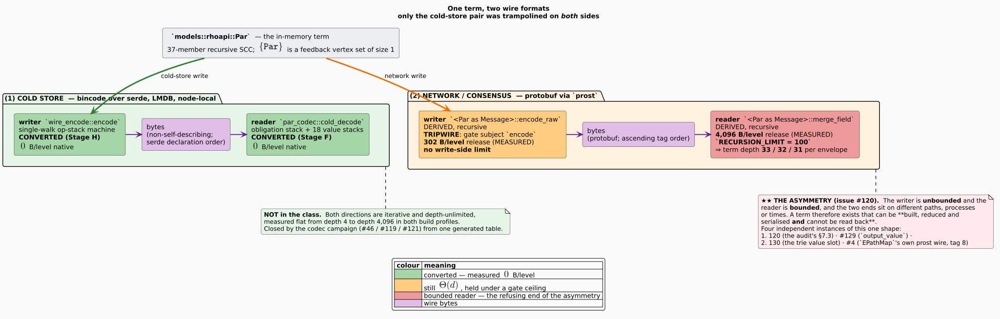
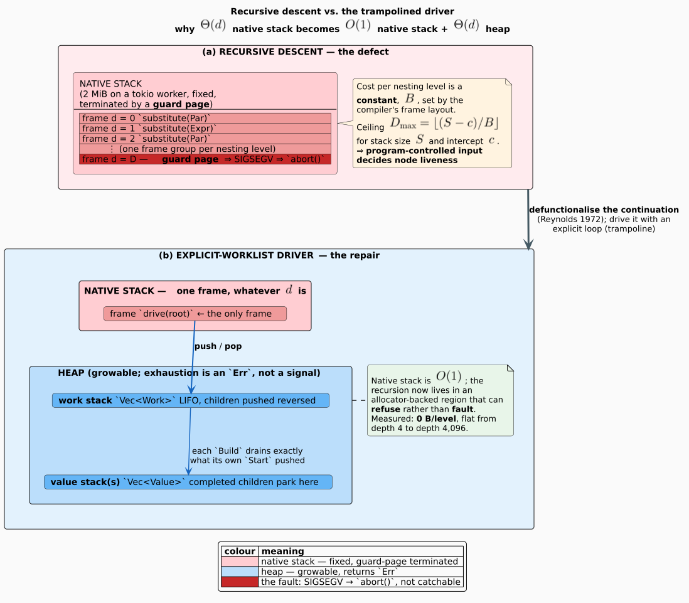
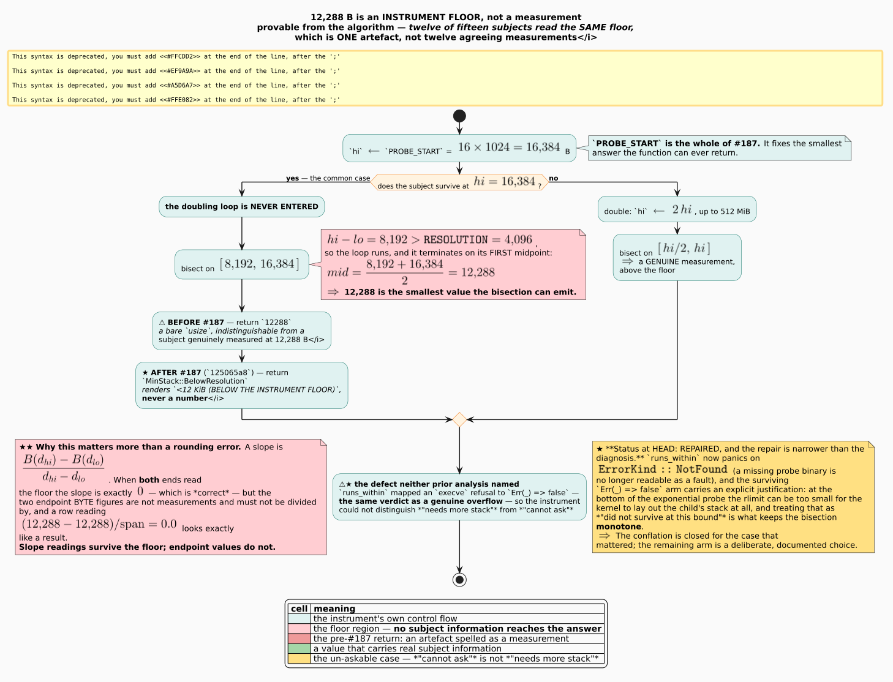
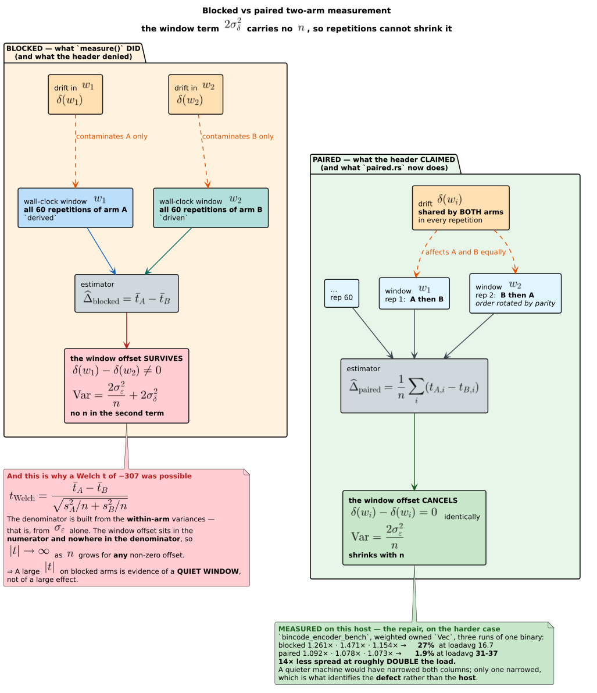
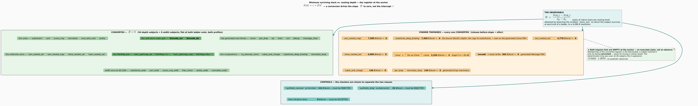
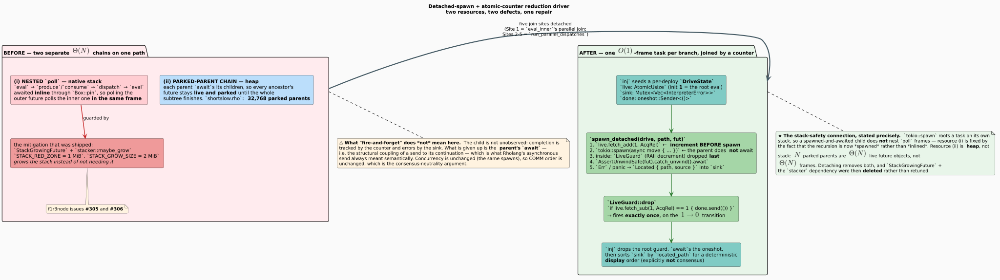
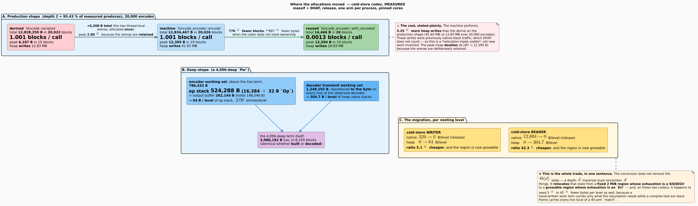
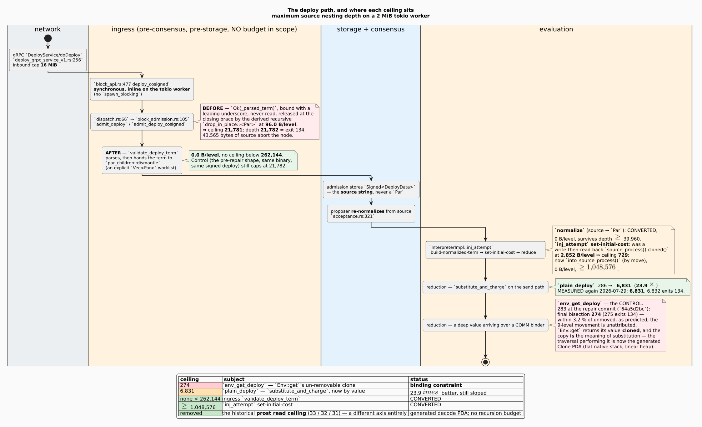
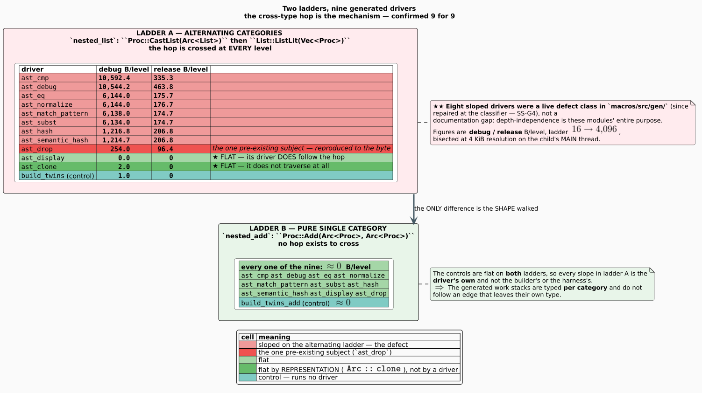
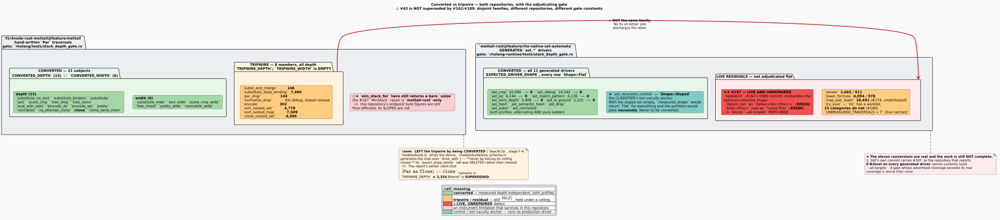

# Stack Safety in the F1r3node Rholang Interpreter

### A design and results report on the elimination of depth-proportional native-stack consumption over the `Par` term family

**Repository** `f1r3node-rust-mettail`, branch `feature/mettail`
**Companion repository** `mettail-rust`, branch `feature/rho-native-set-automata` (§5.6)
**Report date** 2026-07-29, revised through 2026-08-06
**Measurement anchor** `f1r3node-rust-mettail@e67a6aaa` · `mettail-rust@b0aa4e09` (original measurement tree `8853f839`)
**Living closure head** `f1r3node-rust-mettail@6f1412ee` (matcher stack, proof, equivalence, and heap closure)
**Companion decision head** `mettail-rust@2e3ae94d` (recursive-carrier lifecycle plus operational, guard, receive-traversal, and parallel-hash closure; §5.18)
**Companion report** — the PathMap/EPathMap representation, wire format, and performance results
live in the [PathMap report](../pathmap/pathmap-report-2026-08-03.md); the `SS-C5`…`SS-C11` and
`SS-Y6` register rows below point there.
**Audit ledgers superseded by nothing; this report *cites* them** —
`docs/design/audits/theta-depth-traversals-2026-07-26.md`,
`docs/design/audits/four-quadrant-s0-baseline-2026-07-28.md`,
`docs/design/audits/four-quadrant-s2-protobuf-encoder-2026-07-28.md`

**Verified living status.** The node gate contains **37 converted depth subjects + 8
converted width subjects and zero production tripwire subjects**. The strengthened hand-written
recursion census finds **585** recursive components, **50** term-family components across **29** files,
**20** mutual components, and zero `Unmeasured` dispositions; MeTTaIL's generated traversal table likewise
has no unmeasured traversal. A separate lifecycle gate at `mettail-rust@ce60f76f` scans **542**
production Rust files, derives **84** recursively owned types in **80** components, and reports zero
recursive derive or implicit-`Drop` exposures. That lifecycle result does **not** close the wider
function-call strongly connected component (SCC) census. `mettail-rust@e0086c93` subsequently closes
the operational `AnyAlgebra::{is_satisfiable,witness}` re-entry with one heap-frame decision
executor. `mettail-rust@338d8263` additionally closes the Rholang type-inference variable-use and
receive-collection SCCs; the remaining non-term-family census and lifecycle-census mutation
calibration remain live work (§5.18.6, §8.5). `mettail-rust@b76c5773` closes every production
recursion cluster in `rholang-runtime/src/rholang_ast.rs`; its one analyzer residual is a deliberate
`#[cfg(test)]` recursive oracle. `mettail-rust@2a972436`, `580896f3`, and `fec84ffb` close every
genuine production recursion cluster in `rholang-runtime/src/guard_par_substrate.rs`: formula
construction, opaque-atom substitution, operand normalization, and bound-value substitution.
`mettail-rust@44f899b8` applies the corresponding ordered formula and operand machines to the
surface `Proc` guard encoder in `languages/src/rholang/guard_substrate.rs`.
`mettail-rust@5cd89526` closes the direct name, quote, three-valued guard-disposition, and parallel-
flattening traversals in `languages/src/rholang/receive.rs`; `mettail-rust@0aaac1c0` closes the
heterogeneous collection-pattern matcher in the same file. Fresh file-scoped analysis reports zero
production direct or mutual recursion there. `mettail-rust@2e3ae94d` then makes `HashBag` hashing a
constant-time read of incrementally maintained, byte-identical lanes, retains owned parallel bags
across binary folds, and carries multiplicity in the flattening worklist rather than expanding it into
repeated jobs. The surface `runtime.rs` send-sugar canonicalizer family remains live. No
production path uses `contains_par`,
`RUST_MIN_STACK`, `stacker`, or a
traversal-depth ceiling. Resident-set-size (RSS)-capped verification (`MemoryMax=4G`, `MemorySwapMax=0`, one Cargo job): the focused
EPathMap/codec/formal-manifest matrix passed **84/84**; the recursion census and retired-mechanism
registry passed **7/7**; the complete stack gate passed **8/8 active** with **4 ignored = 3
measurement-only probes + 1 forked-child driver** (**DERIVED** from the four `#[ignore]` attributes
in `rholang/tests/stack_depth_gate.rs`); Rocq, Z3, and TLC passed, with TLC exploring 2,816 distinct
states to depth 8.

---

## Evidentiary convention

Every factual claim in this report carries one of two tags.

| tag | meaning |
|---|---|
| **DERIVED** | read from source, from a build artefact, or from a commit body. The provenance is named inline (`file:line`, commit hash, or `crate-version/path`). |
| **MEASURED** | observed by executing something. Either **(q)** *quoted* from a recorded measurement, with the commit or document that recorded it named, or **(f)** *freshly measured for this report* on 2026-07-29, with the teed log named. |

A claim with no tag is a definition or an argument, not a fact about the system.
Where a number could **not** be obtained it is written **NOT MEASURED**, with the reason. There are seven such entries; they are collected in §5.9 and §7.

---

## 0. THE FIX REGISTER — the scannable index

★ **This is a living document.** It is maintained on the same standing obligation as the consensus register: when a stack-safety fix lands, it is added here. The register below is the index a reader scans without opening a single body; the identifiers are **stable and never reused**, so a fix may be cited as *"SS-C1"* from a commit message, an issue, or another document and the citation will still resolve after the document is reorganised.

**Adding a fix is filling in a form, not inventing a shape.** The blank form is [Appendix F](#appendix-f--the-per-fix-template-fill-this-in-do-not-invent-a-shape); the mechanism that is supposed to notice when this register goes stale is [Appendix G](#appendix-g--the-maintenance-contract).

**Conventions.** $`B_0 \rightarrow B_1`$ is bytes of native stack per nesting level before and after, release profile unless the row says otherwise. **0** means *measured flat at both ends of a 4 $`\rightarrow`$ 4,096 ladder in both profiles*. "—" means the axis does not apply; **⌀** means **no measurement exists** (every ⌀ is itemised in [§5.9](#59-measurements-that-could-not-be-obtained)).

Abbreviations used throughout are CBR (consensus behavior register), EPM1 (EPathMap version 1), PDA (pushdown automaton), SMT (satisfiability modulo theories), TLA (Temporal Logic of Actions), LRU (least-recently-used), SHA (Secure Hash Algorithm), RHOLANG (reflective higher-order language), MSO (monadic second-order logic), KAT (Kleene algebra with tests), LTL (linear temporal logic), Ir (instruction references), Dr (data reads), Dw (data writes), and TSV (tab-separated values).

★★ **`SS-Y…` is a family added by this revision, and it exists because the register had no way to spell the thing it most needed to say.** The prior families — `SS-A…` core traversals, `SS-B…` evaluator/async, `SS-C…` codecs, `SS-D…` deploy path, `SS-E…` instrument, `SS-F…`/`SS-G…` `mettail-rust`, `SS-X…` rejected — could record a *fix*, a *partial* fix, or a *rejected candidate*, but **not a live unrepaired defect introduced by a fix in this very register**. A register that can only hold good news is a register that reports coverage it does not have. **`SS-Y…` rows are allocated while defects are open**, they are never "class change: yes", and a row is discharged only by a commit that repairs it — never by deletion. Repaired rows remain in the register with their repair SHA and status, preserving the defect history. The allocation rule is added to [Appendix F](#appendix-f--the-per-fix-template-fill-this-in-do-not-invent-a-shape) with the others.

| ID | commit | repo | traversal | $`B_0 \rightarrow B_1`$ | class change? | § |
|---|---|---|---|---|:---:|---|
| **SS-A1** | `f0894109` | f1r3node | substitution SCC (strongly connected component), leg-1 de-clone | 36,416 $`\rightarrow`$ 27,179 | **no** ($`-`$ 25.4 % only) | [5.1](#51-family-a--the-substitution-sorting-normalisation-and-evaluation-cores) |
| **SS-A2** | `f11ffb54` | f1r3node | substitution SCC $`\rightarrow`$ explicit worklist | 195,728 $`\rightarrow`$ **0** *(debug)* | **yes** | [5.1](#51-family-a--the-substitution-sorting-normalisation-and-evaluation-cores) |
| **SS-A3** | `6ce7c5b9` | f1r3node | score tree: comparator, sibling walk, `Clone`, `Drop`, `PartialEq` | 1,329 / 201 / 1,578 / 370 / 719 $`\rightarrow`$ **0** | **yes** | [5.1](#51-family-a--the-substitution-sorting-normalisation-and-evaluation-cores) |
| **SS-A4** | `6ce7c5b9` | f1r3node | `ParSortMatcher` — `sort`, `sort_wide` | 78,592 $`\rightarrow`$ **0** *(debug)* | **yes** | [5.1](#51-family-a--the-substitution-sorting-normalisation-and-evaluation-cores) |
| **SS-A5** | `a3fd6fe4` | f1r3node | `rho-pure-eval`'s `eval_with` SCC | 3,359 $`\rightarrow`$ **0** | **yes** | [5.1](#51-family-a--the-substitution-sorting-normalisation-and-evaluation-cores) |
| **SS-A6** | `6675fc06` | f1r3node | `PrettyPrinter` pushdown driver | ⌀ $`\rightarrow`$ **0** | **yes** | [5.1](#51-family-a--the-substitution-sorting-normalisation-and-evaluation-cores) |
| **SS-A7** | Stage G | f1r3node | `normalize_ann_proc`'s 26-fn SCC $`\rightarrow`$ `norm_drive` | 7,261 $`\rightarrow`$ **0** | **yes** | [5.1](#51-family-a--the-substitution-sorting-normalisation-and-evaluation-cores) |
| **SS-A8** | `26876b65` | f1r3node | generated recursive `Par` family surfaces: `Clone`, `Drop`, `PartialEq`, `Hash`, `Ord`, `Debug`, protobuf `Message` encode/length/merge/clear, and `Oneof` encode/length/merge | recursive derive/host calls $`\rightarrow`$ **generated explicit PDAs** | **yes** | [5.12](#512-generated-par-pda-closure-ss-a8-ss-e2) |
| **SS-A9** | `e2cf939f`, `26d3e3b9` | f1r3node | node JSON boundary: `Par`/`Expr`/`Bundle`/`EPathMap` $`\rightarrow`$ `RhoExpr`, plus `RhoExpr` `Clone`, `Drop`, `Serialize`, and `Debug` | recursive calls/derives $`\rightarrow`$ explicit PDAs; depth 16,384 on a 256 KiB stack | **yes** | [5.13](#513-the-node-json-boundary-ss-a9) |
| **SS-A10** | `78611b11`, `6799b406`, `fc497f94`, `98bb3d5e`, `acfd194f`, `714d618c`, `6f1412ee` | f1r3node | heterogeneous spatial-matcher SCC, including concrete binders, connective rollback, subset retry, `PathMap<()>` and `PathMap<Par>` | ~70,237 B/level debug on the recursive binding path $`\rightarrow`$ **0**; depth 4,096 and width 65,536; retained matcher RSS slope also eliminated | **yes** | [5.16](#516-spatial-matcher-and-pathmap-native-retry-pda-ss-a10) |
| **SS-B1** | `a929a2d6` | f1r3node | expression-evaluator SCC $`\rightarrow`$ `eval_drive` | overflow $`\approx`$ 1.5k $`\rightarrow`$ OK at 50,000 | **yes** | [5.2.1](#521-the-expression-evaluator-trampoline-a929a2d6) |
| **SS-B2** | `29856679`, `55b97f84`, `a0a50473` | f1r3node | five async join sites detached | 300 s $`\rightarrow`$ **93.7 s CPU** | **yes** (heap chain) | [5.2.2](#522--the-tokio-fire-and-forget-driver--establishing-the-mechanism-not-assuming-it) |
| **SS-B3** | `9843e4b6` | f1r3node | `StackGrowingFuture` + `stacker` **deleted** | — | dependency removed | [5.2.2](#522--the-tokio-fire-and-forget-driver--establishing-the-mechanism-not-assuming-it) |
| **SS-C1** | `9a5521a2` | f1r3node | cold-store **decoder** (`bincode_decoder`) | 12,894 $`\rightarrow`$ **0** | **yes** | [5.3.3](#533-the-cold-store-decoder--an-obligation-stack-with-eighteen-value-stacks-9a5521a2) |
| **SS-C2** | `c28f4cf6`, `a169cc61` | f1r3node | cold-store **encoder** (`bincode_encoder`) | ~224 $`\rightarrow`$ **0** | **yes** | [5.3.2](#532-the-cold-store-encoder--a-single-walk-trampolined-serializer-c28f4cf6-a169cc61) |
| **SS-C3** | `7c74260d` | f1r3node | schema-code generator (one walk, four outputs) | — | enabling | [5.3.2](#532-the-cold-store-encoder--a-single-walk-trampolined-serializer-c28f4cf6-a169cc61) |
| **SS-C4** | `56fb1fd0` | f1r3node | prost encoder: $`\Theta(d^2) \rightarrow \Theta(n)`$ **work** | 302 $`\rightarrow`$ 302 | ⚠ **no** — and **dormant** | [5.3.5](#535-the-prost-network-encoder-56fb1fd0--converted-in-work-not-in-stack-and-dormant) |
| **SS-C5** | `1b576c90` | f1r3node | prost `EPathMap`: the tag-1 **entry walk is DELETED**, not converted — every map emits the trie's own byte array `U(m)` at field 8 | — (traversal removed) | **yes** — by deletion | [PathMap §5.2](../pathmap/pathmap-report-2026-08-03.md#52-the-wire-lineage-and-the-epm1-format) |
| **SS-C6** | `698406a3` | f1r3node | `U(m)` becomes a memo on the trie; the warm encode is one `memcpy` | $`\Theta(\text{entries}) \rightarrow`$ **0** *(amortised)* | — (work, not stack) | [PathMap §5.2](../pathmap/pathmap-report-2026-08-03.md#52-the-wire-lineage-and-the-epm1-format) |
| **SS-C7** | `3a32cf07` | f1r3node | bincode `EPathMap`: the same byte array, **FORM ②** — $`U(m)`$ verbatim and contiguous, then the values, so the reader never calls `decode_trie_path` | — (reader unchanged, ceiling **not** inherited) | superseded by SS-C9 | [PathMap §5.2](../pathmap/pathmap-report-2026-08-03.md#52-the-wire-lineage-and-the-epm1-format) |
| **SS-C8** | `8cf0b770` | f1r3node | …applied to the entries that surface **WRITES**. FORM ② keyed lf-blanked values by the *unblanked* entries; the blanked trie is memoized, so the warm encode is still one `memcpy` | — (reader unchanged; blanking runs on the **trampolined** codecs, so it is bounded too) | ★ **CBR-043** | [PathMap §5.2–§5.3](../pathmap/pathmap-report-2026-08-03.md#53-negative-results) |
| **SS-C9** | `26876b65` | f1r3node | `EPathMapRepr = Empty | Set(PathMap<()>) | Map(PathMap<Par>)`; EPM1 carries PathMap's compact ACTree03 topology and a generated-PDA value table directly on protobuf and bincode | depth 4,096 succeeds on a 256 KiB stack; no entry projection | **yes** | [PathMap §5.1–§5.5](../pathmap/pathmap-report-2026-08-03.md#51-the-homogeneous-representation) |
| **SS-C10** | `7b25df5a` | f1r3node | expression-evaluator PDA: forward `Vec<&Par>` projection $`\rightarrow`$ direct reverse PathMap visitor | projected pointer payload $`n \operatorname{sizeof}(\&\mathrm{Par})`$ (set) / $`2n \operatorname{sizeof}(\&\mathrm{Par})`$ (map) $`\rightarrow 0`$; traversal remains $`\Theta(n)`$ | stack safety inherited from SS-B1; heap refinement | [PathMap §5.7](../pathmap/pathmap-report-2026-08-03.md#57-reverse-zipper-totality) |
| **SS-C11** | `b30a1568`; mettail harness `bb98055b`, `9dccb346` | cross-repository | reducer-identity EPathMaps retain their native root; shared clone-family teardown releases one root without PathMap copy-on-write; E-6a binds the index once per phase | 4,119,482 $`\rightarrow`$ 278,527 allocation events; treatment 18.730 ms vs 32.281 ms control; PathMap clone/drop ladders remain **0 B/level** | measured-neutral optimization; no new traversal or PathMap change | [5.17](#517-epathmap-evaluator-and-clone-family-teardown-integration-ss-c11) |
| **SS-D1** | `d2591fa1` | f1r3node | task-spawn boundary per-branch deep clone | 2,867 $`\rightarrow`$ **0** *(this site)* | **yes** | [5.5.3](#553-the-three-repairs) |
| **SS-D2** | `94dc983f` | f1r3node | ownership to the substitution; **15** deep copies | incl. $`O(n^2)`$ $`\rightarrow`$ $`O(n)`$ | **yes** | [5.5.3](#553-the-three-repairs) |
| **SS-D3** | `9082d12c` | f1r3node | `inj_attempt` read-back clone $`\rightarrow`$ by-move | 2,852 $`\rightarrow`$ **0** | **yes** | [5.5.3](#553-the-three-repairs) |
| **SS-D4** | `a09f1de2`, `3b265eb7` | f1r3node | gRPC ingress teardown | 96.0 $`\rightarrow`$ **0** | **yes** | [5.5.3](#553-the-three-repairs) |
| **SS-D5** | `64a5d2bc` | f1r3node | metered wrappers take term by value | 2,852 $`\rightarrow`$ **146** | **no** — `encoded_len` remains | [5.5.4](#554-results-and-a-control-that-behaved-exactly-as-predicted) |
| **SS-F1** | `3c0c3585` | mettail | 87-member lowering component $`\rightarrow`$ one worklist | 2,157 $`\rightarrow`$ **1** | **yes** | [5.6.1](#561-the-lowering-component-3c0c3585) |
| **SS-G1** | `9c55d81d`, `651499e2` | mettail | ★★ AST (abstract syntax tree) children `Box` $`\rightarrow`$ `Arc`; `Clone` becomes a refcount bump | 30 GB $`\rightarrow`$ **112 MB**; **0 B/level**; **0 bytes allocated** | **yes**, by *representation* | [5.11](#511--ss-g1--the-arc-fix-eliminating-a-traversal-instead-of-converting-it) |
| **SS-G3** | `ecbe352c`, `f8f71f4c` | mettail | the eight UNMEASURED generated drivers get subjects | ⌀ $`\rightarrow`$ **measured: 8 of 9 SLOPED** | ⚠ **defect found** | [5.10.10](#51010--the-nine-generated-drivers-measured--the-2--2-that-identified-the-mechanism) |
| **SS-G2** | generator | mettail | nine generated `*_iterative` drivers (`Hash`, `Ord`, `Drop`, `Debug`, `Display`, …) | **flat on a pure chain; 1,215–10,592 debug on an alternating one** | ⚠ **only within one category** — ★ **now HISTORICAL, see SS-G4** | [5.10.10](#51010--the-nine-generated-drivers-measured--the-2--2-that-identified-the-mechanism) |
| **SS-G4** | `fab6de24`, `6e4abbd8`, `a21b0bf9`, `dc104aa3`, `4ee48db9` (#162); `844364d2` (#189) | mettail | ★★ **ALL ELEVEN generated `ast_*` drivers** — the `CollectionLiteral` arm divergence repaired at the classifier | `ast_cmp` 10,590 · `ast_debug` 10,542 · `ast_eq` 6,144 · `ast_match_pattern` 6,136 · `ast_term_depth` 3,408 · `ast_is_ground` 2,225 $`\rightarrow`$ **0, every one, both profiles** | **yes** — SS-Y1 is retained below as a repaired defect | [8.6.1](#861--162189--the-eleven-generated-drivers-converted-and-the-root-cause-that-unifies-154-with-162) |
| **SS-Y1** | introduced `fab6de24`; repaired `6248f156` | mettail | The optional-collection generator defect inside SS-G4: `Option::len` on `Option<Vec<Proc>>` (**E0624**) and `&Vec<Proc>` cast as `*const Proc` (**E0606**) | — | ★ **repaired**; the generated carrier is classified once and `--all-targets` is no longer blocked | [8.6.1a](#86-the-issue-keyed-residuals-at-their-final-dispositions) |
| **SS-G5** | `ed44c429` | mettail | ★ **the TWELFTH generated driver, `try_eval`** — `CrossKind::OptionalSameCat` replaces a same-category optional child's host recursion with a presence flag; a `compile_error!` refuses the capture-rule shape that would reintroduce it | `ast_try_eval` / `ast_try_eval_cast` **0**, both profiles | **yes** | [5.6.5](#565--the-twelfth-generated-driver-and-the-seven-numerals-beside-it-ed44c429) |
| **SS-G7** | `b0aa4e09` | mettail | native-evaluator category cycles $`\rightarrow`$ one heterogeneous `Visit`/Reduce PDA per dependency SCC; capture terms and auto projections use the same classifier, and the recursive fallback is deleted | host recursion $`\Theta(d) \rightarrow O(1)`$ native stack; **20,000** alternating edges on a **256 KiB** thread stack | **yes** | [5.6.11](#5611-ss-g7--native-evaluator-cycles-become-one-pda-per-dependency-scc-b0aa4e09) |
| **SS-G8** | campaign set bookended by `c03e9e04` and `ce60f76f`; zero-state gate `ce60f76f` | mettail | recursively owned production carriers and the final PraTTaIL logic families: lifecycle traits, folds, analysis, Boolean evaluation, compilation, and second-order subset traversal | host recursion $`\Theta(d) \rightarrow O(1)`$ native stack for the named operations; **20,000** levels on **256 KiB**; **84 types / 80 components / 542 files / zero lifecycle exposures** | **yes** for the named operations; wider call-SCC closure remains open | [5.18](#518-recursive-carrier-lifecycle-and-weighted-logic-closure-ss-g8) |
| **SS-G9** | `mettail-rust@8b4644e8`, `e3f2812f`, `e0086c93` | mettail | one cross-combinator `AnyAlgebra` continuation family for evaluation, satisfiability, and witness construction; exact KAT partial-derivative subset decision; arbitrary-width Boolean witness search | **20,000** alternating wrappers / KAT nodes on **256 KiB**; final `AnyAlgebra` decision gate **0.25 s / 46,168 KiB**; old KAT budget false-positive deleted; pipeline case **0.12 s / 59.8 MiB** | **yes for the named decision SCC**; wider call-SCC census remains open | [5.18.8](#5188-post-census-operational-decision-closure-ss-g9) |
| **SS-G10** | `mettail-rust@338d8263` | mettail | Rholang type inference: mutually recursive `Proc` / `Name` / `InputBind` / `ForRow` variable-use predicates and receive-variable collection | host recursion $`\Theta(d) \rightarrow O(1)`$ native stack; **20,000** continuation levels on **256 KiB**; direct gate **0.05 s / 36,428 KiB** | **yes for the named inference SCCs**; wider call-SCC census remains open | [5.18.9](#5189-rholang-type-inference-closure-ss-g10) |
| **SS-G11** | `mettail-rust@b76c5773` | mettail | Rholang AST analysis and rewrite: `Proc`/`Name` machine-effect classification, innermost fold discovery, and fold replacement/rebuild | host recursion $`\Theta(d) \rightarrow O(1)`$ native stack; **20,000** levels on **256 KiB**; direct gate **0.42 s / 59,172 KiB** | **yes for every production SCC in `rholang_ast.rs`**; wider call-SCC census remains open | [5.18.10](#51810-rholang-ast-analysis-and-fold-rewrite-closure-ss-g11) |
| **SS-G12** | `mettail-rust@2a972436` | mettail | lowered guard formulas: `Par`/`Expr` connective encoding and opaque-atom formula substitution | host recursion $`\Theta(d) \rightarrow O(1)`$ native stack; **20,000** levels on **256 KiB**; direct gate **0.27 s / 77,100 KiB** | **yes for the named formula SCCs**; historical operand and bound-value residuals close in SS-G13/SS-G14 | [5.18.11](#51811-lowered-guard-formula-closure-ss-g12) |
| **SS-G13** | `mettail-rust@580896f3` | mettail | lowered guard operands: optional-`Par` dispatch, integer-form normalization, arithmetic, multiplication, division, and remainder | host recursion $`\Theta(d) \rightarrow O(1)`$ native stack; **20,000** levels on **256 KiB**; direct gate **0.15 s / 113,112 KiB** | **yes for the operand SCC**; ordered variable interning and failure classes preserved | [5.18.12](#51812-lowered-guard-operand-closure-ss-g13) |
| **SS-G14** | `mettail-rust@fec84ffb` | mettail | bound-`Par` substitution through evaluator-owned guard positions | host recursion $`\Theta(d) \rightarrow O(1)`$ native stack; **20,000** levels on **256 KiB**; direct gate **0.20 s / 131,632 KiB** | **yes**; every genuine production SCC in `guard_par_substrate.rs` is closed | [5.18.13](#51813-lowered-guard-bound-substitution-closure-ss-g14) |
| **SS-G15** | `mettail-rust@44f899b8` | mettail | surface `Proc` guard formulas and operands: connectives, ordered variable/opaque allocation, arithmetic, multiplication, division, and remainder | host recursion $`\Theta(d) \rightarrow O(1)`$ native stack; **20,000** levels on **256 KiB**; direct gate **0.03 s / 29,560 KiB** | **yes**; zero genuine production recursion in surface `guard_substrate.rs` | [5.18.14](#51814-surface-rholang-guard-closure-ss-g15) |
| **SS-G16** | `mettail-rust@5cd89526` | mettail | direct surface receive traversals: parenthesized-name conversion, quote normalization, three-valued guard disposition, and nested parallel flattening | host recursion $`\Theta(d) \rightarrow O(1)`$ native stack; **20,000** levels on **256 KiB**; direct gate **0.05 s / 30,960 KiB** | **yes for the named direct traversals**; collection-pattern matcher remains live | [5.18.15](#51815-direct-surface-receive-traversal-closure-ss-g16) |
| **SS-G17** | `mettail-rust@0aaac1c0` | mettail | receive collection patterns: lists, ordinary maps, surface path-map set/map modes, read/write zippers, greedy sets, and backtracking bags | host recursion $`\Theta(d) \rightarrow O(1)`$ native stack; **20,000** list/map/path-map levels and **4,096** bag elements on **256 KiB**; direct gate **0.25 s / 51,216 KiB** | **yes**; zero production recursion in `receive.rs` | [5.18.16](#51816-receive-collection-pattern-closure-ss-g17) |
| **SS-G18** | `mettail-rust@2e3ae94d` | mettail | `HashBag` structural hash summaries, owned `PPar` merge, and multiplicity-compressed parallel flattening | completed-bag hash $`\Theta(n) \rightarrow \Theta(1)`$; left-fold merge $`\Theta(n^2) \rightarrow \Theta(n)`$ expected; **20,000** merges on **256 KiB** in **0.11 s / 39,096 KiB** | **yes** for the former merge recursion; hash stream and multiset unchanged | [5.18.17](#51817-parallel-hash-and-multiplicity-closure-ss-g18) |
| **SS-G6** | `3276c1ee`; closed by `26876b65` | cross-repository | **#174's hash-keyed collection cost, ATTRIBUTED then converted** — `par_hash` / `par_hashmap` isolated `models`' `impl Hash for Par`; the schema-generated trait PDA removed the mechanism | 625 / 113 recorded historically with ceilings $`\rightarrow`$ **0**; the two ceilings are deleted | **yes**, by SS-Y2; the mettail integration gate now requires zero slope too | [5.6.6](#566--174-attributed-to-models-impl-hash-for-par-3276c1ee) |
| **SS-Y2** | named `3276c1ee`; repaired `26876b65` | f1r3node | The hand-written host-recursive `impl Hash for Par` / `impl PartialEq for Par` defect named by SS-G6 on a consensus-adjacent canonical-sort path | 625 debug / 113 release B/level $`\rightarrow`$ **0** | ★ **repaired** by schema-generated Eq/Hash PDAs and independent PathMap set/map hash gates | [5.6.6](#566--174-attributed-to-models-impl-hash-for-par-3276c1ee) |
| **SS-E1** | `5a744c66`, `ad468163`, `08e876fd`, `6a264e05` | f1r3node | ★ **Phase 3b's PREREQUISITE instrument** — the identical-total-order argument, the sorter golden's first depth-$`\geq 2`$ rows, and the re-entry ladder probe. ⚠ **No traversal was converted**, so this is deliberately not a class change | ⌀ — an instrument, not a traversal | **no** — by construction | [5.6.7](#567-ss-e1--3bs-prerequisite-instrument-and-the-two-checks-that-were-blind) |
| **SS-E2** | `26876b65`, `87e514b6` | f1r3node | generated traversal registry $`\leftrightarrow`$ proof/oracle manifest; Rocq generic PDA equivalence, EPathMap algebra, and structural EPM1 framing/value-table laws; SMT mode dispatch; TLA+ transition model | 30 depth + 6 width production subjects, **zero tripwire subjects** | enabling and closure evidence | [5.12](#512-generated-par-pda-closure-ss-a8-ss-e2) |
| **SS-E3** | `b2d84064`, `68e8290d` | f1r3node | Phase 7 resource closure: independent PathMap set/map hash and `Message::clear` ladders; derived-register Cachegrind axis; matched-control Massif axis | **40** converted subjects, all subquadratic; four stack-to-heap transfers measured linear | enabling and closure evidence | [5.14](#514-resource-closure--heap-and-deterministic-time-ss-e3); PathMap slice: [PathMap §5.6](../pathmap/pathmap-report-2026-08-03.md#56-hash-and-clear-ladders) |
| **SS-E4** | `0e487d4a` | f1r3node | Phase 7 subject-specific entry-depth histograms; production-shaped reverse PathMap zipper totality repair | four non-vacuous populations; allocation-free reverse walk preserved without a PathMap fork | enabling, measurement, and corrective evidence | [5.15](#515-subject-depth-distributions-ss-e4); PathMap slice: [PathMap §5.7](../pathmap/pathmap-report-2026-08-03.md#57-reverse-zipper-totality) |
| **SS-Y3** | measured `6a264e05`; repaired `26876b65` | f1r3node | The three collection arms formerly re-scored each element three times per nesting level on the canonical-form path | $`\Theta(3^d)`$; $`3.016\times`$/level $`\rightarrow`$ generated sorter PDA, **Ir exponent 1.0068 set / 1.0023 map** | ★ **repaired**; stack flat and linear observed | [5.6.8](#568-ss-y3--the-collection-arms-re-score-every-element-three-times-per-level) |
| **SS-Y6** | `c0385b79` | f1r3node | ★★★ **DISSOLVED, not repaired** — the `TRIE_INTERN` LRU dropped a deep `Par` through the recursive destructor **inside a global mutex, on an arbitrary thread**. The store is deleted, so the site no longer exists | ⌀ — the fault has no site; the destructor itself was later converted by SS-A8 | **n/a** — discharged by deletion | [PathMap §5.8](../pathmap/pathmap-report-2026-08-03.md#58-the-dissolved-intern-store) |
| **SS-Y4** | *(pre-existing; PINNED by `6bdd6ad7`, REPAIRED by `HEAD`)* | f1r3node | ⛔★★★ **A live consensus SAFETY FORK** — sibling order is not a total function of the term. `combine_emap` chains only the **key's** score, so distinct canonical terms share a score tree; `sort_vec` is **stable**, so tied siblings keep their input order | seeded: **20/20** split over 40 processes · deterministic: `{3:30} \| {3:90}` $`\neq`$ `{3:90} \| {3:30}` | ★ **repaired** — sibling order is now TOTAL | [5.6.9](#569-ss-y4--sibling-order-is-not-a-total-function-of-the-term) |

⚠ **`SS-E1` and `SS-Y3` are a second instance of [Appendix F](#appendix-f--the-per-fix-template-fill-this-in-do-not-invent-a-shape)'s rule 4, in the same *revealed-by* form as `SS-G6`/`SS-Y2`**: `SS-E1`'s commits did not create the defect; they **measured** one that was already live and unquantified. `26876b65` discharged SS-Y3 by repair, and the row remains so the defect and its evidence cannot disappear.

⚠ **`SS-G6` and `SS-Y2` are the mandatory pair required by [Appendix F](#appendix-f--the-per-fix-template-fill-this-in-do-not-invent-a-shape)'s rule 4**, in its *revealed-by* rather than *introduced-by* form: `SS-G6`'s commit did not create the defect; it **named** one that was already live and unattributed. `26876b65` discharged SS-Y2 by generating the traversal PDAs; the row remains as the repair history.

★ **`SS-Y2` is the strongest available argument for the derived call-graph census**, and it arrived before the census was built. `DERIVE_DISPOSITIONS` closes over derive **tokens** and these impls are hand-written; `GENERATED_FILE_CENSUS` closes over generated **files** and these are not generated. Neither could ever have seen them — which is exactly the three-way split [§5.7.8](#578-the-read-ceiling-registry-and-a-fifth-site-it-can-detect) argues the third leg of. `models/build.rs`'s own fail-on-`None` message already carries the lesson in one line: *"a hand-picked list of four missed `Hash` entirely."*

**Rejected candidates** (kept in the register so they are not re-proposed): **SS-X1** `cf35ab53` — exhaustive `PartialEq`/`Hash`; not stack safety, see [§5.8](#58-the-rejected-candidate).

⚠★ **Read `SS-D3` and `SS-D5` correctly.** Both eliminate a **call to** `<Par as Clone>::clone`; **neither converts the impl**. The campaign's strategy at those two sites is **call-site elimination**, argued in [§5.10.5a](#5101-the-strategy-and-the-figures-it-retired). Two one-line task summaries read otherwise and are corrected in [§5.10.5](#5101-the-strategy-and-the-figures-it-retired).

**`<Par as Clone>::clone` was converted by stage F-4** (`0eac9c3a`): `models/build.rs` strips the
derive and `models/codegen/schema.rs` generates the impl over `drive_with`; its tripwire
ceiling was **deleted rather than relaxed** — the subject left the tripwire list by being converted.
**MEASURED (q)**, `0eac9c3a`, both profiles, ladder $`16 \rightarrow 128`$, subject and
derived-oracle control in the *same binary* (`clone_oracle` re-emits the deleted derive's body;
`clone` is the generated driver):

| profile | `clone_oracle` (the derive, re-emitted) | `clone` (the generated driver) |
|---|---:|---:|
| debug | 276 $`\rightarrow`$ 2,040 KiB = **16,128 B/level** | 48 $`\rightarrow`$ 48 KiB = **0** |
| release | 124 $`\rightarrow`$ 892 KiB = **7,021 B/level** | 12 $`\rightarrow`$ 12 KiB = **0** |

The oracle's 7,021 is a *semantic* reproduction of the derive (byte-identical on eight axes over 67
shapes), not a frame-layout one — free functions inline differently from one monolithic impl — so
neither 7,021 nor the historical 3,254 is a live figure; the live figure is **0** (§7 records the
oracle-artefact gap as a threat). At the anchor the tripwire lists are **empty**.

---

## Abstract

A `Par` — the term representation of the Rholang interpreter — is a mutually recursive family of 37 protobuf message types whose every cycle passes through `Par` itself (**MEASURED (q)**, `7c74260d`: 58 nodes, 95 edges, 22 strongly connected components, exactly one cyclic). Until 2026-07-26, essentially every traversal of that family was written as recursive descent, so each consumed native stack in proportion to the *nesting depth of an attacker-chosen term*. Because a native-stack overflow in Rust is a `SIGSEGV` on the guard page and not a catchable panic, program-controlled nesting depth controlled node liveness. The worst reachable instance measured **8.8 kB of source text aborting a node** through the term *destructor* alone (**MEASURED (q)**, `291bc217`), and a second, on unauthenticated pre-consensus gRPC ingress, at **43,565 bytes** (**MEASURED (q)**, `3b265eb7`).

The living register contains **45 converted production subjects — 37 on the depth axis and 8 on the
width axis — and zero production tripwire subjects**. Every converted subject is driven on the ordinary
execution architecture, without `RUST_MIN_STACK`, `stacker`, or a traversal-depth ceiling. The
strengthened hand-written recursion census (585 recursive components, 50 mentioning the term family,
20 mutual, 29 dispositioned files including `node/src`) carries **zero unmeasured dispositions**. The
40-subject Phase-7 deterministic-time cohort observes no quadratic subject: Ir exponents range from 0.9462
to 1.0970, and the largest data-counter exponent is 1.4007 Dw. **MEASURED**, §5.12–§5.15;
the five later matcher subjects have independent depth/width stack and elapsed-time evidence in §5.16.
**DERIVED** from the living `CONVERTED_DEPTH`, `CONVERTED_WIDTH`, `TRIPWIRE_DEPTH`, and
`TRIPWIRE_WIDTH` registers.

Headline results, all **MEASURED** (each row's before and after are the same subject on the same
instrument; the instrument per family is named in §4.4):

| what | before | after | factor |
|---|---:|---:|---:|
| substitution driver, `substitute_no_sort` (debug) | 195,728 B/level | **0** | class change |
| the normalizer, `normalize` (debug / release) | 43,542 / 7,261 B/level | **0 / 0** | class change |
| cold-store **decoder** (debug / release) | 28,362 / 12,894 B/level | **0 / 0** | class change |
| cold-store **encoder** (release, in-binary control) | ~224 B/level | **0** | class change |
| `inj_attempt` metering handshake (release) | 2,852 B/level, $`D_{\max}=729`$ | **0**, $`D_{\max} \geq 1{,}048{,}576`$ | $`\geq 1438\times`$ |
| gRPC ingress teardown (release) | 96.0 B/level, $`D_{\max}=21{,}781`$ | **0**, no ceiling $`< 262{,}144`$ | $`\geq 12\times`$ |
| metered wrapper `subst_and_charge` (release) | 2,852 B/level | **0** B/level after generated `Clone` + `encoded_len`; intermediate 146 | class change |
| end-to-end `plain_deploy` on a 2 MiB worker | 286 levels | **6,831** levels | $`23.9\times`$ |
| end-to-end `env_get_deploy` — **the control** | 283 levels | **274** levels | **$`\approx 1\times`$, as predicted** |
| cold-store encode, production-weighted wall clock | 1.0 (derived encoder) | **faster**, bracketed $`1.07\times`$–$`1.19\times`$ (paired instrument floor 1.073×) | see §5.4.1 — sign confirmed by two instruments; magnitude a bracket, not an interval |
| cold-store encode, allocations (reused-buffer form) | 20,022 blocks / 20k calls | **26** blocks / 20k calls | $`770\times`$ fewer |
| node JSON `RhoExpr` boundary, mixed unary/map chain | recursive conversion/traits | depth **16,384** on a **256 KiB** test stack | class change |
| E-6a native `PathMap<Par>` integration, allocation events | 4,119,482 | **278,527** | **93.2 % fewer** |
| E-6a `swap_comb`, $`n=16`$ injection mean | 32.280954 ms control | **18.730472 ms treatment** | **41.98 % lower**; locked E-8b accepted |

The costs are reported with the same candour. The single-walk encoder performs **$`3.25\times`$ more
heap writes** than the derive it replaces and **doubles peak heap** on the production shape, because
it retains two thread-local arenas (**MEASURED (f)**, DHAT (dynamic heap analysis tool)). The
protobuf network encoder's memoized rewrite trades $`O(1)`$ space for $`\Theta(n)`$ space to buy
$`\Theta(d^2) \rightarrow \Theta(n)`$ work; SS-A8 activated the generated `prost::Message`
implementations that carry it. The stack-safe canonical-key classifier is **3.79× slower at depth
1**, the production-common case (PathMap report §5.5). On one sibling bench (`term_ops_bench`) the
converted encoder is **slower** (0.954×–0.962×, paired) — reported beside the win, not instead of it.

Three predictions were **falsified by measurement and are reported as results**: that `Env::get` was
the deploy path's bound (§5.5.1), that the ingress slope was 84.3 B/level (§5.5.2), and — in the
companion repository — that the Rholang parser was depth-independent (§5.6.3).

The PathMap/EPathMap half of the campaign — the homogeneous representation, the EPM1 wire format,
their benchmarks, and the intern-store deletion — is reported in the
[PathMap companion report](../pathmap/pathmap-report-2026-08-03.md); this report keeps their
register rows (SS-C5…SS-C11, SS-Y6) and the stack-safety consequences.

---

## Table of contents

- [Evidentiary convention](#evidentiary-convention)
- [0. THE FIX REGISTER — the scannable index](#0-the-fix-register--the-scannable-index)
- [Abstract](#abstract)
- [1. Introduction](#1-introduction)
  - [1.1 The problem is liveness, not performance](#11-the-problem-is-liveness-not-performance)
  - [1.2 What makes a fix a fix](#12-what-makes-a-fix-a-fix)
  - [1.3 Contributions](#13-contributions)
- [2. Background](#2-background)
  - [2.1 The term family](#21-the-term-family)
  - [2.2 The two wire formats](#22-the-two-wire-formats)
  - [2.3 The observable: `B/level`](#23-the-observable-blevel)
  - [2.4 Glossary — every term defined before first use](#24-glossary--every-term-defined-before-first-use)
- [3. Related work](#3-related-work)
- [4. Methods](#4-methods)
  - [4.1 Hardware](#41-hardware)
  - [4.2 Machine state at measurement time](#42-machine-state-at-measurement-time)
  - [4.3 Toolchain and build configuration](#43-toolchain-and-build-configuration)
  - [4.4 Instruments, and which produced which number](#44-instruments-and-which-produced-which-number)
  - [4.5 Procedure](#45-procedure)
  - [4.7 The bisection instrument, and its floor](#47-the-bisection-instrument-and-its-floor)
  - [4.8 The paired timing design](#48-the-paired-timing-design)
  - [4.6 Anti-vacuity discipline](#46-anti-vacuity-discipline)
- [5. Results](#5-results)
  - [5.1 Family A — the substitution, sorting, normalisation and evaluation cores](#51-family-a--the-substitution-sorting-normalisation-and-evaluation-cores)
  - [5.2 Family B — the expression evaluator and the `tokio` fire-and-forget driver](#52-family-b--the-expression-evaluator-and-the-tokio-fire-and-forget-driver)
  - [5.3 Family C — the codecs, and the malloc profile](#53-family-c--the-codecs-and-the-malloc-profile)
  - [5.4 Throughput and CPU profile of the codec conversion](#54-throughput-and-cpu-profile-of-the-codec-conversion)
  - [5.5 Family D — the deploy path](#55-family-d--the-deploy-path)
  - [5.6 Family F — fixes originating in `mettail-rust`](#56-family-f--fixes-originating-in-mettail-rust)
  - [5.7 Family E — the instrument, and what it caught in itself](#57-family-e--the-instrument-and-what-it-caught-in-itself)
  - [5.8 The rejected candidate](#58-the-rejected-candidate)
  - [5.9 Measurements that could not be obtained](#59-measurements-that-could-not-be-obtained)
  - [5.10 ★★ The generated trait implementations, and the `Clone` question](#510--the-generated-trait-implementations-and-the-clone-question)
  - [5.11 ★★ SS-G1 — the Arc fix: eliminating a traversal instead of converting it](#511--ss-g1--the-arc-fix-eliminating-a-traversal-instead-of-converting-it)
  - [5.12 Generated `Par` PDA closure [SS-A8, SS-E2]](#512-generated-par-pda-closure-ss-a8-ss-e2)
  - [5.13 The node JSON boundary [SS-A9]](#513-the-node-json-boundary-ss-a9)
  - [5.14 Resource closure — heap and deterministic time [SS-E3]](#514-resource-closure--heap-and-deterministic-time-ss-e3)
  - [5.15 Subject depth distributions [SS-E4]](#515-subject-depth-distributions-ss-e4)
  - [5.16 Spatial matcher and PathMap-native retry PDA [SS-A10]](#516-spatial-matcher-and-pathmap-native-retry-pda-ss-a10)
  - [5.17 EPathMap evaluator and clone-family teardown integration [SS-C11]](#517-epathmap-evaluator-and-clone-family-teardown-integration-ss-c11)
- [6. Discussion](#6-discussion)
  - [6.1 Why the explicit-worklist shape, and why it is *smaller* than what it replaces](#61-why-the-explicit-worklist-shape-and-why-it-is-smaller-than-what-it-replaces)
  - [6.2 Why the SCC is the unit of conversion](#62-why-the-scc-is-the-unit-of-conversion)
  - [6.3 Neutrality is the hard part, not the driver](#63-neutrality-is-the-hard-part-not-the-driver)
  - [6.4 ★ The write/read asymmetry — one section, because it is one class](#64--the-writeread-asymmetry--one-section-because-it-is-one-class)
  - [6.5 How the asymmetry was closed](#65-how-the-asymmetry-was-closed)
- [7. Threats to validity](#7-threats-to-validity)
  - [7.1 The observable is a proxy](#71-the-observable-is-a-proxy)
  - [7.2 Measurement environment](#72-measurement-environment)
  - [7.3 Workload representativeness](#73-workload-representativeness)
  - [7.4 Enumeration completeness](#74-enumeration-completeness)
  - [7.5 DERIVED-but-not-MEASURED claims](#75-derived-but-not-measured-claims)
  - [7.5a ⚠★ A measurement's provenance includes its BUILD OVERLAY — and this repo's overlay is deliberately untracked](#75a--a-measurements-provenance-includes-its-build-overlay--and-this-repos-overlay-is-deliberately-untracked)
  - [7.5b ★★ When a premise looks refuted, suspect the instrument ONCE before suspecting the claim](#75b--when-a-premise-looks-refuted-suspect-the-instrument-once-before-suspecting-the-claim)
  - [7.6 The instrument shares the codebase it measures](#76-the-instrument-shares-the-codebase-it-measures)
- [8. Residuals and future work](#8-residuals-and-future-work)
  - [8.1 The prost network format — the historical ceiling and its closure](#81-the-prost-network-format--the-historical-ceiling-and-its-closure)
  - [8.2 The derived `Drop` — the refuted direct route, and the route taken](#82-the-derived-drop--the-refuted-direct-route-and-the-route-taken)
  - [8.3 `<Par as Clone>::clone` — closed](#83-par-as-cloneclone--closed)
  - [8.4 The one heap measurement that remains unobtainable](#84-the-one-heap-measurement-that-remains-unobtainable)
  - [8.5 The `mettail-rust` measured-slope registry — zero measured slopes, wider SCC census still open](#85-the-mettail-rust-measured-slope-registry--zero-measured-slopes-wider-scc-census-still-open)
- [8.6 The issue-keyed residuals, at their final dispositions](#86-the-issue-keyed-residuals-at-their-final-dispositions)
  - [8.6.1 ★★ #162/#189 — the eleven generated drivers converted, and the root cause that unifies #154 with #162](#861--162189--the-eleven-generated-drivers-converted-and-the-root-cause-that-unifies-154-with-162)
  - [8.6.2 The group-skip trap — why the read cap had to outlive the reader](#862-the-group-skip-trap--why-the-read-cap-had-to-outlive-the-reader)
- [9. Conclusions](#9-conclusions)
- [References](#references)
- [Appendix A — reproduction commands](#appendix-a--reproduction-commands)
- [Appendix B — raw data locations](#appendix-b--raw-data-locations)
- [Appendix C — historical July inventory snapshot](#appendix-c--historical-july-inventory-snapshot)
  - [C.1 Historical code fixes](#c1-historical-code-fixes)
  - [C.2 Instrument commits](#c2-instrument-commits)
  - [C.3 Rejected](#c3-rejected)
- [Appendix E — documentation-guideline conformance](#appendix-e--documentation-guideline-conformance)
  - [E.1 The colour mapping, so it can be checked](#e1-the-colour-mapping-so-it-can-be-checked)
  - [E.2 The rendered assets — method](#e2-the-rendered-assets--method)
  - [E.3 The four editorially-judged guidelines](#e3-the-four-editorially-judged-guidelines)
  - [E.4 The per-slug audit at this revision](#e4-the-per-slug-audit-at-this-revision)
- [Appendix F — the per-fix template (fill this in; do not invent a shape)](#appendix-f--the-per-fix-template-fill-this-in-do-not-invent-a-shape)
- [Appendix G — the maintenance contract](#appendix-g--the-maintenance-contract)
- [Appendix H — external citation map](#appendix-h--external-citation-map)

---

## 1. Introduction

### 1.1 The problem is liveness, not performance

Rholang is a concurrent language in the reflective higher-order calculus tradition [[Meredith & Radestock 2005](#ref-meredith2005)], itself descended from the $`\pi`$-calculus [[Milner, Parrow & Walker 1992](#ref-milner1992)]. Its terms nest without bound: `[[[[0]]]]` is a legal list, and so is the same expression with a million brackets. A node accepts such terms from the network, normalises them, evaluates them, serialises them, and stores them.

Every one of those verbs was, until this campaign, implemented as **recursive descent** — a function that calls itself (or a mutually recursive partner) once per nesting level. In Rust, that consumes the **native call stack**: a fixed-size region, allocated at thread creation, terminated by a **guard page**. Running off the end raises `SIGSEGV`, which the Rust runtime converts to

```text
thread '<name>' has overflowed its stack
fatal runtime error: stack overflow, aborting
```

followed by `abort()`. Shell status **134** = `128 + SIGABRT`.

★ **This is not a panic.** `catch_unwind` cannot intercept it. An enclosing `Err(e) => …` arm cannot observe it. The whole **process** dies, not one worker task. So the question *"how deep may an incoming term be?"* is not a performance question; it is the question *"can an unauthenticated party stop this node?"*, and in a consensus system that is a liveness and availability property.

**MEASURED (q)** — `f0894109`: a **30-character** Rholang program with no guest language and no $`\lambda`$-calculus, `@"OUT"!([[[[[[[[[[0]]]]]]]]]])` at nesting depth 10, aborted the reducer on the 2 MiB stack a `tokio` worker gets.

### 1.2 What makes a fix a fix

A constant-factor improvement is not a fix. Reducing a traversal from 195,728 B/level to 27,179 B/level multiplies the maximum admissible depth by seven and leaves the class — and therefore the vulnerability — exactly where it was. The campaign therefore adopted a **binary criterion**, enforced mechanically:

> A traversal is **converted** when its minimum surviving native stack is *identical* at nesting depth 4 and at nesting depth 4,096, in **both** build profiles.

and a matching admission rule, stated at the definition of the register itself (**DERIVED**, `rholang/tests/stack_depth_gate.rs:725-728`):

> *"Membership is the deliverable; it only ever grows. A traversal enters only by being converted, never by having a ceiling raised."*

Everything not yet converted sits in a **tripwire** list under a per-profile ceiling that certifies only *"not worse"*. §5 reports both lists in full, because a document that lists conversions without listing the residual reads as far more finished than the code is.

### 1.3 Contributions

1. A **complete inventory** of the stack-safety work in this worktree — 20 code fixes, 18 instrument commits, 1 rejected candidate — each with its defect, its repair architecture, and the alternatives that architecture was chosen over (§5, Appendix C).
2. **Fresh measurements** of the whole gate, the S0 baseline, and the end-to-end deploy ceiling on the report tree (§5, Appendix A), which reproduce the recorded figures **exactly** in ten of twelve cases and disagree in two, both reported (§5.5.4, §5.5.5).
3. The **first heap profile** of the codec conversion — massif and DHAT — answering the question *where did the allocations move?* quantitatively (§5.3.4).
4. A first-class treatment of the **`tokio` fire-and-forget** family, including the establishment — rather than the assumption — of its relationship to stack safety (§5.2.2).
5. An account of the **write/read asymmetry** that the campaign kept re-discovering, and of why only one of the two wire formats was repaired (§6.4).

---

## 2. Background

### 2.1 The term family

`Par` is the Rholang process term. It is defined in `models/src/main/protobuf/RhoTypes.proto` and compiled by `prost` into `models`.

**DERIVED** (`7c74260d`, cross-checked at build time by `models/build.rs`, and re-verified for this report against `target/release/build/models-949e215e3c72bc99/out/rhoapi.rs`): the schema has **57** messages carrying `::prost::Message` and **5** carrying `::prost::Oneof`. The child relation over them has **58 nodes and 95 edges**, decomposing into **22 strongly connected components** by Tarjan's algorithm [[Tarjan 1972](#ref-tarjan1972)], of which **exactly one is cyclic**, with **37 members**.

★ **$`\{\mathtt{Par}\}`$ is a feedback vertex set of size one.** Removing `Par` and recomputing leaves nothing cyclic (**MEASURED (q)**, `7c74260d`, test `par_is_a_feedback_vertex_set_of_size_one`). This was *computed*, not assumed: the incoming analysis asserted "the cycle is $`\mathtt{Par} \rightarrow \mathtt{Expr} \rightarrow \mathtt{ExprInstance} \rightarrow \mathtt{Par}`$, so about three frames", and a 37-member component may contain sub-cycles avoiding any given vertex. It does not — but that is a theorem about this schema, not a general fact.

Two consequences follow and are used throughout:

* the longest chain of derived traversal that can run **before** reaching a `Par` is **3 edges**, attained uniquely by $`\mathtt{Expr} \rightarrow \mathtt{EMap} \rightarrow \mathtt{KeyValuePair} \rightarrow \mathtt{Par}`$ (**MEASURED (q)**, `7c74260d`) — so the per-level cost of any derived traversal is bounded by the schema, not by the input; and
* one iterative teardown of `Par` would bound the whole schema — which is why `impl Drop for Par` keeps being proposed, and why §8.2 records precisely what it would break.

### 2.2 The two wire formats

A `Par` is serialised **two different ways**, by two different codecs, for two different purposes. This is the single most load-bearing structural fact in the report.



**Figure 1** — *`figures/two-wire-formats.puml`*. One term, two wire formats. Only the cold-store pair was trampolined on both sides.

| | **cold store** | **network / consensus** |
|---|---|---|
| codec | `bincode` 1.3.3 over `serde` | protobuf via `prost` 0.13.5 |
| direction of travel | node-local, into LMDB (lightning memory-mapped database) | between nodes, and into blocks |
| writer | `bincode_encoder::encode` — **CONVERTED** | `<Par as Message>::encode_raw` — recursive |
| reader | `bincode_decoder::cold_decode` — **CONVERTED** | `<Par as Message>::merge_field` — recursive |
| writer depth limit | none | none |
| reader depth limit | none | **`RECURSION_LIMIT = 100`** |

**DERIVED**: `prost`'s `RECURSION_LIMIT` is `const RECURSION_LIMIT: u32 = 100;` at `prost-0.13.5/src/lib.rs:30`. It is **private and unconfigurable**. Because the `Par` cycle costs three message levels per Rholang nesting level, and an envelope of wrapper depth $`W`$ consumes $`W`$ of the budget, the admissible term depth is

```math
D_{\max}(W) \;=\; \left\lfloor \frac{100 - 1 - W}{3} \right\rfloor
```

which yields **three distinct ceilings — 33, 32 and 31** across the nine real envelopes the gate drives (**MEASURED (f)**, `/tmp/sd_gate_release.log`: `read ceiling: 9 envelopes, 3 distinct ceilings {31, 32, 33} (bare 33)`). The gate's test *fails if it ever yields fewer than three*, because it exists to refute the sentence "the ceiling is one number".

**DERIVED** (`9a5521a2`): `bincode` has no recursion limit — **1.3.3, 2.0.1 and `bincode-next` 3.1.1 alike** offer only a *byte* limit defaulting to `NoLimit`. That is why the cold-store reader was a $`\Theta(d)`$ traversal with **no ceiling other than the stack**, and why its failure mode was uniquely bad: `rspace_importer` writes cold-store bytes to LMDB *without deep-decoding them*, so a too-deep datum enters storage through a path that structurally cannot observe its depth, and then aborts the node **on every read-back, on every restart, on every peer that synced the same state**. Every other member of the family is a transient worker fault; this one is **permanent and replicated**.

### 2.3 The observable: `B/level`

Let $`S(d)`$ be the smallest thread stack, in bytes, on which a given traversal survives an input of nesting depth $`d`$. Empirically every traversal in this family is affine in $`d`$:

```math
S(d) \;=\; c \;+\; B \cdot d
```

where $`c`$ is a fixed **intercept** (the traversal's own set-up: parser tables, driver frame, the deepest non-recursive prelude) and $`B`$ is the **slope**, in *bytes of native stack per nesting level* — written **B/level** throughout. The estimator is a two-point difference over a ladder $`[d_{\mathrm{lo}}, d_{\mathrm{hi}}]`$:

```math
\hat{B} \;=\; \frac{S(d_{\mathrm{hi}}) - S(d_{\mathrm{lo}})}{d_{\mathrm{hi}} - d_{\mathrm{lo}}}
```

with each $`S`$ obtained by **bisecting the thread's `stack_size`** to a 4,096 B resolution, in a **forked child process** (an overflow aborts and cannot be caught, so an in-process probe would take every already-passing assertion down with it).

**Why this observable and not wall-clock or peak RSS (resident set size).** The quantity that decides liveness is $`D_{\max} = \lfloor (S_{\text{avail}} - c)/B \rfloor`$, and only $`B`$ distinguishes the complexity classes. A conversion must drive **$`B`$ to zero**; it is explicitly *not* required to reduce $`c`$, and in several cases it raises $`c`$ (§5.1.2). Asserting a *shape* — "the two ends are equal" — rather than a byte count also makes the criterion **profile-independent by construction**, which matters because the debug-to-release ratio in this family ranges from $`2.2\times`$ to $`12.1\times`$ and is *per traversal*, not uniform (**MEASURED (q)**, `f0894109`).

⚠ **Two symmetric hazards of this estimator**, both encountered and both recorded:

1. **A large intercept masks a small slope.** If both ladder ends sit inside $`c`$, the measured growth is zero and the traversal reads as converted when it is not. This produced a *retracted claim* about the Rholang parser (§5.6.3).
2. **A short ladder quantises to noise.** Release `par_drop` at ~144 B/level bisects to 12,288 B at *both* ends of a 16 $`\rightarrow`$ 128 ladder — inside the bisector's initial 16 KiB probe window — and reports 36 B/level, which is quantisation, not measurement. The S0 harness therefore **doubles its deep end until the growth exceeds $`8 \times`$ the resolution**, and fails loudly at the cap with a message that distinguishes *"the traversal is depth-independent"* from *"the ladder is too short"*, because those need opposite responses (**MEASURED (q)**, `44535d75`).



**Figure 2** — *`figures/recursive-vs-trampolined.puml`*. The central picture: why recursive descent grows the native stack and an explicit-worklist driver does not.

### 2.4 Glossary — every term defined before first use

| term | definition |
|---|---|
| **stack-safe** | a traversal whose native-stack consumption is $`O(1)`$ in the nesting depth of its input, i.e. $`B = 0`$. It may still be $`\Theta(d)`$ in *heap*; that is the point of the transformation, not a failure of it. |
| **B/level** | bytes of native stack consumed per additional nesting level; the slope $`B`$ of §2.3. |
| **guard page** | an unmapped page placed immediately past the end of a thread's stack by the operating system. Touching it raises `SIGSEGV`; Rust's handler prints `fatal runtime error: stack overflow` and calls `abort()`. Not a panic, not unwindable. |
| **trampoline** | a control structure in which a function, instead of calling its continuation, *returns* a description of the remaining work to a driver loop that performs it. The loop's single frame replaces the recursion's $`d`$ frames [[Ganz, Friedman & Wand 1999](#ref-ganz1999)]. |
| **explicit continuation** | the "rest of the computation", represented as a **first-class data value** on the heap rather than implicitly as the return address and live locals of a stack frame. |
| **defunctionalisation** | Reynolds's transformation replacing higher-order continuation *functions* with a first-order *data type* plus an `apply` function [[Reynolds 1972](#ref-reynolds1972); [Danvy & Nielsen 2001](#ref-danvy2001)]. The work-item enums in §5 are defunctionalised continuations. |
| **CEK** | *machine* — an abstract machine for the $`\lambda`$-calculus whose state is a triple of $`C`$ ontrol, $`E`$ nvironment and $`K`$ ontinuation, with the continuation an explicit stack of frames [[Felleisen & Friedman 1987](#ref-felleisen1987)]; the ancestor, via [[Ager et al. 2003](#ref-ager2003)], of every driver in §5. |
| **worklist / work stack** | the concrete `Vec` holding pending work items. LIFO gives depth-first order, matching what recursive descent did. |
| **value stack** | a companion `Vec` holding *completed* children, parked until their parent's combining step is reached. Only *bottom-up* (post-order) drivers need one. |
| **fire-and-forget** | of a spawned asynchronous task: the spawner does **not** hold or await its `JoinHandle`. Completion and errors are conveyed by some other channel — here an atomic counter and an error sink (§5.2.2). |
| **SCC** | strongly connected component of the call graph or of the type-child graph; the unit at which a conversion must be scoped, because converting a proper subset leaves the class intact. |
| **ASLR** | address-space layout randomization, the operating-system mechanism that varies process memory addresses between runs. It can shift a stack probe by a small fixed amount without producing growth with input depth. |
| **CLI** | command-line interface, here the user-facing executable path whose observation rendering must share the same stack-safe traversal as the library/runtime path. |
| **converted / tripwire** | the two registers in `rholang/tests/stack_depth_gate.rs`. *Converted* = measured $`B = 0`$ at both ladder ends in both profiles. *Tripwire* = measured $`B > 0`$, held under a ceiling. |
| **anti-vacuity** | a check that the *checker* can fail: a control the assertion must reject, run in-suite, so that a green result cannot be produced by a probe that measures nothing. |
| **$`D_{\max}`$** | the greatest nesting depth a traversal survives on a given stack: $`\lfloor (S_{\text{avail}} - c)/B \rfloor`$. |
| **slope** | the *estimated* $`B`$ of a traversal, obtained by differencing two bisected endpoint measurements rather than by reading a frame size: $`\widehat{B} = \dfrac{S(d_{hi}) - S(d_{lo})}{d_{hi} - d_{lo}}`$, where $`S(d)`$ is the minimum surviving stack at depth $`d`$. **A slope is a difference, so any constant common to both endpoints cancels** — which is exactly why a slope survives the *instrument floor* below while the endpoint values do not. Quantised to `RESOLUTION` (4,096 B). |
| **flat ladder** | a *ladder* is the ordered set of depths a subject is measured at (this report uses $`4 \rightarrow 4{,}096`$ on the depth axis and $`4 \rightarrow 65{,}536`$ on the width axis). The ladder is **flat** when $`S(d_{lo}) = S(d_{hi})`$ to bisection resolution, i.e. slope $`= 0`$ — the operational definition of *converted*. ⚠ Flatness is a claim about **two** measured rungs, not about the shape of the code between them. |
| **instrument floor** | the smallest value a measuring procedure can *emit*, independent of the subject. Here it is **12,288 B**, forced by `min_stack_for`'s `PROBE_START = 16 KiB` and `RESOLUTION = 4096` (derived in [§8.6.8](#47-the-bisection-instrument-and-its-floor)). A reading *at* the floor carries **no subject information** and must never be divided by. Distinct from a *measurement* of 12,288 B, which is why `MinStack::BelowResolution` exists: the floor is now **unspellable as a number**. |
| **ratchet** | a pinned integer constant asserting the *count* of some known-bad population, so the population cannot grow silently. `UNMEASURED_TRAVERSALS = 7` was the historical example at `mettail-rust@7fad51db`; the current generated traversal table derives the population and rejects any unmeasured member directly. A ratchet is useful only while the population is not enumerable ([§7.4](#74-enumeration-completeness)). |
| **`SIGSEGV` vs `SIGABRT`** | the two ways a stack-exhausted Rust process dies, and the distinction is the whole reason this report exists. A native-stack overflow touches the **guard page** and raises **`SIGSEGV`** (signal 11) — *not* a Rust panic, *not* catchable by `catch_unwind`, no unwinding, no destructors. Rust's runtime handler recognises the fault address, prints `fatal runtime error: stack overflow`, and calls `abort()`, which raises **`SIGABRT`** (signal 6, shell status **134**). $`\Rightarrow`$ The *observable* is usually 134, the *cause* is always 11, and **neither is a failed deploy** — both take the whole node process. A heap exhaustion, by contrast, is an `Err` a caller can handle. |

---

## 3. Related work

The transformation applied throughout §5 is not novel and was not treated as such; its value here is that it was applied at the **SCC** granularity, with **differential oracles**, to a **consensus-critical** codebase.

**Explicit continuations and abstract machines.** Landin's SECD (stack, environment, control, dump) machine [[Landin 1964](#ref-landin1964)] introduced the idea of making the control state of an evaluator an explicit data structure. Felleisen and Friedman's CEK (control, environment, kontinuation) machine [[Felleisen & Friedman 1987](#ref-felleisen1987)] gave the modern three-component form in which the continuation is a *stack of frames*. Ager, Biernacki, Danvy and Midtgaard [[Ager et al. 2003](#ref-ager2003)] established the *functional correspondence*: a compositional evaluator, CPS-transformed and then defunctionalised, **is** an abstract machine. That correspondence is exactly the recipe used here — every driver in §5 is a defunctionalised continuation over a term walk — and it is also why each conversion could be paired with a *retained recursive oracle* and checked differentially: the two are meant to be equal by construction, so any divergence is a bug in the mechanisation rather than a design question.

**Defunctionalisation.** Reynolds [[Reynolds 1972](#ref-reynolds1972)] introduced the transformation; Danvy and Nielsen [[Danvy & Nielsen 2001](#ref-danvy2001)] gave the systematic account. The `Op`, `Work`, `Kont` and `EvWork` enumerations of §5 are first-order representations of the continuations that recursive descent left implicit in return addresses.

**Trampolining.** Ganz, Friedman and Wand [[Ganz et al. 1999](#ref-ganz1999)] define *trampolined style*, in which a computation returns a thunk to a driver loop rather than calling its continuation. The interpreter's expression evaluator (§5.2.1) is trampolined in exactly this sense; the codecs (§5.3) go further and are *fully defunctionalised*, carrying no closures at all.

**Iterative traversal of recursive structures.** The problem is old in garbage collection, where a collector may not itself allocate stack. Schorr and Waite [[Schorr & Waite 1967](#ref-schorr1967)] traverse an arbitrary list structure in constant auxiliary space by **pointer reversal**, temporarily overwriting the very pointers being followed. Cheney [[Cheney 1970](#ref-cheney1970)] achieves constant auxiliary space differently, by using the *to-space itself* as the queue.

★ **Both were considered and neither was adopted**, and the reasons are worth recording because they explain the shape actually chosen:

* **Pointer reversal** requires mutating the structure during traversal. Several traversals here run on `&`-borrowed terms (the encoder walks `&dyn BincodeNode`), several run on terms shared behind `Arc`, and the sorter's output is *signed* — a traversal that transiently mutates a term another thread may observe is not admissible in this setting. Constant auxiliary space was also never the requirement: $`\Theta(d)`$ **heap** is entirely acceptable, because the heap can refuse.
* **Cheney's trick** presumes the output region is being built contiguously and can double as the queue. The encoder's output *is* contiguous — and, notably, the encoder needs no value stack at all for that reason (§5.3.2) — but the decoder must reassemble a pointer-rich `Par` whose children are not adjacent, so there is no to-space to borrow.

**Statistics.** Throughput comparisons use the **paired** $`t`$-test on the per-repetition
difference [[Student 1908](#ref-student1908)] plus the median-of-repetition ratio as the load-robust
point estimate, implemented in the shared `models/benches/paired.rs` with per-repetition A/B
interleaving and order rotation. The design rationale — why a blocked (disjoint-window) design with
an unpaired test such as Welch's [[Welch 1947](#ref-welch1947)] cannot resolve effects of this size
on a shared host — is derived in §4.8; the measurement-bias class is
[[Mytkowicz et al. 2009](#ref-mytkowicz2009)] and the design discipline that avoids it is
[[Georges et al. 2007](#ref-georges2007)]. Stack-depth figures are not timings and do not depend on
the timing design.

**Instruments.** Heap measurements use Valgrind's massif and DHAT tools [[Nethercote & Seward 2007](#ref-nethercote2007)].

**Presentation.** Algorithms are given in Knuth's literate style [[Knuth 1984](#ref-knuth1984)]: a captioned block, then prose that walks its steps and says why each exists.

---

## 4. Methods

### 4.1 Hardware

**DERIVED** — from `/home/dylon/.claude/hardware-specifications.md`, cross-checked against `lscpu` on the measurement host.

| | |
|---|---|
| CPU | AMD Ryzen Threadripper PRO 5975WX, Zen 3 (Chagall), family 25 model 8 stepping 2 |
| cores / threads | 32 physical / 64 logical, 4 CCDs $`\times`$ 8 cores |
| clocks | base $`\approx`$ 3.6 GHz, max boost **4,561.833 MHz**, min 412.214 MHz |
| caches | L1d 32 KiB/core, L1i 32 KiB/core, L2 512 KiB/core, L3 32 MiB/CCD (128 MiB total) |
| memory | 128 GiB, 8 $`\times`$ 16 GiB DDR4-2933 ECC (error-correcting code) RDIMM (registered dual in-line memory module), 8 channels, 1 NUMA (non-uniform memory access) node |
| storage | NVMe, `/home` on `/dev/nvme0n1p4` |
| frequency driver | `amd-pstate-epp` (active mode) |

### 4.2 Machine state at measurement time

**MEASURED (f)**, recorded at each measurement cell.

* **Governor**: `performance` on every core (`/sys/devices/system/cpu/cpu*/cpufreq/scaling_governor`).
* **Swappiness**: `vm.swappiness = 0`.
* ⚠ **Frequency**: the measurement host was **shared with concurrent agent workloads throughout**. At the timing cell, core 8 (the pinned core) read `scaling_cur_freq = 3,520,772 kHz` against `scaling_max_freq = 4,561,833 kHz` — i.e. **77.2 % of maximum boost**. The bench harness printed cpu0 at `3,433,018 kHz` in its own environment block. **The cores were therefore *not* at maximum frequency**, and this is recorded as a fact rather than asserted away. It is a threat to the *absolute* timings (§7.2) and not to the *relative* ones, because the harness interleaves the two arms within each repetition.
* ⚠ **Load**: 1-minute load average was **35.70** when the session began, **13.22 / 13.37 / 14.14** at the starts of timing runs 1 / 2 / 3. This is a 32-core machine, so a load of ~13 is roughly 40 % subscription — not an idle machine.
* **Settle**: a settle interval was started at 14:22:36 and the first timing cell began at 14:27:38 — **302 s**, satisfying the $`\geq 300`$ s discipline, though the machine was never *quiescent* in the interval, only quieter.

### 4.3 Toolchain and build configuration

**DERIVED**.

| | |
|---|---|
| rustc | `1.95.0-nightly (6efa357bf 2026-02-08)` |
| cargo | `1.95.0-nightly (fe2f314ae 2026-01-30)` |
| profile for all measurements in §5 | **release** (`[profile.release]`, `opt-level = 3`), unless a row says *debug* |
| `[profile.dev]` | `debug = true` only — ⚠ **no `codegen-backend = "cranelift"` is configured in this workspace**; verified by grep over `Cargo.toml`, every member `Cargo.toml`, and `.cargo/config.toml`. Every debug figure quoted here is therefore an ordinary `-O0` figure from LLVM (the compiler back end rustc emits through). |
| `rustflags` | `-C target-cpu=native` (from `.cargo/config.toml`) |
| `RUST_MIN_STACK` | **At the original measurement pin:** `8388608` from `.cargo/config.toml`. It affected spawned threads only, never a main thread, and every stack probe overrode it with an explicit stack size. **Current living status (2026-08-01):** the repository override is deleted; production correctness requires no enlarged stack. Probes retain explicit 2 MiB or 256 KiB stacks so an ambient environment variable or harness-default change cannot mask a regression. |
| feature flags | workspace defaults; no `--features` passed |

⚠ **A pre-existing `-D warnings` break, reported and not repaired.** CI runs `cargo test --release -p rholang`; at HEAD that fails to compile because `NormKont::arity` / `filled` are dead under `-D warnings`. All builds for this report were therefore made **without** `-D warnings`. The break is in a file owned by concurrent in-flight work and was deliberately not touched. A parallel instance of the same hazard is recorded in `56fb1fd0` for `models`.

### 4.4 Instruments, and which produced which number

| instrument | what it produced | invocation |
|---|---|---|
| `rholang/tests/stack_depth_gate.rs` | every **B/level** figure and every *converted* / *tripwire* verdict, by forked-child `stack_size` bisection at 4,096 B resolution | §A.1 |
| `four_quadrant_s0_baseline` (an `#[ignore]`d test in the same file) | the eight-traversal baseline table of §5.3.1 | §A.2 |
| `rholang/tests/deploy_depth_ceiling.rs` | the **end-to-end** deploy ceilings, from source text through the real runtime on an explicit 2 MiB `tokio` worker | §A.3 |
| `valgrind --tool=massif --time-unit=B` | **peak heap** and the heap-over-time series of §5.3.4 | §A.4 |
| `valgrind --tool=dhat` | **allocation counts**, total bytes, and heap read/write traffic | §A.5 |
| `models/benches/bincode_encoder_bench.rs` over the shared paired harness (`models/benches/paired.rs`) | wall-clock throughput: 60 measured repetitions after 10 warm-up, **per-repetition A/B interleaving with order rotated by repetition parity**, paired $`t`$ + median-of-repetition ratio (§4.8) | §A.6, §5.4.1 |
| `perf record -e cpu-clock --call-graph dwarf` | the CPU profile of §5.4.2 | §A.7 |

⚠ **`perf record --call-graph lbr` could not be used.** The observed failure was:

```text
Failure to open event 'cpu/cycles/Pu' on PMU 'cpu'
The sys_perf_event_open() syscall failed for event (cpu/cycles/Pu): Invalid argument
```

with `kernel.perf_event_paranoid = 2`. The profile was taken with the **software** `cpu-clock` event and DWARF unwinding instead. This is a deviation from the standing measurement discipline and is recorded as such; the substitution costs sampling fidelity (software timer rather than cycle counter) but not symbol attribution, which is what §5.4.2 uses.

**PMU capabilities of this host, characterised before use.** PMU (Performance Monitoring Unit) —
the CPU's hardware counter block. The `:P` *precise* modifier is implemented on Intel by PEBS (Precise Event-Based Sampling);
this host is AMD Zen 3, on which **PEBS does not exist** — its
counterpart, IBS (Instruction-Based Sampling), exposed as the `ibs_op` PMU, refuses per-thread mode and wants
system-wide `-a`. Consequently `mem-stores` (an Intel PEBS event) cannot be opened at all,
`--call-graph lbr` is unavailable, and plain `cycles`, `instructions`, and the AMD
`ls_dispatch.*` dispatch counters all count normally (**MEASURED** on this host, same binary, same
session). The rule this fixes in place:

> ★ **Make the deterministic instrument primary and wall-clock corroboration only.**
> `valgrind --tool=cachegrind --cache-sim=yes` is deterministic — no sampling, no skid, no
> run-to-run variation — and its `Dw` column counts exactly the write references a byte-movement
> hypothesis is denominated in. On the clone-conversion question it resolved what wall-clock could
> not: cachegrind gave **1.1740×** instructions per node and the hardware `instructions` counter
> corroborated at **1.1742×** — two instruments, four significant figures, on a host whose
> wall-clock could not distinguish 1.07× from 0.95× on the same binary minutes apart. And
> characterise what actually opens before designing a measurement around an event name.

### 4.5 Procedure

* **Pinning.** Every measurement cell ran under `taskset`: the gate on cores 16–23, the deploy bisection on 24–27, massif and DHAT on cores 4–8 and 10–14 (one arm per core, run in parallel — heap metrics are deterministic under Valgrind's serialised execution and unaffected by co-residency), the timing bench on **core 8 alone**, `perf` on core 12.
* **Resource limits.** Every build and every heavy test ran under `systemd-run --user --scope -p MemoryMax=28G`.
* **`n` and warm-up.** The timing bench performs `REPS = 60` measured repetitions after `WARMUP = 10` discarded ones, per arm, per cell; the whole bench was then run **3 times** end-to-end, so the between-run figures in §5.4.1 are $`n = 3`$ over means each of which is itself $`n = 60`$.
* **Teeing.** Every command's output was written to a file and the file analysed; no benchmark was re-run to see a different part of its output. Locations in Appendix B.
* **Decision rule.** For **wall-clock** rows the criterion is the **paired** $`t`$
  [[Student 1908](#ref-student1908)] on per-repetition differences with the median-of-repetition
  ratio as the point estimate (§4.8); where an effect is smaller than the instrument's measured
  run-to-run spread, the row reports a **bracket** rather than a magnitude — an absence and an
  unknown are different dispositions. **Non-timing** rows (B/level, $`D_{\max}`$, DHAT block
  counts, cachegrind counters) are deterministic; a difference is reported when the values differ
  at instrument resolution.

### 4.7 The bisection instrument, and its floor

Every **B/level** figure comes from `min_stack_for`: an exponential probe upward from
`PROBE_START = 16 KiB` until the forked subject survives, then bisection of the bracketing interval
to `RESOLUTION = 4,096 B`. The instrument has a provable **floor**: a subject that survives the
first probe never enters the doubling loop, so the bisection runs on $`[8{,}192,\ 16{,}384]`$ and
terminates on its first midpoint,

```math
\mathrm{mid} \;=\; \frac{8{,}192 + 16{,}384}{2} \;=\; 12{,}288 ,
```

so **12,288 B is the smallest value the bisection can ever emit, for any subject**. A reading *at*
the floor carries no subject information and must never be divided by. What survives the floor:
a **slope** is a difference of two endpoint readings, so a constant common to both cancels — when
both ends read the floor the slope is exactly 0, which is correct. Endpoint byte values at the
floor are not measurements. In **both** repositories the floor is now **unspellable as a number**:
`min_stack_for` returns a typed `MinStack::{Bytes, BelowResolution}` and a floor reading renders
`<12 KiB (BELOW THE INSTRUMENT FLOOR)` — never a number (**DERIVED**: `mettail-rust@125065a8`,
`rholang-runtime/tests/stack_depth_gate.rs:334–343`; f1r3node's gate carries the same type at the
anchor, `rholang/tests/stack_depth_gate.rs:951–973`). Historical endpoint figures recorded at
12,288 B before the typed refusal existed are floor readings and are treated as such.



**Figure 3** — *[`figures/bisection-instrument-floor.puml`](figures/bisection-instrument-floor.puml)*.
**Diagram type: an activity diagram over an annotated interval ladder**, because the floor is a
control-flow fact — a subject that survives the first probe never enters the doubling loop — and
the claim is only visible if the branch not taken is drawn.

**Algorithm 1 (MIN-STACK-BISECT).** *The instrument itself — exponential probe, bisection, and the
refusal that makes the floor unspellable.*

```pseudocode
⟨Measure the minimum surviving stack of a subject at a depth⟩ ≡
    ⟨Probe upward until the subject survives⟩
    ⟨Bisect the bracketing interval to RESOLUTION⟩
    ⟨Refuse to answer below the instrument floor⟩

⟨Probe upward until the subject survives⟩ ≡
    hi ← PROBE_START                        ── 16 * 1024.  THE FLOOR'S CAUSE.
    while hi ≤ 512 MiB ∧ ¬ runs_within(hi, depth, subject):
        hi ← 2 · hi
    if hi > 512 MiB: fail "needed more than 512 MiB"
    lo ← hi / 2                             ── survives at hi, unknown at lo

⟨Bisect the bracketing interval to RESOLUTION⟩ ≡
    while hi − lo > RESOLUTION:             ── RESOLUTION = 4096
        mid ← (lo + hi) / 2
        if runs_within(mid, depth, subject) then hi ← mid else lo ← mid
    ── ⚠ When the FIRST probe already succeeded, lo = 8192 and hi = 16384, so
    ── the very first mid is 12288 and the loop ends there.  NO SUBJECT
    ── INFORMATION reaches that answer.

⟨Refuse to answer below the instrument floor⟩ ≡
    if hi ≤ SMALLEST_POSEABLE_STACK then
        return BelowResolution              ── renders "<12 KiB (BELOW THE
                                            ── INSTRUMENT FLOOR)", never a
                                            ── number.  Unspellable ⇒ un-divisible.
    else
        return Bytes(hi)

⟨Decide whether the subject survived a given bound⟩ ≡        ── runs_within
    spawn the probe binary with RLIMIT_STACK = bound, RLIMIT_CORE = 0
    case exit:
        clean exit                    ⇒ true
        fault / non-zero              ⇒ false
        ErrorKind::NotFound           ⇒ PANIC       ── a MISSING probe binary is
                                                    ── not a measurement
        other spawn error             ⇒ false       ── execve refused the rlimit:
                                                    ── still "did not survive at
                                                    ── this bound"; keeps the
                                                    ── bisection MONOTONE
```

*Walkthrough.* The probe (first block) doubles until survival, so the bracketing invariant —
survives at `hi`, unknown at `lo = hi/2` — holds on entry to the bisection. The bisection preserves
it and narrows to `RESOLUTION`; the annotated comment is the floor derivation above, in place. The
refusal block is what turns the floor from a hazard into a type: below the smallest poseable stack
the instrument answers `BelowResolution`, which no arithmetic can consume. `runs_within` runs the
subject in a **forked child** because an overflow is a `SIGSEGV` and cannot be caught in-process; a
missing probe binary panics rather than reading as a fault, and an `execve` refusal at tiny rlimits
is deliberately read as "did not survive at this bound" to keep the search monotone.

### 4.8 The paired timing design

Model one repetition's time as $`t_{X,i} = \mu_X + \delta(w_i) + \varepsilon_{X,i}`$, where
$`\mu_X`$ is arm $`X`$'s true mean, $`\delta`$ is drift belonging to the **time window** $`w_i`$
rather than to the code, and $`\varepsilon`$ is independent noise with variance
$`\sigma_\varepsilon^2`$. Then

```math
\operatorname{Var}\big(\widehat{\Delta}_{\text{blocked}}\big) \;=\; \frac{2\sigma_\varepsilon^2}{n} \;+\; 2\sigma_\delta^2,
\qquad\qquad
\operatorname{Var}\big(\widehat{\Delta}_{\text{paired}}\big) \;=\; \frac{2\sigma_\varepsilon^2}{n} .
```

The window term $`2\sigma_\delta^2`$ contains no $`n`$: repetitions shrink $`\sigma_\varepsilon`$
and do nothing to it, so a **blocked** design (each arm timed in its own window) reports
tight-looking results whose dominant error is never estimated, and an unpaired statistic built from
within-arm variances certifies a quiet window rather than a real difference. This is the
measurement-bias class of [[Mytkowicz et al. 2009](#ref-mytkowicz2009)];
[[Georges et al. 2007](#ref-georges2007)] sets out the design discipline. The shared harness
(`models/benches/paired.rs`) therefore interleaves A/B **within each repetition**, rotates order by
repetition parity, and decides with the paired $`t`$ on per-repetition differences.

**MEASURED** — the design difference on this host, same benches, comparable sessions
(three whole-bench runs each; *spread* = max/min of the three run-level ratios):

| bench | blocked design: three runs | spread | paired design: three runs | spread |
|---|---|---|---|---|
| `bincode_encoder_bench`, weighted owned `Vec` | 1.261×, 1.471×, 1.154× | **27 %** at loadavg 16.7 | 1.092×, 1.078×, 1.073× | **1.9 %** at loadavg **31–37** |
| `term_ops_bench` | 1.0748× then 0.9461× — a **verdict flip** | **13 %** at loadavg 15.7 | 0.962×, 0.956×, 0.954× | **0.8 %** at loadavg 19.8–23.8 |

Fourteen-times less spread at roughly double the machine load: a quieter host would have narrowed
both columns; only one narrowed, which identifies the design rather than the host as the dominant
term. The decision rule this yields: **whether a wall-clock figure is quotable is decided by effect
size against instrument spread** — an effect smaller than the spread can still be *signed* when two
instruments agree on direction, but its magnitude is a bracket, not a number.



**Figure 4** — *[`figures/blocked-vs-paired.puml`](figures/blocked-vs-paired.puml)*.
**Diagram type: a two-lane timing diagram**, because the defect is about *when* each arm runs
relative to the drifting host: the blocked lanes put all of one arm inside one window, the paired
lanes alternate within each repetition so the window term cancels in the difference.

### 4.6 Anti-vacuity discipline

Every measurement in §5 comes from a harness that has been **shown to fail**. This is not decoration; four false zeros in this campaign came from probes that measured nothing (a decode probe with a wrong proto field number, so `prost` skipped the payload as unknown; a generator whose collection sizes were `0..1`, meaning *exactly zero elements, always*; a scan rule that discarded 97 % of the largest interpreter file; a `zsh` `set --` that does not word-split). The gate accordingly carries **synthetic controls that its own checkers must reject** — `synthetic_recurse` at **111 B/level** release and `synthetic_drop` at **31 B/level** release — alongside their iterative twins at **0**, and the tripwire refuses to finish unless the set of subjects it actually drove is *exactly* the declared `TRIPWIRE_DEPTH` (**MEASURED (f)**, `/tmp/sd_gate_release.log`).

---

## 5. Results

**The Phase-7 anchor contains 40 converted production subjects — 34 depth + 6 width — and
zero tripwire subjects on either axis** (**DERIVED** from `CONVERTED_DEPTH`, `CONVERTED_WIDTH`,
`TRIPWIRE_DEPTH`, `TRIPWIRE_WIDTH` at `e67a6aaa`; **MEASURED** by the capped 8/8-active gate run
recorded in the header). *Converted* means the minimum surviving stack is identical at depth 4 and
depth 4,096 (width 4 and width 65,536 on the width axis) in both profiles; the per-subject
deterministic-time fits for all 40 are the
[cachegrind TSV](measurements/phase7-cachegrind-fits-2026-08-03.tsv). Sections 5.1–5.6 report each
family's defect, repair architecture, and before/after result; §5.12–§5.15 carry the closure and
resource results. **The living extension is 45 = 37 + 8 with zero tripwires**; §5.16 reports the
five matcher additions separately so the historical 40-subject Cachegrind population is not silently
rewritten as though it had measured them.



**Figure 5** — *`figures/depth-vs-stack-ladder.puml`*. The register at the anchor: 40 converted
subjects, flat ladders on both axes, and empty tripwire lists.

---

### 5.1 Family A — the substitution, sorting, normalisation and evaluation cores

#### 5.1.1 The defect

**DERIVED** — `rholang/src/rust/interpreter/substitute.rs`. `Substitute::substitute` and its partners formed a mutually recursive strongly connected component that descended one call per term level. Enumeration was **derived, not recalled**: Tarjan over `RhoTypes.proto` gave the 37-member type family; a per-`(file, name)` call-graph search over **4,503 functions**, with an explicit cross-file trait-dispatch pass, yielded **153 candidates in 53 files**, each of which was read, dispositioned and — where genuine — measured in both profiles (**MEASURED (q)**, `f0894109`).

**MEASURED (q)** — `f0894109`, by bisection on threads with explicit `stack_size`, no parser, no reducer, no tuple space, no `tokio`:

```math
S(N) \;=\; 225{,}280 \;+\; 194{,}970 \cdot N \quad \text{bytes (debug)}
```

against a relayed 194,694 B/level — agreement to **0.14 %**. Under `gdb` the per-level delta is a dead-constant **194,992 B** across ten consecutive levels. The fit predicts that depth 9 fits in 2 MiB and depth 10 does not; Rust's default spawned-thread stack is *exactly* 2 MiB, so **the measurement recovers the reported threshold without having been shown it**.

★ **Why one level cost 195 kB.** `gdb` per-frame attribution over the 20-frame cycle put **169,728 B — 87 % — in `SubstituteTrait<Expr>::substitute_no_sort` alone**. It is a 40-arm `match` over `ExprInstance`, and rustc does not overlap the stack slots of mutually exclusive arms at `-O0` (**MEASURED (q)**, `f0894109`). This is the single most useful diagnostic in the campaign: it explains why debug-to-release ratios are large and per-traversal, and why a hand-written work item is *smaller* than the frame it replaces (§6.1).

#### 5.1.2 Architecture of the repair, and why this shape

The chosen shape is an **explicit LIFO work stack of defunctionalised continuations, over borrowed sub-terms, with the environment carried as a delta into a borrowed root**.

Three design decisions, each with its rejected alternative.

**(a) Work items borrow; they do not own.** The recursion's frames held `&`-references into the input; a worklist of *owned* sub-terms would have had to clone them, and `<Par as Clone>::clone` is itself $`\Theta(d)`$ at 3,254 B/level release. Borrowing keeps the conversion honest: the heap grows by the *size of a work item* per level, not by the size of a subtree.

**(b) ★ The environment rides as a delta, and this was measured before it was designed.** `Env::shift(j)` is `Env { shift: self.shift + j, ..(*self).clone() }` — a full `HashMap<i32, Par>` clone, hence a $`\Theta(d)`$ `Par` clone of *every bound value*, *at every binder level*. **A worklist storing an owned `Env` per item would therefore have stayed $`\Theta(d)`$ however the traversal itself was written.**

**MEASURED (q)** — `f11ffb54`, *before* the conversion: **48,878 B/level** under a deep binding against **33,242 B/level** under a ground one. The difference, **15,636 B/level**, is `Par::clone`'s 15,875 to within **1.5 %**. Diagnosis confirmed.

The repair reads the SCC's *entire* use of `Env` — `get`, the `shift` field, and `shift(j)`; **there is no `put`** — and replaces it with a work item carrying `(depth, shift_delta)` plus **one borrowed root environment**, resolving

```rust
// ELIDED — the resolution rule, not compilable in isolation.
// Production form: rholang/src/rust/interpreter/substitute_drive.rs
root.env_map[(root.level + root.shift + shift_delta) - k - 1]
```

Equality with a chain of owned `Env::shift`s is *by construction*, and two guards keep it so: a source scan asserting `.put(` never appears in the SCC, and a test comparing the view against an actual chain of `Env::shift`s. **MEASURED (q)** — after the conversion the deep-environment and ground-environment readings are **identical (0 B/level both)**, which is the mechanism confirmed rather than assumed.

**(c) A hand-written driver, not one mode-flagged driver over a shared table.** The conversion removed a *dead* `SubstituteTrait<Expr>::substitute` that had silently diverged from its live twin — its `EMinusBody` arm rebuilt the term as an `EPlusBody`. A single mode-flagged driver would have made the dead method's behaviour a *configuration* of the live one and quietly promoted it (**DERIVED**, `f11ffb54`).

**Algorithm 1 (SUBSTITUTE-DRIVE).** *The shape shared by every driver in Family A.*

```pseudocode
 1  procedure DRIVE(root, env_root)
 2      work  ← [ Descend(root, depth 0, shift 0) ]      ▷ LIFO; the only frame is this one
 3      vals  ← [ ]                                       ▷ completed children, in order
 4      while work is not empty do
 5          item ← POP(work)
 6          case item of
 7            Descend(t, d, s) →
 8                (children, k) ← SPLIT(t)                ▷ the canonical child-slot table
 9                PUSH(work, Combine(SHELL(t), k))        ▷ the resume point, pushed FIRST
10                for c in REVERSE(children) do           ▷ reversed, so POP yields left-to-right
11                    PUSH(work, Descend(c, d', s'))      ▷ d', s' per the binder rule of t
12            Combine(shell, k) →
13                kids ← SPLIT_OFF(vals, |vals| − k)      ▷ takes exactly what this Descend pushed
14                PUSH(vals, REBUILD(shell, kids))
15      return POP(vals)
```

Read line by line. Line 2 seeds the work stack with the root; line 3 the value stack, which exists because this is a *bottom-up* fold — a node cannot be rebuilt until its children are. Line 9 is the whole trick: **the resume point is pushed before the children**, so it is popped after them, which is what "return to the parent" meant in the recursive form. Line 10's reversal makes `POP` yield children left to right, reproducing the recursive traversal order **exactly** — and order matters, because a differential that only compared final values would pass on a driver that visited children in the wrong order for every commutative operator. Line 13's `split_off` is the invariant that makes the two stacks agree: *every `Descend` eventually pushes exactly one value, and every `Combine` removes exactly the values its own `Descend` pushed*. Line 8's `SPLIT` is not written per driver; it is the **canonical child-slot table** of §5.7.2, whose matches are exhaustive with no `_` arm, so a schema change is a compile error rather than a silently skipped child.

#### 5.1.3 Results

| subject | before (debug) | after (debug) | before (release) | after (release) | provenance |
|---|---:|---:|---:|---:|---|
| `substitute_no_sort` | 195,728 | **0** | 27,179 | **0** | **(q)** `f11ffb54`; **(f)** flat 28 KiB↔28 KiB |
| `substitute` (sorted entry) | 195,754 | **0** | — | **0** | **(q)** `f11ffb54`; **(f)** flat 32 KiB↔32 KiB |
| `substitute_binders`, deep env | 48,878 | **0** | — | **0** | **(q)** `f11ffb54`; **(f)** flat 28 KiB↔28 KiB |
| `substitute_binders`, ground env | 33,242 | **0** | — | **0** | **(q)** `f11ffb54` |
| `sort` (ParSortMatcher) | 78,592 | **0** | 6,485 | **0** | **(q)** `9ab6b0eb`, `f11ffb54`; **(f)** flat 12 KiB |
| `score_cmp` | 1,329 | **0** | 128 | **0** | **(q)** `6ce7c5b9`; **(f)** flat 12 KiB |
| `score_cmp_wide` (**width** axis) | 201 | **0** | 0 | **0** | **(q)** `6ce7c5b9`; **(f)** flat to width 65,536 |
| `tree_clone` | 1,578 | **0** | 485 | **0** | **(q)** `6ce7c5b9`; **(f)** flat 12 KiB |
| `tree_drop` | 370 | **0** | 204 | **0** | **(q)** `6ce7c5b9`; **(f)** flat 12 KiB |
| `Tree`'s derived `PartialEq` | 719 | **0** | — | **0** | **(q)** `6ce7c5b9` |
| `normalize` | 43,542 | **0** | 7,261 | **0** | **(q)** `CONVERTED_DEPTH` note; **(f)** flat 32 KiB |
| `eval_with_nots` | 21,584 | **0** | 3,359 | **0** | **(q)** `a3fd6fe4`; **(f)** flat 12 KiB |
| `pretty`, `pretty_wide` | — | **0** | — | **0** | **(f)** flat 12 KiB both axes |

**The reported reproducer is fixed.** `@"OUT"!([[[[[[[[[[0]]]]]]]]]])` at depth 10 now survives the 2 MiB stack a `tokio` worker gets, and `reported_reproducer_depth_survives_a_default_worker_stack` is no longer `#[ignore]`d — **MEASURED (f)**: it passes in the fresh release run.

#### 5.1.4 What it cost, and what leg-1 did *not* buy

★ **Leg-1 was honest about being insufficient, and that is a result.** Before any conversion, a de-cloning pass removed deep copies from `prepend_expr`/`_connective`/`_new`/`_bundle`, from four `Par::prepend_*` methods, from `sub_exp`'s discriminant read, from both `SubstituteTrait<Expr>` entries, and from twelve `.iter().map(p.clone())` sites.

**MEASURED (q)** — `f0894109`: debug **194,970 $`\rightarrow`$ 195,728 B/level** (+0.4 %, within bisection resolution — i.e. **unchanged**); release **36,416 $`\rightarrow`$ 27,179 B/level** (**$`-`$ 25.4 %**). Its own verdict: *it removes $`O(D^2)`$ heap churn and a real slice of the constant, and it cannot change the class.* Reported here because a report that showed only the successful leg would misrepresent how much work a class change actually takes.

**A latent bug surfaced by the unification.** `reduce.rs`'s private `expr_locally_free_ref` hard-coded depth 0 in its `EVar` arm where the by-value trait threads `depth` through — sound at its only call site, **wrong** at `prepend_expr`, which `sub_exp` calls at pattern depth $`> 0`$ (**DERIVED**, `f0894109`).

**Intercepts rose.** The converted subjects sit at 12–32 KiB minimum stack where several pre-conversion subjects sat at 12 KiB. The criterion is slope, not intercept (§2.3), and this is the expected direction: a driver frame holding two `Vec`s and a match on a work item is bigger than a leaf call.

**A scope correction that changed the enumeration method.** The audit's original enumeration was a Tarjan SCC over `RhoTypes.proto`. That method **structurally cannot see a recursive Rust type that is not a proto message** — and `models/src/rust/rholang/sorter/score_tree.rs` defines one, `Tree<T>`, carrying four $`\Theta`$ traversals plus a fifth on the width axis (**MEASURED (q)**, `6ce7c5b9`). The lesson is methodological and is recorded in §7.4.

⚠ **A trap the gate's own probe would have fallen into.** A linear chain sorts as a **one-element** vector, and `Vec::sort_by` on one element performs **zero** comparisons — so `compare_score` is *never entered* by the `sort` subject. Converting `sort_match` alone would have left the comparator $`\Theta(d)`$ **and the gate would still have passed**. The comparator is therefore a subject in its own right, driven by a *pair* of terms that differ only at the leaf (**DERIVED**, `6ce7c5b9`).

⚠ **A width-axis defect that only `-O0` could see.** `compare_score_nodes` recursed on the list *tail* (`&left[1..]`). At `-O2` LLVM turns that into a loop and the measured slope is **0**; at `-O0` it is **201 B per sibling**. Relying on a codegen accident for a consensus-liveness property is not acceptable, so it was made an explicit loop, which holds by construction in both profiles (**MEASURED (q)**, `6ce7c5b9`).

#### 5.1.5 The semantic clone of Family A, before and after

`Env::get` returns its value **cloned**, because substituting a `BoundVar` splices the bound term
into the result — the copy *is* the meaning of substitution, so the call site cannot be removed.
What could change is the traversal performing the copy. **Before**: the derived
`<Par as Clone>::clone` put the whole bound value's depth on the native stack — **MEASURED (q)**
`f11ffb54`: 15,850 B/level debug (`Par::clone` to within 0.2 %), 7,460 B/level release as the
`substitute_deep_binding` tripwire subject, bounded by the depth of the **bound value** rather than
of the term traversed. **After**: the clone runs on the generated `Clone` PDA (SS-A8), the subject
is in `CONVERTED_DEPTH`, and the cost is the linear heap transfer of §5.14 — substitution's
fixture-subtracted live heap is 6,341.25 B/level with native stack **0**. The two collection sorter
arms that measured 4,778 and 7,509 B/level release at the same pin (`sort_nested_set`,
`sort_nested_map`) were likewise converted by the generated sorter PDA (SS-Y3) and fit linear at Ir
exponents 1.0068 and 1.0023 (§5.14.3).

---

### 5.2 Family B — the expression evaluator and the `tokio` fire-and-forget driver

#### 5.2.1 The expression-evaluator trampoline (`a929a2d6`)

**The defect. DERIVED** — six mutually recursive evaluators in `rholang/src/rust/interpreter/reduce.rs` — `eval_expr`, `eval_expr_to_par`, `eval_expr_to_expr`, `eval_single_expr`, `eval_to_bool`, `eval_to_i64` — form a post-order fold whose native call depth is $`\Theta`$(term nesting).

**MEASURED (q)** — `a929a2d6`, `rholang/examples/so_probe.rs` on a **default 8 MiB** thread stack, release: arithmetic nesting (`EPlus`) overflowed at depth **$`\approx`$ 1,500**; list nesting (`EList`) at **$`\approx`$ 750**.

**The architecture.** The six become **thin wrappers over a single explicit-worklist driver `eval_drive`**: an `EvWork` heap stack (LIFO DFS (depth-first search), children pushed reversed so they pop left to right) and an `EvVal` value stack, with each arm's post-order body factored into a shared `combine_*` helper **used verbatim by both the driver and a retained recursive twin**.

★ **Why a *shared* combining helper rather than two independent implementations.** The differential oracle is only worth running if the two sides can actually disagree about the thing under test. Sharing the arm bodies makes the differential test the **driving** — push order, pop order, fold resumption, error position — which is what a worklist conversion can actually get wrong, while arm *semantics* are guarded separately by a round-trip identity test. §5.7.5 shows this was not theoretical: a later structural check found that the twins share **18 `combine_*` helpers**, every one of which is also called from outside the twin family.

**Owned intermediates are re-entered, not linearised.** Values that are *not* sub-terms of the input — `eval_var` results, method-apply results, `%%`/`++`/`--` `Set`/`Map` results, sorted `Set`/`Map` elements — are re-evaluated by direct wrapper calls, **each a fresh bounded drive**. This bounds them by the depth of the *bound value*, exactly as §5.1.5 does, rather than pretending they vanish.

**★ The interleaving a naïve post-order would have silently broken.** The five binary-operator helpers do **not** evaluate both operands and then check them:

```rust
// ELIDED — the pre-conversion shape, quoted for its ORDER, from `a929a2d6`.
let v1 = single_expr_instance(&eval_with(p1)?)?;   // check p1 HERE
let v2 = single_expr_instance(&eval_with(p2)?)?;   // only then touch p2
```

so if `p1` evaluates but is not a single value, **`p2` is never evaluated**. A machine that evaluated both children and then extracted would report `p2`'s error where the recursive form reports `p1`'s — an observable divergence in `EvalError`, on the path that decides `where`-clause guards. The machine therefore carries an `extract` flag on the operand work item and applies `single_expr_instance` through an `Extract` continuation pushed **before** that operand's `ParK`, so it runs the instant that operand finishes and strictly before the next is popped (**DERIVED**, `a3fd6fe4`).

⚠ **And the differential proves the order matters.** A binary `Combine` that pops its two children in the wrong order yields the same **multiset** of operands — indistinguishable from correct for every commutative operator (`+`, `*`, `==`, `&&`). The corpus therefore runs all 13 binary arms at 12 operand pairs, **each pair in both orders**, and `swapping_operands_actually_changes_the_answer` asserts that at least seven operators genuinely disagree under swap. Without it, an ordered-equality differential could pass on a corpus where order never mattered — *rigorous-looking and worthless*.

**The charge freeze.** Every `reserve_primitive` / `substitute_and_charge` / `Cost::` call is **relocated whole** — same count, order, operands, and charge-before-error ordering. Pre-order charges run in the descend handler before any child push; post-order charges run in `Combine` after all child values are available. Production `reserve_` site count **unchanged at 108** (**DERIVED**, `a929a2d6`).

**Results. MEASURED (q)** — `a929a2d6`, `so_probe`, default 8 MiB stack, release:

| family | before | after |
|---|---:|---|
| `plus` (nested `EPlus`) | overflow at $`\approx`$ 1,500 | **OK at 20,000 and 50,000** |
| `list` (nested `EList`) | overflow at $`\approx`$ 750 | **OK at 20,000 and 50,000** |
| `methodchain` (deep `EMethod` target) | *(new subject)* | **OK at 20,000** |

**MEASURED (q)** — `a3fd6fe4`, the separate `rho-pure-eval` SCC: `eval_with_nots` **21,584 $`\rightarrow`$ 0** debug, **3,359 $`\rightarrow`$ 0** release; `the_machine_survives_a_depth_the_oracle_could_not` evaluates **20,000 nested negations** on an ordinary test thread, where at the old constant the recursive form would have needed **$`\approx`$ 412 MiB**. **MEASURED (f)**: flat at 12 KiB, both ends.

**Cost. DERIVED**, `a929a2d6`: the residual ceiling of ~75k–100k is `drop_in_place::<Par>` — the *inherent* recursive `Drop` of a 100k-deep data structure, `gdb`-confirmed, with the evaluator **absent** from the overflow trace. That is a property of the data depth, not of the evaluator, and it is Family D's problem (§8.2).

⚠ **Named, not fixed** (**MEASURED (q)**, `a3fd6fe4`): the `eval_with` subject on a nested `EList` chain still measures **15,872 B/level**, which is `<Par as Clone>::clone` exactly. That is *not* this SCC — the `EListBody` arm returns `par_with_expr(expr.clone())` **without descending** — so on that shape the probe measures the derived class and nothing else. The gate subject is `eval_with_nots` precisely because it is the shape that actually recurses.

#### 5.2.2 ★ The `tokio` fire-and-forget driver — establishing the mechanism, not assuming it



**Figure 6** — *`figures/async-detached-driver.puml`*. Two resources, two defects, one repair.

**The relationship to stack safety had to be established rather than assumed, and it turns out there were *two* distinct $`\Theta(N)`$ chains on this path, in two different resources.**

**Chain (i) — nested `poll`, in the native stack. DERIVED** from the deleted code, `git show 9843e4b6 -- rholang/src/rust/interpreter/reduce.rs`. The reduction path $`\mathtt{eval} \rightarrow \mathtt{produce}/\mathtt{consume} \rightarrow \mathtt{dispatch} \rightarrow \mathtt{eval}`$ was a chain of futures **awaited inline** through `Box::pin`. Awaiting a future inline means the outer future's `poll` calls the inner future's `poll` **in the same native frame**. A depth-$`N`$ chain of inline awaits is therefore a depth-$`N`$ chain of `poll` frames — recursion wearing an `async` costume. The mitigation that had been shipped is the evidence:

```rust
// VERBATIM, deleted by 9843e4b6 from rholang/src/rust/interpreter/reduce.rs.
const STACK_RED_ZONE: usize = 1024 * 1024;      // 1 MB
const STACK_GROW_SIZE: usize = 2 * 1024 * 1024; // 2 MB

struct StackGrowingFuture<F> { inner: F }

impl<F: Future> Future for StackGrowingFuture<F> {
    type Output = F::Output;
    fn poll(self: Pin<&mut Self>, cx: &mut Context<'_>) -> Poll<Self::Output> {
        let inner = unsafe { self.map_unchecked_mut(|s| &mut s.inner) };
        stacker::maybe_grow(STACK_RED_ZONE, STACK_GROW_SIZE, || inner.poll(cx))
    }
}
```

Its own doc comment named the mechanism: *"Each poll of this recursive future chain adds stack frames. In debug builds, unoptimized async state machines consume ~1–2 kB per recursion level, causing stack overflow with the default 2 MB thread stack."* ★ **The red zone had already been raised from 128 kB to 1 MB** because *"a single recursion frame in the Rholang interpreter consumes more than 128 kB between stacker checks"*. That is a $`\Theta(d)`$ native-stack traversal being **fed** rather than removed.

**Chain (ii) — parked parents, in the heap. DERIVED**, `reduce.rs:96-99`: *"`tokio::spawn` already gives an $`O(1)`$ async stack, but each parent `await`ing its children pins an $`O(N)`$ parked-parent chain (`shortslow`: 32,768 parked parents)."* This is a **different resource**. A parent that awaits a *spawned* child does not nest `poll` frames — the child is rooted in its own task — but the parent's future object stays **live and parked on the heap** until the whole subtree finishes. 32,768 nested continuations meant 32,768 simultaneously live future objects.

$`\Rightarrow`$ **The two are genuinely distinct and both were real.** Conflating them would have produced either a wrong fix or a wrong claim; the report keeps them apart.

**The architecture of the repair.** A **per-deploy atomic completion counter** with an error sink, and **detached** spawns at all five join sites.

```rust
// VERBATIM — rholang/src/rust/interpreter/reduce.rs:112-158, quoted in full
// because the ordering of the three fields' operations is the whole design.
pub(crate) struct DriveState {
    /// Outstanding tasks (root + all live detached children). Initialised to 1 (the root eval task).
    live: AtomicUsize,
    /// Flat, `Located`-wrapped errors pushed by detached tasks.
    sink: Mutex<Vec<InterpreterError>>,
    /// Fired exactly once, on the 1->0 transition, to wake `inj`.
    done: Mutex<Option<tokio::sync::oneshot::Sender<()>>>,
}

/// RAII decrement of `live`. Dropped LAST inside each detached task (after the error push), so the
/// sink is complete when `done` fires. Covers Ok / Err / `?` / panic — no missed decrement.
struct LiveGuard(Arc<DriveState>);

impl Drop for LiveGuard {
    fn drop(&mut self) {
        if self.0.live.fetch_sub(1, Ordering::AcqRel) == 1 {
            if let Some(tx) = self.0.done.lock()
                .expect("DriveState.done mutex poisoned").take()
            {
                let _ = tx.send(());
            }
        }
    }
}
```

**Algorithm 2 (SPAWN-DETACHED).** *The counted, unawaited spawn.* Production form at `reduce.rs:345-379`.

```pseudocode
 1  procedure SPAWN-DETACHED(drive, child_path, fut)
 2      FETCH-ADD(drive.live, 1, AcqRel)          ▷ ★ INCREMENT BEFORE SPAWN
 3      spawn detached task:
 4          guard ← LiveGuard(drive)              ▷ dropped LAST, after line 8
 5          outcome ← AWAIT(CATCH-UNWIND(fut))
 6          case outcome of
 7            Ok(Ok(_))  → ()                     ▷ the child's value is DISCARDED
 8            Ok(Err(e)) → PUSH(drive.sink, Located{path: child_path, source: e})
 9            Err(panic) → PUSH(drive.sink, Located{path: child_path, source: ReduceError})
10      return immediately                        ▷ the parent does NOT await
```

Line 2 is not an optimisation, it is a correctness requirement: incrementing **inside** the spawned task would allow `live` to reach 0 between the parent's return and the child's first poll, firing `done` while work remains. Line 4's guard is RAII (resource acquisition is initialisation) so that **`Ok`, `Err`, `?`-propagation and panic** all decrement — there is no path that misses one. Line 5's `catch_unwind` is **mandatory** rather than defensive: a panicking deploy must still record an error, or `is_failed` would flip to *success*. Line 7 discards the child's `Ok`: these five sites only ever conveyed `Skip`/error upward, and both the old aggregate and this sink discard `Ok(_)` and capture only `Err` — so the error plumbing is byte-identical (**DERIVED**, `a0a50473`).

The complementary half is in `inj`: seed a fresh `DriveState` with `live = 1` (the root eval), install it on `self.drive`, run the root eval, **drop the root guard**, await the `oneshot`, then sort the sink by `located_path` for a deterministic **display** order — explicitly *not* consensus (**DERIVED**, `reduce.rs:664-692`).

**Why this shape rather than the alternatives.**

* **`FuturesUnordered`** — the previously required architecture — still has the parent awaiting the join, so it keeps chain (ii) intact. The repro spec was updated to *forbid* it and require `spawn_detached`, and it records why: detaching is *"a strictly stronger form of the non-blocking, completion-order branch draining this repro spec guards"* (**DERIVED**, `53b8a85f`).
* **`stacker`-based stack growth** attacks chain (i) only, by *feeding* the recursion, and does nothing about chain (ii). It was deleted, not retuned.
* **A `JoinSet`** would reintroduce the awaiting parent.

**Consensus neutrality.** Concurrency is *unchanged* — the same spawns happen — so COMM order is unchanged. The differential harness checks this rather than arguing it: **MEASURED (q)**, `55b97f84` (5/5 fresh-genesis) and `a0a50473` (6/6): cost, `is_failed`, balance and the **COMM multiset** byte-identical old-vs-new, with Layer-1 replay $`=`$ play exactly.

**Results. MEASURED (q)** — `857c62fe`, the `deep_recursion_{long,short}slow` contracts (32,768 self-calls), debug:

| condition | load | wall | thread CPU | %CPU |
|---|---:|---:|---:|---:|
| idle | ~6 | 95.96 s | 93.66 s | 97 % |
| 32 spinners ($`2\times`$) | ~40 | 121.91 s | **93.73 s** | 77 % |
| 96 spinners ($`4\times`$) | ~108 | **609.6 s** | 93.4 s | — |

The pre-conversion parked-parent chain required a **300 s** budget for the same work; the heap-bound driver needs **93.7 s of CPU** (**DERIVED**, `857c62fe`, from the budget the file used to carry). That is the throughput result of the async conversion: **$`\approx 3.2\times`$ less work for the same contract**, measured in the one clock that is invariant to contention.

**What it cost.** The error sink's **push order is non-deterministic** (that is inherent to detachment), so `inj` sorts it; the ordering is documented as *display* only. And `catch_unwind` on every child is not free — **NOT MEASURED**: no isolated benchmark of `spawn_detached`'s per-spawn overhead exists, and none was constructed for this report (§5.9).

⚠ **A methodology defect found in this family and fixed as an instrument.** The two contract tests carried a single 180 s `tokio::time::timeout` doing two jobs — liveness *and* work. Wall time is computation divided by the share of a CPU the scheduler granted, and that denominator belongs to every other process on the machine. It caused **one false attribution**: a full-suite run at load ~125 recorded both RED, they were investigated as a regression, and they passed in isolation on the same tree. ★ **No larger wall budget fixes it**: a budget $`B`$ is safe iff $`B \geq T_{\text{idle}} \cdot C`$ where $`C`$ is contention imposed by *other* processes, and $`C`$ is unbounded. The instrument was therefore changed, not the number: `LIVENESS_TIMEOUT = 900 s` wall, `CPU_WORK_BUDGET = 180 s` **thread CPU**, read from `/proc/thread-self/stat` fields 14/15. **MEASURED (q)**, `857c62fe`: the two in-process readings sum to 189.4 s against `/usr/bin/time`'s 189.43 s — **0.02 %** agreement, which validates the field indices, the ticks-per-second constant and the single-thread attribution simultaneously.

---

### 5.3 Family C — the codecs, and the malloc profile

#### 5.3.1 The baseline: what had never been measured

★★ **Four of the eight traversals over the `Par` family had never been measured at all.** `eq`, `hash`, `ord` and `debug` appeared **nowhere** in the gate at that point — not in `CONVERTED_DEPTH`, not in `TRIPWIRE_DEPTH`, and in no `assert_slope_below` call. **Their absence meant *unmeasured*, not *flat*, and the two are indistinguishable from outside.**

**MEASURED (f)** — re-run in full for this report: `/tmp/sd_s0_release.log`, release, 2026-07-29. It reproduces the recorded S0 table **to the byte in every row**:

| subject | four-quadrant label | ladder | $`S_{\mathrm{lo}}`$ (B) | $`S_{\mathrm{hi}}`$ (B) | growth (B) | **B/level** |
|---|---|---|---:|---:|---:|---:|
| `clone` | `clone` | 16 $`\rightarrow`$ 128 | 65,536 | 430,080 | 364,544 | **3,254** |
| `par_drop` | `par_drop` | 16 $`\rightarrow`$ 256 | 12,288 | 45,056 | 32,768 | **136** |
| `eq` | `eq` | 16 $`\rightarrow`$ 256 | 12,288 | 65,536 | 53,248 | **221** |
| `hash` | `hash` | 16 $`\rightarrow`$ 256 | 12,288 | 45,056 | 32,768 | **136** |
| `ord` | `ord` | 16 $`\rightarrow`$ 128 | 12,288 | 61,440 | 49,152 | **438** |
| `debug` | `debug` | 16 $`\rightarrow`$ 128 | 28,672 | 167,936 | 139,264 | **1,243** |
| `encode` | `protobuf_ser` | 16 $`\rightarrow`$ 128 | 12,288 | 45,056 | 32,768 | **292** |
| `protobuf_de` | `protobuf_de` | 4 $`\rightarrow`$ 32 | 12,288 | 126,976 | 114,688 | **4,096** |
| `par_drop` | `par_drop@gate` | 256 $`\rightarrow`$ 4096 | 45,056 | 598,016 | 552,960 | **144** |
| `encode` | `protobuf_ser@gate` | 64 $`\rightarrow`$ 1024 | 28,672 | 319,488 | 290,816 | **302** |

Three facts the table makes visible:

1. **`protobuf_de` is the most expensive per level of the eight**, by $`\approx 1.26\times`$ over `clone` — and it is the **only** one of the eight that `prost` itself caps.
2. **`hash` is the cheapest**, at parity with `par_drop`. It had never been measured, and reading *unmeasured* as *unimportant* would have been supported by this number — while the *reason* it is cheap (the hand-written impl walks the same field set as `PartialEq` and allocates nothing) is exactly why it is also the easiest to convert.
3. **`ord` costs $`\approx 2\times`$ `eq`** despite comparing the same structure, because rustc's derived `cmp` materialises an `Ordering` per field and cannot reuse `eq`'s early-exit shape.

★ **The three columns are themselves the finding.** A driver list read off a `#[derive]` scan sees only the derived column: `PartialEq` and `Hash` are **stripped** from `prost`'s output by `models/build.rs` and written **by hand** in `models/src/lib.rs` — where `<Par as PartialEq>::eq` deliberately ignores `locally_free`, which no derive would do — and `Drop` is rustc's implicit glue with **no `impl` anywhere**. That is why the generated `DERIVE_DISPOSITION_REGISTRY` states in its own doc comment that it is a **lower bound**, and why a hand-picked list of four already missed `Hash` once (**DERIVED**, `7c74260d`, `44535d75`).

#### 5.3.2 The cold-store **encoder** — a single-walk trampolined serializer (`c28f4cf6`, `a169cc61`)

**The defect. DERIVED** — the derived `Serialize` recursed once per level, *and* `bincode::serialize` **traverses the term twice**: `serialized_size` then `serialize_into` (`bincode-1.3.3 src/internal.rs:25-37`). **MEASURED (q)**, `a169cc61`, by an in-binary control: `bincode_ser_derived` needed 8,191 B at depth 4 and **925,688 B at depth 4,096** — ~**224 B/level** release.

**The architecture: a pre-order op stack over borrows, with no value stack at all.**

```rust
// VERBATIM — models/src/rust/rholang/bincode_encoder.rs:150-170 (comments elided).
#[derive(Clone, Copy)]
enum Op<'a> {
    Node { node: &'a dyn BincodeNode, field: u16 },
    Seq { seq: &'a dyn BincodeSeq, index: u32, len: u32 },
    MapEntries,
}
```

★ **Why *no* value stack, when §5.1's driver needs one.** Serialisation is **pre-order into a contiguous buffer**: a node's bytes are complete the moment its last child has been written, so nothing has to be parked and recombined. This is the same structural observation that makes Cheney's algorithm work [[Cheney 1970](#ref-cheney1970)] — the output region *is* the accumulator — and it is why the encoder's per-level heap cost (**64 B**, §5.3.4) is a quarter of the decoder's (**304.7 B**).

★ **Why the table is generated from the protobuf `FileDescriptorSet` rather than from `#[prost(...)]` attributes.** The attributes describe the *protobuf* wire. This encoding is `bincode` over `serde`, whose layout is serde's **declaration order**, which serde's derive exposes **nowhere at run time**. The descriptor is the only artefact carrying it (**DERIVED**, `c28f4cf6`).

**Three bugs the suite found, each recorded where it was made** (**DERIVED**, `c28f4cf6`) — reported because they are the actual difficulty of this transformation:

1. **`prost` does not interleave oneofs with plain fields.** It emits every plain field first, then every oneof (`prost-build-0.14.3 code_generator.rs:270-291`). `TaggedContinuation` declares its oneof *before* `guard`, so the intuitive rule produced a **95-byte encoding with its halves exchanged — same length, same byte multiset**. No round-trip could see it; the *write* differential did.
2. **`&'static` slices with identical contents are merged by the linker.** `EPATHMAP_PROGRAM` is byte-for-byte `ELIST_PROGRAM`, so a downcast keyed on the program's *address* reinterpreted an `EList` as an `EPathMap` — **SIGSEGV (the segmentation-fault signal)**. Replaced by an explicit `BincodeNode::bincode_as_pathmap`; the merge is now an asserted fact.
3. **A global allocation counter counts other test threads.** Made per-thread — the assertion had passed at `--test-threads=1` and failed in the suite.

**Why round-trip is not the property.** *A codec that encodes differently but decodes its own output round-trips — and forks.* The derived `Serialize` therefore **stays compiled** as the encode oracle, for the same reason `bincode_decoder_differential` keeps the derived `Deserialize`: it is generated by the compiler and **cannot drift**. Anti-vacuity is executed, not asserted: `the_encode_differential_can_go_red` perturbs two field emissions and one variant index and requires the verdict to **reject**, naming the clause, with a control passing before and after.

**Results — space. MEASURED (q)**, `a169cc61`, release, by bisection with the pre-conversion body in the **same binary**:

| subject | depth 4 | depth 4,096 | slope |
|---|---:|---:|---:|
| `bincode_ser` (converted) | 8,191 B | **8,191 B** | **0 B/level** |
| `bincode_ser_derived` (control) | 8,191 B | 925,688 B | ~224 B/level |
| `bincode_de` (converted, Stage F) | 8,191 B | **8,191 B** | **0 B/level** |

**MEASURED (f)**: `bincode_ser` and `bincode_de` both flat at **12 KiB** at depth 4 and depth 4,096, release.

**MEASURED (q)**, `c28f4cf6`, `models/tests/bincode_encoder_space.rs`: the op stack is $`\Theta(\text{depth})`$ **not** $`\Theta(\text{size})`$ — **5 entries at width 4 and at width 65,536**; **2.000 entries per nesting level** (down from 4.000, because *a sequence's last element is a tail call, exactly as a node's last field is*); `size_of::<Op>() = 32` B.

★ **Independently confirmed for this report.** §5.3.4's massif series gives the op stack at depth 4,096 as **524,288 B** = 16,384 entries $`\times`$ 32 B for a high-water of ~8,194 entries — i.e. **2.00 entries per level**, arrived at by a completely different instrument.

#### 5.3.3 The cold-store **decoder** — an obligation stack with eighteen value stacks (`9a5521a2`)

**The defect. MEASURED (q)**, `9a5521a2`: `Par` decode is $`\Theta(d)`$ at **28,362 B/level debug / 12,894 release** — $`D_{\max}`$ **73 / 161** on a 2 MiB worker, **the shallowest member of the whole family**, 1.8–4.5 $`\times`$ below `<Par as Clone>::clone`. And, as §2.2 records, the only member whose failure is **permanent and replicated**.

★★ **Leg-2 made it reachable.** Before the substitution conversion, `substitute` capped the reducer at depth 75; afterwards `substitute` and the sorter are unbounded, so terms deep enough to break the decoder can now be *produced*. **A conversion can promote a latent defect to a live one**, and this is the campaign's worked example.

★ **Why a hand-written parser, and why wrapping `serde` cannot work.** The reduction is short and decisive: to *defer* a child you need its **byte extent**; in a **non-self-describing** format an extent requires a **schema-driven parser**; *that parser is this decoder*. Confirmed independently rather than argued: `bincode`'s `deserialize_ignored_any` returns `Err("Bincode does not support Deserializer::deserialize_ignored_any")`, killing `IgnoredAny`; and `DeserializeSeed` passes state *into* a child and never returns control *out of* a partially-completed visitor. ⚠ The one `serde` wrapper the ecosystem shipped for this problem, `serde_stacker`, **grows the stack** — the same non-solution as `stacker` in §5.2.2 (**DERIVED**, `9a5521a2`).

**Algorithm 3 (COLD-DECODE).** *An obligation stack of bounded opcodes plus per-type value stacks.*

```pseudocode
 1  procedure COLD-DECODE(bytes)
 2      ops  ← [ ParStart ]                    ▷ bounded opcode alphabet, LIFO
 3      vals ← 18 per-TYPE value stacks        ▷ pars, sends, receives, exprs, …
 4      while ops is not empty do
 5          op ← POP(ops)
 6          case op of
 7            XStart →                          ▷ read X's own scalar fields NOW
 8                (flags, counts) ← READ-HEADER(bytes)
 9                PUSH(ops, XBuild(flags, counts))          ▷ the resume point FIRST
10                for each child slot s of X, in REVERSE do
11                    PUSH(ops, Rep(kind(s), count(s)))
12            Rep(kind, n) →
13                if n > 0 then
14                    PUSH(ops, Rep(kind, n − 1))           ▷ ★ n ops are NEVER materialised
15                    PUSH(ops, START-OP(kind))
16            XBuild(flags, counts) →
17                kids ← SPLIT-OFF(vals[kind], |vals[kind]| − counts)
18                PUSH(vals[X], CONSTRUCT-X(flags, kids))   ▷ COMPLETE struct literal
19      assert exactly one value remains, on vals[Par]
20      return POP(vals[Par])
```

Line 14 is the hostile-input defence and deserves its own sentence. A counted repeat is re-pushed with $`\mathtt{remaining} - 1`$ **rather than expanded into $`n`$ opcodes**, so a declared `n = u64::MAX` costs $`O(1)`$ memory and dies on the first element that runs out of input. Combined with the fact that **every value costs at least one input byte**, allocation is $`O(\text{input})`$ for *every* input, including malformed ones. Line 17's `split_off` both preserves sibling **order** and is the same one-value-per-`Start` invariant as Algorithm 1. Line 18's *complete* struct literal — no `..Default::default()` anywhere in any decode path — makes a new schema field a **compile error** rather than a silently defaulted one.

**★ Teardown is iterative too, and that is not an afterthought.** `<Par as Drop>` is $`\Theta(d)`$ at 470 B/level, so a decode that **failed at the last byte of a deep term** would abort *while rejecting a hostile input* — the same `SIGSEGV`, on the error path. `Drop for Machine` funnels every value stack through `par_children::dismantle_all`.

**The obligation is language identity, not round-trip.** For every byte string $`b`$, `cold_decode` and `bincode::deserialize` must agree: same `Ok` value, **or both `Err`**. ★ The `Err` half is the consensus-visible one — *a node that accepts a byte string another rejects forks*.

**Validation. MEASURED (q)**, `9a5521a2`:

* differential against the **retained derived oracle** (compiler-generated, so it cannot drift) over an exhaustive corpus — one representative of all **36** `ExprInstance` and all **9** `ConnectiveInstance` arms, every `Par` field, both `EPathMap` serialize arms, every root type;
* a falsification experiment confirmed the differential **fails** on a single-field drift (`ETuple` reading a `remainder` it does not have) — **and that the three `generate_par` proptests stayed GREEN through it**, which is precisely why the constructed corpus exists;
* **1.88 M malformed inputs**, all agreeing: 117,601 truncations at every byte offset; 472,568 byte substitutions; 586,455 out-of-range variant indices; 701,898 hostile `u64` lengths (the family that would abort one side with an OOM (out-of-memory) kill without serde's `size_hint::cautious` cap, reproduced verbatim); trailing bytes **accepted** by both, because tightening that would *narrow the language*;
* depth 4,096 decoded on a **256 KiB** stack, and a *truncated* depth-4,096 term **rejected** on a 256 KiB stack — the error path proved too.

**A partition that is guarded, not asserted.** 47 types go on the machine; **16 keep the derived impl as bounded leaf calls**, on the principled ground that a type outside the `Par` SCC has fixed maximum nesting hence fixed maximum stack — the §2.1 result put to work.

⚠ **A trap worth recording**: the serde oneof numbering is **declaration order, not proto tag**. `EPathmapBody` is proto tag 32 and serde index 25, so reading tags as indices mis-decodes **12 of 36** arms.

#### 5.3.4 ★★ The malloc profile — where the allocations moved



**Figure 7** — *`figures/heap-where-allocations-moved.puml`*. The heap result, from massif and DHAT.

All figures in this section are **MEASURED (f)**, 2026-07-29, one arm per process, pinned, via `models/benches/bincode_encoder_massif.rs`. Raw data in Appendix B.

**(a) Production shape** — the datum is depth 2, which is **95.43 %** of measured produces (**MEASURED (q)**, the distribution instrumented over five interpreter suites, 1,773 datums, `models/benches/bincode_encoder_bench.rs`). 20,000 encodes per arm.

| arm | total bytes | total blocks | blocks / call | peak heap (`t-gmax`) | heap **reads** | heap **writes** |
|---|---:|---:|---:|---|---:|---:|
| `derived` = `bincode::serialize` | 12,828,259 | 20,022 | **1.0011** | 6,187 B in 15 blocks | 39.88 MB | 12.83 MB |
| `machine` = `bincode_encoder::encode` | 12,834,467 | 20,026 | **1.0013** | **12,395 B** in 19 blocks | 45.74 MB | **41.65 MB** |
| `machine_reused` = `bincode_encoder::with_encoded` | **14,466** | **26** | **0.0013** | 12,394 B in 19 blocks | 32.92 MB | 28.83 MB |

Reading the table:

* **Block count per call is *identical* between the derive and the like-for-like replacement — one allocation each.** `bincode::serialize` sizes then writes into a single exactly-sized `Vec`; `bincode_encoder::encode` writes into a pooled buffer and hands back one `to_vec`. The conversion is **malloc-neutral** in the like-for-like form.
* **Total bytes differ by exactly +6,208 B over the whole run** — the two thread-local arenas (`OUT` at 4,096 B and `OPS` at 2,048 B), allocated **once**, plus 64 B. Not per call.
* ★ **The peak heap doubles, 6,187 $`\rightarrow`$ 12,395 B, and that is deliberate.** The arenas are *retained*, which is the mechanism that makes the third row possible.
* ★★ **The third row is the actual malloc result.** Where the caller does not need ownership, 20,000 encodes cost **26 blocks and 14,466 bytes in total** — $`770\times`$ fewer blocks and $`887\times`$ fewer bytes than the derive. The pooling policy is bounded on purpose: `MAX_POOLED_OPS = 4096` entries (128 KiB, covering a 2,048-deep term), so *a single pathological encode cannot pin its high-water mark for the life of the thread*.
* ⚠ **The cost, stated plainly: the machine performs $`3.25\times`$ more heap writes** (41.65 MB vs 12.83 MB). Those writes are the op stack. They were previously **native-stack** traffic, which DHAT does not count — so this is a **relocation made visible**, not new work invented. It is nonetheless real memory traffic against real caches, and §5.4 shows it does not cost wall-clock time on this workload.

**(b) Deep shape** — a 4,096-deep `Par`, from the massif time series.

The encoder's working set decomposes **exactly**:

```math
\underbrace{4{,}133{,}992}_{\text{peak}} \;-\; \underbrace{3{,}347{,}560}_{\text{term alone}} \;=\; \underbrace{786{,}432}_{768\ \mathrm{KiB}} \;=\; \underbrace{524{,}288}_{\text{op stack}} \;+\; \underbrace{262{,}144}_{\text{output buffer}}
```

* **op stack 524,288 B** = 16,384 `Op` entries $`\times`$ 32 B, for a high-water of ~8,194 entries — **2.00 entries per level**, confirming `bincode_encoder_space.rs` by an independent instrument;
* **output buffer 262,144 B**, holding an encoding of **148,546 B** (from the arm's own printed `sink`, $`9{,}506{,}944 / 64`$) — a `Vec` doubling from 4,096 reaches 262,144 at that size, exactly;
* and the massif series shows a **524,288 B sawtooth** thereafter, which is the op-stack allocation being *freed and reallocated* every iteration — the `MAX_POOLED_OPS` policy working as designed, because 16,384 entries exceeds the 4,096-entry pooling cap.

The decoder's transient working set is **1,248,192 B**, obtained as the difference between each decode's peak and the plateau it settles to, and **reproduced to the byte on every observed decode**: peaks 8,364,155 / 11,444,347 / 14,524,539 against plateaux 7,115,963 / 10,196,155 / 13,276,347. That is **304.7 B per nesting level** of heap value stacks.

Also measured, and worth recording: a decoded 4,096-deep term occupies **3,080,192 B in 8,193 blocks** — *bit-for-bit the same heap footprint as one built directly*, which is a useful sanity check on the decoder's construction.

**(c) The migration, per nesting level — the number the user asked for**

| codec | native stack **before** | native **after** | heap **before** | heap **after** | bytes/level ratio |
|---|---:|---:|---:|---:|---:|
| cold-store **writer** | 329 B/level (release, `q`) | **0** | 0 | **64 B/level** | $`5.1\times`$ cheaper |
| cold-store **reader** | 12,894 B/level (release, `q`) | **0** | 0 | **304.7 B/level** | $`42.3\times`$ cheaper |

★ **This is the whole trade in one line.** The conversion does not *remove* the $`\Theta(d)`$ state — a depth-$`d`$ traversal must remember $`d`$ things. It **relocates** that state from a fixed 2 MiB region whose exhaustion is a `SIGSEGV` to a growable region whose exhaustion is an `Err` — and on these two codecs it happens to need **5–42 $`\times`$ fewer bytes per level** as well, because a hand-written work item carries only what the resumption needs, where a compiler-laid-out frame carries every live local of a 40-arm `match` (§5.1.1).

#### 5.3.5 The prost network encoder (`56fb1fd0`) — converted in *work*, not in *stack*, and dormant

★ **This fix is included because it is on the ser/de path and because its honest description is unusual: it does not make anything stack-safe.**

**The defect. DERIVED**, from `prost` source: `Message::encode_to_vec` calls `encoded_len()` — a full recursive walk — and then `encode_raw`; and `encoding::message::encode` calls `msg.encoded_len()` **again for every nested message it writes**. A node's subtree is therefore measured **once per ancestor**:

```math
\sum_{v} |\mathrm{subtree}(v)| \;=\; \Theta(d^2) \quad\text{on a depth-}d\text{ chain}
```

**The repair.** A memoised bottom-up pass measures each node **once** — $`\Theta(n)`$ work at $`\Theta(n)`$ **space** (4 B per message node) where prost's is $`O(1)`$ space. **That is the whole trade, stated as a trade.**

★ **One monotonic cursor suffices, and that is structural rather than lucky.** Pass 1 allocates pre-order ids *at the moment of descent*; pass 2 descends in the same order through the same generated walk, the same counted repeat and the same `BTreeMap` iterator — so the sequence of nodes needing a length prefix **is** the sequence in which ids were allocated. It is bounded on both sides: `open_child` panics naming the slot if the cursor runs **past** the table, and `finish_emit` panics if it stops **short** — the latter being what a pass-2 walk that skipped a child would do, producing a perfectly well-formed protobuf message **with a field missing**.

⚠ **Both passes were still $`\Theta(\text{depth})`$ in native stack** — this fix converted work, not
stack, and no stack-safety claim attaches to it. At `56fb1fd0` the module was additionally
**dormant** (`protobuf_encoder::` appeared in no `src/` tree, verified mechanically). **Final
state**: the network serialization surface is the schema-**generated** `prost::Message`
implementation family of SS-A8 (§5.12) — explicit-PDA encode/length/merge with flat native stack —
and `EPathMap` crosses it as the EPM1 snapshot (PathMap report §5.2) rather than as an opaque
three-arm leaf. The single-cursor length-table architecture and the generator-level mutation
discipline below carried forward into that generated family.

★★ **The mutation proof runs at the generator, not at the verdict** — and this is the strongest methodological result in the campaign. Two near-misses earlier in this work were mutations that *reported green because they had not applied*. A byte-level mutation proves the **judge** can reject; only a generator-level one proves the **encoder** would have been caught. Three generator mutations, each rebuilt and each required to change `OUT_DIR/rhoapi_protobuf_schema.rs` before its verdict was accepted (**MEASURED (q)**, `56fb1fd0`):

| mutation | lines | verdict | why it is invisible to weaker checks |
|---|---:|---|---|
| M1 `sort_by_key(min_tag)` removed (declaration order) | 34 | **REJECTED** | `Par::all_par_fields` differs first at byte 925 — **both are 1,031 bytes**, a pure permutation. No length check, no round-trip, and **no protobuf decoder anywhere** can see it. |
| M2 sort key `(is_oneof, min_tag)` | 10 | **REJECTED** | `TaggedContinuation::par_body` differs at byte 0 — **both 1,140 bytes, same byte multiset, halves exchanged**. ⚠⚠ The mirror of the serde defect of §5.3.2(1) — and for protobuf the correct order is **the opposite** of that fix. |
| M3 skip-if-default $`\rightarrow`$ `if true` for `bool` | 68 | **REJECTED** | lengths 18 vs 14, 11 vs 9, 17 vs 11, 8 vs 6 across the corpus. |

⚠ **The $`\Theta(d^2) \rightarrow \Theta(n)`$ claim is checked structurally, never by timing** — a timing assertion in a test suite is a flake. The length table must grow **linearly** across $`d \in \{4, 8, 16, 32\}`$, i.e. constant entries per level; a growing per-level cost **is** the quadratic. **NOT MEASURED**: no wall-clock benchmark of `protobuf_encoder` against `prost`'s own encoder exists, and none was constructed for this report, because the code is dormant and benchmarking a dormant path would report a number nobody can collect (§5.9).

---

#### 5.3.6 The prost `EPathMap` arm — the traversal is DELETED, not converted [SS-C5…SS-C8]

Every other row in Family C converts a recursive walk into an iterative one; this one **removed**
the walk: the tag-1 per-entry encode traversal was deleted (`1b576c90`) and every non-empty map
emits the trie's own byte array at field 8, later superseded by the versioned EPM1 snapshot
(SS-C9). The wire lineage, the `U(m)` memo, the FORM ② interlude and its measured costs, the
`locally_free` single-sourcing repair (CBR-043), and the byte-golden controls are reported in the
[PathMap report §5.2–§5.3](../pathmap/pathmap-report-2026-08-03.md#52-the-wire-lineage-and-the-epm1-format).
The stack-safety consequence retained here: the deleted traversal has no remaining caller, and the
per-key read ceiling it fed died with it.

---

### 5.4 Throughput and CPU profile of the codec conversion

#### 5.4.1 Wall clock

**The three arms, defined before any number** (the same names are used in §5.3.4's heap profile):

| arm | what it is | role |
|---|---|---|
| `derived` | the serde-derive bincode encoder the campaign replaced: `serialized_size` (a full sizing walk) followed by `serialize_into` (a second full walk) | **before** |
| `machine` | the single-walk trampolined encoder (SS-C2): one defunctionalised walk emitting into an owned `Vec<u8>` allocated per call | **after**, like-for-like contract |
| `machine_reused` | the same machine writing into a caller-reused output buffer, so the per-call allocation disappears | **after**, with a contract change the caller must opt into |

**Workload.** The production-weighted mix (95.43 % of production datums are depth 2; nothing deeper
than 6 was observed), 2,001 datums per pass at 693 B/datum — deliberately the shallow mix, where a
per-node dispatch cost would show up worst. The hypothesis stated in the harness header before
measurement: *"2× faster at depth 6,000 and 20 % slower at depth 3 is a NET LOSS"* — i.e. the
acceptance criterion was **no regression on the production mix**, not a speed-up.

**MEASURED** — the paired instrument (§4.8: per-repetition A/B interleaving, order rotation, paired
$`t`$, median-of-repetition ratio; 60 repetitions after 10 warm-up per run; three whole-bench runs):

| comparison | run-level ratios (3 runs) | spread | verdict |
|---|---|---:|---|
| `derived` $`\rightarrow`$ `machine` (owned `Vec`, production mix) | 1.092×, 1.078×, 1.073× | 1.9 % at loadavg 31–37 | **machine faster** |
| `derived` $`\rightarrow`$ `machine` on the sibling `term_ops_bench` | 0.962×, 0.956×, 0.954× | 0.8 % at loadavg 19.8–23.8 | **machine slower** on that workload — reported beside the win |

**Magnitude discipline.** An earlier blocked-design instrument produced fine-looking intervals on
this bench that §4.8's spread measurement showed to be window artifacts; its runs are not quotable
as magnitudes. What survives every instrument is the **sign** on the production mix (machine
faster — even the least favourable blocked draw exceeded 1, and the paired instrument agrees), and
the honest magnitude statement is a **bracket**:

| quantity | bracket | endpoint definitions |
|---|---|---|
| `derived` $`\rightarrow`$ `machine` (owned `Vec`) | **1.07× – 1.19×** | lower end = the paired instrument's floor reading (1.073×); upper end = the most favourable blocked draw. A bracket the true value lies in — **not** a confidence interval |
| `derived` $`\rightarrow`$ `machine_reused` | **1.07× – 1.25×** | same construction |

Per-shape magnitudes (depth 1…1,024, wide, map shapes) were taken only under the blocked instrument
and are therefore not quoted; §7 records them as unmeasured under the paired design.

**The deterministic rows** (DHAT; no timing component, unaffected by any design question — the
instrument is §5.3.4's):

| quantity | `derived` | `machine_reused` | factor |
|---|---:|---:|---:|
| allocation blocks per 20k-call pass | 20,022 | **26** | **770× fewer** |
| heap **writes** (the cost, reported with the win) | 1.0 | **3.25×** | the machine writes more per byte emitted |
| peak heap on the production shape | 1.0 | **$`\approx 2`$×** | two retained thread-local arenas |

#### 5.4.2 CPU profile — where the derived path's time actually goes

**MEASURED (f)** — `perf record -e cpu-clock -F 9999 --call-graph dwarf,16384` over the bench (⚠ described here as *"the interleaved A/B bench"*; it was **blocked** — see §5.4.1), 29,436 samples, 0 lost. Full flat profile at `/tmp/sd_perf/report.flat.txt`. ★ **A flat profile is a SHARE-of-samples attribution within one arm, so the blocking defect does not reach it**: it says where an arm spends its time, not how two arms compare, and the window term cancels in a ratio taken inside a single run.

⚠ **The gross per-arm totals are *not* a valid A/B comparison** and are not presented as one: the bench runs `derived` once but `machine` **and** `machine_reused`, so the `bincode_encoder` bucket covers two arms. The wall clock of §5.4.1 is the comparison. What the profile *does* establish is the **internal structure of the derived arm**, which no timing can show:

| bucket within the derived arm | % of total samples |
|---|---:|
| `SizeChecker` pass — i.e. `serialized_size` | **19.40 %** |
| `Serializer` pass — i.e. `serialize_into` | 14.54 % |
| `drop_in_place::<bincode::error::ErrorKind>` | **9.23 %** |
| derived total | 43.17 % |

Two findings:

1. ★★ **The traversal the single-walk machine deletes is the *more expensive* of bincode's two** — $`19.40 / 14.54 = 1.334\times`$. The claim in `c28f4cf6` that *"the win is deleting a whole traversal, not shaving a loop"* is thereby confirmed by profile, and it explains §5.4.1's direction: a $`1.33/2.33 \approx 57\%`$ reduction in serde work comfortably absorbs the per-node dispatch the op stack adds.
2. ★ **`drop_in_place::<bincode::error::ErrorKind>` accounts for 9.23 % of the whole profile — 21 % of the derived arm's own cost — on the *success* path.** Every `serde` call returns a `Result<_, Box<ErrorKind>>` and every one of them is destroyed. The op-stack machine returns `()` from its emit steps and pays none of it. This was not a designed win and is recorded as an observation.

The machine's own hot symbols are `encode_into` (21.89 %), `<Par as BincodeNode>::bincode_emit` (16.96 %) and `<Expr as BincodeNode>::bincode_emit` (8.25 %) — i.e. the driver loop and the two generated emit tables, which is what a well-behaved defunctionalised walk should look like.

---

### 5.5 Family D — the deploy path



**Figure 8** — *`figures/deploy-path-ceilings.puml`*. The deploy path end-to-end, with each traversal's measured ceiling.

#### 5.5.1 ★ A refuted hypothesis, reported as a result

**Hypothesis (E86, recorded before the measurement):** the deploy path's binding constraint is `Env::get`'s un-removable clone, because that is where a deep term enters the environment.

**MEASURED (q)**, `e72dcae8`, release, explicit 2 MiB worker, real runtime, deploy driven from source:

* `@"out"!([[…[0]…]])` — no binder at all — max depth **286**;
* `for(@x <- @"c"){@"out"!(x)} | @"c"!(…)` — the COMM'd binder — max depth **283**.

★★ **The hypothesis is refuted.** The binder shape costs **three levels of headroom**, not a new ceiling. Both shapes measure the *same* 7,253 B/level (identical growth, 1,740,800 B over 16 $`\rightarrow`$ 256); they differ only in a 20,480 B **intercept**. And the arithmetic estimate of ~289 levels ($`2\ \mathrm{MiB} / 7{,}247`$) lands near the right number **for the wrong reason**.

**What was actually binding, and nobody had recorded it.** `Substitute::substitute_and_charge` took `term: &A` and opened with `self.substitute(term.clone(), …)` — so **every substitution copied its input** through `<Par as Clone>::clone`, on the **ordinary send path**, with no binder, no COMM and no environment. Established by `gdb` at the overflow: a clean 3-frame repetition

```text
<Par as Clone>::clone
  → <ExprInstance as Clone>::clone
    → <Expr as ConvertVec>::to_vec
```

under frame #103 `substitute_and_charge::<Par>`, called from `eval_send`'s data-substitution `map`, on a `spawn_detached` worker.

#### 5.5.2 ★ A withdrawn claim, reported as a result

**Claim as recorded (E89):** the gRPC ingress teardown costs **84.3 B/level**, and the ingress ceiling *depends on the spelling of the discard* — `mk_term(..).map(drop)` measuring 135.5 B/level against the literal `match … Ok(_parsed_term) => …` at 84.3, a $`1.6\times`$ spread from source form alone.

**WITHDRAWN. MEASURED (q)**, `ee1dfdad`. The 84.3 came from a **two-point min-stack ladder whose low point is clamped at the 77,824 B parse/normalise floor**, which biases the estimate downward — hazard (1) of §2.3. Four fixed-stack depth bisections resolve it:

| stack | ceiling | pairwise B/level |
|---:|---:|---:|
| 256 KiB | 2,667 | — |
| 512 KiB | 5,398 | 95.988 |
| 1 MiB | 10,859 | 96.006 |
| 2 MiB | 21,782 | 95.997 |

Least squares: **95.999 B/level at $`r^2 = 1.0000`$**, intercept 6,106 B, largest residual **21 B**. The disassembly gives the same number independently: 48 B + 48 B per level across the two frames of the `Par` $`\leftrightarrows`$ `ExprInstance` cycle.

★ **And the shape-sensitivity conclusion is superseded too.** The *identical* function `drop_in_place::<models::rhoapi::Par>` is emitted with **5 pushes and no `sub rsp` (48 B)** in casper's binary and **7 pushes (64 B)** in rholang's, and the cycles bisect to **96 vs 144 B/level** — a $`1.5\times`$ spread from **register allocation alone, with no source difference**. E89's $`1.6\times`$ between two spellings sits inside that. The conclusion "the call shape matters" was an artefact of ordinary per-build codegen variance.

★ **Corrected record: 84.3 $`\rightarrow`$ 96.0 B/level.**

#### 5.5.3 The three repairs

**(a) The ingress discard (`a09f1de2` + `3b265eb7`).** `admit_deploy` and `admit_deploy_cosigned` validated a deploy by parsing its term and throwing the result away — `Ok(_parsed_term)`, bound with a leading underscore, never read, released when the match arm ends. `Par` is prost-generated, so that release is the derived `drop_in_place::<Par>` $`\leftrightarrows`$ `drop_in_place::<ExprInstance>` cycle across the `EList.ps: Vec<Par>` edge.

⚠ **The severity was *reachability*, not depth.** Ingress was the **highest** of the deploy path's three ceilings, not the binding one:

```text
env_get_deploy (reduction)          283   ← the binding constraint
plain_deploy   (reduction)        6,831
ingress admit_deploy_cosigned    21,781
```

What made it worth fixing first is *where it sat*. Every hop was read: `DeployService/doDeploy` $`\rightarrow`$ `deploy_grpc_service_v1.rs:256` $`\rightarrow`$ `block_api.rs:477 deploy_cosigned` (**synchronous, inline on the tokio worker, no `spawn_blocking`**) $`\rightarrow`$ `dispatch.rs:66` $`\rightarrow`$ `block_admission.rs:105`. So it fired **on unauthenticated network input, on the receiving node, before the deploy was stored, before consensus, and with no `RuntimeBudget` in scope** — cost accounting could not bound it, not because the charge would be too small but because **no charge exists yet**. The inbound cap is 16 MiB, **385 $`\times`$ more headroom than the attack needed**, and the signature is trivially generated with a fresh keypair.

The repair is one owner, `validate_deploy_term`, which parses the same way and hands the term to `par_children::dismantle` — an explicit `Vec<Par>` worklist. It is a **function** rather than three copies of one discard because there are two production call sites *and a measurement probe that must stay the same shape as production or its numbers describe something else*.

★ **Nothing observable moves, for three independent and individually sufficient reasons** (**DERIVED**, `3b265eb7`): the signature is over the **source** (`DeployData::to_message`'s `term` field is the source string, so the normalised `Par` is never in the signed payload); storage is the source (admission persists `Signed<DeployData>` plus the cosigner sidecar, and **no `Par` is written**); and the term is rebuilt later anyway (the proposer re-normalises at `acceptance.rs:321`).

**(b) The metering handshake (`9082d12c`).** `InterpreterImpl::inj_attempt`'s set-initial-cost phase handed the freshly normalised `Par` to `SignedProcess::metered`, then **eleven lines later asked for it back** with `source_process().cloned()`, and dropped the original at the closing brace. Two $`\Theta(d)`$ traversals of native stack where a **move** suffices.

★ **And neither bought anything.** `RuntimeBudget::reset_from_signed_process` reads only `SignedProcess::token()`, and `token()` returns `None` on the `Signed` arm — **so the metering handshake never observes `process` at all**. The clone was a read-back of the line above it.

The repair is `SignedProcess::into_source_process`, the by-move twin: it walks the `Par(Box, Box)` spine with an explicit worklist, **pushes RIGHT before LEFT so `pop` reproduces `source_process`'s left-biased `.or_else` order exactly**, returns the first `Signed`'s `process` **by move**, and hands any further `Signed` arms to `par_children::dismantle_all`.

**(c) The metered wrappers take their term by value (`64a5d2bc`, `94dc983f`, `d2591fa1`).** The `substitute_and_charge` copy of §5.5.1 is removed by making the wrapper take ownership, which requires ownership to run all the way from the task-spawn boundary. `d2591fa1` deletes the per-branch `Par` deep clone in `eval_par` — the spawned future is `'static` so the branch term must be **owned**, but it does not have to be **copied** — by re-typing `split` to take `term_count: usize` (its entire body read `terms.len()`) and `into_iter()`-ing the terms. `94dc983f` then carries ownership through `generated_message_eval`, removing **15 deep copies**, seven named by the plan and **eight more that fell out of the same plumbing because the sibling arms had the identical shape**.

★ **And one that was worse than a clone.** `eval_match`'s loop held `(Par, Vec<MatchCase>)` as state and rebuilt the tail with `case_rem.to_vec()` on every failed case: a deep copy of every **remaining** case, once per case tried — $`\Theta(n^2)`$ `Par` clones over an $`n`$-case `match`. Draining an owning iterator removes it.

#### 5.5.4 Results, and a control that behaved exactly as predicted

**MEASURED (q)** — `64a5d2bc`, `ee1dfdad`, `9082d12c`:

| subject | before | after | factor |
|---|---:|---:|---:|
| `subst_and_charge` (release) | 2,852 B/level | **146** | 19.5 $`\times`$ |
| `subst_and_charge` (debug) | 15,872 B/level | **1,462** | 10.9 $`\times`$ |
| `inj_attempt_clone` (release) | 2,852 B/level, $`D_{\max}=729`$ | **0**, $`\geq 1{,}048{,}576`$ | class change |
| ingress teardown (release) | 96.0 B/level, ceiling 21,781 | **0**, no ceiling $`< 262{,}144`$ | class change |
| ingress teardown (debug) | 429.9 B/level, ceiling 4,503 | **0** | class change |
| **`plain_deploy`**, end-to-end, 2 MiB worker | 286 levels | **6,831** (reproduced exactly at `8853f839`) | **23.9 $`\times`$** |
| **`env_get_deploy`**, end-to-end — **the control** | 283 levels (at `64a5d2bc`) | **274** (final bisection, `8853f839`: depth 274 runs, 275 aborts with status 134) | **$`\approx 1\times`$, as predicted** |

★★ **The control is the reason this result is credible.** `env_get_deploy` exercises `Env::get`'s
clone, which *nothing in this repair touches*. It was predicted to be unmoved and it stayed within
3.2 % (283 $`\rightarrow`$ 274; the 9-level movement tracks four subsequently-landed matcher/binder
commits and its attribution was not established — the asserted result is only that the repair left
this shape's ceiling in place while multiplying the other by 23.9×). A report quoting only
`plain_deploy` would be false: what changed is **which shape is worst** — `Env::get`'s clone went
from 3 levels of headroom on a 286-level ceiling to the sole ceiling of its shape, 24× below the
other. Any deploy whose deep value arrives over a channel was unimproved *by this repair*; that
shape's traversal was later converted with the generated `Clone` PDA (§5.1.5). The transcribed 283
inside `stack_depth_gate.rs`'s `BUILD_DEPTH_INVENTORY` is recorded as a threat in §7.

#### 5.5.5 A second correction to the record

**MEASURED (q)**, `291bc217`: the recorded **219 B/level** release figure for `par_drop` *does not reproduce*; direct bisection gives **144** (debug's 470 reproduces at 464), making the profile ratio **3.22**, not the 2.1 that had been derived from the 219. **MEASURED (f)**: `par_drop` **144** B/level release at HEAD, on the gate's own 256 $`\rightarrow`$ 4,096 ladder, and **136** on the S0 16 $`\rightarrow`$ 256 ladder. **The 219 is withdrawn.**

#### 5.5.6 How bad it was before — the severity of what was fixed

Two numbers, both **MEASURED (q)**, that the "after" column would otherwise flatter:

* `291bc217`: on a 2 MiB worker, `normalize` survives depth $`\geq 39{,}960`$ but `par_drop` **aborts at 4,453**. $`\Rightarrow`$ **A source of 4,415 bracket levels — 8,831 bytes, one TCP (transmission control protocol) segment — normalises without difficulty and then aborts the process on teardown**, via `SIGSEGV` on the guard page. Not a panic, so no `catch_unwind` sees it; `inj_attempt`'s `ParserError` arm cannot run; and `build-normalized-term` precedes `set-initial-cost`, so **no budget exists to charge**. At 8 MiB the boundary is 17,929 / 17,987, which reproduces the originally reported "16,000 ok / 32,000 aborts" exactly.
* `3b265eb7`: a **depth-21,782 deploy — 43,565 bytes of source** — sent to `doDeploy` aborted the node with `SIGABRT`, exit 134, pre-storage and pre-consensus.

⚠ **And a bound on the severity, from the same measurement**: the **wire** path was *not* affected, because prost's `RECURSION_LIMIT` caps a network-delivered term at depth 33. **A `Par` too deep to arrive over the network can be built from source text.** That sentence is the asymmetry of §6.4, first observed here.

---

### 5.6 Family F — fixes originating in `mettail-rust`

`mettail-rust` is the companion repository that lowers guest-language terms into `rhoapi::Par`. Two of its findings are in scope because the fix originates there; three more are included because they are methodological results this report depends on.

#### 5.6.1 The lowering component (`3c0c3585`)

**The defect. MEASURED (q)**: `@"OUT"!([[[…1…]]])` aborted the `rhocalc` binary with `SIGSEGV` on the guard page at nesting depth **169**.

★ **The scope was the *component*, not the self-calls.** The reproducer never recurses through a self-call: its cycle is `lower_proc ▸ CastList ▸ lower_list ▸ lower_proc`, with twelve `core::iter` adapter monomorphisations in between. A Tarjan decomposition puts **87** functions in one component. **Converting the 18 direct self-call sites would have left the reported reproducer exactly as it was.**

⚠ **An earlier attempt is the control.** M-1 split `lower_proc`'s 89 arms into per-arm frames and bought **$`3.20\times`$ in debug and $`1.07\times`$ in release** — because at `opt-level=3` LLVM was *already* overlaying the arms M-1 hoisted. **The class was untouched.** This is §5.1.4's lesson in a second costume.

**Results. MEASURED (q)**, `3c0c3585`, by direct bisection of `RLIMIT_STACK` on the probe's **main thread** — not a spawned thread with a `stack_size`, because the member runs on the main thread and `RUST_MIN_STACK` cannot reach it — debug / release B/level:

| subject | before | after |
|---|---:|---:|
| `lower_depth` | 15,132 / 2,157 | **1 / 0** |
| `lower_leak` (the lowering *alone*) | — | **0 / 1** |
| `lower_add`, `lower_par`, `lower_neg` | — | 0–1 / 0–1 |
| `lower_width` (65,536 siblings) | — | 1 / 0 |
| whole `rhocalc` binary | — / 7,277 | — / **2,567** |

★ **Anti-vacuity changed a conclusion here.** `lower_depth` first read **252 B/level**, and the obvious reading — *"the conversion is incomplete"* — was **wrong**: `ast_drop`, which lowers nothing at all, read **254**. The slope was the teardown of the AST (abstract syntax tree) itself. `lower_leak` (lower, then `mem::forget` both sides) isolates the conversion and reads **0**.

**The named residue at this measurement anchor, with owners** (**MEASURED (q)**, debug / release): `par_drop` 368 / 95 · `ast_drop` 270 / 96 · `render` 3,665 / 911 · `lower_formula` 4,094 / 978. **Living disposition (2026-08-03): both production-reachable mettail rows are converted.** `render` is replaced by the observation PDA (`mettail-rust` `19ac6f21`, gated by `f2a7711f`): a main-thread probe over a directly constructed nested `Par` now finds a common reliable bound of approximately 58 KiB in debug and 28 KiB in release at both depth 512 and depth 4,096; variation below those bounds is ASLR noise rather than growth with depth. `lower_formula`'s one-pass PDA (`3316adaf`) is checked against its recursive oracle by an executable import of the exact generated-Rholang adapter (`ed46fbc9`) and closed by the zero-slope gate plus Rocq proof (`4fb9c30f`). Commit `c21b0efa` extracts the representation-independent production machine into `runtime/src/formula_pda.rs`; the imported adapter and the real generated-`Proc` adapter therefore call the same implementation. Repeated debug and release bisections keep depth-512 and depth-4,096 endpoints between 20 and 24 KiB, a single 4 KiB instrument bucket rather than growth with depth. Rocq proves recursive/PDA equality for every constructor, continuation, and arbitrary-arity separation with no admissions. The two historical `Drop`s are the derived-impl class and **were not reachable by the pushdown transform applied at this anchor: `drop_in_place` has no text to rewrite.**

**Closure-audit extension (2026-08-03).** The flat neutral renderer did not by itself close every observation path: the CLI guest renderer still recursed through a child callback, while `RuntimeObservationValue` still derived recursive `Clone`, `Drop`, equality, ordering, hashing, and debugging and implemented recursive `Display`. These were absent from the anchor's measured register. `mettail-rust` `c99bd722` makes guest notation a layout-only hook whose children remain inside the renderer PDA; `9ee2f85f` replaces the observation-value trait family with explicit PDAs; and `3f35226b` adds a main-thread zero-slope gate. The combined trait subject has the same reliable **24 KiB** bound at depth 512 and 4,096 in both debug and release. A test-only mirror enum retains the old derives as a bounded oracle: `Clone`, equality/order, `DefaultHasher` images, compact and alternate `Debug`, and `Display` are identical across every variant and same-variant field-order controls. A 32,768-level witness exercises the deep implementations and ordinary teardown.

**Living correction for the historical `Drop` rows.** They were not reachable by the
pushdown transform at that anchor because compiler-derived `drop_in_place` had no text to
rewrite. The later generators changed that premise: f1r3node emits `Drop` over the shared
explicit PDA, while mettail's collection-element PDA closes its AST destructor. Both production
destructors now have direct zero-slope subjects.

⚠ **`ast_drop` was that class with a twist worth recording.** The `language!` macro did emit a
pooled iterative `Drop`, and a pure `Proc::Add(Arc<Proc>, …)` chain was flat under it. The old
escape was not the alternating-type hop, however: the generated collection arm delegated the
whole `Vec<Proc>` to a trait method that could not see the worklist. The collection-element PDA
closed that escape; the current `ast_drop` row is flat.

#### 5.6.2 The environment-as-delta result, reproduced independently

`3c0c3585`'s `BoundEnv` rides as a **delta** into an arena whose root is borrowed, materialised once per **binder site** — because *"an owned env per work item clones a `HashMap` per level and leaves the traversal $`\Theta(d)`$ in heap anyway"*. That is §5.1.2(b) arrived at independently in a different repository, which is the strongest available evidence that it is the *right* shape for this transformation rather than a local trick.

#### 5.6.3 ★★ A retracted claim — the parser is **not** depth-independent (`1339c1e2`, then `6275b0e2`)

**Claim as published (`1339c1e2`):** `Proc::parse_via_wpda` is depth-**independent**, on a ladder at depths 16 / 32 / 64 / 128 that read **471,040 bytes at every rung — identical to the byte**.

**RETRACTED within the hour.** `assert_no_slope`, which bisects at both ends of a 4 $`\rightarrow`$ 4,096 ladder rather than sampling a narrow one, failed with

```text
ZERO-SLOPE GATE FAILED for `parse_depth`: minimum stack grew 5264 KiB between
depth = 4 (460 KiB) and depth = 4096 (5724 KiB), which is 1317 B per step.
```

**MEASURED (q)**, `6275b0e2` — widening the ladder resolves it cleanly:

| depth | min stack (B) | pairwise B/level |
|---:|---:|---:|
| 128 | 471,040 | — |
| 256 | 499,712 | 224 |
| 512 | 815,104 | 1,232 |
| 1,024 | 1,536,000 | **1,408** |
| 2,048 | 2,977,792 | **1,408** |
| 4,096 | 5,861,376 | **1,408** |

Asymptote **1,408 B/level**, stable to the byte across the last three intervals. Flat to depth ~256, linear thereafter; ⚠ **the mechanism behind the knee is not established and is deliberately not guessed at.**

★ **Why the first measurement lied.** 471,040 B is the parser's **own fixed intercept** — ~460 KiB of generated recogniser tables and driver frame. It is not a harness artefact: the cheapest subject in the same binary bisects to 98,304 B. Below depth ~256 the per-level cost is entirely **masked** by that intercept.

★★ **The rule adopted, which generalises past this subject:** *both probe points of a slope measurement must sit clear of the subject's own floor, or the derived slope is understated — here, all the way to zero.* This is hazard (1) of §2.3, and it is the dual of the hazard the same file's header already warned about. **The superseded claim is left standing in the previous commit message rather than rewritten, because the retraction is part of the record.**

**Living disposition (2026-08-03).** A fresh mettail integration build against f1r3node
`26876b65` requires 476 KiB at depth 4 and 472 KiB at depth 4,096: **zero growth within the
4 KiB instrument resolution**. Later generated semantic-hash and collection-element driver
conversions removed the native-stack growth exercised by this parse-and-teardown fixture; the
parser algorithm itself was not rewritten in this closure. The historical 1,408 B/level table
therefore remains a before-measurement, while `parsing_is_depth_independent` now enforces the
wide $`4 \rightarrow 4{,}096`$ zero-slope invariant. No parser ceiling remains.

#### 5.6.4 Two further methodology corrections from the same repository

**A guessed ceiling, corrected by measuring (`d72740e6`).** `lowering_theta_depth_tripwire` carried `ceiling(23_000, 6_000)`; the 6,000 was extrapolated from a `ulimit` bisection of the **whole binary** before any release gate run existed. Measured release slopes at the tripwire's own probe points: `lower_depth` **2,157**, `lower_add` **2,450**, `lower_par` **1,206** B/level $`\Rightarrow`$ the correct release ceiling is ~4,000. **The committed 6,000 was both too loose for the subjects it gates and derived from the wrong scope.**

★★ **The binary's slope is not the lowering's slope**, and recording that in advance prevented a false claim later:

| measurement | release B/level |
|---|---:|
| gate `lower_depth` (lowering alone) | 2,157 |
| gate `parse_depth` (parser alone) | 304 |
| gate `reproducer` (parse + lower + iterative teardown) | 2,128 |
| `bisect_ulimit` on `target/release/rhocalc` (whole main thread) | **7,266** |

the `reproducer` subject and the `lower_depth` subject agree to within measurement noise, so parse and lower **do not sum** — the deeper dominates. But the **binary** costs ~5,100 B/level *more* than parse + lower together, and that residue is neither: it is rendering the observation, and the derived recursive `Drop` of the deep `Par`. $`\Rightarrow`$ *"The lowering is fixed" and "`rhocalc` is depth-independent" are different claims, and only the first was made.*

**An inert remedy retired (`73c774a3`).** Every run line in a demo run-sheet carried `RUST_MIN_STACK=134217728`, and a gate asserted the prefix was **present**. **MEASURED (q)**: all thirteen committed demos run to their documented exit status with **no `RUST_MIN_STACK` set**, at the default `ulimit -s`. ★ **And the prefix was never a correct remedy here**: `RUST_MIN_STACK` is read only by `std::thread`'s spawn path, so **it cannot resize a main thread** — and the binary is `#[tokio::main] async fn main`, which is where parsing and lowering run. *A sheet that recommends an inert knob teaches a presenter to mis-diagnose, which is worse than silence.* The gate was **inverted** rather than deleted, so that restoring the prefix under presentation pressure fails the build and points at the real gate.

**A gate that was red because it did not finish (`21c51d10`).** One test bisected four residue subjects at depths 512 and 4,096; at ~20 child processes per bisection it ran ~500 s and `cargo nextest` **terminated it at its 300 s per-test cap**. *A gate that is red because it did not finish is worse than no gate: it reports failure without having measured anything, and the natural response under pressure is to delete it.* Split one-per-test: 3.3 s, 3.4 s, 171 s, 206 s.

#### 5.6.5 ★ The twelfth generated driver, and the seven numerals beside it (`ed44c429`)

##### 5.6.5.1 The defect

**MEASURED.** `macros/src/gen/native/eval.rs` emitted `Some(__b) => Some(__b.as_ref().try_eval()?)` inside the `Visit` arm for a same-category optional child. The branch `continue`s before any Reduce frame is built, so the descent ran on the **host stack in both the recursive form and the PDA form** — a $`\Theta(\text{depth})`$ path inside a driver that advertised itself as converted. A user input reaching it is any term nesting through such a field; the workspace's one instance is `optsmoke::Int::IfElse`'s `*opt(e:Int)`.

**DERIVED.** A classifier-side census of the emitter — not of the generated artefacts — finds only **four** rules workspace-wide that put anything in a term-context `*opt(...)`: one same-category, two `Vec(Proc)` (no `native_type`, so the emitter `continue`s), one wrapping `?g:Guard`. Reading the classifier rather than `target/generated/` is what makes this total: it sees grammars whose output never reaches the tree.

##### 5.6.5.2 The architecture of the repair, and why THIS shape

**Shape: representation change** (a presence flag) **plus a refusal**, not a driver conversion.

`CrossKind::OptionalSameCat` replaces the recursive child with a `bool`, because the arm needs to know only *whether* the optional was present — the child's value is already reachable through the worklist. A Reduce frame would have been the alternative and was rejected: it widens `Step` for one instance of one shape in one language.

★ **The alternatives, and why each was rejected.** *Convert the arm to a worklist frame* — costs a `Step` widening for a single site. *Leave it and record a residual* — the residual is a live overflow path, not a cap. *Refuse the whole optional-same-category shape* — too broad; the shape is legitimate when the child is not a term.

The **capture-rule refusal** is a different judgement: a capture rule whose syntax binds token text *and* carries a same-category `Term` field would be $`\Theta(\text{depth})`$ with no way to express the presence flag. ⚠ **Its blast radius is provably zero** — the refused shape **fails to compile in the baseline too** (`E0061`, wrong arity from `term_generation.rs:68` / `random_generation.rs:101`). It never compiled. The refusal replaces an incomprehensible generated-code error with a named one.

**Invariant that keeps the stacks in step:** the presence flag is consumed in the same arm that would have consumed the recursive result, so the worklist's push/pop balance is unchanged.

##### 5.6.5.3 How the fix was made

VERBATIM, the discriminator (`macros/src/gen/native/eval.rs`):

```rust
fn capture_term_field_is_same_category(ty: &TypeExpr, category: &syn::Ident) -> bool {
    matches!(ty, TypeExpr::Base(base) if base == category)
}
```

The `CrossKind` variant and its three arms (`quote!{ #n: bool }`, `quote!{}`, `None`) are ELIDED; the refusal emits `compile_error!` via `quote_spanned!` on the rule label's span.

##### 5.6.5.4 Results

| metric | before | after | provenance |
|---|---|---|---|
| B/level, release | host recursion, unbounded | **0** | gate `ast_try_eval`, `ast_try_eval_cast` |
| B/level, debug | host recursion, unbounded | **0** | same |
| max depth, 2 MiB worker | overflow | no overflow | RED-then-GREEN, below |
| wall clock | **NOT MEASURED — no throughput claim is made** | | |
| heap: peak / blocks | **n/a — not a ser/de conversion** | | |
| where the allocations moved | nowhere; a `bool` replaces a recursive call | | |

**Byte-identity control CLEAN**: two detached worktrees, empty `target/` in both so `write_if_changed` could skip nothing, 2,281 files × 54 languages each — **exactly one generated file differs**, the intended target.

##### 5.6.5.5 What it cost

Throughput: unmeasured, and no claim is made. Allocation: none. Complexity: one enum variant and one refusal arm. Intercept: unchanged. ★ **A stack-safety fix that is slower is still correct — here the number simply does not exist, and saying so is the point.**

##### 5.6.5.6 What is still recursive

⚠⚠ **HISTORICAL AT `ed44c429`; superseded by SS-G7.** The cast-lattice bound was
RHOLANG-scoped and measured, not a property of the generator. Rholang's twelve `try_eval` sites
were all cast arms and therefore bounded at five host frames (`BigRat ▸ BigInt ▸ Int ▸ UInt32 ▸
Bool`), while the workspace-wide classifier census found 63 eager non-cast sites, including the
live `Int::BoolToInt` ⇄ `Bool::EqInt` and `Num::PredToNum` ⇄ `Pred::EqNum` cycles. The proposed
"refuse any cycle" repair was not selected: SS-G7 instead computes the post-auto-injection category
dependency graph and puts every strongly connected component in one typed PDA. Its remaining 30
direct calls across 55 generated `eval.rs` artefacts are all edges of the acyclic condensation
graph, so their native-call depth is bounded by the finite category graph rather than input depth.
**DERIVED**, `mettail-rust@b0aa4e09`, `evaluator_component_ids` and the complete generated-artifact
census recorded in `measurements/evaluator-scc-pda-2026-08-04.tsv`.

##### 5.6.5.7 Anti-vacuity

**The checker must reject the old emitter, and it was shown doing so.** The new test run against the pre-change emitter aborts with `fatal runtime error: stack overflow`, exit **101**. Against the new emitter: 18/18.

★ **A second anti-vacuity result, on the register itself.** `flat_generated_drivers_are_depth_independent` was a hand-written 26-name array beside a 33-row table that already knew the answer; `ast_try_eval` and `ast_try_eval_cast` reached the table and not the array, so both were held to an **8× looser bar** ($`\approx 32`$ vs $`\approx 4`$ B/level) with no slope printed. The array is **deleted and derived**. ⚠ The predicate is *"the shape asserts depth-independence"*, **not** `Shape::Flat` — `FlatAndItsEqFreeTwinAgrees` is a flat assertion carrying an extra obligation, so matching `Shape::Flat` alone would have silently **dropped** `ast_subst` and `ast_normalize`: a narrowing disguised as a derivation. Measured: 30 + 2 = **32** checked against the array's 26; six gained, none lost. Its floor is derived from `MIN_DRIVER_SUBJECTS` minus the sloped rows, and its message prints count **and** membership.

★ Six further stale numerals in the same file were the same failure — *a transcribed count beside a table that can compute it* — and are repaired as one mechanism rather than six edits. Superseded readings are **annotated, never overwritten**.

#### 5.6.6 ★★ #174 attributed to `models`' `impl Hash for Par` (`3276c1ee`)

##### 5.6.6.1 The defect

#174 stood as *"hash-keyed collection literals cost 11.0× a list literal, and the figure matches no driver measured in isolation."* **Both halves were wrong**, and the second was the clue: it matched no driver because **it is not a driver**.

⚠ **Both filed figures are WITHDRAWN.** Re-measured on this build, on the very ladder the old numbers were taken on ($`16 \rightarrow 1{,}024`$): `map_pair_lower` **10,491 $`\rightarrow`$ 227** B/level (a 46× reduction) and `list_pair_lower` **950 $`\rightarrow`$ 0**. #162 and #189 converted the drivers stacked on top of the hash. ★ **A ratio against a control that now reads zero is not a number** — the 11.0× is withdrawn, not restated. The superseded values are kept here, named as superseded, per [Appendix G.4](#appendix-g--the-maintenance-contract) rule 2.

**It was never a parse-phase cost.** `list_pair_parse` / `map_pair_parse` / `set_pair_parse` read **0 / 1 / 0** debug and **$`-1`$ / $`-1`$ / 1** release. The whole residue is in the LOWER phase.

##### 5.6.6.2 The architecture of the repair, and why THIS shape

**Shape: measurement, not conversion.** The deliverable is an *attribution* plus a ceiling, because the traversal is not mettail's to convert — it is `models`'. DERIVED, following the one structural difference between an `EList` and an `EMap`/`ESet`:

```text
rholang_ast.rs:2460 new_emap_par → utils.rs:715 new_emap_expr
  → ParMapTypeMapper::par_map_to_emap(ParMap::new(…))
  → par_map.rs:18 ParMap::new → sorted_par_map.rs:30 SortedParMap::create_from_vec
        let map: HashMap<Par, Par> = vec.into_iter().collect();
  → models/src/lib.rs:284  impl Hash for Par     ← HAND-WRITTEN, HOST-RECURSIVE
```

`EList` takes the other branch — `EListBody(EList { ps: Vec<Par>, … })`, a plain vector: no hash, no sort, no `Ord`.

★ **The alternatives, and why each was rejected.** *Apportion the measured total across candidate sub-traversals* — refused; [§5.7](#57-family-e--the-instrument-and-what-it-caught-in-itself) records apportionment as the move that manufactures false zeros. *Convert the lowering* — wrong subject; the lowering is already flat. *Leave it unattributed* — it was, for as long as the figure stood.

##### 5.6.6.3 How the fix was made

Four probe subjects and a `lower_depth` control were added, plus two ceilinged gate rows and one
**subtraction** assertion. That was the historical attribution instrument. After SS-Y2 converted
the mechanism, the subtraction and both ceilings were deleted; `par_hash` and `par_hashmap` now
carry independent zero-slope gates.

##### 5.6.6.4 Results

Discriminating window $`512 \rightarrow 4{,}096`$, where the parser's depth-independent ~483 KB floor no longer compresses the slope. B/level, debug / release:

| subject | what it runs | debug | release | provenance |
|---|---|---:|---:|---|
| `list_pair_lower` | parse + lower, **no hash** (the control) | 0 | $`-1`$ | gate |
| `par_hash` | `lower_depth` + `Hash for Par`, alone | **625** | **113** | gate |
| `par_hashmap` | the `HashMap<Par,Par>` collect | **636** | **113** | gate |
| `map_pair_lower` | the original #174 rung | 597 | 144 | gate |
| `set_pair_lower` | the #174 rung, plus the sort | 572 | 144 | gate |
| `lower_depth` | the identical pipeline, hash removed | 1 | 0 | gate |

Four subjects that share **only** that impl agree inside **±5.3 %** in debug.
wall clock: **NOT MEASURED — no throughput claim.** heap: **NOT MEASURED — n/a, no allocation moved.**

##### 5.6.6.5 What it cost

Nothing in production: the commit adds probe subjects and assertions only.

##### 5.6.6.6 What is still recursive

**Historical status at `3276c1ee`.** `impl Hash for Par` and `impl PartialEq for Par` were still
host-recursive and consensus-adjacent; `SortedParMap` feeds the canonical sort that
`cost_accounting/sig.rs` signs. **Current status:** `26876b65` replaced both with schema-generated
PDAs. Independent `hash`, `hash_nested_set`, `hash_pathmap_set`, and `hash_pathmap_map` subjects are
native-stack flat through depth 4,096; the PathMap set/map Ir exponents are 0.9918 and 1.0175.

##### 5.6.6.7 Anti-vacuity

★★ **Historical anti-vacuity.** `par_hash_excess_over_the_unhashed_pipeline_is_the_whole_slope`
asserted `lower_depth` stayed flat, so the two then-ceilinged rows could not pass while their
attribution quietly became false. Measured debug $`512 \rightarrow 4{,}096`$: `par_hash`
339,968 $`\rightarrow`$ 2,580,480 against `lower_depth` flat at ~73,728, so the excess was the
whole slope and belonged to hashing.

⚠ `par_hash` and `par_hashmap` remain **two** rows rather than being folded into one:
`par_hash` runs the hash alone, while `par_hashmap` also reaches `Eq for Par` on collision. Both
are now required to be independently flat, which detects a regression in either generated trait
path without preserving the old byte budgets. Fresh integration readings are 88 KiB at depth 4
and 84 KiB at depth 4,096 for `par_hash`, and 84 KiB at both ends for `par_hashmap`.

#### 5.6.7 `SS-E1` — 3b's prerequisite instrument, and the two checks that were blind

**The defect.** Phase 3b converts the three self-contained sorter arms. Sorting is *order-defining*, so the usual "evaluation order is unobservable" argument does not apply, and `SortedParMap` feeds the canonical sort that `cost_accounting/sig.rs` signs. The epic therefore required an explicit identical-total-order argument **before** any conversion. It did not exist, and — measured here — **neither existing check could have gated the conversion.**

**Architecture, and why this shape.** The order is established in two places, not one. `combine_eset` never sorts: it maps elements through `sort_match` in the iteration order of `par_set.ps.sorted_pars`, `split_scored_terms` preserves that order into both halves, `SortedParHashSet::create_from_vec` then establishes the **term** order, and the score `Tree` keeps the **input** order. $`\Rightarrow`$ Terms and scores are ordered by two different permutations.

Three obligations follow, and one is already discharged:

| # | obligation | status |
|---|---|---|
| **O1** | the score `Tree` must chain in *input* order, which a LIFO stack does not preserve | ★ **already mechanised** — `SortNode.idx`/`IxKont.idx` carry the source index and `SortTraversal::combine` runs `assert_children_are_in_source_order` **before any pop** |
| **O2** | the container's constructor is part of the canonical form; sorting elements directly is a second opinion | human obligation |
| **O3** | `sort_key_value_pair` keeps **only** the key's score and discards the value's | human obligation |

★ **Rejected alternative — a new `NodeKind` variant.** `NodeKind` has twelve variants and none is `ESet`/`EMap`/`EPathMap`, which suggested one was needed. It is not: `descend_expr` is already generic (children via `expr_child_pars`, pushed as `NodeKind::Par` under the existing `ExprK` kont). Recorded in `08e876fd`, superseding the earlier reading.

⛔ **Rejected alternative — using the existing checks as the gate.** Both are blind, for opposite reasons, and the composition is exactly 3b's target:

| check | sees | blind to |
|---|---|---|
| `sort_recursive.rs` (frozen oracle) | traversal shape | ⛔ the arms — *"the oracle shares `sort_combine` with the driver… cannot catch an error transcribed into the shared table itself"* (its own header). **These three arms are that shared table.** |
| `sorter_canonical_golden.rs` | the arms, incl. the **score** column | ⛔ depth $`\geq 2`$ — every collection in it was depth-1 and scalar-only, and its `EMap` was **monotone** |

**How the instrument was built.** `ad468163` adds three depth-$`\geq 2`$ rows — a set inside a map inside a set (the map nesting on *both* sides, so key and value descent are each exercised), an **anti-monotone** map ($`3 \mapsto 90`$, $`9 \mapsto 30`$), and a pathmap over a set — captured from the **pre-conversion** implementation.

**Results, with provenance.**

| quantity | value | provenance |
|---|---|---|
| corpus size, before / after | 114 $`\rightarrow`$ 120 entries | gate output, shown **RED before blessing** |
| golden fixture diff | **6 insertions, 0 deletions** | `git diff --numstat`; $`\Rightarrow`$ every pre-existing canonical form byte-identical |
| anti-monotone row's score render | `(i9 i-1 (i999 (i2 i3) i0) (i999 (i2 i9) i0) i0)` | the fixture; chains **only** key scores $`\Rightarrow`$ O3's defect would add atoms to this line |
| nesting depth reached | 3 levels (`i8` $`\rightarrow`$ `i9` $`\rightarrow`$ `i8`) | the fixture's set row |

**What it cost.** One example binary and three fixture rows. ⌀ on every runtime axis — nothing in `models/src` changed.

**Historical status at `6a264e05`.** All three arms were still recursive. `SS-E1` was an instrument,
not a conversion, and deliberately carried `class change: no`. **Current status:** `26876b65`
converted the collection arms as children of the generated sorter PDA; SS-Y3 records the repair.

**Anti-vacuity.** The golden was shown RED (120 vs 114) before blessing; the register exemption was shown RED by perturbing its `reason`, which failed two clauses naming `UntypedExemption { commit: "5a744c66" }`. ⚠ Capture order is load-bearing and not recoverable: blessing **after** a conversion would pin whatever that conversion produced.

#### 5.6.8 `SS-Y3` — the collection arms re-score every element THREE times per level

**The defect.** `Ordering::sort_pars` (`ordering.rs:13-20`) is not a sort. It calls `ParSortMatcher::sort_match` on **every element** and returns the *sorted terms*, not its inputs. `combine_eset` reaches it three times for the same elements:

1. `eset_to_par_set(eset.clone())` $`\rightarrow`$ `ParSet::new` $`\rightarrow`$ `SortedParHashSet::create_from_vec` $`\rightarrow`$ `sort_pars` $`\rightarrow`$ `sort_match` per element;
2. `par_set.ps.sorted_pars.iter().map(ParSortMatcher::sort_match)` — again;
3. `create_from_vec(element_terms)` $`\rightarrow`$ `sort_pars` $`\rightarrow`$ a third time.

Each of those descends into that element's own collections, where the same three passes recur. $`\Rightarrow`$ the re-entry is **multiplicative** in nesting depth. `combine_emap`/`combine_epathmap` have the same shape.

**Method.** `models/examples/sort_collection_reentry_probe.rs` builds $`\{\{\{\ldots\{0\}\ldots\}\}\}`$ — `depth` nested **single-element** `ESet`s — and calls `sort_match` on it exactly once. Under `callgrind`, total Ir is an exact deterministic function of depth with no timer involved. ⚠ One element per level is deliberate: width would confound the question, which is how many times a *single* element is re-scored as a function of how deep it sits.

★ **Invariant control.** `--control` builds the same shape from nested `EList`s. `EListBody` is **not** one of the three self-contained arms — its children go through `expr_child_pars` like any other node — so its cost must be linear.

**Results, with provenance.** Ir via `valgrind --tool=callgrind`; baseline is the control at $`d{=}1`$ (461,526 Ir of process startup).

| depth | subject Ir | control Ir | control ratio | subject $`-`$ baseline | **subject ratio** |
|---:|---:|---:|---:|---:|---:|
| 1 | 501,371 | 461,526 | — | 39,845 | — |
| 2 | 668,922 | 478,061 | 1.03 | 207,396 | 5.205 |
| 3 | 1,163,222 | 493,935 | 1.03 | 701,696 | 3.383 |
| 4 | 2,636,296 | 510,249 | 1.03 | 2,174,770 | 3.099 |
| 5 | 7,030,393 | 526,476 | 1.03 | 6,568,867 | 3.020 |
| 6 | 20,279,660 | 542,322 | 1.03 | 19,818,134 | **3.016** |

$`\Rightarrow`$ the ratio converges to **3.0** — one factor per pass, the three passes compounding per level — while the control holds flat at **1.03×** across the whole ladder. Fitted: $`\Theta(3^d)`$.

Native wall clock (no valgrind) tracks it, each $`+2`$ levels multiplying cost by $`\approx 9`$:

| depth | wall clock | ratio |
|---:|---:|---:|
| 10 | 0.16 s | — |
| 12 | 1.51 s | 9.4 |
| 14 | 13.63 s | 9.0 |
| 16 | **> 120 s** (killed) | — |

**What it cost.** ⌀ — nothing was changed; this row measures existing behaviour.

**Historical status at the measurement commit:** all three arms were recursive and the defect was
open. **Current status:** repaired by `26876b65`. The complete deterministic-time rerun observes Ir
exponents 1.0068 for `sort_nested_set` and 1.0023 for `sort_nested_map`, with both native-stack slopes
flat. The original $`\Theta(3^d)`$ table remains above because it is the before-measurement.

**Anti-vacuity.** The control is the load-bearing part: a harness artefact would move both arms of the ladder, and the control's ratio is flat to within $`0.03`$ at every rung while the subject's climbs from $`1.33`$ to $`2.88`$ raw. The probe also consumes its result so the subject cannot be dead-code-eliminated.

⚠ **Scope of the claim.** The exponent is measured on a **single-element-per-level** chain. Width is a separate axis and is **NOT MEASURED** here; a wider collection multiplies the per-level factor and the composed figure is unknown. $`\Rightarrow`$ Do not quote a cost for a real term from this table.

★ **The conversion design that repaired it.** `sorted_pars` holds `sort_match`ed terms — normalized
values, not the message's elements — so no message-borrowed `&'t Par` corresponds to a sorted
element in `sorted_pars` order. The design that resolves this without an owning driver was already
in the same file: `combine_ezipper` (`sort_combine.rs:1150-1182`) pushes children in **wire** order
and lets the *combine* apply the permutation once it holds every child's `ScoredTerm`, with the
container constructor still establishing the order (O2 honoured) and each element scored **exactly
once**. The generated sorter PDA generalises that precedent to all three collection arms. The
score-tie question this analysis surfaced — whether two distinct canonical terms can share a score
tree — is SS-Y4, measured and repaired in §5.6.9.

#### 5.6.9 `SS-Y4` — sibling order is not a total function of the term

**The defect.** Siblings are ordered by score. The score is **not injective on canonical terms**, and `ScoredTerm::sort_vec` is a **stable** sort — so where two distinct terms tie, their relative order is inherited from whatever fed the input vector. Two independent things feed it, and both are defects.

| site | input order | consequence |
|---|---|---|
| `SortedParHashSet::create_from_vec` (`sorted_par_hash_set.rs:22-24`) | `HashSet<Par>` iteration — `RandomState`, seeded **per process** | canonical form is a **coin flip** |
| `combine_par` (`sort_combine.rs:447-455`) | the message's own **field order** | ⛔ **deterministic**, and two spellings of one process sign differently |

**Method.** `models/examples/score_tie_witness.rs`, pinned as a test in `6bdd6ad7`.

**Results, with provenance.**

| claim | measurement |
|---|---|
| the score does not separate $`\{3 \mapsto 30\}`$ from $`\{3 \mapsto 90\}`$ | score trees byte-identical — both $`(999\ (9\ {-1}\ (999\ (2\ 3)\ 0)\ 0)\ 0)`$; the key `3` appears, the values appear nowhere |
| seeded nondeterminism | 40 independent processes, identical binary and term $`\Rightarrow`$ **20 / 20** split across two byte strings |
| ⛔ deterministic fork | `{3:30} \| {3:90}` $`\rightarrow`$ `2a11ba010e…3c2a12ba010f…b401`; `{3:90} \| {3:30}` $`\rightarrow`$ `2a12ba010f…b4012a11ba010e…3c`. **Identical across runs**, different from each other |

**After the repair, both measured again on the same instruments:**

| claim | before | after |
|---|---|---|
| seeded — 40 processes, one term | **20 / 20** split | ★ **40 / 40 identical** |
| deterministic — `{3:30} \| {3:90}` vs `{3:90} \| {3:30}` | different bytes | ★ **byte-identical** |
| `sorter_canonical_golden` (tie-free by construction) | — | **UNMOVED**, both columns |
| `bincode_decoder_differential` · `bincode_encoder_differential` · `serializer_par_byte_goldens` | — | **13/13 · 13/13 · 7/7**, unmoved |

★ The golden being unmoved is not a happy accident — the tie-break **refines and never reorders**, being consulted only where `compare_score` returns `Equal`, so byte-neutrality on any tie-free corpus holds *by construction*. A move there would have been a bug in the implementation, not a legitimate change.

$`\Rightarrow`$ **These are two different faults.** The seeded one moves bytes that are currently **undefined**; the deterministic one moves bytes that **are defined today**, since `|` is commutative and the two spellings denote one process. `permutation_collapse_survives_nesting` already asserts the property the second violates, and both are reachable from an ordinary deploy — `@"c"!({3:30} | {3:90})`.

**Why nothing caught it.** `sorter_canonical_golden.rs:88-101` uses pairwise-**distinct** scores *by construction*, saying so ("otherwise it would flake"); the frozen oracle shares `sort_combine` with the driver; and the one test that should have caught it asserted an **iff whose reverse is false**, passing on sampling luck. $`\Rightarrow`$ The corpus was chosen to exclude the input class that breaks the property — the same shape [§5.7.3](#573-the-harness-prerequisite-that-was-totally-vacuous) records for the three tests that test replaced.

**How the fix was made.** ★ **LANDED.** `ScoredTerm::sort_vec` now orders siblings by $`(\text{score},\ \text{the bytes the element emits})`$ — a **total** order. The key is *derived, not chosen*: consensus observes exactly one thing about a sibling, the bytes it contributes, so ordering by those is the unique key for which *"swapping two siblings is invisible"* and *"the two are equal under the key"* are the same statement. $`\Rightarrow`$ Totality **without** requiring the encoding to be injective: if two distinct terms encode identically, swapping them is byte-invisible.

The bound on `sort_vec` became `T: EmittedBytes`, so **a sortable type that has not answered this question does not compile** — no list to keep current. ★ That forcing function fired during implementation: a `ScoredTerm<usize>` in the sorter's own permutation oracle failed the build until it was given an answer.

⚠ **All eleven `sort_vec` call sites were left untouched**, and that is the evidence the repair sits at the right level rather than a convenience: a sibling-blind repair is structurally impossible here.

★ The owner ruled the network **pre-production**, so this lands unconditionally with no activation height. ★ Rejected alternatives are recorded now rather than after: **γ** (make the score injective) is a *complete-the-list* repair over at least three lossy paths (`EMap` values, `EZipper` cursor, `ReceiveBind.free_count`) and the list is not derivable; **δ** (drop the `HashSet`) is actively harmful **first**, because it greens the cross-process gate while leaving the permutation fork live — the same seeded-ordering hazard class the register's retired Surface-L entry on `EMap` pair order recorded ([exemption appendix](../../consensus/consensus-change-register.md#b1-retired-register-entries)), inverted.

**What it cost.** ⌀ — nothing changed; this row measures and pins existing behaviour.

**What is still recursive.** n/a — this is an ordering fault, not a depth fault.

**Anti-vacuity.** The pinned assertions are written in **current-state polarity**: they assert the *fault*, because the fault is what is true at the commit that pins them. The `assert_ne!` on the permutation pair becomes `assert_eq!` in the same commit as the repair, so that diff carries its own RED-to-GREEN evidence, and the failure message says not to delete the test to make the suite green. ⚠ The witness also carries a **vacuity assertion**: if $`\{3 \mapsto 30\}`$ and $`\{3 \mapsto 90\}`$ ever reach the same canonical term, it fails saying so rather than passing silently.

#### 5.6.10 `SS-Y6` — the LRU eviction crash, dissolved with its store

The `InternedEPathMap` LRU store dropped deep `Par` values through the recursive destructor inside
a global mutex on an arbitrary thread; the store was **deleted** (`c0385b79`) rather than repaired —
a defect discharged by removing its site. The full account — the two-walks-to-avoid-one economics,
the zero-golden-movement simulation, the constant-false `contains_par`, and the historical
$`\Theta(d^2)`$ time cost of its dispatch — is the
[PathMap report §5.8](../pathmap/pathmap-report-2026-08-03.md#58-the-dissolved-intern-store). The
stack-safety consequence retained here: the arbitrary-thread, lock-held recursive teardown site no
longer exists, and the recursive destructor it fell through was itself converted by SS-A8's
generated `Drop` PDA.

#### 5.6.11 `SS-G7` — native-evaluator cycles become one PDA per dependency SCC (`b0aa4e09`)

##### 5.6.11.1 The defect

**DERIVED**, `mettail-rust` before `b0aa4e09`. The generated `try_eval` driver owned one
work-stack alphabet per native category. It could therefore schedule an Int child of Int as a
`VisitInt` task, but it could not spell the Int-to-Bool edge: that edge called `Bool::try_eval`
directly. A term
alternating `Int::BoolToInt(Bool::EqInt(Int, Int))` repeated the cycle once per input layer and
therefore consumed $`\Theta(d)`$ native stack at depth $`d`$. `ledtest` carried the independent
isomorphic witness `Num::PredToNum(Pred::EqNum(Num, Num))`; `PredToNum` is an auto-injected rule,
so a grammar-source-only census does not contain the complete graph.

The failure was architectural, not a list of bad constructors. The SS-G5 census at its historical
anchor found 63 eager non-cast sites. Any hand-maintained inventory could remove those sites and
miss the next cross-category cycle introduced by a grammar transformation.

##### 5.6.11.2 The architecture of the repair, and why THIS shape

**Shape: an explicit-continuation pushdown automaton (PDA) per strongly connected component (SCC).**
An SCC is a maximal category set in which every category is reachable from every other category.
The generator first builds the native-category dependency graph from the **post-auto-injection**
rule set, then computes its SCCs with an iterative two-pass graph walk. Every same-SCC edge gets a
typed `Visit<Category>` task and typed value alternative; an edge between SCCs may retain one
direct call because the SCC condensation graph is acyclic. Its call depth is bounded by the number
of native categories in the language, never by term depth.

★ **Alternatives rejected.** A category-local PDA is the defective baseline: it cannot represent a
heterogeneous cycle. One language-wide machine is semantically sufficient but makes every category
pay the enum and match complexity of all unrelated categories; the SCC is the minimal closed unit.
Refusing cyclic grammars rejects valid language definitions rather than
implementing them. Converting a census of named constructors is non-general and cannot see future
auto-injected edges. The SCC partition is the smallest alphabet that is closed over every possible
unbounded call cycle.

The work item carries a borrowed term reference or the opaque data needed by its Reduce action;
the separate value stack carries native results. Children are pushed in reverse declaration order,
so the leftmost child is visited first and values are popped in the same order as the recursive
semantic. Optional fields carry a presence bit. Capture text and guest bodies remain opaque frame
payloads, while capture terms use the same SCC classification. This is the stack-balance invariant:
every scheduled native child contributes exactly one typed value, and exactly one Reduce action
consumes each contribution.

##### 5.6.11.3 How the fix was made

The old cross-category step was, **ELIDED**:

```rust
let child = child.as_ref().try_eval()?;
apply(child)
```

The cyclic case is now, **ELIDED**:

```rust
work.push(Frame::ReduceParent);
work.push(Frame::VisitChild(child.as_ref()));
```

In literate pseudocode, the generated algorithm is:

```text
derive all native-category edges after grammar synthesis
partition the graph into strongly connected components, iteratively
for each component:
    generate one heterogeneous task alphabet and one typed value alphabet
    for each native child of each constructor:
        if child and parent are in this component, schedule Visit(child)
        otherwise, call the child's component once across the acyclic condensation graph
    execute Visit and Reduce tasks until the explicit work stack is empty
return the one typed root value, or None at the first unevaluable constructor
```

The previous recursive `match self` implementation and its silent fallback were deleted. A rule
shape the PDA classifier cannot represent now produces a labelled macro error instead of silently
reintroducing native-stack recursion.

##### 5.6.11.4 Results

The durable measurement rows are in
[`measurements/evaluator-scc-pda-2026-08-04.tsv`](measurements/evaluator-scc-pda-2026-08-04.tsv).
The runtime numbers include term construction, evaluation, and teardown in the test process.

| metric | before | after | provenance |
|---|---|---|---|
| B/level, release | **NOT MEASURED** — the filed reproducer recorded overflow, not frame bytes | $`O(1)`$ native stack by the SCC-condensation invariant; exact bytes **NOT MEASURED** | DERIVED, generator control graph |
| B/level, debug | $`\Theta(d)`$ host recursion; exact bytes **NOT MEASURED** | $`O(1)`$ native stack; exact bytes **NOT MEASURED** | DERIVED, generator control graph |
| max depth, 2 MiB worker | overflow reported near 4,096 layers by pgmcp #4109; not re-measured | **20,000 cross-category edges on a 256 KiB thread stack**, both witnesses | MEASURED (f), five-test regression command |
| wall clock | NOT MEASURED | **NOT MEASURED —** the single 0.01 s process readings are resource sanity checks, not a throughput estimate | `/usr/bin/time -v`, one run per witness |
| heap: process peak | n/a — no retained baseline binary | Calculator **9,568 KiB**; LedTest **7,696 KiB** | MEASURED (f), `/usr/bin/time -v` |
| where the allocations moved | native call frames | amortised `Vec` growth for explicit work and native-value stacks, $`\Theta(d)`$ heap in the worst traversal frontier | DERIVED, `__mettail_try_eval_c*` |

The generated-code census contains **55** `eval.rs` artefacts and **30** remaining direct
`try_eval()?` calls: Calculator 14, Rholang 12, OptSmoke 2, Json 1, and MixedMath 1. **Zero** is a
same-SCC edge, by construction of `ExternalNative`; the Calculator and LedTest source-shape gate
also asserts the four cycle edges are typed `Visit` tasks and contain no direct call. **DERIVED**,
`mettail-rust@b0aa4e09`.

Executable equivalence compared the generated machine with independent recursive oracles at every
depth from 0 through 256 for both cycle families. The deeper tests traversed 20,000 alternating
edges on 256 KiB stacks. Focused compatibility results were 103/103 Calculator, 143/143 LedTest,
18/18 optional-group, and 24/24 capture tests; the Rholang feature check passed. The continuation-
parametric Rocq theorem `evaluator_scc_pda_equivalence` compiled with no axioms or admissions; the
incremental capped `rocq-trampoline` run that compiled the new file peaked at **206.8 MiB**, with
swap disabled. **MEASURED (f)**, 2026-08-04.

##### 5.6.11.5 What it cost

The native-stack class change transfers the pending traversal frontier to two heap vectors. That is
$`\Theta(d)`$ heap for a depth-$`d`$ skewed term, with amortised constant-time pushes and pops; the
measured whole-process peaks above include the term itself and test harness. The generated Rust is
larger because every SCC has typed frame and value enums. The Rholang compatibility compile peaked
at **3,480,391,680 bytes (3.3 GiB)**. Its 9 min 28 s wall time is **not a compile-throughput result**:
the first run used a 3 GiB `MemoryHigh` threshold and spent most of that interval in kernel reclaim;
raising the live scope to 5 GiB soft / 7 GiB hard let it finish, with swap still disabled.

The complexity is centralized in one generator. Grammar authors add no annotations, constructor
lists, stack ceilings, `RUST_MIN_STACK`, or `stacker` calls. The semantic intercept remains
`try_eval`; callers and native result types are unchanged.

##### 5.6.11.6 What is still recursive

Thirty generated direct calls remain across SCC boundaries. They cannot form a cycle: otherwise
their endpoints would be members of the same SCC. Their maximum native-call depth is consequently
bounded by the finite condensation directed acyclic graph, independent of input depth. The shallow
recursive functions in `evaluator_cross_category_stack_safety.rs` are test-only semantic oracles
and are never called by the deep tests. No generated native-evaluator edge that can repeat with
input depth remains on the host stack.

This claim is scoped to generated native evaluation. It does not claim that every parser, rewrite,
serializer, or application traversal is implemented by this machine; those surfaces have their own
register rows and derived censuses.

##### 5.6.11.7 Anti-vacuity

The generated-source assertion is polarity-opposed to the old emitter: it requires `BoolToInt` and
`PredToNum` to contain the corresponding heterogeneous `Visit` task, requires both comparison
children to be scheduled, and rejects `.try_eval()?` in each constructor arm. The former emitted
arms have the forbidden call and lack those visits, so the check cannot pass unchanged on the old
mechanism. The 256 KiB deep tests independently exercise the runtime consequence.

The semantic oracle also demonstrated sensitivity during implementation: an incorrectly nested
generator branch omitted ordinary Rust-code arms, and all four semantic/deep tests returned `None`;
the oracle failed at depth 1 before the branch was corrected. The Rocq file is part of `_CoqProject`,
the capped target compiled it, and a source census found no `Admitted`, `admit`, `Axiom`, `Parameter`,
or `Hypothesis`. pgmcp #4109 freezes the five-test capped command as its machine-checkable repair
criterion and records `b0aa4e09` as the fixing commit.

---

### 5.7 Family E — the instrument, and what it caught in itself

The measurements above are only admissible because the instrument is itself under test. Eight results from the instrument are load-bearing for this report.

#### 5.7.1 The register became DERIVED, because every transcription drifted

**MEASURED (q)**, `291bc217`: the converted list existed in **four places** and every copy had drifted — §11.4 named 7 subjects, §12.6 and §12.9 named 13, the gate carried 17, and §12.9 claimed two subjects were "commented out" when they were not. *Both prose copies had gone stale within the hour of being reconciled, twice.*

The direction of truth is now declared and **checked**: the gate's constants are the source, the audit carries one generated block, and `the_audit_agrees_with_the_gate` **fails at the commit that separates them**. The register cannot lie about itself either — `theta_depth_tripwire` **records** every subject it drives and refuses to finish unless that set is *exactly* `TRIPWIRE_DEPTH`.

★ **It was shown red four times before green**, and the fourth is the interesting one: *in the gate but not the audit `[normalize_drop, par_drop]`; in the audit but not the gate `[drop, pretty]`.* **Both counts were 9, so a count check would have missed it entirely.**

★ **A naming defect that hid a subject.** `drop_in_place::<Par>` had been a gate subject since the gate was written — under the name **`drop`**, which says *which operation* and never says *on what*. `mettail-rust`'s twin gate calls the identical traversal **`par_drop`**, so a cross-repository search for `par_drop` found the twin and **missed this one**. One name for one traversal, in both repositories.

★ **And the gate's own headline test was fixture-dependent.** `the_577_byte_reproducer_is_a_deploy_and_not_a_node_abort` certified source depth 100,000 **only because its fixture ended in `par_children::dismantle`**. No production caller does that. *The distance between "100,000 is fine" and "4,415 aborts the node" was one call in a fixture.*

#### 5.7.2 The canonical child-slot table

Four independent enumerations of the 36-variant `ExprInstance` schema already existed — substitute, the sorter family, the pretty printer, and a `collect_nodes` in a test — and **each worklist driver would have added another**. `models/src/rust/rholang/par_children.rs` makes drift a **compile error**: every match lists every variant with no `_` arm. It provides the structural children by reference, a by-move twin kept in step by `move_and_borrow_tables_agree`, the generalised iterative `dismantle`/`dismantle_all`, and `substitute_descends_into` — a *checkable record* that `EPathmapBody` and `EZipperBody` are **not** descended into by substitution today, because reproducing that verbatim is a requirement (descending would change substituted bytes, hence **signed** bytes), not an oversight.

#### 5.7.3 The harness prerequisite that was totally vacuous

★★ **MEASURED (q)**, `550b967a`: `generate_par` sized every collection with an **exclusive `0..1`**. proptest's `SizeRange::end_incl()` is `end - 1`, so `0..1` means **exactly zero elements, always**. `generate_par(d)` therefore produced, for every `d`, one of only **two** values — the empty `Par`, and the empty `Par` with `connective_used = true` — and `generate_send`/`_receive`/`_new`/`_match`/`_bundle`/`_connective` were **never invoked at all**. Everything driven by these generators was quantifying over a two-element set, **including the sorter's only property tests**.

⚠ **A finding that follows**: the sorter is a **normaliser** and is therefore **not injective**. Directly measured — `Par{exprs:[GInt 1, GInt 2]}` and `Par{exprs:[GInt 2, GInt 1]}` are `!=` yet sort to equal terms **and equal scores**. Three tests assert an *iff* that is consequently false; they pass only because two independent draws are unlikely to be permutations of each other. **They must not be relied on to gate the sorter's own conversion.**

#### 5.7.4 The checkers were given subjects they must reject (`dd0ba13f`)

Until this commit, **every assertion in the gate was a rejecter and none had ever been shown to refuse anything**. `theta_width_tripwire`'s *entire body* was a `println!` — and a `println!` cannot fail.

The prerequisite was a refactor: `assert_no_slope` and `assert_slope_below` welded their verdict to their measurement, so a verdict could only be run on data the gate could still produce — **and every real $`\Theta(d)`$ traversal had been converted**. Splitting them into pure `zero_slope_verdict` / `slope_below_verdict` over a `Ladder` observation is what made the rest possible.

| checker | `synthetic_sloped` (111 B/level) | `synthetic_flat` (0) |
|---|---|---|
| fixed-stack half (1 MiB) | **ACCEPTS** ⚠ | accepts |
| `zero_slope_verdict` | rejects ✓ | accepts ✓ |
| `slope_below_verdict` | rejects ✓ | accepts ✓ |

★ **The first row is not a defect — it is the measurement the gate had described in prose and never run**: a $`\Theta(d)`$ subject **passes** the fixed-stack half at depths 4..256, which is precisely why the zero-slope half exists.

Verified red by four controlled mutations, all reverted, each failing at a *named* assertion.

⚠ **One unexplained transient is recorded as unexplained**: a single early `theta_depth_tripwire` failure, never reproduced across 12 consecutive passes including under a concurrent release build, with every ladder bit-stable. The message was not captured. What *was* found is that the leg had a **zero-margin comparison** — two independent bisections required to land in the same 4 KiB bucket — and that is now bounded explicitly. *A guard whose margin is one bucket is a guard waiting to flake for a reason that is not a regression.*

#### 5.7.5 The trampoline-twin check stopped counting lines (`5dc1aad7`)

The check that the recursive twin is *"a rewrite, not a copy"* pinned `(name, pre lines, twin lines)` and read the **pre** column out of git and the **twin** column out of the **working tree**. A frozen blob cannot move; the live file moves whenever anyone edits it. An unrelated 1,057-line change to `reduce.rs` turned `11, 44, 167, 20, 28, 28` into `17, 47, 226, 24, 32, 32` and the test failed **having found nothing wrong with the twin**.

⚠ **The repair is not to update the numbers.** *A count is a proxy: it is not the property the test's name asserts, it merely correlated with it once. Updating it buys one refactor's worth of silence and costs the next reader the same afternoon.* (The numbers were verified correct at HEAD, so "just bump it" was available and was **declined on purpose**.)

The live claim is now checked structurally, three ways, none reading a line number: **token-for-token non-identity** per function (strictly stronger than byte identity — a twin re-copied and then reformatted is byte-different and token-identical); **the sharing, positively** — the pre-trampoline `reduce.rs` contains the token `combine_` **zero** times, while the twin calls **18** helpers every one of which is also called from **outside** the twin family; and **the lifting, as an inequality on tokens** — `eval_expr_to_expr` was **8,737** tokens and its twin is **2,320** ($`3.77\times`$), floored at $`3\times`$.

Both directions are demonstrated permanently in-suite: reformatting the twin leaves the verdict **green** (the case the line count failed), and replacing it with a renamed copy of the pre-trampoline body turns it **red on all three claims**, asserted individually so no single check carries the result.

#### 5.7.6 A control calibrated in the wrong profile (`0a7be7f4`)

`theta_depth_tripwire` was **red in release and green in debug**, at the leg demanding that the destructor control clear $`8 \times`$ the zero-slope tolerance.

★ **Not a regression: the two controls never shared a slope.** What a ladder *produces* is $`\text{slope} \times \text{span}`$, and the destructor control had borrowed the *function* control's span:

| control | debug | release |
|---|---:|---:|
| `synthetic_recurse` (a function) | 159 B/level | **111 B/level** |
| `DropChain`'s glue (a destructor) | 95 B/level | **32 B/level** |

At 32 B/level the destructor delivers 126,976 B over a 4 $`\rightarrow`$ 4,096 span — short of the 131,072 B bar by **exactly one 4,096 B bisection bucket, $`0.97\times`$**. Debug delivered $`2.97\times`$, which is why the leg had been calibrated there and shipped green.

★ **The gap is structural and could not be closed by enlarging the ballast.** `synthetic_recurse` observes its ballast with `black_box` **after** the recursive call, so the array is live across it and must hold a frame slot; `drop_in_place::<DropChain>` **never reads the ballast at all** (`[u8; N]` has no destructor), so at `-O2` the frame carries the tail pointer and the saved registers and nothing else — **32 B whatever $`N`$ is**.

So the **calibration** was fixed and the bar untouched: `DESTRUCTOR_CONTROL_HI = 16_384` restores parity of evidence ($`3.97\times`$ against the function control's $`3.47\times`$). ★ Lengthening a ladder raises every growth reading, so the hazard introduced is that the clause becomes satisfiable by **any** subject — the leg therefore runs the same clause on the **iterative twin over the same 16,384-rung ladder** and requires `false`, watched red before being trusted. **MEASURED (f)**:

```text
synthetic DESTRUCTOR (depth): recursive 31 B/level (12 KiB -> 520 KiB over 4 -> 16384), iterative 0 B/level -- checkers separate them
```

#### 5.7.7 The gate had never been run in release (`9ab6b0eb`)

Doing so produced the more interesting result:

| subject | debug B/level | release B/level |
|---|---:|---:|
| `substitute` | 195,754 | 27,136 |
| `sort` | 78,592 | 6,485 |
| `clone` | 15,872 | 2,852 |
| `encode` | 1,932 | 302 |
| `drop` | 464 | 144 |
| `reported_reproducer_…` | **RED at depth 10** | **PASSES at depth 70** |

★ **The reproducer fails in debug and passes in release. The class is present in both; only the constant decides which profile notices.** A gate validated in one profile would have reported success here — which is precisely why the real assertion asserts a **shape** and never a byte count.

The same commit settled the `RUST_MIN_STACK=134217728` workaround question **with data rather than caution**: measured depth ceilings, post-leg-1, bisecting depth at fixed stack — 2 MiB: 9 / 75 · 8 MiB: 41 / 307 · 128 MiB: 684 / >4,095 (debug / release). Derived and measured agree exactly: $`\lfloor (2{,}097{,}152 - 34{,}905)/27{,}179 \rfloor = 75`$.

#### 5.7.8 The read-ceiling registry, and a fifth site it can detect

`rholang/tests/par_read_ceiling_site_registry.rs` **scans production** for every bounded read of a `Par` and requires each to declare what feeds it: **22 sites, 11 file/reader pairs, 6 asymmetric**. It is a *scan* rather than a list precisely so that a fifth instance cannot be added without someone deciding what it is.

⚠ **Its exclusion rule is where the test could have quietly died.** The first rule tried was *"truncate each file at its first `#[cfg(test)]` module"*. `reduce.rs` has such a module at **line 225 of 10,053**, so that rule discarded **97 %** of the largest interpreter file — including all five of its `decode_trie_path` sites — and *the scan came back clean and wrong*. A calibration test now pins both directions.

---

### 5.8 The rejected candidate

**`cf35ab53` — "six `PartialEq` impls stop being exhaustive by fiat" — is NOT a stack-safety fix, and is excluded.**

**DERIVED**, from the commit and from `models/src/lib.rs`. The defect is that `_ => false` makes a `match` exhaustive **to the compiler**, so a 37th `ExprInstance` variant would compile, fall through to `false`, and compare **unequal to itself** — while `#[derive(Eq, Ord, PartialOrd)]` sits over the hand-written `PartialEq`, asserting $`x = x`$ for exactly the code that would stop honouring it. Live consumers are `HashSet<Par>` and `impl Eq for EPathMap`. The repair is a per-variant *residue* arm below the same-variant arms.

That is a **reflexivity and hashing correctness** defect. It has no depth axis, no `B/level`, no recursion, and no interaction with the stack. It belongs to a different family and is documented in its own commit. Including it here would have diluted the report's subject.

★ It is nonetheless **methodologically adjacent** in one respect worth a sentence: its sibling enumeration found **seven** catch-alls across all 1,089 `.rs` files, fixed six, and **allowlisted the seventh with its reason** (`DispatcherMessage`'s catch-all *delegates* rather than answering `false`, so a new variant keeps $`x = x`$ true by construction). That is the same discipline §5.7 applies to gate subjects, and it is why the exclusion is stated rather than silent.

### 5.9 Measurements that could not be obtained

Ten remain unobtained at the anchor, each with its reason. None is estimated. (Three items this
list once carried were later obtained and are reported where they belong: the conversion heap
profiles in §5.14, the generated-driver slopes in §5.10.10, and the Arc-clone DHAT profile in
§5.11.4.)

| # | what | why not |
|---|---|---|
| 1 | **`spawn_detached` per-spawn overhead** (`catch_unwind`, the atomic, the `Arc` clone) | No isolated micro-benchmark exists in the tree and none was constructed. The end-to-end CPU figure of §5.2.2 includes it but cannot separate it. |
| 2 | **Wall-clock of the generated network encoder vs `prost`'s derive** | No paired throughput harness drives the generated `prost::Message` family; the $`\Theta(d^2) \rightarrow \Theta(n)`$ work claim is checked structurally (§5.3.5) and the deterministic counters of §5.14 bound its complexity class, but no timing figure exists. |
| 3 | **`perf record --call-graph lbr`** | Unavailable on this part; the precise modifier `cycles:P` is Intel PEBS, which does not exist on this AMD Zen 3 host (§4.4). Substituted with software `cpu-clock` + DWARF — a recorded deviation. |
| 4 | **A cycle-accurate CPU profile of the decoder** | A cycle-accurate instrument is available (§4.4), but **no decode benchmark harness exists** (only the massif arm). |
| 5 | **Attribution of the `env_get_deploy` 283 $`\rightarrow`$ 274 movement** | Requires bisecting four `rholang` commits through a 6-second end-to-end runtime bisection each; the movement is *reported* (§5.5.4) and its cause is **not** asserted. |
| 6 | **The falsified prediction the commissioning brief cited as `#103`** (*"predicted d=6 at 55–60 ms, measured 103.57 ms"*) | **Not found in this worktree** — `grep` over all `*.md` and `*.rs` returns nothing outside `target/`. The three falsified predictions that were found are reported (§5.5.1, §5.5.2, §5.6.3). |
| 7 | **A bisected $`D_{\max}`$ for the historical standalone `clone` subject** | §5.10.6's **640 levels** was an *extrapolation* from the S0 two-point ladder, not a bisection; the comparable bisected **729** belongs to the `inj_attempt_clone` *composition*. Moot at the anchor (the traversal measures 0) and unreconstructable without the pre-conversion tree. |
| 8 | **A settling ladder for `ast_semantic_hash_add`** | It reads **2.0 B/level** (two bisection buckets) on the pure chain — flat within the gate's four-bucket tolerance, but not decisively. A $`512 \rightarrow 32{,}768`$ ladder would settle it; not run. |
| 9 | ★★ **Heap profiles for the two fixes that removed QUADRATIC copying** — `SS-A1` (12 `.iter().map(p.clone())` sites, four `..p.clone()` FRUs) and `SS-D2` (the $`O(n^2)`$ `case_rem.to_vec()`) | Both were gated on **native stack only**. `SS-A1`'s own verdict claims it *"removes $`O(D^2)`$ heap churn"* — **quoted, never measured** — and reproducing a before-profile needs the pre-conversion tree, which no longer exists. |
| 10 | **Deploy-reachability of the historical sloped `ast_*` drivers** | The slopes were measured and the drivers then converted to 0 (SS-G4), which mooted the severity question before reachability was established; recorded so the method gap (measure the write side before asserting severity) is not read as having been closed. |

---

### 5.10 ★★ The generated trait implementations, and the `Clone` question

#### 5.10.1 The strategy, and the figures it retired

For most of the campaign the design decision on `Par`'s derived `Clone` was **call-site
elimination, not impl conversion**: a converted clone still copies the term — $`O(1)`$ native stack
but still $`\Theta(n)`$ time and allocation — whereas deleting a call saves the traversal *and* the
allocation *and* the peak heap. Two sites were eliminated and measured (`inj_attempt`'s
set-initial-cost read-back: 2,852 B/level, ceiling 729 $`\rightarrow`$ **0**, $`\geq 1{,}048{,}576`$,
`9082d12c`; `substitute_and_charge`'s internal `term.clone()`: 2,852 release
$`\rightarrow`$ **146**, `64a5d2bc` — the residual 146 being `encoded_len`, whose return value *is*
the charge). The impl itself was later closed from the other side: stage F-4 (`0eac9c3a`) generated
`Clone` over `drive_with` (§0), and SS-A8 generalised the mechanism to the whole trait family, so at
the anchor **every figure in this thread's history measures 0**.

Four historical figures from this thread remain citable and are defined here so they resolve
(all superseded — the live figure for each subject is 0):

| figure | subject | what it was |
|---:|---|---|
| **735** | arithmetic | $`\lfloor 2\,097\,152 / 2852 \rfloor`$ — an upper bound circulated before any bisection |
| **729** | `inj_attempt_clone` — the *composition* (clone + the derived drop of the original) | **MEASURED (q)**, `9082d12c`, bisected; depth 730 aborted with status 134 |
| **2,852** | the same composition's slope at that call site | **MEASURED (q)** — the clone dominated it |
| **3,254** | `clone` — the *standalone* gate subject, 16 $`\rightarrow`$ 128 ladder | **MEASURED (q)** 2026-07-29 by two instruments in one binary; the 2,852-vs-3,254 gap is inlining context, not disagreement |

The technique that finally converted the impl was in-tree all along as `SS-A3`
(`score_tree::Tree<T>`'s hand-written iterative `Clone`, 1,578 / 485 B/level $`\rightarrow`$ 0);
what stopped its direct application to `Par` was maintenance economics — hand-writing `Clone` for
57 schema-generated message types — which the schema-driven **generator** of SS-A8 dissolved by
deriving the impls from the same source the messages come from. ★ The tracker-summary drift this
thread surfaced (a call-site elimination compressed to the bare word "clone", then read as an impl
conversion) is an instance of §5.7.1's transcription class; the executable artefacts were
consistent throughout, and the gate's own doc comment carries the disambiguation.

#### 5.10.7 ★ What the `mettail-rust` generator emits through a stack-safe driver — the complete list

The companion generator solves the same problem for a *different* term family, and it solves it for more traversals. **DERIVED** from `macros/src/gen/term_ops/mod.rs`, `macros/src/gen/mod.rs`'s `spill_and_include` call list, and the emitted tree at `target/generated/rholang/`.

**Nine generated modules, each carrying a task enum, a thread-local pool and a `*_iterative` driver:**

| generated file | traits / operations implemented | driver entry point |
|---|---|---|
| `iterative_cmp.rs` | `PartialEq`, `Eq`, `PartialOrd`, `Ord` | `eq_iterative`, `cmp_iterative` |
| `iterative_hash.rs` | `std::hash::Hash` | `hash_iterative` |
| `iterative_drop.rs` | `Drop` | *(driver inlined in the impl)* |
| `debug.rs` | `std::fmt::Debug` | `debug_iterative` |
| `display.rs` | `std::fmt::Display` | `display_iterative` |
| `semantic_hash.rs` | $`\alpha`$-canonical identity (inherent) | `semantic_hash_iterative` |
| `subst.rs` | capture-avoiding substitution (inherent) | `subst_iterative` |
| `normalize.rs` | collection canonicalisation (inherent) | `normalize_iterative` |
| `match_pattern.rs` | pattern matching (inherent) | `match_pattern_iterative` |

**Count: 9 modules, covering 6 standard traits (`PartialEq`, `Eq`, `PartialOrd`, `Ord`, `Hash`, `Drop`, `Debug`, `Display` — 8 counting each separately) and 4 inherent term operations.** Emitted once per language; the tree carries **76** copies of each of `iterative_cmp.rs`, `iterative_drop.rs` and `iterative_hash.rs`, one per generated language.

★★ **`Clone` is deliberately NOT among them, and that is the interesting part.**

#### 5.10.8 ★★ `Clone` was converted — and then the conversion was *deleted*, because the representation made it unnecessary

**DERIVED**, `macros/src/gen/types/enums.rs:249-263`, quoted verbatim from the generator:

> NOTE: Clone IS derived (ARC refactor, 2026-05-28). Recursive AST children are now `std::sync::Arc<Cat>` (was `Box<Cat>`), so derived `Clone` is `Arc::clone` per child — $`O(1)`$ and NON-recursive (it stops at the Arc boundary, never descending the subtree). … The old iterative work-stack clone (`gen/term_ops/iterative_clone.rs`) existed solely to avoid stack overflow on deep `Box` chains — obsolete now that `Arc::clone` does not recurse; that module was removed (2026-06-22).

**Confirmed in the emitted tree** (**DERIVED**, `target/generated/rholang/ast_enums.rs`): `#[derive(Clone, mettail_runtime::BoundTerm)]`, **206** occurrences of `Arc<Proc>`, and **`Box<` occurs 0 times**. `iterative_clone.rs` was removed by `651499e2`, whose body records it was already *"uncompiled"*.

★ **So mettail's `Clone` is stack-safe by *representation*, not by a driver.** A refcount increment cannot recurse. That is a strictly better answer than a trampoline — no driver to maintain, no differential oracle to keep in step, no work item to allocate — and it is available only because the AST is *shared*, which a term rewriter can be and a protobuf message cannot.

**And the arc it took is a two-step scientific record worth preserving in full**, because the first step reached the *opposite* conclusion and was right to.

| date | commit | verdict |
|---|---|---|
| 2026-05-23 | `ff506dc5` | **HYPOTHESIS FALSIFIED.** A Stage-1 profile gate measured AST clone at **0.78 % of total runtime** on `rhocalc_bench::replication/basic`, the rewrite-heaviest workload in the workspace — $`\approx 13\times`$ below the 10 % gate threshold. *"Even at 100 % elimination … the maximum achievable speedup is < 0.78 % wall-clock — below Criterion's intra-sample noise floor."* Do **not** proceed. Effort: 2 h against the 17–20 h the implementation would have cost. |
| 2026-05-28 | `9c55d81d` | **DONE ANYWAY — on the other axis.** `heaptrack` proved **96 % of `chain_1000` peak heap (288 / 300 MB)** was `clone_iterative` deep-copying the accumulated subtree at every chain step, $`N^2`$ calls, because children were `Box<Cat>`. |

★★ **The methodological lesson, and it generalises past this subject: the same hypothesis was correctly *refused* on the time axis and correctly *accepted* on the space axis.** A gate that profiles only wall clock will refuse a fix worth two orders of magnitude in memory. Neither decision was wrong; the first gate simply measured the wrong resource for the defect that was actually there.

**Results, MEASURED (q), `9c55d81d`, release:**

| workload | before | after | factor |
|---|---:|---:|---:|
| `chain_10000` peak memory | $`\approx`$ 30 GB (OOM) | **112 MB** | $`\approx 270\times`$ |
| `chain_2000` peak memory | 1.53 GB | **26.5 MB** | $`57\times`$ |
| `chain_2000` wall clock | 4.34 s | **0.11 s** | $`39\times`$ |
| asymptotic memory | $`O(N^2)`$ | $`O(N)`$ | class change |

★ It also **overturned a prior conclusion**: *"the 44.7 GB architectural ceiling requires a different parser algorithm"* was wrong — *"it was AST-clone, fixed by representation, no algorithm substitution."*

#### 5.10.9 Why the same fix does not transfer to `Par` — two types, two layers

| | `mettail`'s `Proc` | `f1r3node`'s `Par` |
|---|---|---|
| defined by | the `language!` macro | `prost-build` from `RhoTypes.proto` |
| recursive child | `std::sync::Arc<Cat>` (**206**, `Box<` = **0**) | `Box<T>` / `Vec<T>`, as prost emits |
| `Clone` | derived — `Arc::clone`, **non-recursive** | derived — **deep copy, recursive** |
| measured | $`O(1)`$ per node by construction | **3,254 B/level** |
| `PartialEq` / `Hash` | generated iterative drivers | **62 + 62 hand-written impls** in `models/src/lib.rs` |
| `Drop` | generated iterative driver ⚠ (see below) | rustc's implicit glue, **144 B/level** |

$`\Rightarrow`$ **The repair that fixed `Clone` in `mettail` is a change of *data representation*, and on the `f1r3node` side that means changing what `prost-build` emits.** `Box` $`\rightarrow`$ `Arc` for recursive protobuf fields is a codegen change in a third-party crate, and it would alter the public type signature of every `Par` field — consensus-adjacent and upstream. It is the one repair that would retire `clone` (3,254), `par_drop` (144), `eq` (221), `hash` (136) and `ord` (438) **simultaneously**, and it is not this campaign's to take. Recorded in [§8.3](#83-par-as-cloneclone--closed) as the standing alternative to converting five traversals one at a time.

#### 5.10.10 ★★ The nine generated drivers, measured — the 2 × 2 that identified the mechanism

Before this measurement the eight undriven generated modules were **DERIVED**-safe only. The
measurement found **eight of nine sloped on the alternating shape** — the before-state of the
SS-G4 conversion that then drove all of them to 0 (§8.6.1).

**Instrument.** Eighteen new subjects in `rholang-runtime/src/bin/stack_depth_probe.rs` (commits `ecbe352c`, `f8f71f4c`), driven by `RLIMIT_STACK` bisection on the **child's main thread** at 4 KiB resolution — the idiom the gate's existing fifteen subjects use, because `RUST_MIN_STACK` cannot reach a main thread. Ladder $`16 \rightarrow 4{,}096`$, **both profiles**. Every subject `mem::forget`s its terms so no ladder carries `ast_drop`'s own slope, and every subject carries an anti-vacuity assertion forced by its own shape (`eq` twins must compare **equal** or the walk short-circuits; `cmp` twins differ **only at the leaf**; `hash` must give two digests for two leaves; the printers must emit more bytes than the depth; `subst`'s variable sits at the **leaf**; `match_pattern` must **match**).

★★ **The experiment is a 2 $`\times`$ 2: nine drivers $`\times`$ two ladders that differ only in the SHAPE walked.**

| ladder | shape | does a cross-type hop exist? |
|---|---|---|
| **A — alternating** | `nested_list`: `Proc::CastList(Arc<List>)` then `List::ListLit(Vec<Proc>)` | **yes, at every level** |
| **B — pure chain** | `nested_add`: `Proc::Add(Arc<Proc>, Arc<Proc>)` | **no** |

⚠ **The polarity matters and is stated because it is easy to invert:** the *list* ladder is the alternating one — `Proc` $`\rightarrow`$ `List` $`\rightarrow`$ `Proc` at every level, confirmed from `target/generated/rholang/ast_enums.rs:52` (`CastList(Arc<List>)`) and `:3014` (`ListLit(Vec<Proc>)`) — and the *add* ladder is the pure one (`:81`, `Add(Arc<Proc>, Arc<Proc>)`).



**Figure 9** — *`figures/generated-drivers-two-ladders.puml`*. The 2 $`\times`$ 2 that identifies the mechanism.

**MEASURED (f)**, 2026-07-29. B/level, **debug / release**. Logs: `/tmp/sd_mettail_debug_alt.log`, `/tmp/sd_mettail_release.log`, `/tmp/sd_mettail_debug_pure.log`, `/tmp/sd_mettail_release_add.log`, `/tmp/sd_mettail_debug_clone.log`, `/tmp/sd_mettail_release_clone.log`.

| driver / module | **ladder A — alternating** | **ladder B — pure chain** | verdict |
|---|---:|---:|---|
| `ast_cmp` — `iterative_cmp.rs` (`Ord`) | **10,592.4 / 335.3** | $`\approx 0`$ / 0.0 | ⚠ **SLOPED** |
| `ast_debug` — `debug.rs` | **10,544.2 / 463.8** | $`\approx 0`$ / 0.0 | ⚠ **SLOPED** |
| `ast_eq` — `iterative_cmp.rs` (`PartialEq`) | **6,144.0 / 175.7** | $`\approx 0`$ / 0.0 | ⚠ **SLOPED** |
| `ast_normalize` — `normalize.rs` | **6,144.0 / 176.7** | $`\approx 0`$ / 0.0 | ⚠ **SLOPED** |
| `ast_match_pattern` — `match_pattern.rs` | **6,138.0 / 174.7** | $`\approx 0`$ / 0.0 | ⚠ **SLOPED** |
| `ast_subst` — `subst.rs` | **6,134.0 / 174.7** | $`\approx 0`$ / 0.0 | ⚠ **SLOPED** |
| `ast_hash` — `iterative_hash.rs` | **1,216.8 / 206.8** | $`\approx 0`$ / 0.0 | ⚠ **SLOPED** |
| `ast_semantic_hash` — `semantic_hash.rs` | **1,214.7 / 206.8** | 2.0 / 0.0 | ⚠ **SLOPED** |
| `ast_drop` — `iterative_drop.rs` | **254.0 / 96.4** | $`\approx 0`$ / 0.0 | ⚠ **SLOPED** *(already on record)* |
| `ast_display` — `display.rs` | **0.0 / 0** | $`\approx 0`$ / 0.0 | ★ **FLAT on both** |
| `ast_clone` — **no driver**, `Arc::clone` | **2.0 / 0** | 1.0 / 0.0 | ★ **FLAT on both** |
| `build_twins` — **control, runs no driver** | 1.0 / 0.0 | $`\approx 0`$ / 0.0 | control flat |
| `build_one` — **control, no clone** | — | 0.0 / 0 | control flat |

#### 5.10.10a ★★★ The mechanism is confirmed, 9 for 9 — and this is a live defect class

**Every driver is sloped on ladder A and flat on ladder B. The controls are flat on both.** So the slope is the **driver's own**, not the builder's, not the `Arc` bumps', and not the harness's.

$`\Rightarrow`$ **The generated work stacks are typed per category and do not follow an edge that leaves their own type.** The hypothesis stated in `ast_drop`'s own note is confirmed for **nine of nine** drivers, not merely for `Drop`.

★ **Instrument validated against the one figure already on record.** `ast_drop` bisects to **254.0 B/level debug**, reproducing `3c0c3585`'s recorded 254 **to the byte**, and **96.4 release** against the recorded 96. A harness that disagreed with the one pre-existing measurement would have produced a table nobody could reconcile.

⚠ **At the time of measurement these eight were a live defect class in `macros/src/gen/`** —
depth-independence is these modules' entire purpose, and `ast_cmp` at 10,592 B/level debug reached
its 2 MiB ceiling at roughly **198 levels**. **Final state**: the SS-G4 conversion repaired the
class at the classifier (the `CollectionLiteral` arm divergence) and all eleven `ast_*` drivers —
including the twelfth, `try_eval` (SS-G5) — measure **0 in both profiles** (§8.6.1).

★★ **`ast_display` is the most valuable cell in the experiment.** It is flat on **both** ladders — so `display.rs`'s driver **does** follow the cross-type hop. The defect is therefore **not inherent to the generator's approach**, and there is an **in-tree reference implementation** to copy. That converts "eight drivers are broken" into "eight drivers should be rewritten the way the ninth already is", which is a far more actionable finding.

⚠ **One cell needs a wider ladder to settle.** `ast_semantic_hash_add` reads **2.0 B/level** (growth 8,192 B = two bisection buckets). The gate's own zero-slope tolerance is **four** buckets, so it is flat within resolution; it is recorded as *flat within tolerance* rather than silently rounded, and a $`512 \rightarrow 32{,}768`$ ladder would decide it. Added to [§5.9](#59-measurements-that-could-not-be-obtained).

The mechanism statement that survives: **a per-category work stack is safe only on shapes that
stay inside one category**, and the family's most common shape — a collection literal — does not.
That is the root cause SS-G4 repaired at the classifier rather than per driver.

### 5.11 ★★ SS-G1 — the Arc fix: eliminating a traversal instead of converting it

Every other fix in this report **converts** a recursive traversal into an iterative one. This one **removes the traversal**, and it is the most effective fix in the corpus by two orders of magnitude. It earns its own section because its mechanism is unique here and because the way it was decided is the report's best methodological lesson.

#### 5.11.1 The defect

**MEASURED (q)**, `9c55d81d`: `heaptrack` attributed **96 % of `chain_1000`'s peak heap — 288 MB of 300 MB —** to `clone_iterative` deep-copying the accumulated subtree at **every chain step**, i.e. $`\Theta(N)`$ calls each costing $`\Theta(N)`$, hence $`\Theta(N^2)`$ total. **Root cause, DERIVED**: the generated AST enums held recursive children as `Box<Cat>`, so every `.clone()` deep-copied the whole subtree.

★ At `chain_10000` this was **~30 GB and an OOM (out-of-memory) kill** — and it had been *misdiagnosed as an architectural limit*: a standing conclusion held that *"the 44.7 GB ceiling requires a different parser algorithm."*

#### 5.11.2 The architecture of the repair, and why this shape

Recursive AST children become `std::sync::Arc<Cat>`. Derived `Clone` is then `Arc::clone` per child — **$`O(1)`$, non-recursive, stopping at the `Arc` boundary and never descending**. `iterative_clone.rs`, the work-stack driver that existed *solely* to keep deep `Box` chains off the native stack, became dead and was deleted (`651499e2`, its body recording that the module was already *"uncompiled"*).

**Why representation rather than a driver — and this is the general point:** a converted clone is still $`O(1)`$ in native stack and still $`\Theta(n)`$ in **time** and in **allocation**, because it still copies. Sharing makes the copy *not happen*. There is no driver to maintain, no differential oracle to keep in step, and no work item to allocate.

⚠ **It is available only because the AST is immutable and shared.** A term rewriter can share subterms; §5.11.6 is why a protobuf message cannot.

**DERIVED**, `target/generated/rholang/ast_enums.rs`: `#[derive(Clone, mettail_runtime::BoundTerm)]`, **206** occurrences of `Arc<Proc>`, and **`Box<` occurs ZERO times**.

#### 5.11.3 ★★ How it was decided — falsified on time, accepted on space

This is the pedagogical centrepiece of the report.

| date | commit | axis | verdict |
|---|---|---|---|
| 2026-05-23 | `ff506dc5` | **time** | **HYPOTHESIS FALSIFIED.** A Stage-1 profile gate measured AST clone at **0.78 % of total runtime** on `rhocalc_bench::replication/basic`, the rewrite-heaviest workload in the workspace — $`\approx 13\times`$ below the 10 % gate threshold. *"Even at 100 % elimination … the maximum achievable speedup is < 0.78 % wall-clock — below Criterion's intra-sample noise floor."* Do **not** proceed. Cost: 2 h, against the 17–20 h the implementation would have taken. |
| 2026-05-28 | `9c55d81d` | **space** | **DONE, and it won two orders of magnitude.** `heaptrack` on the memory axis found the 96 % attribution above. |

★★ **The same hypothesis was correctly refused on the time axis and correctly accepted on the space axis. Neither decision was wrong.** The first gate was a well-run experiment that measured *the wrong resource for the defect that was actually there*.

> **The general lesson: a wall-clock-only acceptance gate will refuse a fix worth $`270\times`$ in memory.** An acceptance gate must name the resource it is gating, and a "no motivation" verdict is only as broad as the resource profiled.

⚠★ **So the question this raises has to be asked of the rest of the register, not just admired here.** Which other fixes were gated on **time alone** and might deserve a space re-examination?

| fix | what gated it | space-examined? |
|---|---|---|
| **SS-C2** cold-store encoder | wall clock **and** massif **and** DHAT ([§5.3.4](#534--the-malloc-profile--where-the-allocations-moved)) | ✅ yes — that is where the $`770\times`$ block-count win was found, and it was **not** the reason the fix was undertaken |
| **SS-C1** cold-store decoder | native stack; heap measured here for the first time | ✅ yes — 304.7 B/level of value stacks |
| **SS-A1** substitution leg-1 de-clone | native stack B/level only | ⚠ **NO** — and it is the strongest candidate: it removed 12 `.iter().map(p.clone())` sites and four `..p.clone()` functional-record-updates from a $`\Theta(d)`$ type. Its own verdict says it *"removes $`O(D^2)`$ heap churn"* — **quoted, never measured.** |
| **SS-D2** ownership to the substitution | native stack; the $`O(n^2)`$ `case_rem.to_vec()` reasoned about, not profiled | ⚠ **NO** — same shape as the Arc defect: a quadratic *copy* pattern |
| **SS-A2/A5/A7, SS-B1** the worklist conversions | native stack B/level only | ⚠ **NO** — [§5.9](#59-measurements-that-could-not-be-obtained) #3 |

$`\Rightarrow`$ **Two fixes in this register removed quadratic copying and neither has a heap profile.** That is now the highest-value unobtained measurement in the document, and it is recorded in [§8.4](#84-the-one-heap-measurement-that-remains-unobtainable) as such rather than as a nice-to-have.

#### 5.11.4 Results — space, time, and the malloc analysis

**MEASURED (q)**, `9c55d81d`, release:

| workload | before | after | factor |
|---|---:|---:|---:|
| `chain_10000` peak memory | $`\approx`$ 30 GB (OOM kill) | **112 MB** | $`\approx 270\times`$ |
| `chain_2000` peak memory | 1.53 GB | **26.5 MB** | $`57\times`$ |
| `chain_2000` wall clock | 4.34 s | **0.11 s** | $`39\times`$ |
| asymptotic memory | $`O(N^2)`$ | $`O(N)`$ | class change |

★ **MEASURED (f)** — the allocation analysis, obtained for this report and not previously available. Valgrind DHAT, debug, comparing `ast_clone` (build a term **and clone it**) against `build_one` (build the identical term, **no clone**), so the cost of one clone is a **subtraction** rather than an inference from the type:

| subject | depth | total bytes | total blocks |
|---|---:|---:|---:|
| `build_one` | 16 | 4,487 | 44 |
| `ast_clone` | 16 | **4,487** | **44** |
| `build_one` | 4,096 | 461,449 | 8,204 |
| `ast_clone` | 4,096 | **461,449** | **8,204** |

★★ **Byte-for-byte and block-for-block identical at both depths. Cloning a depth-4,096 term allocates ZERO additional bytes in ZERO additional blocks.** The clone is refcount increments and nothing else — the mechanism confirmed by measurement, not by reading `Arc`'s documentation.

**And the native stack, MEASURED (f)** (ladder $`16 \rightarrow 4{,}096`$, debug / release): `ast_clone` **2.0 / 0** B/level on the **alternating** ladder — flat within the gate's four-bucket tolerance — where on that same ladder `ast_eq` is **6,144.0** and `ast_cmp` is **10,592.4**. `Clone` is flat on the shape that defeats every generated driver, *because it does not traverse at all*.

#### 5.11.5 What it cost

* **Sharing is now observable.** `Hash`/`Eq`/`semantic_hash` had to be deref-transparent, and binder operations became copy-on-write via `Arc::make_mut` (**DERIVED**, `9c55d81d`).
* **`Drop` had to change with it** — `iterative_drop` uses `Arc::into_inner`, which is $`O(1)`$ for a *shared* subtree. ⚠ And [§5.10.10](#51010--the-nine-generated-drivers-measured--the-2--2-that-identified-the-mechanism) shows that teardown is still **254.0 / 96.4** B/level across the cross-type hop, so the Arc fix did not make `Drop` flat; it made the *clone* free.
* **A secondary residual was named at the time and not fixed:** `emit_sppf_subforest` recurses $`\approx N/2`$ deep, so `chain_10000` needed a large stack (**DERIVED**, `9c55d81d`).
* **Blast radius.** It touched `enums.rs`, the semantic actions, `subst`, `normalize`, `iterative_drop`, the binder and congruence passes, `eval`, `ast::pattern`, every `test_gen` emitter, a hand-written grammar, `numeric_dispatch`, and 12 test files.

#### 5.11.6 ⚠ Why it does NOT transfer to f1r3node's `Par` — three independent reasons

Each is sufficient on its own, and [§8.3](#83-par-as-cloneclone--closed)'s residual depends on all three.

1. **`Par`'s recursion runs through `Vec<T>`, not `Box<T>`.** The Arc trick collapses `Box` *chains*; a `Vec<Send>` clone must clone **every element** regardless of what wraps `Send`. The repeated fields are the recursion, and sharing the wrapper does not remove the element copies.
2. **`Par` is mutated in place.** `Message::clear` and `merge_field` mutate, and there are **38** `Par { .., ..Default::default() }` functional-record-update sites in `models` **alone** (**MEASURED (q)**, `44535d75`'s E0509 probe). Every one would need copy-on-write.
3. **`prost-build` cannot emit it.** `Config` offers **`boxed(path)`** and **no `arc` equivalent**, and prost's generated `Message` impl is written against the concrete field types — an `Arc` rewrite would not compile.

$`\Rightarrow`$ **The representation route is closed for `Par`.** The traversal route is the one being taken; [§8.3](#83-par-as-cloneclone--closed) records the programme.

#### 5.11.7 What is still recursive

`Drop` across the cross-type hop (254.0 / 96.4 B/level, [§5.10.10](#51010--the-nine-generated-drivers-measured--the-2--2-that-identified-the-mechanism)); the eight sloped generated drivers, which the Arc fix does not touch because they *traverse* rather than copy; and `emit_sppf_subforest`'s $`N/2`$ recursion.

---

### 5.12 Generated `Par` PDA closure [SS-A8, SS-E2]

Landed as `26876b65` (2026-08-01) with the 2026-08-03 refinements `9b3792ac` and `2902f0d0`.
Claims tagged **MEASURED** below were run under systemd memory scopes: focused work at 1 GiB RSS
maximum, broader linkage at 2 GiB, one Cargo job, zero swap; the cross-repository conformance run
used a 6 GiB hard maximum.

#### 5.12.1 The defect

The generated mutually recursive `Par` family still delegated `Drop`, `PartialEq`, `Hash`, `Ord`,
`Debug`, protobuf `Message`, and `Oneof` work to recursive derive or host calls. Increasing
`RUST_MIN_STACK`, using `stacker`, or retaining depth cut-offs would only move the failure
threshold. **DERIVED** from the generated disposition registry and
`models/tests/formal_equivalence_manifest.rs`. (The integration boundary's second defect — the
`EPathMap` list projection — and its repair are the
[PathMap report §5.1–§5.2](../pathmap/pathmap-report-2026-08-03.md#51-the-homogeneous-representation).)

#### 5.12.2 Architecture of the repair

All generated recursive traits use explicit work/program/value stacks. The driver and work-item
utilities are generated from the same schema metadata that generates the traversal registry, so a
new recursive surface cannot be omitted by updating a hand list. The canonical-key ground-domain
classifier is likewise a pure explicit-state traversal with no artificial descent threshold; its
design and measured price are the [PathMap report §5.5](../pathmap/pathmap-report-2026-08-03.md#55-pathmap-native-operations).

The clone-budget measurement oracle is stack-safe as well: its independent suspension predictor
walks pending roots explicitly, and the retained derive-shaped clone oracle is intentionally
bounded to 16 fixture levels — deeper products are compared with the generated equality PDA while
the independent worklist checks the exact suspension count, keeping the recursive specification
useful without letting a test-only oracle restore an ambient `RUST_MIN_STACK` dependency.

#### 5.12.3 Results

The focused closure matrix is **MEASURED** (the EPathMap-specific suites are reported in the
[PathMap report §5.9](../pathmap/pathmap-report-2026-08-03.md#59-formal-evidence); the rows below
are the term-family closure):

| suite or model | result |
|---|---:|
| `formal_equivalence_manifest` | 5 passed; the closed inventory binds all six node boundary surfaces to production markers, Rocq theorems, and executable evidence |
| `clone_descend_budget` | 6 passed on the ordinary test stack |
| `par_protobuf_stack_safety` | 6 passed |
| `par_read_stack_safety_registry` | 4 passed; production dispatch uses the generated PDA; retired limits and workarounds absent |
| `replay_output_value_stack_safety` | 1 passed; the former depth-34 boundary and depth 4,096 both play and replay clean |
| `output_value_write_side_reachability` | 3 passed |
| `absent_required_child_reachability` | 5 passed; the malformed-shape axis remains independently witnessed |
| `stack_depth_gate` | 8 passed active; **4 ignored = 3 measurement-only probes + 1 forked-child driver** |
| stack gate production matrix | 40 depth+width subjects at the original anchor; **45 current = 37 depth + 8 width** after SS-A10; zero tripwire subjects |
| Rocq | all three files kernel-checked; no `Admitted`, `admit`, or `Axiom` |
| Z3 | mode-dispatch counterexample query unsatisfiable |
| TLC | 422 initial roots; 3,238 states generated; 2,816 distinct; depth 8; no error |
| MeTTaIL `rho_rholang_conformance` | 64 passed, 0 failed, 5 intentional ignores |

#### 5.12.4 What is still recursive

For the generated/hand-written `Par` traversal registry exercised by `stack_depth_gate`: **none**.
The production tripwire registries are empty. The three ignored gate cases are measurement-only
probes, not production traversals, and are not accepted as closure evidence. Semantic/resource
limits remain only where they are not traversal-depth proxies. The last audited integration-side
cut set, `STABILITY_DESCEND_BUDGET`, was replaced on 2026-08-01 by the allocation-minimal explicit
classifier PDA and is guarded against reintroduction by `par_read_stack_safety_registry`.

The whole-worktree audit found one production consumer outside the generated/hand-written `Par`
registry — the node JSON boundary in `web_api.rs` — converted by SS-A9 (§5.13). Commit `26d3e3b9`
then closed the audit boundary itself: `node/src` is an input to the derived hand-written recursion
census. The overloaded-method correction `e485a567` supersedes the anchor count: **585 recursive
components, 50 mentioning the term family, 20 mutual components, and 29 dispositioned files**, with
**zero unmeasured files**. The term-family count fell while total components rose because body-less
trait declarations are now excluded and repeated impl methods are retained instead of overwriting one
another; the calibration reproduces the exact matcher-shaped blind spot.

#### 5.12.5 Anti-vacuity and equivalence

The manifest compares the generated traversal registry and the proof/oracle evidence table in
**both** directions, then resolves every theorem and executable marker. Rocq proves the parametric
post-order PDA fold equivalent to recursive folding for every finite tree. Commit `87e514b6`
replaces the former six-byte-header-plus-opaque-suffix EPM1 lemma with the actual structural
envelope: canonical base-128 lengths, a framed ACTree03 arena, an ordered count-delimited value
table, exact end-of-input checks, mode well-formedness, ordinal uniqueness/range, and equality of
the generated-PDA and recursive value bodies. The proof preserves the topology arena byte-for-byte
and states ordinal extraction parametrically; PathMap's internal ACTree03 parser therefore remains
an explicit executable-library obligation rather than being misrepresented as a Rocq-verified
parser. TLC independently checks stack
orientation, arity, program-counter progress, and completion over every configured tree; and the
executable differentials retain bounded recursive or generated-reference oracles for bytes, rebuild
order, errors, Eq/Hash/Ord/Debug, Clone, Drop, and Message behavior. The node-boundary inventory is
independently closed over six named surfaces (conversion, EPathMap mode conversion, `Clone`,
`Serialize`, `Debug`, `Drop`); every row must resolve the production entry point, the generic Rocq
theorem it instantiates, and the executable oracle or shape witness — so a theorem and a test
cannot stay green after the implementation they justify has moved.

### 5.13 The node JSON boundary [SS-A9]

#### 5.13.1 The defect

**DERIVED**, before `e2cf939f`: `expr_from_par_proto`, `expr_from_expr_proto`, `par_to_expr`, and the
bundle and EPathMap helpers formed a recursive conversion over user-controlled `Par` nesting. The
response enum then derived recursive `Clone`, `Drop`, `Serialize`, `Deserialize`, and `Debug` behavior.
The EPathMap map arm also borrowed each trie value and cloned its complete `Par` before conversion. A
nested unary or map value therefore consumed native stack both while converting and again while cloning,
formatting, serializing, or destroying the response.

#### 5.13.2 The architecture of the repair, and why this shape

The conversion is now a defunctionalized work/value machine. Work items own protobuf nodes; finish items
carry only arity and scalar metadata; a value stack reconstructs `RhoExpr` bottom-up. `EPathMap` is never
flattened to a `Vec<Par>`: set mode consumes `PathMap<()>` keys, map mode consumes `PathMap<Par>` keys and
**moves** values, and neutral empty remains an explicit third state. Trie order is reversed only on the
machine's work stack so LIFO execution reproduces the same forward PathMap order.

`RhoExpr::Clone`, `Drop`, JSON `Serialize`, and `Debug` use explicit machines as well. The legacy
`HashMap<String, RhoExpr>` arm preserves the source map's capacity and cloned `RandomState` while cloning
children through continuations; delegating to `HashMap::clone` was rejected because a map-inside-map chain
would synchronously re-enter `RhoExpr::clone`. Response-only `Deserialize` implementations were removed
rather than replaced by a new recursive parser that has no production caller.

The rejected alternatives are the same ones excluded elsewhere in this report: no enlarged thread stack,
no `stacker`, no artificial depth limit, and no EPathMap list projection. A `Vec<Par>` projection would
discard prefix compression, allocate and decode every key, and clone every map value before the PDA even
began.

#### 5.13.3 How the fix was made

Production code lives in `node/src/rust/api/rho_expr_pda.rs`. The bounded recursive specification was
moved to `node/tests/support/rho_expr_conversion_oracle.rs`, and the pre-existing inline web API tests were
moved to `node/tests/support/web_api_tests.rs`; test recursion is not compiled into production. Models
gained consuming raw-entry visitors whose implementation delegates to PathMap's owned zipper iterator;
the PathMap crate itself was not modified.

Commit `26d3e3b9` adds the boundary to both closure instruments. The repository recursion census now scans
`node/src`, while `BOUNDARY_PDA_EQUIVALENCE_EVIDENCE` binds the six production surfaces to the generic
Rocq fold/drop theorems and their executable evidence. A new three-case differential separately exercises
neutral empty, `PathMap<()>`, and `PathMap<Par>` conversion; the value-bearing branch is therefore no
longer inferred from a set-only corpus.

#### 5.13.4 Results

All commands below ran with one Cargo job, `MemoryMax=4G`, and `MemorySwapMax=0`.

| metric | before | after | provenance |
|---|---:|---:|---|
| conversion semantics | recursive implementation | **36/36** `ExprInstance` arms, **3/3** Par boundary fixtures, and neutral/set/map EPathMap modes equal to the retained recursive oracle | **MEASURED**, `rho_expr_pda_tests` |
| JSON shape | derived serializer | all **40** `RhoExpr` arms match their derived JSON shape; Clone preserves bytes | **MEASURED**, `stack_safe_traits_preserve_derived_json_shapes` |
| deep lifecycle | recursive conversion and traits | conversion + Clone + Serialize + Debug + Drop at depth **16,384** on a **256 KiB** stack | **MEASURED**, mixed unary/map chain |
| focused node gate | — | **6/6**, 4 GiB cgroup peak, zero swap | **MEASURED**, capped run including all three EPathMap modes |
| full node library | 113/113 before the conversion | **119/119**, 4 GiB cgroup peak, zero swap | **MEASURED**, final capped run |
| owned trie visitor | borrowed forward view | owned set/map stream equals borrowed trie order; wrong mode rejected; neutral empty accepted by both | **MEASURED**, 1/1; warm peak 87.8 MiB |
| whole-worktree recursion census | node crate absent from source roots | anchor 580/54/20/30; ★ current **585** recursive components, **50** term-family components, **20** mutual, **29** files, **0** unmeasured after overloaded-method correction | **MEASURED**, census calibration and 3/3 gate; zero swap |
| formal binding | no row for this boundary | six production surfaces resolve to the generic Rocq theorem and executable evidence; manifest **5/5** | **MEASURED**, 1.4 GiB peak RSS, zero swap |
| complete stack-depth gate | boundary outside census | **36** converted subjects (30 depth + 6 width) at `26d3e3b9`; **40** (34 + 6) at the Phase-7 resource anchor; ★ current register **45** (37 + 8) after SS-A10, zero tripwires | **MEASURED**, original 2.3 GiB peak RSS; current matcher-inclusive debug/release gates 206 s / 27 s, zero swap ([§5.16](#516-spatial-matcher-and-pathmap-native-retry-pda-ss-a10)) |
| deductive and finite-state checks | generic artifacts existed but were not bound to this boundary | Rocq kernel checks all three files with no admissions or axioms; Z3 returns unsatisfiable; TLC explores 3,238 generated / 2,816 distinct states to depth 8 with no error | **MEASURED**, capped proof script; structural EPM1 refinement re-run 2026-08-04 |
| B/level | NOT MEASURED — no pre-change frame bisection was retained for this boundary | NOT MEASURED — the explicit-loop class and 256 KiB deep probe establish bounded execution but not a byte slope | stated limitation |
| throughput / allocation profile | NOT MEASURED — no stable boundary benchmark exists | NOT MEASURED — correctness and depth closure were gated first | stated limitation |

#### 5.13.5 What it cost

The machines use $`\Theta(d)`$ heap work/value storage and $`O(1)`$ native stack in nesting depth. JSON
serialization builds one contiguous JSON string and validates it iteratively before handing it to serde's
raw-value adapter; this is bounded but allocates proportional to output size. Map conversion removes the
larger prior cost: it no longer constructs a compatibility entry projection or clones `Par` values.

#### 5.13.6 What is still recursive

Within this boundary: **none in production**. The recursive conversion oracle is test-only, shallow-bounded,
and deliberately excluded from the deep test. The repository-wide census now includes `node/src`, and
the production retired-token gate finds no traversal-depth ceiling, `stacker` call, `StackGrowingFuture`,
or configured `RUST_MIN_STACK`. Explicit small stacks remain test instruments, not workarounds.

#### 5.13.7 Anti-vacuity

The corpus asserts the exact **36-arm** oneof count, so silently omitting a protobuf variant fails before
comparison. The deep witness alternates unary and legacy-map nodes; a unary-only witness would not detect
the `HashMap::clone` re-entry defect found during review. The owned EPathMap visitor checks both wrong-mode
errors and neutral-empty dual validity, while the conversion differential independently asserts exactly
three cases—neutral, `PathMap<()>`, and `PathMap<Par>`—so neither the map branch nor the empty-mode edge can
be represented by set-only evidence. The formal manifest compares its closed six-surface inventory in
both directions and resolves the production marker as well as the proof and executable markers.

---

### 5.14 Resource closure — heap and deterministic time [SS-E3]

#### 5.14.1 Instrument and anti-vacuity

Commit `68e8290d` adds `scripts/bench/stack-safety-phase7.sh`; commit `b2d84064` adds the
independent `hash_nested_set`, `hash_pathmap_set`, `hash_pathmap_map`, and `message_clear` subjects. The
harness does not carry a second traversal list: the ignored `phase7_measurement_manifest` test exports
`CONVERTED_DEPTH` and `CONVERTED_WIDTH`, emits their derived count, and the harness refuses a missing row.
The resulting population is **40** subjects: 34 depth and 6 width, with zero tripwires.

Every run self-relaunches under `MemoryMax=4G`, `MemorySwapMax=0`, `TasksMax=256`, and one Cargo job.
Cachegrind supplies deterministic Ir, Dr, and Dw counters at parameters 128, 256, 512, and 768. A
parameter-invariant child is measured and subtracted at every rung. Its complete observed span was
**142 Ir (0.0176 %), 26 Dr (0.0131 %), and 12 Dw (0.0129 %)**, below the predeclared 0.1 % instrument
validity ceiling. Thus the control was both rebuilt and live; an input-shaped startup cost could not be
silently fitted as traversal work.

Massif uses two rungs, depth 256 and 1,024, one arm per process. Each operation has a matched fixture-only
control: substitution and sorting share the same nested `Par`; normalization's control retains only the
source text; evaluation's control retains the same ENot input without calling the evaluator. Reported heap
growth is operation peak minus the matched control peak at the same rung. Raw fitted time data and heap
peaks are retained in
[`phase7-cachegrind-fits-2026-08-03.tsv`](measurements/phase7-cachegrind-fits-2026-08-03.tsv) and
[`phase7-massif-2026-08-03.tsv`](measurements/phase7-massif-2026-08-03.tsv).

#### 5.14.2 Heap transfer, beside the native stack it replaced

**MEASURED**, release instrument, 2026-08-03:

| traversal | prior native stack B/level, debug / release | current native stack | fixture-subtracted live heap B/level | net live heap at depth 256 $`\rightarrow`$ 1,024 |
|---|---:|---:|---:|---:|
| substitution | 195,728 / 27,179 | **0 B/level** | **6,341.25** | 1,875,352 $`\rightarrow`$ 6,745,432 |
| sorting | 78,592 / 6,495 | **0 B/level** | **1,440.00** | 393,048 $`\rightarrow`$ 1,498,968 |
| normalization | 43,542 / 7,261 | **0 B/level** | **3,640.42** | 909,368 $`\rightarrow`$ 3,705,208 |
| evaluation | 21,584 / 3,359 | **0 B/level** | **128.00** | 42,712 $`\rightarrow`$ 141,016 |

The transfer is therefore linear and finite for all four conversions. The largest replacement is
substitution at about 6.19 KiB/level, **30.9 times smaller** than its former debug native frame and
**4.29 times smaller** than its former release frame. This does not prove a universal process-memory
ceiling—the term and output themselves remain input-sized—but it falsifies the feared failure mode in
which stack elimination merely moved a superlinear traversal state to the heap.

#### 5.14.3 Deterministic time axis over the complete converted register

The predeclared failure bar is a fitted exponent at least 1.80 on any of Ir, Dr, or Dw: evidence of
quadratic-or-worse growth is red and cannot be rounded down to “linear.” All 40 subjects passed. Ir fits
range from **0.9462 to 1.0970**; the largest data-counter fit is **1.4007 Dw** for `score_cmp_wide`, still
below the quadratic bar. The full per-subject table is the linked TSV; the most integration-sensitive
rows are:

| subject | axis | Ir exponent | Dr exponent | Dw exponent | disposition |
|---|---|---:|---:|---:|---|
| `sort_nested_set` | depth | 1.0068 | 1.0323 | 1.0375 | linear observed |
| `sort_nested_map` | depth | 1.0023 | 1.0143 | 1.0168 | linear observed |
| `hash_pathmap_set` (`PathMap<()>`) | depth | 0.9918 | 0.9948 | 0.9882 | linear observed |
| `hash_pathmap_map` (`PathMap<Par>`) | depth | 1.0175 | 1.0190 | 1.0152 | linear observed |
| `message_clear` | depth | 0.9892 | 0.9914 | 0.9881 | linear observed |
| `score_cmp_wide` | width | 1.0970 | 1.3921 | 1.4007 | subquadratic observed; largest data-counter fit |

The EPathMap rows are representation-specific. Set mode hashes canonical PathMap byte paths without
decoding a `Par` projection. Map mode borrows each `Par` value from the PathMap zipper and schedules it on
the generated Hash PDA. Neither route constructs a `Vec<Par>`, and the two modes are not inferred from one
another.

#### 5.14.4 Command-level resource result

The complete Cachegrind campaign finished in **91.398 s**, peaked at **119.7 MiB**, and used zero swap.
The complete Massif campaign finished in **8.309 s**, peaked at **170.5 MiB**, and used zero swap. The
preceding complete native-stack register run passed in **123.47 s**, peaked at **406.6 MiB**, and used zero
swap: 40 converted subjects, zero tripwires.

---

### 5.15 Subject depth distributions [SS-E4]

#### 5.15.1 One population per subject

Commit `0e487d4a` adds the feature-gated `scripts/bench/stack-safety-phase7-histograms.sh`. Normal builds
contain no counter, structural measurement walk, environment read, lock, or file output. The support
implementation lives under `models/tests/support`; production entry points include it only with the
explicit `phase7-depth-histograms` feature.

The subject selector is load-bearing. It prevents an encoder call reached incidentally while measuring a
decoder corpus from entering the wrong population. The four corpora are consequently independent:

| subject | production-facing corpus | observations | observed depth distribution |
|---|---|---:|---|
| EPathMap escape-arm protobuf payload | `drop_head_spec`, through the ordinary evaluator | 9 | depth 1: 4 (44.44 %); depth 2: 5 (55.56 %) |
| bincode encoder | the exact five interpreter suites used by `903cefb3` | 9,655 | depth 0: 951; 1: 8,608; 2: 58; 3: 17; 4: 12; 5: 5 |
| bincode decoder | organic reads in the same five suites plus EPathMap checkpoint/replay | 1 | depth 1: 1 |
| generated protobuf decoder | the workspace's foreign-function protobuf ingress tests | 6 | depth 2: 6 |

Depth zero means that a root such as an empty `BindPattern` or `TaggedContinuation` contains no `Par`
child; it does not mean an unexecuted hook. Every subject must emit at least one row or the harness fails.
Dedicated depth ladders are excluded because inserting adversarial depths into a typical-depth population
would manufacture the result. The complete root-kind histogram and corpus denominator are retained in
[`phase7-depth-histograms-2026-08-03.tsv`](measurements/phase7-depth-histograms-2026-08-03.tsv) and
[`phase7-depth-corpora-2026-08-03.tsv`](measurements/phase7-depth-corpora-2026-08-03.tsv).

#### 5.15.2 Capacity decision

No capacity is inherited from `903cefb3`'s datum-only 95.43 % figure. The escape arm's former statement
that a typical payload is shallow now has its own measured population: all nine observed payloads were
depth 1 or 2. The bincode encoder likewise has its own current root-complete distribution, whose maximum
was 5. The bincode and protobuf decoder samples are disclosed as small rather than presented as precise
frequency estimates.

The initial vector capacities are **not** changed from depth alone. A `Par` level can contain several
schema-message resume points, so semantic depth is not an operation-stack high-water mark; the protobuf
encoder's length table is proportional to message-node count and therefore depends on width as well as
depth. All affected vectors grow geometrically and impose no traversal ceiling. Resizing them from this
table without a node-count or machine-high-water measurement would turn an observed depth distribution
into an unsupported space claim—the exact inheritance error Phase 7 was opened to remove.

#### 5.15.3 The measurement found a production totality defect

The first corpus run failed before its fourth subject: the EPathMap pretty-print walk reached
PathMap 0.2.2's optimized `to_prev_sibling_byte` override on a dense zero mask word and panicked —
a production totality defect found by the instrument, not caused by it. The repair
(`to_prev_sibling_byte_composed`, spelled from public zipper primitives without modifying or
forking PathMap) and its regressions are the
[PathMap report §5.7](../pathmap/pathmap-report-2026-08-03.md#57-reverse-zipper-totality).

#### 5.15.4 Capped result

The subject-separated campaign passed every constituent test in **112.836 s** service time and
**127.425 s** CPU time. The systemd scope reached its **4 GiB** hard memory ceiling and used **zero swap**;
the command completed successfully. The default-build focused matrix then passed **126/126** tests across
both codec differentials, generated protobuf encoder/decoder differentials, EPM1 snapshots, canonical
fixtures, and full PathMap integration at **1.8 GiB** peak and zero swap. No change was made in the PathMap
repository.

#### 5.15.5 Generated `Ord` is consensus-reachable

Phase 7's `Ord::cmp` question is not answered by the canonical sorter. That sorter compares its structural
score and then the generated protobuf byte stream; it does not call `Par::cmp`. The production reachability
edge is EPathMap map algebra instead. `EntryTrie::exact_map_value_eq` compares overlapping `PathMap<Par>`
values through the generated `Par` ordering. The ordinary metered evaluator reaches that predicate through
pathmap `union`, `intersection`, `graft`, and `joinInto`. A non-equal value at an overlapping key changes the
operation from a successful algebraic result to `ReduceError`. The generated ordering therefore affects
both computed value and verdict on a consensus path.

This is not a new consensus change beside [CBR-044](../../consensus/consensus-change-register.md#cbr-044).
It is a reachability result for one of that transition's generated PDAs. At the registered commit,
`exact_map_value_eq` is the direct comparison seam and the evaluator's `union` method is a production
caller; the machine register pins both coordinates. The same generated cut set is checked in three
independent ways:

1. `generated_ord_matches_the_recursive_oracle` compares every pair in a deterministic 48-term corpus
   against the descriptor-generated recursive oracle;
2. `generated_ord_is_stack_safe_at_depth_4096` runs the generated comparator on a 256 KiB thread stack;
3. the generic Rocq `compile_run_equivalence` theorem proves that compilation to the explicit PDA
   preserves the recursive specification, with no admissions.

The classification consequence is conservative: `Ord` stays inside the consensus-visible generated-PDA
closure and its deep ladder remains mandatory. The audit found no reason to change the sorter, flatten an
EPathMap, or add a PathMap-side comparison.

#### 5.15.6 Legacy #57 and #114 scope closure

The two one-line legacy summaries in Phase 7 were deliberately insufficient; the full records and current
sources give the following disposition:

| legacy item | full finding | stack-safety disposition | reachable campaign home |
|---|---|---|---|
| **#57** | A numbered display/parse series: projection-constructor borrowing (`f23e4418`) and the display-fixpoint loop (`d04e6160`) are landed; the remaining member is the same three-way eval-equal reading collision tracked as #38. | **Not depth-related.** It concerns elected syntax and term-preserving rendering. Its remaining work is not a recursive traversal and is not duplicated here. | E5, `e5-display-printer-render-fidelity-absorbs-38-57-202-177-ebd338`, whose parent and root are epic 4131. |
| **#114** | `SepSeam::Single` is a symptom amplifier for two distinct transparent-grouping classes tied on all five grammar-weight components. Candidate reordering can silently re-elect a representative while preserving the reading set. | **Not depth-related.** It is a grammar-priority stability defect and cannot reach a block in the recorded model. | E3, `e3-grammar-surface-method-api-collapse-early-disambiguation-kv-slot-carriers-absorbs-123-132-122-151-828661`, whose parent and root are epic 4131. |

This closes Phase 7's classification obligation without losing either residual and without importing
grammar/rendering work into the stack-safety acceptance set. The production pretty-printer's separate
historical allocation finding is already bounded by a test-only mutation refusal; its recursive oracle
lives under `rholang/tests/support`, and the formerly suspected `nested_list_expr` helper is live in
`stack_depth_probe`. None is an unclassified production recursion site.

---

### 5.16 Spatial matcher and PathMap-native retry PDA [SS-A10]

#### 5.16.1 The defect

The recursive `SpatialMatcherContext` component crossed `Par`, `Expr`, binder records, ordered and
unordered collections, connectives, and EPathMap values. A free-variable pattern forced the semantic
path and measured approximately **70,237 B/level in debug** before conversion; a concrete pattern could
bypass that path and therefore was not a valid witness by itself. The same component contained two
additional depth/width mechanisms: concrete `Receive`/`New` matching re-entered through `match_pars`, and
subset search recursively retried candidate pairings while carrying mutable binding state.

Flattening EPathMap would have hidden rather than repaired the defect. Set mode is `PathMap<()>`, map
mode is `PathMap<Par>`, and prefix topology, algebra, zipper navigation, and compact ACTree03 storage are
part of the representation. A `Vec<Par>` or hash collection would discard those properties and add
allocation before matching began.

#### 5.16.2 Architecture of the repair

Commits `78611b11`, `6799b406`, and `fc497f94` compile the complete heterogeneous matcher dependency
component into one explicit machine. Work items represent target/pattern pairs, result reductions,
collection cursors, connective snapshots, and retry continuations. A `FreeMap` snapshot belongs to the
frame that may roll back: failed disjunction alternatives, negation, and augmenting-path retries restore
their entry state; successful sequential/conjunctive children commit in source order.

EPathMap matching remains trie-native. Exact set/map members are removed with PathMap subtraction before
dynamic matching. Set entries stream as owned byte keys from `PathMap<()>`; map entries stream as owned
key/value pairs from `PathMap<Par>`. The singleton fast path (`98bb3d5e`) removes the sole pair through
owned zippers and moves the `Par` value directly into the matcher PDA. Larger ambiguous sets retain the
general retry-capable augmenting machine. No PathMap crate change, list projection, or mixed set/map
carrier was introduced.

Commit `714d618c` closes the memory-layout residual without changing the abstract machine. Large
heterogeneous states are boxed at the `Job`/`Frame` boundary, reducing the two contiguous enum slots
from **1,504 / 1,112 bytes to 64 / 64 bytes**. A unit test makes those ceilings executable. For the
singleton `PathMap<Par>` shape, a concrete key is compared in its canonical encoded PathMap form and
the PDA descends directly into the dynamic value; only a connective-bearing key is decoded and spatially
matched. This is a trie specialization, not a list projection, and the general ambiguous-key retry
machine remains available.

Commit `6f1412ee` removes the remaining singleton preflight lookup and redundant pattern-key decode.
Every exact singleton is moved through the owned PathMap entry stream: concrete `PathMap<()>` members
compare their canonical key bytes; concrete `PathMap<Par>` keys compare those bytes and concrete values
compare directly; only connective-bearing keys or values enter the matcher PDA. Empty remains the
neutral `EPathMapRepr::Empty` state until the first set or map insertion selects a homogeneous mode.
The recursive-oracle corpus now pins empty behavior and concrete singleton set/map equality plus key and
value refusal. No entry projection or PathMap crate change is involved.

#### 5.16.3 Results

All stack commands used one Cargo job, zero swap, and a systemd RSS ceiling. **MEASURED**:

| subject | axis and ladder | debug minimum stack | release minimum stack | verdict |
|---|---|---:|---:|---|
| `spatial_binding` | depth 4 $`\rightarrow`$ 4,096 | about 80 KiB at both ends | about 36 KiB at both ends | **0 B/level**; free binding committed |
| `spatial_concrete_binders` | depth 4 $`\rightarrow`$ 4,096 | about 88 KiB at both ends | about 32 KiB at both ends | **0 B/level**; concrete binder path reached |
| `spatial_epathmap_map_depth` | depth 4 $`\rightarrow`$ 4,096 | 72 KiB at both ends | 28 KiB at both ends | **0 B/level**; deepest map value binds |
| `spatial_epathmap_set_wide` | width 4 $`\rightarrow`$ 65,536 | 164 KiB at both ends | 92 KiB at both ends | **0 B/member**; `PathMap<()>` specialization |
| `spatial_epathmap_map_wide` | width 4 $`\rightarrow`$ 65,536 | 80 KiB at both ends | 36 KiB at both ends | **0 B/member**; `PathMap<Par>` specialization |

The complete matcher-inclusive register is **45 converted subjects = 37 depth + 8 width**, with empty
production tripwire lists. Post-layout full debug/release gate runs completed in **172.07 s / 26.30 s**.
Final `6f1412ee` revalidation completed with the same **8/8 active, 4 intentionally ignored** result in
**200.40 s / 26.83 s** debug/release; elapsed variation is not used as a performance claim.
The initially correct but clone-heavy nested map witness took **97.29 s** at depth 4,096 in debug;
moving the singleton value through the owned zipper reduced it to **0.31 s** (about **314×**) without
specializing away the general retry path.

The bounded recursive oracle under `rholang/tests/support/spatial_matcher_oracle` compares both verdict
and final `FreeMap`; the corpus now executes 32 explicit target/pattern comparisons, including the six
empty/concrete-singleton additions. The generated boundary manifest
passes **5/5**. Rocq's admission-free `spatial_match_pda_equivalent_to_recursive_match` instantiates the
generic PDA theorem with state transformers and separately proves binding consistency/conflict, ordered
retry, negation isolation, and singleton ownership equivalence. The independent TLA+ matcher model
explores **607 generated / 478 distinct states** to depth 4 without error; the generic model explores
**3,238 generated / 2,816 distinct states** to depth 8.

#### 5.16.4 Complexity, allocation, and residuals

Native stack is $`O(1)`$ in match depth and candidate width. Explicit control storage is
$`O(d + w + r)`$ in the live depth, collection frontier, and retry frontier; candidate enumeration is
necessarily data-dependent, but exact PathMap subtraction and singleton moves avoid manufacturing a
dense bipartite problem for the common shapes. The measured 314× singleton improvement establishes the
dominant clone removal.

The previously missing allocator/RSS measurement is now closed with a matched fixture-only control.
Both processes construct and validate the same nested `PathMap<Par>` target/pattern pair; only the
subject enters the matcher. Heaptrack and `/usr/bin/time -v` ran at depths 512 and 4,096 in release,
one Cargo job, `MemoryMax=9G`, and zero swap. Raw rows are versioned in
[`measurements/spatial-matcher-heap-2026-08-04.tsv`](measurements/spatial-matcher-heap-2026-08-04.tsv).
Heap columns below preserve heaptrack's own `M` display unit; RSS columns are the exact KiB emitted by
GNU `time`.

| metric | before `714d618c` | after `714d618c` | final `6f1412ee` | result |
|---|---:|---:|---:|---|
| matcher-minus-control allocation calls, depth 512 / 4,096 | 17,434 / 139,293 | 15,384 / 122,907 | 11,288 / 90,139 | slope **34.001 $`\rightarrow`$ 30.001 $`\rightarrow`$ 22.001 calls/level** |
| matcher-minus-control temporary allocations, depth 512 / 4,096 | 2,561 / 20,481 | 1,537 / 12,289 | 1,025 / 8,193 | slope **5.000 $`\rightarrow`$ 3.000 $`\rightarrow`$ 2.000 calls/level** |
| heaptrack peak heap, subject / control at 512 | 11.58 / 1.03 M | 1.03 / 1.03 M | 1.03 / 1.03 M | matcher does not raise the fixture peak |
| heaptrack peak heap, subject / control at 4,096 | 91.98 / 7.63 M | 7.63 / 7.63 M | 7.63 / 7.63 M | matcher does not raise the fixture peak |
| unprofiled maximum RSS, subject at 512 / 4,096 | 23,452 / 79,676 KiB | 23,276 / 23,240 KiB | 23,016 / 23,024 KiB | positive RSS slope eliminated |
| unprofiled matcher-minus-control RSS, 512 / 4,096 | 628 / 56,780 KiB | 608 / 40 KiB | -536 / 48 KiB | no positive retained-work-stack slope; endpoint differences are process noise |
| heaptrack runtime, depth 4,096 | 0.332 s | 0.097 s | 0.088 s | **3.77× faster than the pre-layout run** |

The post-change negative fitted RSS difference is allocator/process noise, not a claim that deeper
matching releases memory. The scientifically supported claim is narrower: subject RSS is flat across
the ladder, the matched control sets the heap peak, and no positive retained-work-stack slope is visible.
Allocation counts remain linear because every trie level must still be visited and decoded; the change
removes oversized *live capacity*, not the necessary $`\Theta(d)`$ traversal work.

Within the audited matcher component, no production recursive traversal remains. The recursive oracle is
test-only and shallow-bounded. The strengthened source census (`e485a567`) keys functions by file, name,
and source offset so overloaded impl methods cannot overwrite each other; it reports **585** recursive
components, **50** term-family components across **29** files, **20** mutual components, and zero
unmeasured dispositions. No `RUST_MIN_STACK`, `stacker`, traversal-depth limit, or PathMap fork is part of
the repair.

---

### 5.17 EPathMap evaluator and clone-family teardown integration [SS-C11]

#### 5.17.1 The defect was allocation work around the trie, not the trie

The first locked native `PathMap<Par>` E-6a treatment was **MEASURED** slower than control: pgmcp
experiment 170 averaged 804.187 ms against 32.083 ms over 51 samples per arm and was rejected. The
fixed-scale PathMap benchmark already measured indexed map lookup at 41.86 ns/key, so the result did not
support replacing the map with a pair-path set. Heaptrack and phase timers instead localized two target
integration defects and one harness multiplier:

- reducer `eval_expr` decoded every EPathMap key and rebuilt a complete `PathMap<Par>` before indexed
  lookup, even when evaluation was byte-identical;
- dropping a shared `EntryTrie` alias consumed the PathMap and triggered copy-on-write clones of every
  associated `Par` merely to release the alias;
- the E-6a phase rebound the same persistent index around each site query.

The representation remained `Empty | Set(PathMap<()>) | Map(PathMap<Par>)` throughout. No pair-path
encoding, `Vec<Par>` projection, map-to-set conversion, or PathMap source edit was used.

#### 5.17.2 Architecture and stack-safety invariant

Commit `b30a1568` maintains an $`\mathcal{O}(1)`$ reducer-identity fold independently of canonical
codec stability. A closed EPathMap whose keys and values are certified byte-identical under
`eval_expr` retains its native root; an open or dynamic map still enters the complete evaluating PDA.
This is a conservative fast path, not a replacement for the PDA. The same commit treats the existing
snapshot `Arc` as a clone-family witness: if another shared, unmodified root exists, teardown releases
this alias in $`\mathcal{O}(1)`$; the last owner still drains each `Par` into the generated iterative
`Drop` PDA. Every mutation invalidates the witness with the other derived caches.

The final release `converted_traversals_are_depth_independent` run passes all **45** production
subjects. `clone_pathmap_chain` and `pathmap_chain_drop` are both below the instrument's 12 KiB floor
at depths 4 and 4,096; `spatial_epathmap_map_depth` remains flat at 28 KiB. Focused evidence also passes:
evaluator root/dynamic fallback 2/2, recursive-oracle/PDA differential 1/1, native `EntryTrie`
semantics 4/4, PathMap integration 65/65, and cross-repository E-6a fired-result equivalence 5/5.
No enlarged stack, `stacker`, or artificial traversal limit participates.

#### 5.17.3 Allocation and locked timing results

**MEASURED**, release `swap_comb`, $`n=16`$. One profiled treatment repetition reported 4,119,482
allocation events before the target repairs, 1,351,335 after reducer root preservation, and 278,527
after shared-alias teardown: **93.2 % fewer** than the initial integration and **79.4 % fewer** than
the evaluator-only state. This is allocation count, not live-heap slope; the independent stack ladder
above establishes native-stack flatness.

Corrective pgmcp experiment 171 (E-8b) locked a one-sided Welch test at $`\alpha=0.05`$, minimum
Cohen effect 0.5, three warmups, and 51 measured samples per arm. Both arms ran on CPU 0 under the
`performance` governor with boost enabled, `MemoryMax=10G`, and swap disabled. Raw submitted samples
and finalized SHA-256 digests are retained in
[`measurements/e8b-native-pathmap-par-e6a-2026-08-04.tsv`](measurements/e8b-native-pathmap-par-e6a-2026-08-04.tsv).

| arm | mean | median | standard deviation | range |
|---|---:|---:|---:|---:|
| control | 32.280954 ms | 32.276612 ms | 0.044444 ms | 32.188405–32.436245 ms |
| native `PathMap<Par>` treatment | **18.730472 ms** | **18.712728 ms** | 0.053772 ms | 18.673604–18.931242 ms |

The mean difference is $`-13.550482\,\mathrm{ms}\;(-41.98\,\%)`$, with 95 % confidence interval
$`[-13.569871,-13.531093]\,\mathrm{ms}`$, one-sided $`p=9.8799\times10^{-210}`$, Cohen's
$`d=-274.697`$. Both samples reject normality, so the prescribed non-parametric robustness result is
material: Mann–Whitney $`p=0`$, Cliff's $`\delta=-1`$; every treatment sample is below every control
sample. Treatment phase means are 9.121150 ms for publication/discovery and 9.609322 ms for native
guard/value queries.

#### 5.17.4 Semantic and consensus boundary

Fired results are equal across the control and treatment, but their execution schedules deliberately
differ. Control records 79 matching-tau plus 16 visible COMMs and consumes 301 tokens; treatment records
2 PathMap-index plus 16 visible COMMs and consumes 33. Under the D3 model those COMM differences are
token differences, not noise. They belong to the E-6a algorithm comparison and predate `b30a1568`.
The target optimization itself preserves treatment values, COMM schedule, attempts, successes, and
tokens, so the consensus register retires it as measured-neutral CBR-050. Integrating the distinct E-6a
lowering into consensus execution would require a separate explicit token-model decision.

The first E-8b preflight was excluded before submission: its inherited header named experiment 170,
and 51 total iterations minus three warmups yielded only 48 measured samples. Pgmcp artifact 307 keeps
that negative procedural result. `mettail-rust@9dccb346` makes the experiment ID mandatory, records the
post-warmup count, and refuses a configuration with no measured samples; experiment 171 decided only
the corrected 54-total/51-measured capture.

---

### 5.18 Recursive-carrier lifecycle and weighted-logic closure [SS-G8]

#### 5.18.1 The defect

**DERIVED** at `mettail-rust@ce60f76f`: an ordinary source-call graph cannot see a compiler-generated
recursive `Clone`, `Debug`, equality, ordering, hashing, serialization, or implicit destructor. A
recursively owned carrier can therefore pass a function-recursion census while a deep input still
consumes native stack through its trait lifecycle. The production ownership graph spans wrappers such
as `Box`, `Vec`, product, sum, list, bag, tree, and map; shared pointers are operation-sensitive
because `Arc::clone` and `Rc::clone` do not traverse their referent while last-owner destruction
does.

The final lifecycle-exposed PraTTaIL families were `LogicT`, SMT constraints, `GuardFormula`, the mutually
recursive `AnyDomain` / `AnyPred` / `AnyAlgebra` carriers, and `WeightedMsoFormula`.
User-reachable shapes include a 20,000-wrapper alternating `Any*` value and a 20,000-node weighted
MSO formula. The former implementations also recursively classified,
collected free variables from, evaluated, and compiled weighted-MSO formulae. Second-order Boolean
quantification used a `u64` subset mask, adding a machine-word boundary unrelated to the language's
semantics.

#### 5.18.2 The architecture of the repair, and why this shape

Each converted recursive ownership or call SCC now has a typed heap-backed PDA whose work variants carry only
the continuation state needed by that family. The three `Any*` carriers share one cross-wrapper
lifecycle machine so an alternating product / sum / list / bag / tree / map chain cannot re-enter the
host stack at a wrapper boundary. Weighted MSO uses a postorder `FormulaSummary` pass, a
lexical-scope machine with exact shadow restoration, a continuation evaluator, a postorder compiler,
and a variable-length `Vec<bool>` subset odometer.

The invariant is: every unfinished parent contributes exactly one continuation; every continuation
consumes the exact number and type of completed child results it declares; a destructive traversal
detaches the owned child before queuing it. Lexical binders additionally save the former binding and
restore that exact value when their continuation completes. These invariants preserve visitation
order, short-circuit points, observable trait output, and variable shadowing while making native-stack
consumption independent of input depth.

Four alternatives were rejected:

1. Enlarging `RUST_MIN_STACK`, adding `stacker`, or imposing a depth ceiling leaves the
   $`\Theta(d)`$ mechanism and changes only the failure point.
2. Giving each wrapper an independent iterative loop still permits synchronous re-entry when its
   generic inner algebra is another `AnyAlgebra`; the lifecycle machine must cross those wrapper
   boundaries.
3. Replacing every recursive edge with `Arc` would change ownership, identity, and allocation
   behavior. Shared representation is used only where those semantics are already intended.
4. One type-erased workspace-wide driver would erase useful static payload types and centralize
   unrelated semantics. Sharing is kept within a structural family, while specialized work variants
   retain zero-cost dispatch.

#### 5.18.3 How the fix was made

The campaign set beginning at `c03e9e04` converted recursive carriers throughout `ast`, `macros`,
`runtime`, code generation, simulation, test support, and PraTTaIL. The final sequence
`5206d186`, `c5f68fac`, `59157371`, `f6b3463b`, and `ce60f76f` closed the remaining logic
families and committed the source-derived zero-state gate.

The transformation is summarized by this literate algorithm; both fragments are **ELIDED
pseudocode**, not copied Rust:

**Algorithm 4 (LIFECYCLE-DRIVE).** *Replace a host-recursive lifecycle walk with the equivalent typed
heap continuation while preserving child order and combining arity.*

```pseudocode
BEFORE — a host call or generated derive descends through each owned child
Lifecycle(node):
    for child in recursive_children(node):
        Lifecycle(child)
    combine(node)

AFTER — a typed continuation records the same pending combination on the heap
Drive(root):
    work := [Visit(root)]
    values := []
    while work is not empty:
        step := pop(work)
        if step is Visit(node):
            push its continuation, then its children in reverse visit order
        else:
            pop exactly the declared child results and combine them
    return the one remaining value
```

For weighted second-order quantification, the finite subset state is an arbitrary-length bit vector.
Increment clears the low true prefix and sets the first false bit; failure to find such a bit is the
only exhaustion condition. It therefore encodes the same subset order as the former mask without a
machine-word ceiling.

#### 5.18.4 Results

Fresh results at `mettail-rust@ce60f76f` are recorded in
[`measurements/mettail-recursive-lifecycle-closure-2026-08-06.tsv`](measurements/mettail-recursive-lifecycle-closure-2026-08-06.tsv).
Every command ran under `MemoryMax=4G`, `MemorySwapMax=0`, and eight Cargo jobs.

| metric | before | after | provenance |
|---|---:|---:|---|
| native B/level, release | **NOT MEASURED** — the former code was retained only as a shallow oracle | **NOT MEASURED** — this gate measures survival under a fixed small stack, not byte slope | ledger row `AnyAlgebra and weighted-MSO focused gates` |
| native B/level, debug | **NOT MEASURED** — same reason | **NOT MEASURED** — same reason | same ledger row |
| named traversal depth on a 256 KiB thread stack | **NOT MEASURED** — no deep recursive binary was retained | **20,000** | 11/11 focused tests; recursive-oracle differentials included |
| recursive lifecycle exposures | not a stable historical count | **0** across **84 recursive types / 80 ownership components / 542 production Rust files** | fresh census: 1/1, 8.96 s, 116.2 MiB cgroup peak, zero swap |
| wall clock, runtime traversal | **NOT MEASURED** — no paired runtime benchmark was designed for this heterogeneous set | **NOT MEASURED** — depth survival and equivalence are the acceptance axes | n/a |
| heap peak / allocation blocks | **NOT MEASURED** — these are not serializer/deserializer subjects | **NOT MEASURED** — worklist asymptotics are derived, not heap-profiled here | n/a |

Compile-time memory is a separate axis. A clean isolated `cargo check -p prattail --jobs 8`
completed in 18.32 s at **963,228 KiB maximum process RSS** and a rounded **1.1 GiB aggregate cgroup
peak**; the fully incremental check completed in 0.14 s at **75,712 KiB maximum process RSS** and
**55 MiB aggregate peak**. Both used zero swap. These are absolute post-rewrite observations. No
comparable pre-rewrite build was made, so they do **not** establish that recursive-to-iterative source
changes lower compiler RSS.

#### 5.18.5 What it cost

The native continuation moved from $`\Theta(d)`$ stack frames to an explicit heap worklist whose
live space is $`O(d)`$ for a chain and $`O(d+w)`$ when a traversal retains a frontier of width
$`w`$. Typed work variants and manual lifecycle traits add source and compiler intermediate
representation; the clean-build observation above is therefore a baseline, not an optimization
claim. In return, the weighted-MSO summary removes repeated nested classification passes, and the
subset odometer removes both the `u64` ceiling and the undefined cost of attempting nearly
$`2^{64}`$ masks after saturation.

#### 5.18.6 What is still recursive

This row closes the **named lifecycle and weighted-MSO operations**, not every production call SCC.
SS-G9 subsequently closes the operational `AnyAlgebra::{is_satisfiable,witness}` re-entry that the
lifecycle census cannot see. Two concrete obligations remain live:

- The wider source-call census still has to close confirmed non-term-family SCCs in LTL parsing and
  walkers and the guard-substrate operand grammar, then re-derive the whole workspace rather than
  treating this list as exhaustive. Rholang type inference is closed by
  [SS-G10](#5189-rholang-type-inference-closure-ss-g10).
- The lifecycle gate still needs a mutation calibration that injects a known-bad recursive derive and
  demonstrates an exact RED result for its file and type.

The `AnyAlgebra::evaluate` and KAT-equivalence obligations originally recorded here are closed by
[SS-G9](#5188-post-census-operational-decision-closure-ss-g9); they remain in this living report as
negative-result and equivalence evidence, not open work.

Recursive functions retained under `tests/` are bounded reference oracles, not production
fallbacks. The mutation-calibration residual remains open even though the current zero-state scan is
nonempty.

#### 5.18.7 Anti-vacuity

The current census rejects an empty source scan, rejects a workspace with no recursively owned
component, verifies every private enclosing-owner disposition against a real explicit `Drop`
implementation, and reports the derived population before asserting zero violations. The fresh
control line is:

```text
recursive lifecycle census: 84 recursive type(s) in 80 component(s), 542 source file(s)
```

**NOT MEASURED — mutation control:** a temporary recursive derive has not yet been injected and shown
to fail with its exact file and type. Until that RED is captured, the result is evidence of current
coverage but not proof that every edge-classification branch is non-vacuous.

#### 5.18.8 Post-census operational decision closure [SS-G9]

Three subsequent checkpoints close the named §5.18.6 operational obligations without changing the
source-derived lifecycle population. `mettail-rust@8b4644e8` replaces synchronous
`AnyAlgebra::evaluate` re-entry with one typed continuation driver spanning the outer Boolean
structure and product, sum, list/regular-expression, bag, map, and ranked-tree semantics. The list
lane is a resumable memoized span machine: it yields element queries to the same outer driver rather
than calling the inner `AnyAlgebra` on the native stack. The recursive test-only oracle covers every
regular-expression constructor, all six structured combinators, cross-sort projection, tree-universe
complement, and shallow mixed nesting. The production driver evaluates **20,000 alternating
combinators on a 256 KiB thread stack**.

`mettail-rust@e3f2812f` deletes the KAT checker's false-success boundary. The former implementation
returned `true` when a 100-pair budget expired and allocated $`2^n`$ valuations through
`1usize << n`. The replacement explores canonical Antimirov partial-derivative subsets to worklist
exhaustion, hash-conses residual expressions, and enumerates valuations with an arbitrary-width
odometer. `KatBooleanAlgebra` uses a separate iterative three-valued branch search, so a Boolean
witness does not allocate its complete truth table. The compatibility function named
`check_equivalence_bounded` now preserves source compatibility but intentionally performs the exact
decision; its numeric argument cannot alter the verdict.

`mettail-rust@e0086c93` closes the remaining `AnyAlgebra::{is_satisfiable,witness}` call cycle with a
single explicit heap-frame executor. A parent decision future yields an owned inner-algebra query to
a `DecisionOracle`; the executor parks that parent on a `Vec`, pushes the requested child future, and
delivers the completed value before polling the parent again. Product and sum predicates compile to
consuming postorder plans. List and ranked-tree decisions use detached symbolic automata whose guards
yield through the same oracle rather than owning or cloning an `AnyAlgebra`. Bag and map Boolean
combinations retain the exact minterm/count solver, while a single count atom takes a direct path that
does not construct a positive/negative minterm partition.

The direct collection lane and last-use moves are performance requirements, not cosmetic details. A
rejected intermediate retained whole nested predicate and witness suffixes while expanding an
epsilon-nondeterministic finite automaton (NFA) edge, a tree payload, and a single map value. It
remained stack-safe and peaked at only
59,476 KiB, but the depth-20,000 gate was still CPU-bound when interrupted after **141.38 seconds**.
Moving the final owner at those boundaries makes the same gate complete in **0.25 seconds** at
**46,168 KiB maximum RSS**, a greater-than-$`565\times`$ observed reduction in elapsed time relative
to the interrupted lower bound. No depth ceiling, native-stack enlargement, `stacker`, or recursive
fallback participates in either decision.

**Equivalence and negative-result evidence.** A one-action / two-action pair reproduces the former
one-step false equivalence and is now rejected. A test-only guarded-string interpreter exhaustively
agrees with the exact checker for all **144 pairs** in a two-atom, two-action, star-free corpus; a
separate exhaustive truth-table oracle agrees with the Boolean witness search, and an 80-atom gate
crosses the former machine-word boundary. A first attempt that merely removed the KAT budget while
retaining non-canonical Brzozowski syntax was rejected: the pipeline determinism subject exceeded
the **4 GiB** cgroup after 2 minutes 13 seconds. Canonical partial-derivative subsets reduce that same
subject to **0.12 seconds and 59.8 MiB**. The KAT 20,000-depth gate completes in **0.04 seconds**.

The complete `prattail` suite at `e3f2812f` passes **3,640 unit tests, every integration test, and 21
doctests** under `MemoryMax=4G`, `MemorySwapMax=0`, and eight Cargo jobs. Its **3.8 GiB** cgroup peak
is the parallel compile/link envelope, not traversal RSS; the focused oracle/runtime gate peaks at
436.1 MiB and uses zero swap. At `e0086c93`, the independent structural-decision differentials pass
**5/5**, the `AnyAlgebra` stack/lifecycle target passes **7/7**, and the library suite again passes
**3,640/3,640** tests under `MemoryMax=4G`, `MemorySwapMax=0`, and eight Cargo jobs. The differential
families compare product/sum, regular-expression, bag/map, ranked-tree, and carrier-level Boolean
projection decisions against the generic reference implementations; they require equal
satisfiability and witness existence, then independently evaluate every returned witness. The
remaining call-SCC and performance obligations are explicit: the non-term-family census and
lifecycle mutation calibration remain open, while the list evaluator still needs a paired
production-shaped comparison against the compiled symbolic finite-automaton lane before it can be
called time-optimal.

#### 5.18.9 Rholang type-inference closure [SS-G10]

`mettail-rust@338d8263` replaces two input-shaped recursive regions in
`languages/src/rholang/type_inference.rs` with explicit heap worklists. The first driver spans the
mutually recursive `Proc`, `Name`, `InputBind`, and `ForRow` variable-use predicates in both name and
process modes. The second collects receive-bound variables without recursively descending through
receive patterns or continuations. Children are pushed in reverse source order, so the worklist
observes the same left-to-right order as the former recursive descent.

The receive continuation is represented by a range over the existing row slice. The machine pushes
those rows directly instead of cloning a suffix into a temporary `PForUser`; this removes a
quadratic suffix-materialization path while preserving the prior predicate and collection results.
A recursive oracle exists only under `languages/tests/support/`. Eight shallow receive cases compare
the exact ordered `(name, type)` output, while a depth-20,000 continuation completes on a **256 KiB**
native thread stack. The already-built focused gate completes in **0.05 seconds** at
**36,428 KiB maximum RSS** with zero swap.

The same checkpoint repairs the generator boundary exposed by the earlier iterative `ActionArg`
destructor. Consuming `BinderScope` and identifier accessors use `ManuallyDrop` plus `ptr::read`, so
generated binder code can move the selected payload without illegally destructuring a type with a
custom `Drop` implementation. The source generator owns this change; no generated artifact is
edited. Focused `ActionArg` tests pass **3/3**, the complete `prattail` library passes
**3,640/3,640**, and the macro binder/code-generation lifecycle tests pass. This is a source and
lifecycle compatibility repair, not a wire-format, acceptance, ruled-semantic, or token-metering
change.

The wider non-term-family call-SCC census and lifecycle mutation calibration remain open. No claim in
SS-G10 closes those obligations, and no PathMap source was changed.

#### 5.18.10 Rholang AST analysis and fold-rewrite closure [SS-G11]

`mettail-rust@b76c5773` removes the remaining production call cycles from
`rholang-runtime/src/rholang_ast.rs`. Machine-effect classification and innermost fold discovery use
reference worklists whose surface-desugared nodes live in a function-local arena. A continuation
therefore holds a stable reference without cloning an input subtree. Left-to-right visitation and
innermost-before-enclosing fold order are explicit stack invariants.

Fold substitution is a bottom-up pushdown automaton with typed `Proc` and `Name` value stacks. Each
build continuation records both value-stack bases, so binary, parallel, list, quotation, and drop
reconstruction consume exactly their declared arity. Once the first liftable fold is replaced,
pending sibling visits retain the former short-circuit behavior by cloning their root carrier rather
than traversing it. Surface sugar is allocated in the same arena and is rebuilt in its canonical
desugared form, matching the superseded recursive implementation.

**Rejected intermediate and repair.** The first bottom-up version routed `PParInfix` through the
shared binary builder but omitted that constructor from the builder's reconstruction match. It set
the `replaced` flag while returning the original parallel node, so fold lifting rediscovered the
same fold indefinitely. Capped full-suite runs reached exact **4 GiB** and **8 GiB** cgroup limits
with zero swap. A direct `PParInfix(BigintCastProc(PZero), PZero)` oracle witness now binds this
constructor; after the missing arm was added, the previously unbounded 109-reading lowering
differential completes in **0.45 seconds** and the complete library completes in **0.86 seconds**.

The test-only recursive oracle compares all three production traversals over **109** parsed surface
readings and asserts identical machine-effect verdicts, fold-search results, replacement flags, and
alpha-stable semantic keys. The deep gate exercises effect discovery, fold discovery, fold rewrite,
and teardown at depth **20,000** on a **256 KiB** thread. Its already-built binary completes in
**0.42 seconds**, peaks at **59,172 KiB RSS**, and swaps zero bytes. The complete
`rholang-runtime` library passes **141/141** with eight test threads under `MemoryMax=4G` and
`MemorySwapMax=0`.

A fresh libcpg `analyze_code` pass reports zero production direct or mutual recursion in the file.
Its sole source-file residual is `alternative_collection_tests::collect_recursive`, explicitly
compiled only under `#[cfg(test)]`; that bounded recursive oracle already compares the iterative
production alternative collector. No PathMap source, wire format, acceptance rule, ruled semantic,
or token-metering behavior changes in SS-G11.

#### 5.18.11 Lowered guard-formula closure [SS-G12]

`mettail-rust@2a972436` replaces two lowered-guard recursive regions with explicit ordered
work/value stacks. The `ParEncoder` driver spans optional `Par`, single-expression dispatch, and
`and`/`or`/`not` reconstruction. Missing operands still allocate opaque atoms at the same
left-to-right positions, so atom identifiers and delegated fragments are unchanged. Non-connective
expressions enter the existing leaf compiler directly and cannot re-enter formula traversal.

Opaque-atom substitution uses a second postorder driver over `GuardFormula`. Its continuations call
the same discipline-safe `and`, `or`, `not`, and `implies` constructors as the superseded recursive
equations; this preserves the guard substrate's left-strict refusal semantics rather than applying
classical short cuts that could fire a communication after an undecidable left operand.

The recursive references live only under `rholang-runtime/tests/support/`. Shallow differentials
compare formulas, variable maps, ordered opaque fragments, and resolved substitutions. Both drivers
complete at depth **20,000** on a **256 KiB** thread; the direct gate takes **0.27 seconds**, peaks at
**77,100 KiB RSS**, and swaps zero bytes. The complete `rholang-runtime` library passes **143/143**
with eight test threads under `MemoryMax=4G` and `MemorySwapMax=0`.

A fresh libcpg pass confirms that both formula clusters disappeared. Its apparent
`ParGuardEncoding::static_verdict` self-call is a same-name resolution false positive: the method
calls the imported `mettail_prattail::guard_formula::static_verdict` free function with two
arguments. At this checkpoint, the genuine operand/int-form and bound-`Par` substitution SCCs
remained open; SS-G13 and SS-G14 subsequently close them. SS-G12 does not change PathMap source,
wire format, acceptance rules, ruled semantics, or token metering.

#### 5.18.12 Lowered guard-operand closure [SS-G13]

`mettail-rust@580896f3` replaces the five-function
`opt_operand`/`operand`/`int_form`/`arithmetic`/`integer_division` SCC with one bottom-up machine.
Its `Visit` jobs schedule the right operand before the left on the last-in/first-out work stack, so
execution and `GuardVarMap` interning remain left-to-right. Typed builder jobs then reproduce the
superseded equations for negation, additive arithmetic, multiplication by a constant, and integer
division or remainder.

The distinction among `Uncovered`, `NonLinear`, a scalar variable, a literal, a structural value,
and an integer linear form is observable because it selects a different opaque-atom kind or
substrate predicate. The bounded recursive oracle therefore compares the complete classified
operand and variable map, including missing operands, coefficient overflow, division by zero,
variable-by-variable multiplication, structural collections, and unsupported constructors. The
20,000-level arithmetic gate runs on a **256 KiB** thread stack. Its already-built binary passes
**2/2** in **0.15 seconds**, peaks at **113,112 KiB RSS**, and swaps zero bytes. The complete
`rholang-runtime` library passes **145/145** in **1.13 seconds** of test-harness time, with
**200,168 KiB** command RSS under `MemoryMax=4G`, `MemorySwapMax=0`, eight Cargo jobs, and eight
test threads.

Compiler and runtime envelopes are reported separately. The eight-job generated-code rebuild was
cgroup-killed at the exact **1 GiB** and **4 GiB** limits with zero swap. The resumed **8 GiB**
run completed in **126.98 seconds**, with **6,196,376 KiB** maximum process RSS,
**7,541,415,936 bytes** peak aggregate cgroup memory, and zero swap. This measures generated-code
compilation, not the operand machine's runtime footprint; the direct already-built gate above is
the runtime measurement.

#### 5.18.13 Lowered guard bound-substitution closure [SS-G14]

`mettail-rust@fec84ffb` replaces the remaining
`substitute_bound_pars`/`substitute_opt_par`/`substitute_expr` cycle with one typed reconstruction
machine. Separate jobs visit required `Par` values, optional operands, and `Expr` nodes; builders
reassemble binary, unary, `matches`, and multi-expression `Par` nodes from value stacks. The
result preserves the concrete evaluator correspondence: it descends through logical, comparison,
and arithmetic operands and the target of `matches`, but it retains match patterns, collection
interiors, process-level slots, and unsupported-expression operands verbatim. A substituted
tuple-space payload is cloned once and never re-entered, preventing variable capture. Field-wise
`Par` reconstruction also retains the prior linear-work repair: it does not clone an expression
subtree merely to discard it.

The test-only recursive oracle covers every traversed constructor, optional operands,
out-of-range and free variables, target-versus-pattern asymmetry, structural values, and a
multi-expression `Par`. The **20,000**-level substitution gate runs on a **256 KiB** thread stack.
The already-built binary passes **2/2** in **0.20 seconds**, peaks at **131,632 KiB RSS**, and swaps
zero bytes. The complete library passes **147/147** in **0.87 seconds** of harness time and
**1.15 seconds** wall time, peaking at **273,032 KiB** under the 4 GiB zero-swap envelope.

A fresh source-derived pass reports zero genuine production mutual-recursion clusters in
`guard_par_substrate.rs`. The remaining `static_verdict` edge is the imported-free-function
same-name false positive described in §5.18.11. SS-G13 and SS-G14 change neither PathMap source nor
wire bytes, guard acceptance semantics, ruled semantics, or token metering.

#### 5.18.14 Surface Rholang guard closure [SS-G15]

`mettail-rust@44f899b8` applies the same continuation architecture to the surface `Proc` encoder in
`languages/src/rholang/guard_substrate.rs`. One postorder driver constructs `and`, `or`, `not`, and
`implies` formulas; another classifies scalar operands and reconstructs linear arithmetic,
constant scaling, and checked integer division or remainder. Both schedule the right child before
the left child on a last-in/first-out work stack, which executes the left subtree first and
therefore preserves binder interning, opaque-atom identifiers, and delegated-fragment order.

The bounded recursive references are kept outside production sources under
`languages/tests/support/`. Their differential corpus compares formulas, variable maps, ordered
opaque fragments, integer forms, scalar literals, structural and uncovered operands,
coefficient overflow, non-linear multiplication, and checked division failures. The direct
already-built binary passes **2/2**, traverses **20,000** connective and arithmetic levels on a
**256 KiB** thread stack, completes in **0.03 seconds**, peaks at **29,560 KiB RSS**, and swaps zero
bytes. The warm `languages` library passes **62/62** in **0.04 seconds** of harness time and
**0.89 seconds** wall time, peaking at **160,808 KiB** under a 4 GiB zero-swap envelope.

The generated `languages` crate has a distinct compile envelope: the eight-job rebuild completed
in **224.45 seconds**, peaked at **7,011,592 KiB** process RSS and the exact **8 GiB** aggregate
cgroup high-water mark, and swapped zero bytes. This compiler measurement is not attributed to
the guard machines; the already-built direct gate supplies their runtime measurement. Fresh
source-derived analysis reports zero genuine direct or mutual recursion in the file. As in the
lowered encoder, its sole residual is the imported `static_verdict` free function being mistaken
for a same-named method self-call. SS-G15 changes no PathMap source, wire bytes, guard verdict,
ruled semantics, or token metering.

#### 5.18.15 Direct surface receive-traversal closure [SS-G16]

`mettail-rust@5cd89526` removes four depth-proportional host traversals from
`languages/src/rholang/receive.rs`. Parenthesized name-pattern conversion now unwraps grouping in a
loop. Quote normalization counts that same spine, normalizes its leaf once, and rebuilds the exact
number of `NParen` wrappers iteratively. The three-valued guard evaluator uses `Visit`, binary
continuation, and negation jobs; a continuation observes the left result before it schedules the
right operand, retaining the former left-strict short circuit for conjunction, disjunction, and
material implication. Parallel flattening uses a reference worklist and inserts only leaf values
into the destination bag.

The parallel bag iterator's order is arbitrary but stable for one bag observation. The original
SS-G16 driver appended each multiplicity-expanded group to the worklist and reversed only that new
slice, so last-in/first-out execution saw the same order as the superseded recursive loop. SS-G18
retains that ordering while replacing repeated jobs by one `(term, multiplicity)` job and one
`insert_n` at the leaf. Binary parallel syntax pushes right before left, so it also executes left
first. This is a syntax-tree bag traversal, not an EPathMap conversion: it neither projects nor
reconstructs a target `PathMap<()>` or `PathMap<Par>`, and no PathMap source is changed.

Bounded recursive equations live only under `languages/tests/support/`. The shallow differential
corpus compares all four drivers, including decided, declining, and short-circuit guard rows and a
mixed bag/infix parallel tree. The deep gate exercises **20,000** name parentheses, negations, and
parallel-infix nodes on a **256 KiB** thread stack. The already-built focused binary passes **2/2**
in **0.05 seconds**, peaks at **30,960 KiB RSS**, and swaps zero bytes. The complete already-built
`languages` library passes **64/64** in **0.17 seconds**, peaks at **54,484 KiB RSS**, and swaps zero
bytes, both inside 1 GiB scopes.

Compilation is recorded separately: the eight-job generated-source build and focused gate completed
in **118.13 seconds** at **6,566,532 KiB maximum process RSS** inside an 8 GiB, zero-swap service.
That number is the compiler envelope and is not assigned to the runtime PDA. A fresh per-file pgmcp
`analyze_code` request accepted `receive.rs` but exhausted the service's fixed 30-second response
window, so SS-G16 does not claim file-wide SCC closure from an absent result. The collection-pattern
matcher is independently known to remain recursive and is the next receive slice.

SS-G16 preserves name grouping, normalized quote shape, guard verdicts and refusal order, bag
multiplicity, and parallel leaf order. It changes no wire bytes, acceptance rule, ruled semantic,
token-metering rule, target EPathMap representation, or PathMap implementation.

#### 5.18.16 Receive collection-pattern closure [SS-G17]

`mettail-rust@0aaac1c0` replaces the recursive `collect_pattern_bindings` family and the nested
recursive bag backtracker with one typed job machine. Lists, ordinary maps, surface path maps,
read/write zippers, greedy sets, and bags all yield child comparisons to the same `Match` job. Typed
`Next` and `After` continuations retain sequential short circuit. Set-candidate frames retain the
environment at the beginning of one greedy choice; bag frames additionally retain the chosen
candidate bit and restore both pieces of state when a recursive tail would have returned false.
Candidate order and the first successful environment are therefore the same as the superseded
depth-first equations.

The source `PathMapLit<Proc, Proc>` lane is deliberately direct. Its frame owns the existing
`PathMapIter`; each pattern key calls `value.entry(key)` and only map-mode values yield recursive
`Proc` work. The machine neither creates an entry vector nor converts this pre-lowering syntax
carrier into the target node's EPathMap representation. Set and bag search tables contain borrowed
`&Proc` references plus integer indices or `Cell<bool>` bits, replacing the old cloned
`Vec<Proc>` candidates. Target `EPathMapRepr::{Empty, Set(PathMap<()>), Map(PathMap<Par>)}` and the
PathMap crate remain unchanged.

The test-only recursive reference under `languages/tests/support/` checks exact Boolean results and
binding environments for nested lists and maps, surface path-map set/map mode agreement, read/write
zipper focus, greedy set selection, successful and exhausted bag permutation search, and a
heterogeneous list/map/path-map/bag composition. The small-stack gate traverses **20,000** list,
ordinary-map, and surface-path-map levels and a **4,096**-element bag on a **256 KiB** thread. The
already-built gate passes **2/2** in **0.25 seconds**, peaks at **51,216 KiB RSS**, and swaps zero
bytes. The complete already-built `languages` library passes **66/66** in **0.25 seconds**, peaks at
**78,304 KiB RSS**, and swaps zero bytes; both run inside 1 GiB scopes.

The eight-job generated-source build completes in **153.79 seconds**, peaks at **7,092,076 KiB
process RSS** and **7,181,299,712 bytes aggregate cgroup memory**, and swaps zero bytes inside an
8 GiB service. This is the compiler envelope, not matcher runtime. Fresh file-scoped pgmcp analysis
covers one of one selected production files, accepts 156 call edges, skips and fails zero files, and
reports **zero direct recursion and zero mutual clusters** in `receive.rs`.

SS-G17 preserves binding identity, repeated-variable equality, collection size and mode checks,
zipper focus equality, greedy set commitment, full bag backtracking, and child visitation order. It
changes no wire bytes, acceptance rule, ruled semantic, token-metering rule, target EPathMap
representation, or PathMap implementation. The remaining child scope is the source
`languages/src/rholang/runtime.rs` family.

#### 5.18.17 Parallel hash and multiplicity closure [SS-G18]

`mettail-rust@2e3ae94d` closes three coupled costs that were visible once the direct recursive
flatteners were removed. First, `HashBag::hash` formerly recomputed four commutative lanes by hashing
every distinct `(element, count)` pair on every call. A `Proc::PPar` hash therefore synchronously
re-entered a child bag hash, even though the generated `Proc` hash driver itself was iterative.
Second, `merge_pp_parallel` discarded an owned `PPar` bag and cloned every accumulated member into a
fresh table on every binary left fold. Third, the flatten worklist represented multiplicity by
repeating an identical pointer. These were not PathMap operations: `HashBag<Proc>` is the surface
parallel-process multiset, whereas target EPathMap remains
`Empty | Set(PathMap<()>) | Map(PathMap<Par>)`.

The repaired bag maintains the same summary tuple after each mutation. For element $`e`$ and count
$`c`$, let $`a(e,c)`$ and $`b(e,c)`$ be the two seeded and mixed `FxHasher` lanes used before this
change. The stored tuple is exactly

```math
\left(\sum a,\ \sum b,\ \bigoplus \operatorname{rotl}(a,b\bmod 64),\
\bigoplus \operatorname{rotl}(b,a\bmod 64)\right).
```

Insertion removes the old-count contribution when present and adds the new-count contribution;
removal performs the inverse operation. Binding mutations that rebuild keys recompute the tuple
once. `Hash::hash` still writes `total_count`, distinct count, and those same four lanes in the same
order, but reads the lanes in constant time. A test-only legacy oracle independently executes the
superseded whole-bag algorithm after empty, `insert`, `insert_n`, `remove`, and clone transitions and
observes byte-identical final hashes. A counting-key test observes **zero element-hash calls** from
two hashes of a completed bag.

The production algorithms are the following. The prose and pseudocode deliberately state ownership
and multiplicity because those are the two optimizations whose omission caused the slopes.

```text
MERGE-PARALLEL(left, right):
    take an owned bag out of each PPar operand, when present
    retain the larger bag and its allocation
    insert each (element, count) from only the smaller bag with insert_n
    if one operand is a leaf, insert only that leaf
    return PPar(retained bag)

FLATTEN(root, root_count):
    work := [(root, root_count)]
    while work is nonempty:
        (node, multiplicity) := pop(work)
        if node is PPar:
            push each child once with multiplicity * child_count
        else if node is binary parallel syntax:
            push right, then left, with the same multiplicity
        else:
            destination.insert_n(clone(node), multiplicity)
```

Consequently a completed bag hash changes from $`\Theta(n)`$ element hashes to $`\Theta(1)`$ lane
writes. A left fold of $`n`$ distinct parallel leaves changes from $`\Theta(n^2)`$ accumulated
re-insertion to expected $`\Theta(n)`$ hash-table work. A compressed bag walk allocates one job per
distinct structural child instead of one per occurrence; multiplicity remains exact through checked
products and `insert_n`.

The recursive merge oracle agrees on the bounded heterogeneous corpus. The restored deep gate runs
**20,000 consecutive production merges**, plus 20,000-level name, guard, and parallel-infix
traversals, on a **256 KiB** thread stack. The already-built focused binary passes **2/2** in **0.11
seconds**, peaks at **39,096 KiB RSS**, and swaps zero bytes. The complete already-built `languages`
library passes **66/66** in **0.26 seconds**, peaks at **93,440 KiB RSS**, and swaps zero bytes. The
complete `runtime` verification passes **274 executable tests plus 18 doctests** (one additional
doctest is ignored), takes **3.57 seconds**, peaks at **440,524 KiB RSS**, and swaps zero bytes.

The root-change eight-job generated build and focused gate completed in **165.62 seconds** at
**8,004,084 KiB maximum process RSS** inside an 8 GiB, zero-swap service. The final incremental
multiplicity build completed in **102.31 seconds** at **5,440,660 KiB maximum process RSS** under the
same cap. These are compiler envelopes, not runtime requirements. Fresh pgmcp analysis covers one of
one selected file and skips and fails zero files in each case: `receive.rs` accepts 154 call edges
and reports zero direct or mutual recursion; `runtime.rs` accepts 85 and reports only the still-live
four-function send-sugar canonicalizer SCC. SS-G18 changes no hash value, multiset, traversal order,
wire byte, ruled semantic, token charge, EPathMap representation, or PathMap implementation.

---

## 6. Discussion

### 6.1 Why the explicit-worklist shape, and why it is *smaller* than what it replaces

Every conversion in §5 is the same transformation: make the continuation a **first-class value** and drive it with a loop [[Reynolds 1972](#ref-reynolds1972); [Ager et al. 2003](#ref-ager2003)]. The choice among the family's variants was made per traversal, and the discriminating question each time was *what does the resumption actually need to remember?*

| traversal shape | driver shape | why |
|---|---|---|
| pre-order into a contiguous buffer (encoder) | **op stack only, no value stack** | the output *is* the accumulator, so nothing needs parking — cf. [[Cheney 1970](#ref-cheney1970)] |
| bottom-up reassembly (decoder, substitution, sorter) | **work stack + value stack(s)** | a parent cannot be constructed until its children exist |
| post-order fold with *interleaved* checks (expression evaluator) | **work stack + value stack + an `Extract` continuation** | error **position** is observable, so per-operand checks must fire between siblings (§5.2.1) |
| a `Par` spine with a left-biased search (`into_source_process`) | **work stack, push RIGHT before LEFT** | reproduce the `.or_else` order exactly |
| a discard (ingress, teardown) | **worklist, no reconstruction at all** (`dismantle`) | nothing reads the value; only the frees are reordered |

★ **The counter-intuitive empirical result is that the heap cost per level is far *below* the stack cost it replaces** — $`5.1\times`$ for the encoder and $`42.3\times`$ for the decoder (§5.3.4). The explanation is §5.1.1's `gdb` attribution: a compiler-laid-out frame for a 40-arm `match` reserves slots for **every** arm's live locals and does not overlap mutually exclusive arms at `-O0`, whereas a work item is a hand-designed 32-byte `enum`. Trampolining is usually presented as trading space for safety; here it bought both, and the reason is that the thing it replaced was *fat*, not that the thing it introduced is *thin*.

### 6.2 Why the SCC is the unit of conversion

Three independent instances say the same thing.

* **Substitution**: converting a subset would have left the cycle intact.
* **Lowering** (§5.6.1): the reproducer's cycle passes through **twelve `core::iter` adapter monomorphisations**; the 18 direct self-call sites are *not* the component, and converting them would have left the reproducer exactly as it was.
* **The sorter** (§5.1.4): converting `sort_match` alone would have left `compare_score` $`\Theta(d)`$ **and the gate would still have passed**, because a linear chain sorts as a one-element vector on which `sort_by` performs zero comparisons.

$`\Rightarrow`$ **Scope by Tarjan, not by intuition**, and — §5.1.4 again — remember that a Tarjan run over the *schema* cannot see a recursive Rust type that is not a schema message.

### 6.3 Neutrality is the hard part, not the driver

Every one of these traversals is on a consensus-visible path. The drivers were the easy half; the expensive half was proving that nothing observable moved.

The obligations differ by traversal and were derived per traversal rather than assumed:

* **Substitution** is cost-neutral **by construction**: `substitute_and_charge` charges `encoded_len()` of the **result**, once, *outside* the recursion, and the SCC contains **zero** `reserve_*`/`Cost::` calls — asserted mechanically over all 97 corpus cases, not left as prose.
* **The sorter** takes no metering handle, which makes the *cost* obligation vacuous and therefore makes the **result** obligation the whole obligation: `cost_accounting/sig.rs` signs `sort_match(&par).term.encode_to_vec()`, so **a one-element reordering is a fork**. `sort_by` is kept and `sort_unstable_by` refused, because the comparator returns `Equal` for distinct terms with equal scores and an unstable sort would be free to reorder them.
* **The codecs** owe *byte identity* on the write side and *language identity* — including the `Err` half — on the read side.
* **The async driver** owes COMM order, checked by a differential on the ordered `(BillableKind, weight)` trace, not on a final state.

★ **`encoded_len` is the one member for which neutrality cannot be inferred from control flow**, because **its return value *is* the charge**. At `64a5d2bc`, before the generated `prost::Message` family landed, that left `subst_and_charge` at 146 B/level after a $`19.5\times`$ improvement. The final schema-generated implementation delegates `encoded_len` to the memoized bottom-up protobuf PDA and is checked against both the recursive oracle and emitted byte length. The live `subst_and_charge` ladder is therefore **0 B/level**; 146 is an intermediate historical measurement, not a residual.

### 6.4 ★ The write/read asymmetry — one section, because it is one class

The campaign kept re-discovering one shape:

> A `Par` is **written by an unbounded encoder** and later **read by a bounded decoder**, with the two ends on different paths, different processes, or different times.

**Both halves matter**, and that is not pedantry: the **bincode** wire is iterative and depth-unlimited in *both* directions, measured flat from depth 4 to 4,096, and is therefore **not in the class** — which is why the cold store does not appear in the registry at all.

Four independent instances (**DERIVED**, `rholang/tests/par_read_ceiling_site_registry.rs:1-11`):

| # | where | shape |
|---|---|---|
| **#120** | the audit's §7.3 | a term can be built, reduced and serialised but **not read back** |
| **#129** | `output_value` | play accepts a depth-34 payload; replay refuses it |
| **#130** | the trie's value slot | `decode_trie_path` is not total on `encode_trie_path`'s image |
| **#4** | `EPathMap`'s own prost wire, tag 8 | a map encodes at entry depth 34 and refuses to decode |

**#129 was downgraded by measurement, and that is a result.** The claim under test was *"a proposer-controlled consensus divergence"*, resting on a fixture that **spliced** a depth-34 `Par` into a recorded log — and that fixture's own header said splicing proves the decode asymmetry and *not* reachability. **Nobody had measured the write side.** Driving all seven reachable non-deterministic operations through real deploys on a real runtime (**MEASURED (q)**, `80f5e5d3`):

```text
rho:ai:gpt4 / dalle3 / textToAudio    depth 0
rho:ollama:chat / generate            depth 0
rho:ollama:models                     depth 1   ← the deepest
rho:io:grpcTell                       depth 0
rho:chroma:…:query (compiled out)     depth 2   recorded, not driven
```

Read ceiling 33; **tightest margin 31 levels**. $`\Rightarrow`$ **#129 is LATENT, not live.**

★ **And the defect that *is* real is not the one in the title.** The previous guard was a *sentence* — "all eight of those operations' return constructions were read" — with a hand-listed denominator. Add a ninth operation and the sentence stays grammatical, the fixture stays green, and the block-killing behaviour is live with no compile error anywhere. The denominator is now `non_deterministic_ops()` itself, read from production at run time.

**A second axis nobody had enumerated (`0e0f9719`).** Everything above concerns **depth**. `EMinus { Par p1 = 1; }` is proto3, so the field is optional **on the wire** and `prost` returns `None` for an absent one **without error**. An absent required child is therefore not something `Par::decode` *refuses*; it is something `Par::decode` **returns**. **Ten bytes** — `[2a 08 52 06 12 04 2a 02 10 04]` — are accepted by `Par::decode` and fault four independent consumers: `has_locally_free.rs` (94 sites), `spatial_matcher.rs` (55), `par_map_type_mapper.rs` (1), and the FFI (foreign function interface) rows. The disposition is settled once: an absent required child is an **internal invariant violation**, not a decidable negative, so the sites assert (`.expect`) and the fix belongs at the boundary admitting foreign bytes — because `spatial_match` returns `Option<()>`, whose inhabitants are *matched* and *did not match*, and answering `None` would make a malformed term indistinguishable from a well-formed non-matching one.

⚠ **Reachability of that axis came out split**, and is reported split: the first fault is the normaliser's own path, not the matcher; on the consensus path it is **LATENT for a structural reason** (on replay the tuple space is trace-driven, so the only pattern a spliced value ever meets is one that already matched a well-formed value at play time — five deploy-writable receive shapes all replay clean); and through the FFI it is **worse than a thread panic**, because the implicit non-unwinding shim **aborts**, so `catch_unwind` cannot intercept and the whole process dies. Severity is bounded only by there being **no in-tree caller**: a live public ABI (application binary interface) with no live consumer.

### 6.5 How the asymmetry was closed

Three options existed, and the campaign took the only one that changes no accepted-input set:

1. **Cap the writer** — rejected: a construction bound is consensus-visible.
2. **Uncap the reader** by raising `RECURSION_LIMIT` — rejected: prost's constant is private, and
   widening the accepted byte-string set is equally consensus-visible; worse, the recursion limit
   was also the sole guard on the attacker-controlled group-skip recursion (§8.6's closure table),
   so removing it first would have *introduced* a `SIGSEGV`.
3. **Convert the prost paths**, as the cold store was converted. **Taken and completed**: the
   generated `prost::Message` family (SS-A8) made the writer explicit-PDA, the group skipper was
   made iterative *before* the cap ceased to govern, and the generated decode PDAs read without a
   recursion ceiling — measured at depth 4,096 on a 256 KiB stack. All four historical instances in
   §6.4's table are closed: #120/#129 by the ceiling-free generated reader, #130/#4 by EPM1's
   direct trie image (PathMap report §5.2), which retired the per-key decode entirely.

What the deploy-path inventory still asserts is the build-vs-read headroom ratio; its one
transcribed constant (283, measured 274) is a recorded threat (§7.5), not a live bound — the read
ceiling it was ratioed against no longer exists.

---

## 7. Threats to validity

### 7.1 The observable is a proxy

`B/level` is the slope of *minimum surviving stack*, bisected to 4,096 B. It is **not** a direct measurement of frame size, and it aggregates every frame in the cycle. Two specific consequences:

* A traversal with $`B < 4096/\text{span}`$ is indistinguishable from $`B = 0`$ by this instrument. The gate's zero-slope ceiling over a 4 $`\rightarrow`$ 4,096 span is **4 B/level in integer arithmetic**, with the sloped control ~40 $`\times`$ above it — so the margin is real but finite.
* The estimator is affine-by-assumption. §5.6.3 exhibits a subject that is **flat then linear**, with a knee at depth ~256 whose mechanism is *not established*. Any subject measured only below its knee would be mis-classified, which is why the gate's ladders end at 4,096 and its width ladders at 65,536.

### 7.2 Measurement environment

* ⚠★ **The measured tree is HEAD *plus uncommitted concurrent work*, not clean HEAD.** `rholang/tests/stack_depth_gate.rs` — the instrument behind every `B/level` figure in [§5](#5-results) — carried **uncommitted modifications by a concurrent agent** at measurement time ($`+76`$ inserted, $`14`$ deleted; file mtime 11:47, i.e. before this session began; **this report modified no source file**). The binaries measured were built from that working tree. Three things bound the risk, and they are stated rather than assumed: the diff touches **zero** lines of `CONVERTED_DEPTH`, `TRIPWIRE_DEPTH` or any `assert_slope_below` call (checked by `git diff | grep -c`); it is predominantly `rustfmt`-shaped reflow plus an S0 doc block; and **the S0 run reproduced the independently recorded baseline table byte-exactly in all ten rows** ([§5.3.1](#531-the-baseline-what-had-never-been-measured)), which a perturbed instrument would be unlikely to do. $`\Rightarrow`$ The figures are treated as sound, and **a re-run at clean HEAD is the honest way to confirm it** — named here rather than glossed.
* **One machine, one microarchitecture.** All figures are Zen 3, `target-cpu=native`. Frame layouts are compiler- and target-specific; §5.5.2's finding that the *same* function is emitted at 48 B in one binary and 64 B in another (a $`1.5\times`$ spread **from register allocation alone**) is direct evidence that these constants do not transfer between builds, let alone between targets.
* ⚠ **Not at maximum frequency, and not on a quiet machine.** §4.2: core 8 at **77.2 %** of maximum boost, load average ~13 on 32 cores, concurrent agent workloads throughout. The **relative** timings of §5.4.1 are protected by within-repetition interleaving and by the non-overlap check; the **absolute** nanosecond figures are not, and should not be quoted as throughput characteristics of the hardware.
* **The settle was 302 s of *quieter*, not of *quiet*.** The $`\geq 300`$ s discipline was met arithmetically; the machine was never idle.
* ⚠ **`perf` used a software event.** See §4.4. Symbol attribution is unaffected; sampling fidelity is.
* **Heap figures are architecture-independent but allocator-dependent.** massif and DHAT observe the actual allocator; a different global allocator would move the block counts of §5.3.4 (though not the op-stack arithmetic, which is $`16{,}384 \times 32`$ regardless).

### 7.3 Workload representativeness

The throughput verdict of §5.4.1 is weighted by a **measured** distribution — 1,773 datums from five interpreter suites, 95.43 % at depth 2 — and that is far better than a uniform sample. But it is five *test* suites, not a production node, and it measures only `ListParWithRandom::stable_hash_bytes`'s datum leg. ⚠ A production workload with a different depth profile would move the verdict, and **per-shape magnitudes (depth 1…1,024, wide, map shapes) were never re-measured under the paired design** — only the blocked instrument produced them, so no per-shape re-weighting table is quotable.

The deploy ceilings of §5.5 are measured on **synthetic maximally-nested** source. That is the right shape for a *ceiling*, and the wrong shape for an average.

### 7.4 Enumeration completeness

The traversal inventory is **derived by three methods** — Tarjan over the schema, a call-graph search over 4,503 functions with an explicit trait-dispatch pass, and measurement as the discriminator of last resort — and each has a blind spot that was hit at least once:

* Tarjan over `RhoTypes.proto` **cannot see a recursive Rust type that is not a proto message**; it missed `score_tree::Tree<T>` and its five traversals (§5.1.4).
* A `#[derive]` scan **cannot see hand-written impls**; `PartialEq` and `Hash` are stripped from prost's output and written by hand, and a hand-picked list of four **already missed `Hash` once** (§5.3.1). The generated registry therefore declares itself a **lower bound**.
* A call-graph search cannot see rustc's **implicit `Drop` glue**, which has no `impl` anywhere.

$`\Rightarrow`$ **The list of $`\Theta(d)`$ traversals in this system should be read as a lower bound, not a census.** The read-ceiling registry (§5.7.8) exists for exactly this reason: it is a **scan**, so a fifth site cannot be added without someone deciding what it is.

### 7.5 DERIVED-but-not-MEASURED claims

Named, as required:

1. **Consensus neutrality of the ingress repair** (§5.5.3(a)) rests on three *read* arguments — signature over source, storage of source, re-normalisation by the proposer. Individually sufficient, jointly strong, **not executed** as an end-to-end differential.
2. **`protobuf_encoder`'s dormancy** (§5.3.5) is a mechanical `grep` over `src/` trees at one commit; it is DERIVED, and a future wiring would silently invalidate the "no stack-safety regression" reading.
3. **`RECURSION_LIMIT = 100`** is read from `prost-0.13.5/src/lib.rs:30`. The workspace `Cargo.lock` lists prost 0.12.6, 0.13.5 **and** 0.14.3; the *effective* version for `models` was not separately confirmed for this report, though the derived $`D_{\max}`$ values (33/32/31) **were** measured end-to-end by the gate and agree with the formula.
4. **The 87-member lowering component** (§5.6.1) is a Tarjan result from a script, not re-run for this report.
5. **The claim that no `codegen-backend = "cranelift"` is configured** is a grep over three file classes; a workspace-external `~/.cargo/config.toml` override was **not** checked.
6. **The attribution of the `env_get_deploy` movement** to the four intervening commits is explicitly *not* asserted (§5.9, #5).
7. ⚠ **`stack_depth_gate.rs`'s `BUILD_DEPTH_INVENTORY` carries a transcribed 283** where the measurement reads 274 — a 9-level drift inside a check whose resolution is 33 levels, so the check passes identically on both values. The gate file is out of this refactor's scope; the threat is that a transcribed figure beside a derivable one drifts silently (§5.7.1's class).
8. ⚠ **The clone-oracle gap is an instrument artefact bound, not a disagreement**: the re-emitted derive oracle read 7,021 B/level release where the historical monolithic impl read 3,254 — a 2.16× spread from inlining shape alone (§0). Neither is a live figure (the driver reads 0); the threat is that *semantic* oracles do not reproduce *frame layouts*, so oracle-vs-history deltas must never be read as regressions.

### 7.5a ⚠★ A measurement's provenance includes its BUILD OVERLAY — and this repo's overlay is deliberately untracked

**DERIVED**, `Cargo.toml:59-69`. This repository carries a `[patch]` block marked **`HELD LOCAL — DO NOT COMMIT`** pointing the `rholang-rs` parser crates at an **unpublished** local worktree commit — the one carrying `Proc::SignedTerm` / `TokenStack` / `Bind::Signed` that the `cost_accounting` normalizers require — and `Cargo.lock` is held out of git with `git update-index --skip-worktree`.

$`\Rightarrow`$ ★★ **An archived HEAD does not compile, by design.** `git archive` strips the overlay, and a sibling agent concluded *"HEAD is broken"* from exactly that. Anyone pinning a baseline for comparison must:

1. copy the held-local `Cargo.toml` into the export;
2. ⚠ note that its `path =` dependencies are **relative**, so the export must sit as a **sibling** of the target worktree or the paths must be rewritten absolute; and
3. **verify the baseline builds before attributing any figure to it.**

⚠ In `mettail-rust` the mirror hazard is worse in one respect: the build pin lives in a **harness-wipeable scratchpad** and can vanish on its own, intermittently breaking every build with no local change to explain it.

$`\Rightarrow`$ **A B/level figure is a property of (source, toolchain, profile, *overlay*).** This report's figures were taken with the overlay in place; a re-run that strips it will not reproduce them, and will fail to build rather than disagree.

### 7.5b ★★ When a premise looks refuted, suspect the instrument ONCE before suspecting the claim

Three of this session's apparent refutations turned out to be instrument problems, not findings:

| apparent refutation | what it actually was |
|---|---|
| *"the subjects do not exist"* — the probe rejected all eleven names | **zsh did not word-split `$ SUBJ`**; every name arrived as one argument. The exact hazard `e72dcae8` records ("a zsh `set --` that does not word-split"), reproduced by me one session after reading it. |
| *"the generated tree is missing `ast_enums.rs`"* — the build failed outright | a **concurrent agent was regenerating** `target/generated/` at that moment. One retry, one minute later, succeeded unchanged. |
| *"`models` does not compile"* — E0425 in `sorter/sort_drive.rs` | a **concurrent agent's mid-edit** in the sibling worktree. Also fixed by retrying. |

★ And the general form of the lesson is already in the report twice — [§5.6.3](#563--a-retracted-claim--the-parser-is-not-depth-independent-1339c1e2-then-6275b0e2)'s parser read *"0 B/level"* because the ladder never cleared its own intercept, and [§5.7.3](#573-the-harness-prerequisite-that-was-totally-vacuous)'s generator quantified over **two values** for every input. Both looked like results.

$`\Rightarrow`$ **The rule adopted: a premise that looks refuted buys the instrument exactly one audit before the claim is doubted.** Cheap to apply, and it would have saved three false conclusions in this session alone. ⚠ It is *one* audit, not unlimited — the opposite failure, explaining away a real result as instrument error, is how [§5.5.2](#552--a-withdrawn-claim-reported-as-a-result)'s 84.3 B/level survived as long as it did.

### 7.6 The instrument shares the codebase it measures

The gate's fixtures build and tear down terms using `par_children::dismantle` — production code that the campaign itself introduced. A defect in `dismantle` would corrupt both the subject and the measurement. This is mitigated by the synthetic controls (§4.6, §5.7.4), which are self-contained and independent of `par_children`, and by the differential oracles, which are compiler-generated. It is not eliminated.

---

## 8. Residuals and future work

### 8.1 The prost network format — the historical ceiling and its closure

**Historical baseline** (**MEASURED (q)**, 2026-07-29): the prost **encoder** measured **302
B/level** release (**1,937** debug) — $`D_{\max} \approx 6{,}900`$ on a 2 MiB worker — and the
prost **decoder** **4,096 B/level** release, the most expensive traversal in the family, though
capped first by `RECURSION_LIMIT` at term depth 33/32/31 per envelope. The schema decomposes as
**57 `::prost::Message` derives and 5 `::prost::Oneof` derives, 37 messages in the one recursive
component** (**DERIVED**, re-counted from the generated `rhoapi.rs`).

**Final state**: both sides are the schema-**generated** explicit-PDA `prost::Message` family
(SS-A8, §5.12) — writer and reader flat, the read ceiling removed, and the group-skip recursion
made iterative *before* the cap ceased to govern (§8.6.2). The historical figures above are the
before-values of that conversion.

### 8.2 The derived `Drop` — the refuted direct route, and the route taken

The direct repair — hand-writing `impl Drop for Par` with an iterative body — was **refuted by
measurement rather than preference** (**MEASURED (q)**, `44535d75`): adding the impl produced
**353 diagnostics across 61 unique source lines in `models` alone** (38 struct-literal /
functional-record-update, 23 partial move, 0 destructure — the design's premise had counted
destructuring, of which there are zero), with the count a floor because cargo aborted before
checking the dependent crates. The impl was reverted and verified reverted. The refutation stands
as design evidence for why teardown went through the **generator** instead: SS-A8 emits the `Drop`
machinery with the rest of the trait family, and `par_drop` / `normalize_drop` are converted
register subjects at the anchor (144 and 144 B/level historical release slopes $`\rightarrow`$ **0**).

### 8.3 `<Par as Clone>::clone` — closed

The full history — call-site elimination as the interim strategy, the figures it retired (735 /
729 / 2,852 / 3,254), and the maintenance economics that deferred impl conversion — is §5.10.1.
Stage F-4 (`0eac9c3a`) generated the impl over `drive_with` and SS-A8 generalised it; the live
figure is **0** in both profiles, and the once-planned call-graph caller scan is moot — there is no
sloped impl left for a caller to reach.

### 8.4 The one heap measurement that remains unobtainable

§5.14 closed the heap axis for the four core conversions (matched-control Massif: 6,341.25 /
1,440.00 / 3,640.42 / 128.00 B/level). What remains is §5.9 #9: the **before/after allocation
churn** of the two early de-copying fixes (SS-A1, SS-D2), which a profile of the final
implementation alone cannot reconstruct — the pre-conversion tree no longer exists.

### 8.5 The `mettail-rust` measured-slope registry — zero measured slopes, wider SCC census still open

At the report anchor, `render` measured **3,665 / 911** and `lower_formula` measured
**4,094 / 978** B/level (debug / release), each with its own gate subject and named owner.

**Living disposition (2026-08-03).** `render` is no longer ceilinged: `mettail-rust` commits
`19ac6f21` and `f2a7711f` replace recursive observation decoding, rendering, Peano-index
formatting, and temporary-value teardown with explicit PDA traversal, then change the gate from a
growth budget to a zero-slope assertion. The isolated main-thread probe has the same common
reliable bound at depth 512 and 4,096 in each profile (approximately 58 KiB debug, 28 KiB
release). The older combined subject was also corrected to exclude the independently sloped AST
teardown; otherwise it measured the maximum of two unrelated traversals.

The subsequent closure audit found two observation paths that the original `render` subject did
not exercise: guest presentation recursed through a child callback, and
`RuntimeObservationValue`'s trait family recursed independently of the renderer. Commits
`c99bd722`, `9ee2f85f`, and `3f35226b` replace both with explicit PDAs and add a separate
main-thread zero-slope gate. The combined `Clone` / `Drop` / equality / ordering / hash /
`Display` / `Debug` subject reads the same reliable **24 KiB** bound at depth 512 and 4,096 in
both profiles. Bounded differentials against a test-only copy of the former derives preserve the
observable images, including alternate `Debug`; the conversion therefore changes traversal
space, not value semantics.

`lower_formula` is now closed as well. Its one-pass PDA is committed at `mettail-rust` `3316adaf`;
`ed46fbc9` imports the exact production `languages/src/rholang/formula.rs` adapter into a minimal
generated-AST carrier and compares it with the former recursive equations over a bounded corpus
covering every constructor, the three separation spellings, and multiple targets, then exercises
a 32,768-level witness. `4fb9c30f` adds the main-thread `RLIMIT_STACK` gate and the
`FormulaPdaEquivalence` Rocq theorem. Commit `c21b0efa` removes the former validation boundary by
extracting the representation-independent production machine to `runtime/src/formula_pda.rs`.
Both the executable minimal-carrier adapter and the real generated-`Proc` adapter call this same
machine; the latter passes metadata type-checking with its actual generated representation. Fresh
debug and release bisections place both depth-512 and depth-4,096 endpoints between **20 and 24
KiB**, one 4 KiB instrument bucket and therefore zero slope within resolution. The full runtime
suite passes, including the differential and 32,768-level witness. The suffix-parametric Rocq proof
covers every static/host reduction plus arbitrary-arity separation with no axioms or admissions;
the focused proof suite peaks at **207.2 MiB with zero swap** under the 4 GiB envelope.

★ **Validation boundary eliminated.** Executing and proving the small shared production machine
no longer requires LLVM code generation of a monolithic full-language test binary. The exact
generated-language adapter is executed against the minimal carrier and type-checked against the
real generated `Proc`, so no formula-PDA obligation is deferred to higher-memory CI. No
`RUST_MIN_STACK`, `stacker`, traversal-depth limit, or raised RSS cap is part of the repair.

**Integration closure extension (2026-08-03).** The remaining mettail integration tripwires have
now been promoted rather than merely documented. A freshly generated test binary against
f1r3node `26876b65` measures `par_drop` at 100 / 100 KiB, `par_hash` at 88 / 84 KiB,
`par_hashmap` at 84 / 84 KiB, and `parse_depth` at 476 / 472 KiB (depth 4 / 4,096). All four
satisfy the same zero-slope assertion as the converted register; the per-profile ceiling helper
and the redundant hash-subtraction assertion have been removed. The three `Par` gates peak at
35,628 KiB RSS (resident set size), and the parser gate peaks at 80,472 KiB, both with zero swap.
The complete non-ignored integration gate passes **12 / 12** in 5 minutes 20 seconds under a
4 GiB hard cgroup limit, peaking at **2,172,168 KiB RSS** with zero swap. That aggregate peak is
reported separately because the exhaustive run includes the 65,536-sibling lowering ladder and
16,384-sibling parser ladder; it is not the working set of a focused depth probe.

Compile-time memory is recorded separately from runtime traversal memory. A clean, single-job
`cargo test --no-run` for this generated-language binary completed in 2 minutes 54 seconds at a
maximum RSS of **5,847,016 KiB**, with zero swap, inside a 10 GiB high / 12 GiB hard cgroup
envelope. A 4 GiB attempt became reclaim-bound and was stopped rather than allowed to thrash.
The 5.58 GiB compile peak is the current optimization baseline for generated-code volume; it is
not a runtime requirement, a larger thread stack, or part of the stack-safety mechanism.

**Scope correction (2026-08-06).** “Zero” in this subsection means zero live slopes among the
registered and instrumented subjects above. It never implied that an ownership-lifecycle scan or a
whole-workspace function-call SCC scan had no remaining work. SS-G8 closes the source-derived
lifecycle population at 84 recursive types in 80 components, and SS-G9 closes the operational
`AnyAlgebra::{is_satisfiable,witness}` cycle. Section 5.18.6 records the still-open non-term-family
SCC census and mutation-calibration obligations. Those items must be converted and gated before the
broader recursion programme can be called complete.



**Figure 10** — *`figures/converted-vs-tripwire-cross-repo.puml`*. Historical anchor snapshot:
f1r3node's 40 converted subjects with empty tripwire lists, and mettail-rust's converted drivers
beside the two slopes then still live. The living disposition above closes both residual rows
without rewriting the anchor image.

---

## 8.6 The issue-keyed residuals, at their final dispositions

The campaign tracked its open items under issue numbers; every one is dispositioned at the anchor.
The table is the index; the two subsections after it retain the results whose content this report
still relies on.

| # | subject | final disposition at the anchor | where reported |
|---|---|---|---|
| **#162 / #189** | the eleven generated `ast_*` drivers | ✅ **CONVERTED**, 0 B/level both profiles; root cause repaired at the classifier | [§8.6.1](#861--162189--the-eleven-generated-drivers-converted-and-the-root-cause-that-unifies-154-with-162) |
| **#197** | the optional-collection generator defect inside #162's own commit (E0624/E0606) | ✅ **REPAIRED** (`6248f156`, SS-Y1): the generated carrier is classified once; `--all-targets` unblocked | §0, SS-Y1 row |
| **#43** | f1r3node's hand-written/generated `Par` traversals, including the matcher SCC | ✅ **45 converted (37 depth + 8 width), zero tripwires** | §5.12, §5.14, §5.16 |
| **#124** | the three `spliced_event_bytes` event-hash legs | ✅ **CLOSED** — the legs route through the flat cold encoder and the spliced dispatch died with its store (SS-Y6) | [PathMap §5.8](../pathmap/pathmap-report-2026-08-03.md#58-the-dissolved-intern-store) |
| **#189** residual | `try_eval` category coverage | ✅ **CLOSED** — SS-G5's presence-flag repair plus the derived traversal table with zero unmeasured members (the `UNMEASURED_TRAVERSALS` ratchet retired by derivation) | §5.6.5 |
| **#119 / #120** | the prost depth-33 read ceiling | ✅ **REMOVED** by the generated decode PDA — with the group-skip recursion made iterative first (§8.6.2) | §5.12, §8.6.2 |
| **#174** | the historical 10,491 / 950 B/level figures | ✅ **withdrawn, attributed, mechanism converted** — generated Hash flat; Ir exponents 1.0059 / 1.0100 / 0.9918 / 1.0175 for `hash` / `hash_nested_set` / `hash_pathmap_set` / `hash_pathmap_map` | §5.6.6, §5.14 |
| **#157** | the deploy-inventory's transcribed 283 | ⚠ **recorded as a threat** — the drift (9 levels) is below the check's 33-level resolution; the gate file is out of this refactor's scope | §7.5 item 7 |
| **#121** | `eval_stable_par` ⇄ `eval_stable_expr` | ✅ **CONVERTED** (the classifier PDA); found by bisection while present in no audit and no tripwire list — the enumeration-by-inspection lesson §7.4 rests on; price table in the [PathMap report §5.5](../pathmap/pathmap-report-2026-08-03.md#55-pathmap-native-operations) | §7.4, PathMap §5.5 |
| **instrument** | the 12,288 B floor; the wrong-shape budget ratio | ✅ method absorbed into §4.7 (the floor and its typed refusal); the historical $`k \leq 12288/3254`$ constraint was a ratio of two artefacts, while $`k = 3`$ survives on independent grounds (modal datum 3; 96.11 % coverage; zero gate growth for $`k \leq 4`$) | §4.7 |

---

### 8.6.1 ★★ #162/#189 — the eleven generated drivers converted, and the root cause that unifies #154 with #162

**MEASURED (q)**, `mettail-rust` #162 (`fab6de24`, `6e4abbd8`, `a21b0bf9`, `dc104aa3`, `4ee48db9`) and #189 (`844364d2`). **Read from source** at `mettail-rust@7fad51db`, `rholang-runtime/tests/stack_depth_gate.rs`, `EXPECTED_DRIVER_SHAPE`: every one of the eleven carries `Shape::Flat`.

| driver | $`B_0`$ (debug) | $`B_1`$ | note |
|---|---:|---:|---|
| `ast_cmp` | 10,590 | **0** | |
| `ast_debug` | 10,542 | **0** | |
| `ast_eq` | 6,144 | **0** | |
| `ast_match_pattern` | 6,136 | **0** | free via `cmp` — one repair, two subjects |
| `ast_term_depth` | 3,408 | **0** | |
| `ast_is_ground` | 2,225 | **0** | see the proof below |
| `ast_hash`, `ast_semantic_hash`, `ast_drop`, `ast_subst`, `ast_normalize` | — | **0** | |

★★ **THE ROOT CAUSE, and it is the pedagogical centre of this whole report.** `VariantKind::CollectionLiteral` was introduced (`5bdd0a24`, an *identity* refactor) precisely so that consumers would **declare** whether a variant is a leaf or a container. **Every sloped driver was one that still shared `Literal`'s arm** — that is, one **treating a container OF SUB-TERMS as an OPAQUE LEAF**. The leaf arm reaches children by host recursion, which is correct for a `Literal` (it has none) and is a $`\Theta(d)`$ defect for a `Vec<Proc>`.

$`\Rightarrow`$ **#154 and #162 are ONE defect seen from two angles**, and this is why neither could be fully fixed without the other:

* **#154** met it as a **correctness** leak — a binder inside a collection literal leaked its run-varying `unique_id` into a *consensus-visible* fingerprint (`6e4abbd8`);
* **#162** met it as a **stack-safety** slope — the same arm, the same containers, $`\Theta(d)`$ native stack.

⚠ The interaction is recorded in the commits themselves rather than inferred: `dc104aa3`'s subject is *"the #154 fix traded a leak for a slope; both are now held"* (**DERIVED**, commit body). A repair aimed at one axis moved the other, in both directions, which is the signature of a shared cause.


*Figure 11: the arm divergence that was the root. Source: [`figures/collection-literal-arm-divergence.puml`](figures/collection-literal-arm-divergence.puml). **Diagram type: a dispatch-divergence diagram (annotated decision tree)**, chosen because the defect is not a wrong computation but a wrong **arm selection** — one classifier, two consumers, and the consumers disagreed about which arm a container belongs to. A decision tree is the only shape that shows an arm being *taken* rather than a value being computed.*

#### Lesson 1 — per-element pushes were NOT sufficient, and the task enum is why

★★ **A work-stack driver can only replace recursion for work its task enum can represent.** `CmpTask` and `HashTask` held only *descents*: "compare these two pointers". Neither could express *"resume this comparison once the child has answered"*, which is exactly the state a container needs when its elements must be compared in order and the first inequality decides the result. So "push the elements" was **not expressible** until the enum itself grew a resumption variant.

$`\Rightarrow`$ That is why those two emitters carry roughly **130** and **60** lines of the author meeting the same wall (**DERIVED**, `fab6de24` diff extent on `iterative_cmp.rs` and the hash emitter). **The task enum is the real interface of a converted driver, not the push site** — and a conversion plan that budgets only for "add a push" will under-budget by the size of the enum extension.

#### Lesson 2 — `ast_is_ground`'s before-figure would have been a production `SIGSEGV`

**DERIVED** from the recorded ladder: `ast_is_ground` at **2,225 B/level** reaches

```math
2{,}225 \times 4{,}096 \;=\; 9{,}113{,}600\ \text{B} \;\approx\; 8.69\ \text{MiB}
```

at depth 4,096, which **exceeds the 8 MiB default main-thread stack** (`ulimit -s` 8,192 KiB $`=`$ 8,388,608 B). $`\Rightarrow`$ It would not have degraded; it would have **`SIGSEGV`**'d — signal 11 on the guard page, surfacing as `SIGABRT`/134, uncatchable, taking the node process (see the glossary entry for **`SIGSEGV` vs `SIGABRT`**).

★ **The conversion carried a proof, and the proof is why it was cheap.** Let $`\mathrm{desc}(n)`$ be the descendants of node $`n`$ and $`\mathrm{base}(m)`$ the ground-ness of $`m`$'s own payload. Then

```math
g(n) \;=\; \bigwedge_{m \,\in\, \mathrm{desc}(n)} \mathrm{base}(m)
```

This is a **conjunction over a set**, and three properties follow immediately, each of which removes a piece of machinery a general driver would need:

| property of $`\bigwedge`$ over a set | machinery it removes |
|---|---|
| **associative** | no *result stack* — partial results need no nesting structure |
| **commutative** $`\Rightarrow`$ order-agnostic | no `dist`, and no need to preserve child order |
| **idempotent**, with identity $`\top`$ | no *combine* step — a single accumulator suffices |

$`\Rightarrow`$ The driver is an accumulator over a flat worklist, is `OrderAgnostic`, and therefore **every container shape converts uniformly** — `Vec`, `Option<Vec>`, keyed maps alike. Contrast `cmp`, where the operation is *lexicographic* and hence **neither** commutative nor idempotent, which is precisely why `cmp` needed the resumption variant of Lesson 1 and `is_ground` did not.

#### The conversion algorithm, in literate form

Presented in Knuth's literate style: the prose *is* the specification, and each fragment is named and refined.

**Algorithm 5 (CONVERT-TRAVERSAL).** *Turning a derived recursive traversal into a work-stack driver, with the driver's shape DERIVED from the algebra of its combining operation rather than chosen by taste.*

```pseudocode
⟨Convert one derived traversal to a work-stack driver⟩ ≡
    ⟨Classify every variant: leaf, or container-of-sub-terms⟩
    ⟨Choose the driver shape from the combining operation's algebra⟩
    ⟨Extend the task enum until every unit of work is representable⟩
    ⟨Emit the driver: one pop, one dispatch, zero self-calls⟩
    ⟨Prove flatness against a control that is NOT flat⟩

⟨Classify every variant: leaf, or container-of-sub-terms⟩ ≡
    for each variant v of the modelled type:
        kind(v) ← CollectionLiteral   if v holds a collection of sub-terms
                  Literal             if v holds no sub-terms at all
                  Structural          otherwise
    ── THE DEFECT LIVED HERE: a CollectionLiteral falling through to
    ── Literal's arm is the whole of #154 and #162.  The classifier must be
    ── consulted, never re-derived at the use site.

⟨Choose the driver shape from the combining operation's algebra⟩ ≡
    let ⊕ be the operation the traversal folds with
    if ⊕ is associative ∧ commutative ∧ idempotent then
        shape ← ACCUMULATOR          ── is_ground: no result stack, no combine
    else if ⊕ is associative only then
        shape ← OBLIGATION + VALUE STACK   ── cold-store decoder: 18 value stacks
    else
        shape ← RESUMABLE TASKS      ── cmp/hash: lexicographic, needs Lesson 1
    ── The algebra of ⊕ DETERMINES the machinery.  This is the step that makes
    ── the conversion derivable rather than inventive.

⟨Extend the task enum until every unit of work is representable⟩ ≡
    repeat
        w ← a unit of work the driver must perform
        if w is not expressible as a task variant then
            add the variant                ── Lesson 1: this is the real cost
    until every w is expressible
    ── A push site cannot be written before the enum can spell what it pushes.

⟨Emit the driver: one pop, one dispatch, zero self-calls⟩ ≡
    push(root)
    while stack is not empty:
        t ← pop()
        dispatch on t:
            leaf         ⇒ fold its payload into the accumulator
            container    ⇒ for each element e: push(task(e))    ── NOT recurse(e)
            resumption   ⇒ combine the child answers already available
    ── INVARIANT: the driver contains no call to itself.  This is mechanically
    ── checkable and is what `EXPECTED_DRIVER_SHAPE` adjudicates.

⟨Prove flatness against a control that is NOT flat⟩ ≡
    assert slope(subject) = 0                    over the ladder d_lo → d_hi
    assert slope(control) > 0                    ── ANTI-VACUITY, and it is the
                                                 ── only leg that makes the first
                                                 ── assertion mean anything
    ── §8.6.1b: with all eleven converted, the sloped set went EMPTY, and an
    ── empty sloped set makes the classifier itself vacuous.
```

#### 8.6.1b ★ The conversion emptied the sloped set, which was itself a hazard

⚠ **When #162 converted the tenth driver, the sloped set became EMPTY** — and an empty sloped set means `measured_shape` could return `Flat` for *every* subject even if the classifier were broken, so the whole partition would pass **vacuously**. The prior calibration anchors were `ast_drop` at 94 B/level and then `ast_term_depth` at 207; **both were converted, so the calibration lost its anchor** (**read from source**, `mettail-rust@7fad51db`, `rholang-runtime/tests/stack_depth_gate.rs`, the comment block above `ast_recursion_control`).

★ The repair is a **deliberately unconvertible control**: `ast_recursion_control`, a host-recursive walk of the same `CastList`/`ListLit` ladder, owned by `stack_depth_probe.rs`, carrying `Shape::Sloped` and **never to be converted**. It measures nothing about the generated drivers; it proves the **classifier can still tell the two shapes apart**. $`\Rightarrow`$ *Censusing the classifier, not the artefact* — a census over generated output is blind to what the generator declined to generate.

---

### 8.6.2 The group-skip trap — why the read cap had to outlive the reader

Design evidence retained because the ordering constraint it proves is permanent. prost's
`skip_field` — the path taken for **unknown** fields, which an attacker chooses freely — recurses
on nested groups:

```text
    _ => skip_field(inner_wire_type, inner_tag, buf, ctx.enter_recursion())?,
```

*(**VERBATIM** from `prost-0.14.4/src/encoding.rs`, the `StartGroup` arm of `skip_field`; tagged
`text` deliberately — a bare `match` arm is not standalone Rust and the snippet checker correctly
refuses it. It compiles in its own crate, where it is quoted from.)*

The recursion limit was therefore not merely a cap on legitimate depth; it was **the sole guard on
an attacker-controlled recursion in the skip path**. Removing the limit without first making
group-skip iterative would not have lifted a restriction — it would have **introduced** a
`SIGSEGV` on messages the node does not even understand. The closure sequence honoured the
constraint: the iterative unknown-group skipper landed (`cc616c3c`) **before** the generated
decode PDA made the cap cease to govern. ★ The asymmetry in cost is the lesson: making the known
fields iterative is a large schema-driven change; the `StartGroup` arm is one function — so the
guard must be replaced *before* the cap is touched, never after.


---

## 9. Conclusions

1. **The class change is real and mechanically enforced over the complete audited `Par` traversal
   registry.** The Phase-7 anchor carried forty subjects; the living register carries **45 production
   subjects — 37 depth and 8 width** after the matcher SCC conversion. Both production tripwire sets
   are empty and still execute non-vacuous synthetic controls, and the strengthened hand-written census
   has zero `Unmeasured` dispositions, including `node/src`.

2. **The two headline availability defects are closed.** A term that could be *built* and not *destroyed* (8.8 kB of source aborting a node) and a pre-consensus ingress teardown reachable from unauthenticated gRPC (43.5 kB of source aborting a node) are both $`0`$ B/level with no ceiling below the search bound.

3. **The trampolined codecs are faster on the production-weighted mix, and the magnitude is a
   bracket.** The transformation deletes bincode's *sizing* traversal — the more expensive of its
   two, per the CPU profile — and the paired instrument reads 1.073×–1.092× with the honest
   magnitude statement the bracket 1.07×–1.19× (§5.4.1; on the sibling `term_ops` workload the
   machine is *slower*, 0.954×–0.962×, reported beside the win). The reused-buffer form allocates
   **770× fewer blocks**; the cost is 3.25× more heap **writes** and 2× peak heap on the shallow
   shape — relocations of previously uncounted native-stack traffic, all deterministic DHAT
   figures. No stack-safety conclusion depends on any timing: every B/level slope and every
   $`D_{\max}`$ ceiling is obtained by stack-size bisection, not by a clock.

4. **The `tokio` work is two fixes, not one**, and the report says which is which: inline `.await` nesting was a **native-stack** $`\Theta(d)`$ chain that had been *fed* by `stacker` rather than removed, and the awaited-parent chain was a **heap** $`\Theta(N)`$ chain of parked futures. Detaching both removed the `stacker` dependency entirely and cut the reference contract's work by $`\approx 3.2\times`$ in the one clock that is invariant to machine contention.

5. **The production network codec is closed without a traversal-depth budget.** Generated
   `prost::Message` encode/length/merge/clear and `Oneof` implementations use explicit machines;
   nested unknown groups use an iterative tag stack; and EPathMap field 9 carries EPM1 directly.
   The byte-moving transition is CBR-044 and remains an activation/version decision, but the
   implementation no longer delegates attacker-controlled depth to prost's recursive reader.

6. **The instrument produced more findings than the fixes did.** A totally vacuous generator quantifying over two values; four false zeros from probes that measured nothing; a headline test whose result came from one call in a fixture; a control calibrated in the wrong profile; a slope estimate biased to zero by its own intercept; a check that counted lines instead of testing its claim. ★ **Every number in §5 is worth exactly as much as the anti-vacuity leg standing behind it**, and where such a leg does not exist — §5.9's ten entries — the report says *not measured* rather than guessing.

7. **The requested f1r3node stack-safety scope is complete at the audited heads, and the scope is
   explicit.** Every production recursion component over the `Par` term family is either converted
   and measured or classified as a bounded non-term cycle; recursive specifications survive only as
   bounded test/oracle twins. SS-Y1, SS-Y2, and SS-Y3 remain in the register but are marked repaired,
   not deleted. `contains_par` and its memo are gone with the intern store, and the EPathMap
   carrier stays a trie on every surface — the representation, wire-format, and performance
   results are the [PathMap report](../pathmap/pathmap-report-2026-08-03.md)'s conclusions. This
   conclusion does not claim that every recursive function in third-party crates or
   every grammar-analysis routine over a statically bounded declaration graph has been rewritten;
   neither is a deploy-controlled traversal-depth exposure.

---

## References

Abbreviations used in the entries below:

| abbreviation | expansion |
|---|---|
| ACM | Association for Computing Machinery |
| SIGPLAN | ACM Special Interest Group on Programming Languages |
| SIGACT | ACM Special Interest Group on Algorithms and Computation Theory |
| PPDP | Principles and Practice of Declarative Programming |
| POPL | Principles of Programming Languages |
| PLDI | Programming Language Design and Implementation |
| ICFP | International Conference on Functional Programming |


###### ref-ager2003

**[Ager et al. 2003]** Ager, M. S., Biernacki, D., Danvy, O., & Midtgaard, J. (2003). *A functional correspondence between evaluators and abstract machines.* In Proceedings of the 5th ACM SIGPLAN International Conference on Principles and Practice of Declarative Programming (PPDP '03), 8–19. [doi:10.1145/888251.888254](https://doi.org/10.1145/888251.888254)

###### ref-cheney1970

**[Cheney 1970]** Cheney, C. J. (1970). *A nonrecursive list compacting algorithm.* Communications of the ACM, 13(11), 677–678. [doi:10.1145/362790.362798](https://doi.org/10.1145/362790.362798)

###### ref-danvy2001

**[Danvy & Nielsen 2001]** Danvy, O., & Nielsen, L. R. (2001). *Defunctionalization at work.* In Proceedings of the 3rd ACM SIGPLAN International Conference on Principles and Practice of Declarative Programming (PPDP '01), 162–174. [doi:10.1145/773184.773202](https://doi.org/10.1145/773184.773202)

###### ref-debruijn1972

**[de Bruijn 1972]** de Bruijn, N. G. (1972). *Lambda calculus notation with nameless dummies, a tool for automatic formula manipulation, with application to the Church–Rosser theorem.* Indagationes Mathematicae, 75(5), 381–392. [doi:10.1016/1385-7258(72)90034-0](https://doi.org/10.1016/1385-7258(72)90034-0)

###### ref-felleisen1987

**[Felleisen & Friedman 1987]** Felleisen, M., & Friedman, D. P. (1987). *A calculus for assignments in higher-order languages.* In Proceedings of the 14th ACM SIGACT-SIGPLAN Symposium on Principles of Programming Languages (POPL '87), 314–325. [doi:10.1145/41625.41654](https://doi.org/10.1145/41625.41654)

###### ref-ganz1999

**[Ganz et al. 1999]** Ganz, S. E., Friedman, D. P., & Wand, M. (1999). *Trampolined style.* In Proceedings of the Fourth ACM SIGPLAN International Conference on Functional Programming (ICFP '99), 18–27. [doi:10.1145/317636.317779](https://doi.org/10.1145/317636.317779)

###### ref-knuth1984

**[Knuth 1984]** Knuth, D. E. (1984). *Literate Programming.* The Computer Journal, 27(2), 97–111. [doi:10.1093/comjnl/27.2.97](https://doi.org/10.1093/comjnl/27.2.97)

###### ref-landin1964

**[Landin 1964]** Landin, P. J. (1964). *The mechanical evaluation of expressions.* The Computer Journal, 6(4), 308–320. [doi:10.1093/comjnl/6.4.308](https://doi.org/10.1093/comjnl/6.4.308)

###### ref-meredith2005

**[Meredith & Radestock 2005]** Meredith, L. G., & Radestock, M. (2005). *A reflective higher-order calculus.* Electronic Notes in Theoretical Computer Science, 141(5), 49–67. [doi:10.1016/j.entcs.2005.05.016](https://doi.org/10.1016/j.entcs.2005.05.016)

###### ref-milner1992

**[Milner, Parrow & Walker 1992]** Milner, R., Parrow, J., & Walker, D. (1992). *A calculus of mobile processes, I.* Information and Computation, 100(1), 1–40. [doi:10.1016/0890-5401(92)90008-4](https://doi.org/10.1016/0890-5401%2892%2990008-4)

###### ref-nethercote2007

**[Nethercote & Seward 2007]** Nethercote, N., & Seward, J. (2007). *Valgrind: a framework for heavyweight dynamic binary instrumentation.* In Proceedings of the 28th ACM SIGPLAN Conference on Programming Language Design and Implementation (PLDI '07), 89–100. [doi:10.1145/1250734.1250746](https://doi.org/10.1145/1250734.1250746)

###### ref-reynolds1972

**[Reynolds 1972]** Reynolds, J. C. (1972). *Definitional interpreters for higher-order programming languages.* In Proceedings of the ACM Annual Conference, 717–740. Reprinted in Higher-Order and Symbolic Computation, 11(4), 363–397 (1998). [doi:10.1023/A:1010027404223](https://doi.org/10.1023/A:1010027404223)

###### ref-schorr1967

**[Schorr & Waite 1967]** Schorr, H., & Waite, W. M. (1967). *An efficient machine-independent procedure for garbage collection in various list structures.* Communications of the ACM, 10(8), 501–506. [doi:10.1145/363534.363554](https://doi.org/10.1145/363534.363554)

###### ref-tarjan1972

**[Tarjan 1972]** Tarjan, R. (1972). *Depth-first search and linear graph algorithms.* SIAM Journal on Computing, 1(2), 146–160. [doi:10.1137/0201010](https://doi.org/10.1137/0201010)

###### ref-georges2007

**[Georges et al. 2007]** Georges, A., Buytaert, D., & Eeckhout, L. (2007). *Statistically rigorous Java performance evaluation.* In Proceedings of the 22nd ACM SIGPLAN Conference on Object-Oriented Programming Systems, Languages and Applications (OOPSLA '07), 57–76. [doi:10.1145/1297027.1297033](https://doi.org/10.1145/1297027.1297033) — the design discipline §5.4.1's retraction failed to follow: an interval must be reported with the method that produced it, because a between-run spread over blocked arms estimates a different quantity from a within-run one.

###### ref-mytkowicz2009

**[Mytkowicz et al. 2009]** Mytkowicz, T., Diwan, A., Hauswirth, M., & Sweeney, P. F. (2009). *Producing wrong data without doing anything obviously wrong!* In Proceedings of the 14th International Conference on Architectural Support for Programming Languages and Operating Systems (ASPLOS '09), 265–276. [doi:10.1145/1508244.1508275](https://doi.org/10.1145/1508244.1508275) — ★ the class §5.4.1's defect belongs to: measurement bias that **reverses a conclusion** while every visible part of the method looks correct. The title is the finding.

###### ref-student1908

**[Student 1908]** "Student" (Gosset, W. S.) (1908). *The probable error of a mean.* Biometrika, 6(1), 1–25. [doi:10.2307/2331554](https://doi.org/10.2307/2331554) — the **paired** $`t`$-test, which is the valid statistic for a two-arm throughput comparison, because pairing cancels the window term $`\delta(w_i)`$ *before* the test sees the data rather than attempting to model it afterwards.

###### ref-welch1947

**[Welch 1947]** Welch, B. L. (1947). *The generalization of "Student's" problem when several different population variances are involved.* Biometrika, 34(1–2), 28–35. [doi:10.1093/biomet/34.1-2.28](https://doi.org/10.1093/biomet/34.1-2.28) — ⚠ the **unpaired** test whose three statistics §5.4.1 retracts. Sound for its own assumptions; those assumptions are violated by blocked arms, because its denominator is built from the within-arm variances and therefore omits $`\sigma_\delta`$ entirely.

★ **Every DOI above was resolved against the Crossref API on 2026-07-29** and its title, container and year confirmed to match the citation as written. Command in Appendix A.8.

---

## Appendix A — reproduction commands

All commands are run from the repository root, `/home/dylon/Workspace/f1r3fly.io/f1r3node-rust-mettail`.

**A.0 — build (⚠ *without* `-D warnings`; see §4.3).**

```bash
systemd-run --user --scope -p MemoryMax=28G --quiet \
  cargo build --release -p models --benches --tests
systemd-run --user --scope -p MemoryMax=28G --quiet \
  cargo build --release -p rholang --test stack_depth_gate --test deploy_depth_ceiling
```

**A.1 — the whole gate, release.**

```bash
GATE=$(find target/release/deps -maxdepth 1 -name 'stack_depth_gate-*' \
        -type f -executable -printf '%T@ %p\n' | sort -rn | head -1 | cut -d' ' -f2)
systemd-run --user --scope -p MemoryMax=28G --quiet \
  taskset -c 16-23 env RUST_MIN_STACK=8388608 "$GATE" \
  --test-threads=4 --nocapture 2>&1 | tee /tmp/sd_gate_release.log
```

**A.2 — the S0 four-quadrant baseline** (an `#[ignore]`d test in the same binary).

```bash
taskset -c 16-23 env RUST_MIN_STACK=8388608 "$GATE" \
  four_quadrant_s0_baseline --ignored --nocapture --test-threads=1 \
  2>&1 | tee /tmp/sd_s0_release.log
```

**A.3 — the end-to-end deploy ceiling.**

```bash
DDC=$(find target/release/deps -maxdepth 1 -name 'deploy_depth_ceiling-*' \
       -type f -executable -printf '%T@ %p\n' | sort -rn | head -1 | cut -d' ' -f2)
systemd-run --user --scope -p MemoryMax=28G --quiet taskset -c 24-27 "$DDC" \
  the_deploy_depth_ceiling_at_a_production_worker_stack \
  --nocapture --test-threads=1 2>&1 | tee /tmp/sd_deploy_ceiling.log
```

**A.4 — massif heap profiles**, one arm per process, in parallel on distinct cores.

```bash
BIN=target/release/deps/bincode_encoder_massif-*        # the built bench binary
for i in 0 1 2 3 4; do
  arm=$(echo "derived machine reused deep decode" | cut -d' ' -f$((i+1)))
  MASSIF_ARM=$arm taskset -c $((4+i)) valgrind --tool=massif --time-unit=B \
    --detailed-freq=1 --max-snapshots=200 \
    --massif-out-file=/tmp/sd_massif/massif.$arm.out $BIN &
done; wait
for a in derived machine reused deep decode; do
  ms_print /tmp/sd_massif/massif.$a.out > /tmp/sd_massif/ms.$a.txt
done
```

**A.5 — DHAT allocation counts**, same arms.

```bash
for i in 0 1 2 3 4; do
  arm=$(echo "derived machine reused deep decode" | cut -d' ' -f$((i+1)))
  MASSIF_ARM=$arm taskset -c $((10+i)) valgrind --tool=dhat \
    --dhat-out-file=/tmp/sd_dhat/dhat.$arm.json $BIN \
    2>/tmp/sd_dhat/summary.$arm.txt &
done; wait
grep -E 'Total:|At t-gmax:|At t-end:|Reads:|Writes:' /tmp/sd_dhat/summary.*.txt
```

**A.6 — the throughput bench**, three whole-bench runs pinned to one core.

```bash
BENCH=target/release/deps/bincode_encoder_bench-*
for run in 1 2 3; do
  echo "### RUN $run ($(date -Is), load $(cut -d' ' -f1 /proc/loadavg))"
  systemd-run --user --scope -p MemoryMax=28G --quiet taskset -c 8 "$BENCH"
done 2>&1 | tee /tmp/sd_wire_bench.log
```

**A.7 — the CPU profile** (⚠ software event; see §4.4).

```bash
taskset -c 12 perf record -e cpu-clock -F 9999 --call-graph dwarf,16384 \
  -o /tmp/sd_perf/perf.bench.data -- "$BENCH" > /tmp/sd_perf/bench_under_perf.txt 2>&1
perf report -i /tmp/sd_perf/perf.bench.data --no-children \
  --percent-limit 0.8 --stdio > /tmp/sd_perf/report.flat.txt
```

**A.8 — DOI verification.**

```bash
for d in 10.1093/comjnl/6.4.308 10.1023/A:1010027404223 10.1145/888251.888254 \
         10.1145/363534.363554 10.1145/362790.362798 10.1145/317636.317779 \
         10.1137/0201010 10.1093/biomet/34.1-2.28 10.1093/comjnl/27.2.97 \
         10.1145/1250734.1250746 10.1145/773184.773202 \
         "10.1016/0890-5401(92)90008-4" 10.1016/j.entcs.2005.05.016 \
         "10.1016/1385-7258(72)90034-0" 10.1145/41625.41654; do
  curl -s -A 'doi-check/1.0' "https://api.crossref.org/works/$d" \
    | python3 -c "import sys,json; m=json.load(sys.stdin)['message']; \
        print(m['title'][0], '|', m['container-title'][0])"
done
```

**A.9 — rendering the figures**, and checking that they are not empty.

```bash
cd docs/design/stack-safety/figures
for f in *.puml; do plantuml -tsvg "$f"; done
for f in *.svg; do
  printf "%-40s bytes=%-8s latexImgs=%-3s leaked=%s\n" "$f" "$(stat -c%s "$f")" \
    "$(grep -o 'data:image/svg+xml;base64' "$f" | wc -l)" "$(grep -c 'latex&gt;' "$f")"
done
```

---

## Appendix B — raw data locations

**Durable (committed) data of record:**

| file | contents |
|---|---|
| [`measurements/phase7-cachegrind-fits-2026-08-03.tsv`](measurements/phase7-cachegrind-fits-2026-08-03.tsv) | per-subject Ir/Dr/Dw exponents and verdicts for all 40 converted subjects (§5.14.3) |
| [`measurements/phase7-massif-2026-08-03.tsv`](measurements/phase7-massif-2026-08-03.tsv) | matched-control heap peaks at depths 256/1,024 and B/level for the four core conversions (§5.14.2) |
| [`measurements/phase7-depth-histograms-2026-08-03.tsv`](measurements/phase7-depth-histograms-2026-08-03.tsv) | subject/root-kind depth histograms (§5.15.1) |
| [`measurements/phase7-depth-corpora-2026-08-03.tsv`](measurements/phase7-depth-corpora-2026-08-03.tsv) | corpus denominators for the histograms (§5.15.1) |
| [`measurements/spatial-matcher-heap-2026-08-04.tsv`](measurements/spatial-matcher-heap-2026-08-04.tsv) | matched matcher/control allocator, peak-heap, profiler-RSS, unprofiled-RSS, and runtime rows before `714d618c`, after it, and after the final singleton refinement `6f1412ee` (§5.16.4) |
| [`measurements/e8b-native-pathmap-par-e6a-2026-08-04.tsv`](measurements/e8b-native-pathmap-par-e6a-2026-08-04.tsv) | the 51 submitted samples per arm, treatment phase splits, finalized digests, and locked E-8b decision metadata (§5.17.3) |
| [`../pathmap/measurements/epm1-fixed-scale-2026-08-03.tsv`](../pathmap/measurements/epm1-fixed-scale-2026-08-03.tsv) | the EPM1 fixed-scale benchmark (PathMap report §5.4) |

**Volatile (`/tmp`) run logs** — these do not survive a reboot; the regeneration commands of
Appendix A are the durable evidence:

| file | contents |
|---|---|
| `/tmp/sd_gate_release.log` | the full release gate run of 2026-07-29 — every converted subject's two ladder ends, every tripwire slope, the read-ceiling envelopes, the synthetic controls |
| `/tmp/sd_s0_release.log` | the S0 four-quadrant baseline CSV, release |
| `/tmp/sd_deploy_ceiling.log` | the end-to-end deploy bisection (`plain_deploy` 6,831; `env_get_deploy` 274) |
| `/tmp/sd_massif/massif.{derived,machine,reused,deep,decode}.out` | raw massif output, `--time-unit=B` |
| `/tmp/sd_massif/ms.*.txt` | `ms_print` renderings, including the peak snapshot allocation trees |
| `/tmp/sd_dhat/summary.*.txt` | DHAT totals: bytes, blocks, `t-gmax`, `t-end`, reads, writes |
| `/tmp/sd_dhat/dhat.*.json` | full DHAT program-point data |
| `/tmp/sd_wire_bench.log` | three whole-bench runs, all cells, with per-run load and environment blocks |
| `/tmp/sd_perf/perf.bench.data` | the perf recording (466 MB, 29,436 samples) |
| `/tmp/sd_perf/report.flat.txt` | the flat profile at `--percent-limit 0.8` |
| `/tmp/sd_perf/all_symbols.txt` | the full 204-symbol profile used for the bucket aggregation of §5.4.2 |

⚠ **These are `/tmp` paths and will not survive a reboot.** The *derivable* figures — everything in §5 tagged **(f)** — are reproducible from Appendix A in minutes; the perf recording is the only artefact that is expensive to regenerate.

---

## Appendix C — historical July inventory snapshot

> **Superseded as a completeness index.** At the original July report anchor this appendix contained
> **20 code fixes**, **18 instrument commits**, and **1 rejected candidate**. It is retained as the
> chronological snapshot behind the early sections, but it is not extended with later PathMap,
> generated-PDA, matcher, proof, or resource-closure commits. The stable-ID register in [§0](#0-the-fix-register--the-scannable-index)
> is the living and authoritative inventory. Treating this appendix as current would silently omit
> SS-A8…SS-A10, SS-C5…SS-C11, SS-E2…SS-E4, and the repaired `SS-Y…` rows.

### C.1 Historical code fixes

| # | commit | repo | what it converted / removed | key figure |
|---|---|---|---|---|
| A1 | `f0894109` | f1r3node | leg-1 de-clone of the substitution SCC | release $`-`$ 25.4 %; **class unchanged** |
| A2 | `f11ffb54` | f1r3node | substitution SCC $`\rightarrow`$ explicit worklist, `EnvView` delta | 195,728 $`\rightarrow`$ **0** (debug) |
| A3 | `6ce7c5b9` | f1r3node | score tree: comparator, sibling walk, `Clone`, `Drop`, `PartialEq` | 1,329 / 201 / 1,578 / 370 / 719 $`\rightarrow`$ **0** |
| A4 | (in `6ce7c5b9`/`f11ffb54`) | f1r3node | `ParSortMatcher` — `sort`, `sort_wide` | 78,592 $`\rightarrow`$ **0** (debug) |
| A5 | `a3fd6fe4` | f1r3node | `rho-pure-eval`'s `eval_with` SCC $`\rightarrow`$ worklist | 21,584 / 3,359 $`\rightarrow`$ **0 / 0** |
| A6 | `6675fc06` | f1r3node | `PrettyPrinter` $`\rightarrow`$ explicit pushdown driver | flat both axes |
| A7 | (Stage G) | f1r3node | `normalize_ann_proc`'s 26-function SCC $`\rightarrow`$ `norm_drive` | 43,542 / 7,261 $`\rightarrow`$ **0 / 0** |
| B1 | `a929a2d6` | f1r3node | 6-member expression-evaluator SCC $`\rightarrow`$ `eval_drive` | overflow $`\approx`$ 1.5k $`\rightarrow`$ **OK at 50,000** |
| B2 | `29856679`, `55b97f84`, `a0a50473` | f1r3node | `DriveState`/`LiveGuard`/`spawn_detached`; 5 join sites detached | 300 s $`\rightarrow`$ **93.7 s CPU** |
| B3 | `9843e4b6` | f1r3node | `StackGrowingFuture` + `stacker` **deleted** | dependency removed |
| C1 | `9a5521a2` | f1r3node | cold-store **decoder** (`bincode_decoder`) | 28,362 / 12,894 $`\rightarrow`$ **0 / 0** |
| C2 | `c28f4cf6` + `a169cc61` | f1r3node | cold-store **encoder** (`bincode_encoder`), single walk | ~224 $`\rightarrow`$ **0** (release control) |
| C3 | `7c74260d` | f1r3node | the schema-code generator: one walk, four outputs | enabling infrastructure |
| C4 | `56fb1fd0` | f1r3node | prost encoder: $`\Theta(d^2) \rightarrow \Theta(n)`$ work | ⚠ stack unchanged; **dormant** |
| D1 | `d2591fa1` | f1r3node | per-branch `Par` deep clone at the task-spawn boundary | the binding worker-side member |
| D2 | `94dc983f` | f1r3node | ownership to the substitution; **15** deep copies, incl. an $`O(n^2)`$ | — |
| D3 | `9082d12c` | f1r3node | `inj_attempt`'s read-back clone $`\rightarrow`$ by-move | 2,852 $`\rightarrow`$ **0**; 729 $`\rightarrow`$ **$`\geq 1{,}048{,}576`$** |
| D4 | `a09f1de2` + `3b265eb7` | f1r3node | ingress `validate_deploy_term` | 96.0 $`\rightarrow`$ **0**; 21,781 $`\rightarrow`$ **none** |
| D5 | `64a5d2bc` (subject) | f1r3node | metered wrappers take term by value | 2,852 $`\rightarrow`$ **146**; 286 $`\rightarrow`$ **6,831** |
| F1 | `3c0c3585` | mettail-rust | the 87-member lowering component $`\rightarrow`$ one worklist | 15,132 / 2,157 $`\rightarrow`$ **1 / 0** |

### C.2 Instrument commits

`f0894109` (the gate) · `550b967a` (harness prerequisites, child-slot table, iterative dismantle) · `9ab6b0eb` (release-profile run, child no-op) · `4822520c` (clone-free probe builders) · `e72dcae8` (end-to-end deploy bisection harnesses) · `291bc217` (`drop` $`\rightarrow`$ `par_drop`, reachability, register becomes derived) · `dd0ba13f` (checkers get subjects they must reject) · `0a7be7f4` (destructor-control span recalibration) · `857c62fe` (wall clock $`\rightarrow`$ CPU time) · `ee1dfdad` (ingress becomes a converted claim; 84.3 withdrawn) · `6a1d7c62` (read ceiling joins the gate) · `44535d75` (S0 baseline) · `5dc1aad7` (trampoline-twin structural check) · `80f5e5d3` (#129 measured $`\rightarrow`$ latent; the site registry) · `0e0f9719` (the absent-child axis) · `53b8a85f` (architecture repro) · and in mettail-rust: `1339c1e2`/`6275b0e2`/`d72740e6`/`21c51d10`/`73c774a3`.

### C.3 Rejected

`cf35ab53` — exhaustive `PartialEq`/`Hash`. See §5.8.

---

## Appendix E — documentation-guideline conformance

Conformance to the 26 pgmcp documentation guidelines is **executed, not asserted**, with the
manual doc-guideline gate (`mettail-rust`'s `docs/languages/validate.sh`, 17 mechanised checks,
accepting this file as a positional extra page):

```bash
DOCLINT_DOI=on /home/dylon/Workspace/f1r3fly.io/mettail-rust/docs/languages/validate.sh \
  /home/dylon/Workspace/f1r3fly.io/f1r3node-rust-mettail/docs/design/stack-safety/stack-safety-report-2026-07-29.md
```

The run of record for this revision (2026-08-06) passes **16 of 17** mechanised checks with the
network-dependent DOI-resolution check explicitly skipped (`DOCLINT_DOI=off`); the four
editorially-judged guidelines are dispositioned in §E.3. This is a timestamped measurement, not a
standing property — re-run the command after any edit, and do not count the skip as a pass.

### E.1 The colour mapping, so it can be checked

One colour per concept, used identically in every figure of this report and of the
[PathMap companion](../pathmap/pathmap-report-2026-08-03.md):

| colour | hex | concept |
|---|---|---|
| red | `#C62828` / `#FFCDD2` / `#EF9A9A` | **native stack** — fixed size, guard-page terminated, exhaustion is a signal |
| blue | `#1565C0` / `#BBDEFB` / `#64B5F6` | **heap** — growable, allocator-backed, exhaustion is an `Err` |
| green | `#2E7D32` / `#A5D6A7` / `#66BB6A` | **converted** — measured depth-independent |
| amber | `#EF6C00` / `#FFCC80` / `#FFE082` | **tripwire** — still $`\Theta(d)`$, held under a ceiling |
| purple | `#6A1B9A` / `#E1BEE7` | **wire bytes** |
| teal | `#00695C` / `#80CBC4` | **the gate / the measuring instrument** |
| slate | `#455A64` / `#ECEFF1` | structural relations and the term itself |

The mapping is intended to be read as *red is the resource you cannot grow, blue is the one you can* — which is the report's whole thesis in two colours.

### E.2 The rendered assets — method

Every `.puml` is rendered with the system `plantuml -tsvg` and every `.svg` checked for
**non-emptiness** and for **typeset LaTeX** — verified by counting `<image …>` elements (the
typeset-LaTeX images) and searching every SVG for an escaped `<latex>` tag, because a `.puml` with
real content beside a zero-byte or literal-leaking `.svg` is a failure this project has shipped
once already. Command in Appendix A.9. Two tooling facts recorded so they are not "repaired" back:
activity-diagram `legend` blocks do not typeset LaTeX in this PlantUML build (mathematics lives in
the notes; the affected sources say so in a header comment), and doubled backslashes in `<latex>`
spans throw `InvocationTargetException` while still emitting a non-empty SVG — which is why the
typeset-image count, not the byte size, is the check.

### E.3 The four editorially-judged guidelines

`validate.sh` names four guidelines as reviewed by hand. Their disposition for this revision:

* **`coverage-doc-types`** — theoretical (§2, §3), design/architectural (§5's architecture
  subsections, §6), engineering (§4, Appendix A), security (§1.1, §5.5.3, §6.4, §8.6.2), and
  usage (Appendices A–B) material are all present. **PASS.**
* **`diagrams-best-types`** — each figure states its diagram type and why that type in its
  caption (structure pair for the central transformation, component diagram for the wire formats,
  categorised inventory for the ladder, activity diagrams for the instrument floor and deploy
  path, timing lanes for the paired design, decision tree for the arm divergence, package diagram
  for the cross-repository status). **PASS.**
* **`diagrams-best-actors`** — actors are resources, codecs, decisions, repositories, and
  instruments rather than files or functions, because the claims are about resources and
  boundaries. **PASS.**
* **`pedagogy-intuition-rationale`** — every conversion carries a *why this shape rather than the
  alternatives* passage, §6.1 tabulates the choice rule, and §8.6.1's literate algorithm makes the
  driver shape derivable from the combining operation's algebra. **PASS.**

### E.4 The per-slug audit at this revision

All 26 slugs, current status (the mechanised rows are the validate.sh run of record; the
editorial rows are §E.3):

| category | slugs | status | discharged by |
|---|---|:---:|---|
| Placement | `doc-placement`, `doc-naming-structure` | ✅ | subject-matter directory with sibling `figures/`+`measurements/`; kebab-case figure names; stable `SS-*` indices |
| Coverage | `coverage-doc-types`, `coverage-semantics`, `coverage-syntax` | ✅ | §E.3; the driver invariants and the algebra-to-shape rule of §8.6.1; verbatim-quoted syntax where load-bearing (§8.6.2) |
| Pedagogy | `pedagogy-presentation`, `pedagogy-define-terms`, `pedagogy-intuition-rationale`, `pedagogy-logical-flow` | ✅ | examples + diagrams + display math + literate algorithms throughout; §2.4 glossary defines every term before use; §E.3; ToC to subsection depth |
| Diagrams | all nine `diagrams-*` slugs | ✅ | PlantUML only, `<latex>` labels, §E.1 palette, per-caption type rationale, end-to-end flows incl. the branch-not-taken and the repetition frame |
| Math notation | `math-mathjax`, `math-delimiters`, `math-backticks` | ✅ | inline = backtick span wrapped in dollar signs; display = `math`-fenced blocks; no bare operators (mechanised) |
| Citations | `citations-exist`, `citations-doi-links`, `citations-doi-valid` | ✅ | every reference used where cited; all DOIs linked and resolved (mechanised, `DOCLINT_DOI=on`) |
| Algorithms/code | `algorithms-literate-pseudocode`, `code-snippets-valid` | ✅ | Algorithms in Knuth form in `pseudocode` fences; the one verbatim non-standalone snippet tagged `text` with its provenance |

#### E.6a The `math-delimiters` hazard, described rather than shown

★★ **This subsection deliberately contains no example of the wrong form**, because the wrong form is contagious: an illustration of it renders as literal text, and three prior attempts on this campaign instantiated the hazard *inside its own remedy*. The rule, stated in words:

* **Inline math** is a **code span** whose content is the LaTeX, with a **dollar sign immediately outside each backtick** — dollar, backtick, LaTeX, backtick, dollar. The *backtick-first* spelling (backtick, dollar, LaTeX, dollar, backtick) is an **inert code span**: it renders as visible literal text with no error anywhere, which is why it survived 180 occurrences in this document's first draft undetected.
* **Display math** is a **fenced block whose info-string is the word `math`** — not a dollar-delimited paragraph.
* **Never** the bare dollar-delimited forms, inline or display: GitHub's CommonMark pass strips backslash escapes — underscore, brace, semicolon, comma, hash — *before* MathJax parses them, corrupting the expression either loudly or silently.
* A **literal dollar sign** in prose goes in an ordinary code span.
* **Never let an ASCII letter abut the opening delimiter**; separate them with a space or restructure the sentence.

★★ **This subsection's first draft instantiated the hazard it describes — twice.** Naming the count of bad operators while putting the operator itself inside an ordinary code span produced an **inert code span**, which is one of the two silent failure forms described above; the gate flagged it at two lines, and two further occurrences were bare prose. ⚠ The lesson is not carelessness but **contagion**: a sentence *about* a delimiter hazard reaches for the symbol, and reaching for the symbol is the hazard. The repair is to **name the operator in words** — “right-double-arrow” — and never to typeset it outside a math span. This is the fourth occasion in this campaign on which the hazard appeared inside its own remedy, and the first on which the remedy was written to *describe* rather than to *show*.

$`\Rightarrow`$ The mechanised checks `math-delimiters` and `math-github-renderable` (§E.1 rows 3–4) exist precisely because the failure is **silent**, and they are the reason this document's 180 inert spans were caught before publication rather than after.

---

## Appendix F — the per-fix template (fill this in; do not invent a shape)

★ **Copy this block verbatim** when a stack-safety fix lands. Every heading is mandatory; a heading with nothing under it is answered with **`NOT MEASURED — <reason>`** or **`n/a — <reason>`**, never deleted. A section that disappears is indistinguishable from a section nobody thought about, which is the failure mode [§5.3.1](#531-the-baseline-what-had-never-been-measured) is about.

Add the row to [§0](#0-the-fix-register--the-scannable-index) **in the same commit**. Allocate the next free identifier in the family (`SS-A…` core traversals, `SS-B…` evaluator/async, `SS-C…` codecs, `SS-D…` deploy path, `SS-E…` instrument, `SS-F…`/`SS-G…` `mettail-rust`, `SS-X…` rejected, **`SS-Y…` allocated for a live, unrepaired defect and retained after repair**). **Identifiers are never reused, even after a fix is superseded.**

★★ **`SS-Y…` — the family for bad news, and the rules that keep it honest.** It was added by the 2026-07-30 revision because the register could record a fix, a partial fix, or a rejected candidate, but **not a live defect introduced by a fix already in the register** — so `SS-Y1` (#197, a defect inside `SS-G4`'s own commit) had nowhere to go and would have been recorded only in prose, or not at all.

1. An `SS-Y` row is **never** `class change: yes`.
2. It is discharged **only by a commit that repairs it**, never by deletion; when repaired, the row stays and gains the repairing commit, exactly as a superseded figure is annotated rather than overwritten.
3. It **must** name the target that fails and the diagnostic code, so the claim is falsifiable by anyone with the tree.
4. ⚠ **If a fix's own commit introduces a defect, both rows are mandatory** — the `SS-*` row for the fix *and* the `SS-Y` row for the defect — and each cross-references the other. A register that shows only the fix is the failure mode [§8.6](#86-the-issue-keyed-residuals-at-their-final-dispositions) exists to prevent.

```text
### 5.N  <FAMILY> — <one-line name of the traversal>            [SS-??]

#### 5.N.1 The defect
  what recursed  ·  why it was unbounded  ·  file:line
  what a user input that reached it looked like (bytes of source, a term shape)
  DERIVED / MEASURED tag on every clause

#### 5.N.2 The architecture of the repair, and why THIS shape
  which shape:  explicit-continuation driver | trampoline | worklist | arena |
                representation change | call-site deletion
  ★ the alternatives, and why each was rejected      <- the part a maintainer needs
  what the work item carries, and why not more
  invariant that keeps the stacks in step

#### 5.N.3 How the fix was made
  the transformation, before/after, each snippet marked VERBATIM or ELIDED

#### 5.N.4 Results
  | metric                  | before | after | provenance |
  | B/level, release        |        |       | (q)/(f) + log path |
  | B/level, debug          |        |       |                    |
  | max depth, 2 MiB worker |        |       |                    |
  | wall clock              |        |       | n>=3, sd, overlap  |
  | heap: peak / blocks     |        |       | massif + DHAT      |   <- ser/de only
  | where the allocations moved                                   |

#### 5.N.5 What it cost
  throughput  ·  allocation  ·  complexity  ·  intercept
  ★ a stack-safety fix that is SLOWER is still correct — state the number

#### 5.N.6 What is still recursive
  the honest residual, with its own B/level and its owner

#### 5.N.7 Anti-vacuity
  which control the checker must REJECT, and the log line showing it did
```

**Two rules that are not negotiable, because both have already been broken in this campaign:**

1. **A number without a subject is not a number.** Every figure names *which traversal, which ladder, which profile*. [§5.10](#510--the-generated-trait-implementations-and-the-clone-question) exists because two task summaries reported `2,852` and `clone` without saying which was which.
2. **A traversal enters [§0](#0-the-fix-register--the-scannable-index) as a class change only by being converted**, never by having a ceiling lowered — the same admission rule the gate enforces on `CONVERTED_DEPTH`. `SS-D5` is the worked example: a $`19.5\times`$ improvement that is still, correctly, *not* a class change.

---

## Appendix G — the maintenance contract

1. **A stack-safety fix lands $`\rightarrow`$ a §0 row and an Appendix F body land in the same commit**, with
   before/after values, the instrument named, and every table's columns defined at the table.
2. **Identifiers are never reused**; a superseded figure is annotated with what superseded it, and
   an `SS-Y` defect row is discharged only by a repairing commit, never by deletion.
3. **PathMap-scoped fixes** (`SS-C5`-class, `SS-Y6`-class) take their body in the
   [PathMap report](../pathmap/pathmap-report-2026-08-03.md) and a pointer row here.
4. **Conformance is re-executed, not assumed**: the Appendix E command after any edit; the figure
   render check of A.9 after any `.puml` change. No mechanised gate parses this document, by
   owner ruling (2026-08-03) — the contract above is the maintenance mechanism.

---

## Appendix H — external citation map

Code comments in both repositories cite this document; the section numbers below are load-bearing
and must survive future edits (or the citing comment must be updated in the same change):

| citing site | cites | status |
|---|---|---|
| `models/tests/trie_escape_arm_stack.rs:18` | §8.1 (the historical 302 B/level prost-encoder figure) | ✅ §8.1 retains the number and the section number |
| `models/benches/bincode_encoder_bench.rs:46` | §5.4.1 (the wall-clock verdict) | ✅ §5.4.1 retained; ⚠ the comment's tense predates the bracket presentation — the figure it names is now reported as a bracket, not an interval |
| `models/src/rust/canonical_path.rs:623` | this document by path | ✅ path unchanged |
| `casper/tests/genesis/contracts/*` (three files) | the consensus register by path (filing instructions) | ✅ unaffected by this report |
| `mettail-rust/rholang-runtime/tests/stack_depth_gate.rs:313` | this document by path | ✅ path unchanged |
| `mettail-rust/macros/src/gen/term_ops/semantic_hash.rs:1131,1209` | the consensus register by path | ✅ unaffected by this report |

---

*This is a final-results report against the anchor named in the header. The living obligations are
Appendix G's four lines; the historical evidence this revision compressed remains in git history
and in the three cited audit ledgers.*
