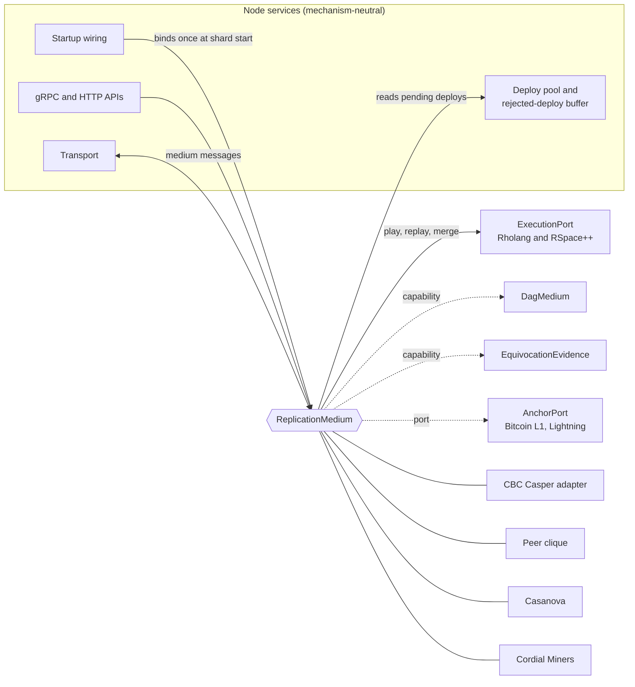

# Replication Boundary Design

- **Status:** draft for maintainer review (TASK-022-1, EPIC-022)
- **Story:** [US-010](../UserStories.md) Pluggable state machine replication per shard
- **Branch:** `feature/consensus-neutral-boundary`
- **Extends:** [F1r3fly: Parallel State Machines and Consensus-Neutral Execution](../artifacts/f1r3fly-consensus-neutral-sm.md)
- **Vocabulary:** [docs/Glossary.md](../Glossary.md) for the boundary terms, and one glossary for each mechanism: [CBC Casper](../casper/GLOSSARY.md), [RGB peer clique](../peer-clique/GLOSSARY.md), [Casanova](../casanova/GLOSSARY.md), and [Cordial Miners](../cordial-miners/GLOSSARY.md). The coalition vocabulary is in the [semitopology glossary](../semitopology/GLOSSARY.md).

---

## 1. Purpose

This document defines one boundary between the node services and a state machine replication (SMR) mechanism. Four mechanisms are in scope: CBC Casper, the RGB peer clique, Casanova, and Cordial Miners. Only CBC Casper is implemented today.

The boundary has three goals:

1. A new mechanism plugs in without changes to node wiring, the APIs, the transport, or Rholang execution.
2. CBC Casper moves behind the boundary with no change in behavior.
3. The RGB peer clique can satisfy the "shard consensus selection" requirement of RGB SoW2 workstream WS5.

The architecture note states the claim that this design depends on. Rholang reduction and RSpace operations commute unless names collide. A mechanism therefore decides only uniqueness and order. It does not define execution.

---

## 2. Decisions

The user made these decisions on 2026-10-05. Maintainer approval is pending.

| ID | Decision |
| --- | --- |
| D1 | The core trait is `ReplicationMedium`. |
| D2 | A shard binds one mechanism when the shard starts. The binding never changes for the life of the shard. No runtime switching exists. |
| D3 | The deploy pool and the rejected-deploy buffer are generic node services. A medium reads deploys from the pool. The medium has no deploy submission method. |
| D4 | Anchoring is available to every mechanism. RGB anchors to Bitcoin layer 1 and to Lightning state channels. |
| D5 | Each mechanism has its own glossary, in the same form as the Casper glossary. |

D2 removes a class of problems. The boundary needs no migration between mechanisms, no dual operation, and no handover of membership. Each node process serves one shard with one mechanism.

---

## 3. Corrections to the architecture note

The RGB sources changed after the architecture note was written. This branch amends the note in sections 3, 5, 9, and 12.

1. **RGB executes on Rholang.** ADR-0002 in Rholang-RGB replaces ALuVM with Rholang and RSpace++. RGB transitions therefore run on the same execution machine as every other mechanism. The note described RGB as a separate machine B.
2. **RGB adds a replication medium.** WS5 defines a Byzantine fault tolerant peer clique with per-transaction commits, epoch committees, and quorum certificates. Seal anchoring follows a finalized commit. Anchoring is not the ordering medium itself.
3. **"Line-item veto" is a description, not a Casanova term.** The Casanova paper calls the mechanism a conflict exclusion protocol. The Casanova glossary records the paper terms.

---

## 4. The four mechanisms against the boundary

| Property | CBC Casper | RGB peer clique | Casanova | Cordial Miners |
| --- | --- | --- | --- | --- |
| Maturity | `demo` | `alpha` (seal media), clique `coming_soon` | `coming_soon` | `coming_soon` |
| Commit unit | Multi-parent block | One transaction per commit | Block with parents in a DAG | Block in a blocklace |
| Ordering | Fork choice over latest messages, merge of parents | Leader or proposer per height, inside the clique | No leader. Conflicting transactions are voted on | Wave leader, then the τ order |
| Conflict handling | Deploy-signature conflicts at merge | Only one transaction commits at a height | Conflict exclusion with FTM-observed sets | Equivocation exclusion inside τ |
| Finality evidence | Clique oracle fault tolerance above threshold | Quorum certificate over `commit_hash` | FTM-observed set in a round | Final leader block, super-ratified in its wave |
| Membership | Bonded validators with stake | Epoch committee (`committee_root`) and engaged subset | Permissioned validators, `N >= 3f + 1` | Miners, `f < n/3` |
| Needs a DAG | Yes | No | Yes | Yes |
| Anchoring | Optional | Bitcoin layer 1 and Lightning | Optional | Optional |

The commit units differ, but each one has a pre-state, a set of deploys, a post-state, and evidence that only the mechanism can check. The boundary uses that common shape.

---

## 5. Architecture



The node owns the deploy pool, the transport, the APIs, and the execution machine. The medium owns ordering, conflict decisions, finality, and membership. The medium calls the execution port. The execution port never calls the medium.

---

## 6. Core types

These types contain no DAG parent, justification, bond, or equivocation fields. Mechanism data travels inside `MechanismEvidence`, which only the bound mechanism decodes.

```rust
pub struct MechanismId(&'static str);          // "cbc", "peer-clique", "casanova", "cordial", "stub"

pub struct CommitId(Hash);

pub struct CommitRecord {
    pub id: CommitId,
    pub pre_state: StateHash,                  // RSpace root before execution
    pub deploys: Vec<DeploySignature>,         // the deploys this commit applies
    pub post_state: StateHash,                 // RSpace root after execution
    pub sequence: Option<u64>,                 // block number, height, or none
    pub evidence: MechanismEvidence,
}

pub struct MechanismEvidence {
    pub mechanism: MechanismId,
    pub bytes: Vec<u8>,                        // justifications, a QC, an FTM set, or a lace position
}

pub struct FinalityEvent {
    pub commit: CommitId,
    pub post_state: StateHash,
    pub evidence: MechanismEvidence,
}

pub struct MembershipView {
    pub epoch: Option<u64>,
    pub members: Vec<MemberId>,
    pub weights: Option<Vec<u64>>,             // stake for CBC, none for equal-weight media
    pub fault_bound: u32,                      // f
    pub coalition: Option<CoalitionStructure>, // proposed, section 16
}
```

A **commit** is the unit that a medium orders and finalizes. A CBC block, a peer-clique transaction commit, a Casanova block, and a Cordial Miners block are all commits. A **finality event** states that a commit is irrevocable under the fault assumptions of the mechanism.

---

## 7. The `ReplicationMedium` trait

```rust
pub trait ReplicationMedium: Send + Sync {
    fn mechanism(&self) -> MechanismId;

    fn start(&self, ctx: MediumContext) -> Result<(), MediumError>;

    fn on_message(&self, peer: PeerId, message: MediumMessage) -> Result<(), MediumError>;

    fn on_tick(&self, now: Instant);

    fn commit(&self, id: &CommitId) -> Option<CommitRecord>;

    fn last_finalized(&self) -> Option<FinalityEvent>;

    fn finality_events(&self) -> FinalityStream;

    fn membership(&self) -> MembershipView;

    fn snapshot_source(&self) -> Option<Arc<dyn SnapshotSource>>;

    fn capabilities(&self) -> Capabilities;
}

pub struct MediumContext {
    pub shard: ShardBinding,                   // shard id and the bound mechanism
    pub execution: Arc<dyn ExecutionPort>,
    pub deploys: Arc<dyn DeployPool>,
    pub transport: Arc<dyn MediumTransport>,
    pub storage: Arc<dyn MediumStorage>,
    pub anchor: Option<Arc<dyn AnchorPort>>,
    pub identity: Option<ValidatorIdentity>,   // none for a read-only node
}
```

Each method has one job:

- `start` runs once when the shard starts. The medium restores its state from `storage`.
- `on_message` receives a mechanism message from the transport. The comm `PacketHandler` seam already exists and routes these messages.
- `on_tick` lets the medium decide when to propose. Proposal timing belongs to the medium. CBC uses heartbeat timing, and a peer clique uses height and round timeouts.
- `commit`, `last_finalized`, and `finality_events` give the node and the APIs a view of order and finality.
- `membership` replaces direct reads of bonds and active validators.
- `snapshot_source` supplies state sync at a finalized commit, for example the existing last-finalized-state export.
- `capabilities` returns the optional traits in section 8.

This trait resolves the open question in section 12 of the architecture note. `ReplicationMedium` is the thin core trait. `MultiParentCasper` becomes an internal trait of the CBC Casper implementation, behind an adapter.

---

## 8. Capability traits

A mechanism implements a capability trait only when it has the matching structure.

| Capability | Implemented by | Purpose |
| --- | --- | --- |
| `DagMedium` | CBC Casper, Casanova, Cordial Miners | Parent commits, the merge scope of a commit, and DAG traversal for tools |
| `EquivocationEvidence` | CBC Casper, Cordial Miners, and the peer clique where its evidence formats allow | Proofs that a member signed two conflicting messages |
| `MechanismApi` | Every mechanism | Mechanism-scoped API routes and fields (section 11) |

```rust
pub trait DagMedium {
    fn parents(&self, id: &CommitId) -> Vec<CommitId>;
    fn merge_scope(&self, id: &CommitId) -> MergeScope;
}

pub trait EquivocationEvidence {
    fn evidence_for(&self, member: &MemberId) -> Vec<MechanismEvidence>;
}
```

The peer clique has no DAG. It implements none of the DAG capability, and the node does not need it.

---

## 9. The execution port

The execution port is the only path from a medium to Rholang and RSpace++. It answers question 22 in section 6.6 of the RGB peer-clique design, which asks for the minimal callbacks between the engine and the executor.

```rust
pub trait ExecutionPort: Send + Sync {
    fn play(&self, pre_state: &StateHash, deploys: &[SignedDeploy], ctx: &ExecutionContext)
        -> Result<PlayResult, ExecutionError>;

    fn replay(&self, commit: &CommitRecord, deploys: &[SignedDeploy], ctx: &ExecutionContext)
        -> Result<ReplayVerdict, ExecutionError>;

    fn merge(&self, parents: &[StateHash], scope: &MergeScope)
        -> Result<MergeResult, ExecutionError>;
}
```

- `play` executes deploys on a pre-state and returns the post-state, the deploy outcomes, and the cost.
- `replay` executes a received commit and compares the result with the claimed post-state.
- `merge` combines parent post-states. Only a medium with `DagMedium` calls it. The merge code (`dag_merger` and `conflict_set_merger`) is execution code, not CBC code.

Determinism is a property of the port, not of the medium. Every medium receives the same post-state for the same pre-state and the same deploys. The peer clique requires this property for its replay invariant.

---

## 10. The commit product and anchoring

### 10.1 Commit product

This section answers question 21 in section 6.6 of the RGB peer-clique design. Every medium gives the shard the same product: a `CommitRecord` and, later, a `FinalityEvent`. The RSpace post-state hash is the agreement object for execution.

A mechanism can bind more identifiers inside its evidence. The peer clique binds `rgb_state_root`, `committee_root`, `engaged_root`, and the quorum certificate. CBC Casper binds the justifications and the bonds. The node does not read these values.

### 10.2 Anchoring

```rust
pub trait AnchorPort: Send + Sync {
    fn anchor(&self, event: &FinalityEvent) -> Result<AnchorTicket, AnchorError>;
    fn status(&self, ticket: &AnchorTicket) -> AnchorStatus;
}

pub enum AnchorTarget {
    BitcoinLayer1,          // single-use seal closed by a witness transaction
    LightningChannel,       // commitment inside a Lightning channel state update
}
```

- An anchor always follows finality. A medium never waits for an anchor before it finalizes a commit.
- The RGB peer clique anchors through Bitcoin layer 1 and through Lightning state channels.
- CBC Casper, Casanova, and Cordial Miners can anchor finalized commits as an option. The cadence is a mechanism setting.
- The anchor port does not make Bitcoin a parent of a commit. The architecture note keeps this rule.

---

## 11. APIs

The node keeps one set of neutral endpoints:

- Deploy submission to the deploy pool, and deploy status.
- Commit lookup, last finalized commit, and the finality stream.
- State queries at a commit, for example exploratory deploys and data at a name.
- The membership view.

Mechanism data moves to a `MechanismApi` namespace. For CBC Casper, the namespace holds `justifications`, `bonds`, `faultTolerance`, latest messages, bond status, and the DAG visualization.

**Wire compatibility.** The current gRPC services and HTTP routes stay as CBC extension routes with the same messages. Existing CBC clients see no change. A shard bound to another mechanism returns "not supported" from the CBC routes.

---

## 12. Shard configuration and binding

```hocon
shard {
  replication {
    mechanism = "cbc"            # cbc | peer-clique | casanova | cordial | stub
    cbc { ... }                  # the CBC fields of today's casper configuration
    peer-clique { ... }
  }
}
```

- The genesis or shard-start record stores the mechanism identifier.
- At each start, the node compares the configured mechanism with the stored one. If they differ, the node refuses to start.
- The node builds the medium through one factory. No other code names a concrete mechanism.

---

## 13. Leak assignment and migration order

The coupling survey of 2026-10-05 found five places where CBC Casper leaks past the boundary. Each step below keeps CBC behavior unchanged.

| Step | Task | Change | Leak removed |
| --- | --- | --- | --- |
| 1 | TASK-022-2 | New interface crate with the types and traits of sections 6 to 10. No behavior. | None |
| 2 | TASK-022-2 | CBC Casper adapter that wraps `MultiParentCasper`, `Engine`, and the proposer | `KeyValueDagRepresentation` in the node-facing signatures |
| 3 | TASK-022-3 | Mechanism factory and shard binding | `setup.rs` builds `Estimator` and `CliqueOracleImpl` and calls `update_fork_choice_tips_if_stuck` |
| 4 | TASK-022-4 | Heartbeat proposal timing moves into the CBC medium | Latest-message, bonds, justification, and finality-lag logic in `heartbeat_proposer.rs` |
| 5 | TASK-022-5 | `MechanismApi` namespace with the CBC extension routes | `justifications`, `bonds`, and `faultTolerance` in the neutral API |
| 6 | TASK-022-6 | The execution glue takes boundary types | `CasperSnapshot` and the finality floor types in `interpreter_util.rs` |
| 7 | TASK-022-7 | Test-only stub mechanism and a soak | None. This step proves the boundary |

Step 6 also starts the move of the three Rholang runtime files out of the casper crate. Section 9 of the architecture note calls them execution glue in the medium crate.

---

## 14. Verification

- **No behavior change for CBC.** The full test suite passes after each step. A soak on the merged change gives the same consensus results as before the change.
- **The stub proves neutrality.** A test-only mechanism runs the node wiring tests with no CBC code linked into the test binary.
- **Binding check.** A test starts a shard with one mechanism and restarts it with another. The node must refuse the restart.
- **CbC claims follow the split.** Section 9 of the architecture note assigns formal checks to machine, substrate, and medium. The interface crate becomes the stated boundary for those claims.

---

## 15. Non-goals

- An implementation of the peer clique, Casanova, or Cordial Miners.
- A change to the CBC wire format or to CBC behavior.
- RGB client-side validation or consignment handling inside the node.
- Runtime switching between mechanisms.

---

## 16. Coalition structure of a medium

This section is a proposal for maintainer review. Each medium decides with its own coalition rule. A single fault bound `f` cannot state all four rules. Semitopology, the framework of Murdoch J. (Jamie) Gabbay, gives one vocabulary for them. The [semitopology glossary](../semitopology/GLOSSARY.md) records its terms.

### 16.1 The four rules as actionable coalitions

The members of a shard are the points. An [actionable coalition](../Glossary.md#actionable-coalition) is a set of members that can decide together. The open sets are the unions of these coalitions.

| Medium | Members | Actionable coalition | Intertwined | Source |
| --- | --- | --- | --- | --- |
| CBC Casper | Bonded validators with stake `S` in total | A clique of agreeing validators with stake `w > S(1 + t) / 2`, where `t` is the fault tolerance threshold | Yes. Two such cliques share more than `tS` stake | `clique_oracle.rs`, fault tolerance `(2w - S) / S` |
| RGB peer clique | Epoch committee | The signer set of a quorum certificate inside the engaged subset of one transaction | Not yet shown. See question 5 in section 17 | Rholang-RGB WS5 |
| Casanova | Validators, `N >= 3f + 1` | A validator set with weight of at least `FTM = ceil((N + f + 1) / 2)` | Yes. Two such sets share at least `f + 1` validators | arXiv:1812.02232, section 2.6 |
| Cordial Miners | Miners, `f < n/3` | A supermajority, more than `(n + f) / 2` miners | Yes. Two supermajorities share more than `f` miners | arXiv:2205.09174, Definition 21 |

An [intertwined coalition structure](../Glossary.md#intertwined-coalition-structure) makes the whole member set a topen. Theorem 3.2.2 of the source then gives agreement for every continuous value assignment. The three threshold media are intertwined by their arithmetic. The peer clique must show the property for its engaged subsets.

### 16.2 The proposed type

```rust
pub enum CoalitionStructure {
    Threshold { weights: Vec<u64>, quorum_weight: u64 },
    Witness { witness_sets: Vec<(MemberId, Vec<Vec<MemberId>>)> },
}

impl CoalitionStructure {
    pub fn is_actionable(&self, members: &[MemberId]) -> bool;
}
```

- `Witness` is the general form, the witness function of Definition 8.2.2. The peer clique can state its engaged subsets in this form.
- `Threshold` is a compact form for CBC Casper, Casanova, and Cordial Miners. A list of witness sets for a weighted threshold can grow exponentially with the member count.
- `MembershipView.coalition` is optional. A medium that does not report it keeps today's behavior.

### 16.3 Rules

- The node reads the coalition structure. The node never computes finality from it. Finality stays in the mechanism evidence.
- Each shard has its own coalition structure. Two shards are not intertwined, and anchoring does not join them. Decision D2 keeps this separation.
- The interface crate can state "the coalition structure is intertwined" as a claim for each medium. The test-only stub mechanism can check the claim.
- Semitopology does not model Byzantine faults (Remark 23.3.1 of the source). An intertwined structure is necessary for safety, not sufficient. Each medium keeps its own Byzantine proof, for example the dissemination quorum condition.

---

## 17. Open questions

1. **State identifiers for the peer clique.** The commit product uses the RSpace post-state hash. The peer clique also names `rgb_state_root`. The design must state how the two identifiers relate.
2. **Anchoring cadence for CBC Casper.** The design allows anchoring. It does not yet define which finalized commits to anchor or how often.
3. **Membership changes.** CBC changes membership through bonds and epochs. The peer clique changes it through `EPOCH_START` commits. `MembershipView` covers both, but the change protocol stays inside each mechanism. A maintainer must confirm this split.
4. **Neutral wire protocol.** The neutral endpoints need new protobuf messages. The service names and versions need a maintainer decision.
5. **Peer-clique coalition intersection.** Each transaction has its own engaged subset. Two quorum certificates at one height must have a correct signer in common. The WS5 source must state the threshold and the engaged-subset rule that give this property. The SATCHEL RGB repositories contain no peer clique, so the rule must come from the WS5 specification or the Rholang-RGB implementation.
6. **Coalition structure field.** A maintainer must approve the optional `coalition` field of `MembershipView` and the two forms in section 16.2.
7. **Finality evidence in consignments.** An RGB consignment must carry the mechanism evidence of its `FinalityEvent`, so that a receiver can check finality without a trusted node. Today the SATCHEL consignment proof has only a block hash, a state hash, and a deploy identifier. The receiver asks its own node whether the block is finalized.
