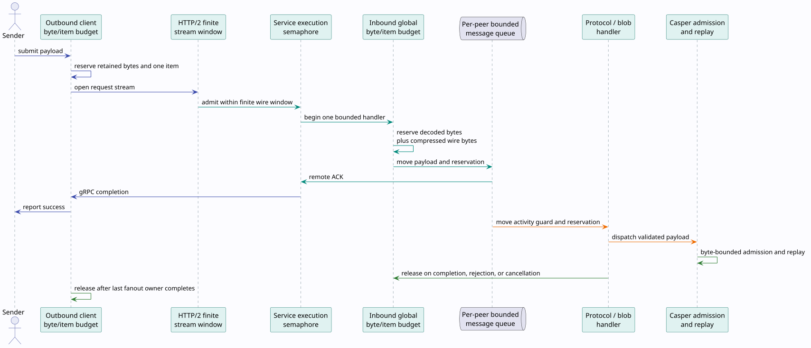

> Last updated: 2026-08-22

# P2P transport resource and completion semantics

This document specifies how the node bounds peer-to-peer (P2P) transport
memory, preserves accepted work across concurrent cleanup, and defines when a
send is successful. These controls protect node availability without changing
block contents, Rholang execution, fork choice, or Casper voting.

## Terms

- **Wire payload**: the bytes carried by HTTP/2. A compressed stream carries
  LZ4 bytes and a small length prefix.
- **Decoded payload**: the uncompressed `Protocol` or `Blob` delivered to node
  logic.
- **Reservation**: a resource acquisition owned by a Rust value. Moving that
  value moves the reservation; dropping its last owner releases it exactly
  once.
- **Wire concurrency**: the number of HTTP/2 request streams a connection may
  have open.
- **Execution parallelism**: the number of gRPC service calls allowed to
  execute application code concurrently.
- **Resident item**: one accepted payload retained in an inbound or outbound
  queue, an active network operation, or its handler.
- **Remote acknowledgement (ACK)**: a valid peer response emitted after the
  receiver has placed the payload and its reservation in the peer's bounded
  queue. It does not claim that Casper has validated or finalized a block.
- **Activity guard**: ownership proving that a peer slot or channel is still in
  use and therefore cannot be retired.



## Resource envelope

Let $`D(p)`$ be the decoded length of payload $`p`$, $`W(p)`$ its compressed wire
length, $`C(n)`$ the checked LZ4 allocation bound, $`B`$ the configured byte
capacity, and $`I`$ the configured item capacity. A live payload has reserved
cost:

```math
R(p) = D(p) +
\begin{cases}
W(p), & \text{if }p\text{ is compressed},\\
0, & \text{otherwise.}
\end{cases}
```

Every reachable post-reservation payload state must satisfy:

```math
\sum_{p \in \mathrm{Live}} R(p) \le B
\qquad\text{and}\qquad
\lvert \mathrm{Live} \rvert \le I.
```

The implementation uses checked integer arithmetic and atomic compare/exchange
for both inequalities. A failed reservation changes neither total. Every
success, error, cancellation, queue rejection, worker termination, and final
owner drop returns the exact reservation.

Tonic applies the global service-concurrency layer before the generated
protobuf decoder. Let $`H`$ be that handler limit, $`M`$ the maximum decoded
gRPC message size, and $`U`$ bytes owned by calls that have entered the service
but have not yet transferred their decoded value into a payload reservation.
The independent pre-reservation envelope is:

```math
U \le H M.
```

Startup computes $`HM`$ and the composed service-owned ceiling $`HM+B`$ with
checked arithmetic and rejects a configuration whose bounds overflow. The
gossip filter hashes validated protocol fields directly; it does not encode a
second full `Protocol` before reservation. Consequently, the decoder-to-queue
handoff satisfies:

```math
U + \sum_{p \in \mathrm{Live}}R(p) \le HM + B.
```

This ceiling covers protobuf values, stream chunks, compressed and decoded
payload buffers, and queued/handling payload ownership inside the transport
service. Kernel socket buffers, TLS/HTTP/2 connection metadata, allocator
fragmentation, downstream Casper objects, and the rest of node RSS are distinct
resource domains and are not misreported as `PayloadBudget` ownership.

$`M`$ is an operator-selected admission ceiling, not a semantic or algorithmic
limit of protobuf. A byte-native or streaming serializer may accept a larger
configured value without changing consensus, provided it either preserves the
same checked $`HM+B`$ ownership refinement or reserves input incrementally
before retention. Serializer throughput and stack safety cannot remove the
need for a finite peer-facing residency policy.

For an outbound compressed stream of decoded length $`n`$, the conservative
retained amount is $`n + C(n)`$. The LZ4 allocation bound is:

```math
C(n) = \left\lfloor\frac{110n}{100}\right\rfloor + 30,
```

provided each intermediate checked operation fits `usize`. Compression owns
one bounded buffer. `ChunkIterator` then yields `Bytes` slices lazily, so
chunking does not allocate another complete payload or a vector of copied
chunks. Fanout shares one `Arc<OutboundPayload>` and therefore one reservation
until the last peer operation finishes.

Inbound compressed streams first reserve the header's declared decoded length.
Each wire chunk grows the same reservation before appending bytes. The decoded
length may not exceed `grpc-max-recv-stream-message-size`, and compressed wire
bytes may not exceed $`C(\mathit{decoded\_length})`$. Uncompressed streams reserve and
accept exactly their declared length. A negative length, duplicate header,
data-before-header sequence, overflow, incomplete payload, decompression
failure, or network mismatch releases all owned resources.

## Three distinct concurrency bounds

The protocol server deliberately separates three concepts:

| Bound | Production derivation | Responsibility |
|---|---:|---|
| HTTP/2 wire streams | `max(max-message-consumers, 100)` | Finite multiplexing window, including requests initiated before the client observes server SETTINGS |
| gRPC service execution | `max-message-consumers` | Bounds application calls concurrently decoding, authenticating, and enqueueing; decoded pre-reservation bytes are at most `limit × grpc-max-recv-message-size` |
| Global resident items | same as HTTP/2 wire streams | Ensures every supported pre-SETTINGS request can obtain an item slot while the independent byte ceiling still rejects excessive memory |

The value 100 is not an execution target. It matches Hyper's finite initial
client send-stream window before the remote SETTINGS frame arrives. HTTP/2
permits a server to reset a stream above its advertised limit with
`REFUSED_STREAM`; Tonic maps that reason to `Unavailable`. Coupling the wire
limit directly to a smaller execution parallelism therefore loses an otherwise
valid initial burst instead of backpressuring it. The service semaphore remains
the execution bound, while the finite wire and item windows are large enough
for the supported client handshake behavior. See
[RFC 9113, section 5.1.2](https://www.rfc-editor.org/rfc/rfc9113.html#section-5.1.2)
and the [`h2` client concurrency documentation](https://docs.rs/h2/0.4.16/h2/client/struct.Builder.html#method.initial_max_send_streams).

The default server execution parallelism is 400 and the node's outbound stream
queue contains at most 100 items. Deployments that lower
`max-message-consumers` remain correct because the wire and item bounds stay at
100 while only application execution is reduced.

## Lifecycle algorithm

The algorithm is written in ownership order because cancellation correctness
depends on which value owns each guard:

```text
submit(payload, peers):
  validate the maximum decoded length and checked compression bound
  reserve one shared outbound item and its conservative retained bytes
  for each peer concurrently:
    acquire the channel slot while holding the channel-map lock
    acquire an activity guard from the channel's linearizable gate
    enqueue a delivery containing payload, guard, and completion sender
    await the completion receiver
  report success only if every peer reported a valid remote ACK

receive(request):
  enter the service semaphore before protobuf decoding
  decode within the checked per-message and aggregate decoder envelope
  authenticate the TLS session and request-local network context
  reserve one inbound item and transfer the decoded value into byte ownership
  acquire or initialize the peer slot while holding the peer-map lock
  enqueue an envelope containing payload, reservation, and activity guard
  return ACK only after enqueue succeeds
  move the envelope through the handler
  release reservation and guard on every terminal path
```

Local enqueue is not send success. The outbound worker owns a one-shot
completion sender and publishes the exact gRPC result only after the RPC
finishes. If the worker or queue disappears, the receiver closes and the caller
gets an error. For multi-peer streaming, success is the conjunction of all
peer completions.

## Linearizable peer retirement

Peer maps are finite: inbound peer buffers and outbound channels each permit at
most 1,024 entries and consider an entry stale after five minutes. Cleanup runs
periodically and whenever the map reaches its hard capacity.

An entry cannot be deleted between map lookup and `OnceCell` initialization.
The lookup acquires a slot-initialization guard while the map mutex is held.
After initialization, one `ActivityGate` atomic word represents both the
retiring bit and active-owner count. Admission increments the count only when
the retiring bit is clear; retirement changes exactly the idle state from zero
owners to retiring. No interleaving can both admit work and retire its queue.
The activity guard moves with an inbound envelope through handler completion or
with an outbound delivery through remote completion.

## Consensus boundary

Transport controls availability and timing, so a leak or false success can
indirectly stall dependency recovery and finalization. It must not decide
consensus. The following boundary is mandatory:

- TLS identity, network identity, size validation, and resource admission occur
  before dispatch.
- Transport ACK means bounded queue ownership, not block validity or
  finalization.
- Casper independently validates the authenticated block, its parents,
  execution result, bonds, signatures, and finalized-floor constraints.
- Transport arrival order, queue identity, compression choice, local metrics,
  and cleanup timing never enter a block hash or replay state.
- Block payloads move next into the separate count-and-byte-bounded Casper
  admission queue documented in [Formal verification](../formal-verification.md#worked-example-byte-bounded-block-admission).

Consequently, resource exhaustion may delay a block and cause a later
reannouncement or dependency fetch, but it cannot make two valid payloads mean
different state transitions on different validators.

## Failure behavior

| Failure | Required result |
|---|---|
| Byte or item capacity exhausted | Reject before retaining additional bytes; release partial ownership |
| Decoder or composed residency arithmetic overflows at startup | Reject the configuration before binding the protocol server |
| Per-peer queue full | Return a resource error; do not ACK or orphan the reservation |
| HTTP/2 request above the finite peer-advertised limit | Peer may return `REFUSED_STREAM`; the node's own pre-SETTINGS window is aligned so supported bursts do not cross it |
| Outbound worker terminates | Close completion channel and return an error, never success |
| Caller cancels | Drop its receiver; worker finishes or cancels normally and releases the delivery guard |
| Peer entry becomes stale while work is live | Retirement fails; cleanup retries only after the last guard and queue item release |
| Stream header belongs to another network | Reject using that request's immutable header context |
| Compressed payload expands beyond declared or configured bounds | Reject before allocating or appending beyond the reservation |

## Observability

All transport metrics use source `f1r3fly.comm.rp.transport`.

| Metric | Meaning |
|---|---|
| `transport.payload.bytes{direction=...}` | Current reserved bytes |
| `transport.payload.bytes-limit{direction=...}` | Hard byte ceiling |
| `transport.payload.active{direction=...}` | Current resident-item count |
| `transport.payload.deferred.total{direction=...,reason=...}` | Rejections by byte capacity, item capacity, or overflow |
| `transport.decoder.bytes-limit{direction=inbound}` | Checked maximum bytes in concurrent generated protobuf decoders before reservation |
| `transport.resident.bytes-limit{direction=inbound}` | Checked composed decoder-plus-payload service ceiling |
| `packets.received`, `packets.enqueued`, `packets.dropped` | Unary ingress outcomes |
| `stream.chunks.received`, `stream.chunks.enqueued`, `stream.chunks.dropped` | Stream ingress outcomes |

A healthy node may briefly approach an item limit during a burst. Sustained
growth in `transport.payload.bytes` without a corresponding fall after handler
completion is a reservation-lifetime defect and must be investigated before
increasing limits.

## Verification and regression matrix

| Obligation | Formal artifact | Executable refinement |
|---|---|---|
| Exact byte/item conservation and compression coverage | `TransportPayloadResidency.tla` | `PayloadBudget` proptests and stream-handler example/proptests |
| Success only after remote completion | `Inv_SuccessRequiresRemoteCompletion` and enqueue-success unsafe control | `StreamObservable` completion tests and transport integration tests |
| Finite wire, handler, decoder-byte, and item concurrency | `TransportConcurrency.tla` plus handler-limit unsafe control | checked-envelope proptest, five-concurrent-send regression, and Loom ingress-burst model |
| Initialization and retirement linearizability | `TransportPeerLifecycle.tla` | `ActivityGate` unit tests and Loom retirement/initialization schedules |
| Request-local validation | `Inv_ValidationUsesRequestContext` and shared-context unsafe control | parallel validation Loom model and stream tests |
| Lazy chunk residency and shared fanout reservation | eager-chunks unsafe control | chunker proptest and fanout unit/Loom tests |

TLC exhaustively checks the finite safe state spaces and must reproduce every
unsafe counterexample. Apalache independently checks bounded symbolic traces.
Loom enumerates atomic and ownership interleavings. Run the complete refinement
gate with:

```bash
scripts/check-cost-accounted-rho-block-admission.sh
```
