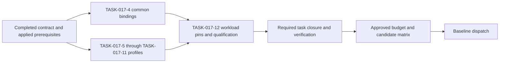

# Casper Soak Harness and Profile Verification Plan

**Status:** Planning, contracts, and prerequisite review are complete. The repaired lifecycle binding is accepted. Profile acceptance and baseline soaks remain pending.

The [completion review](../work-logs/task-017-1-3-completion.md) records TASK-017-1 through TASK-017-3 criteria, checks, and retained limits.

**Branch:** `formal/soak-casper-consensus`

**Pre-merge epic:** [EPIC-017](../ToDos.md#epic-017-ratified-casper-conformance-and-soak-evidence)

**Post-merge epic:** [EPIC-018](../ToDos.md#epic-018-post-merge-casper-soak-formal-verification)

**Proposed follow-on branch:** `formal/soak-casper-post-cost-accounting`, stacked on PR #216.

The maintainer amended the branch policy on 2026-09-19. The follow-on branch starts from the PR #216 head and targets that pull request. It retargets to `dev` after PR #216 merges. Discharge of a post-merge claim still requires the actual merge revision.

## Scope boundary

Both epics verify the soak harness and profiles only. The Rust node is the system under test, not a CbC proof artifact.

The scope includes workload generation, fault scheduling, observation collection, correlation, verdict classification, resource stops, restart handling, and evidence provenance.

The scope excludes node implementation changes, consensus proofs, accounting proofs, storage proofs, cryptographic proofs, and Rocq construction work.

Product defects found by a correct profile remain product failures. They belong to separate node work and must not become passing soak results.

Missing node test interfaces block their scenarios. These epics do not acquire runtime implementation obligations to unblock those scenarios.

## Authority and method

The [ratification meeting](https://github.com/F1R3FLY-io/f1r3node-rust/pull/390#pullrequestreview-5227717933) supplies the reviewed expectations for profile scenarios.

The [PR #216 decisions](https://github.com/F1R3FLY-io/f1r3node-rust/pull/216#issuecomment-5703891094) and [harness requirements](https://github.com/F1R3FLY-io/f1r3node-rust/pull/216#issuecomment-5703891358) remain references.

Current `dev` is the baseline authority. Experiments do not activate deferred policies or approve protocol releases.

Use [PR #433's harness method](https://github.com/F1R3FLY-io/f1r3node-rust/blob/65f7f6daa832c0acb6fddf2b462db1b9d5461729/docs/cbc-verification-tiers.md):

- **Refutation:** TLC checks finite harness and profile state machines, with clean and named expected-violation controls.
- **Binding:** Executable fixtures invoke the real harness or profile implementation with controlled transcripts, processes, and storage responses.
- **Construction:** Not applicable to these infrastructure claims. Runtime proofs remain outside both epics.

A model-only simulation cannot substitute for an executable fixture. A passing harness fixture cannot establish node correctness.

## Source inventory

These revisions were observed on 2026-09-16. They identify reference material, not integrations performed by this branch.

| Source | Observed revision | Role |
| --- | --- | --- |
| Baseline dev | `a2fe60c7255bf4ba035d41fb65b6d6f1c0f02632` | Initial node under test |
| PR #216 | `619beb4a4a7ad3f8967d4586daf0f5c552bd150e` | Candidate node, not blanket authority |
| PR #390 | `ce266ddcd8369107441dd9fc9b8e9ff6719146f1` | Historical ledger and published meeting review |
| Local ratification | `f26c975234752f516ea45be7c64005336b75d8c5` | Updated ledger, newer than the observed PR head |
| PR #430 | `dedb3add172098efcbc63d72b2ebdc612f2fddcd` | Storage-bound model reference |
| PR #431 | `0e176e486a028d10704b96add6e5eb50525682cb` | Disk-protected driver and fixtures |
| PR #432 | `e0380392bcc66d9774e403edb8a08415798c1e0e` | Soak models and CI controls |
| PR #433 | `65f7f6daa832c0acb6fddf2b462db1b9d5461729` | Verification tiers and architecture |

Approved prerequisite integration must preserve `#430 -> #431 -> #432 -> #433`. Git integration still needs separate authorization.

PR #431's B44 containment limitation remains explicit. The shared PR job has a 15-minute limit, not a two-minute whole-suite limit.

The shared gate permits two minutes per Casper configuration and a 60-second termination grace. The standalone Rust runner uses a five-second grace.

## Planned stack integration

The planned integration completed at merge `0f1ccdf38f9ab3b056e7601b93961cb56c0a51e9`. Its second parent is PR #433's revision `65f7f6daa832c0acb6fddf2b462db1b9d5461729`.

[PR #436](https://github.com/F1R3FLY-io/f1r3node-rust/pull/436) targets `docs/consensus-neutral-execution`. The verified ancestry preserves `#430 -> #431 -> #432 -> #433 -> formal/soak-casper-consensus`.

The merged tree equals its first parent's tree. All 228 recorded source hashes and 1,692 retained evidence records still match.

Fresh shared-gate and driver fixtures passed. Twelve runner tests, shell syntax checks, and Linux-targeted Pyright also passed.

The [integration report](../casper/cbc-evidence/runs/casper-stack-integration-20260917-01/report.json) retains the checks and diff measurements. The earlier TLC and disk results remain historical results, not new executions.

At this merge, the stack review diff contains 813 files, 94,281 insertions, and 802 deletions. The merge-base comparison with current `dev` contains 980 files, 104,443 insertions, and 513 deletions.

TASK-017-14 still owns diff reduction. No evidence or upstream file was deleted during integration verification.

At the stack review, `dev` was `bc23c8667ebef0f3fb7c3310caf85ce106df25fa`. The blocked matrix retains `a2fe60c7255bf4ba035d41fb65b6d6f1c0f02632`.

The completion review records a later `dev` observation without changing the matrix. TASK-017-12 must review source drift during qualification before dispatch.

This stack merge does not establish the PR #216 gate or accepted EPIC-018 handoff. No candidate repin, node dispatch, task closure, or claim discharge occurred.

## Ratifications as profile inputs

These rows define scenario expectations, not node-proof obligations for this branch.

| Decision | Profile requirement | Owner |
| --- | --- | --- |
| D-01 | Record Casper protocol and accounting authority separately. Keep unsupported-version scenarios and activation labels explicit. | TASK-017-11 |
| D-02 | Exercise committee, justification, signature, replay, settlement, restart, and dependency scenarios through available interfaces. Do not remove certificate code. | TASK-017-5 |
| D-03 | Pair bounded/reference observations on identical DAG inputs. Report head differences and traversal counters without claiming an unbounded equivalence proof. | TASK-017-5 |
| D-04 | Cover inclusive finality thresholds, strict-majority expectations, missing-history holds, and retained effects. Missing observations cannot pass. | TASK-017-5 |
| D-05 | Acknowledge crash injection and correlate publication/restart observations. Report torn tuples, stale results, and lost unresolved work. | TASK-017-6 |
| D-06 | Distinguish all-eligible stale recovery from leader-only convergence. Label frontier, clock, and rotating-leader experiments separately. | TASK-017-7 |
| D-07 | Retain exact occurrence identities, custody observations, retries, expiry, and coverage settings in profile data. | TASK-017-7 |
| D-08 | Generate multiplicity, causal-chain, failed-settlement, overflow, and conservation-observation workloads. Separate legacy and conditional additive results. | TASK-017-8 |
| D-09 | Record evidence order, epochs, rebond events, and observed authorization. Do not alter slashing authority or require node bisimilarity proofs. | TASK-017-9 |
| D-10 | Match index/reference input identities and verify observed path engagement before interpreting counters. Keep unavailable typed-identity scenarios blocked. | TASK-017-10 |
| D-11 | Retain exact control verdicts, truthful case counts, workflow evidence, and explicit incomplete outcomes. Do not remove existing gates. | TASK-017-2, TASK-017-4, TASK-017-13 |
| D-12 | Preserve both phloLimit and phloPrice in requests and observations. Classify minimum-price, prepayment, refund, and exhaustion outcomes. | TASK-017-11 |

Protocol-7 activation still requires FIPS approval and fresh genesis. Conditional additive semantics and undefined multi-wallet policies remain outside harness activation authority.

The independent node claim [CLAIM-FINALITY-002](../claims/repeat-deploy-carrier-index-equivalence.md) is neither owned nor discharged by these epics.

## Pre-merge phase: EPIC-017

1. Review harness claims, profile expectations, and finite model bounds.
2. Integrate approved prerequisites and pin the external system-integration harness.
3. Implement harness models, named negative controls, and executable fixtures.
4. Implement profile generation, fault acknowledgments, collectors, and verdict classifiers.
5. Run deterministic harness checks before approved baseline soak scenarios.
6. Preserve every failed, timed-out, cancelled, blocked, or incomplete outcome.
7. Review harness evidence and hand off profile interface requirements to EPIC-018.

PR #216's merge is not a blocker for this phase. Optional candidate experiments remain separate from baseline evidence.

## Approved implementation sequence

On 2026-09-17, the user approved profile implementation alongside unfinished common-driver bindings. TASK-017-4 and TASK-017-5 through TASK-017-11 no longer wait for each other.

Their implementation prerequisites are the completed TASK-017-2 contract and the applied TASK-017-3 prerequisites. The completion review closes these preparation tasks separately from profile verification.

TASK-017-3 owns prerequisite integration and initial candidate identities. TASK-017-12 owns final executable workload pinning and candidate qualification before dispatch.

The candidate matrix remains non-dispatchable while required pins, capabilities, verification, or approvals are missing. This sequencing change grants no node execution or external repin permission.

The original sequencing approval did not close tasks or discharge claims. The completion review uses a bounded compatibility invocation of the unchanged shared helper.

Profile evidence requirements and the EPIC-018 start gate remain unchanged.

## Post-merge phase: EPIC-018

The start gate requires the accepted pre-merge handoff and the actual PR #216 merge within the selected updated `dev` history.

1. Record the actual merge SHA and create a separate follow-on branch with approval.
2. Identify changed node interfaces consumed by the harness and profiles.
3. Adapt profile requests, fault controls, collectors, and metrics mappings.
4. Rerun affected harness models and executable fixtures with current digests.
5. Run approved post-merge soak scenarios with new run identities.
6. Review and discharge only the harness and profile claims.

This phase adapts the harness to the merged node. It does not prove or repair the merged node.

## TASK-017-2 contract delivery

The [interface contract](../casper/design/soak-interface-contract.md) defines record fields, source boundaries, fault acknowledgments, fixture expectations, and capability blockers.

All seven profile claims specify their payloads and post-merge adaptations. No profile implementation or product evidence is claimed by this specification work.

The [task log](../work-logs/task-017-2-interface-contract-2026-09-17.md) records the external-source audit and the completion helper's TASK-ID limitation.

## Claim and task map

| Claim | Verified component | Pre-merge owner | Post-merge owner |
| --- | --- | --- | --- |
| [001](../claims/casper-soak-harness.md) | Harness lifecycle, isolation, provenance, and outcome handling | TASK-017-4, TASK-017-12, TASK-017-13 | TASK-018-1, TASK-018-2, TASK-018-5, TASK-018-6 |
| [002](../claims/casper-soak-authority-finality.md) | Authority/finality profile correlation and classification | TASK-017-5 | TASK-018-3 |
| [003](../claims/casper-soak-publication.md) | Publication/restart fault acknowledgments and observations | TASK-017-6 | TASK-018-3 |
| [004](../claims/casper-soak-recovery.md) | Recovery lane scheduling and occurrence measurements | TASK-017-7 | TASK-018-3, TASK-018-5 |
| [005](../claims/casper-soak-merge-accounting.md) | Accounting workload generation and expected-value comparison | TASK-017-8 | TASK-018-4 |
| [006](../claims/casper-soak-slashing.md) | Evidence-order scenarios and authorization-result classification | TASK-017-9 | TASK-018-3 |
| [007](../claims/casper-soak-version-phlo.md) | Protocol labels, Phlo inputs, and settlement-result capture | TASK-017-11 | TASK-018-4 |
| [008](../claims/casper-soak-carrier-index.md) | Carrier comparison inputs and telemetry classification | TASK-017-10 | TASK-018-4 |

The [formal plan](../../formal/tlaplus/casper_soak/verification-plan.jsonc) records proposed controls. The [cycle checklist](../tdd-plans/casper-soak-harness.md) keeps unexecuted cycles pending.

New profile implementation files must enter the harness-only inventory when introduced. External harness changes need coordinated source and revision ownership before implementation.

## Scope and evidence storage

Each claim lists its current harness, profile, workflow, and formal artifacts. Artifact counts from earlier scaffolds are historical, not current scope inventories.

CLAIM-CASPER-SOAK-001 is discharged for its accepted pre-merge source. Claims 002 through 008 remain pending. No node-runtime or protobuf artifact enters these obligations.

The [first implementation log](../work-logs/task-017-4-harness-model-2026-09-16.md) records the bounded safety result and the remaining integration barriers.

The new runtime tags and pending runtime records from the earlier oversized scaffold are removed. Pre-existing runtime tags and evidence remain intact.

Canonical Casper-area records remain under `docs/casper/cbc-evidence/`, with compatibility symlinks for the shared driver's flat lookup.

Shared harness records remain under `docs/cbc-evidence/`. Mixed epic checks use the default directory, not a Casper-only override.

The generic artifact gate cannot establish coverage of every profile claim. Closure must also check claim IDs, digests, fixtures, and phase evidence.

### Evidence retention rule (2026-09-19)

This rule applies to every evidence package created after 2026-09-19. TASK-017-14 applies it to the packages that already exist.

A package keeps four kinds of file in the tree: `report.json`, `validation.json`, the SHA-256 digest lists, and the redaction list. The strict claims audit reads the cited report from the tree, so the report must stay.

All other package content leaves the tree. This includes archives, model-checker transcripts, fixture inputs, container logs, attempt records, upstream snapshots, and retained source copies.

The external evidence store holds that content. A sibling file `external.json` in the package records the store, the asset, the asset digest, and each external member with its path, size, and SHA-256. The report stays byte-identical because the claims audit binds its digest.

A ledger field that cites external content, including `previous_ledger`, records the store, the asset, the asset digest, the member path, and the member digest.

Candidate ledgers are working copies. After acceptance promotes them to canonical records, they leave the tree with the rest of the package content.

A verification result is not weaker because its bulk is external. The digest binds the external bytes, and the in-tree report binds the source and claim digests that the audit checks.

## Existing work and limits

Reuse EPIC-010 reporting, EPIC-012 work counters, EPIC-015 test fixtures, and EPIC-016 scenario infrastructure where their interfaces fit.

Keep EPIC-013 release authority separate. Do not close unrelated tasks or inherit their runtime proof obligations.

Legacy certificate and recovery specifications can conflict with the ratifications. Profile expectations must cite the meeting rather than copy those assumptions.

The historical epic review found unsupported `review` statuses in the strict parser. Preserve those unrelated records and use compatibility mode for inspection.

## Completion gates

Every evidence package retains revisions, configuration, seeds, run IDs, tool versions, bounds, assumptions, artifact digests, and terminal outcomes.

Positive models must pass. Negative controls require TLC exit 12 and the exact named property violation. Tool errors and timeouts cannot substitute for counterexamples.

Required profile fixtures must expose collector and classifier defects. Missing observations must remain unknown or incomplete, never fabricated passing values.

Harness verification and product verdicts are separate. A correct harness may report product failure, but that soak is still non-passing.

Close each epic only after its required harness verification and campaign acceptance pass. Any unavailable required scenario remains an explicit blocker.

No runtime proof is required for closure. No harness discharge can waive a node claim or authorize a deferred policy.
