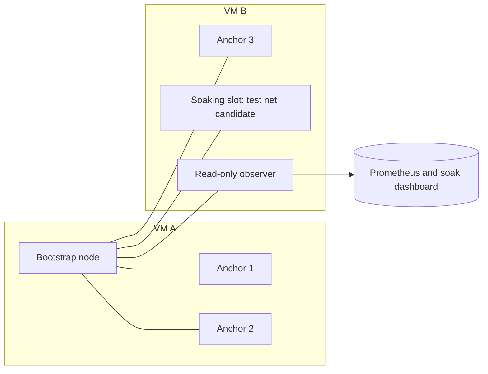
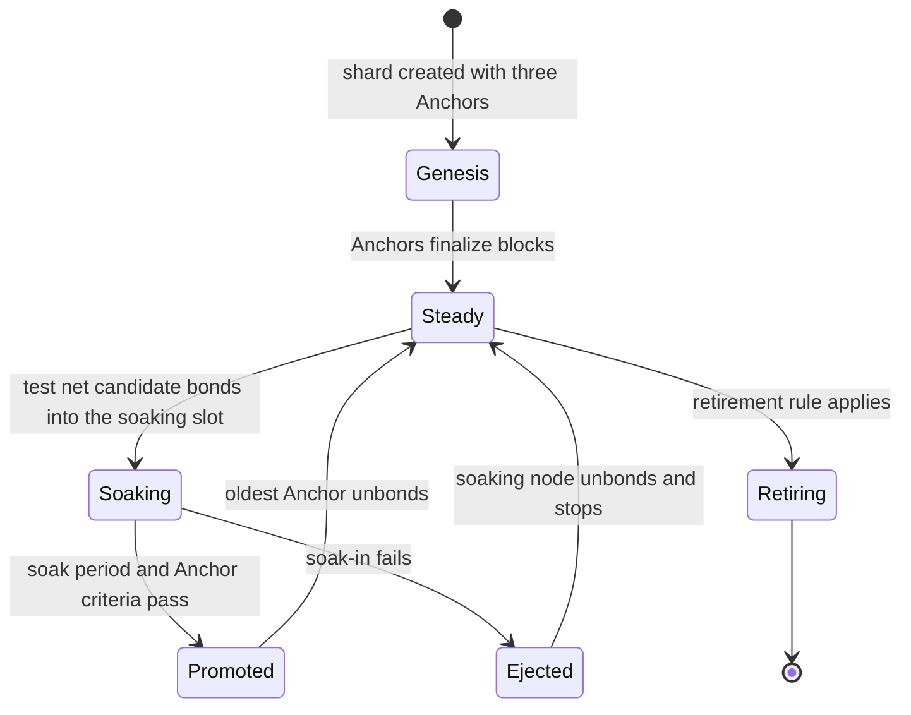
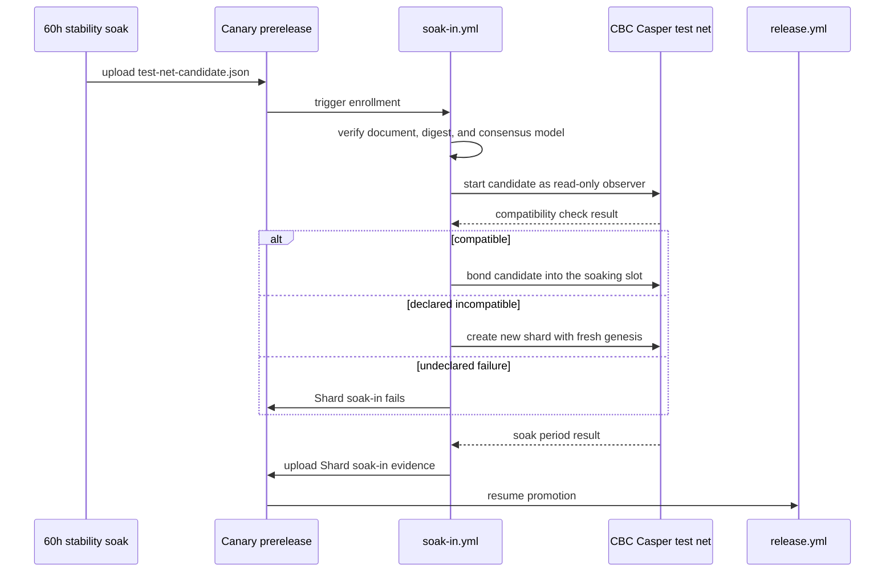

# Test Net Design (EPIC-014)

- **Status:** Draft for review, 2026-10-06
- **Task:** TASK-014-1 in `docs/ToDos.md`
- **User story:** US-010 in `docs/UserStories.md`
- **Governing text:** `docs/release-process.md` Section 12 and the proposed Section 12.1 amendment (pending ratification as TASK-014-5)
- **Terms:** [Test net](../Glossary.md#test-net), [Test net candidate](../Glossary.md#test-net-candidate), [Shard soak-in](../Glossary.md#shard-soak-in), [Anchor](../Glossary.md#anchor), [60h stability soak](../Glossary.md#60h-stability-soak)

## 1. Scope

This record designs the first test net: the CBC Casper test net. It covers the topology, the shard lifecycle, the enrollment flow, the compatibility check, and shard retirement. It also proposes values for the six deferred parameters in Section 12.1.

This record does not change a workflow, a script, or an OCI resource. TASK-014-2 builds the infrastructure after a maintainer accepts this design. TASK-014-6 changes the release workflows after a maintainer ratifies Section 12.1.

Values marked **Proposed** are design proposals. The first weeks of test net operation can change them before Phase 6 completes.

## 2. Fixed rules

These rules come from Section 12.1. This design does not reopen them.

1. Only a test net candidate enrolls. A test net candidate is a canary that passed the 60h stability soak on its exact image digest.
2. A test net candidate keeps its canary tag. The `test-net-candidate.json` gate document marks its status.
3. A shard mixes releases. Anchors run earlier releases, and the soaking node runs the test net candidate.
4. All shards in one test net use one consensus and state machine replication (SMR) model.
5. A test net candidate that is incompatible with its shard starts a new shard with a fresh genesis.
6. The Shard soak-in result gates stable promotion.

## 3. Topology

**Proposed:** The first shard has four bonded validators on two VMs. Three validators are Anchors. One validator slot holds the soaking node. A bootstrap node and a read-only observer complete the shard.

Four validators let the shard tolerate one faulty validator under the usual Byzantine bound of n ≥ 3f + 1. The soaking node is that tolerated fault. A test net candidate that misbehaves cannot stop the three Anchors from finalizing blocks.

The layout reuses the two-VM structure of `scripts/remote/` (`oci-provision.sh`, `deploy.sh`, and the `docker/shard.vps*.yml` compose files). The current shapes in that tooling are 2 OCPU with 4 GB and 4 OCPU with 8 GB. Those shapes are for short benchmarks and are too small for this shard.

**Proposed sizing:** The soak RSS envelope for a full shard is 16.7 to 19.3 GB. Each VM therefore starts with 4 OCPU and 24 GB of memory, plus a block volume for node data. TASK-014-2 measures the real use and adjusts the shapes.

**Proposed architecture:** The 60h stability soak tests the linux/amd64 image digest. The test net therefore runs linux/amd64 VMs. An arm64 shard would run a digest that no soak tested.

## 4. Shard lifecycle

A shard holds one soaking node at a time. A weekly release cadence and a soak period of five days or less fit this limit.

When a soaking node becomes an Anchor, the oldest Anchor unbonds and stops. The shard keeps four validators. Each promotion thus moves the release mix forward by one release.

## 5. Enrollment flow

Enrollment runs in the protected `release-credentials` environment. Only workflow files from the default branch run it. The deploy step pulls the image from OCIR by the digest in the gate document, never by tag.

## 6. Compatibility check

The compatibility check decides between joining a shard and starting a new shard. A test net candidate must not receive a fresh shard only because it fails to replay current state. A regression that breaks replay is a soak-in failure, not an incompatibility.

**Proposed rule:** Incompatibility is declared, not inferred.

1. A release that changes the wire format, the block format, or the genesis state declares this in its candidate evidence. The exact field is set during implementation, for example `requires_fresh_genesis: true`.
2. A declared candidate goes directly to a new shard.
3. An undeclared candidate first runs as a read-only observer on the current shard. It must sync to the last finalized block and replay a fixed window of recent blocks with identical post-state hashes.
4. An undeclared candidate that passes the check bonds into the soaking slot.
5. An undeclared candidate that fails the check fails its Shard soak-in. A maintainer can add the declaration and start enrollment again.

**Proposed replay window:** 200 blocks. With the default epoch length of 10, this window covers 20 epoch boundaries.

## 7. Deferred parameters

| # | Parameter (Section 12.1) | Proposed value | Reason |
|---|---|---|---|
| 1 | Soak-in period length | 5 days | Fits one candidate per shard at a weekly cadence. Stable promotion then follows about 7.5 days after the canary |
| 2 | Anchor promotion criteria | Five criteria, listed below the table | Each criterion compares the candidate with the Anchors on the same shard and the same load |
| 3 | Test net composition | One shard, four validators, three Anchors, one soaking slot, one observer | Lowest cost that still mixes releases and tolerates one fault |
| 4 | Compatibility check | Declared incompatibility, plus a 200-block observer replay for undeclared candidates (Section 6) | Keeps a regression from receiving a fresh shard |
| 5 | Retirement policy | A shard retires 14 days after a newer shard holds three Anchors. A shard open to partners gives 30 days notice | Keeps one current shard and gives partners time to move |
| 6 | Other gates before test net entry | Full OCI validation and the required slashing suite must pass before enrollment | A candidate that fails a gate cannot become stable, so test net time on that candidate has no value |

The proposed Anchor promotion criteria in row 2 are:

1. The soaking node has no unplanned restart.
2. The soaking node is not slashed and does not equivocate.
3. Its last-finalized-block lag stays within the Anchor median plus one epoch.
4. Its block proposals stay within 20 percent of the Anchor median.
5. Its RSS stays within the soak envelope.

The numeric thresholds in row 2 are first values. The first four weeks of operation measure the Anchor medians and adjust the thresholds.

## 8. Load and observation

An idle shard produces almost no evidence. **Proposed:** A low, constant deploy load runs against the shard, at about 10 percent of the dev integration soak rate. The load generator reuses the soak harness drivers.

The read-only observer exports metrics to Prometheus. The existing soak dashboard and the OCI Notifications topic receive the Shard soak-in status and its alerts.

## 9. Evidence

The Shard soak-in publishes one gate document to the canary prerelease, in the Section 8.1 format. **Proposed name:** `shard-soak-in-evidence.json`. Proposed extra fields:

- `consensus_model` and `test_net_shard`
- `path`: `joined` or `new_shard`
- `compatibility_check` result and replay window
- `soak_period_seconds` and `completed`
- The result of each Anchor criterion
- `anchor_promoted`

The promotion controller checks this document as it checks other gate documents. A document whose run does not match fails the gate.

## 10. Security

- Validator private keys live in OCI Vault, as for the soak scheduler. Keys never appear in artifacts, logs, or evidence.
- Each shard uses its own VCN and security list. Only the protocol and discovery ports are public. SSH access is limited to the operator network.
- The deploy workflow uses short-lived credentials from the `release-credentials` environment.
- TASK-014-4 opens read-only observer endpoints to partners. Partners never receive validator access.

## 11. Cost

Two VMs run all the time, with block volumes. The OCI budget alerts from the runner leak guardrails apply to the test net compartment. TASK-014-2 records the monthly cost before a second shard is added.

## 12. Consensus models

This design covers the CBC Casper test net only. A model from the consensus-neutral boundary roadmap gets its own test net with its own VCN, shards, and keys. It reuses this lifecycle, the enrollment flow, and the evidence format. The `consensus_model` field in the gate documents selects the test net.

## 13. Open questions

1. Can a release roll back while it is an Anchor, or does a defect found after promotion always need a new release?
2. Does the soaking node bond with real PoS stake from a test net wallet, or does genesis reserve a fixed bond for the soaking slot?
3. Which partners need access first, and do they need a separate shard (TASK-014-4)?
4. Does a Deployment Train candidate enroll in the same shard as a standard candidate?

## 14. Implementation state

PR #654 implements these parts:

| Part | Files | State |
|---|---|---|
| Test net candidate marker | `release-gate-evidence.sh test-net-candidate`, `merge-recovery-soak.yml` | A pass verdict writes the marker. A regress verdict writes it only after an accepted review by a maintain or admin collaborator, when a maintainer reruns the publish job |
| Marker verification | `release-gates.sh verify-test-net-candidate`, `soak-in.yml` | The verification reuses the preflight, stability-soak, and regression-verdict gates. Enrollment stays held |
| Shard soak-in gate | `release-gates.sh`, `release.yml`, repository variable `RELEASE_SHARD_SOAK_IN_GATE` | The variable is unset, so the gate is advisory and stable releases keep shipping |
| Consensus model | `release-evidence.sh` | An optional evidence field. Absent means `cbc-casper` |
| Test net VMs | `scripts/remote/testnet.env`, `just testnet-plan` | Dry run only |
| Slot pins | `scripts/remote/testnet-slots.sh`, `docker/testnet.vm-a.yml`, `docker/testnet.vm-b.yml` | Digest-only pins. The registry path comes from `TESTNET_IMAGE_REPOSITORY` at deploy time |

These items block the first `--apply` (TASK-014-2):

1. The testbed security list opens SSH and ports 40400 to 40455 to all addresses. Section 10 needs SSH limited to the operator network.
2. Validator keys reach the nodes as command-line arguments from `.env.remote`. Section 10 needs the keys in OCI Vault.
3. `deploy.sh` ships only the testbed compose files and key set. It must ship the test net compose files, the slot file, and the Anchor 3 and soaking-slot keys.
4. No workflow publishes `shard-soak-in-evidence.json` yet (TASK-014-3).

The remaining steps are:

1. A maintainer reviews this record and the proposed values.
2. A maintainer ratifies Section 12.1 (TASK-014-5).
3. TASK-014-2 closes the four blockers and runs the first `--apply` with maintainer approval.
4. After the test net runs, a maintainer sets the repository variable `RELEASE_SHARD_SOAK_IN_GATE` to `enforced`. A variable change has no review gate, so the maintainer records the change and its reason in EPIC-014.
