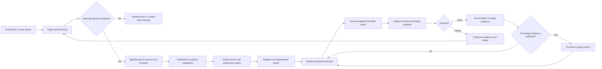
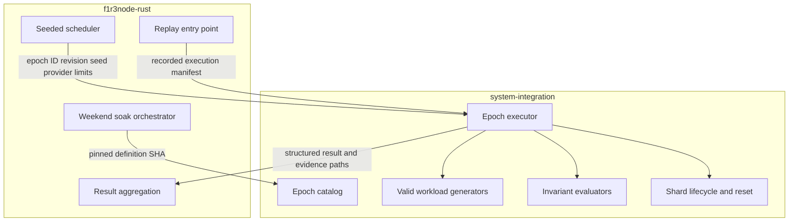
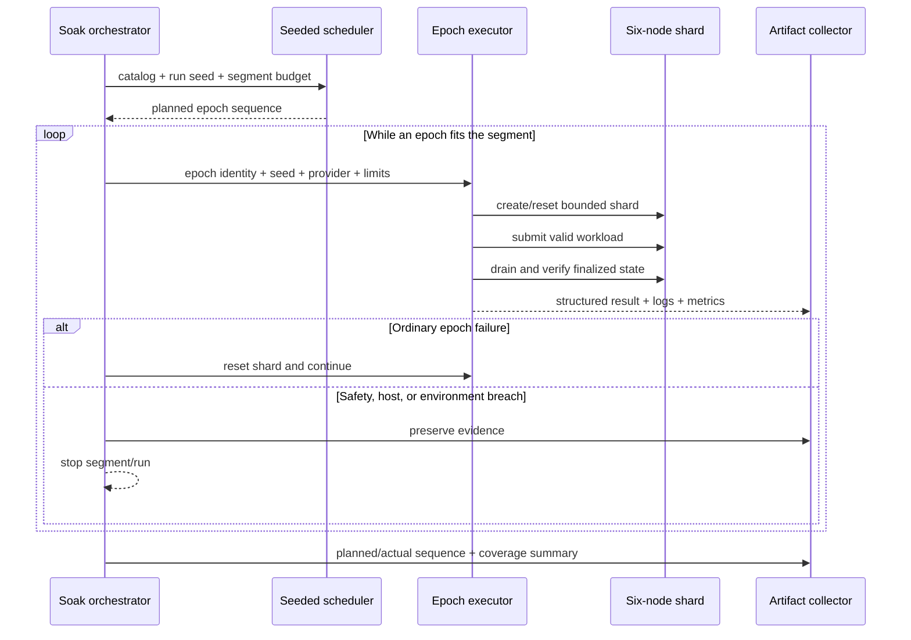
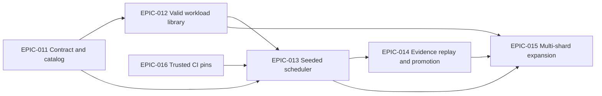

# Randomized Exercise Soak Value Stream

## Purpose

The weekend soak will execute a reproducible, coverage-constrained random sequence of valid blockchain workloads instead of repeatedly invoking one fixed load test. The suite is intended to expose consensus safety, finalization liveness, transaction-processing, and resource regressions while preserving enough evidence to replay every failure exactly.

The initial release targets the existing six-node single-shard topology and both Docker and subprocess providers. Multi-shard workloads follow after the single-shard contract and scheduler are stable.

## Canonical documents

- This document is canonical for the orchestrator value stream and scheduling policy.
- [`docs/ci-pins.md`](ci-pins.md) is canonical for split runner/catalog pins, JSONC resolution, trigger trust, and pin-bump automation.
- [system-integration's randomized exercise soak contract](https://github.com/F1R3FLY-io/system-integration/blob/dev/docs/specs/randomized-exercise-soak-contract.md) is canonical for the executable catalog, executor, result, and replay interface.

The documents cross-link by canonical repository URL so their relationship survives separate clones and local workspace layouts.

## Terminology

| Term | Meaning |
| --- | --- |
| Exercise epoch | One bounded execution of a versioned workload definition against a fresh or reset shard |
| Epoch definition | The setup, valid transaction sequence, invariants, limits, and expected outcomes for one workload |
| Catalog | The set of epoch definitions eligible for randomized selection |
| Execution manifest | The immutable record needed to replay an epoch execution |
| Required epoch | An epoch that must run at least once during a complete weekend window |
| Experimental epoch | A track-only epoch gathering evidence before it can gate releases |
| Gating epoch | An epoch whose safety, liveness, or valid-transaction failure fails the weekend soak |

Planning IDs such as `EPIC-011` are separate from workload IDs. Workloads use `SOAK-EPOCH-NNN` so an executable exercise epoch cannot be confused with a project-management epic or system-integration planning epoch.

## Versioning and reproducibility

Git remains the immutable source of truth, but a Git SHA alone is not sufficient for long-lived reports or cross-repository compatibility. Each execution records this identity tuple:

```yaml
catalog_schema_version: 1
epoch_id: SOAK-EPOCH-001
epoch_revision: 1
definition_repository: F1R3FLY-io/system-integration
definition_sha: <40-character commit SHA>
definition_digest: <sha256 of the normalized definition and fixtures>
orchestrator_repository: F1R3FLY-io/f1r3node-rust
orchestrator_sha: <40-character commit SHA>
seed: <unsigned integer>
provider: docker | subprocess
```

Versioning rules:

1. `epoch_id` is permanent and never reused.
2. `epoch_revision` increases only when setup, generated transactions, invariants, limits, or expected outcomes change semantically.
3. Editorial documentation changes do not increase the revision.
4. `catalog_schema_version` increases only for incompatible manifest or catalog changes.
5. The pinned system-integration SHA identifies the exact implementation used by a soak.
6. The normalized definition digest detects fixture drift and allows reports to identify equivalent definitions across rebases or cherry-picks.
7. A replay must use the recorded definition SHA, digest, seed, provider, topology, and effective limits. If any are unavailable or incompatible, replay fails closed rather than silently substituting newer behavior.

This provides human-readable lineage through ID and revision while Git SHAs and digests provide exact reproducibility.

## Value stream



### Value delivered at each stage

| Stage | Input | Output | User value |
| --- | --- | --- | --- |
| Curate | Known behavior or minimized failure | Versioned epoch definition | Failure knowledge becomes durable test intent |
| Validate | Definition and fixtures | Provider-compatible implementation | Only valid operational traffic enters the soak |
| Schedule | Eligible catalog and run seed | Coverage-constrained sequence | Broad behavior is exercised without losing reproducibility |
| Execute | Sequence and segment deadline | Epoch results and shard evidence | Workloads remain bounded by host and segment safety limits |
| Observe | Results, metrics, logs | Execution manifest and classification | Operators can distinguish node, workload, and infrastructure failures |
| Replay | Failed manifest | Deterministic reproduction | Defects can be investigated and fixed efficiently |
| Promote | Repeated experimental evidence | Gating epoch | Mature regressions protect releases permanently |

## Cross-repository architecture



| Concern | Owning repository |
| --- | --- |
| Epoch schema and cross-repository compatibility contract | Shared, with mirrored contract tests |
| Executable catalog, workload generators, invariants, and shard reset | `system-integration` |
| Seed selection, weekend coverage policy, segment deadlines, and workflow integration | `f1r3node-rust` |
| Node image and subprocess binary under test | `f1r3node-rust` |
| Per-epoch execution result | `system-integration` produces; `f1r3node-rust` aggregates |
| Run artifacts, replay manifests, dashboard, and release verdict | `f1r3node-rust` |

`.github/ci-pins.jsonc` defines separate immutable `runnerRef` and `catalogRef` boundaries. Privileged launcher/cloud-init jobs consume `runnerRef`; integration harness and exercise catalog jobs consume `catalogRef`. Catalog compatibility is validated before a runner is launched so a missing or incompatible epoch interface fails before OCI resources are consumed. See the [canonical pin registry design](ci-pins.md).

## Initial epoch catalog

| ID | Workload | Operational shape | Initial policy |
| --- | --- | --- | --- |
| `SOAK-EPOCH-001` | Steady valid deploy stream | Sustained bounded rate with finalization drain | Required, gating |
| `SOAK-EPOCH-002` | Burst and cooldown | Valid bursts followed by quiescent convergence checks | Required, experimental |
| `SOAK-EPOCH-003` | Concurrent channel contention | Concurrent valid contracts competing over shared channels/state | Required, experimental |
| `SOAK-EPOCH-004` | Large valid deploys | Deploys near approved phlo and payload bounds | Required, experimental |
| `SOAK-EPOCH-005` | Dependent transaction chains | Each step waits for finalized prerequisite state | Required, experimental |
| `SOAK-EPOCH-006` | Mixed contract workload | Weighted interleave of independent valid contract families | Required, experimental |

Validator lifecycle, node restart, network disruption, and multi-shard workloads are deferred until transaction-only epochs reliably reset and replay. Infrastructure failures such as runner loss are not exercise epochs; they remain orchestration and recovery concerns.

## Valid operational contract

Every workload generator must prove or enforce:

- deploy signatures and deploy structure are valid;
- submitting accounts have sufficient balances and valid keys;
- phlo and payload sizes remain within configured operational limits;
- generated dependencies, nonces, and state transitions are legal;
- the destination shard and node role are appropriate for the operation;
- dependent operations wait for prerequisite finalization;
- offered load remains within the epoch's declared rate and concurrency bounds;
- success is evaluated through finalized state, not submission acceptance alone;
- safety invariants and convergence checks run after the active phase;
- effective host-protection limits are inherited and may never be raised by an epoch.

Invalid-input fuzzing is a separate suite. Randomized exercise epochs test valid operations that a production shard is expected to process successfully.

## Scheduling policy

A complete weekend window uses one recorded run seed. The scheduler derives per-epoch seeds deterministically and builds the sequence before execution.

The selection algorithm must:

1. filter the catalog by schema compatibility, topology, provider, and policy;
2. reserve one slot for every required epoch that fits the available window;
3. order reserved slots with a seeded shuffle;
4. fill remaining time using configured weights;
5. avoid immediate repetition when another eligible epoch fits;
6. alternate or balance Docker and subprocess coverage;
7. stop admitting epochs that cannot finish and checkpoint before the segment deadline;
8. record skipped epochs and reasons rather than silently reducing coverage;
9. preserve the planned and actual sequence in artifacts.

A missed required epoch makes coverage incomplete. During initial rollout that condition is reported without failing the release; promotion to a release gate requires measured duration bounds and an approved minimum-coverage policy.

## Execution and failure policy



| Condition | Action |
| --- | --- |
| Workload assertion or finalization failure | Record failure, preserve manifest, reset shard, continue |
| Safety invariant violation | Preserve evidence and stop immediately |
| Node RSS ceiling or host-free floor breach | Preserve evidence and stop immediately |
| Shard reset cannot prove clean state | Classify environment corruption and stop |
| Segment deadline approaches | Do not admit another epoch; checkpoint normally |
| Experimental epoch fails | Fail the soak as a test result but do not independently gate release until promoted |
| Gating epoch fails | Fail the weekend verdict and release gate |
| Runner or OCI infrastructure fails | Use existing in-window recovery; do not create a workload regression epoch |

## Artifacts and observability

Each execution emits a machine-readable result containing:

- the complete version identity tuple;
- planned and actual start/finish times;
- effective topology, provider, image, and safety limits;
- transaction counts by submitted, accepted, rejected, included, and finalized;
- expected and observed invariants;
- finalization latency, throughput, RSS, CPU, and convergence metrics;
- failure classification and first failing operation;
- evidence paths and checksums;
- shard-reset outcome;
- a replay command or manifest reference.

The run-level summary records catalog coverage, planned versus actual sequence, failures by epoch and revision, and experimental versus gating status. Initial delivery publishes these fields in artifacts. Dashboard coverage and per-epoch trend views are a later task after the schema has real-run evidence.

## Regression intake and promotion

A newly discovered valid-workload failure enters the catalog only after it is:

1. classified as a node or integration behavior rather than infrastructure loss;
2. minimized to the shortest meaningful workload and setup;
3. assigned a permanent `SOAK-EPOCH-NNN` ID or added as a revision of an existing epoch;
4. demonstrated to fail before the fix;
5. demonstrated to pass after the fix on both providers, unless explicitly provider-specific;
6. registered as experimental with provenance linking the originating run or issue;
7. promoted to gating after stable execution and maintainer approval.

Promotion and revision history remain in Git. Completed run manifests preserve the exact historical implementation even after the catalog evolves.

## Delivery roadmap



- **EPIC-011:** Define versioned cross-repository contracts and authoring rules.
- **EPIC-012:** Implement the first six valid single-shard workload epochs in system-integration.
- **EPIC-013:** Add deterministic coverage-constrained selection and segment integration.
- **EPIC-014:** Complete evidence, replay, regression intake, promotion, and later dashboard visibility.
- **EPIC-015:** Extend the stable model to valid multi-shard operations.
- **EPIC-016:** Replace duplicated pins with one JSONC registry and split privileged runner code from the fast-moving catalog.

## Stigmergic collaboration

The two branches coordinate through tracked Markdown and versioned contract artifacts:

- This repository records orchestration decisions and mirrored external tasks in `docs/ToDos.md`.
- `system-integration` records executor/catalog implementation tasks in its own `docs/ToDos.md`.
- Cross-repository interface changes are written to tracked `docs/handoffs/` or canonical specification files and linked by repository URL.
- Each agent claims only tasks owned by its repository.
- A contract change is not complete until both repositories' compatibility tests agree.
- Branch names, commit SHAs, unresolved questions, and handoff status are included in every cross-repository work log.

Current coordination begins with `feature/randomized-exercise-soak` in this repository and `feature/randomized-exercise-soak-catalogue` in `system-integration`.
