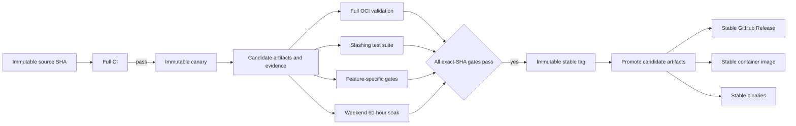

# Release Process and Deployment Train Strategy

**Status:** Proposed for maintainer ratification  
**Last updated:** 2026-08-16

## 1. Purpose

This document defines the F1R3node release process.

The process binds each release to one commit and one tested artifact set. It prevents a later commit from inheriting earlier test evidence.

The process supports two release paths:

1. The standard path starts from a successful full CI run on `master`.
2. A Deployment Train starts from a reviewed pull-request head commit.

Both paths use the same stable-release gates.

## 2. Release invariants

The automation must enforce these invariants.

1. Every candidate uses a full 40-character source commit SHA.
2. Every candidate Git tag is immutable.
3. Every stable Git tag is immutable.
4. A stable tag points to the exact commit that completed the soak.
5. Stable publication reuses the candidate artifacts without a rebuild.
6. The soak uses the candidate image by digest.
7. Gate evidence identifies the source SHA, workflow run, run attempt, and artifact digest.
8. Evidence from a different commit cannot satisfy a release gate.
9. A passing global or latest verdict cannot satisfy a commit-specific gate.
10. A later `master` commit does not change an active candidate.
11. A Deployment Train must merge before stable publication.
12. Standard gates are mandatory for all Deployment Trains.
13. A train manifest can add gates but cannot remove standard gates.
14. Two active trains cannot reserve the same stable version.
15. Stable versions must increase according to Semantic Versioning.

Mutable channel aliases, such as `latest`, are not release tags. Automation can move an alias only after stable publication succeeds.

## 3. Release model



A full CI run creates a canary only when the source version is release-eligible. Section 5 defines release eligibility.

The 60-hour soak is the final stable-release gate. A successful soak starts automatic promotion when all other gates pass.

If another gate is incomplete, promotion enters a held state. Promotion resumes automatically after the missing gate passes.

## 4. Tag and version format

### 4.1 Standard canary

Use this format for a candidate from `master`:

```text
vMAJOR.MINOR.PATCH-canary.CI_RUN_NUMBER
```

Example:

```text
v0.4.46-canary.812
```

### 4.2 Deployment Train canary

Use this format for a Deployment Train candidate:

```text
vMAJOR.MINOR.PATCH-canary.TRAIN_ID.CI_RUN_NUMBER
```

Example:

```text
v0.5.0-canary.cost-accounting.812
```

`TRAIN_ID` must use lowercase letters, numbers, and single hyphens.

### 4.3 Stable release

Use this format for a stable release:

```text
vMAJOR.MINOR.PATCH
```

Example:

```text
v0.4.46
```

### 4.4 Immutability rules

Automation must never force-update a Git tag.

If a requested tag exists, automation must verify its target and recorded artifacts. A mismatch must stop publication.

Versioned container tags follow the same rule. A versioned tag must resolve to its recorded digest.

## 5. Source version lifecycle

The source version must identify the next stable version before candidate creation.

The following files must contain the same target version:

- `node/Cargo.toml`
- `node/Dockerfile`
- `Cargo.lock`, when the package version changes

The target version must be greater than the highest stable tag.

After stable publication, automation opens a next-version pull request. The pull request prepares the next patch version by default.

A maintainer can prepare a minor or major version instead. The maintainer must merge that version change before candidate creation.

A full CI run is release-eligible when these conditions are true:

1. The run tests one immutable source SHA.
2. All source version files agree.
3. The source version is greater than the highest stable version.
4. No stable tag exists for the source version.

This lifecycle keeps the runtime version equal to the candidate version. Stable promotion does not need a release-only source commit.

## 6. Candidate creation

The candidate publisher runs inside the successful full CI run. It uses the artifacts that the run already built and tested.

The publisher performs these actions:

1. Verify the source SHA and source version.
2. Verify all required CI jobs for the same run.
3. Calculate SHA-256 checksums for each binary and image archive.
4. Publish the multi-architecture canary image.
5. Record the image index digest and architecture digests.
6. Create the immutable canary Git tag on the source SHA.
7. Create a GitHub prerelease for the canary.
8. Attach binaries, checksums, and `release-evidence.json`.
9. Publish a candidate check on the source commit.

The publisher must not rebuild an image or binary.

A rerun is idempotent. It verifies an existing candidate and does not replace candidate data.

## 7. Candidate evidence

Each canary release contains `release-evidence.json`.

The evidence document includes these fields:

```json
{
  "schema_version": 1,
  "candidate_tag": "v0.4.46-canary.812",
  "target_version": "0.4.46",
  "source_sha": "0123456789abcdef0123456789abcdef01234567",
  "source_ref": "refs/heads/master",
  "train_id": null,
  "ci": {
    "run_id": 123456789,
    "run_attempt": 1,
    "workflow": ".github/workflows/ci.yml",
    "conclusion": "success"
  },
  "system_integration_sha": "0123456789abcdef0123456789abcdef01234567",
  "artifacts": {
    "linux_amd64_sha256": "sha256-value",
    "linux_arm64_sha256": "sha256-value"
  },
  "images": {
    "docker_hub": "repository/image@sha256:index-digest",
    "ocir": "registry/repository/image@sha256:index-digest",
    "linux_amd64_digest": "sha256:architecture-digest",
    "linux_arm64_digest": "sha256:architecture-digest"
  },
  "created_at": "2026-08-16T00:00:00Z"
}
```

Exact field names can change during implementation. The schema version must change after an incompatible schema change.

Phase 1 evidence uses `publication_mode: evidence_only`. Its image record uses `publication_state: not_published` and contains no registry references.

Evidence must not contain credentials, tokens, user data, or local absolute paths.

## 8. Required stable gates

The promotion controller evaluates gates against `source_sha` from the candidate evidence.

| Gate | Required evidence | Pass condition |
|---|---|---|
| Full CI | CI run and candidate evidence | The exact-SHA run succeeds |
| Heavy integration | Required CI integration jobs | All required architecture and provider jobs succeed |
| Slashing tests | Slashing workflow run | The exact-SHA required suite succeeds |
| Full OCI validation | OCI validation evidence | The exact candidate image digest passes |
| Integration preflight | Soak preflight status | The exact SHA succeeds |
| Weekend soak | Soak artifact and workflow run | The exact candidate completes the full 60-hour profile |
| Regression verdict | `verdict.json` | The weekend verdict is `pass` |
| Feature gates | Train gate evidence | Every manifest gate succeeds |

Optional and nightly slashing jobs do not block a release. The required slashing job catalog remains version-controlled.

The promotion controller validates workflow identity through the GitHub API. A commit status alone is not sufficient evidence.

## 9. Full OCI validation

Candidate OCI validation must consume the published canary image by digest.

The validation workflow extracts the subprocess binary from that image. It must not rebuild the candidate from source.

The existing pull-request OCI mode can continue to build an unpublished image. Candidate mode must use the recorded image digest.

OCI evidence records these values:

- Source SHA
- Candidate tag
- Candidate image digest
- Workflow run and attempt
- Trusted system-integration SHA
- Required job conclusions

## 10. Weekend soak

A release soak uses the existing `weekend-60h` profile.

The release dispatch supplies these immutable values:

- Candidate source SHA
- Candidate tag
- Candidate image index digest
- Candidate evidence checksum

The soak pulls the image by digest. The soak extracts the subprocess binary from the same image.

Normal scheduled soak runs can continue to build a source target. A release-eligible run must use candidate artifact mode.

Stable promotion requires all these conditions:

1. The soak kind is `weekend`.
2. The requested duration is 216,000 seconds.
3. The final completion marker exists.
4. The integration preflight passed.
5. The soak used the recorded candidate digest.
6. The report identifies the candidate source SHA.
7. The regression verdict is `pass`.
8. The run completed without a shortened retry window.

A dashboard latest verdict does not satisfy this gate. Promotion reads the exact run artifact and validates its source SHA.

## 11. Stable promotion

The promotion controller runs after a completed weekend soak. It can also run after another missing gate completes.

The controller performs these actions:

1. Load the exact candidate evidence.
2. Validate each standard gate.
3. Validate each required train gate.
4. Verify that the stable version is still available.
5. Verify that the candidate source is eligible for publication.
6. Create the immutable stable Git tag on the candidate source SHA.
7. Copy the candidate binaries without modification.
8. Verify copied binary checksums.
9. Create the stable GitHub Release.
10. Copy the candidate image index to the stable image tag.
11. Verify the stable image digest.
12. Move approved stable channel aliases.
13. Publish `stable-release-evidence.json`.
14. Open the next-version pull request.

Promotion must not run `cargo build` or `docker build`.

The stable release remains valid when `master` advances during the soak. Evidence follows the candidate SHA, not the branch tip.

## 12. Soak-in shards

A Soak-in adds each weekly stable candidate to a long-running quorum of shards. "Soak-in" is the SRE-style term that already means "run it long enough to trust it."

New stable nodes enter a soak period inside or adjacent to the quorum. The Soak-in measures how the new nodes behave with the current quorum members. The Soak-in catches compatibility issues and confirms that the new nodes stay up.

A node becomes a true Anchor only after it completes the soak period. Until that point, the node holds no Anchor role in the quorum.

**Follow-on:** a future change will separate the Casper consensus into its own repository. The Soak-in quorum will then consume consensus releases from that repository.

## 13. Deployment Trains

A Deployment Train releases a reviewed feature independently from other active trains.

Each train uses a reviewed manifest under this directory:

```text
.github/deployment-trains/TRAIN_ID.yml
```

A manifest is a control-plane record. A normal pull request must add or change the manifest.

### 13.1 Manifest schema

```yaml
schema_version: 1
id: cost-accounting
state: proposed
target_version: 0.5.0
pull_request: 216
head_sha: 0123456789abcdef0123456789abcdef01234567
base_branch: master
required_gates:
  - id: cost-accounting-testbed
    workflow: testbed-quality-gate.yml
    job: Cost Accounting Quality Gate
    binds_image_digest: true
```

The manifest can use these states:

- `proposed`
- `active`
- `soaking`
- `held`
- `promoted`
- `cancelled`

Automation records live state outside Git. The manifest records reviewed intent and the final result.

### 13.2 Train setup

A maintainer dispatches train setup with the manifest path.

The setup workflow performs these actions:

1. Load the manifest from the default branch.
2. Validate the schema and train identifier.
3. Verify the pull request and exact head SHA.
4. Verify the source version against `target_version`.
5. Verify that the version has no active reservation.
6. Verify a successful full CI run for the exact head SHA.
7. Create the train canary from that CI run.
8. Start standard gates for the candidate.
9. Start each mandatory feature-specific gate.
10. Start the on-demand `weekend-60h` soak.

Multiple trains can run at the same time. Workflow concurrency keys include the train identifier and target version.

### 13.3 Merge requirement

The train pull request must merge before stable publication.

The promotion controller verifies that `head_sha` is reachable from `master`. A normal merge preserves this relationship.

A squash or rebase creates a different release commit. The controller rejects the old evidence and requires a new candidate.

The stable tag still points to the exact soaked commit. The merge proves that the reviewed candidate entered `master` before publication.

### 13.4 Version reservations

Each active train reserves one semantic version.

Setup rejects these conditions:

- Another active manifest reserves the version.
- A stable tag already uses the version.
- The version is not greater than the highest stable version.
- The source version does not match the target version.

If another train publishes a higher stable version first, the lower train enters `held`. A maintainer must assign a new version and rerun setup.

## 14. Feature-specific gates

A feature gate is mandatory when its manifest lists the gate.

Each feature gate must publish machine-readable evidence. The evidence binds the result to the source SHA and candidate image digest.

A train cannot declare a gate as optional after setup. A reviewed manifest change must cancel the old candidate and create a new candidate.

The first planned use is the cost-accounting train from pull request #216.

## 15. Failure and recovery rules

| Failure | Required response |
|---|---|
| CI fails | Do not create a canary |
| Candidate publication fails | Rerun idempotently against the same CI run |
| Tag target differs | Stop and require maintainer investigation |
| Artifact checksum differs | Stop and require maintainer investigation |
| OCI validation fails | Hold promotion and fix the candidate |
| Slashing tests fail | Hold promotion and fix the candidate |
| Soak fails | Do not promote |
| Soak uses a different digest | Reject the soak evidence |
| `master` advances | Continue with the immutable candidate |
| Train head changes | Cancel the candidate and run setup again |
| Train uses squash or rebase | Create a new candidate from the merged SHA |
| Stable version becomes unavailable | Assign a new version and create a new candidate |
| Promotion stops after tag creation | Resume idempotently and verify every existing object |

No override can replace failed exact-SHA evidence.

A maintainer can cancel a candidate or train. Cancellation does not delete tags, releases, or evidence.

## 16. Security model

Secret-bearing workflows always use trusted workflow files from the default branch.

A pull-request head cannot change release workflow code for its own privileged run.

Candidate workflows use least-privilege permissions. Release publication uses the protected `release-credentials` environment.

GitHub App tokens remain short-lived. Workflows do not place credentials in artifacts or evidence.

The promotion controller validates repository, workflow path, run event, source SHA, run attempt, and conclusion.

All external action references must use approved immutable references during implementation.

## 17. Workflow changes

Implementation adds or changes these components.

| Component | Change |
|---|---|
| `.github/workflows/ci.yml` | Publish immutable canaries from tested artifacts |
| `.github/workflows/release.yml` | Replace branch auto-bump behavior with exact-candidate promotion |
| `.github/workflows/merge-recovery-soak.yml` | Add candidate image-digest mode and exact soak evidence |
| `.github/workflows/oci-validation.yml` | Add trusted exact-candidate dispatch mode |
| `.github/workflows/reusable-oci-validation.yml` | Consume a candidate image digest without rebuilding |
| `.github/workflows/deployment-train.yml` | Validate manifests and start independent trains |
| `.github/scripts/release-evidence.sh` | Build and validate evidence documents |
| `.github/scripts/release-gates.sh` | Validate exact-SHA gate runs |
| `.github/scripts/promote-release.sh` | Perform idempotent artifact promotion |
| `.github/deployment-trains/` | Store reviewed train manifests |

Exact script boundaries can change after test design. The release invariants must not change without maintainer ratification.

## 18. Migration plan

Use staged migration to prevent an unintended stable release.

Phase 1 disables automatic stable publication. A manual workflow generates evidence only from one successful `master` CI run.

### Phase 1: Evidence only

1. Disable the current automatic patch release.
2. Generate candidate evidence without publishing stable objects.
3. Validate exact-SHA gate discovery against recent runs.
4. Add unit tests for tag, version, evidence, and manifest validation.

### Phase 2: Canary publication

1. Publish immutable canary tags and prereleases.
2. Publish canary images from existing CI artifacts.
3. Verify image and binary checksums.
4. Keep stable promotion disabled.

### Phase 3: Artifact-based validation

1. Run Full OCI Validation from the canary digest.
2. Run the weekend soak from the canary digest.
3. Publish exact commit checks and evidence.
4. Compare artifact-based results with current workflows.

### Phase 4: Stable promotion

1. Enable automatic promotion after all gates pass.
2. Remove the global latest-verdict release gate.
3. Stop rebuilding on stable tag pushes.
4. Move stable channel aliases only after digest verification.

### Phase 5: Deployment Trains

1. Add the manifest validator and setup workflow.
2. Run one non-publishing train rehearsal.
3. Run the cost-accounting train as the first publishing train.
4. Document the completed train evidence.

## 19. Ratification checklist

Maintainers must ratify these decisions before stable automation is enabled.

- [ ] Canary tag formats
- [ ] Source version lifecycle
- [ ] Exact-SHA gate catalog
- [ ] Full OCI candidate mode
- [ ] Uninterrupted 60-hour soak requirement
- [ ] Artifact and image digest reuse
- [ ] Stable tag placement on the soaked commit
- [ ] Mutable channel alias policy
- [ ] Deployment Train manifest schema
- [ ] Merge, squash, and rebase rules
- [ ] Version reservation and ordering rules
- [ ] First Deployment Train selection
