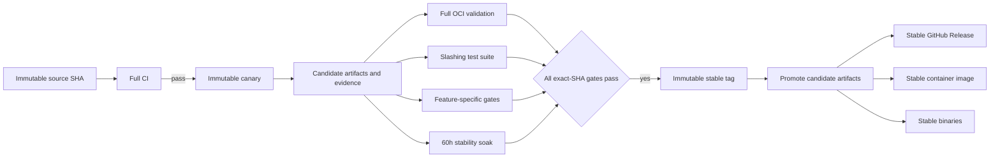
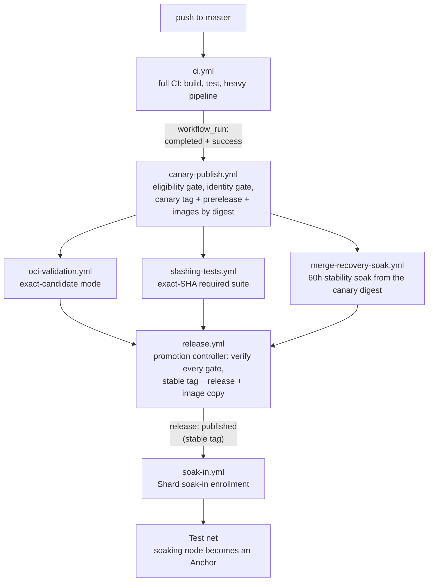

# Release Process and Deployment Train Strategy

**Status:** Ratified 2026-08-19 (all Section 19 items; two items carry recorded amendments)  
**Last updated:** 2026-08-19

## 1. Purpose

This document defines the F1R3node release process.

The process binds each release to one commit and one tested artifact set. It prevents a later commit from inheriting earlier test evidence.

The process supports two release paths:

1. The standard path starts from a successful full CI run on `master`.
2. A Deployment Train starts from a reviewed pull-request head commit.

Both paths use the same stable-release gates.

## 2. Release invariants

The automation must enforce these invariants.

1. Every candidate uses a full 40-character source commit SHA.
2. Every candidate Git tag is immutable.
3. Every stable Git tag is immutable.
4. A stable tag points to the exact commit that completed the soak.
5. Stable publication reuses the candidate artifacts without a rebuild.
6. The soak uses the candidate image by digest.
7. Gate evidence identifies the source SHA, workflow run, run attempt, and artifact digest.
8. Evidence from a different commit cannot satisfy a release gate.
9. A passing global or latest verdict cannot satisfy a commit-specific gate.
10. A later `master` commit does not change an active candidate.
11. A Deployment Train must merge before stable publication.
12. Standard gates are mandatory for all Deployment Trains.
13. A train manifest can add gates but cannot remove standard gates.
14. Two active trains cannot reserve the same stable version.
15. Stable versions must increase according to Semantic Versioning.

Mutable channel aliases, such as `latest`, are not release tags. Automation can move an alias only after stable publication succeeds.

## 3. Release model



A full CI run creates a canary only when the source version is release-eligible. Section 5 defines release eligibility.

The 60h stability soak is the final stable-release gate. A successful soak starts automatic promotion when all other gates pass.

If another gate is incomplete, promotion enters a held state. Promotion resumes automatically after the missing gate passes.

## 4. Tag and version format

### 4.1 Standard canary

Use this format for a candidate from `master`:

```text
vMAJOR.MINOR.PATCH-canary.CI_RUN_NUMBER
```

Example:

```text
v0.4.46-canary.812
```

### 4.2 Deployment Train canary

Use this format for a Deployment Train candidate:

```text
vMAJOR.MINOR.PATCH-canary.TRAIN_ID.CI_RUN_NUMBER
```

Example:

```text
v0.5.0-canary.cost-accounting.812
```

`TRAIN_ID` must use lowercase letters, numbers, and single hyphens.

### 4.3 Stable release

Use this format for a stable release:

```text
vMAJOR.MINOR.PATCH
```

Example:

```text
v0.4.46
```

### 4.4 Immutability rules

Automation must never force-update a Git tag.

If a requested tag exists, automation must verify its target and recorded artifacts. A mismatch must stop publication.

Versioned container tags follow the same rule. A versioned tag must resolve to its recorded digest.

## 5. Source version lifecycle

The source version must identify the next stable version before candidate creation.

The following files must contain the same target version:

- `node/Cargo.toml`
- `node/Dockerfile`
- `Cargo.lock`, when the package version changes

The target version must be greater than the highest stable tag.

After stable publication, automation opens a next-version pull request. The pull request prepares the next patch version by default.

A maintainer can prepare a minor or major version instead. The maintainer must merge that version change before candidate creation.

A full CI run is release-eligible when these conditions are true:

1. The run tests one immutable source SHA.
2. All source version files agree.
3. The source version is greater than the highest stable version.
4. No stable tag exists for the source version.

This lifecycle keeps the runtime version equal to the candidate version. Stable promotion does not need a release-only source commit.

## 6. Candidate creation

The candidate publisher runs against the successful full CI run. The `canary-publish.yml` workflow starts on run completion (`workflow_run`) and uses the artifacts that the run already built and tested. The workflow file always executes from the default branch.

The publisher performs these actions:

1. Verify the source SHA and source version.
2. Verify all required CI jobs for the same run.
3. Calculate SHA-256 checksums for each binary and image archive.
4. Publish the multi-architecture canary image.
5. Record the image index digest and architecture digests.
6. Create the immutable canary Git tag on the source SHA.
7. Create a GitHub prerelease for the canary.
8. Attach binaries, checksums, and `release-evidence.json`.
9. Publish a candidate check on the source commit.

The publisher must not rebuild an image or binary.

A rerun is idempotent. It verifies an existing candidate and does not replace candidate data.

## 7. Candidate evidence

Each canary release contains `release-evidence.json`.

The evidence document includes these fields:

```json
{
  "schema_version": 1,
  "candidate_tag": "v0.4.46-canary.812",
  "target_version": "0.4.46",
  "source_sha": "0123456789abcdef0123456789abcdef01234567",
  "source_ref": "refs/heads/master",
  "train_id": null,
  "ci": {
    "run_id": 123456789,
    "run_attempt": 1,
    "workflow": ".github/workflows/ci.yml",
    "conclusion": "success"
  },
  "system_integration_sha": "0123456789abcdef0123456789abcdef01234567",
  "artifacts": {
    "linux_amd64_sha256": "sha256-value",
    "linux_arm64_sha256": "sha256-value"
  },
  "images": {
    "docker_hub": "repository/image@sha256:index-digest",
    "ocir_index_digest": "sha256:index-digest",
    "linux_amd64_digest": "sha256:architecture-digest",
    "linux_arm64_digest": "sha256:architecture-digest"
  },
  "created_at": "2026-08-16T00:00:00Z"
}
```

Exact field names can change during implementation. The schema version must change after an incompatible schema change.

Phase 1 evidence uses `publication_mode: evidence_only`. Its image record uses `publication_state: not_published` and contains no registry references.

Canary evidence uses `publication_mode: canary`. It records the Docker Hub index reference, both architecture digests, and the OCIR index digest. The canary publisher pushes the same image blobs and the same manifest list to both registries, so the two index digests are equal, and the evidence validator requires that equality. The OCIR repository path never appears in evidence: the path is repository-secret material and evidence is public.

OCIR is the canonical registry for candidate gates. Full OCI validation and the 60h stability soak run inside OCI and pull the candidate from OCIR by digest. Docker Hub is the public mirror and receives the same index at canary time and the same stable tag at promotion.

Evidence must not contain credentials, tokens, user data, or local absolute paths.

## 8. Required stable gates

The promotion controller evaluates gates against `source_sha` from the candidate evidence.

| Gate | Required evidence | Pass condition |
|---|---|---|
| Full CI | CI run and candidate evidence | The exact-SHA run succeeds |
| Heavy integration | Required CI integration jobs | All required architecture and provider jobs succeed |
| Slashing tests | Slashing workflow run | The exact-SHA required suite succeeds |
| Full OCI validation | OCI validation evidence | The exact candidate image digest passes |
| Integration preflight | Soak preflight status | The exact SHA succeeds |
| 60h stability soak | Soak artifact and workflow run | The exact candidate completes the full 60-hour profile |
| Regression verdict (advisory) | `verdict.json` | A `pass` verdict satisfies the gate directly. A `regress` verdict requires documented maintainer review before promotion |
| Feature gates | Train gate evidence | Every manifest gate succeeds |

Optional and nightly slashing jobs do not block a release. The required slashing job catalog remains version-controlled.

The regression verdict is advisory because it is a relative week-over-week measure. A `regress` verdict on a release-eligible run publishes an alert through the existing OCI Notifications topic, to the same subscriber list as the soak reports. Promotion then waits for documented maintainer review instead of failing outright.

The promotion controller validates workflow identity through the GitHub API. A commit status alone is not sufficient evidence.

### 8.1 Gate evidence contract

Each gate produces one JSON document that names the candidate and the run that produced it. This section defines those documents, where they live, and how the controller verifies them.

The promotion controller reads every gate document from the candidate prerelease. Release assets are mutable by anyone with `contents: write`, so a document alone proves nothing about the run it names. The controller fetches the named run through the GitHub API and requires the API record to agree with the document on repository, workflow path, attempt, event (`workflow_dispatch` from the default branch), and conclusion. A document whose run is absent holds. A document whose run disagrees fails. A document that does not parse fails its gate; a gate can never be absent from the report.

A `maintainer-review.json` asset is accepted only when the controller confirms through the API that the named reviewer holds `maintain` or `admin` permission on the repository. A gate workflow that runs in candidate mode uploads its document as a release asset on the candidate tag and uploads a `release-candidate` workflow artifact that names the candidate tag. The controller resumes from that artifact.

Each document binds to the candidate with these fields:

```json
{
  "schema_version": 1,
  "gate": "oci_validation",
  "source_sha": "0123456789abcdef0123456789abcdef01234567",
  "candidate_tag": "v0.4.46-canary.812",
  "image_index_digest": "sha256:index-digest",
  "candidate_evidence_sha256": "sha256-of-the-evidence-file-the-run-resolved",
  "workflow_run": {"id": 123456789, "attempt": 1, "path": ".github/workflows/oci-validation.yml", "conclusion": "success"}
}
```

`candidate_evidence_sha256` binds the document to the exact evidence file the gate run resolved before it tested anything. The gate workflow keeps that file as a run artifact and writes the document from the artifact, never from a fresh download of the release asset. The controller requires the digest to equal the evidence it evaluates, so a release asset replaced after the run resolved it cannot be credited with that run's result.

| Asset | Gate | Extra fields |
|---|---|---|
| `oci-validation-evidence.json` | Full OCI validation | `mode: candidate`, `system_integration_sha`, `required_jobs[]` |
| `soak-evidence.json` | Integration preflight and 60h stability soak | `soak_kind: weekend`, `requested_duration_seconds: 216000`, `completed`, `artifact_mode: candidate`, `retry_attempt`, `coverage_preserved`, `preflight.status` |
| `verdict.json` | Regression verdict | `verdict`, `source_sha` |
| `maintainer-review.json` | Accepts a `regress` verdict | `verdict_accepted`, `reviewer`, `reference`, `reviewed_at` |

The full CI and heavy integration gates read the CI run recorded in the candidate evidence. The slashing gate reads the newest successful push run of the slashing workflow for the source SHA. `release-required-ci-jobs.txt` and `release-required-slashing-jobs.txt` list the required jobs.

`release-gates.sh evaluate` resolves each gate to `pass`, `hold`, or `fail`. A hold waits for evidence. A fail is exact-SHA evidence that contradicts the candidate, and no override can replace it.

## 9. Full OCI validation

Candidate OCI validation consumes the published canary image by digest. The maintainer dispatches `oci-validation.yml` with `candidate_tag`. The workflow downloads the candidate evidence from the prerelease, verifies its checksum and the tag target, and pulls each architecture image from OCIR by its recorded manifest digest.

The validation workflow extracts the subprocess binary from that image. It does not rebuild the candidate from source.

The pull-request OCI mode continues to build an unpublished image. Candidate mode uses the recorded image digest.

After a successful run, the `publish_candidate_evidence` job writes `oci-validation-evidence.json` (Section 8.1) with `release-gate-evidence.sh`, uploads it to the candidate prerelease, and uploads the `release-candidate` artifact that lets `release.yml` resume.

OCI evidence records these values:

- Source SHA
- Candidate tag
- Candidate image digest
- Workflow run and attempt
- Trusted system-integration SHA
- Required job conclusions

## 10. 60h stability soak

The 60h stability soak is the pre-promotion release soak. It uses the existing `weekend-60h` profile. Machine identifiers keep the legacy `weekend` values until a separate identifier migration.

The release dispatch supplies these immutable values:

- Candidate source SHA
- Candidate tag
- Candidate image index digest
- Candidate evidence checksum

The maintainer dispatches `merge-recovery-soak.yml` with `candidate_tag` and `duration: weekend-60h`. The soak job downloads the candidate evidence, verifies the tag target, pulls the linux/amd64 image from OCIR by its recorded digest, and extracts the subprocess binary from the same image. The schedule gate records the soak window (candidate, kind, attempt, end epoch) as a run artifact.

An in-window restart carries `candidate_tag` and `restart_of_run_id` forward. The schedule gate accepts a candidate restart only after it reads the original run's window artifact and confirms the same candidate, `retry_attempt` 0, the weekend kind, and an end epoch equal to `window_end_epoch`. The published document reports `coverage_preserved` true only for a verified restart; an unverified restart is published as false and fails the gate.

Normal scheduled soak runs continue to build a source target. A release-eligible run uses candidate artifact mode.

After the soak runs its course, the `publish_candidate_evidence` job writes `soak-evidence.json` and `verdict.json` (Section 8.1) from the run state and the report, uploads both to the candidate prerelease, and uploads the `release-candidate` artifact. A `regress` verdict is published as evidence; the existing ONS verdict email alerts the soak-report list, and promotion holds until a maintainer uploads `maintainer-review.json`.

Stable promotion requires all these conditions:

1. The soak kind is `weekend`.
2. The requested duration is 216,000 seconds.
3. The final completion marker exists.
4. The integration preflight passed.
5. The soak used the recorded candidate digest.
6. The report identifies the candidate source SHA.
7. The regression verdict is `pass`, or a maintainer reviewed and accepted a `regress` verdict.
8. The run completed without a shortened retry window. One restart after an infrastructure failure is permitted when the run preserves the full 60-hour coverage.

A dashboard latest verdict does not satisfy this gate. Promotion reads the exact run artifact and validates its source SHA.

## 11. Stable promotion

The promotion controller runs after a completed 60h stability soak. It can also run after another missing gate completes.

The controller performs these actions:

1. Load the exact candidate evidence.
2. Validate each standard gate.
3. Validate each required train gate.
4. Verify that the stable version is still available.
5. Verify that the candidate source is eligible for publication.
6. Create the immutable stable Git tag on the candidate source SHA.
7. Copy the candidate binaries without modification.
8. Verify copied binary checksums.
9. Create the stable GitHub Release.
10. Copy the candidate image index to the stable image tag.
11. Verify the stable image digest.
12. Move approved stable channel aliases.
13. Publish `stable-release-evidence.json`.
14. Open the next-version pull request.

Promotion must not run `cargo build` or `docker build`.

The stable release remains valid when `master` advances during the soak. Evidence follows the candidate SHA, not the branch tip.

### 11.1 Prerequisites and serialization

A live promotion needs these conditions:

- The `release-credentials` environment exists with required reviewers. The promote job runs only under that environment.
- The Docker Hub and OCIR credentials are repository secrets, readable by the promote job.
- Every Section 8 gate can pass. Until the gate workflows publish Section 8.1 documents, the OCI validation, soak, and verdict gates hold and no candidate is promotable end to end.

Promotions run one at a time. `release.yml` uses one concurrency group without cancellation, so a second run queues and starts only after the first finishes. Each run observes tag, release, and registry state in its own gates and plan steps, so a queued run sees the result of the run before it. A resumed promotion verifies every object that already exists: the tag target, the release assets, and the registry digests. A partial release stops promotion for investigation. A resume after a newer stable version exists stops, because the aliases must never move backward.

## 12. Shard soak-in

A Shard soak-in adds each weekly stable release to the test net, the continuously running network of shards. "Soak-in" is the SRE-style term that already means "run it long enough to trust it."

New stable nodes enter a soak period inside or adjacent to the test net. The Soak-in measures how the new nodes behave with the current test net members. The Soak-in catches compatibility issues and confirms that the new nodes stay up.

A node becomes a true Anchor only after it completes the soak period. Until that point, the node holds no Anchor role in the test net.

Enrollment has its own schedule. Automation schedules one Shard soak-in for each stable release tag. The trigger is a stable release publication, which has passed the 60h stability soak gate.

Three parameters are deferred to Phase 6, when the test net exists and real behavior can inform them: the soak-in period length, the measurable Anchor promotion criteria, and the test net composition. The scheduling rule, the trigger, and the soaking-node versus Anchor distinction are binding now.

The test net is a set of continuously running shards, unlike the per-iteration shards that the soaks create. EPIC-014 in `docs/ToDos.md` plans the test net: long-lived OCI instances run stable releases, reuse the existing fleet tooling, and serve select partners and customers. A follow-on branch carries that work; this document only requires that the test net exists before Phase 6 completes.

**Follow-on:** a future change will separate the Casper consensus into its own repository. The test net will then consume consensus releases from that repository.

## 13. Deployment Trains

A Deployment Train releases a reviewed feature independently from other active trains.

Each train uses a reviewed manifest under this directory:

```text
.github/deployment-trains/TRAIN_ID.yml
```

A manifest is a control-plane record. A normal pull request must add or change the manifest.

### 13.1 Manifest schema

```yaml
schema_version: 1
id: cost-accounting
state: proposed
target_version: 0.5.0
pull_request: 216
head_sha: 0123456789abcdef0123456789abcdef01234567
base_branch: master
required_gates:
  - id: cost-accounting-testbed
    workflow: testbed-quality-gate.yml
    job: Cost Accounting Quality Gate
    binds_image_digest: true
```

The manifest can use these states:

- `proposed`
- `active`
- `soaking`
- `held`
- `promoted`
- `cancelled`

Automation records live state outside Git. The manifest records reviewed intent and the final result.

#### 13.1.1 Stack manifests

A stack train releases a set of stacked pull requests as one candidate. The manifest identifies the head of the top pull request.

Setup derives the current top synthetic merge. This merge contains the complete stack and the current synthetic base chain.

GitHub can use the lower pull request synthetic merge as the first parent. Setup records this parent and the logical base SHA.

A stack manifest uses `schema_version: 2` and adds a `stack` block:

```yaml
schema_version: 2
id: key-contention
state: proposed
target_version: 0.5.0
pull_request: 311
head_sha: 0123456789abcdef0123456789abcdef01234567
base_branch: master
publishing: false
stack:
  integration_branch: dev
  members:
    - pull_request: 299
    - pull_request: 312
    - pull_request: 319
    - pull_request: 331
    - pull_request: 311
required_gates: []
```

Rules for the `stack` block:

- `members` lists the pull requests from bottom to top. The order is the merge order.
- `pull_request` and `head_sha` refer to the top member. They keep their `schema_version: 1` meaning.
- `integration_branch` names the branch that receives each member before `base_branch` receives the stack. The default is `dev`.
- `publishing: false` marks a rehearsal. A rehearsal runs setup and every gate, reserves no version, and creates no stable tag. The default is `true`.
- A manifest without a `stack` block is a single-train manifest. Version 1 manifests stay valid.

### 13.2 Train setup

A maintainer dispatches train setup with the manifest path.

The setup workflow performs these actions. Steps marked *stack* apply only to a stack manifest and are no-ops for a single-train manifest.

1. Load the manifest from the default branch.
2. Validate the schema and train identifier.
3. Verify the top pull request, head SHA, integration base SHA, logical base SHA, synthetic base SHA, and synthetic merge SHA.
4. *Stack:* verify the member chain. Members are listed bottom to top. The bottom member must target `integration_branch`. Every later member must target the branch of the member immediately before it in the list. When that preceding member has merged, the member may instead target `integration_branch`, because GitHub retargets a pull request when its base branch is deleted. Each member must be open or merged, and every member head must live in this repository. Reject any other base, state, or head repository.
5. *Stack:* verify the head ancestry. The head of each member must be an ancestor of the head of the member immediately after it in the list, and `head_sha` must equal the head of the top member. Record every member head in the train record. This step proves that the top branch contains the whole stack at setup time.
6. *Stack:* verify merged members. A member that has already merged must have a true merge commit whose second parent is the recorded member head, and that merge commit must be reachable from `integration_branch`. The setup workflow proves reachability with a compare of the merge commit against the `integration_branch` tip (status `ahead` or `identical`). Setup cannot know how an open member *will* merge. That condition is enforced later: Section 13.3 re-validates the chain after every member merge and the promotion controller verifies every recorded member head at promotion time.
7. Check that the exact synthetic merge source has `target_version`.
8. Verify that the version has no active reservation. Skip this step when `publishing` is `false`.
9. Verify one successful trusted CI run for the current top synthetic merge.

Pull-request CI runs checks for all base branches. Each same-repository pull request into `dev` or `master` must run Heavy Pipeline.

Intermediate stack layers remain lightweight while they target another feature branch. A base change reruns CI before the layer merges into an integration branch.

Deployment Train dispatches one additional Heavy Pipeline from the default branch controls. The dispatch checks out the exact top synthetic merge.

The CI artifact records the top pull request, head SHA, logical base SHA, synthetic base SHA, and merge SHA. Setup rejects missing or skipped architecture aggregators.

Setup accepts a run only when its control SHA equals the current default branch tip. A later default branch change requires a new run.

This strict control binding is intentional. It prevents older workflow controls from supplying evidence, but it can repeat Heavy Pipeline.

Setup checks the complete stack again after CI completes. Setup rejects evidence if a member, base, or synthetic merge changed.
10. Create the train canary from that CI run.
11. Start standard gates for the candidate.
12. Start each mandatory feature-specific gate.
13. Start the on-demand `weekend-60h` soak.

Multiple trains can run at the same time. Workflow concurrency keys include the train identifier and target version.

`deployment-train.yml` implements steps 1 to 9 with `release-train.sh`. The workflow verifies the manifest, stack, exact merge, version, reservation, and CI evidence.

The workflow produces a `train-record` artifact. The artifact contains the manifest, integration base, observed SHAs, member heads, CI run, and API documents.

A non-publishing train completes at step 9. A publishing train holds at step 9 until the train canary path exists.

### 13.3 Merge requirement

The train pull request must merge before stable publication.

Each stack layer must pass the protected integration-branch Heavy Pipeline before it merges. The top exact-merge run does not replace this gate.

The promotion controller verifies that `head_sha` is reachable from `master`. A normal merge preserves this relationship. Train pull requests must therefore use a true merge commit in practice: a squash or rebase costs a full re-candidacy, including a new 60h stability soak.

A squash or rebase creates a different release commit. The controller rejects the old evidence and requires a new candidate.

The stable tag still points to the exact soaked commit. The merge proves that the reviewed candidate entered `master` before publication.

For a stack train, the members merge bottom-up into `integration_branch` with true merge commits, and `integration_branch` then merges into `base_branch` with a true merge commit. The top head stays reachable from `base_branch`, so the promotion controller applies the same check without change.

The chain is re-validated, not trusted from setup. After each member merges, the train workflow re-runs the Section 13.2 steps 4 to 6 against the live branches and the recorded member heads. At promotion, the controller verifies that every recorded member head, not only `head_sha`, is reachable from `base_branch`. A member that is force-pushed or re-based after setup merges a different commit, so its recorded head is not reachable, and the candidate is cancelled under the Section 15 rule "train head changes". That closes the window between setup and merge.

A member that merges by squash or rebase changes the stack head. The controller rejects the old evidence and requires a new candidate from the merged stack head. A member that closes without a merge cancels the train.

### 13.4 Version reservations

Each active train reserves one semantic version.

Setup rejects these conditions:

- Another active manifest reserves the version.
- A stable tag already uses the version.
- The version is not greater than the highest stable version.
- The source version does not match the target version.

If another train publishes a higher stable version first, the lower train enters `held`. A maintainer must assign a new version and rerun setup.

## 14. Feature-specific gates

A feature gate is mandatory when its manifest lists the gate.

Each feature gate must publish machine-readable evidence. The evidence binds the result to the source SHA and candidate image digest.

A train cannot declare a gate as optional after setup. A reviewed manifest change must cancel the old candidate and create a new candidate.

The first planned use is the cost-accounting train from pull request #216.

## 15. Failure and recovery rules

| Failure | Required response |
|---|---|
| CI fails | Do not create a canary |
| Candidate publication fails | Rerun idempotently against the same CI run |
| Tag target differs | Stop and require maintainer investigation |
| Artifact checksum differs | Stop and require maintainer investigation |
| OCI validation fails | Hold promotion and fix the candidate |
| Slashing tests fail | Hold promotion and fix the candidate |
| Soak fails | Do not promote |
| Regression verdict is `regress` | Alert the soak-report OCI Notifications list and hold promotion for documented maintainer review |
| Soak uses a different digest | Reject the soak evidence |
| `master` advances | Continue with the immutable candidate |
| Train head changes | Cancel the candidate and run setup again |
| Train uses squash or rebase | Create a new candidate from the merged SHA |
| Stack member base is not the preceding member or the integration branch | Reject setup |
| Stack member head is not an ancestor of the following member head | Reject setup |
| Recorded member head is not reachable from the base branch at promotion | Cancel the candidate and run setup again |
| Stack member merges by squash or rebase | Create a new candidate from the merged stack head |
| Stack member closes without a merge | Cancel the train |
| Integration branch advances past the stack head before the `master` merge | Continue with the immutable candidate; the head stays reachable |
| Stable version becomes unavailable | Assign a new version and create a new candidate |
| Promotion stops after tag creation | Resume idempotently and verify every existing object |

No override can replace failed exact-SHA evidence.

A maintainer can cancel a candidate or train. Cancellation does not delete tags, releases, or evidence.

## 16. Security model

Secret-bearing workflows always use trusted workflow files from the default branch.

Exact-merge run metadata identifies that default branch and a `workflow_dispatch` event. The `ci-target` artifact identifies the candidate synthetic merge.

The trusted workflow checks out candidate code as test input. The resolver rejects fork heads before Heavy Pipeline receives inherited secrets.

A pull-request head cannot change release workflow code for its own privileged run.

Candidate workflows use least-privilege permissions. Release publication uses the protected `release-credentials` environment.

GitHub App tokens remain short-lived. Workflows do not place credentials in artifacts or evidence.

The promotion controller validates repository, workflow path, run event, source SHA, run attempt, and conclusion.

All external action references must use approved immutable references during implementation.

## 17. Workflow changes

Implementation adds or changes these components.

| Component | Change |
|---|---|
| `.github/workflows/canary-publish.yml` | Publish immutable canaries from tested CI artifacts on run completion |
| `.github/workflows/release.yml` | Replace branch auto-bump behavior with exact-candidate promotion |
| `.github/workflows/merge-recovery-soak.yml` | Add candidate image-digest mode and exact soak evidence |
| `.github/workflows/oci-validation.yml` | Add trusted exact-candidate dispatch mode |
| `.github/workflows/reusable-oci-validation.yml` | Consume a candidate image digest without rebuilding |
| `.github/workflows/deployment-train.yml` | Validate manifests and start independent trains |
| `.github/workflows/soak-in.yml` | Schedule and enroll stable releases into the test net for the Shard soak-in |
| `.github/scripts/release-evidence.sh` | Build and validate evidence documents |
| `.github/scripts/release-gates.sh` | Validate exact-SHA gate runs |
| `.github/scripts/promote-release.sh` | Perform idempotent artifact promotion |
| `.github/deployment-trains/` | Store reviewed train manifests |

Exact script boundaries can change after test design. The release invariants must not change without maintainer ratification.

### 17.1 Workflow triggers and durations

The diagram shows how the release workflows chain in the target state:



This table defines the target state after the Section 17 workflow changes are complete. The Basis column states whether time, an event, or an operator starts the workflow. Durations marked *measured* are medians of recent successful runs. Durations marked *estimated* have no run history yet.

| Workflow | Trigger | Basis | Typical duration | Role |
|---|---|---|---|---|
| `ci.yml` | `push` (dev, master, tags), all `pull_request` bases, `workflow_dispatch` | Event + manual | 25–65 min *measured*; runner queues can extend wall time | PR checks with protected-base and exact-merge Heavy Pipelines |
| `canary-publish.yml` | `workflow_run` (CI completed, master push, success), `workflow_dispatch` (ci_run_id) | Event + manual | 10–20 min *estimated* | Publishes the immutable canary when the source is release-eligible; skips cleanly otherwise |
| `ci-fork-pr.yml` | `pull_request_target` (dev, master) | Event | Seconds, then the gated pipeline after maintainer approval | Fork lane into the gated pipeline |
| `_integration-pipeline.yml` | `workflow_call` | Called by ci.yml and ci-fork-pr.yml | 35–50 min *measured* | Heavy pipeline: image build, ephemeral runners, integration matrix, smoke tests |
| `merge-recovery-soak.yml` | `schedule` 02:30 and 03:30 UTC (self-suppressing fallback; the OCI Function scheduler is the primary dispatcher), `workflow_dispatch` (`candidate_tag` selects candidate artifact mode) | Time + manual | 22 h dev integration soak; 60 h stability soak; preflight-only runs cap at about 3 h | Runs both soaks; release-eligible runs use candidate artifact mode |
| `soak-checkpoint-publish.yml` | `workflow_dispatch` from soak tooling | Tooling | About 1 min *measured* | Mid-run checkpoint publication |
| `soak-dashboard-pages.yml` | `push` to master (dashboard paths), `workflow_dispatch` | Event + manual | 1–2 min *measured* | Dashboard shell redeploys |
| `soak-preflight-status.yml`, `soak-signal.yml` | `workflow_dispatch` | Tooling + manual | About 1 min *measured* | Preflight status and operator signals |
| `oci-validation.yml` | `workflow_dispatch` (pull-request mode, or exact-candidate mode with `candidate_tag`) | Manual | 1–3 h *estimated*; the OCI daily VM quota can defer a run one day | Full OCI validation |
| `reusable-oci-validation.yml` | `workflow_call` | Called by oci-validation.yml | Contained in the caller duration | OCI validation implementation; consumes the candidate digest |
| `slashing-tests.yml` | `push`, `pull_request`, `schedule` 06:30 UTC daily, `workflow_dispatch` | Event + time + manual | 10–15 min *measured*; the nightly exhaustive tier exceeds 20 min | Slashing suite |
| `release-evidence.yml` | `workflow_dispatch` (ci_run_id) | Manual | 10–20 min *estimated* (30-min cap) | Exact-run candidate evidence |
| `release.yml` | `workflow_dispatch` (candidate_tag); `workflow_run` on completion of Full OCI Validation, the slashing suite, and the soak (resume after a missing gate) | Manual start, automatic resume | 5–15 min *estimated* (no builds; copy and verify only) | Exact-candidate stable promotion |
| `soak-in.yml` | `release` (stable tag published), `workflow_dispatch` | Event (one enrollment per stable release) + manual | Enrollment takes minutes; the soak-in period itself runs in the test net, not in Actions | Shard soak-in enrollment |
| `deployment-train.yml` | `workflow_dispatch` (`manifest_path`, `wait_for_ci`) | Manual | Minutes for setup; up to the exact-merge CI duration | Train validation and setup (Section 13.2 steps 1 to 9) |
| `testbed-quality-gate.yml` | `workflow_dispatch`, including dispatch from train manifest gates | Manual + tooling | No measured runs | Feature-specific train gate |
| `deny-schedule.yml` | `schedule` Mondays 06:00 UTC, `workflow_dispatch` | Time + manual | About 1 min *measured* | Weekly advisory sweep |
| `ci-runner-reaper.yml` | `schedule` every 30 min, `workflow_dispatch` | Time + manual | 1–2 min *measured* | Ephemeral-runner leak reaper |

Only the soak, the slashing nightly tier, the advisory sweep, and the reaper are time-based. The release chain is manual through Phase 1 and gains its event triggers in later phases. The `deployment-train.yml` row will be updated after its initial runs produce measured durations.

## 18. Migration plan

Use staged migration to prevent an unintended stable release.

Phase 1 disables automatic stable publication. A manual workflow generates evidence only from one successful `master` CI run.

### Phase 1: Evidence only

1. Disable the current automatic patch release.
2. Generate candidate evidence without publishing stable objects.
3. Validate exact-SHA gate discovery against recent runs.
4. Add unit tests for tag, version, evidence, and manifest validation.

### Phase 2: Canary publication

1. Publish immutable canary tags and prereleases.
2. Publish canary images from existing CI artifacts.
3. Verify image and binary checksums.
4. Keep stable promotion disabled.

### Phase 3: Artifact-based validation

1. Run Full OCI Validation from the canary digest.
2. Run the 60h stability soak from the canary digest.
3. Publish exact commit checks and evidence.
4. Compare artifact-based results with current workflows.

Phase 3 also makes OCIR the canonical gate registry. The canary publisher dual-publishes the index to OCIR and Docker Hub, and promotion copies the stable tag and the `latest` alias into both registries by digest.

### Phase 4: Stable promotion

1. Enable automatic promotion after all gates pass.
2. Remove the global latest-verdict release gate.
3. Stop rebuilding on stable tag pushes.
4. Move stable channel aliases only after digest verification.

The controller (`release.yml`, `release-gates.sh`, `promote-release.sh`) can land before Phase 3. Its CI, heavy integration, and slashing gates work on Phase 2 candidates. Its OCI, soak, and verdict gates hold until Phase 3 publishes the Section 8.1 documents.

### Phase 5: Deployment Trains

1. Add the manifest validator and setup workflow. The validator accepts `schema_version` 1 and 2.
2. Run one non-publishing train rehearsal.
3. Run one non-publishing stack-train rehearsal on a stacked pull-request set.
4. Run the cost-accounting train as the first publishing train.
5. Document the completed train evidence.

The manifest validator and the stack checks (Section 13.2 steps 4 to 6) depend on no earlier phase. The canary, digest-bound gates, and promotion steps depend on Phases 2 to 4.

### Phase 6: Shard soak-in on the test net

1. Stand up the test net, the continuously running network of shards.
2. Schedule a Shard soak-in for each stable release tag after its publication.
3. Promote soaked nodes to the Anchor role after the soak period.
4. Document the Shard soak-in enrollment and Anchor promotion evidence.

## 19. Ratification checklist

Maintainers must ratify these decisions before stable automation is enabled. All items were ratified on 2026-08-19; amendments are recorded inline and in the affected sections.

- [x] Canary tag formats — ratified 2026-08-19
- [x] Source version lifecycle — ratified 2026-08-19
- [x] Exact-SHA gate catalog — ratified 2026-08-19 as amended: regression verdict advisory with maintainer review and OCI Notifications alert
- [x] Full OCI candidate mode — ratified 2026-08-19
- [x] Uninterrupted 60-hour soak requirement — ratified 2026-08-19 with the one-infra-restart reading
- [x] Artifact and image digest reuse — ratified 2026-08-19
- [x] Stable tag placement on the soaked commit — ratified 2026-08-19
- [x] Mutable channel alias policy — ratified 2026-08-19
- [x] Deployment Train manifest schema — ratified 2026-08-19
- [x] Merge, squash, and rebase rules — ratified 2026-08-19 with the merge-commit-only operational note
- [x] Version reservation and ordering rules — ratified 2026-08-19
- [x] First Deployment Train selection — ratified 2026-08-19: cost-accounting (PR #216), after the Phase 5 non-publishing rehearsal
- [x] Shard soak-in and Anchor promotion policy — ratified 2026-08-19 as a skeleton: period length, Anchor criteria, and test net composition deferred to Phase 6
