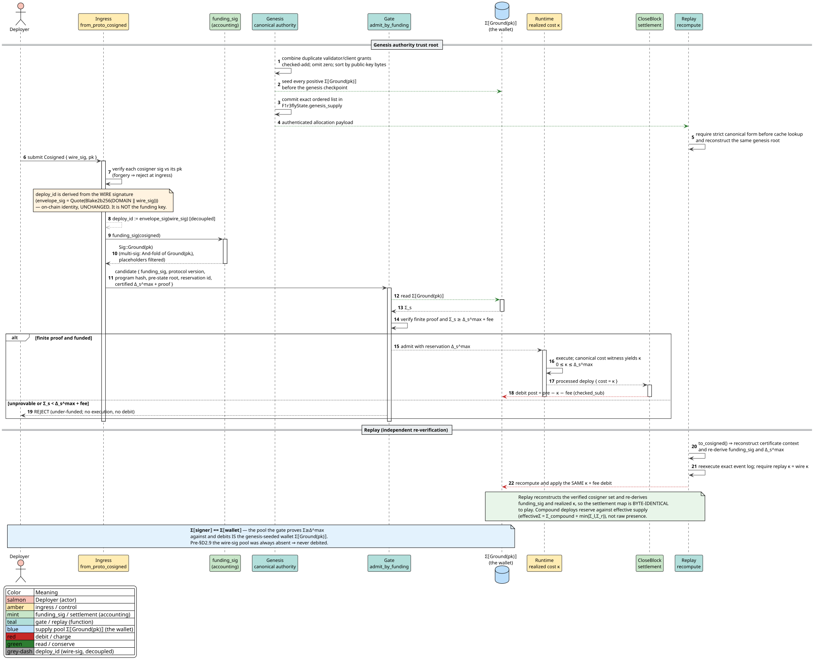
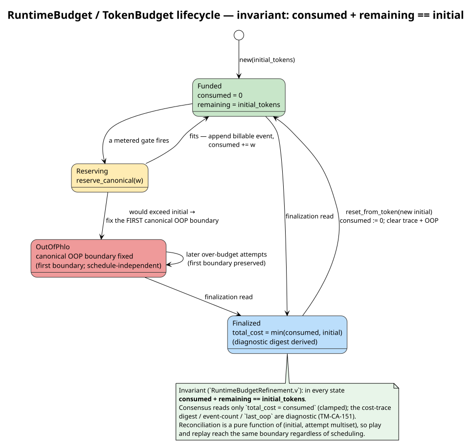

# Wallet-funded process lifecycle

## Purpose and scope

This guide follows native REV from persistent wallet custody into a process
purse, through cost certification and execution, and back to reusable custody.
It also explains how a wallet or purse is refilled, how linear capabilities
delegate spending without revealing a wallet key, which cryptographic values
bind each transition, and how Casper validators turn the result into consensus.

The normative semantic sources are
[*Cost-Accounted Rho Calculus*](https://github.com/F1R3FLY-io/publications/blob/main/cost-accounting/cost-accounted-rho.tex)
and
[*Continued Interactive GSLTs and the Cost Endofunctor*](https://github.com/F1R3FLY-io/publications/blob/main/cost-accounting-as-monad/continued-gslt-cost-v2.tex).
The production implementation refines their RevVault, wallet, purse, located
stack, and phlogiston roles onto F1R3node's existing `SystemVault`, RSpace, and
Casper architecture. It does not introduce a second token or ledger.



## Actors, assets, and authority

| Term | Concrete meaning |
| --- | --- |
| Wallet | Off-chain private-key custody plus the persistent on-chain `SystemVault` address controlled by that key |
| Wallet purse | Reusable on-chain REV balance at the wallet's vault address |
| Process purse | REV custody or prepaid linear cells associated with a signed or located authority lane |
| Funding slot | Persistent process purse derived from an unforgeable Rholang name |
| Deposit address | Public Base58 vault address to which anyone may transfer REV |
| Draw capability | Private key, first-class unforgeable name, or valid compound authority needed to spend a purse |
| Administrator | Installs process code, grant policy, and gateway identity |
| Sponsor | Wallet owner who chooses how much REV to transfer into a process purse |
| Gateway | Authenticated deployer permitted to activate a retained process capability |
| Proposer | Validator receiving the deterministic fee allocation |
| Validator | Independently certifies or replays the complete state transition |

A wallet is not a one-use token. The private key remains reusable until the
owner rotates or abandons it, and the corresponding on-chain purse persists
across deployments. A wallet can receive additional REV before, during, or
after another process executes. A credit concurrent with an already certified
execution does not enlarge that execution's fixed bound; it becomes available
at a later canonical admission boundary.

The on-chain purse contains an integer REV balance and its vault contracts. The
private key is never stored in the vault, block, certificate, or RSpace. A
funding slot similarly has a public deposit address, but its draw authority is
the first-class unforgeable Rholang name retained by the authorized process.
Knowledge of the public address alone permits deposits, not withdrawals.

## Cryptographic trust chain

### Key generation and storage

The node key generator creates a secp256k1 key pair. It stores the private key
as password-encrypted PKCS#8 PEM using OpenSSL AES-256-CBC, the public key as
PEM, and the uncompressed public key as hexadecimal text. File encryption
protects a key at rest; it does not replace filesystem permissions, password
handling, process isolation, or hardware-backed custody for valuable purses.
Rust key generation draws the 32-byte private scalar from the operating
system's cryptographic random source. Deterministic seeded client keys are for
fixtures only and must not control production custody.

The private scalar signs deploys and authorizes wallet debits but never appears
on chain. The public key may be published, used to verify signatures, and used
to derive the wallet's deposit address. Rotating a key requires an authorized
transfer of remaining custody to the new public-key address; changing an
application profile alone does not move REV. The native vault has no password
reset or privileged key-recovery path. Losing the only private key leaves its
custody inaccessible unless the owner installed a separate recovery contract
before the loss.

The important cryptographic representations are:

| Value | Encoding or derivation | Security role |
| --- | --- | --- |
| Wallet private key | Valid 32-byte secp256k1 scalar; encrypted PKCS#8 PEM or supported client keystore off chain | Authorizes deploy signatures and wallet debits |
| Wallet public key | 65-byte SEC1 uncompressed point, `0x04 || x || y` | Verifier identity and wallet-address input |
| Native deploy signature | DER-encoded ECDSA over a Blake2b-256 prehash | Authenticates the canonical deploy message |
| Ethereum-compatible deploy signature | Fixed-width 64-byte `r || s` ECDSA over an Ethereum-prefixed Keccak-256 prehash | Authenticates the same canonical message under `secp256k1:eth` |
| Wallet deposit address | Native prefix, 32-byte address hash, and four-byte Blake2b-256 checksum, Base58 encoded | Public destination identifier, not debit authority |
| Funding-slot capability | Consensus-generated `GPrivate` name retained in RSpace | Object capability for the slot's located authority |
| Funding-slot address | Keccak-256 of canonical `GPrivate` protobuf bytes, then native address framing | Public deposit identifier that does not reveal the capability |
| Reservation and certificate identifiers | Domain-separated Blake2b-256 commitments | Bind a fixed budget and witness to one program and pre-state |
| Byte-schedule digest | Domain-separated Blake2b-256 commitment to version and rates | Prevents validators from applying different byte tariffs |

### Deploy signatures and cosigned envelopes

Protocol-v6.1 clients construct a canonical intent, authorization policy, and
selected-member bitmap, then commit them into a 32-byte `DeployIdV6`. Each
selected principal signs a scheme-separated message containing that identity.
See [Protocol-v6.1 deploy identity and authority](../casper/theory/cost-accounting-impl/deploy-envelope-v6-1.md)
for the exact bytes and validation algorithm.

Production deploy algorithms are `secp256k1` and `secp256k1:eth`. Schnorr,
FROST, and Ed25519 have allocated wire identifiers but are consensus-inactive;
compiling an experimental feature cannot activate them.

For a cosigned deploy, the node:

1. canonicalizes each `(scheme, public key)` principal and orders principals by
   their encoded bytes;
2. rejects duplicate principals and duplicate underlying ground authorities;
3. binds the complete policy and exact selected-member bitmap into
   `DeployIdV6`;
4. requires witnesses to correspond exactly to set bitmap bits and verifies
   each witness under its declared active scheme;
5. checks `AllOf` or an explicit $`M`$-of-$`N`$ threshold; and
6. derives Rholang authority and RevVault funding only from selected verified
   members.

An empty threshold placeholder can describe the membership set but cannot make
the corresponding wallet pay. This prevents an attacker from naming a victim's
public key as an unsigned funding source.

For `secp256k1`, the signing digest is Blake2b-256 of the canonical v6.1
signing preimage and the signature is strict minimal low-`s` DER. For
`secp256k1:eth`, the digest is Keccak-256 after applying the Ethereum personal
message prefix to the same domain-separated preimage, and the signature is the
fixed-width low-`s` value $`r\mathbin\|s`$. Validators derive the algorithm
from the policy member and never probe alternate encodings.

The stable funding identity is the selected principal's key-family ground
authority, not the per-deploy signature. Consequently the same signer reaches
the same purse across deployments, and native and Ethereum secp256k1 signing
for the same key cannot double-count that purse. Multiple selected funders form
one canonical compound authority; an unsigned policy member never contributes
authority or funding.

### Vault-address derivation

The active public-key wallet path requires a valid 65-byte, uncompressed
secp256k1 point. `VaultAddress::from_public_key` derives the native address
by Keccak-hashing the 64-byte point body, taking its final 20 bytes as the
Ethereum-style address, Keccak-hashing those 20 bytes into the native 32-byte
key hash, prepending the four-byte native coin/version prefix, appending the
first four bytes of the Blake2b-256 payload checksum, and Base58 encoding the
40-byte result. `VaultAddress::parse` verifies length, prefix, and checksum.

An unforgeable funding slot uses `VaultAddress::from_unforgeable`. It hashes the
canonical protobuf encoding of the `GPrivate` name, then applies the same native
prefix, checksum, and Base58 framing. The resulting string is safe to publish as
a deposit address because an address is not an executable Rholang name.

Address derivation is deterministic identification, not authorization.
`SystemVault.deployerAuthKey` obtains the verified deployer's public key from
`rho:system:deployerId` and creates an unforgeable `AuthKey` scoped to that
wallet. `SystemVault.unforgeableAuthKey` creates the corresponding capability
for an unforgeable-owned vault. Transfers succeed only through the appropriate
authentication path.

### Reservation and certificate commitments

State-bound admission derives a reservation identity from the protocol-selected
deployment identity. Protocol v6 has one formula for both prepared and
provisional admission paths:

```text
reservation_id := Blake2b256(
    "f1r3node:vault-cost-reservation:v2" ||
    pre_state_root ||
    program_hash ||
    DeployIdV6
)
```

This binding prevents two threshold envelopes with the same empty member-zero
witness from sharing a reservation. Replay independently canonicalizes the
program and rejects a certificate unless its reservation matches the verified
pre-state root, program hash, and `DeployIdV6` before any vault or RSpace
mutation.

Pre-v6 replay remains byte-compatible with both historical paths. Prepared
reservations use the `v1` domain followed by the pre-state root, program hash,
and primary signature. The older provisional path uses Blake2b-256 of the
primary signature alone. These legacy forms are accepted only for legacy
envelopes; neither is a valid protocol-v6 reservation.

Fee authority is versioned by the same boundary. Legacy fee regions and event
identities retain the primary-signature `v2` encoding. Protocol v6 derives a
region scope with `f1r3node:cost-accounted-rho:deploy-scope:v1` and an event
identity with `f1r3node:cost-accounted-rho:fee-event:v3`, each followed by the
32-byte `DeployIdV6`. The private-name random-number generator (RNG) likewise uses
`f1r3node:user-deploy-unforgeable:v6 || DeployIdV6`; legacy execution retains
the original public-key-and-timestamp seed.

Authority protocol version 8 derives the certificate identifier with a separate
domain. The preimage commits to:

- protocol version;
- canonical program hash;
- pre-state root and reservation identity;
- demand proof and physical allocation;
- located-stack reservations;
- fee allocation and recipient;
- byte-schedule version and digest;
- byte-cost bound; and
- component-wise byte allocation.

The witness carries that certificate identifier plus the exact compute events,
byte events, physical draws, settlements, born stacks, and adjacent roots. A
change to any certificate field invalidates the witness binding.

The byte schedule has its own Blake2b-256 digest over a domain separator,
schedule version, and all tariff rates. Validators therefore agree on both the
evidence schema and the quantitative tariff.

The cost certificate is consensus data, not an X.509 certificate. P2P TLS 1.3
protects node-to-node transport, a deploy signature authenticates payer intent,
and a validator block signature authenticates the proposed block. None of those
allows a receiver to trust peer-supplied settlement or merge evidence without
local replay: every validator reconstructs the certificate, witness, and state
roots independently.

The node's TLS certificate key, validator block-signing key, wallet signing key,
and unforgeable Rholang capability have different trust domains. Reusing one as
another does not grant authority. TLS authenticates and encrypts a connection;
it neither proves that a wallet funded a process nor authorizes a vault debit.

### Unforgeable capabilities and linear ownership

An Rholang `new` name is not a public-key or confidentiality secret. Validators
can know its deterministic byte identity. Rholang source has no
bytes-to-`GPrivate` constructor.

Protocol 6 binds the private-name stream to the complete authenticated deploy
envelope. The legacy key-and-timestamp preview API therefore fails closed.
A process can publish a capability in one deploy. A later deploy can use
dependent data without a circular deployment identity.

A contract can publish its derived vault address while it retains the name as
a first-class process value. Only code that receives that value can use the
corresponding authority.

Consensus witnesses carry canonical authority structure so validators can
replay event attribution. Seeing a serialized name identity in evidence is not
the same as receiving that name in a Rholang continuation. Likewise, an
`authorityPresentations` entry can select a physical compound partition only
for authority already present in the normalized causal event; it cannot add a
new authority region to the program. These two restrictions prevent serialized
identity bytes from becoming ambient draw authority.

The lollipop operator $`D\multimap S`$ represents a linear authority
transformation: satisfying source obligation $`D`$ releases continuation
authority $`S`$. It does not transfer the sponsor's wallet private key. The
administrator can give a gateway the narrow capability to trigger one funded
continuation while the sponsor retains general control of the wallet. Passing
the capability transfers the delegated process authority according to the
linear program; copying a private name through an unauthorized public path is
not permitted by the process design.

## Lifecycle overview



### 1. Create or recover a wallet

The owner creates or recovers a private key off chain. Its public key determines
the native vault address. `SystemVault.findOrCreate` installs the per-address
vault contracts when they do not yet exist; it does not mint or credit REV.

Genesis-funded accounts already have custody established by the authenticated
genesis ceremony. A newly created wallet begins with zero unless another vault
transfers REV to it or an authorized protocol operation mints initial custody.

### 2. Deposit or refill REV

A refill is an ordinary conserving transfer from a source vault to the wallet's
public address:

```math
V_{source}'=V_{source}-u,
\qquad
V_{wallet}'=V_{wallet}+u.
```

The amount $`u`$ must be positive and the source must authenticate the debit.
The destination vault must exist before the purse deposit. The ordinary
single-transfer client ensures that registration in the same deployment. The
atomic batch path instead validates the complete request and reserves the
source total before it creates any missing destination, so a rejected batch
cannot leave an empty target vault behind.

A wallet can be refilled repeatedly. A refill creates no new wallet and no new
currency. Transfers preserve total REV and reject underflow, overflow, invalid
addresses, or an invalid auth key.

### 3. Install a process grant

The administrator installs an authenticated public trigger and fresh outer and
continuation names, derives and publishes both deposit addresses, and retains
the names inside the persistent trigger closure. This scaffold is paid by the
installer's ordinary deploy purse. It does not yet install the located
lollipop: newly created empty purses are candidate state and cannot fund work in
the same deployment that created them.

For a gateway-operated agent, the trigger resolves
`rho:system:deployerId` to the verified submitter's public key. Only after the
configured gateway calls a grant whose two purses were funded in an earlier
finalized state does the handler instantiate `entry -o slot` and signal
`entry`. The outer purse pays the activation rendezvous and the continuation
purse pays the agent body. Keeping these lanes distinct prevents surplus in one
lane or grant from silently rescuing another.

### 4. Fund the process purse

The sponsor signs one authenticated `SystemVault.transferBatch` from the sponsor
vault to the outer and continuation public addresses. This moves existing REV
custody atomically:

```math
V_{wallet}'=V_{wallet}-u_o-u_c,
\qquad
V_{outer}'=V_{outer}+u_o,
\qquad
V_{slot}'=V_{slot}+u_c.
```

The contract validates the entire vector, rejects duplicate destinations and
checked-arithmetic failures, proves the source can cover the sum, and splits
the source purse once before creating or crediting either destination. A
rejected batch changes neither balances nor destination-vault existence.

For a prepaid located stack, the contract then moves the authorized custody into
linear cells before publishing the stack. The physical move and byte-charged
RSpace production share one checkpoint. A failure publishes neither a partial
stack nor a partial debit.

Funding is not activation. The sponsor can fund a slot before the gateway runs
it, top it up later, or stop funding it. The gateway sees only the grant
capability and cannot debit arbitrary sponsor custody.

### 5. Submit or activate the process

The gateway signs the trigger deploy. Signature validation occurs before user
execution. An unauthorized caller remains outside the private continuation
channel and cannot consume the slot. Its attempted public work is attributed to
its own envelope authority rather than to the protected slot.

The deploy carries no self-declared gas limit. Validators derive available
authority from the authenticated merged pre-state and from only those located
resources the program can prove it holds.

### 6. Certify the maximum

The structural analyzer produces a finite upper bound when the submitted term
is statically closed. If authenticated ambient state or received code makes the
syntax alone insufficient, state-bound admission executes the canonical
candidate sequence in scratch state under finite, pre-state-backed capacity.

For every lane $`a`$, certification requires:

```math
B_A(a)+B_Q(a)+F(a)\leq\Sigma(a).
```

The certificate binds the maximum. If any lane is short, the candidate is
rejected before retained execution. Surplus in another lane is not ambient
fallback authority.

### 7. Execute compute and storage work

Compute and storage accounting are coordinated at the RSpace linearization
points:

```text
reserve produce or consume introduction bytes before its mutation
select a complete atomic match
reserve every matched authority component
reserve one COMM unit
reserve delivered payload and committed trace bytes
record the canonical events
commit the RSpace transition
```

Persistent operations reuse one stable introduction identity across internal
retries. Independent operations can arrive in different scheduler orders, but
their canonical event multiset, total cost, verdict, and state root must agree.

### 8. Settle exact cost

The retained witness determines physical authority settlement $`\kappa(a)`$ and
byte settlement $`Q(a)`$. `SystemVault.applyCost` lexically reserves the
certificate maximum, burns the exact cost, transfers the proposer fee, and
returns the unused remainder before the call completes. Located stack pops and
the retained RSpace root commit in the same node checkpoint.

```math
\Sigma'(a)=\Sigma(a)-\kappa(a)-Q(a)-F(a).
```

The apparent precharge is a proof and transaction boundary, not a permanently
visible debit of the maximum. If the exact charge is smaller than the bound, the
difference remains available. There is no separately minted refund.

### 9. Replay and finalize

The proposer includes certificate, witness, status, and roots in the processed
deploy. Every validator independently reconstructs the envelope, normalizer
environment, byte schedule, events, allocation, fee, settlement, and post-state
root. A mismatch is block invalidity.

Casper may retain only state effects whose exact provenance survives merge.
Finalization certificates keep their majority and clique calculation, while the
state floor and last-finalized block advance only through lineage that preserves
already certified effects. Applications wait for canonical deploy finalization,
not merely first inclusion, before treating an off-chain action as complete.

### 10. Refill, reuse, withdraw, or delegate

After settlement, all remaining wallet and slot custody persists. The owner can:

- transfer more REV into the same wallet;
- top up the same process purse before its spending capability is consumed;
- fund another process purse;
- transfer unreserved wallet custody elsewhere;
- let a later authorized activation consume remaining slot custody when the
  installed grant is explicitly reusable; or
- delegate the retained linear capability through a process that explicitly
  transfers it.

A top-up concurrent with step 7 does not modify that execution's certificate.
The running process either succeeds within its fixed maximum or fails. The new
credit is visible only to an execution certified against a state that includes
the transfer.

A wallet owner can withdraw from a public-key purse by signing a normal transfer
to another registered address. A sponsor cannot withdraw from a funding slot
merely because that sponsor deposited into it: the slot's unforgeable name, not
the deposit history, controls debits. A refundable grant must install an
explicit recovery branch before funding, retain the slot capability, authenticate
the recovery authority, and keep recovery mutually exclusive with process
consumption. The planned downstream `FundingSlotAPI` covers installation,
deposit, and gateway activation. It does not synthesize a sponsor-reclaim
capability. The downstream client integration remains pending.

## Minting, fees, and supply conservation

`MakeMint` supplies the underlying purse machinery, but ordinary Rholang code
cannot mint native REV. `SystemVault.protocolMint` requires the system authority
token and is confined to authenticated genesis or proof-of-stake system
execution. Epoch minting is idempotent for its protocol identity.

Wallet transfer, process funding, top-up, reservation, refund, fee transfer,
exchange, and withdrawal move or burn existing value. Excluding explicit
protocol mint and slash burn:

```math
\sum_a\bigl(V'(a)+L'(a)\bigr)+\operatorname{burnedCost}
=\sum_a\bigl(V(a)+L(a)\bigr)+\operatorname{protocolMinted},
```

where $`V(a)`$ is native vault custody and $`L(a)`$ is prepaid located
authority. A fee is separately conserving:

```math
\operatorname{payerDebit}_{fee}=\operatorname{proposerCredit}_{fee}.
```

The blessed Exchange swaps already-existing carriers. It does not create REV,
rescue an underfunded certificate, or serve as a hidden intermediate fee ledger.

## Failure and concurrency behavior

| Failure or race | Required result |
| --- | --- |
| Invalid deploy signature | Reject before normalization or user execution |
| Duplicate or unsigned funding signer | Reject; never derive victim authority |
| Invalid vault auth key | No source debit and no destination credit |
| Invalid, duplicate, or underfunded funding batch | Reject before source debit or destination-vault creation |
| Insufficient wallet or slot custody | Reject admission without committed user state |
| Arithmetic or byte-schedule failure | Reject before the affected RSpace mutation |
| Competing operations on one stack | Exactly one canonical physical allocation may consume each cell |
| Top-up races with execution | Top-up conserves value but cannot expand the in-flight certificate |
| Parser failure before execution | Restore the deployment checkpoint. Publish no cost witness. |
| Reducer failure after earlier work | Restore user state and linear custody. Retain attempted compute and byte costs in the final witness. |
| Missing replay history | Treat as a local recoverable fault, not peer misbehavior |
| Concurrent sibling effects overdraw one purse | Deterministically retain only the funded exact effect set |

## Application workflow

Generate the node-side encrypted wallet material with:

```bash
cargo run -p node -- keygen ./user-keys
```

The downstream Python client design accepts a supported Ethereum keyfile or a securely supplied raw key.
It does not directly consume the node CLI's encrypted PEM.
Keep the key in its native keystore path unless a controlled migration is necessary.
The following non-executable pseudocode shows the intended separation of duties.
It uses the planned `FundingSlotAPI` and `VaultAPI` integrations.
Canonically finalize each returned deploy identifier.
Check its transfer result before the next dependent operation.

```python
from f1r3fly.cost_accounting import (
    CostAuthorityEvidence,
    FundingSlotAPI,
    FundingSlotGrant,
)
from f1r3fly.crypto import PrivateKey
from f1r3fly.deploy import find_deploy_in_block
from f1r3fly.vault import VaultAPI

user_key = PrivateKey.from_eth_keyfile("user-key.json", password="...")
source_key = PrivateKey.from_eth_keyfile("source-key.json", password="...")
user_vault = user_key.get_public_key().get_vault_address()
source_vault = source_key.get_public_key().get_vault_address()

vaults = VaultAPI(validator_client, shard_id="root")
initial_refill_id = vaults.transfer_ensure(
    source_vault,
    user_vault,
    100_000,
    source_key,
)

grant = FundingSlotGrant(
    trigger_channel="agent:7:trigger",
    slot_address_channel="agent:7:slot-address",
    outer_address_channel="agent:7:outer-address",
    completion_channel="agent:7:complete",
    gateway_public_key=gateway_key.get_public_key().to_bytes(),
)

readonly_slots = FundingSlotAPI(readonly_client, shard_id="root")
validator_slots = FundingSlotAPI(validator_client, shard_id="root")
install_id = validator_slots.install(
    grant,
    continuation_source,
    administrator_key,
)
outer_address, slot_address = readonly_slots.addresses(
    grant,
    finalized_install_hash,
)
fund_id = validator_slots.fund(
    grant,
    user_vault,
    outer_amount=25_000,
    continuation_amount=50_000,
    key=user_key,
    resolved_addresses=(outer_address, slot_address),
)

wallet_refill_id = vaults.transfer_ensure(
    source_vault,
    user_vault,
    25_000,
    source_key,
)
slot_top_up_id = validator_slots.fund(
    grant,
    user_vault,
    outer_amount=5_000,
    continuation_amount=10_000,
    key=user_key,
    resolved_addresses=(outer_address, slot_address),
)
trigger_id = validator_slots.trigger(
    grant,
    gateway_key,
    request_source='("run-42", 7)',
)

trigger_block = readonly_client.show_block(finalized_trigger_block_hash)
trigger_info = find_deploy_in_block(trigger_block, trigger_id)
evidence = CostAuthorityEvidence.from_processed_deploy(trigger_info)
assert evidence.pre_state_root == trigger_info.preStateHash
assert evidence.post_state_root == trigger_info.postStateHash
```

`initial_refill_id` and `wallet_refill_id` both credit the same reusable wallet;
`fund_id` and `slot_top_up_id` each credit the same pair of outer and
continuation purses in one transaction before the one-shot capability fires.
Creating either top-up does not replace either destination. The application
checks the batch result, observes both balances at the corresponding finalized
root, and waits for the trigger's finalization before performing an irreversible
off-chain side effect. A reusable or refundable process needs an explicitly
installed reusable or recovery capability; another deposit cannot recreate a
consumed lollipop.

The read-only client resolves the two addresses at the finalized installation
root. The validator client receives that immutable pair through
`resolved_addresses` and submits the state-changing batch; it does not attempt
an exploratory query on a validator endpoint.

The gRPC `DeployInfo` view exposes the protocol-v8 funding certificate,
authority-cost witness, adjacent state roots, and admission status so clients
can construct a typed `CostAuthorityEvidence` view. A node/client pair must use
the same generated protobuf schema. The HTTP deploy-summary view intentionally
remains a scalar projection; applications must not infer exact settlement from
`cost` without the gRPC evidence.

## Security checklist

- Keep wallet, administrator, gateway, and validator private keys in separate
  trust domains.
- Never place a private key in logs, public channels, certificate metadata, or
  application URLs. Avoid copying serialized slot identities into application
  logs or URLs even though the protocol does not treat those bytes as a secret.
- Publish deposit addresses, not first-class Rholang draw capabilities.
- Verify the complete cosigned envelope and threshold before deriving funding
  authority.
- Treat authority presentations as signed normalization inputs, not balances.
- Reject unknown protocol versions, byte schedules, hash domains, event kinds,
  malformed ordering, arithmetic overflow, or root mismatch.
- Confirm destination vault registration and terminal transfer state before
  advertising a purse as funded.
- Keep each grant's slot distinct so one user or agent cannot consume another's
  custody.
- Wait for canonical deploy finalization before off-chain effects.
- Rotate keys by transferring custody to a new authenticated address; changing
  an application record alone does not move REV.

## Implementation and proof map

| Concern | Native implementation | Formal and executable evidence |
| --- | --- | --- |
| Signature and threshold verification | `crypto::signatures::signed::Cosigned`; Casper protobuf ingress | signature unit/property tests; multi-signature pipeline tests |
| Wallet and slot address derivation | `VaultAddress`; `rho:vault:address`; `vault_payer` | address and vault-payer regressions |
| Wallet transfer and refill | `SystemVault.rho` `transferBatch` | SystemVault exact, rejected, invalid, and duplicate batch tests. Loom races. Downstream client integration remains pending. |
| Located purse and lollipop | cost signatures, regions, stack syntax, staged funding-slot client | `FundingSlotBootstrap.v`; `FundingSlotBootstrap.tla`; `WalletFundedLollipop.v`; `WalletFundedLollipop.tla`; cross-deploy tests |
| Compute authority | `accounting/authority.rs`; RSpace `CommObserver` | `AtomicCommAccounting.v`; TLA+ and RSpace property tests |
| Storage and byte cost | `accounting/byte_accounting.rs`; proposal/replay observers | `VaultBackedByteAccounting.v`; safe and unsafe TLA+ models; Loom races |
| Certificate and witness | authority protocol v8; `CasperMessage.proto` | golden vectors, malformed-evidence tests, proposal/replay equality |
| Atomic settlement | `SystemVault.applyCost`; Casper checkpoint and acceptance | `AtomicVaultSettlementRefinement.v`; `EvaluationTransactionIsolation.v`; rollback tests |
| Merge and finality | exact state-effect provenance, merge algebra, finalized floor | deploy-recovery, merge-algebra, and finalized-floor formal suites and integration tests |

See [Cost-accounted Rholang](13-cost-model.md) for the two-dimensional cost
semantics, [Vaults and Tokens](12-vaults-and-tokens.md) for contract APIs,
[End-to-end native settlement](../casper/theory/cost-accounting-impl/end-to-end-authority-settlement.md)
for the architecture contract, and
[Formal Verification of Cost-Accounted Rho](../casper/theory/cost-accounted-rho-verification.md)
for the proof catalog.

## References

1. J.-Y. Girard, “Linear Logic,” *Theoretical Computer Science* 50 (1987),
   1–101. [doi:10.1016/0304-3975(87)90045-4](https://doi.org/10.1016/0304-3975(87)90045-4).
2. L. G. Meredith and M. Radestock, “A Reflective Higher-order Calculus,”
   *Electronic Notes in Theoretical Computer Science* 141(5) (2005), 49–67.
   [doi:10.1016/j.entcs.2005.05.016](https://doi.org/10.1016/j.entcs.2005.05.016).
