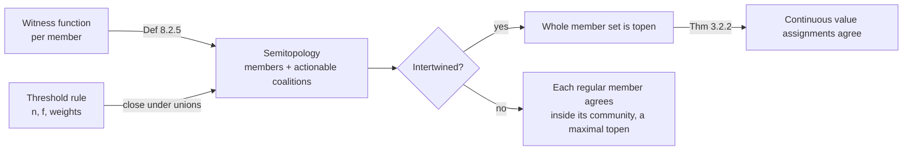

# Semitopology Glossary

> This glossary is **load-bearing** for the coalition vocabulary of the
> replication boundary. Design records and reviews cite its anchors. The
> shared boundary terms stay in [docs/Glossary.md](../Glossary.md).

The primary source is Murdoch J. (Jamie) Gabbay, "Semitopology: decentralised
collaborative action via topology, algebra, and logic",
[arXiv:2402.03253](https://arxiv.org/abs/2402.03253), version 3 of 7 July
2025. Section and definition numbers below refer to that version. The shorter
paper [arXiv:2303.09287](https://arxiv.org/abs/2303.09287), version 5, covers
chapters 2 to 6 with the same definitions. Giuliano Losa co-wrote an earlier
version of that paper.

Each entry below pins one canonical name to a **Preferred usage** statement.
The repository uses American spelling. The paper uses British spelling, for
example "neighbourhood".

## Scope

Semitopology describes which sets of participants can act together. It does
not model Byzantine behavior. Remark 23.3.1 lists that question as future
work. A semitopological property is therefore a structural condition on a
coalition structure. It is not a proof of Byzantine fault tolerance.

## Canonical Terms

### Semitopology

A semitopology is a set of points with a set of open sets. The empty set and
the whole set are open. A union of open sets is open (Definition 1.2.2).

**Preferred usage.** Use "semitopology" for the framework and for one
structure. In boundary documents, the points are the members of a shard.
*Distinguish from* a topology, which also requires that the intersection of
two open sets is open.

### Actionable coalition

An actionable coalition is a set of participants that can act together to
update their local state (section 1.2). It is an open set of the
semitopology.

**Preferred usage.** Use "actionable coalition" in prose and "open set" in
formal statements. A quorum certificate signer set, an FTM-observed set, a CBC
clique above the threshold, and a Cordial Miners supermajority are actionable
coalitions.
*Avoid*: "quorum" as a synonym. See [quorum system](#quorum-system).

### Value assignment

A value assignment maps each point to a value in a discrete set of values
(Definition 2.1.3(2)). In a replication medium, the value of a member is its
decision, for example the commit that it accepts at a height.

**Preferred usage.** Use for the decisions of all members at one instant.

### Continuous value assignment

A value assignment is continuous at a point when an open neighborhood of the
point has the same value as the point (Definition 2.2.1, Lemma 2.2.4). The
member then agrees with some actionable coalition that contains it.

**Preferred usage.** Use "continuous at `p`" for a member that acts in
agreement with one of its coalitions.

### Transitive set

A set `T` is transitive when any two open sets that intersect `T` also
intersect each other (Definition 3.2.1(1)). Theorem 3.2.2 shows that a
continuous value assignment is constant on a transitive set.

**Preferred usage.** Use for a set of members that cannot reach two
different continuous decisions.

### Topen

A topen is a nonempty transitive open set (Definition 3.2.1(2)). A maximal
topen is a topen that no larger topen contains (Definition 3.2.1(3)).

**Preferred usage.** Use "topen" for an actionable coalition whose members
always agree. Use "maximal topen" for the largest such coalition.
*Avoid*: "transitive coalition" as a new synonym.

### Intertwined

Two points are intertwined when every open neighborhood of one intersects
every open neighborhood of the other (Definition 3.6.1). A semitopology is
intertwined when all of its points are pairwise intertwined (Notation 3.6.5).

**Preferred usage.** Use "intertwined" for the quorum intersection property.
A threshold rule that makes any two coalitions intersect gives an intertwined
semitopology (Example 2.1.4(7)).

### Closure

The closure of a set `P` is the set of points whose every open neighborhood
intersects `P` (Definition 5.1.2). Remark 5.3.3 notes that consensus in a
coalition often spreads to its closure.

**Preferred usage.** Use for the members that a decided coalition can
convince without a new vote.

### Community

The community of a point `p` is the open interior of the set of points that
are intertwined with `p` (Definition 4.1.4(1)).

**Preferred usage.** Use for the largest open region that can agree with one
member.
*Distinguish from* a [shard](../Glossary.md#shard-replication-binding). A
shard is a configuration choice. A community is a property of the
coalition structure.

### Regular point

A point is regular when its community is a topen neighborhood of the point.
A point is weakly regular when its community is an open neighborhood of the
point. A point is quasiregular when its community is nonempty
(Definition 4.1.4(3) to (5)).

**Preferred usage.** Use "regular member" for a member that is inside a
topen. The community of a regular point is a maximal topen (Theorem 4.2.6).
The space is regular when it partitions into disjoint topens (Corollary 4.3.3).

### Conflicted point

A point `p` is conflicted when it is intertwined with two points that are not
intertwined with each other. Otherwise `p` is unconflicted (Definition 6.1.1).
A point is regular when it is weakly regular and unconflicted
(Theorem 6.2.2).

**Preferred usage.** Use for a member that sits between two regions that can
disagree.

### Atom

An atom is a minimal nonempty open set (Definition 9.5.7).

**Preferred usage.** Use for a smallest actionable coalition.

### Kernel

The kernel of a point is the union of the atoms in its community
(Definition 10.1.2).

**Preferred usage.** Use for the smallest coalitions that settle the decision
of a community.

### Witness function

A witness function gives each point a finite set of nonempty witness sets
(Definition 8.2.2). A witness set is a set of participants whose agreement
convinces the point.

**Preferred usage.** Use for a description of coalitions member by member.
The proposed `CoalitionStructure` type of the boundary uses this form.
*Distinguish from* a quorum slice in the Stellar Federated Byzantine
Agreement model, which is a special case (section 23.2).

### Blocking set

A set blocks a point when it intersects every witness set of the point
(Definition 8.2.4(1)).

**Preferred usage.** Use for a set of members that can stop a member from
acting.

### Enabling set

A set enables a point when it contains at least one witness set of the point
(Definition 8.2.4(2)).

**Preferred usage.** Use for a set of members that can let a member act.

### Witness semitopology

The witness semitopology of a witness function has as open sets the sets that
enable each of their own members (Definition 8.2.5).

**Preferred usage.** Use for the semitopology that a `CoalitionStructure`
value generates.

### Product semitopology

The product semitopology of two semitopologies has as points the pairs of
points. Its open sets are unions of products of open sets (Definition 7.1.2).

**Preferred usage.** Use when one argument covers two coalition structures
together. A node does not combine two shards into one product.

### Three-valued valuation

A three-valued valuation maps each point to true, both, or false
(Definition 18.1.2). Chapter 20 states intertwinedness and regularity as
logical properties of these valuations.

**Preferred usage.** Use for the logic of semitopology. Chapter 21 reduces
some checks to satisfiability problems.

### Quorum system

A quorum system is a set of pairwise intersecting sets (Example 2.1.4(7)).
The closure of a quorum system under unions is an intertwined semitopology.

**Preferred usage.** Use "quorum system" only for the classical structure.
*Distinguish from* a semitopology, which does not require that all coalitions
intersect, and which is closed under unions (section 23.2).

### Fail-prone system

A fail-prone system is a set of sets of processes that can fail together. A
dissemination quorum system for it requires that two quorums intersect
outside every fail-prone set (section 23.2).

**Preferred usage.** Use when a document states Byzantine fault assumptions.
Semitopology alone does not state these assumptions.

### Coalition logic

"Coalition logic" is not a term of this framework.

**Preferred usage.** Write "semitopology" or "Gabbay's semitopology".
*Avoid*: "coalition logic" for this framework.
*Distinguish from* Coalition Logic by Marc Pauly, a modal logic of the
strategic power of coalitions in games.
