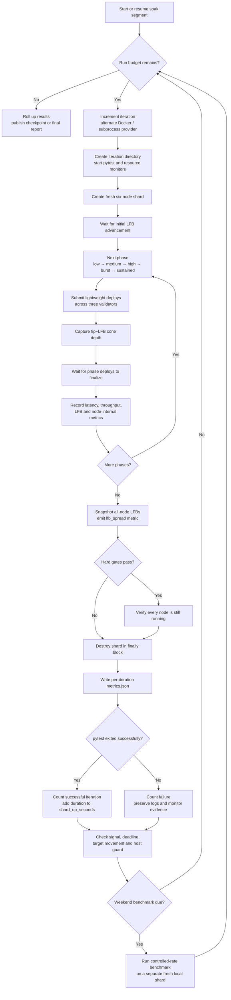

# Soak Benchmarks (EPIC-010)

The 60-hour weekend merge-recovery soak (Friday 19:30 Pacific → Monday 07:30
Pacific) produces week-over-week benchmark metrics instead of pass/fail only.
The Mon–Thu 22h soaks run the same suite against `dev` but are not benchmark
runs — see [Weekend vs daily](#weekend-vs-daily). Design history and decisions:
[work log](work-logs/task-EPIC-010-2026-07-15T20-57Z.md), story US-004 in
[UserStories.md](UserStories.md).

## Soak lifecycle and terminology

A soak is a repeated lifecycle test, not continuous monitoring of one standing
shard. The terms used by the workflow, artifacts, badges, and dashboard have
distinct scopes:

| Term | Meaning |
|---|---|
| **Run** | One scheduled or manually dispatched soak against one pinned node commit. Daily runs target `dev`. Weekend runs target `master`. The node image is built once and reused throughout the run. |
| **Segment** | A wall-clock slice of the same run, used to publish checkpoints. Segments share state, output, counters, and iteration numbering. A new segment does not create a new run. |
| **Iteration** | One invocation of the integration load test using a newly created six-node shard. It covers shard creation, health readiness, every load phase, finalization and convergence checks, telemetry collection, and teardown. |
| **Phase** | One load level inside an iteration. All five phases run in order against the same shard. |

### Iteration lifecycle



Each iteration alternates providers, beginning with Docker and then subprocess.
Both providers exercise the same test contract. This sequence detects
provider-specific startup, networking, cleanup, and telemetry failures. The
fresh shard contains:

- one bootstrap node
- four bonded genesis validators
- one readonly node

The first three validators receive deploy submissions. The fourth validator
participates in consensus so concurrent proposals create realistic sibling
blocks and multi-parent merges. Before load begins, the test requires an
initial last-finalized-block (LFB) advancement to prove that the shard is
making progress.

The iteration then runs this fixed load sequence. Rated phases submit
lightweight `@N!(N)` contracts. These contracts stress deploy admission,
proposal, block processing, and finalization rather than Rholang execution.

| Phase | Load | Duration | Workers | Planned deploys |
|---|---:|---:|---:|---:|
| low | 1 deploy/s | 30s | 1 | 30 |
| medium | 5 deploys/s | 20s | 3 | 100 |
| high | 10 deploys/s | 15s | 3 | 150 |
| burst | immediate burst | — | 3 | 32 |
| sustained | 4 deploys/s | 300s | 3 | 1,200 |
| **Total** | | | | **1,512** |

After every phase, the harness waits for tracked deploys to finalize. The
harness records latency percentiles, submission rate, LFB advance, cone depth,
and per-validator node metrics. After the sustained phase drains, the harness
records each node's LFB and emits
`SOAK_METRIC name=lfb_spread value=<max-LFB-minus-min-LFB> phase=drain`.

An iteration passes only when the complete contract succeeds:

1. The fresh shard starts and advances its LFB.
2. No deploy submission fails.
3. Every submitted deploy finalizes within the configured timeout.
4. All six nodes reach an LFB spread of five blocks or less within the budget.
5. Every node is still active after the load.

The harness destroys the shard after a pass or a failure. The driver then
writes `iteration-NNNNN-<provider>/metrics.json`. This file contains timestamps,
the provider, pytest counts, the exit code, resource peaks, latency, proposal
errors, and registry metrics.

For a failed iteration, the driver keeps diagnostic logs and monitor files. The
driver waits for 30 seconds and usually starts a new shard. A host protection
breach ends the run instead.

The driver reads checkpoint and finalize signals only between iterations. Thus,
these signals do not interrupt an active lifecycle. A segment deadline can stop
an active pytest process. The driver records `deadline.txt` and exit code 124
instead of a normal test failure.

On weekend runs only, every fourth iteration is followed by a separate active
benchmark segment. This benchmark creates another fresh local shard and applies
a fixed-rate workload. It records latency, throughput, finalization, and RSS
measurements before it removes the shard. The benchmark is separate from the
preceding iteration and `shard_up_seconds`. Its results populate the run's
`active` metrics.

`shard_up_seconds` includes only the duration of iterations that passed the
complete lifecycle. A failed iteration can run all six nodes and produce much
telemetry. However, it adds zero because the shard did not satisfy the complete
health contract. Thus, the dashboard stability value is an iteration success
rate. It is not the availability of a long-lived deployment.

The node-side orchestrator is
[`scripts/run-merge-recovery-soak.sh`](../scripts/run-merge-recovery-soak.sh).
The test contract and phase definitions live in
[`test_load.py`](https://github.com/F1R3FLY-io/system-integration/blob/dev/integration-tests/test/tests/custom/test_load.py)
in the system-integration repository.

## Where to look

- **Trend dashboard** (charts, per-provider split, run links):
  <https://f1r3fly-io.github.io/f1r3node-rust/> — two tabs, Weekend and Daily,
  each showing its own verdict on the tab button so both series are readable
  without clicking through.
- **Weekly email alert**: plain-text summary with the verdict and dashboard
  links, sent via OCI Notifications when the soak concludes.
- **Per-run detail**: the `merge-recovery-soak-*` artifact on the workflow run
  (iteration metrics, benchmark segments, logs, `report/` with
  `weekly-summary.json`, `verdict.json`, `badge.json`, `perf-report.md`).
- **README badges**: four shields.io *endpoint* badges, all generated from the
  same `verdict.json` / `weekly-summary.json` the dashboard renders, so a badge
  cannot disagree with the page behind it:

  | Badge | Endpoint file | Producer |
  |---|---|---|
  | `soak · master` | `data/badge-soak.json` | `badge.json` |
  | `soak · dev` | `data/badge-soak-daily.json` | `badge.json` |
  | `stability` | `data/badge-stability.json` | `badge-stability.json` |
  | `perf` | `data/badge-perf.json` | `badge-perf.json` |

  `stability` is the share of iterations that completed a full bring-up → load →
  finalize cycle — a success rate, deliberately not called uptime, since the
  soak creates a fresh shard per iteration rather than watching a standing
  deployment. Its colour bands are absolute and advisory; the release gate is
  relative (week-over-week) and stays with the soak verdict, so 100% stability
  alongside a `regress` verdict is coherent. `perf` is always blue: a readout,
  not a judgement, because absolute latency and throughput have no threshold
  here.

  There are no CI badges. Per-commit build status is already rendered on the
  repository home page and in pull requests; the badge row is reserved for the
  soak signal, which has no other surface.

Both series publish to Pages, into separate files — `history.json` and
`history-daily.json`, each with its own `latest-summary`, `latest-verdict`,
`latest-report` and `badge-soak`. They are kept apart so the week-over-week
regression gate never compares a variable-length daily against the fixed 60h
weekend baseline. A Pages deploy replaces the whole site, so whichever soak
publishes carries the other series forward untouched; a transient fetch failure
aborts the deploy rather than publishing a site with a series missing.

Three workflows publish the site — `merge-recovery-soak.yml` (final),
`soak-checkpoint-publish.yml` (mid-run) and `soak-dashboard-pages.yml`
(dashboard edits) — and each carries the published data forward from its own
file list. **A new data file must be added to all three**, or the next publisher
to run deletes it. Chart SVGs are the one exception: they ride
`charts-manifest-<series>.json`, written by the renderer to name exactly the
SVGs it produced, and the publishers iterate that manifest — so adding a chart
is a renderer change only.

Every chart on the dashboard is a pre-rendered SVG pair
(`…-<series>-{light,dark}.svg`) from the standalone `scripts/soak-charts` crate
(charton; deliberately not a workspace member — CI runs a dedicated cargo-deny
pass for it, and its committed `Cargo.lock` pins the publisher builds via
`--locked`). Colors are baked at render time, so each chart ships a light and a
dark variant and the page swaps them with its theme logic.

The failure map is a heatmap: rows are failure categories (total, per
provider), columns are run dates, cell color is the failure rate on a
sequential red ramp with a neutral non-red for 0%, and cell text carries the
failures/iterations volume. The metric panels (throughput, peak RSS/CPU,
finalization latency, too-far-ahead, LFB spread) pick their mark from data
density at render time: with enough distinct dates they are layered line+point
charts on a temporal axis (throughput adds a low-opacity trend area); with only
a few they render as value-labelled bars or points, because a two-point line
chart is mostly empty axis. A panel with no recorded data emits nothing, and
the too-far-ahead counter is suppressed while it is all-zero — the page shows a
"0 · target 0" badge instead of a flat line.

Peak CPU steps up through three representations as richer data appears, each
the honest chart for what exists: an aggregate line chart with a dashed
status-red line at 100% (one full core); small-multiples facets per core when
`passive.cpu_peak_per_core_pct` (core id → peak %) exists; and, preferred over
both, the cluster grid `passive.cpu_peak_core_grid_pct` (node id → core id →
peak %), rendered as the latest run's node × core utilization heatmap — cells
on a cool-to-hot (Jet) ramp whose domain is pinned so red always means "at or
beyond one full core", saturated cells (≥ 100%) carrying their printed value,
and the ramp legend drawn by the page (charton's own continuous colorbar
renders degenerate, so it stays suppressed).

The grid carries real core rows when the harness provides them: the
system-integration monitor samples per-CPU cgroup counters per node container
and emits `resource-percore-timeseries.csv` (a separate file from
`resource-timeseries.csv` so the aggregate extractors cannot double-count),
which the soak driver reduces to per-(node, core) peaks
(`cpu_peak_per_node_core_pct` per iteration) alongside the aggregate per-node
peaks (`cpu_peak_per_node_pct`). `write-soak-summary.sh` rolls both up
cell-wise: a node with per-core data in any iteration gets real core ids, and
a node with none anywhere — pre-emission history, or a provider without the
per-core hook — keeps a single `"all"` fallback row, so the same chart simply
grows taller as real core data appears.

The two publishers whose output can change history re-render both series; the
checkpoint publisher only carries the SVGs forward, since a checkpoint never
appends to history. Rendering is `continue-on-error` in the same spirit as the
badges: a chart bug must never block the publish that makes history durable —
the carried-forward SVGs from the previous publish stand instead.

Each run also records what it soaked: the target ref, the commit sha (linked to
GitHub) and the node version declared at that commit — the same value carried by
the Docker LABEL and image tag, so a dashboard row can be matched to a pulled
image. Runs that predate version recording show a dash; history is never
backfilled.

## Weekend vs daily

| | Weekend | Daily |
|---|---|---|
| Window | Fri 19:30 → Mon 07:30 Pacific | Mon–Thu 19:30 Pacific |
| Duration | 60h, fixed | up to 22h, variable |
| Target | `master` | `dev` |
| Launches | always | only if commits landed since the last window |
| Early exit | never | when the target branch advances, after an 8h floor |
| Benchmark segments | yes | no |
| Gates releases | yes | no |
| Regression verdict | fails the run | published, warns only |
| Restart on infrastructure failure | within the window, once | within the window, once |

A daily regression is published and shown on the dashboard's Daily tab but does
not fail the workflow. Daily spans vary — they stop early once `dev` advances —
so a run-over-run delta can reflect a shorter run rather than a real regression,
and failing on that would train people to ignore a red soak.

The weekend soak is exempt from the skip and the early exit because its numbers
are the week-over-week baseline, and those are only comparable if every run
covers an identical span. The dailies trade that comparability for catching
regressions sooner.

## Mid-run checkpoints

A soak publishes when it finishes, which for a 22h nightly means no visibility
until the following afternoon, and for a 60h weekend means two and a half days
of silence. Both series therefore publish **checkpoints** at **07:30 and 13:00
Pacific** for every such instant inside the run:

| Run | Checkpoints | Segments |
|---|---|---|
| Daily (Mon 19:30 + 22h) | Tue 07:30, Tue 13:00 | 3 |
| Weekend (Fri 19:30 + 60h) | Sat and Sun, 07:30 and 13:00 | 5 |
| Weekend crossing spring-forward | the above plus Mon 07:30 | 6 |

The extra weekend checkpoint is not a rounding artefact: 60h from Friday 19:30
lands at Monday 08:30 rather than 07:30 once the clocks jump, which brings the
Monday-morning instant inside the run.

Mechanically, the soak runs as consecutive **segments** sharing one output
directory. The script resumes from a state file each time, so counters, the
original start time and iteration numbering all continue and the run behaves as
one continuous soak. Each segment except the last publishes what has happened so
far.

**A checkpoint carries no verdict.** It reports `status: in_progress`, and the
dashboard shows `running · Nh of Mh` on the tab. A partial run has fewer
iterations, a lower peak RSS and a throughput figure over a shorter window than
the baseline it would be compared against, so a regression verdict at that point
would measure the clock rather than the code.

**A checkpoint does not append to history.** The charts and table show completed
runs only; a partial entry would double-count the night once the run finishes
and publishes for real. Only the `latest-*` files for that series are replaced,
and the dashboard says so while a run is in progress.

Checkpoint publishing is fail-soft throughout. The dispatch is a warning if it
fails, and the soak continues — the run's real result still publishes at the end.

## Restarting a failed soak

An infrastructure failure — no OCI capacity at launch, or a runner lost
mid-run — used to forfeit the entire night, because the next launch is a day
away. A soak can instead be restarted **within its original window**: the
restarted run ends at the instant the original would have, so it can never
overlap the next scheduled slot, and it publishes what it did cover rather
than nothing at all.

### Automatic

The `retry_within_window` job re-dispatches the workflow once, for the
remainder of the window, when the run died of infrastructure rather than
results:

| Outcome | Restarts? |
|---|---|
| Runner launch failed | yes |
| Soak job failed without reaching its completion marker (VM preempted, reaped, frozen) | yes |
| Soak completed with failing iterations (red verdict) | no — that is a real result, not a lost run |
| Run cancelled by hand | no — an operator calling the night off is a decision, not a fault |
| Job timeout, or next slot's concurrency cancel | no |
| A restart that itself fails | no — the chain caps at one |

A lost runner surfaces as job *failure*, not cancellation, which is what lets
"never restart a cancellation" and "always restart a lost VM" coexist. The cap
is one attempt: a second failure in the same window is a pattern worth
investigating, and OCI capacity shortages — the common launch failure — rarely
clear within the night. Below a **2h floor** the restart is skipped entirely;
bring-up alone costs ~20 minutes, and a shorter remainder is not worth a VM.

### By hand

`scripts/restart-soak.sh` dispatches the same restart mode from an operator
machine. It needs `gh` (authenticated), `jq` and `python3`:

```bash
scripts/restart-soak.sh --last-failed            # infer everything from the last failed run
scripts/restart-soak.sh --series daily --until-next-slot
scripts/restart-soak.sh --series weekend --hours 12
scripts/restart-soak.sh --series daily --hours 4 --dry-run
```

`--last-failed` finds the most recent failed *scheduled* run and recomputes the
window its cron slot defined (Friday 19:30 Pacific → weekend on `master`,
Mon–Thu → daily on `dev`), then restarts for whatever remains. The explicit
form takes `--until-next-slot` (end 30 minutes before the next 19:30 Pacific
launch — the shape for a same-day validation run that finishes and publishes
without touching tonight's schedule), `--hours N`, or `--window-end EPOCH`. It
confirms before dispatching unless given `--yes`, and mirrors the 2h floor
client-side so a doomed dispatch is refused locally.

### What a restarted run looks like

Every restart — automatic or manual — is stamped in the published data:
`run.restarted`, `run.retry_attempt`, and `run.window_seconds` (the series'
nominal 22h/60h span, against `duration_seconds`, which for a restart is only
the remainder). The report header says so:

```
- **Run:** 30516534214, 150000s soak — restarted; covered 40h of the 60h window
```

**A restarted run is never used as a baseline.** It covers a partial span, so
its lower iteration count and peak RSS would make the next full-window run look
like a regression purely because the spans differ. The week-over-week
comparison skips it and reaches back to the last complete run. This is also why
the manual script always stamps its dispatches as restarts, even when the
operator is simply redeploying by hand: a short ad-hoc run must never become
the bar a real 60h weekend is judged against.

Checkpoints still work — the shortened window is enumerated for the 07:30 and
13:00 Pacific instants that remain inside it.

## Previewing the dashboard locally

The page loads its data with `fetch()`, which browsers refuse over `file://`,
so opening `index.html` directly shows a permanently empty page. Use:

```bash
scripts/preview-soak-dashboard.sh            # synthetic sample data, port 8770
scripts/preview-soak-dashboard.sh --live     # data from the published site
scripts/preview-soak-dashboard.sh --empty    # the bootstrap (no data) state
```

Source is `.github/dashboard/`; the server and sample-data generator are one
std-only Rust program built with plain `rustc` (no crates, no `Cargo.toml`,
nothing added to the workspace). The sample fixtures are deterministic and
deliberately include a regressed run, so the failure styling is exercised
without hand-editing anything. Everything generated lands in the gitignored
`site/`, rebuilt on start and removed on exit.

The chart SVGs are rendered from the seeded (or fetched) history when `cargo`
is available, by building `scripts/soak-charts` — the one part of the preview
outside the std-only guarantee, so it is best-effort: without cargo the chart
figures simply hide themselves, and `--live` falls back to the published SVGs
it fetched via the charts manifest.

## What is measured

Passive (the soak's own load, per iteration, rolled up per run):

| metric | source |
|---|---|
| failure rate | pytest results per iteration |
| throughput (iterations/hour) | wall-clock per iteration |
| peak node RSS | harness `--monitor` resource timeseries |
| peak node CPU | harness `--monitor` resource timeseries |
| finalization latency p50 / p95 / p99 | `f1r3fly.propose.timing` node logs |
| too-far-ahead errors | count of proposal rejections logged as too far ahead of the last finalized block, node logs |
| LFB convergence spread (p95 / max) | `SOAK_METRIC` registry (`scripts/bench/soak-metrics.json`), track-only |

Active (controlled-rate benchmark segments interleaved every Nth iteration —
a fresh local shard flooded at a fixed deploy rate for run-over-run comparable
latency): p50/p95 submit→finalize latency, throughput, finalization rate,
peak RSS. See `scripts/bench/run-bench-segment.sh`.

### Newly added metrics (2026-07-30)

Extends the passive rollup with metrics modelled on `asi-chain-testbed`'s
`pkg/metrics` chain-health charts, wired through the existing per-iteration →
per-run → dashboard pipeline:

- **Finalization latency p50 / p99** — the same `f1r3fly.propose.timing`
  `total_ms` samples already used for p95 (`iteration_finalization_latency` in
  `scripts/run-merge-recovery-soak.sh`), now also read at the 50th and 99th
  percentile. Rolled up per run as the median of each iteration's percentile
  (matching how p95 was already rolled up), and charted as three lines
  ("Finalization latency percentiles").
- **Too-far-ahead errors** — count, per iteration, of the exact log line
  `"Proposal failed: too far ahead of the last finalized block"`
  (`casper/src/rust/blocks/proposer/propose_result.rs:185`), summed across all
  iterations in the run. Distinct from finalization latency: this counts
  proposals the node refused outright rather than how slow finalization was.
  Charted as "Too-far-ahead errors".
- **LFB convergence spread (p95 / max)** — the `lfb_spread` metric already
  declared in `scripts/bench/soak-metrics.json` (max−min last-finalized-block
  across shard nodes) was captured per iteration but never reached the
  dashboard: `summary.json` only rolled up the fixed passive fields, not the
  registry's `SOAK_METRIC` output. `run-merge-recovery-soak.sh` now folds
  every registry-declared metric into `summary.json.tracked_metrics`
  generically (max/min aggregates fold with cross-iteration max/min, any other
  declared aggregate — p50, p95, ... — folds with the cross-iteration
  median), so declaring a new metric in `soak-metrics.json` is enough for it
  to reach a run's `weekly-summary.json` and chart, no further code change.
  Charted as "LFB convergence spread".
- **Peak node CPU** — the harness's `resource-timeseries.csv` already carried
  a `cpu_percent` column alongside the `memory_mb` one `rss_peak_mb` reads
  (`elapsed_s,node,memory_mb,cpu_percent,memory_limit_mb`); only the RSS
  column was being read. `iteration_cpu_peak_percent` in
  `scripts/run-merge-recovery-soak.sh` sums `cpu_percent` across shard nodes
  per poll tick and takes the peak tick for the iteration, exactly mirroring
  `iteration_rss_peak_mb`'s treatment of `memory_mb`. Rolled up per run as the
  max across iterations. Charted as "Peak node CPU".

All four are `track`-policy metrics: recorded and charted only, they do not
enter the week-over-week gate in `soak-gate-thresholds.json`.

## Regression gates

Thresholds live in one file: `scripts/bench/soak-gate-thresholds.json`
(maintainer-approved 2026-07-15). Week-over-week, the passive metrics **fail
the soak run**: failure rate +5pts, peak RSS +20%, finalization p95 +20%,
throughput −20%. Active-segment metrics warn.

**Releases are gated**: while the latest published soak verdict is `regress`,
the `release.yml` workflow holds the bump/tag without failing anything — the
gate job stays green (soak state belongs to the badges and dashboard, not to
the commit's build status), the release job is skipped, and the hold is
surfaced as a neutral `release-held` check run on the commit plus a
`::warning::` annotation on the gate job. A held release is quiet by design:
no red ✗ appears; the release simply does not happen until the regression is
fixed or overridden. The gate also holds when the verdict cannot be fetched
(network error, 5xx, malformed JSON) — only a true 404 (pre-bootstrap
dashboard) lets the release proceed. Maintainer override: include
`[soak-override]` in the release commit message (the gate logs a warning and
proceeds).

## Email subscription (OCI Notifications)

The topic is `soak-benchmark-reports` (provisioned via
`scripts/oci/create-ons-topic.sh`; its OCID is the repo Actions variable
`SOAK_ONS_TOPIC_OCID`). The same script subscribes recipient addresses —
pass them as arguments (or via `SUBSCRIBER_EMAILS`); re-running it is safe,
already-subscribed addresses are skipped:

```bash
COMPARTMENT_OCID=<compartment-ocid> \
  scripts/oci/create-ons-topic.sh user@example.com admin@example.com
```

ONS emails each new address a confirmation link; the recipient confirms to
start receiving alerts and every mail carries an unsubscribe link. The
recipient list is stored in OCI (view it with `oci ons subscription list
--topic-id <topic-ocid> ...`) — never in this repository.

**Removing an address** (maintainer-side, e.g. a departed team member or a
mistyped address — recipients can always just use the unsubscribe link):

```bash
oci ons subscription list \
  --compartment-id <compartment-ocid> \
  --topic-id <topic-ocid> --all      # find the subscription OCID by endpoint
oci ons subscription delete --subscription-id <subscription-ocid>
```

## Operational notes

- Benchmarks run **only** in the 60h weekend soak (`duration_seconds ==
  216000`); see [Weekend vs daily](#weekend-vs-daily) for the full split.
- The dashboard site deploys from the soak workflow via GitHub Pages
  (Settings → Pages → source "GitHub Actions" must be enabled once). A separate
  workflow, `soak-dashboard-pages.yml`, redeploys the page shell when
  `.github/dashboard/` changes, preserving any already-published data.
- Metric emission is fail-soft end-to-end: a broken segment or missing
  sample never fails the soak; only the weekend verdict comparison can.
- **Iteration failures do not stop the run.** A failed iteration is counted,
  the soak sleeps 30s and continues, and the run exits red at the end with its
  metrics intact. The script runs under `set -uo pipefail` and deliberately
  never enables `errexit`: metric collection returns nonzero when a failed
  iteration leaves nothing to sample, and making that fatal killed every
  segment mid-loop before any state or rollup was written.
- **The harness memory guards are sized to the host, and deliberately fire
  before the kernel does.** The harness default ceiling (5000MB) is
  laptop-scale, while the 6-node shard legitimately peaks 16.7–19.3GB under
  `test_load` (measured 2026-08: CI runs 30906818259 / 31332864501, with
  per-validator skew up to ~5GB on one node), so the workflow pins explicit
  values sized to the 48GB soak VM: `SOAK_RSS_CEILING_MB=28672` (~1.5× the
  measured envelope — never fires on legitimate load, catches a real leak
  attributably) and `SOAK_HOST_FREE_FLOOR_MB=8192`. The sizing invariant,
  learned twice in 2026-08 (PR #217 review, then run 31390673884):
  `ceiling + ~7GB host overhead + floor ≤ MemTotal`, otherwise the free-RAM
  floor fires before the RSS ceiling can, replacing the kill that names the
  overweight component with one that only names host pressure. The floor is
  enforced at two layers: pytest's `--host-free-floor-mb` (subprocess
  iterations only) and the orchestrator host guardian in
  `run-merge-recovery-soak.sh`, which watches host free RAM on EVERY
  iteration, docker included. The 12GB derivation reserve (used when
  `SOAK_RSS_CEILING_MB` is unset) exists to keep the kernel OOM killer —
  whose victim vanishes mid-step with no log — behind the watchdog; explicit
  values must preserve that property. Override with `SOAK_HOST_RESERVE_MB`,
  `SOAK_RSS_CEILING_MB`, `SOAK_HOST_FREE_FLOOR_MB`; `0` disables a guard,
  which is not recommended. Sustained RSS growth is policed week-over-week
  by the regression gate, not by these limits.
- **Soak runners are exempt from the CI reaper, with an expiry.**
  `ci-runner-reaper.yml` terminates `ci-eph-*` instances older than 2h, which
  would kill any healthy soak mid-run. The **soak job tags the instance it is
  itself running on** — read from IMDS, written with instance-principal auth —
  with `soak-deadline-epoch` (window end + 2h grace, alongside `purpose` and
  `series`), and the reaper skips it until then. It is deliberately not the
  launch job that tags: ephemeral runners register by label, so GitHub routes
  the job to whichever matching runner claims it first, which is frequently an
  idle runner from an earlier launch rather than the VM just created. Tagging at
  launch therefore exempted the wrong machine (run 30590630059) and handed
  reaping immunity to VMs that never received work. A leaked soak VM still dies,
  just later; an untagged or expired one is reaped on the normal rule. Tagging
  fails closed — if it fails, the soak fails immediately rather than dying
  silently at hour two.
- First run bootstraps: no baseline → verdict passes and seeds the history.
