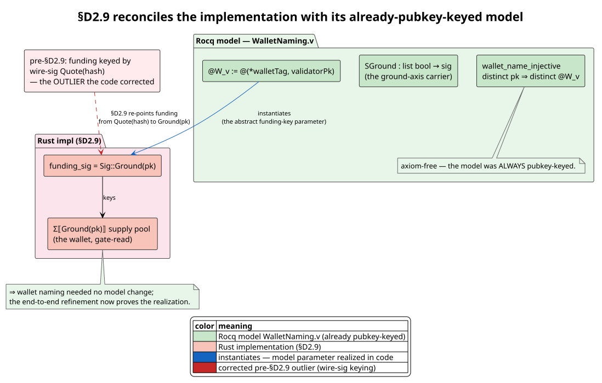

# Section D2.9 funding-key correction (historical flow)

> **Historical incident analysis.** The signer-key correction remains
> consensus-critical: funding authority derives from verified public-key
> ownership, never from a per-deploy wire signature. The separate channel-balance
> wallet and close-block debit shown later were subsequently replaced by
> canonical SystemVault reservation and authenticated located stacks. Use the
> native guide for current implementation behavior.

**Status:** The identity correction was implemented on
`feature/cost-accounted-rho` at `3a4e03eb`; its original storage realization is
retired. This is the pedagogical companion to the authoritative end-to-end contract in
[`end-to-end-authority-settlement.md`](end-to-end-authority-settlement.md), the funding-key history in
[`wd-d2-acceptance-gate.md`](wd-d2-acceptance-gate.md) §D2.9, and decision record
[DR-13 §D2.9-refinement](../cost-accounting-decision-records.md). It traces a single deploy's fuel
from genesis seeding, through reservation and execution, to realized settlement and replay
re-verification, and explains the one invariant the whole flow exists to uphold:

> **A deploy's cost is debited from its signer's own wallet** — the supply pool keyed by the
> signer's **ground public key** — so `Σ⟦signer⟧ == Σ⟦wallet⟧`.

---

## 1. Terms & symbols

Every symbol is defined here before use (per the documentation guidelines). All quantities are
non-negative integers in one phlogiston unit (DR-9: token-per-COMM; `Σ` and `Δ` share the unit).

| Symbol / term | Definition |
|---|---|
| `pk` | A signer's **public key** (Ed25519 / secp256k1), the bytes of `Cosigner.pk`. |
| `wire_sig` | The per-deploy **wire signature** — the bytes a signer produces over the deploy data. *Fresh every deploy.* |
| `Cosigned` | A deploy's signed envelope: an ordered, verified set of cosigners `{(pkᵢ, sigᵢ)}` (a 1-element set is the legacy single-signer case). |
| `deploy_id` | The deploy's **on-chain identity**, `Blake2b256(DEPLOY_SIGNATURE_DOMAIN ‖ wire_sig)`. Must be unique **per deploy** ⇒ derived from `wire_sig`. |
| `envelope_sig` | `Sig::Quote(Blake2b256(DEPLOY_SIGNATURE_DOMAIN ‖ wire_sig))` — the `deploy_id` basis (a `#P`-style process hash). **Not** a funding key. |
| `funding_sig` | The **funding key** (§D2.9): `Sig::Ground(pk)` for a single signer; the left-associated `Sig::And`-fold of `Sig::Ground(pkᵢ)` over the *filtered* (non-placeholder) signer set for multi-sig. A *ground* signature `g` (the paper: `g` = "an Ed25519 public key / a secp256k1 key hash"). |
| `Σ⟦s⟧` | The **supply pool** keyed by signature `s` — a single balance datum `(TOKEN_TAG, n)` on the content-addressed channel `from_sig(s)` (DR-13). Written only by the Rust `supply::produce_balance`. |
| `@W_v` / wallet | The signer's genesis-seeded supply pool. For user deploys the wallet is `Σ⟦Ground(pk)⟧`; the formal model `WalletNaming.v` keys the validator wallet `@W_v := @(*walletTag, pk)` by the public key. |
| `Δ_s^max` (reservation) | A proof-bearing static upper bound on token-consuming COMMs for every reachable branch, computed by `delta_sigma::demand` for native Rholang. Parallel paths add and exclusive alternatives take their point-wise maximum. |
| `κ_s` (realized cost) | The canonical runtime cost carried by `ProcessedDeploy.cost` and independently checked during replay. |
| `Σ_s` (supply) | The pool balance `read_balance(from_sig(s))` (absent ⇒ `0`). |
| `min_phlo_price` | An ingress economic setting. It is not a proof margin and is not an input to the authority funding inequality. |
| deployment origin | Client, validator-heartbeat, or proposer-dummy origin. Origin does not alter funding because replay sees only the common signed block-body envelope. |
| placeholder cosigner | An empty-`sig` member of an M-of-N threshold envelope (listed but did **not** sign). EXCLUDED from `funding_sig` (security, §5). |
| `effectiveΣ` | The Split/Join effective supply of a compound signature: `effectiveΣ_{s₁∘s₂} = Σ_{s₁∘s₂} + min(Σ_{s₁}, Σ_{s₂})` — a compound demand may draw from the combined pool or a matched component pair. |

---

## 2. The invariant — and why the wire-signature keying broke it

A deploy carries **one** `Cosigned`, but the runtime needs **two** keys from it, with opposite
requirements:

- the **`deploy_id`** must be *unique per deploy* — so it is derived from the `wire_sig` (a fresh
  value every deploy) via `envelope_sig`;
- the **funding key** must be *stable per signer identity* — so the pool a signer funds from is the
  same wallet across all of that signer's deploys.

The original implementation derived **both** from `envelope_sig` (the wire signature). Because the
wire signature changes every deploy, a deploy's funding pool `Σ⟦envelope_sig⟧` was a *fresh,
genesis-absent channel* — never the wallet genesis actually seeds (`Σ⟦Ground(pk)⟧`). The acceptance
gate's absent-pool branch then admitted the deploy *unenforced and undebited*: the wallet was never
touched and the linear `Σ ≥ Δ` proof never bound. §D2.9 decouples the two keys: `deploy_id` stays
`wire_sig`-derived (byte-identical on-chain identity), while the funding key becomes
`funding_sig = Sig::Ground(pk)`, so the pool the gate reads, proves `Σ ≥ Δ` against, and debits **is**
the genesis-seeded wallet.


(*Source: [`diagrams/d2-9-funding-flow-sequence.puml`](../diagrams/d2-9-funding-flow-sequence.puml) — render with `plantuml -tsvg docs/theory/diagrams/d2-9-funding-flow-sequence.puml`.*)

The decoupling — one `Cosigned`, two keys — is the heart of the fix:


(*Source: [`diagrams/deploy-id-funding-decoupling.puml`](../diagrams/deploy-id-funding-decoupling.puml) — render with `plantuml -tsvg docs/theory/diagrams/deploy-id-funding-decoupling.puml`.*)

---

## 3. Stage-by-stage walkthrough

The flow has five stages. Each is presented in literate-programming form (Knuth): the intent in
prose, then the algorithm in pseudocode keyed to the real functions.

### 3.1 Genesis — seed the signer's wallet

A shard commits native client fuel through `client_fuel_allocations`, which
names each client by **public key** and an initial balance. `wallets.txt` is a
separate REV-address allocation input; a configuration pipeline may map an
entry to `client_fuel_allocations` only when it possesses and validates the
corresponding public key. Genesis combines the explicit public-key allocations with each bonded validator's
`initial_phlogiston`, canonicalizes by public-key bytes, and seeds the result
before taking the genesis post-state checkpoint — the same `Sig::Ground(pk)`
pool the gate will later key by.

```
allocations ← canonical_sum(validator_initials ∪ client_fuel_allocations)
allocations ← [(pk, n) in allocations sorted by pk where n > 0]
for (public_key, balance) in allocations:                      # runtime.rs
    chan ← supply_channel(Sig::Ground(public_key))              # = from_sig(Ground(pk)) = Σ⟦Ground(pk)⟧
    produce_balance(chan, balance, genesis_random_state(public_key))
commit allocations as F1r3flyState.genesis_supply
```

With empty `client_fuel_allocations`, arbitrary client cost purses are absent and therefore have
effective supply zero. Their deployments are rejected before execution. The
block-1 PoS transition installs the validator's `@W_v` draw but does not credit
`Σ⟦v⟧` again. Replay requires the committed list to already have this canonical
shape before any cache lookup; it never repairs authenticated ordering or
duplicates.

### 3.2 Funding-key derivation (with the placeholder filter)

At deploy admission and at runtime install, the funding key is derived by the single shared
`accounting::funding_sig` — the *one* function the gate, the runtime install, and the replay
recompute all call, so they can never drift:

```
funding_sig(cosigned):                                          # accounting/mod.rs
    funders ← [ s.pk.bytes for s in cosigned.signers if s.sig is non-empty ]   # placeholder filter (§5)
    match funders:
        [pk]        ⇒ Sig::Ground(pk)                           # single signer
        [pk₁,…,pkₖ] ⇒ And( … And(Ground(pk₁), Ground(pk₂)) …, Ground(pkₖ) )    # left-assoc fold
```

The `deploy_id` is derived separately, from the wire signature, and is byte-identical to the
pre-§D2.9 install (the decoupling):

```
set_deploy_signature_funded(wire_sig, funding_sig):            # accounting/mod.rs
    deploy_id      ← envelope_sig(wire_sig)                    # UNCHANGED — on-chain identity
    self.signature ← funding_sig                              # the supply / settlement key (§D2.9)
    install_signer_channels(funding_sig)                      # per-redex lane attribution
```

### 3.3 The acceptance gate — the linear proof `Σ ≥ Δ^max`

The gate (`acceptance.rs::build_candidate_with_logic` + `admit_by_funding`) keys each deploy by its
`funding_sig`, reads the wallet `Σ⟦Ground(pk)⟧` once, and admits the largest canonical-order prefix
of each per-signer group whose cumulative demand fits the supply. The funding predicate is the
paper's conservative-demand obligation. Native analysis produces a certified finite structural
upper bound; unresolved higher-order demand is rejected unless a future proof producer supplies a
checked finite GSLT bound:

```
is_funded(bound, Σ):                                           # resource_logic.rs + delta_sigma.rs
    if bound is Unprovable: return false
    require verify(bound.proof)
    return Σ ≥ bound.certified_upper_bound
```

A first non-fitting deploy rejects it **and all after it** in the group (§7.7 reject-both).

### 3.4 Realized settlement — `post = pre − Σκ − fee`

After all user deploys execute, the runtime recomputes apportionment from each
`ProcessedDeploy.cost`. Settlement requires `0 ≤ κ ≤ Δ^max`, debits the realized `κ` rather than
the reservation, and leaves `Δ^max − κ` in the payer's wallet. `CloseBlockDeploy::dual_write_supply`
then applies the checked cost debit and conserving flat `FeeExtract`. The close-block stages are
disjoint, replay-stable, and conserving.


(*Source: [`diagrams/close-block-stages-sequence.puml`](../diagrams/close-block-stages-sequence.puml) — render with `plantuml -tsvg docs/theory/diagrams/close-block-stages-sequence.puml`.*)

### 3.5 Replay re-verification

Replay reconstructs the full *verified* cosigner set from the block via `Cosigned::to_cosigned()`
and re-derives the **same** `funding_sig` and certified reservation. Replay reexecutes each deploy,
requires its computed cost to match `ProcessedDeploy.cost`, and recomputes the realized debit map.
It rejects a cost above the reservation or any play/replay settlement mismatch.

---

## 4. Multi-signature and compound authority

A multi-sig deploy's `funding_sig` is the `And`-fold of the cosigners' `Sig::Ground(pkᵢ)` atoms, so
its funding components are exactly the cosigners' wallets `Σ⟦Ground(pkᵢ)⟧`. The cost is debited
**balanced** — each cosigner's wallet is debited equally (a compound token is a *matched pair*, one
from each pool; the ratified P8).

Genesis seeds the individual cosigner wallets but **not** the combined `Σ⟦And(…)⟧` pool, so a
compound deploy funds from the **effective** supply
`effectiveΣ = Σ_compound(absent ⇒ 0) + min(Σ_l, Σ_r)`. This exposed a latent pre-§D2.9 bug: the
replay recompute keyed its re-verification on the compound pool's *raw* presence (absent),
so a compound deploy was play-admitted on `effectiveΣ` but replay-rejected — a play/replay
**fork**. §D2.9 makes proposal and replay use the same `effective_supply_with` fold and the same
canonical residual ledger. Absent constituent pools contribute zero; they never bypass the gate.

**Over-admission bound (TM-CA-164 → TM-CA-165 — the LIVE cross-group ledger).** The earlier re-verification
above only guarantees a compound group has a *positive* effective supply; it does NOT by itself bound a
group's *cumulative demand* — nor the *combined* demand of several groups sharing a component — against the
supply. Because `compute_settlement_debits` residual-caps a compound pair-draw at `min(Σ_l, Σ_r)`, an
over-demand is silently absorbed into per-pool debits ≤ balance, so the per-pool `debit > balance` replay
check (`recompute_and_verify_admission`) cannot catch it (it catches single-sig only, whose own-pool debit
is *uncapped* `= ΣΔ`). Before DR-31, deployments then executed without a finite
authority cap, so `ΣΔ − supply` unfunded units could run. DR-31 adds
state-bound dependent evidence and finite capacity for the retained bounded
play and certificate-constrained replay; the two
historical flavors remain the reason the live residual ledger is required:

- **TM-CA-164** — one cosigner set over-demands its own effective supply (`ΣΔ > effectiveΣ`).
- **TM-CA-165** — two DISTINCT cosigner sets share a component wallet (`{A,s}` + `{B,s}` both drawing
  `Σ⟦Ground(s)⟧`); each fits its own static per-group effective, but their *combined* draw on the shared
  wallet exceeds it (honest-proposer-reachable).

Both are closed by the SAME mechanism: the gate's admission DECISION (`admit_by_funding`) and the replay
re-verification (`recompute_settlement_debits`) each run a **LIVE cross-group residual ledger** `remaining`
(seeded `raw.clone()`), processing groups in canonical `SigKey` order. Each group's admission cap is its
effective supply read from the *drawn-down* `remaining` (`group_capacity`: own-pool for a single group,
`Σ⟦compound⟧ + min(Σ⟦l⟧, Σ⟦r⟧)` for a compound), and after admission its folded `cost + fee` is drawn down
the shared ledger (`draw_group_from_ledger`, combined-pool-first — the conservative reservation that
dominates the two-pass settlement, so `admission-fundable ⟹ settlement-safe`). A later group sharing a
component therefore sees the reduced balance and is reject-both on the exhausted stack. Replay re-runs the
IDENTICAL certified-bound ledger and
raises `ReplayAdmissionMismatch` on any admitted group whose folded demand exceeds its LIVE capacity. This
bounds the *cumulative* demand on every shared wallet across all groups (linearity: no contraction),
**subsuming** the single-group TM-CA-164 check as the one-element special case (the per-group loop was
replaced by the cross-group ledger pass). Equality is admissible (never forks a gate-admitted block); the
settlement passes are unchanged (already cross-group-correct, byte-identical play↔replay). Tests:
`cross_group_two_compounds_sharing_component_admits_one`,
`cross_group_over_admission_distinct_sets_rejected_on_replay`,
`cross_group_boundary_demand_equals_shared_supply_admits_both`,
`single_sig_and_compound_sharing_component_bounded`,
`cross_group_absent_authorities_reject_both`,
`nary_nested_compound_absent_inner_pool_rejected`, plus `compound_over_admission_rejected_on_replay`. Formal:
Rocq `cross_group_draw_le_supply` / `cross_group_admission_sound` (axiom-free); TLA+
`Inv_CrossGroupAdmissionBounded` / `Inv_SecondGroupDrawMatchesDemand` (TLC PASS); Sage cross-group admission
sweep (12,605 traces, 0 violations). See diagram below.

![Cross-group shared-component ledger (TM-CA-165) — two distinct cosigner groups {A,s} and {B,s} share the component wallet Σ⟦Ground(s)⟧. The gate processes groups in SigKey order against a LIVE remaining ledger: the first group draws Σ⟦Ground(s)⟧ down, so the second sees the reduced balance and is reject-both on the exhausted stack (red), where the pre-fix static per-group effective admitted both (over-draw). Replay re-runs the identical ledger and raises ReplayAdmissionMismatch on an over-admitted block.](../diagrams/cross-group-shared-component-ledger.svg)


(*Source: [`diagrams/strict-compound-effective-supply.puml`](../diagrams/strict-compound-effective-supply.puml) — render with `plantuml -tsvg docs/theory/diagrams/strict-compound-effective-supply.puml`.*)

---

## 5. Security — the placeholder filter (R1-F4 / TM-CA-162)

A Phase-2 **threshold** envelope (M-of-N) may list members who did *not* sign, as empty-`sig`
**placeholder** cosigners (`Cosigned::from_signed_data_threshold`). If `funding_sig` folded those in,
a deploy could key funding to — and so debit — an **unsigned victim's** wallet `Σ⟦Ground(victim_pk)⟧`.
`funding_sig` therefore **excludes** empty-`sig` signers: the *filtered* funder count (not
`is_compound()`) drives the funding arity, so a 1-of-2 threshold with one real signer + one
placeholder funds **only** the real signer's wallet. This is the threat
[TM-CA-162](../cost-accounting-threat-model.md); ingress `from_proto_cosigned` independently verifies
every non-placeholder `sig` against its `pk`, so a forger cannot present a victim's `pk` with a valid
`sig` either. Test: `threshold_placeholder_victim_wallet_is_never_debited`.

---

## 6. Provisioning and deployment classes

| Deployment class | Behavior |
|---|---|
| **Configured client** | Seed `Σ⟦Ground(client_pk)⟧` in the committed genesis state through `client_fuel_allocations`. A deployment is admitted only when the live residual funds its certified reservation plus fee. |
| **Unconfigured client** | The wallet is absent, hence its effective supply is zero and the deployment is rejected before execution. |
| **Validator heartbeat or proposer dummy** | It is an ordinary signed block-body deployment for funding purposes and draws from the validator's initial-phlogiston wallet. |
| **Protocol system deploy** | It is routed through `evaluate_system_source`, outside the signed block-body gate, and follows its separately verified system transition. |

---

## 7. Reconciliation with the formal model

The funding-key portion of §D2.9 required no change to `WalletNaming.v`; that model was already pubkey-keyed:
`WalletNaming.v` keys the wallet `@W_v := @(*walletTag, validatorPk)` by the public key (modeled as
`SGround : list bool → sig`), with `wallet_name_injective` proved axiom-free, and **no** artifact
ties a pool to a wire signature. The paper's funding key is an *abstract parameter*; §D2.9 simply
instantiates it as `Sig::Ground(pk)` — exactly the pubkey naming the model already proves injective.
The implementation's wire-signature keying was the **outlier**; §D2.9 reconciles the code with its own
model. The end-to-end refinement has nevertheless been strengthened: Rocq now proves that deployment
kind cannot exempt funding and that absent supply rejects positive demand, while TLA+ explores both
client and validator-heartbeat kinds and contains an expected-refutation control for an unfunded
execution bypass. (See [`cost-accounted-rho-verification.md`](../cost-accounted-rho-verification.md)
§12(iv).)



(*Source: [`diagrams/d2-9-walletnaming-reconciliation.puml`](../diagrams/d2-9-walletnaming-reconciliation.puml) — render with `plantuml -tsvg docs/theory/diagrams/d2-9-walletnaming-reconciliation.puml`.*)

---

## 8. Test map

| Property | Test | Location |
|---|---|---|
| A signer's deploy reserves against `Σ⟦Ground(signer_pk)⟧` and settles realized cost | `deploy_funds_from_signer_ground_pubkey_wallet`; `realized_settlement_refunds_unused_reservation` | `acceptance.rs::tests` |
| An absent signer wallet has zero supply and is rejected | `absent_pool_is_zero_supply_and_rejects`; `unfunded_signer_is_rejected` | `acceptance.rs::tests` |
| Zero demand still requires the deterministic fee | `zero_demand_is_fee_gated` | `acceptance.rs::tests` |
| Replay rejects a malformed admitted envelope rather than treating it as zero demand | `replay_rejects_malformed_admitted_deploy` | `acceptance.rs::tests` |
| Multi-sig funds balanced over cosigner wallets, play == replay | `multi_sig_funds_balanced_over_cosigner_ground_pubkey_wallets` | `acceptance.rs::tests` |
| A threshold placeholder victim's wallet is never debited | `threshold_placeholder_victim_wallet_is_never_debited` | `acceptance.rs::tests` |
| `funding_sig` shape; `deploy_id` decoupling preserved | `funding_sig_tests` (`funding_sig_single_is_ground`, `set_deploy_signature_funded_preserves_deploy_id_and_installs_ground`, …) | `accounting/mod.rs` |
| State-bound execution charges the realized branch and play/replay roots agree | `state_bound_settlement_charges_the_realized_branch_and_replays_identically` | `casper/tests/.../runtime_manager_test.rs` |

---

## 9. References & citations

- Implementation contract: [`wd-d2-acceptance-gate.md`](wd-d2-acceptance-gate.md) §D2.9; decision
  record [DR-13 §D2.9-refinement](../cost-accounting-decision-records.md); threat
  [TM-CA-162 / TM-CA-163](../cost-accounting-threat-model.md); use cases
  [UC-CA-160…163](../cost-accounting-use-cases.md); verification note
  [`cost-accounted-rho-verification.md`](../cost-accounted-rho-verification.md) §12(iv).
- Spec basis — `../publications/cost-accounting/cost-accounted-rho.tex`, checked directly:
  `eq:sig-syntax` defines `g | #P | s ∘ s`; `def:sig` defines ground keys and compound
  authority; Sections 4.6/4.7 define signature-indexed pools and their consumption.
- Reflective higher-order calculus (the `#P` quote / reflection substrate): L. G. Meredith and
  M. Radestock, "A reflective higher-order calculus," *ENTCS* 141(5):49–67, 2005,
  [doi:10.1016/j.entcs.2005.05.016](https://doi.org/10.1016/j.entcs.2005.05.016).
