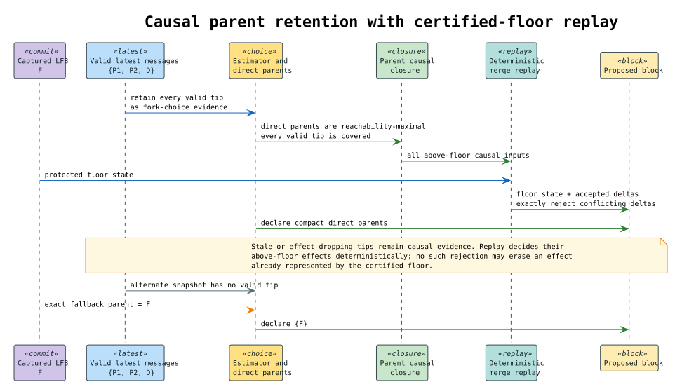

# End-to-end cost authority and native RevVault settlement

## Status and scope

This document is the implementation contract for the cost-accounting semantics in
`cost-accounted-rho.tex` and `continued-gslt-cost-v2.tex`. Those papers assume the
reader already knows the F1R3node architecture. Their wallet, purse, supply, mint,
and settlement notation therefore describes semantic roles layered over the
existing node; it does not require a second token ledger beside F1R3node's native
vault and RSpace implementations.

The implemented refinement is:

| Paper abstraction | Native F1R3node realization |
| --- | --- |
| RevVault or persistent native wallet custody | The canonical `SystemVault` registered at `rho:vault:system` and selected by a native vault address |
| Public-key ownership | The `VaultAddress` derived from a verified deploy signer, with existing SystemVault authentication and multisig support |
| Available supply $`\Sigma`$ | Canonical SystemVault custody that can be reserved, plus authenticated prepaid located stacks available to that execution |
| Located purse or funding slot | An ordinary persistent RSpace datum, addressed by its signature or unforgeable slot name, whose stack cells carry prepaid linear authority across deployments |
| Cost reservation | A certificate-bound maximum physical-authority and quantitative-byte allocation realized lexically inside one authenticated `SystemVault.applyCost` transition, plus located-stack pops in the same node checkpoint |
| Execution cost $`K`$ | One unit per successful atomic RSpace `COMM` plus the canonical introduction, payload-delivery, and committed-trace byte tariff reproduced by replay |
| Physical authority $`\kappa`$ | The component-wise located and SystemVault authority actually consumed by committed COMMs; one COMM may require multiple authority cells |
| Quantitative byte cost $`Q`$ | The versioned, checked canonical byte tariff described in [Vault-backed quantitative byte accounting](vault-backed-byte-accounting.md) |
| Refund | The difference between maximum and realized SystemVault allocation returned before `applyCost` completes; an unconsumed located stack cell remains in RSpace |
| Protocol mint | `SystemVault.protocolMint`, invoked only through authenticated genesis or PoS system execution |
| Fee extraction | A direct, conserving transfer from lexically reserved payer custody to the proposer SystemVault during `applyCost` |
| Slash quarantine | `SystemVault.protocolQuarantineAll` plus the existing stake-quarantine lifecycle |
| Exchange | The optional blessed market contract; it is not an intermediate fee ledger or a required settlement phase |

The generic GSLT interfaces remain the boundary a future MeTTaIL producer can
satisfy. Completing MeTTaIL itself is outside this scope. No other cost-accounting
path is conditional or inactive after genesis.

## How to read the papers against the node

The papers specify the semantic extension and assume the reader already knows
the F1R3node substrate. They therefore use small rho-calculus encodings to expose
resource flow without restating the production vault, registry, PoS, replay, or
merge implementations. Conformance is a refinement obligation: the native path
must preserve the observable authority, conservation, atomicity, and replay
properties of the paper path.

The pure-rho compiler pass in the concrete paper's implementation appendix is
the internalisation map that made the semantics immediately executable on the
older unmetered runtime. The same appendix says the native implementation is
developed in parallel, and the platform implementation path separately calls
for native syntax, reducer, RSpace serialization, and validator checks. This
branch implements that native path. It does not replace SystemVault, RSpace, or
Casper with the appendix's illustrative channels, and it does not treat the
compiler-pass simulation as the final consensus implementation.

The validator worked example makes this distinction concrete. Its wallet channel
`W_v` denotes persistent validator custody, its client address `A_c` denotes
client-controlled custody, and its fee channel `F_v` exposes the intermediate
ownership transfer in pure rho. The production refinement uses the existing
SystemVault address space for `W_v` and `A_c`. It linearizes the example's
fee-collection and fee-conversion trace into one authenticated settlement
transaction from the payer's reserved purse to the proposer's vault. This is
valid only because the transaction proves all of the following:

- the payer debit equals the proposer credit;
- neither side can observe an intermediate fee balance;
- no mint occurs during the transfer;
- replay derives the same payer, recipient, amount, and post-state;
- a failed transfer commits neither the execution state nor a partial debit.

The blessed Exchange contract is not removed by that refinement. It remains the
general Rholang mechanism for exchanging already-existing assets or first-class
located authority when the two sides are genuinely distinct. It is simply not a
second mandatory phase for a native REV fee whose recipient is already known at
settlement.

### Paper anchors for the native refinement

The mapping above is grounded in the papers' own architectural seams:

- *Cost-Accounted Rho Calculus*, §“Motivation: From Run-to-Completion to
  Concurrent Acceptance,” makes RSpace acceptance and Casper merge the target of
  the linear proof rather than a separate application protocol.
- §“The Partial Funding Vulnerability” uses wallet debit, a transient purse, and
  wallet credit to establish why the whole financial transaction must be funded
  before its first effect. The node realizes that boundary with its existing
  deploy checkpoint and authenticated native settlement.
- §“Data-Dependent Interaction: Overcharge and Refund” requires a conservative
  maximum, an exact forced-redex count, and return of the unused portion. It does
  not require a persistent reservation ledger; `SystemVault.applyCost` realizes
  those phases lexically inside one call.
- §“Funding Slots via Unforgeable Channels” explicitly chooses Rholang `new` and
  a concrete channel-held stack. Ordinary RSpace persistence and unforgeable-name
  substitution therefore are the native storage and ownership mechanisms.
- §“RSpace and the Tuplespace” and §“Casper CBC Consensus” place stack storage,
  matching, block validity, and validator agreement in the existing node
  subsystems.
- Appendix §“Worked Example: Validator with Fee Extraction” supplies the
  validator wallet, epoch mint, client funding address, fee collection, exchange,
  slash, and redemption obligations. The named channels are the calculus-level
  view of native SystemVault/PoS state, not additional consensus stores.
- *Continued Interactive GSLTs and the Cost Endofunctor*, §“The nominal surface”
  and §“Located resource stacks” explain why authority in rho must be carried by
  matching names rather than AC-bag adjacency. The native signature channel and
  unforgeable funding-slot name are that nominal surface.
- Its §“Resource sufficiency: linear proofs and located purses” establishes the
  per-purse proof decomposition and the exact-versus-conservative treatment of
  data dependence. The node's per-purse certificate, native authority events,
  and physical allocator are the executable refinement of that decomposition.

The papers intentionally do not restate LMDB history, block protobufs, deploy
signature verification, SystemVault authentication, PoS MVars, multi-parent DAG
merge, or replay-cache mechanics. Those are proof obligations of the refinement:
they must preserve the papers' semantics, and they may not be bypassed or
duplicated by an apparently simpler paper-literal implementation.

`RuntimeBudget` is not a second purse ledger. It enforces one finite aggregate
execution-capacity ceiling and canonically reconciles the semantic RSpace event
trace across parallel reducer workers. The only per-purse accounting path is
the persisted `CostAuthority`: a successful COMM records one `AuthorityEvent`
for its complete region multiset, introduction and delivery bytes record
`AuthorityByteEvent`s over the same regions, admission allocates both against
authenticated purse inventory, and replay recomputes the exact physical and
quantitative draws before the atomic SystemVault transition. Maintaining a
second mutable lane map would create two sources of truth and could either
double-charge or disagree with replay, so the earlier unused D0 prototype was
removed.

## Governing invariants

Let $`V(a)`$ be available custody in the canonical SystemVault selected for
authority $`a`$, and let $`L(a)`$ be prepaid located-stack authority that the
program is authorized to draw. The effective pre-state supply is:

```math
\Sigma(a)=V(a)+L(a).
```

A completed finite certificate supplies a component-wise physical-authority upper
bound $`B_A(a)`$ and a quantitative byte bound $`B_Q(a)`$.
The deterministic fee allocation is $`F(a)`$. Admission requires:

```math
R(a)=B_A(a)+B_Q(a)+F(a)\leq\Sigma(a).
```

This inequality is not merely diagnostic. The certificate binds the maximum
SystemVault allocation before retained execution. After exact realized cost is
known, one authenticated `applyCost` call splits the maximum from each native
purse, validates the realized allocation, burns cost, transfers fees, and returns
the difference before the call completes. Located cells are popped in the same
node checkpoint. If any source cannot be drawn, the checkpoint is reset and the
deploy is rejected without user-state effects.

The reserve and refund quantities remain explicit in the proof algebra, but no
reservation table is persistent consensus state. A two-call implementation with
a singleton reservation map creates a false dependency between otherwise
independent branches. It is not a valid refinement of the papers' local
sufficiency or of F1R3node's merge algebra.

Execution produces a canonical physical authority multiset $`\kappa`$ and byte
cost $`Q`$ satisfying:

```math
0\leq\kappa(a)\leq B_A(a),\qquad 0\leq Q\leq B_Q.
```

An authorized transaction may top up the payer's unreserved SystemVault balance
while the process runs. The top-up is a separate conserving transition. It does
not change $`B_A`$, $`B_Q`$, $`F`$, the certificate identity, or the execution's
fixed reservation snapshot, and therefore cannot rescue or enlarge an in-flight
execution. The credited custody is available at a later canonical admission
boundary.

For SystemVault-funded authority, settlement charges the realized allocation,
returns unused reservation, and transfers the fee directly to the proposer. For
located authority, successful `COMM` events consume the already-popped stack
cells; unused cells were never popped. Moving authority from a native wallet into
a located stack decreases $`V`$ and increases $`L`$ by the same amount. A native
wallet transfer to the SystemVault address derived from an unforgeable slot moves
custody within $`V`$; a later stack-production transition is what prepays that
custody into $`L`$. Globally, excluding explicit protocol mint and slash burn,
ownership plus execution-cost burn is conserved:

```math
\sum_a\bigl(V'(a)+L'(a)\bigr)+\operatorname{burnedCost}
=\sum_a\bigl(V(a)+L(a)\bigr)+\operatorname{protocolMinted}.
```

Fee ownership is conserved independently:

```math
\operatorname{payerDebit}_{fee}
=\operatorname{proposerCredit}_{fee}.
```

The native refinement does not persist an `F_v` holding account or require a
fee-conversion epoch. The paper's observable collect-and-convert result is the
atomic payer-to-proposer transfer above.

## Static and dependent proofs

The implementation supports both proof forms described by the papers.

### Structural finite upper bound

`delta_sigma::demand` computes a conservative authority multiset for a statically
closed normalized term. Parallel composition adds bounds and exclusive choice
takes their point-wise maximum:

```math
\Delta^{\max}(P\mid Q)=\Delta^{\max}(P)+\Delta^{\max}(Q),
```

```math
\Delta^{\max}(\operatorname{choice}(P,Q))
=\max(\Delta^{\max}(P),\Delta^{\max}(Q)).
```

Signed regions maintain an ordered lexical authority stack. Each possible send or
receive introduction contributes to every enclosing non-persistent region. A
successful `COMM` is charged once per distinct participating region, so a whole
redex whose send and receive share one region realizes one unit even when the
structural certificate conservatively reserved two. The difference is refunded.

An unresolved dequotation or another state-dependent call is
`DemandBound::Unprovable`; submitted syntax alone cannot bound a continuation
already resident in RSpace.

### Authenticated state-bound proof

Production admission evaluates the canonical candidate sequence in scratch state
rooted at the authenticated merged pre-state. Capacity comes only from physically
available native custody and located stacks. Exhausted speculative attempts are
discarded, capacity expands only when authenticated pre-state authority justifies
the expansion, and the final retained play becomes the committed transition.

The state-bound certificate commits to:

- accounting protocol version;
- canonical program and complete cosigned-envelope identity;
- merged pre-state root and block context;
- reservation identity;
- exact authority presentation and physical allocation;
- exact causal `COMM` event witness;
- realized cost and deterministic fee allocation;
- every adjacent pre-state and post-state root.

Proposal and replay derive this evidence independently. Arbitrary proof bytes are
not trusted evidence. A future GSLT or MeTTaIL certificate must pass its registered
checker before it can authorize reservation.

## Native admission workflow

1. Verify every deploy signature and derive each signer's canonical vault address.
2. Recover lexical region, lollipop, funding-slot, and located-stack authority from
   the normalized term and authenticated pre-state.
3. Compute a structural bound or complete an exact state-bound play.
4. Allocate cost and fee across canonical SystemVault custody and authorized
   located stacks without ambient-purse fallback.
5. Execute once under the certified finite capacity. Every RSpace produce and
   consume introduction is byte-charged before mutation. An accepted atomic
   match charges all delivered payload and trace bytes and records one causal
   `COMM` event before changing tuple-space state.
6. Compute the exact realized allocation from the retained causal witness and
   atomically pop the corresponding located cells.
7. Invoke `SystemVault.applyCost` once with the certificate identity, maximum
   native allocations, exact charges, and proposer address. The call performs
   maximum reserve, exact burn and fee transfer, and refund in one lexical
   continuation; it leaves no reservation cell.
8. Commit the retained execution root and certificate. Rejected deploys retain a
   consensus-visible rejected status and have identical pre-state and post-state
   roots.

The reservation identity binds the certificate, deterministic system-deploy RNG,
and replay witness. Duplicate deploy protection remains the native deploy-
occurrence rule; reservation identity is not a second idempotency ledger.

Multi-parent merge combines only durable native purse deltas and located-cell
removals. Each source branch must have passed its maximum-bound proof against its
authenticated pre-state. Once both branches have completed, merge has exact
realized witnesses: it may retain both only when their aggregate durable debit is
funded, and otherwise deterministically rejects an overdrawn source. This is the
node refinement of simultaneous proof competition; it does not re-admit an
unexecuted combined deployment from an optimistic estimate.

An admitted deploy cannot draw candidate-created authority. Born located stacks
become available only after their producing transition commits and can fund only
causally subsequent work. Scratch execution cannot leak output, RSpace changes,
roots, reservations, or stack pops from an exhausted or rejected attempt.

### Failure-atomic stack introduction

A `CostStack` production spans two ledgers: the physical authority ledger moves
linear cells, while RSpace charges canonical bytes and stores or matches the
datum. These effects cannot be published independently. Let $`P_o`$ be the cells
pending for stack-production operation $`o`$. Pending cells count against the
fixed certified capacity, but they are not realized settlement and do not create
a born-stack witness.

The evaluator follows this protocol:

```text
reserve physical cells into P_o
attempt the byte-charged RSpace produce and its matched continuation
if the complete operation succeeds:
    publish the physical events and born-stack witness
else:
    restore P_o exactly and publish neither
```

The reservation owns its abort action. Dropping it on an error, unwind, or
cancelled future restores only its own cells, so another concurrent operation's
commit is preserved. Commitment is deliberately after the awaited RSpace call;
there is no later fallible birth-recording step.

A matched produce may appear inside the enclosing COMM record. Authority-trace
extraction visits those produces before the COMM and removes each authority
identity at most once. Therefore every physical stack-transfer debit is ordered
after its source reservation and at its committed produce, whether the produce
remains stored or immediately participates in a match. DR-49 and CA-P-196 record
the model, negative controls, and regression obligations.

### Stack-safe exact physical allocation

A physical search node is the complete state of one partial proof: current event
index, remaining authority atoms for that event, residual native balances,
located-stack cursors, cells already selected for the event, and the completed
draw prefix. The candidate relation is finite because every accepted step either
removes one native cell, advances one finite stack cursor, or completes an event.
Failed-state memoization prunes a state only after every candidate below it has
failed.

The implementation performs the recursive specification's depth-first traversal
with an explicit last-in-first-out heap worklist:

```text
work := [initial search node]
failed := empty ordered set

while work is not empty:
    item := pop(work)
    if item is MarkFailed(state):
        insert state into failed
    else if item completes the whole trace:
        reconstruct and return its persistent draw chain
    else if item completes the current event:
        append its canonical draw and push the next event
    else if canonical_state(item) is not in failed:
        candidates := canonical_candidates(item)
        push MarkFailed(canonical_state(item))
        push candidates in reverse canonical order

return InsufficientAuthority
```

Reverse insertion is load-bearing: the next heap pop examines the same first
candidate as the recursive definition. The delayed marker is equally
load-bearing: a state becomes a known failure only after every child has been
searched. Completed draws use a persistent reference-counted predecessor chain,
so branching does not clone an ever-growing event prefix.

For finite candidate tree $`T`$, exhaustive traversal takes at most $`|T|`$
node visits before memoization savings and uses constant native recursion depth.
The live heap is bounded by the search frontier, failed-state memo, and completed
draw chain. `verify_physical_settlement` still rechecks event identity,
canonical stack order, born-stack causality, exact atom equality, balance debit,
and stack pops before the witness can enter consensus.

## Linear operators and lollipop

The linear operators are native authority constructors, not annotations.

- Tensor and parallel authority require the union of their independent resources.
- Additive choice reserves the point-wise maximum because only one branch commits.
- Compound and threshold signatures consume the exact presented component or
  combined stacks according to deterministic apportionment.
- A lollipop $`D\multimap S`$ transfers payer authority to the continuation. The
  source authority that enables the implication and the continuation authority
  are distinct ordered stack obligations.
- A located term $`\{P\}_{slot}`$ draws from its authenticated slot rather than
  silently collapsing to the deploy envelope signer.

Persistent funding slots are unforgeable RSpace capabilities. A user may fund a
slot once from a canonical SystemVault, pass only the slot capability to a gateway,
and allow later deployments to consume its remaining stack cells. The gateway
does not acquire general access to the user's vault. This is the intended
foundation for user-funded Embers executions.

The native wallet workflow uses existing vault operations rather than a new
cost-accounting RPC:

1. A grant contract creates `slot` with Rholang `new` and retains or delegates
   that unforgeable name according to the grant policy.
2. `rho:vault:address!("fromUnforgeable", slot, ...)` derives the same canonical
   SystemVault address that `vault_payer` derives during proposal and replay.
3. The user's authenticated wallet vault transfers the chosen REV amount to that
   address. This is an ordinary conserving SystemVault transfer, not a mint and
   not a copy into a second ledger.
4. A continuation signed by the slot, including the continuation side of a
   lollipop, presents that located authority. Its certificate reserves the
   maximum from the slot vault or selects already-prepaid `CostStack` cells on
   the slot's RSpace channel.
5. `SystemVault.applyCost` burns only the realized vault-funded cost, returns the
   unused maximum to the same slot vault, and transfers the fee; physical stack
   settlement instead removes exactly the selected heads and retains the tail.

Funding needs only the destination address; drawing or transferring out requires
the unforgeable capability. Passing the slot therefore delegates the bounded
slot purse and does not disclose the user's signer-derived wallet authority.

## Genesis and minting

Genesis funding uses the existing vault generator. `Genesis::vaults_with_protocol_funding`
combines ordinary genesis vault balances, validator `initial_phlogiston`, and
configured client allocations by canonical `VaultAddress`, checks arithmetic, and
emits one canonical vault allocation per address. The generated SystemVault state
is part of the blessed genesis execution and its post-state root. There is no
separate `genesis_supply` payload and no block-one mirror credit.

Historical replay runs the same blessed genesis contracts and checks the same
post-state root. Ceremony validators reconstruct the expected blessed-deploy
content, including the vault allocations, before approval. Ordinary settlement
cannot reapply genesis funding.

At an epoch boundary, PoS selects eligible active validators and invokes the
authenticated SystemVault protocol-mint path. The `(validator, epoch)` ledger
makes minting idempotent across replay and multi-parent merge. A halted validator
is ineligible. A newly bonded validator receives its configured initial protocol
funding through the same canonical vault path.

## Fees, exchange, and token minting

Cost and fee have distinct semantics:

- realized execution cost consumes reserved authority;
- the fixed fee changes ownership from payer to proposer;
- explicit protocol mint is the only operation that creates new native custody;
- the blessed exchange swaps existing assets and mints nothing.

Consequently, a user workflow is:

1. hold REV in a wallet-backed canonical SystemVault;
2. optionally transfer part of that custody to the SystemVault address derived
   from an unforgeable funding slot, or prepay an authenticated linear stack on
   the slot's RSpace channel;
3. submit a program whose certificate establishes a finite maximum cost;
4. reserve the maximum cost and fee or reject immediately for insufficiency;
5. execute and charge only realized cost;
6. return unused reservation and transfer the fee to the proposer.

Token minting credits the same SystemVault namespace. It does not create a
parallel fuel account. The resource-logic and GSLT layers decide how authority may
be presented and transferred; SystemVault remains the canonical persistent
custodian.

## Slashing and redemption

An authorized slash atomically:

- removes the validator from the active set and zeros its bond;
- halts future protocol minting;
- moves all available validator SystemVault custody into a quarantine identified
  by the slash lifecycle;
- quarantines stake under the existing PoS adjudication path.

Vindication restores quarantined stake and custody and clears the mint halt.
Guilty resolution applies the authorized penalty and restores any remainder.
Burn resolution destroys the quarantined amounts and leaves minting halted.
Reservation, quarantine, and redemption identifiers prevent duplicate effects.

Only objective invalidity reproducible from committed state may create slash
evidence. Missing history, an unavailable local RSpace root, resource exhaustion,
or another node-local fault is recoverable and cannot be promoted to objective
invalidity.

## Replay, merge, and consensus

Replay reconstructs the complete cosigned envelope, certificate context,
authority presentation, physical reservation, exact causal witness, realized
cost, and fee allocation. It must reproduce every adjacent root and the final
post-state. A proposer-supplied aggregate or settlement map is never authoritative.

Supply discovery belongs to ordinary RSpace, not ReplayRSpace. Before rigging
the recorded trace, the validator resets an ordinary runtime to each
deployment's authenticated pre-state root and captures the complete
SystemVault-plus-located-stack inventory for every authority lane. Replay then
receives that immutable per-deployment snapshot as an input. It neither looks up
the registry nor asks a live SystemVault contract for a balance while consuming
the recorded event log.

This separation follows the existing node architecture. Ordinary RSpace owns
state observation; ReplayRSpace checks that the committed causal trace is
consumed exactly. A live balance query through ReplayRSpace would be a new
communication absent from the block witness. It would also make replay admission
depend on an execution side effect instead of the authenticated pre-state. The
validator therefore rejects missing lanes, unexpected lanes, missing snapshots,
extra snapshots, and any snapshot whose certificate context does not match the
deployment being replayed.

Settlement state changes are part of the block's merge index. Persistent stack
removals use stable transfer and reservation identities, so independent validators
cannot reinterpret a consumed stack as available. `StateChange` snapshots are
immutable and structurally shared; merge aggregation is canonical and uses the
same mathematical total for conflict selection and trie application.

Validation classifies outcomes explicitly:

- `ObjectiveInvalid` may produce invalid-block and slash evidence;
- `MissingDependency` requests the missing parent, root, or state;
- `LocalFault` retries or recovers without contaminating consensus state.

Finality traverses full DAG ancestry with a visited set. Parent-array order cannot
change agreement translation, fault tolerance, or last-finalized-block progress.

### Casper subsystem change inventory

Cost accounting is a state-transition validity rule, so it crosses Casper
without replacing CBC Casper's validator-support or clique mathematics. The
following inventory is normative for this refinement.

| Casper surface | Cost-accounting responsibility |
| --- | --- |
| deploy ingress and `block_admission` | Decode the complete envelope, reject malformed signature algebra, verify every non-placeholder signer, derive only verified funding identities, and install the authenticated normalizer environment |
| `RuntimeManager` state-bound certification | Root scratch execution at the authenticated merged pre-state, discover only pre-state-backed wallet and located supply, retain the exact finite execution, and reject exhaustion without candidate effects |
| `acceptance` fixed point | Canonically order candidates, compute physical, quantitative-byte, and fee allocations, remove underfunded candidates monotonically, and bind the retained partition to certificate and witness evidence |
| proposal runtime | Execute under the certificate's fixed capacity, observe compute and byte events before mutation, hold pending stack transfers privately, and atomically publish the retained root and evidence |
| replay runtime | Consume immutable per-deploy supply snapshots, rig the causal RSpace trace, recompute event identities, costs, allocations, settlements, and roots, and reject any mismatch |
| processed-deploy wire model | Carry terminal admission status, authority protocol v8 certificate, byte-schedule identity, exact physical and byte witness, and adjacent roots in `CasperMessage.proto` |
| block protocol lifecycle | Require Casper protocol version 4 at fresh genesis, proposal, receipt, approved-state replay, and restart; reject legacy or unknown evidence rather than mixing accounting rules |
| block creator and merge index | Track exact state-effect identity as `(source block hash, execution index)`, retain causal dependencies, apply durable vault and stack deltas, and deterministically reject aggregate overdraw or conflict |
| mergeable evidence | Recompute evidence by local replay, key it by complete execution identity, retire it only after full latest-message and finality guards, and ignore unauthenticated peer payloads |
| validation dispatcher | Separate objective invalidity from missing dependency and local fault; only reproducible objective invalidity can enter invalid-block or slash evidence |
| parent selection and fork choice | Require honest candidate parents to preserve the committed state floor and materialize their recursive effect provenance before selection |
| finalizer and finalized floor | Keep the existing support, majority, and clique calculation for certification, but promote state or last-finalized-block only when the certificate's lineage preserves every already certified effect |
| recovery and deploy status | Recover missing roots or parents locally, keep underfunded admission terminal for that occurrence, and expose finalized, failed, pending, and expired deploy states without resurrecting rejected effects |

The majority/clique result answers whether validators certify a block in the
message DAG. It does not by itself prove that a locally selected replay state
contains every effect already committed by the current last-finalized block.
State promotion therefore requires both certificates:

```math
\operatorname{Promotable}(b)
=\operatorname{CBCertified}(b)
\land\operatorname{StatePreserving}(b,\operatorname{LFB}).
```

This is an additional state-lineage validity predicate, not a second vote and
not a change to validator weights. Without it, a causally certified sibling can
advance the local state floor while omitting an already certified wallet debit,
located-stack pop, or process effect. That omission makes later supply discovery
node-local and can cause honest validators to certify or reject the same deploy
against different balances.



Exact effect provenance closes the same gap during merge. Rejection propagates
through the transitive dependency graph of exact effects, not through an entire
source block and not only one dependency hop. Independent effects survive;
dependent effects cannot outlive the state they consumed. The merge algebra is
canonical under parent permutation, and the finalized floor carries the complete
active-effect frontier into replay.

The public block API currently summarizes a processed deploy as `DeployInfo`.
The consensus block contains the complete certificate and witness, while typed
client exposure of those fields requires the matching public API schema and
node/client pin. Applications must not reconstruct exact settlement from the
scalar `cost` summary in the meantime.

The detailed consensus specifications are:

- [Finalized-floor normative specification](../finalized-floor/finalized-floor-specification.md);
- [Merge-algebra normative specification](../merge-algebra/merge-algebra-specification.md);
- [Deploy-occurrence verification](../deploy-occurrence/deploy-occurrence-verification.md);
- [Mergeable-evidence authentication](mergeable-evidence-authentication.md); and
- [Evaluation transaction isolation](evaluation-transaction-isolation.md).

## Formal verification

The formal refinement deliberately spans complementary tools:

| Concern | Primary artifacts |
| --- | --- |
| Calculus, linear authority, lollipop, conservation | Rocq `CostAccountedReduction.v`, `LocatedAuthoritySettlement.v`, `TokenConservation.v`, `CanonicalRevRedemption.v` |
| Native SystemVault mapping | Rocq `WalletNaming.v`, `MintingInjection.v`, `VaultBackedCostLifecycle.v`, `AtomicVaultSettlementRefinement.v`, `WalletFundedLollipop.v`, `VaultBackedByteAccounting.v`, `BoundedLedger.v`, `EndToEndAuthority.v` |
| Concurrent protocol and replay | TLA+ `LocatedAuthoritySettlement.tla`, `VaultBackedCostLifecycle.tla`, `AtomicVaultSettlementRefinement.tla`, `WalletFundedLollipop.tla`, `VaultBackedByteAccounting.tla`, `StateBoundAdmission.tla`, `StateBoundValidatorConvergence.tla`, `ReplaySupplySnapshot.tla`, `ReplayRootMaterialization.tla`, `EndToEndCostConsensus.tla` |
| Mint, fee, and scheduling interleavings | TLA+ `EvalScheduling.tla`; Sage `supply_accounting_model.sage` |
| Slash and quarantine lifecycle | TLA+ `SlashFlow.tla`; Rocq slashing and redemption developments; Sage slashing models |
| Concrete atomicity | Loom settlement, join, stack-frontier, stack-introduction rejection/cancellation, and concurrent-admission tests |
| Implementation conformance | Rust unit, property, fuzz, play/replay, genesis, multi-parent, slashing, and integration tests |

Safe TLA+ models have registered negative controls for underfunded execution,
genesis mismatch, genesis-funding reapplication, local-fault slashing,
proposer-only validation, missing authority, partial multi-purse debit, replay
omission, stack-identity loss, schedule-local certificate acceptance, and live
authority queries through trace replay. A
negative control passes only when TLC finds the intended counterexample.

The composed wallet-funded lollipop refinement is deliberately separate from
the component proofs. `WalletFundedLollipop.v` proves that an authenticated
SystemVault transfer into the slot address conserves custody and does not mint,
then proves that a successful continuation debits realized cost from that slot,
debits the fee from the gateway envelope, credits the proposer, refunds the
unused certified maximum, and replays identically. `WalletFundedLollipop.tla`
checks validator-order independence and the same cross-deploy lifecycle; its six
unsafe configurations demonstrate that copying custody, publishing the draw
capability, collapsing one validator's payer to the envelope, omitting the outer
event, charging the maximum instead of realized cost, or omitting replay state
violates a named invariant.

## Operational requirements

- Provision users and validators through canonical SystemVault balances; an
  absent vault has zero available custody.
- Apply proof, reservation, execution, and replay checks to client, heartbeat,
  dummy, and system-origin envelopes according to their authenticated protocol
  role. Never infer a funding exemption from local origin.
- Treat calls into persistent contracts as state-dependent unless a registered
  structural proof covers the resident continuation.
- Never use `min_phlo_price` or a configurable margin as a semantic proof bound.
- Treat local missing-state failures as recovery conditions, not slash evidence.
- Any change to metering, SystemVault reservation, located-stack identity,
  certificates, replay, merge indexing, slashing, or finality requires the full
  formal and implementation regression gates.

## Verification commands

Run generated artifacts under the repository's disk-backed `target/` tree; do
not use `/tmp`, which is RAM-backed on the development host.

```bash
scripts/check-cost-accounted-rho-tla-invariants.sh --filter EndToEndCostConsensus
scripts/check-cost-accounted-rho-tla-invariants.sh --filter VaultBackedCostLifecycle
scripts/check-cost-accounted-rho-tla-invariants.sh --filter AtomicVaultSettlementRefinement
scripts/check-cost-accounted-rho-tla-invariants.sh --filter LocatedAuthoritySettlement
scripts/check-cost-accounted-rho-tla-invariants.sh --filter StateBoundAdmission
scripts/check-cost-accounted-rho-tla-invariants.sh --filter StateBoundValidatorConvergence
scripts/check-cost-accounted-rho-tla-invariants.sh --filter VaultBackedByteAccounting
scripts/check-cost-accounted-rho-proofs.sh
scripts/check-cost-accounted-rho-sage.sh
scripts/check-cost-accounted-rho-loom.sh
cargo test -p rspace_plus_plus
cargo test -p rholang
cargo test -p casper --lib
cargo test -p casper --test mod
cargo clippy --workspace --all-targets -- -D warnings
```
