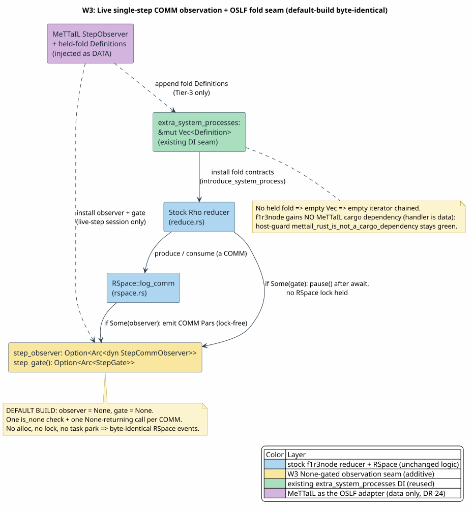

# W3: Live Single-Step COMM Observation + OSLF Fold Seam

Status: implementation design (shipped behind a runtime gate). Branch: `feature/mettail` (off `feature/cost-accounted-rho`). Consensus-neutral by construction: every seam is runtime `None`-gated (no Cargo feature in the hot path), the default build is byte-identical, and the MeTTaIL fold handler is injected as **data** — `f1r3node` gains no MeTTaIL dependency.

> Grounding mandate. This is the **runtime-observation companion** to the OSLF cost-accounting workstream, realizing **DR-24** ("MeTTaIL is an adapter, not a dependency"): where [W2 — Cost-Aware OSLF Typing](w2-cost-aware-oslf-typing-forward-design.md) specifies the OSLF *typing* seam, W3 specifies the OSLF *runtime-observation* seam — making MeTTaIL-defined language reductions first-class, **cost-metered RSpace** events. Each construction below is tied to a concrete Rust seam that was read and verified, and to the mettail-side zero-admission proof `formal/rocq/rho_bridge/theories/HeldFoldContractSound.v`.

## 0. Executive summary

A MeTTaIL `language!` reduction is evaluated on two engines: the Dovetail rewrite engine (folds, casts) and **this** Rho machine (COMM, par, contracts). To make those reductions **observable and accountable** on the metered machine — the purpose of integrating MeTTaIL as the OSLF component of cost-accounting — W3 adds four small, additive, `None`-gated seams to `f1r3node`:

1. a **lock-free COMM emit seam** in `RSpace::log_comm` (publish the COMM `Par`s as they fire);
2. an **async back-pressure step-gate** in `reduce.rs` (pause the reducer between COMMs, holding no RSpace lock);
3. **reuse** of the existing `extra_system_processes` dependency-injection seam to install MeTTaIL **Tier-3 fold contracts** — the OSLF adapter that runs a MeTTaIL-native fold over a COMM-received value on this machine, post-substitution, as a metered contract COMM;
4. a **per-reduction emit + gate** at the structural reducer arms — an `observe_reduction(redex, kind)` twin of `observe_comm` on the same `StepCommObserver`, forwarded through a new `None`-default `ISpace::observe_reduction` (symmetric to `step_gate`), so the stepper observes EVERY meaningful Rho-machine reduction (the COMM plus the structural dereference / method / `match` / `if` / `new` / `bundle` bodies), not only COMM rendezvous. A resting output is the *residual* of the last reduction, not a step; a `produce` with no consumer is therefore not observed (it would spuriously surface internal sends that the COMM later consumes, and its ordering is non-deterministic).

The load-bearing facts that make this "additive, not invasive":

- The COMM emit, the step-gate, and the per-reduction emit are reached through `Option` / default-`None` forwarders; when not single-stepping, each COMM costs one branch-predicted `is_none` check plus one `None`-returning call, and each structural reduction costs two (the `observe_reduction` forwarder + the `step_gate` forwarder, both `None`). No allocation, no extra lock, no task park. RSpace events and reduction order are unchanged.
- `extra_system_processes: &mut Vec<Definition>` already threads `create_rho_runtime → setup_maps_and_refs → introduce_system_process`. MeTTaIL fills that `Vec`; the empty case (no held fold) chains an empty iterator — identical maps and dispatch table.
- The MeTTaIL fold handler is a boxed closure handed in as data. `f1r3node` never names MeTTaIL; the host-guard test `mettail_rust_is_not_a_cargo_dependency` (`accounting/resource_logic.rs`) stays green.



(Source: `docs/theory/diagrams/w3-comm-observation-fold-seam.puml`; render with `./docs/theory/diagrams/render.sh` or `plantuml -tsvg`.)

## 1. The COMM emit seam (`rspace++/src/rspace/rspace.rs`)

`RSpace` gains `step_observer: Option<Arc<dyn StepCommObserver<C,P,A,K>>>` — a field **appended last** (so no positional FFI consumer breaks), `None` by default, with no new Cargo feature. The `StepCommObserver` trait (`rspace++/src/rspace/logging.rs`) declares `observe_comm(channels, consumed, patterns, continuation, comm, label)` and `step_gate() -> Option<Arc<StepGate>>` (default `None`). In `log_comm`, an installed observer clones the matched COMM `Par`s and performs a **lock-free, non-blocking** bounded send (the same O(1) shape as the existing `event_log` insert); a `None` observer is skipped by the `if let Some(_)` check. The base logger is a no-op, so the default path is the prior path plus one predicted branch.

## 2. The async back-pressure step-gate (`rholang/src/rust/interpreter/reduce.rs`)

`StepGate` (a `tokio::sync::Semaphore`, defined in `logging.rs`) provides `pause` / `release_one` / `abort`. In `produce_inner` and `consume_inner`, **after** `space.{produce,consume}().await` returns a match and **before** continuing the process — an `await` boundary at which the per-channel RSpace lock has already been dropped — the reducer calls `self.space.step_gate()` and, if `Some`, `pause()`s (acquires a permit). This parks the **task**, not the OS thread, and holds **no lock**, so a single-step session can resume the reducer one COMM at a time with no deadlock. When `step_gate()` is `None` (the default), the call returns immediately. The hook is plain control flow, not feature-gated, so the fork stays a single build.

The same gate also drives the **per-reduction** seam (seam 4). A private `observe_and_pause(redex, kind)` helper — `self.space.observe_reduction(redex, kind)` then the identical `if let Some(gate) = self.space.step_gate() { gate.pause().await }` — is called at the six structural reducer arms (the `EVarBody` dereference and `EMethodBody` method in `generated_message_eval`, the `match` case body, the two `if` branches, the `new` body, and the `bundle` body), immediately before each re-enters `eval`. Because the stepper's worker runs `new_current_thread`, the single-permit gate forces **one reduction at a time** across the concurrently-spawned par-member tasks, giving a deterministic, navigable linear trace under the fixed seed + content-hash match order. When no observer is installed, each call is the same two `None` forwarders — no emit, no pause, no allocation. A `produce` reaching quiescence is deliberately NOT a hook site: depositing a send is not a reduction (the COMM that later consumes it is the step), and observing it would surface spurious, order-dependent internal sends.

## 3. Tier-3 fold contracts — the OSLF adapter (DR-24)

A MeTTaIL native fold whose operand is **bound by a COMM `receive`** (e.g. `int(*(x), 8)` with `x` from `@("c")?x`) cannot be pre-folded and has no Rholang primitive. MeTTaIL lowers it by **lifting** it into a contract call and binding the reply, then injecting a contract on a private channel through `extra_system_processes`:

```
(@("c")?x).{ C[int(*(x), 8)] }
  ↦  (@("c")?x).{ new ret in { @"<fold>"!(*(x), ret)
                             | for(@r <- ret){ C[int(*(x),8) ↦ *r] } } }
```

The injected `Definition` is a synchronous, deterministic, value-returning contract of the exact shape `f1r3node` already ships (modeled on `hash_contract`, `system_processes.rs`): arity 2 (`[operand, ack]`); its handler runs the MeTTaIL-native fold on the now-ground operand and `produce`s the result on `ack`. This is the **OSLF adapter**: a MeTTaIL-defined reduction executed on this machine, **post-substitution**, as a metered contract COMM — the fold's two COMMs (the contract call and the `ret` reply) consume budget like any contract call, so the reduction is **cost-accounted** rather than an opaque off-machine fold. The `body_ref` is absent from `non_deterministic_ops()`, so dispatch is a `DeterministicCall` and replay reproduces it bit-identically.

Soundness is proven mettail-side (zero-admission): `lift(C[fold(*x)]) ; COMM ; fold-contract ≡ intended_eval(C[fold(*x)])` (`HeldFoldContractSound.v`). Fold authority stays on Dovetail (the handler is MeTTaIL data, not Rho-native arithmetic), so there is **no** `f1r3node → MeTTaIL` callback.

## 4. Consensus-neutrality

The default build is **byte-identical** to the pre-W3 machine on every path that does not single-step and does not lift a held fold:

- `step_observer = None`, `step_gate() = None` ⇒ `log_comm` and the COMM gate execute the prior instructions plus two predicted branches; the six per-reduction arms each add two more `None`-returning forwarder calls (`observe_reduction` + `step_gate`); no allocation, no lock, no park, and the reduction order is unchanged.
- no held fold ⇒ the `extra_system_processes` `Vec` is empty ⇒ `combined_processes` chains an empty iterator ⇒ identical maps, dispatch table, and RSpace events.

So nothing here touches the live linear funding path or the consensus-relevant reduction order; observation is strictly a superset activated only by a live-step session.

## 5. Inertness and security

- **Dependency direction.** The MeTTaIL observer and fold `Definition`s are injected as data (boxed trait objects / closures); `f1r3node` declares no MeTTaIL manifest entry. The strictly one-way dependency is enforced by `mettail_rust_is_not_a_cargo_dependency` (`accounting/resource_logic.rs`) and modeled by `BridgeInertness.v` (mettail-side). W3 adds no reverse edge.
- **Private channels.** A held-fold contract installs on a reserved two-byte unforgeable name `@[0xF0, site]`, disjoint from the std (0–36) and test (101–108) byte-name bands, so it cannot collide with or be forged by stock contracts.
- **Determinism.** The fold contract is deterministic; the single-step session uses a fixed `Blake2b512Random` seed and the content-hash RSpace match order, so a replayed trace is reproducible.

## 6. Upstream-maintenance notes

- The reducer hooks on the hottest path now number eight: the two COMM gate pauses (`produce_inner`, `consume_inner`) plus the six per-reduction `observe_and_pause` calls (the dereference / method / `match` / two `if` branches / `new` / `bundle` arms). All are additive, `None`-guarded one-liners before an existing `self.eval(...)`, centralized through the single `observe_and_pause` helper, so a rebase conflict is localized, mechanical, and reversible. The `observe_reduction` emit is the symmetric twin of the existing `step_gate` forwarder (a default-`None` `ISpace` method + an `RSpace` override), so it needs no construction-path plumbing.
- The `step_observer` field is appended last on `RSpace` and threaded through the existing `ISpace::step_gate` default — no positional constructor break.
- Making the stock `PrettyPrinter` / interpreter stack-safe is a separate, independently-scheduled f1r3node change; W3's stepper renders COMM payloads on an enlarged stack so it does not depend on that work.

## 7. Verification

- COMM emit + gate seam: `rspace++/src/rspace/{rspace.rs,logging.rs}`, `rholang/src/rust/interpreter/reduce.rs` (this branch).
- DI reuse: `rholang/src/rust/interpreter/rho_runtime.rs` (`extra_system_processes`, `combined_processes`), `system_processes.rs` (`Definition`, `hash_contract`), `contract_call.rs` (`unapply` → `produce(ack)`).
- Inertness: `mettail_rust_is_not_a_cargo_dependency` (`accounting/resource_logic.rs`); `BridgeInertness.v` (mettail).
- Held-fold soundness + determinism: `HeldFoldContractSound.v` (mettail, zero-admission).
- Cross-references: [W2 — Cost-Aware OSLF Typing](w2-cost-aware-oslf-typing-forward-design.md); DR-24 in [`cost-accounting-decision-records.md`](../cost-accounting-decision-records.md).
