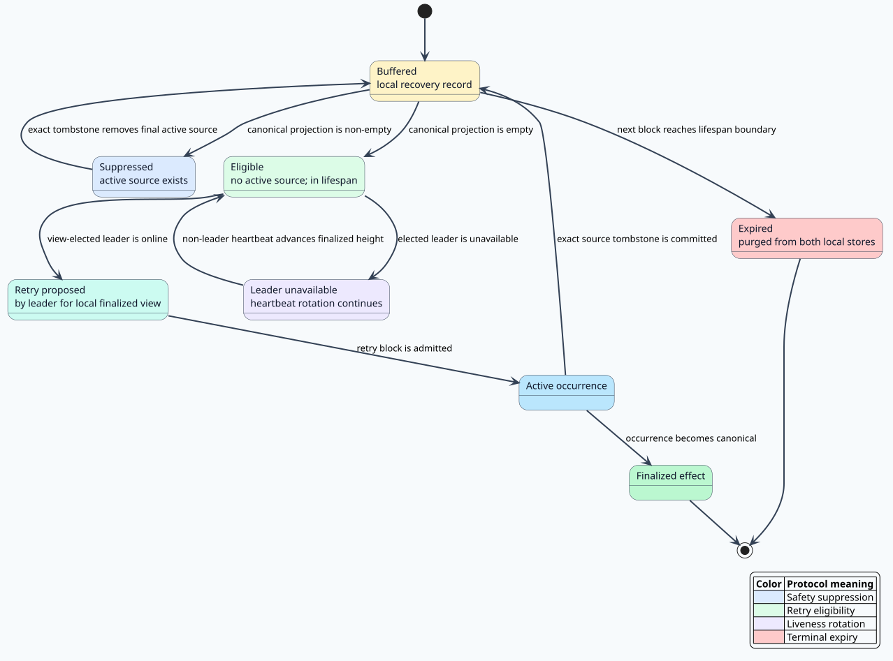

# Deploy occurrence consensus specification

## Status and scope

This document is normative for duplicate deploy handling across independently
operated validators. It specifies the protocol layer between Rholang execution
and DAG consensus. It does not change Rholang reduction semantics and does not
claim that the rho calculus selects a blockchain block.

The rho calculus gives Rholang its reflective process model. Parallel
composition is associative and commutative, while communication can still
contain genuine scheduling choice. Meredith and Radestock's foundational paper
is *A Reflective Higher-Order Calculus*, DOI
[10.1016/j.entcs.2005.05.016](https://doi.org/10.1016/j.entcs.2005.05.016).
The repository's [cost-accounted rho calculus publication](https://github.com/F1R3FLY-io/publications/blob/main/cost-accounting/cost-accounted-rho.tex)
requires same-signer deployments to compete for one linear token supply and
describes the deployment as the financial atomicity boundary. The
[RSpace denotational account](https://github.com/F1R3FLY-io/publications/blob/main/denotational-semantics-for-rho/knot-rho.tex)
separately identifies communication pairing as a source of nondeterminism.

The consequence is precise: independent validators may observe and execute
conflicting deploys in different orders, but validators that have the same
validated DAG must compute the same canonical projection. Consensus supplies
that projection; it must not pretend that all Rholang races are confluent.

## Definitions

A **deploy identifier** $`d`$ is the signed deploy's protocol identifier.

A **source block** $`b`$ is the block whose `body.deploys` contains a processed
copy of $`d`$.

A **deploy occurrence** is the pair

```math
o = (d, b).
```

Two occurrences may have the same deploy identifier and different source
blocks. They are not the same protocol event.

[](diagrams/01-state-recovery-protocol.svg)

A **rejection tombstone** is

```math
t = (d, b, r),
```

where $`r`$ is a reason: merge conflict, duplicate occurrence, or collateral
chain drop. A tombstone removes only the exact occurrence $`(d,b)`$.

A **canonical projection** is the deterministic reduction of every occurrence
and validated exact tombstone in the LFB's complete causal closure into active
and rejected occurrences. “Canonical” describes the deterministic result; it
does not restrict evidence to the LFB's main-parent spine.

## Required invariants

### O1 — source identity

Every newly created rejection record MUST contain both deploy identifier and
source block hash. Signature-only records are accepted only as legacy wire data.
They MUST NOT be interpreted as proof that every source occurrence was rejected.

### O2 — exact rejection

For observations $`O`$ and exact tombstones $`T`$ from the complete finalized
causal closure, active occurrences are

```math
A(O,T) = O \setminus \{(d,b) \mid (d,b,r) \in T\}.
```

A tombstone for $`(d,b_1)`$ cannot remove $`(d,b_2)`$ when $`b_1 \ne b_2`$.
An exact tombstone recorded by a secondary-parent ancestor has the same
authority as one recorded on the main-parent spine: both records are validated
consensus inputs to the LFB state. Main-spine placement is relevant only to the
legacy signature-wide compatibility reducer.

### O3 — deterministic keep-one

When mutually conflicting chains contain occurrences of the same deploy, every
validator applies the same total ordering. The current ordering compares, in
order:

1. descending total cost using non-wrapping arithmetic;
2. descending maximum individual deploy cost;
3. lexicographically smallest deploy identifier;
4. post-state hash;
5. the canonical deploy set;
6. source block hash.

The source hash is the final injective tie-break. Distinct chains MUST NOT
compare equal. The policy is a protocol decision; the calculus does not choose
these economic priorities.

### O4 — observation-order independence

Let $`P(O)`$ be the canonical projection. For validators $`v`$ and $`w`$,

```math
O_v = O_w \Longrightarrow P(O_v) = P(O_w).
```

Arrival order may change a validator's temporary pending view. It cannot change
the result after both validators have the same validated observation set.

### O5 — one active finalized occurrence

For every deploy identifier $`d`$ in a source-aware finalized projection,

```math
\left|\{(d',b) \in A(O,T) \mid d'=d\}\right| \le 1.
```

If the reducer finds more than one active finalized occurrence, it MUST return a
typed ambiguity error. It MUST NOT choose by map iteration, arrival order, or a
local node preference.

### O6 — one semantic reducer

Finalization status and `/api/deploy` MUST use the same all-parent canonical
disposition as state merge. An exact tombstone MUST NOT be ignored because its
recording block is outside the LFB's main-parent spine.
A secondary deploy index may accelerate lookup, but it cannot define consensus.
The occurrence index stores every valid source block; its compatibility
representative is deterministic by block height and hash.

### O7 — monotone finalization

The finalizer may advance only to the current LFB itself or a main-chain
descendant of the exact current LFB hash. Height alone is insufficient because
sibling blocks can have the same or greater height.

### O8 — recovery eligibility

Historical rejection records do not create recovery work. Parent narrowing is
permitted only when the local rejected-deploy buffer contains a currently
selectable occurrence that has not already won canonically.

### O9 — readiness is not absence

If a read-only node has received a block body but has not admitted it into its
DAG, the HTTP API returns `409 block_pending_admission`. It does not report the
block as absent and does not convert a synchronization race into an internal
error.

### O10 — canonical retry authorization

For deploy identifier $`d`$, let $`O_d`$ be every source occurrence visible in
the selected parent closure and let $`T_d`$ be the exact-source tombstones in
that same closure. Recovery is authorized only when the active-source set is
empty:

```math
A_d = O_d \setminus T_d = \varnothing.
```

A signature appearing in any rejection record is not sufficient. If one exact
source is rejected while another survives, $`A_d \neq \varnothing`$ and the
buffered deploy remains suppressed.

### O11 — strict recovery lifespan

Let $`v_d`$ be `valid_after_block_number`, $`n`$ the proposed block number, and
$`L`$ the shard deploy lifespan. Ordinary admission and recovery use the same
strict interval:

```math
v_d < n < v_d + L.
```

At $`n = v_d + L`$, the deploy is expired. Rejection history cannot extend the
interval. Expired entries are removed from both deploy storage and the local
rejected-deploy buffer.

### O12 — deterministic recovery leadership

Let $`V_h`$ be the lexicographically sorted active validator set committed at a
last finalized block of height $`h`$, with positive bonds as the compatibility
fallback when the active set is unavailable. The recovery leader for that
committed view is

```math
\operatorname{leader}(h) = V_h[h \bmod |V_h|].
```

The leader depends only on finalized on-chain state. Parent order, parent
sender, local arrival order, and wall-clock time do not participate. There is
exactly one leader for each fixed finalized-height view. Validators can
temporarily observe different finalized views, so leaders from different views
can prepare concurrent retries. This is not a consensus disagreement: each
retry is a distinct source occurrence, exact tombstones preserve surviving
sources, and pending concurrency is bounded by the number of distinct observed
views and validators. Eventual finalized-view convergence collapses the leader
set to one validator. A validator that is not the leader for its view may
propose ordinary heartbeat and finality-support blocks, but it cannot package
rejected-buffer deploys.

Recovery authorization is preserved through every downstream packaging filter.
The relevant duplicate scope is the selected candidate's parent closure, not
the validator's entire historical self-chain. Let $`H_v(d)`$ mean that validator
$`v`$ previously proposed deploy $`d`$, and let $`A_P(d)`$ mean that an active
occurrence of $`d`$ is reachable from candidate parent set $`P`$. Packaging
suppresses $`d`$ exactly when $`H_v(d) \land A_P(d)`$ and the current candidate
did not select $`d`$ for exact-source recovery. If $`H_v(d)`$ is true but
$`A_P(d)`$ is false because the old source lies on an excluded branch, the
candidate rehomes the still-authorized deploy. Treating every historical
self-chain occurrence as active would make admission and packaging consult
different scopes and could leave a valid deploy pending forever.

The candidate captures $`P`$, $`A_P`$, and its selected recovery set once.
Concurrent floor advancement may authorize a later candidate, but it cannot
change the decision already being packaged. This preserves validator
parallelism: each validator classifies against its own immutable candidate
context, without a shard-wide proposer lock.

### O13 — recovery leadership cannot suppress finality

An unavailable recovery leader cannot halt the shard. Non-leaders continue the
ordinary heartbeat protocol, advancing finality and therefore rotating
$`\operatorname{leader}(h)`$. Under the fairness premises that at least one
eligible validator remains online and published DAG data is eventually
observed, an eligible recovery record eventually either produces an active
occurrence or reaches the strict proposal-height expiry boundary.

### O14 — fail-closed consensus inputs

Canonical disposition reduction, finalized-ancestry scans, visible-source
checks, and leader selection require the block bodies and finalized metadata
named by the snapshot. Missing committed inputs are a typed local
storage/dependency failure. The node does not substitute an empty closure,
height zero, a main-parent-only view, or any node-local fallback.

## Reference reducer

```text
function recovery_decision(snapshot, deploy, validator):
    observations := complete parent-closure occurrences of deploy
    tombstones := exact source tombstones in the same closure
    active := observations minus tombstones

    if any required block body or finalized metadata is missing:
        return LocalDependencyError
    if active is not empty:
        return Suppressed

    next_block := snapshot.maximum_block_number + 1
    if not (deploy.valid_after < next_block
            and next_block < deploy.valid_after + snapshot.deploy_lifespan):
        purge deploy from both local stores
        return Expired

    validators := sorted positive-bond validators from finalized state
    leader := validators[snapshot.finalized_height mod length(validators)]
    if validator is not leader:
        return HeartbeatOnly
    selected_recoveries := {deploy}

    historical := deploy occurs on validator's self-chain
    active_in_candidate := deploy occurs in selected parent closure
    if historical and active_in_candidate and deploy not in selected_recoveries:
        return Suppressed
    return RetryOnce
```

## Compatibility

The protobuf additions use new field numbers, so old records decode with an
empty source hash and an unspecified reason. Validation retains a legacy path
for historical protocol records. Protocol-3 blocks always emit provenance.
An upgraded database can keep its old singular deploy index; new valid blocks
populate the occurrence index, and legacy lookup remains the fallback.

## Security consequences

- Invalid blocks are not added to the occurrence index.
- A peer cannot erase every copy of a deploy by supplying a signature-only
  tombstone in a new block.
- Arithmetic in merge ranking cannot wrap and reverse economic priority.
- Ambiguous canonical state fails loudly instead of allowing validators to
  report different winning blocks.
- A historical self-chain occurrence outside the selected-parent closure cannot
  mask a candidate-authorized rehome.
- Memory pressure is observed with in-flight block and process RSS metrics;
  the host-protection ceiling is not raised to conceal retention.
