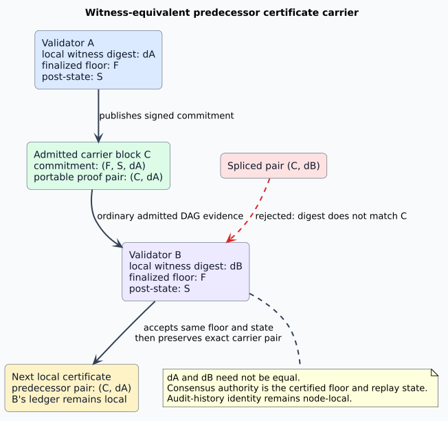

# Witness-equivalent certificate carriers

## Purpose

Protocol 6 carries finalization certificates as content-addressed sidecars. A
later certificate must identify an admitted block whose signed commitment
publishes the predecessor certificate. This document defines when that block is
a valid **predecessor certificate carrier**, why honest nodes may use different
certificate digests for the same finalized state, and how the implementation
retains exact proof identity without turning a node-local audit history into
consensus authority.

The normative requirements remain in the
[finalized-floor specification](finalized-floor-specification.md). Certificate
transport is documented separately in
[finalization-certificate retrieval](finalization-certificate-retrieval.md).



## Terms and identities

| Term | Definition |
|---|---|
| **semantic predecessor** | The exact pair containing the predecessor finalized-floor hash and its replayed post-state hash. |
| **local witness** | One node's immutable record of the latest-message snapshot, manifests, threshold, and authority context used to finalize a target. Its digest is a content address for that exact evidence. |
| **carrier block** | An accepted, causal, protocol-compatible block whose signed floor commitment names the semantic predecessor and one exact certificate digest. |
| **carrier proof pair** | The inseparable pair containing the carrier block hash and the certificate digest committed by that block. |
| **witness equivalence** | The relation between valid carrier proofs that certify the same predecessor floor and replay state, even when their evidence snapshots and digests differ. |

Let a carrier proof be `$`p=(b,d,f,s,v)`$`, where `$`b`$` is the block hash,
`$`d`$` is its committed certificate digest, `$`f`$` is its finalized-floor
hash, `$`s`$` is the floor post-state hash, and `$`v`$` is the protocol
version. For expected predecessor `$`(F,S)`$` and running protocol `$`V`$`, the
proof is eligible exactly when:

```math
\operatorname{Eligible}(p,F,S,V)
\iff
\operatorname{Accepted}(b)
\land \operatorname{Causal}(b)
\land v=V
\land f=F
\land s=S.
```

The receiver's local witness digest is intentionally absent. It remains part of
that receiver's hash-chained audit ledger, but it cannot determine whether
another honest proof for the same finalized state is usable.

## Why exact local digest equality is incorrect

Finalization witnesses include exact latest messages and supporting manifests.
Asynchronous delivery allows two honest validators to finalize the same block
and replay state from different sufficient snapshots. Their witness digests can
therefore differ without a consensus disagreement.

The former carrier lookup required a candidate block to commit the receiver's
local witness digest. If validator A published digest `$`d_A`$` while validator
B's local ledger retained `$`d_B`$`, validator B could reject A's otherwise valid
carrier forever. It then parked at the older last finalized block even after the
same certified state and a state-preserving descendant were available. The rule
confused content identity with semantic authority and converted ordinary message
arrival differences into liveness failure.

Canonicalizing all witnesses is not a repair. It would require discarding valid
evidence or synchronizing snapshots before finalization, reducing concurrency
and introducing a new consensus round. Witness equivalence retains asynchronous
Casper execution while requiring exact agreement on the state transition.

## Selection and publication algorithm

The algorithm is deterministic over one frozen certified support closure. The
ordered support set supplies the tie-break; no wall clock, receiver ledger
revision, or ambient DAG block participates.

```text
select_predecessor_carrier(support, target, expected_floor, expected_state, protocol):
    for block_hash in support in canonical hash order:
        skip block_hash when it is target
        metadata := require_valid_metadata(block_hash)
        skip unless metadata is accepted and protocol-compatible
        commitment := require_shape_valid_floor_commitment(metadata)
        skip unless commitment names expected_floor and expected_state
        require candidate parent-frontier validation
        return (block_hash, commitment.certificate_digest)
    return CarrierPending
```

The next local witness copies the selected carrier pair exactly. Before durable
append, block storage independently revalidates all of the following:

1. Genesis uses the all-zero predecessor pair; non-genesis uses a nonzero pair.
2. The carrier belongs to the witness's bounded certified support manifest.
3. The carrier metadata is accepted and protocol-compatible.
4. Its commitment names the exact predecessor floor and post-state.
5. Its committed digest equals the selected digest.

Consequently, selecting block `$`b_A`$` and then substituting digest `$`d_B`$`
is rejected even when `$`d_B`$` is a valid digest for another equivalent carrier.
Equivalence applies to complete proofs, not interchangeable proof fields.

## Parking, wakeup, and concurrency

A finalizer with no eligible causal carrier records a typed pending condition and
parks its captured local ledger revision. Admission of an accepted block wakes
that finalizer when the block commitment names the same floor and post-state as
the current local head. Digest equality is not a wake condition. The subsequent
fresh finalizer run rebuilds the support closure and performs the complete
selection and storage checks.

This split keeps the admission hot path small while remaining race-safe:

- duplicate matching admissions coalesce to one wake;
- a different post-state cannot wake the semantic obligation;
- a concurrent head revision makes the old run stale and forces fresh capture;
- restart preserves block commitments and certificate sidecars, while the local
  ledger continues its own hash chain;
- distinct validators continue replay and validation concurrently without a
  shared witness-selection lock.

## Wire compatibility and security boundary

The repair changes no protobuf field, field number, canonical encoding, block
hash, certificate schema version, or protocol-6 activation rule. Existing block
commitments already contain the floor hash, floor post-state hash, and certificate
digest; existing certificates already contain the predecessor carrier hash and
digest. The change is the validation relation between those existing values.

The following remain invalid:

- a rejected, detached, malformed, wrong-protocol, or ambient non-causal block;
- a carrier for the right floor but a different replay state;
- a carrier outside the bounded certified support closure;
- the target block serving as its own predecessor proof;
- a block/digest pair assembled from two different carriers;
- importing another node's ledger revision, record digest, or head as local state.

## Verification and regression evidence

| Layer | Guarantee |
|---|---|
| Rocq | `WitnessEquivalentCarrier.v` proves local-witness irrelevance, cross-witness interoperability, exact pair binding, digest-substitution rejection, and replay-state substitution rejection for arbitrary carrier, floor, state, digest, and protocol types. The capstone is axiom-free. |
| TLC | `WitnessEquivalentCarrier.tla` exhausts 961 reachable states for two independently scheduled nodes, three carriers, two distinct honest local digests, one wrong-state carrier, parking, admission, restart, wakeup, selection, and append. |
| Apalache | The same invariants hold symbolically through length 5. Exact-local-digest, floor-only, copied-digest, and missed-wakeup controls each produce their required counterexample by length 3. |
| Rust examples | The selector accepts either honest proof for the same floor/state, chooses the canonical supported carrier, preserves its digest, and rejects a spliced pair. |
| Property test | 256 generated carrier-hash, digest, and insertion-order cases preserve deterministic selection and exact block/digest pairing. |
| Loom | All explored park/admit orderings accept a different digest only for the same floor/state and coalesce duplicate admissions to one wake. |
| Integration | The asymmetric two-validator frontier regression retains different local witness digests, rehomes the excluded deploy, and advances both nodes through the same finalized state. |

The bounded model-checking results complement rather than replace the unbounded
Rocq proof. The Rust and Loom tests bind the abstract predicates to executable
selection, storage, and scheduling code.

## Related documentation

- [Finalization atomicity and recovery](finalization-atomicity-and-recovery.md)
- [Finalized-floor glossary](finalized-floor-glossary.md)
- [Finalized-floor verification dossier](finalized-floor-verification.md)
- [Casper consensus protocol](../../casper/CONSENSUS_PROTOCOL.md)
