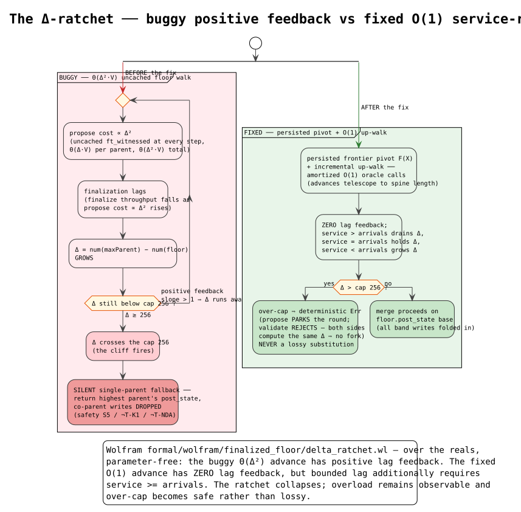
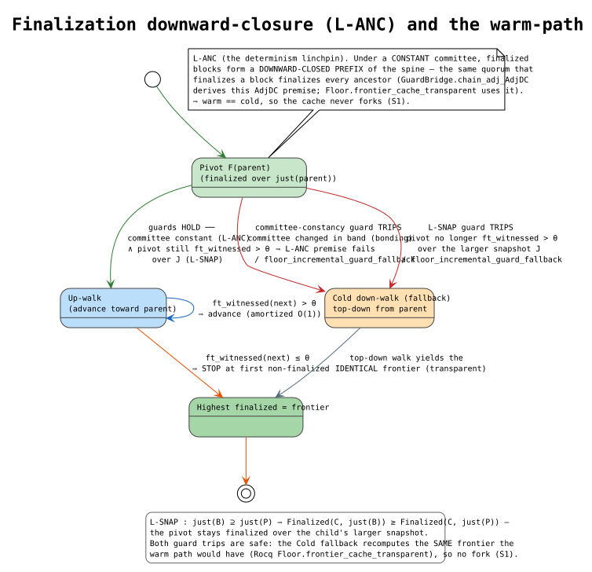

# Finalized-Floor Multi-Parent Merge — Verification & Bug-Fix Dossier

> **Status:** the merge-scope cliff, finality ratchet, stateless finalizer
> starvation, certified stale-state promotion, over-constrained main-spine
> admission, single-base accepted-effect loss, and heartbeat validation-backlog defects are **found**, **fixed**
> across the production paths, and
> covered by Rocq capstones, TLA⁺ before/after models, Rust regressions, and the
> cross-checks cataloged below. Verification is **local-only** — no Rocq/TLA⁺/
> Wolfram step is wired into CI.

This document is written so the design and its verification can be reconstructed
from scratch. It records the feature, the bug's root cause, the fix, the formal
artifacts (with theorem anchors), the invariant catalog, the additional findings,
and exactly how to re-run every check.

> **Companion docs.** [`finalized-floor-specification.md`](./finalized-floor-specification.md)
> is the normative contract (the *what must hold*, RFC-2119);
> [`finalized-floor-glossary.md`](./finalized-floor-glossary.md) defines every
> symbol/term used here (before first use) and gives literate-programming pseudocode
> for the warm up-walk and the launder-free combine. Rendered PlantUML diagrams live
> in [`diagrams/`](./diagrams/) and are embedded in §8.

---

## 1. The feature

The **finalized-floor multi-parent merge** chooses the base a new block's merge
builds on. For a block `B` with parents `P₁…Pₖ`:

- **`floor(B)`** = the highest ancestor of `B`'s parents that the clique oracle
  certifies **finalized**, evaluated over `B`'s *frozen justification snapshot*
  `just(B)` (never a node-local live view). Every input is a signed/structural
  fact of `B`, so **every honest node derives the same floor** — this is the
  linear-finality analogue of RChain's per-message fringe.
- **merge base** = `floor(B).post_state`.
- **merge scope** = the unfinalized band `closure(parents) \ closure(floor)` — the
  blocks whose writes the merge must fold onto the base.

`floor(B)` is the maximum of two candidate sources (both pure functions of `B`):

1. **Inheritance** — each parent's own floor (a child's cut never drops below a
   parent's, so a race sealed at some cut is never re-litigated).
2. **Advancement** — per parent, the highest main-chain ancestor with
   `ft_witnessed ≥ θ` over `just(B)` (genesis is finalized by definition).

Key source files:

| Concern | File |
|---|---|
| Floor derivation, frontier walk | `casper/src/rust/finality/floor.rs` |
| Clique oracle (`ft_witnessed`) | `casper/src/rust/safety/clique_oracle.rs` |
| Merge driver, scope, backstop | `casper/src/rust/util/rholang/interpreter_util.rs` (`compute_parents_post_state`) |
| Merge write-algebra | `rspace++/src/rspace/merger/merging_logic.rs`, `casper/src/rust/merging/conflict_set_merger.rs` |
| Floor / frontier cache (LMDB) | `block-storage/src/rust/dag/block_dag_key_value_storage.rs` |
| LFB candidate discovery and ordering | `casper/src/rust/finality/finalizer.rs` |
| Serialized finalizer execution | `casper/src/rust/engine/multi_parent_casper/finalization_runner.rs` |

---

## 2. The bugs — merge loss, finalizer starvation, and state-preservation bypass

The first three defects are coupled: one loses data and the other two drive the
system into that path under load. The remaining defects cross scheduling,
activation, exact occurrence, and state-derivation boundaries and therefore need
independent invariants rather than one broad “consensus” patch.

### H1 (SAFETY) — silent lossy fallback

`compute_parents_post_state` capped the merge with
`MAX_FLOOR_DISTANCE_BLOCKS = 256` and `MAX_PARENT_MERGE_SCOPE_BLOCKS = 512`. When
the finalization lag

```
Δ = num(maxParent) − num(floor)
```

exceeded the cap, it **silently returned the single highest-numbered parent's
post-state with empty rejected-sets** — discarding every other parent's committed
writes. Deterministic (no fork), but committed writes vanished (safety **S5** /
`¬T-K1` / `¬T-NDA`), and a dropped co-parent's deploys could be simultaneously
marked non-re-proposable → **permanently stranded**.

### H2 (DRIVER) — uncached Θ(Δ²·V) floor walk

`parent_frontier` re-walked the main chain **uncached** on every merge, running
the max-clique `ft_witnessed` oracle (each an O(V) per-validator ancestry BFS) at
**every** step — Θ(Δ·V) oracle calls per parent, Θ(Δ²·V) cumulatively. As Δ grew,
propose latency grew super-linearly → finalization lagged → Δ grew: a
**positive-feedback ratchet** that pushes Δ across the 256 cliff under genuine
load (concurrency + propagation delay). `DEEP_WALK_WARN_THRESHOLD = 256` only
warned.

### H3 (COMPOUND) — unbounded ancestor scan

The merge-scope ancestor collection was bounded by a shard config
(`max_parent_depth`) that **degenerated to an unbounded O(chain) scan** at its
default (`≤0` or `i32::MAX`), and could even cut *above* the floor (dropping the
band in between). It compounded H2's per-merge cost.

### H4 (LIVENESS) — stateless repeated-prefix finalizer starvation

Every finalizer invocation rebuilt the same newest-first candidate list, examined
only the first 128 entries, stopped after an eight-second wall-clock budget, gave
each candidate one second, and was itself cancelled by a fifteen-second runner
timeout. No continuation cursor survived the restart. An older finalizable
candidate could therefore remain permanently outside the repeatedly examined
prefix, or behind a repeatedly slow candidate. Because timeout expiry depends on
node-local execution speed, equal DAG state did not imply equal candidate coverage.

The green gate missed H4 because it used candidate sets smaller than the cap and
did not model repeated stateless invocations, adversarially slow candidates, or
host-dependent timeout schedules. The TLA⁺ negative controls now reproduce each
starvation class separately.

### H5 (SAFETY/LIVENESS) — finalized receipt masked by an above-floor tombstone

The exact occurrence reducer originally computed winning signatures only from
the visible above-floor scope. A sibling tombstone could therefore hide an
effect whose winning execution was already materialized in the finalized-floor
state. Recovery then treated the signature as absent and re-proposed it. For an
`IntegerAdd` channel, the duplicate execution could materialize a second datum;
for other state it could make parent-order-dependent block validity or stall
finalization.

Three refinement seams made this possible. First, base receipt precedence was
gated by the historical floor block's protocol version instead of the active
shard protocol, so a current exact scope evaluated against historical floor
metadata lost the guard.
Second, filtering removed an individual occurrence without proving that every
dependent deploy-chain effect was removed. Third, exact effect metadata was not
required to fold back to the aggregate state change used by application.

This branch exposed the defect because it introduced exact occurrence
tombstones and additive per-effect projection. `dev` lacked that new
interaction, so its older signature-wide behavior did not create this precise
base-versus-scope masking path. Earlier formal work proved above-floor
observation-order convergence but treated the finalized base as an external
state constant; it therefore did not model activation, historical floor
versions, or the state-record projection boundary. The new models make those
three premises explicit and include unsafe controls for each omission.

### H6 (SAFETY/LIVENESS) — split protocol-version authority at genesis

The cost-accounted binary configured Casper protocol 2, but
`ApproveBlockProtocolFactory::create` hard-coded `Genesis.version = 1`.
Approvers consequently signed a protocol-1 genesis while block creation read the
protocol-2 running configuration and emitted protocol-2 blocks. Peer admission
then read a third lifecycle point: `BlockProcessor::check_if_of_interest`
compared those blocks with the approved genesis header's version 1. Honest peers
discarded honest protocol-2 proposals before validation, so validators advanced
different local branches and finality stalled.

The observed split was therefore a genuine consensus disagreement, but its
cause preceded merge ordering: the network had no single protocol-version
authority spanning ceremony, running state, proposal, and reception. It appeared
on this branch because the D3 protobuf change declared protocol 2 for the
fresh-genesis cost-accounted encoding while the ceremony retained the old
literal. `dev` still used the protocol-1 lifecycle and did not create that
cross-version combination.

Earlier formal verification missed H6 because its transition systems began
after the active protocol had already been selected. The activation model proved
how an active-version merge interprets historical floor metadata, and the
end-to-end cost model proved execution through finality under one fixed protocol;
neither modeled genesis candidate construction, approver version checks,
approved-block admission, runtime adoption, proposer headers, and receiver
interest filtering in one state machine. `ProtocolVersionLifecycle.tla` and
`ProtocolVersionLifecycle.v` now make those omitted transitions and refinement
points explicit.

### H8 (SAFETY/LIVENESS) — clique-certified state-lineage bypass

The finalizer previously treated this conjunction as sufficient for LFB
advancement: the exact clique oracle certified candidate `C`, and `C` was a
main-chain descendant of current LFB `F`. That implication is false for a
multi-parent execution DAG. `C` can name `F` in its main-parent ancestry while
its post-state was computed from an older floor because another parent conflicted
with `F`. DAG ancestry records message causality; it does not prove state
derivation.

The execution path had the matching defect. A covering-parent fast path could
return that parent's post-state before proving that the newly derived floor was
already in the parent's state lineage. If the floor had advanced to a conflicting
branch, the shortcut bypassed its finalized transition. The result was not a
different majority vote: the stale candidate could legitimately retain its clique
certificate. The failure was installing a certified state that omitted an effect
already committed by `F`.

This interaction is branch-specific. The branch combined finalized-floor
advancement, floor-bounded multi-parent replay, exact conflict disposition, and
cost-accounting state transitions. `dev` did not contain that composition. The
cost-accounting papers require atomic resource commitment and conservation but do
not specify Casper's LFB-selection algorithm. The repair is therefore a node-level
refinement derived from the papers' atomicity obligation plus the existing Casper
contract that finalized state is permanent; it is not attributed to a paper as a
verbatim rule.

Earlier verification missed H8 because its abstraction identified DAG ancestry
with state ancestry. The merge models represented parent effects as monotone sets
or began from an already selected merge base, and the finalizer model represented
candidate readiness as one predicate. None carried an explicit block-to-state-base
edge across execution, certification, and LFB installation. Tests likewise lacked
the discriminating schedule: finalize one conflicting sibling, receive a valid
merge computed below it, prove that merge is still clique-certified, and then
require a later floor rebase to preserve the finalized value. H8 closes those
omissions rather than weakening the assertion to make the observed test pass.

The first H8 repair exposed a second, strictly different counterexample. Suppose
candidate `P` preserves the current LFB, but a heavy validator's latest block is a
merge that names `P` as a DAG parent while rejecting `P`'s conflicting state
effect. The original causal oracle counts that validator because `P` is in the
merge's all-parent DAG past. The validator's latest state does **not** descend
from `P`. With weights $`7/3/3/3`$, the merge validator and `P`'s proposer contribute
causal weight $`10/16`$, enough to clear a strict $`0.1`$ threshold, while only weight
$`3/16`$ preserves `P`'s state. Current-LFB ancestry alone admits `P`; using it as a
later replay floor reintroduces the rejected transition and can apply its private
resource twice.

This is not a flaw in weighted-majority arithmetic. It is a mismatch between the
proposition certified by causal ancestry and the stronger proposition required of
a state floor. The complete repair retains the causal certificate and additionally
requires an exact **state-preserving certificate**. Its supporting validators are
those whose frozen latest messages both causally include the candidate and
state-descend from it; the node then runs the same hard-majority, maximum-clique,
and exact-threshold calculation over that restricted support. A candidate must
also state-descend from the current LFB. Thus neither certificate can stand in for
the other.

Earlier verification missed this refinement because `certified` was deliberately
abstract in the state-lineage proof and the TLA+ model assigned certification per
block. Neither model related each certificate voter's frozen latest-message state
to the candidate. The strengthened Rocq theory defines state agreement and proves
that state-preserving finalization refines causal finalization. The strengthened
TLA+ model contains a candidate that passes causal certification and current-LFB
ancestry but fails state certification; disabling only the new gate reproduces
the unsupported-floor promotion.

### H9 (LIVENESS) — state-safe multi-parent rebase rejected off the main spine

The first H8 repair kept the old main-chain-descendant condition and added state
ancestry beside it. That conjunction was too strong. In an asymmetric 60/20/15
validator schedule, the heavy validator resumed after a pause and finalized
`061ba6…` at height 6. Parent selection then correctly kept that block as a
secondary parent while promoting deploy-carrying `6adc63…`/`114ff0…` branches to
main parent. Their replay states included `061ba6…`, and nodes continued validating
and producing blocks through approximately height 59, but every later candidate
failed the main-spine prefilter. The boot node's LFB consequently remained at
height 6.

The main-parent relation is the path over which finalizer agreements are
propagated; it is not the provenance relation of a multi-parent post-state. The
necessary and sufficient admission refinement is therefore unchanged exact clique
certification plus state ancestry. Removing the redundant main-spine conjunct does
not admit the H8 stale candidate because that candidate still lacks state ancestry.
It does admit a rebased candidate whose old LFB is a secondary parent.

Earlier H8 verification missed H9 because both its concrete Rocq scenario and its
TLA⁺ rebase encoded the old LFB as a main ancestor of the repaired block. They
proved the safety gate but did not vary main ancestry independently from state
ancestry. The strengthened artifacts now make the rebased block a DAG descendant
and state descendant of the LFB while placing it on a different main-parent spine.
The exact 60/20/15 stake map and strict `FTT=0.1` arithmetic reproduce the
integration topology. A dedicated negative control turns the erroneous main-spine
conjunct back on and must fail off-main rebase eligibility; a separate fair-trace
control must violate eventual two-node rebase progress rather than merely checking
the initial eligibility predicate.

### H10 (SAFETY/LIVENESS) — exact-effect rejection expanded by block ancestry

After H8 preserved the older clique-certified state floor, the merge scope could
contain two sibling `closeBlock` effects: the one already materialized in the
floor and a stale sibling transition that consumed the same pre-floor PoS cell.
Availability filtering correctly rejected the stale exact effect. The subsequent
fallback then expanded that rejection to every chain whose **source block** was a
DAG descendant of the stale source block. That relation was too coarse for a
block containing multiple exact per-execution witnesses. It removed a merge
effect that consumed the retained floor resource and unrelated user effects even
though neither physically depended on the stale transition. The resulting empty
or incomplete merge scope caused proposal stalls and, under asymmetric delivery,
different locally observed deploy blocks.

The correct relation is between exact state transitions, not their containing
blocks. A target physically depends on a source when it removes the byte-identical
ordinary datum or continuation added by that source under the same channel key.
Mergeable number-channel materializations are excluded because their typed deltas
are combined algebraically. Rejection is the least transitive closure of the
direct rejection seeds under that relation. Independent exact effects survive;
whole-block descendant expansion remains only as a conservative fallback for
legacy indices without exact witnesses.

This branch exposed H10 because it combined three changes absent as a composition
on `dev`: exact per-execution state witnesses, partial occurrence rejection, and
the H8 state-lineage floor that retains one conflicting sibling as the merge base.
The pre-existing block-lineage fallback had been sound only for its coarse
whole-block abstraction. Earlier proofs modeled complete deploy chains as atomic,
or began after a correct base and survivor set had already been chosen. They
therefore proved closure of a modeled chain but did not relate partial exact-effect
rejection to physical RSpace resources. `EffectCausalClosure.tla` now explores
every dependency-ready classification order. Its two unsafe controls reproduce
both blanket descendant loss and the dual one-hop error. The axiom-free Rocq
development defines the rejection set as the least closed set and proves both
independent-effect survival and absence of accepted dependents of rejected state.

### H11 (SAFETY/LIVENESS) — one state base erased accepted merge provenance

The first H8 repair represented every block by one functional “direct state
base.” A covering parent was selected when it covered all parents and preserved
the floor; otherwise the block's state base collapsed to the finalized floor.
That abstraction is not a refinement of the runtime merge. A valid three-parent
merge begins at the floor but folds accepted effects from **all** non-redundant
parents. When no parent covers the other two, recording only the floor falsely
reports those accepted parent transitions as absent.

The failure compounds over two merge rounds. Three validators can each produce
a valid merge of the same source and two siblings, and the next round can merge
those three tips in any parent order. Runtime replay retains the source effect in
every tip, but the single-base relation reports only the floor. State-support
certification then withholds votes from valid latest messages, so nodes with
different delivery prefixes can temporarily select different deploy-inclusion
blocks and stop advancing their LFB. The deploy-summary disagreement, pending
deploys, negative fault-tolerance assertions, and later unavailable-Casper or
unknown-root errors are downstream symptoms of that one provenance mismatch.

This regression was introduced on this branch by the first state-lineage repair;
`dev` had neither the functional state-base gate nor this failure mode. The
formal work missed it because `StateLineageFinality.v` assumed an abstract
reflexive/transitive preservation relation, while `StateLineageFinality.tla`
assigned the relation as a scenario table. Neither artifact proved a refinement
map from the actual accepted/rejected merge effects to that relation. Tests
covered explicit rejection and rebase, but not an accepted three-way merge,
all parent permutations, a repeated merge round, and majority certification in
one scenario.

The repair makes the missing refinement data consensus-visible. Every successful
execution has identity $`(source\_block\_hash, execution\_index)`$; every block
serializes the exact canonical identities its parent merge rejected; and DAG
metadata persists successful local indices, rejected identities, and protocol
version. Active effects are then derived by the exact merge recurrence in the
normative specification. The state-preservation predicate is no longer a guessed
base chain: it is DAG ancestry plus subset inclusion between the two derived
active-effect sets.

### H12 (LIVENESS) — a dual-certified state floor was invisible off every main spine

The H8/H9 repair correctly allowed the finalizer to certify a state-preserving
candidate whose current LFB survived through a secondary parent. Per-block floor
derivation still enumerated only inherited floors and each declared parent's
main-parent frontier. Those two components therefore used different discovery
relations: LFB admission consumed complete causal evidence, while replay-floor
advancement consumed only main-spine evidence.

The retained five-node trace made the separation explicit. Validator 1 made 444
floor derivations and chose genesis every time. During the same execution, several
blocks held causal and state-preserving support of `300/300`; the deploy-bearing
state was later present in the global finalizer's certified ancestor batch. Deploy
support legitimately moved each proposal's main parent to another branch, leaving
the certified state as a secondary ancestor of every selected tip. It was therefore
universal in the causal DAG but absent from every per-parent main spine. Different
delivery prefixes then observed the deploy in different unfinalized blocks, while
pending deploys, stalled LFB heights, unavailable-Casper responses, and unknown
RSpace roots accumulated downstream. The node disagreement was a real liveness
and state-progression defect; changing query assertions or majority thresholds
would only hide it.

This branch exposed H12 because state-preserving LFB admission and deploy-aware
parent selection made off-main committed state both legal and routine. `dev` did
not compose those mechanisms. Earlier formal verification proved the finalizer's
off-main admission rule and separately proved active-effect preservation, but it
left candidate enumeration in `derive_floor` outside the refinement map. The
models assumed that a certified candidate was already discoverable. Tests likewise
covered off-main LFB admission and parent-order invariance without constructing a
candidate that was secondary to **all** current parents and absent from **all**
their main spines.

The repair adds a third, block-structural candidate source. A deterministic
multi-source traversal propagates one coverage identity from each declared parent
through every causal edge in descending `(block_number, block_hash)` order. The
highest candidate covered by every parent is admitted only when the unchanged
causal certificate, unchanged state-preserving certificate, and inherited-floor
preservation all hold over the block's frozen justification snapshot. Strictly
descending edge heights prove that coverage is complete when a candidate is
examined; malformed or late coverage fails closed. The existing sound-base chooser
then handles the candidate without altering finalizer agreement propagation,
voters, weights, clique selection, or exact `FTT` arithmetic.

`CertifiedFloorPromotion.tla` exhausts every two-node delivery/derivation order:
1,051 generated states, 225 distinct states, depth 9. The safe causal-discovery
model preserves certificate separation and eventually promotes both nodes; the
main-spine-only control violates complete-evidence promotion after one node receives
all three tips. Apalache independently checks the safe invariants through bound 8
and finds the unsafe trace at step 3. The axiom-free Rocq development proves that
a dual-certified current floor preserved by every parent is both universal and
causally discoverable, and that selecting only universal candidates preserves the
current floor. Rust examples exercise the exact `FTT=0.1` three-validator topology,
all six parent permutations, and a state-rejection control; a generated-DAG test
varies side-branch and post-merge depths plus parent order.

The first complete repair was semantically correct but evaluated causal support
with one storage-backed ancestry walk for every candidate-validator pair. AMD
uProf measured approximately 18.13 seconds in raw DAG ancestry, 15.38 seconds in
the universal frontier, and 16 seconds in clique evaluation on the 132-block
regression. The exact test therefore took 63.21 seconds after state-provenance
memoization. The optimized algorithm computes the transposed relation once:
validator identities begin at the frozen latest messages and propagate through
all causal parents in descending height/hash order. For every candidate `C`, its
result is exactly $`\{v \mid C \preceq_{DAG} J(v)\}`$; the corresponding weight
map, maximum-clique input, hard-majority gate, threshold, and strictness remain
unchanged. The same regression now passes in 22.92 seconds while retaining all
132 blocks needed to cross the former 128-candidate boundary.

The scan-reuse guard is deliberately narrower than “same evidence.” A child may
reuse its parent's result only across a one-parent edge whose parent also has one
predecessor, whose inherited floor matches the cached parent floor, whose frozen
snapshot is identical, and whose latest messages are all older than the parent.
A multi-parent merge always rescans because creating the merge can make a
previously branch-local certified candidate universal even when no validator
message changed.

Rocq proves propagated coverage equivalent to pairwise reachability and proves
the linear-snapshot reuse theorem from the one-predecessor and unsupported-parent
premises. `LatestMessageCoverage.tla` executes the worklist itself rather than
assuming the result. TLC exhausts 27 generated / 16 distinct states to depth 8,
proves partial soundness, exact coverage for every processed block, exact final
coverage, absence of late propagation, and termination. Removing only the
descending scheduler violates `Inv_NoLateCoverage` after processing one shared
ancestor too early. Apalache checks the safe model through bound 8 and finds the
same unsafe trace through bound 4. Rust compares the propagated supporter set,
corresponding weight map, and final clique decision with the original pairwise
oracle across generated branch depths and every parent permutation; malformed
non-descending edges and all reuse-guard exclusions have example regressions.

### H13 (SAFETY/LIVENESS) — snapshot state support raced incomplete provenance

The six-node bonding lifecycle exposed a second closure boundary. Snapshot parent
selection captured a complete latest-message map, but it materialized finalized
floors only for the selected parent set. An off-parent latest message could carry
an exact rejected-effect record, so deciding whether it preserved the captured
LFB recursively called `state_input_blocks(latest)`. Its canonical floor was not
yet in `floor-index`. The query therefore failed with `finalized floor is not
materialized for state provenance`, even though the block and all causal metadata
were present.

The failure was timing-sensitive because block processing and the finalizer both
populate the same write-once cache. Nodes with a fortuitous finalizer interleaving
had the entry; another node could reach snapshot selection first. The failed
proposal or dependency-free block remained eligible for another attempt. In the
retained trace this produced 175 repeated processing failures on one node and 142
replays per node, amplifying CPU and RSS until the host-protection guardian fired.
This was not a clique, threshold, or committee disagreement. It was an incomplete
precondition for a deterministic state-support query.

The repair freezes one target set containing the current LFB, all latest messages,
and the selected parents, sorts and deduplicates it by block hash, and recursively
materializes every target before state-support selection. `finalized_floor`
uses the same closure for its parent and justification inputs. Cache population
is monotone and idempotent, so arbitrary finalizer/snapshot interleavings produce
the same union; any real storage or provenance error still aborts the snapshot.

`SnapshotFloorMaterialization.tla` executes snapshot and finalizer writes in every
order. TLC exhausts 18 generated / 10 distinct states to depth 5, proves the cache
is exactly the union of completed canonical closures, proves selection requires
the complete snapshot closure, and proves eventual selection. The parent-only
control reaches selection without the off-parent latest closure and violates
`Inv_SelectedSnapshotHasCompleteProvenance` at depth 3. Apalache independently
checks the safe invariants through bound 8 and finds the unsafe trace through
bound 4. Rocq proves closure completeness, preservation of existing entries,
permutation transparency, idempotence, and commutation with arbitrary finalizer
materialization; the concrete parent-only witness is incomplete. Rust examples
exercise both `finalized_floor` and snapshot fork choice without pre-seeding the
off-parent cache entry.

### H14 (LIVENESS/RESOURCE) — heartbeat production outran validation and replay

The failing multi-validator runs did not show the clique oracle selecting two
different LFBs. They showed a production/consumption instability before stable
finality: every validator repeatedly produced empty or support blocks while each
node was still validating and replaying peers' preceding blocks. A block took
approximately 6–10 seconds to validate in the retained run, while three validators
could collectively introduce several blocks within one 5–10 second interval. The
unresolved DAG widened, live replay state accumulated, finalization arrived in
50–110 second batches, API requests timed out, and the resource guardian eventually
terminated the nodes.

The pre-repair heartbeat predicate conflated three different observations:
producer-supplied LFB timestamp age, latest-frontier timestamp activity, and actual
local LFB advancement. A producer timestamp could be old while the finalizer was
making useful progress; frontier churn could remain fresh while the LFB was stuck;
and missing latest-message state allowed every validator to manufacture more empty
work. The existing unfinalized-width pressure guard applied only after this feedback
had already opened and used a strict `>` boundary. A fixed leader would reduce
production but fail liveness when that validator was offline.

The earlier formal campaign missed H14 because the finalized-floor and recovery
models ended at a stable finite candidate snapshot. They did not compose continuous
heartbeat arrival, independently advancing validator-local recovery views, a finite
validation service rate, bounded admission, and an offline first leader. Example
tests likewise checked one heartbeat decision at a time rather than an adversarial
producer/consumer schedule. The missing dimension was distributed queue dynamics,
not another arithmetic case in the clique calculation.

`HeartbeatFinalityBackpressure.tla` closes that state-space boundary. Each validator
has an independent recovery view; candidate production, validation, causal support,
state-preserving support, and promotion interleave. The safe model retains the exact
hard-majority and threshold formula, permits only the deterministic leader for each
numeric round, enforces the queue cap, and requires both certificates. TLC explores
14,431 generated / 3,900 distinct states to depth 24 and proves bounded backlog,
per-round leadership, leader/attempt agreement, state-support refinement, and exact
dual-certificate promotion, plus liveness past an offline first leader. The eager
control violates the backlog invariant, the fixed-leader control violates temporal
liveness, and the causal-only control violates exact state certification. Apalache
independently checks the safe invariants through bound 10 and finds the eager and
causal-only counterexamples.

The axiom-free Rocq refinement proves rotating-leader committee membership and
uniqueness, one attempt per observed recovery round, unchanged-floor history
preservation, actual-floor-change reset, and capacity-preserving enqueue. Rust
properties prove leader permutation independence, uniqueness, and complete rotation
over every normalized committee. Focused examples prove an actual observed-LFB stall
opens one selected recovery attempt, missing latest state alone produces nothing,
pending deploys retain admission, and the unfinalized-DAG boundary backpressures
idle recovery.

### Why the green-gate missed it

The convergence gate `three_writers_converge_under_load = run_convergence(3,3,21)`
is ≈ **35 blocks** — far below the 256 cliff. The 400-block observation is a
soak / shard run under real concurrency, where the ratchet has room to build.

### The ratchet, quantitatively

Model the finality lag as a difference equation `Δₙ₊₁ = f(Δₙ)` where a propose
step advances the tip and a finalize step advances the floor, and finalize
throughput falls as propose cost `∝ Δ²` rises. `formal/wolfram/finalized_floor/
delta_ratchet.wl` shows — parameter-free, over the reals — that with the buggy
Θ(Δ²) advance the feedback slope exceeds 1 at **every** equilibrium (unstable:
Δ runs away), whereas the fixed **O(1)** advance has zero feedback (Δ stable).

```
 Δ  ▲                              buggy: propose cost ∝ Δ²  → finalize starves
256 ┤· · · · · · · · · · · ·╱····  cliff (silent write-loss fires here)
    │                    ╱⟋   ← runaway (slope > 1 at every fixed point)
    │              ╱⟋⟋
    │        ╱⟋⟋
  k ┤─────────────────────────────  fixed: O(1) advance → Δ bounded (flat)
    └────────────────────────────▶ block height
```

---

## 3. The fix

### 3.1 H2 — persist a per-block frontier + incremental up-walk

Cache `F(X) := parent_frontier(X, just(X))` — the highest witnessed-finalized
block on `X`'s main spine over `X`'s **own** snapshot — in a new `frontier-index`
LMDB store mirroring `floor-index`. `F(X)` is a pure function of the block (it is
exactly the `parents[0]` advancement candidate `derive_floor` already computes),
so caching is free; `floor_of_block` persists it, `derive_floor` now returns
`(floor, F(B))`.

`parent_frontier(parent, J)` (where `J = just(child) ⊇ just(parent)`) becomes:

- **Warm** (`incremental_frontier`): read the cached pivot `F(parent)`; verify it
  still finalizes over the larger `J` (**L-SNAP** guard) and that the committee is
  constant across the band (**L-ANC** guard); then **up-walk** the spine from the
  pivot toward `parent`, advancing while each block stays finalized. The band is
  collected with cheap `main_parent` hops (no oracle calls); only the up-walk
  itself calls the oracle — `O(advance)` calls, **amortized O(1)** (advance sums
  telescope to the spine length).
- **Cold** (`cold_parent_frontier`): the original top-down walk (cache miss, guard
  trip, pivot off-spine, or genesis).

```
 spine (bottom→top):   genesis ── … ── F(parent) ── … ── parent
 flags over just(B):    true    true    TRUE(pivot)  ?…?     ?
 warm up-walk:                          └──advance──▶ stop at first non-final
 cold down-walk:        first finalized from the top ◀──────┘   (== warm, by L-ANC)
```

**Determinism linchpin (why the cache never forks):**

- **L-ANC** (ancestor-monotone): `Finalized(C,J) ∧ C' ancestor of C ⟹ Finalized(C',J)`.
  The *same* quorum that finalizes `C` finalizes every ancestor (each member has
  `C`, hence `C'`, in its past). ⟹ finalized blocks are a downward-closed prefix
  of the spine, so "highest finalized" is well-defined and the up-walk may stop at
  the first non-finalized block.
- **L-SNAP** (snapshot-monotone): `just(B) ⊇ just(P) ⟹ Finalized(C,just(B)) ≥
  Finalized(C,just(P))`. ⟹ the pivot stays valid over the child's larger snapshot.

Together: **warm-walk result == cold-walk result** (transparent cache).
Residual: a bonding event inside the band can break L-ANC's constant-committee
premise; the warm path detects this (committee comparison) and falls back to the
cold walk (`floor_incremental_guard_fallback` metric). This guard is **not merely a
runtime check** — Rocq `GuardBridge.chain_adj_AdjDC` proves that a *constant*
committee across the band **derives** `Floor.frontier_cache_transparent`'s `AdjDC`
premise from L-ANC, so the guard is exactly the condition under which warm == cold
(the "Rocq assumes what Rust enforces" seam is closed; tested by
`guard_trip_committee_change_falls_back_to_cold`).

### 3.2 H1 — deterministic backstop, never a silent lossy substitution

The over-cap path now returns `Err(CasperError…)` keyed on the **deterministic**
`floor_distance` Δ only. On **propose** the `Err` parks the round (retried once
finality advances and Δ shrinks); on **validate** an over-Δ block is
deterministically invalid — both sides compute the same Δ, so **no fork**. The
scope-size test `|visible_blocks| > 512` is **demoted to a metric** — it is *not*
node-deterministic (branch width differs across views), so it must never gate
admission. The lossy `put_cached_parents_post_state` was deleted. This also fixes
the `canonical_won_sigs` stranding.

### 3.3 H3 — floor-bounded ancestor scan

The floor is now derived **before** the ancestor scan, which is bounded at the
floor height (`meta.block_number ≥ floor_block_number`) — `O(Δ)`, and never cuts
above the floor.

### 3.4 Metrics

Renamed `MERGE_SCOPE_TOO_LARGE_FALLBACK_FIRED` → `MERGE_SCOPE_BACKSTOP_ERROR`;
added `floor_distance`, `merge_scope_size`, `floor_walk_oracle_calls`,
`floor_frontier_advance`, frontier `cache_hit`/`cache_miss`, and
`floor_incremental_guard_fallback`.

Net effect: per-merge cost **Θ(Δ²·V) → amortized O(1) oracle + O(Δ) cheap reads**;
the ratchet collapses and over-cap is safe.

### 3.5 H4 — complete deterministic scan over one frozen view

One invocation now freezes latest messages once, derives both traversal roots and
the clique snapshot from that same immutable view, traverses the complete
main-parent closure above the exact current LFB height, and deterministically orders the
result by height, agreeing stake, agreeing-set size, and block hash. It evaluates
that complete sequence until the highest finalizable candidate is selected or the
finite snapshot is exhausted.

Discovery deduplicates each `(validator, block)` pair when it is enqueued, rather
than after the next breadth layer is allocated. Reconvergent parent paths therefore
cannot inflate the frontier with duplicate work: the traversal remains complete
while its scheduled work is bounded by the reachable pair set. Rocq proves that
the deduplicated schedule has exact union membership and contains no duplicates.

Missing candidate metadata or parent data is an error, not evidence that a
candidate is non-finalizable. Cooperative yields limit scheduler monopolization
without changing coverage or classification. The serialized runner no longer
cancels a correct scan on a local wall-clock deadline. Consequently, a frozen
view has one node-independent result: selected highest candidate, exhaustive
absence, or an explicit inconclusive error.

### 3.6 H5 — active-version base precedence and exact chain projection

The merger now constructs a base-committed receipt set from the finalized-floor
body and gives it precedence over every above-floor tombstone. Exact tombstones
remain causal and scope-local: they reject the complete dependent deploy chain,
not merely the named occurrence. The same selected-chain projection drives the
ordinary state fold, mergeable contributions, and disposition records.

Protocol activation is a consensus boundary rather than a runtime feature
switch. The active shard protocol selects exact semantics even when the floor is
a legacy block. Every admitted above-floor source has that active version. Each
record is decoded according to its containing block header: current records
require causal provenance and a specified reason; legacy records require the
legacy empty-provenance/unspecified representation. Mixed scope versions and
protocol-incompatible encodings fail closed.

`DeployChainIndex::validate_exact_projection` independently recomputes the
ordinary and mergeable aggregates from the exact per-effect map. It rejects a
missing effect, repeated identity, inconsistent repeated identity, noncontiguous
root chain, or aggregate mismatch before any state is selected or applied.

The legacy-floor/current-scope case is a defensive composition property of the
merge reducer. It is not the network migration path: D3 removes and reserves
legacy wire fields, so this release starts protocol 4 from a fresh protocol-4
genesis and rejects protocols 1 through 3 as active approved protocols. Protocol
2 remains the historical threshold for exact rejected-deploy disposition records;
protocol 3 activates exact per-execution state-effect provenance, and protocol 4
activates vault-backed quantitative byte evidence.

### 3.7 H6 — one fail-closed protocol-version lifecycle

Genesis construction now receives the configured protocol version and emits it
in the candidate header. Every genesis approver validates that header against
its configured version before signing. Approved-block validation and
`hash_set_casper` admit only explicitly supported protocols; this release's set
is exactly `{4}`, so protocols 1 through 3 and unknown versions fail without
mutating the shard configuration.

After admission, the approved version is adopted into the running
`CasperShardConf`, and initialization and recovery retain that adopted
configuration. Proposal construction and peer-interest filtering both read the
running version via `Casper::get_version`; the approved genesis header is no
longer an independent receiver authority. Thus ceremony, approval, adoption,
proposal, and reception form one version chain. There is no accounting feature
flag, legacy execution path, A/B mode, or height-triggered transition in the
binary.

### 3.8 H7 — concurrent rejection causes form a canonical join

An exact tombstone's causal authority is its `(deploy signature, source block)`
key. Its reason explains why that occurrence was removed, but it does not grant
additional authority. Concurrent descendants can therefore record different
valid reasons for the same key when one closure sees a direct duplicate and
another sees only the containing chain's collateral removal.

The reducer treats reasons as the four-element ordered join-semilattice

```math
r_{\bot} \prec r_{\mathrm{collateral}} \prec r_{\mathrm{merge}}
\prec r_{\mathrm{duplicate}}.
```

`Unspecified` is `$`r_{\bot}`$` and is forbidden in a current-protocol record;
it remains the fold identity. Canonicalization is the maximum under this order.
A direct duplicate therefore dominates every alternative, a direct merge
conflict dominates a merely collateral removal, and repeated evidence is
idempotent.

```text
join_reasons(records):
    reason := unspecified
    for each causally valid record in any order:
        reason := max_by_protocol_precedence(reason, record.reason)
    return reason
```

The last-writer implementation is retained as a TLA+ negative control: two
validators can observe the same `{merge_conflict, collateral_chain_drop}` set in
opposite orders and serialize different results. `RejectionReasonConfluence.tla`
exhausts all interleavings and proves equal-observation convergence for the
canonical join. `RejectionReasonConfluence.v` proves commutativity,
associativity, idempotence, direct-cause precedence, and arbitrary-list
permutation invariance without added axioms.

The finalization-status projection uses the same causal evidence scope as the
merge reducer. Every validated exact tombstone in the LFB's complete parent
closure is authoritative, including a record reached only through a secondary
parent. Restricting exact records to the main-parent spine can leave two active
sources in the API after committed state retained one. The
`FinalizedOccurrenceStatus` TLC and Apalache models retain that implementation
as a negative control, while Rocq proves causal-closure authority independent
of main-spine placement and the Rust DAG regression checks the complete
resolver path. Legacy signature-wide records retain their historical
main-chain rule; this does not weaken protocol-3 exact occurrence semantics.

### 3.9 H8 — preserve certification, constrain committed-state promotion

The H8 admission repair separates the existing causal certificate from a second
state-preserving certificate. H11 replaces its initial single-base realization
with exact state-effect provenance; the admission architecture remains valid,
but its preservation predicate now means active-effect inclusion.

Floor-frontier advancement first reduces the raw causal main-parent frontier to
the highest state-preserving candidate, then lowers it along the same main-parent
spine until it holds the state-preserving certificate. Floor selection also
rejects a candidate at or above an inherited floor when it does not preserve
every effect active at that inherited state. The execution fast path is
conditional on the same predicate;
otherwise `compute_parents_post_state` replays the floor-bounded merge. These three
sites use the same provenance rule, so proposal, replay, and finalization cannot
assign different meanings to a block's accepted effects.

The causal clique oracle is unchanged. `Finalizer::run` still discovers and orders
the complete frozen main-parent candidate set, applies the same exact
strict-majority upper-bound test, and calls the same exact maximum-clique decision.
After causal certification, it requires a second exact certificate over validators
whose frozen latest-message states preserve the candidate. It finally requires the
candidate to preserve every active current-LFB effect. A stale-state block remains
valid and causally certified but cannot replace committed state. A causally
certified rejected parent likewise cannot become a state floor merely because a
heavy validator named it as a merge parent.

The floor path applies the same state certificate to each causal frontier before
using it as an advancement candidate. Finalized-floor materialization closes over
both DAG parents and frozen justification tips, because either can be traversed by
the state-support predicate. Active-effect evaluation closes over maximal parents
and the cached floor and is memoized per `(block, effect)`; this changes no result
because the recurrence is an immutable function of consensus metadata.

The next proposal detects that its covering parent does not preserve the advanced
floor, rebases from the floor, and restores progress.

This separation avoids the unsafe alternative of retroactively invalidating the
stale block after another block finalizes. Validity remains a pure function of the
block and its ancestors. The causal and state-preserving certificates are pure
functions of a frozen snapshot; LFB admissibility adds the transition predicate
over the current committed state.

### 3.10 H11 — exact active-effect recurrence and canonical validation

For a block `B`, let `Own(B)` be its successful user and system execution
identities, `Rejected(B)` the exact set recomputed by the merge, and `Inputs(B)`
its maximal direct parents plus its finalized floor. The implementation evaluates:

```math
Active(B) = \left(Own(B) \cup
  \bigcup_{I \in Inputs(B)} Active(I)\right) \setminus Rejected(B).
```

The block creator serializes `Rejected(B)` in sorted unique order. Validation
recomputes the same merge and rejects missing, extra, duplicated, or misordered
identities. `BlockMetadata::from_block` derives `Own(B)` only from successful
executions and persists the protocol version. Protocol-2 finality fails closed
if provenance is unavailable; legacy persisted metadata is not guessed.

`is_state_preserved(A,D)` first requires DAG ancestry. It then scans the
height-bounded causal past above `A` for a deterministic superset of potentially
removed identities. For every candidate active at `A`, it evaluates the recurrence
at `D`; one missing effect rejects preservation. Unrelated rejections are harmless.
Rocq proves this complete-superset check equivalent to full set inclusion, while
the Rust regression exercises an unrelated sibling rejection.

AMD uProf identified repeated per-edge DAG-ancestry queries and metadata decoding
inside the original state-preservation scan. The repair performs one causal-past
traversal with a height bound and memoizes metadata, ancestry, active-effect, and
preservation queries for the complete floor-materialization run. A second profile
reduced state-provenance work to approximately 0.08 seconds and thereby isolated
the remaining cost in H12's causal-support calculation rather than hiding it in
state reconstruction.

### 3.11 H14 — observed-progress recovery with bounded rotating leadership

The heartbeat task records the last LFB hash it actually observed and a monotonic
`Instant` for that observation. A new hash resets recovery history. Continued
observation of the same hash opens zero-based recovery rounds at intervals of
`max(max_lfb_age, check_interval)`. The leader is selected from the snapshot's
canonical sorted committee at `(nonnegative_lfb_height + recovery_round) mod N`.
This is proposal policy only: it calls the ordinary serialized proposer and cannot
alter the causal clique, state-preserving clique, exact threshold, or LFB.

The canonical committee helper lives on `CasperSnapshot` and is shared with deploy
recovery. A non-empty on-chain active set is authoritative; otherwise distinct
positive bonds form the bootstrap fallback. Parent order, duplicates, zero/negative
bonds, and one parent's transient bond list cannot change the leader. Each heartbeat
task closes at most one admitted attempt per `(LFB,round)`, while a busy proposer
leaves the round retryable because it admitted no work. Round rotation prevents an
offline first leader from becoming a permanent liveness dependency.

Ordinary work remains distinct. Pending deploys use their lag/cooldown/recovery
caps. A newly observed user-deploy parent can request one cooldown-limited support
block. Missing self history, genesis, unreadable metadata, system-only latest
messages, and latest-message churn without a user deploy no longer create empty
blocks. Idle recovery at an already-ahead validator stops at the exact configured
unfinalized-DAG boundary, and the proposer queue remains the hard admission bound.
The obsolete `frontier-chase-max-lag` option was removed because retaining a setting
with no production effect would misrepresent the protocol's resource controls.

---

## 4. Invariant catalog → artifact map

| ID | Property | Mechanized / checked in |
|---|---|---|
| **T-TERM** | spine walk terminates | Rocq `Foundation.spine_walk_terminates` |
| **T-MONO / L-ANC** | ancestor-monotone finalization (no floor regress, S2) | Rocq `CliqueOracle.L_ANC`, `L_ANC_mainparent` |
| **L-SNAP** | snapshot-monotone finalization | Rocq `CliqueOracle.L_SNAP`, `L_ANC_SNAP` |
| **C1 — θ-exact refinement** | the node's REAL θ-decision (`ft_exact_ge`, not the strict-majority θ=0 proxy) is ancestor- and snapshot-monotone, and every θ-finalized block (θ ∈ (0,1), positive stake) is strict-majority `Finalized` — so T-CACHE's no-fork rests on the test the node runs | Rocq `CliqueOracle.L_ANC_ft`, `L_SNAP_ft`, `L_ANC_SNAP_ft`, **`Finalized_ft_refines_Finalized`** (side-conditions `0<num`, `0<cweight c` disclosed + necessary — VACUOUS at θ≤0, see C1′), `is_quorum_ft_mono_weight`/`Finalized_ft_enlarge` (via `FtExact.ft_exact_mono_q`); capstone conjuncts of `finalized_floor_thetaexact_advance_correct` |
| **C1′ — θ≤0 coverage (hard gate)** | the num>0 refinement is VACUOUS at the DEFAULT θ=0 and the negative-θ sentinels; the node's REAL decision ALSO applies a θ-INDEPENDENT hard majority gate (`2·agreeing > S`, clique_oracle.rs:79-81), which ALONE yields strict-majority `Finalized` for **ALL** num, and T-CACHE holds directly over `Finalized_ft` for all num via `L_ANC_ft` — so θ≤0 is covered both ways | Rocq `CliqueOracle.hard_gate`, `hard_gate_iff_Finalized`, `Finalized_ft_hg`, **`Finalized_ft_hg_refines_Finalized`** (ALL num — no `0<num`, no positive-stake side-condition), `L_ANC_ft_hg`/`L_SNAP_ft_hg`; **`GuardBridge.BridgeFt.guard_constant_committee_transparent_ft`** + `upgo_finalized_ft` (θ-exact cache transparency, all num); Z3 `ft_exact_no_overflow.py` (the θ≤0 GAP `sat` + hard-gate closure `unsat`); capstone conjunct C1′ of `finalized_floor_thetaexact_advance_correct` |
| **C11 — state-support refinement** | LFB/floor promotion requires both the original causal certificate and an exact certificate whose supporting validators' frozen latest messages preserve every active candidate effect; state certification refines causal certification and cannot be inferred from DAG-parent inclusion | Rocq `CliqueOracle.state_agreement_refines_causal_agreement`, `state_finalization_refines_causal_finalization`, `StateLineageFinality.causally_certified_state_unsupported_candidate_is_ineligible`, and `StateEffectProvenance.accepted_three_way_merges_have_majority_certificate`; TLA+ `Inv_CausalMergeVoteIsNotStateSupport`, `Inv_NoUnsupportedStateFloor`, and `StateEffectProvenance.Inv_DeliveredQuorumCertifiesSource`; Rust `causal_merge_vote_cannot_certify_a_rejected_parent_state`, `finalizer_rejects_causal_certificate_without_state_support`, and `accepted_three_way_merges_retain_state_support_across_repeated_rounds` |
| **C12 — certificate-to-floor discovery** | complete causal evidence must make a dual-certified state candidate visible to per-block floor derivation even when the candidate is secondary to every parent and absent from every main spine; discovery changes neither certificate | Rocq `CertifiedFloorPromotion` and `finalized_floor_certified_promotion_correct`; TLC/Apalache `CertifiedFloorPromotion` safe model and main-spine-only negative control; Rust `derive_floor_promotes_dual_certified_universal_secondary_ancestor` plus `dual_certified_universal_floor_is_independent_of_branch_shape_and_parent_order` |
| **C13 — coverage optimization transparency** | one descending latest-message coverage pass must yield exactly the pairwise DAG-ancestry supporter set, corresponding weight map, and clique verdict; repeated universal evaluation may be omitted only across an unchanged one-predecessor linear snapshot whose parent is newer than every latest message | Rocq `propagated_coverage_exact`, `coverage_decision_transparent`, `unchanged_linear_snapshot_reuse_sound`, and the two `MainTheorem` capstones; TLC/Apalache `LatestMessageCoverage` safe model plus unordered late-propagation control; Rust generated pairwise supporter/weight/verdict equivalence, non-descending-edge rejection, and linear/multi-parent/snapshot reuse guards |
| **C5 — snapshot advancement** | growth modeled as latest-message ADVANCEMENT (each binding → a DAG-descendant), not just preservation; L-SNAP holds for it, and preservation ⇒ advancement so the old L-SNAP is subsumed | Rocq `CliqueOracle.snap_advances`, `agrees_snap_advance_mono`, **`L_SNAP_advance`**, `L_ANC_SNAP_advance`, `L_SNAP_advance_ft`, `snap_extends_snap_advances`, `L_SNAP_of_extends` (original L-SNAP re-derived) |
| **T-CACHE** | warm up-walk == cold walk (no fork from cache, S1) | Rocq `Floor.frontier_cache_transparent` (takes `AdjDC`) **+ `GuardBridge.chain_adj_AdjDC` / `guard_constant_committee_transparent`** — the committee-constancy guard *derives* `AdjDC` from L-ANC, so the seam is bridged, not assumed; Rust test `guard_trip_committee_change_falls_back_to_cold` |
| **T-DETMERGE / T-CONV** | merge order-independent (no fork, S6) | Rocq `Merge.merge_or_perm`, `merge_max_perm`; Rust proptests `bitmask_or_is_commutative`, `integer_add_is_commutative` (`rspace++/…/merging_logic.rs` — the fold operands commute ⇒ order-independent) + `multiple_branches_should_merge_number_channels` (`casper/tests/merging/merge_number_channel_spec.rs`, concurrent IntegerAdd branches merge deterministically) |
| **T-K1** | no mergeable write lost (the 400-block loss, S5) | Rocq `Merge.merge_or_no_lost_bit`, `merge_absorbs`; Rust proptests `bitmask_or_dominates_each_input` (the BitmaskOr result carries every bit set in either input — no mergeable bit dropped) + `bitmask_or_is_idempotent` (`rspace++/…/merging_logic.rs`) |
| **T-NDA** | recovery not double-applied | Rocq `Recovery.apply_idem`, `no_double_apply`; Rust test `recovery_effect_is_applied_at_most_once` (`casper/tests/finalized_floor/recovery_no_double_apply.rs`) — drives the production `interpreter_util::canonical_won_sigs` recovery record: an effect is not canonically-won before it is applied, is won exactly once after a block includes it, and the recovery filter `apply(apply(s)) == apply(s)` (drops the won effect, never re-proposes it) |
| **T-BASE-PRECEDENCE** | a finalized receipt cannot be masked by an above-floor tombstone or retried | Rocq `MergeRecoveryCoherence.base_committed_dominates_scope`, `base_committed_blocks_retry`; TLA⁺ `MergeRecoveryCoherence.Inv_AtMostOneEffectPerSignature`; Rust `active_protocol_preserves_finalized_receipt_against_visible_tombstone` and `exact_protocol_finalized_receipt_is_terminal_at_every_rejection_height` |
| **T-CHAIN-ATOMIC** | a tombstone or finalized-base duplicate removes the complete dependent chain and every projected effect | Rocq `tombstoned_chain_is_excluded`, `base_duplicate_chain_is_excluded`; TLA⁺ `Inv_ChainAtomic` and the partial-chain unsafe control; Rust `exact_tombstone_rejects_complete_chain_and_preserves_reason` and `base_committed_duplicate_rejects_complete_chain` |
| **T-EFFECT-CAUSAL-CLOSURE / S26–S27** | exact rejection is the least transitive physical dependency closure: every dependent is rejected and every independent exact effect survives regardless of source-block ancestry or inspection order | Rocq `EffectCausalClosure.{causal_rejected_is_least, accepted_has_no_rejected_dependency, merge_child_survives, user_effect_survives, mergeable_materialization_is_not_dependency}` and `MainTheorem.finalized_floor_effect_causal_closure_correct`; TLA⁺/TLC/Apalache `EffectCausalClosure` safe model plus block-lineage and direct-only unsafe controls; Rust datum/continuation/mergeable identity examples, indexed-versus-pairwise and value-sensitivity proptests, transitive late-rejection proptest, legacy-fallback boundary test, and the release multi-parent merge regression |
| **T-STATE-RECORD** | selected occurrence records, ordinary state, mergeable metadata, and exact causal identities describe one transition | Rocq `state_record_effect_coherence`, `committed_effect_identity_consistent`; TLA⁺ `Inv_StateRecordCoherence`, `Inv_EffectIdentityConsistency`, and the retention and identity unsafe controls; Rust exact-projection example tests in `deploy_chain_index` |
| **T-ACTIVATION** | the active protocol, not the floor version, selects base precedence; above-floor scope and record encoding match the active version | Rocq `ProtocolActivationCoherence` and capstone `finalized_floor_protocol_activation_correct`; TLA⁺ `ProtocolActivationCoherence` safe model plus floor-version, mixed-scope, and encoding unsafe controls; Rust backstop tests for legacy-floor/current-active composition, mixed scope, and malformed encoding |
| **T-PROTOCOL-LIFECYCLE** | ceremony, approval, approved-block admission, adoption, proposal, and reception use one supported version; legacy and unknown approved versions fail closed | Rocq `ProtocolVersionLifecycle` and `finalized_floor_protocol_lifecycle_correct`; TLA⁺ three safe lifecycle configurations plus five unsafe controls; Rust `approved_protocol_version_adoption_accepts_current`, `noncurrent_approved_protocol_versions_fail_without_mutation`, `supported_protocol_versions_are_exactly_the_declared_versions`, `approved_block_rejects_noncurrent_protocol_versions`, `block_approver_protocol_should_reject_mismatched_protocol_version`, and `peer_admission_uses_the_running_protocol_version` |
| **T-BOOTSTRAP-REPLAY** | approved-state reconstruction replays each historical block from the immutable context serialized by that block; a joiner's current tip and local configuration cannot alter a historical root or invalidate valid history | Rocq `BootstrapReplayContext.{consensus_block_replay_matches_declared_root, consensus_history_replay_matches_declared_roots}`; TLA⁺ `ApprovedStateReplay` safe model and current-context unsafe control; Rust `replay_block_from_consensus_data`, exact genesis/non-genesis payload regressions, and the late-checkpoint epoch-change system-integration test |
| **T-LOCAL-FAULT** | a locally inconclusive validation is neither accepted nor objectively invalid: it leaves the ready queue, remains deferred across a failed transport request, opens at most one recovery, and cannot release an ordinary descendant | Rocq `LocalFaultDeferral`; TLA⁺ `LocalValidationRecovery` safe model and ready-retention unsafe control; Rust `local_validation_fault_recovery_removes_pendant_before_rerequest`, `local_validation_fault_recovery_never_restores_ready_pendant_after_transport_failure`, and `descendant_remains_blocked_after_locally_faulted_parent_leaves_ready_queue` |
| **T-FUNDING-ADMISSION** | state-bound funding is classified from the recorded block pre-state; underfunding becomes a terminal zero-effect record; later supply cannot resurrect it; a fundable deploy cannot be forged as rejected | Rocq `FundingAdmissionLifecycle` and `terminal_funding_admission_lifecycle_correct`; TLA⁺ `FundingAdmissionLifecycle` safe model plus live-state and pending unsafe controls; Rust `physical_rejection_rolls_back_before_later_state_bound_execution`, `funding_admission_rejection_roundtrips_as_terminal_non_execution`, and `repeat_deploy_validation_rejects_duplicate_signatures_within_one_block` |
| **T-ADMISSION-EFFECT-ALIGNMENT / S33 / L11** | block-body status records project to exactly effect-bearing user executions before metadata cardinality, adjacent state-witness traversal, user/system splitting, and execution-index assignment; terminal admission rejection contributes no slot, ordinary execution failure retains one, and later proposal/finalization remains live | Rocq `AdmissionEffectAlignment` and `finalized_floor_admission_effect_alignment_correct`; TLA⁺/TLC/Apalache `AdmissionEffectAlignment` safe model plus raw-status-counting control; Rust `block_index` concrete rejection/`closeBlock`, ordinary-failure, order, and 256-case generated cardinality tests |
| **T-REASON-CONFLUENCE** | equal sets of causally valid rejection explanations serialize one reason regardless of parent or arrival order | Rocq `RejectionReasonConfluence` and `finalized_floor_rejection_reason_confluence_correct`; TLA⁺ `RejectionReasonConfluence.Inv_EqualObservationConverges` plus the last-writer unsafe control; Rust `rejection_reason_join_uses_direct_cause_precedence`, the commutative/associative/idempotent proptests, and `merge_context_canonically_joins_concurrent_rejection_reasons` |
| **S5 / Inv_NoLostParentWrite** | over-Δ never drops a parent write | TLA⁺ `SpecFixed` (holds); `Spec` (violated) |
| **Δ bound (driver)** | floor distance stays ≤ cap | TLA⁺ `Inv_DeltaWithinCap` |
| **L3/L5 liveness** | chain still progresses despite the backstop | TLA⁺ `Liveness_Progress` |
| **ratchet instability** | buggy advance is structurally unstable | Wolfram `delta_ratchet.wl` |
| **T-SOUND** | chosen floor is a sound base; `None` ⇒ Err correct (S4) | Rocq `Selection.select_sound`, `select_none_correct` |
| **T-LIN** | a Case-A base is a common DAG-ancestor (one chain) | Rocq `Selection.case_a_common_ancestor`; Rust test `derive_floor_case_a_floor_is_common_ancestor_of_all_parents` (the Case-A floor is `is_dag_ancestor` of every parent) |
| **T-FIN** | the chosen floor is finalized | Rocq **`GuardBridge.upgo_finalized`** (the warm up-walk's result is `Finalized` — discharges the premise unconditionally) + `Selection.select_finalized` (a floor drawn from finalized candidates is finalized); Rust test `derive_floor_result_is_finalized_over_justifications` (the result clears `CliqueOracle::ft_witnessed_exact` over the justification snapshot) |
| **T-PS** | safety for ANY parent list (unconstrained oracle) | Rocq `Selection.T_PS`; TLA⁺ `FinalizedFloorScan` (nondeterministic parent set); Rust test `derive_floor_incompatible_fork_errors` |
| **T-COMM** | committee = `bonds_of(floor)`, a pure fn of the floor (S8) | Rocq `Selection.committee_is_floor_bonds` |
| **Case-B** | Case-A fails but every other candidate is compatible ⇒ the dominating finalized tip is a sound base | Rocq `Selection.case_b_compatible`; Rust test `derive_floor_case_b_selects_dominating_finalized_tip` |
| **maximality / T-DET** | the chosen floor is the HIGHEST sound candidate, a pure function of (parents, candidates) ⇒ every node picks the same floor | Rocq `Selection.select_highest_sound`; Rust example `derive_floor_selects_highest_sound_finalized_candidate` (inheritance + advancement: lagging inherited cuts `{g@0, t@1}` lose to the newly-finalized higher candidate `c@2`) + Rust **proptest** `derive_floor_selects_highest_sound_candidate_over_chain` (`finality::floor` lib tests: on a RANDOM single-validator chain, the candidate multiset `{inherited b_i} ∪ {frontier b_k}` is all Case-A sound and `derive_floor` returns its block-number MAXIMUM — inheritance or advancement, whichever is higher) |
| **H3 coverage** | floor-bounded scan drops no parent write ≥ floor | Rocq `Selection.scope_covers_band`; TLA⁺ `FinalizedFloorScan` (`.cfg` PASS, `_bug.cfg` counterexample) |
| **T-ALG (semilattice)** | BitmaskOr / keep-one fold laws | Rocq `Merge` (`Nat.lor` / `Nat.max`); Rust proptests `bitmask_or_is_associative`, `bitmask_or_is_commutative`, `bitmask_or_is_idempotent` (`rspace++/…/merging_logic.rs` — the join semilattice laws for the shipped `combine_mergeable_value`) |
| **T-ALG (IntegerAdd c/d)** | wrapping-add group + checked-apply reject overflow/`<0` (S7) | Rocq `IntegerAdd.wadd_assoc`, `checked_apply_rejects_overflow`/`_negative`; Rust proptests `integer_add_is_commutative`, `integer_add_is_associative`, `integer_add_overflow_returns_none` (`≡ i64::checked_add`) + unit `integer_add_rejects_overflow_and_underflow` (`rspace++/…/merging_logic.rs`) |
| **IntegerAdd launder** | fail-loudly at BOTH combine **and terminal apply**; the diff (`end−prev`) stays wrapping — it is the group inverse that recovers the true delta; supply-cap bound | Rocq `IntegerAdd.launder_exhibit`/`checked_combine_sound`/`supply_cap_no_launder`; Z3 `integeradd_launder_bitvec.py`; Rust `combine_mergeable_value` (combine, `checked_add`), `calculate_number_channel_merge` (terminal apply, `checked_add`+`≥0`); tests `cal_merged_result_rejects_integer_add_true_launder_wraps_nonnegative`, `merge_integer_add_overflow_is_rejected`, `diff_integer_add_recovers_wrapped_delta` |
| **A9 exact-integer FT** | finalization decides `2·q·den ⋛ S·(den+num)` in i128 (`≥` floor / `>` LFB), not the fuzzy f32 ratio — precise + node-identical | Rocq `MainTheorem.finalized_floor_ftexact_correct` (`FtExact.v`); Z3 `ft_exact_no_overflow.py`; Sage `ft_algebra.sage`; Rust `clique_oracle.ft_decides_exact`/`ft_witnessed_exact`; test `ft_decides_exact_tests` |
| **T-CERT-SEPARATION** | state admission does not alter causal certification: a stale merge may hold both exact certificates yet fail current-LFB effect preservation, while a rejected parent may retain its causal certificate but fail the distinct state-preserving certificate | Rocq `StateLineageFinality.{eligibility_preserves_certificate, certified_stale_candidate_is_ineligible, causally_certified_state_unsupported_candidate_is_ineligible, state_lineage_end_to_end}` and `CliqueOracle.state_finalization_refines_causal_finalization`; TLA⁺/Apalache `Inv_CliqueCertificateIsUnchanged`, `Inv_StaleMergeSeparatesDagAndState`, and `Inv_CausalMergeVoteIsNotStateSupport`; Rust `finalizer_rejects_dag_descendant_without_state_lineage`, `causal_merge_vote_cannot_certify_a_rejected_parent_state`, and `finalizer_rejects_causal_certificate_without_state_support` |
| **T-STATE-PRESERVATION / S24** | every floor/LFB promotion has state-preserving support and preserves every effect active at the current LFB; stale-state and rejected-parent promotions violate distinct invariants, while an off-main-parent floor rebase restores admissibility and progress | Rocq abstract admission results in `StateLineageFinality` plus the concrete recurrence in `StateEffectProvenance` and `MainTheorem.{finalized_floor_state_lineage_correct, finalized_floor_state_effect_provenance_correct, finalized_floor_state_support_refines_causal_certificate}`; two-node asymmetric `StateLineageFinality` and three-validator `StateEffectProvenance` TLA⁺ models plus negative controls; Apalache bounded arrival-order safe/unsafe checks; Rust state-frontier/state-support proptests, stale-state rejection, rejected-parent rejection, off-main advancement, exact three-way/permutation/repeated-round regressions, and real conflicting-deploy execution-rebase regressions |
| **T-EFFECT-PROVENANCE / S28** | active effects equal the accepted multi-parent merge recurrence; parent order and redundant covered parents do not change the set; direct rejection removes only the named identity; a complete rejection-candidate superset yields exactly the subset-preservation verdict | Rocq `StateEffectProvenance.{merge_parent_order_invariant, covered_parent_elimination, merge_rejects_named_effect, repeated_three_way_merge_preserves_source, complete_rejection_candidate_check_iff_preserves}` and `MainTheorem.finalized_floor_state_effect_provenance_correct`; TLC `StateEffectProvenance` safe model (649 generated, 144 distinct states) and single-base control; Apalache `StateEffectProvenanceApalache` through bound 8 and single-base counterexample; Rust body/metadata round trips, validation tamper/canonicality checks, all six three-parent permutations, repeated majority round, unrelated-rejection scan, and merge-rebase provenance assertions |
| **T-STATE-PARENT / S29** | proposer fork choice retains every valid latest message as causal evidence; every tip is a direct parent or causally covered by one; only an empty valid-tip set falls back to the captured LFB; replay includes the certified floor as a protected state input, so stale or effect-dropping deltas cannot erase finalized effects | Rocq `StateEffectProvenance.{selected_parent_states_nonempty, selected_parent_states_retain_every_valid_latest, selected_parent_states_fallback_to_finalized, rebased_merge_preserves_finalized}` and `MainTheorem.finalized_floor_rebased_parent_selection_correct`; TLC `StatePreservingForkChoice` safe model (1,860,017 generated / 163,216 distinct states to depth 17, including liveness) and floor-unprotected control; Apalache node-local symmetry projection through bound 10 plus the floor-unprotected control; Rust `empty_valid_parent_set_falls_back_to_last_finalized_block`, `parent_selection_prunes_dag_covered_parents`, and the real merge-rebase regressions |
| **T-CERTIFIED-FLOOR-PROMOTION / S30** | a block secondary to every current tip but covered by every parent's causal past becomes the replay floor exactly when both unchanged certificates and inherited-floor preservation hold; parent arrival/order cannot change the choice | Rocq `CertifiedFloorPromotion.{dual_certified_current_floor_is_candidate, dual_certified_current_floor_is_discoverable, selected_floor_preserves_current, certified_floor_promotion_end_to_end}` and `MainTheorem.finalized_floor_certified_promotion_correct`; TLC safe model (1,051 generated / 225 distinct states, depth 9) plus main-spine-only control; Apalache safe bound 8 plus unsafe step-3 trace; Rust exact-`FTT=0.1` example over all six parent permutations, state-rejection control, and generated branch-depth/order property test |
| **T-COVERAGE-TRANSPARENCY / S31** | propagated latest-message coverage is extensionally equal to pairwise DAG ancestry, so supporter maps and exact clique decisions are unchanged; an identical-snapshot result may be reused only across a one-predecessor linear parent whose latest messages are older than it | Rocq `CertifiedFloorPromotion.{propagated_coverage_exact, coverage_decision_transparent, unchanged_linear_snapshot_reuse_sound}` and `MainTheorem.{finalized_floor_latest_message_coverage_correct, finalized_floor_linear_snapshot_reuse_correct}`; TLC safe coverage worklist (27 generated / 16 distinct, depth 8) plus unordered negative control; Apalache bound 8/bound 4; Rust generated support/weight/decision equivalence and reuse/error examples; 132-block regression at 22.92 seconds |
| **T-SNAPSHOT-MATERIALIZATION / S32** | floor derivation cannot inspect a parent, captured LFB, or off-parent latest message until its recursive canonical floor provenance is present; concurrent finalizer writes commute and cannot lose entries | Rocq `SnapshotFloorMaterialization` plus `MainTheorem.finalized_floor_snapshot_materialization_correct`; TLC safe closure/interleaving/liveness model (18 generated / 10 distinct, depth 5) plus parent-only counterexample; Apalache bound 8/bound 4; Rust `finalized_floor_materializes_off_parent_latest_message_provenance` and the merge-rebase regressions without cache pre-seeding |
| **T-HEARTBEAT-BACKPRESSURE / S34 / L13** | actual observed-LFB progress opens at most one rotating-leader recovery attempt per local round; proposal admission stays bounded; an offline first leader cannot halt eventual progress; causal and state finality certificates remain exact and unchanged | Rocq `HeartbeatFinalityBackpressure` plus `MainTheorem.finalized_floor_heartbeat_backpressure_correct`; TLC `HeartbeatFinalityBackpressure` safe model (14,431 generated / 3,900 distinct, depth 24) plus eager, fixed-offline-leader, and causal-only controls; Apalache safe bound 10 plus eager and causal-only controls; Rust committee examples, recovery-round example, and leader uniqueness/permutation/rotation properties |
| **T-FPROGRESS / L6** | a complete finite frozen candidate scan selects the highest ready candidate, reports exhaustive absence only after full coverage, never converts interruption/error into absence, and schedules each reachable validator/block pair once | Rocq `FinalizerProgress.{scan_selected_sound, scan_exhausted_complete, complete_scan_selects_when_ready_candidate_exists, inconclusive_is_not_exhaustion, schedule_once_has_no_duplicates, schedule_once_preserves_exact_membership}` and `MainTheorem.finalizer_progress_correct`; TLA⁺ `FinalizerProgress` safe model plus cap/budget/timeout starvation controls; Rust `finalizer_examines_a_complete_frozen_candidate_set_beyond_the_old_prefix` and `finalizer_visits_each_validator_block_agreement_once_in_a_reconvergent_dag` |
| **ancestry precondition (GAP-2/GAP-4)** | `CliqueOracle.v`/`Selection.v` model DAG ancestry ABSTRACTLY (`anc_of`); the trusted realization `is_dag_ancestor` (`block_dag_key_value_storage.rs`, used by `floor.rs`) computes EXACTLY that relation. Its block-number prune is sound under strict per-edge monotonicity (`wf_dag`: `block_number = 1 + max parent`), which block validation enforces — **not** the global contiguity (`max−min==len`) that `block_metadata_store.rs` demoted to a `warn!` (GAP-4: a strictly stronger, separate diagnostic the prune never needed) | Rust property test `is_dag_ancestor_matches_reflexive_transitive_closure_over_parents` (`block-storage`, `--features test-internals`): on random well-formed DAGs, `is_dag_ancestor` (with the prune) ≡ the reflexive-transitive closure over parents |
| **capstone** | all of the above, axiom-free | Rocq `MainTheorem.{finalized_floor_merge_correct, finalized_floor_occurrence_correct, finalized_floor_recovery_admission_correct, finalized_floor_recovery_leadership_correct, finalized_floor_selection_correct, finalized_floor_arithmetic_correct, finalized_floor_phase7_correct, finalized_floor_ftexact_correct, finalized_floor_ftprovenance_correct, finalized_floor_thetaexact_advance_correct, finalizer_progress_correct, bootstrap_replay_and_local_fault_recovery_correct, terminal_funding_admission_lifecycle_correct, finalized_floor_effect_causal_closure_correct, finalized_floor_state_lineage_correct, finalized_floor_state_effect_provenance_correct, finalized_floor_rebased_parent_selection_correct, finalized_floor_state_support_refines_causal_certificate, finalized_floor_certified_promotion_correct, finalized_floor_heartbeat_backpressure_correct}`; occurrence details are specified in [`deploy-occurrence-specification.md`](../deploy-occurrence/deploy-occurrence-specification.md) |

---

## 5. Formal artifacts

### 5.1 Rocq (`formal/rocq/finalized_floor/`) — axiom-free

Rocq/Coq 9.1.1, Stdlib-only. Every theorem is checked with `Print Assumptions`
⇒ *"Closed under the global context"* (no `Axiom`, `Parameter`, or `Admitted`),
**and independently re-verified by the trusted kernel via `coqchk`** (C3): the
`scripts/check-finalized-floor-ALL.sh` gate runs `coqchk -Q theories FinalizedFloor
FinalizedFloor.MainTheorem` ⇒ *"Modules were successfully checked"*, closing the
gap between the elaborator that *built* the `.vo` and the kernel that *checks* it —
the trust root under every capstone.

| Module | Depends on | Key results |
|---|---|---|
| `Foundation.v` | — | DAG, block numbers, main-parent spine, `walk_spine`, **T-TERM** |
| `CliqueOracle.v` | Foundation, FtExact | DAG ancestry, agreement, quorum `Finalized` (quorums carry **`NoDup (map fst Q)`** — distinct validators, matching the code's `WeightMap = HashMap<V,i64>` keys), **L-ANC**, **L-SNAP**; **C1 θ-exact bridge** — `Finalized_ft` via `FtExact.ft_exact_ge` (the REAL node θ-decision), `L_ANC_ft`/`L_SNAP_ft` (quorum-opaque re-proofs), `Finalized_ft_refines_Finalized` (θ-finalized ⇒ strict-majority `Finalized` for θ>0); **C1′ §9 θ≤0 hard gate** — `hard_gate`/`hard_gate_iff_Finalized`, `Finalized_ft_hg`, **`Finalized_ft_hg_refines_Finalized`** (the θ-independent `2·agreeing>S` gate ⇒ strict-majority `Finalized` for ALL num, closing the θ≤0 seam), `L_ANC_ft_hg`/`L_SNAP_ft_hg`; **C5 advancement** — `snap_advances`, `L_SNAP_advance`, `snap_extends_snap_advances` (preservation ⇒ advancement; original L-SNAP is the corollary) |
| `Floor.v` | CliqueOracle | **T-CACHE** (`warm_eq_cold`, `frontier_cache_transparent`) — takes `AdjDC` as a hypothesis |
| `GuardBridge.v` | Foundation, CliqueOracle, Floor | **guard ⇒ AdjDC** (`chain_adj_AdjDC`): under a *constant* committee, finalization along the spine is downward-closed, so the Rust committee-constancy guard *derives* Floor.v's `AdjDC` premise (no longer assumed); `guard_constant_committee_transparent` (warm == cold with AdjDC derived); **T-FIN** (`upgo_finalized`: the warm up-walk's result is `Finalized`). **Section `BridgeFt` (C1′ θ≤0)** — the SAME construction over the θ-exact `Finalized_ft` via `L_ANC_ft`: `chain_adj_AdjDC_ft`, **`guard_constant_committee_transparent_ft`** (T-CACHE for ALL num, no `0<num` bridge), `upgo_finalized_ft` |
| `Merge.v` | — | semilattice fold: **T-DETMERGE/T-CONV** (`merge_*_perm`), **T-K1** (`merge_or_no_lost_bit`) |
| `Recovery.v` | — | **T-NDA** (`apply_idem`, `no_double_apply`) |
| `MergeRecoveryCoherence.v` | OccurrenceDisposition | base receipt dominance, complete-chain tombstone and base-duplicate exclusion, committed-deploy uniqueness, state-record coherence, causal-effect identity, retry exclusion, and permutation-invariant numeric materialization |
| `RejectionReasonConfluence.v` | — | canonical rejection-reason join laws, direct-over-collateral precedence, and arbitrary observation-order invariance |
| `ProtocolActivationCoherence.v` | MergeRecoveryCoherence | active-version scope homogeneity, current/legacy record-encoding duality, and legacy-floor/current-protocol base dominance |
| `BootstrapReplayContext.v` | — | replay from the block's own context reconstructs its declared post-state root; list replay reconstructs every historical root; a concrete ambient-context counterexample shows why current-tip substitution is unsound |
| `LocalFaultDeferral.v` | — | local faults preserve consensus disposition, leave the ready queue, remain deferred after request failure, reopen only through recovery, and ordinary descendants require an accepted parent |
| `FundingAdmissionLifecycle.v` | — | underfunded proposals become immutable terminal zero-effect records, later supply cannot resurrect them, and a fundable deploy cannot be forged as rejected |
| `AdmissionEffectAlignment.v` | — | admission-rejection insertion transparency, ordinary execution-failure retention, permutation-invariant effect cardinality, and exact user/system metadata splitting |
| `EffectCausalClosure.v` | — | physical datum/continuation dependency, mergeable exclusion, least transitive rejection closure, no accepted dependent of rejected state, and concrete retained-base/independent-effect survival |
| `StateEffectProvenance.v` | — | exact active-effect merge algebra; input preservation, named rejection, floor restoration, parent permutation and covered-parent invariance, repeated three-way preservation, majority support, complete rejection-candidate scan equivalence, and the single-base counterexample |
| `CertifiedFloorPromotion.v` | — | universal all-parent candidate definition; preserved-parent causal coverage; dual-certified current-floor eligibility and discoverability; propagated latest-message coverage equivalence; decision transparency; sound unchanged-snapshot reuse across one linear predecessor; concrete proof that main-spine discovery misses a valid secondary candidate while causal discovery promotes it |
| `SnapshotFloorMaterialization.v` | — | complete parent/latest target materialization, preservation of cached entries, permutation transparency, idempotence, commutation with concurrent finalizer writes, and a concrete parent-only incompleteness witness |
| `HeartbeatFinalityBackpressure.v` | — | rotating-leader membership and uniqueness, one attempt per observed recovery round, unchanged-LFB history preservation, changed-LFB reset, bounded enqueue, and the axiom-free `heartbeat_backpressure_end_to_end` contract |
| `Selection.v` | Floor, CliqueOracle | the Case-A/B sound-base pick: **T-SOUND**, **T-LIN**, **T-PS**, **T-FIN**, **T-COMM**, **H3**, **Case-B**, **maximality** (`select_sound`, `select_none_correct`, `case_a_common_ancestor`, `T_PS`, `select_finalized`, `committee_is_floor_bonds`, `scope_covers_band`, `case_b_compatible`, `select_highest_sound`) |
| `IntegerAdd.v` | — | signed-64 wrapping: **T-ALG(c)** (`wadd_assoc`), **T-ALG(d)** (`checked_apply_rejects_*`), launder `launder_exhibit`/`checked_combine_sound`/`supply_cap_no_launder` |
| `FtExact.v` | — | **A9 exact-integer FT** (`ft_exact_iff_ratio`/`_strict`, `ft_exact_mono_q`, `ft_exact_no_overflow`): the exact test `2q·den ≥ S(den+num)` IS the f32 ratio test cleared of denominators, monotone in `q`, overflow-free in i128 |
| `FinalizerProgress.v` | — | finite scan result distinguishes `Selected`, `Exhausted`, and `Inconclusive`; selected candidates are ready, exhaustive absence covers every candidate, complete scanning reaches any ready candidate, and enqueue-time deduplication preserves exact membership while prohibiting duplicate scheduled work; a fixed prefix admits a starvation witness |
| `StateLineageFinality.v` | — | abstract certification/admissibility separation; concrete stale-merge counterexample and safe off-main-spine rebase; proof that main ancestry is irrelevant to certified state-preserving admission; promotion preserves every committed state under any reflexive/transitive preservation relation |
| `MainTheorem.v` | all | capstones including exact-source occurrence disposition, recovery admission and leadership, merge/recovery activation, terminal funding admission, admission/effect alignment, the C1/C5/C1′ bundle, complete finalizer progress, abstract admission safety, concrete state-effect provenance, certificate refinement, universal certified-floor promotion, latest-message coverage equivalence, linear-snapshot reuse, snapshot floor-materialization closure, and heartbeat recovery/backpressure refinement |

The finalization model is a faithful monotone abstraction of `ft_witnessed`:
`Finalized c J b` := *some majority-weight sub-committee all agree on `b`* (a
clique is such a quorum). L-ANC/L-SNAP hold by the **same-quorum argument** — the
identical validators that finalize `b` finalize every ancestor of `b`, and still
do under a larger snapshot — which is exactly why they hold for the real oracle
(the pairwise-clique refinement reuses the same witnessing set verbatim).

**C1 — the strict-majority `Finalized` is no longer a proxy.** The node's REAL
finalization decision is the θ-exact test `FtExact.ft_exact_ge` (θ = num/den =
ppm/1e6), not the hard-coded strict-majority (θ=0) corner. `Finalized_ft` is
`Finalized` with its quorum weight-condition replaced by that exact test; because
L-ANC/L-SNAP are **quorum-opaque** (they carry the *same* `Q` through, never
inspecting its weight bound) they re-prove verbatim as `L_ANC_ft`/`L_SNAP_ft`. The
bridge `Finalized_ft_refines_Finalized` then shows every θ-finalized block (θ ∈
(0,1) over a positive-stake committee) is also strict-majority `Finalized`, so it
inherits T-CACHE and every downstream capstone with no re-proof — T-CACHE's no-fork
guarantee now rests on the decision the node actually runs. **Disclosed side-
condition** (faithful, necessary; documented in `CliqueOracle.v` §7): the strict
bridge needs `0 < num` (θ>0 is *strictly* above majority) and `0 < cweight c`
(positive committee stake) — a zero-stake committee's empty quorum vacuously
"finalizes" everything under the exact test yet fails strict majority, so the
side-condition is the minimal faithful fix, not a weakening.

**C1′ — θ≤0 is covered by the θ-INDEPENDENT hard gate.** The `0<num` side-condition
means `Finalized_ft_refines_Finalized` is **vacuous at the DEFAULT θ=0** (and the
negative-θ sentinels), so the strict-majority proxy would appear unsupported there.
But the node does **not** finalize on the θ-test alone: `ft_decides_exact`
(clique_oracle.rs:79-81) first applies a θ-independent **hard majority gate**
`if 2·agreeing ≤ S return false`, where `agreeing` is the TOTAL agreeing weight and
the θ-tested clique weight `q = max_clique_weight` is a sub-part (`q ≤ agreeing`;
the call sites pass them separately). `CliqueOracle.v` §9 models this as `hard_gate`
(a strict-majority *agreeing* set, provably `Finalized` — `hard_gate_iff_Finalized`)
and the node's real decision as `Finalized_ft_hg := Finalized_ft ∧ hard_gate`; the
capstone-checked **`Finalized_ft_hg_refines_Finalized`** shows the hard gate ALONE
yields strict-majority `Finalized` for **ALL num** — no `0<num`, no positive-stake
side-condition — so θ≤0 inherits every downstream result. Independently, T-CACHE
holds directly over `Finalized_ft` for all num via `GuardBridge.BridgeFt`
(`guard_constant_committee_transparent_ft`, built on `L_ANC_ft` which needs no sign
of `num`), so **cache transparency was never gated on `0<num`** either. The Z3
`ft_exact_no_overflow.py` exhibits the seam and its closure: the θ-test alone at
θ≤0 can finalize with `2q ≤ S` (a `sat` GAP), while the real decision (θ-test ∧
`2·agreeing>S`) always carries a strict-majority agreeing set (`unsat` refutation of
any counterexample over the full `−den ≤ num ≤ den` range). **C5 — snapshot
growth is modeled as latest-message ADVANCEMENT** (`snap_advances`: each binding
moves forward to a DAG-descendant), strictly more faithful than the preservation-
only `snap_extends`; `L_SNAP_advance` re-proves L-SNAP for it (via
`agrees_snap_advance_mono`/`anc_of_trans`), and `snap_extends_snap_advances`
(preservation ⇒ advancement, `anc_refl`) makes the original `L_SNAP` its
reflexive-descendant corollary — nothing existing is weakened.

**State-preservation and state-support proof.** `StateLineageFinality.v` keeps the
causal `certified` predicate and the additional `state_certified` predicate
abstract so LFB admission cannot conflate them.
`causally_certified_state_unsupported_candidate_is_ineligible` proves that causal
certification plus current-LFB preservation is insufficient without state support.
`certified_stale_candidate_is_ineligible` proves that a candidate lacking
current-LFB preservation is not admissible even when certified.
`certified_off_main_rebase_is_eligible` proves that main-parent ancestry is
irrelevant once both certificates and state preservation hold.
`eligible_promotion_preserves_lineage` proves that any admissible promotion
preserves every earlier committed state under a reflexive, transitive relation.
The concrete `Funding`/`Stale`/`Rebased` scenario proves that the stale
candidate remains certified, unsafe promotion loses the committed funding state,
a causally certified rejected parent is ineligible without state support, and an
off-main-spine rebase promotion preserves it. `CliqueOracle.v` separately defines
`state_agrees` and `StateFinalized_ft_hg`, then proves that state-preserving
certification refines causal certification whenever the preservation relation refines DAG
ancestry. `MainTheorem.v` exports that bridge as
`finalized_floor_state_support_refines_causal_certificate`.
`StateEffectProvenance.v` supplies the previously missing implementation
refinement: active state is a predicate set over exact effect identities, merge is
union of every state input minus direct rejections, and preservation is subset
inclusion. It proves reflexivity, transitivity, parent-order invariance, covered
parent elimination, finalized-floor restoration, repeated accepted three-way
preservation, majority certification, and equivalence of the optimized complete
rejection-candidate scan to full subset checking. Its concrete negative control
proves that the old single-base collapse loses the source effect.
`finalized_floor_state_lineage_correct` bundles the abstract admission results;
`finalized_floor_state_effect_provenance_correct` bundles the concrete recurrence
and scan refinement. Both are checked axiom-free.

Build (memory-capped, per the 32 GB envelope):

```bash
cd formal/rocq/finalized_floor && coq_makefile -f _CoqProject -o Makefile
systemd-run --user --scope -p MemoryMax=16G -p CPUQuota=1800% -p TasksMax=200 \
  make -C formal/rocq/finalized_floor -j1
```

### 5.2 TLA⁺ (`formal/tlaplus/finalized_floor/`)

`FinalizedFloor.tla` carries **both** models:

- **Pre-fix** `Spec` + `MC_FinalizedFloor_pre_fix.cfg`: unguarded propose with the
  silent single-parent fallback. TLC **discovers the counterexample** —
  `Inv_NoLostParentWrite` violated (`parentKeys = {1,2}`, `mergeKeys = {1}`) once
  Δ crosses the cap. This is the formal reproduction of the write-loss.
- **Post-fix** `SpecFixed` + `MC_FinalizedFloor.cfg`: the backstop as a park-guard
  (no lossy merge; scope-gate demoted). TLC **passes**: `Inv_NoLostParentWrite`,
  `Inv_DeltaWithinCap`, `Inv_FloorMonotone`, and the temporal `Liveness_Progress`
  all hold.

`FinalizedFloorScan.tla` models the **H3 scan + T-PS** that `FinalizedFloor.tla`
abstracts away: per-block writes collected by the floor-bounded scan over an
**unconstrained** parent set (any nonempty subset). `MC_FinalizedFloorScan.cfg`
(`BadCut = 0`, the fix) **passes** — `Inv_NoParentWriteDropped` + `Inv_BandCovered`
hold for every parent set (H3 is now model-checked, not assumed; T-PS holds);
`MC_FinalizedFloorScan_bug.cfg` (`BadCut = 1`, the old cut-above-floor bound) is
**violated** (the H3 counterexample).

`FinalizerProgress.tla` models one frozen, deterministically ordered candidate
set and repeated runner invocations. `MC_FinalizerProgress.cfg` passes selection
soundness, highest-ready selection, full-coverage exhaustion, and eventual
selection. The cap, budget-restart, and timeout-restart configurations each
violate eventual selection and therefore serve as executable negative controls
for H4.

`StateLineageFinality.tla` models two independent nodes, arbitrary delivery order
for a certified stale merge and its rebased successor, the asymmetric validator
stakes $`60/20/15`$, exact strict hard-majority plus `FTT=0.1` arithmetic, and
separate causal certification, state-preserving certification, and LFB-admission
predicates. Candidate `P` receives causal support from a merge validator and its
source proposer but state support only from the proposer. It therefore passes the
original exact certificate and current-LFB ancestry while failing the additional
state certificate. The rebase state-descends and DAG-descends from the LFB but
deliberately does not main-descend from it. TLC exhausts all 144 reachable safe
states and proves that both nodes eventually converge on the rebase while every
committed state remains in each local LFB's lineage.

One unsafe configuration disables only current-LFB state preservation and produces
“deliver stale, promote stale, lose committed funding.” A second disables only
state-support certification and produces “deliver rejected parent, promote
rejected parent.” A third enables the obsolete main-spine conjunct and immediately
violates off-main rebase eligibility. Apalache independently proves the safe
invariants through bound 8 and finds all three counterexamples. Every
configuration asserts that the causal certified set is unchanged, so the
refinement does not redefine the original majority vote.

`StateEffectProvenance.tla` closes the refinement gap left by that abstract
admission model. It derives one representative effect through accepted
three-parent merges, all modeled parent rotations, a repeated merge round, a
direct rejection, and a finalized-floor restoration. Two nodes receive three
validator tips in arbitrary orders and may promote only after the exact
state-preserving majority certificate is present. TLC exhausts 649 generated / 144
distinct states to depth 9 and proves exact recurrence, parent-order invariance,
preservation-summary equivalence, direct-rejection precision, floor restoration,
state-support refinement, exact majority arithmetic, node agreement, and eventual
two-node promotion. `UseSingleBase = TRUE` changes only the merge input rule and
violates `Inv_DeliveredQuorumCertifiesSource`, reproducing H11.

`StateEffectProvenanceApalache.tla` expresses the same concurrency boundary in a
solver-oriented transition system: each node receives effect-bearing parents
`A`, `B`, and `C` in an arbitrary order, settles only after the complete input set,
and may promote only from the settled effect set. Apalache checks exact settlement,
accepted-source preservation, promotion safety, and cross-node convergence through
bound 8. The single-base configuration produces the accepted-source-loss trace at
bound 4. The separate module avoids asking the SMT solver to inline the larger
TLC model's nested constant-function recurrence; it does not weaken the checked
transition or its negative control.

`StatePreservingForkChoice.tla` models the transition the earlier provenance
models omitted. Certificate delivery and latest-message delivery are independent,
so either node may advance from `G` to finalized state `F` while its frozen valid
tips include a preserving parent, an effect-dropping parent, or a stale parent.
The safe transition retains every valid tip and records that exact set in the
proposal snapshot. An empty set falls back to `{F}`. Replay computes the proposal
state from the protected floor plus all parent states; deterministic merge may
reject conflicting above-floor deltas without deleting the floor contribution.
TLC exhausts 1,860,017 generated / 163,216 distinct states to depth 17 and proves
non-empty parents, exact fallback, complete causal-tip retention, exact floor
rebasing, funding-effect retention, two-node promotion, and eventual proposal from
`F`. The floor-unprotected configuration reproduces the failure after promotion:
an effect-dropping tip yields a proposal state without finalized funding. Apalache
checks the same safe invariants through bound 10 on one arbitrary representative
node and checks the negative control on that same projection. This is a symmetry
reduction, not a protocol reduction: every mutable field is indexed by node, every
transition changes exactly one node, every invariant is universally node-local,
and the shared `Active` and `Tip` functions are immutable. The two-node TLC instance
therefore remains the exhaustive concurrency check, while the one-node Apalache
instance independently checks the complete local transition relation without
duplicating independent node interleavings. `Propose` is enabled only when its
stored snapshot would change; `[Next]_vars` retains semantic stuttering, and TLC
confirms that this removes no reachable state. Receiver validation remains
block-structural and does not depend on a receiver's possibly lagging LFB.

`ParallelValidatorConsensus.tla` removes the remaining global-phase
abstraction. Three validators independently receive either of two candidates,
capture their own floor block/root/state tuple, replay, validate, emit support,
receive each signer's support in arbitrary order, and promote. Crash and restart
are separate transitions between capture and validation. Checkpointing records
candidate roots in a shared repository and changes a mutable current-root
pointer, but capture and promotion use explicit node-local roots. The exact
weighted certificate retains the existing stakes $`60/20/15`$, strict majority,
and `FTT=0.1` calculation.

The bounded baseline safe configuration exhausts 12,921 generated / 3,427
distinct states to depth 9 and proves exact local replay before support, delivered-support
provenance, local-root availability, exact certification, atomic block/root/state
publication, preservation of every committed effect, compatible honest floors,
canonical deploy-origin agreement, and exclusion of the shared pointer from
authority. A second safe configuration enables crash after capture or replay
and restart from a fresh capture. Eight one-defect configurations separately reproduce causal-only
acceptance, early support, promotion without local replay, shared-pointer capture,
shared-pointer publication, non-atomic publication, and stale effect-dropping
promotion, plus deletion of a replayed root during failure. Apalache checks both
safe transition systems through bound 6 in the routine gate; the independently
completed bound-8 baseline run is the deep symbolic gate. Its independent
crash-root-deletion control reaches a
`ReplayRootsRemainLocallyRecorded` violation at state 4 through bound 5. The
routine gate allows 600 seconds for the crash-safe bound-6 run because the
measured reference run completed in 323 seconds; the symbolic depth and checked
properties are unchanged.

`ParallelValidatorConsensus.v` supplies the unbounded frame argument omitted by
finite-state search. It quantifies over arbitrary node, block, root, and effect
types. A sound local validation yields state-preserving eligibility. Replay
records its candidate root without changing the published finalized tuple;
promotion requires that exact locally recorded root and retains every prior
root; restart preserves the durable tuple and complete root set. An eligible
point update preserves every validator's consistency, updates to distinct
validators commute pointwise, and validators promoting the same candidate
publish identical root and effect values. The capstone
`finalized_floor_parallel_validator_consensus_correct` and the composed
`finalized_floor_parallel_accountable_promotion_correct` are included in the
authoritative assumption and kernel checks. The latter instantiates the parallel
promotion certificate predicate with the exact accountable clique certificate,
so parallel promotion and accountable safety cannot drift into separate rules.
The proof does not assume that
validators execute serially and introduces no global validator phase.

`CertifiedFloorPromotion.tla` models the discovery relation that connects those
certificates to each proposed block's replay floor. The certified state `F` is a
secondary ancestor of all three validator tips and is absent from all three main
spines. Two nodes receive the tips in every asynchronous order and may re-derive
their floor at any point. TLC exhausts 1,051 generated / 225 distinct states to
depth 9 and proves certificate preservation, promotion safety, complete-evidence
promotion, and eventual two-node promotion. Setting `UseCausalClosure = FALSE`
changes only discovery to the obsolete main-spine relation and violates
`Inv_CompleteEvidencePromotesCertifiedFloor` as soon as one node has all tips.
Apalache independently checks the safe invariants through bound 8 and finds the
unsafe violation at step 3.

`LatestMessageCoverage.tla` refines the optimized certificate-support query
rather than the certificate rule. Validator identities begin at their frozen
latest messages and move to every causal parent in strict descending-height
order. TLC exhausts 27 generated / 16 distinct states to depth 8 and proves
partial soundness, exact coverage for processed blocks, exact terminal coverage,
absence of late propagation, and completion. Disabling only the descending
scheduler violates `Inv_NoLateCoverage`: a shared ancestor can be processed
before all of its descendant support arrives. Apalache checks the safe worklist
through bound 8 and finds the same unsafe behavior through bound 4. The refinement
map identifies `v` in `coverage[C]` exactly with pairwise DAG reachability from
`J(v)` to `C`; it does not approximate supporter weight or the clique decision.

The deploy-recovery model family in `formal/tlaplus/deploy_recovery/` closes the
floor-to-scope boundary. `MergeRecoveryCoherence.tla` checks finalized receipt
precedence, causal tombstone authority, tombstone and base-duplicate chain
atomicity, ordinary/mergeable state-record coherence, exact effect identity,
single-datum numeric materialization, and retry exclusion. Nine unsafe controls
each disable one obligation and must reproduce its named invariant violation.

`ProtocolActivationCoherence.tla` fixes the floor version at legacy protocol 1,
the exact rejected-deploy threshold at protocol 2, and the active shard at
protocol 3. Its safe configuration proves that the
legacy floor composes with current semantics as a defensive reducer property,
not as a supported in-place upgrade. Three unsafe controls demonstrate
that selecting receipts from the floor version duplicates an effect, admitting a
legacy above-floor block breaks version homogeneity, and accepting a legacy
encoding in a current block violates record-format integrity.

`ProtocolVersionLifecycle.tla` begins earlier, at ceremony or approved-block
recovery, and ends after peer reception. The current ceremony configuration
exhausts the protocol-3 path. The historical and unknown recovery configurations
prove fail-closed startup. Five unsafe configurations independently reproduce a
stale ceremony candidate, non-adopting nodes, proposer bypass, the exact
configured-v2/approved-v1 receiver disagreement, and unsupported approved-block
admission. The matching axiom-free Rocq development proves the same lifecycle
composition for arbitrary node lists.

`ApprovedStateReplay.tla` covers the later joiner's historical reconstruction.
The safe model exhausts the chain while deriving every replay input from the
block being reconstructed and proves root equality plus eventual transition to
running. Its unsafe configuration substitutes the approved tip's context for
older blocks and reproduces the exact failure pattern: a valid historical block
gets a different root and is added to the local invalid set.

`LocalValidationRecovery.tla` covers the fault classification that follows
replay or storage failure. Its safe model includes a failed recovery transport
attempt and still proves that the parent is absent from the ready queue, that no
objective invalidity is created, and that the child stays blocked until the
parent validates. Weak fairness then proves eventual validation after the
transient fault clears. The unsafe model retains the parent as ready and
reproduces the immediate self-requeue that amplified one root failure into a
memory and CPU storm.

`FundingAdmissionLifecycle.tla` covers the state-bound admission decision from
proposal through finalization. The safe model records the exact supply view and
requires validation to classify from that immutable pre-state, so an
underfunded attempt becomes a terminal zero-effect rejection and later supply
cannot resurrect it. One unsafe control revalidates from live supply and
reproduces proposer/validator disagreement after a top-up. The other omits the
rejection record and reproduces the indefinitely pending client status.

`AdmissionEffectAlignment.tla` closes the next refinement boundary: the block
body is a lifecycle-record sequence, while locally reconstructed merge metadata
is an execution-effect sequence. Three validators independently index a parent
containing one terminal funding rejection and one executed `closeBlock`, then
propose successors. The safe projection excludes only the admission rejection;
TLC exhausts every interleaving and proves that every validator proposes and a
later deploy finalizes. Apalache independently checks the state invariants
through the complete lifecycle bound. The unsafe configuration counts raw
status records, expects a nonexistent second metadata map, blocks the first
validator during parent indexing, and violates
`Inv_StatusOnlyRecordCannotBlock`. Rocq proves the unbounded list/cardinality
refinement, including the crucial distinction that an ordinary runtime failure
remains effect-bearing.

`EffectCausalClosure.tla` closes the exact-effect refinement boundary that the
complete-chain model left abstract. Its safe configuration nondeterministically
orders all dependency-ready classifications and proves disjoint disposition,
absence of accepted dependencies on rejected state, complete transitive
rejection, independent-effect survival, and eventual classification. The
block-lineage unsafe configuration reproduces independent merge/user effect
loss. The direct-only unsafe configuration reproduces an accepted transitive
dependent. TLC exhausts the finite state graph; Apalache independently checks
the safe invariants and finds both negative-control counterexamples.

`RejectionReasonConfluence.tla` isolates the metadata-convergence seam omitted
from the original occurrence model. Its safe configuration explores every
interleaving by which two validators can observe the three current rejection
causes and proves that equal observation sets imply equal canonical reasons. The
last-writer configuration must violate that invariant. This distinction is
important: the original model represented tombstones as an unlabeled set, so it
proved state suppression while leaving serialized reason refinement outside the
refinement map.

Run under the bounded envelope:

```bash
source scripts/lib/tlc-run.sh
FF=formal/tlaplus/finalized_floor
tlc_run "$(tlc_metadir ff_post)" "$FF/MC_FinalizedFloor.cfg"         "$FF/FinalizedFloor.tla"   # PASS
tlc_run "$(tlc_metadir ff_pre)"  "$FF/MC_FinalizedFloor_pre_fix.cfg" "$FF/FinalizedFloor.tla"   # counterexample (exit 12)
tlc_run "$(tlc_metadir ff_progress)" "$FF/MC_FinalizerProgress.cfg" "$FF/FinalizerProgress.tla" # PASS
tlc_run "$(tlc_metadir ff_lineage)" "$FF/MC_StateLineageFinality.cfg" "$FF/StateLineageFinality.tla" # PASS
tlc_run "$(tlc_metadir ff_provenance)" "$FF/MC_StateEffectProvenance.cfg" "$FF/StateEffectProvenance.tla" # PASS
tlc_run "$(tlc_metadir ff_promotion)" "$FF/MC_CertifiedFloorPromotion.cfg" "$FF/CertifiedFloorPromotion.tla" # PASS
tlc_run "$(tlc_metadir ff_latest_coverage)" "$FF/MC_LatestMessageCoverage.cfg" "$FF/LatestMessageCoverage.tla" # PASS
tlc_run "$(tlc_metadir ff_latest_coverage_unsafe)" "$FF/MC_LatestMessageCoverageUnsafe.cfg" "$FF/LatestMessageCoverage.tla" # counterexample (exit 12)
DR=formal/tlaplus/deploy_recovery
tlc_run "$(tlc_metadir ff_effects)" "$DR/MC_EffectCausalClosure.cfg" "$DR/EffectCausalClosure.tla" # PASS
```

### 5.3 Wolfram (`formal/wolfram/finalized_floor/delta_ratchet.wl`)

Models the Δ difference equation and proves — over the reals, parameter-free —
that the buggy Θ(Δ²) advance is **structurally unstable** (feedback slope > 1 at
every equilibrium) while the fixed O(1) advance has zero feedback. Run with
`wolfram -script delta_ratchet.wl` (or the `math` kernel).

### 5.4 Empirical soak (`casper/tests/batch2/map_cell_convergence_spec.rs`)

`finalized_floor_400_block_soak` (`#[ignore]`) runs `run_convergence(3, 100, 20)`
≈ 421 blocks — an order of magnitude past the green-gate and well past the old
256/512 cliff. Every merge exercises the warm up-walk; a backstop `Err` would
surface as a panic. Across the full run the fix-relevant invariants held with
**zero** violations: no Δ-backstop fired, no fork (cross-node LFB + finalized-key
identity every round), no finalized write lost (FS-monotonicity), single-datum
cell (keep-one collapsed). Run:

```bash
cargo test -p casper --test mod --release -- finalized_floor_400_block_soak --ignored
```

---

## 6. Additional findings (investigated during verification)

### A10 — recovery throughput is bounded by the deploy-lifespan window

The soak's *terminal* full-convergence check initially failed: under **sustained**
single-cell N-writer overload the keep-one recovery backlog grows ~`(N−1)`/round
while recovery drains ~`1`/round, so old losers **expire** (deploy_lifespan)
before recovery. This is a **capacity bound**, not a merge fault — the merge held
every per-round invariant for the whole run. It is fundamental to keep-one on a
single cell (you cannot finalize `N` conflicting whole-cell writes/round when only
one survives per merge). The soak therefore asserts the fix-relevant invariants
every round and gates only the terminal full-convergence behind
`require_full_convergence` (the graded gates keep it `true`; the soak passes
`false`). *Not a consensus bug; a hotspot the application must avoid.*

### A9 — the fault-tolerance decision is now EXACT-INTEGER — **RESOLVED**

`clique_oracle.rs` previously computed `ft = (2q − S)/S` in **f32** and finalized on
`ft ≥ θ` (f32). That decision was deterministic (IEEE-754 f32 is exactly-rounded, so
every conforming node computed the identical verdict — no fork) but *imprecise*: for
stakes `> 2²⁴` the `i64→f32` cast drops mantissa bits, making the threshold fuzzy by
`O(S/2²⁴)`. The fix replaces the finalization **decision** with an **exact-integer**
test over `i128`, `θ = num/den = ppm / 1_000_000`:

- **`≥` (floor path):** `2·q·den ≥ S·(den + num)` — `clique_oracle.rs`
  `ft_decides_exact` / `ft_witnessed_exact`, routed through `floor.rs`'s three decision
  sites; **`>` (LFB finalizer):** the strict twin via `finalizer.rs`
  `compute_decision_with_cache(…, strict=true)` — the finalizer's strict-`>` clearance
  is preserved. The early `agreeing ≤ S/2 ⇒ not finalized` becomes exact `2·agreeing ≤ S`.
  The `f32` `ft` value is kept only for display/metadata (`fault_tolerance_value`); **no
  decision is re-derived from it**. θ is threaded as the exact on-chain **ppm** (i64),
  converted once at `initializing.rs` (never the lossy f32).
- **i128 rationale:** `2·q·den ≤ ~2⁸⁴` and `S·(den+num) ≤ ~2⁸⁴` for `S ≤ i64::MAX`,
  `den = 10⁶`, both far below `2¹²⁷` — no overflow.
- **Formal (axiom-free):** Rocq `FtExact.v` — `ft_exact_iff_ratio` (the exact test IS
  `(2q−S)/S ≥ num/den` cleared of its positive denominators, *unconditional*),
  `ft_exact_iff_ratio_strict`, `ft_exact_mono_q` (monotone in `q`, given `den ≥ 0` — the
  one honest side-condition, faithful since `den = 10⁶`), `ft_exact_no_overflow` (the
  i128 envelope). Z3 `ft_exact_no_overflow.py` and Sage `ft_algebra.sage` cross-witness
  the same (i128 no-overflow, exact≡ratio for `≥` and `>`, and that the f32 residual is
  real — `2²⁴` and `2²⁴+1` collide under `i64→f32`). Tests: `ft_decides_exact_tests`
  (small-stake agreement with f32, the large-stake boundary tie, `2·agreeing = S`, and
  no overflow at i64::MAX-scale stake).
- **Activation:** the exact decision changes which blocks finalize *at the margin* — a
  consensus-observable change — so it activates **atomically with the unreleased
  `staging-into-dev-merge` branch** (all validators run the branch binary together; no
  mixed-version window), the same discipline as the IntegerAdd apply change (below). No
  on-chain activation parameter is introduced.

### IntegerAdd overflow-launder — **FIXED at both chokepoints** (Phase 6 W3 combine; Phase 7 W7.1 terminal apply)

The IntegerAdd number-channel pipeline is a **wrapping group** `ℤ/2⁶⁴`, and it has
exactly TWO points where an overflow must be caught — the *combine* (summing a
branch's diffs) and the *terminal apply* (writing `base + Σdiffs` to consensus
state). The per-deploy *diff* is deliberately **not** one of them.

**The defect.** Two silent-`wrapping_add` sites could commit an overflowed value.
These must be distinguished from the *rejection decision*: `conflict_set_merger.rs`
`cal_merged_result` already used `checked_add` + `≥0` to decide *which* branches to
drop — it is **not** a write. The two writes that still wrapped were
`rspace++/…/merging_logic.rs` `combine_mergeable_value` (folds a branch's IntegerAdd
diffs) and `rholang/…/rholang_merging_logic.rs` `calculate_number_channel_merge`
(the terminal apply that actually PERSISTS the merged value via `dag_merger`). A sum
that wraps to a **non-negative** value (e.g. `i64::MAX + i64::MAX + 2 ≡ 0 (mod 2⁶⁴)`)
would sail through the `≥0` gate carrying a wrong value.
**Reachability (corrected):** the terminal apply is a consensus-state write reached
whenever `base + Σdiffs` crosses `i64::MAX` — e.g. near-`i64::MAX` genesis vault
balances — and was a fragile *non-local* invariant (safe only because the combine
gate happens to keep sums in range), not "unreachable for realistic supply".

**Resolution** (user decision: **both** — fix *and* prove bounded):
- **Fix — combine (Phase 6 W3):** `combine_mergeable_value` returns `Option<i64>`;
  IntegerAdd uses `checked_add` (`None` on overflow), propagated through
  `EventLogIndex::combine` (Level A) and `cal_merged_result` (Level B) so a wrapping
  combine **rejects the branch**. BitmaskOr unchanged.
- **Fix — terminal apply (Phase 7 W7.1):** `calculate_number_channel_merge` IntegerAdd
  now uses `checked_add` + a `≥0` guard → `Err(HistoryError::MergeError)` on overflow
  OR a negative balance, never `wrapping_add`. A defense-in-depth backstop (the
  combine gate rejects overflow upstream, so this can only reject an already-wrong
  value: for `base ≥ 0` any positive overflow wraps *negative*, caught by `≥0`). The
  `Err` propagates through `dag_merger::merge → interpreter_util.rs`, aborting the
  merge deterministically.
- **Deliberately NOT changed — the diff `end − prev`:** `calculate_num_channel_diff`
  stays `wrapping_sub`. It is the exact **group inverse** of the wrapping add that
  language-level execution (`reduce.rs` `GInt +`, intended 64-bit semantics) used to
  produce `end`, so it faithfully **recovers the deploy's true intended delta** even
  when execution overflowed and stored a wrapped `end`. `end − prev` can legitimately
  exceed `i64` range for such a deploy; a `checked_sub` there would hard-error the
  LIVE per-block diff path and crash block processing on a deploy that must instead be
  **gracefully rejected at merge time**. (The casper `…_got_overflow` integration test
  refuted a checked-diff design; regression `diff_integer_add_recovers_wrapped_delta`
  locks the invariant in.)
- **Formal:** Rocq `IntegerAdd.v` — `launder_exhibit` confirms the defect is real,
  `checked_combine_sound` proves the fix is launder-free (an accepted combine returns
  the true sum, in range), `supply_cap_no_launder` proves the defense-in-depth bound
  (while partial sums stay ≤ Cap, wrapping = checked); the Z3 BitVec-64 witness
  `integeradd_launder_bitvec.py` confirms the same against exact machine `i64`
  (`bvadd = wrapping_add`). In the model, `checked_apply` corresponds to the terminal
  apply (Site 1) and `wadd`/`wsum` to the wrapping execution + the diff group.

**Activation.** The reject-vs-wrap change at the combine + terminal apply activates
*atomically* with the unreleased finalized-floor feature (the
`dag_merger::merge → conflict_set_merger → calculate_number_channel_merge` chain is
part of it) — no separate flag, no mixed-version window. The diff
(`calculate_num_channel_diff`) is on the already-live execution/replay path but is
left wrapping (above), so its behavior is unchanged and there is nothing to gate.

### A9 — exact-integer fault tolerance — **RESOLVED (see the A9 block above)**

The precision residual is closed: finalization now decides with the exact-integer test
`2·q·den ≥ S·(den + num)` (i128), across the floor and LFB-finalizer paths, activated
atomically with the branch. See the resolved **A9** block above for the full change, the
axiom-free `FtExact.v` + Z3 + Sage witnesses, the tests, and the activation note. The
change was scoped across the whole clique oracle (all finalization), independently
verified — the exact discipline the prior revision recommended.

---

## 7. Verification status

Run the whole suite with `scripts/check-finalized-floor-ALL.sh` (Rocq and the
state-preservation Apalache checks are authoritative; TLC runs when installed;
Z3/Sage/Wolfram remain availability-gated). A release claim requires this gate plus the
multi-node integration suite to pass for the candidate binary.

| Layer | Result |
|---|---|
| Rust build | `cargo check -p casper --all-targets` / `-p rspace_plus_plus` clean |
| Convergence green-gate | 3/3 pass; 400+-block soak holds all fix invariants (~421 blocks) |
| Rust unit/regression | combine + terminal-apply launder (`checked_add`), discriminating true-launder (sum wraps non-negative), wrapping-group diff recovery, guard-trip cold-fallback, Case-B dominating-tip, incompatible-fork `Err`, backstop predicate, floor warm==cold + cache-transparent, frontier round-trip, complete finalizer scan, clique-certified stale-state rejection, causal-certificate/state-support separation, asymmetric $`60/20/15`$ off-main advancement, universal dual-certified floor promotion at exact `FTT=0.1`, all six parent permutations, generated branch-depth/order cases with pairwise coverage/support/weight/verdict equivalence, non-descending coverage rejection, narrow linear-reuse controls, state-rejection control, exact three-way/repeated/permutation effect preservation, unrelated-rejection scan precision, wire/metadata round trips, validation tamper rejection, state-frontier property cases, and real conflicting-deploy floor rebase — all pass |
| Rocq | full development builds `-j1`; **40 headline results axiom-free**, including accountable parallel promotion, arbitrary-node parallel-validator isolation, admission/effect alignment, source-aware occurrence disposition and finalized-status scope, recovery admission/leadership, merge/recovery activation, exact-effect causal rejection closure, exact active-effect provenance and scan equivalence, floor-rebased causal parent selection, causal/state certificate refinement, universal certified-floor promotion, latest-message coverage equivalence, sound linear-snapshot reuse, snapshot provenance closure/interleaving, heartbeat recovery/backpressure, accountable safety, rejection-reason confluence, protocol activation and lifecycle, block-bound bootstrap replay, local-fault deferral, terminal funding admission, A9 exact FT, G2 provenance, θ-exact advancement, finalizer progress, state-preserving admission, and standalone bridge/refinement results |
| Rocq kernel (coqchk) | **independent kernel re-check** of `FinalizedFloor.MainTheorem` + all deps ⇒ "Modules were successfully checked" (C3) |
| TLA⁺ / Apalache | `SpecFixed`, `FinalizedFloorScan`, `FinalizerProgress`, the complete 144-state two-node asymmetric-stake `StateLineageFinality` model, the 144-state / 649-generated exact `StateEffectProvenance` model, the 163,216-state / 1,860,017-generated two-node `StatePreservingForkChoice` safety/liveness model, the 3,427-state / 12,921-generated three-validator `ParallelValidatorConsensus` split-transition model, the 225-state / 1,051-generated `CertifiedFloorPromotion` model, the 16-state / 27-generated `LatestMessageCoverage` worklist model, the 10-state / 18-generated `SnapshotFloorMaterialization` interleaving model, the 3,900-state / 14,431-generated `HeartbeatFinalityBackpressure` model, their bounded Apalache refinements, and `EffectCausalClosure` pass; the node-local Apalache projection checks every `StatePreservingForkChoice` invariant through bound 10, the parallel-validator model through routine bound 6 and deep bound 8, and TLC exhausts the finite cross-node schedule graphs; write-loss, cut-above-floor, cap-starvation, budget-restart, timeout-restart, stale-state promotion, unsupported-state-floor promotion, erroneous main-spine admission, single-base accepted-effect loss, floor-unprotected parent replay, early support, promotion without local replay, shared-root authority/publication, non-atomic promotion, main-spine-only certified-floor starvation, unordered late coverage, parent-only incomplete snapshot provenance, eager heartbeat backlog, fixed-offline-leader starvation, causal-only promotion, blanket block-lineage rejection, and direct-only rejection controls reproduce their counterexamples |
| Deploy recovery TLA⁺ | `MergeRecoveryCoherence`, `EffectCausalClosure`, `RejectionReasonConfluence`, `ProtocolActivationCoherence`, all three `ProtocolVersionLifecycle` safe configurations, `ApprovedStateReplay`, `LocalValidationRecovery`, `FundingAdmissionLifecycle`, and `AdmissionEffectAlignment` pass; their targeted unsafe controls reproduce finalized-receipt masking, partial-chain retention, exact independent-effect loss, orphaned transitive-effect acceptance, state-record mismatch, identity mismatch, last-writer reason divergence, floor-version selection, mixed scope, malformed encoding, stale ceremony, version non-adoption, proposer bypass, receiver disagreement, unsupported startup, current-context historical root divergence, immediate local-fault self-requeue, live-state funding disagreement, indefinitely pending underfunding, and validator proposal failure from raw status counting |
| Z3 | FT-algebra + BitVec-64 IntegerAdd launder (exists on wrap; checked-combine launder-free) + **G2 `ft_ppm_roundtrip`** (FPA Float32/64 RNE: `to_ppm` monotone/range, ½ppm round-trip, exact-decision display-invariance) |
| Sage | FT-algebra identity + finalization-margin monotonicity |
| Wolfram | ratchet instability (buggy unstable / fixed stable) — via the licensed MCP evaluator |
| Loom (concurrency) | **C10** `loom_frontier_floor_cache` — the write-once `floor_index`/`frontier_index` memoization observes no torn/regressed value on any interleaving (the concurrent realization of the sequentially-proved T-CACHE; real guarantee = idempotence + LMDB single-key MVCC) |
| Rust proptest | **G2** `prop_ft_ppm_provenance` (`reconcile==onchain`, real `to_ppm` round-trip/range, genesis embed↔read) + **P1** `prop_bonds_from_floor` (proposer-derive ≡ validator-derive committee PLAY≡REPLAY; accept-rule = set-equality) — 11 pass |

**Coverage matrix (§4).** After the Phase-7 strengthening every catalog item maps to
a concrete Rocq/TLA⁺/Z3/Sage artifact or Rust test — including the two seams the
earlier revision had *asserted* rather than mechanized (an honest correction: that
"no assumed row" claim was premature). Both are now closed: the frontier-cache guard
is **bridged in Rocq** (`GuardBridge.chain_adj_AdjDC` derives Floor.v's `AdjDC`
premise from the committee-constancy predicate the Rust guard enforces), and T-FIN is
**unconditional** (`GuardBridge.upgo_finalized`), no longer merely `Forall Fin cands →`.
The former A9 `f32` finalization precision residual is closed by the exact-integer
decision described above.
**G2 (θ_ppm provenance)** additionally closed a *latent* overflow-envelope gap: the A9
`ft_exact_no_overflow` bound assumed `0 ≤ num ≤ den`, but the node's own
`ft_decides_exact` validates `num ∈ [−den, den]` (documented negative-θ "finalize on
any majority clique" sentinels); the hypothesis is now widened to `[−den, den]`
(i128 envelope still holds), and `FtProvenance.reconcile_is_onchain` proves the θ_ppm a
node finalizes with is always the *on-chain* value (local config unconditionally
overridden), so it cannot fork the exact decision.

**Policy:** all of the above run **locally**. Do **not** add any Rocq / TLA⁺ / Z3 /
Sage / Wolfram step to `.github/workflows/*` (an earlier formal-CI workflow was
deliberately removed).

### 7.1 Scope disclosure — what the capstones prove (and what they do NOT)

The finalized-floor capstones prove **DETERMINISM** of floor derivation and the
floor-anchored merge: that every honest node derives the **same** finalized floor,
the frontier **cache** is transparent (warm up-walk == cold down-walk), the
multi-parent **merge** is order-independent, and no mergeable **write** is lost.
Concretely they establish floor/cache determinism (`frontier_cache_transparent`,
`guard_constant_committee_transparent`(`_ft`)), monotone finalization (L-ANC /
L-SNAP, and their θ-exact and advancement variants), sound selection
(`select_sound`, `select_highest_sound`), and the arithmetic hardening (A9/G2).
The state-preservation capstones additionally prove that a promoted candidate
preserves every previously committed active effect. They treat causal and state-preserving
certification as separate inputs. `CliqueOracle.v` proves the refinement bridge:
every state-preserving certificate is also a causal certificate when state
preservation implies DAG ancestry. The proof neither manufactures a causal certificate
nor treats a causal merge edge as evidence that the merged state retained the
candidate. `StateEffectProvenance.v` proves the concrete merge recurrence used by
that preservation relation; it does not assume the old functional state-base
abstraction. Its parent-selection theorem additionally proves that the causal
input set is non-empty, retains every valid latest input, falls back exactly to
the LFB when that set is empty, and preserves every non-rejected finalized effect
through floor-rebased merge. The theorem deliberately says nothing about
receiver-local LFB state:
validation remains a function of the proposed block's declared evidence.
`CertifiedFloorPromotion.v` closes the next refinement boundary: when the current
dual-certified floor is preserved by every declared parent, it is a universal
all-parent causal candidate and is discoverable from any non-empty parent list.
The theorem proves eligibility and preservation, while the TLA⁺ model covers
asynchronous arrival and liveness and the Rust property test covers the concrete
descending multi-source traversal.
`CertifiedFloorPromotion.v` additionally proves that propagated latest-message
coverage is extensionally equal to pairwise reachability and that the narrow
linear-snapshot reuse guard preserves the eligible ancestor set. The corresponding
`MainTheorem.v` capstones expose both results axiom-free. These are optimization
transparency theorems: supporter filtering, validator weights, hard-majority
gating, maximum-clique selection, and exact threshold comparison remain the
existing consensus rule.

They do **NOT** prove **CBC finalization safety** — the *quorum-intersection /
agreement* property that two conflicting blocks can never both finalize. **No such
theorem exists in this development**, and the disclosure is deliberate rather than
implied by the "no-fork" labels:

- `Finalized` here is a **faithful monotone abstraction** of the clique oracle (a
  majority-weight agreeing sub-committee), used to carry L-ANC/L-SNAP through the
  cache proof. It is **not** a proof that the finalization rule is *safe* — the
  monotonicity lemmas are quorum-**opaque** (they reuse the same witnessing set),
  which is exactly why they never need, and never establish, quorum intersection.
- The `2·cweight Q > cweight c` majority bound and the θ-exact test bound the weight
  of a *single* quorum; safety would need that **two** majority quorums must
  **share** an honest validator. That combinatorial lemma is **out of scope** here.
- **Groundwork laid (Tier-2):** the quorum abstractions now carry
  `NoDup (map fst Q)` (distinct validators, matching the code's
  `WeightMap = HashMap<V,i64>` keys). Distinct-validator quorums are precisely the
  hypothesis a future quorum-intersection lemma
  (`2·|Q₁| > S ∧ 2·|Q₂| > S ⇒ Q₁ ∩ Q₂ ≠ ∅`) would build on; it would additionally
  require committee well-formedness (`NoDup (map fst c)`) and a disjoint-weight
  bound, and is tracked as a separate effort, not asserted here.

Merge/floor determinism is a **necessary** condition for safety (a non-deterministic
floor or merge would fork outright) but not a **sufficient** one; CBC agreement lives
in the finalization rule and is stated here as an explicit **non-goal**. The same
disclosure applies to the merge-algebra dossier (`merge-algebra-verification.md`
§7.1), whose capstones likewise prove determinism, not quorum intersection.

---

## 8. Diagrams

Nine PlantUML diagrams (sources + rendered SVGs in [`diagrams/`](./diagrams/); render
with `plantuml -tsvg`, checked by `scripts/check-finalized-floor-ALL.sh` step
**[6/8]**). Each is fully coloured with an in-diagram legend. Click any figure for the
full-resolution SVG.

### 8.1 Component correspondence — spec ↔ Rocq ↔ TLA⁺ ↔ Z3/Sage ↔ Rust

[](./diagrams/01-component-correspondence.svg)

*Provenance: the §4 catalog ↔ §5 artifact map, made visual.*

### 8.2 Warm up-walk vs cold down-walk (T-CACHE)

[](./diagrams/02-seq-warm-vs-cold-walk.svg)

*Provenance: §3.1; Rocq `Floor.frontier_cache_transparent` + `GuardBridge`.*

### 8.3 The Δ-ratchet — buggy runaway vs fixed bounded

[](./diagrams/03-delta-ratchet.svg)

*Provenance: §2; Wolfram `delta_ratchet.wl` (feedback slope > 1 buggy / 0 fixed).*

### 8.4 IntegerAdd overflow-launder and the fail-loudly fix

[](./diagrams/04-integeradd-launder-and-fix.svg)

*Provenance: §6; Rocq `IntegerAdd.v`; Z3 `integeradd_launder_bitvec.py`.*

### 8.5 Merge flow — floor derive → floor-bounded scan → Δ-backstop

[](./diagrams/05-activity-merge-flow.svg)

*Provenance: §3.2/§3.3; Rocq `Selection.scope_covers_band`; TLA⁺ `FinalizedFloorScan`.*

### 8.6 Finalization downward-closure + the warm-path guards

[](./diagrams/06-state-finalization-guards.svg)

*Provenance: §3.1; Rocq `GuardBridge.chain_adj_AdjDC` (guard ⇒ AdjDC).*

---

### 8.7 A9 — exact-integer fault-tolerance decision vs the f32 fuzzy threshold

[](./diagrams/07-a9-exact-vs-f32-decision.svg)

*Provenance: §6.A9; Rocq `FtExact.v`; Z3 `ft_exact_no_overflow.py`; Sage `ft_algebra.sage`.*

### 8.8 Dual-certificate state-preservation admission

[](./diagrams/08-state-lineage-admission.svg)

*Provenance: §§3.9–3.10; Rocq `CliqueOracle.v`, `StateLineageFinality.v`, and `StateEffectProvenance.v`; TLA⁺/Apalache `StateLineageFinality.tla`, `StateEffectProvenance.tla`, and `StateEffectProvenanceApalache.tla`; Rust stale-state, exact-effect recurrence, parent-permutation, state-support, asymmetric off-main advancement, and execution-rebase regressions.*

### 8.9 Causal parent retention with floor-rebased replay

[](./diagrams/09-state-preserving-fork-choice.svg)

*Provenance: specification R-PARENT-CAUSALITY/R-PARENT-STATE/R-PARENT-EVIDENCE; Rocq `StateEffectProvenance.v`; TLA⁺/Apalache `StatePreservingForkChoice.tla`; Rust `snapshot::fallback_to_finalized_parent` and merge-rebase regressions.*

---

## 9. References

Foundational literature for the consensus, finality, arithmetic, and
formal-methods claims in this dossier. DOIs are given where they exist and have
been verified; whitepapers without a DOI carry a stable identifier.

1. L. Lamport. **The Part-Time Parliament.** *ACM Trans. Comput. Syst.* 16(2),
   1998. DOI [10.1145/279227.279229](https://doi.org/10.1145/279227.279229).
   *(Quorum-based agreement — the majority-weight sub-committee underlying the
   clique oracle's `Finalized`.)*
2. M. Castro, B. Liskov. **Practical Byzantine Fault Tolerance and Proactive
   Recovery.** *ACM Trans. Comput. Syst.* 20(4), 2002.
   DOI [10.1145/571637.571640](https://doi.org/10.1145/571637.571640).
   *(BFT quorum intersection — why a finalized cut is stable, §1, L-ANC.)*
3. M. J. Fischer, N. A. Lynch, M. S. Paterson. **Impossibility of Distributed
   Consensus with One Faulty Process.** *J. ACM* 32(2), 1985.
   DOI [10.1145/3149.214121](https://doi.org/10.1145/3149.214121).
   *(Why liveness is guarded, not assumed — §2's ratchet is a liveness failure.)*
4. C. Dwork, N. Lynch, L. Stockmeyer. **Consensus in the Presence of Partial
   Synchrony.** *J. ACM* 35(2), 1988.
   DOI [10.1145/42282.42283](https://doi.org/10.1145/42282.42283).
   *(Partial-synchrony model behind the propose/finalize progress assumption,
   TLA⁺ `Liveness_Progress`.)*
5. L. Lamport. **The Temporal Logic of Actions.** *ACM Trans. Program. Lang.
   Syst.* 16(3), 1994.
   DOI [10.1145/177492.177726](https://doi.org/10.1145/177492.177726).
   *(TLA — the basis of the `FinalizedFloor.tla` / `FinalizedFloorScan.tla` models.)*
6. Y. Bertot, P. Castéran. **Interactive Theorem Proving and Program Development:
   Coq'Art.** Springer, 2004.
   DOI [10.1007/978-3-662-07964-5](https://doi.org/10.1007/978-3-662-07964-5).
   *(The Coq/Rocq calculus in which the axiom-free capstones are mechanized, §5.1.)*
7. IEEE. **IEEE Standard for Floating-Point Arithmetic (IEEE 754-2019).** 2019.
   DOI [10.1109/IEEESTD.2019.8766229](https://doi.org/10.1109/IEEESTD.2019.8766229).
   *(Exactly-rounded, deterministic `f32` — the A9 determinism argument, §6.A9.)*
8. V. Zamfir et al. **Introducing the Minimal CBC Casper Family of Consensus
   Protocols.** CBC Casper whitepaper, 2018. (No DOI; stable source:
   `https://github.com/cbc-casper/cbc-casper-paper`.)
   *(Correct-by-construction safety oracle and the linear-finality fringe that
   `floor(B)` specializes, §1.)*
9. L. G. Meredith. **Cost-Accounted Rho Calculus: A Spectral Decomposition of
   Phlogiston.** F1R3FLY.io, May 2026. Source checkout:
   `../publications/cost-accounting/cost-accounted-rho.tex`. No DOI.
   *(Atomic resource transactions and conservation obligations composed with
   finalized-state permanence in H8; it does not specify LFB voting.)*
10. L. G. Meredith. **Continued Interactive GSLTs and the Cost Endofunctor.**
    F1R3FLY.io, May 2026. Source checkout:
    `../publications/cost-accounting-as-monad/continued-gslt-cost-v2.tex`. No DOI.
    *(Generic wrapping/cost semantics and interaction-cut atomicity; it does not
    specify Casper finalizer selection.)*
