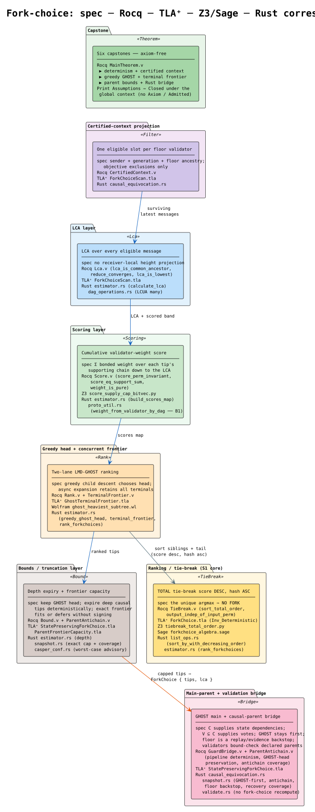
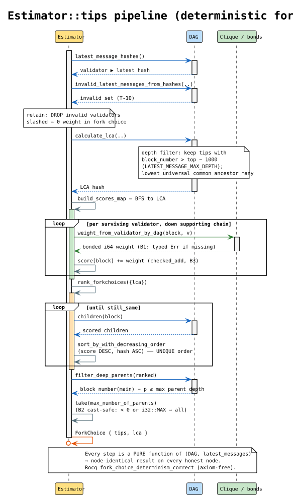
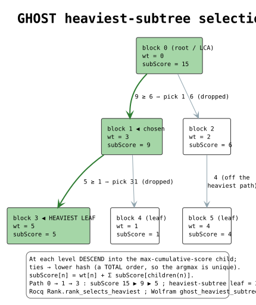
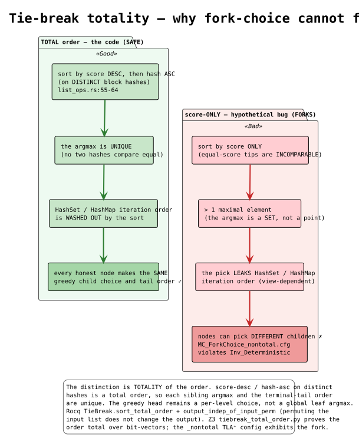
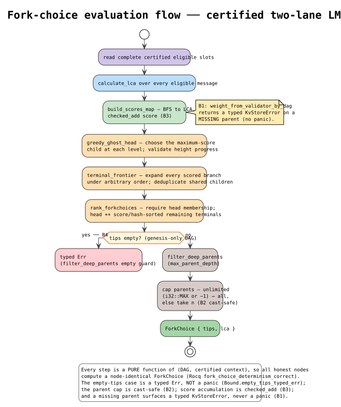
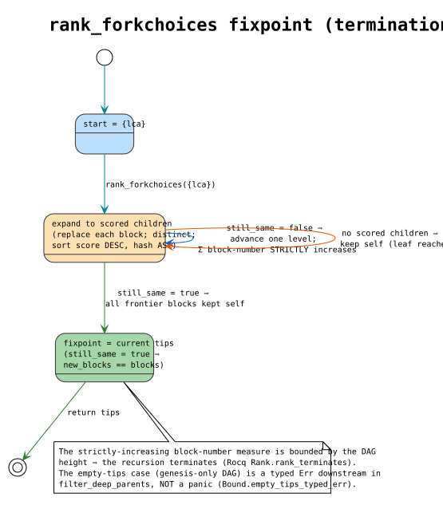

# Fork-Choice ("Ghosting") — Verification & Hardening Dossier

> **Status:** the certified-context fork-choice slice has axiom-free Rocq proofs,
> concurrent TLA⁺ models with falsifying controls, Wolfram/Z3/Sage cross-witnesses,
> and production-backed Rust example/property tests. This campaign found and repaired
> a real LMD-GHOST defect: globally sorting terminal leaves can select a leaf below a
> lighter root subtree. The implementation now composes a greedy GHOST head with the
> complete concurrent terminal frontier. Verification remains local-only; formal-tool
> steps are not installed in GitHub CI.

This document is written so the design and its verification can be reconstructed from
scratch. It records the feature, the bug-hunt outcome, the fixes, the formal artifacts
(with theorem anchors), the invariant catalog, and exactly how to re-run every check.

> **Companion docs.** [`fork-choice-specification.md`](./fork-choice-specification.md)
> is the normative contract (RFC-2119); [`fork-choice-glossary.md`](./fork-choice-glossary.md)
> defines every symbol/term used here (before first use) and gives literate-programming
> pseudocode for the score accumulation and the heaviest-subtree ranking. Rendered
> PlantUML diagrams live in [`diagrams/`](./diagrams/) and are embedded in §8.

---

## 1. The feature

The **fork-choice estimator** selects the canonical tip(s) of the block DAG. For a DAG
`d` and a frozen `latest_messages` map:

- **project** — derive one complete, sender-bound, generation-bound eligible latest
  message per frozen-floor validator from the certified context;
- **LCA** — take the lowest universal common ancestor of every eligible message,
  without a receiver-local height projection;
- **score** — `score(b) = Σ { w(v,b) : b ⪯ lm(v) }`, the cumulative bonded weight of
  the validators whose latest message supports `b`, accumulated to the LCA;
- **rank** — greedily descend through maximum-score children to the GHOST head;
  independently enumerate every scored terminal under arbitrary parallel expansion
  order; return the GHOST head followed by every other terminal in score/hash order;
- **truncate** — keep ≤ `max_number_of_parents` tips (head preserved) and drop
  secondary parents deeper than `max_parent_depth`.

The main tip feeds the sealed/finalized-floor merge (`snapshot.rs`, proposer-side); the
validator only **bound-checks** declared parents (`validate.rs`), it does not recompute
fork choice.

### Verified call graph

| Step | Code |
|---|---|
| certified projection | `causal_equivocation.rs` (`CertifiedConsensusContext`, eligible projection) |
| LCA | `estimator.rs` (`calculate_lca`); `dag_operations.rs` (`lowest_universal_common_ancestor_many`) |
| scores | `estimator.rs` (`build_scores_map`) |
| greedy head | `estimator.rs` (`greedy_ghost_head`) |
| terminal frontier | `estimator.rs` (`terminal_frontier`, `replace_block_hash_with_children`) |
| composition | `estimator.rs` (`rank_forkchoices`); `list_ops.rs` (`sort_by_with_decreasing_order`) |
| depth + count cut | `estimator.rs` (`filter_deep_parents`, `retained_parent_indices`) |
| consumers | `snapshot.rs` (proposer policy); `validate.rs` (declared-parent bound check, not estimator recomputation) |

Key source files:

| Concern | File |
|---|---|
| Estimator (score, rank, LCA, bounds) | `casper/src/rust/estimator.rs` |
| Tie-break (total order) | `shared/src/rust/shared/list_ops.rs` |
| Per-validator weight | `casper/src/rust/util/proto_util.rs` |
| LCA | `casper/src/rust/util/dag_operations.rs` |
| Main-parent selection | `casper/src/rust/engine/multi_parent_casper/snapshot.rs` |
| Validator bound check | `casper/src/rust/validate.rs` |

---

## 2. Concurrent-model findings

The serial/depth-one model established tie-break totality but could not express a
stake split below a heavier root subtree. Once the model contained multiple validator
branches, independent latest messages, multi-level descent, and multi-parent DAGs, it
exposed the difference between two algorithms:

```math
GHOST(root) = GHOST\!\left(\operatorname*{arg\,max}_{c \in children(root)} score(c)\right)
```

versus the former effective rule:

```math
\operatorname*{arg\,max}_{t \in terminal\_frontier(root)} score(t)
```

These are not equivalent. In the pinned counterexample, one root child has score `60`
and terminal descendants of scores `30` and `30`; another root child and its only leaf
have score `40`. LMD-GHOST chooses the score-`60` subtree, while the global-terminal
rule incorrectly chooses the score-`40` leaf.

The repair preserves concurrency:

1. `greedy_ghost_head` performs the canonical per-level descent.
2. `terminal_frontier` still expands all scored branches and deduplicates shared
   multi-parent children.
3. `rank_forkchoices` returns the greedy head first, then the other terminals under
   the existing total score/hash order.
4. Every traversed scored edge must advance height; malformed edges return a typed
   error rather than allowing nontermination.

The following suspected defects were separately resolved or refuted:

- **S1 — tie-break non-determinism → fork (the #1 suspect): REFUTED.**
  `sort_by_with_decreasing_order` is a **total** order — score
  descending, then `item_a.cmp(item_b)` (block-hash ascending, `BlockHash = Bytes`,
  lexicographic). Greedy sibling choice and the deduplicated secondary-terminal tail
  are therefore pure functions of the scored DAG; collection iteration order cannot
  leak into either. Confirmed by `tie_break_is_total_shuffle_invariant_on_distinct`
  and axiom-free Rocq results `TieBreak.sort_total_order` and
  `output_indep_of_input_perm`.
- **Weight non-determinism (the A9 `f32` analog): REFUTED.** Weights are exact **`i64`**
  read from the **main parent's on-chain `weight_map`** (`proto_util.rs:171-190`) —
  block-structural, identical across nodes, no floating point.
- **Receiver-local LCA projection: REPAIRED.** Every certified eligible message now
  participates; unrelated ambient height cannot change the LCA.
- **Both traversals terminate.** Every accepted child edge strictly increases height
  in a finite DAG. Rocq proves greedy termination; TLA⁺ proves each asynchronous
  frontier expansion strictly decreases the finite work measure.

Additional robustness seams repaired in the same slice are:

| ID | Sev | Evidence | Finding |
|---|---|---|---|
| **B1** | Med | `proto_util.rs:168,176` `.expect(...)` | Panics on the fork-choice BFS when a traversed block or its main parent is momentarily absent (sync/prune window). |
| **B2** | Low | `estimator.rs:152-169` `take(.. as usize)`; `casper.rs:62-70` | The `-1` config "unlimited" sentinel reaches the estimator and only worked via `-1 as usize` wrap; two sentinels (`-1`, `i32::MAX`) silently conflated. |
| **B3** | Low | `estimator.rs:305-314` (now `checked_add`; was `+=`) | Unchecked score accumulation; wraps only above `i64::MAX` (a supply-cap violation). |
| **B4** | — | `estimator.rs:173-183` | Already hardened (P2-8 typed `Err` on empty tips); modeled, not re-fixed. |

---

## 3. The fixes (Phase 2)

- **GHOST/head composition.** The production estimator now computes the greedy head
  separately from the exact terminal frontier, asserts membership, and prefixes it.
  Regressions include the explicit `60 → 30/30 versus 40` case, randomized two-level
  author-bound latest messages, and a multi-parent diamond with one shared terminal.
- **Traversal integrity.** Both greedy and frontier traversals reject a scored child
  whose height does not strictly exceed its parent.

- **B1 — typed error, not panic.** `weight_from_validator_by_dag` now returns
  `Err(KvStoreError::KeyNotFound(..))` (mirroring `snapshot.rs`'s sibling case) when a
  block or its main parent is absent, and propagates it. Regression:
  `weight_from_validator_missing_parent_is_typed_err` (flipped from the Phase-0
  `#[should_panic]` repro).
- **B2 — cast-safe, explicit sentinels.** `tips_with_latest_messages` treats **both**
  "unlimited" sentinels explicitly (`self.max_number_of_parents < 0`, and `== i32::MAX`)
  → take all; a genuine positive cap truncates. Behaviour-preserving; removes the
  two's-complement reliance.
- **B3 — checked accumulation.** `build_scores_map` uses `checked_add` → typed `Err` on
  overflow (only reachable on a supply-cap violation).

Verified: `cargo check -p casper --all-targets` clean; fork-choice bisim (5) + uc_16
slashed-parent + `three_writers_converge_under_load` all green (B2/B3 behaviour-
preserving on the propose hot path).

---

## 4. Invariant catalog → artifact map

Every catalog item maps to a concrete artifact — no "assumed"/"prose-only" row.

| ID | Property | Mechanized / checked in |
|---|---|---|
| **T-DET** | same `(DAG, latest_messages)` ⟹ identical `(tips, lca, main_parent)` (S1) | Rocq `MainTheorem.fork_choice_determinism_correct`; TLA⁺ `ForkChoice.Inv_Deterministic`; Rust `fork_choice_determinism_correct` (example: the flipping DAG returns `[b8, b7]` for every latest-message map order) + `fork_choice_determinism_over_subsets` (proptest: identical tips across rebuilds of any latest-message sub-relation) (`prop_estimator_determinism.rs`) |
| **T-TOTAL** | tie-break is a total order on distinct hashes ⟹ unique argmax | Rocq `TieBreak.sort_total_order`, `output_indep_of_input_perm`; Z3 `tiebreak_total_order.py`; Rust `tie_break_is_total_shuffle_invariant_on_distinct` |
| **T-SCORE** | score accumulation additive/order-independent | Rocq `Score.score_perm_invariant`, `score_eq_support_sum`; Z3 `score_supply_cap_bitvec.py`; Sage `forkchoice_algebra.sage`; Rust `score_perm_invariant` (proptest: permuting the latest-message order never changes the tips — the score monoid's only observable consequence, `prop_estimator_determinism.rs`) |
| **weight purity** | weights are block-structural `i64` (no `f32`, no node-local view) | Rocq `Score.weight_is_pure` + `GuardBridge.weight_block_structural` |
| **T-FILTER** | slashed/invalid latest messages add zero weight (S2) | Rocq `Filter.invalid_excluded` (cites slashing `ForkChoice.v`); Rust `filter_t10_invalid_latest_message_excluded` (the real `Estimator` + a DAG-flagged invalid latest message: excluded ⇒ tips identical to omitting it, `prop_estimator_determinism.rs`) |
| **T-GHOST** | the first result follows greedy heaviest-subtree descent, not global terminal-leaf order | Rocq `Rank.rank_selects_heaviest`, `rank_head_is_argmax`; TLA⁺ `GhostTerminalFrontier.Inv_HeadIsGreedyGhost` plus the unsafe global-leaf control; Wolfram `ghost_heaviest_subtree.wl`; Rust randomized `ghost_ranked_tips_are_heaviest_subtree_argmax` and pinned `aggregate_subtree_weight_beats_larger_terminal_leaf` |
| **T-FRONTIER** | every asynchronous expansion order yields the exact duplicate-free scored terminal set, including shared multi-parent children | Rocq `TerminalFrontier.terminal_frontier_exact`, `terminal_frontier_nodup`, `terminal_frontier_confluent`; TLA⁺ `GhostTerminalFrontier.Inv_ExactWhenTerminal`, `Inv_StrictExpansionProgress`; Wolfram all-order expansion; Rust `multi_parent_diamond_has_one_shared_terminal_leaf` |
| **T-COMPOSE** | result is the GHOST head followed by the totally ordered remainder of the exact terminal frontier | Rocq `ranked_ghost_frontier_correct`, `ranked_tips_tail_exact`, `ranked_tips_tail_sorted`; Rust randomized independent two-lane oracle |
| **T-TERM** | greedy and terminal-frontier traversals terminate or return a typed malformed-edge error | Rocq `Rank.rank_terminates`, `TerminalFrontier.anc_ofb_complete_height`; TLA⁺ strict finite-work descent; Wolfram monotone bounded measures; Rust height checks in both production paths |
| **T-LCA** | LCA is a common ancestor of all certified eligible messages and is receiver-local-state independent | Rocq `Lca.lca_is_common_ancestor`, `lcua_many_common_ancestor`, `reduce_converges`, `lca_is_lowest`; TLA⁺ `ForkChoiceScan.Inv_LcaDeterministic`, `Inv_AllCertifiedMessagesRetained`; Rust `prop_lca.rs` against the real LCUA fold |
| **T-BOUND** | depth expiry keeps the head; finite causal-parent capacity covers the active committee plus a floor backstop; invalid bounds fail closed | Rocq `Bound.{head_preserved,configured_parent_capacity_prevents_frontier_truncation,undersized_parent_capacity_has_a_blocked_frontier_witness}`; TLA+ `StatePreservingForkChoice` safe depth-expiry witness plus cap/depth liveness controls; Rust `retained_parent_indices`, configuration boundary properties, and snapshot coverage tests |
| **B1** | missing metadata ⟹ typed error, not panic (S4) | Rust `weight_from_validator_missing_parent_is_typed_err`; bridged by `GuardBridge.weight_block_structural` |
| **B3** | score overflow ⟹ typed error, not wrap (S5) | Rust (`checked_add`); Z3 `score_supply_cap_bitvec.py` |
| **T-MP** | the honest proposal's first parent is the GHOST head, invariant under parent enumeration; deploy policy cannot override it | Rocq `GuardBridge.{consensus_parent_pipeline_deterministic,consensus_parent_pipeline_preserves_ghost_head}`; TLA+ `Inv_GhostHeadIsMainParent` plus the deploy-promotion negative control; Rust `ghost_parent_order_is_permutation_invariant_and_preserves_the_head` and `main_parent_is_ghost_head_deterministic` |
| **T-CAUSAL** | causal-parent projection `C` preserves objectively admitted state dependencies while vote projection `V` is its floor-descending subset | Rocq `CausalFinalityProjection` and finalized-floor capstone; TLA+ `Inv_VoteTipsAreCausalTips`, stale-sibling and invalid-stale controls; Rust certified-context and snapshot regressions |
| **T-ANTICHAIN** | proposal parents are the complete reachability-maximal antichain and cover every live causal tip | Rocq `ParentAntichain` and `fork_choice_parent_antichain_correct`; TLA+ `Inv_ParentsFormReachabilityAntichain`; Rust example and 256-case reachability property tests |
| **T-EVIDENCE-ROOTS** | exact latest messages and the selected floor remain evidence roots independently of proposal-parent expiry | Rocq `certified_evidence_closure_preserves_*`; TLA+ floor/latest evidence-root invariants and omit-floor control; Loom atomic floor/latest capture and stale-latest floor-root tests |
| **T-VALID (reframed)** | honest proposer's parents pass `Validate::parents` (not a recompute) | Rocq `GuardBridge.honest_forkchoice_parents_validate`, derived against the real predicate — `parents` (`validate.rs:924-960`), which bound-checks count/depth/progress and never recomputes the estimator (§6) |
| **T-WF (bridge)** | block validation ⟹ acyclic, height-monotone DAG (the premise the proofs derive) | Rocq `GuardBridge.validation_implies_wf_dag` |
| **T-ROOT (bridge)** | block validation ⟹ single-rooted DAG (exactly one parentless block = the approved genesis); `single_root` DERIVED, not assumed | Rocq `GuardBridge.validation_implies_single_root` (models `justifications_well_formed` rejecting every other parentless block as `InvalidParents` — `validate.rs:1109-1113`; genesis admitted via the signed approved-block path `Validate::approved_block`, `initializing.rs:419-423`) |
| **capstone** | all of the above, axiom-free | Rocq `MainTheorem.fork_choice_{determinism,certified_context,parent_antichain,ghost,terminal_frontier,bound,bridge}_correct` and finalized-floor `certified_projection_binding_and_evidence_roots_correct` |

---

## 5. Formal artifacts

### 5.1 Rocq (`formal/rocq/fork_choice/`) — axiom-free

Rocq/Coq 9.1.1, Stdlib-only. Every headline result is checked with `Print Assumptions`
⇒ *"Closed under the global context"* (no `Axiom`, `Parameter`, or `Admitted`). A
`Recovery`-analog is **deliberately omitted** — fork choice is a stateless re-derivation
each round (no effect-application/idempotence concern).

| Module | Depends on | Key results |
|---|---|---|
| `Foundation.v` | — | DAG, block numbers, parents/children, ancestry, `wf_dag`, height bound |
| `Score.v` | Foundation | `weight_is_pure`, `score_perm_invariant`, `score_eq_support_sum` |
| `Filter.v` | Foundation | `invalid_excluded`, `valid_preserved`, `filter_idempotent` (T-10 reuse) |
| `CertifiedContext.v` | Foundation | complete slots, floor-descendant projection, receiver-state noninterference |
| `TieBreak.v` | Foundation | **S1 proof**: `sort_total_order`, `output_indep_of_input_perm`, `sort_argmax_unique`, `sort_is_permutation` |
| `Lca.v` | Foundation | `lcua_many` fold + `reduce_converges` (lex-measure termination); `lca_is_common_ancestor` (from the fold, no circular premise), `lca_is_lowest`, `lca_depth_filter_deterministic`, `lca_empty_is_genesis` |
| `Rank.v` | Foundation, Score, TieBreak | `rank_terminates`, `rank_selects_heaviest`, `still_same_fixpoint` |
| `TerminalFrontier.v` | Foundation, Rank, TieBreak | `terminal_frontier_exact`, `terminal_frontier_nodup`, `ghost_head_in_terminal_frontier`, `terminal_frontier_confluent`, `ranked_ghost_frontier_correct` |
| `Bound.v` | Foundation, Rank | `head_preserved`, `take_never_drops_head`, `cast_usize_safe`, `empty_tips_typed_err`, finite frontier-capacity sufficiency and undersized-cap witness |
| `ParentAntichain.v` | Foundation | executable reachability-maximal compaction, pairwise maximality, and causal-tip coverage preservation |
| `GuardBridge.v` | Foundation, Rank, Bound, Filter, Lca | the Rust-enforced seams: `validation_implies_wf_dag`, `validation_implies_single_root`, `weight_block_structural`, `honest_forkchoice_parents_validate`, deterministic canonical parent order, and `consensus_parent_pipeline_preserves_ghost_head`; the old deploy promotion remains only as an unsafe executable witness |
| `MainTheorem.v` | all | seven capstones covering determinism, certified context, causal-parent antichain, greedy GHOST, exact terminal-frontier composition, parent bounds, and the Rust validation bridge |

Build (memory-capped, 32 GB envelope):

```bash
cd formal/rocq/fork_choice && coq_makefile -f _CoqProject -o Makefile
systemd-run --user --scope -p MemoryMax=16G -p CPUQuota=1800% -p TasksMax=200 \
  make -C formal/rocq/fork_choice -j1
```

### 5.2 TLA⁺ (`formal/tlaplus/fork_choice/`)

- **`ForkChoice.tla`** — determinism + heaviest-subtree, with the `TotalTieBreak` knob.
  `MC_ForkChoice.cfg` (`TotalTieBreak = TRUE`, the code) **passes** (`Inv_Deterministic`,
  `Inv_HeaviestSubtree`); `MC_ForkChoice_nontotal.cfg` (`TotalTieBreak = FALSE`, the
  score-only fork) **reproduces** `Inv_Deterministic is violated` — the exact fork the
  total tie-break prevents.
- **`ForkChoiceScan.tla`** — certified-message retention at the LCA boundary, with
  `NodeLocalTop` as the unsafe receiver-local projection knob.
  `MC_ForkChoiceScan.cfg` (`NodeLocalTop = 0`, no receiver-local projection) **passes**
  (`Inv_LcaDeterministic`); `MC_ForkChoiceScan_bug.cfg` (`NodeLocalTop = 1`, node-local
  top) **reproduces** `Inv_LcaDeterministic is violated`.
- **`GhostTerminalFrontier.tla`** — all asynchronous expansion orders of a
  multi-parent DAG containing the `60 → 30/30 versus 40` counterexample.
  `MC_GhostTerminalFrontier.cfg` proves strict progress, exact terminal convergence,
  shared-child deduplication, and retention of the greedy head.
  `MC_GhostTerminalFrontier_global_leaf_unsafe.cfg` reproduces
  `Inv_HeadIsGreedyGhost` failure for the former global-terminal rule.

Run under the bounded envelope (never tmpfs/`auto`):

```bash
source scripts/lib/tlc-run.sh
FC=formal/tlaplus/fork_choice
tlc_run "$(tlc_metadir fc_det)"  "$FC/MC_ForkChoice.cfg"          "$FC/ForkChoice.tla"       # PASS
tlc_run "$(tlc_metadir fc_nt)"   "$FC/MC_ForkChoice_nontotal.cfg" "$FC/ForkChoice.tla"       # counterexample
tlc_run "$(tlc_metadir fc_tf)"   "$FC/MC_GhostTerminalFrontier.cfg" "$FC/GhostTerminalFrontier.tla" # PASS
tlc_run "$(tlc_metadir fc_old)"  "$FC/MC_GhostTerminalFrontier_global_leaf_unsafe.cfg" "$FC/GhostTerminalFrontier.tla" # counterexample
```

### 5.3 Z3 / Sage / Wolfram cross-witnesses

- **Z3** `formal/z3/fork_choice/tiebreak_total_order.py` — the `(score desc, hash asc)`
  relation is irreflexive/asymmetric/transitive/total on distinct hashes, argmax unique
  (the S1 witness). `score_supply_cap_bitvec.py` — BitVec-64 score add is assoc/comm; no
  overflow while every prefix sum ≤ cap; the wrap exists above the cap (motivating B3).
- **Sage** `formal/sage/fork_choice/forkchoice_algebra.sage` — score commutative monoid
  (permutation identity), tie-break order-embedding key strictly monotone ⇒ total order
  ⇒ unique argmax. Prints `ALL PASS`.
- **Wolfram** `formal/wolfram/fork_choice/ghost_heaviest_subtree.wl` — independently
  calculates greedy descent, enumerates every asynchronous frontier expansion order,
  checks shared-child deduplication, constructs the head-first ranked result, and
  reproduces the unsafe global-terminal counterexample. The gate supplies the same
  Wolfram base directories as the licensed MCP service; a discovered kernel must bind
  that license and pass its self-test.

### 5.4 Rust tests

The property-based fork-choice suite lives in `casper/tests/fork_choice/`, wired into the
gate's `[8/8]` Rust tier (each test carries its Rocq citation in a doc-comment):

- **`prop_filter_deep_parents`** — the concrete `Estimator::filter_deep_parents` conforms to
  `GuardBridge.within_depth` / `prop_filter`: every retained secondary parent is within depth
  (soundness), the main parent is retained first, nothing within depth is dropped
  (completeness), and the retained set equals `{main} ∪ prop_filter(secondaries)`.
- **`prop_estimator_determinism`** — `Estimator::tips_with_latest_messages` is invariant under
  permuted latest-message input / `HashMap` seeds (`MainTheorem.fork_choice_determinism`); the
  `build_scores_map` score monoid is permutation-invariant (`Score.score_perm_invariant`); and
  the T-10 invalid-latest-message `retain` excludes invalid tips (`Filter`).
- **`prop_ghost_argmax`** — a randomized, author-bound two-level fork is checked
  against an independent two-lane oracle; `aggregate_subtree_weight_beats_larger_terminal_leaf`
  pins the score-`60` subtree against the score-`40` leaf; and
  `multi_parent_diamond_has_one_shared_terminal_leaf` proves exact deduplication through
  the production DAG/storage path.
- **`prop_lca`** — `lowest_universal_common_ancestor_many` over random DAGs: the fold converges
  (`Lca.reduce_converges`), the result is a common ancestor of every input
  (`Lca.lca_is_common_ancestor`), and no common ancestor is higher (`Lca.lcua_many_is_max`, over
  single-parent trees per the `Lca.v` §7 `single_parent_spine` residual).
- **`prop_bound`** — the B2/B3/B4 seams on `tips_with_latest_messages`: `usize`-cast sentinels +
  positive caps (B2), typed `Err` on score overflow (B3) and empty ranked tips (B4), and `take`
  never drops the head.
- **Tie-break** — `shared` `list_ops::sort_by_with_decreasing_order` proptest
  (`TieBreak.sort_total_order`): permutation-invariant, output is a permutation of the input, and
  the argmax is unique — the S1 linchpin the estimator's ranking depends on.
- **`Validate::parents` depth horizon** — `casper/tests/batch2/validate_test.rs::
  parent_validation_enforces_max_parent_depth_horizon` is the **receive-side** realization of
  the C12 bridge (§6): with a finite `max_parent_depth`, an honest within-horizon parent
  accepts, a too-deep parent is `InvalidParents`, and `depth_buffer` extends the horizon —
  extending the abstract `honest_forkchoice_parents_validate` past `prop_filter` to the real
  validator predicate.

Plus `casper` `proto_util.rs` (`weight_from_validator_missing_parent_is_typed_err`), the
existing bisimulation suite (`casper/tests/slashing/{prop_t_13c_forkchoice_bisim, uc_16,
uc_17}`), and `three_writers_converge_under_load` exercise the estimator end-to-end.

---

## 6. The T-VALID reframe (design boundary, not a bug)

The intuitive property "a validator recomputes the same fork-choice the proposer used"
is **false to the code** and must not be asserted. `validate.rs` contains no estimator
recomputation; `Validate::parents` (`:945`) checks only parent count, depth, and
progress, and `snapshot.rs:315` states it: *"validators replay declared parents, not
fork-choice."* The `ghost_main_parent` is computed **proposer-side** only. The honest
bridge (the finalized-floor GuardBridge lesson: bridge the seam the Rust *enforces*, do
not assume a premise it doesn't) is therefore:

- `GuardBridge.honest_forkchoice_parents_validate` — an honest proposer's depth-filtered
  parent list satisfies the validator's acceptance predicate; plus
- observer-level **T-DET** — every node agrees on the canonical tips for a given DAG.

Consensus safety of parents is anchored by the finalized-floor committee/bonds
validation, not by re-running the estimator.

### 6.1 The LCA is modeled from the fold — RESOLVED

`Lca.lca_is_common_ancestor` now proves the fork-choice-relevant LCA property — the
computed LCA is a common ancestor of every depth-filtered latest message — from a
**concrete model** of the `DagOperations::lowest_universal_common_ancestor_many` fold
(`lcua_many`, a `BTreeSet`-faithful dedup fold), with **no** conditioning on "assume it
is a common ancestor". The fold's **termination is proved** (`reduce_converges`, via a
lexicographic `(max numof, count-at-max)` measure — not assumed), so the theorem is
**non-vacuous** on the wide multi-validator DAGs the LCUA-many is actually run on
(confirmed by `vm_compute` on a concrete DAG). Lowest-ness (`lca_is_lowest`) now
**derives** — no longer assumes — the LCA's maximality (`lcua_many_is_max`), and concludes
the strictly stronger `anc_of d c (lcua_many d ms)` (every common ancestor is *below* the
LUCA), on the faithful main-parent-tree model.

The circular `lcua_common` hypothesis and the fold-termination premise — the two things
that constituted the residual — are **gone**, and two further premises were **discharged**
in the P0–P3 FV sweep:

- **`common_ancestor … root` is now derived (C4).** `descends_from_root` proves, by
  well-founded induction on `numof`, that under `wf_dag` + `single_root` every real block
  descends from the genesis; `common_ancestor_root` lifts that to "genesis is a common
  ancestor of any real tip set". The premise is dropped from `lcua_many_common_ancestor`,
  `lca_is_common_ancestor`, and the `fork_choice_ghost_correct` capstone conjunct — all
  still discharged, now internally.
- **`lca_is_lowest` maximality is now derived (C2).** The old statement *took* the maximal-
  ity `(∀c', common_ancestor c' → numof c' ≤ numof (lcua_many …))` as a hypothesis — i.e.
  assumed the fold's survivor already was the LCA. It is now the **theorem** `lcua_many_is_max`,
  proved via a `below_all` fold invariant. **Correction (disclosed residual):** the earlier
  `spine_linear` premise is *provably insufficient* for maximality — a well-formed single-
  genesis DAG with a *straddling* old parent satisfies `spine_linear` yet makes the fold
  over-descend past the true common ancestor (making the old `lca_is_lowest` **vacuous**
  there). The derivation instead uses `single_parent_spine` (each block's `blk_parents` is
  exactly its main parent — the main-parent tree the LUCA descends) + `NoDup ms` (the
  deduplicated `BTreeSet` input); both are faithful and both are necessary (a duplicate or a
  multi-parent straddle each break lowest-ness). Non-vacuity is witnessed by an axiom-free
  `Example` on a concrete tree.

- **`single_root` is now derived, not assumed (T-ROOT).** It was formerly a bare premise of
  the `Lca` common-ancestor results *and* the `fork_choice_ghost_correct` capstone. It is now
  **DERIVED from block validation** by `GuardBridge.validation_implies_single_root`. The
  strengthened `validated_block` requires a parentless (main-parent = `None`) block's hash to
  equal the genesis hash — faithfully modeling `validate.rs::justification_follows`
  (:1135-1139), which runs *before* `Validate.parents` and rejects **every** empty-parents
  block as `InvalidParents`; the unique genesis is admitted out-of-band via the
  signature-authenticated approved-block path (`initializing.rs:832-840`, bypassing the
  pipeline). `MainTheorem.fork_choice_ghost_correct` clause (d) therefore takes the
  Rust-enforced validation predicate `(∀ b ∈ d, validated_block genesis_hash d b)` and
  discharges `single_root` internally via `lca_is_common_ancestor_validated`. `genesis_hash`
  is a Section `Variable` (a **parameter** of the closed term), never an axiom.

One FAITHFUL DAG-shape premise remains on the ghost capstone: `all_real` (the tips resolve
to real blocks). It is **necessary, not a deferral**: a DAG with two distinct parentless
blocks makes fully-unconditional common-ancestor *false* — the Rust `BTreeSet` fold exhibits
the same — and `single_root` (now derived) rules exactly that out. The internal `Lca` lemmas
(`lca_is_common_ancestor`, `lca_is_lowest`, `lcua_many_is_max`, `descends_from_root`,
`common_ancestor_root`) still *state* `single_root` as a premise, but it is now
**dischargeable** from validation via the bridge (and is so discharged at the capstone). No
lemma is `Admitted` or axiomatized; the one added hypothesis (`wf_dag` on `reduce_converges`)
is mathematically required. Rocq assumes exactly what the DAG / Rust guarantees, as premises,
never axioms — every headline result is `Print Assumptions` Closed.

> **Recommended Rust hardening (FV finding).** `validate.rs::block_number` (:698-721) only
> forces `num == 0` for a parentless block; it does **not** assert that block's hash equals
> the approved-genesis hash. The single-root guarantee currently rests on
> `justification_follows` (:1135-1139) rejecting every *other* parentless block *before*
> `Validate.parents`, plus genesis entering via the signed approved-block path
> (`initializing.rs:832-840`). An explicit approved-genesis-hash assertion for parentless
> blocks in `block_number` would make the pin local and defense-in-depth; the FV models the
> `justification_follows` rejection that already exists, so the proof is faithful to shipped
> behavior.

---

### 6.2 The GHOST head is the main parent — repaired

The earlier implementation sorted the GHOST head first and then allowed deploy-support
policy to promote another branch. That override was deterministic, but determinism was
insufficient: it changed the primary replay spine after LMD-GHOST had selected it. In an
asymmetric DAG, this can make proposal state depend on pending deploy placement rather
than certified stake support.

The production pipeline now has one authority for index zero:

```text
ghost := LMD-GHOST(V)
causal := unique block hashes in C
if V is empty, ghost := captured finalized floor
require ghost in causal or ghost is the inserted floor backstop
parents := reachability-maximal(causal plus required floor backstop)
sort parents with ghost first and every remaining hash ascending
require parents[0] = ghost
```

`GuardBridge.consensus_parent_pipeline_preserves_ghost_head` proves the ordering seam.
`ParentAntichain.causal_parent_guard_preserves_tips` proves that reachability compaction
does not lose a covered causal input. `StatePreservingForkChoice` separately demonstrates
that enabling the former deploy promotion violates `Inv_GhostHeadIsMainParent`; the
Rocq `pipeline_head_may_differ_from_ghost` example remains only as an executable negative
control for that removed behavior.

This repair does not require validators to recompute a Byzantine proposer's local fork
choice. Receivers continue to validate the declared parent structure and replay result.
The stronger equality is an honest-proposer construction invariant: every conforming
proposer derives index zero from the same certified vote projection and preserves it
through compaction, depth expiry, and recovery narrowing.

### 6.3 Causal dependencies and finality votes are distinct — repaired

The prior single projection excluded every latest message that did not descend from the
new floor. That was correct for voting but wrong for replay dependencies: an accepted
sibling can remain a causal input after another branch becomes finalized. The corrected
context derives `C` from identity, generation, evidence, and objective admission, then
derives `V` by adding floor ancestry. LMD-GHOST and finality consume `V`; proposal-parent
selection consumes `C`.

The selected floor is always an evidence root, even when every exact latest message is
stale relative to it. Parent compaction retains the full reachability-maximal antichain.
Recovery narrows to one parent only when that parent both descends from the floor and
covers every live causal tip. A finite parent cap must hold the maximum active committee
plus one floor backstop; depth expiry supplies deterministic liveness for permanently old,
disjoint unfinalized tips without deleting their exact evidence roots.

---

## 7. Verification status

Run the whole suite with `scripts/check-fork-choice-ALL.sh` (Rocq authoritative;
TLA⁺/Z3/Sage/Wolfram fail-soft; PlantUML render check). Target result: **ALL GATES OK**.

| Layer | Result |
|---|---|
| Rust build | `cargo check -p casper --all-targets` clean |
| Rust unit/regression | tie-break totality, B1 typed-error, fork-choice bisim (5), uc_16, convergence — all pass |
| Rocq | full build passes; **29 named results axiom-free**, including seven capstones and the exact/confluent terminal-frontier results |
| Rocq kernel (coqchk) | **independent kernel re-check** of `ForkChoice.MainTheorem` + all deps ⇒ "Modules were successfully checked" (C3 — the trust root under the `Print Assumptions` claim) |
| TLA⁺ | total-order, certified-message retention, asynchronous terminal-frontier, and parent-bound models pass; non-total order, receiver-local projection, global-terminal head, all-entry head loss, and invalid configurations reproduce their designated counterexamples |
| Apalache (unbounded) | **`IndInv = TypeOK ∧ Inv_Deterministic ∧ Inv_HeaviestSubtree` proved INDUCTIVE** (BASE `Init ⊨ IndInv` + STEP `Next` preserves `IndInv`) on `ForkChoice_apalache.tla` — over **all of ℤ scores** (native SMT `Int`, strictly beyond TLC's `MaxScore=2`); non-vacuous (`TotalTieBreak=FALSE` ⇒ STEP CTI = the S1 fork). Horizon-free: holds on every reachable state at any trajectory length (C9). Fail-soft. |
| Rust proptest | 25 fork-choice integration tests pass, including randomized author-bound two-level GHOST, the pinned aggregate-subtree counterexample, multi-parent shared-child deduplication, context noninterference, LCA properties, and parent bounds; 7 tie-break, 10 proposal-parent, 6 estimator-bound, and the receive-side depth test also pass |
| Z3 | tie-break total order (5/5) + score supply-cap BitVec (4/4) |
| Sage | fork-choice algebra ⇒ `ALL PASS` |
| Wolfram | greedy GHOST, all-order frontier confluence, head-first composition, unsafe global-leaf counterexample, and context noninterference all report `True`; self-test passes under the licensed `wolfram` launcher |
| Diagrams | 6 updated PlantUML diagrams render clean (populated SVG, no stderr) |

**Coverage matrix (§4).** Every catalog item maps to a concrete Rocq/TLA⁺/Z3/Sage/Wolfram
artifact or a Rust test — no "prose-only" row. The DAG well-formedness the proofs rest on is
*derived* from block validation (`GuardBridge.validation_implies_wf_dag`), the LCA
common-ancestor property is *modeled from the fold* with its termination *proved*
(`reduce_converges`), the genesis-common-ancestor fact is *derived* (`common_ancestor_root`,
C4) rather than assumed, the LCA's maximality is *derived* (`lcua_many_is_max`, C2)
rather than taken as a premise (§6.1), and **`single_root` is now *derived* from block
validation** (`GuardBridge.validation_implies_single_root`, T-ROOT) rather than assumed —
the ghost capstone takes the Rust-enforced `validated_block` predicate and discharges
single-rootedness internally (modeling `validate.rs::justification_follows`). The one
remaining `all_real` premise (and `single_parent_spine` + `NoDup ms` on the lowest-ness
results — the faithful, sufficient replacement for the provably-insufficient `spine_linear`)
are counterexample-necessary DAG-shape bridges — Rocq assumes exactly what the DAG
guarantees, as premises, never axioms (every headline result is `Print Assumptions` Closed,
and the whole library is re-checked by `coqchk`) — the finalized-floor GuardBridge
discipline.

**Policy:** all of the above run **locally**. Do **not** add any Rocq / TLA⁺ / Z3 / Sage
/ Wolfram step to `.github/workflows/*` (an earlier formal-CI workflow was deliberately
removed).

---

## 8. Diagrams

Six PlantUML diagrams (sources + rendered SVGs in [`diagrams/`](./diagrams/); render with
`plantuml -tsvg`, checked by `scripts/check-fork-choice-ALL.sh` step **[6/6]**). Each is
fully coloured with an in-diagram legend.

### 8.1 Component correspondence — spec ↔ Rocq ↔ TLA⁺ ↔ Z3/Sage ↔ Rust

[](./diagrams/01-component-correspondence.svg)

### 8.2 The `Estimator::tips` pipeline (deterministic fork-choice)

[](./diagrams/02-seq-tips-pipeline.svg)

### 8.3 GHOST heaviest-subtree selection

[](./diagrams/03-ghost-heaviest-subtree.svg)

### 8.4 Tie-break totality — why fork-choice cannot fork (S1)

[](./diagrams/04-tiebreak-total-order.svg)

### 8.5 Fork-choice evaluation flow + the hardened seams

[](./diagrams/05-activity-estimator-flow.svg)

### 8.6 Greedy-head and asynchronous-frontier composition

[](./diagrams/06-state-rank-fixpoint.svg)

---

## 9. References

DOIs are given where they exist and have been verified; whitepapers without a DOI carry
a stable identifier.

1. Y. Sompolinsky, A. Zohar. **Secure High-Rate Transaction Processing in Bitcoin
   (GHOST).** *Financial Cryptography and Data Security 2015.*
   DOI [10.1007/978-3-662-47854-7_32](https://doi.org/10.1007/978-3-662-47854-7_32).
   *(The greedy heaviest-observed-subtree rule the estimator specializes — §2, T-GHOST.)*
2. V. Buterin et al. **Combining GHOST and Casper (Gasper).** arXiv:2003.03052, 2020.
   (No DOI; stable id `arXiv:2003.03052`.) *(LMD-GHOST + finality — the fork-choice /
   finalized-floor split.)*
3. V. Buterin, V. Griffith. **Casper the Friendly Finality Gadget.** arXiv:1710.09437,
   2017. (No DOI; stable id `arXiv:1710.09437`.) *(Finality gadget layered over
   fork choice.)*
4. L. Lamport. **The Part-Time Parliament.** *ACM TOCS* 16(2), 1998.
   DOI [10.1145/279227.279229](https://doi.org/10.1145/279227.279229).
   *(Quorum agreement — the bonded-weight majority behind scoring.)*
5. M. Castro, B. Liskov. **Practical Byzantine Fault Tolerance and Proactive Recovery.**
   *ACM TOCS* 20(4), 2002.
   DOI [10.1145/571637.571640](https://doi.org/10.1145/571637.571640).
   *(BFT quorum intersection — why weighted fork choice is stable.)*
6. M. J. Fischer, N. A. Lynch, M. S. Paterson. **Impossibility of Distributed Consensus
   with One Faulty Process.** *J. ACM* 32(2), 1985.
   DOI [10.1145/3149.214121](https://doi.org/10.1145/3149.214121).
   *(Why fork-choice liveness/termination is proved, not assumed — T-TERM.)*
7. L. Lamport. **The Temporal Logic of Actions.** *ACM TOPLAS* 16(3), 1994.
   DOI [10.1145/177492.177726](https://doi.org/10.1145/177492.177726).
   *(TLA — the basis of `ForkChoice.tla` / `ForkChoiceScan.tla`.)*
8. Y. Bertot, P. Castéran. **Interactive Theorem Proving and Program Development:
   Coq'Art.** Springer, 2004.
   DOI [10.1007/978-3-662-07964-5](https://doi.org/10.1007/978-3-662-07964-5).
   *(The Coq/Rocq calculus in which the axiom-free capstones are mechanized, §5.1.)*
