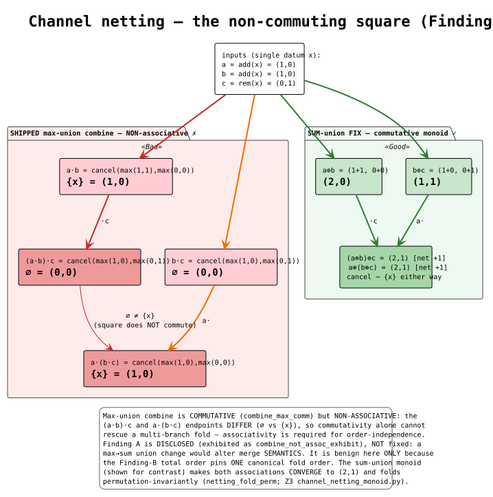
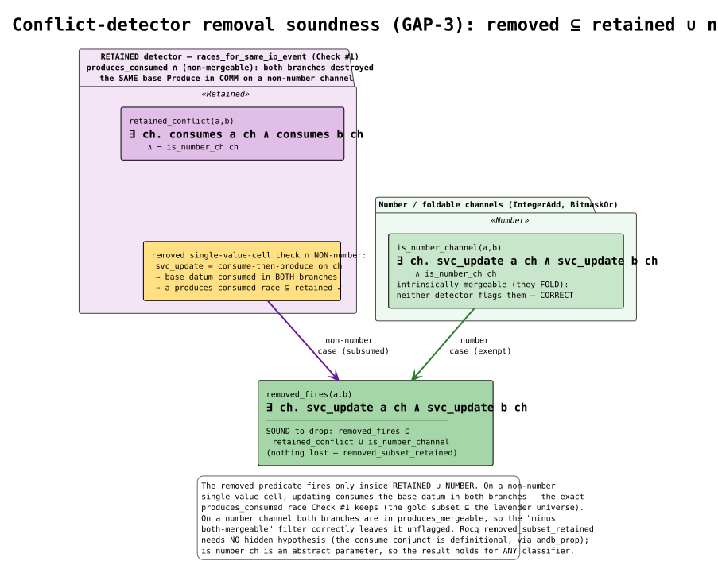
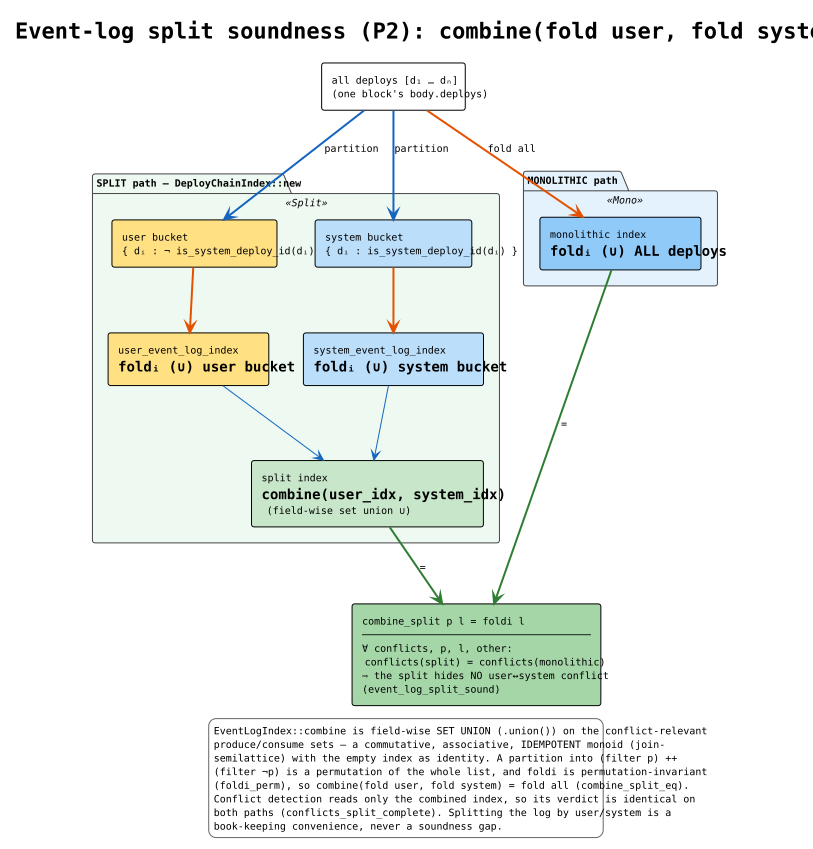

# Merge-Algebra Determinism — Verification & Hardening Dossier

> **Status:** casper's multi-parent block **merger** is **formally verified end-to-end** for
> **determinism** — Rocq (axiom-free capstones, `coqchk`-checked), Z3 cross-witnesses, and
> Rust regression tests. The headline is **honest**: the merger carried **one real fork
> hazard** — **Finding B**, a keep-one comparator that could tie two *distinct* deploy
> chains and let the reseeded `HashSet` order pick the merge winner — now **fixed
> append-only** (rolling-upgrade-safe, commit `c0b7609e`). One further algebraic hazard —
> **Finding A**, the non-associative per-channel `combine` — is **disclosed and rendered
> benign** by the Finding-B fix (a canonical fold order), **not** silently changed (that
> would alter merge *semantics*). Two dropped/split checks are **confirmed sound** (**GAP-3**,
> **P2**), and a produce-only single-value-cell **over-fill** (**§3c**, the finality-halt RCA
> a produce that does *not* consume the base leaves a NUMBER cell holding two values) is
> **guarded and proven** — `ConflictSoundness.v` **Section Overfill**, safety **S7**.
> Verification is **local-only** — no Rocq/Z3 step is wired into CI.

This document is written so the design and its verification can be reconstructed from
scratch. It records the feature, the bug-hunt outcome, the fix, the formal artifacts (with
theorem anchors), the invariant catalog, and exactly how to re-run every check.

> **Companion docs.** [`merge-algebra-specification.md`](./merge-algebra-specification.md)
> is the normative contract (RFC-2119); [`merge-algebra-glossary.md`](./merge-algebra-glossary.md)
> defines every symbol/term used here (before first use) and gives literate-programming
> pseudocode for the keep-one total order and the merged-state fold. Rendered PlantUML
> diagrams live in [`diagrams/`](./diagrams/) and are embedded in §8.

---

## 1. The feature

The **block merger** combines the state changes of the multiple parents (deploy chains) a
block builds on into one merged **base state**, producing:

- a **pre-state hash** — the merged base-state root the block's deploys execute against, and
- a **rejected-deploy set** — the deploys dropped by conflict resolution.

Both values are **recorded in the block** and **recomputed by every validator**. Block
validation re-runs the merge and **rejects** the block if the recomputed pre-state hash or
rejected set differs from the recorded values (`interpreter_util.rs:228` recompute, `:259`
pre-state mismatch ⟹ reject/no-replay, `:269` rejected-set mismatch ⟹ invalid). **So the
merge MUST be byte-identical on every node, or the chain forks and finalization stalls.**

The merge pipeline, in order:

1. **index** each deploy chain (`DeployChainIndex::new`; the user/system event logs are
   folded and combined — P2);
2. **dedup** the merge-set into **branches** of mutually-dependent chains;
3. **conflict-map** the branches (`conflicts` — GAP-3);
4. **greedy keep-one / rejection** — pick the survivors and the rejected set
   (`dependency_ordered_branch_items` + `split_unavailable_branch_consumes`): the **first**
   order-sensitive consumer;
5. **sort survivors by `cmp`, then fold** `StateChange::combine`
   (`compute_merged_state`): the **second** order-sensitive consumer;
6. **emit** `(pre-state hash, rejected-deploy set)`.

**The two order-sensitive consumers are why a total order is the safety core.** Consumer (1)
builds `pending` from `branch.0.iter()` — a std `HashSet` whose `RandomState` is **reseeded
per process** — and picks each next chain with `min_by(cmp)`, then greedily rejects; the
**rejected set is order-dependent**. Consumer (2) sorts the survivors by `cmp` and folds;
the **merged state is order-dependent**. Both are node-identical **iff** `cmp` is a strict
total order — and the fold *additionally* relies on it because `combine` is **non-associative**
(Finding A), so only a canonical order agrees across nodes.

### Verified call graph

| Step | Code |
|---|---|
| index chain + user/system split | `deploy_chain_index.rs:42` (`new`), `:70-88` (split by `is_system_deploy_id`, `EventLogIndex::combine`) |
| dedup → branches | `conflict_set_merger.rs:109` (`resolve_conflicts`, `compute_branches`) |
| conflict map | `merging_logic.rs:262` (`conflicts` — Checks #1/#2/#3) |
| **consumer 1** greedy keep-one / rejection | `dag_merger.rs:81` (`dependency_ordered_branch_items`; `pending ← branch.0.iter()` `:85`; `.min_by(cmp)` `:96`), `:151` (`split_unavailable_branch_consumes`) |
| **consumer 2** merged-state fold | `conflict_set_merger.rs:360` (`compute_merged_state`); sort `:385` (`compare_branches`) + `:391` (`branch_items.sort()`); fold `:426` (`combined.combine(item)`) |
| the total order both consumers use | `deploy_chain_index.rs:151-230` (`impl Ord::cmp`, the 5-key tower) |
| the fold operator (non-assoc) | `channel_change.rs:17` (`ChannelChange::combine`); `state_change.rs:507` (`StateChange::combine`, composes it per channel at `:541,:589`) |
| recompute + reject (validator) | `interpreter_util.rs:268` (`compute_parents_post_state`), `:309` (pre-state mismatch), `:319` (rejected-set mismatch) |

Key source files:

| Concern | File |
|---|---|
| Keep-one comparator (total order), `Eq`/`Hash`, user/system split | `casper/src/rust/merging/deploy_chain_index.rs` |
| Consumer 1 — greedy keep-one / rejection | `casper/src/rust/merging/dag_merger.rs` |
| Consumer 2 — merged-state fold | `casper/src/rust/merging/conflict_set_merger.rs` |
| Per-channel netting (non-assoc combine) | `rspace++/src/rspace/merger/channel_change.rs` |
| Fold operator | `rspace++/src/rspace/merger/state_change.rs` |
| Conflict detector | `rspace++/src/rspace/merger/merging_logic.rs` |
| Event-log set-union monoid | `rspace++/src/rspace/merger/event_log_index.rs` |
| Merge recompute + rejection (validator) | `casper/src/rust/util/rholang/interpreter_util.rs` |

---

## 2. The bug-hunt outcome — one real fork fixed, one hazard disclosed, two checks confirmed

Front-loading the fork-suspects and reporting the **honest** result for each: the merger is
mostly sound, but — unlike fork-choice, where the prime suspect was *refuted* — here the
prime suspect (**Finding B**) is a **real, live fork hazard** and is **fixed**.

- **Finding B — keep-one comparator ties distinct chains → fork (the #1 suspect): CONFIRMED,
  FIXED.** `DeployChainIndex::cmp` was a **4-key** tie tower — Σcost DESC, max single cost
  DESC, min `deploy_id` ASC, terminal `post_state_hash` ASC — with `Eq`/`Hash` keyed on
  `deploys_with_cost` **only** (`:136,:142`). But `post_state_hash` is **not injective** over
  distinct chains, and chains from different parents can share a min `deploy_id`, so `cmp`
  could return `Equal` for two **distinct** chains. A tie means `min_by`/`sort`
  (`dag_merger.rs:65`, `conflict_set_merger.rs:385,391`) breaks it by the **reseeded
  `HashSet` order** of `pending` — a **node-dependent rejected set** and merged state, i.e. a
  **fork** at the validator recompute (`interpreter_util.rs:259/:269`).
- **Finding A — non-associative channel `combine` → order-dependent fold: EXHIBITED,
  DISCLOSED, NOT code-changed.** `ChannelChange::combine` (`channel_change.rs:17`) is
  `vec_union` (idempotent **max-multiset** union, `:25`) + `cancel_common` (`:34`). Max-union
  is **non-associative**: with `a = add(x)`, `b = add(x)`, `c = remove(x)`,
  `(a∘b)∘c = ∅` but `a∘(b∘c) = {x}`. The fold (`StateChange::combine`, which composes it per
  channel) is therefore order-sensitive. This is **benign for no-fork *only because* of the
  Finding-B fix** (a deterministic fold order ⟹ a node-identical result). A max-union→sum-union
  change would restore associativity **but alter merge *semantics*** (which data survive), so
  it is **disclosed, not made** (§6).
- **GAP-3 — the removed single-value-cell conflict check is sound: CONFIRMED.** The removed
  predicate (commit `f3360e84`) flagged two branches that both consume-then-produce on a
  shared channel (a single-value-cell write-write). Every case it flagged is **subsumed** by
  the retained double-consume / same-IO-event race detector (`conflicts` Check #1), **except**
  number/foldable channels, which are intrinsically mergeable and correctly left unflagged by
  both. Nothing is lost.
- **§3c — the produce-only single-value-cell over-fill (RCA-asi-devnet-finality-halt):
  CONFIRMED, GUARDED.** GAP-3's soundness argument models a cell update as
  `svc_update = consumes ∧ produces` — an update that *always* consumes the base. But a
  **produce-only write** (a produce that does **not** consume the base) also lands in the
  cell: producing `5e9` onto a single NUMBER cell `[0]` **without** consuming the base leaves
  it holding `[0, 5e9]`, tripping the RhoVM IntegerAdd single-value invariant at read →
  **finalization halt**. Because `svc_update` needs `consumes = true`, GAP-3's model is
  **vacuous** for it and the retained double-consume detector is **blind** (`produces_consumed`
  is never populated by a produce-only write). The fix,
  `check_single_value_cell_not_overfilled` (`rholang_merging_logic.rs:194`), runs on the
  **non-mergeable** else-path (`dag_merger.rs:965`) and rejects any merge whose post-state
  single-value NUMBER cell would hold `result_len = |multiset_diff(base, removed)| + |added|
  > 1`; non-numeric registry / `TreeHashMap` bases are exempt. Proven end-to-end in
  `ConflictSoundness.v` **Section Overfill** (and shown NOT redundant with the retained
  detector by `svc_guard_not_subsumed_exhibit`) — safety **S7**.
- **P2 — the user/system event-log split hides no conflict: CONFIRMED.** `DeployChainIndex::new`
  folds deploys into a user and a system `EventLogIndex` and `combine`s them (`:70-88`).
  `EventLogIndex::combine` (`:343`) is a field-wise **set-union monoid** (commutative,
  associative, idempotent), so `combine(fold user, fold system) = fold all`; conflict detection
  on the split index equals detection on the monolithic index — no user↔system conflict is
  hidden.

| ID | Sev | Evidence | Finding |
|---|---|---|---|
| **B** | **High** (live fork) | `deploy_chain_index.rs` 4-key `cmp` + `Eq` on `deploys_with_cost` only | `cmp` could return `Equal` for two **distinct** chains ⟹ reseeded-`HashSet` `min_by`/`sort` winner ⟹ node-dependent rejected set ⟹ **fork**. |
| **A** | Disclosed | `channel_change.rs:17,25` max-union `combine` | `combine` is commutative but **non-associative**; the fold order matters. Benign **only** under the Finding-B fix; a semantics-changing fix is disclosed, not made. |
| **GAP-3** | Sound | `merging_logic.rs:262` retained `conflicts` detector; commit `f3360e84` | The removed single-value-cell check is fully subsumed by the retained double-consume detector ∪ the number-channel exemption. |
| **§3c** | **High** (finality halt) | `rholang_merging_logic.rs:194`; `dag_merger.rs:965` | A **produce-only** write over-fills a single-value NUMBER cell (`[0]`→`[0,5e9]`) → IntegerAdd invariant trips at read → **finalization halt**. The retained detector is blind (no consume); the §3c guard closes it (S7). |
| **P2** | Sound | `event_log_index.rs:343` `combine` (set union) | The user/system split recombines to the monolithic index; it hides no conflict. |

---

## 3. The fix (commit `c0b7609e`) + the disclosures

- **Finding B — APPEND a 5th, injective key (the fix).** `DeployChainIndex::cmp` now appends
  a 5th tie-break key, `self.deploys_with_cost.cmp(&other.deploys_with_cost)`
  (`deploy_chain_index.rs:229`) — the existing `HashableSet<DeployIdWithCost>: Ord`, a
  **deterministic shortlex order** over the sorted deploy set, which **is** the `Eq`/`Hash`
  key. Because keys 1–4 are all **functions** of that set and key 5 **is** the set,
  `cmp a b = Equal` holds iff the two chains are `Eq` — the `Equal`-class is contained in the
  identity, so **no two distinct chains ever tie**. `cmp` is now a **strict total order**, and
  the `min_by`/`sort` winner (and the fold order) is **node-identical** regardless of `HashSet`
  reseeding. **No cryptographic assumption** is used (the terminal key is the set, not a hash).
  Regressions: `cmp_is_strict_total_order_injective_on_equal` and
  `distinct_chains_tying_on_all_four_policy_keys_still_order_deterministically`
  (`deploy_chain_index.rs:324,303`).
- **The fix is APPEND-only ⟹ rolling-upgrade-safe.** Keys 1–4 are **byte-identical** to the
  order deployed in `origin/master` (`v0.4.16`), whose `cmp` terminates at
  `post_state_hash.cmp(..)` (verified by `git show origin/master:.../deploy_chain_index.rs`).
  Key 5 is consulted **only** on 4-key ties — inputs that were **already
  `HashSet`-nondeterministic** on `v0.4.16` — so on every input the deployed comparator
  ordered *deterministically*, the 5-key result is **unchanged**. Hence a fixed node never
  disagrees with a live `v0.4.16` node on any input the old `cmp` ordered deterministically,
  and is deterministic on **all** inputs (`deploy_chain_index.rs:210-228` documents this; §6.1).
- **Finding A — disclosed, not changed.** The non-associativity is exhibited as a Rocq theorem
  (`ChannelNetting.combine_not_assoc_exhibit`, à la `IntegerAdd.launder_exhibit`) and pinned by
  an `#[ignore]`d Rust test (`finding_a_max_union_combine_is_non_associative`,
  `channel_change.rs:136`) so it documents the hazard without a semantics change (§6).
- **GAP-3 — the check stays removed (commit `f3360e84`), its soundness proved.** The removal
  is discharged by `ConflictSoundness.conflict_removal_sound`.
- **§3c — the produce-only over-fill guard (the finality-halt fix).**
  `check_single_value_cell_not_overfilled` rejects a non-mergeable single-value NUMBER cell
  merge whose `result_len = |multiset_diff(base, removed)| + |added| > 1`. Discharged by
  `ConflictSoundness.svc_guard_catches_overfill` (the guard fires on **every** over-fill),
  `overfill_not_retained` (it is **not** redundant with the retained detector — a
  produce-only write consumes no base), and `svc_invariant_iff_both_detectors` (the two
  detectors together are **exactly** complete), plus the constant witness
  `svc_guard_not_subsumed_exhibit`. Rust proptests: `svc_guard_rejects_iff_result_len_gt_one`
  (rholang) and `produce_only_overfill_escapes_retained_detector` (rspace++). The
  `merge_algebra_conflict_correct` capstone now carries both GAP-3 (Part A) and §3c (Part B).
- **P2 — the split stays, its soundness proved** by `EventLogSplit.event_log_split_sound`.

Verified: `scripts/check-merge-algebra-ALL.sh` ⟹ **ALL GATES OK** — Rocq build + 4 axiom-free
capstones + `coqchk`; Z3 (2/2); Rust `rspace_plus_plus merger::` and `casper merging::` all
green.

---

## 4. Invariant catalog → artifact map

Every catalog item maps to a concrete artifact — no "assumed"/"prose-only" row.

| ID | Property | Mechanized / checked in |
|---|---|---|
| **T-DET** | same merge inputs ⟹ identical `(pre-state hash, rejected-set)` on every node (S1) | Rocq `MainTheorem.merge_algebra_keeporder_correct` (+ `…_split_correct`); the two consumers reduce to T-ORDER + T-SPLIT |
| **T-ORDER** | `cmp` is a strict total order whose `Equal`-class ⊆ `Eq` (no distinct chains tie) | Rocq `KeepOneOrder.keep_one_total_order`, `keep_one_equal_impl_eq`; Z3 `keep_one_total_order.py`; Rust `cmp_is_strict_total_order_injective_on_equal` |
| **T-KEEP1** | greedy keep-one / rejection winner is a pure function of the branch set (S2) | Rocq `KeepOneOrder.output_indep_of_input_perm`, `sort_argmax_unique`; Rust `distinct_chains_tying_on_all_four_policy_keys_still_order_deterministically` |
| **T-FOLD** | merged-state fold order-independent under the canonical (total-order) sort (S3) | Rocq `KeepOneOrder.output_indep_of_input_perm` + `ChannelNetting.combine_not_assoc_exhibit` (why the sort is required) + **`ChannelNetting.deployed_fold_canonical_deterministic`** (the shipped non-assoc `combine_max` folded over a permutation-invariant `canon` is a function of the SET); Rust `fixed_net_is_order_independent` |
| **T-NET** | shipped `combine` commutative but non-associative (Finding A); it is a **semilattice JOIN with a DEFERRED single cancel** whose canonical-order fold is node-identical (the DEPLOYED no-fork property); the sum-union fix is the associative deferred-cancel operator (documented context) | Rocq **`ChannelNetting.channel_netting_deployed_deterministic`** (`combine_max = cancel ∘ vunion`, `vunion_{comm,assoc,idem}`, `vunion_fold_perm`, `deployed_fold_canonical_deterministic`, `net_cancel`), `combine_max_comm`, `combine_not_assoc_exhibit`, `channel_netting_fixed_deterministic`, `netting_fold_perm`; Z3 `channel_netting_monoid.py` (semilattice-join assoc/comm/idem + `cmax = cancel ∘ vunion`); Rust `combine_is_commutative_as_multiset`, `finding_a_max_union_combine_is_non_associative` (`#[ignore]` pin) |
| **T-CONFLICT** | removed single-value-cell check ⊆ retained double-consume detector ∪ number-channel exemption (S4) | Rocq `ConflictSoundness.removed_subset_retained`, `conflict_removal_sound`; Rust `removed_predicate_is_subsumed_by_retained_or_number_channel` |
| **T-SVC** | the §3c guard rejects a single-value NUMBER cell merge **iff** it would over-fill it (`result_len > 1`); non-number bases exempt (S7) | Rocq `ConflictSoundness.svc_guard_catches_overfill`, `svc_invariant_iff_both_detectors` (Section Overfill); Rust `svc_guard_rejects_iff_result_len_gt_one` (rholang) |
| **T-OVERFILL** | a **produce-only** over-fill escapes the retained detector (consumes no base) ⟹ §3c is a separate, non-subsumed detector; the two together are exactly complete (S7) | Rocq `ConflictSoundness.overfill_not_retained`, `svc_guard_not_subsumed_exhibit`; Rust `produce_only_overfill_escapes_retained_detector` (rspace++) |
| **T-SPLIT** | `combine(fold user, fold system) = fold all` ⟹ the split hides no conflict (S5) | Rocq `EventLogSplit.combine_split_eq`, `conflicts_split_complete`, `event_log_split_sound`; Rust `split_then_recombine_equals_monolithic_for_conflicts` |
| **T-RECOMPUTE** | validation recomputes the merge and rejects on any `(pre-state \| rejected-set)` mismatch | Rust `interpreter_util.rs:268` (`compute_parents_post_state` recompute), `:309` (pre-state mismatch ⟹ reject/no-replay), `:319` (rejected-set mismatch ⟹ `invalid_rejected_deploy` `:352`); Rust test `validate_block_checkpoint_recompute_rejects_pre_state_and_rejected_deploy_tampering` (honest baseline ⟹ `Right(Some)`; pre-state byte-flip ⟹ `Right(None)` no-replay; bogus `rejected_deploys` sig ⟹ `InvalidRejectedDeploy`) |
| **T-APPEND** | the fix is append-only over `v0.4.16` ⟹ rolling-upgrade-safe (S6) | `deploy_chain_index.rs:210-228` (the KEPT key-4 comment); `git show origin/master` (4-key `cmp` terminating at `post_state_hash`); commit `c0b7609e` |
| **capstone** | all of the above, axiom-free | Rocq `MainTheorem.merge_algebra_{keeporder,netting,conflict,split}_correct` |

---

## 5. Formal artifacts

### 5.1 Rocq (`formal/rocq/merge_algebra/`) — axiom-free

Rocq/Coq 9.x, Stdlib-only. Every headline result is checked with `Print Assumptions` ⟹
*"Closed under the global context"* (no `Axiom`, `Parameter`, or `Admitted`), and the whole
library is re-checked by the trusted kernel (`coqchk`).

| Module | Depends on | Key results |
|---|---|---|
| `KeepOneOrder.v` | Stdlib | the `lexcomp` combinator + its linear-comparator algebra (`Antisym_lex`, `LtTrans_lex`, `EqCongR_lex`), the `dcmp`/`acmp` leaves, the 5-key tower `cmp`; **`keep_one_equal_impl_eq`** (`cmp a b = Eq → a = b`, **unconditional**), **`keep_one_total_order`**, `sort_total_order`, `sort_is_permutation`, `sort_sorted`, `sorted_perm_eq`, **`output_indep_of_input_perm`**, **`sort_argmax_unique`** |
| `ChannelNetting.v` | Stdlib | **`combine_max_comm`**, **`combine_not_assoc_exhibit`** (Finding A, exhibited); the sum-union fix `combine_sum_{comm,assoc,id_l}`, **`netting_fold_perm`**, `net_combine_sum`, `net_cancel`, **`channel_netting_fixed_deterministic`**; **Section 5 (the DEPLOYED operator):** the max-union semilattice JOIN `vunion_{comm,assoc,idem,id_l}`, **`combine_max_eq_cancel_join`** (`combine_max = cancel ∘ vunion` — semilattice join with a deferred single cancel), **`vunion_fold_perm`**, **`deployed_fold_canonical_deterministic`** (the shipped non-assoc fold over a permutation-invariant `canon` is a pure function of the input SET — the no-fork property), **`channel_netting_deployed_deterministic`** |
| `ConflictSoundness.v` | Stdlib | **Section Conflict:** **`removed_subset_retained`** (`removed_fires ⟹ retained_conflict ∨ is_number_channel`, no hidden hypothesis — the consume conjunct is definitional via `andb_prop`; `is_number_ch` an abstract parameter), **`conflict_removal_sound`**. **Section Overfill (§3c):** **`svc_guard_catches_overfill`** (produce-only over-fill ⟹ guard fires), **`overfill_not_retained`** (the over-fill escapes the retained detector — non-subsumption, via an explicit consume→removed bridge), **`svc_invariant_iff_both_detectors`** (retained ∪ §3c is exactly complete), and the `vm_compute` constant witness **`svc_guard_not_subsumed_exhibit`** |
| `EventLogSplit.v` | Stdlib | `combine_{comm,assoc,idem,id_l}` (join-semilattice), `foldi_app`, `foldi_perm`, `partition_perm`, **`combine_split_eq`**, **`conflicts_split_complete`**, **`event_log_split_sound`** |
| `MainTheorem.v` | all four | capstones **`merge_algebra_{keeporder,netting,conflict,split}_correct`** |

**Key point — `KeepOneOrder` is STRICTLY FIRMER than fork-choice `TieBreak.v`.** The
fork-choice tie-break proof (`fork_choice/theories/TieBreak.v`) proves the same determinism
shape (total order + `output_indep_of_input_perm` + `sort_argmax_unique`) but carries a
**`NoDup (map ehash l)`** hash-distinctness **premise** — its totality/antisymmetry hold only
on lists whose block hashes are pairwise distinct (a **cryptographic-collision assumption**).
`KeepOneOrder` needs **no such premise**: the **injective terminal key** (`entry := nat`, the
canonical order of `deploys_with_cost`; keys 1–4 modeled as arbitrary projections `g1..g4`;
the terminal `Nat.compare` on the key) makes "distinct entries are orderable" hold **by
construction**. Concretely, `cmp a b = Eq ↔ key a = key b` (`keep_one_equal_impl_eq`), so
`leb_antisym`/`leb_trans` and `sorted_perm_eq`/`sort_argmax_unique` are **unconditional** —
they hold for *arbitrary* input lists (no `NoDup`, no distinctness side-condition). This is
the mechanized statement of "the merge cannot fork on distinct chains" with **no** appeal to
hash injectivity.

Build (memory-capped, 16 GB envelope — the gate default):

```bash
cd formal/rocq/merge_algebra && coq_makefile -f _CoqProject -o Makefile
systemd-run --user --scope -p MemoryMax=16G -p CPUQuota=1800% -p TasksMax=200 \
  make -C formal/rocq/merge_algebra -j1
# axiom-free check (all four capstones ⟹ "Closed under the global context"):
coqc -Q formal/rocq/merge_algebra/theories MergeAlgebra GateCheck.v   # Print Assumptions ×4
# trusted-kernel re-check:
coqchk -Q formal/rocq/merge_algebra/theories MergeAlgebra MergeAlgebra.MainTheorem
```

### 5.2 Z3 cross-witnesses (`formal/z3/merge_algebra/`)

- **`keep_one_total_order.py`** — the 5-key relation (keys 1–2 DESC, keys 3–5 ASC) is
  **irreflexive / asymmetric / transitive / total on the distinct injective key** and its
  **argmax is unique** (five `unsat` refutations). The final `sat` probe is the **dual
  counterexample**: **without** key 5, two distinct chains (`k5a ≠ k5b`) that agree on keys
  1–4 **tie** under the 4-key relation — exactly the non-determinism the 5th key eliminates.
  Prints `ALL PASS`.
- **`channel_netting_monoid.py`** — max-union `combine` **commutes** (disagreement `unsat`)
  but is **non-associative** (a `sat` witness, and the concrete `add(x)/add(x)/remove(x)`
  witness), while the sum-union fix is **associative** and **commutative** (both `unsat`). It
  also witnesses the **DEPLOYED** structure: the max-union JOIN `vunion` (no cancel) is
  **associative / commutative / idempotent** (a semilattice, all `unsat`) and the shipped
  `combine_max` **equals** `cancel ∘ vunion` (deferred single cancel, `unsat`) — so the
  non-associativity is confined to the (deferred) cancel and the canonical-order fold is
  node-identical. Prints `ALL PASS`.

**Audit reconciliation (keep-one comparator — 5-key CONFIRMED).** The `carefully-git-merge`
audit read `DeployChainIndex::cmp` as a **4-key** tower (totality resting on the unstated
Blake2b injectivity of key-4 `post_state_hash`). That reading was of **`origin/master`
(pre-`c0b7609e`)**. On this branch the shipped `cmp` (`deploy_chain_index.rs:151-230`) has the
**5th, injective terminal key** `self.deploys_with_cost.cmp(..)` (line 229, added by
`c0b7609e`), so totality holds **by construction with NO cryptographic assumption**. The Z3
`keep_one_total_order.py` and Rocq `KeepOneOrder.v` model **5 keys**, matching the shipped
comparator — the finding is **RESOLVED**, not a residual model-vs-code gap. (The `sat` dual
probe in the Z3 script pins precisely the pre-fix 4-key tie that the 5th key eliminates.)

### 5.3 Rust tests

Modality companions run by the gate (`scripts/check-merge-algebra-ALL.sh` steps [3/4]):

- **`casper merging::`** (`deploy_chain_index.rs`) —
  `cmp_is_strict_total_order_injective_on_equal` (the `Equal`-class is the injective key) and
  `distinct_chains_tying_on_all_four_policy_keys_still_order_deterministically` (two chains
  agreeing on keys 1–4 still order deterministically), plus
  `ordering_final_tie_breaks_on_post_state_hash`.
- **`rspace_plus_plus merger::`** — `channel_change.rs`:
  `combine_is_commutative_as_multiset` (GAP-1 commutativity), `fixed_net_is_order_independent`
  (the sum-union net is fold-order-independent), and
  `finding_a_max_union_combine_is_non_associative` (an `#[ignore]`d pin of Finding A, run
  explicitly with `cargo test -- --ignored`); `merging_logic.rs`:
  `removed_predicate_is_subsumed_by_retained_or_number_channel` (GAP-3) and
  `produce_only_overfill_escapes_retained_detector` (§3c / T-OVERFILL — a produce-only write
  yields an empty `conflicts` set, so the retained detector is blind to it);
  `event_log_index.rs`: `split_then_recombine_equals_monolithic_for_conflicts` (P2).
- **`rholang merging::rholang_merging_logic`** — the §3c guard
  (`check_single_value_cell_not_overfilled`): the proptest
  `svc_guard_rejects_iff_result_len_gt_one` (T-SVC — the guard errors **iff**
  `result_len > 1`) plus Kevin's unit witnesses `single_value_cell_produce_only_is_rejected`,
  `single_value_cell_read_modify_write_is_allowed`, `non_numeric_base_registry_merges_freely`,
  `no_produce_is_allowed`. Wired into the gate at step [3/4].

---

## 6. The determinism-vs-semantics boundary (Finding A disclosed, not changed)

The intuitive "make the fold order-independent by fixing the `combine` operator" is **false to
the design** and must not be applied as a determinism fix. The non-associative max-union
`combine` is **what the shipped merger means**: replacing it with the associative sum-union
monoid would change **which data survive a merge** — a **semantics** change, not a determinism
fix. The correct discipline (mirroring the finalized-floor / fork-choice `GuardBridge` lesson:
*harden the seam the code enforces, do not redefine it*) is therefore:

- **pin a canonical *fold order*** (R-ORDER, the Finding-B total order) so the existing
  operator is applied identically on every node — the determinism guarantee is *byte-identical
  recomputation of the current semantics*; and
- **disclose** Finding A (as `combine_not_assoc_exhibit` + the `#[ignore]`d test pin) so it is
  never silently "fixed" into a different merge.

`ChannelNetting.v` proves **both** sides so the boundary is explicit: the shipped operator is
commutative but non-associative (`combine_max_comm`, `combine_not_assoc_exhibit`), and the
sum-union monoid `channel_netting_fixed_deterministic` (the *disclosed, not-shipped*
alternative) is what order-independence would cost in semantics. Choosing the total-order fix
keeps the merge's meaning intact while removing the fork.

### 6.1 Why the fix is append-only — RESOLVED

The Finding-B fix hardens `cmp` **without** perturbing the deployed order, so it is safe under
a **mixed-version (rolling) upgrade**. The evidence is concrete:

- **The deployed comparator is `v0.4.16`.** `git show origin/master:casper/src/rust/merging/deploy_chain_index.rs`
  has `fn cmp` terminating at `self.post_state_hash.cmp(&other.post_state_hash)` — the **4-key**
  tower (Σcost, max cost, min `deploy_id`, `post_state_hash`) with no 5th key. `git describe
  --tags origin/master` ⟹ `v0.4.16`.
- **Keys 1–4 are preserved byte-for-byte.** The fix does **not** touch them; it only
  **appends** key 5 (`deploy_chain_index.rs:216` is the KEPT key 4, `:229` the appended key 5;
  the `:210-215` comment records the append-only intent).
- **Key 5 fires only on already-nondeterministic inputs.** It is consulted **iff** keys 1–4
  returned `Equal` — a 4-key tie whose resolution on `v0.4.16` was **already** node-dependent
  (decided by the reseeded `HashSet` order). Therefore:
  - on every input the 4-key order resolved **deterministically**, the 5-key result is
    **identical** to `v0.4.16` (a fixed node never disagrees with a live `v0.4.16` node there);
    and
  - on every 4-key tie, the 5-key result equals **some** valid `v0.4.16` execution (one of the
    `HashSet`-order outcomes that was already reachable), and is now **deterministic** across
    nodes.

So the fix **weakly refines** `v0.4.16`: it removes non-determinism without ever contradicting
a deterministic `v0.4.16` decision — safety **S6** cannot be reached. (T-APPEND;
`deploy_chain_index.rs:210-228`.)

---

## 7. Verification status

Run the whole suite with `scripts/check-merge-algebra-ALL.sh` (Rocq authoritative + `coqchk`;
Z3 + Rust fail-soft; PlantUML render check). Target result: **ALL GATES OK**.

| Layer | Result |
|---|---|
| Rocq | full dev builds `-j1`; **4 capstones axiom-free** (`merge_algebra_{keeporder,netting,conflict,split}_correct` ⟹ "Closed under the global context") |
| Rocq kernel (`coqchk`) | **independent kernel re-check** of `MergeAlgebra.MainTheorem` + all deps ⟹ "Modules were successfully checked" |
| Z3 | `keep_one_total_order.py` (5 `unsat` + the key-5 `sat` probe) + `channel_netting_monoid.py` (max-union non-assoc / sum-union assoc) ⟹ `ALL PASS` |
| Rust | `casper merging::` (P3 strict-total-order, `Equal`-class = injective key) + `rspace_plus_plus merger::` (GAP-1 commutativity, Finding-A pin `#[ignore]`, GAP-3 + §3c produce-only escape, P2) + `rholang merging::rholang_merging_logic` (§3c guard: over-fill rejected iff `result_len > 1`) — all pass |
| Diagrams | 6 PlantUML diagrams render clean (populated SVG, no stderr) |

**Coverage matrix (§4).** Every catalog item maps to a concrete Rocq/Z3 artifact or a Rust
test — no "prose-only" row. The keep-one order's totality is **unconditional** (no `NoDup`/hash
premise — §5.1), the fold's determinism is *derived* from that totality plus the *exhibited*
non-associativity of `combine` (so the canonical sort is shown to be load-bearing, not
assumed), the conflict-removal soundness holds for **any** `is_number_ch` classifier (an
abstract parameter, no hidden hypothesis), and the event-log split equals the monolithic index
by a join-semilattice permutation argument. The recompute contract (T-RECOMPUTE) is the *code*
seam that makes determinism load-bearing, cited to `interpreter_util.rs`; the append-only
safety (T-APPEND) is *derived* from the `v0.4.16` comparator via `git show`, not assumed.

**Policy:** all of the above run **locally**. Do **not** add any Rocq / Z3 step to
`.github/workflows/*` (an earlier formal-CI workflow was deliberately removed).

### 7.1 Scope disclosure — what the capstones prove (and what they do NOT)

The merge-algebra capstones prove **DETERMINISM** of the block merger: that every honest node
that recomputes the merge derives the **byte-identical** `(pre-state hash, rejected-deploy
set)`. Concretely, the four `merge_algebra_*_correct` capstones establish

- **merge-winner determinism** — the keep-one/rejection winner is a pure function of the branch
  SET (`keep_one_*`, `output_indep_of_input_perm`, `sort_argmax_unique`);
- **fold determinism** — the shipped non-associative `combine_max` folded over the canonical
  order is a pure function of the SET (`channel_netting_deployed_deterministic`,
  `deployed_fold_canonical_deterministic`);
- **conflict-detector soundness** and **event-log-split soundness** (`conflict_removal_sound`,
  `event_log_split_sound`).

They do **NOT** prove **CBC finalization safety** (quorum-intersection / agreement — that two
conflicting blocks can never both finalize). No such theorem exists in this development, and
the merge algebra is not where it would live: merge determinism guarantees that the *inputs a
validator recomputes* match the proposer's, which is a **necessary** condition for safety (a
non-deterministic merge would fork outright) but not a **sufficient** one. CBC safety is a
property of the finalization rule (the clique oracle / fault-tolerance threshold), tracked
separately in the **finalized-floor** dossier — whose own capstones likewise prove floor/cache
**determinism**, not quorum intersection (see `finalized-floor-verification.md` §7.1). The
quorum abstractions there now carry `NoDup` (distinct validators, matching the code's
`WeightMap = HashMap<V,i64>`), which is the groundwork a future quorum-intersection lemma would
build on; it is deliberately **out of scope** here and stated so rather than implied.

---

## 8. Diagrams

Six PlantUML diagrams (sources + rendered SVGs in [`diagrams/`](./diagrams/); render with
`plantuml -tsvg`, checked by `scripts/check-merge-algebra-ALL.sh` step **[4/4]**). Each is
fully coloured with an in-diagram legend.

### 8.1 Component correspondence — spec ↔ Rocq ↔ Z3 ↔ Rust ↔ code

[](./diagrams/01-component-correspondence.svg)

### 8.2 The merge pipeline (determinism view)

[](./diagrams/02-merge-pipeline-sequence.svg)

### 8.3 Keep-one total order — why the merge cannot fork (Finding B)

[](./diagrams/03-keep-one-total-order.svg)

### 8.4 Channel netting — the non-commuting square (Finding A)

[](./diagrams/04-channel-netting-lattice.svg)

### 8.5 Conflict-detector removal soundness (GAP-3)

[](./diagrams/05-conflict-detector-venn.svg)

### 8.6 Event-log split soundness (P2)

[](./diagrams/06-eventlog-split-monoid.svg)

---

## 9. References

DOIs are given where they exist and have been verified.

1. M. Shapiro, N. Preguiça, C. Baquero, M. Zawirski. **Conflict-Free Replicated Data Types.**
   *Stabilization, Safety, and Security of Distributed Systems (SSS) 2011.*
   DOI [10.1007/978-3-642-24550-3_29](https://doi.org/10.1007/978-3-642-24550-3_29).
   *(State convergence via join-semilattices with a commutative-associative merge — the
   theoretical basis for the channel netting and the event-log set-union monoid; the reason
   associativity, not just commutativity, is what makes a fold order-independent — §2/§6,
   T-NET/T-SPLIT.)*
2. B. A. Davey, H. A. Priestley. **Introduction to Lattices and Order,** 2nd ed. Cambridge
   University Press, 2002. DOI [10.1017/CBO9780511809088](https://doi.org/10.1017/CBO9780511809088).
   *(Semilattices and total/partial orders — `EventLogIndex::combine` as a join-semilattice and
   the keep-one strict total order — §5.1, T-ORDER/T-SPLIT.)*
3. F. B. Schneider. **Implementing Fault-Tolerant Services Using the State Machine Approach:
   A Tutorial.** *ACM Computing Surveys* 22(4), 1990.
   DOI [10.1145/98163.98167](https://doi.org/10.1145/98163.98167).
   *(Deterministic replicated state transitions across replicas — why the merge MUST be a
   node-identical function, recomputed and checked by every validator — §1, T-DET/T-RECOMPUTE.)*
4. L. Lamport. **The Part-Time Parliament.** *ACM TOCS* 16(2), 1998.
   DOI [10.1145/279227.279229](https://doi.org/10.1145/279227.279229).
   *(Agreement across nodes — the consensus context in which a divergent merge is a fork —
   §2, S1.)*
5. L. de Moura, N. Bjørner. **Z3: An Efficient SMT Solver.** *Tools and Algorithms for the
   Construction and Analysis of Systems (TACAS) 2008.*
   DOI [10.1007/978-3-540-78800-3_24](https://doi.org/10.1007/978-3-540-78800-3_24).
   *(The SMT engine behind the total-order and channel-netting cross-witnesses — §5.2.)*
6. Y. Bertot, P. Castéran. **Interactive Theorem Proving and Program Development: Coq'Art.**
   Springer, 2004. DOI [10.1007/978-3-662-07964-5](https://doi.org/10.1007/978-3-662-07964-5).
   *(The Coq/Rocq calculus in which the axiom-free capstones are mechanized — §5.1.)*
