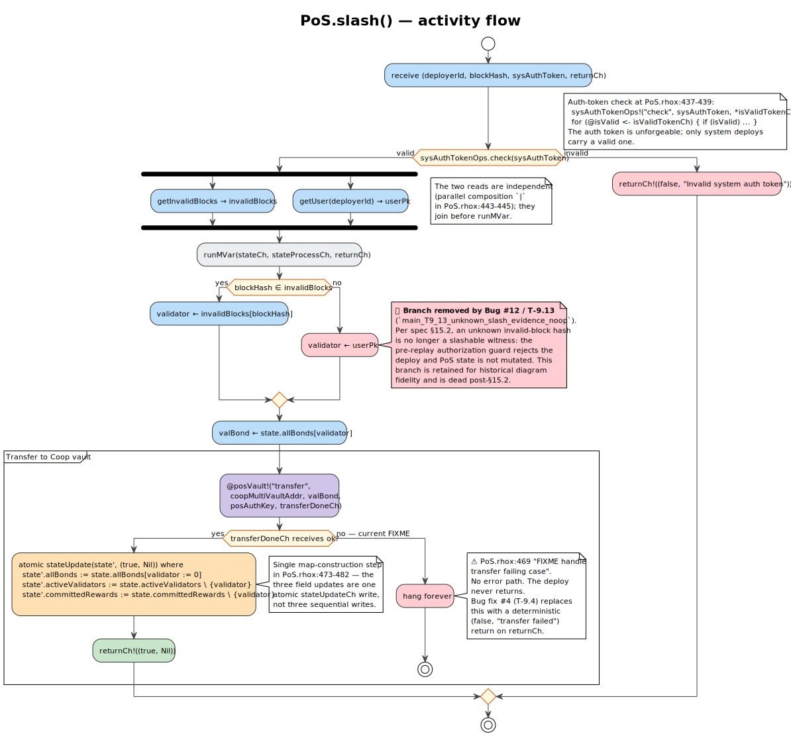

# 06 · Proposing & Effect

## 6.1 The role of the proposer

In F1R3FLY's CBC Casper, only one validator at a time is
"the proposer" for a given round. The proposer assembles the next
block, including:

1. **User deploys** drawn from the deploy buffer (mempool).
2. **System deploys** generated by the protocol (pre-charges,
   slashes, …).
3. **Justifications** to the latest messages of all known validators.
4. **A signature** over the assembled block.

The slashing-relevant work happens in step 2: the proposer asks the
slashing subsystem *"is there anyone bonded I should slash?"* and
attaches one `SlashDeploy` system deploy per offender.

The safety proof does not require every proposer to include every
observed slash immediately. Bounded slash liveness does require a
fairness assumption: once evidence is visible to scheduled bonded
proposers, some scheduled bonded proposer must include the corresponding
slash deploy, or the protocol must enforce an equivalent inclusion rule.
The Hypothesis-backed Sage search reduces the withholding boundary to a
single-slot witness, and TLA+ records it as
`Inv_ProposerFairnessForBoundedLiveness`.

## 6.2 `prepare_slashing_deploys` — the entry point

The Rust source is at
`casper/src/rust/blocks/proposer/block_creator.rs:287-332`. The
algorithm in literate pseudocode:

We start from the authorized invalid-block evidence index in the
`CasperSnapshot`. The old implementation used `invalid_latest_messages`;
that missed slashable invalid blocks that were recorded as invalid but did
not become latest messages.

```
function prepare_slashing_deploys(snapshot: CasperSnapshot,
                                  proposer: Validator,
                                  seqNum: SeqNum,
                                  seed_fn: Validator → SeqNum → BlockHash → Seed)
                                → Vec<SlashDeploy>:

    if snapshot.on_chain_state.bonds_map[proposer] ≤ 0:
        return Vec::new()        -- Bug #8 / T-9.8

    let currentEpoch ← epoch(snapshot.max_block_num + 1)
    let evidence     ← snapshot.dag.invalid_blocks()
```

We keep only invalid-block evidence whose offender is still bonded and whose
evidence epoch matches the block being proposed.

```
    let candidates ← {}
    for m ∈ evidence:
        e ← epoch(m.blockNumber)
        if e = currentEpoch ∧ snapshot.on_chain_state.bonds_map[m.sender] > 0:
            candidates[m.sender] ← minHash(candidates[m.sender], m.blockHash)
```

For each remaining offender, we construct one `SlashDeploy` carrying the
authorized target epoch and return the list in deterministic key order.
If one offender has multiple current-epoch invalid blocks, `minHash` selects
the canonical minimum byte string so set iteration order cannot affect block
construction.

```
    return [
        SlashDeploy(hash, proposer, currentEpoch, seed_fn(proposer, seqNum, hash))
        for (v, hash) ∈ candidates
    ]
```

> **Why filter by parent-state bond?** A validator can be bonded with
> stake 100, equivocate, get slashed in block N (bond → 0), and be
> seen again with a still-flagged invalid latest message in block
> N+1. Without the bond > 0 filter, the proposer would emit *another*
> `SlashDeploy` for an already-zero bond. The PoS contract handles
> this correctly via T-Idem (the slash is a no-op when bond = 0),
> but the redundant deploy wastes CPU and gossip bandwidth.

## 6.3 The `SlashDeploy` Rholang body

A `SlashDeploy` is a *system deploy*: it is not user-authenticated
and carries no fee. The Rust/protobuf payload is
`SlashDeploy { invalid_block_hash, pk, target_activation_epoch, initial_rand }`.
The target activation epoch is checked during block validation before the
deploy is replayed; the Rholang body below receives only the authorized
system bindings needed to invoke PoS.

The body is faithful to
`coop/rchain/casper/util/rholang/costacc/SlashDeploy.scala:40-51`, with
`sys:casper:*` unforgeable bindings elided for readability:

```
new rl, poSCh, deployerId, invalidBlockHash, sysAuthToken, return in {
  rl!(`rho:system:pos`, *poSCh) |
  for(@(_, PoS) <- poSCh) {
    @PoS!("slash", *deployerId, *invalidBlockHash.hexToBytes(),
                   *sysAuthToken, *return)
  }
}
```

Key points:
- The `rl` channel is the **registry lookup** primitive
  (`rho:registry:lookup`); it returns the PoS contract's identifier
  on `poSCh`.
- The `poSCh` (PoS channel) receives the contract's identifier via
  the registry and then pattern-matches the unforgeable binding
  `@(_, PoS)`.
- The `@PoS!("slash", …)` send invokes the on-chain `slash` method
  with four arguments: `deployerId`, `invalidBlockHash.hexToBytes()`,
  `sysAuthToken`, and `return`.
- Note the `.hexToBytes()` conversion — the deploy carries the
  block hash as a hex string but the contract expects raw bytes.

The seed for this deploy is generated by `SystemDeployUtil` via
`splitByte(1)` of
`generateSlashDeployRandomSeed(proposer, seqNum, invalidBlockHash)`.
The `1` is the system-deploy marker for slashes (`SystemDeployUtil.scala:55`);
there is no named `SLASH_MARKER` constant in Scala — just the
literal byte `1` in the `splitByte` call.

## 6.4 The `slash` Rholang contract — activity flow

[](../diagrams/07-activity-pos-slash-contract.svg)

The contract lives at `casper/src/main/resources/PoS.rhox:446-507`
(signature on line 436; lines 432-435 are the block-comment header).

The activity flow:

1. **Receive** `(deployerId, blockHash, sysAuthToken, returnCh)`.
2. **Auth-token check** — `sysAuthTokenOps!("check", sysAuthToken,
   *isValidTokenCh)` (PoS.rhox:448). If the token is invalid,
   `returnCh!((false, "Invalid system auth token"))` and stop.
3. **Parallel reads (fork-join):**
   - `getInvalidBlocks` → `invalidBlocks` map.
   - `getUser(deployerId)` → `userPk`.
4. **Atomic state-update wrapper** — `runMVar(stateCh, …)`.
5. **Identify the offender:**
   - If `blockHash ∈ invalidBlocks`, then `validator ← invalidBlocks[blockHash]`.
   - Else: the contract returns `(false, "invalid slash evidence")`
     and no state mutation occurs (`PoS.rhox:497`). There is **no**
     fallback to "slash whoever submitted the deploy" — that would
     over-broaden the threat surface (a malicious sender could slash
     an honest deployer by submitting a bogus `blockHash`). The
     stricter rejection is intentional and is the only safe choice
     under Bug #12 / T-9.13.
6. **Read the offender's bond:** `valBond ← state.allBonds[validator]`.
7. **Zero-bond branch:** if `valBond ≤ 0`, return `(true, Nil)` with no
   state mutation. This is the idempotent recovery path used by
   merge-rejected slash reissue.
8. **Transfer** positive `valBond` to the Coop vault via
   `@posVault!("transfer", coopMultiVaultAddr, valBond, posAuthKey,
   *transferDoneCh)`.
9. **Handle transfer result** on `transferDoneCh`:
   - On **success**: atomically construct the new state in one
     `stateUpdateCh!` write at `PoS.rhox:477-486`:
     ```
     atomic stateUpdate(state', (true, Nil)) where
       state'.allBonds          := state.allBonds[validator := 0]
       state'.activeValidators  := state.activeValidators \ {validator}
       state'.committedRewards  := state.committedRewards \ {validator}
     ```
     Then `returnCh!((true, Nil))`.
   - On **failure**: return `(false, "transfer failed: ...")`
     deterministically and leave PoS state unchanged.

> **Auth-token observation (T-AuthCheck).** A spoofed deploy with
> the wrong system auth token is rejected at the very first guard
> with `returnCh!((false, "Invalid system auth token"))`. This is
> modeled in Rocq by `execute_authenticated_slash_deploy` and in
> TLA+ by `ReceiveBadAuthSlash` /
> `Inv_InvalidAuthSlashNoPending`.

## 6.5 The slash transition — formal semantics

In the Rocq abstraction, the core `slash` transition is factored from the
auth-token guard. The wrapper `execute_authenticated_slash_deploy` proves
that invalid auth is a no-op and valid auth is equivalent to the core slash
deploy semantics:

```
slash(ps, v) =
  | ps.allBonds[v] = 0   ⟹  (ps, true)              -- idempotent
  | otherwise:
      let b = ps.allBonds[v]
      transfer(coopVault, b)
      ps' = { allBonds[v] := 0;
              activeValidators \\ {v};
              coopVaultBalance += b }
      return (ps', true)
```

Theorems:

- **T-7 (Slash zeros bond).** *(`slash_zeros_bond`,
  `PoSContract.v:75`.)* For every `ps` and `v`,
  `(slash(ps, v)).fst.allBonds[v] = 0`. Proven by direct unfolding;
  TLC verifies the corresponding `Inv_BondsZeroAfterSlash` in
  `MC_SlashFlow.tla`.

- **T-8 (Slash transfers stake).** *(`slash_transfers_stake`,
  `PoSContract.v:95`.)* If the transfer succeeds, then
  `ps'.coopVaultBalance = ps.coopVaultBalance + ps.allBonds[v]`.

- **T-Idem (Slash idempotence; alias T-9).** *(`slash_idempotent`,
  `PoSContract.v:117`.)* For every `ps` and `v`, a second slash on
  the same validator is a no-op:

  ```
  let (ps₁, _) = slash(ps, v) in
  let (ps₂, _) = slash(ps₁, v) in  ps₂ = ps₁
  ```

  Proven via the `bm_slash_idempotent_lookup` foundation lemma
  (`Validator.v:160`).

- **T-AuthCheck (System auth-token guard).** Deploys with
  `sysAuthToken ≠ system_auth_token` are rejected before any state mutation.
  Rocq proves the invalid-auth no-op and valid-auth equivalence wrappers;
  TLA+ checks that bad-auth receipt cannot create pending slash
  authorization without independent evidence.

## 6.6 Component interaction — proposer + effect layer

```
                  ┌──────────────────────┐
                  │   BlockCreator       │
                  │  prepare_slashing_*  │ ← snapshot.{dag, on_chain_state, tracker}
                  └──────────┬───────────┘
                             │ Vec<SlashDeploy>
                ┌────────────▼────────────┐
                │   Block bP (assembled)  │
                │   • user deploys        │
                │   • slash deploys       │
                │   • justifications      │
                │   • signature           │
                └────────────┬────────────┘
                             │ gossip / replay; PoS executes
                             │ each system_deploy
                ┌────────────▼────────────┐
                │   PoS Rholang (slash)   │
                │   • auth-token check    │
                │   • atomic state update │
                │   • coop-vault transfer │
                └────────────┬────────────┘
                             │ allBonds[v] := 0
                ┌────────────▼────────────┐
                │ on-chain state mutated  │
                │ (bonds, active, vault)  │
                └─────────────────────────┘
```

The local proposer evaluates the deploys to compute the post-state
hash; other validators replay the same deploys against the same
pre-state to verify the post-state. *Replay determinism* is what
makes consensus convergence possible.

## 6.7 Why the auth-token guard?

Without the auth-token guard, *anyone* could submit a `slash` deploy
naming an arbitrary block-hash and slashing arbitrary validators.
The auth-token is an **unforgeable**, on-chain-bound capability
issued at PoS contract instantiation: only system-deploys generated
by `prepare_slashing_deploys` carry it, and the PoS contract
verifies it before any state mutation.

This is a **capability-security** pattern in the rho-calculus
[MR05a]: the auth-token is a name that exists only inside the
PoS contract's namespace; the contract dispenses references to it
to system-deploy generators only; user-level deploys cannot
synthesize it.

## 6.8 Slash deploys are not persisted in `KeyValueDeployStorage`

This is a deliberate design decision, not an oversight (the
prior `// TODO: Add slashingDeploys to DeployStorage` comment in
`block_creator.rs::prepare_slashing_deploys` is now a proof-citing
reference to this section).

**Structural reason.** `KeyValueDeployStorage` is keyed on
user-deploy signatures: `(sig: ByteString → Signed<DeployData>)`.
Slash deploys are unsigned `SystemDeployEnum::Slash(SlashDeploy {
invalid_block_hash, pk, target_activation_epoch, initial_rand })` — they have no
`Signed<DeployData>` representation and cannot be inserted.

**Determinism reason.** Slash deploys are pure functions of:
* authorized invalid-block metadata from the DAG.
* the current epoch derived from `blockNumber / epochLength`.
* `validator_identity` from the proposer's config.
* `seq_num` from the proposer's casper-snapshot (computed
  deterministically from the DAG).
* `generate_slash_deploy_random_seed(self_id, seq_num)` (a pure
  function).

On node restart, `prepare_slashing_deploys` reconstructs
deterministically from these inputs. No persistence is required —
all non-deterministic inputs are persisted elsewhere.

**Theorem citations.**
* T-4 (record monotonicity, `EquivocationRecord.v::record_monotone`):
  `EquivocationRecord` set never shrinks under dispatch.
* T-9.3 (catch-all dispatcher, `BugFixDispatcher.v::t_9_3_catchall_mints_record`):
  every slashable block produces a record.

Together they establish that the set of bonded-invalid-latest-message
tuples on restart equals the set at the last persisted snapshot — so
the reconstructed slash deploys equal the pre-restart set up to
bond-filtering.

**Symmetric reasoning.** `CloseBlockDeploy` is also a system deploy
and is also not persisted in `KeyValueDeployStorage` for the same
reason. The asymmetry between user and system deploys is
intentional: user deploys are crash-recovery state; system deploys
are deterministically replayable from the persisted DAG.

Merge-rejected slashes are the one extra input to this reconstruction:
they are not stored as user deploys, but the parent merge records
`RejectedSlash { invalid_block_hash, issuer_public_key, source_block_hash }`.
The next proposer reissues one recovered slash per uncovered
`invalid_block_hash`. If the proposer's own slashing pass already emits
that hash, the recovered record is treated as covered and is not emitted
again.

## 6.9 Why a separate Coop vault contract?

The forfeited stake must go *somewhere* — leaving it in `allBonds`
under the offender's key would be morally wrong (the offender
should not retain ownership), and burning it would deprive the
ecosystem of resources. The Coop vault is a community-controlled
multi-sig contract that accumulates forfeited stake for re-issuance
to honest validators or protocol development.

The slash contract uses `@posVault!("transfer", …)` to move the
stake; the vault has its own access-control rules (multi-sig
threshold) for outflows. The vault is intentionally a *separate*
contract so the slash contract does not need to know about
multi-sig logic.

---

**Next:** [§07 — Fork-choice & validator lifecycle](07-fork-choice-and-lifecycle.md)
