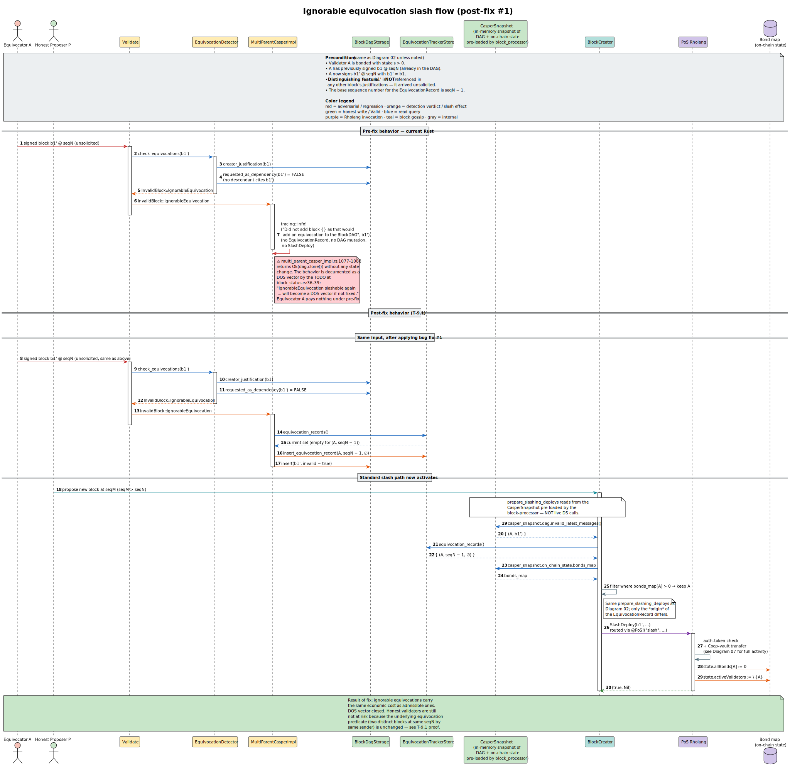
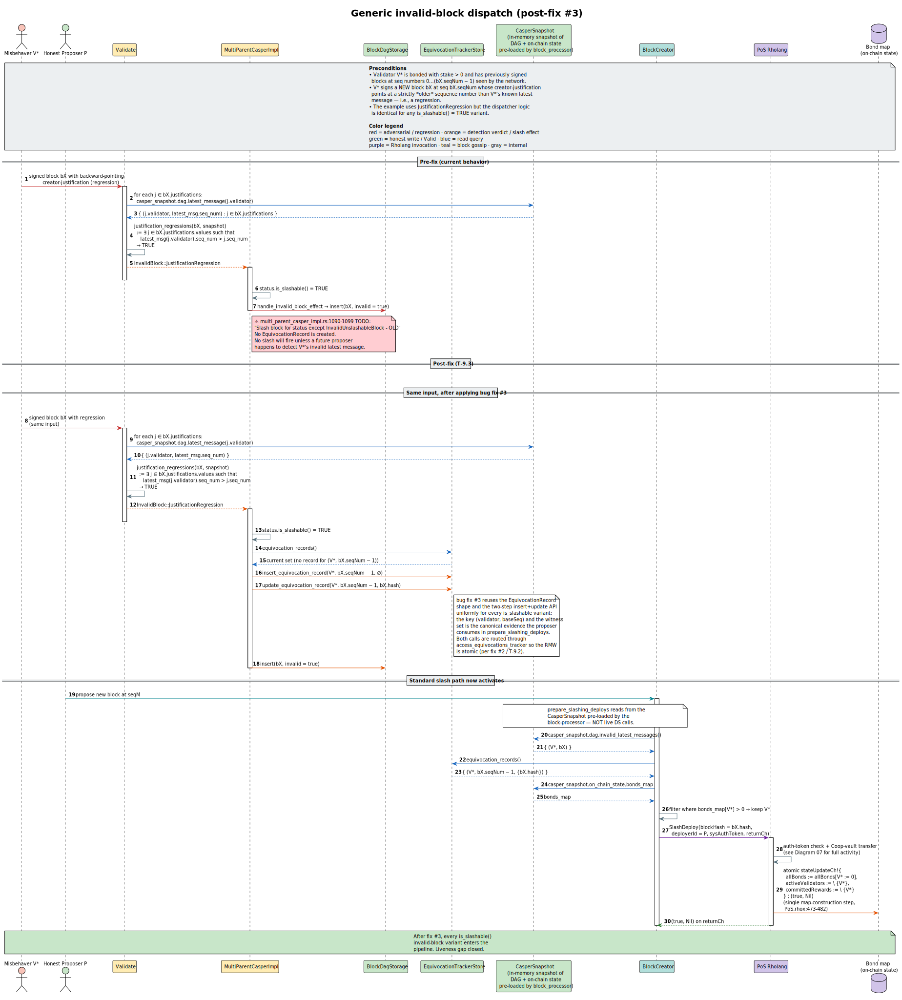

# 09 · Bug-Fix Manifest & Rationale

The slashing subsystem ships with **sixteen documented defects**, each
accompanied by a Rocq-mechanized fix or boundary theorem. **Nine are
inherited from the Scala upstream**, **two are Rust-introduced regressions**
(bug #2 and bug #11), and **five are Rust-source-confirmed
authorization/projection gaps** found by the later Sage/Hypothesis
traceability work.
**One** of the Scala-inherited bugs — #9 — is a *deliberate Rust
widening* (Rust admits more blocks than Scala, by design); the
remaining eight Scala-inherited bugs (#1, #3–#8, #10) are
convergence fixes that restore Rust↔Scala bisimilarity.

## 9.1 At a glance

| #  | Theorem | Origin                         | Bisimilarity impact     | Worked example          | Diagram |
|----|---------|--------------------------------|-------------------------|-------------------------|---------|
| 1  | T-9.1   | Scala-inherited                | Preserving              | (none — see spec §10.1) | 03      |
| 2  | T-9.2   | **Rust-introduced regression** | Preserving              | §11.3                   | 09      |
| 3  | T-9.3   | Scala-inherited                | Preserving              | §11.8                   | 05      |
| 4  | T-9.4   | Scala-inherited                | Preserving              | §11.4                   | 07      |
| 5  | T-9.5   | Scala-inherited                | Preserving              | §11.6                   | 06      |
| 6  | T-9.6   | Scala-inherited                | Preserving              | §11.9                   | 08      |
| 7  | T-9.7   | Scala-inherited                | Permitted bug-fix delta | §11.7                   | 02      |
| 8  | T-9.8   | Scala-inherited                | Preserving              | §11.10                  | 01      |
| 9  | T-9.9   | Scala bug, Rust-fixed          | **Deliberate widening** | §11.5                   | 08      |
| 10 | T-9.10  | Scala-inherited                | Preserving              | §11.11                  | 11      |
| 11 | T-9.11  | **Rust-introduced regression** | **Permitted bug fix**   | §11.12 (UC-101–UC-108)    | n/a   |
| 12 | T-9.13  | Rust-source confirmed          | **Permitted bug fix**   | §11.13 (unauthorized slash deploy) | n/a |
| 13 | T-9.12  | Rust-source confirmed          | **Permitted bug fix**   | §11.14 (stale-evidence rebond)     | n/a |
| 14 | T-LivenessGap (`deploy_epoch_matches_target`) | Rust-source confirmed | **Permitted bug fix** | §11.15 (authorized-index candidates) | n/a |
| 15 | T-9.14  | Rust-source confirmed          | **Permitted bug fix**   | §11.16 (checked seq-arithmetic)    | n/a |
| 16 | T-9.15  | Rust-source confirmed          | **Permitted bug fix**   | §11.17 (duplicate justifications)  | n/a |

"Preserving" = the fix restores Rust↔Scala convergence (or, for #2,
fixes a Rust-only deviation). "Deliberate widening" = the fix is a
documented Rust-side improvement that breaks strict bisimilarity by
design; T-9.9 establishes that the widening is sound.

Bug #10 is the **withdrawal-flow analog** of Bug #4: both close
`posVault.transfer`-failure FIXMEs in `PoS.rhox`. Bug #4 fixed the
slash arm (line 469); Bug #10 fixes the post-quarantine
withdrawal arm (line 619). Bug #10's theorem set
(T-9.10 / T-9.10' / T-9.10″) is mechanised in
`BugFixWithdrawTransferFailure.v`, model-checked in
`MC_WithdrawFlow.cfg`, and applied in PoS.rhox lines 615-651.

> **Implementation status (current).** All eleven fixes are applied
> in the Rust / Rholang source and mechanized in Rocq:
>
> | Bug | Theorem | Production location                                                  |
> |-----|---------|----------------------------------------------------------------------|
> | #1  | T-9.1   | `block_status.rs:191` — `IgnorableEquivocation` in `is_slashable()`  |
> | #2  | T-9.2   | `multi_parent_casper_impl.rs:1056` — RMW via `access_equivocations_tracker` |
> | #3  | T-9.3   | `multi_parent_casper_impl.rs:1105` — `status if status.is_slashable()` catch-all |
> | #4  | T-9.4   | `PoS.rhox:487-509` — `match transferResult` with deterministic failure |
> | #5  | T-9.5   | `equivocation_detector.rs:184` — `if stake > 0` guard                |
> | #6  | T-9.6   | `validate.rs:875-898` — self-regression filter dropped               |
> | #7  | T-9.7   | `equivocation_detector.rs` — canonical self-chain child above base    |
> | #8  | T-9.8   | `block_creator.rs:298-306` — proposer-bond early-return              |
> | #9  | T-9.9   | `validate.rs:1018-1029` — `has_slash_system_deploys` widening        |
> | #10 | T-9.10  | `PoS.rhox:615-651` — `payWithdraw` pattern-match + success-gated `computeRemove` |
> | #11 | T-9.11  | `equivocation_detector.rs` — total deterministic traversal with distinct child hashes |
>
> The "Cause" subsections below describe the *pre-fix* state
> (matching the documented Scala / pre-fix Rust code path); the
> "Post-fix behavior" subsections describe the *current* Rust /
> Rholang behaviour after each fix landed.

## 9.2 Bug #1 — `IgnorableEquivocation` non-slashable (DOS vector)

**Origin.** Scala-inherited. The Scala counterpart at
`BlockStatus.scala:62-65` carries the explicit TODO:
*"Make IgnorableEquivocation slashable again ... will become a DOS
vector if not fixed."*

**Cause.** Pre-fix, `IgnorableEquivocation` is *not* in
`is_slashable() = ⊤`. Equivocations that arrive *unsolicited* (no
other block cites them) are silently dropped at
`multi_parent_casper_impl.rs:1077-1088` with only a `tracing::info!`
log. A Byzantine validator can flood the network with such blocks
without economic cost.

**Pre-fix behavior.** Detector returns `IgnorableEquivocation`;
dispatcher logs and discards.

**Post-fix behavior.** Add `IgnorableEquivocation` to
`is_slashable()`; in `handle_invalid_block`, treat it identically
to `AdmissibleEquivocation` (record evidence, allow standard
slash flow).

**Theorem T-9.1.** *(`bug_fix_ignorable_safety`,
`BugFixIgnorable.v:32`; `post_fix_ignorable_implies_equivocation`,
line 57.)* Under the fix, no honest validator is wrongly slashed
— since the underlying equivocation predicate (two distinct blocks
at same seqN by same sender) is unchanged.

**Why this matters.** Without the fix, an attacker can mount a DOS
campaign: send K equivocating blocks from a freshly-bonded validator
to consume network bandwidth and verification CPU on every honest
node, with no economic risk. Post-fix, every equivocation costs
the offender their entire bond.

[](../diagrams/03-seq-ignorable-equivocation-fixed.svg)

## 9.3 Bug #2 — Lock-free tracker access (Rust regression)

**Origin.** Rust-introduced regression.

**Cause.** `multi_parent_casper_impl.rs:1046-1075` reads then writes
the equivocation tracker without a lock, allowing two threads
processing `AdmissibleEquivocation` for the same `(validator,
baseSeqNum)` to both observe `record-absent` and both insert,
overwriting accumulated `equivocationDetectedBlockHashes` with
`Set::empty`. The Scala atomic equivalent at
`MultiParentCasperImpl.scala:586-603` wraps the read, exists-check,
and `insertEquivocationRecord` write atomically inside
`accessEquivocationsTracker`.

**Pre-fix behavior.** Race-prone read-modify-write; one of the two
witness hashes is lost (Diagram 09 / §05).

**Post-fix behavior.** Re-introduce `access_equivocations_tracker
{ ... }` (matching the Scala behavior) which holds a global
semaphore around the read-modify-write window. The semaphore
lives in `BlockDagKeyValueStorage.scala:262`.

**Theorem T-9.2.** *(`t_9_2_atomic_no_overwrite`,
`BugFixAtomicTracker.v:43`; n-thread
`t_9_2_atomic_n_threads_arbitrary` at line 130.)* Under the lock,
T-4 (record monotonicity) holds for arbitrary thread schedules.

**Why this matters.** Pre-fix, a Byzantine validator can race their
own equivocation insertion against an honest detector to lose
evidence. Post-fix, all evidence is preserved regardless of
thread schedule.

[](../diagrams/09-seq-tracker-race-and-fix.svg)

## 9.4 Bug #3 — Generic slash dispatcher stub

**Origin.** Scala-inherited. The Scala counterpart at
`MultiParentCasperImpl.scala:621-622` exhibits the same gap — the
catch-all `case ib: InvalidBlock if InvalidBlock.isSlashable(ib)`
arm only invokes `handleInvalidBlockEffect` (mark-invalid +
buffer-remove); no `EquivocationRecord` is created.

**Cause.** `multi_parent_casper_impl.rs:1090-1099` carries
*"TODO: Slash block for status except InvalidUnslashableBlock - OLD"*.
The 15 non-equivocation slashable variants (`JustificationRegression`,
`InvalidBondsCache`, `NeglectedInvalidBlock`, etc.) only get marked
invalid; no `EquivocationRecord` is created and no slash effect
runs unless a later proposer happens to surface the offender via
`prepare_slashing_deploys`.

**Pre-fix behavior.** Slashable invalid blocks are flagged in the
DAG but evidence is *not* persisted to the tracker; reliance on
proposer-side surfacing is fragile.

**Post-fix behavior.** Dispatch every `is_slashable() = ⊤` variant
through the same record-creation path used by
`AdmissibleEquivocation`.

**Theorem T-9.3.** *(`t_9_3_dispatch_complete`,
`BugFixDispatcher.v:41`.)* Under the fix, every slashable invalid
block triggers a record-insert within the dispatcher.

**Why this matters.** Without the fix, 15 of 17 slashable variants
have unreliable enforcement: an offender's `JustificationRegression`
violation might never lead to a slash if the proposer rotation
doesn't surface it. Post-fix, every slashable variant enters the
standard pipeline.

[](../diagrams/05-seq-invalid-block-dispatch-fixed.svg)

## 9.5 Bug #4 — PoS transfer-failure FIXME

**Origin.** Scala-inherited.

**Cause.** `casper/src/main/resources/PoS.rhox:469` carries the
comment *"FIXME handle transfer failing case"*. If
`posVault!("transfer", coopMultiVaultAddr, valBond, posAuthKey,
*transferDoneCh)` fails, the `for (_ <- transferDoneCh)`
continuation never fires and there is no error path back to
`returnCh`. The slash deploy hangs.

**Pre-fix behavior.** The validator stays in `SlashPending`
indefinitely; replay fails to converge.

**Post-fix behavior.** Add an alternate continuation that listens
for an error signal on `transferDoneCh` (or a timeout) and writes
`(false, "transfer failed")` to `returnCh` deterministically.

**Theorem T-9.4.** *(`t_9_4_transfer_failure_safety`,
`BugFixTransferFailure.v:40`.)* Under the fix, the slash transition
either succeeds with T-7/T-8 or returns `false` in finite time:

```
∀ ps v ok, let (ps', ok') := slash_with_transfer_oracle(ps, v, ok) in
  (ok' = ⊤ ∧ allBonds[v] = 0) ∨ (ok' = ⊥ ∧ ps' = ps)
```

**Why this matters.** A hung deploy breaks replay determinism: if
half the network sees the transfer succeed and the other half sees
it fail (or hang), the post-state hashes diverge and consensus
splits. Post-fix, the failure mode is deterministic, so all
replays converge.

[](../diagrams/07-activity-pos-slash-contract.svg)

## 9.6 Bug #5 — Stake-0 silent classification

**Origin.** Scala-inherited.

**Cause.** `equivocation_detector.rs:217-220` notes
*"This case is not necessary if assert(stake > 0) in the PoS
contract"*. Until that assertion is enforced, a stake-0 bonded
validator is silently classified `EquivocationDetected` — no slash,
no neglected check.

**Pre-fix behavior.** A stake-0 bonded validator's equivocation is
"detected" but the slash transition is a no-op (no bond to forfeit)
and *no record is created* either.

**Post-fix behavior.** Two valid options:
- **(a)** Add `assert(stake > 0)` in the PoS `bond` contract to
  make stake-0 bonded validators an unreachable state. Preferred.
- **(b)** Return `Err(StakeZero)` from the detector and propagate
  upstream. Defensive but adds a runtime branch.

T-9.5 mechanizes option (a). Option (b) is left as future work.

**Theorem T-9.5.** *(`t_9_5_slash_preserves_invariant`,
`BugFixStakeZero.v:36`; corollary `t_9_5_active_has_positive_bond`
at line 58.)*

```
active_implies_bonded(ps) ≜ ∀ v ∈ active(ps), bonds_map[v] > 0

∀ ps v, active_implies_bonded(ps)
    ⟹ active_implies_bonded(fst(slash(ps, v)))
```

**Why this matters.** Pre-fix, an attacker with a corrupted PoS
state (stake-0 bonded) can equivocate freely with no economic
consequence. Post-fix, the corrupted state is unreachable.

## 9.7 Bug #6 — Self-regression slips through

**Origin.** Scala-inherited.

**Bisimulation impact.** Preserving — both implementations skip the
block's own sender in `justification_regressions` (line 666 of
`Validate.scala:649-702`); the fix tightens the predicate on both
sides identically.

**Cause.** `validate.rs:875-985` (Scala `Validate.scala:649-702`)
ignores regression of the block's own sender and defers to
`check_equivocations`. But `check_equivocations` only compares the
creator-justification *hash*, not the *sequence-number ordering*.
A sender that ships a non-equivocating but seq-regressed
self-justification (e.g. due to LMD inconsistency) passes both
checks.

**Pre-fix behavior.** A validator can ship a chain like
`b₅ → b₇ → b₉` where `b₉` cites `b₅` (skipping `b₇`); pre-fix the
self-regression is missed.

**Post-fix behavior.** Add an explicit seq-number order check for
the block's own sender in `justification_regressions`.

**Theorem T-9.6.** *(`t_9_6_self_regression_detected`,
`BugFixSelfRegression.v:52` (Boolean); DAG-level
`t_9_6_self_regression_in_dag` at `BugFixSelfRegression.v:79`
(§1, Bug #6).)*

```
Boolean: ∀ blk_sn latest cited, cited < latest
       ⟹ has_self_regression(blk_sn, latest, cited) = ⊤

DAG-level: ∀ blocks sender cited b,
            b ∈ blocks ∧ block_sender(b) = sender ∧ block_seq(b) > cited
          ⟹ has_self_regression(0, ds_latest_seq(blocks, sender), cited) = ⊤
```

## 9.8 Bug #7 — Off-by-one seq-number density

**Origin.** Scala-inherited.

**Cause.** `equivocation_detector.rs:400` (Scala
`EquivocationDetector.scala:336`) uses `baseSeqNum + 1` to find a
validator's child block. This assumes per-sender seq numbers are
*dense* (never skipped). If a validator skips a sequence number
(a rare but possible edge case under partition recovery), the lookup
misses the visible child.

**Pre-fix behavior.** Detector misses some equivocations under
partition recovery.

**Post-fix behavior.** Replace `baseSeqNum + 1` with a canonical walk
over the visible creator/self-justification chain. Given a latest
message `h`, offender `v`, and base sequence `β`, the detector returns
the oldest visible block `c` on that self-chain such that
`sender(c) = v ∧ seq(c) > β`; equivalently, `c` is immediately above
the first self-parent whose sequence is `≤ β`, or the chain boundary.
This fixes skipped sequence numbers and prevents two latest messages
on the same branch, for example `seq = 10` and `seq = 11`, from being
counted as two distinct equivocation children. The Rust implementation
memoizes `(h, v, β) ↦ c?` within one detector pass; the Rocq theorem
proves this cache is observationally equivalent to recomputing the
canonical walk.

**Theorem T-9.7.** *(`t_9_7_canonical_finds_visible_descendant_with_gap`,
`t_9_7_canonical_dense_subsumes_pre_fix`,
`t_9_7_canonical_prefix_stability`, and
`t_9_7_canonical_memoized_equivalent` in
`BugFixSeqNumDensity.v`; legacy subsumption
`t_9_7_post_fix_subsumes_pre_fix` is retained.)*

```
∀ chain sender β b,
   b ∈ chain ∧ Forall (λx. sender(x)=sender ∧ seq(x)>β) chain
 ⟹ ∃ c, canonical_child_post_fix(chain, sender, β) = Some c

∀ prefix chain sender β c,
   Forall (λx. sender(x)=sender ∧ seq(x)>β) prefix
 ∧ canonical_child_post_fix(chain, sender, β) = Some c
 ⟹ canonical_child_post_fix(prefix ++ chain, sender, β) = Some c
```

## 9.9 Bug #8 — `prepare_slashing_deploys` did not check proposer is bonded

**Origin.** Scala-inherited. The Scala counterpart at
`BlockCreator.scala:129-153` (`prepareSlashingDeploys`) also omits
the proposer-bonded check — it filters `ilm` by *target* validator
bond (`bondsMap.getOrElse(validator, 0L) > 0L`, line 134) but
never checks the proposer itself.

**Pre-fix cause.** `block_creator.rs:287-332` did not verify that the
*proposer itself* is bonded. An unbonded proposer running the
proposer thread will still build slash deploys; the `slash`
contract rejects them at `sysAuthTokenOps!("check", ...)`. This is
wasted network work.

**Pre-fix behavior.** Unbonded proposer emits doomed slash deploys.

**Post-fix behavior (mechanized in Rocq and implemented in Rust).**
Skip `prepare_slashing_deploys` entirely when `bonds_map[proposer] = 0`.
The Rocq mechanization at `BugFixUnbondedProposer.v:44` proves the
property; the Rust source implements the short-circuit before reading
`invalid_latest_messages`.

**Theorem T-9.8.** *(`t_9_8_unbonded_proposer_no_slash`,
`BugFixUnbondedProposer.v:44`; equivalence
`t_9_8_post_fix_equivalent_when_bonded` at line 55.)*

```
∀ ilm bonds proposer seqNum seed_fn,
   bm_lookup(bonds, proposer) = 0
 ⟹ prepare_slashing_deploys_post_fix(ilm, bonds, proposer, seqNum, seed_fn) = []

When bonds[proposer] > 0, post-fix is pointwise equal to pre-fix.
```

## 9.10 Bug #9 — Scala rejects self-correcting blocks (Scala bug, Rust-fixed)

**Origin.** Scala bug; Rust-fixed by deliberate widening.

**Bisimulation impact.** **Deliberate widening** (the only one of
the original ten) — the Rust port admits self-correcting blocks Scala
rejects.

**Cause.** Scala `Validate.scala:727-731` rejects a block whenever
`neglectedInvalidJustification = ⊤`, even if the block itself
carries a `Slash` system deploy targeting the offender. Rust's
`validate.rs:1016-1029` adds an extra branch
`if neglectedInvalidJustification ∧ ¬ has_slash_system_deploys`
that *admits* self-correcting blocks. The Scala behavior is a bug;
the Rust widening is correct.

**Pre-fix Scala behavior.** Block B that cites A's invalid block
*and* attaches `SlashDeploy(b, A)` is rejected — B must wait for
some *other* validator to slash A. This is a liveness gap.

**Post-fix Rust behavior.** Block B is admitted; A is slashed in
B's own block. Strictly more live.

**Theorem T-9.9.** *(`t_9_9_post_fix_rejection_iff`,
`BugFixSelfRegression.v:107`.)*

```
∀ hn hs, rejects_neglected_post_fix(hn, hs) = ⊤
       ⟺ hn = ⊤ ∧ hs = ⊥

Corollary t_9_9_post_fix_admits_more (BugFixSelfRegression.v:121):
  ∀ hn hs, hn = ⊤ ∧ hs = ⊤
       ⟹ rejects_neglected_pre_fix(hn) = ⊤  ∧
         rejects_neglected_post_fix(hn, hs) = ⊥
```

In English: post-fix rejection fires iff there *is* a neglected
justification *and* the block does *not* carry a slash deploy.
The post-fix predicate strictly admits more blocks (those with
both `has_neglected = ⊤` and `has_slash = ⊤`).

**Why this is a deliberate widening.** Scala unconditionally
rejects neglecting blocks. Rust admits the same blocks if they
self-correct. The two implementations are *not* observationally
equivalent — Rust admits a strict superset of valid blocks. T-9.9
establishes that the additional admission is sound (the slash
still fires; the offender is still punished); the bisimilarity
claim T-15 holds *modulo* this widening (see §10).

## 9.11 Cross-fix interactions

The eleven fixes interact in four notable ways:

1. **Fix #3 + Fix #6**: Bug #6 (self-regression) feeds bug #3
   (dispatcher). Without #3, the `JustificationRegression` verdict
   fires from #6 but no record is created. With both #3 and #6,
   the self-regression is detected *and* recorded *and* slashed.

2. **Fix #2 + every other fix**: Bug #2 (lock-free) protects every
   other bug-fix's tracker writes from being lost under thread
   interleaving. Without #2, fixes #1, #3, #5, #6, #7, #8 could
   *all* race their tracker writes and lose evidence.

3. **Fix #4 + Fix #9**: Bug #4 (transfer failure) and bug #9
   (self-correcting blocks) both touch the slash deploy's
   end-to-end semantics. Together they ensure that a slash deploy
   *always* terminates in finite time with a deterministic outcome,
   even when the block is self-correcting.

4. **Fix #4 + Fix #10**: Bug #4 fixed the slash arm's
   `posVault.transfer` failure path (PoS.rhox:469); Bug #10 fixes
   the *withdrawal* arm's analogous failure path (PoS.rhox:619).
   Together they close every `posVault.transfer` callsite in
   `PoS.rhox` against fund-loss / hung-deploy regressions. The two
   fixes do not interact dynamically — slashing and withdrawal are
   disjoint state transitions in the PoS contract — but the fix
   *pattern* is shared (pattern-match on `(true, _)` vs
   `(false, _)`, leave per-validator state intact on failure for
   retry on a later block). Future `posVault.transfer` callsites,
   if added, must follow the same template.

## 9.12 Bug #10 — PoS withdrawal transfer-failure FIXME

**Origin.** Scala-inherited.

**Cause.** `casper/src/main/resources/PoS.rhox:619` carries the
comment *"FIXME fix transfer in failure case"* inside
`removeQuarantinedWithdrawers`. The pre-fix `payWithdraw` contract
calls `payWithdrawer!(...)` and the surrounding flow proceeds to
remove the validator from `withdrawers` and `committedRewards`
regardless of whether the underlying `posVault.transfer` succeeded.
If the transfer fails the validator is removed from state without
receiving funds — a fund-loss bug that breaks vault conservation.

This is the **withdrawal-flow analog** of Bug #4 (which already fixed
the slash arm). The same `posVault.transfer` failure-handling pattern
applies to both code paths; only the slash arm had been fixed before.

**Pre-fix behavior.** A failed `posVault.transfer` results in:
1. Validator removed from `state.withdrawers` (line 627).
2. Validator's `committedRewards` cleared (line 626).
3. PoS vault balance unchanged (transfer rolled back at the vault
   layer).

The validator's bond + accumulated rewards are silently lost: the
contract no longer tracks the obligation, so the validator has no
recourse. Vault conservation
(`pos_balance + Σ payouts_for_withdrawers = constant`) is violated.

**Post-fix behavior.** `payWithdraw` pattern-matches on the transfer
result and emits `(pk, success_bool)` on its `resultCh`. The
downstream `computeRemove` fold is rewritten to remove **only**
successful withdrawers from the maps; failed transfers leave the
per-validator state intact for retry on a later block. Mirrors the
Bug #4 fix already applied to the slash arm
(PoS.rhox:472-510).

**Theorem T-9.10.** *(`t_9_10_withdraw_transfer_failure_safety`,
`BugFixWithdrawTransferFailure.v:225`.)* Under the fix, the
per-validator withdraw transition either succeeds AND removes the
validator from `withdrawers`, or fails AND leaves the entire
state unchanged:

```
∀ psw v ok, let psw' := withdraw_with_transfer_oracle(psw, v, ok) in
  (ok = ⊤ ∧ wm_contains(psw'.withdrawers, v) = ⊥)
∨ (ok = ⊥ ∧ psw' = psw)
```

**Theorem T-9.10' (failure preserves total funds).**
*(`t_9_10_failure_preserves_total_funds`,
`BugFixWithdrawTransferFailure.v:262`.)* A failed withdrawal does
NOT lose funds — the post-fix state is identical, so the
total-funds invariant is trivially preserved.

**Theorem T-9.10″ (parallel order-independence).**
*(`t_9_10_withdraw_independence`,
`BugFixWithdrawTransferFailure.v:286`.)* The Rholang flow uses
`unorderedParMap` to drive withdrawals in parallel. Withdrawing v
then u produces the same withdrawer/reward maps as withdrawing u
then v, when v ≠ u. Parallel-fold safety at the formal-model
abstraction level.

**Why this matters.** Without the fix, a transient `posVault`
failure (network delay, balance race with concurrent slash) silently
forfeits a validator's stake. The validator has no on-chain record
of the obligation and cannot retry. Post-fix, the validator stays in
`withdrawers` until a successful transfer, with the per-validator
state intact across block boundaries.

**Companion TLA+ model.** `formal/tlaplus/slashing/WithdrawFlow.tla`
+ `MC_WithdrawFlow.cfg` model the withdrawal pipeline with
explicit success / fail / retry actions and verify
`Inv_NoFundsLost`, `Inv_TotalFundsConst`, `Inv_RemovedImpliesPaid`,
`Inv_RewardsConsistent`, and `Live_AllEventuallyPaid`.

## 9.13 Bug #11 — Detector traversal was partial and duplicate-child sensitive

**Origin.** Rust-introduced regression. The Scala/Rust bisimilarity
target is maintained for complete latest-message views, but the fixed
Rust behavior intentionally diverges from the pre-fix behavior where
that behavior was a bug.

**Cause.** The pre-fix Rust detector folded a `HashMap` of latest
messages recursively and used unsafe/must-exist lookups for direct and
nested justification pointers. If the traversal encountered a missing
nested offender pointer before later decisive evidence, it could abort
with `KeyNotFound`; if it encountered two paths to the same offender
child, it counted the two `Vec` entries as two children.

**Pre-fix behavior.** The same evidence set could be classified
differently depending on iteration order. Missing pointers could stop
the search before later decisive children were considered, and duplicate
paths to one child could produce a false
`NeglectedEquivocation`.

**Post-fix behavior.** The detector projects latest-message entries into
deterministic validator order and scans them iteratively. Missing direct
or nested pointers contribute `∅`, and only distinct child block hashes
count. The abstract rule is:

```
detectable(view) ≜ detected_hash_seen(view) ∨ |distinct_child_hashes(view)| ≥ 2
```

**Theorem T-9.11.** The Rocq lemmas
`fixed_detectable_missing_pointer_prefix`,
`fixed_detectable_detected_hash_true`,
`fixed_detectable_duplicate_single_child_false`, and
`fixed_detectable_two_distinct_children_true` prove the fixed detector
facts without admissions or axioms. TLA+ mirrors them with
`Inv_FixedDetectorTotal`, `Inv_MissingPointerNonContributing`,
`Inv_DuplicateChildNeedsDistinctChildren`,
`Inv_TwoDistinctChildrenDetect`, and `Inv_DetectedHashDetects`.

**Why this matters.** Without the fix, a Byzantine validator can shape a
latest-message view that either hides decisive evidence behind a missing
pointer or makes one child look like two. Post-fix, neither shape is an
executable exploit: missing pointers do not abort the detector, and only
two distinct offender children or a known detected hash can trigger
neglect.

## 9.14 Bug #12 — Received slash deploys were not locally authorized

**Origin.** Rust-source confirmed vulnerability.

**Cause.** Received blocks could carry a `SlashDeploy` whose invalid hash,
issuer, target epoch, or target bond state was not checked against local
slashing policy before replay.

**Pre-fix behavior.** A Byzantine block sender could craft a block
carrying a `SlashDeploy` referencing (a) an unknown invalid hash, (b)
a bonded validator the local node had no evidence against, (c) an
epoch outside the current authorization window, or (d) an issuer
field forged to look like another validator. The local Rholang
replay would execute the deploy *as if it were authorized*, mutating
PoS state on the basis of evidence the local node had not validated.

**Post-fix behavior.** Validation rejects unauthorized slash deploys before
Rholang replay. The issuer must equal the block sender, the invalid hash must
name a locally known invalid block, the target epoch must match both evidence
and current epoch, the target must be currently bonded, and a block may target
each `(validator, epoch)` at most once.

**Proofs and tests.** Rocq: `execute_unknown_evidence_noop`,
`main_T9_13_unknown_slash_evidence_noop`. TLA+:
`Inv_RejectedSlashWithoutEvidenceNoPending`. Rust:
`slash_authorization_regressions`.

**Why this matters.** Without the fix, slash authorization is *delegated to
the block sender*: any block author could fire arbitrary slashes against
any bonded validator, turning slashing — a defensive economic-security
primitive — into an offensive griefing tool. The post-fix authorization
relation `SlashAuthorizedByEvidence(local, deploy)` is the necessary
locally-checked precondition for replaying any `SlashDeploy`.

**Worked example:** §11.13.  **Diagram:** extends Diagram 05 (generic
invalid-block dispatch) with the new pre-replay authorization filter
at the `replay_runtime` boundary.

**Error routing.** The validation-pipeline entry point
`Validate::slash_deploy_authorization` (`casper/src/rust/validate.rs`)
distinguishes between *authorization-predicate failures* (the
4-conjunct check returning a `SlashAuthError` variant) and
*infrastructure failures* (storage I/O, runtime errors, malformed wire
data not caught by `format_of_fields`). The former are slashable:
a Byzantine block author who emits an unauthorized slash deploy is
themselves slashable under `InvalidBlock::UnauthorizedSlashDeploy`.
The latter map to `BlockError::BlockException`, which propagates up
the dispatcher without slashing the block sender — an honest validator
whose node experiences a transient `KvStoreError` during slash
validation must not be slashed for a fault attributable to its own
infrastructure. The split is implemented as a `match` on
`CasperError::SlashAuth(_)` vs other variants; downstream the
dispatcher's T-9.3 catch-all still mints an `EquivocationRecord` for
the `UnauthorizedSlashDeploy` arm.

## 9.15 Bug #13 — Same-key rebond could inherit stale evidence

**Origin.** Rust-source confirmed vulnerability.

**Cause.** Raw public-key identity does not distinguish an old validator
lifetime from a later same-key rebond.

**Pre-fix behavior.** Validator `v` bonds at epoch `e₁`, equivocates,
is slashed and unbonded. Later, the same public key bonds again at
epoch `e₂ > e₁`. The stale evidence from epoch `e₁` — still
retained for replay determinism and chain integrity — could be used
to fire a *second* slash against the rebonded `(v, e₂)` lifetime,
even though the new lifetime is innocent.

**Post-fix behavior.** Slash evidence is epoch-scoped. Evidence for `(v, e₁)`
does not authorize a slash for `(v, e₂)` when `e₁ ≠ e₂`.

**Proofs and tests.** Rocq: `stale_evidence_not_authorized`,
`main_T9_12_stale_evidence_not_authorized`. TLA+:
`Inv_StaleEvidenceCannotSlashRebondedKey`. Rust:
`stale_invalid_evidence_is_not_an_authorized_slash_candidate` and
`received_stale_slash_deploy_is_rejected_before_replay`.

**Why this matters.** A *rebond identity attack* — where the same
public key returns to the active set after slashing — would let an
adversary double-charge a validator for a single offence (once at
each rebond) or replay an old slash to grief a now-innocent
operator. The epoch-scoped authorization makes evidence identity
strictly stronger than key identity.

**Worked example:** §11.14.  **Diagram:** extends Diagram 06
(validator lifecycle) with epoch-tagged `(v, eₖ)` lifetimes.

## 9.16 Bug #14 — Slash liveness depended on invalid latest messages

**Origin.** Rust-source confirmed liveness gap.

**Cause.** The proposer generated slash deploys from
`invalid_latest_messages()`, but invalid blocks are inserted as invalid and
do not necessarily update latest-message state.

**Pre-fix behavior.** A validator producing an invalid block had its
invalid-block hash inserted into the DAG with the invalid flag, but
the *latest-message* index — used by the proposer's slash candidate
generator — was not updated to point at the invalid block. The
proposer thus saw the offender's *previous* (valid) latest message
and could not generate a slash deploy. The system would silently fail
to slash a detected equivocator.

**Post-fix behavior.** The proposer derives candidates from the authorized
invalid-block evidence index, sorts deterministically, and emits at most one
slash deploy per current offender epoch.

**Proofs and tests.** Rocq: `deploy_epoch_matches_target`. TLA+:
`Inv_NoInvalidLatestLivenessGap`. Rust:
`current_epoch_invalid_evidence_is_authorized_once_per_offender`.

**Why this matters.** Slashing without liveness is hollow: if
detection works but the slash deploy never emerges, the offender
keeps the bond. The fix decouples slash-candidate generation from
the latest-message index, restoring liveness for every detected,
authorized invalid block.

**Worked example:** §11.15.  **Diagram:** extends Diagram 08
(justifications → neglect data-flow) with the new
authorized-invalid-block-evidence-index path.

## 9.17 Bug #15 — Sequence arithmetic used unchecked boundaries

**Origin.** Rust-source confirmed hardening issue.

**Cause.** `seq − 1` in evidence recording and proposer `seq + 1` could
panic in debug builds or wrap/cast incorrectly in release-shaped paths.

**Pre-fix behavior.** With `seq = 0` (genesis or freshly-bonded
validator), `seq − 1` overflowed to `usize::MAX` on the unsigned
path, or panicked under `debug_assertions` on the signed path; the
record-key domain became invalid and the record-insert silently
malfunctioned (key collision or store rejection). Symmetrically,
`seq + 1` near `i32::MAX` could wrap into a negative sequence and
fail block validation downstream.

**Post-fix behavior.** The legacy record key uses checked predecessor logic
and rejects nonpositive predecessor domains; the invalid evidence index still
records the slashable block. Proposer sequence numbers use checked addition
and `i32` conversion.

**Proofs and tests.** Rocq: `checked_pred_total_positive`,
`checked_succ_bounded_sound`, `main_T9_14_checked_pred_positive`. Rust:
`checked_sequence_arithmetic_rejects_boundaries`.

**Why this matters.** Boundary-arithmetic faults are not theoretical:
the F1R3FLY consensus is a 24-7 process across many node instances,
and a single panic or silent wrap at `seq = 0` or near `i32::MAX`
could crash an operator's proposer or corrupt the on-chain evidence
key space. Checked arithmetic plus explicit rejection of nonpositive
domains *closes a panic-on-boundary class of bugs* that fuzz-testing
alone would not necessarily catch.

**Worked example:** §11.16.  **Diagram:** none (the fix is local to
arithmetic in `equivocation_detector.rs` and `block_creator.rs`).

## 9.18 Bug #16 — Duplicate justifications made detector projection ambiguous

**Origin.** Rust-source confirmed validation gap.

**Cause.** Validation compared justification validators as a set, while the
detector projected justifications into a validator-keyed map.

**Pre-fix behavior.** A block could include two justification entries
naming the same validator (with different cited hashes). Validation
accepted this — it used set semantics over `validator` identities,
not list semantics — but the detector projected into a `HashMap<V, H>`
keyed by validator, and one of the entries silently overwrote the
other. Which entry "won" depended on hash-iteration order, giving the
adversary a way to choose which of two cited hashes the detector saw.

**Post-fix behavior.** Duplicate justification validators are invalid before
detector projection. The rejection variant is `InvalidBlock::InvalidFollows`
(reused, not a new variant): `InvalidFollows` is the existing umbrella for
structural validation of the follows/justifications relation, and the
duplicate-validator guard at `casper/src/rust/validate.rs:830-847` runs
upstream of the `bonded_validators == justified_validators` check that
already returns `InvalidFollows` on mismatch. Both arms classify as
`is_slashable() = true` in `casper/src/rust/block_status.rs:182-209`, so
detector projection and slash-evidence emission proceed identically to any
other `InvalidFollows` rejection. A dedicated
`InvalidBlock::DuplicateJustifications` variant is a possible future
clarity-improvement (Rocq `InvalidBlock.v` would gain a constructor and the
`is_slashable` predicate would gain an arm); it is intentionally deferred
because it changes no behavior.

**Proofs and tests.** Rocq: `duplicate_head_rejected`,
`main_T9_15_duplicate_justifications_rejected`. TLA+:
`Inv_DuplicateJustificationsRejected`,
`Inv_AcceptedProjectionCardinality`. Rust:
`duplicate_justification_validators_are_invalid`.

**Why this matters.** The detector's projection cardinality is its
canonical contract: one cited hash per validator. Allowing duplicates
gave the adversary an *order-dependent* projection — the kind of bug
T-9.11 was supposed to eliminate. Rejecting duplicates at validation
restores the cardinality invariant `Inv_AcceptedProjectionCardinality`.

**Worked example:** §11.17.  **Diagram:** extends Diagram 08 with a
"validation rejects duplicate-validator justifications" guard at the
detector projection boundary.

## 9.19 Bug #17 — Non-transactional buffer-DAG transition

**Origin.** Rust-source confirmed (companion to Bug #2 / T-9.2; distinct
hazard).

**Cause.** Five sites in the validation pipeline mutated
`BlockDagKeyValueStorage` and `CasperBufferKeyValueStorage` as a
non-atomic pair: `dag.insert(block, mode)` followed by
`buffer.remove(block_hash)`. The two stores live in distinct LMDB
environments (`dagstorage` and `casperbuffer`); no single LMDB
transaction spans them. A process crash between the two calls left
the system in a transient drift state.

**Pre-fix behavior.** Three observable post-restart states were
reachable:

* (a) DAG insert succeeded, buffer removed — steady state;
* (b) Neither succeeded — pre-transition steady state, validation
  reruns on resume;
* (c) DAG insert succeeded, buffer remove did not — drift state.

State (c) was self-healed by `casper_launch.rs::send_buffer_pendants_to_casper`,
which purged any pendant whose hash was already in the DAG. The block
was **not reprocessed** because the launch path filtered it; no
equivocation record was minted twice and no slash deploy was emitted
twice (both surfaces are already idempotent — `BlockDagKeyValueStorage::insert_internal`'s
`block_exists` short-circuit and `validation_dispatcher.rs`'s
`record_exists` check). The residual concern was code smell,
observability noise, and the lack of a contract-level guarantee that
future mutators of the pair preserved the recon-on-resume property.

**Post-fix behavior.** A new `AtomicBufferDagTransition` API in
`block-storage/src/rust/dag/buffer_dag_transition.rs` exposes a single
helper `atomic_insert_then_buffer(dag, block, mode, buffer, buffer_op)`
that acquires the DAG `global_lock` (write) and the buffer `state_lock`
(write) in a documented order, performs the DAG insert and the buffer
op back-to-back, and releases both locks. The five call sites collapse
to one helper call each. The recon contract that was previously
implicit in `casper_launch.rs::send_buffer_pendants_to_casper` is
promoted to a documented function `reconcile_buffer_against_dag` in
the same module and cross-referenced from both the launch path and
this design entry.

**Theorem T-9.20.** *(`t_9_20_recon`,
`BugFixAtomicBufferDagTransition.v`.)* For every block `B` and every
crash point during `atomic_insert_then_buffer(B)`, applying
`reconcile_buffer_against_dag` on resume yields the same slashing
projection as the no-crash run.

**Lock-order contract.** DAG `global_lock` (lock A) is acquired
before `CasperBufferKeyValueStorage::state_lock` (lock B). All code
paths that hold both must take them in this order to prevent
process-local deadlock. Existing call sites either take both in this
order (via this helper) or take exactly one. No code path takes B
then A.

**Proofs and tests.** Rocq: `t_9_20_recon`,
`t_9_20_reconcile_idempotent`, `t_9_20_step_idempotent_on_projection`
(file `formal/rocq/slashing/theories/BugFixAtomicBufferDagTransition.v`).
Rust integration: `block-storage/tests/atomic_buffer_dag_transition.rs`
(8 tests against real LMDB stores via `InMemoryStoreManager`). Rust
model-level: `casper/tests/slashing/uc_55_buffer_dag_atomic_transition.rs`
(UC-55, 6 tests via `SlashingTestHarness` extension).

**Why this matters.** Cross-store ACID is physically impossible
(distinct LMDB envs), so the fix is in-process best-effort: hold both
locks in documented order, accept that a crash inside the critical
section leaves the (c) drift state, close that drift on resume via
the documented reconcile contract. The pre-fix code was *behaviorally
correct* (idempotent primitives + self-healing launch path) but the
contract was implicit and vulnerable to silent regression. The fix
makes the contract type-enforced and centrally located, so future
mutators of the pair (e.g., new buffer-DAG patterns) thread through
the helper or the `BufferTransition` enum rather than re-implementing
the lock pair.

**Worked example:** §11.18 (new). **Diagram:** new Diagram 17 — a
sequence diagram of the pre-fix (c) drift state being closed by the
post-restart reconcile, alongside the post-fix in-process atomic
transition.

## 9.20 Summary

The seventeen fixes restore the slashing subsystem to audit-grade
correctness:

- Nine Scala-inherited bugs are documented with proven fixes.
- Two Rust regressions (#2 and #11) are documented with proven fixes.
- One deliberate widening (#9) is documented as a *Rust improvement*
  over Scala, with a soundness proof.
- Five Rust-source confirmed vulnerabilities or hardening gaps (#12–#16)
  are fixed by authorized slash evidence, epoch-scoped evidence, checked
  arithmetic, and duplicate-justification rejection.
- One hardening of an implicit contract (#17) is documented with proven
  recon-on-resume properties.

The bisimilarity claim (T-15, §10) holds modulo these seventeen
deltas: convergence fixes, vault-conservation fixes, Rust-only
regression fixes, one deliberate widening, the authorization fixes that
intentionally reject unsafe legacy behavior, and the explicit
atomic-transition contract that documents resume-time reconciliation.

---

**Next:** [§10 — Bisimilarity (Rust ↔ Scala)](10-bisimilarity.md)
