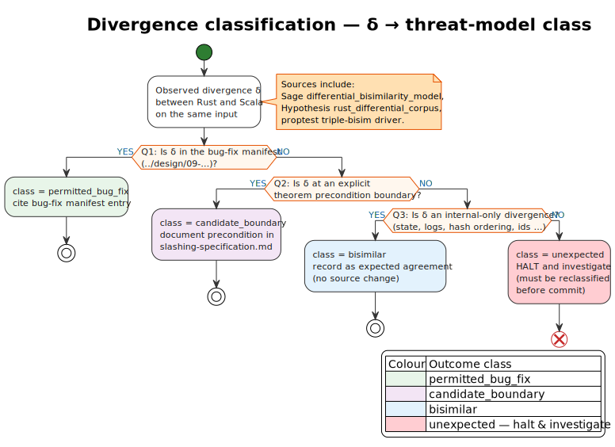

# 01 · Differential testing — Rust vs. Scala

> *“The test of a first-rate intelligence is the ability to hold two
> opposed ideas in mind at the same time, and still retain the ability
> to function.”* — F. Scott Fitzgerald, *The Crack-Up*, 1936.

This chapter explains **differential testing**: comparing two
implementations of the same protocol and treating every divergence
as evidence. The slashing port is a Rust reimplementation of an
existing Scala system; the methodology exploits this two-system
structure intensively.

Organization:

- [§1 — Why differential testing](#1--why-differential-testing-is-uniquely-powerful-for-ports)
- [§2 — The slashing differential search engine](#2--the-slashing-differential-search-engine)
- [§3 — Classifying divergences](#3--classifying-divergences)
- [§4 — The Sage differential model](#4--the-sage-differential-model)
- [§5 — Pitfalls](#5--pitfalls)
- [§6 — Related work](#6--related-work)

---

## 1 · Why differential testing is uniquely powerful for ports

A reimplementation is the perfect environment for differential
testing because:

1. **Reference oracle exists** — the original Scala code is the
   reference; every disagreement is either (a) a Rust bug, (b) a
   Scala bug that the Rust port has unintentionally inherited or
   intentionally fixed, or (c) a bug in the test harness that
   compares them.
2. **Adversarial input is cheap** — any input that flows through
   the abstract protocol can be fed to both implementations.
3. **Disagreement is binary** — the comparison is `output_Rust =
   output_Scala`? Yes or no. There is no need for a hand-written
   oracle; the other implementation **is** the oracle.

The methodology promotes differential testing to a **mandatory
checkpoint** for ports: a Rust function that lacks differential
coverage against its Scala counterpart is treated as untested,
regardless of its proptest / Hypothesis / fuzz coverage.

### 1.1 The four classes of divergence

A Rust-vs-Scala divergence falls into one of four classes (this is
the threat-model vocabulary from
[`../../slashing-threat-model.md §4`](../../slashing-threat-model.md)):

| Class                | Meaning                                                                                        | Action                                                                                    |
|----------------------|------------------------------------------------------------------------------------------------|-------------------------------------------------------------------------------------------|
| `bisimilar`          | The two implementations agree on observable behavior; the divergence is in internal state only | Record as expected agreement; no source change                                            |
| `permitted_bug_fix`  | The Rust intentionally diverges to correct a Scala defect documented in the bug-fix manifest   | Record as permitted divergence; cite bug-fix manifest entry                               |
| `candidate_boundary` | The divergence is at the boundary of a theorem precondition (e.g. epoch-length 0)              | Strengthen theorem precondition; document as boundary                                     |
| `unexpected`         | The divergence is none of the above                                                            | **Halt and investigate** — every unexpected divergence must be reclassified before commit |

The methodology forbids leaving any divergence in the `unexpected`
class; it must be reduced to one of the other three or the audit
cannot close.

---

## 2 · The slashing differential search engine

The differential infrastructure has four cooperating components:

### 2.1 The Sage model

`formal/sage/slashing/differential_bisimilarity_model.sage` enumerates
small DAG / stake / epoch configurations and runs them through:

- The Rust slashing pipeline (via a JSON adapter).
- The Scala slashing pipeline (via a JSON adapter to the upstream
  reference).
- The Rocq oracle's `oracle.rs` mirror.

Outputs of all three are compared step-by-step. Any disagreement is
emitted as a `differential_witness` JSON file.

### 2.2 The Hypothesis differential corpus

`hypothesis_rust_differential_corpus.rs` drives the same comparison
under Hypothesis's stateful machine, with the persistent failing-
example database so any historical witness keeps being checked.

### 2.3 The proptest triple-bisim

`prop_t_triple_bisim_*.rs` (three files: dispatch, fork-choice,
records) does the same comparison under proptest's random sampling
for fast feedback. The triple-bisim infrastructure is described in
[`03-triple-bisimilarity.md`](./03-triple-bisimilarity.md).

### 2.4 The Rocq bisimilarity theorem

`formal/rocq/slashing/theories/MainTheorem.v` proves the headline
bisimilarity statement Rust ≈ Scala (modulo the documented bug
fixes) as an *unbounded* theorem; the four randomized layers above
are the corroborating evidence.

---

## 3 · Classifying divergences

The methodology's classification rule is the **witness rule** from
[`../01-philosophy.md §4`](../01-philosophy.md) applied to
differential witnesses. The decision tree is:

[](../diagrams/06-differential-divergence-classification.svg)

*Source: [`../diagrams/06-differential-divergence-classification.puml`](../diagrams/06-differential-divergence-classification.puml).
Outcome leaves are colour-coded by threat-model class; see the legend
in the diagram itself, and the colour conventions in
[`../02-glossary-and-notation.md §7`](../02-glossary-and-notation.md).*

### 3.1 The trap of "obviously bisimilar"

A common pitfall is dismissing an "obviously cosmetic" divergence —
say, a difference in field ordering of a serialized message — as
bisimilar without examining whether the divergence has downstream
effects. The methodology requires *every* divergence to be traced
through one full round of the slashing pipeline before classification;
if no observer's output differs, the divergence is bisimilar.

This is the pattern that surfaced Bug #16 (duplicate justifications
making detector projection ambiguous): the divergence looked cosmetic
(a duplicate validator entry in the justifications) but had
downstream effects on the detector's classification. See
[`../case-studies/16-bug-16-duplicate-justifications.md`](../case-studies/16-bug-16-duplicate-justifications.md).

---

## 4 · The Sage differential model

The Sage script
[`formal/sage/slashing/differential_bisimilarity_model.sage`](../../../../../formal/sage/slashing/differential_bisimilarity_model.sage)
encodes the differential search. In literate pseudocode:

```
algorithm differential_search(n_max : ℕ, depth_max : ℕ) → List(Witness):
    let witnesses ← []
    for each n in 2..n_max:
        for each depth in 1..depth_max:
            for each adversary in enumerate_adversaries(n, depth):
                let rust_trace  ← invoke_rust_pipeline(n, depth, adversary)
                let scala_trace ← invoke_scala_pipeline(n, depth, adversary)
                let oracle_trace ← invoke_rocq_oracle_mirror(n, depth, adversary)
                let divergences  ← compare_step_by_step(rust_trace, scala_trace, oracle_trace)
                for each δ in divergences:
                    let class ← classify(δ)
                    witnesses.append((adversary, δ, class))
    return witnesses
```

The script writes the witnesses to a JSON file consumed by
[`casper/tests/slashing/hypothesis_rust_differential_corpus.rs`](../../../../../casper/tests/slashing/hypothesis_rust_differential_corpus.rs)
for replay.

### 4.1 The boundary findings

Sage finding #9 (no unexpected divergence in the small current-validator
state space tested; see
[`formal/sage/slashing/FINDINGS.md`](../../../../../formal/sage/slashing/FINDINGS.md))
is the headline output of this model. It is **negative** evidence —
no `unexpected` witness exists in the searched bound — which the
methodology accepts as corroborating but not conclusive. The
conclusive answer is the Rocq theorem T-15 (Rust ≈ Scala under
random workload).

### 4.2 The cost of the differential search

Differential search is expensive: every input requires running both
implementations *and* the oracle, with byte-level comparison of
outputs. The slashing development pays this cost selectively —
nightly campaigns at higher `n_max` and `depth_max`, smoke runs at
lower bounds in CI. The cost is justified by the **uniqueness** of
the bug class it catches: latent semantic differences that are
invisible to single-implementation tests.

---

## 5 · Pitfalls

### 5.1 Pitfall: comparing implementations on inputs neither accepts

A bug in the input adapter can send malformed input to one
implementation while another rejects it as malformed. The diff is
not informative.

**Mitigation**: every input goes through a **validation pre-pass**;
inputs that either implementation rejects are filtered before the
comparison.

### 5.2 Pitfall: comparing outputs that differ only in non-observable state

`HashMap` iteration order, debug-string formats, internal hash
values, etc., differ between Rust and Scala for cosmetic reasons.
Comparing these is noise.

**Mitigation**: the comparison function in
`differential_bisimilarity_model.sage` operates on a **normalized**
form: sorted iteration of validator sets, canonical hash encoding,
filtered log fields. The normalized form is documented in
[`scenario_schema.sage`](../../../../../formal/sage/slashing/scenario_schema.sage).

### 5.3 Pitfall: assuming the oracle is correct

If the Rocq oracle mirror has a bug, it agrees with Rust on a Scala
bug and the comparison falsely classifies the divergence as
`permitted_bug_fix`.

**Mitigation**: the Rocq mirror is **mechanically derived** from the
Rocq theorems by an extraction step; deviations from the theorem
fail at extraction time. See
[`03-triple-bisimilarity.md`](./03-triple-bisimilarity.md) for the
full triple-bisim architecture.

### 5.4 Pitfall: running against stale Scala

If the Scala reference is not kept up to date, the diff reflects
Scala's behavior at a past commit, not its current behavior.

**Mitigation**: the Scala reference is pinned to a specific commit
(`upstream/dev@<sha>` — see
[`../../slashing-specification.md §1.2`](../../slashing-specification.md))
and any update goes through the same differential pass to confirm
no new divergences emerge.

---

## 6 · Related work

- **Differential testing**: McKeeman [McK98] is the foundational
  paper.
- **Differential fuzzing of compilers**: Yang *et al.* [Yan11]
  (Csmith) — same principle applied to C compilers.
- **N-version programming**: Avizienis & Lyu [AvLi77] — same
  principle as a software-engineering practice.
- **Compiler equivalence checking**: Necula [Nec00] (translation
  validation) — algorithmic comparison of an unverified compiler
  against its specification, conceptually related.
- **Differential symbolic execution**: Person *et al.* [Per08] —
  comparing program versions symbolically.

DOIs in [`../references.md`](../references.md).

---

## 7 · Next chapter

[`02-metamorphic-relations.md`](./02-metamorphic-relations.md) — the
related but distinct technique of **metamorphic testing**: deriving
properties from *transformations* of the input that should preserve
or predictably change the output.
