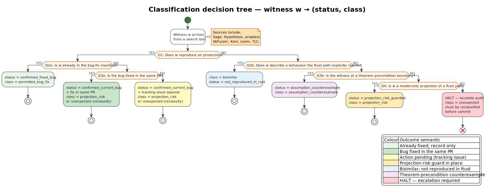

# 02 · Classification taxonomy

> *“The eskimos had fifty-two names for snow because it was important
> to them: there ought to be as many for love.”* — Margaret Atwood,
> 1973 (apocryphal attribution).
>
> The slashing methodology has eight names for *“status of a
> finding”* because the precision is important.

This chapter defines the methodology's full classification
vocabulary, the decision tree that picks the right label for a given
witness, and the mapping between the eight statuses
([`../../slashing-traceability.md`](../../slashing-traceability.md))
and the six threat-model classes
([`../../slashing-threat-model.md §4`](../../slashing-threat-model.md)).

Organization:

- [§1 — The eight statuses](#1--the-eight-statuses)
- [§2 — The six threat-model classes](#2--the-six-threat-model-classes)
- [§3 — Mapping between status and class](#3--mapping-between-status-and-class)
- [§4 — The classification decision tree](#4--the-classification-decision-tree)
- [§5 — Worked examples](#5--worked-examples)
- [§6 — Pitfalls](#6--pitfalls)

---

## 1 · The eight statuses

The traceability ledger uses eight status codes. Each is *workflow-
oriented* — it describes what *needs to happen* next.

| Status                         | Action implied                                                                      |
|--------------------------------|-------------------------------------------------------------------------------------|
| `confirmed_current_bug`        | Fix Rust source; add regression; possibly update Rocq/TLA⁺/threat/spec              |
| `confirmed_fixed_bug`          | Keep pre-fix regression; no new source change                                       |
| `not_reproduced_in_rust`       | Record only; may keep as projection fixture                                         |
| `model_boundary`               | Document in design / threat model; no source change                                 |
| `projection_risk_guarded`      | Keep guard test and specification text; source change only if production reproduces |
| `assumption_counterexample`    | Strengthen theorem precondition; add counterexample fixture                         |
| `proof_or_model_strengthening` | Promote to Rocq theorem and/or TLA⁺ invariant                                       |
| `needs_source_audit`           | Escalate audit                                                                      |

Detailed definitions are in
[`../02-glossary-and-notation.md §5.2`](../02-glossary-and-notation.md).

### 1.1 Why eight and not three?

A simpler `{bug, not-a-bug, undecided}` triad would suffice for
short-term work but provides no structure for the *audit trail*. The
eight statuses each correspond to a *distinct downstream artifact*:

| Status                         | Downstream artifact                                                      |
|--------------------------------|--------------------------------------------------------------------------|
| `confirmed_current_bug`        | A `pre_fix_bug_N.rs` regression + a Rust source patch                    |
| `confirmed_fixed_bug`          | A `pre_fix_bug_N.rs` regression alone                                    |
| `not_reproduced_in_rust`       | A Rust test confirming the production path's behavior                    |
| `model_boundary`               | A design-doc paragraph                                                   |
| `projection_risk_guarded`      | A guard test and a specification clause                                  |
| `assumption_counterexample`    | A `theorem_assumption_counterexamples.rs` entry + a strengthened theorem |
| `proof_or_model_strengthening` | A new Rocq theorem and/or TLA⁺ invariant                                 |
| `needs_source_audit`           | An open audit ticket                                                     |

The mapping is **bijective**: every status uniquely identifies the
downstream artifact required. The methodology rejects merges that
leave the status-artifact bijection broken.

---

## 2 · The six threat-model classes

The threat-model classes are *epistemic* — they describe what *kind
of thing* the finding is, not what needs to happen.

| Class                       | What kind of finding                                                                                                              |
|-----------------------------|-----------------------------------------------------------------------------------------------------------------------------------|
| `bisimilar`                 | The two implementations (Rust and reference) produce observationally equivalent behavior; the witness exhibits expected agreement |
| `permitted_bug_fix`         | The Rust deliberately diverges from the Scala reference; the divergence corrects a known Scala defect                             |
| `candidate_boundary`        | The behavior depends on an explicit theorem precondition or scope clause                                                          |
| `projection_risk`           | A model-to-code projection could diverge under bounded shifts of inputs                                                           |
| `assumption_counterexample` | The witness proves a theorem precondition is necessary (cannot be weakened)                                                       |
| `unexpected`                | Transient class; every finding must be reclassified out of `unexpected`                                                           |

### 2.1 Why two vocabularies?

The methodology uses two vocabularies because *kind* and *action*
are orthogonal:

- A `permitted_bug_fix` (kind) maps to either `confirmed_fixed_bug`
  (action: keep the regression) or `confirmed_current_bug` (action:
  fix the source) depending on whether the bug has already been
  fixed.
- A `candidate_boundary` (kind) maps to `model_boundary` (action:
  document) or `assumption_counterexample` (action: strengthen
  theorem precondition) depending on whether the precondition is
  already in the theorem or needs to be added.

Two vocabularies allow the *kind* to remain stable across the bug's
life cycle while the *action* tracks the current workflow state.

---

## 3 · Mapping between status and class

The full mapping is in
[`../../slashing-traceability.md`](../../slashing-traceability.md);
reproduced and expanded here:

| Threat-model class          | Possible statuses (workflow projection)                                          |
|-----------------------------|----------------------------------------------------------------------------------|
| `bisimilar`                 | `not_reproduced_in_rust` (steady state); `needs_source_audit` (pending)          |
| `permitted_bug_fix`         | `confirmed_fixed_bug` (shipped); `confirmed_current_bug` (during the fix window) |
| `candidate_boundary`        | `model_boundary` (documented); `assumption_counterexample` (precondition added)  |
| `projection_risk`           | `projection_risk_guarded` (guarded); `confirmed_current_bug` (rare; if exposed)  |
| `assumption_counterexample` | `assumption_counterexample`                                                      |
| `unexpected`                | (must not remain; reclassify to one of the above)                                |

`proof_or_model_strengthening` is a workflow-only status: it does
not have a threat-model class because it does not describe a
*finding* — it describes a *workflow state* during which a finding is
being formalized.

---

## 4 · The classification decision tree

Given a witness `w`, the methodology's decision tree assigns a class
and a status as follows:

*Source: [`../diagrams/05-classification-decision-tree.puml`](../diagrams/05-classification-decision-tree.puml).
Outcome leaves are colour-coded by semantic role; see the legend
in the diagram itself, and the colour conventions in
[`../02-glossary-and-notation.md §7`](../02-glossary-and-notation.md).*

(`class` for confirmed_current_bug depends on whether the bug is a
projection risk, an unexpected behavior, or a known regression; the
classifier must record one of `projection_risk` or `unexpected` →
reclassified.)

---

## 5 · Worked examples

### 5.1 Example 1 — Bug #2 (lock-free tracker race)

- Witness emitted by: `tracker_race_model.sage` + TLA⁺
  `MC_ConcurrentTracker.tla` (with `Locked = FALSE`).
- Reproduces on production? Yes (with the lock-free Rust code at
  the time of the bug).
- In bug-fix manifest? Yes (Bug #2 in
  [`../../design/09-bug-fixes-and-rationale.md §9.3`](../../design/09-bug-fixes-and-rationale.md)).
- Decision: `permitted_bug_fix` → `confirmed_fixed_bug` (post-fix).

### 5.2 Example 2 — Sage finding #3 (zero-stake offender)

- Witness emitted by: `weighted_closure_model.sage`.
- Reproduces on production? No (production rejects zero-stake bond).
- Rust path explicitly rejects? Yes (at `bond_validator`).
- Decision: `bisimilar` → `not_reproduced_in_rust`.

### 5.3 Example 3 — Sage finding #5 (validator-set boundary)

- Witness emitted by: `validator_boundary_model.sage`.
- Reproduces on production? No (the production filter happens before
  the comparison the model performs).
- Rust path explicitly rejects? Implicit; the filter is a documented
  precondition.
- Decision: `candidate_boundary` → `model_boundary`.

### 5.4 Example 4 — Sage finding #8 (overflow)

- Witness emitted by: `bounded_arithmetic_model.sage`.
- Reproduces on production? Yes (the production `i32::MAX + 1`
  overflows; this is Bug #15).
- Already in bug-fix manifest? Yes (Bug #15).
- Decision: `permitted_bug_fix` → `confirmed_fixed_bug` (post-fix).

### 5.5 Example 5 — T-11 precondition removed

- Witness emitted by: `theorem_assumption_counterexamples.sage`.
- Reproduces on production? Yes, *when the precondition is removed*.
- Theorem precondition? Yes (`f < n/3`).
- Decision: `assumption_counterexample` →
  `assumption_counterexample` (workflow same as kind).

---

## 6 · Pitfalls

### 6.1 Pitfall: classifying without distinguishing kind from status

Conflating the two vocabularies leads to ledger entries that drift —
a finding may be "fixed" (status) but its *kind* (class) remains
`permitted_bug_fix` forever. The vocabulary keeps the audit trail
informative.

**Mitigation**: every ledger entry has explicit fields for **both**
class and status. The CI lint refuses entries missing either.

### 6.2 Pitfall: status fixed too early

Marking a status as `confirmed_fixed_bug` before the fix has been
verified by an independent run of the original tool leaves a
*claimed-fixed* bug that is not actually fixed.

**Mitigation**: every `confirmed_fixed_bug` entry must cite a
post-fix tool run that produces no witness; the citation is in the
ledger entry.

### 6.3 Pitfall: dropping `proof_or_model_strengthening`

The `proof_or_model_strengthening` status is workflow-only. It
should *transition* to one of the other statuses when the
mechanization is complete. A long-lived entry in this status
indicates incomplete work.

**Mitigation**: every entry in `proof_or_model_strengthening` has a
target Rocq theorem or TLA⁺ invariant cited; CI flags entries that
have remained in this status for > 30 days.

### 6.4 Pitfall: `needs_source_audit` permanent backlog

If `needs_source_audit` entries accumulate, the methodology loses
its action-oriented bite. The ledger fills with audit-pending
entries that no one is auditing.

**Mitigation**: every `needs_source_audit` entry must have an
assigned auditor and a target date; the CI flags overdue entries.

---

## 7 · Next chapter

[`03-evidence-stacking.md`](./03-evidence-stacking.md) — the
**composition rule** for evidence. A single tool's verdict is
weak; *three* tools agreeing on a property is the methodology's
gold-standard evidence pattern.
