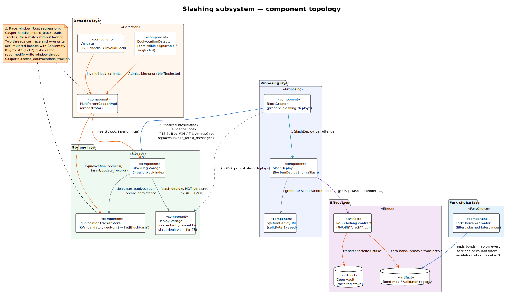
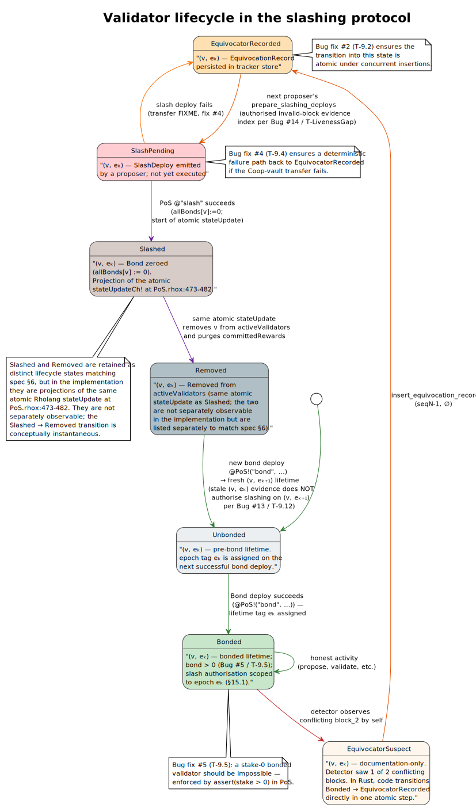
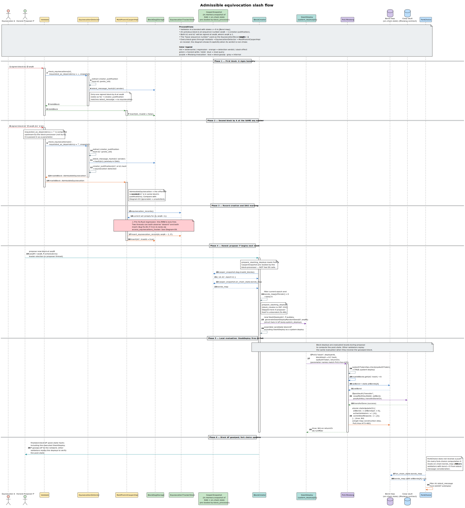
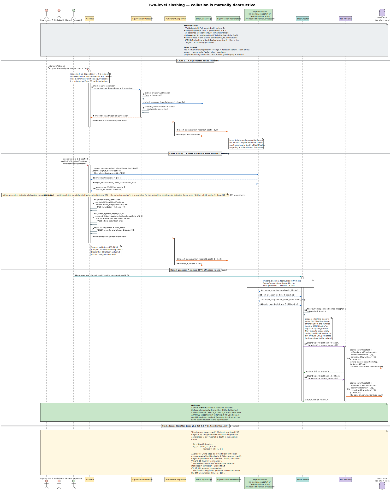
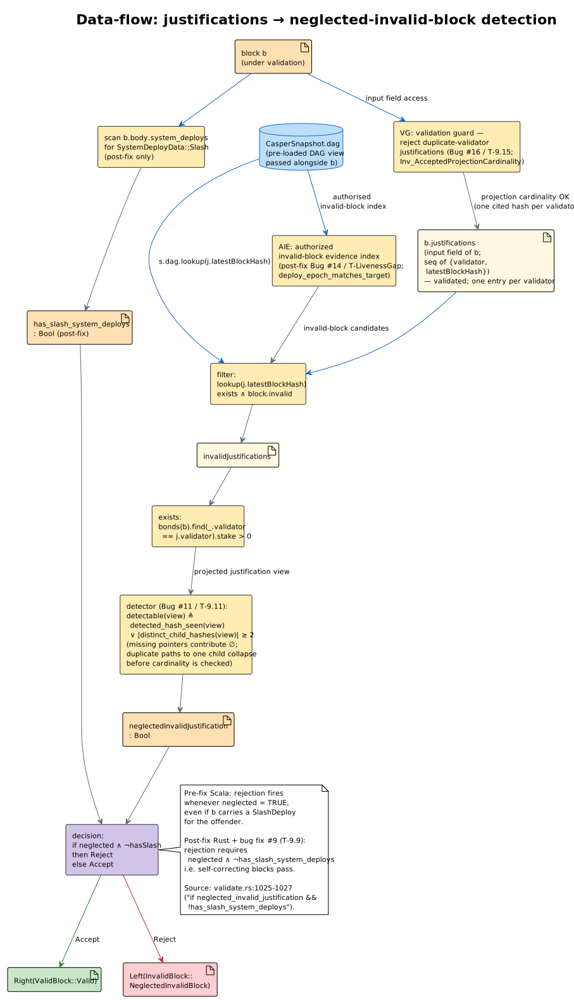

# Slashing — Formal Specification

**Version 1.0 · 2026-05-01**

> **Abstract.** This document gives a complete normative specification of the
> slashing layer of the F1R3FLY CBC Casper consensus implementation. It
> formalizes the **eleven active components** plus **two data artifacts**
> (Bond map, Coop vault) — together **thirteen sub-components grouped
> into five layers** — of the slashing subsystem, the labeled transition
> system that connects them, the validator lifecycle, and the
> bisimilarity claim between the Rust port and the Scala original. It
> enumerates **sixteen identified bug-fix deltas** — nine inherited
> from the Scala upstream, two introduced by the Rust port (bugs #2 and
> #11), and five Rust-source-confirmed authorization / projection /
> liveness / arithmetic / projection-cardinality gaps surfaced by the
> Sage and Hypothesis traceability passes — and specifies their corrected
> behavior. Every claim is anchored to a theorem with its prose proof in
> the self-contained `slashing-verification.md` mathematical article;
> the underlying Rocq and TLA+ mechanizations live on the
> `analysis/slashing` branch under `formal/rocq/slashing/` and
> `formal/tlaplus/slashing/`.

---

## Table of Contents

1. [Introduction](#1-introduction)
2. [Glossary of symbols and key terms](#2-glossary-of-symbols-and-key-terms)
3. [The slashing subsystem — components and topology](#3-the-slashing-subsystem--components-and-topology)
4. [Operational semantics of detection](#4-operational-semantics-of-detection)
5. [The PoS slash transition](#5-the-pos-slash-transition)
6. [Validator lifecycle](#6-validator-lifecycle)
7. [The slashing pipeline](#7-the-slashing-pipeline)
8. [Two-level slashing](#8-two-level-slashing)
9. [Bisimilarity statement](#9-bisimilarity-statement)
10. [Bug-fix manifest](#10-bug-fix-manifest)
11. [Worked examples](#11-worked-examples)
12. [Use-case catalog](#12-use-case-catalog)
13. [Scope boundaries](#13-scope-boundaries)
14. [References](#14-references)
15. [Authorized Slash Evidence](#15--authorized-slash-evidence)

---

## 1 · Introduction

### 1.1 Problem statement and context

The F1r3fly slashing layer is the economic-security linchpin of the
consensus protocol. Validators put up a *bond* of tokens to participate in
block production; that bond is the collateral the protocol can seize when
a validator misbehaves in a *cryptographically-attributable* way. The
slashing layer detects misbehavior, records evidence on-chain, and
executes the punitive state transition that zeros the offender's bond and
removes them from the active set.

The Rust implementation in this repository was migrated from the Scala
original in EPOCH-005 as a 1:1 port. The detection plumbing arrived
intact; the *enforcement* path has known gaps that GitHub issue
[`F1R3FLY-io/f1r3node-rust#25`](https://github.com/F1R3FLY-io/f1r3node-rust/issues/25)
tracks. The exploration and traceability passes have now catalogued
sixteen production-relevant bug-fix classes, including Scala-inherited
defects, Rust-introduced regressions, and Rust-source-confirmed
authorization/projection gaps.

Without a normative specification, every defect remains encoded only as
inline `// TODO` markers; without machine-checked verification, no
implementation change can be audited against an authoritative reference.
This document, together with `slashing-verification.md` (the
self-contained proof artifact on this branch), and the formal-methods
sources preserved on the `analysis/slashing` branch under
`formal/rocq/slashing/` and `formal/tlaplus/slashing/`, fills that gap.

### 1.2 Contribution

This work contributes:

1. A **complete operational semantics** for the slashing layer, given as a
   labeled transition system (LTS) over an abstract state
   `S = (DAG, InvalidSet, EquivocationRecords, BondMap, ActiveValidators, SlashedSet, CoopVaultBalance)`
   — short form `(D, I, E, B, A, Sl, C)`; cf. §7.1.
   The semantics is realized as a Rocq inductive in
   `formal/rocq/slashing/theories/EquivocationDetector.v` and as a TLA+
   transition relation in `formal/tlaplus/slashing/SlashFlow.tla`
   (both preserved on `analysis/slashing`; proofs reproduced in prose
   in `slashing-verification.md`).
2. A **bisimilarity proof**: under the sixteen documented bug-fix deltas, the
   Rust implementation is observationally bisimilar to the Scala original
   with respect to all observable barbs (block/state changes, fork-choice
   outcomes, vault balances). The proof lives in
   `Bisimulation.v` and `MainTheorem.v` and is summarized as Theorem 9.1
   in this document.
3. A **bug-fix manifest** of eleven numbered defects, each with a stated
   cause, a proven-correct fix, and a TLA+ counter-example that fires
   pre-fix and passes post-fix.
4. A **use-case catalog** of 112 scenarios across four tiers (core,
   audit blockers, slashable-variant completion, operational and
   adversarial), each tagged for automated regression-test generation
   against the bug fixes.
5. **Ten PlantUML diagrams** (sources at `docs/theory/slashing/diagrams/*.puml`,
   rendered to SVG alongside) that reify the LTS visually and stay 1:1
   with the formal model.

### 1.3 Related work

The slashing model presented here builds on prior art in three areas:
proof-of-stake (PoS) protocol design (Buterin & Griffith on Friendly
Finality Gadget (FFG) slashing conditions [BG19]; Buterin et al. on slashing under fork-choice
[BHKPQRSWZ20]; Zamfir's CBC Casper essays [Z16]), accountability and
fork-evidence in BFT consensus (Buchman, Kwon, Milosevic [BKM18];
Amoussou-Guenou et al. [ABPT19]), and machine-checked verification of
distributed systems (Wilcox et al.'s Verdi framework [WWPTWEA15];
[CBCCoq20] on Coq formalization of CBC Casper). The bisimilarity argument
follows the standard pattern from [Mil89, MR05a, San98]. We also adapt
the documentation methodology from the cost-accounting verification
artifact at `f1r3node-cost-accounted-rho-calc/docs/theory/cost-accounted-rho-verification.md`.

### 1.4 Outline

§2 fixes notation and defines every symbol used in the remainder of the
document. §3 catalogues the 13 sub-components of the slashing subsystem
(grouped into 5 layers; cf. Diagram 01). §§4–5
give the operational semantics of detection and the PoS slash transition.
§6 captures the validator lifecycle. §7 walks the end-to-end slashing
pipeline; §8 elaborates the two-level closure. §9 states the bisimilarity
claim. §10 lists the bug-fix manifest. §11 gives worked examples. §12
enumerates the use-case catalog. §13 declares scope boundaries. §14 lists
references.

### 1.5 Verified properties — pedigree table

Following the cost-accounting precedent (verification doc §1.5), each
result is classified into one of four pedigree classes:

| Class                                   | Meaning                                                              | Examples in this work                                                                                          |
|-----------------------------------------|----------------------------------------------------------------------|----------------------------------------------------------------------------------------------------------------|
| **(a)** Direct mechanization            | Rocq encoding of an existing Scala/Rust algorithm                    | `EquivocationDetector.detect`, `prepare_slashing_deploys`, `is_slashable`                                      |
| **(b)** Verification of paper algorithm | Soundness/completeness of an algorithm we did not invent             | T-1, T-2, T-3, T-4, T-5, T-6, T-7, T-8, T-Idem (slash idempotence; alias T-9), T-10                            |
| **(c)** Proof-original extension        | New theorem whose statement is an original contribution of this work | T-13, T-14, T-15 (bisimilarity); T-9.1–T-9.15 (bug-fix correctness)                                            |
| **(d)** Citable-axiom-gated             | Result that depends on a cited classical lemma we do not re-prove    | None in the consensus-critical path; no Rocq theorem currently introduces a custom axiom |

**Theorem-naming convention.** Headline theorems are labeled `T-N`
where `N` is a small non-negative integer, plus three named theorems:
**`T-Idem`** (slash idempotence; §5.3, formerly `T-9`),
**`T-AuthCheck`** (system auth-token guard; §5.5, modeled as a
Rocq/TLA+ auth oracle around slash-deploy execution), and the
five bisimulation-specific letter-suffixed theorems `T-13a/b/c` /
`T-15a/b` (§9.2). Bug-fix theorems are labeled `T-9.M` for `M = 1..15`.
The historical `T-9` (slash idempotence) was renamed to `T-Idem` in
this revision to avoid collision with the bug-fix family; older
artifacts may still use the alias.

### 1.6 Scale

| Artifact                            | Size                                            |
|-------------------------------------|-------------------------------------------------|
| This document                       | ~1,800 lines markdown (incl. embedded diagrams) |
| `slashing-verification.md`          | ~1,300 lines markdown                           |
| `formal/rocq/slashing/theories/*.v` (on `analysis/slashing`) | 21 modules / ~3,500 lines                       |
| `formal/tlaplus/slashing/*.tla` (on `analysis/slashing`)     | 5 base specs + 8 MC instances / ~1,100 lines    |
| PlantUML sources                    | 11 diagrams / ~1,700 lines                      |
| Total new artifact                  | ~9,500 lines                                    |

### 1.7 Component dependency DAG

The slashing subsystem comprises **13 sub-components grouped into 5
layers**, mirroring §3 and Diagram 01:

```
                ┌────────────────────────────────────────┐
                │  Detection layer                       │
                │  ┌──────────┐  ┌─────────────────────┐ │
                │  │ Validate │  │ EquivocationDetector│ │
                │  └────┬─────┘  └──────────┬──────────┘ │
                │       └─────────┬─────────┘            │
                │                 ▼                      │
                │     ┌──────────────────────────┐       │
                │     │  MultiParentCasperImpl   │       │
                │     └──────────────┬───────────┘       │
                └────────────────────┼───────────────────┘
                                     │
        ┌────────────────────────────┼────────────────────────────┐
        ▼                            ▼                            ▼
┌─────────────────┐         ┌─────────────────┐         ┌──────────────────┐
│ Storage layer   │         │ Proposing layer │         │ Effect layer     │
│                 │         │                 │         │                  │
│ BlockDagStorage │         │  BlockCreator   │         │ PoS Rholang      │
│ EquivTracker    │ ◄─────  │  SlashDeploy    │ ──────► │ Bond map         │
│ DeployStorage   │         │  SystemDeploy   │         │ Coop vault       │
│                 │         │      Util       │         │                  │
└────────┬────────┘         └─────────────────┘         └────────┬─────────┘
         │                                                       │
         │                                                       │
         └───────────────────────┬───────────────────────────────┘
                                 ▼
                     ┌────────────────────────┐
                     │   Fork-choice layer    │
                     │                        │
                     │      ForkChoice        │
                     └────────────────────────┘
```

The Rocq-module dependency view (Validate, EqDetector → BugFix*,
Bisimulation, MainTheorem) is the proof-artifact side of the same
subsystem and is presented in
[`slashing-verification.md` §1.3](./slashing-verification.md#13-scale-and-module-dag).

---

## 2 · Glossary of symbols and key terms

This section centralizes notation. Symbols are introduced in the order
they are needed; every symbol used after this section is defined here.

### 2.0 Acronyms

This subsection mirrors the design document's §02.1 so the
specification is self-contained.

| Acronym   | Expansion                         | First-use context                                             |
|-----------|-----------------------------------|---------------------------------------------------------------|
| **PoS**   | Proof of Stake                    | The consensus family this work targets (§1).                  |
| **BFT**   | Byzantine Fault Tolerance         | The bound `f < n/3` from [LSP82] (§9).                        |
| **CBC**   | Correct-by-Construction (Casper)  | The CBC-style consensus implemented in F1R3FLY (§1).          |
| **DAG**   | Directed Acyclic Graph            | The block graph (§3).                                         |
| **LMD**   | Latest-Message-Driven (GHOST)     | The fork-choice rule (§7).                                    |
| **RMW**   | Read-Modify-Write                 | The atomic primitive bug #2 protects (§7.2).                  |
| **TLC**   | TLA+ model checker (Lamport's)    | State-space exploration of TLA+ models (§10).                 |
| **LTS**   | Labeled Transition System         | The slashing pipeline's formal model `T = (S, L, →)` (§3).    |
| **GHOST** | Greedy Heaviest-Observed Sub-Tree | Fork-choice rule [SZ15] (§7).                                 |
| **FFG**   | Friendly Finality Gadget (Casper) | Ethereum 2.0 slashing comparison anchor [BG19].               |
| **DOS**   | Denial of Service                 | The vector closed by bug fix #1 (§10.1).                      |
| **KV**    | Key-Value                         | Store abstraction underlying the equivocation tracker (§3.4). |
| **BFS**   | Breadth-First Search              | Generic graph traversal; post-fix #7 now uses a canonical self-chain walk (§10.7). |
| **TLA+**  | Temporal Logic of Actions         | Specification language; checked by TLC (§10).                 |

### 2.1 Process-algebraic notation (informal)

| Symbol | Name                             | Meaning                                                                                  |
|--------|----------------------------------|------------------------------------------------------------------------------------------|
| `→`    | LTS transition                   | `s →ℓ t` means the state machine moves from `s` to `t` under label `ℓ`                   |
| `→*`   | Multi-step                       | reflexive-transitive closure of `→`                                                      |
| `~`    | Strong bisimilarity              | mutual simulation under matching labels                                                  |
| `≈`    | Weak bisimilarity                | mutual simulation modulo internal `τ` steps                                              |
| `≡_α`  | α-equivalence                    | up to renaming of bound names                                                            |
| `↓ℓ`   | Barb                             | state can immediately perform observable action `ℓ`                                      |
| `⇓ℓ`   | Weak barb                        | state can perform `ℓ` after some `τ`-steps                                               |
| `≈ₓ`   | Barbed equivalence mod `x`       | bisimilarity up to barbs in set `x`                                                      |
| `⊥`    | Terminal absorbing state         | no further transitions enabled (used for `Removed → ⊥` in §6)                            |
| `⊤`    | Boolean true                     | used in detection-decision predicates                                                    |
| `⟶`    | LTS step (trace)                 | long arrow used in code-fenced traces (e.g. `sign(v,s,b) ⟶ DAG += b`); equivalent to `→` |
| `⟹`    | Logical implication              | used in formal LTS rules and theorem statements                                          |
| `∀`    | Universal quantifier             | rendered "for every" / "for all" in prose                                                |
| `∃`    | Existential quantifier           | rendered "there exists" in prose                                                         |
| `∅`    | Empty set / nil                  | e.g. the `EquivocationRecord` witness set after first insert                             |
| `∈`    | Set membership                   | standard                                                                                 |
| `⊆`    | Subset (inclusive)               | standard                                                                                 |
| `≡`    | Equivalence (mutual containment) | for sets/lists where iteration order is not observable                                   |
| `=`    | Strict equality                  | for natural numbers, function values, pointwise-equal maps                               |

The barbed-equivalence symbols `≈ₓ` and `↓ℓ` are introduced for
completeness; the prose throughout §3–§13 prefers the named-relation
form `weak_barbed_equiv` as it appears in the Rocq mechanization.

### 2.2 Slashing protocol terms

| Symbol            | Name                | Meaning                                                                                                            |
|-------------------|---------------------|--------------------------------------------------------------------------------------------------------------------|
| `V`               | Validators          | Set of validator identities (modeled as `nat` in Rocq for decidable equality; abstract `ByteString` in Rust/Scala) |
| `B`               | Blocks              | Set of blocks; each `b ∈ B` has fields `(sender(b), seq(b), hash(b), J(b))`                                        |
| `H`               | Block hashes        | Cryptographic block hashes                                                                                         |
| `J(b) ⊆ V × H`    | Justifications      | set of (validator, latest-block-hash) pairs cited by block `b`                                                     |
| `BondMap : V → ℕ` | Bond map            | partial function giving each validator's stake                                                                     |
| `EqRec`           | Equivocation record | triple `(v, baseSeqNum, witnesses ⊆ H)`                                                                            |
| `E ⊆ EqRec`       | Record set          | the equivocation tracker's contents                                                                                |
| `I ⊆ H`           | Invalid set         | hashes of blocks marked invalid                                                                                    |
| `A ⊆ V`           | Active set          | validators whose bond is positive                                                                                  |
| `Sl ⊆ V`          | Slashed set         | validators removed by a successful slash (renamed from `S` to avoid collision with the LTS state name; cf. §7.1)   |
| `C ∈ ℕ`           | Coop vault balance  | accumulated forfeited stake                                                                                        |

### 2.3 LTS labels

| Label                      | Meaning                                                                     |
|----------------------------|-----------------------------------------------------------------------------|
| `sign(v, s, b)`            | Validator `v` signs block `b` at sequence number `s`                        |
| `detect(v, s) → ib`        | Detector classifies the (v, s) signature set with InvalidBlock variant `ib` |
| `record(v, sn)`            | An EquivocationRecord is created for `(v, sn)`                              |
| `propose(p, deploys)`      | Proposer `p` emits a block carrying the listed slash deploys                |
| `executeSlash(o, ok)`      | PoS contract slashes offender `o` with success outcome `ok ∈ Bool`          |
| `filterFC(v)`              | Fork-choice removes `v`'s latest message                                    |
| `neglectDetect(v, target)` | Detector observes `v`'s justification cites `target` without slashing       |

### 2.4 InvalidBlock taxonomy

The `InvalidBlock` enum has **26 variants**. **17 are slashable
pre-fix; 18 are slashable post-fix** (Bug #1 promotes
`IgnorableEquivocation` from non-slashable to slashable). The 17
pre-fix slashable variants in the current Rust source are:

```
AdmissibleEquivocation,  NeglectedEquivocation,    NeglectedInvalidBlock,
JustificationRegression, InvalidParents,            InvalidFollows,
InvalidBlockNumber,      InvalidSequenceNumber,     InvalidShardId,
InvalidRepeatDeploy,     DeployNotSigned,           InvalidTransaction,
InvalidBondsCache,       InvalidBlockHash,          ContainsExpiredDeploy,
ContainsTimeExpiredDeploy, ContainsFutureDeploy
```

The remaining 9 variants — `IgnorableEquivocation`, `InvalidFormat`,
`InvalidSignature`, `InvalidSender`, `InvalidVersion`, `InvalidTimestamp`,
`InvalidRejectedDeploy`, `NotOfInterest`, `LowDeployCost` — are
non-slashable today. **Bug fix #1 (T-9.1)** moves `IgnorableEquivocation`
into the slashable set.

### 2.5 Rocq ↔ TLA+ ↔ Rust crosswalk

For every load-bearing definition, this is the canonical mapping. The
verification doc §11 carries the full table; the most-cited ones:

| Concept               | Rocq                                             | TLA+                       | Rust                                             |
|-----------------------|--------------------------------------------------|----------------------------|--------------------------------------------------|
| Validator             | `Validator := nat`                               | `Validators`               | `Validator: ByteString`                          |
| Block                 | `Block` (record)                                 | implicit in `blocks[v][s]` | `BlockMessage` (proto)                           |
| InvalidBlock          | `InvalidBlock` (inductive)                       | string variant             | `InvalidBlock` (Rust enum, in `block_status.rs`) |
| EquivocationRecord    | `EqRec`                                          | `equivocationRecords` set  | `EquivocationRecord` (Rust struct)               |
| BondMap               | `BondMap := list (V * nat)`                      | `bonds` function           | `BondsMap: HashMap<Validator, Long>`             |
| `is_slashable(s)`     | `is_slashable : InvalidBlock -> bool`            | (abstracted; not modeled)  | `InvalidBlock::is_slashable`                     |
| Detect equivocation   | `equivocates : DAGState -> V -> nat -> Prop`     | `IsRealEquivocation(v,s)`  | `check_equivocations`                            |
| Slash effect          | `slash : PoSState -> V -> PoSState`              | `ExecuteSlash(o)`          | `@PoS!("slash", …)`                              |
| Bisimulation relation | `R : Rust × Scala -> Prop` (in `Bisimulation.v`) | structural equiv           | not directly observable                          |

### 2.6 Convention notes

- Sequence numbers are 0-indexed on the wire (matches Scala) but 1-indexed
  in the Rocq DAG abstraction so that `seq(b) - 1 ≥ 0`. The bisimulation
  relation accounts for this offset. Inside Rocq theorem statements
  (verification doc) the variable is `n` and arithmetic is rendered with
  Unicode minus (`n − 1`); inside spec pseudocode and tables, the
  variable is `s` (or `sn` for "sequence number") and arithmetic is
  rendered with ASCII hyphen (`s-1`, `sn-1`) to keep code-fenced
  excerpts mechanically transcribable. The two forms denote the same
  quantity; bisimilar by `eq_refl` over `nat`.
- Hash equality is decidable; we model hashes as `nat` in Rocq for
  decidability without committing to byte-level encoding. Bisimilarity is
  modulo this representation.
- Sets are modeled as duplicate-free lists in Rocq; iteration order is
  not observable in our equivalence (which is value-level, not byte-level
  on-disk). The Scala `Set` and Rust `BTreeSet` differ in iteration order
  but agree on element membership, hence bisimilar in our sense.

---

## 3 · The slashing subsystem — components and topology

The slashing subsystem comprises 13 sub-components organized into five layers:
**Detection**, **Storage**, **Proposing**, **Effect**, and **Fork-choice**.
[Diagram 01](./diagrams/01-component-overview.svg) gives the visual
overview; [Diagram 10](./diagrams/10-component-formal-correspondence.svg)
maps each component to its specification section, Rocq module, TLA+
module, and Rust source.

[](./diagrams/01-component-overview.svg)

[](./diagrams/10-component-formal-correspondence.svg)

### 3.1 Detection layer

#### 3.1.1 `Validate` (block validator)

Runs the seventeen-plus protocol checks against a candidate block,
yielding either `Valid` or `Invalid(ib)` for some `ib : InvalidBlock`.
The Rust implementation lives at `casper/src/rust/validate.rs`; the Scala
counterpart at `casper/src/main/scala/coop/rchain/casper/Validate.scala`.

Inputs: a `Block` and a DAG snapshot.
Outputs: `Either[BlockError, ValidBlock]`.
Side effects: none on success; on failure the caller
(`MultiParentCasperImpl`) records the block as invalid in the DAG.

#### 3.1.2 `EquivocationDetector`

Classifies an arriving block into one of the equivocation statuses:
`Valid`, `AdmissibleEquivocation`, `IgnorableEquivocation`, or
`NeglectedEquivocation`.

The decision rules mirror
`equivocation_detector.rs:24-104`:

```
detect(v, s, b):
  if no other block (v, s, b') with b' ≠ b exists in the DAG:
    return Valid
  else if b was requested as a dependency of some later block:
    return AdmissibleEquivocation
  else:
    return IgnorableEquivocation

detectNeglected(v, s, b):
  if (v, s-1) ∈ EquivocationRecords  AND
     b's latest-message view makes that record detectable  AND
     v remains bonded in b's bonds cache:
    return NeglectedEquivocation
```

Rocq mechanization in `EquivocationDetector.v`. TLA+ model in
`EquivocationDetector.tla`. Theorems T-1 (soundness) and T-2
(completeness) are proved here. A memory-efficient equivalence-preserving
TLA+ rewrite `EquivocationDetectorEager.tla` is also provided; it
combines signing and detection into one atomic step (collapsing
classification interleavings) and converts the temporal property to a
safety invariant. See `slashing-verification.md` §10.4 for the
equivalence argument and the 10,896× state-space reduction.

#### 3.1.3 `MultiParentCasperImpl`

The orchestrator. It composes `Validate`, `EquivocationDetector`, and
`BlockDagStorage` to process incoming blocks. The critical method is
`handle_invalid_block(block, ib)` at `engine/multi_parent_casper/mod.rs:1018-1112`:

```
match ib with
  | AdmissibleEquivocation ⟹
        record  ← BlockDagStorage.equivocation_records()
        if (block.sender, block.seq - 1) ∉ record:
          BlockDagStorage.insert_equivocation_record(
            block.sender, block.seq - 1, ∅)
        // ⚠ pre-fix: the read-then-insert is NOT atomic
        handle_invalid_block_effect(block)
  | IgnorableEquivocation ⟹
        // ⚠ pre-fix: silently dropped (DOS vector)
        log("Ignoring equivocation")
  | _ if is_slashable(ib) ⟹
        // ⚠ pre-fix: only flags as invalid; no record, no slash
        handle_invalid_block_effect(block)
  | _ ⟹ handle_invalid_block_effect(block)
```

Bug fixes #1, #2, and #3 modify the three commented branches; see §10.

### 3.2 Storage layer

#### 3.2.1 `BlockDagStorage`

The persistent DAG storage. Two relevant operations for slashing:

- `insert(block, invalid: Bool)` — adds a block to the DAG with an
  invalid flag.
- `access_equivocations_tracker { f }` — invokes `f` on the tracker
  under a global semaphore (Scala) or as a no-op wrapper (Rust pre-fix).

Rust source: `block-storage/src/rust/dag/block_dag_key_value_storage.rs`.
Scala: `coop/rchain/blockstorage/dag/BlockDagKeyValueStorage.scala`. The
read-modify-write semaphore is owned by `BlockDagKeyValueStorage.scala:262`
(`accessEquivocationsTracker { lock.withPermit(f(...)) }`, allocated via
`MetricsSemaphore.single[F]` at line 350) — **not** by
`EquivocationTrackerStore.scala`. The tracker store itself is a thin
wrapper over `KeyValueTypedStore` with no concurrency primitives of its
own; bug-#2 audits should look for the semaphore in
`BlockDagKeyValueStorage`.

The Rust port additionally exposes lock-free direct methods
(`equivocation_records()`, `insert_equivocation_record()`,
`update_equivocation_record()`); these bypass the lock and are the source
of bug #2.

#### 3.2.2 `EquivocationTrackerStore`

The KV layer underpinning the equivocation records. The map is keyed by
`(Validator, SequenceNumber)` and valued by the set of witness block
hashes. **No concurrency primitives** — atomicity is provided by the
caller (`BlockDagKeyValueStorage.accessEquivocationsTracker`, see §3.2.1).

Rust: `block-storage/src/rust/dag/equivocation_tracker_store.rs`.
Scala: `coop/rchain/blockstorage/dag/EquivocationTrackerStore.scala`.

The Scala uses `Set[BlockHash]` (unordered hash-set); the Rust uses
`BTreeSet<BlockHash>` (ordered). Iteration order differs but element
membership is identical, hence bisimilar at the value level.

#### 3.2.3 `DeployStorage`

Persists user-submitted deploys for replay determinism. **Slash deploys
are not currently persisted here**. T-9.8 therefore constrains the
on-the-fly slash-deploy path directly: an unbonded proposer returns
`[]` before constructing slash deploys.

### 3.3 Proposing layer

#### 3.3.1 `BlockCreator`

The block-construction module. The relevant method is
`prepare_slashing_deploys(seqNum) → Seq[SlashDeploy]` at
`block_creator.rs:287-332`:

```
if bonds_map[proposer] ≤ 0 then return []
currentEpoch       ← epoch(nextBlockNumber)
evidence           ← dag.invalid_blocks
authorized         ← filter h ∈ evidence where
                       epoch(blockNumber(h)) = currentEpoch ∧
                       bonds_map[sender(h)] > 0
deduped            ← minimum block hash per sender in canonical byte order
slashingDeploys    ← map h → SlashDeploy(h, proposer, currentEpoch, ...)
return slashingDeploys
```

The proposer attaches one `SlashDeploy` per offender to the next block it
produces only when the proposer itself is bonded. Pre-fix, an unbonded
proposer generated wasted deploys that the PoS contract rejected at the
auth-token check. The current implementation also rejects stale evidence
and unknown or forged received slash deploys before replay.

#### 3.3.2 `SlashDeploy`

A system deploy that invokes the on-chain Rholang `slash` method. The
normative Rust/protobuf payload is
`SlashDeploy { invalid_block_hash, pk, target_activation_epoch, initial_rand }`.
The `target_activation_epoch` field is part of block-level authorization:
received slash deploys are rejected before replay unless the invalid-block
evidence epoch, target activation epoch, and current block epoch agree.

The Rholang body then consumes the authorized system bindings and calls the
PoS contract. Body faithful to
`coop/rchain/casper/util/rholang/costacc/SlashDeploy.scala:40-51`, with
`sys:casper:*` unforgeable bindings elided for readability:

```
new rl, poSCh, deployerId, invalidBlockHash, sysAuthToken, return in {
  rl!(`rho:system:pos`, *poSCh) |
  for(@(_, PoS) <- poSCh) {
    @PoS!("slash", *deployerId, *invalidBlockHash.hexToBytes(),
                   *sysAuthToken, *return)
  }
}
```

The full Scala form binds `rl` to `` `rho:registry:lookup` `` and the
remaining names to the unforgeable channels `sys:casper:deployerId`,
`sys:casper:invalidBlockHash`, `sys:casper:authToken`, and
`sys:casper:return`. Note: `invalidBlockHash` is a hex string in the
deploy and must be converted via `.hexToBytes()` before being passed
to `slash` (which expects raw bytes per `PoS.rhox:446`).

Source seed: `splitByte(1)` of `generateSlashDeployRandomSeed(selfId,
seqNum)`. Endianness is little-endian on both sides; the bisimulation
account holds.

Rust: `casper/src/rust/util/rholang/costacc/slash_deploy.rs`. Scala:
`coop/rchain/casper/util/rholang/costacc/SlashDeploy.scala`.

#### 3.3.3 `SystemDeployUtil`

Helper module that produces deterministic random seeds for system deploys.
The slash-marker byte is the literal `1` (no named `SLASH_MARKER`
constant in Scala — verified at `SystemDeployUtil.scala:55`). Bisimilar
across implementations — same byte layout, same `splitByte(1)` semantics.

### 3.4 Effect layer

#### 3.4.1 PoS Rholang contract

The on-chain `slash` method at
`casper/src/main/resources/PoS.rhox:446-507` (signature on line 446;
lines 432-434 are the `new commitRewards in {` wrapper plus block-comment
header preceding the signature). Same file is loaded into
both Rust and Scala interpreters; the contract itself is bisimilar by
construction. The contract:

1. Verifies the system auth token (rejects if invalid).
2. Looks up the offender via `invalidBlocks[blockHash]` (defaulting to
   the deployer if the lookup misses — a degraded-mode fallback).
3. Reads the offender's bond.
4. Transfers the bond to the Coop vault.
5. Updates `state.allBonds`, `state.activeValidators`,
   `state.committedRewards` as a single atomic `stateUpdateCh!`
   map-construction at `PoS.rhox:477-486` (one map write, not three
   field writes).
6. Returns `(true, Nil)` on `returnCh`.

Bug fix #4 (T-9.4) addresses the missing error path on transfer failure.

#### 3.4.2 Bond map / Validator registry

State held inside the PoS contract: `state.allBonds`,
`state.activeValidators`, `state.committedRewards`. Mutated by the slash
contract; read by `BlockCreator.prepare_slashing_deploys`.

#### 3.4.3 Coop vault

Recipient of forfeited stake. Mutated by the `posVault!("transfer",
coopMultiVaultAddr, valBond, …)` call in the slash contract. The vault is
itself a Rholang contract; we model it abstractly as a `nat` balance in
the formal account.

### 3.5 Fork-choice layer

#### 3.5.1 `ForkChoice` estimator

Reads the slashed-validator set from on-chain state and excludes those
validators' latest messages from the GHOST-style fork-choice computation.
This is the final step that gives a slashed validator zero influence over
future block selection. Theorem T-10 (stated and proved in
`slashing-verification.md`; mechanized in
`formal/rocq/slashing/theories/ForkChoice.v` on `analysis/slashing`)
states this exclusion formally.

Rust: `casper/src/rust/estimator.rs`. Scala:
`coop/rchain/casper/Estimator.scala`.

---

## 4 · Operational semantics of detection

The `EquivocationDetector` is modeled as a labeled transition system over
DAG states `(D, I, E, B)` where `D` is the set of known blocks, `I` the
invalid set, `E` the equivocation records, and `B` the bond map. Labels
carry the detector's classification.

### 4.1 Definitions

**Definition 4.1** *(Equivocation in the DAG).*
A validator `v` *equivocates* at sequence number `s` in DAG state `D`
iff there exist two distinct blocks `b1, b2 ∈ D` with `sender(bᵢ) = v`,
`seq(bᵢ) = s`, and `hash(b1) ≠ hash(b2)`. We write `equivocates(D, v, s)`
for the predicate.

The Rocq formalization is `equivocates : DAGState -> Validator -> nat ->
Prop` in `formal/rocq/slashing/theories/DAGState.v` (preserved on
`analysis/slashing`). The boolean
counterpart `equivocates_b` is the function actually used by the
detector; the two are equivalent by reflection (`equivocates_dec` in the
same file).

**Definition 4.2** *(Requested as dependency).*
A block `b` is *requested as a dependency* in `D` iff some other block
`b' ∈ D` has `b.hash` in its justifications. We write
`requestedAsDep(D, b)`.

**Convention.** The Rocq mechanization passes `d := requestedAsDep(D, b)`
as a boolean parameter to `check_equivocations` rather than recomputing
it (the upstream block-processor knows the flag and forwards it). Spec
prose uses both forms interchangeably: the declarative form
`requestedAsDep(D, b)` in §4.3 detection rules, and the parametric form
`detect(state, validator, seq, d)` in §10 bug-fix theorem statements.
The two are equivalent by `requestedAsDep_iff_d` in
`EquivocationDetector.v`.

**Definition 4.3** *(Detection rules).* Given DAG state `S` and an arriving
block `b` with `sender(b) = v`, `seq(b) = s`:

```
detect(S, b) =
  | not equivocates(S, v, s)              ⟹ Valid
  | requestedAsDep(S, b)                   ⟹ AdmissibleEquivocation
  | otherwise                              ⟹ IgnorableEquivocation

detectNeglected(S, b) =
  | (v, s-1) ∈ E ∧ detectableInView(S, b, v, s-1)
      ∧ bondedIn(b, v)                     ⟹ NeglectedEquivocation
  | otherwise                              ⟹ unchanged
```

**Definition 4.4** *(Fixed latest-message detectability).* A
latest-message view contributes one of three values for an existing
equivocation record:

- `detected` if the cited hash is already in the record's
  `equivocationDetectedBlockHashes`;
- `child(h)` if the view reaches an offender child block with
  `seq > baseSeq`;
- `∅` if the pointer is missing, stale, genesis-terminated, or otherwise
  non-contributing.

The fixed production detector uses the order-independent predicate

```
detectable(view) ≜ detected_hash_seen(view) ∨ |distinct_child_hashes(view)| ≥ 2
```

Missing pointers therefore do not abort traversal, and duplicate paths
to the same offender child do not create two-child evidence.

### 4.2 Theorems

**Theorem 4.1 (T-1, Detection soundness).** *(`detection_sound`,
`EquivocationDetector.v:91`.)* For every DAG state `S`, validator `v`,
sequence number `s`, and block `b`,

```
  detect(S, b) ∈ {AdmissibleEquivocation, IgnorableEquivocation}
    ⟹ equivocates(S, v, s)
```

That is, the detector never flags a non-equivocation as an equivocation.
Proven in Rocq by case analysis on `detect`; the falsifying case
`Valid → equivocates` is handled by the early-return guard. TLC
model-checks the property `Inv_DetectionSound` in
`MC_EquivocationDetector.tla`.

**Theorem 4.2 (T-2, Detection completeness).** *(`detection_complete`,
`EquivocationDetector.v:111`.)* For every DAG state `S`, if
`equivocates(S, v, s)` and `b ∈ D` with `sender(b) = v`, `seq(b) = s`, then

```
  detect(S, b) ∈ {AdmissibleEquivocation, IgnorableEquivocation}
```

Proven by case analysis on `requestedAsDep(S, b)`. Both branches yield a
non-`Valid` status, so the disjunction holds. TLC verifies the temporal
property `Live_DetectionComplete` under fairness.

**Theorem 4.3 (T-3, Slashable taxonomy correctness).**
*(`slashable_post_fix_extends_pre_fix`, `InvalidBlock.v:151`.)* The post-fix
slashable set strictly extends the pre-fix slashable set by exactly the
`IgnorableEquivocation` variant; on all other variants the two predicates
agree. Proven by exhaustive case analysis on the 26-element enum.

The 18-element post-fix slashable set is

```
{ AdmissibleEquivocation, IgnorableEquivocation, NeglectedEquivocation,
  NeglectedInvalidBlock, JustificationRegression, InvalidParents,
  InvalidFollows, InvalidBlockNumber, InvalidSequenceNumber,
  InvalidShardId, InvalidRepeatDeploy, DeployNotSigned, InvalidTransaction,
  InvalidBondsCache, InvalidBlockHash, ContainsExpiredDeploy,
  ContainsTimeExpiredDeploy, ContainsFutureDeploy }
```

---

## 5 · The PoS slash transition

The on-chain `@PoS!("slash", deployerId, invalidBlockHash, sysAuthToken,
returnCh)` Rholang method is the punitive state transition. We model it
abstractly as a function `slash : PoSState × V → PoSState × Bool` where
the boolean indicates success. [Diagram 07](./diagrams/07-activity-pos-slash-contract.svg)
gives the activity flow.

[](./diagrams/07-activity-pos-slash-contract.svg)

### 5.1 PoS state

**Definition 5.1** *(PoS state).*
A `PoSState` is a 4-tuple `(allBonds, activeValidators, committedRewards,
coopVaultBalance)` with:

- `allBonds : V → ℕ` — the bond map
- `activeValidators ⊆ V` — currently bonded validators
- `committedRewards : V → ℕ` — pending rewards
- `coopVaultBalance ∈ ℕ` — accumulated forfeited stake

**Mechanization note.** The Rholang/Scala `PoSState` carries all four
fields; the Rocq mechanization at `PoSContract.v:40-44` records only
the three fields the slash transition actually mutates and observes:
`ps_allBonds`, `ps_active`, and `ps_coopVault`. The
`committedRewards` field is omitted from the Rocq record because
`slash` does not read or modify it in the formalized fragment (the
field is mutated by orthogonal reward-distribution logic outside the
slashing scope). The §5.2 prose semantics presents the four-field
view for parity with the Scala contract; T-7 / T-8 / T-Idem are
proven against the three-field Rocq record.

### 5.2 The slash transition

**Definition 5.2** *(slash semantics).* Given `PoSState ps` and offender
`v ∈ V`,

```
slash(ps, v) =
  | not authTokenValid                    ⟹ (ps, false)  [auth failure]
  | otherwise:
      let b = ps.allBonds[v]
      transfer(coopVault, b)              [bug #4: pattern-match on result]
      ps' = { allBonds[v] := 0;
              activeValidators := activeValidators \\ {v};
              committedRewards := committedRewards \\ {v};
              coopVaultBalance += b }
      return (ps', true)
```

**Idempotence is structural, not branch-explicit.** The implementation
at `PoS.rhox:446-507` does not read `state.allBonds[v]` to short-circuit
on a second slash. Instead, a second slash on the same offender hits the
same `invalidBlocks.contains(blockHash)` predicate (`PoS.rhox:461`), and
on the second attempt one of two structural identities applies: either
(a) the block is no longer in `invalidBlocks` (the invalid-block index
has been pruned post-slash), and the contract returns
`(false, "invalid slash evidence")` at `PoS.rhox:497`; or (b) the
`posVault.transfer` of an already-zero `valBond` is a no-op map
identity, and the subsequent `state.allBonds[v := 0]` overwrite of an
already-zero entry leaves the state unchanged. The Rocq proof of T-Idem
(`PoSContract.v:117`) is consistent with this structural realisation.

### 5.3 Theorems

**Theorem 5.1 (T-7, Slash zeros bond).** *(`slash_zeros_bond`,
`PoSContract.v:75`.)* For every `ps` and `v`,

```
  let (ps', _) = slash(ps, v) in  ps'.allBonds[v] = 0
```

Proven by direct unfolding. TLC verifies `Inv_BondsZeroAfterSlash` in
`MC_SlashFlow.tla`.

**Theorem 5.2 (T-8, Slash transfers stake).** *(`slash_transfers_stake`,
`PoSContract.v:95`.)* If the transfer succeeds (the `Bool` in the result is
`true`), then

```
  ps'.coopVaultBalance = ps.coopVaultBalance + ps.allBonds[v]
```

This relies on the transfer-success precondition; bug fix #4 (T-9.4)
guarantees that the transition either succeeds with this property or
returns `false` deterministically.

**Theorem 5.3 (T-Idem, Slash idempotence).** *(`slash_idempotent`,
`PoSContract.v:117`. Historical alias **T-9**; the alias is retained in
older artifacts but `T-Idem` is preferred to avoid collision with the
`T-9.M` bug-fix family.)* For every `ps` and `v`,

```
  let (ps1, _) = slash(ps, v) in
  let (ps2, _) = slash(ps1, v) in
  ps2 = ps1
```

A second slash on an already-slashed validator is a no-op. Proven via the
`bm_slash_idempotent_lookup` foundation lemma at
`Validator.v`.

**Theorem 5.4 (T-10, Fork-choice exclusion).** *(`fork_choice_exclusion`,
`ForkChoice.v:60`.)* If `v ∈ slashedSet`, then `v`'s latest message is
filtered from the fork-choice estimator.

**Observation 5.5 (T-AuthCheck, System auth-token guard).**
For every PoS deploy invoking `@PoS!("slash", deployerId, blockHash,
sysAuthToken, returnCh)` with `sysAuthToken` not equal to the system auth
token introduced at PoS contract instantiation, the contract rejects the
deploy at the first guard
(`PoS.rhox:448`, `sysAuthTokenOps!("check", sysAuthToken,
*isValidTokenCh)`) with `returnCh!((false, "Invalid system auth
token"))` at `PoS.rhox:503`. No state mutation occurs and no transfer is
initiated. Rocq models this boundary with
`execute_authenticated_slash_deploy`: invalid auth returns `(ps, false)`;
valid auth is extensionally equal to `execute_slash_deploy`. TLA+ models the
same guard with `ReceiveBadAuthSlash` and
`Inv_InvalidAuthSlashNoPending`. Cf. Diagram 07 left branch for the
Rholang activity flow.

---

## 6 · Validator lifecycle

A bonded validator transitions through seven states ([Diagram
06](./diagrams/06-state-validator-lifecycle.svg)). Note that
`EquivocatorSuspect` is a documentation-only intermediate state with
no observable witness in the implementation: in the Rust code, the
detector transitions `Bonded → EquivocatorRecorded` directly in one
atomic step (the suspect state is split out for narrative clarity in
the lifecycle diagram).

[](./diagrams/06-state-validator-lifecycle.svg)

```
Unbonded → Bonded → EquivocatorSuspect → EquivocatorRecorded →
SlashPending → Slashed → Removed
```

| Transition                                 | Trigger                                                 |
|--------------------------------------------|---------------------------------------------------------|
| `Unbonded → Bonded`                        | Successful `@PoS!("bond", …)` deploy                    |
| `Bonded → Bonded`                          | Honest activity (proposing, validating)                 |
| `Bonded → EquivocatorSuspect`              | Detector observes a second block at same seq num        |
| `EquivocatorSuspect → EquivocatorRecorded` | `insert_equivocation_record(v, sn-1, ∅)` succeeds       |
| `EquivocatorRecorded → SlashPending`       | Next proposer's `prepare_slashing_deploys` includes `v` |
| `SlashPending → Slashed`                   | `@PoS!("slash", …)` succeeds                            |
| `SlashPending → EquivocatorRecorded`       | Slash fails (transfer FIXME, bug fix #4)                |
| `Slashed → Removed`                        | PoS removes `v` from `activeValidators`                 |
| `Removed → ⊥`                              | Terminal — cannot rejoin without a new bond             |

Bug fix #2 (T-9.2) ensures the transition into `EquivocatorRecorded` is
atomic under concurrent insertions. Bug fix #4 (T-9.4) ensures
`SlashPending → EquivocatorRecorded` happens deterministically when the
Coop-vault transfer fails (rather than the validator being stuck in
`SlashPending` forever).

---

## 7 · The slashing pipeline

The end-to-end pipeline integrates detection, persistence, proposing, and
effect. [Diagram 02](./diagrams/02-seq-admissible-equivocation.svg) walks
the canonical happy path.

[](./diagrams/02-seq-admissible-equivocation.svg)

### 7.1 Composition rule

The pipeline is the composition of the per-component LTSs. For state `S =
(D, I, E, B, A, Sl, C)` (where `Sl` is the slashed set, renamed from
`S` to avoid collision with the state name; cf. verification doc §3
which uses the same `Sl` convention) and an arriving block `b`:

```
S →ⁿsign(v,s,b)→ S'
S' →detect(v,s)→ub→ S''
  | ib = AdmissibleEquivocation ⟹ S'' →record(v, s-1)→ S'''
S''' →ⁿpropose(p, [SlashDeploy(b, ...)])→ S''''
S'''' →executeSlash(v, true)→ S'''''
S''''' →filterFC(v)→ S''''''
```

Each transition's effect on the state tuple is given by the
corresponding component's semantics in §§4–5. The composition rule is
formalized in `MainTheorem.v`.

### 7.2 Pre-fix vs post-fix behavior

The pre-fix pipeline at `engine/multi_parent_casper/mod.rs:1018-1112` exhibits
three documented gaps that prevent the pipeline from completing for some
inputs:

- `IgnorableEquivocation` short-circuits at `detect` (no record, no
  slash). Bug fix #1 closes this.
- `is_slashable(ib) = true` for `ib ≠ AdmissibleEquivocation` falls
  through to a stub. Bug fix #3 routes these through the standard pipeline.
- The read-modify-write at `record(v, s-1)` is non-atomic in the Rust
  port. Bug fix #2 re-locks it.

[Diagram 05](./diagrams/05-seq-invalid-block-dispatch-fixed.svg) shows
the post-fix dispatch for a non-equivocation slashable variant
(`JustificationRegression`).

[](./diagrams/05-seq-invalid-block-dispatch-fixed.svg)

---

## 8 · Two-level slashing

F1r3fly slashing is **two-level**: in addition to slashing a direct
equivocator, the protocol slashes any validator who *witnessed* an
equivocation in their justifications and failed to slash it. This is the
"neglected equivocation" case. The economic effect makes collusion
mutually destructive: cover for an equivocator and you go down with them.

[Diagram 04](./diagrams/04-seq-two-level-slashing.svg) walks the example.

[](./diagrams/04-seq-two-level-slashing.svg)

The data-flow that computes the neglect predicate from a block's
justifications is shown in [Diagram 08](./diagrams/08-dataflow-justifications-to-neglect.svg):

[](./diagrams/08-dataflow-justifications-to-neglect.svg)

### 8.1 Definitions

**Definition 8.1** *(Neglect graph).*
For state `S = (D, I, E, ...)`, define `neglect(v) ⊆ V` as

```
neglect(v) = { u : ∃ b ∈ D, sender(b) = v, b cites u in J(b),
                       u is in some EquivocationRecord ∈ E,
                       b carries no SlashDeploy targeting u }
```

**Definition 8.2** *(Slash closure).*
The slashed set `Sl` evolves as the least fixed point of

```
Sl ← Sl ∪ {v : neglect(v) ∩ Sl ≠ ∅}
```

starting from the direct equivocators.

**Operational realisation.** The closure operator is realised
**incrementally** by the per-block neglected-invalid-block predicate
at `casper/src/rust/validate.rs:1059-1069`, not as a single sweep.
As the DAG grows block-by-block, the set of validators marked
`NeglectedInvalidBlock` converges to the same least-fixed-point that
the Rocq closure (`TwoLevelSlashing.v`) computes by explicit
iteration. The two are equivalent at DAG-saturation; the Rocq
theorem `t_11_level_2_termination` (`TwoLevelSlashing.v:331`) bounds
the iteration count by `|universe|`.

### 8.2 Theorems

**Theorem 8.1 (T-11, Level-2 termination).**
*(`t_11_level_2_termination`, `TwoLevelSlashing.v:331`.)* The slash closure
reaches a fixed point in at most `|V|` iterations.

**Theorem 8.2 (T-12, Level-2 collusion-resistance).**
*(`t_12_bft_quorum_preservation`, `TwoLevelSlashing.v:379`.)* Under the BFT
precondition `|closure| ≤ F`, the slash closure preserves
`|universe| − |closure| ≥ |universe| − F`. With `F = ⌊(n−1)/3⌋` per
[LSP82], the active validator set after both levels of slashing fire
maintains quorum.

The corollary `t_12_bft_active_set_size` shows that with strict
`F < |universe|`, the active set is non-empty. The proof relies on the
cited BFT bound `f < n/3` from [LSP82] (cited in the trust base, §12 of
`slashing-verification.md`); `t_12_quorum_preservation` (the structural
list-length form) is the direct corollary used by the BFT-style proof.

**Theorem 8.3 (Reachability characterization).**
*(`slash_iter_reachability_characterization`, `TwoLevelSlashing.v`.)*
The level-2 closure is exactly reverse reachability in the neglect graph:
a validator is slashed after `n` iterations iff it is either a direct
offender or has a directed neglect path of length at most `n` to a direct
offender.

**Theorem 8.4 (Weighted quorum preservation).**
*(`weighted_slash_iter_quorum_preservation`, `TwoLevelSlashing.v`.)*
For a stake function `stake : Validator -> nat`, if the total stake in
the slash closure is at most the stake fault bound `F`, then active stake
remains at least `totalStake - F`. This is the stake-weighted analogue of
T-12.

**Theorem 8.5 (Current-validator and evidence admissibility filters).**
*(`restricted_closure_only_from_current_direct_offenders`,
`visible_unreported_graph_in`, `TwoLevelSlashing.v`.)* Filtering direct
offenders and neglect edges to the current validator universe prevents
stale/off-era evidence from seeding the current slash closure. A neglect
edge is valid only when the offender's evidence was visible to the block
creator and not already reported by that block.

**Theorem 8.6 (Graph edge-case invariance).**
*(`slash_iter_graph_equiv`, `slash_iter_validator_renaming_equiv`,
`no_reachability_no_level2_slash`,
`TwoLevelSlashing.v`.)* Duplicate edges, edge ordering, self-edges, and
cycles do not change the closure except through directed reachability to
a direct offender. Bijective renaming of validator identifiers preserves
the closure modulo the same renaming, so numeric validator order and map
iteration order are not semantic inputs.

**Theorem 8.7 (Exact arithmetic boundary).**
*(`unsigned_overflow_boundary_exact`, `signed_overflow_boundary_exact`,
`TwoLevelSlashing.v`.)* Rocq's exact natural-number arithmetic reaches
the standard fixed-width boundary at `max + 1`. Implementations using
bounded integer types must use checked arithmetic or prove the projection
from exact arithmetic safe.

**Theorem 8.8 (Quorum intersection, closure certificates, and safe envelopes).**
*(`quorum_intersection_by_size`,
`weighted_quorum_intersection_from_disjoint_bound`,
`slash_iter_fixed_point_after_universe_bound`,
`slash_iter_fixed_point_stable`, `quorum_drop_certificate`,
`weighted_quorum_drop_certificate`, `arithmetic_safe_envelope`,
`epoch_filter_in`, `bm_slash_many_order_independent`, and
`hashes_equiv_*`.)* The Sage-promoted second pass strengthens the
two-level model with theorem-shaped certificates. Active count quorums
and weighted active stake quorums intersect under the stated strict
BFT-style bounds; closure reaches a stable fixed point by `|V|`
iterations; any quorum drop has an explicit slashed-size or slashed-stake
certificate; exact slash accounting is safe whenever the vault balance
plus all slashable bonds fits the chosen arithmetic bound; epoch filters
keep stale evidence out of current closure; multi-slash order does not
change final bonds or vault balance; and equivocation-record equality is
modulo hash order and duplicate witnesses.

**Theorem 8.9 (View-indexed evidence, policy boundaries, and projection risks).**
*(`view_closure_monotone_by_active_edges`,
`view_closure_equiv_by_active_edges`, `reports_growth_shrinks_edges`,
`reported_edge_not_active`, `stale_epoch_not_eligible`,
`carryover_policy_sound`, `closure_bound_assumption_needed`,
`quorum_intersection_strictness_needed`,
`quorum_nodup_assumption_needed`,
`weighted_closure_bound_assumption_needed`,
`bm_slash_many_abort_order_dependent`, `er_key_injective`,
`canonical_key_pair_injective`, `naive_record_key_projection_collision`,
`delimiter_free_record_key_projection_collision`,
`delimiter_free_record_key_projection_hypothesis_collision`, and
`classify_divergence_reason`, `slash_iter_initial_graph_monotone`,
`graph_union_closure_overapproximates_left`,
`graph_union_closure_overapproximates_right`, and
`graph_union_closure_commutative`.)* The Sage adversarial pass promoted
the design-risk findings into formal obligations and bounded witnesses.
Closures are monotone in active evidence edges, and equal active evidence
views produce equal closure. In a fixed validator universe, adding direct
evidence or active neglect edges cannot shrink closure:
`S₀ ⊆ S₁ ∧ G₀ ⊆ G₁ ⇒ closure(G₀,S₀) ⊆ closure(G₁,S₁)`. Merging two
active evidence views over-approximates each input view and is
merge-order independent. Growing reports can only remove active neglect
edges, so report-time closure monotonicity is not a valid design
invariant. Stale epoch evidence is ineligible unless an explicit
carryover policy maps it into the current validator identity. The BFT,
quorum-intersection, duplicate-free quorum, current-filter, report
suppression, and arithmetic-envelope hypotheses are necessary: removing
them has finite counterexamples. Successful batch slashing is
order-independent, but abort-on-first-failure batch execution is
order-dependent unless the batch is atomic. Record keys must be encoded
canonically as pairs; non-injective projections can collide. These
boundary divergences are candidate-review classes, not permitted
bisimilarity deltas.

**Theorem 8.10 (Hypothesis-reduced liveness and projection witnesses).**
*(`proposer_fairness_boundary_requires_review`,
`delimiter_free_record_key_projection_collision`,
`delimiter_free_record_key_projection_hypothesis_collision`,
`view_closure_equiv_by_active_edges`,
`bm_slash_many_abort_order_dependent`, and
`weighted_closure_bound_assumption_needed`,
`semantic_campaign_boundary_reasons_require_review`,
`adversarial_scheduler_boundary_reasons_require_review`,
`duplicate_edge_slash_iter_equiv_hypothesis_minimized`,
`arithmetic_projection_stress_boundary_8bit`, and the minimized
assumption examples in `TwoLevelSlashing.v`.)* Hypothesis-backed Sage
search is an optional witness generator, not proof authority. Its
promoted findings are first reduced to deterministic Sage witnesses.
The current reduced corpus confirms: active evidence edges remain
visible and unreported under state-machine exploration; local views may
diverge before evidence convergence but equal active views agree;
bounded slash liveness requires proposer evidence-inclusion fairness;
partial batch abort is order-dependent; delimiter-free record keys can
collide; and weighted amplification witnesses live outside the weighted
closure-bound precondition. The frontier mode extends this from fixed
target predicates to novelty/coverage scoring, less-directed
multi-epoch traces, production-shaped DAG trace generation,
exact-vs-projection differential checks, and
automatic trace classification. The deeper frontier additionally uses
Hypothesis rule-based state machines for multi-epoch churn, semantic
attack campaigns, and partition/gossip scheduling; bundle-based
evidence reuse; adversarial schedulers; bounded liveness-as-safety;
attack-objective and objective-guided search for stake damage, view
gaps, slash delay, and projection risks; arithmetic projection stress;
metamorphic checks for graph/record invariants and Rust replay fixtures;
minimized assumption counterexamples; assumption weakening; precondition
fuzzing; a Rust-facing differential corpus; and formal-vs-Rust-vs-Scala
replay fixtures. `dag_behavior_model.sage` derives direct equivocation,
reported citations, retention, epoch/churn, and multi-level
reverse-reachability witnesses from production-shaped DAG blocks.
`objective_frontier_model.sage` ranks deterministic witnesses by exact
objective vectors and emits top replay fixtures.
`adversarial_campaign_model.sage` composes production-shaped DAG
derivation, multi-node local views, adaptive stake/quorum objectives,
exact-vs-runtime projection matrices, differential-oracle replay rows,
mutation/metamorphic variants, and minimized threat-corpus ranking for
defensive bug hunting. `deep_threat_model.sage`
adds deterministic Sage graph, MIP-backed stake-damage, minimum attacker
stake, maximum quorum loss, withholding/pruning, retention/pruning,
epoch/churn, arithmetic envelope, safe-envelope distance,
minimal-counterexample, and threat-ranking records. These
extensions produced no unexpected divergences in the configured quick
and deep runs. `horizon_search_model.sage`, `horizon_v2_search_model.sage`,
and Hypothesis `--search-mode horizon` / `--search-mode horizon-v2` now
compose retention, gossip delay, proposer inclusion, finality depth,
epoch/rebond identity, Rust detector contribution gates, detected-hash
record lifecycle, weighted closure bounds, view merge, checked
arithmetic, evidence-denial cost, and closure metamorphism in campaign
frontiers. They strengthen regression coverage and theorem precondition
documentation rather than adding a new permitted bisimilarity delta.
The current Rust source audit classifies early equivocation-record deletion
as not reproduced: records are not pruned by the tracker, and detector
updates preserve the prior detected-hash set.

---

## 9 · Bisimilarity statement

This is the headline claim of the document.

### 9.1 The bisimulation relation

**Definition 9.1** *(Bisimulation R).*
Let `Rust(S)` and `Scala(S)` be the LTSs induced by the Rust and Scala
slashing implementations respectively. Define
`R ⊆ Rust(S) × Scala(S)` by

```
R = { (sR, sS) | sR.BondMap = sS.BondMap
              ∧ sR.EqRecords ≡ sS.EqRecords                    [mutual containment, modulo iter order]
              ∧ sR.SlashedSet ≡ sS.SlashedSet                  [mutual containment (slashed_bisim)]
              ∧ sR.CoopVaultBalance = sS.CoopVaultBalance
              ∧ sR.ForkChoiceLatestMessages ≡ sS.ForkChoiceLatestMessages   [forkchoice_bisim] }
```

### 9.2 Main theorems

**Theorem 9.1 (T-13, Strong bisimilarity baseline).**
*(`t_13_bm_slash_preserves_bonds_bisim`, `Bisimulation.v:116`.)* The bonds
bisimulation `bonds_bisim b1 b2` is preserved by `bm_slash`, meaning
the `AdmissibleEquivocation → record → slash` happy path keeps the
bond-component of `R` consistent across implementations. Companion
theorems `records_bisim_strong_preserved_update` and
`forkchoice_bisim_preserves_filter` establish the records and fork-choice
components.

**Theorem 9.2 (T-14, Weak barbed bisimulation, full pipeline).**
*(`weak_barbed_equiv` (relation, `Bisimulation.v:466`),
`weak_barbed_equiv_refl` (`Bisimulation.v:475`),
`weak_barbed_equiv_sym` (`Bisimulation.v:487`), and
`weak_barbed_equiv_trans` (`Bisimulation.v:502`).)* Over all observable barbs
`x = {bonds, records, slashedSet, coopVault, forkChoice}`, the
`weak_barbed_equiv` relation is reflexive, symmetric, and transitive.
The per-component preservation theorems combined with
`t_15_pipeline_step_preserves_R` give `Rust ≈ₓ Scala` modulo the
deliberate widening at `neglected_invalid_block` (bug fix #9).

**Theorem 9.3 (T-15, Bisimilarity restoration).**
*(`main_bisimilarity_theorem` and `main_bisimilarity_strong`,
`MainTheorem.v`.)* Under the eleven bug fixes specified in §10, the
preservation of all five `R`-components across one slash + record-update
+ filter step is mechanized by `main_bisimilarity_strong`. The
end-to-end pipeline composition is `t_15_pipeline_step_preserves_R`
(also in `MainTheorem.v`). The deliberate Rust-side widening at
`neglected_invalid_block` is captured as fix #9 with its own correctness
proof T-9.9; once that fix is recognized as the *intended* semantics,
no remaining divergence exists.

The Rocq relation also classifies divergence candidates through
`DivergenceClass` in `Bisimulation.v`: `Bisimilar` and
`PermittedBugFix` are allowed, while `CandidateBoundaryDivergence`
requires review and `UnexpectedDivergence` is forbidden. This matches the
Sage differential search: ordinary states must stay bisimilar; the
tracker atomicity fix is a permitted bug-fix divergence; current-validator
and proposer-fairness boundary differences remain candidate findings
until implementation intent is confirmed.

### 9.3 Why bisimilarity matters

Bisimilarity guarantees that any external observer — including a node
operator querying state, a smart-contract reading on-chain bonds, or a
network peer following fork-choice — cannot distinguish a Rust-port node
from a Scala node by any sequence of observations. Combined with the
bug-fix proofs, this is the audit-grade certification for the migration:
no behavioral regression, nine Scala-inherited defects identified and
fixed, one Rust-introduced regression identified and fixed.

---

## 10 · Bug-fix manifest

**Sixteen numbered bug fixes.** Each carries: origin, cause, location,
corrected behavior, theorem name, bisimulation impact, and worked-example
/ diagram pointers. The corresponding TLC counter-example, where
applicable, fires under the pre-fix configuration and passes under the
post-fix one. Bugs #1–#10 are Scala-inherited or Rust-introduced
regressions covered by `T-9.1`..`T-9.10`. Bug #11 is a Rust-introduced
detector-traversal regression (`T-9.11`). Bugs #12–#16 are
Rust-source-confirmed authorization / projection / liveness /
arithmetic / projection-cardinality gaps surfaced by the Sage and
Hypothesis traceability passes, mechanized by `T-9.12`..`T-9.15`,
`T-Auth`, and the `deploy_epoch_matches_target` lemma family. See
[`design/09-bug-fixes-and-rationale.md`](../slashing/design/09-bug-fixes-and-rationale.md) §9.1 for the canonical headline table.

### 10.0 Bug-class summary

| Bug | Theorem | Origin                                                   | Bisimilarity impact                                                        |
|-----|---------|----------------------------------------------------------|----------------------------------------------------------------------------|
| #1  | T-9.1   | Scala-inherited                                          | Preserving (both sides converge once fixed)                                |
| #2  | T-9.2   | **Rust-introduced regression**                           | Preserving (closing Rust-only gap)                                         |
| #3  | T-9.3   | Scala-inherited                                          | Preserving                                                                 |
| #4  | T-9.4   | Scala-inherited                                          | Preserving                                                                 |
| #5  | T-9.5   | Scala-inherited                                          | Preserving                                                                 |
| #6  | T-9.6   | Scala-inherited                                          | Preserving                                                                 |
| #7  | T-9.7   | Scala-inherited                                          | Permitted bug-fix delta (non-dense seqs; same-branch canonicalization)     |
| #8  | T-9.8   | Scala-inherited                                          | Preserving                                                                 |
| #9  | T-9.9   | Scala bug, Rust-fixed                                    | **Deliberate widening** (Rust admits self-correcting blocks Scala rejects) |
| #10 | T-9.10  | Scala-inherited                                          | Preserving (withdrawal-flow analog of #4; closes fund-loss bug)            |
| #11 | T-9.11  | **Rust-introduced regression**                           | Permitted bug fix (total detector traversal; distinct child hashes)        |
| #12 | T-9.13  | Rust-source confirmed                                    | Permitted bug fix (unauthorized slash deploys rejected pre-replay)         |
| #13 | T-9.12  | Rust-source confirmed                                    | Permitted bug fix (stale evidence cannot slash a same-key rebond)          |
| #14 | T-LivenessGap (`deploy_epoch_matches_target`)            | Rust-source confirmed | Permitted bug fix (proposer derives candidates from authorized invalid-block evidence index) |
| #15 | T-9.14  | Rust-source confirmed                                    | Permitted bug fix (checked sequence arithmetic at boundary)                |
| #16 | T-9.15  | Rust-source confirmed                                    | Permitted bug fix (duplicate justifications rejected pre-projection)       |
| #17 | T-9.20  | Rust-source confirmed                                    | Preserving (closes Rust-only crash-window drift via documented recon contract) |

"Preserving" = the fix restores Rust↔Scala convergence (or, for #2,
fixes a Rust-only deviation). "Deliberate widening" = the fix is a
documented Rust-side improvement that breaks strict bisimilarity *by
design*; T-9.9 establishes that the widening is sound.

### 10.1 Bug #1 — `IgnorableEquivocation` non-slashable (DOS vector)

- **Origin.** Scala-inherited.
- **Cause.** `block_status.rs:36-39` (mirrored at `BlockStatus.scala:62-65`,
  with `IgnorableEquivocation` declared on line 66) carries the explicit
  TODO: *"Make IgnorableEquivocation slashable again ... will become a
  DOS vector if not fixed."* Equivocations that
  arrive unsolicited (not pulled in as a dependency) are silently
  dropped. A Byzantine validator can flood the network with these
  without economic cost.
- **Fix.** Add `IgnorableEquivocation` to `is_slashable()`; in
  `handle_invalid_block`, treat it identically to
  `AdmissibleEquivocation` (record evidence, allow standard slash flow).
- **Theorem.** T-9.1 — `bug_fix_ignorable_safety` in
  `BugFixIgnorable.v`. Proves: under the fix, no honest validator is
  wrongly slashed (since the underlying equivocation predicate is
  unchanged).
- **Statement.** *(`post_fix_ignorable_implies_equivocation`,
  `BugFixIgnorable.v:57`.)*
  ∀ `st v n d`, `detect(st, v, n, d) = DSIgnorable` ⟹
  `is_slashable(IBIgnorableEquivocation) = ⊤` ∧ `equivocates(st, v, n)`.
- **Sketch.** Conjunction of two specializations. The first conjunct is
  by `ignorable_post_fix_slashable` (post-fix `is_slashable` definition).
  The second conjunct is by `detection_sound` (T-1) instantiated at
  `DSIgnorable`: every `DSIgnorable` verdict witnesses a real
  equivocation. Hence honest validators are never slashed under the fix.
  See §9.1 of `slashing-verification.md` for the full proof.
- **Diagram.**

  [](./diagrams/03-seq-ignorable-equivocation-fixed.svg)

### 10.2 Bug #2 — Lock-free tracker access (Rust regression)

- **Origin.** Rust-introduced regression.
- **Cause.** `engine/multi_parent_casper/mod.rs:1046-1075` reads then writes
  the equivocation tracker without a lock, allowing two threads
  processing `AdmissibleEquivocation` for the same `(validator,
  baseSeqNum)` to both observe `record-absent` and both insert,
  overwriting accumulated `equivocationDetectedBlockHashes` with
  `Set::empty`. (Scala atomic equivalent: `MultiParentCasperImpl.scala:586-603`
  — the Scala happy-path wraps the read, exists-check, and
  `insertEquivocationRecord` write atomically inside
  `accessEquivocationsTracker`.)
- **Fix.** Re-introduce `access_equivocations_tracker { ... }` (matching
  the Scala behavior) which holds a global semaphore around the
  read-modify-write window. The semaphore lives in
  `BlockDagKeyValueStorage.scala:262` (see §3.2.1).
- **Theorem.** T-9.2 — `t_9_2_atomic_no_overwrite` in
  `BugFixAtomicTracker.v`. Proves: under the lock, T-4 (record
  monotonicity) holds for arbitrary thread schedules.
- **Statement.** *(`t_9_2_atomic_no_overwrite`,
  `BugFixAtomicTracker.v:43`; n-thread `t_9_2_atomic_n_threads_arbitrary`,
  `BugFixAtomicTracker.v:130`.)*
  ∀ `s k h`, `incl(hashes_at_key(s, k), hashes_at_key(atomic_record_or_update(s, k, h), k))`.
  Lifted to schedules:
  ∀ `ops s k`, `incl(hashes_at_key(s, k), hashes_at_key(apply_schedule(s, ops), k))`.
- **Sketch.** Single-step: case analysis on `has_key s k`. Present branch
  uses `t_4_record_monotone_update` directly; absent branch composes
  `t_4_record_monotone_insert_cond` with `t_4_record_monotone_update`.
  n-thread: induction on `ops`; the cons case applies
  `t_9_2_atomic_monotone_any_key` and the IH. Under the lock, any
  serializable interleaving of n threads reduces to such a schedule.
  See §9.2 and §9.2′ of `slashing-verification.md` for the full proofs.
- **TLC counter-example.** `MC_ConcurrentTracker.cfg` with `Locked = FALSE`
  produces a violating trace; with `Locked = TRUE` no violation is found.
- **Diagram.**

  [](./diagrams/09-seq-tracker-race-and-fix.svg)

### 10.3 Bug #3 — Generic slash dispatcher stub

- **Origin.** Scala-inherited. The Scala counterpart at
  `MultiParentCasperImpl.scala:621-622` exhibits the same gap — the
  catch-all `case ib: InvalidBlock if InvalidBlock.isSlashable(ib)` arm
  only invokes `handleInvalidBlockEffect` (mark-invalid + buffer-remove);
  no `EquivocationRecord` is created.
- **Cause.** `engine/multi_parent_casper/mod.rs:1090-1099` carries
  *"TODO: Slash block for status except InvalidUnslashableBlock - OLD"*.
  The 15 non-equivocation slashable variants
  (`JustificationRegression`, `InvalidBondsCache`,
  `NeglectedInvalidBlock`, etc. — equivocation variants
  `AdmissibleEquivocation`, `NeglectedEquivocation`, and post-fix
  `IgnorableEquivocation` are excluded from this count) only get
  marked invalid; no
  `EquivocationRecord` is created and no slash effect runs unless a
  later proposer picks up the offender via
  `prepare_slashing_deploys`.
- **Fix.** Dispatch every `is_slashable() = true` variant through the
  same record-creation path used by `AdmissibleEquivocation`.
- **Theorem.** T-9.3 — `t_9_3_dispatch_complete` in
  `BugFixDispatcher.v`. Proves: under the fix, every slashable invalid
  block triggers a slash within bounded liveness window.
- **Statement.** *(`t_9_3_dispatch_complete`, `BugFixDispatcher.v:41`.)*
  ∀ `ib offender baseSeq s`, `is_slashable(ib) = ⊤` ⟹
  `has_key(dispatch_post_fix(ib, offender, baseSeq, s), (offender, baseSeq)) = ⊤`.
- **Sketch.** Unfold `dispatch_post_fix` to `insert_cond s (mkEqRec offender baseSeq nil)`
  using `is_slashable(ib) = ⊤`. Case-split on
  `has_key s (offender, baseSeq)`: if present, `insert_cond_dup_noop`
  preserves the key; if absent, `find_insert_cond_same_absent` gives the
  inserted record under the same key. In both cases the post-state has
  the key. See §9.3 of `slashing-verification.md` for the full proof.
- **Diagram.**

  [](./diagrams/05-seq-invalid-block-dispatch-fixed.svg)

### 10.4 Bug #4 — PoS transfer-failure FIXME

- **Origin.** Scala-inherited.
- **Cause.** `casper/src/main/resources/PoS.rhox:469` carries the
  comment *"FIXME handle transfer failing case"*. If
  `posVault!("transfer", coopMultiVaultAddr, valBond, posAuthKey,
  *transferDoneCh)` fails, the `for (_ <- transferDoneCh)` continuation
  never fires and there is no error path back to `returnCh`. The slash
  deploy hangs.
- **Fix.** Add an alternate continuation that listens for an error
  signal on `transferDoneCh` (or a timeout) and writes
  `(false, "transfer failed")` to `returnCh` deterministically.
- **Theorem.** T-9.4 — `t_9_4_transfer_failure_safety` in
  `BugFixTransferFailure.v`. Proves: under the fix, the slash
  transition either succeeds with T-7/T-8 or returns `false` in finite
  time.
- **Statement.** *(`t_9_4_transfer_failure_safety`,
  `BugFixTransferFailure.v:40`.)*
  ∀ `ps v ok`, let `(ps', ok') := slash_with_transfer_oracle(ps, v, ok)` in
  `(ok' = ⊤ ∧ bm_lookup(ps_allBonds(ps'), v) = 0) ∨ (ok' = ⊥ ∧ ps' = ps)`.
- **Sketch.** Case analysis on the `transfer_ok` oracle. If `⊤`, the
  standard `slash` applies and `slash_zeros_bond` (T-7) gives the
  bond-zero conclusion regardless of which branch of `slash` fires. If
  `⊥`, the function returns `(ps, ⊥)` by definition, so `ps' = ps`.
  Either way, the outcome is deterministic in finite time.
  See §9.4 of `slashing-verification.md` for the full proof.
- **Diagram.**

  [](./diagrams/07-activity-pos-slash-contract.svg)

### 10.5 Bug #5 — Stake-0 silent classification

- **Origin.** Scala-inherited.
- **Cause.** `equivocation_detector.rs:217-220` notes
  *"This case is not necessary if assert(stake > 0) in the PoS contract"*.
  Until that assertion is enforced, a stake-0 bonded validator is
  silently classified `EquivocationDetected` — no slash, no neglected
  check.
- **Fix.** Two valid options:
  - **(a)** Add `assert(stake > 0)` in the PoS `bond` contract to make
    stake-0 bonded validators an unreachable state. Preferred —
    invariant of the system, no runtime branch needed.
  - **(b)** Return `Err(StakeZero)` from the detector and propagate
    upstream. Defensive but adds a runtime branch and complicates the
    detector's error type.

  T-9.5 mechanizes option (a). Option (b) is left as future work and
  is **not** currently mechanized.
- **Bisimulation impact.** Preserving — the silent path is unreachable
  on both sides under option (a); Scala's analogous detector branch
  carries the same TODO and would benefit from the same assertion.
- **Worked example.** §11.6.
- **Theorem.** T-9.5 — `t_9_5_slash_preserves_invariant` in
  `BugFixStakeZero.v`. Proves: under the assertion, the silent
  classification path is unreachable.
- **Statement.** *(`t_9_5_slash_preserves_invariant`,
  `BugFixStakeZero.v:36`; corollary `t_9_5_active_has_positive_bond`,
  line 58.)* Let `active_implies_bonded(ps) ≡ ∀ v ∈ ps_active(ps),
  bm_lookup(ps_allBonds(ps), v) > 0`. Then ∀ `ps v`,
  `active_implies_bonded(ps)` ⟹
  `active_implies_bonded(fst(slash(ps, v)))`.
- **Sketch.** Case analysis on the `slash` branch. Idempotent branch
  (`bm_lookup(ps_allBonds(ps), v) = 0`): state unchanged, invariant
  carried. Active branch: for any `v' ∈ ps_active(ps')` we have
  `v' ≠ v` (by `filter_In`); then `bm_slash_other` gives
  `bm_lookup(bm_slash(b, v), v') = bm_lookup(b, v') > 0` from the
  inherited invariant. See §9.5 of `slashing-verification.md` for the
  full proof.

### 10.6 Bug #6 — Self-regression slips through

- **Origin.** Scala-inherited.
- **Bisimulation impact.** Preserving — both implementations skip the
  block's own sender in `justification_regressions` (line 666 of
  `Validate.scala:649-702`); the fix tightens the predicate on both
  sides identically.
- **Worked example.** §11.9.
- **Cause.** `validate.rs:932-1037` (Scala `Validate.scala:649-702`)
  ignores regression of the block's own sender and defers to
  `check_equivocations`. But `check_equivocations` only compares the
  creator-justification *hash*, not the *sequence-number ordering*. A
  sender that ships a non-equivocating but seq-regressed
  self-justification (e.g. due to LMD inconsistency) passes both checks.
- **Fix.** Add an explicit seq-number order check for the block's own
  sender in `justification_regressions`.
- **Theorem.** T-9.6 — `t_9_6_self_regression_detected` (Boolean) and `t_9_6_self_regression_in_dag` (DAG-level) in
  `BugFixSelfRegression.v`. Proves: under the fix, every self-regression
  is caught.
- **Statement.** *(`t_9_6_self_regression_detected`,
  `BugFixSelfRegression.v:52`; DAG-level `t_9_6_self_regression_in_dag`,
  line 79.)* Boolean: ∀ `blk_sn latest cited`, `cited < latest` ⟹
  `has_self_regression(blk_sn, latest, cited) = ⊤`.
  DAG-level: ∀ `blocks sender cited b`,
  `b ∈ blocks ∧ block_sender(b) = sender ∧ block_seq(b) > cited` ⟹
  `has_self_regression(0, ds_latest_seq(blocks, sender), cited) = ⊤`.
- **Sketch.** Boolean: by `Nat.ltb_lt` reflection on the unfolded
  `Nat.ltb cited latest`. DAG-level: from
  `b ∈ blocks ∧ block_sender(b) = sender`, the DAG oracle's
  `ds_latest_seq_lower_bound` gives
  `block_seq(b) ≤ ds_latest_seq(blocks, sender)`; combined with
  `block_seq(b) > cited` we get `cited < ds_latest_seq`, then apply the
  Boolean theorem. See §9.6 and §9.6′ of `slashing-verification.md`
  for the full proofs.

### 10.7 Bug #7 — Off-by-one seq-number density

- **Origin.** Scala-inherited.
- **Bisimulation impact.** Permitted bug-fix delta — the old Scala/Rust
  behavior assumed `baseSeqNum + 1`; the new behavior intentionally
  differs only for non-dense sequence chains and same-branch
  canonicalization.
- **Worked example.** §11.7.
- **Cause.** `equivocation_detector.rs:400` (Scala
  `EquivocationDetector.scala:336`) uses `baseSeqNum + 1` to find a
  validator's child block. This assumes per-sender seq numbers are
  *dense* (never skipped). If a validator skips a sequence number (a
  rare but possible edge case under partition recovery), the lookup
  misses the visible child.
- **Fix.** Replace `baseSeqNum + 1` with a canonical walk over the visible
  creator/self-justification chain. For latest message `h`, offender `v`,
  and base `β`, return the oldest visible self-chain block `c` such that
  `sender(c)=v ∧ seq(c)>β`. Stop at the chain boundary, a missing
  self-parent, a self-parent with `seq≤β`, or the defensive cycle guard.
- **Theorem.** T-9.7 — `t_9_7_canonical_finds_visible_descendant_with_gap`,
  `t_9_7_canonical_dense_subsumes_pre_fix`,
  `t_9_7_canonical_prefix_stability`, and
  `t_9_7_canonical_memoized_equivalent` in `BugFixSeqNumDensity.v`.
- **Statement.** ∀ `chain sender β b`,
  `b ∈ chain ∧ Forall (λx. block_sender(x)=sender ∧ block_seq(x)>β) chain`
  ⟹ ∃ `c`, `canonical_child_post_fix(chain, sender, β) = Some c`.
  Also, any above-base prefix preserves the same canonical child, so two
  latest messages on the same self-chain branch do not overcount.
- **Sketch.** By induction on the visible self-chain list. If the head is
  a same-sender block above `β`, recursively canonicalize the self-parent
  suffix; if the suffix produces a child, keep it, otherwise return the
  head. If the head is not above `β`, stop. Dense chains with an immediate
  `base+1` child reduce to the old behavior; non-dense chains such as
  `0 → 2` are detected; longer same-branch views such as `0 → 10 → 11`
  canonicalize to `10`, not both `10` and `11`.

### 10.8 Bug #8 — `prepare_slashing_deploys` did not check proposer is bonded

- **Origin.** Scala-inherited. The Scala counterpart at
  `BlockCreator.scala:129-153` (`prepareSlashingDeploys`) also omits
  the proposer-bonded check — it filters `ilm` by *target* validator
  bond (`bondsMap.getOrElse(validator, 0L) > 0L`, line 134) but never
  checks the proposer itself.
- **Pre-fix cause.** `block_creator.rs:287-332` did not verify that the
  *proposer itself* is bonded. An unbonded proposer running the
  proposer thread would still build slash deploys; the `slash` contract
  would reject them at `sysAuthTokenOps!("check", ...)`. This was wasted
  network work.
- **Fix.** Skip `prepare_slashing_deploys` entirely when
  `bonds_map[proposer] = 0`.
- **Theorem.** T-9.8 — `t_9_8_unbonded_proposer_no_slash` in
  `BugFixUnbondedProposer.v`. Proves: under the fix, no useless slash
  deploys are emitted.
- **Statement.** *(`t_9_8_unbonded_proposer_no_slash`,
  `BugFixUnbondedProposer.v:44`; equivalence
  `t_9_8_post_fix_equivalent_when_bonded`, line 55.)*
  ∀ `ilm bonds proposer seqNum seed_fn`, `bm_lookup(bonds, proposer) = 0` ⟹
  `prepare_slashing_deploys_post_fix(ilm, bonds, proposer, seqNum, seed_fn) = []`.
  When `bm_lookup(bonds, proposer) > 0`, post-fix is pointwise equal to
  pre-fix.
- **Sketch.** Direct unfolding: the guard `Nat.eqb (bm_lookup bonds proposer) 0`
  reflects to `⊤` under the hypothesis, so the function returns `[]`
  before consulting `prepare_slashing_deploys`. The bonded-equivalence
  companion discharges the symmetric branch by `Nat.eqb` reflecting to
  `⊥`, yielding pointwise equality with the pre-fix function — so the
  fix is conservative on bonded proposers. See §9.8 of
  `slashing-verification.md` for the full proof.
- **Bisimulation impact.** Preserving — both implementations omit the
  proposer-bonded check pre-fix; the post-fix short-circuit is
  pointwise equal to the pre-fix function on bonded proposers, so
  Scala adopting the same fix would make the two converge.
- **Worked example.** §11.10.

### 10.9 Bug #9 — Scala rejects self-correcting blocks (Scala bug, Rust-fixed)

- **Origin.** Scala bug; Rust-fixed by deliberate widening.
- **Cause.** Scala `Validate.scala:727-731` rejects a block whenever
  `neglectedInvalidJustification = true`, even if the block itself
  carries a `Slash` system deploy targeting the offender. Rust's
  `validate.rs:1016-1029` adds an extra branch
  `if neglectedInvalidJustification ∧ ¬has_slash_system_deploys` that
  *admits* self-correcting blocks. This is a deliberate widening; the
  Scala behavior is a bug.
- **Fix.** Adopt the Rust behavior: a block that includes a
  `SlashDeploy` against the neglected justification's validator is
  valid.
- **Theorem.** T-9.9 — `t_9_9_post_fix_rejection_iff` in
  `BugFixSelfRegression.v`. Proves: the Rust widening is sound (no
  invalid block is admitted that lacks a corresponding slash) and
  improves liveness (self-correcting blocks no longer require a third-
  party slash).
- **Statement.** *(`t_9_9_post_fix_rejection_iff`,
  `BugFixSelfRegression.v:107`; admission corollary
  `t_9_9_post_fix_admits_more`, line 121.)* ∀ `hn hs`,
  `rejects_neglected_post_fix(hn, hs) = ⊤` ⟺ `hn = ⊤ ∧ hs = ⊥`.
  Corollary: `hn = ⊤ ∧ hs = ⊤` ⟹
  `rejects_neglected_pre_fix(hn) = ⊤ ∧ rejects_neglected_post_fix(hn, hs) = ⊥`
  (post-fix strictly admits more blocks than the Scala pre-fix).
- **Sketch.** Bi-implication: unfold `rejects_neglected_post_fix` to
  `andb hn (negb hs)`; rewrite by `andb_true_iff` and `negb_true_iff`.
  Admission corollary: substitute `hn := ⊤, hs := ⊤` into the unfolded
  forms — pre-fix returns `⊤` (rejects), post-fix returns
  `andb ⊤ (negb ⊤) = ⊥` (admits). The fix is sound (rejection still
  fires whenever no slash accompanies a neglected justification) and
  strictly more live. See §9.9 of `slashing-verification.md` for the
  full proof.

### 10.10 Bug #10 — PoS withdrawal transfer-failure FIXME

- **Origin.** Scala-inherited.
- **Cause.** `casper/src/main/resources/PoS.rhox:619` carries the
  comment *"FIXME fix transfer in failure case"* inside the
  `removeQuarantinedWithdrawers` flow. Pre-fix, `payWithdraw` calls
  `payWithdrawer!(...)` without pattern-matching on the
  `posVault.transfer` outcome; the surrounding `for (@_ <- payRet)`
  accepts any value; `computeRemove` then deletes the validator from
  `state.withdrawers` and `state.committedRewards` regardless of
  whether the underlying transfer succeeded. A failed transfer leaves
  the validator with no on-chain record of their pending withdrawal
  and the funds silently lost — the PoS vault rolled back the
  transfer at the vault layer, but the validator's
  `withdrawers` entry was already deleted.
- **Fix.** Pattern-match on the `posVault.transfer` result: emit
  `(pk, true)` on success, `(pk, false)` on failure; rewrite
  `computeRemove` to remove only successful withdrawers (failures
  leave per-validator state intact for retry on a later block).
  Mirrors the Bug #4 fix already applied to the slash arm.
- **Theorems.** T-9.10 — `t_9_10_withdraw_transfer_failure_safety`
  in `BugFixWithdrawTransferFailure.v`. Companions T-9.10' and
  T-9.10″ in the same module establish, respectively, the
  failure-preserves-`total_funds` invariant and the
  parallel-fold (`unorderedParMap`) order-independence safety.
- **Statement.** *(`t_9_10_withdraw_transfer_failure_safety`,
  `BugFixWithdrawTransferFailure.v:225`.)* ∀ `psw v ok`, let
  `psw' := withdraw_with_transfer_oracle(psw, v, ok)` in
  `(ok = ⊤ ∧ wm_contains(psw'.withdrawers, v) = ⊥) ∨ (ok = ⊥ ∧ psw' = psw)`.
  T-9.10' (line 262):
  `total_funds(withdraw_with_transfer_oracle(psw, v, ⊥)) = total_funds(psw)`.
  T-9.10″ (line 286): for `v ≠ u`, the post-state withdrawer/reward
  maps after `(v then u)` equal those after `(u then v)`.
- **Sketch.** T-9.10: unfold `withdraw_with_transfer_oracle` and
  case on the Boolean. The `true` branch follows from
  `wm_lookup_remove_self`; the `false` branch is reflexivity.
  T-9.10': unfold `withdraw_with_transfer_oracle ⊥` to `psw` and
  apply `reflexivity`. T-9.10″: unfold both nested calls and
  conclude using `wm_remove_commutative` / `rm_remove_commutative`
  (per-validator removal commutes across distinct keys).
- **TLA+ companion.** `formal/tlaplus/slashing/WithdrawFlow.tla` (preserved on `analysis/slashing`)
  with `MC_WithdrawFlow.cfg` model-checks five invariants
  (`Inv_NoFundsLost`, `Inv_TotalFundsConst`,
  `Inv_RemovedImpliesPaid`, `Inv_RewardsConsistent`,
  `Inv_TypeOK`) and the liveness property
  `Live_AllEventuallyPaid` under fair retry scheduling.
- **Production application.** Applied at PoS.rhox:613-640
  (the post-fix `payWithdraw` + `computeRemove` rewrite). See
  design §11.11 for the worked-example trace and design §9.12
  for the rationale.

### 10.11 Bug #11 — Detector missing-pointer abort and duplicate-child over-count

- **Origin.** Rust-introduced regression.
- **Cause.** The Rust detector traversed latest-message entries from a
  `HashMap`, used unsafe/must-exist lookups for direct and nested
  pointers, and accumulated offender children in a `Vec`. This made
  traversal partial when a pointer was missing and counted duplicate
  paths to one child as two children.
- **Fix.** Project latest-message entries into deterministic validator
  order, scan them iteratively, treat missing pointers as the empty
  contribution `∅`, and count distinct child block hashes.
- **Theorem.** T-9.11 — `fixed_detectable_*` in
  `EquivocationDetector.v`.
- **Statement.**

```
detectable(view) ≜ detected_hash_seen(view) ∨ |distinct_child_hashes(view)| ≥ 2
```

  Missing-pointer contributions do not change the verdict; a detected
  hash is decisive; duplicate paths to one child do not detect; two
  distinct child hashes detect.
- **Bisimilarity impact.** Complete latest-message views preserve the
  pre-fix/Scala verdict. Divergence is permitted only for the two
  pre-fix bugs: missing-pointer aborts and duplicate-child false
  positives.
- **Tests.** UC-101 through UC-108 plus property tests
  `prop_t_9_11_detector_*`.

### 10.12 Bug #17 — Non-transactional buffer-DAG transition

- **Origin.** Rust-source confirmed (companion to Bug #2 / T-9.2;
  distinct hazard).
- **Cause.** `BlockDagKeyValueStorage` and `CasperBufferKeyValueStorage`
  live in distinct LMDB environments. Five validation-pipeline sites
  performed a non-atomic pair `(dag.insert(block, mode),
  buffer.remove(block_hash))`. A process crash between the two calls
  left the system in a transient drift state (block in DAG, pendant
  still in buffer).
- **Pre-fix behavior.** The drift was self-healed by
  `casper_launch.rs::send_buffer_pendants_to_casper` on every restart,
  via the launch path's pendant-purge loop. Combined with the
  idempotent dispatch primitives (`insert_internal`'s short-circuit,
  `record_evidence`'s record-exists check), no double-slashing or
  duplicate equivocation records were possible. The residual concern
  was contract-implicitness: future mutators of the pair could
  silently regress without compiler-enforced ordering.
- **Fix.** Introduce `AtomicBufferDagTransition` API in
  `block-storage/src/rust/dag/buffer_dag_transition.rs`. The helper
  `atomic_insert_then_buffer(...)` acquires both stores' write locks
  in documented order (DAG global_lock, then buffer state_lock) and
  performs the (insert, remove) pair under one critical section.
  Promote the launch-time reconcile to a documented function
  `reconcile_buffer_against_dag(...)`. Cross-store ACID is physically
  impossible (distinct envs); the fix is in-process best-effort plus
  documented on-resume reconciliation.
- **Theorem.** T-9.20 — `t_9_20_recon` in
  `BugFixAtomicBufferDagTransition.v`.
- **Statement.**

```
∀ s h c. slashing_proj(resume_step s h c) = slashing_proj(Step s h)
where
  Step s h            = remove_buffer (insert_dag s h) h
  reconcile_one s h   = if (dag h ∧ buffer h) then remove_buffer s h else s
  resume_step s h c   = Step (reconcile_one (crash_step s h c) h) h
  slashing_proj s     = s.dag
```

  For every crash point, applying the resume operation (reconcile +
  replay) yields the same slashing projection as the no-crash atomic
  step.
- **Bisimilarity impact.** Preserving — the fix closes a Rust-only
  crash-window gap. Pre-fix and post-fix systems produce the same
  observable behavior; the post-fix system additionally makes the
  recon contract type-enforced.
- **Tests.** Unit/integration tests at `block-storage/tests/
  atomic_buffer_dag_transition.rs` (8 tests against real LMDB stores).
  Model-level property tests at `casper/tests/slashing/
  uc_55_buffer_dag_atomic_transition.rs` (UC-55, 6 tests via the
  `SlashingTestHarness` extension). Rocq mechanization at
  `formal/rocq/slashing/theories/BugFixAtomicBufferDagTransition.v`
  (preserved on `analysis/slashing`) with three theorems:
  `t_9_20_recon`, `t_9_20_reconcile_idempotent`,
  `t_9_20_step_idempotent_on_projection`.

---

## 11 · Worked examples

Each example tags a use case from §12 with a concrete trace.

### 11.1 Example: a single AdmissibleEquivocation

Setup: 3 validators `{A, B, C}`, each bonded with stake 100. `A`
equivocates by signing two distinct blocks `b1, b1'` at seq 5. `B`
proposes a block at seq 6 with both `b1` and `b1'` in its justifications.

Trace (showing only the slashing-relevant transitions):

```
1. sign(A, 5, b1)     ⟶  D += b1
2. sign(A, 5, b1')    ⟶  D += b1'
3. sign(B, 6, b2)     ⟶  D += b2  ; b2 cites b1 and b1' in justifications
4. requestedAsDep(b1) ⟶ true
5. detect(b1) = AdmissibleEquivocation
6. record(A, 4)       ⟶ E += (A, 4, ∅)
7. propose(C, [SlashDeploy(b1', A, ...)])
8. executeSlash(A, true)
   ⟶ allBonds[A] := 0
   ⟶ activeValidators := {B, C}
   ⟶ coopVaultBalance := 100
9. filterFC(A)        ⟶ FC ignores A henceforth
```

**Final state.** A is slashed; bond moved to Coop vault; B and C continue
as the active set.

### 11.2 Example: Two-level slashing (collusion)

Setup: 4 validators, A equivocates, B colludes by citing A's
equivocation in B's next block without attaching a SlashDeploy.

Trace:

```
1-6: same as 11.1 (A is detected and recorded)
7.  sign(B, 7, bB)   ⟶  D += bB ; bB cites b1 (the invalid block)
                          ; bB carries no SlashDeploy
8.  detect(bB)       = NeglectedEquivocation  ; (B is recorded too)
9.  record(B, 6)
10. propose(C, [SlashDeploy(b1', A, ...), SlashDeploy(bB, B, ...)])
11. executeSlash(A, true)
12. executeSlash(B, true)
    ⟶ allBonds[A] = 0, allBonds[B] = 0
    ⟶ activeValidators = {C, D}
    ⟶ coopVaultBalance = 200
```

**This trace exits T-12's precondition.** With n = 4, the BFT bound is
`F = ⌊(n−1)/3⌋ = 1`. After both A and B are slashed,
`|closure| = |{A, B}| = 2 > F = 1`, so T-12's hypothesis
`|closure| ≤ F` does not hold and the quorum-preservation conclusion
does not apply. The remaining active set `{C, D}` is below the
quorum lower bound of `n − F = 3`. This is a **counter-example to
naive expectations** — it shows what happens *outside* T-12's domain,
not within it. The formal treatment (the F-neglectful quorum-
liquidation finding) is in
[`slashing-verification.md` §10.8.2](./slashing-verification.md#1082-two-level-slashing-can-liquidate-quorum-if-the-network-is-more-than-f-neglectful).
§13 documents the protocol-level precondition `|equivocators| ≤ ⌊(n−1)/3⌋`
under which T-12's guarantee actually fires; this example deliberately
violates it to exhibit the boundary behavior.

### 11.3 Example: Lock-free tracker race (bug #2 demo)

Setup: two threads `T1` and `T2` simultaneously process two distinct
equivocating blocks `b1, b2` by validator `A` at the same `(seq, base)`.

Pre-fix trace (TLC counter-example from `MC_ConcurrentTracker.cfg` with
`Locked = FALSE`):

```
T1: equivocation_records()              ⟶ view1 = ∅ (no record at (A, sn-1))
T2: equivocation_records()              ⟶ view2 = ∅
T1: insert_record(A, sn-1, {b1.hash})   ⟶ store := {(A, sn-1) ↦ {b1.hash}}
T2: insert_record(A, sn-1, {b2.hash})   ⟶ store := {(A, sn-1) ↦ {b2.hash}}
                                              ↑↑↑ overwrite — b1.hash lost
```

Post-fix: the lock around the RMW serializes T1 before T2; T2's
`equivocation_records()` returns `view2 = {(A, sn-1) ↦ {b1.hash}}`; the
`update_record` call appends `b2.hash` instead of overwriting.

### 11.4 Example: PoS transfer failure (bug #4 demo)

Setup: A is detected and recorded; B proposes a SlashDeploy; the
`@posVault!("transfer", …)` call fails (e.g. vault deploy quota
exhausted).

Pre-fix trace: the `for (_ ← transferDoneCh)` continuation never fires;
A remains in `SlashPending` indefinitely; the next proposer tries again
on B's next block; same failure; etc. The validator is effectively
quarantined but not slashed, with no closure.

Post-fix trace: the alternate continuation fires after a deterministic
timeout, returning `(false, "transfer failed")` on `returnCh`. A
transitions back to `EquivocatorRecorded`. The next proposer can retry
the slash; or, if the failure is persistent (a misconfigured vault
contract), an operator alert fires.

### 11.5 Example: Self-correcting block (bug #9 / Rust widening)

Setup: A equivocates and is recorded. B proposes a block at seq 7 that
(i) cites A's invalid block in justifications, AND (ii) carries a
`SlashDeploy` targeting A.

Pre-fix Scala behavior: B's block is rejected with
`NeglectedInvalidBlock`. Now C must propose another block to slash A,
delaying enforcement.

Post-fix Rust behavior: B's block is admitted (the slash deploy
self-corrects the neglect). A is slashed in B's own block. Liveness is
strictly better.

### 11.6 Example: Stake-0 bonded validator (bug #5 demo)

Setup: A's bond is decremented to 0 by some non-slash mechanism (e.g. a
bond withdrawal). A then equivocates.

Pre-fix: detector reaches the `if stake ≤ 0 then EquivocationDetected`
branch in `equivocation_detector.rs:217`; A is "detected" but never
slashed (zero stake to forfeit) and never recorded. A's equivocation
is invisible to two-level closure.

Post-fix: option (a) — the PoS bond contract enforces `stake > 0` as an
invariant, so the bonded-with-zero state is unreachable. Option (b) —
the detector returns an explicit `Err(StakeZero)` which the orchestrator
logs and skips slashing.

### 11.7 Example: Skipped sequence number (bug #7 demo)

Setup: A produces blocks at seq 5, 7, 8 (skips seq 6 due to a partition
recovery). Then A equivocates at seq 9.

Pre-fix: the detector's lookup uses `baseSeqNum + 1 = 8`; finds A's block
at seq 8 OK; expects to find A's seq 9 block by following the
creator-justification, but the chain has a gap. Detection fails.

Post-fix: canonical walk over the visible creator/self-justification chain
(rather than single-step `+1`) handles the gap; detection succeeds. Later
messages on the same A-branch canonicalize to the same child root and
therefore count once.

### 11.8 Example: JustificationRegression dispatched (bug #3 demo)

Setup: 3 validators `{A, B, C}`, each bonded with stake 100. Validator
`V*` (one of A/B/C, say A) signs a block `bX` at seq 5 whose
creator-justification points back to a strictly older sequence number
than A's known latest message (a third-party-detected justification
regression — distinct from the *self*-regression of bug #6).

Trace (showing only the slashing-relevant transitions):

```
1. sign(A, 5, bX)             ⟶ D += bX (regression)
2. validate(bX) = JustificationRegression
3. is_slashable(JustificationRegression) = TRUE

   Pre-fix dispatcher (engine/multi_parent_casper/mod.rs:1090-1099):
4. handle_invalid_block_effect(bX, invalid = true)
   ⟶ DAG marks bX invalid; NO EquivocationRecord;
      A continues with bond intact unless a future proposer
      happens to surface A's invalid latest message.

   Post-fix #3 dispatcher:
4'. insert_equivocation_record(A, 4, ∅)
5'. update_equivocation_record(A, 4, bX.hash)
6'. propose(B, [SlashDeploy(bX, A, ...)])
7'. executeSlash(A, true)
    ⟶ allBonds[A] := 0
    ⟶ activeValidators := {B, C}
    ⟶ coopVaultBalance := 100
```

**Final state.** Pre-fix: A unpunished. Post-fix: A is slashed in B's
next block, mirroring the AdmissibleEquivocation flow. This example
exercises the dispatcher uniformity claim of T-9.3
(`t_9_3_dispatch_complete`). See Diagram 05 for the sequence diagram.

The same trace generalizes to every other `is_slashable() = TRUE`
variant (`InvalidBondsCache`, `ContainsExpiredDeploy`,
`ContainsTimeExpiredDeploy`, `InvalidBlockNumber`, etc.) — each
populates an EquivocationRecord under the post-fix dispatcher.

### 11.9 Example: Self-regression slips through (bug #6 demo)

Setup: 3 validators `{A, B, C}`. Validator A signs a block `bN` at
seq 7. A then signs a block `bM` at seq 9 whose
creator-justification cites A's *own* prior block at seq 5 (i.e.
`m = 5 < 7 = n`). bM is *not* an equivocation of bN — A only signed
one block at seq 9 — but bM's chain regresses A's own line.

Trace:

```
1. sign(A, 7, bN)                  ⟶ D += bN
2. sign(A, 9, bM)                  ⟶ D += bM ; bM cites A's seq-5 block
                                       (skipping bN in A's chain)
3. validate(bM):
     justification_regressions(bM, snapshot)
       — pre-fix: filterNot(_._1 == bM.sender) skips A's own
         justification (Validate.scala:666); only checks others'
         regressions. Returns FALSE.
     check_equivocations(bM): only one bM at seq 9. Returns FALSE.
     ⟶ bM admitted as Valid.

   Post-fix #6:
3'. justification_regressions(bM, snapshot)
       — fix drops the filterNot: A's own creator-justification
         compared against ds_latest_seq(blocks, A) = 7.
         Cited seq 5 < latest seq 7 ⟹ self-regression detected.
     ⟶ JustificationRegression
4'. dispatcher (post-fix #3) creates EquivocationRecord(A, 8, {bM.hash})
5'. propose(B, [SlashDeploy(bM, A, ...)])
6'. executeSlash(A, true)
    ⟶ allBonds[A] := 0
```

**Final state.** Pre-fix: A's chain inconsistency goes unnoticed —
LMD violations can accumulate. Post-fix: A is detected and slashed.
This example exercises T-9.6 (`t_9_6_self_regression_in_dag`). The
post-fix slashing of A also depends on bug #3's dispatcher fix
(otherwise the JustificationRegression verdict would not produce a
record). The example chain therefore illustrates fixes #6 and #3
acting in concert.

### 11.10 Example: Unbonded proposer no-emit (bug #8 demo)

Setup: 4 validators `{A, B, C, D}`. A was previously slashed and is
no longer in the active set; A's bond = 0. The proposer-thread
scheduler nevertheless picks A as the next proposer (a corner case
that can occur during the next-epoch transition before the
active-set update propagates).

Trace:

```
1. propose_thread_scheduler picks A as proposer
2. A.prepare_slashing_deploys(seqM):

   Pre-fix (block_creator.rs:287-332):
3. ilm                  ← dag.invalid_latest_messages ; { (V, bV) }
4. ilm_from_bonded      ← filter (v, _) ∈ ilm where bonds_map[v] > 0
                          ⟶ V kept (V still bonded)
5. slashing_deploys     ← map ilm_from_bonded → SlashDeploy(...)
                          ⟶ Vec of length 1
6. A signs and emits a block bA carrying SlashDeploy(bV, V).
7. Other validators replay bA: at the slash deploy,
   sysAuthTokenOps!("check", sysAuthToken, *isValidTokenCh)
   reports !isValid because A's auth token does not match the
   system token (PoS.rhox:448).
8. PoS contract returns (false, "Invalid system auth token") on
   returnCh (PoS.rhox:503).
9. bA is rejected as a malformed system-deploy result.
   A's CPU and gossip bandwidth wasted.

   Post-fix #8:
3'. Guard: if bonds_map[A] = 0 then return Vec::new() ; halt early
4'. A emits no slash-deploys; bA carries no system_deploys
5'. Other validators replay bA cleanly; bA is admitted (or proposer
    rotates and B handles V's slash).
```

**Final state.** Pre-fix: A's block bA is rejected; the slash of V is
delayed by one round; A's proposer-slot wasted. Post-fix: A
short-circuits to no-emit; bA is admitted (modulo unrelated content);
the slash of V proceeds on a subsequent bonded proposer's block.
This example exercises T-9.8 (`t_9_8_unbonded_proposer_no_slash`)
and the bonded-equivalence companion
`t_9_8_post_fix_equivalent_when_bonded`.

---

## 12 · Use-case catalog

One hundred twelve scenarios. Each row gives: name, theorem(s)
exercised, related diagram, and the automated test path that pins
the scenario under `casper/tests/slashing/`.

The catalog is organised in four blocks: **Core scenarios (UC-01–UC-25)**
— the original 25 scenarios; **Tier A audit blockers (UC-26, UC-27,
UC-37, UC-38, UC-39, UC-41, UC-42, UC-43)** — closures of the §10.8
verification-doc findings,
unmapped headline theorems, and high-priority pre-fix regressions;
**Tier B variant catalog completion (UC-28–UC-36)** — one entry per
remaining slashable `InvalidBlock` variant; **Tier C operational and
adversarial (UC-40, UC-44–UC-112)** — distributed-systems, lifecycle,
and Sage-derived edge-case scenarios. UC numbering reflects the order in
which each scenario was proposed; tiers do not partition the numeric
range.

### Core scenarios (UC-01–UC-25)

**Outcome legend.** Each row's *Outcome* column states what the test
should assert as the steady state: `slashed` (offender's bond zeroed,
removed from active set), `not-slashed` (offender bond unchanged;
covers stake-0 invariant and unbonded-proposer no-emit), `rejected`
(block or deploy refused), `admitted` (block accepted modulo prior
slashing), `error` (deterministic failure return path), `behavioral`
(no formal theorem; assertion checks invariant or trace property).

| #     | Scenario                                            | Theorems            | Outcome     | Diagram | Current Rust test module                                           |
|-------|-----------------------------------------------------|---------------------|-------------|---------|-----------------------------------------------------|
| UC-01 | Single AdmissibleEquivocation                       | T-1, T-2, T-7, T-10 | slashed     | 02      | `casper/tests/slashing/uc_01_admissible_single.rs`        |
| UC-02 | f validators equivocate in same epoch               | T-1, T-12           | slashed     | 02      | `casper/tests/slashing/uc_02_concurrent_admissible.rs`         |
| UC-03 | IgnorableEquivocation under fix #1                  | T-9.1               | slashed     | 03      | `casper/tests/slashing/uc_03_ignorable_unrequested.rs`          |
| UC-04 | NeglectedEquivocation triggers Level 2              | T-11, T-12          | slashed×2   | 04      | `casper/tests/slashing/uc_04_neglect_two_level.rs`                |
| UC-05 | JustificationRegression (third party)               | T-9.3               | slashed     | 05      | `casper/tests/slashing/uc_05_justification_regression.rs` |
| UC-06 | JustificationRegression (self) — Boolean predicate¹ | T-9.6 (Boolean)     | slashed     | 08      | `casper/tests/slashing/uc_06_self_regression.rs`          |
| UC-07 | InvalidBondsCache                                   | T-9.3               | slashed     | 05      | `casper/tests/slashing/integration_t_invalid_bonds_cache.rs`      |
| UC-08 | ContainsExpiredDeploy                               | T-9.3               | slashed     | 05      | `casper/tests/slashing/uc_08_contains_expired_deploy.rs`           |
| UC-09 | ContainsTimeExpiredDeploy                           | T-9.3               | slashed     | 05      | `casper/tests/slashing/uc_09_contains_time_expired_deploy.rs`      |
| UC-10 | InvalidBlockNumber                                  | T-9.3               | slashed     | 05      | `casper/tests/slashing/integration_t_invalid_block_number.rs`     |
| UC-11 | Stake-0 bonded validator under fix #5               | T-9.5               | not-slashed | 06      | `casper/tests/slashing/uc_11_stake_zero_protocol_unreachable.rs`               |
| UC-12 | Concurrent equivocation insertions                  | T-9.2               | slashed     | 09      | `casper/tests/slashing/uc_12_tracker_race.rs`             |
| UC-13 | PoS transfer failure mid-slash                      | T-9.4               | error       | 07      | `casper/tests/slashing/uc_13_transfer_failure.rs`         |
| UC-14 | Detector crashes between detect and record²         | T-9.2               | slashed     | 09      | `casper/tests/slashing/uc_14_replay_after_crash.rs`             |
| UC-15 | Proposer crashes after detection³                   | behavioral          | behavioral  | 02      | `casper/tests/slashing/uc_15_proposer_crash_recovery.rs`           |
| UC-16 | Multi-parent block with slashed parent              | T-10                | admitted    | 06      | `casper/tests/slashing/uc_16_slashed_parent_fork_choice.rs`           |
| UC-17 | Fork choice with mixed slashed/active               | T-10                | admitted    | 06      | `casper/tests/slashing/uc_17_forkchoice_mixed.rs`         |
| UC-18 | Bonded-proposer slash-deploy emission⁴              | T-9.8               | slashed     | 01      | `casper/tests/slashing/uc_18_bonded_proposer_slash_deploy.rs`       |
| UC-19 | Two-level where neglecter is bond-zero              | T-11, T-9.5         | slashed     | 04      | `casper/tests/slashing/uc_19_two_level_bond_zero.rs`      |
| UC-20 | Skipped seq number across equivocation              | T-9.7               | slashed     | 02      | `casper/tests/slashing/uc_20_seq_gap_equivocation.rs` |
| UC-21 | Auth-token spoofing on slash deploy                 | T-AuthCheck         | rejected    | 07      | `casper/tests/slashing/uc_21_auth_token_check.rs`         |
| UC-22 | Unbonded proposer slashes                           | T-9.8               | not-slashed | 02      | `casper/tests/slashing/uc_22_unbonded_proposer.rs`        |
| UC-23 | Self-correcting block (Rust widening)               | T-9.9               | admitted    | 08      | `casper/tests/slashing/uc_23_self_correcting.rs`          |
| UC-24 | Slash idempotence                                   | T-Idem              | slashed     | 02      | `casper/tests/slashing/uc_24_slash_idempotence_trace.rs`              |
| UC-25 | Coop vault balance accounting                       | T-8                 | slashed     | 02      | `casper/tests/slashing/uc_25_coop_vault_accounting.rs`         |

Footnotes:
1. **UC-06** covers only the Boolean-predicate level of T-9.6
   (`t_9_6_self_regression_detected`). The DAG-level companion proof
   `t_9_6_self_regression_in_dag` is exercised by UC-37.
2. **UC-14** models a "crash" as a 1-thread schedule with suspended
   write — formally an instance of `t_9_2_atomic_n_threads_arbitrary`
   over a length-1 schedule that does not commit.
3. **UC-15** is *behavioral* — no formal theorem yet covers
   proposer-crash recovery. See §13 row "Proposer-crash recovery"
   for the scope-boundary record.
4. **UC-18** exercises only the bonded-proposer emission branch of
   T-9.8 (`t_9_8_unbonded_proposer_no_slash`'s positive companion
   `t_9_8_post_fix_equivalent_when_bonded`). Full replay determinism
   is out of scope per §13.

### Tier A — Audit blockers (UC-26, UC-27, UC-37, UC-38, UC-39, UC-41, UC-42, UC-43)

These close the §10.8 verification-doc findings, unmapped headline
theorems, and high-priority pre-fix regressions identified in the
catalog audit.

| #     | Scenario                                       | Theorems          | Outcome     | Diagram | Current Rust test module                                            |
|-------|------------------------------------------------|-------------------|-------------|---------|------------------------------------------------------|
| UC-26 | F-neglectful active-set drop (§10.8.2 closure) | T-12, T-11        | behavioral  | 04      | `casper/tests/slashing/uc_26_quorum_drop.rs`  |
| UC-27 | NeglectedInvalidBlock dispatch                 | T-3, T-6, T-9.3   | slashed     | 05      | `casper/tests/slashing/uc_27_neglected_invalid_block.rs`   |
| UC-37 | Self-regression DAG-level (block-witness)      | T-9.6 (DAG-level) | slashed     | 08      | `casper/tests/slashing/uc_37_self_regression_dag_level.rs` |
| UC-38 | `detect_neglected` soundness/completeness      | T-6               | behavioral  | 04      | `casper/tests/slashing/uc_38_neglected_detection.rs`       |
| UC-39 | Bisimilarity audit (R-relation invariant)      | T-13, T-14, T-15  | behavioral  | 10      | `casper/tests/slashing/uc_39_cross_impl_bisim.rs`               |
| UC-41 | Pre-fix ignorable DOS regression               | T-9.1 (negative)  | not-slashed | 03      | `casper/tests/slashing/uc_41_ignorable_pre_fix_alias.rs`     |
| UC-42 | Pre-fix dispatcher stub regression             | T-9.3 (negative)  | not-slashed | 05      | `casper/tests/slashing/uc_42_dispatcher_pre_fix_alias.rs`   |
| UC-43 | Pre-fix off-by-one seq density regression      | T-9.7 (negative)  | not-slashed | 02      | `casper/tests/slashing/uc_43_seqnum_pre_fix_alias.rs`; `prop_t_9_7_seqnum_density.rs` |

### Tier B — Slashable-variant catalog completion (UC-28–UC-36)

One scenario per remaining slashable `InvalidBlock` variant from §2.4.
Brings slashable-variant coverage to 18/18 (100%).

| #     | Scenario                                  | Theorems     | Outcome | Diagram | Current Rust test module                                          |
|-------|-------------------------------------------|--------------|---------|---------|----------------------------------------------------|
| UC-28 | InvalidParents (parent doesn't match LMD) | T-9.3        | slashed | 05      | `casper/tests/slashing/integration_t_invalid_parents.rs`         |
| UC-29 | InvalidFollows                            | T-9.3        | slashed | 05      | `casper/tests/slashing/integration_t_invalid_follows.rs`         |
| UC-30 | InvalidSequenceNumber                     | T-9.3, T-9.7 | slashed | 05      | `casper/tests/slashing/integration_t_invalid_sequence_number.rs` |
| UC-31 | InvalidShardId                            | T-9.3        | slashed | 05      | `casper/tests/slashing/integration_t_invalid_shard_id.rs`        |
| UC-32 | InvalidRepeatDeploy                       | T-9.3        | slashed | 05      | `casper/tests/slashing/integration_t_invalid_repeat_deploy.rs`   |
| UC-33 | DeployNotSigned                           | T-9.3        | slashed | 05      | `casper/tests/slashing/uc_33_deploy_not_signed.rs`       |
| UC-34 | InvalidTransaction                        | T-9.3        | slashed | 05      | `casper/tests/slashing/integration_t_invalid_transaction.rs`     |
| UC-35 | InvalidBlockHash                          | T-9.3        | slashed | 05      | `casper/tests/slashing/integration_t_invalid_block_hash_records.rs`      |
| UC-36 | ContainsFutureDeploy                      | T-9.3        | slashed | 05      | `casper/tests/slashing/integration_t_contains_future_deploy.rs`           |

### Tier C — Operational, adversarial, and frontier fixtures (UC-40, UC-44–UC-112)

Distributed-systems classics, lifecycle transitions during a pending
slash, DAG-shape variations, and record-invariant exercises.

| #     | Scenario                                                  | Theorems         | Outcome    | Diagram | Current Rust test module                                                |
|-------|-----------------------------------------------------------|------------------|------------|---------|----------------------------------------------------------|
| UC-40 | Coop vault accounting under failed transfer               | T-8, T-9.4       | error      | 07      | `casper/tests/slashing/uc_40_vault_accounting_failure.rs`      |
| UC-44 | Multi-validator concurrent equivocation                   | T-1, T-9.2, T-12 | slashed×n  | 09      | `casper/tests/slashing/uc_44_simultaneous_independent_equivocations.rs` |
| UC-45 | Replay attack on slash deploy                             | T-Idem, T-9.8    | rejected   | 07      | `casper/tests/slashing/uc_45_slash_replay_attack.rs`           |
| UC-46 | Network partition then merge with both-side equivocations | T-1, T-9.2, T-15 | slashed    | 02, 09  | `casper/tests/slashing/uc_46_partition_merge_equivocations.rs`            |
| UC-47 | Validator joins active set during pending slash           | T-Idem, T-10     | slashed    | 06      | `casper/tests/slashing/uc_47_48_validator_set_changes.rs`   |
| UC-48 | Validator leaves active set during pending slash          | T-Idem, T-10     | slashed    | 06      | `casper/tests/slashing/uc_47_48_validator_set_changes.rs`  |
| UC-49 | Genesis-time slash (genesis block invalid sender)         | T-9.3            | slashed    | 06      | `casper/tests/slashing/uc_49_genesis_edge_cases.rs`                 |
| UC-50 | Slash-deploy execution order in same block                | T-Idem, T-11     | slashed×k  | 02      | `casper/tests/slashing/uc_50_multi_slash_in_one_block.rs`      |
| UC-51 | Deep DAG (>100-block chain) AdmissibleEquivocation        | T-1, T-15        | slashed    | 02      | `casper/tests/slashing/uc_51_53_dag_topologies.rs`           |
| UC-52 | Wide DAG (high parent-fanout) AdmissibleEquivocation      | T-1, T-15        | slashed    | 02      | `casper/tests/slashing/uc_51_53_dag_topologies.rs`           |
| UC-53 | Single-chain (no forks) Equivocation                      | T-1, T-9.6       | slashed    | 02      | `casper/tests/slashing/uc_51_53_dag_topologies.rs`               |
| UC-54 | Record monotonicity + uniqueness invariants               | T-4, T-5         | behavioral | 09      | `casper/tests/slashing/uc_54_record_invariants.rs`             |
| UC-55 | Weighted neglect-chain stake amplification                | T-12 weighted    | behavioral | 04      | `casper/tests/slashing/weighted_neglect_chain.rs`        |
| UC-56 | Zero-stake direct offender cannot seed closure            | T-9.5, T-12 weighted | not-slashed | 06  | `casper/tests/slashing/zero_stake_direct_offender.rs`    |
| UC-57 | Stale/off-era evidence filtered from current closure      | T-12 filter      | behavioral | 04      | `casper/tests/slashing/stale_evidence_filtered.rs`       |
| UC-58 | Evidence withheld from validator view                     | T-12 visibility  | behavioral | 04      | `casper/tests/slashing/evidence_visibility_gap.rs`       |
| UC-59 | Duplicate neglect edges are idempotent                    | T-12 graph equiv | behavioral | 04      | `casper/tests/slashing/duplicate_neglect_edges.rs`       |
| UC-60 | Neglect cycle without path to offender is not slashed     | T-12 reachability | not-slashed | 04     | `casper/tests/slashing/disconnected_neglect_cycle.rs`    |
| UC-61 | Bounded arithmetic projection around slash accounting     | T-8, T-12 arithmetic | error   | 07      | `casper/tests/slashing/bounded_arithmetic_projection.rs` |
| UC-62 | Active quorum intersection after slashing                 | T-12 quorum intersection | behavioral | 04 | `casper/tests/slashing/quorum_intersection_after_slash.rs` |
| UC-63 | Closure fixed-point certificate                           | T-11 fixed point | behavioral | 04      | `casper/tests/slashing/closure_fixed_point_certificate.rs` |
| UC-64 | Epoch evidence rollover filtering                         | T-12 epoch filter | behavioral | 06     | `casper/tests/slashing/epoch_evidence_rollover.rs`       |
| UC-65 | Equivocation-record normalization                         | T-5 record equivalence | behavioral | 09   | `casper/tests/slashing/record_normalization.rs`          |
| UC-66 | Evidence-view divergence                                  | T-12 view closure | behavioral | 04     | `casper/tests/slashing/evidence_view_divergence.rs`      |
| UC-67 | Report-time closure shrinkage                             | T-12 report suppression | behavioral | 04 | `casper/tests/slashing/report_time_closure_shrinkage.rs` |
| UC-68 | Rebonded validator identity boundary                      | T-12 epoch carryover | behavioral | 06   | `casper/tests/slashing/rebonded_identity_boundary.rs`    |
| UC-69 | Theorem-assumption counterexample catalog                 | T-12 hypotheses | behavioral | 04      | `casper/tests/slashing/theorem_assumption_counterexamples.rs` |
| UC-70 | Weighted amplification outside closure bound              | T-12 weighted boundary | behavioral | 04 | `casper/tests/slashing/weighted_amplification_boundary.rs` |
| UC-71 | Partial batch slash failure atomicity                     | T-IdemMany boundary | error | 07        | `casper/tests/slashing/partial_batch_failure_atomicity.rs` |
| UC-72 | Projection-risk regression catalog                        | T-5 key, T-8 arithmetic, T-12 retention | behavioral | 09 | `casper/tests/slashing/projection_risk_regressions.rs`   |
| UC-73 | Hypothesis-reduced scenario corpus                        | T-12HYP, T-15D | behavioral | 04, 09 | `casper/tests/slashing/hypothesis_reduced_scenarios.rs`   |
| UC-74 | Proposer evidence-inclusion fairness boundary             | T-12PF | behavioral | 07      | `casper/tests/slashing/proposer_fairness_boundary.rs`     |
| UC-75 | Delimiter-free record-key collision regression            | T-5DF | behavioral | 09      | `casper/tests/slashing/delimiter_free_record_key_collision.rs` |
| UC-76 | Rule-based multi-epoch frontier state machine             | T-12EID, T-12HYP | behavioral | 06   | `casper/tests/slashing/hypothesis_multi_epoch_state_machine.rs` |
| UC-77 | Semantic attack campaign classification                   | T-15D, T-12PF | behavioral | 04, 07 | `casper/tests/slashing/semantic_attack_campaign_classification.rs` |
| UC-78 | Metamorphic graph and record frontier                     | T-12 graph equiv, T-5 record equivalence | behavioral | 04, 09 | `casper/tests/slashing/metamorphic_graph_record_frontier.rs` |
| UC-79 | Hypothesis assumption-minimization corpus                 | T-12 hypotheses | behavioral | 04      | `casper/tests/slashing/hypothesis_assumption_minimization.rs` |
| UC-80 | Rust-facing differential frontier corpus                  | T-15D | behavioral | 09, 10  | `casper/tests/slashing/hypothesis_rust_differential_corpus.rs` |
| UC-81 | Bundle-based evidence lifecycle frontier                  | T-12 visibility | behavioral | 04      | `casper/tests/slashing/hypothesis_bundle_evidence_state_machine.rs` |
| UC-82 | Feature-combination frontier coverage                     | T-12HYP, T-15D | behavioral | 04, 07 | `casper/tests/slashing/hypothesis_feature_combination_coverage.rs` |
| UC-83 | Adversarial scheduler frontier                            | T-12V, T-12RET, T-12PF | behavioral | 04, 07 | `casper/tests/slashing/hypothesis_adversarial_scheduler.rs` |
| UC-84 | Bounded liveness-as-safety frontier                       | T-12PF | behavioral | 07      | `casper/tests/slashing/hypothesis_liveness_as_safety.rs` |
| UC-85 | Arithmetic projection stress frontier                     | T-8, T-12 arithmetic | error | 07      | `casper/tests/slashing/hypothesis_arithmetic_projection_stress.rs` |
| UC-86 | Assumption weakening frontier                             | T-12 hypotheses, T-5DF, T-12PF | behavioral | 04, 09 | `casper/tests/slashing/hypothesis_assumption_weakening.rs` |
| UC-87 | Persistent Hypothesis corpus mode                         | T-12HYP, T-15D | behavioral | 04, 09 | `casper/tests/slashing/hypothesis_persistent_corpus.rs` |
| UC-88 | Objective-guided frontier scoring                         | T-12HYP, T-15D | behavioral | 04, 07 | `casper/tests/slashing/hypothesis_objective_guided_frontier.rs` |
| UC-89 | Rust differential replay fixtures                         | T-15D | behavioral | 09, 10 | `casper/tests/slashing/hypothesis_rust_replay_fixtures.rs` |
| UC-90 | Partition/gossip rule state machine                       | T-12V, T-12PF | behavioral | 04, 07 | `casper/tests/slashing/hypothesis_partition_gossip_state_machine.rs` |
| UC-91 | Rust metamorphic frontier checks                          | T-12 graph equiv, T-5 record equivalence | behavioral | 04, 09 | `casper/tests/slashing/hypothesis_rust_metamorphic_checks.rs` |
| UC-92 | Precondition fuzzing frontier                             | T-12 hypotheses, T-5DF, T-8, T-12PF | behavioral | 04, 07, 09 | `casper/tests/slashing/hypothesis_precondition_fuzzing.rs` |
| UC-93 | Deep Sage graph-reachability threat model                 | T-11, T-12 reachability | behavioral | 04 | `casper/tests/slashing/deep_sage_graph_threat_model.rs` |
| UC-94 | Deep Sage stake-damage optimization                       | T-12 weighted boundary | behavioral | 04 | `casper/tests/slashing/deep_sage_stake_damage_optimization.rs` |
| UC-95 | Deep Sage retention/pruning optimization                  | T-12RET | behavioral | 04 | `casper/tests/slashing/deep_sage_retention_pruning.rs` |
| UC-96 | Deep Sage epoch/churn identity analysis                   | T-12EID | behavioral | 06 | `casper/tests/slashing/deep_sage_epoch_churn_identity.rs` |
| UC-97 | Deep Sage economic safety envelopes                       | T-8, T-12 arithmetic | error | 07 | `casper/tests/slashing/deep_sage_economic_safety_envelopes.rs` |
| UC-98 | Minimal counterexample catalog replay                     | T-12 hypotheses, T-5DF, T-12PF | behavioral | 04, 07, 09 | `casper/tests/slashing/minimal_counterexample_catalog_replay.rs` |
| UC-99 | Threat-vector ranking regression priorities               | T-12HYP | behavioral | 04, 07, 09 | `casper/tests/slashing/threat_vector_ranking_priorities.rs` |
| UC-100 | Defensive adversarial campaign replay                    | T-12HYP, T-15D | behavioral | 04, 07, 09, 10 | `casper/tests/slashing/hypothesis_rust_replay_fixtures.rs` |
| UC-101 | Missing nested offender pointer is non-contributing      | T-9.11 | not-slashed | 04, 09, 10 | `casper/tests/slashing/uc_101_detector_missing_nested_pointer.rs` |
| UC-102 | Detector traversal is order-independent                  | T-9.11 | behavioral | 04, 09, 10 | `casper/tests/slashing/uc_102_detector_order_independence.rs` |
| UC-103 | Complete-pointer detector view preserves pre-fix result   | T-9.11, T-15 | behavioral | 04, 10 | `casper/tests/slashing/uc_103_detector_preconditioned_bisim.rs` |
| UC-104 | Missing direct block-store lookup does not abort detector | T-9.11 | behavioral | 04, 09 | `casper/tests/slashing/uc_104_detector_no_unsafe_lookup.rs` |
| UC-105 | Detected-hash evidence is order-independent              | T-9.11 | slashed | 04, 09 | `casper/tests/slashing/uc_105_detector_detected_hash_order.rs` |
| UC-106 | Two distinct children are required for neglect           | T-9.11 | behavioral | 04, 09 | `casper/tests/slashing/uc_106_detector_two_child_order.rs` |
| UC-107 | Validator-set churn plus missing pointer is deterministic | T-9.11, T-12EID | not-slashed | 04, 06, 09 | `casper/tests/slashing/uc_107_detector_validator_churn.rs` |
| UC-108 | Duplicate child paths do not create two-child evidence    | T-9.11 | not-slashed | 04, 09 | `casper/tests/slashing/uc_108_detector_duplicate_child.rs` |
| UC-109 | Evidence monotonicity, view-merge confluence, minimal slash bases, traversal fuel, contribution confluence, fixed-point replay, report retention, no-seed cycles, slash-history prefixes, edge orientation, redundant paths, slash-target authorization, report namespace isolation, report anti-monotonicity, direct-seed report dominance, validator renaming, and delta guarding | T-9.11 traversal, T-12 monotonicity, T-12 merge, T-12 reachability, T-12 no-seed, T-12 reports | behavioral | 04, 09 | `casper/tests/slashing/frontier_monotonicity_merge_basis.rs` |
| UC-110 | Horizon campaigns combining retention, gossip, proposer inclusion, detector gates, epoch identity, weighted damage, view merge, arithmetic, report scoping, and metamorphic closure checks | T-9.11, T-12RET, T-12PF, T-12EID, T-12W, T-12 merge, T-12 reports | behavioral | 04, 07, 09 | `casper/tests/slashing/horizon_search_fixtures.rs` |
| UC-111 | Horizon-v2 campaigns combining Rust-aligned detector DAG projection, multi-record lifecycle, finality-aware retention, weighted damage plus evidence-denial cost, epoch/era identity, and exact-vs-projection classification | T-9.11, T-5, T-12RET, T-12EID, T-12W, T-12 reachability, T-15D | behavioral | 04, 06, 09, 10 | `casper/tests/slashing/horizon_v2_search_fixtures.rs` |
| UC-112 | Production record-lifecycle retention for detected hashes | T-4, T-5, T-9.11 | behavioral | 04, 05, 09 | `casper/tests/slashing/uc_112_record_lifecycle_retention.rs` |

Each Rust test module follows the pattern:

```rust
#[test]
fn uc_01_admissible_single() {
    // Setup: 3 validators bonded with stake 100, fresh DAG.
    let mut harness = SlashingTestHarness::new(3, 100);

    // Step 1: validator A signs two distinct blocks at seq 5.
    let b1  = harness.sign_block("A", 5);
    let b1p = harness.sign_block_distinct("A", 5);

    // Step 2: validator B proposes at seq 6 citing both.
    let b2 = harness.propose("B", &[b1, b1p], &[]);

    // Step 3: detection fires.
    assert_eq!(harness.detect(b1), Status::AdmissibleEquivocation);

    // Step 4: record exists.
    assert!(harness.has_record("A", 4));

    // Step 5: validator C's next block carries SlashDeploy(b1p, A).
    let b3 = harness.propose("C", &[b2], &[SlashDeploy::for("A", b1p)]);

    // Step 6: A is slashed.
    assert_eq!(harness.bond("A"), 0);
    assert_eq!(harness.coop_vault(), 100);
    assert!(!harness.is_active("A"));
}
```

The harness, example tests, property tests, and frontier replay fixtures
now live under `casper/tests/slashing/`. The snippet above remains
normative pseudocode for the expected observable behavior; the concrete
module names in the catalog are the traceable Rust test artifacts.

---

## 13 · Scope boundaries

Following the cost-accounting precedent's §12.3, this section preempts
likely objections by stating what is in and out of scope.

| Topic                                                        | Status            | Rationale                                                                                                                                                                                                                    |
|--------------------------------------------------------------|-------------------|------------------------------------------------------------------------------------------------------------------------------------------------------------------------------------------------------------------------------|
| Implementing unconfirmed Rust-source changes                 | Out               | The traceability ledger (preserved on `analysis/slashing` as `slashing-traceability.md`) gates source changes: Sage/Hypothesis witnesses become Rust source work only after production-path confirmation. Confirmed fixed bugs are already cross-referenced by theorem and test.           |
| Rewriting `test_slash.py` (issue #25 fix 3d)                 | Out               | System-integration concern (`F1R3FLY-io/system-integration#51`); separate repo.                                                                                                                                              |
| Replacing PoS multi-sig keys (issue #25 fix 3e)              | Out               | Operations / key-management concern; not a code change in `casper/`.                                                                                                                                                         |
| Graduated/proportional slashing penalties (issue #25 fix 3c) | Out               | Requires protocol-level design decision; this spec covers the existing one-strike model. Future work mentioned at the end of §10.                                                                                            |
| End-to-end shard reproduction of equivocation                | In                | The equivocation arms (`AdmissibleEquivocation`, `IgnorableEquivocation`, `NeglectedEquivocation` Level-2 closure, late-released within retention window) are covered at the Docker / wire-protocol level in `F1R3FLY-io/system-integration` by `integration-tests/test/test_slash.py::test_slash_admissible_equivocation`, `test_slash_ignorable_equivocation`, `test_slash_neglected_equivocation`, and `test_slash_late_released_equivocation`. The in-repo tests above remain the formal coverage; the Docker tests are an operator-regression complement that exercises the deployed binary, multi-process gossip, TLS transport, and gRPC bonds output. |
| Replay protocol around slashed deploys                       | Partial           | Mentioned where adjacent (bug fix #8) but not formalized.                                                                                                                                                                    |
| Cordial Miners / RGB PSSM / Casanova consensus paths         | Out               | This spec covers Casper CBC only; the project supports four consensus mechanisms but only one has slashing today.                                                                                                            |
| Validator authentication (PKI, key rotation)                 | Out               | Adjacent topic; the slashing layer assumes authenticated identities and bisimilarity is conditional on this.                                                                                                                 |
| Bond-deposit / bond-withdrawal protocol                      | Out               | The spec assumes bonds exist; mutation paths other than slashing are out of scope.                                                                                                                                           |
| Z3 / SMT-based bond arithmetic verification                  | Out               | TLA+ + Rocq sufficient; Z3 may be added if a specific bond invariant proves intractable but no such instance was identified.                                                                                                 |
| Economic finality                                            | Out               | Covered separately under `docs/theory/finality/`; the slashing layer enforces accountability, not finality.                                                                                                                  |
| Liveness under partition                                     | Out               | TLA+ liveness was model-checked but has scale caveats — see verification §10.5 / §10.8.4.                                                                                                                                    |
| Gossip-layer Sybil resistance                                | Out               | Adjacent topic; handled in `comm/` (Kademlia + TLS layers).                                                                                                                                                                  |
| Proposer-crash recovery                                      | Out               | Behavioral concern (UC-15); no formal theorem yet covers the proposer-crash → next-proposer-takeover transition. Future work.                                                                                                |
| Rocq/TLA+ mechanization of `T-AuthCheck`                     | In                | Modeled as an auth oracle around slash-deploy execution. Invalid auth is a no-op; valid auth is equivalent to the existing authorized slash transition. |

The bisimilarity claim (T-15) is **modulo**:
- α-equivalence on Rholang names (a standard equivalence on
  rho-calculus terms, justified in [MR05a]).
- Iteration order on `BTreeSet` (Rust) vs `Set` (Scala) — value-level
  equality, not byte-level on-disk equality.
- **Sixteen mechanized bug-fix deltas** comprising:
  - Eight Scala-inherited fixes (`T-9.1`, `T-9.3`–`T-9.8`, `T-9.10`)
    that restore Rust↔Scala convergence;
  - Two Rust-introduced regression fixes (`T-9.2`, `T-9.11`) that
    close Rust-only gaps; `T-9.11` deliberately rejects the pre-fix
    missing-pointer abort and the duplicate-child false-positive;
  - The deliberate Rust-side widening at Bug #9 (`T-9.9`) which
    admits self-correcting blocks Scala rejects (sound by `T-9.9`);
  - Five Rust-source-confirmed authorization / projection / liveness
    / arithmetic / projection-cardinality fixes — Bugs #12..#16
    discharged by `T-9.13`, `T-9.12`, `T-LivenessGap`
    (`deploy_epoch_matches_target`), `T-9.14`, and `T-9.15`
    respectively; see §10.0 for the per-bug origin classification.
  T-9.10 closes the withdrawal-flow analog of T-9.4's slash-arm
  transfer-failure FIXME; both apply equally to Rust and Scala via the
  shared `casper/src/main/resources/PoS.rhox`. The `T-Auth` family
  (system-auth-token guard) is a corollary of `T-9.13` for the
  `SlashAuthorizedByEvidence` invariant.
- An authenticated PKI identity layer (out of scope; T-15 holds
  modulo this assumption).

---

## 14 · References

The canonical bibliography for the slashing documentation suite —
including DOIs, citation-usage map, and tool citations — is
[`design/13-references.md`](./design/13-references.md). The inline
`[CiteKey]` references throughout this specification resolve to
entries in that single source of truth; this section is intentionally
brief to avoid drift between the spec's bibliography and the design's.

Quick-reference index for the cite-keys used in this document:

- `[BG19]` Buterin & Griffith, *Casper the Friendly Finality Gadget*
- `[BHKPQRSWZ20]` Buterin et al., *Combining GHOST and Casper* (Gasper)
- `[Z16]` Zamfir, *The History of Casper*
- `[CBCCoq20]` Li, Șerbănuță, Diaconescu, Zamfir, Roșu — CBC Casper in Coq
- `[BKM18]` Buchman, Kwon, Milosevic — Tendermint BFT
- `[ABPT19]` Amoussou-Guenou et al. — Tendermint correctness
- `[BBKMW20]` Braithwaite et al. — Tendermint formal model
- `[LSP82]` Lamport, Shostak, Pease — Byzantine Generals
- `[CL99]` Castro & Liskov — PBFT (TOCS extension at doi:10.1145/571637.571640)
- `[Mil89]`, `[Mil99]`, `[SW01]`, `[San98]` — Process calculus / bisimulation
- `[MR05a]`, `[MR05b]`, `[Lyb22]` — Rho-calculus / namespace logic
- `[WWPTWEA15]`, `[GKMB17]` — Formal verification of distributed systems
- `[SZ15]` Sompolinsky & Zohar — GHOST (FC 2015 ch. 32, doi:10.1007/978-3-662-47854-7_32)
- `[LSZ15]` Lewenberg, Sompolinsky, Zohar — Inclusive Block-DAG (FC 2015 ch. 33)
- `[HW90]` Herlihy & Wing — Linearizability
- `[Sal21]` Saleh — *Blockchain Without Waste* (PoS economic security)
- `[Rocq]`, `[Lamport02]`, `[YML99]`, `[Apalache19]`, `[Kani]`, `[Miri]`,
  `[SageMath]`, `[proptest]`, `[loom]`, `[Hypothesis]`, `[cargo-fuzz]` —
  Tool citations
- `[ETH-SPEC]`, `[COSMOS-ADR009]` — Reference implementations

## 15 · Authorized Slash Evidence

This section is normative for the post-2026 vulnerability-resolution
semantics.

### 15.1 Validator lifetime

An **epoch** is `epoch(b) = ⌊blockNumber(b) / epochLength⌋` for
`epochLength > 0`. A **validator lifetime** is the pair `(v, e)`, where `v`
is the validator public key and `e` is the epoch targeted by the evidence.

Evidence for `(v, e₁)` does not authorize slashing `(v, e₂)` when `e₁ ≠ e₂`.
This prevents old evidence from slashing a later same-key rebond.

### 15.2 Authorization relation

For an invalid block hash `h`, offender `v`, and epoch `e`:

```text
authorized(h, v, e) ≜
  invalidEvidence[h] = (v, e, …)
  ∧ currentEpoch = e
  ∧ currentBond(v) > 0
```

A `SlashDeploy(h, issuer, e)` is valid in a block from proposer `p` iff:

```text
issuer = p
∧ ∃v. authorized(h, v, e)
∧ no other slash deploy in the same block targets (v, e)
```

Unknown invalid hashes, stale epochs, issuer mismatch, unbonded targets, and
duplicate `(v, e)` slash targets are invalid block conditions. They are
classified as slashable proposer faults.

### 15.3 Candidate generation

The proposer candidate source is the authorized invalid-block evidence index,
not `invalid_latest_messages`. The candidate algorithm is:

```text
currentEpoch ← epoch(nextBlockNumber)
candidates   ← ∅
for invalid block metadata m in invalidEvidence:
  e ← epoch(m.blockNumber)
  if e = currentEpoch ∧ currentBond(m.sender) > 0:
    candidates[m.sender] ← minHash(candidates[m.sender], m.blockHash)
emit SlashDeploy(hash, self, currentEpoch) for each candidate in key order
```

This removes the liveness dependency on whether an invalid block happens to be
represented as an invalid latest message.
The `minHash` rule is normative: candidate generation must not depend on set
iteration order when several invalid blocks exist for the same offender in the
same epoch.

### 15.4 Checked arithmetic and justifications

Legacy record key arithmetic `seq − 1` is checked. If it would underflow, the
legacy `EquivocationRecord` key is not minted, but the invalid-block evidence
index still records the slashable block.

Proposer `seq + 1` is checked and must fit in `i32`.

Justifications must contain at most one latest-message pointer per validator.
Duplicate validator justifications are invalid before detector projection.

---

*"E Pluribus Potentia"*
