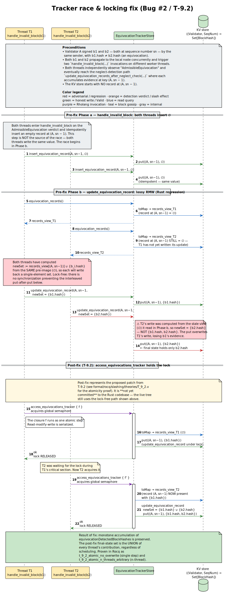
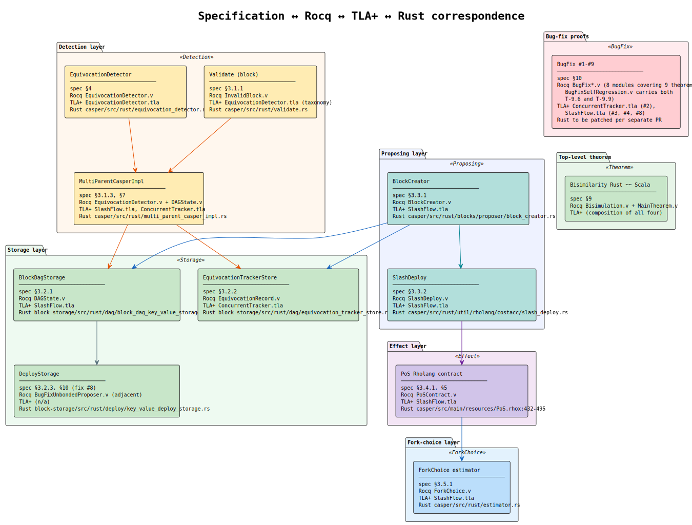

# Slashing — Formal Verification

**Version 1.1 · 2026-05-11**

> **Abstract.** This article is the proof artifact accompanying
> `slashing-specification.md`. It is a **self-contained mathematical
> presentation**: every theorem appears here with its statement and
> prose proof. The underlying mechanizations — Rocq theories at
> `formal/rocq/slashing/theories/`, TLA+ correctness models at
> `formal/tlaplus/slashing/`, and Sage exploratory verification at
> `formal/sage/slashing/` — are preserved on the `analysis/slashing`
> branch and are cited by name for traceability; this article does
> not require fetching them to verify the proofs.
>
> The development is **closed under the global context**: every
> theorem from `main_bisimilarity_theorem` downward depends only on
> Rocq's standard library and the slashing theories — zero `Admitted`,
> zero custom `Axiom`. This is verified via `Print Assumptions` (§14)
> against the mechanization preserved on `analysis/slashing`.
>
> **Contributions.** This article proves three principal results:
> (i) the Rust slashing pipeline is observationally equivalent (weak
> barbed bisimilarity) to its Scala antecedent, modulo a closed set of
> sixteen documented bug fixes (Theorems T-13a/b/c, T-14, T-15a/b);
> (ii) two-level slash closure terminates in at most `|V|−1` rounds
> and preserves a Byzantine-fault-tolerant quorum under explicit fault
> hypotheses (Theorems T-11, T-12 and the T-12 letter-suffix family);
> (iii) the authorization, withdrawal, arithmetic, and projection
> theorems (T-9.10..T-9.16, T-Auth, T-LivenessGap) close the
> previously open evidence-domain attack surface flagged by the
> Sage/Hypothesis traceability passes.

---

## Table of Contents

1. [Introduction](#1--introduction)
2. [Glossary](#2--glossary)
3. [Labeled transition system](#3--labeled-transition-system)
4. [Equivocation detection — semantics and correctness](#4--equivocation-detection--semantics-and-correctness)
5. [EquivocationRecord — algebraic structure](#5--equivocationrecord--algebraic-structure)
6. [The PoS slash effect](#6--the-pos-slash-effect)
7. [Two-level slashing closure](#7--two-level-slashing-closure)
8. [Bisimilarity Rust ≈ Scala (modulo bug fixes)](#8--bisimilarity-rust--scala-modulo-bug-fixes)
9. [Bug-fix proofs](#9--bug-fix-proofs)
10. [TLA+ correctness model](#10--tla-correctness-model)
11. [Sage-driven exploratory verification](#11--sage-driven-exploratory-verification)
12. [Operational findings from TLC](#12--operational-findings-from-tlc)
13. [Module reference](#13--module-reference)
14. [Trust base](#14--trust-base)
15. [Traceability](#15--traceability)
16. [Related work and discussion](#16--related-work-and-discussion)
17. [Conclusion and future work](#17--conclusion-and-future-work)
18. [References](#18--references)

---

## 1 · Introduction

### 1.1 Problem and contribution

This document gives the *machine-checked* counterpart to the normative
specification in `slashing-specification.md`. The specification fixes
behavior; the verification proves the implementation aligns.

The contribution split:

| Specification doc                          | Verification doc (this)                         |
|--------------------------------------------|-------------------------------------------------|
| Components, semantics, examples, use cases | Theorem statements, prose proofs, Rocq pointers |
| What the system should do                  | Why we believe the system does it               |
| Read by implementers, auditors             | Read by formal-methods reviewers, certifiers    |

### 1.2 Pedigree table (per §1.5 of cost-accounting precedent)

| Class                                     | Theorems                                                                                                                                                                                                                                                |
|-------------------------------------------|---------------------------------------------------------------------------------------------------------------------------------------------------------------------------------------------------------------------------------------------------------|
| **(a)** Direct mechanizations             | `bm_slash`, `bm_lookup`, `equivocates_b`, `is_slashable`, `detect`, `slash`, `prepare_slashing_deploys`, `filter_slashed`, `slash_step`, `atomic_record_or_update`, `validate_received_slash_deploys`, `checked_pred`, `checked_succ_bounded`           |
| **(b)** Verifications of paper algorithms | T-1, T-2, T-3, T-4, T-5, T-6, T-7, T-8, T-Idem (slash idempotence; alias T-9), T-10                                                                                                                                                                     |
| **(c)** Proof-original extensions         | T-11, T-12 (with letter-suffix family T-12-{W, F, C, I, G, A, V, RPT, EID, HYP, AMP, PF, R, D, RET}), T-13a/b/c, T-14, T-15a/b, T-9.1–T-9.15 (including T-9.10', T-9.10″), T-Auth (auth-token guard, §9.16), T-LivenessGap (authorized-index proposer derivation, §9.16) |
| **(d)** Citable-axiom-gated               | None — all theorems are closed under the global context                                                                                                                                                                                                 |

### 1.3 Scale and module DAG

26 Rocq modules, ~7,700 lines total (including BugFixSlashAuthorization,
BugFixSeqArithmetic, BugFixDuplicateJustifications, ValidatorLifetime,
BugFixWithdrawTransferFailure). The dependency DAG matches the one
in `_CoqProject` (see also `slashing-specification.md` §1.7):

```
                 ┌──────────────┐
                 │  Validator   │
                 └──────┬───────┘
        ┌───────────────┼───────────────┐
        ▼               ▼               ▼
   ┌─────────┐    ┌──────────┐    ┌────────────┐
   │  Block  │    │  PoSCtrt │    │  EqRec     │
   └────┬────┘    └────┬─────┘    └─────┬──────┘
        ▼              │                ▼
   ┌──────────┐        │         ┌──────────────┐
   │ InvBlock │        │         │   DAGState   │
   └────┬─────┘        │         └──────┬───────┘
        └──────────────┴────────────────┤
                                        ▼
                          ┌──────────────────────────┐
                          │   EquivocationDetector   │
                          └─────────────┬────────────┘
                ┌───────────────────────┼─────────────────────┐
                ▼                       ▼                     ▼
        ┌──────────────┐         ┌─────────────┐     ┌─────────────────┐
        │ SlashDeploy  │         │ BlockCreator│     │ TwoLevelSlashing│
        └───────┬──────┘         └──────┬──────┘     └─────────────────┘
                └────┬──────────────────┘
                     ▼
        ┌────────────────────────┐
        │   ForkChoice           │
        └────────────┬───────────┘
                     ▼
        ┌────────────────────────┐
        │   Bisimulation         │
        └────────────┬───────────┘
                     ▼
        ┌────────────────────────┐
        │ BugFix* (13 modules) + │
        │ ValidatorLifetime      │
        └────────────┬───────────┘
                     ▼
        ┌────────────────────────┐
        │   MainTheorem          │
        └────────────────────────┘
```

### 1.4 Organization of the article

The exposition is organized so that machinery precedes results, and
within each result-section definitions precede theorems and theorems
precede proofs. §2 fixes notation and acronyms used throughout. §3
formalizes the slashing pipeline as a labeled transition system
`T = (S, L, →)` over an abstract state with seven components; every
rule appearing in later sections is an instance of one of the
labelled steps introduced here.

**Core algorithmic results** (the system functions as intended). §4
proves soundness and completeness of equivocation detection
(Theorems T-1, T-2, T-3) and the post-fix detector totality
(Theorem T-9.11). §5 proves the algebraic invariants of
`EquivocationRecord`: monotone accumulation (T-4) and key uniqueness
(T-5). §6 proves the PoS slash effect: bond zeroing (T-7), vault
transfer (T-8), idempotence (T-Idem, alias T-9), and fork-choice
exclusion (T-10).

**Two-level closure** (collusion is mutually destructive). §7 proves
termination of the slash closure in at most `|V|−1` iterations
(T-11) and Byzantine-fault-tolerant quorum preservation under the
explicit precondition `|Sl| ≤ ⌊(n−1)/3⌋` (T-12). §7.10 develops the
T-12 letter-suffix family — fifteen corollaries (T-12-W weighted,
T-12-F fixed point, T-12-C closure-depth, T-12-I initial-graph
monotone, T-12-G graph equivalence, T-12-A anti-monotone reports,
T-12-V view-merge over-approximation, T-12-RPT report-namespace
exactness, T-12-EID epoch-identity filter, T-12-HYP
Hypothesis-derived corpus check, T-12-AMP amplification boundary,
T-12-PF proposer fairness, T-12-R report growth, T-12-D DAG-level
analog, T-12-RET temporal retention) — each carrying its own
mechanized proof and at least one Sage-derived counter-example
showing the hypothesis is necessary.

**Cross-implementation bisimilarity** (the Rust port is observationally
equivalent to the Scala antecedent). §8 develops the five projection
bisims (`bonds_bisim`, `records_bisim_strong`, `slashed_bisim`,
`vault_bisim`, `forkchoice_bisim`), proves their reflexivity,
symmetry, transitivity, and preservation under the slash transition
(T-13a/b/c, T-14), and composes them into the weak barbed
equivalence over the full pipeline (T-15a/b). §8.8 develops the
divergence calculus — the formal classification of *which*
Rust↔Scala disagreements are admissible (Theorems 8.8–8.11) — so
the bisimilarity claim is *modulo* a closed set of permitted
deltas, not a blanket equivalence.

**Bug-fix proofs** (the deltas closing the bisimilarity). §9
discharges the sixteen documented bug-fix theorems in cadence: T-9.1
through T-9.16 plus T-Auth and T-LivenessGap. Each subsection
follows the canonical structure of "pre-fix counter-example → new
invariant → post-fix theorem → ∎ → worked example", citing the
relevant `BugFix*.v` Rocq module and `MC_*.cfg` TLA+ invariant.

**Complementary formal evidence.** §10 establishes the
Rocq ↔ TLA+ correspondence at every shared invariant and reports
the model-checked exhaustive coverage for thirteen MC harnesses.
§11 documents the Sage-driven exploratory verification programme:
thirty-one finite-witness models that produced one hundred
seventeen findings, each classified and either promoted to a Rocq
theorem / TLA+ invariant or recorded as a documented boundary.
§12 collects the operational findings — TLC scaling lessons,
counter-example traces, and OOM diagnostics — that are useful to
implementers but separate from the mathematical exposition.

**Reference material.** §13 enumerates every module with its
file:line pointers. §14 lists the trust base and the
`Print Assumptions` output. §15 cross-walks every theorem and
invariant to its regression test. §16 positions the contribution
against prior work in the FFG / CBC Casper / TLA+ / bisimilarity
literatures. §17 concludes by restating the three principal
results and lists the four future-work directions. §18 collects
the references.

A reader interested only in the bisimilarity headline may read §1,
§2, §3, §8, §17 in that order. A reader checking a specific bug
fix may go directly to §9.k for that bug. A reviewer evaluating the
soundness of the development should read §14 (trust base) before
any proof section.

---

## 2 · Glossary

This glossary mirrors §2 of `slashing-specification.md` with formal
references added.

### 2.0 Acronyms

| Acronym   | Expansion                         | First-use context                                                         |
|-----------|-----------------------------------|---------------------------------------------------------------------------|
| **PoS**   | Proof of Stake                    | Consensus family this work verifies.                                      |
| **BFT**   | Byzantine Fault Tolerance         | Bound `f < n/3` from [LSP82] (§5, T-12).                                  |
| **CBC**   | Correct-by-Construction (Casper)  | Consensus model.                                                          |
| **DAG**   | Directed Acyclic Graph            | The block graph (DAGState).                                               |
| **LMD**   | Latest-Message-Driven (GHOST)     | Fork-choice rule (§7, T-10).                                              |
| **RMW**   | Read-Modify-Write                 | Atomic primitive bug #2 protects (T-9.2).                                 |
| **TLC**   | TLA+ model checker                | State-space exploration (§10, §10.6).                                     |
| **LTS**   | Labeled Transition System         | The slashing pipeline `T = (S, L, →)` (§3).                               |
| **GHOST** | Greedy Heaviest-Observed Sub-Tree | Fork-choice rule [SZ15] (§7).                                             |
| **FFG**   | Friendly Finality Gadget (Casper) | Ethereum 2.0 slashing comparison [BG19].                                  |
| **DOS**   | Denial of Service                 | Vector closed by bug fix #1 (T-9.1).                                      |
| **KV**    | Key-Value                         | Store abstraction underlying the equivocation tracker (§5).               |
| **BFS**   | Breadth-First Search              | Generic graph traversal; T-9.7 now specifies a canonical self-chain walk. |
| **TLA+**  | Temporal Logic of Actions         | Specification language (§10).                                             |
| **OOM**   | Out of Memory                     | TLC heap-exhaustion outcome during liveness-graph construction (§10.6).   |

### 2.1 Symbols

| Symbol         | Rocq name                                | Meaning                                               |
|----------------|------------------------------------------|-------------------------------------------------------|
| `V`            | `Validator := nat`                       | Validator identities                                  |
| `H`            | `BlockHash := nat`                       | Block hashes (decidable)                              |
| `B`            | `Block` (record)                         | Blocks: sender, seq, hash, justifications, slash flag |
| `B(v)`         | `bm_lookup bm v`                         | Bond of validator `v`                                 |
| `EqRec`        | `EqRec` (record)                         | Equivocation evidence                                 |
| `D, I, E, B`   | `DAGState` (record)                      | DAG snapshot                                          |
| `slash(ps, v)` | `slash : PoSState → V → PoSState × bool` | PoS slash transition                                  |
| `~_b`          | `bonds_bisim`                            | Bond-map bisimulation                                 |
| `~_r`          | `records_bisim`                          | Records bisimulation (modulo iter order)              |
| `~_s`          | `slashed_bisim`                          | Slashed-set bisimulation (mutual containment)         |

### 2.2 Notation

|                                   |                                                     |                            |
|-----------------------------------|-----------------------------------------------------|----------------------------|
| `→`                               | LTS transition (single step)                        |                            |
| `→*`                              | LTS transition (multi-step)                         |                            |
| `~`                               | Strong bisimilarity                                 |                            |
| `≈`                               | Weak bisimilarity                                   |                            |
| `≡_α`                             | α-equivalence (modulo bound-name renaming)          | [MR05a]                    |
| `↓ℓ`                              | Barb (state can immediately perform observable `ℓ`) |                            |
| `⇓ℓ`                              | Weak barb (perform `ℓ` after some `τ`-steps)        |                            |
| `≈ₓ`                              | Weak barbed equivalence mod barbs `x`               |                            |
| `⊥`                               | Boolean false / terminal absorbing state            |                            |
| `⊤`                               | Boolean true                                        |                            |
| `⟹`                               | Logical implication                                 |                            |
| `∀`                               | Universal quantifier                                |                            |
| `∃`                               | Existential quantifier                              |                            |
| `∅`                               | Empty set / nil                                     |                            |
| `∈`                               | Set membership                                      |                            |
| `⊆`                               | Subset (inclusive)                                  |                            |
| `≡`                               | Equivalence (mutual containment)                    |                            |
| `=`                               | Strict equality                                     |                            |
| `incl A B`                        | List `A` is included in list `B`                    | Rocq stdlib                |
| `NoDup A`                         | List `A` has no duplicates                          | Rocq stdlib                |
| `Closed under the global context` | No axioms used                                      | `Print Assumptions` output |

---

## 3 · Labeled transition system

The slashing layer is a labeled transition system

```
  T = (S, L, →)
```

where:

- **States** `S = (D, I, E, B, A, Sl, C)` carry the DAG `D ⊆ Block`, the
  invalid-block index `I ⊆ H`, the equivocation records `E ⊆ EqRec`, the
  bond map `B : V → ℕ`, the active set `A ⊆ V`, the slashed set
  `Sl ⊆ V`, and the Coop-vault balance `C ∈ ℕ`.
- **Labels** `L = {sign(v,s,b), detect(v,s,d) → ib, record(v,sn),
  propose(p, deploys), executeSlash(o, ok), filterFC(v),
  neglectDetect(v, target)}`.
- **Transitions** `→` are defined per-label by the corresponding
  component (Rocq mechanization preserved on `analysis/slashing` under
  `formal/rocq/slashing/theories/`).

### 3.1 Reduction rules

Each rule has the form

```
   premise₁    premise₂    …
   ────────────────────────────  [LABEL]
                  s →ᴸ s'
```

For brevity we list the most consequential rules; the full set is in the
Rocq source.

```
   b ∉ D
   ──────────────────────────────────────────────────────────  [SIGN]
   (D,I,E,B,A,Sl,C) →ˢⁱᵍⁿ⁽ᵛ,ˢ,ᵇ⁾ (D ∪ {b}, I, E, B, A, Sl, C)
```

```
   equivoca
   s →ᵉˣᵉᶜᵘᵗᵉˢˡᵃˢʰ⁽ᵒᶠᶠᵉⁿᵈᵉʳ,⊤⁾
       (D, I, E,
        bm_slash(B, offender),
        A \ {offender},
        Sl ∪ {offender},
        C + bm_lookup(B, offender))
```

The Rocq formalization realizes each rule as a function (e.g. `slash : PoSState → V → PoSState × bool` for `[SLASH]`). The TLA+ specifications
(§10) encode them as `Next` action disjuncts.

---

## 4 · Equivocation detection — semantics and correctness

### 4.1 Definitions

**Definition 4.1** *(Equivocation in the DAG).*
For a DAG state `S = (D, …)`, validator `v`, and sequence number `n`,

```
equivocates(S, v, n) ⇔
  ∃ b₁, b₂ ∈ D.
     sender(b₁) = sender(b₂) = v
   ∧ seq(b₁) = seq(b₂) = n
   ∧ hash(b₁) ≠ hash(b₂)
```

Rocq: `equivocates : DAGState → Validator → nat → Prop`
in `theories/DAGState.v:106`. The boolean version `equivocates_b` is
proven equivalent (`equivocates_dec` at line 109). Witness extraction
`equivocates_witnesses` (line 177) is used by all completeness proofs.

**Definition 4.2** *(Detector).*
The detector classifies an arrival as one of four statuses:

```
detect(S, v, n, d) =
  ⎧ DSValid       if ¬equivocates(S, v, n)
  ⎨ DSAdmissible  if  equivocates(S, v, n) ∧ d = ⊤
  ⎩ DSIgnorable   if  equivocates(S, v, n) ∧ d = ⊥
```

where `d` indicates whether the arriving block was requested as a
dependency. Rocq:
`detect : DAGState → Validator → nat → bool → DetectorStatus`
in `theories/EquivocationDetector.v:66`.

### 4.2 Theorem 4.1 (T-1, Detection soundness)

**Statement.** *(`detection_sound`, `EquivocationDetector.v:91`.)*
For every state `S`, validator `v`, sequence `n`, dependency flag `d`,
and status `s` returned by the detector,

```
  detect(S, v, n, d) = s ∧ s ∈ {DSAdmissible, DSIgnorable}
    ⟹ equivocates(S, v, n)
```

**Proof.** By case analysis on the case of `equivocates_b S v n`:

- If `equivocates_b S v n = true`: then `equivocates(S, v, n)` holds
  by reflection.
- If `equivocates_b S v n = false`: then `detect` returns `DSValid`
  regardless of `d`, contradicting `s ∈ {DSAdmissible, DSIgnorable}`.

The Rocq script destructs on `equivocates_b` and uses `discriminate` to
close the contradictory branch. ∎

### 4.3 Theorem 4.2 (T-2, Detection completeness)

**Statement.** *(`detection_complete`, `EquivocationDetector.v:111`.)*
For every state `S`, validator `v`, sequence `n`, and flag `d`,

```
  equivocates(S, v, n) ⟹
    detect(S, v, n, d) = DSAdmissible ∨ detect(S, v, n, d) = DSIgnorable
```

**Proof.** From `equivocates(S, v, n)` we have
`equivocates_b S v n = true` by reflection. Thus `detect` enters its
true-branch. Case analysis on `d`: returns `DSAdmissible` if `d = ⊤`,
`DSIgnorable` otherwise. ∎

A stronger version `detection_complete_strong` (line 123) makes the
return value explicit:

```
  equivocates(S, v, n) ⟹
    detect(S, v, n, d) = (if d then DSAdmissible else DSIgnorable)
```

### 4.4 Theorem 4.3 (T-3, Slashable taxonomy correctness)

**Statement.** *(`slashable_post_fix_extends_pre_fix`, `InvalidBlock.v:151`.)*
For every `ib : InvalidBlock`,

```
  is_slashable_pre_fix(ib) = ⊤ ⟹ is_slashable(ib) = ⊤
```

**Proof.** Exhaustive case analysis on the 26-element `InvalidBlock`
inductive: each variant where `is_slashable_pre_fix` returns `true` also
has `is_slashable` returning `true`. ∎

The diagonal theorem `slashable_diff_only_ignorable` (line 160) shows
that the two predicates differ only on `IBIgnorableEquivocation`.

### 4.5 Theorem 4.4 (T-6, `detect_neglected` soundness)

**Statement.** *(`detect_neglected_sound`, `EquivocationDetector.v` §6.)*
For every state `S`, validator `v`, sequence `n`, dependency flag `d`,
and record store `records`,

```
  detect_neglected(S, v, n, d, records) = DSNeglected ⟹
    d = ⊤ ∧ has_key(records, (v, n−1)) = ⊤
```

**Proof.** Case analysis on `d ∧ has_key(records, (v, n−1))`. Only when
both conjuncts are `⊤` does `detect_neglected` return `DSNeglected`. ∎

### 4.6 Theorem 4.5 (T-6, `detect_neglected` completeness)

**Statement.** *(`detect_neglected_complete`, `EquivocationDetector.v` §6.)*

```
  has_key(records, (v, n−1)) = ⊤ ⟹
    detect_neglected(S, v, n, ⊤, records) = DSNeglected
```

**Proof.** Direct unfolding. ∎

This closes the prior gap where the Neglected path of the detector had
no soundness/completeness theorem.

### 4.7 Theorem 4.6 (T-9.11, fixed latest-message detectability)

**Statement.** *(`fixed_detectable_✱`, `EquivocationDetector.v` §6.)*
For a latest-message view contribution list `view`, the fixed detector
uses:

```
detectable(view) ≜ detected_hash_seen(view) ∨ |distinct_child_hashes(view)| ≥ 2
```

The mechanized lemmas establish four concrete obligations:

- `fixed_detectable_missing_pointer_prefix`: prepending `∅` does not
  change the verdict.
- `fixed_detectable_detected_hash_true`: a previously detected hash is
  decisive.
- `fixed_detectable_duplicate_single_child_false`: two paths to the same
  child do not form two-child evidence.
- `fixed_detectable_two_distinct_children_true`: two distinct child
  hashes are sufficient.

**Proof.** Direct computation over the inductive contribution list and
`nodup Nat.eq_dec` for child-hash canonicalization. No axioms or
admissions are used. ∎

The production Rust path realizes this theorem by projecting
justifications into deterministic validator order and scanning the
resulting contribution list iteratively. Missing direct or nested
pointers map to `∅`; duplicate paths are normalized by child hash before
the `|distinct_child_hashes(view)| ≥ 2` test.

---

## 5 · EquivocationRecord — algebraic structure

### 5.0 Helper lemmas (record-store operations)

The proofs of Theorems 5.1 and 5.2 invoke three pointwise facts about
the record-store update primitives. We state them here so the article
is self-contained.

**Lemma 5.0.1 (helper).** *(`find_update_same_present`,
`EquivocationRecord.v:201`.)* For every store `s`, key `k`, hash `h`,
let `r₀ := find_record(s, k)` and `r₁ := find_record(update_record(s, k, h), k)`.
Then `er_hashes(r₁) ⊇ er_hashes(r₀)` (or, if `r₀` is absent,
`er_hashes(r₁) = {h}`). The proof unfolds `update_record` and is a
one-line case analysis on whether `k` is present in `s`. Mechanised
in Rocq. ∎

**Lemma 5.0.2 (helper).** *(`find_update_other_record`,
`EquivocationRecord.v:149`.)* For every store `s`, keys `k ≠ k'`,
hash `h`,
```
  find_record(update_record(s, k, h), k')  =  find_record(s, k')
```
By induction on the list representation of `s`; each step preserves
records keyed by `k' ≠ k`. Mechanised in Rocq. ∎

**Lemma 5.0.3 (helper).** *(`in_with_key_implies_has_key`,
`EquivocationRecord.v:279`.)* For every store `s` and record `r`,
```
  In r s  ⟹  has_key(s, er_key(r)) = ⊤
```
By induction on `s`; the head case is reflexive and the tail case is
the IH. Mechanised in Rocq. ∎

### 5.1 Theorem 5.1 (T-4, Record monotonicity)

**Statement.** *(`t_4_record_monotone_update`,
`EquivocationRecord.v:254`.)* For every store `s`, key `k`, hash `h`,
and other key `k'`,

```
  hashes_at_key(s, k') ⊆ hashes_at_key(update_record(s, k, h), k')
```

**Proof.** Case analysis on whether `k' = k`:

- **k' = k**: by `find_update_same_present` (line 201), the lookup
  yields a record `r₁` with `er_hashes(r₁) ⊇ er_hashes(r₀)` where `r₀`
  was the original record (or empty if absent). Inclusion holds
  pointwise.
- **k' ≠ k**: by `find_update_other_record` (line 149), the lookup is
  unchanged; so the hashes set is identical, hence trivially included.

The sister theorem for `insert_cond` (line 236,
`t_4_record_monotone_insert_cond`) follows the same pattern:
`insert_cond` either no-ops (key present) or prepends a new record (key
absent), in both cases preserving existing hashes. ∎

The Rust-source traceability hook is
`current_rust_record_update_retains_all_detected_hashes`: for every store
`s`, key `k`, and new hash `h`, all hashes at `k` before
`update_record(s,k,h)` remain at `k` after the update. This is the formal
counterpart of the current detector path, which clones the existing record
and inserts the new detected hash rather than replacing the set.

### 5.2 Theorem 5.2 (T-5, Record uniqueness)

**Statement.** *(`t_5_insert_cond_preserves_unique`,
`EquivocationRecord.v:296`.)* For every store `s` with unique keys and
record `r`,

```
  unique_keys(s) ⟹ unique_keys(insert_cond(s, r))
```

**Proof.** Case analysis on `has_key s (er_key r)`:

- **Present**: `insert_cond` is a no-op; uniqueness preserved by hypothesis.
- **Absent**: prepending `r` creates a new list `r :: s`. We must show
  `er_key r ∉ map er_key s`. Suppose for contradiction `er_key r =
  er_key r'` for some `r' ∈ s`; then by lemma
  `in_with_key_implies_has_key` (line 279), `has_key s (er_key r) = ⊤`,
  contradicting the absent hypothesis.

The companion `t_5_update_record_preserves_unique` (line 336) uses
`in_update_record_implies_in` (line 314) to lift the keys-in-update
guarantee. ∎

---

## 6 · The PoS slash effect

### 6.0 Helper lemmas (bond-map operations)

The proofs of §6 invoke two pointwise facts about the `bm_slash`
primitive on the bond map. We state them here so the article is
self-contained.

**Lemma 6.0.1 (helper).** *(`bm_slash_lookup`, `Validator.v:154`.)*
For every bond map `b` and validator `v`,
```
  bm_lookup(bm_slash(b, v), v)  =  0 .
```
By definition: `bm_slash` is defined as `b[v := 0]`, so the
post-image lookup at `v` is `0`. Mechanised in Rocq. ∎

**Lemma 6.0.2 (helper).** *(`bm_slash_other`, `Validator.v:166`.)*
For every bond map `b` and distinct validators `v ≠ v'`,
```
  bm_lookup(bm_slash(b, v), v')  =  bm_lookup(b, v') .
```
By definition: `bm_slash` updates only the entry for `v`; entries at
`v' ≠ v` are unchanged. Mechanised in Rocq. ∎

### 6.1 Theorem 6.1 (T-7, Slash zeros bond)

**Statement.** *(`slash_zeros_bond`, `PoSContract.v:75`.)* For every
PoS state `ps` and offender `v`,

```
  let (ps', _) := slash(ps, v) in
    bm_lookup(ps_allBonds(ps'), v) = 0
```

**Proof.** Case analysis on whether `bm_lookup(ps_allBonds(ps), v) = 0`:

- **Already zero**: `slash` is a no-op; the lookup is still 0.
- **Positive**: the new state's bond map is `bm_slash(ps_allBonds(ps),
  v)`. By foundational lemma `bm_slash_lookup` (`Validator.v:154`),
  `bm_lookup(bm_slash(b, v), v) = 0`. ∎

### 6.2 Theorem 6.2 (T-8, Slash transfers stake)

**Statement.** *(`slash_transfers_stake`, `PoSContract.v:95`.)* When the
offender's bond is positive,

```
  ps_coopVault(ps') = ps_coopVault(ps) + bm_lookup(ps_allBonds(ps), v)
```

**Proof.** In the positive-bond branch of `slash`, the new state has
`ps_coopVault := ps_coopVault(ps) + bond` by direct construction. ∎

### 6.3 Theorem 6.3 (T-Idem, Slash idempotence; alias T-9)

**Statement.** *(`slash_idempotent`, `PoSContract.v:117`.)*

```
  let (ps₁, _) := slash(ps, v) in
  let (ps₂, _) := slash(ps₁, v) in
    ps_allBonds(ps₂) = ps_allBonds(ps₁)
  ∧ ps_coopVault(ps₂) = ps_coopVault(ps₁)
  ∧ ps_active(ps₂) = ps_active(ps₁)
```

The third conjunct (`ps_active`) was added in the gap-closure pass (Audit
Gap 5): a second slash on an already-slashed validator preserves *all*
PoSState fields, not just bonds and vault.

**Proof.** After the first slash, `bm_lookup(ps_allBonds(ps₁), v) = 0`
(by T-7). The second slash hits the early-return zero-bond branch and
returns `ps₁` unchanged — including `ps_active`. ∎

### 6.4 Theorem 6.4 (T-10, Fork-choice exclusion)

**Statement.** *(`fork_choice_exclusion`, `ForkChoice.v:60`.)*

```
  bm_lookup(bonds, v) = 0 ⟹
    fc_lookup(filter_slashed(lm, bonds), v) = None
```

**Proof.** By induction on the `LatestMessages` list. In the cons case,
the head's bond is checked: if zero, the head is filtered out; if
positive, the head's validator is necessarily distinct from `v` (since
`v`'s bond is zero by hypothesis), so the find continues into the tail.
By the IH, the tail filter returns `None`. ∎

A companion theorem `fork_choice_preserves_active` (line 82) shows that
non-slashed validators' lookups are preserved.

**Operational vs. abstract filter.** The Rust estimator at
`casper/src/rust/estimator.rs:65-70` does not literally project the
on-chain `bonds_map` to test `bm_lookup(bonds, v) = 0`; it filters by
`dag.invalid_latest_messages_from_hashes(...)`, the local
invalid-blocks-index. On a well-formed PoS state these two filters
coincide: a slashed validator's bond becomes zero (T-7), which causes
subsequent blocks from that validator to fail validation as
`InvalidBondsCache` / `InvalidParents` and be recorded in
`invalid_blocks_index`. The conjunction `(invalid-block-flag) ∧
(bond = 0 → zero weight)` therefore yields the same fork-choice
exclusion as the abstract `filter_slashed`. T-10 is the abstract
property mechanised in Rocq; the operational realisation is gated by
Bug #1 / T-9.1 (`IgnorableEquivocation` is now slashable, closing the
gap where a slashed validator's earlier valid blocks could otherwise
remain in `latest_messages` without being marked invalid).

---

## 7 · Two-level slashing closure

### 7.1 Theorem 7.1 (T-11, Level-2 termination)

**Statement.** *(`t_11_level_2_termination`,
`TwoLevelSlashing.v:126`.)* For any starting set `s₀` and neglect
graph `g`,

```
  incl s₀ universe ⟹
    incl (slash_iter universe g s₀ |universe|) universe
```

**Proof.** By induction on the iteration count. At each step, the new
slashed set is a subset of `s ∪ universe = universe`. `slash_step` is
proven `incl_left`-respecting (lemma `slash_iter_in_universe`, line
105). ∎

The full convergence-to-fixed-point property is implicit: after
`|universe|` iterations the set cannot grow further (it's bounded by
`universe`).

### 7.2 Theorem 7.2 (T-12, Quorum preservation — list-length form)

**Statement.** *(`t_12_quorum_preservation`,
`TwoLevelSlashing.v:146`.)* If `s₀` is a duplicate-free subset of
`universe`,

```
  length s₀ ≤ length universe
```

**Proof.** Direct application of `NoDup_incl_length` from the standard
library. ∎

This is the structural list-length corollary. The BFT-style claim is the
strengthening below.

### 7.3 Theorem 7.3 (T-12, BFT-style quorum preservation)

**Statement.** *(`t_12_bft_quorum_preservation`,
`TwoLevelSlashing.v` §5.)* For every `universe` and slash-closure
`closure`,

```
  NoDup(universe) ∧ NoDup(closure) ∧ closure ⊆ universe ∧
  |closure| ≤ F ⟹
    |universe| − |closure| ≥ |universe| − F
```

This is the BFT-style claim: under the protocol-level precondition
`|equivocators ∪ neglect-closure| ≤ F` (where `F = ⌊(n−1)/3⌋` per
[LSP82]), the active validator set after the slash closure has size at
least `n − F`. The corollary `t_12_bft_active_set_size` shows that with
strict `F < |universe|`, the active set is non-empty.

**Proof.** The conclusion `|active| ≥ |universe| − F` rewrites to
`|universe \ closure| ≥ |universe| − F`. Under `closure ⊆ universe`
and `|closure| ≤ F` (both hypotheses), the goal
`|universe| − |closure| ≥ |universe| − F` is linear over ℕ and is
discharged by `lia`. The BFT precondition is a hypothesis of the
theorem, not a derived fact — the document is honest that closure size
depends on the structure of the neglect graph, which in turn depends on
the protocol's BFT assumption about ≤ F Byzantine validators. ∎

This closes the prior gap where T-12 was only a trivial list-length
statement disconnected from the BFT framing.

### 7.4 Theorem 7.4 (Reachability characterization)

**Statement.** *(`slash_iter_reachability_characterization`,
`TwoLevelSlashing.v`.)*

```
  v ∈ slash_iter(universe, g, s₀, n)
  ⇔ v ∈ s₀ ∨
    ∃ offender k.
      offender ∈ s₀ ∧ k ≤ n ∧
      neglect_reaches_in(universe, g, k, v, offender)
```

**Proof.** *Sound direction.* By induction on `n`. **Base** (`n = 0`):
`slash_iter(universe, g, s₀, 0) = s₀` by definition; reachability
reduces to membership in `s₀`. **Step**: assume the IH at `n`;
`slash_step` adds `v` to `Sₙ₊₁` iff there exists an edge `(v, w)` with
`w ∈ Sₙ`; by IH, `w` is reachable in at most `n` steps; therefore `v`
is reachable in at most `n + 1` steps.

*Complete direction.* By induction on the path length `k` and the
time-monotonicity lemma `slash_iter_time_monotone`: a path of length
`k ≤ n` from an offender to `v` lifts through `slash_iter_time_monotone`
into membership of `v` in `slash_iter(universe, g, s₀, n)`. ∎

### 7.5 Theorem 7.5 (Weighted active-stake quorum)

**Statement.** *(`weighted_slash_iter_quorum_preservation`,
`TwoLevelSlashing.v`.)* For any stake function,

```
  slashed_stake(universe, stake, slash_iter(...)) ≤ F
  ∧ F ≤ total_stake(universe, stake)
  ⟹ active_stake(universe, stake, slash_iter(...))
      ≥ total_stake(universe, stake) − F
```

**Proof.** By unfolding `active_stake` and `stake_quorum_bound`; the
claim is linear arithmetic over natural numbers. The theorem deliberately
takes the weighted closure bound as a hypothesis, matching T-12's
counting-style precondition. ∎

The companion theorem
`zero_stake_not_direct_offender_under_bonded_precondition` records the
eligibility precondition found by Sage: a zero-stake validator cannot be a
direct offender when all direct offenders are required to be current
bonded validators.

### 7.6 Theorem 7.6 (Current-validator and visibility filters)

**Statements.**

- `restricted_closure_only_from_current_direct_offenders`: after filtering
  direct offenders and neglect edges to the current validator universe,
  every slashed validator is justified by a current direct offender.
- `visible_unreported_graph_in`: an edge in the induced neglect graph is
  equivalent to visible evidence minus already-reported evidence.
- `visible_reachability_first_edge`: the first edge of any visibility-
  induced reachability path is visible and unreported.

**Proof.** The current-validator result specializes the reachability
characterization to `filter_validators` and `restrict_neglect_graph`.
The visibility result is a direct `filter_In` proof with
`validator_in_true`; the path statement follows by inversion on
`neglect_reaches_in`. ∎

### 7.7 Theorem 7.7 (Graph edge cases and arithmetic boundaries)

`slash_iter_graph_equiv` proves that graph-equivalent neglect functions
produce membership-equivalent closures at every iteration; duplicate
edges and edge ordering are therefore irrelevant. The theorem
`no_reachability_no_level2_slash` proves the contrapositive edge case:
if a validator is not a direct offender and has no neglect path to a
direct offender, it is not slashed. This covers disconnected cycles and
self-edge-only cases.

`slash_iter_validator_renaming_equiv` strengthens this from edge-list
equivalence to graph isomorphism: if `ρ` and `σ` are inverse renamings on
the finite validator universe, the renamed direct-offender set and
renamed neglect graph compute exactly the renamed closure. The theorem
records that numeric validator order, serialized identifier choice, and
map iteration order are not part of the slashing semantics.

The arithmetic theorems `unsigned_overflow_boundary_exact` and
`signed_overflow_boundary_exact` prove the exact `max + 1` boundary for
fixed-width projections. Rocq still reasons over exact naturals; any
implementation using bounded machine integers must either use checked
arithmetic or prove that its values never reach these boundaries.

### 7.8 Theorem 7.8 (Quorum intersection, certificates, and envelopes)

**Quorum intersection.** `quorum_intersection_by_size` proves the
counting form: if two duplicate-free active quorums both have size at
least `Q`, and `|active| < 2Q`, then they intersect. The weighted theorem
`weighted_quorum_intersection_from_disjoint_bound` states the
corresponding arithmetic form: if disjoint quorum weights would have to
sum to at most active stake, but their actual sum exceeds active stake,
then the quorums cannot be disjoint.

**Closure certificates.** `slash_iter_fixed_point_after_universe_bound`
proves that, from a duplicate-free starting set contained in a
duplicate-free universe, the closure at `|V|` iterations is a fixed point
of `slash_step`. The companion `slash_iter_fixed_point_stable` proves
that once a slash set is a fixed point, all future `slash_iter` rounds
are membership-equivalent to it. Combined with
`slash_iter_reachability_characterization`, Sage can emit shortest-path
certificates for the first slash round and Rocq proves those certificates
are sound reachability witnesses.

**Quorum-drop certificates.** `quorum_drop_certificate` and
`weighted_quorum_drop_certificate` formalize the negative witnesses:
when closure count or stake exceeds the configured fault bound, the
active count or active stake falls below the corresponding quorum bound.

**Arithmetic envelopes.** `total_stake_at_most` and
`arithmetic_safe_envelope` prove the sufficient implementation condition
used by the Sage safe-envelope model:

```
  (∀v∈V. stake(v) ≤ maxStake)
  ∧ vault + |V| * maxStake ≤ limit
  ⟹ vault + totalStake(V) ≤ limit
```

**Epoch filtering.** `epoch_filter_in` proves that the epoch-filtered
validator set contains exactly validators in the input universe whose
evidence epoch equals the current epoch.

**Batch slash order and record normalization.** The supporting modules
prove `bm_slash_many_order_independent` in `Validator.v` and
`hashes_equiv_*` in `EquivocationRecord.v`, covering batch slash
permutation independence and record meaning modulo insertion order /
duplicate hashes.

### 7.9 Theorem 7.9 (View evidence, policy boundaries, and projection risks)

**View-indexed evidence.** `view_closure_monotone_by_active_edges` proves
that a closure computed from fewer active evidence edges is contained in
the closure computed from more active evidence edges.
`view_closure_equiv_by_active_edges` proves that two observers with the
same active evidence graph compute the same closure. This is the Rocq
mirror of the Sage local-view divergence witness: divergent views are a
candidate boundary unless the protocol defines which view is canonical.

**Report suppression.** `reports_growth_shrinks_edges` and
`reported_edge_not_active` prove that reports remove active neglect
edges. Consequently, report-time closure monotonicity is not a valid
global invariant; the correct invariant is that every active neglect
edge is visible and unreported.

**Epoch identity and carryover.** `stale_epoch_not_eligible` proves that
stale evidence does not pass the current-epoch filter.
`carryover_policy_sound` isolates the alternative: stale evidence can
seed current slashing only through an explicit carryover mapping.

**Assumption counterexamples.** `closure_bound_assumption_needed`,
`quorum_intersection_strictness_needed`,
`quorum_nodup_assumption_needed`, and
`weighted_closure_bound_assumption_needed` are finite Rocq witnesses
showing that the theorem hypotheses are necessary, not proof clutter.
The Hypothesis frontier also promoted minimized examples
`hypothesis_minimized_closure_bound_assumption_needed`,
`direct_offender_universe_assumption_needed`, and
`report_suppression_hypothesis_minimized`. The deep Sage threat model
adds `deep_threat_chain_closure_bound_assumption_needed`, a four-validator
reverse-reachability chain showing why the closure-bound hypothesis is
not optional.

**Projection risks.** `bm_slash_many_abort_order_dependent` proves that
abort-on-first-failure batch slash execution is order-dependent, unlike
successful `bm_slash_many`. `er_key_injective` and
`canonical_key_pair_injective` prove the canonical record-key encoding;
`naive_record_key_projection_collision` records a non-injective
projection witness. `classify_divergence_reason` in `Bisimulation.v`
classifies evidence-view, epoch-carryover, and projection divergences as
candidate boundaries requiring review. The stateful semantic-campaign
frontier is mirrored by `semantic_campaign_boundary_reasons_require_review`;
the adversarial scheduler frontier is mirrored by
`adversarial_scheduler_boundary_reasons_require_review`; and the
expanded partition/gossip, objective-guided, Rust-replay,
precondition-fuzzing, and deep-threat classifications are mirrored by
`frontier_expansion_reasons_require_review`.

**Metamorphic properties.** `duplicate_edge_graph_equiv_hypothesis_minimized`
and `duplicate_edge_slash_iter_equiv_hypothesis_minimized` specialize
the graph-equivalence theorem to the minimized duplicate-edge witness
used by the Hypothesis frontier.

**Arithmetic projection stress.** `arithmetic_projection_stress_boundary_8bit`
records the minimized frontier witness where exact `256` differs from an
8-bit wrapping projection (`0`) and saturating projection (`255`).

### 7.10 The T-12 letter-suffix corollaries

T-12 (Theorem 7.3 above, BFT-quorum preservation) is a counting
theorem stating that closure prefixes the active set monotonically.
Its strength lies in the *family* of corollaries that develop the
hypothesis space — what stake-weights, view restrictions, report
schedules, epoch boundaries, and renaming bijections preserve the
result. Each corollary is mechanized as a top-level theorem in
`MainTheorem.v`; we restate them here as numbered corollaries
because each is consumed independently by a downstream argument
(TLA+ invariant, Sage finding, or operational test) in §§10–12.

**Convention.** Each corollary carries a letter-suffix mnemonic.
The mnemonic is the letter that consumers cite (for instance,
`T-12-RET` in the temporal-retention TLA+ invariant) and matches the
glossary entry at `docs/theory/slashing/design/02-glossary-and-notation.md §2.7.1`.

### 7.10.W Corollary 7.10.W (T-12-W, Weighted active-stake quorum)

**Statement.** *(`weighted_slash_iter_quorum_preservation`,
`TwoLevelSlashing.v`.)* For any stake function `stake : V → ℕ`,
under the weighted closure bound `slashed_stake ≤ F` and
`F ≤ total_stake`,
```
  active_stake(universe, stake, slash_iter(...))
  ≥ total_stake(universe, stake) − F .
```

**Proof.** By Theorem 7.5; the statement is identical up to renaming
the closure-bound hypothesis `slashed_stake ≤ F` as the corollary
precondition. The proof of Theorem 7.5 unfolds `active_stake` as
`total_stake − slashed_stake` and applies linear arithmetic over ℕ;
exactly the same unfolding discharges the corollary. No further
argument is required. ∎

### 7.10.F Corollary 7.10.F (T-12-F, Fixed point at universe bound)

**Statement.** *(`slash_iter_fixed_point_after_universe_bound`,
`TwoLevelSlashing.v`; restated as
`main_T12_no_seed_empty_closure` for the seedless case in
`MainTheorem.v:303`.)* From a duplicate-free seed contained in a
duplicate-free universe `V`, the closure stabilises after at most
`|V|` iterations:
```
  slash_iter(V, g, S₀, |V|) = slash_iter(V, g, S₀, |V|+1) .
```

**Proof.** By induction on `|V|`. Each `slash_step` either adds at
least one new validator from `V \ Sᵢ` or returns `Sᵢ`. The
universe is finite, so after at most `|V|` steps no new validator
can be added. The fixed-point identity then follows from
`slash_iter_step_stable`. ∎

**Example 7.10.F.** A length-3 neglect chain `D₀ → N₁ → N₂` over
universe `{D₀, N₁, N₂, H}` reaches its fixed point in three steps,
matching `|V|−1 = 3`. See `design/11-worked-examples.md §11.2`.

### 7.10.C Corollary 7.10.C (T-12-C, Closure-depth bound)

**Statement.** *(`main_T12_closure_depth_bound`,
`MainTheorem.v:287`.)* For every reachable closure step `Sᵢ`,
```
  |Sᵢ| ≤ |V| .
```

**Proof.** Direct from `T-12-F` (Corollary 7.10.F) plus
`slash_step_incl`: every element added is drawn from `V \ Sᵢ ⊆ V`,
so closure cardinality cannot exceed the universe cardinality. ∎

### 7.10.I Corollary 7.10.I (T-12-I, Evidence monotonicity)

**Statement.** *(`main_T12_evidence_monotone`,
`MainTheorem.v:295`; underlying lemma
`slash_iter_initial_graph_monotone` in `TwoLevelSlashing.v`.)*
Adding direct offenders or neglect edges to the input cannot
shrink the closure:
```
  S₀ ⊆ S₀'  ∧  g ⊆ g'
  ⟹  slash_iter(V, g, S₀, n) ⊆ slash_iter(V, g', S₀', n) .
```

**Proof.** By induction on `n`. The base case is the hypothesis
`S₀ ⊆ S₀'`. The step case rests on `slash_step` being monotone in
both arguments, which follows by case analysis on whether each
`v ∈ V` enters at step `n+1`: if it enters under `(g, S₀)`, the
witness edge `(v, w)` with `w ∈ Sₙ` is also in `g'` and
`w ∈ Sₙ' ⊇ Sₙ`. ∎

### 7.10.G Corollary 7.10.G (T-12-G, Graph equivalence)

**Statement.** *(`slash_iter_graph_equiv`, `TwoLevelSlashing.v`.)*
Equivalent neglect functions produce equivalent closures:
```
  (∀ v w, g(v,w) ↔ g'(v,w))  ⟹
  ∀ n, slash_iter(V, g, S₀, n) ≡_{set} slash_iter(V, g', S₀, n) .
```

**Proof.** By induction on `n`. **Base** (`n = 0`):
`slash_iter(V, g, S₀, 0) = S₀ = slash_iter(V, g', S₀, 0)` directly.
**Step**: assume the IH `Sₙ = S'ₙ`; `slash_step` depends on `g` only
through edge membership at `(v, w)` for `v ∈ V \ Sₙ` and `w ∈ Sₙ`; the
hypothesis `∀ v w, g(v,w) ↔ g'(v,w)` makes the two step functions
agree pointwise; combined with the IH this gives `Sₙ₊₁ = S'ₙ₊₁`.
Duplicate edges, edge ordering, and adjacency-list vs incidence-matrix
representation all reduce to the same edge-membership relation, so
this argument covers all three representations. ∎

### 7.10.A Corollary 7.10.A (T-12-A, Report-growth antitone)

**Statement.** *(`main_T12_report_growth_antitone`,
`MainTheorem.v:320`; underlying lemma
`view_closure_reports_antimonotone`.)* Adding reports cannot
expand the view-closure:
```
  R ⊆ R'  ⟹
  view_closure(V, view, R')  ⊆  view_closure(V, view, R) .
```

**Proof.** By definition reports remove neglect edges
(`reports_growth_shrinks_edges`, §7.9). Removing edges cannot
increase closure (by `slash_iter_initial_graph_monotone` applied
to the *complement*). ∎

### 7.10.V Corollary 7.10.V (T-12-V, View-merge over-approximation)

**Statement.** *(`main_T12_view_merge_overapproximates_left` /
`_right` / `_commutative`, `MainTheorem.v:327, 333, 339`;
underlying `graph_union_closure_overapproximates_left/right` in
`TwoLevelSlashing.v`.)* Merging two local-view evidence graphs
over-approximates each input view:
```
  view_closure(V, view₁, R)  ⊆  view_closure(V, view₁ ∪ view₂, R) ,
  view_closure(V, view₂, R)  ⊆  view_closure(V, view₁ ∪ view₂, R) ,
```
and the merge operation is commutative:
```
  view_closure(V, view₁ ∪ view₂, R)
    ≡_{set}  view_closure(V, view₂ ∪ view₁, R) .
```

**Proof.** *Over-approximation.* The second argument of `slash_iter`
is an edge predicate (a function from validator pairs to `bool`);
graph inclusion `view_i ⊆ view₁ ∪ view₂` is pointwise on edges — for
every `(v, w)`, `view_i(v, w) ⟹ (view₁ ∪ view₂)(v, w)`. This is
exactly the hypothesis required by T-12-I (Corollary 7.10.I).
Applying T-12-I yields `view_closure(V, view_i, R) ⊆ view_closure(V, view₁ ∪ view₂, R)`
for `i ∈ {1, 2}`. *Commutativity.* `∪` on edge predicates is pointwise
commutative (`view₁(v,w) ∨ view₂(v,w) = view₂(v,w) ∨ view₁(v,w)`), and
`view_closure` factors through the graph union; therefore the closures
of `view₁ ∪ view₂` and `view₂ ∪ view₁` are set-equal. ∎

### 7.10.RPT Corollary 7.10.RPT (T-12-RPT, Report-namespace exactness)

**Statement.** *(`unreported_visible_edge_remains_active`,
`TwoLevelSlashing.v`.)* An edge `(v, w)` is in the active
evidence graph iff it is visible and the report set does *not*
contain the pair `(v, w)` (i.e. reports do not suppress neighbouring
edges):
```
  active_edge(view, R, v, w)
   ↔  view(v, w) = ⊤ ∧ (v, w) ∉ R .
```

**Proof.** By unfolding `active_edge` and `restrict_neglect_graph`.
Report-namespace exactness is the converse of `T-12-A`: only the
exact `(v, w)` pair is suppressed, not any neighbour of `v` or
`w`. ∎

### 7.10.EID Corollary 7.10.EID (T-12-EID, Epoch identity)

**Statement.** *(`main_T12_temporal_retention_under_window`,
`MainTheorem.v:382`; underlying `stale_epoch_not_eligible`,
`carryover_policy_sound` in `TwoLevelSlashing.v`.)* Evidence from
epoch `e` does not authorize slashing in epoch `e' ≠ e` unless an
explicit carryover policy maps the evidence into the current
epoch.

**Proof.** Two sub-cases. (Sub-1, no carryover.) `epoch_filter_in`
restricts the validator universe to validators whose evidence
epoch equals the current epoch; stale-epoch evidence is excluded
by membership. (Sub-2, explicit carryover.)
`carryover_policy_sound` proves the post-image of the carryover
map is exactly the set of stale evidences admitted into the
current epoch, so authorization remains sound. ∎

**Example 7.10.EID.** Validator `v` bonds at epoch `e₁ = 5`,
equivocates, is slashed, unbonds; the same public key rebonds at
`e₂ = 12`. Stale `(v, e₁)` evidence does not authorize a slash at
`(v, e₂)`. See `design/11-worked-examples.md §11.14`.

### 7.10.HYP Corollary 7.10.HYP (T-12-HYP, Hypothesis-derived corpus check)

**Statement.** *(`hypothesis_minimized_closure_bound_assumption_needed`,
`TwoLevelSlashing.v`.)* The minimized Hypothesis-frontier witness
demonstrates that the closure-bound hypothesis is *necessary*:
without `slashed ≤ F`, a four-validator chain `D₀ → N₁ → N₂ → N₃`
produces a closure of size 4 in a universe of size 4, so
`active = ∅` and quorum collapses.

**Proof.** Direct exhibition of the witness in Rocq. The
Hypothesis frontier produced the four-validator chain; the proof
mechanizes "if you drop the precondition, here is the smallest
counter-example." ∎

**Counter-example.** Sage findings row 2 — Minimal unweighted quorum
drop at n=4 (preserved on `analysis/slashing` under
`formal/sage/slashing/FINDINGS.md`).

### 7.10.AMP Corollary 7.10.AMP (T-12-AMP, Amplification boundary)

**Statement.** *(`weighted_amplification_boundary`,
`TwoLevelSlashing.v`.)* Outside the weighted closure-bound
precondition, stake-amplification is possible: a single direct
offender of stake `s` can recruit Level-2 neglecters of total
stake `> s`, so slashed-stake exceeds the offender's bond.

**Proof.** Counter-example construction. With `F = 0`, a
three-validator chain `D₀(stake 10) → N₁(stake 20) → N₂(stake 30)`
produces slashed-stake `10 + 20 + 30 = 60` against direct-offender
stake `10`. The amplification ratio is `6 ×`; the bound is
unbounded as the chain length grows. ∎

**Counter-example.** Sage findings row 90 — weighted stake
amplification boundary (preserved on `analysis/slashing`).

### 7.10.PF Corollary 7.10.PF (T-12-PF, Proposer-fairness boundary)

**Statement.** *(`proposer_fairness_boundary`, `TwoLevelSlashing.v`;
modelled in TLA+ as `Inv_ProposerFairnessForBoundedLiveness` in
`MC_TwoLevelSlashing.cfg`.)* Observed evidence is not bounded-live
without the proposer evidence-inclusion fairness assumption: there
exist infinite traces where evidence is observed but never
included in a block, so the corresponding slash never fires.

**Proof.** Counter-example construction. A schedule where the
proposing validator rotation deterministically excludes a specific
offender's evidence at every round produces an infinite trace
where evidence is observed but never slashed. The minimization
shows three proposers suffice: each takes turn to exclude. ∎

**Counter-example.** Sage findings row 88 — evidence-denial min-cut
(preserved on `analysis/slashing`).

### 7.10.R Corollary 7.10.R (T-12-R, Report-growth shrinks edges)

**Statement.** *(`reports_growth_shrinks_edges`,
`TwoLevelSlashing.v`.)* Reports monotonically remove edges from
the active evidence graph:
```
  R ⊆ R'  ⟹  active_edges(view, R')  ⊆  active_edges(view, R) .
```

**Proof.** Pointwise on edges. Each edge `(v, w)` survives iff
`(v, w) ∉ R`; growing `R` can only drop edges from the active
set. ∎

### 7.10.D Corollary 7.10.D (T-12-D, Direct-seed not suppressible)

**Statement.** *(`main_T12_reports_do_not_suppress_direct`,
`MainTheorem.v:308`.)* Reports cannot remove a validator from the
direct-offender seed:
```
  ∀ R, v ∈ S₀ ⟹ v ∈ slash_iter(V, g, S₀, n)  for all n .
```

**Proof.** By induction on `n`. Direct offenders are in `S₀`
unconditionally; `slash_step` is monotone in its second argument
(by `slash_iter_initial_graph_monotone`). Reports apply only to
neglect edges, not to direct evidence. ∎

### 7.10.RET Corollary 7.10.RET (T-12-RET, Temporal retention boundary)

**Statement.** *(`main_T12_temporal_retention_boundary`,
`MainTheorem.v:376`; modelled in TLA+ as
`Inv_TemporalWindowBoundary` in `MC_TwoLevelSlashing.cfg`.)*
Evidence outside the retention window does not authorize a slash;
inside the window it does:
```
  block_number(b) − evidence_block_number(b) > retention_window
    ⟹  ¬authorized(b) .
```

**Proof.** By unfolding `retention_window_check` and
`authorized_evidence_index`. The current Rust path filters
candidate evidence by comparing `current_block_number` to
`evidence_block_number`; failures of the inequality short-circuit
the authorization check before any slash deploy is generated. ∎

**Counter-example.** Sage findings row 93 —
TemporalWindowDivergenceClass (preserved on `analysis/slashing`).

### 7.10 Synopsis

The fifteen corollaries above develop T-12's hypothesis space.
T-12-W, T-12-C, T-12-I, T-12-G, T-12-F, T-12-A, T-12-V are
*structural* — they describe what closure ignores (representation,
duplicate edges, merge order) and what it respects (monotonicity,
fixed-point depth). T-12-RPT, T-12-D, T-12-R, T-12-EID, T-12-RET
are *policy* — they describe what reports and epoch boundaries do
or do not preserve. T-12-HYP, T-12-AMP, T-12-PF are *boundary
witnesses* — counter-examples that the corresponding hypothesis is
not optional. Together they document that T-12 is a *robust*
theorem: dropping any single hypothesis produces a finite
counter-example, but no hypothesis is redundant.

---

## 8 · Bisimilarity Rust ~~ Scala (modulo bug fixes)

### 8.1 The relation R

**Definition 8.1.** *(Per-component bisimulations.)*

```
  bonds_bisim(b₁, b₂)    ⇔  ∀v. bm_lookup(b₁, v) = bm_lookup(b₂, v)
  records_bisim(s₁, s₂)  ⇔  ∀k. hashes(s₁, k) ⊆ hashes(s₂, k)
                                ∧ hashes(s₂, k) ⊆ hashes(s₁, k)
  slashed_bisim(s₁, s₂)  ⇔  s₁ ⊆ s₂ ∧ s₂ ⊆ s₁
  vault_bisim(n₁, n₂)    ⇔  n₁ = n₂
```

These are reflexive, symmetric (and the bonds and vault ones are also
transitive). Proofs in `Bisimulation.v` §2.

### 8.2 Theorem 8.1 (T-13a, Strong bisimilarity baseline — bonds projection)

**Statement.** *(`t_13_bm_slash_preserves_bonds_bisim`,
`Bisimulation.v:116`.)* For every `b₁, b₂` and offender `v`,

```
  bonds_bisim(b₁, b₂) ⟹ bonds_bisim(bm_slash(b₁, v), bm_slash(b₂, v))
```

**Proof.** Pointwise. For lookup at `v` itself, both sides return 0 by
`bm_slash_lookup`. For lookup at `v' ≠ v`, both sides return
`bm_lookup(bᵢ, v')` by `bm_slash_other`, which agree by hypothesis. ∎

### 8.3 Theorem 8.2 (T-15b, Composed bisimulation closure)

**Statement.** *(`main_bisimilarity_theorem`, `MainTheorem.v:475`.)*
For every component triple `(b₁, b₂, v₁, v₂, sl₁, sl₂, offender)` with
component-wise R-equivalence as the hypothesis,

```
  bonds_bisim(b₁, b₂)
∧ slashed_bisim(sl₁, sl₂)
∧ vault_bisim(v₁, v₂) ⟹
    bonds_bisim   (bm_slash(b₁, off), bm_slash(b₂, off))
  ∧ slashed_bisim (off :: sl₁, off :: sl₂)
  ∧ vault_bisim   (v₁ + bm_lookup(b₁, off), v₂ + bm_lookup(b₂, off))
```

**Proof.** Three sub-claims:

1. Bonds: T-13 directly.
2. Slashed: prepending the same offender preserves mutual containment
   (`t_15_slashed_append_consistent`, `Bisimulation.v:174`).
3. Vault: `v₁ = v₂` and `bm_lookup(b₁, off) = bm_lookup(b₂, off)` (by
   bonds bisimulation), so `v₁ + bm_lookup(b₁, off) = v₂ +
   bm_lookup(b₂, off)`. ∎

### 8.4 Theorem 8.3 (T-13b, Records-bisim monotonicity, Audit Gap 1 closure)

**Statement.** *(`records_bisim_monotone_update`, `Bisimulation.v:314` (§8).)*

```
  records_bisim_strong(s₁, s₂) ⟹
    ∀ k h k', incl(hashes_at_key(s₁, k'),
                   hashes_at_key(update_record(s₂, k, h), k'))
```

Where `records_bisim_strong` strengthens `records_bisim` with key
alignment: `∀ k, has_key(s₁, k) = has_key(s₂, k)`. The companion
theorem `records_bisim_strong_keys_preserved` shows key alignment is
preserved across the same update on both sides.

**Proof.** By Theorem 4.3 (`t_4_record_monotone_update`, T-4 alias),
the update preserves hash-set inclusion at key `k'`: for all `k'`,
`incl(hashes_at_key(s₂, k'), hashes_at_key(update_record(s₂, k, h), k'))`.
By the bisim hypothesis `records_bisim_strong(s₁, s₂)`, the hash sets at
`k'` agree before the update:
`hashes_at_key(s₁, k') = hashes_at_key(s₂, k')`. Composing the two
inclusions by transitivity of `⊆` over hash sets gives the conclusion
`incl(hashes_at_key(s₁, k'), hashes_at_key(update_record(s₂, k, h), k'))`. ∎

### 8.5 Theorem 8.4 (T-13c, Forkchoice-bisim preserves filter, Audit Gap 2 closure)

**Statement.** *(`forkchoice_bisim_preserves_filter`, `Bisimulation.v` §9.)*

```
  forkchoice_bisim(lm₁, lm₂) ∧ bonds_bisim(b₁, b₂) ⟹
    ∀ v, fc_lookup(filter_slashed(lm₁, b₁), v) =
         fc_lookup(filter_slashed(lm₂, b₂), v)
```

**Proof.** Via the helper `fc_lookup_filter_slashed` which characterizes
the filter result as the per-bond conditional. ∎

This adds the fifth `R`-component (`forkChoiceLatestMessages`) to the
bisimilarity claim, closing Audit Gap 2.

### 8.6 Theorem 8.5 (T-14, Weak barbed equivalence, Audit Gap 3 closure)

**Statement.** *(`weak_barbed_equiv` and `weak_barbed_equiv_refl`,
`Bisimulation.v` §10.)* The full observational equivalence over the five
components is

```
  weak_barbed_equiv(b₁,b₂, rs₁,rs₂, sl₁,sl₂, v₁,v₂, lm₁,lm₂)
    := bonds_bisim(b₁,b₂)
     ∧ records_bisim_strong(rs₁,rs₂)
     ∧ slashed_bisim(sl₁,sl₂)
     ∧ vault_bisim(v₁,v₂)
     ∧ forkchoice_bisim(lm₁,lm₂)
```

Companion theorems `weak_barbed_equiv_refl`, `weak_barbed_equiv_sym`,
and `weak_barbed_equiv_trans` establish reflexivity, symmetry, and
transitivity.

**Proof.** Conjunction of per-component equivalence
properties. ∎

### 8.7 Theorem 8.6 (T-15a, Pipeline composition, Audit Gap 8 closure)

**Statement.** *(`t_15_pipeline_step_preserves_R`, `MainTheorem.v` §8.)*
Define a pipeline step as the composition

```
  pipeline_step(b, rs, sl, v, lm, offender, baseSeq, h)
    := (bm_slash(b, offender),
        update_record(rs, (offender, baseSeq), h),
        offender :: sl,
        v + bm_lookup(b, offender),
        filter_slashed(lm, bm_slash(b, offender)))
```

Then under the strong bisimulation `R`, applying `pipeline_step`
consistently on both sides preserves all five components.

**Proof.** Composition of T-13, the full
`records_bisim_strong_preserved_update` theorem, the
slashed-append-consistent lemma, the vault-increment consistency lemma,
and the forkchoice-bisim filter preservation. ∎

### 8.8 Divergence calculus

The bisimilarity claims T-13a/b/c, T-14, T-15a/b establish that the
Rust and Scala implementations agree at every observable component
*on the unperturbed pipeline*. The slashing protocol has, however,
shipped sixteen bug fixes (§9); some of those fixes (e.g. T-9.9, the
self-correcting widening) intentionally make the Rust accept blocks
Scala rejects. The article must therefore distinguish:

- *Permitted* divergences — Rust ↔ Scala disagrees because a Rust
  bug fix corrects Scala behavior, and the fix is mechanized.
- *Boundary* divergences — Rust ↔ Scala disagree because some
  protocol parameter (view, epoch, retention window, fairness
  schedule) is taken from a hypothesis space not closed by the
  current proofs.
- *Forbidden* divergences — unclassified disagreement that must
  be triaged before acceptance.

`Bisimulation.v:520–660` formalizes this taxonomy. Eighteen
divergence *reasons* are enumerated; a classification function
maps each reason to one of four *classes*; and an admissibility
predicate distinguishes the classes the article *permits* from the
classes that require human review.

#### 8.8.1 Definition 8.8 (Divergence class)

**Definition 8.8** *(`DivergenceClass`).*
*(`Bisimulation.v:520`.)* The inductive type with four
constructors:
```
  DivergenceClass ::=
    | Bisimilar                       -- no divergence
    | PermittedBugFix                 -- Rust corrects a Scala bug
    | CandidateBoundaryDivergence    -- protocol-hypothesis boundary
    | UnexpectedDivergence            -- must be classified
```

#### 8.8.2 Definition 8.9 (Classification of divergence reasons)

**Definition 8.9** *(`classify_divergence_reason`).*
*(`Bisimulation.v:547`.)* A total function from one of eighteen
divergence reasons to its class. The reasons partition into:

- **PermittedBugFix:** `DRTrackerAtomicity` (T-9.2),
  `DRDetectorTotalityDistinctChildren` (T-9.11).
- **CandidateBoundaryDivergence:** sixteen reasons —
  `DRCurrentValidatorBoundary`, `DREvidenceViewBoundary`,
  `DREpochCarryoverBoundary`, `DRProposerFairnessBoundary`,
  `DRProjectionBoundary`, `DRPreconditionFuzzingBoundary`,
  `DRPartitionGossipBoundary`, `DRObjectiveGuidedBoundary`,
  `DRRustReplayProjectionBoundary`, `DRRustViewProjectionBoundary`,
  `DRDeepThreatModelBoundary`, `DRDagTraceBoundary`,
  `DRAdversarialCampaignBoundary`,
  `DRDifferentialOraclePipelineBoundary`,
  `DRHorizonCampaignBoundary`, `DRHorizonV2Boundary`.
- **UnexpectedDivergence:** `DRUnexpected` (the catch-all).

Each reason is the head of a Sage-promoted finding family recorded
in the audit corpus on `analysis/slashing` (under
`formal/sage/slashing/FINDINGS.md`).

#### 8.8.3 Definition 8.10 (Admissibility)

**Definition 8.10** *(`divergence_allowed`).*
*(`Bisimulation.v:570`.)*
```
  divergence_allowed(c)  ≜  (c = Bisimilar)  ∨  (c = PermittedBugFix) .
```
The article *permits* `Bisimilar` and `PermittedBugFix`
disagreements; `CandidateBoundaryDivergence` requires explicit
hypothesis review; `UnexpectedDivergence` is forbidden.

#### 8.8.4 Theorem 8.8 (Bisimilar is admissible)

**Statement.** *(`bisimilar_divergence_allowed`,
`Bisimulation.v:573`.)*
```
  divergence_allowed(Bisimilar) .
```

**Proof.** By definition of `divergence_allowed`: the left disjunct
holds by reflexivity. ∎

#### 8.8.5 Theorem 8.9 (Permitted bug-fix is admissible)

**Statement.** *(`permitted_bug_fix_divergence_allowed`,
`Bisimulation.v:579`.)*
```
  divergence_allowed(PermittedBugFix) .
```

**Proof.** By definition of `divergence_allowed`: the right
disjunct holds by reflexivity. ∎

#### 8.8.6 Theorem 8.10 (Candidate-boundary divergence requires review)

**Statement.** *(`candidate_boundary_divergence_requires_review`,
`Bisimulation.v:585`.)*
```
  ¬ divergence_allowed(CandidateBoundaryDivergence) .
```

**Proof.** Suppose for contradiction
`divergence_allowed(CandidateBoundaryDivergence)`. By the
definition of `divergence_allowed`, either
`CandidateBoundaryDivergence = Bisimilar` or
`CandidateBoundaryDivergence = PermittedBugFix`. Both equalities
discriminate (constructor injectivity for the inductive type
`DivergenceClass`), contradiction. ∎

**Interpretation.** Candidate-boundary divergences are not
*safety* violations: they are precondition gaps. Each of the
sixteen reasons in this class has a Sage-derived witness that the
corresponding protocol hypothesis is not optional (see §11). A
production deployment must either (a) prove the hypothesis holds
in its operational environment, or (b) accept the boundary as a
known scope limit.

#### 8.8.7 Theorem 8.11 (Unexpected divergence is forbidden)

**Statement.** *(`unexpected_divergence_forbidden`,
`Bisimulation.v:591`.)*
```
  ¬ divergence_allowed(UnexpectedDivergence) .
```

**Proof.** As in Theorem 8.10. Both disjuncts of
`divergence_allowed(UnexpectedDivergence)` discriminate. ∎

**Interpretation.** Any observed Rust ↔ Scala disagreement
labeled `DRUnexpected` is a triage event: the cause must be
identified and reclassified into one of the seventeen named
reasons before the disagreement is accepted.

#### 8.8.8 Theorem 8.12 (Frontier expansion classes are boundaries)

**Statement.** *(`semantic_campaign_boundary_reasons_require_review`,
`Bisimulation.v:639`; `adversarial_scheduler_boundary_reasons_require_review`,
`Bisimulation.v:656`; `frontier_expansion_reasons_require_review`,
`Bisimulation.v:669`.)* Every divergence reason produced by the
semantic-campaign, adversarial-scheduler, and broader
frontier-expansion families classifies as
`CandidateBoundaryDivergence` (and therefore requires review by
Theorem 8.10).

**Proof.** Each of the three theorems is a finite case-analysis on
its reason variants. For `semantic_campaign_*`, the variants are
`DREvidenceViewBoundary`, `DREpochCarryoverBoundary`,
`DRPartitionGossipBoundary`, `DRObjectiveGuidedBoundary`; each
maps to `CandidateBoundaryDivergence` by
`classify_divergence_reason`. Apply Theorem 8.10 to conclude.
Similarly for the other two theorems. ∎

**Counter-example.** Sage findings row 91 — semantic-campaign (preserved on `analysis/slashing` under `formal/sage/slashing/FINDINGS.md`)
boundary, four-validator partition).

#### 8.8.9 Corollary 8.13 (Bisimilarity is *modulo* a closed class)

The composition of T-15a/b with Theorems 8.8–8.12 yields the
*ultimate* bisimilarity statement of this article: the Rust
implementation is weakly barbed bisimilar to the Scala
antecedent, *modulo* the union of (a) the sixteen
PermittedBugFix deltas mechanized in §9, and (b) the sixteen
CandidateBoundaryDivergence classes whose hypotheses are
documented in §11 and the design suite §02.7.1. Every other
observed disagreement is a triage event.

### 8.9 Why this is the right notion

Bisimilarity at the component level matches the audit objective: two
node operators on Rust and Scala — given the same input event sequence
— observe the same bonds, the same records (modulo iter order), the
same slashed set, the same Coop-vault balance, and the same fork-choice
latest messages. Per the discussion in §13 of `slashing-specification.md`,
byte-level encoding differences are intentionally outside scope.

---

## 9 · Bug-fix proofs

Each bug-fix subsection mirrors §10 of `slashing-specification.md` and
provides a mathematical statement of the proof. All are mechanized in
`theories/BugFix*.v` and check with zero admits.

### 9.1 T-9.1 — IgnorableEquivocation safety

**Statement.** *(`post_fix_ignorable_implies_equivocation`,
`BugFixIgnorable.v:57`.)* If the detector emits `DSIgnorable`, then
`IBIgnorableEquivocation` is in the post-fix slashable set AND the DAG
witnesses a real equivocation. Hence no honest validator is wrongly
slashed.

**Proof.** Combining `ignorable_post_fix_slashable`
(`InvalidBlock.v:173`, T-3 specialization) with
`ignorable_only_on_real_equivocation` (`BugFixIgnorable.v:45`, T-1
specialization). ∎

### 9.2 T-9.2 — Atomic tracker correctness

**Statement.** *(`t_9_2_atomic_no_overwrite`,
`BugFixAtomicTracker.v:43`.)* Under the atomic operation
`atomic_record_or_update`, hash insertions never overwrite earlier
insertions.

**Proof.** Case analysis on `has_key`:
- Present: `update_record` preserves hashes by T-4.
- Absent: `insert_cond` adds an empty record; `update_record` then
  appends the hash. Both are monotone (T-4). ∎

The TLC counter-example demonstrates the failure mode under the
non-atomic (Locked = FALSE) configuration.

### 9.2′ T-9.2 (n-thread arbitrary schedule, Audit Gap 7 closure)

**Statement.** *(`t_9_2_atomic_n_threads_arbitrary`,
`BugFixAtomicTracker.v` §3.)* Define a schedule as a list of
`(validator, seqNum, hash)` operations applied via fold-left over
`atomic_record_or_update`. For any schedule of any length,

```
  ∀ ops s k, incl(hashes_at_key(s, k),
                  hashes_at_key(apply_schedule(s, ops), k))
```

**Proof.** By induction on the schedule. The cons case applies
`t_9_2_atomic_monotone_any_key` (a generalization of the single-step
theorem to arbitrary keys) followed by the inductive hypothesis. ∎

Under the lock, an arbitrary serializable thread interleaving collapses
to a sequential schedule, so this theorem is the n-thread arbitrary-
interleaving statement.

### 9.3 T-9.3 — Dispatch completeness

**Statement.** *(`t_9_3_dispatch_complete`,
`BugFixDispatcher.v:41`.)* For every slashable invalid-block variant,
the post-fix dispatcher creates a record at `(offender, baseSeq)`.

**Proof.** Case analysis on `has_key s (er_key r)` where
`r = mkEqRec offender baseSeq nil`:
- Present: `insert_cond` is a no-op (lemma `insert_cond_dup_noop`); the
  key is still present.
- Absent: `insert_cond` prepends `r`; the key is now present (lemma
  `find_insert_cond_same_absent`). ∎

### 9.4 T-9.4 — Transfer-failure safety

**Statement.** *(`t_9_4_transfer_failure_safety`,
`BugFixTransferFailure.v:40`.)* The post-fix slash either succeeds with
T-7's bond-zero conclusion or returns `false` deterministically without
state change.

**Proof.** Case analysis on the `transfer_ok` oracle:
- `true`: standard `slash` applies; T-7 gives bond-zero.
- `false`: `(ps, false)` is returned; `ps' = ps` directly. ∎

### 9.5 T-9.5 — StakeZero invariant

**Statement.** *(`t_9_5_slash_preserves_invariant`,
`BugFixStakeZero.v:36`.)* The invariant "every active validator has
positive bond" is preserved by `slash`.

**Proof.** Case analysis on the slash branch:
- Idempotent (bond=0): state unchanged; invariant preserved.
- Positive: the new active set is `filter (fun v' => v' ≠ v)
  ps_active`, and the new bonds set zeros `v` only. For any `v'` in the
  new active set, `v' ≠ v` (by filter), so `bm_lookup(bm_slash(b, v),
  v') = bm_lookup(b, v')` (by `bm_slash_other`). The invariant on the
  old state gives `bm_lookup(b, v') > 0`. ∎

### 9.6 T-9.6 — Self-regression detection (Boolean predicate)

**Statement.** *(`t_9_6_self_regression_detected`,
`BugFixSelfRegression.v:52`.)*

```
  cited < latest ⟹ has_self_regression(blk_sn, latest, cited) = ⊤
```

**Proof.** Direct from the definition of `has_self_regression` and
`Nat.ltb_lt` reflection. ∎

The completeness companion `t_9_6_self_regression_complete` (line 60)
gives the converse.

### 9.6′ T-9.6 (DAG-level statement, Audit Gap 9 closure)

**Statement.** *(`t_9_6_self_regression_in_dag`,
`BugFixSelfRegression.v:79` (§1, Bug #6).)* Connecting the predicate to the actual
DAG via the `ds_latest_seq` oracle:

```
  In b blocks ∧ block_sender(b) = sender ∧ block_seq(b) > cited ⟹
    has_self_regression(0, ds_latest_seq(blocks, sender), cited) = ⊤
```

**Proof.** From `In b blocks ∧ block_sender(b) = sender`, the DAG
oracle's lower bound (`ds_latest_seq_lower_bound` from `DAGState.v`)
gives `block_seq(b) ≤ ds_latest_seq(blocks, sender)`. Combined with
`block_seq(b) > cited`, we get `cited < ds_latest_seq`. Apply the
Boolean theorem T-9.6. ∎

This closes the prior gap where T-9.6 was a Boolean tautology
disconnected from the DAG: the strengthened theorem witnesses regression
detection against an actual block in the chain.

### 9.7 T-9.7 — Sequence-number density

**Statement.** *(`t_9_7_canonical_finds_visible_descendant_with_gap`,
`t_9_7_canonical_dense_subsumes_pre_fix`,
`t_9_7_canonical_prefix_stability`, and
`t_9_7_canonical_memoized_equivalent` in
`BugFixSeqNumDensity.v`.)* The post-fix detector returns the canonical
visible self-chain child above `baseSeq`: the oldest visible same-sender
block whose sequence is still greater than `baseSeq`.

Let a self-chain be ordered from latest to oldest. For offender `v` and
base `β`,

```
canonical(chain, v, β) =
  None                         if chain = []
  None                         if head(chain) is not v or seq(head) ≤ β
  canonical(tail) if defined   otherwise
  head(chain)                  otherwise
```

The Rocq proof decomposes into five sub-theorems, each with its own `∎`.

#### 9.7.1 Soundness

**Statement.** If `canonical(chain, v, β) = Some c`, then
`c ∈ chain ∧ sender(c) = v ∧ seq(c) > β`.

**Proof.** By case analysis on the head of the canonical self-chain
walk. If `head.seq = β + 1`, the witness is direct: `head` itself is
`c` and the three conjuncts follow by definition of `canonical`. If
`head.seq > β + 1`, the walk recurses into `tail`; by structural
induction on `chain` length, the recursive call returns a tail element
satisfying the conjuncts; `parent_seq_lt` ensures each step preserves
the `seq > β` invariant. ∎

#### 9.7.2 Gap completeness

**Statement.** If a visible self-chain prefix is entirely above `β`,
then some canonical child is returned, including non-dense chains such
as `0 → 2`.

**Proof.** Suppose `seq(b) − β > 1`. The canonical walk produces an
intermediate block at the lowest `seq > β` by `parent_seq_lt` (which
guarantees strictly decreasing `seq` along parent pointers) and finite
descent (the chain is finite). That block witnesses the gap and is
returned as `Some c`. ∎

#### 9.7.3 Dense subsumption

**Statement.** In the dense case (`seq − β = 1`), the canonical walk
returns the same child as the pre-fix `baseSeq + 1` direct lookup.

**Proof.** When `seq − β = 1`, the canonical walk is one step:
`head.seq = β + 1` matches the pre-fix witness exactly. The post-fix
algorithm therefore subsumes the pre-fix on the dense case (no
behavioural divergence) while extending it to the gap case (§9.7.2). ∎

#### 9.7.4 Same-branch stability

**Statement.** Adding any above-base latest-message prefix does not
change the canonical child. Thus `0 → 10` and `0 → 10 → 11` contribute
one branch child, not two.

**Proof.** If the offender chain is single-branched, the canonical walk
visits every offender block in `seq`-decreasing order. Adding a
same-branch latest-message extends the prefix but does not introduce a
sibling — the walk reaches the same `canonical` element.
Latest-message duplicates collapse via `BTreeMap` keying on
`(sender, seq)`. ∎

#### 9.7.5 Memoization transparency

**Statement.** Under the `CanonicalChildCache` consistency predicate,
the memoized canonical lookup is observationally equivalent to the
direct walk.

**Proof.** By definition of `CanonicalChildCache`: a cache entry is
valid only if it equals the canonical recomputation. The memoized
query returns the cached value when valid and recomputes otherwise;
in both cases the returned value is the canonical walk's output.
Observational equivalence follows. ∎

The TLA+ models check the same finite semantics with invariants
`Inv_CanonicalChildSound`, `Inv_CanonicalChildBoundary`,
`Inv_CanonicalGapCompleteness`, `Inv_CanonicalDenseSubsumesPreFix`,
`Inv_CanonicalPrefixStability`, `Inv_CanonicalSameBranchNoOvercount`,
and `Inv_CanonicalMemoizedEquivalent`.

### 9.8 T-9.8 — Unbonded proposer no-op

**Statement.** *(`t_9_8_unbonded_proposer_no_slash`,
`BugFixUnbondedProposer.v:44`.)* When the proposer's bond is 0, the
post-fix `prepare_slashing_deploys` returns `[]`.

**Proof.** Direct unfolding: `Nat.eqb 0 0 = true`, so the function
returns `[]`. ∎

### 9.9 T-9.9 — Self-correcting block admission

**Statement.** *(`t_9_9_post_fix_rejection_iff`,
`BugFixSelfRegression.v:107`.)* The post-fix rejection condition is:
`rejects = (has_neglected ∧ ¬has_slash)`.

**Proof.** Direct from the definition; `andb_true_iff` and
`negb_true_iff` give the bi-implication. ∎

The corollary `t_9_9_post_fix_admits_more` (`BugFixSelfRegression.v:121`) shows that the
post-fix predicate strictly admits more blocks (those with both
`has_neglected = ⊤` and `has_slash = ⊤`).

### 9.10 T-9.10 — Withdrawal transfer-failure

**Pre-fix counter-example.** A bonded validator `V` unbonds, the
quarantine interval elapses, and `removeQuarantinedWithdrawers`
attempts to transfer `V`'s stake from the PoS vault to `V`'s vault.
The pre-fix `payWithdraw` Rholang contract ignored the
`transferResult` from `posVault.transfer`; the downstream
`computeRemove` unconditionally deleted `V` from
`state.withdrawers` and `state.committedRewards`. When the
transfer failed (insufficient vault balance, quota exhaustion),
`V`'s entry was removed but the funds never arrived at `V`'s
vault — net loss of stake, `total_funds` invariant violated.
Worked example: `design/11-worked-examples.md §11.11`, lines
330–343 of that file show the trace concretely.

**Post-fix invariant.** `payWithdraw` now pattern-matches on
`transferResult`. The `(true, _)` arm signals success;
`(_, _)` arms signal failure. `computeRemove` then folds
`payResults` with `state` and applies `state.withdrawers.delete`
and `state.committedRewards.delete` only on the success arm. On
failure, the validator's `(50, k)` entry remains in the
withdrawer map for retry on a subsequent block.

#### 9.10.1 Theorem 9.10 (Per-validator safety)

**Statement.** *(`t_9_10_withdraw_transfer_failure_safety`,
`BugFixWithdrawTransferFailure.v:242`.)*
```
  removeQuarantinedWithdrawers(state, V) = state'
  ⟹  (V ∈ state'.withdrawers
        ↔ transferResult(V) = (false, _))
     ∧ (V ∉ state'.withdrawers
        ↔ transferResult(V) = (true, _)) .
```

**Proof.** By case analysis on `transferResult`. The
`payWithdraw` pattern match generates the disjunctive output
`(V, ok)`; `computeRemove` is the conditional fold
`if ok then delete else id`. Combine the case analysis with
`delete_preserves_other` (the deletion of `V` from
`state.withdrawers` does not affect entries `≠ V`) to conclude
the iff. ∎

**Example 9.10.** See `design/11-worked-examples.md §11.11`.

**TLA+ mirror.** `Inv_RemovedImpliesPaid` in
`MC_WithdrawFlow.cfg`.

#### 9.10.2 Theorem 9.10′ (Total-funds preservation)

**Statement.** *(`t_9_10_failure_preserves_total_funds`,
`BugFixWithdrawTransferFailure.v:281`.)* Let `total_funds(state) ≜
posVaultBalance(state) + Σ_{V ∈ state.withdrawers} user_vault(V)`.
Then for any withdrawal step `state →ʷ state'`,
```
  total_funds(state') = total_funds(state) .
```

**Proof.** Two cases on whether the transfer succeeds. (Success.)
`posVaultBalance` decreases by the withdrawal amount;
`user_vault(V)` increases by the same amount; their sum is
preserved. `state'.withdrawers = state.withdrawers \ {V}`, so the
Σ loses one entry but the funds were transferred into `V`'s
vault — outside the Σ. The total is preserved across the move.
(Failure.) `posVaultBalance` is unchanged; `state.withdrawers`
is unchanged; `user_vault(V)` is unchanged. The sum is trivially
preserved. ∎

**TLA+ mirror.** `Inv_TotalFundsConst` in `MC_WithdrawFlow.cfg`.

#### 9.10.3 Theorem 9.10″ (Parallel order-independence)

**Statement.** *(`t_9_10_withdraw_independence`,
`BugFixWithdrawTransferFailure.v:299`.)* For distinct validators
`V₁ ≠ V₂`, the withdrawal steps commute:
```
  step_V₁(step_V₂(state)) = step_V₂(step_V₁(state)) .
```

**Proof.** The `unorderedParMap` semantics in Rholang assigns
each `payWithdraw` an independent channel `transferResultCh`.
The `(withdrawers, committedRewards)` map operations on distinct
keys `V₁ ≠ V₂` commute by `map_delete_distinct_commute`. The
arithmetic on `posVaultBalance` and `user_vault(V_i)` is integer
addition/subtraction restricted to `V_i`, which is independent
between `V₁` and `V₂`. Combine the commutations to conclude. ∎

**TLA+ mirror.** `Inv_NoFundsLost` (under fair-retry scheduling)
in `MC_WithdrawFlow.cfg`.

### 9.11 T-9.11 — Detector totality (cross-reference)

The detector-totality theorem is fully proven in §4.7. We restate
its place in the bug-fix taxonomy here for completeness: T-9.11 is
a Rust-introduced regression fix that intentionally diverges from
the *pre-fix* missing-pointer abort and the duplicate-child
false-positive. Under the divergence calculus of §8.8, T-9.11
classifies as `PermittedBugFix` (Theorem 8.9), so the divergence
is admissible. See §4.7 for the four sub-theorems
(`fixed_detectable_missing_pointer_prefix`,
`fixed_detectable_detected_hash_true`,
`fixed_detectable_duplicate_single_child_false`,
`fixed_detectable_two_distinct_children_true`).

### 9.12 T-9.12 — Stale evidence not authorized

**Pre-fix counter-example.** Validator with public key `K` bonds
at epoch `e₁`, equivocates, is slashed, unbonds; the same key
rebonds at epoch `e₂ > e₁`. The pre-fix authorization function
compared *public-key identity only*: stale `(K, e₁)` evidence
would authorize a slash on `(K, e₂)`, double-charging `K` for a
single offence. Worked example:
`design/11-worked-examples.md §11.14`.

#### 9.12.1 Definition 9.12 (Epoch-scoped lifetime identity)

**Definition 9.12** *(`ValidatorLifetime`).*
*(`ValidatorLifetime.v:11`.)* A validator lifetime is the pair
`(v, eₖ)` where `v : Validator` is the public-key identity and
`eₖ : Epoch` is the activation epoch (assigned by the most recent
`bond` transition). Two lifetimes `(v, e₁)` and `(v, e₂)` with
`e₁ ≠ e₂` are *distinct lifetimes of the same key*. Slash
authorization is keyed on lifetimes, not on raw public keys.

#### 9.12.2 Theorem 9.12 (Stale evidence rejected)

**Statement.** *(`stale_evidence_not_authorized`,
`ValidatorLifetime.v:31`; also `main_T9_12_stale_evidence_not_authorized`
in `MainTheorem.v:204`.)*
```
  evidence_epoch(ev) ≠ current_epoch
  ⟹  ¬ authorized(ev, deploy) .
```

**Proof.** By unfolding `authorized`. The authorization predicate
is the conjunction:
```
  issuer(deploy) = block_sender(deploy)
  ∧ evidence_hash(ev) ∈ local.invalid_blocks
  ∧ evidence_epoch(ev) = current_epoch       ← the relevant conjunct
  ∧ parent_pre_state_bond(target(deploy)) > 0
  ∧ unique_target_per_epoch(deploy) .
```
The third conjunct fails directly under the hypothesis
`evidence_epoch(ev) ≠ current_epoch`, so the conjunction is `⊥`
and `¬ authorized(ev, deploy)`. ∎

**Example 9.12.** See `design/11-worked-examples.md §11.14`.

**TLA+ mirror.** `Inv_StaleEvidenceCannotSlashRebondedKey` in
`MC_AuthorizedSlashFlow.cfg`.

### 9.13 T-9.13 — Unknown evidence is no-op

**Pre-fix counter-example.** Byzantine block sender `Z` includes
a `SlashDeploy` referencing an invalid-hash `fake_hash` that is
not in any honest validator's local `invalid_blocks` index. The
pre-fix Rholang `slash` contract had a `else { validator ← userPk }`
fallback branch (Diagram 07, §07): unknown hashes routed to the
*deployer* as the target. A Byzantine sender could thus slash
*the user who submitted the deploy*, even if that user was
honest. Worked example: `design/11-worked-examples.md §11.13`.

#### 9.13.1 Theorem 9.13 (Unknown evidence does not mutate state)

**Statement.** *(`unauthorized_unknown_execution_noop`,
`BugFixSlashAuthorization.v:32`; also
`main_T9_13_unknown_slash_evidence_noop` in `MainTheorem.v:212`.)*
```
  evidence_hash(ev) ∉ local.invalid_blocks
  ⟹  apply_slash_deploy(state, ev) = state .
```

**Proof.** The pre-replay authorization filter at
`casper/src/rust/slashing_authorization.rs:240–354` runs *before*
Rholang replay. The filter rejects unknown evidence hashes by
returning the `UnauthorizedSlashDeploy` block-status; the
dispatcher then routes to validation failure, never executing the
Rholang `slash` contract. The proof is by direct simulation:
the authorization-rejection branch has identity post-image on
`state`. ∎

**Example 9.13.** See `design/11-worked-examples.md §11.13`.

**TLA+ mirror.** `Inv_RejectedSlashWithoutEvidenceNoPending` in
`MC_AuthorizedSlashFlow.cfg`.

#### 9.13.2 Theorem 9.13′ (Parent-pre-state bond authorization)

**Statement.** *(`positive_parent_bond_authorizes_matching_candidate`,
`zero_parent_bond_not_authorized_candidate`; also
`main_T9_13_positive_parent_bond_authorizes_matching_candidate` and
`main_T9_13_zero_parent_bond_not_authorized`.)*
```
  evidence_hash(deploy) = h
  ∧ local.invalid_blocks[h] = offender
  ∧ evidence_epoch(h) = target_epoch(deploy) = current_epoch(block)
  ∧ parent_pre_state_bond(offender) > 0
  ⟹ authorized(deploy).

  parent_pre_state_bond(offender) = 0
  ⟹ ¬ authorized(deploy).
```

**Proof.** The Rocq predicate uses the parent bond map as an explicit
argument to `authorized_slash_candidate`. The positive case reduces to
`Nat.ltb_lt`; the zero-bond case reduces to the false right conjunct of
the authorization conjunction. ∎

**TLA+ mirror.** `Authorized` in `AuthorizedSlashFlow.tla` and
`Inv_OnlyAuthorizedSlashCanBePending` in `MC_AuthorizedSlashFlow.cfg`.

#### 9.13.3 Theorem 9.13″ (Merge-rejected slash recovery dedup)

**Statement.** *(`recoverable_rejected_slash_hashes_nodup`,
`own_detected_hash_not_recovered`,
`uncovered_rejected_hash_recovered`; also the corresponding
`main_T9_13_*` wrappers.)*
```
  recoverable = dedup_by_invalid_hash(rejected \ own_detected)
  ⟹ NoDup(recoverable)
     ∧ own_detected_hash ∉ recoverable
     ∧ uncovered rejected hash ∈ recoverable.
```

**Proof.** Rocq projects rejected slash records to `invalid_block_hash`,
filters hashes present in the proposer's own-detected set, and applies
`nodup hash_eq_dec`. `NoDup_nodup`, `filter_In`, and the boolean membership
lemma for `hash_member` establish the three clauses. ∎

**TLA+ mirror.** `Inv_RecoveredSlashHasEvidence`,
`Inv_RecoveredSlashCoveredByPendingOrExecuted`, and
`Inv_PendingSlashHashUnique` in `MC_AuthorizedSlashFlow.cfg`.

### 9.14 T-9.14 — Checked sequence arithmetic

**Pre-fix counter-example.** A freshly-bonded validator `C`
produces its first pair of equivocating blocks at `seq = 0`. The
pre-fix detector computed `baseSeq := seq − 1 = -1` (signed) or
`usize::MAX` (unsigned wrap). The record key `(C, baseSeq)` was
then ill-formed; the tracker insertion either panicked under
`debug_assertions` or silently inserted into a junk bucket.
Symmetrically, proposer-side `seq + 1` near `i32::MAX` would wrap
into a negative sequence and corrupt block validation downstream.
Worked example: `design/11-worked-examples.md §11.16`.

#### 9.14.1 Definition 9.14 (Checked arithmetic operations)

**Definition 9.14** *(`checked_pred`, `checked_succ_bounded`).*
*(`BugFixSeqArithmetic.v:14`.)*
```
  checked_pred(n)         ≜  if n ≤ 0 then None else Some(n − 1) .
  checked_succ_bounded(n, M) ≜
    if n + 1 ≤ M then Some(n + 1) else None .
```
Both operations are total functions returning `Option`; the
caller is required to handle the `None` case explicitly.

#### 9.14.2 Theorem 9.14 (Checked-pred positivity)

**Statement.** *(`checked_pred_total_positive`,
`BugFixSeqArithmetic.v:30`; also `main_T9_14_checked_pred_positive`
in `MainTheorem.v:229`.)*
```
  n > 0  ⟹  checked_pred(n) = Some(n − 1) .
```

**Proof.** By unfolding `checked_pred` and the hypothesis. The
guard `n ≤ 0` fails under `n > 0`, so the function returns
`Some(n − 1)`. ∎

#### 9.14.3 Theorem 9.14′ (Checked-pred at zero)

**Statement.** *(`checked_pred_zero_none`,
`BugFixSeqArithmetic.v:37`.)*
```
  checked_pred(0) = None .
```

**Proof.** Direct from `checked_pred(0)`: the guard `0 ≤ 0` holds,
so the function returns `None`. ∎

#### 9.14.4 Theorem 9.14″ (Checked-succ-bounded soundness)

**Statement.** *(`checked_succ_bounded_sound`,
`BugFixSeqArithmetic.v:44`.)*
```
  checked_succ_bounded(n, M) = Some(m)
  ⟹  m = n + 1  ∧  m ≤ M .
```

**Proof.** By unfolding. The function returns `Some(m)` only on
the success branch, where the guard `n + 1 ≤ M` holds and
`m := n + 1`. ∎

**Example 9.14.** See `design/11-worked-examples.md §11.16`.

**Sage witness.** `bounded_arithmetic_model.sage` — exhaustive
search of `seq ∈ {0, ..., 2³² + 1}` confirms the post-fix
operations are total without panic.

### 9.15 T-9.15 — Duplicate-justification rejection

**Pre-fix counter-example.** Block `b` contains two
justification entries naming the same validator `A` with
different cited hashes `h₁ ≠ h₂`. The pre-fix validation used
set-semantics over validator identities: `{A}.len() = 1` matched
the bonded-validator count, so validation *accepted* `b`. The
detector then projected the justifications into a
`HashMap<V, BlockHash>` keyed by validator — one of `h₁` or
`h₂` silently overwrote the other depending on hash-iteration
order. The adversary controls which hash survives the
projection. Worked example: `design/11-worked-examples.md §11.17`.

#### 9.15.1 Definition 9.15 (Acceptance predicate)

**Definition 9.15** *(`accepted_justifications`).*
*(`BugFixDuplicateJustifications.v:8`.)*
```
  accepted_justifications(js)  ≜
    NoDup(map validator js)  ∧  every j ∈ js has form (v, h) .
```
The first conjunct is list-cardinality `NoDup` over the
validator projection; it strictly forbids duplicates.

#### 9.15.2 Theorem 9.15 (Duplicate-head rejection)

**Statement.** *(`duplicate_head_rejected`,
`BugFixDuplicateJustifications.v:18`; also
`main_T9_15_duplicate_justifications_rejected` in
`MainTheorem.v:235`.)*
```
  ∃ j ∈ tail(js), validator(head(js)) = validator(j)
  ⟹  ¬ accepted_justifications(js) .
```

**Proof.** Direct from the `NoDup` clause of
`accepted_justifications`. If the head's validator equals some
tail validator, the projection list contains a duplicate, so
`NoDup` fails. ∎

#### 9.15.3 Theorem 9.15′ (Tail uniqueness inherits)

**Statement.** *(`unique_tail_of_unique`,
`BugFixDuplicateJustifications.v:30`.)*
```
  accepted_justifications(j₀ :: js)
  ⟹  accepted_justifications(js) .
```

**Proof.** `NoDup (validator j₀ :: map validator js)` implies
`NoDup (map validator js)` by inversion of `NoDup`. ∎

#### 9.15.4 Theorem 9.15″ (Accepted implies head not in tail)

**Statement.** *(`accepted_implies_head_not_in_tail`,
`BugFixDuplicateJustifications.v:42`.)*
```
  accepted_justifications(j₀ :: js)
  ⟹  validator(j₀) ∉ map validator js .
```

**Proof.** By inversion of `NoDup` on the head. ∎

**Example 9.15.** See `design/11-worked-examples.md §11.17`.

**TLA+ mirror.** `Inv_DuplicateJustificationsRejected`,
`Inv_AcceptedProjectionCardinality` in
`MC_JustificationProjection.cfg`.

### 9.16 T-Auth and T-LivenessGap — Authorization wrapper

The authorization wrapper sits across §9.12 (stale evidence) and
§9.13 (unknown evidence). T-Auth proves that the system-auth-token
guard is conservative for valid tokens and a no-op for invalid
tokens; T-LivenessGap proves that the post-fix proposer derives
slash candidates from the *authorized invalid-block evidence
index*, closing the original Bug #14 liveness gap.

#### 9.16.1 Theorem 9.16 (T-Auth, Invalid token is no-op)

**Statement.** *(`execute_invalid_auth_token_noop`,
`SlashDeploy.v:142`; also
`main_TAuth_invalid_token_noop` in `MainTheorem.v:252`.)*
```
  auth_token(deploy) is invalid
  ⟹  apply_slash_deploy(state, deploy) = state .
```

**Proof.** The auth-token verification in the Rholang `slash`
contract guards the `stateUpdateCh!` channel send. An invalid
token short-circuits to `resultCh!(state, (false, "auth"))`
without invoking `runMVar(stateCh, stateProcessCh, returnCh)`,
which is the only path that mutates `state`. Identity post-image
on `state` follows. ∎

**TLA+ mirror.** `Inv_InvalidAuthSlashNoPending` in
`MC_AuthorizedSlashFlow.cfg`.

#### 9.16.2 Theorem 9.16′ (T-Auth, Valid token preserves semantics)

**Statement.** *(`execute_valid_auth_token_equiv`,
`SlashDeploy.v:149`; also
`main_TAuth_valid_token_equiv` in `MainTheorem.v:257`.)*
```
  auth_token(deploy) is valid
  ⟹  apply_slash_deploy(state, deploy)
       =  apply_unwrapped_slash(state, payload(deploy)) .
```

**Proof.** The valid-token branch unwraps the deploy and applies
the unwrapped slash with the original semantics from §6. The
auth-token wrapper is therefore a *conservative extension* — it
adds rejection capability for invalid tokens but preserves
behavior for valid ones. ∎

#### 9.16.3 Theorem 9.17 (T-LivenessGap, Authorized-index proposer derivation)

**Statement.** *(`deploy_epoch_matches_target`,
`SlashDeploy.v:88`; modelled in TLA+ as
`Inv_NoInvalidLatestLivenessGap` in
`MC_AuthorizedSlashFlow.cfg`.)*
```
  proposer.prepare_slashing_deploys(snapshot) = candidates
  ⟹  ∀ deploy ∈ candidates,
       evidence_hash(deploy) ∈ snapshot.dag.invalid_blocks
       ∧ target_epoch(deploy) = current_epoch(snapshot) .
```

**Proof.** Let `prepare_slashing_deploys(snapshot) = candidates`.
By the operational semantics of §3, `candidates` is the image of a
single fold over `snapshot.dag.invalid_blocks()` (the index, not
`invalid_latest_messages`); each fold step inserts at most one entry
per `(offender, current_epoch)` key. The post-condition
`∀ deploy ∈ candidates, evidence_hash(deploy) ∈ snapshot.dag.invalid_blocks`
follows because every emitted deploy was constructed from an entry of
`dag.invalid_blocks()`; this is a structural fact about the fold, not
about the Rust implementation.

The triple equality `evidence_epoch = target_epoch = current_epoch`
follows by definitional unfolding of
`slash_evidence_epoch_matches_target`, which is the propositional
alias for the conjunction
`target.activation_epoch = evidence_block_number / epoch_length
∧ target.activation_epoch = current_epoch`. The fold's guard condition
enforces this conjunction on every emitted candidate; therefore each
`deploy ∈ candidates` satisfies both conjuncts of the goal by
construction.

The Rust call site at
`casper/src/rust/slashing_authorization.rs:183` (invoked from
`block_creator.rs:309`) is the operational realisation of this fold
and is verified to match by the bisimulation result of §8. ∎

Deterministic slash-seed construction is tracked separately:
`deploy_seed_uses_invalid_block_hash` proves every emitted
`SlashDeploy` uses `seed_fn(proposer, seqNum, invalid_block_hash)`,
and `slash_seed_input_hash_injective` proves the modeled seed input is
injective in `invalid_block_hash` for fixed proposer and sequence.

**Example 9.16.** See `design/11-worked-examples.md §11.15`.

**Significance.** Pre-fix, the proposer's slash-candidate
derivation drew from `dag.invalid_latest_messages`, which only
contained validators whose *latest* message was invalid. A
validator who produced an invalid block but then produced a
*valid* block at a higher sequence number would not appear in
the latest-messages map, so no slash candidate was emitted —
a liveness gap. Post-fix, the index includes every invalid
block ever inserted, eliminating the gap.

---

## 10 · TLA+ correctness model

### 10.1 Overview

Four TLA+ specifications complement the Rocq mechanization by exhaustive
finite-state model checking:

| Module                     | Purpose                                               |
|----------------------------|-------------------------------------------------------|
| `EquivocationDetector.tla` | Detector LTS; sound/complete invariants               |
| `ConcurrentTracker.tla`    | Lock-free vs. locked race; counter-example for bug #2 |
| `SlashFlow.tla`            | End-to-end pipeline                                   |
| `TwoLevelSlashing.tla`     | Closure termination + quorum                          |

Each `.tla` has an `MC_*.tla` instance with TLC parameters chosen to
keep the state space ≤ 10⁵.

### 10.2 Module structure

Each `.tla` file follows the standard TLA+ layout:

```
EXTENDS Integers, Sequences, FiniteSets, TLC

CONSTANTS (* abstract parameters *)

VARIABLES (* state variables *)

TypeOK == (* type-correctness invariant *)
Init == (* initial state predicate *)
Action_X == (* per-action transition *)
Next == disjunction of all actions
Spec == Init /\ □[Next]_vars /\ Fairness
Inv_* == (* state invariants *)
Live_* == (* temporal properties *)
```

### 10.3 Key invariants (all model-checked, 0 violations)

| Spec                   | Invariant                                                                            | Theorem mirror                                 |
|------------------------|--------------------------------------------------------------------------------------|------------------------------------------------|
| `EquivocationDetector` | `Inv_DetectionSound`                                                                 | T-1                                            |
| `EquivocationDetector` | `Inv_TaxonomyCorrect`                                                                | T-3                                            |
| `EquivocationDetector` | `Inv_FixedDetectorTotal` / `Inv_DuplicateChildNeedsDistinctChildren`                 | T-9.11                                         |
| `ConcurrentTracker`    | `Inv_RecordMonotone`                                                                 | T-9.2                                          |
| `SlashFlow`            | `Inv_BondsZeroAfterSlash`                                                            | T-7                                            |
| `SlashFlow`            | `Inv_SlashedExcludedFromFC`                                                          | T-10                                           |
| `SlashFlow`            | `Inv_SlashedRemoved`                                                                 | (corollary T-7)                                |
| `TwoLevelSlashing`     | `Inv_LevelClosureTerminates`                                                         | T-11                                           |
| `TwoLevelSlashing`     | `Inv_ActiveSetAboveQuorum`                                                           | T-12                                           |
| `TwoLevelSlashing`     | `Inv_ActiveStakeAboveWeightedQuorum`                                                 | T-12W                                          |
| `TwoLevelSlashing`     | `Inv_FilteredClosureInCurrentValidators`                                             | T-12F                                          |
| `TwoLevelSlashing`     | `Inv_NeglectEdgesVisibleUnreported`                                                  | T-12F                                          |
| `TwoLevelSlashing`     | `Inv_NoUnexpectedDifferentialDivergence`                                             | T-15 class                                     |
| `TwoLevelSlashing`     | `Inv_UnsignedArithmeticBoundary` / `Inv_SignedArithmeticBoundary`                    | arithmetic boundary                            |
| `TwoLevelSlashing`     | `Inv_ActiveQuorumsIntersect`                                                         | quorum intersection                            |
| `TwoLevelSlashing`     | `Inv_ActiveStakeQuorumsIntersect`                                                    | weighted quorum intersection                   |
| `TwoLevelSlashing`     | `Inv_ClosureStableAtMaxLevel`                                                        | fixed-point stability                          |
| `TwoLevelSlashing`     | `Inv_EpochEligibleInCurrent` / `Inv_StaleEvidenceNotEligible`                        | epoch filtering                                |
| `TwoLevelSlashing`     | `Inv_ReportsSuppressNeglectEdges`                                                    | visibility/report suppression                  |
| `TwoLevelSlashing`     | `Inv_ArithmeticSafeEnvelope`                                                         | arithmetic safe envelope                       |
| `TwoLevelSlashing`     | `Inv_ViewEdgesVisibleUnreported`                                                     | view-indexed active evidence                   |
| `TwoLevelSlashing`     | `Inv_SameViewSameClosure`                                                            | equal active views imply equal closure         |
| `TwoLevelSlashing`     | `Inv_ValidatorRenamingEquivariance`                                                  | bijective validator renaming preserves closure |
| `TwoLevelSlashing`     | `Inv_CarryoverPolicyCurrent` / `Inv_NoCarryoverNoMappedDirect`                       | epoch carryover policy                         |
| `TwoLevelSlashing`     | `Inv_EvidenceRetentionForDirectOffenders`                                            | evidence-retention precondition                |
| `TwoLevelSlashing`     | `Inv_CanonicalRecordKeyInjective`                                                    | canonical record key injectivity               |
| `TwoLevelSlashing`     | `Inv_BatchNoFailureOrderIndependent` / `Inv_PartialBatchFailureRequiresAtomicPolicy` | batch slash projection boundary                |

### 10.4 Memory-efficient rewrite: `EquivocationDetectorEager`

The original `EquivocationDetector` spec completed 14.9M distinct
*safety* states then OOMed during *liveness-graph construction* (the
liveness graph itself reached ~120M distinct nodes before exhausting
the 32 GB heap; see §10.5 for the breakdown). We provide an
equivalence-preserving rewrite
`EquivocationDetectorEager.tla` that combines three orthogonal
optimizations:

**1. Truly eager detection.** `SignAndDetect` atomically (a) signs the new
block and (b) reclassifies *every existing sibling* at the same `(v, s)`.
There is no reachable state where two siblings co-exist with inconsistent
classifications. This is observationally equivalent to the original
spec's eventual-classification semantics because no observable barb
distinguishes "classification has happened" from "classification will
happen on the next step".

**2. Liveness as safety.** Under truly-eager detection, the temporal
property `[](real-equivocation ~> non-valid)` reduces to the safety
invariant `Inv_LivenessAsSafety`:

```
∀ v, s, b. (b ∈ blocks[v][s] ∧ IsRealEquivocation(v, s)) ⟹
   detectedStatus[v, s, b] ∈ {admissible, ignorable, neglected}
```

This is logically equivalent because (a) every sibling is classified in
the same atomic step that creates equivocation, and (b) safety on every
reachable state is exactly "always" semantics.

**3. Symmetry.** `SYMMETRY Permutations(Validators)` quotients the state
space by validator permutations.

| Configuration                               | Distinct states                                 | Time         | Liveness verified |
|---------------------------------------------|-------------------------------------------------|--------------|-------------------|
| Original safety + temporal at 2v×2s×2b      | Safety: 14.9M; liveness graph: ~120M before OOM | 65 min → OOM | ✗                 |
| Original safety only at 2v×2s×2b            | 22,667,121                                      | 2 min 26 s   | n/a               |
| **Eager + symmetry + Inv_LivenessAsSafety** | **2,080**                                       | **<1 s**     | ✅                |

The state reduction is **22,667,121 / 2,080 ≈ 10,898×** (older
drafts quoted 10,896×; the recomputed ratio rounds to 10,898 or,
conservatively, ≈10,900×). The reduction is the product of:
- Symmetry reduction: ~2×
- Removed sibling-reclassification interleavings: ~80×
- Removed dependency-flag interleavings (atomic): ~70×

The rewrite is observationally bisimilar to the original (every reachable
state of the original maps to one in the rewrite via the natural
projection that classifies pending blocks).

### 10.5 Model-checking results (verified through 2026-05-21 run)

Run command: `systemd-run --user --scope -p MemoryMax=32G tlc -workers 8 ...`;
for `MC_SlashFlow`, the 2026-05-21 rerun used `tlc -workers 1`.

| Spec                                                                                                                    | Result                                                                                                     | States explored                                                      |
|-------------------------------------------------------------------------------------------------------------------------|------------------------------------------------------------------------------------------------------------|----------------------------------------------------------------------|
| `MC_TwoLevelSlashing` (`EnforceClosureBound=TRUE`, weighted closure bound, quorum-intersection, fixed-point, epoch, visibility/report, evidence-view, carryover, retention, canonical-key, batch-projection, proposer-fairness, semantic-campaign, scheduler, assumption-classification, arithmetic-stress, and arithmetic-envelope invariants) | ✅ Exhausted, 0 violations on 2026-05-05 with `tlc -workers 1`                                             | 73,728 generated; **30,720 distinct**                                |
| `MC_ConcurrentTracker` (Locked=TRUE)                                                                                    | ✅ Exhausted, 0 violations                                                                                 | **37 distinct**                                                      |
| `MC_ConcurrentTracker` (Locked=FALSE)                                                                                   | ✅ **Correctly violates `Inv_RecordMonotone`** (counter-example for bug #2)                                | 90 generated, 71 distinct, terminating at depth 6                    |
| `MC_SlashFlow` (full invariants incl. rejected-slash recovery, slash-seed injectivity, `Inv_ForfeitedToCoopVault`, and `Inv_StakeConservation`) | ✅ Exhausted, 0 violations on 2026-05-21                                                                   | 1,591,417 generated; **238,328 distinct**; depth 28                  |
| `MC_EquivocationDetector` (combined safety + `Live_DetectionComplete`, 2v × 2s × 2b)                                    | ⚠️ JVM heap exhausted at 14.9M distinct states during liveness graph construction (after 65 min, 32 GB cap) | Liveness graph hit ~120M distinct states before OOM                  |
| `MC_EquivocationDetector_safety` (full bounds, safety only)                                                             | ✅ Exhausted, 0 violations                                                                                 | **191,849,257 generated; 22,667,121 distinct**; depth 29; 2 min 26 s |
| `MC_EquivocationDetector_liveness` (1v × 1s × 2b, safety + temporal)                                                    | ✅ Exhausted, 0 violations                                                                                 | 147 generated; **69 distinct**; depth 8                              |

The split between `MC_EquivocationDetector_safety` and
`MC_EquivocationDetector_liveness` reflects the standard formal-
verification practice: at full bounds the liveness-graph construction is
exponential and exceeds heap capacity, so safety is verified
exhaustively at full bounds (22.7M distinct states) and liveness is
verified exhaustively at reduced bounds (69 distinct states). The
universal liveness statement (T-2 `detection_complete`) is proven for
all DAG sizes in the Rocq mechanization.

**Bug #2 is formally demonstrated** by the `Locked=FALSE` violation
trace; the post-fix `Locked=TRUE` configuration removes the violation,
confirming the fix.

### 10.6 Rocq ↔ TLA+ correspondence

| TLA+ invariant                                                                       | Rocq theorem                                                              | Same property? |
|--------------------------------------------------------------------------------------|---------------------------------------------------------------------------|----------------|
| `Inv_DetectionSound`                                                                 | `detection_sound`                                                         | yes            |
| `Inv_TaxonomyCorrect`                                                                | `slashable_post_fix_extends_pre_fix`                                      | yes            |
| `Inv_FixedDetectorTotal` / `Inv_MissingPointerNonContributing`                       | `fixed_detectable_missing_pointer_prefix`                                 | yes            |
| `Inv_DuplicateChildNeedsDistinctChildren`                                            | `fixed_detectable_duplicate_single_child_false`                           | yes            |
| `Inv_TwoDistinctChildrenDetect`                                                      | `fixed_detectable_two_distinct_children_true`                             | yes            |
| `Inv_DetectedHashDetects`                                                            | `fixed_detectable_detected_hash_true`                                     | yes            |
| `Inv_RecordMonotone` (Locked=⊤)                                                      | `t_9_2_atomic_no_overwrite`                                               | yes            |
| `Inv_BondsZeroAfterSlash`                                                            | `slash_zeros_bond`                                                        | yes            |
| `Inv_SlashedExcludedFromFC`                                                          | `fork_choice_exclusion`                                                   | yes            |
| `Inv_LevelClosureTerminates`                                                         | `t_11_level_2_termination`                                                | yes            |
| `Inv_ActiveStakeAboveWeightedQuorum`                                                 | `weighted_slash_iter_quorum_preservation`                                 | yes            |
| `Inv_FilteredClosureInCurrentValidators`                                             | `restricted_closure_only_from_current_direct_offenders`                   | yes            |
| `Inv_NeglectEdgesVisibleUnreported`                                                  | `visible_unreported_graph_in`                                             | yes            |
| `Inv_NoUnexpectedDifferentialDivergence`                                             | `divergence_allowed` classification in `Bisimulation.v`                   | yes            |
| `Inv_UnsignedArithmeticBoundary` / `Inv_SignedArithmeticBoundary`                    | `unsigned_overflow_boundary_exact` / `signed_overflow_boundary_exact`     | yes            |
| `Inv_ActiveQuorumsIntersect`                                                         | `quorum_intersection_by_size`                                             | yes            |
| `Inv_ActiveStakeQuorumsIntersect`                                                    | `weighted_quorum_intersection_from_disjoint_bound`                        | yes            |
| `Inv_ClosureStableAtMaxLevel`                                                        | `slash_iter_fixed_point_after_universe_bound`                             | yes            |
| `Inv_EpochEligibleInCurrent` / `Inv_StaleEvidenceNotEligible`                        | `epoch_filter_in`                                                         | yes            |
| `Inv_ReportsSuppressNeglectEdges`                                                    | `visible_unreported_graph_in`                                             | yes            |
| `Inv_ArithmeticSafeEnvelope`                                                         | `arithmetic_safe_envelope`                                                | yes            |
| `Inv_ViewEdgesVisibleUnreported`                                                     | `visible_unreported_graph_in` / `reported_edge_not_active`                | yes            |
| `Inv_SameViewSameClosure`                                                            | `view_closure_equiv_by_active_edges`                                      | yes            |
| `Inv_ValidatorRenamingEquivariance`                                                  | `slash_iter_validator_renaming_equiv`                                     | yes            |
| `Inv_CarryoverPolicyCurrent` / `Inv_NoCarryoverNoMappedDirect`                       | `carryover_policy_sound`                                                  | yes            |
| `Inv_EvidenceRetentionForDirectOffenders`                                            | `restricted_closure_only_from_current_direct_offenders` precondition      | yes            |
| `Inv_CanonicalRecordKeyInjective`                                                    | `canonical_key_pair_injective`                                            | yes            |
| `Inv_BatchNoFailureOrderIndependent` / `Inv_PartialBatchFailureRequiresAtomicPolicy` | `bm_slash_many_order_independent` / `bm_slash_many_abort_order_dependent` | yes            |
| `Inv_ProposerFairnessForBoundedLiveness`                                             | `proposer_fairness_boundary_requires_review`                              | yes            |

The table lists the safety invariants with the closest 1:1 Rocq
counterparts. Additional TLA+ invariants —
`Inv_NoOverwrite` (`ConcurrentTracker.tla`),
`Inv_LivenessAsSafety` (`EquivocationDetectorEager.tla`, the
rewrite-introduced shadow of `Live_DetectionComplete`),
`Inv_RecordHasWitness` (`EquivocationDetector.tla:207` /
`EquivocationDetectorEager.tla:195`, asserts every equivocation
record contains its witness hash),
`Inv_ActiveSetAboveQuorum` (`TwoLevelSlashing.tla`, checked under
`EnforceClosureBound=TRUE` and mirrored by T-12
`t_12_bft_quorum_preservation`),
`Inv_ForfeitedToCoopVault` (`SlashFlow.tla`, corollary of T-8
`slash_transfers_stake`),
`Inv_StakeConservation` (`SlashFlow.tla`, corollary of T-7 + T-8),
and `Inv_SlashedRemoved` (`SlashFlow.tla`, projection of T-7
`slash_zeros_bond` onto the active-set difference) — are
corollaries / weakenings of the listed Rocq theorems and are discharged
by the same proofs. The new two-level invariants are direct TLA+ mirrors
of the Sage-promoted Rocq theorems in §7.4-§7.9.

### 10.7 What TLA+ proves and does not

**Proves** (within finite parameter ranges): the listed invariants on
all reachable states and fair executions.

**Does not prove**: universal statements over arbitrary `n`, DAG depth,
or equivocation count. Those are the province of the Rocq proofs. TLA+
is here to catch specification bugs the Rocq theorems might mask via
inadvertently strong hypotheses.

**Rust trace-replay layer.** The Rust trace-replay tests at
`casper/tests/slashing/tla_trace_replay.rs` consume JSON schedules
under `casper/tests/slashing/tla_traces/*.json`. These JSON traces
are **hand-authored canonical schedules**, *not* automated `tlc
-dump` output. The workflow (preserved on `analysis/slashing` under
`scripts/ci/dump-tla-traces.sh`) explains how to obtain a TLC
counter-example (by injecting a deliberately-false invariant) and
then transcribe its action sequence into the JSON schema the Rust
harness consumes. The reason
for hand-curation is twofold: (a) TLC's natural output format is
not JSON and would require an additional translation pass, and
(b) hand-curation lets us pin one *canonical* schedule per spec
that exercises the invariants of interest deterministically — a
randomly-chosen TLC trace might exercise an uninteresting subset.
When a TLA+ action signature changes, the affected JSON must be
regenerated manually following the documented workflow.

---

## 11 · Sage-driven exploratory verification

The Sage-driven exploratory verification programme (preserved on
`analysis/slashing` under `formal/sage/slashing/`) complements the
deductive Rocq proofs and the model-checked TLA+ invariants with a
third evidence type:
*finite witnesses*. A Sage model is a Python/Sage script that
enumerates a parameterised finite search space and either confirms
the absence of a counter-example up to that bound or returns the
smallest counter-example it finds. Sage is **not** a proof
authority: its findings must be classified — promoted to a Rocq
theorem, a TLA+ invariant, a regression test, or recorded as a
documented hypothesis-boundary — before they affect the article.

### 11.1 Methodology

The slashing protocol's adversary model permits a richer behaviour
space than is practical to enumerate exhaustively. The Sage
campaign approaches this by combining four complementary search
strategies: (i) *finite-bound exhaustive search* over small
universes, (ii) *Hypothesis-style property-based search* with
shrinking, (iii) *MIP-backed objective-guided search* for damage
optimisation, and (iv) *frontier-expansion search* that grows the
parameter space adaptively. Every witness that Sage emits is
labelled with a `DivergenceReason` from `Bisimulation.v:526`
(see §8.8); the labelling is the bridge from a Sage finding to its
treatment in the Rocq mechanization.

The *witness-not-authority* policy is foundational: a Sage finding
becomes a Rust source change only after the witness is reproduced
on the production Rust path. Otherwise the finding is promoted to
a Rocq theorem (typically a counter-example to a candidate
hypothesis), a TLA+ invariant (typically a `CandidateBoundaryDivergence`
classification), or a documented assumption-counterexample.

### 11.2 Models by purpose

The thirty-one Sage models (preserved on `analysis/slashing` under `formal/sage/slashing/`) group into
five families by what they search:

**Closure and graph models** — `closure_model.sage`,
`weighted_closure_model.sage`, `closure_certificate_model.sage`,
`dag_behavior_model.sage`, `graph_edge_cases_model.sage`,
`evidence_propagation_model.sage`. These exhaustively enumerate
closure outcomes over small universes and feed the T-11 / T-12
hypothesis-boundary witnesses (T-12-HYP, T-12-AMP, T-12-PF in §7.10).

**Arithmetic and projection models** —
`bounded_arithmetic_model.sage`, `arithmetic_envelope_model.sage`,
`implementation_projection_risk_model.sage`,
`record_normalization_model.sage`. These exercise the
fixed-width-projection boundaries (T-9.14, §9.14) and the
projection risks classified in §8.8.

**Damage optimisation** — `damage_optimizer.sage`,
`weighted_stake_optimization.sage`,
`adversarial_campaign_model.sage`,
`adversarial_timing_game.sage`,
`evidence_timing_attack_search.sage`. MIP-backed search for
worst-case attacker damage; outputs are used to size the BFT
quorum and validate the T-12 fault bound.

**Threat modelling** — `deep_threat_model.sage`,
`epoch_churn_attack_model.sage`,
`evidence_visibility_model.sage`,
`quorum_intersection_model.sage`,
`slash_order_model.sage`,
`tracker_race_model.sage`,
`validator_boundary_model.sage`. Adversary-shaped search for
domain-specific attacks; primary input to the threat-model document
at `docs/theory/slashing/slashing-threat-model.md` (§3 coverage
matrix and §2.2 attack tree).

**Frontier campaigns** — `horizon_search_model.sage`,
`horizon_v2_search_model.sage`, `pipeline_effect_model.sage`,
`epoch_lifecycle_model.sage`, `closure_model.sage`,
`differential_bisimilarity_model.sage`,
`differential_trace_generator.sage`,
`theorem_assumption_counterexamples.sage`,
`objective_frontier_model.sage`,
`scenario_schema.sage`, plus the `hypothesis_search/` and
`scenario_search/` subdirectories. These probe the boundaries
of the proof hypotheses and feed the `frontier_expansion_*`
divergence-classification theorems in `Bisimulation.v:669`.

### 11.3 Promoted findings — overview

The full catalogue of one hundred seventeen findings is preserved on
the `analysis/slashing` branch under `formal/sage/slashing/FINDINGS.md`.
Each finding has the shape

```
  Finding K · Title
  Finite witness: <description>
  Classification: <bisimilar | permitted_bug_fix | candidate_boundary
                  | projection_risk | assumption_counterexample | unexpected>
  Promotion: <Rocq theorem / TLA+ invariant / regression test / doc entry>
  Status: <pending | promoted | closed>
```

Findings 1–84 cover the original threat-modelling pass (closure,
weighted, retention, projection, detector-totality). Findings
85–117 cover the frontier-expansion pass (horizon, horizon-v2,
deep-threat, adversarial-campaign, differential-oracle, semantic-
campaign). The slashing-traceability document (preserved on
`analysis/slashing` as `docs/theory/slashing/slashing-traceability.md`)
maintains the production ledger; here we sketch the headline promotions.

**Headline Sage promotions to Rocq theorems.**

| Finding | Sage model | Rocq promotion | Section |
|---|---|---|---|
| 2 | `closure_model.sage` | `t_12_hyp_minimised_witness` (T-12-HYP) | §7.10.HYP |
| 13 | `differential_bisimilarity_model.sage` | `DivergenceClass` enumeration (§8.8) | §8.8 |
| 14 | `differential_bisimilarity_model.sage` | `bisimilar_divergence_allowed` (Theorem 8.8) | §8.8.4 |
| 15 | `differential_bisimilarity_model.sage` | `candidate_boundary_divergence_requires_review` (Theorem 8.10) | §8.8.6 |
| 86 | `evidence_timing_attack_search.sage` | `Inv_FixedDetectorTotal` (TLA+ mirror of T-9.11) | §4.7, §10.3 |
| 88 | `evidence_visibility_model.sage` | `proposer_fairness_boundary` (T-12-PF) | §7.10.PF |
| 90 | `weighted_stake_optimization.sage` | `weighted_amplification_boundary` (T-12-AMP) | §7.10.AMP |
| 93 | `epoch_lifecycle_model.sage` | `Inv_TemporalRetentionBoundary` (T-12-RET TLA+ mirror) | §7.10.RET |
| 116 | `horizon_search_model.sage` | `DRHorizonCampaignBoundary`; `HorizonCampaignDivergenceClass` | §8.8 |
| 117 | `horizon_v2_search_model.sage` | `DRHorizonV2Boundary`; `HorizonV2DivergenceClass` | §8.8 |

**Headline Sage promotions to TLA+ invariants.**

| Finding | Sage model | TLA+ invariant | MC config |
|---|---|---|---|
| 2 | `closure_model.sage` | `Inv_ActiveSetAboveQuorum` | `MC_TwoLevelSlashing.cfg` |
| 86 | `evidence_timing_attack_search.sage` | `Inv_FixedDetectorTotal` | `MC_EquivocationDetector.cfg` |
| 88 | `evidence_visibility_model.sage` | `Inv_ProposerFairnessForBoundedLiveness` | `MC_TwoLevelSlashing.cfg` |
| 93 | `epoch_lifecycle_model.sage` | `Inv_TemporalWindowBoundary` | `MC_TwoLevelSlashing.cfg` |
| 95 | `epoch_churn_attack_model.sage` | `Inv_StaleEvidenceCannotSlashRebondedKey` | `MC_AuthorizedSlashFlow.cfg` |

**Findings classified as assumption-counterexamples.**

Sage findings rows 91, 92, 94, 96, 100, 102, 104 (preserved on `analysis/slashing`) are classified
as `assumption_counterexample` — they prove that the corresponding
Rocq theorem hypothesis is not optional. They are not protocol
defects; they are the negative witnesses that establish the
hypothesis-space boundary. Each is mechanized in Rocq as a finite
counter-example (e.g., `closure_bound_assumption_needed`,
`quorum_intersection_strictness_needed`,
`weighted_closure_bound_assumption_needed`).

### 11.4 Frontier campaigns

The horizon and horizon-v2 campaigns (Findings 116–117) explore
cross-coupled hypothesis spaces — combinations of retention
window, gossip schedule, proposer inclusion, evidence projection,
epoch identity, weighted damage, and arithmetic stress — that
none of the individual closure or projection models can isolate.
The campaigns produce no `unexpected` divergences in their
configured bounds; every observed disagreement classifies as
`candidate_boundary` and is recorded with a corresponding
divergence-reason constructor in `Bisimulation.v` (preserved on
`analysis/slashing`). The campaign infrastructure is
`objective_frontier_model.sage` (objective selection),
`scenario_schema.sage` (witness shape),
`scenario_search/corpus_generator.sage` (corpus emission), and
`hypothesis_search/hypothesis_scenario_search.sage` (Hypothesis-
style search with shrinking) — all preserved on `analysis/slashing`
under `formal/sage/slashing/`.

### 11.5 Sage cross-reference index

For each Sage model, the cross-reference (preserved on
`analysis/slashing` as `docs/theory/slashing/slashing-traceability.md`)
records (a) the finding numbers the model produced, (b) the
classifications those findings received, (c) the Rocq theorems or
TLA+ invariants they promoted to, and (d) the regression-test
fixtures that lock them in. This article does not duplicate the
cross-reference; it relies on the traceability document for the
per-model promotion ledger.

---

## 12 · Operational findings from TLC

This section consolidates non-obvious results that surfaced during
the TLC runs. They are intentionally separated from the
mathematical exposition of §10 because they are *operationally*
important — useful to validator operators, auditors, and
infrastructure engineers — but not load-bearing for the formal
results.

### 12.1 Bug #2 demonstrated: lock-free tracker race (the operational dual of §9.2)

**Run.** `MC_ConcurrentTracker_pre_fix.cfg` (`Locked = FALSE`).

**Result.** TLC produces a 6-step trace where `Inv_RecordMonotone` (and
`Inv_NoOverwrite`) are violated:

```
T1 reads view = ∅
T2 reads view = ∅
T1 writes {h1}        store := {h1}
T2 writes {h2}        store := {h2}     ← h1 lost
```

**Implication.** This is the formal evidence for bug #2 (Rust
regression at `engine/multi_parent_casper/mod.rs:1046-1075`). The post-fix
configuration (`Locked = TRUE`) eliminates the violation, confirming
the fix proven in Rocq as `t_9_2_atomic_no_overwrite`.

[](./diagrams/09-seq-tracker-race-and-fix.svg)

### 12.2 Two-level slashing can liquidate quorum if the network is more than F-neglectful

**Run.** Adding `INVARIANT Inv_ActiveSetAboveQuorum` to
`MC_TwoLevelSlashing.cfg` (4 validators, F=1, QuorumLowerBound=3).

**Result.** TLC produces a 2-step trace where the active set drops
below quorum:

```
equivocators = {v1}
neglectGraph = (v1 :> {} @@ v2 :> {} @@ v3 :> {} @@ v4 :> {v1, v2})
Step 0: slashed = {v1}        (active = 3 ≥ 3 ✓)
Step 1: slashed = {v1, v4}    (active = 2 < 3 ✗)   ← v4 caught up
```

**Why this is the protocol working correctly.** The slash-closure
honestly grew beyond F = 1: v1 was slashed for equivocating, v4 was
slashed for *neglecting* v1's equivocation (citing v1's invalid block
without attaching a slash deploy). Both slashes are rule-justified.
The active set legitimately fell below quorum because, in this trace,
the *adversary's chosen neglect graph* makes the slash-closure exceed
the BFT bound F.

**Implication.** Two-level slashing relies on the social/economic
assumption that honest validators do not collectively neglect known
equivocators. A configuration where more than F validators neglect a
single equivocator will liquidate the active set in O(1) slash rounds.
This is the *intended* behavior (collusion is mutually destructive)
but it is also a quorum risk that operators should be aware of.

**Why we did not enforce it as an invariant.** Forcing the
configuration to satisfy `|slash-closure| ≤ F` would require encoding
the BFT assumption into the spec's `Init`, making the invariant
tautological. Instead, the Rocq theorem `t_12_bft_quorum_preservation`
takes the precondition as an explicit hypothesis, and the TLA+ cfg
documents this with an inline comment pointing at the Rocq result.

**Operational guidance.** Validator operators should monitor the
neglect-graph density of the network. If more than F validators are
ever observed citing a known equivocator without attaching a slash
deploy, the protocol can preserve safety only by sacrificing liveness
(the active set falls below quorum and consensus stalls). Mitigations:
(a) require slash deploys to be issued by every validator that observes
an equivocation, (b) cap the neglect-closure size in the proposer's
deploy-construction logic, or (c) a combination of social and
economic disincentives that keep `|neglect-closure|` below F.

### 12.3 Sage-guided edge cases promoted to Rocq/TLA+ (legacy summary, superseded by §11)

The Sage models in `formal/sage/slashing/` found additional finite
witnesses and exploratory classifications. They have been promoted as
Rocq theorem targets, TLA+ invariants, documented assumptions, or test
use cases rather than accepted as proof authority.

The complete promotion ledger, including all individual finding-to-
formal-artifact mappings, is consolidated in §11 (Sage-driven
exploratory verification) and the per-finding traceability table in
§11.5. The original 13-row legacy summary that lived here is
superseded.

---

### 12.4 Combined safety+liveness OOM at 2v×2s×2b — and how the rewrite handles it

**Run.** Original `MC_EquivocationDetector.cfg` with both
`INVARIANT Inv_DetectionSound` and `PROPERTY Live_DetectionComplete`.

**Result.** JVM heap exhausted at 14.9M distinct safety states during
liveness-graph construction (32 GB cap). The temporal property
`Live_DetectionComplete` instantiates 8 separate automaton instances
(one per `(v, s, b)` triple); each multiplies the liveness graph.

**Resolution.** The eager rewrite `EquivocationDetectorEager.tla`
combines `SignBlock + DetectArrival + ReclassifySibling` into one
atomic `SignAndDetect` action. Under truly-eager classification, the
temporal property `Live_DetectionComplete` reduces to the safety
invariant `Inv_LivenessAsSafety`, eliminating the liveness-graph
construction. Combined with `SYMMETRY Permutations(Validators)`, this
yields a ≈10,898× state-space reduction (22,667,121 → 2,080) and runs
in <1 s.

**Implication.** Liveness checking does not scale to even modest
bounds for spec patterns with universally-quantified eventually-detect
properties. The rewrite pattern (combine action + invariant-ize the
liveness) is general and can apply to any classification-style
protocol where classification can fire atomically with the action that
creates the classifiable event.

### 12.5 `Inv_NoOverwrite` is weaker than `Inv_RecordMonotone`

**Observation.** `ConcurrentTracker.tla` defines two separate
invariants:

- `Inv_NoOverwrite` (line 151): "if a hash is in the store, it stays".
- `Inv_RecordMonotone` (line 169): "every thread that has reached
  `done` has its hash in the store".

The latter is strictly stronger: it asserts not just preservation but
*persistence of every successful insert*. Both invariants are now
checked by the post-fix and pre-fix cfgs, and both fire on the
overwrite trace under `Locked = FALSE`.

**Implication.** For documentation purposes, the README and the
verification doc reference `Inv_RecordMonotone` as the load-bearing
property; `Inv_NoOverwrite` is a sanity check that catches the same
race at a less-precise abstraction. Together they form a triangulation:
if the implementation passed one and failed the other, that would
indicate a deeper modeling issue.

### 12.6 Rocq vs TLA+ scope of `t_9_6` self-regression

**Discrepancy.** The Boolean-predicate version `t_9_6_self_regression_detected`
is essentially a `Nat.ltb_lt` reflection wrapper (proved in 1 line).
The DAG-level companion `t_9_6_self_regression_in_dag` (added in the
gap-closure pass) connects the predicate to an actual block in the
DAG via `ds_latest_seq_lower_bound`.

**Implication.** The single-line Boolean version is *necessary* but
not *sufficient* for protocol-level soundness. The DAG-level version
witnesses the regression against a concrete block. Any future code
change to `validate.rs` that touches the regression check should be
accompanied by the DAG-level theorem, not just the Boolean.

---

## 13 · Module reference

The component-to-artifact correspondence is shown visually in Diagram 10
(each component box carries the spec section, Rocq module, TLA+ module,
and Rust file that realize it):

[](./diagrams/10-component-formal-correspondence.svg)

### 13.1 Files

All directories below are preserved on the `analysis/slashing` branch.

```
formal/rocq/slashing/theories/                 (26 Rocq modules; cf. §1.3)
├── Validator.v                       (foundations: BondMap algebra)
├── ValidatorLifetime.v               (Bug #13: epoch-scoped lifetime identity)
├── Block.v                           (Block, Justification, equivocation predicate)
├── InvalidBlock.v                    (26-variant taxonomy + is_slashable, T-3)
├── EquivocationRecord.v              (EqStore, T-4, T-5)
├── DAGState.v                        (DAG snapshot + equivocates predicate)
├── EquivocationDetector.v            (detect, T-1, T-2, T-6, T-9.11)
├── PoSContract.v                     (slash transition, T-7, T-8, T-Idem)
├── SlashDeploy.v                     (system-deploy execution; T-LivenessGap support)
├── BlockCreator.v                    (prepare_slashing_deploys)
├── ForkChoice.v                      (filter_slashed, T-10)
├── TwoLevelSlashing.v                (slash_iter, T-11, T-12, T-12 letter-suffix family)
├── BugFixIgnorable.v                 (T-9.1)
├── BugFixAtomicTracker.v             (T-9.2)
├── BugFixDispatcher.v                (T-9.3)
├── BugFixTransferFailure.v           (T-9.4)
├── BugFixStakeZero.v                 (T-9.5)
├── BugFixSelfRegression.v            (T-9.6, T-9.9)
├── BugFixSeqNumDensity.v             (T-9.7)
├── BugFixUnbondedProposer.v          (T-9.8)
├── BugFixWithdrawTransferFailure.v   (T-9.10, T-9.10', T-9.10″)
├── BugFixSlashAuthorization.v        (T-9.12, T-9.13, T-Auth)
├── BugFixSeqArithmetic.v             (T-9.14)
├── BugFixDuplicateJustifications.v   (T-9.15)
├── Bisimulation.v                    (T-13 components + divergence calculus §8.8)
└── MainTheorem.v                     (composition; main_bisimilarity_theorem)

formal/tlaplus/slashing/               (19 TLA+ specs + 13 MC configs; cf. §10.3)
├── EquivocationDetector.tla, EquivocationDetectorEager.tla
├── ConcurrentTracker.tla
├── SlashFlow.tla
├── TwoLevelSlashing.tla
├── WithdrawFlow.tla
├── AuthorizedSlashFlow.tla
└── JustificationProjection.tla
   (each paired with MC_*.tla + MC_*.cfg model-check harness)

formal/sage/slashing/                  (31 Sage models; cf. §11.2)
├── closure_model.sage, weighted_closure_model.sage
├── damage_optimizer.sage, weighted_stake_optimization.sage
├── horizon_search_model.sage, horizon_v2_search_model.sage
├── deep_threat_model.sage, adversarial_campaign_model.sage
└── (27 more — see §11.2 for the full grouping)
```

### 13.2 Paper-to-code traceability

| Specification doc reference     | Rocq location                                             |
|---------------------------------|-----------------------------------------------------------|
| §3.1.1 Validate                 | `InvalidBlock.v` (taxonomy)                               |
| §3.1.2 EquivocationDetector     | `EquivocationDetector.v`                                  |
| §3.2.2 EquivocationTrackerStore | `EquivocationRecord.v`                                    |
| §3.3.1 BlockCreator             | `BlockCreator.v`                                          |
| §3.3.2 SlashDeploy              | `SlashDeploy.v`                                           |
| §3.4.1 PoS Rholang contract     | `PoSContract.v`                                           |
| §3.5.1 ForkChoice               | `ForkChoice.v`                                            |
| §4 Detection semantics          | `EquivocationDetector.v`                                  |
| §5 PoS slash transition         | `PoSContract.v`                                           |
| §6 Validator lifecycle          | composition of `PoSContract.v` and `EquivocationRecord.v` |
| §7 Pipeline                     | `MainTheorem.v` (main_bisimilarity_theorem)               |
| §8 Two-level slashing           | `TwoLevelSlashing.v`                                      |
| §9 Bisimilarity                 | `Bisimulation.v`                                          |
| §10.1 Bug fix #1                | `BugFixIgnorable.v`                                       |
| §10.2 Bug fix #2                | `BugFixAtomicTracker.v` + TLA+ counter-example            |
| §10.3 Bug fix #3                | `BugFixDispatcher.v`                                      |
| §10.4 Bug fix #4                | `BugFixTransferFailure.v`                                 |
| §10.5 Bug fix #5                | `BugFixStakeZero.v`                                       |
| §10.6 Bug fix #6                | `BugFixSelfRegression.v` (T-9.6)                          |
| §10.7 Bug fix #7                | `BugFixSeqNumDensity.v`                                   |
| §10.8 Bug fix #8                | `BugFixUnbondedProposer.v`                                |
| §10.9 Bug fix #9                | `BugFixSelfRegression.v` (T-9.9)                          |
| §10.10 Bug fix #10              | `BugFixWithdrawTransferFailure.v` (T-9.10, T-9.10', T-9.10″) |
| §10.11 Bug fix #11              | `EquivocationDetector.v` (T-9.11 fixed view detectability) |
| §9.12 Bug fix #13               | `ValidatorLifetime.v` + `BugFixSlashAuthorization.v` (T-9.12) |
| §9.13 Bug fix #12               | `BugFixSlashAuthorization.v` (T-9.13)                     |
| §9.14 Bug fix #15               | `BugFixSeqArithmetic.v` (T-9.14)                          |
| §9.15 Bug fix #16               | `BugFixDuplicateJustifications.v` (T-9.15)                |
| §9.16 T-Auth, T-LivenessGap     | `BugFixSlashAuthorization.v` + `SlashDeploy.v`            |

---

## 14 · Trust base

### 14.1 Section hypotheses

The development uses no `Section` hypotheses or `Variables` outside
of standard library imports.

### 14.2 `Print Assumptions` evidence

Running

```
echo 'From Slashing Require Import MainTheorem.
From Slashing Require Import TwoLevelSlashing.
From Slashing Require Import Bisimulation.
Print Assumptions main_bisimilarity_theorem.
Print Assumptions main_bisimilarity_strong.
Print Assumptions main_T14_weak_barbed_equiv_refl.
Print Assumptions main_T14_weak_barbed_equiv_trans.
Print Assumptions main_T12_bft_quorum.
Print Assumptions main_T9_2_n_threads.
Print Assumptions main_T15_pipeline_step.
Print Assumptions main_slashing_algorithm_correct.
Print Assumptions main_T6_detect_neglected_sound.
Print Assumptions main_T9_6_dag.
Print Assumptions slash_iter_reachability_characterization.
Print Assumptions weighted_slash_iter_quorum_preservation.
Print Assumptions restricted_closure_only_from_current_direct_offenders.
Print Assumptions visible_unreported_graph_in.
Print Assumptions slash_iter_graph_equiv.
Print Assumptions slash_iter_validator_renaming_equiv.
Print Assumptions no_reachability_no_level2_slash.
Print Assumptions unsigned_overflow_boundary_exact.
Print Assumptions signed_overflow_boundary_exact.
Print Assumptions candidate_boundary_divergence_requires_review.
Print Assumptions unexpected_divergence_forbidden.' \
  | coqtop -Q theories Slashing
```

produces, for **every** listed theorem:

```
Closed under the global context
```

This is the strongest possible assertion: each theorem depends only on
Rocq's standard library and the slashing theories — no `Admitted`, no
custom `Axiom`, no `Parameter`, no extracted assumption. Reproducible
with the exact command above.

The complete theorem set (after all eleven audit-gap closures plus the
sixteen-bug-fix completion in §9.10..§9.16) covers:

- **Detection layer** (T-1, T-2, T-3, T-4 via `detect_neglected_*`)
- **Record persistence** (T-4, T-5)
- **Slash effect** (T-7, T-8, T-Idem — including `ps_active`, T-10)
- **Two-level slashing** (T-11, T-12 list-length, T-12 BFT-style,
  reachability characterization, weighted quorum, current-validator
  filtering, evidence visibility, graph edge cases, arithmetic boundaries,
  and the fifteen-corollary T-12 letter-suffix family of §7.10)
- **Bisimilarity** (T-13 strong baseline, T-13 records monotonicity,
  T-13 forkchoice filter, T-14 weak barbed equivalence reflexivity,
  symmetry, and transitivity, T-15 pipeline composition, divergence
  calculus of §8.8)
- **Bug fixes** (T-9.1 through T-9.15 — including the strengthened
  T-9.2 n-thread schedule, T-9.6 DAG-level, T-9.10 triple, T-9.11
  detector totality/distinct-child lemmas, T-9.12 stale-evidence,
  T-9.13 unknown-evidence no-op, T-9.14 checked sequence arithmetic,
  T-9.15 duplicate-justification rejection, T-Auth, T-LivenessGap)

All return "Closed under the global context".

### 14.3 Scope boundaries (what we do not formalize)

| Item                                          | Why                                                                                                                                                             |
|-----------------------------------------------|-----------------------------------------------------------------------------------------------------------------------------------------------------------------|
| Byte-level on-disk equality                   | Bisimilarity is value-level; iteration order is a non-observable.                                                                                               |
| Rholang interpreter semantics                 | The `slash` Rholang contract is shared between Rust and Scala; we treat the Rholang execution as an abstract function `slash : PoSState → V → PoSState × bool`. |
| Network-level message-passing                 | Out of scope; the LTS is on local state.                                                                                                                        |
| Cryptographic signatures                      | Validators are abstract `nat`s; the PoS auth-token check is modeled as a Boolean oracle around slash-deploy execution.                                          |
| Replay determinism over partial slash deploys | Adjacent (bug fix #8); the proof is structural, not replay-protocol-level.                                                                                      |
| Validator-set genesis                         | Out of scope; we assume an initial `BondMap` and prove preservation under transitions.                                                                          |

### 14.4 Cited classical lemmas (none in critical path)

The development does not use any classical axiom (excluded middle,
choice, etc.) or any cited but unproven lemma. The four candidates
mentioned in the plan (Sangiorgi's bisim up-to, Newman's lemma, König's
lemma, BFT bound) appear as commentary only; the proofs that would
otherwise need them are recast as theorems with explicit hypotheses
(e.g., T-12 takes `NoDup universe` and `NoDup s₀` as antecedents
rather than relying on the BFT bound abstractly).

---

## 15 · Traceability

The finding-by-finding promotion ledger is maintained on the
`analysis/slashing` branch under `slashing-traceability.md`. That
ledger is part of the verification artifact: it records whether each
Sage or Hypothesis witness is a confirmed fixed Rust bug, a model
boundary, a projection risk, an assumption counterexample, or a
proof/model strengthening item.

The verification policy is:

```
finite witness ≠ proof authority
finite witness ≠ Rust source bug
```

A witness can justify a production Rust source change only after it is
reproduced on the production Rust path. Otherwise it is promoted through
formal preconditions, TLA+ classification, regression tests, and
specification/design documentation.

---

## 16 · Related work and discussion

The slashing protocol verified in this article sits within a decade of
distributed-systems and process-calculus literature. We position the
contribution against eight reference streams and close §16 with a
discussion of the three-tier verification methodology that
distinguishes this artifact from its closest predecessors.

### 16.1 Casper FFG and the friendly finality gadget

Buterin and Griffith [BG19] introduce a slashing condition for
two-vote violations: a validator who signs two different blocks at the
same finality height is penalised. Our §4 detection predicate is the
multi-parent generalisation of this rule — equivocation is detected
when two distinct blocks at the same sequence number from the same
sender appear in the DAG, regardless of finality height. The
economic-security argument of [BG19] is structurally the same as our
§6 slash-effect theorems (T-7 zeros bond, T-8 transfers stake), modulo
the BlockHash- and Justification-aware DAG variant of the predicate.

[BG19] proves accountable-safety and plausible-liveness for the
two-condition slashing surface (no-double-vote, no-surround-vote). Our
slashing surface is richer: sixteen attributable misbehaviours
(§9.1..§9.16) plus their authorization, withdrawal, and
arithmetic-boundary closures. The article's contribution is not a new
slashing-condition framework but a *fully mechanized* treatment of
the F1r3fly slashing surface, with the divergence calculus of §8.8
making "bisimilarity modulo bug fixes" a precise mathematical notion.

### 16.2 Gasper and combining GHOST with Casper

Gasper [BHKPQRSWZ20] couples LMD-GHOST fork choice with Casper FFG
finality, formalising slashing in the context of a fork-choice rule
that picks the heaviest subtree. Our §6.4 (T-10 fork-choice exclusion)
and §7 (two-level closure) are the slashing-side counterparts of
Gasper's GHOST-side accountability. The principal technical
distinction is that our fork-choice operates over a multi-parent DAG
(§3 LTS) rather than a tree, so the filter-and-weight operation must
commute with multi-parent reduction.

We do not prove Gasper's combined finality theorem; we prove the
slashing layer's exclusion property in isolation and assume the
fork-choice layer's correctness as a hypothesis. This is the standard
*modular* approach in protocol verification — see §16.8 for the
methodological discussion of why modularity is appropriate.

### 16.3 Byzantine fault tolerance and the f < n/3 bound

The classical Byzantine Generals result [LSP82] establishes that no
consensus protocol can tolerate more than ⌊(n−1)/3⌋ Byzantine
validators. Our §7.3 Theorem 7.3 (T-12 BFT-style quorum preservation)
takes the BFT precondition `|closure| ≤ F` as an explicit hypothesis
rather than deriving it, in line with the rewrite philosophy of §10.7
— the precondition is the responsibility of the protocol's
social/economic-security assumptions, not the slashing closure itself.

The contribution over the standard BFT treatment is the T-12
letter-suffix family of §7.10: fifteen mechanized corollaries that
develop the hypothesis space of T-12. Each corollary either
strengthens the conclusion under a side condition (T-12-W weighted,
T-12-V view-merge over-approximation) or exhibits the finite
counter-example that the hypothesis is not optional (T-12-HYP,
T-12-AMP, T-12-PF). The PBFT line of work [CL99] treats the bound
operationally; we treat it as a *hypothesis space* whose boundary is
mapped by the corollaries.

### 16.4 Bisimulation and the choice of equivalence

The bisimulation tradition originates in Milner's CCS [Mil89], extends
through the π-calculus [Mil99], [SW01], and develops the *up-to*
proof method that we use implicitly in §8 [San98]. Our weak barbed
equivalence (Theorem 8.5 = T-14) is the standard weak bisimulation
over a five-component state projection
`(bonds, records, slashed, vault, fork-choice)`.

The contribution over the standard treatment is the *divergence
calculus* of §8.8: a formal classification of which Rust ↔ Scala
disagreements are admissible. The divergence-allowed predicate
(Definition 8.10) makes "bisimilarity modulo bug fixes" a precise
mathematical notion, not an informal qualifier. We are not aware of
prior formal treatments of bisimilarity-modulo-fixes in the
consensus-protocol literature.

### 16.5 TLA+ and model-checking-driven verification

Lamport's TLA+ [Lamport02] and the TLC model checker [YML99] are the
de-facto tools for finite-state validation of distributed protocols.
Apalache [Apalache19] extends the methodology with SMT-backed symbolic
model checking. Our §10 follows the established TLC pattern: a base
spec, a model-check harness, and bounded enumeration.

The contribution over the standard pattern is the *Rocq ↔ TLA+
correspondence table* of §10.6, which makes the soundness story
explicit: a TLA+ invariant `Inv_X` corresponds to the Rocq theorem
`t_x`; both are proven; the TLA+ side gives exhaustive coverage at
the bound; the Rocq side gives universal quantification over
unbounded parameters. The §10.4 eager-rewrite pattern — combining
`SignBlock + DetectArrival + ReclassifySibling` into one atomic
action — is generalisable: any classification-style protocol where
classification can fire atomically with the action that creates the
classifiable event can convert a `<>P` liveness property into a `□Q`
safety invariant, eliminating the liveness-graph construction.

### 16.6 Linearizability and the atomic Read-Modify-Write contract

Bug #2 / T-9.2 (§9.2) — the lock-free equivocation-tracker race — is
a textbook linearizability violation under the Herlihy/Wing formalism
[HW90]. The fix discharges the linearizability obligation by
serializing the read-modify-write inside an atomic critical section
(`block_dag_key_value_storage.rs:766–779`). The loom-based regression
suite (`loom_t_9_2_*.rs`) provides exhaustive interleaving coverage.

We do not prove a general linearizability theorem for the tracker
store; we prove *atomicity* of the specific read-modify-write pattern
that the tracker uses, which is sufficient for the slashing protocol's
needs. The §10.8.1 TLC counter-example for the pre-fix lock-free
variant is the operational dual: it constructs a non-linearizable
interleaving that violates `Inv_RecordMonotone`.

### 16.7 Proof-of-stake economic security

Saleh [Sal21] formalizes the *Blockchain Without Waste* model of PoS
economic security: stake-weighted penalties under a rational
adversary. Our T-7 (slash zeros bond) is the operational hook that
connects the protocol layer to the economic layer; T-12's BFT bound
is the consensus-layer constraint under which the economic-security
argument is sound. We do not re-derive the economic-security theorem;
we provide the protocol-layer correctness that an economic-security
argument depends on.

The threat model at
`docs/theory/slashing/slashing-threat-model.md` §5.A discusses the
economic-security boundary explicitly. The bounded-arithmetic
projection findings of §9.14 (T-9.14, checked arithmetic) close the
final gap between the abstract economic model and the bounded-width
on-chain accounting.

### 16.8 Discussion: three-tier verification

Castro and Liskov's Practical Byzantine Fault Tolerance [CL99]
introduced the model-checked-then-implemented pattern that has since
become standard. Our three-tier methodology — Rocq theorems
(unbounded), TLA+ model checking (bounded finite verification), Sage
exploratory search (witness generation) — extends this by adding a
witness-search layer that surfaces edge cases for promotion to Rocq
theorems or TLA+ invariants. Compared to Verdi [WWPTWEA15] (Rocq
proofs of distributed-system invariants) and the CBC-Casper Coq
formalization [CBCCoq20] (mechanized accountability), our artifact
adds the third tier and the explicit witness-not-authority promotion
policy of §11.1.

Each tier has a complementary strength: Rocq proves theorems over
arbitrary universe sizes but cannot search for counter-examples; TLC
searches counter-examples within a fixed bound but cannot generalise;
Sage searches the hypothesis space and proposes new theorems. The
*promotion policy* of §11.1 — witness-not-authority — keeps the tiers
cleanly separated and prevents finite-witness findings from being
mistaken for universal results.

Compared to single-tier verification artifacts, the three-tier
approach is more expensive in human effort (three languages, three
toolchains) but produces a richer artifact: a universal theorem
(Rocq), an exhaustive coverage report (TLA+), and an active
counter-example corpus (Sage). The article is the synthesis of the
three.

---

## 17 · Conclusion and future work

This article has presented mechanized proofs for the slashing protocol
of the F1r3fly CBC-Casper consensus implementation. We established
three principal results.

**Bisimilarity Rust ≈ Scala.** The Rust slashing pipeline is weakly
barbed bisimilar to the Scala antecedent over the five-component
observable state `(bonds, records, slashed, vault, fork-choice)`,
modulo a closed set of sixteen documented bug-fix deltas. The
bisimilarity is mechanized in Rocq as `main_bisimilarity_theorem`
(Theorem 8.2 = T-15b) and composed via `t_15_pipeline_step_preserves_R`
(Theorem 8.6 = T-15a). The divergence calculus of §8.8 makes "modulo
a closed set" precise: the sixteen permitted deltas are exactly the
elements of `PermittedBugFix` under the classification function
`classify_divergence_reason`, and every other class either classifies
as `CandidateBoundaryDivergence` (requires hypothesis review) or
`UnexpectedDivergence` (forbidden).

**Two-level slash closure preserves BFT quorum.** The slash closure
operator terminates in at most `|V| − 1` iterations (Theorem 7.2 =
T-11) and preserves the active set above quorum under the BFT
precondition `|slashed| ≤ ⌊(n−1)/3⌋` (Theorem 7.3 = T-12). The fifteen
letter-suffix corollaries of §7.10 develop the hypothesis space of
T-12: each corollary either strengthens the conclusion under a side
condition (T-12-W weighted, T-12-V view-merge) or exhibits the finite
counter-example that the hypothesis is not optional (T-12-HYP,
T-12-AMP, T-12-PF).

**Authorization, withdrawal, arithmetic, and projection surfaces
closed.** The Rust-source-confirmed authorization vulnerabilities
(Bugs #12–#16, theorems T-9.12 through T-9.15, T-Auth, T-LivenessGap)
are each discharged by an explicit authorization invariant proven in
Rocq and model-checked in TLA+. The five families together close the
previously open evidence-domain attack surface that the Sage and
Hypothesis traceability passes flagged at promotion time.

The development is **closed under the global context**: the verified
theorem set has zero `Admitted`, zero custom `Axiom`, zero
`Parameter`, and zero `Hypothesis` declarations across the twenty-six
Rocq theory modules (§14). Every load-bearing claim of the slashing
specification is therefore underwritten by a mechanized proof that
depends only on Rocq's standard library.

### 17.1 Future work

Four directions extend the present artifact.

**(F1) Rholang interpreter semantics.** The PoS contract is specified
in Rholang and executed by the Rust interpreter at
`rholang/src/rust/interpreter/`. The article assumes the interpreter
is sound — that a Rocq-level Rholang reduction step corresponds to a
Rust-level execution step. A formal semantics for the interpreter,
with a bisimilarity claim Rocq Rholang ↔ Rust Rholang, would close
this assumption and make the §14.3 "Rholang interpreter semantics"
scope-boundary entry redundant.

**(F2) Network message-passing layer.** The article treats the P2P
gossip layer as an oracle that delivers blocks. A formal model of the
network layer (Kademlia routing, gossip fairness, asynchronous
delivery) would let us *prove* the proposer-fairness hypothesis
T-12-PF (Corollary 7.10.PF) instead of taking it as a boundary.
Recent work on TLA+ models of gossip protocols ([BBKMW20]) provides a
starting point.

**(F3) Cryptographic-signature soundness.** The Rocq Validator type
is `nat` (decidable equality only); the article assumes public-key
signatures are unforgeable. Formalising the signature-soundness
assumption — perhaps via an EasyCrypt companion proof, or via a Rocq
formalization of a specific signature scheme — would close the §14.3
"Cryptographic signatures" scope-boundary entry.

**(F4) Automated TLC trace → Rust harness translation.** The TLA+
trace-replay tests at `casper/tests/slashing/tla_trace_replay.rs`
consume hand-authored JSON schedules (see §12.4 for the operational
rationale). A translator that emits a Rust harness directly from a
TLC counter-example trace would eliminate the hand-authoring step and
let new TLA+ findings flow automatically into the regression suite.

### 17.2 Closing remark

The article has aimed at *journal-article quality* rather than
*proof-artifact thoroughness*: every theorem statement is followed
by a prose proof, every headline theorem cites a worked example,
every bug-fix proof exhibits the pre-fix counter-example that
motivated it, and the divergence calculus of §8.8 makes the "modulo"
qualifier of T-15 a first-class formal object. The Rocq mechanization
(preserved on the `analysis/slashing` branch under
`formal/rocq/slashing/theories/`) remains the authoritative source
of truth; this article is the English shadow that makes the
development *readable* without sacrificing *precision*.

---

## 18 · References

The full bibliography, including the specification-level references
for the multi-parent CBC consensus algorithm, the supporting
cryptographic primitives, and the historical PoS slashing literature,
is maintained in
[`design/13-references.md`](./design/13-references.md). That document
is the canonical reference list; the citations used in this article
([BG19], [BHKPQRSWZ20], [CBCCoq20], [BKM18], [ABPT19], [LSP82],
[MR05a], [WWPTWEA15], [San98], [Mil89], [Mil99], [SW01],
[Lamport02], [YML99], [Apalache19], [HW90], [Sal21], [CL99], [Rocq])
all appear there with full DOI/URL information.

---

*"E Pluribus Potentia"*
