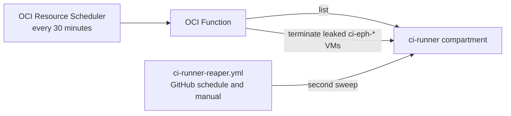

# OCI ephemeral runner reaper

This OCI Function terminates leaked `ci-eph-*` runner VMs in the `ci-runner` compartment every 30 minutes. It uses the OCI Resource Scheduler, so it does not depend on the GitHub Actions scheduler. From 2026-09-20 to 2026-10-07, GitHub ran the 30-minute `ci-runner-reaper.yml` schedule only 3 to 7 times per day.



## Reap rule

The rule is the same as the rule in `.github/workflows/ci-runner-reaper.yml`. The tests run the workflow filter and the handler on the same instances and require the same result.

The Function terminates an instance when all these conditions are true:

- The instance is `RUNNING` or `STOPPED`.
- The display name starts with `ci-eph-`.
- The instance is older than `MAX_AGE_HOURS` (default 2).
- The instance has no valid future `soak-deadline-epoch` tag.

A soak runner is exempt until its deadline. A tag value of Infinity, NaN, an overflowing number, an unparseable value, or a deadline more than 7 days ahead gives no exemption.

The GitHub workflow stays as a second sweep with the same rule. Termination is idempotent, so two sweeps do not conflict.

## Deploy

The Function runs in the `f1r3node-ci-schedulers` application of the soak scheduler. Deploy that application first.

```bash
scripts/oci/deploy-runner-reaper.sh
```

The script reads the compartment from the `CI_RUNNER_COMPARTMENT_OCID` literal in `ci-runner-reaper.yml`. If `OCI_COMPARTMENT_OCID` is set to a different value, the script stops. The Function therefore always reaps the same compartment as the GitHub reaper.

Optional settings:

| Variable | Default | Purpose |
|----------|---------|---------|
| `MAX_AGE_HOURS` | `2` | Minimum age of an instance that the Function terminates |
| `DRY_RUN` | `false` | When `true`, the Function lists leaked instances and terminates none |
| `SCHEDULE_CRON` | `*/30 * * * *` | UTC schedule of the sweep |

The `f1r3node-runner-reaper` policy lets the Function manage `instance-family` in the `ci-runner` compartment only. The runners use the same grant to terminate themselves (`ci-runner-ephemeral-policy`). The schedule can invoke only this Function.

For a first deployment, use `DRY_RUN=true`. Compare the result with a manual dry run of the GitHub workflow, then deploy again with `DRY_RUN=false`.

## Verify

Run the Bash tests from the repository root:

```bash
bash oci/runner-reaper/test-handler.sh
bash scripts/oci/test-fn-deploy.sh
```

The handler tests cover the reap rule, the parity with the workflow filter, the dry run, a failed termination, and a failed instance list. The deploy test runs the deploy scripts with stub `oci` and `docker` commands. It checks the compartment guard, the Function configuration, the schedule, and the IAM statements.

After deployment, invoke the Function once with a dry run:

```bash
oci fn function invoke --function-id '<function-ocid>' --file - --body '{"dry_run":true}'
```

The result has a `status` of `clean`, `dry_run`, `reaped`, or `partial`, and the counts `found`, `terminated`, `failed`, and `skipped`. A `partial` result exits with an error, so it appears in the invoke log of the `f1r3node-ci-schedulers` application.
