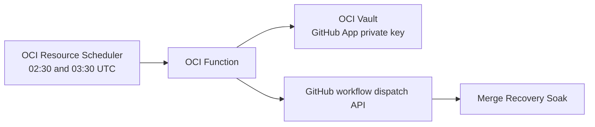

# OCI merge-recovery soak scheduler

This OCI Function replaces GitHub Actions `schedule` delivery for the merge-recovery soak. OCI Resource Scheduler invokes the Function at both UTC times that can represent 19:30 Pacific. A Bash handler in a custom Docker image dispatches GitHub only when the resolved slot is Monday through Friday at exactly 19:30 Pacific.



## GitHub App

Create or update a GitHub App installed only on `F1R3FLY-io/f1r3node-rust` with:

- Actions: read and write
- Metadata: read

Store its PEM private key in an OCI Vault secret. Record the App ID, installation ID, secret OCID, function compartment OCID, and subnet OCID. The deployment script never accepts the PEM contents directly.

## Deployment prerequisites

Before deployment:

1. Install and authenticate the OCI CLI and Docker.
2. Create or select an OCI compartment, an outbound-enabled subnet, an OCI Vault secret containing the GitHub App PEM, and an OCIR repository namespace.
3. Grant the deploying OCI principal permission to manage Functions, Resource Scheduler schedules, dynamic groups, policies, and the target OCIR repository.
4. Authenticate Docker to `<region>.ocir.io` using an OCI auth token.
5. Ensure the selected subnet can reach `api.github.com` over HTTPS.

The script honors `OCI_PROFILE` and `OCI_CLI_CONFIG_FILE`. `OCI_REGION`, `OCI_TENANCY_OCID`, and `OCIR_NAMESPACE` can override profile-derived values. Existing Function application subnets are immutable in OCI; the script fails with recreation instructions rather than silently retaining a different subnet.

## Deploy

```bash
export OCI_COMPARTMENT_OCID='<function-and-scheduler-compartment-ocid>'
export OCI_SUBNET_OCID='<outbound-enabled-subnet-ocid>'
export GITHUB_APP_ID='<github-app-id>'
export GITHUB_APP_INSTALLATION_ID='<github-app-installation-id>'
export GITHUB_APP_PRIVATE_KEY_SECRET_OCID='<vault-secret-ocid>'

scripts/oci/deploy-soak-scheduler.sh
```

The script builds and pushes the Bash/HotWrap Function image, creates or updates the Function, creates the 02:30 and 03:30 UTC schedules, and creates least-scope dynamic groups and IAM policy statements for Function invocation and Vault access. The image pins the OCI CLI and HotWrap base images by digest and contains the Bash, jq, curl, OpenSSL, and timezone tools used by the handler.

Use this cutover order:

1. Merge the workflow change through `dev` and promote it to `master`.
2. Confirm `merge-recovery-soak.yml` on `master` accepts `scheduled_slot_epoch`.
3. Run `scripts/oci/deploy-soak-scheduler.sh`.
4. Invoke the eligible Function payload manually and complete the verification below.
5. Confirm the cron path's slot dedup is on `master`: the GitHub `schedule`
   triggers stay enabled **permanently** as a late-delivered fallback. A cron
   run whose slot was already claimed by an OCI-dispatched run suppresses
   itself (the soak concurrency group cancels in-progress, so an undeduped
   late cron would kill a soak hours into its run); if the Function ever dies
   silently, the cron still soaks that night, hours late instead of not at
   all.

GitHub resolves `workflow_dispatch` from the configured `master` ref, so deploying before step 1 will fail against workflow inputs that do not yet exist.

## Verify

Run the Bash tests from the repository root:

```bash
bash oci/soak-scheduler/test-handler.sh
```

The tests cover PDT and PST selection, daily and weekend routing, weekend-day suppression, late invocation rejection, duplicate suppression, and the GitHub dispatch payloads.

For the live smoke test, invoke the currently eligible payload within 15 minutes of its UTC slot and confirm:

1. Exactly one run appears with `Merge Recovery Soak [scheduled:<epoch>]` as its title.
2. The schedule gate reports the same slot epoch and Pacific 19:30.
3. Invoking the same payload again reports `duplicate` and creates no second run.
4. The other UTC payload reports `ineligible`.

## Timing and failure behavior

- OCI schedules are UTC-only, so both UTC slots remain necessary across Pacific DST changes.
- Invocations more than 15 minutes late fail instead of launching an hours-late soak.
- Saturday and Sunday Pacific slots do not dispatch GitHub.
- The Function checks recent workflow titles before dispatching to suppress Resource Scheduler retries.
- The workflow independently preserves the intended slot epoch for duration, checkpoint, and restart calculations.
