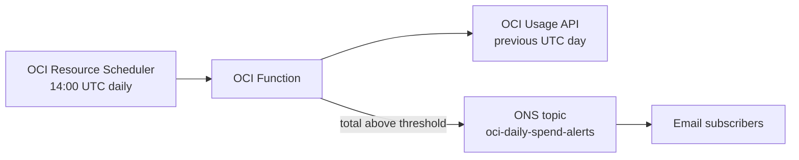

# OCI daily spend alert

This OCI Function sends an email when the tenancy spend for one UTC day is above a threshold. The default threshold is 70 USD. OCI budgets reset only monthly, so a budget alert cannot express a daily limit.



The alert is a report, not a control. It does not stop or terminate resources. The Usage API can lag by several hours, so the alert reports the previous day and the final figure can be higher. The monthly budgets `ci-runner-monthly` and `Monthly-Tenancy-Budget` stay in place.

## Create the topic

The topic uses the recipients of the existing monthly budget alerts. The recipient list stays in OCI and never enters this repository.

```bash
export COMPARTMENT_OCID='<ci-runner-compartment-ocid>'
tenancy="$(oci iam compartment list --query 'data[0]."compartment-id"' --raw-output)"
SUBSCRIBER_EMAILS="$(
	for budget in $(oci budgets budget budget list --compartment-id "$tenancy" --all \
		--target-type ALL --query 'data[].id' --raw-output | jq -r '.[]'); do
		oci budgets budget alert-rule list --budget-id "$budget" --all --output json |
			jq -r '.data[].recipients // empty'
	done | tr ',; ' '\n\n\n' | grep '@' | sort -u | paste -sd, -
)" TOPIC_NAME=oci-daily-spend-alerts scripts/oci/create-ons-topic.sh 2>/dev/null
```

The script prints the topic OCID. ONS sends a confirmation email to each recipient. A recipient gets alerts only after the recipient confirms.

## Deploy

The Function runs in the `f1r3node-ci-schedulers` application of the soak scheduler. Deploy that application first.

```bash
export OCI_COMPARTMENT_OCID='<ci-runner-compartment-ocid>'
export ONS_TOPIC_OCID='<topic-ocid-from-the-step-above>'
scripts/oci/deploy-spend-alert.sh
```

Optional settings:

| Variable | Default | Purpose |
|----------|---------|---------|
| `THRESHOLD_USD` | `70` | Daily tenancy spend above which the Function sends an email |
| `SCHEDULE_CRON` | `0 14 * * *` | UTC schedule of the check |

The script builds and pushes the image, creates or updates the Function and its schedule, and creates two dynamic groups and the `f1r3node-spend-alert` policy. The Function can read usage reports in the tenancy and publish to ONS topics in the compartment. The schedule can invoke only this Function.

To change the threshold, run the script again with a new `THRESHOLD_USD`.

## Verify

Run the Bash tests from the repository root:

```bash
bash oci/spend-alert/test-handler.sh
```

The tests cover the UTC day window, the alert above the threshold, and no alert at or below the threshold. They also cover a custom threshold. The handler must fail on missing cost data, on a Usage API error, and on a bad threshold.

After deployment, invoke the Function once:

```bash
oci fn function invoke --function-id '<function-ocid>' --file - --body '{}'
```

The result is `{"status":"alerted",...}` or `{"status":"under_threshold",...}`. Handler errors appear in the invoke log of the `f1r3node-ci-schedulers` application.
